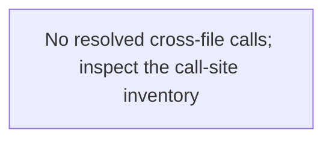

# conformance — generated atlas

[All packages](../../../../docs/architecture/generated/index.md) · [Maintained explanation](../README.md)

## Cargo targets

| Target | Kind | Entry |
|---|---|---|
| `conformance` | lib | [crates/conformance/src/lib.rs](../../src/lib.rs) |
| `session_endpoint` | test | [crates/conformance/tests/session_endpoint.rs](../../tests/session_endpoint.rs) |
| `slice11_gates` | test | [crates/conformance/tests/slice11_gates.rs](../../tests/slice11_gates.rs) |
| `slice14f_gates` | test | [crates/conformance/tests/slice14f_gates.rs](../../tests/slice14f_gates.rs) |
| `slice1_gates` | test | [crates/conformance/tests/slice1_gates.rs](../../tests/slice1_gates.rs) |
| `slice2_gates` | test | [crates/conformance/tests/slice2_gates.rs](../../tests/slice2_gates.rs) |
| `slice3_gates` | test | [crates/conformance/tests/slice3_gates.rs](../../tests/slice3_gates.rs) |
| `slice5_gates` | test | [crates/conformance/tests/slice5_gates.rs](../../tests/slice5_gates.rs) |
| `slice9_gates` | test | [crates/conformance/tests/slice9_gates.rs](../../tests/slice9_gates.rs) |

## Direct workspace dependencies

| Dependency | Kind | Target cfg |
|---|---|---|
| `endpoint` | normal | all |
| `engine` | normal | all |
| `profile` | normal | all |
| `schema` | normal | all |
| `store` | normal | all |
| `tekes-supervisor` | normal | all |
| `test-support` | normal | all |
| `transport` | normal | all |
| `worker-control` | normal | all |

[Public/restricted API and direct callers](api.md)

## Source files / lexical modules

`src` files have full symbol/call tables and partitioned function graphs. Integration tests and examples remain in the JSON inventory.
File-derived paths below are lexical navigation, not a compiler-resolved module tree; inline module declarations are listed separately.

| File | Symbols | Call sites | Detail |
|---|---:|---:|---|
| [crates/conformance/src/lib.rs](../../src/lib.rs) | 0 | 0 | [Symbols and calls](src--lib.md) |
| [crates/conformance/tests/session_endpoint.rs](../../tests/session_endpoint.rs) | 2 | 17 | `inventory.json` |
| [crates/conformance/tests/slice11_gates.rs](../../tests/slice11_gates.rs) | 39 | 449 | `inventory.json` |
| [crates/conformance/tests/slice14f_gates.rs](../../tests/slice14f_gates.rs) | 17 | 331 | `inventory.json` |
| [crates/conformance/tests/slice1_gates.rs](../../tests/slice1_gates.rs) | 33 | 568 | `inventory.json` |
| [crates/conformance/tests/slice2_gates.rs](../../tests/slice2_gates.rs) | 7 | 195 | `inventory.json` |
| [crates/conformance/tests/slice3_gates.rs](../../tests/slice3_gates.rs) | 3 | 42 | `inventory.json` |
| [crates/conformance/tests/slice5_gates.rs](../../tests/slice5_gates.rs) | 10 | 245 | `inventory.json` |
| [crates/conformance/tests/slice9_gates.rs](../../tests/slice9_gates.rs) | 23 | 393 | `inventory.json` |

## Cross-file direct calls

Source files stand in for out-of-line modules; see declarations for inline modules. Counts are syntactic call sites, not runtime frequency.

