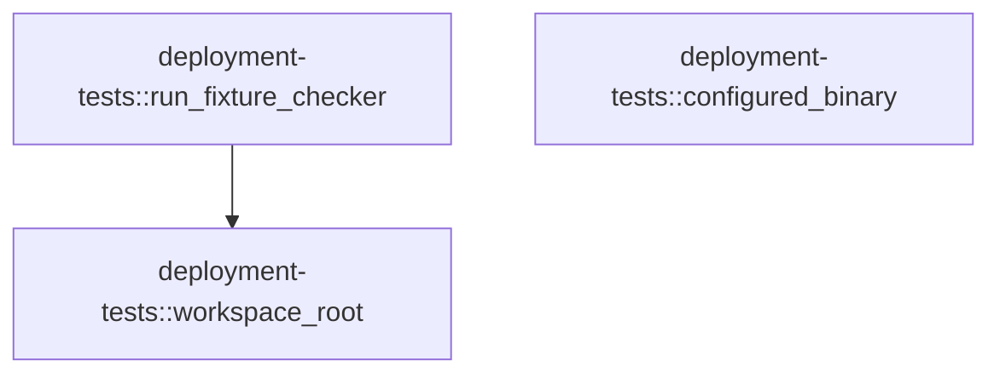

# deployment-tests

[Package atlas](index.md) · [Source](../../src/lib.rs)

## Declarations

Visibility is the declaration spelling; trait members and reexports require their enclosing interface. `cfg` is not evaluated.

| Symbol | Kind | Visibility | Test / cfg |
|---|---|---|---|
| [deployment-tests::SELECTOR_BIN_ENV](../../src/lib.rs#L4) | const_item | `pub` |  |
| [deployment-tests::SUPERVISOR_BIN_ENV](../../src/lib.rs#L5) | const_item | `pub` |  |
| [deployment-tests::WORKER_BIN_ENV](../../src/lib.rs#L6) | const_item | `pub` |  |
| [deployment-tests::HELPER_BIN_ENV](../../src/lib.rs#L7) | const_item | `pub` |  |
| [deployment-tests::RELEASE_VERSION_ENV](../../src/lib.rs#L8) | const_item | `pub` |  |
| [deployment-tests::workspace_root](../../src/lib.rs#L10) | function_item | `pub` |  |
| [deployment-tests::run_fixture_checker](../../src/lib.rs#L18) | function_item | `pub` |  |
| [deployment-tests::configured_binary](../../src/lib.rs#L26) | function_item | `pub` |  |

## Imports / reexports

| Local name | Source path | Visibility |
|---|---|---|
| `Path` | `std::path::Path` | `private` |
| `PathBuf` | `std::path::PathBuf` | `private` |
| `Command` | `std::process::Command` | `private` |
| `Output` | `std::process::Output` | `private` |

## Module declarations

| Module | Visibility | Attributes |
|---|---|---|

## Function call graphs

Edges below are syntactically resolved calls only, including private functions. Graphs partition callers into groups of 20; they are not execution order. All unresolved sites are listed below and in the JSON inventory.

Functions 1–3: 1 direct edges

## Call sites

Includes test functions (marked in declarations). Receiver-type-required sites need type analysis/manual tracing. Calls in closures are attributed to their enclosing function; their occurrence here does not mean the closure executes immediately.

| Caller | Callee expression | Source lines | Target / classification |
|---|---|---|---|
| `workspace_root` | `Path::new(env!("CARGO_MANIFEST_DIR"))         .parent()         .and_then(Path::parent)         .expect("deployment-tests lives under crates/")         .to_path_buf` | [11](../../src/lib.rs#L11) | receiver-type-required |
| `workspace_root` | `Path::new(env!("CARGO_MANIFEST_DIR"))         .parent()         .and_then(Path::parent)         .expect` | [11](../../src/lib.rs#L11) | receiver-type-required |
| `workspace_root` | `Path::new(env!("CARGO_MANIFEST_DIR"))         .parent()         .and_then` | [11](../../src/lib.rs#L11) | receiver-type-required |
| `workspace_root` | `Path::new(env!("CARGO_MANIFEST_DIR"))         .parent` | [11](../../src/lib.rs#L11) | receiver-type-required |
| `workspace_root` | `Path::new` | [11](../../src/lib.rs#L11) | external-constructor-callback-or-unresolved |
| `run_fixture_checker` | `Command::new("python3")         .arg(workspace_root().join("scripts/check-deployment-fixtures.py"))         .current_dir(workspace_root())         .output()         .expect` | [19](../../src/lib.rs#L19) | receiver-type-required |
| `run_fixture_checker` | `Command::new("python3")         .arg(workspace_root().join("scripts/check-deployment-fixtures.py"))         .current_dir(workspace_root())         .output` | [19](../../src/lib.rs#L19) | receiver-type-required |
| `run_fixture_checker` | `Command::new("python3")         .arg(workspace_root().join("scripts/check-deployment-fixtures.py"))         .current_dir` | [19](../../src/lib.rs#L19) | receiver-type-required |
| `run_fixture_checker` | `Command::new("python3")         .arg` | [19](../../src/lib.rs#L19) | receiver-type-required |
| `run_fixture_checker` | `Command::new` | [19](../../src/lib.rs#L19) | external-constructor-callback-or-unresolved |
| `run_fixture_checker` | `workspace_root().join` | [20](../../src/lib.rs#L20) | receiver-type-required |
| `run_fixture_checker` | `workspace_root` | [20](../../src/lib.rs#L20), [21](../../src/lib.rs#L21) | [deployment-tests::workspace_root](../../src/lib.rs#L10) |
| `configured_binary` | `std::env::var_os(variable).map` | [27](../../src/lib.rs#L27) | receiver-type-required |
| `configured_binary` | `std::env::var_os` | [27](../../src/lib.rs#L27) | external-constructor-callback-or-unresolved |
