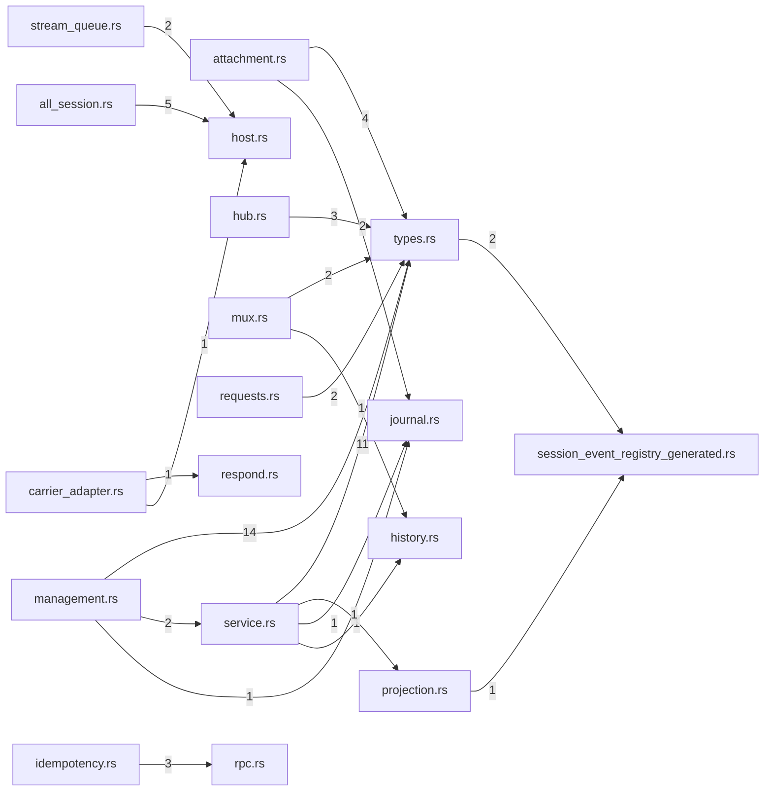

# endpoint — generated atlas

[All packages](../../../../docs/architecture/generated/index.md) · [Maintained explanation](../README.md)

## Cargo targets

| Target | Kind | Entry |
|---|---|---|
| `endpoint` | lib | [crates/endpoint/src/lib.rs](../../src/lib.rs) |
| `automatic_title` | test | [crates/endpoint/tests/automatic_title.rs](../../tests/automatic_title.rs) |
| `legacy_replay` | test | [crates/endpoint/tests/legacy_replay.rs](../../tests/legacy_replay.rs) |
| `session_endpoint` | test | [crates/endpoint/tests/session_endpoint.rs](../../tests/session_endpoint.rs) |
| `session_notice` | test | [crates/endpoint/tests/session_notice.rs](../../tests/session_notice.rs) |
| `slice6_gates` | test | [crates/endpoint/tests/slice6_gates.rs](../../tests/slice6_gates.rs) |
| `slice9_lower_seam` | test | [crates/endpoint/tests/slice9_lower_seam.rs](../../tests/slice9_lower_seam.rs) |
| `submission_intent` | test | [crates/endpoint/tests/submission_intent.rs](../../tests/submission_intent.rs) |

## Direct workspace dependencies

| Dependency | Kind | Target cfg |
|---|---|---|
| `profile` | normal | all |
| `schema` | normal | all |
| `store` | normal | all |
| `tools` | normal | all |
| `test-support` | dev | all |

[Public/restricted API and direct callers](api.md)

## Source files / lexical modules

`src` files have full symbol/call tables and partitioned function graphs. Integration tests and examples remain in the JSON inventory.
File-derived paths below are lexical navigation, not a compiler-resolved module tree; inline module declarations are listed separately.

| File | Symbols | Call sites | Detail |
|---|---:|---:|---|
| [crates/endpoint/src/all_session.rs](../../src/all_session.rs) | 23 | 149 | [Symbols and calls](src--all_session.md) |
| [crates/endpoint/src/approval_policy.rs](../../src/approval_policy.rs) | 9 | 6 | [Symbols and calls](src--approval_policy.md) |
| [crates/endpoint/src/attachment.rs](../../src/attachment.rs) | 91 | 879 | [Symbols and calls](src--attachment.md) |
| [crates/endpoint/src/carrier_adapter.rs](../../src/carrier_adapter.rs) | 40 | 227 | [Symbols and calls](src--carrier_adapter.md) |
| [crates/endpoint/src/client_wire.rs](../../src/client_wire.rs) | 8 | 22 | [Symbols and calls](src--client_wire.md) |
| [crates/endpoint/src/history.rs](../../src/history.rs) | 6 | 65 | [Symbols and calls](src--history.md) |
| [crates/endpoint/src/host.rs](../../src/host.rs) | 67 | 115 | [Symbols and calls](src--host.md) |
| [crates/endpoint/src/hub.rs](../../src/hub.rs) | 42 | 219 | [Symbols and calls](src--hub.md) |
| [crates/endpoint/src/idempotency.rs](../../src/idempotency.rs) | 35 | 418 | [Symbols and calls](src--idempotency.md) |
| [crates/endpoint/src/journal.rs](../../src/journal.rs) | 33 | 343 | [Symbols and calls](src--journal.md) |
| [crates/endpoint/src/lib.rs](../../src/lib.rs) | 0 | 0 | [Symbols and calls](src--lib.md) |
| [crates/endpoint/src/management.rs](../../src/management.rs) | 161 | 2247 | [Symbols and calls](src--management.md) |
| [crates/endpoint/src/mux.rs](../../src/mux.rs) | 50 | 170 | [Symbols and calls](src--mux.md) |
| [crates/endpoint/src/projection.rs](../../src/projection.rs) | 42 | 744 | [Symbols and calls](src--projection.md) |
| [crates/endpoint/src/requests.rs](../../src/requests.rs) | 17 | 74 | [Symbols and calls](src--requests.md) |
| [crates/endpoint/src/respond.rs](../../src/respond.rs) | 17 | 133 | [Symbols and calls](src--respond.md) |
| [crates/endpoint/src/rpc.rs](../../src/rpc.rs) | 25 | 72 | [Symbols and calls](src--rpc.md) |
| [crates/endpoint/src/service.rs](../../src/service.rs) | 54 | 379 | [Symbols and calls](src--service.md) |
| [crates/endpoint/src/session_event_registry_generated.rs](../../src/session_event_registry_generated.rs) | 8 | 7 | [Symbols and calls](src--session_event_registry_generated.md) |
| [crates/endpoint/src/stitch.rs](../../src/stitch.rs) | 4 | 36 | [Symbols and calls](src--stitch.md) |
| [crates/endpoint/src/stream_queue.rs](../../src/stream_queue.rs) | 11 | 57 | [Symbols and calls](src--stream_queue.md) |
| [crates/endpoint/src/types.rs](../../src/types.rs) | 11 | 55 | [Symbols and calls](src--types.md) |
| [crates/endpoint/tests/automatic_title.rs](../../tests/automatic_title.rs) | 5 | 47 | `inventory.json` |
| [crates/endpoint/tests/legacy_replay.rs](../../tests/legacy_replay.rs) | 2 | 126 | `inventory.json` |
| [crates/endpoint/tests/session_endpoint.rs](../../tests/session_endpoint.rs) | 10 | 100 | `inventory.json` |
| [crates/endpoint/tests/session_notice.rs](../../tests/session_notice.rs) | 4 | 39 | `inventory.json` |
| [crates/endpoint/tests/slice6_gates.rs](../../tests/slice6_gates.rs) | 10 | 262 | `inventory.json` |
| [crates/endpoint/tests/slice9_lower_seam.rs](../../tests/slice9_lower_seam.rs) | 21 | 215 | `inventory.json` |
| [crates/endpoint/tests/submission_intent.rs](../../tests/submission_intent.rs) | 2 | 113 | `inventory.json` |

## Cross-file direct calls

Source files stand in for out-of-line modules; see declarations for inline modules. Counts are syntactic call sites, not runtime frequency.

