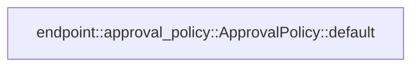

# endpoint::approval_policy

[Package atlas](index.md) · [Source](../../src/approval_policy.rs)

## Declarations

Visibility is the declaration spelling; trait members and reexports require their enclosing interface. `cfg` is not evaluated.

| Symbol | Kind | Visibility | Test / cfg |
|---|---|---|---|
| [endpoint::approval_policy::PERMISSION_MODE_READ_ONLY](../../src/approval_policy.rs#L12) | const_item | `pub` |  |
| [endpoint::approval_policy::PERMISSION_MODE_WORKSPACE_WRITE](../../src/approval_policy.rs#L13) | const_item | `pub` |  |
| [endpoint::approval_policy::PERMISSION_MODE_DANGER_FULL_ACCESS](../../src/approval_policy.rs#L14) | const_item | `pub` |  |
| [endpoint::approval_policy::PERMISSION_MODE_IDS](../../src/approval_policy.rs#L18) | const_item | `pub` |  |
| [endpoint::approval_policy::ApprovalOption](../../src/approval_policy.rs#L26) | struct_item | `pub` |  |
| [endpoint::approval_policy::ServerApprovalState](../../src/approval_policy.rs#L34) | struct_item | `pub` |  |
| [endpoint::approval_policy::ApprovalPolicy](../../src/approval_policy.rs#L43) | struct_item | `pub` |  |
| [endpoint::approval_policy::ApprovalPolicy::default](../../src/approval_policy.rs#L49) | function_item | `private` |  |
| [endpoint::approval_policy::tests::wire_policy_declares_three_thread_modes_and_no_server_value](../../src/approval_policy.rs#L84) | function_item | `private` | test; #[cfg(test)] |

## Imports / reexports

| Local name | Source path | Visibility |
|---|---|---|
| `Serialize` | `serde::Serialize` | `private` |
| `*` | `super::*` | `private` |

## Module declarations

| Module | Visibility | Attributes |
|---|---|---|
| `endpoint::approval_policy::tests` | `private` | #[cfg(test)] |

## Function call graphs

Edges below are syntactically resolved calls only, including private functions. Graphs partition callers into groups of 20; they are not execution order. All unresolved sites are listed below and in the JSON inventory.

Functions 1–1: 0 direct edges

## Call sites

Includes test functions (marked in declarations). Receiver-type-required sites need type analysis/manual tracing. Calls in closures are attributed to their enclosing function; their occurrence here does not mean the closure executes immediately.

| Caller | Callee expression | Source lines | Target / classification |
|---|---|---|---|
| `default` | `Vec::new` | [72](../../src/approval_policy.rs#L72) | external-constructor-callback-or-unresolved |
| `wire_policy_declares_three_thread_modes_and_no_server_value` | `serde_json::to_value(ApprovalPolicy::default()).expect` | [85](../../src/approval_policy.rs#L85) | receiver-type-required |
| `wire_policy_declares_three_thread_modes_and_no_server_value` | `serde_json::to_value` | [85](../../src/approval_policy.rs#L85) | external-constructor-callback-or-unresolved |
| `wire_policy_declares_three_thread_modes_and_no_server_value` | `ApprovalPolicy::default` | [85](../../src/approval_policy.rs#L85) | external-constructor-callback-or-unresolved |
| `wire_policy_declares_three_thread_modes_and_no_server_value` | `value["threadLevel"].as_array().expect` | [86](../../src/approval_policy.rs#L86) | receiver-type-required |
| `wire_policy_declares_three_thread_modes_and_no_server_value` | `value["threadLevel"].as_array` | [86](../../src/approval_policy.rs#L86) | receiver-type-required |
