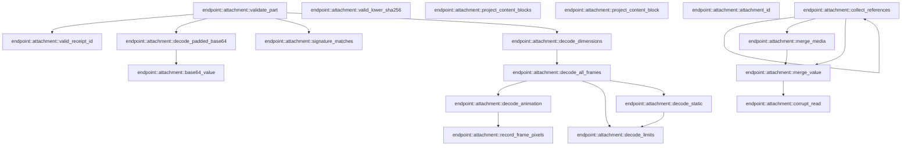

# endpoint::attachment

[Package atlas](index.md) · [Source](../../src/attachment.rs)

## Declarations

Visibility is the declaration spelling; trait members and reexports require their enclosing interface. `cfg` is not evaluated.

| Symbol | Kind | Visibility | Test / cfg |
|---|---|---|---|
| [endpoint::attachment::MAX_ATTACHMENT_BYTES](../../src/attachment.rs#L24) | const_item | `pub` |  |
| [endpoint::attachment::DEFAULT_FILE_MEDIA_TYPE](../../src/attachment.rs#L25) | const_item | `pub` |  |
| [endpoint::attachment::UPLOADS_DIR](../../src/attachment.rs#L26) | const_item | `pub` |  |
| [endpoint::attachment::MAX_IMAGE_DIMENSION](../../src/attachment.rs#L27) | const_item | `pub` |  |
| [endpoint::attachment::MAX_IMAGE_PIXELS](../../src/attachment.rs#L28) | const_item | `pub` |  |
| [endpoint::attachment::MAX_DECODE_ALLOCATION](../../src/attachment.rs#L30) | const_item | `private` |  |
| [endpoint::attachment::AttachmentPolicy](../../src/attachment.rs#L35) | struct_item | `pub` |  |
| [endpoint::attachment::AttachmentPolicy::default](../../src/attachment.rs#L43) | function_item | `private` |  |
| [endpoint::attachment::ImageMediaType](../../src/attachment.rs#L54) | enum_item | `pub` |  |
| [endpoint::attachment::ImageMediaType::as_str](../../src/attachment.rs#L67) | function_item | `pub` |  |
| [endpoint::attachment::ImageMediaType::image_format](../../src/attachment.rs#L76) | function_item | `private` |  |
| [endpoint::attachment::ImageMediaType::parse](../../src/attachment.rs#L85) | function_item | `private` |  |
| [endpoint::attachment::PromptPart](../../src/attachment.rs#L98) | enum_item | `pub` |  |
| [endpoint::attachment::AttachmentErrorReason](../../src/attachment.rs#L114) | enum_item | `pub` |  |
| [endpoint::attachment::ImageAttachmentRef](../../src/attachment.rs#L129) | struct_item | `pub` |  |
| [endpoint::attachment::ImageAttachment](../../src/attachment.rs#L141) | struct_item | `pub` |  |
| [endpoint::attachment::FileAttachmentRef](../../src/attachment.rs#L149) | struct_item | `pub` |  |
| [endpoint::attachment::FileAttachment](../../src/attachment.rs#L158) | struct_item | `pub` |  |
| [endpoint::attachment::UploadedFile](../../src/attachment.rs#L166) | struct_item | `pub` |  |
| [endpoint::attachment::UploadReceipt](../../src/attachment.rs#L174) | struct_item | `pub` |  |
| [endpoint::attachment::UploadReceiptRecord](../../src/attachment.rs#L182) | struct_item | `private` |  |
| [endpoint::attachment::MaterializedPrompt](../../src/attachment.rs#L193) | struct_item | `pub` |  |
| [endpoint::attachment::PromptMaterializeError](../../src/attachment.rs#L200) | enum_item | `pub` |  |
| [endpoint::attachment::AttachmentReadError](../../src/attachment.rs#L220) | enum_item | `pub` |  |
| [endpoint::attachment::AttachmentAuthority](../../src/attachment.rs#L236) | struct_item | `pub` |  |
| [endpoint::attachment::AttachmentAuthority::open](../../src/attachment.rs#L242) | function_item | `pub` |  |
| [endpoint::attachment::AttachmentAuthority::materialize_prompt_parts](../../src/attachment.rs#L251) | function_item | `pub` |  |
| [endpoint::attachment::AttachmentAuthority::publish_validated](../../src/attachment.rs#L267) | function_item | `private` |  |
| [endpoint::attachment::AttachmentAuthority::upload_file](../../src/attachment.rs#L354) | function_item | `pub` |  |
| [endpoint::attachment::AttachmentAuthority::read_authorized_file](../../src/attachment.rs#L433) | function_item | `pub` |  |
| [endpoint::attachment::AttachmentAuthority::read_authorized](../../src/attachment.rs#L515) | function_item | `pub` |  |
| [endpoint::attachment::AttachmentAuthority::active_folder_for_prompt](../../src/attachment.rs#L614) | function_item | `private` |  |
| [endpoint::attachment::AttachmentAuthority::active_folder_for_read](../../src/attachment.rs#L630) | function_item | `private` |  |
| [endpoint::attachment::ValidatedPart](../../src/attachment.rs#L642) | enum_item | `private` |  |
| [endpoint::attachment::valid_receipt_id](../../src/attachment.rs#L648) | function_item | `private` |  |
| [endpoint::attachment::valid_file_name](../../src/attachment.rs#L653) | function_item | `private` |  |
| [endpoint::attachment::normalize_media_type](../../src/attachment.rs#L661) | function_item | `private` |  |
| [endpoint::attachment::load_receipt](../../src/attachment.rs#L691) | function_item | `private` |  |
| [endpoint::attachment::FileReference](../../src/attachment.rs#L708) | struct_item | `private` |  |
| [endpoint::attachment::collect_file_reference](../../src/attachment.rs#L714) | function_item | `private` |  |
| [endpoint::attachment::receipt_reference](../../src/attachment.rs#L750) | function_item | `private` |  |
| [endpoint::attachment::rfc3339_millis_now](../../src/attachment.rs#L785) | function_item | `private` |  |
| [endpoint::attachment::rfc3339_from_millis](../../src/attachment.rs#L792) | function_item | `private` |  |
| [endpoint::attachment::ValidatedImage](../../src/attachment.rs#L815) | struct_item | `private` |  |
| [endpoint::attachment::validate_part](../../src/attachment.rs#L823) | function_item | `private` |  |
| [endpoint::attachment::decode_padded_base64](../../src/attachment.rs#L863) | function_item | `private` |  |
| [endpoint::attachment::base64_value](../../src/attachment.rs#L908) | function_item | `private` |  |
| [endpoint::attachment::signature_matches](../../src/attachment.rs#L919) | function_item | `private` |  |
| [endpoint::attachment::decode_dimensions](../../src/attachment.rs#L930) | function_item | `private` |  |
| [endpoint::attachment::decode_all_frames](../../src/attachment.rs#L951) | function_item | `private` |  |
| [endpoint::attachment::decode_static](../../src/attachment.rs#L993) | function_item | `private` |  |
| [endpoint::attachment::decode_animation](../../src/attachment.rs#L1009) | function_item | `private` |  |
| [endpoint::attachment::record_frame_pixels](../../src/attachment.rs#L1027) | function_item | `private` |  |
| [endpoint::attachment::decode_limits](../../src/attachment.rs#L1044) | function_item | `private` |  |
| [endpoint::attachment::ReferenceExpectation](../../src/attachment.rs#L1053) | struct_item | `private` |  |
| [endpoint::attachment::collect_references](../../src/attachment.rs#L1061) | function_item | `private` |  |
| [endpoint::attachment::merge_media](../../src/attachment.rs#L1123) | function_item | `private` |  |
| [endpoint::attachment::merge_value](../../src/attachment.rs#L1130) | function_item | `private` |  |
| [endpoint::attachment::corrupt_read](../../src/attachment.rs#L1138) | function_item | `private` |  |
| [endpoint::attachment::valid_lower_sha256](../../src/attachment.rs#L1142) | function_item | `private` |  |
| [endpoint::attachment::project_content_blocks](../../src/attachment.rs#L1154) | function_item | `pub` |  |
| [endpoint::attachment::project_content_block](../../src/attachment.rs#L1161) | function_item | `private` |  |
| [endpoint::attachment::attachment_id](../../src/attachment.rs#L1190) | function_item | `private` |  |
| [endpoint::attachment::tests::SESSION](../../src/attachment.rs#L1206) | const_item | `private` | test; #[cfg(test)] |
| [endpoint::attachment::tests::OTHER_SESSION](../../src/attachment.rs#L1207) | const_item | `private` | test; #[cfg(test)] |
| [endpoint::attachment::tests::four_declared_formats_are_fully_decoded_and_materialized](../../src/attachment.rs#L1210) | function_item | `private` | test; #[cfg(test)] |
| [endpoint::attachment::tests::animated_gif_decodes_every_frame_and_rejects_a_broken_later_frame](../../src/attachment.rs#L1253) | function_item | `private` | test; #[cfg(test)] |
| [endpoint::attachment::tests::cumulative_animation_pixels_are_bounded](../../src/attachment.rs#L1269) | function_item | `private` | test; #[cfg(test)] |
| [endpoint::attachment::tests::prompt_validation_is_ordered_and_publishes_nothing_on_failure](../../src/attachment.rs#L1287) | function_item | `private` | test; #[cfg(test)] |
| [endpoint::attachment::tests::size_signature_decode_and_dimension_failures_are_distinct](../../src/attachment.rs#L1322) | function_item | `private` | test; #[cfg(test)] |
| [endpoint::attachment::tests::read_requires_a_reference_in_the_selected_session_and_revalidates_asset](../../src/attachment.rs#L1342) | function_item | `private` | test; #[cfg(test)] |
| [endpoint::attachment::tests::endpoint_journal_reference_authorizes_the_selected_session](../../src/attachment.rs#L1379) | function_item | `private` | test; #[cfg(test)] |
| [endpoint::attachment::tests::corrupt_asset_is_not_returned_even_when_referenced](../../src/attachment.rs#L1430) | function_item | `private` | test; #[cfg(test)] |
| [endpoint::attachment::tests::archive_between_validation_and_publication_cannot_recreate_active_folder](../../src/attachment.rs#L1465) | function_item | `private` | test; #[cfg(test)] |
| [endpoint::attachment::tests::FILE_BYTES](../../src/attachment.rs#L1509) | const_item | `private` | test; #[cfg(test)] |
| [endpoint::attachment::tests::upload](../../src/attachment.rs#L1511) | function_item | `private` | test; #[cfg(test)] |
| [endpoint::attachment::tests::file_reason](../../src/attachment.rs#L1517) | function_item | `private` | test; #[cfg(test)] |
| [endpoint::attachment::tests::upload_file_publishes_asset_and_durable_receipt](../../src/attachment.rs#L1525) | function_item | `private` | test; #[cfg(test)] |
| [endpoint::attachment::tests::upload_file_rejects_every_invalid_request_without_publishing](../../src/attachment.rs#L1587) | function_item | `private` | test; #[cfg(test)] |
| [endpoint::attachment::tests::file_receipt_part_materializes_a_file_block](../../src/attachment.rs#L1689) | function_item | `private` | test; #[cfg(test)] |
| [endpoint::attachment::tests::unknown_cross_session_and_archived_receipts_are_rejected](../../src/attachment.rs#L1750) | function_item | `private` | test; #[cfg(test)] |
| [endpoint::attachment::tests::read_authorized_file_requires_a_file_block_or_receipt_reference](../../src/attachment.rs#L1828) | function_item | `private` | test; #[cfg(test)] |
| [endpoint::attachment::tests::endpoint_journal_file_block_authorizes_file_read](../../src/attachment.rs#L1918) | function_item | `private` | test; #[cfg(test)] |
| [endpoint::attachment::tests::file_blocks_project_to_public_attachment_references](../../src/attachment.rs#L1954) | function_item | `private` | test; #[cfg(test)] |
| [endpoint::attachment::tests::rfc3339_formatter_matches_known_instants](../../src/attachment.rs#L1974) | function_item | `private` | test; #[cfg(test)] |
| [endpoint::attachment::tests::encoded_image](../../src/attachment.rs#L1990) | function_item | `private` | test; #[cfg(test)] |
| [endpoint::attachment::tests::animated_gif](../../src/attachment.rs#L1997) | function_item | `private` | test; #[cfg(test)] |
| [endpoint::attachment::tests::create_session](../../src/attachment.rs#L2008) | function_item | `private` | test; #[cfg(test)] |
| [endpoint::attachment::tests::append_input](../../src/attachment.rs#L2039) | function_item | `private` | test; #[cfg(test)] |
| [endpoint::attachment::tests::input_event](../../src/attachment.rs#L2046) | function_item | `private` | test; #[cfg(test)] |
| [endpoint::attachment::tests::canonical_line](../../src/attachment.rs#L2064) | function_item | `private` | test; #[cfg(test)] |

## Imports / reexports

| Local name | Source path | Visibility |
|---|---|---|
| `fs` | `std::fs` | `private` |
| `Cursor` | `std::io::Cursor` | `private` |
| `Path` | `std::path::Path` | `private` |
| `PathBuf` | `std::path::PathBuf` | `private` |
| `SystemTime` | `std::time::SystemTime` | `private` |
| `UNIX_EPOCH` | `std::time::UNIX_EPOCH` | `private` |
| `_` | `base64::Engine` | `private` |
| `BASE64` | `base64::engine::general_purpose::STANDARD` | `private` |
| `GifDecoder` | `image::codecs::gif::GifDecoder` | `private` |
| `PngDecoder` | `image::codecs::png::PngDecoder` | `private` |
| `WebPDecoder` | `image::codecs::webp::WebPDecoder` | `private` |
| `AnimationDecoder` | `image::AnimationDecoder` | `private` |
| `ImageDecoder` | `image::ImageDecoder` | `private` |
| `ImageFormat` | `image::ImageFormat` | `private` |
| `ImageReader` | `image::ImageReader` | `private` |
| `Limits` | `image::Limits` | `private` |
| `Block` | `schema::Block` | `private` |
| `Deserialize` | `serde::Deserialize` | `private` |
| `Serialize` | `serde::Serialize` | `private` |
| `Value` | `serde_json::Value` | `private` |
| `Digest` | `sha2::Digest` | `private` |
| `Sha256` | `sha2::Sha256` | `private` |
| `AssetStore` | `store::AssetStore` | `private` |
| `AtomicPublisher` | `store::AtomicPublisher` | `private` |
| `DirectoryLock` | `store::DirectoryLock` | `private` |
| `StoreError` | `store::StoreError` | `private` |
| `scan_valid_prefix` | `store::scan_valid_prefix` | `private` |
| `Error` | `thiserror::Error` | `private` |
| `EndpointJournal` | `crate::EndpointJournal` | `private` |
| `JournalError` | `crate::JournalError` | `private` |
| `validate_session_id` | `crate::validate_session_id` | `private` |
| `Cursor` | `std::io::Cursor` | `private` |
| `GifEncoder` | `image::codecs::gif::GifEncoder` | `private` |
| `DynamicImage` | `image::DynamicImage` | `private` |
| `Frame` | `image::Frame` | `private` |
| `GrayImage` | `image::GrayImage` | `private` |
| `RgbaImage` | `image::RgbaImage` | `private` |
| `IJsonValue` | `schema::IJsonValue` | `private` |
| `json` | `serde_json::json` | `private` |
| `*` | `super::*` | `private` |
| `SessionEvent` | `crate::SessionEvent` | `private` |
| `SurfaceOperation` | `crate::SurfaceOperation` | `private` |

## Module declarations

| Module | Visibility | Attributes |
|---|---|---|
| `endpoint::attachment::tests` | `private` | #[cfg(test)] |

## Function call graphs

Edges below are syntactically resolved calls only, including private functions. Graphs partition callers into groups of 20; they are not execution order. All unresolved sites are listed below and in the JSON inventory.

```mermaid
flowchart TD
  n0["endpoint::attachment::collect_references"]
  n1["endpoint::attachment::valid_lower_sha256"]
  n2["endpoint::attachment::attachment_id"]
  n3["endpoint::attachment::AttachmentAuthority::open"]
  n4["endpoint::attachment::AttachmentAuthority::materialize_prompt_parts"]
  n5["endpoint::attachment::AttachmentAuthority::publish_validated"]
  n6["endpoint::attachment::AttachmentAuthority::upload_file"]
  n7["endpoint::attachment::AttachmentAuthority::read_authorized_file"]
  n8["endpoint::attachment::AttachmentPolicy::default"]
  n9["endpoint::attachment::AttachmentAuthority::read_authorized"]
  n10["endpoint::attachment::AttachmentAuthority::active_folder_for_prompt"]
  n11["endpoint::attachment::AttachmentAuthority::active_folder_for_read"]
  n12["endpoint::attachment::valid_receipt_id"]
  n13["endpoint::attachment::valid_file_name"]
  n14["endpoint::attachment::normalize_media_type"]
  n15["endpoint::attachment::ImageMediaType::as_str"]
  n16["endpoint::attachment::load_receipt"]
  n17["endpoint::attachment::collect_file_reference"]
  n18["endpoint::attachment::receipt_reference"]
  n19["endpoint::attachment::ImageMediaType::image_format"]
  n20["endpoint::attachment::rfc3339_millis_now"]
  n21["endpoint::attachment::rfc3339_from_millis"]
  n22["endpoint::attachment::validate_part"]
  n23["endpoint::attachment::ImageMediaType::parse"]
  n24["endpoint::attachment::decode_padded_base64"]
  n25["endpoint::attachment::signature_matches"]
  n26["endpoint::attachment::decode_dimensions"]
  n27["endpoint::journal::EndpointJournal::open"]
  n28["endpoint::types::validate_session_id"]
  n29["store::asset::AssetStore::new"]
  n30["store::atomic::AtomicPublisher::replace"]
  n31["store::platform::DirectoryLock::shared"]
  n32["store::tail::scan_valid_prefix"]
  n4 --> n5
  n4 --> n22
  n4 --> n28
  n5 --> n1
  n5 --> n2
  n5 --> n10
  n5 --> n16
  n5 --> n29
  n5 --> n31
  n6 --> n10
  n6 --> n13
  n6 --> n14
  n6 --> n20
  n6 --> n23
  n6 --> n24
  n6 --> n28
  n6 --> n29
  n6 --> n30
  n6 --> n31
  n7 --> n1
  n7 --> n11
  n7 --> n17
  n7 --> n18
  n7 --> n27
  n7 --> n28
  n7 --> n29
  n7 --> n32
  n9 --> n0
  n9 --> n1
  n9 --> n11
  n9 --> n25
  n9 --> n26
  n9 --> n27
  n9 --> n28
  n9 --> n29
  n9 --> n32
  n17 --> n17
  n20 --> n21
```

Functions 1–20: 38 direct edges

Functions 21–38: 16 direct edges

## Call sites

Includes test functions (marked in declarations). Receiver-type-required sites need type analysis/manual tracing. Calls in closures are attributed to their enclosing function; their occurrence here does not mean the closure executes immediately.

| Caller | Callee expression | Source lines | Target / classification |
|---|---|---|---|
| `parse` | `Some` | [87](../../src/attachment.rs#L87), [88](../../src/attachment.rs#L88), [89](../../src/attachment.rs#L89), [90](../../src/attachment.rs#L90) | external-constructor-callback-or-unresolved |
| `open` | `storage_root.as_ref().to_path_buf` | [244](../../src/attachment.rs#L244) | receiver-type-required |
| `open` | `storage_root.as_ref` | [244](../../src/attachment.rs#L244) | receiver-type-required |
| `materialize_prompt_parts` | `validate_session_id` | [256](../../src/attachment.rs#L256) | [endpoint::types::validate_session_id](../../src/types.rs#L130) |
| `materialize_prompt_parts` | `parts.is_empty` | [257](../../src/attachment.rs#L257) | receiver-type-required |
| `materialize_prompt_parts` | `Err` | [258](../../src/attachment.rs#L258) | external-constructor-callback-or-unresolved |
| `materialize_prompt_parts` | `Vec::with_capacity` | [260](../../src/attachment.rs#L260) | external-constructor-callback-or-unresolved |
| `materialize_prompt_parts` | `parts.len` | [260](../../src/attachment.rs#L260) | receiver-type-required |
| `materialize_prompt_parts` | `validated.push` | [262](../../src/attachment.rs#L262) | receiver-type-required |
| `materialize_prompt_parts` | `validate_part` | [262](../../src/attachment.rs#L262) | [endpoint::attachment::validate_part](../../src/attachment.rs#L823) |
| `materialize_prompt_parts` | `self.publish_validated` | [264](../../src/attachment.rs#L264) | [endpoint::attachment::AttachmentAuthority::publish_validated](../../src/attachment.rs#L267) |
| `publish_validated` | `self.storage_root.join("threads").join` | [272](../../src/attachment.rs#L272) | receiver-type-required |
| `publish_validated` | `self.storage_root.join` | [272](../../src/attachment.rs#L272) | receiver-type-required |
| `publish_validated` | `DirectoryLock::shared` | [273](../../src/attachment.rs#L273) | [store::platform::DirectoryLock::shared](../../../store/src/platform.rs#L58) |
| `publish_validated` | `self.active_folder_for_prompt` | [276](../../src/attachment.rs#L276), [282](../../src/attachment.rs#L282) | [endpoint::attachment::AttachmentAuthority::active_folder_for_prompt](../../src/attachment.rs#L614) |
| `publish_validated` | `Err` | [277](../../src/attachment.rs#L277), [278](../../src/attachment.rs#L278), [284](../../src/attachment.rs#L284), [309](../../src/attachment.rs#L309) | external-constructor-callback-or-unresolved |
| `publish_validated` | `PromptMaterializeError::Store` | [278](../../src/attachment.rs#L278) | external-constructor-callback-or-unresolved |
| `publish_validated` | `lifecycle.path` | [283](../../src/attachment.rs#L283) | receiver-type-required |
| `publish_validated` | `PromptMaterializeError::SessionNotFound` | [284](../../src/attachment.rs#L284) | external-constructor-callback-or-unresolved |
| `publish_validated` | `session_id.to_owned` | [285](../../src/attachment.rs#L285) | receiver-type-required |
| `publish_validated` | `AssetStore::new` | [288](../../src/attachment.rs#L288) | [store::asset::AssetStore::new](../../../store/src/asset.rs#L27) |
| `publish_validated` | `folder.join` | [288](../../src/attachment.rs#L288) | receiver-type-required |
| `publish_validated` | `Vec::with_capacity` | [289](../../src/attachment.rs#L289) | external-constructor-callback-or-unresolved |
| `publish_validated` | `validated.len` | [289](../../src/attachment.rs#L289) | receiver-type-required |
| `publish_validated` | `Vec::new` | [290](../../src/attachment.rs#L290), [291](../../src/attachment.rs#L291) | external-constructor-callback-or-unresolved |
| `publish_validated` | `blocks.push` | [294](../../src/attachment.rs#L294), [319](../../src/attachment.rs#L319), [336](../../src/attachment.rs#L336) | receiver-type-required |
| `publish_validated` | `load_receipt` | [296](../../src/attachment.rs#L296) | [endpoint::attachment::load_receipt](../../src/attachment.rs#L691) |
| `publish_validated` | `receipt                         .attachment_id                         .strip_prefix("sha256:")                         .filter(&#124;value&#124; valid_lower_sha256(value))                         .ok_or` | [297](../../src/attachment.rs#L297) | receiver-type-required |
| `publish_validated` | `receipt                         .attachment_id                         .strip_prefix("sha256:")                         .filter` | [297](../../src/attachment.rs#L297) | receiver-type-required |
| `publish_validated` | `receipt                         .attachment_id                         .strip_prefix` | [297](../../src/attachment.rs#L297) | receiver-type-required |
| `publish_validated` | `valid_lower_sha256` | [300](../../src/attachment.rs#L300) | [endpoint::attachment::valid_lower_sha256](../../src/attachment.rs#L1142) |
| `publish_validated` | `PromptMaterializeError::Attachment` | [301](../../src/attachment.rs#L301), [306](../../src/attachment.rs#L306), [309](../../src/attachment.rs#L309) | external-constructor-callback-or-unresolved |
| `publish_validated` | `assets.verify_named(&asset).map_err` | [305](../../src/attachment.rs#L305) | receiver-type-required |
| `publish_validated` | `assets.verify_named` | [305](../../src/attachment.rs#L305) | receiver-type-required |
| `publish_validated` | `files.push` | [313](../../src/attachment.rs#L313) | receiver-type-required |
| `publish_validated` | `receipt.name.clone` | [315](../../src/attachment.rs#L315) | receiver-type-required |
| `publish_validated` | `receipt.media_type.clone` | [317](../../src/attachment.rs#L317) | receiver-type-required |
| `publish_validated` | `assets.publish` | [327](../../src/attachment.rs#L327) | receiver-type-required |
| `publish_validated` | `attachments.push` | [328](../../src/attachment.rs#L328) | receiver-type-required |
| `publish_validated` | `attachment_id` | [329](../../src/attachment.rs#L329) | [endpoint::attachment::attachment_id](../../src/attachment.rs#L1190) |
| `publish_validated` | `image.name.clone` | [334](../../src/attachment.rs#L334) | receiver-type-required |
| `publish_validated` | `image.media_type.as_str().to_owned` | [338](../../src/attachment.rs#L338) | receiver-type-required |
| `publish_validated` | `image.media_type.as_str` | [338](../../src/attachment.rs#L338) | receiver-type-required |
| `publish_validated` | `Ok` | [344](../../src/attachment.rs#L344) | external-constructor-callback-or-unresolved |
| `upload_file` | `validate_session_id` | [361](../../src/attachment.rs#L361) | [endpoint::types::validate_session_id](../../src/types.rs#L130) |
| `upload_file` | `valid_file_name` | [362](../../src/attachment.rs#L362) | [endpoint::attachment::valid_file_name](../../src/attachment.rs#L653) |
| `upload_file` | `Err` | [363](../../src/attachment.rs#L363), [372](../../src/attachment.rs#L372), [379](../../src/attachment.rs#L379), [389](../../src/attachment.rs#L389), [390](../../src/attachment.rs#L390), [396](../../src/attachment.rs#L396) | external-constructor-callback-or-unresolved |
| `upload_file` | `DEFAULT_FILE_MEDIA_TYPE.to_owned` | [366](../../src/attachment.rs#L366) | receiver-type-required |
| `upload_file` | `normalize_media_type(value).ok_or` | [368](../../src/attachment.rs#L368) | receiver-type-required |
| `upload_file` | `normalize_media_type` | [368](../../src/attachment.rs#L368) | [endpoint::attachment::normalize_media_type](../../src/attachment.rs#L661) |
| `upload_file` | `ImageMediaType::parse(&media_type).is_some` | [371](../../src/attachment.rs#L371) | receiver-type-required |
| `upload_file` | `ImageMediaType::parse` | [371](../../src/attachment.rs#L371) | [endpoint::attachment::ImageMediaType::parse](../../src/attachment.rs#L85) |
| `upload_file` | `PromptMaterializeError::Attachment` | [372](../../src/attachment.rs#L372), [379](../../src/attachment.rs#L379) | external-constructor-callback-or-unresolved |
| `upload_file` | `decode_padded_base64(data_base64).map_err` | [377](../../src/attachment.rs#L377) | receiver-type-required |
| `upload_file` | `decode_padded_base64` | [377](../../src/attachment.rs#L377) | [endpoint::attachment::decode_padded_base64](../../src/attachment.rs#L863) |
| `upload_file` | `bytes.is_empty` | [378](../../src/attachment.rs#L378) | receiver-type-required |
| `upload_file` | `self.storage_root.join("threads").join` | [384](../../src/attachment.rs#L384) | receiver-type-required |
| `upload_file` | `self.storage_root.join` | [384](../../src/attachment.rs#L384) | receiver-type-required |
| `upload_file` | `DirectoryLock::shared` | [385](../../src/attachment.rs#L385) | [store::platform::DirectoryLock::shared](../../../store/src/platform.rs#L58) |
| `upload_file` | `self.active_folder_for_prompt` | [388](../../src/attachment.rs#L388), [394](../../src/attachment.rs#L394) | [endpoint::attachment::AttachmentAuthority::active_folder_for_prompt](../../src/attachment.rs#L614) |
| `upload_file` | `PromptMaterializeError::Store` | [390](../../src/attachment.rs#L390) | external-constructor-callback-or-unresolved |
| `upload_file` | `lifecycle.path` | [395](../../src/attachment.rs#L395) | receiver-type-required |
| `upload_file` | `PromptMaterializeError::SessionNotFound` | [396](../../src/attachment.rs#L396) | external-constructor-callback-or-unresolved |
| `upload_file` | `session_id.to_owned` | [397](../../src/attachment.rs#L397) | receiver-type-required |
| `upload_file` | `AssetStore::new` | [400](../../src/attachment.rs#L400) | [store::asset::AssetStore::new](../../../store/src/asset.rs#L27) |
| `upload_file` | `folder.join` | [400](../../src/attachment.rs#L400), [418](../../src/attachment.rs#L418) | receiver-type-required |
| `upload_file` | `assets.publish` | [401](../../src/attachment.rs#L401) | receiver-type-required |
| `upload_file` | `attachment_id` | [402](../../src/attachment.rs#L402) | external-constructor-callback-or-unresolved |
| `upload_file` | `uuid::Uuid::new_v4().hyphenated().to_string` | [403](../../src/attachment.rs#L403) | receiver-type-required |
| `upload_file` | `uuid::Uuid::new_v4().hyphenated` | [403](../../src/attachment.rs#L403) | receiver-type-required |
| `upload_file` | `uuid::Uuid::new_v4` | [403](../../src/attachment.rs#L403) | external-constructor-callback-or-unresolved |
| `upload_file` | `receipt_id.clone` | [406](../../src/attachment.rs#L406) | receiver-type-required |
| `upload_file` | `attachment_id.clone` | [407](../../src/attachment.rs#L407) | receiver-type-required |
| `upload_file` | `name.to_owned` | [408](../../src/attachment.rs#L408), [425](../../src/attachment.rs#L425) | receiver-type-required |
| `upload_file` | `rfc3339_millis_now` | [411](../../src/attachment.rs#L411) | [endpoint::attachment::rfc3339_millis_now](../../src/attachment.rs#L785) |
| `upload_file` | `serde_json_canonicalizer::to_vec(&record).map_err` | [413](../../src/attachment.rs#L413) | receiver-type-required |
| `upload_file` | `serde_json_canonicalizer::to_vec` | [413](../../src/attachment.rs#L413) | external-constructor-callback-or-unresolved |
| `upload_file` | `StoreError::Corruption` | [414](../../src/attachment.rs#L414) | external-constructor-callback-or-unresolved |
| `upload_file` | `line.push` | [416](../../src/attachment.rs#L416) | receiver-type-required |
| `upload_file` | `AtomicPublisher::replace` | [417](../../src/attachment.rs#L417) | [store::atomic::AtomicPublisher::replace](../../../store/src/atomic.rs#L16) |
| `upload_file` | `folder.join(UPLOADS_DIR).join` | [418](../../src/attachment.rs#L418) | receiver-type-required |
| `upload_file` | `Ok` | [421](../../src/attachment.rs#L421) | external-constructor-callback-or-unresolved |
| `read_authorized_file` | `validate_session_id` | [438](../../src/attachment.rs#L438) | [endpoint::types::validate_session_id](../../src/types.rs#L130) |
| `read_authorized_file` | `self.active_folder_for_read` | [439](../../src/attachment.rs#L439) | [endpoint::attachment::AttachmentAuthority::active_folder_for_read](../../src/attachment.rs#L630) |
| `read_authorized_file` | `attachment_id             .strip_prefix("sha256:")             .filter(&#124;value&#124; valid_lower_sha256(value))             .ok_or` | [440](../../src/attachment.rs#L440) | receiver-type-required |
| `read_authorized_file` | `attachment_id             .strip_prefix("sha256:")             .filter` | [440](../../src/attachment.rs#L440) | receiver-type-required |
| `read_authorized_file` | `attachment_id             .strip_prefix` | [440](../../src/attachment.rs#L440) | receiver-type-required |
| `read_authorized_file` | `valid_lower_sha256` | [442](../../src/attachment.rs#L442) | [endpoint::attachment::valid_lower_sha256](../../src/attachment.rs#L1142) |
| `read_authorized_file` | `AttachmentReadError::Attachment` | [443](../../src/attachment.rs#L443), [476](../../src/attachment.rs#L476), [483](../../src/attachment.rs#L483), [489](../../src/attachment.rs#L489), [494](../../src/attachment.rs#L494), [496](../../src/attachment.rs#L496), [498](../../src/attachment.rs#L498) | external-constructor-callback-or-unresolved |
| `read_authorized_file` | `EndpointJournal::open` | [448](../../src/attachment.rs#L448) | [endpoint::journal::EndpointJournal::open](../../src/journal.rs#L154) |
| `read_authorized_file` | `fs::read(folder.join("main.jsonl")).map_err` | [449](../../src/attachment.rs#L449) | receiver-type-required |
| `read_authorized_file` | `fs::read` | [449](../../src/attachment.rs#L449) | external-constructor-callback-or-unresolved |
| `read_authorized_file` | `folder.join` | [449](../../src/attachment.rs#L449), [481](../../src/attachment.rs#L481), [493](../../src/attachment.rs#L493) | receiver-type-required |
| `read_authorized_file` | `AttachmentReadError::Ledger` | [450](../../src/attachment.rs#L450), [454](../../src/attachment.rs#L454), [460](../../src/attachment.rs#L460), [467](../../src/attachment.rs#L467) | external-constructor-callback-or-unresolved |
| `read_authorized_file` | `scan_valid_prefix` | [452](../../src/attachment.rs#L452) | [store::tail::scan_valid_prefix](../../../store/src/tail.rs#L37) |
| `read_authorized_file` | `scan.projection.ok_or_else` | [453](../../src/attachment.rs#L453) | receiver-type-required |
| `read_authorized_file` | `"main.jsonl has no valid ledger prefix".to_owned` | [454](../../src/attachment.rs#L454) | receiver-type-required |
| `read_authorized_file` | `serde_json::to_value(event.raw()).map_err` | [459](../../src/attachment.rs#L459) | receiver-type-required |
| `read_authorized_file` | `serde_json::to_value` | [459](../../src/attachment.rs#L459), [466](../../src/attachment.rs#L466) | external-constructor-callback-or-unresolved |
| `read_authorized_file` | `event.raw` | [459](../../src/attachment.rs#L459) | receiver-type-required |
| `read_authorized_file` | `collect_file_reference` | [462](../../src/attachment.rs#L462), [469](../../src/attachment.rs#L469) | [endpoint::attachment::collect_file_reference](../../src/attachment.rs#L714) |
| `read_authorized_file` | `reference.is_none` | [464](../../src/attachment.rs#L464), [472](../../src/attachment.rs#L472) | receiver-type-required |
| `read_authorized_file` | `journal.records` | [465](../../src/attachment.rs#L465) | receiver-type-required |
| `read_authorized_file` | `serde_json::to_value(record.event.data).map_err` | [466](../../src/attachment.rs#L466) | receiver-type-required |
| `read_authorized_file` | `receipt_reference` | [473](../../src/attachment.rs#L473) | [endpoint::attachment::receipt_reference](../../src/attachment.rs#L750) |
| `read_authorized_file` | `Err` | [476](../../src/attachment.rs#L476), [489](../../src/attachment.rs#L489), [498](../../src/attachment.rs#L498) | external-constructor-callback-or-unresolved |
| `read_authorized_file` | `folder.join("assets").join` | [481](../../src/attachment.rs#L481) | receiver-type-required |
| `read_authorized_file` | `fs::metadata(&path)             .map_err` | [482](../../src/attachment.rs#L482) | receiver-type-required |
| `read_authorized_file` | `fs::metadata` | [482](../../src/attachment.rs#L482) | external-constructor-callback-or-unresolved |
| `read_authorized_file` | `metadata.is_file` | [484](../../src/attachment.rs#L484) | receiver-type-required |
| `read_authorized_file` | `metadata.len` | [485](../../src/attachment.rs#L485), [486](../../src/attachment.rs#L486), [487](../../src/attachment.rs#L487) | receiver-type-required |
| `read_authorized_file` | `AssetStore::new(folder.join("assets"))             .map_err(&#124;_&#124; AttachmentReadError::Attachment(AttachmentErrorReason::Corrupt))?             .read_verified(&asset_name)             .map_err` | [493](../../src/attachment.rs#L493) | receiver-type-required |
| `read_authorized_file` | `AssetStore::new(folder.join("assets"))             .map_err(&#124;_&#124; AttachmentReadError::Attachment(AttachmentErrorReason::Corrupt))?             .read_verified` | [493](../../src/attachment.rs#L493) | receiver-type-required |
| `read_authorized_file` | `AssetStore::new(folder.join("assets"))             .map_err` | [493](../../src/attachment.rs#L493) | receiver-type-required |
| `read_authorized_file` | `AssetStore::new` | [493](../../src/attachment.rs#L493) | [store::asset::AssetStore::new](../../../store/src/asset.rs#L27) |
| `read_authorized_file` | `bytes.len` | [497](../../src/attachment.rs#L497) | receiver-type-required |
| `read_authorized_file` | `Ok` | [502](../../src/attachment.rs#L502) | external-constructor-callback-or-unresolved |
| `read_authorized_file` | `attachment_id.to_owned` | [504](../../src/attachment.rs#L504) | receiver-type-required |
| `read_authorized_file` | `BASE64.encode` | [509](../../src/attachment.rs#L509) | receiver-type-required |
| `read_authorized` | `validate_session_id` | [520](../../src/attachment.rs#L520) | [endpoint::types::validate_session_id](../../src/types.rs#L130) |
| `read_authorized` | `self.active_folder_for_read` | [521](../../src/attachment.rs#L521) | [endpoint::attachment::AttachmentAuthority::active_folder_for_read](../../src/attachment.rs#L630) |
| `read_authorized` | `attachment_id             .strip_prefix("sha256:")             .filter(&#124;value&#124; valid_lower_sha256(value))             .ok_or` | [522](../../src/attachment.rs#L522) | receiver-type-required |
| `read_authorized` | `attachment_id             .strip_prefix("sha256:")             .filter` | [522](../../src/attachment.rs#L522) | receiver-type-required |
| `read_authorized` | `attachment_id             .strip_prefix` | [522](../../src/attachment.rs#L522) | receiver-type-required |
| `read_authorized` | `valid_lower_sha256` | [524](../../src/attachment.rs#L524) | [endpoint::attachment::valid_lower_sha256](../../src/attachment.rs#L1142) |
| `read_authorized` | `AttachmentReadError::Attachment` | [525](../../src/attachment.rs#L525), [555](../../src/attachment.rs#L555), [562](../../src/attachment.rs#L562), [567](../../src/attachment.rs#L567), [572](../../src/attachment.rs#L572), [574](../../src/attachment.rs#L574), [579](../../src/attachment.rs#L579), [583](../../src/attachment.rs#L583), [587](../../src/attachment.rs#L587), [592](../../src/attachment.rs#L592), [596](../../src/attachment.rs#L596) | external-constructor-callback-or-unresolved |
| `read_authorized` | `EndpointJournal::open` | [532](../../src/attachment.rs#L532) | [endpoint::journal::EndpointJournal::open](../../src/journal.rs#L154) |
| `read_authorized` | `fs::read(folder.join("main.jsonl")).map_err` | [533](../../src/attachment.rs#L533) | receiver-type-required |
| `read_authorized` | `fs::read` | [533](../../src/attachment.rs#L533) | external-constructor-callback-or-unresolved |
| `read_authorized` | `folder.join` | [533](../../src/attachment.rs#L533), [560](../../src/attachment.rs#L560), [571](../../src/attachment.rs#L571) | receiver-type-required |
| `read_authorized` | `AttachmentReadError::Ledger` | [534](../../src/attachment.rs#L534), [538](../../src/attachment.rs#L538), [544](../../src/attachment.rs#L544), [550](../../src/attachment.rs#L550) | external-constructor-callback-or-unresolved |
| `read_authorized` | `scan_valid_prefix` | [536](../../src/attachment.rs#L536) | [store::tail::scan_valid_prefix](../../../store/src/tail.rs#L37) |
| `read_authorized` | `scan.projection.ok_or_else` | [537](../../src/attachment.rs#L537) | receiver-type-required |
| `read_authorized` | `"main.jsonl has no valid ledger prefix".to_owned` | [538](../../src/attachment.rs#L538) | receiver-type-required |
| `read_authorized` | `ReferenceExpectation::default` | [541](../../src/attachment.rs#L541) | external-constructor-callback-or-unresolved |
| `read_authorized` | `serde_json::to_value(event.raw()).map_err` | [543](../../src/attachment.rs#L543) | receiver-type-required |
| `read_authorized` | `serde_json::to_value` | [543](../../src/attachment.rs#L543), [549](../../src/attachment.rs#L549) | external-constructor-callback-or-unresolved |
| `read_authorized` | `event.raw` | [543](../../src/attachment.rs#L543) | receiver-type-required |
| `read_authorized` | `collect_references` | [546](../../src/attachment.rs#L546), [552](../../src/attachment.rs#L552) | [endpoint::attachment::collect_references](../../src/attachment.rs#L1061) |
| `read_authorized` | `journal.records` | [548](../../src/attachment.rs#L548) | receiver-type-required |
| `read_authorized` | `serde_json::to_value(record.event.data).map_err` | [549](../../src/attachment.rs#L549) | receiver-type-required |
| `read_authorized` | `Err` | [555](../../src/attachment.rs#L555), [567](../../src/attachment.rs#L567), [579](../../src/attachment.rs#L579), [587](../../src/attachment.rs#L587), [596](../../src/attachment.rs#L596) | external-constructor-callback-or-unresolved |
| `read_authorized` | `folder.join("assets").join` | [560](../../src/attachment.rs#L560) | receiver-type-required |
| `read_authorized` | `fs::metadata(&path)             .map_err` | [561](../../src/attachment.rs#L561) | receiver-type-required |
| `read_authorized` | `fs::metadata` | [561](../../src/attachment.rs#L561) | external-constructor-callback-or-unresolved |
| `read_authorized` | `metadata.is_file` | [563](../../src/attachment.rs#L563) | receiver-type-required |
| `read_authorized` | `metadata.len` | [564](../../src/attachment.rs#L564), [565](../../src/attachment.rs#L565) | receiver-type-required |
| `read_authorized` | `AssetStore::new(folder.join("assets"))             .map_err(&#124;_&#124; AttachmentReadError::Attachment(AttachmentErrorReason::Corrupt))?             .read_verified(&asset_name)             .map_err` | [571](../../src/attachment.rs#L571) | receiver-type-required |
| `read_authorized` | `AssetStore::new(folder.join("assets"))             .map_err(&#124;_&#124; AttachmentReadError::Attachment(AttachmentErrorReason::Corrupt))?             .read_verified` | [571](../../src/attachment.rs#L571) | receiver-type-required |
| `read_authorized` | `AssetStore::new(folder.join("assets"))             .map_err` | [571](../../src/attachment.rs#L571) | receiver-type-required |
| `read_authorized` | `AssetStore::new` | [571](../../src/attachment.rs#L571) | [store::asset::AssetStore::new](../../../store/src/asset.rs#L27) |
| `read_authorized` | `expected             .bytes             .is_some_and` | [575](../../src/attachment.rs#L575) | receiver-type-required |
| `read_authorized` | `bytes.len` | [577](../../src/attachment.rs#L577), [605](../../src/attachment.rs#L605) | receiver-type-required |
| `read_authorized` | `expected.media_type.ok_or` | [583](../../src/attachment.rs#L583) | receiver-type-required |
| `read_authorized` | `signature_matches` | [586](../../src/attachment.rs#L586) | [endpoint::attachment::signature_matches](../../src/attachment.rs#L919) |
| `read_authorized` | `decode_dimensions(&bytes, media_type)             .map_err` | [591](../../src/attachment.rs#L591) | receiver-type-required |
| `read_authorized` | `decode_dimensions` | [591](../../src/attachment.rs#L591) | [endpoint::attachment::decode_dimensions](../../src/attachment.rs#L930) |
| `read_authorized` | `expected.width.is_some_and` | [593](../../src/attachment.rs#L593) | receiver-type-required |
| `read_authorized` | `expected.height.is_some_and` | [594](../../src/attachment.rs#L594) | receiver-type-required |
| `read_authorized` | `Ok` | [601](../../src/attachment.rs#L601) | external-constructor-callback-or-unresolved |
| `read_authorized` | `attachment_id.to_owned` | [603](../../src/attachment.rs#L603) | receiver-type-required |
| `read_authorized` | `BASE64.encode` | [610](../../src/attachment.rs#L610) | receiver-type-required |
| `active_folder_for_prompt` | `self.storage_root.join("archive").join(session_id).is_dir` | [618](../../src/attachment.rs#L618) | receiver-type-required |
| `active_folder_for_prompt` | `self.storage_root.join("archive").join` | [618](../../src/attachment.rs#L618) | receiver-type-required |
| `active_folder_for_prompt` | `self.storage_root.join` | [618](../../src/attachment.rs#L618), [621](../../src/attachment.rs#L621) | receiver-type-required |
| `active_folder_for_prompt` | `Err` | [619](../../src/attachment.rs#L619), [623](../../src/attachment.rs#L623) | external-constructor-callback-or-unresolved |
| `active_folder_for_prompt` | `PromptMaterializeError::Archived` | [619](../../src/attachment.rs#L619) | external-constructor-callback-or-unresolved |
| `active_folder_for_prompt` | `session_id.to_owned` | [619](../../src/attachment.rs#L619), [624](../../src/attachment.rs#L624) | receiver-type-required |
| `active_folder_for_prompt` | `self.storage_root.join("threads").join` | [621](../../src/attachment.rs#L621) | receiver-type-required |
| `active_folder_for_prompt` | `folder.is_dir` | [622](../../src/attachment.rs#L622) | receiver-type-required |
| `active_folder_for_prompt` | `PromptMaterializeError::SessionNotFound` | [623](../../src/attachment.rs#L623) | external-constructor-callback-or-unresolved |
| `active_folder_for_prompt` | `Ok` | [627](../../src/attachment.rs#L627) | external-constructor-callback-or-unresolved |
| `active_folder_for_read` | `self.storage_root.join("archive").join(session_id).is_dir` | [631](../../src/attachment.rs#L631) | receiver-type-required |
| `active_folder_for_read` | `self.storage_root.join("archive").join` | [631](../../src/attachment.rs#L631) | receiver-type-required |
| `active_folder_for_read` | `self.storage_root.join` | [631](../../src/attachment.rs#L631), [634](../../src/attachment.rs#L634) | receiver-type-required |
| `active_folder_for_read` | `Err` | [632](../../src/attachment.rs#L632), [636](../../src/attachment.rs#L636) | external-constructor-callback-or-unresolved |
| `active_folder_for_read` | `AttachmentReadError::Archived` | [632](../../src/attachment.rs#L632) | external-constructor-callback-or-unresolved |
| `active_folder_for_read` | `session_id.to_owned` | [632](../../src/attachment.rs#L632), [636](../../src/attachment.rs#L636) | receiver-type-required |
| `active_folder_for_read` | `self.storage_root.join("threads").join` | [634](../../src/attachment.rs#L634) | receiver-type-required |
| `active_folder_for_read` | `folder.is_dir` | [635](../../src/attachment.rs#L635) | receiver-type-required |
| `active_folder_for_read` | `AttachmentReadError::SessionNotFound` | [636](../../src/attachment.rs#L636) | external-constructor-callback-or-unresolved |
| `active_folder_for_read` | `Ok` | [638](../../src/attachment.rs#L638) | external-constructor-callback-or-unresolved |
| `valid_receipt_id` | `uuid::Uuid::parse_str(value).is_ok_and` | [649](../../src/attachment.rs#L649) | receiver-type-required |
| `valid_receipt_id` | `uuid::Uuid::parse_str` | [649](../../src/attachment.rs#L649) | external-constructor-callback-or-unresolved |
| `valid_receipt_id` | `uuid.hyphenated().to_string` | [649](../../src/attachment.rs#L649) | receiver-type-required |
| `valid_receipt_id` | `uuid.hyphenated` | [649](../../src/attachment.rs#L649) | receiver-type-required |
| `valid_receipt_id` | `value.to_ascii_lowercase` | [650](../../src/attachment.rs#L650) | receiver-type-required |
| `valid_file_name` | `value.is_empty` | [654](../../src/attachment.rs#L654) | receiver-type-required |
| `valid_file_name` | `value.len` | [655](../../src/attachment.rs#L655) | receiver-type-required |
| `valid_file_name` | `value.chars().any` | [656](../../src/attachment.rs#L656) | receiver-type-required |
| `valid_file_name` | `value.chars` | [656](../../src/attachment.rs#L656) | receiver-type-required |
| `valid_file_name` | `value.contains` | [657](../../src/attachment.rs#L657) | receiver-type-required |
| `normalize_media_type` | `value.split_once` | [662](../../src/attachment.rs#L662) | receiver-type-required |
| `normalize_media_type` | `part.is_empty` | [664](../../src/attachment.rs#L664) | receiver-type-required |
| `normalize_media_type` | `part.len` | [665](../../src/attachment.rs#L665) | receiver-type-required |
| `normalize_media_type` | `part.bytes().all` | [666](../../src/attachment.rs#L666) | receiver-type-required |
| `normalize_media_type` | `part.bytes` | [666](../../src/attachment.rs#L666) | receiver-type-required |
| `normalize_media_type` | `(is_token(kind) && is_token(subtype)).then` | [688](../../src/attachment.rs#L688) | receiver-type-required |
| `normalize_media_type` | `is_token` | [688](../../src/attachment.rs#L688) | external-constructor-callback-or-unresolved |
| `normalize_media_type` | `value.to_ascii_lowercase` | [688](../../src/attachment.rs#L688) | receiver-type-required |
| `load_receipt` | `PromptMaterializeError::Attachment` | [695](../../src/attachment.rs#L695), [699](../../src/attachment.rs#L699), [701](../../src/attachment.rs#L701) | external-constructor-callback-or-unresolved |
| `load_receipt` | `folder.join(UPLOADS_DIR).join` | [696](../../src/attachment.rs#L696) | receiver-type-required |
| `load_receipt` | `folder.join` | [696](../../src/attachment.rs#L696) | receiver-type-required |
| `load_receipt` | `fs::read(&path).map_err` | [697](../../src/attachment.rs#L697) | receiver-type-required |
| `load_receipt` | `fs::read` | [697](../../src/attachment.rs#L697) | external-constructor-callback-or-unresolved |
| `load_receipt` | `unknown` | [697](../../src/attachment.rs#L697) | external-constructor-callback-or-unresolved |
| `load_receipt` | `serde_json::from_slice(&bytes)         .map_err` | [698](../../src/attachment.rs#L698) | receiver-type-required |
| `load_receipt` | `serde_json::from_slice` | [698](../../src/attachment.rs#L698) | external-constructor-callback-or-unresolved |
| `load_receipt` | `Err` | [701](../../src/attachment.rs#L701) | external-constructor-callback-or-unresolved |
| `load_receipt` | `Ok` | [705](../../src/attachment.rs#L705) | external-constructor-callback-or-unresolved |
| `collect_file_reference` | `found.is_some` | [715](../../src/attachment.rs#L715) | receiver-type-required |
| `collect_file_reference` | `collect_file_reference` | [721](../../src/attachment.rs#L721), [741](../../src/attachment.rs#L741) | [endpoint::attachment::collect_file_reference](../../src/attachment.rs#L714) |
| `collect_file_reference` | `object.get("type").and_then` | [725](../../src/attachment.rs#L725) | receiver-type-required |
| `collect_file_reference` | `object.get` | [725](../../src/attachment.rs#L725), [726](../../src/attachment.rs#L726), [728](../../src/attachment.rs#L728), [729](../../src/attachment.rs#L729), [730](../../src/attachment.rs#L730) | receiver-type-required |
| `collect_file_reference` | `Some` | [725](../../src/attachment.rs#L725), [726](../../src/attachment.rs#L726), [732](../../src/attachment.rs#L732) | external-constructor-callback-or-unresolved |
| `collect_file_reference` | `object.get("asset").and_then` | [726](../../src/attachment.rs#L726) | receiver-type-required |
| `collect_file_reference` | `object.get("name").and_then` | [728](../../src/attachment.rs#L728) | receiver-type-required |
| `collect_file_reference` | `object.get("mime").and_then` | [729](../../src/attachment.rs#L729) | receiver-type-required |
| `collect_file_reference` | `object.get("bytes").and_then` | [730](../../src/attachment.rs#L730) | receiver-type-required |
| `collect_file_reference` | `name.to_owned` | [733](../../src/attachment.rs#L733) | receiver-type-required |
| `collect_file_reference` | `media_type.to_owned` | [734](../../src/attachment.rs#L734) | receiver-type-required |
| `collect_file_reference` | `object.values` | [740](../../src/attachment.rs#L740) | receiver-type-required |
| `receipt_reference` | `fs::read_dir` | [754](../../src/attachment.rs#L754) | external-constructor-callback-or-unresolved |
| `receipt_reference` | `folder.join` | [754](../../src/attachment.rs#L754) | receiver-type-required |
| `receipt_reference` | `error.kind` | [756](../../src/attachment.rs#L756) | receiver-type-required |
| `receipt_reference` | `Ok` | [756](../../src/attachment.rs#L756), [775](../../src/attachment.rs#L775), [782](../../src/attachment.rs#L782) | external-constructor-callback-or-unresolved |
| `receipt_reference` | `Err` | [758](../../src/attachment.rs#L758) | external-constructor-callback-or-unresolved |
| `receipt_reference` | `AttachmentReadError::Ledger` | [758](../../src/attachment.rs#L758) | external-constructor-callback-or-unresolved |
| `receipt_reference` | `directory         .filter_map(Result::ok)         .map(&#124;entry&#124; entry.path())         .filter(&#124;path&#124; path.extension().is_some_and(&#124;ext&#124; ext == "json"))         .collect` | [763](../../src/attachment.rs#L763) | receiver-type-required |
| `receipt_reference` | `directory         .filter_map(Result::ok)         .map(&#124;entry&#124; entry.path())         .filter` | [763](../../src/attachment.rs#L763) | receiver-type-required |
| `receipt_reference` | `directory         .filter_map(Result::ok)         .map` | [763](../../src/attachment.rs#L763) | receiver-type-required |
| `receipt_reference` | `directory         .filter_map` | [763](../../src/attachment.rs#L763) | receiver-type-required |
| `receipt_reference` | `entry.path` | [765](../../src/attachment.rs#L765) | receiver-type-required |
| `receipt_reference` | `path.extension().is_some_and` | [766](../../src/attachment.rs#L766) | receiver-type-required |
| `receipt_reference` | `path.extension` | [766](../../src/attachment.rs#L766) | receiver-type-required |
| `receipt_reference` | `entries.sort` | [768](../../src/attachment.rs#L768) | receiver-type-required |
| `receipt_reference` | `fs::read` | [770](../../src/attachment.rs#L770) | external-constructor-callback-or-unresolved |
| `receipt_reference` | `serde_json::from_slice::<UploadReceiptRecord>` | [771](../../src/attachment.rs#L771) | external-constructor-callback-or-unresolved |
| `receipt_reference` | `Some` | [775](../../src/attachment.rs#L775) | external-constructor-callback-or-unresolved |
| `rfc3339_millis_now` | `SystemTime::now()         .duration_since(UNIX_EPOCH)         .unwrap_or_default` | [786](../../src/attachment.rs#L786) | receiver-type-required |
| `rfc3339_millis_now` | `SystemTime::now()         .duration_since` | [786](../../src/attachment.rs#L786) | receiver-type-required |
| `rfc3339_millis_now` | `SystemTime::now` | [786](../../src/attachment.rs#L786) | external-constructor-callback-or-unresolved |
| `rfc3339_millis_now` | `rfc3339_from_millis` | [789](../../src/attachment.rs#L789) | [endpoint::attachment::rfc3339_from_millis](../../src/attachment.rs#L792) |
| `rfc3339_millis_now` | `now.as_millis` | [789](../../src/attachment.rs#L789) | receiver-type-required |
| `rfc3339_from_millis` | `i64::from` | [806](../../src/attachment.rs#L806) | external-constructor-callback-or-unresolved |
| `validate_part` | `Ok` | [825](../../src/attachment.rs#L825), [832](../../src/attachment.rs#L832), [852](../../src/attachment.rs#L852) | external-constructor-callback-or-unresolved |
| `validate_part` | `ValidatedPart::Text` | [825](../../src/attachment.rs#L825) | external-constructor-callback-or-unresolved |
| `validate_part` | `text.clone` | [825](../../src/attachment.rs#L825) | receiver-type-required |
| `validate_part` | `valid_receipt_id` | [827](../../src/attachment.rs#L827) | [endpoint::attachment::valid_receipt_id](../../src/attachment.rs#L648) |
| `validate_part` | `Err` | [828](../../src/attachment.rs#L828), [842](../../src/attachment.rs#L842), [846](../../src/attachment.rs#L846) | external-constructor-callback-or-unresolved |
| `validate_part` | `PromptMaterializeError::Attachment` | [828](../../src/attachment.rs#L828), [846](../../src/attachment.rs#L846) | external-constructor-callback-or-unresolved |
| `validate_part` | `ValidatedPart::File` | [832](../../src/attachment.rs#L832) | external-constructor-callback-or-unresolved |
| `validate_part` | `receipt_id.clone` | [832](../../src/attachment.rs#L832) | receiver-type-required |
| `validate_part` | `name.as_ref().is_some_and` | [839](../../src/attachment.rs#L839) | receiver-type-required |
| `validate_part` | `name.as_ref` | [839](../../src/attachment.rs#L839) | receiver-type-required |
| `validate_part` | `value.is_empty` | [840](../../src/attachment.rs#L840) | receiver-type-required |
| `validate_part` | `value.len` | [840](../../src/attachment.rs#L840) | receiver-type-required |
| `validate_part` | `value.chars().any` | [840](../../src/attachment.rs#L840) | receiver-type-required |
| `validate_part` | `value.chars` | [840](../../src/attachment.rs#L840) | receiver-type-required |
| `validate_part` | `decode_padded_base64(data).map_err` | [844](../../src/attachment.rs#L844) | receiver-type-required |
| `validate_part` | `decode_padded_base64` | [844](../../src/attachment.rs#L844) | [endpoint::attachment::decode_padded_base64](../../src/attachment.rs#L863) |
| `validate_part` | `signature_matches` | [845](../../src/attachment.rs#L845) | [endpoint::attachment::signature_matches](../../src/attachment.rs#L919) |
| `validate_part` | `decode_dimensions(&bytes, *media_type)                 .map_err` | [850](../../src/attachment.rs#L850) | receiver-type-required |
| `validate_part` | `decode_dimensions` | [850](../../src/attachment.rs#L850) | [endpoint::attachment::decode_dimensions](../../src/attachment.rs#L930) |
| `validate_part` | `ValidatedPart::Image` | [852](../../src/attachment.rs#L852) | external-constructor-callback-or-unresolved |
| `validate_part` | `name.clone` | [857](../../src/attachment.rs#L857) | receiver-type-required |
| `decode_padded_base64` | `value.as_bytes` | [864](../../src/attachment.rs#L864) | receiver-type-required |
| `decode_padded_base64` | `bytes.is_empty` | [865](../../src/attachment.rs#L865) | receiver-type-required |
| `decode_padded_base64` | `bytes.len` | [865](../../src/attachment.rs#L865), [875](../../src/attachment.rs#L875) | receiver-type-required |
| `decode_padded_base64` | `Err` | [866](../../src/attachment.rs#L866), [883](../../src/attachment.rs#L883), [888](../../src/attachment.rs#L888), [897](../../src/attachment.rs#L897), [903](../../src/attachment.rs#L903) | external-constructor-callback-or-unresolved |
| `decode_padded_base64` | `bytes.ends_with` | [868](../../src/attachment.rs#L868), [870](../../src/attachment.rs#L870) | receiver-type-required |
| `decode_padded_base64` | `bytes[..body_len]             .iter()             .any` | [877](../../src/attachment.rs#L877) | receiver-type-required |
| `decode_padded_base64` | `bytes[..body_len]             .iter` | [877](../../src/attachment.rs#L877) | receiver-type-required |
| `decode_padded_base64` | `base64_value(*byte).is_none` | [879](../../src/attachment.rs#L879) | receiver-type-required |
| `decode_padded_base64` | `base64_value` | [879](../../src/attachment.rs#L879), [885](../../src/attachment.rs#L885), [886](../../src/attachment.rs#L886) | [endpoint::attachment::base64_value](../../src/attachment.rs#L908) |
| `decode_padded_base64` | `bytes[body_len..].iter().any` | [880](../../src/attachment.rs#L880) | receiver-type-required |
| `decode_padded_base64` | `bytes[body_len..].iter` | [880](../../src/attachment.rs#L880) | receiver-type-required |
| `decode_padded_base64` | `bytes[..body_len].contains` | [881](../../src/attachment.rs#L881) | receiver-type-required |
| `decode_padded_base64` | `base64_value(bytes[body_len - 1]).is_none_or` | [885](../../src/attachment.rs#L885), [886](../../src/attachment.rs#L886) | receiver-type-required |
| `decode_padded_base64` | `bytes         .len()         .checked_div(4)         .and_then(&#124;groups&#124; groups.checked_mul(3))         .and_then(&#124;length&#124; length.checked_sub(padding))         .ok_or` | [890](../../src/attachment.rs#L890) | receiver-type-required |
| `decode_padded_base64` | `bytes         .len()         .checked_div(4)         .and_then(&#124;groups&#124; groups.checked_mul(3))         .and_then` | [890](../../src/attachment.rs#L890) | receiver-type-required |
| `decode_padded_base64` | `bytes         .len()         .checked_div(4)         .and_then` | [890](../../src/attachment.rs#L890) | receiver-type-required |
| `decode_padded_base64` | `bytes         .len()         .checked_div` | [890](../../src/attachment.rs#L890) | receiver-type-required |
| `decode_padded_base64` | `bytes         .len` | [890](../../src/attachment.rs#L890) | receiver-type-required |
| `decode_padded_base64` | `groups.checked_mul` | [893](../../src/attachment.rs#L893) | receiver-type-required |
| `decode_padded_base64` | `length.checked_sub` | [894](../../src/attachment.rs#L894) | receiver-type-required |
| `decode_padded_base64` | `BASE64         .decode(value)         .map_err` | [899](../../src/attachment.rs#L899) | receiver-type-required |
| `decode_padded_base64` | `BASE64         .decode` | [899](../../src/attachment.rs#L899) | receiver-type-required |
| `decode_padded_base64` | `BASE64.encode` | [902](../../src/attachment.rs#L902) | receiver-type-required |
| `decode_padded_base64` | `Ok` | [905](../../src/attachment.rs#L905) | external-constructor-callback-or-unresolved |
| `base64_value` | `Some` | [910](../../src/attachment.rs#L910), [911](../../src/attachment.rs#L911), [912](../../src/attachment.rs#L912), [913](../../src/attachment.rs#L913), [914](../../src/attachment.rs#L914) | external-constructor-callback-or-unresolved |
| `signature_matches` | `bytes.starts_with` | [921](../../src/attachment.rs#L921), [922](../../src/attachment.rs#L922), [923](../../src/attachment.rs#L923), [925](../../src/attachment.rs#L925) | receiver-type-required |
| `signature_matches` | `bytes.len` | [925](../../src/attachment.rs#L925) | receiver-type-required |
| `decode_dimensions` | `ImageReader::with_format(Cursor::new(bytes), media_type.image_format())         .into_dimensions()         .map_err` | [934](../../src/attachment.rs#L934) | receiver-type-required |
| `decode_dimensions` | `ImageReader::with_format(Cursor::new(bytes), media_type.image_format())         .into_dimensions` | [934](../../src/attachment.rs#L934) | receiver-type-required |
| `decode_dimensions` | `ImageReader::with_format` | [934](../../src/attachment.rs#L934) | external-constructor-callback-or-unresolved |
| `decode_dimensions` | `Cursor::new` | [934](../../src/attachment.rs#L934) | external-constructor-callback-or-unresolved |
| `decode_dimensions` | `media_type.image_format` | [934](../../src/attachment.rs#L934) | receiver-type-required |
| `decode_dimensions` | `u64::from` | [937](../../src/attachment.rs#L937) | external-constructor-callback-or-unresolved |
| `decode_dimensions` | `Err` | [944](../../src/attachment.rs#L944) | external-constructor-callback-or-unresolved |
| `decode_dimensions` | `decode_all_frames` | [947](../../src/attachment.rs#L947) | [endpoint::attachment::decode_all_frames](../../src/attachment.rs#L951) |
| `decode_dimensions` | `Ok` | [948](../../src/attachment.rs#L948) | external-constructor-callback-or-unresolved |
| `decode_all_frames` | `GifDecoder::new(Cursor::new(bytes))                 .map_err` | [958](../../src/attachment.rs#L958) | receiver-type-required |
| `decode_all_frames` | `GifDecoder::new` | [958](../../src/attachment.rs#L958) | external-constructor-callback-or-unresolved |
| `decode_all_frames` | `Cursor::new` | [958](../../src/attachment.rs#L958), [966](../../src/attachment.rs#L966), [975](../../src/attachment.rs#L975) | external-constructor-callback-or-unresolved |
| `decode_all_frames` | `decoder                 .set_limits(decode_limits())                 .map_err` | [960](../../src/attachment.rs#L960) | receiver-type-required |
| `decode_all_frames` | `decoder                 .set_limits` | [960](../../src/attachment.rs#L960) | receiver-type-required |
| `decode_all_frames` | `decode_limits` | [961](../../src/attachment.rs#L961), [975](../../src/attachment.rs#L975) | [endpoint::attachment::decode_limits](../../src/attachment.rs#L1044) |
| `decode_all_frames` | `decode_animation` | [963](../../src/attachment.rs#L963), [969](../../src/attachment.rs#L969), [984](../../src/attachment.rs#L984) | [endpoint::attachment::decode_animation](../../src/attachment.rs#L1009) |
| `decode_all_frames` | `WebPDecoder::new(Cursor::new(bytes))                 .map_err` | [966](../../src/attachment.rs#L966) | receiver-type-required |
| `decode_all_frames` | `WebPDecoder::new` | [966](../../src/attachment.rs#L966) | external-constructor-callback-or-unresolved |
| `decode_all_frames` | `decoder.has_animation` | [968](../../src/attachment.rs#L968) | receiver-type-required |
| `decode_all_frames` | `decode_static` | [971](../../src/attachment.rs#L971), [986](../../src/attachment.rs#L986), [989](../../src/attachment.rs#L989) | [endpoint::attachment::decode_static](../../src/attachment.rs#L993) |
| `decode_all_frames` | `PngDecoder::with_limits(Cursor::new(bytes), decode_limits())                 .map_err` | [975](../../src/attachment.rs#L975) | receiver-type-required |
| `decode_all_frames` | `PngDecoder::with_limits` | [975](../../src/attachment.rs#L975) | external-constructor-callback-or-unresolved |
| `decode_all_frames` | `decoder                 .is_apng()                 .map_err` | [977](../../src/attachment.rs#L977) | receiver-type-required |
| `decode_all_frames` | `decoder                 .is_apng` | [977](../../src/attachment.rs#L977) | receiver-type-required |
| `decode_all_frames` | `decoder                     .apng()                     .map_err` | [981](../../src/attachment.rs#L981) | receiver-type-required |
| `decode_all_frames` | `decoder                     .apng` | [981](../../src/attachment.rs#L981) | receiver-type-required |
| `decode_static` | `ImageReader::with_format` | [998](../../src/attachment.rs#L998) | external-constructor-callback-or-unresolved |
| `decode_static` | `Cursor::new` | [998](../../src/attachment.rs#L998) | external-constructor-callback-or-unresolved |
| `decode_static` | `media_type.image_format` | [998](../../src/attachment.rs#L998) | receiver-type-required |
| `decode_static` | `reader.limits` | [999](../../src/attachment.rs#L999) | receiver-type-required |
| `decode_static` | `decode_limits` | [999](../../src/attachment.rs#L999) | [endpoint::attachment::decode_limits](../../src/attachment.rs#L1044) |
| `decode_static` | `reader         .decode()         .map_err` | [1000](../../src/attachment.rs#L1000) | receiver-type-required |
| `decode_static` | `reader         .decode` | [1000](../../src/attachment.rs#L1000) | receiver-type-required |
| `decode_static` | `decoded.width` | [1003](../../src/attachment.rs#L1003) | receiver-type-required |
| `decode_static` | `decoded.height` | [1003](../../src/attachment.rs#L1003) | receiver-type-required |
| `decode_static` | `Err` | [1004](../../src/attachment.rs#L1004) | external-constructor-callback-or-unresolved |
| `decode_static` | `Ok` | [1006](../../src/attachment.rs#L1006) | external-constructor-callback-or-unresolved |
| `decode_animation` | `decoder.into_frames` | [1015](../../src/attachment.rs#L1015) | receiver-type-required |
| `decode_animation` | `frame.map_err` | [1016](../../src/attachment.rs#L1016) | receiver-type-required |
| `decode_animation` | `frame.buffer` | [1017](../../src/attachment.rs#L1017) | receiver-type-required |
| `decode_animation` | `record_frame_pixels` | [1018](../../src/attachment.rs#L1018) | [endpoint::attachment::record_frame_pixels](../../src/attachment.rs#L1027) |
| `decode_animation` | `buffer.width` | [1018](../../src/attachment.rs#L1018) | receiver-type-required |
| `decode_animation` | `buffer.height` | [1018](../../src/attachment.rs#L1018) | receiver-type-required |
| `decode_animation` | `Err` | [1022](../../src/attachment.rs#L1022) | external-constructor-callback-or-unresolved |
| `decode_animation` | `Ok` | [1024](../../src/attachment.rs#L1024) | external-constructor-callback-or-unresolved |
| `record_frame_pixels` | `Err` | [1033](../../src/attachment.rs#L1033), [1039](../../src/attachment.rs#L1039) | external-constructor-callback-or-unresolved |
| `record_frame_pixels` | `total         .checked_add(u64::from(frame.0) * u64::from(frame.1))         .ok_or` | [1035](../../src/attachment.rs#L1035) | receiver-type-required |
| `record_frame_pixels` | `total         .checked_add` | [1035](../../src/attachment.rs#L1035) | receiver-type-required |
| `record_frame_pixels` | `u64::from` | [1036](../../src/attachment.rs#L1036) | external-constructor-callback-or-unresolved |
| `record_frame_pixels` | `Ok` | [1041](../../src/attachment.rs#L1041) | external-constructor-callback-or-unresolved |
| `decode_limits` | `Limits::default` | [1045](../../src/attachment.rs#L1045) | external-constructor-callback-or-unresolved |
| `decode_limits` | `Some` | [1046](../../src/attachment.rs#L1046), [1047](../../src/attachment.rs#L1047), [1048](../../src/attachment.rs#L1048) | external-constructor-callback-or-unresolved |
| `collect_references` | `collect_references` | [1070](../../src/attachment.rs#L1070), [1115](../../src/attachment.rs#L1115) | [endpoint::attachment::collect_references](../../src/attachment.rs#L1061) |
| `collect_references` | `object.get("type").and_then` | [1074](../../src/attachment.rs#L1074) | receiver-type-required |
| `collect_references` | `object.get` | [1074](../../src/attachment.rs#L1074), [1075](../../src/attachment.rs#L1075), [1085](../../src/attachment.rs#L1085) | receiver-type-required |
| `collect_references` | `Some` | [1074](../../src/attachment.rs#L1074), [1075](../../src/attachment.rs#L1075), [1085](../../src/attachment.rs#L1085) | external-constructor-callback-or-unresolved |
| `collect_references` | `object.get("asset").and_then` | [1075](../../src/attachment.rs#L1075) | receiver-type-required |
| `collect_references` | `object                     .get("mime")                     .and_then(Value::as_str)                     .and_then(ImageMediaType::parse)                     .ok_or_else` | [1077](../../src/attachment.rs#L1077) | receiver-type-required |
| `collect_references` | `object                     .get("mime")                     .and_then(Value::as_str)                     .and_then` | [1077](../../src/attachment.rs#L1077) | receiver-type-required |
| `collect_references` | `object                     .get("mime")                     .and_then` | [1077](../../src/attachment.rs#L1077) | receiver-type-required |
| `collect_references` | `object                     .get` | [1077](../../src/attachment.rs#L1077), [1086](../../src/attachment.rs#L1086), [1091](../../src/attachment.rs#L1091), [1096](../../src/attachment.rs#L1096), [1102](../../src/attachment.rs#L1102) | receiver-type-required |
| `collect_references` | `merge_media` | [1082](../../src/attachment.rs#L1082), [1108](../../src/attachment.rs#L1108) | [endpoint::attachment::merge_media](../../src/attachment.rs#L1123) |
| `collect_references` | `object.get("attachmentId").and_then` | [1085](../../src/attachment.rs#L1085) | receiver-type-required |
| `collect_references` | `object                     .get("mediaType")                     .and_then(Value::as_str)                     .and_then(ImageMediaType::parse)                     .ok_or_else` | [1086](../../src/attachment.rs#L1086) | receiver-type-required |
| `collect_references` | `object                     .get("mediaType")                     .and_then(Value::as_str)                     .and_then` | [1086](../../src/attachment.rs#L1086) | receiver-type-required |
| `collect_references` | `object                     .get("mediaType")                     .and_then` | [1086](../../src/attachment.rs#L1086) | receiver-type-required |
| `collect_references` | `object                     .get("bytes")                     .and_then(Value::as_u64)                     .filter(&#124;value&#124; *value > 0)                     .ok_or_else` | [1091](../../src/attachment.rs#L1091) | receiver-type-required |
| `collect_references` | `object                     .get("bytes")                     .and_then(Value::as_u64)                     .filter` | [1091](../../src/attachment.rs#L1091) | receiver-type-required |
| `collect_references` | `object                     .get("bytes")                     .and_then` | [1091](../../src/attachment.rs#L1091) | receiver-type-required |
| `collect_references` | `object                     .get("width")                     .and_then(Value::as_u64)                     .and_then(&#124;value&#124; u32::try_from(value).ok())                     .filter(&#124;value&#124; *value > 0)                     .ok_or_else` | [1096](../../src/attachment.rs#L1096) | receiver-type-required |
| `collect_references` | `object                     .get("width")                     .and_then(Value::as_u64)                     .and_then(&#124;value&#124; u32::try_from(value).ok())                     .filter` | [1096](../../src/attachment.rs#L1096) | receiver-type-required |
| `collect_references` | `object                     .get("width")                     .and_then(Value::as_u64)                     .and_then` | [1096](../../src/attachment.rs#L1096) | receiver-type-required |
| `collect_references` | `object                     .get("width")                     .and_then` | [1096](../../src/attachment.rs#L1096) | receiver-type-required |
| `collect_references` | `u32::try_from(value).ok` | [1099](../../src/attachment.rs#L1099), [1105](../../src/attachment.rs#L1105) | receiver-type-required |
| `collect_references` | `u32::try_from` | [1099](../../src/attachment.rs#L1099), [1105](../../src/attachment.rs#L1105) | external-constructor-callback-or-unresolved |
| `collect_references` | `object                     .get("height")                     .and_then(Value::as_u64)                     .and_then(&#124;value&#124; u32::try_from(value).ok())                     .filter(&#124;value&#124; *value > 0)                     .ok_or_else` | [1102](../../src/attachment.rs#L1102) | receiver-type-required |
| `collect_references` | `object                     .get("height")                     .and_then(Value::as_u64)                     .and_then(&#124;value&#124; u32::try_from(value).ok())                     .filter` | [1102](../../src/attachment.rs#L1102) | receiver-type-required |
| `collect_references` | `object                     .get("height")                     .and_then(Value::as_u64)                     .and_then` | [1102](../../src/attachment.rs#L1102) | receiver-type-required |
| `collect_references` | `object                     .get("height")                     .and_then` | [1102](../../src/attachment.rs#L1102) | receiver-type-required |
| `collect_references` | `merge_value` | [1109](../../src/attachment.rs#L1109), [1110](../../src/attachment.rs#L1110), [1111](../../src/attachment.rs#L1111) | [endpoint::attachment::merge_value](../../src/attachment.rs#L1130) |
| `collect_references` | `object.values` | [1114](../../src/attachment.rs#L1114) | receiver-type-required |
| `collect_references` | `Ok` | [1120](../../src/attachment.rs#L1120) | external-constructor-callback-or-unresolved |
| `merge_media` | `merge_value` | [1127](../../src/attachment.rs#L1127) | [endpoint::attachment::merge_value](../../src/attachment.rs#L1130) |
| `merge_value` | `slot.is_some_and` | [1131](../../src/attachment.rs#L1131) | receiver-type-required |
| `merge_value` | `Err` | [1132](../../src/attachment.rs#L1132) | external-constructor-callback-or-unresolved |
| `merge_value` | `corrupt_read` | [1132](../../src/attachment.rs#L1132) | [endpoint::attachment::corrupt_read](../../src/attachment.rs#L1138) |
| `merge_value` | `Some` | [1134](../../src/attachment.rs#L1134) | external-constructor-callback-or-unresolved |
| `merge_value` | `Ok` | [1135](../../src/attachment.rs#L1135) | external-constructor-callback-or-unresolved |
| `corrupt_read` | `AttachmentReadError::Attachment` | [1139](../../src/attachment.rs#L1139) | external-constructor-callback-or-unresolved |
| `valid_lower_sha256` | `value.len` | [1143](../../src/attachment.rs#L1143) | receiver-type-required |
| `valid_lower_sha256` | `value             .as_bytes()             .iter()             .all` | [1144](../../src/attachment.rs#L1144) | receiver-type-required |
| `valid_lower_sha256` | `value             .as_bytes()             .iter` | [1144](../../src/attachment.rs#L1144) | receiver-type-required |
| `valid_lower_sha256` | `value             .as_bytes` | [1144](../../src/attachment.rs#L1144) | receiver-type-required |
| `valid_lower_sha256` | `byte.is_ascii_digit` | [1147](../../src/attachment.rs#L1147) | receiver-type-required |
| `valid_lower_sha256` | `(b'a'..=b'f').contains` | [1147](../../src/attachment.rs#L1147) | receiver-type-required |
| `project_content_blocks` | `Value::Array` | [1156](../../src/attachment.rs#L1156) | external-constructor-callback-or-unresolved |
| `project_content_blocks` | `values.iter().map(project_content_block).collect` | [1156](../../src/attachment.rs#L1156) | receiver-type-required |
| `project_content_blocks` | `values.iter().map` | [1156](../../src/attachment.rs#L1156) | receiver-type-required |
| `project_content_blocks` | `values.iter` | [1156](../../src/attachment.rs#L1156) | receiver-type-required |
| `project_content_blocks` | `other.clone` | [1157](../../src/attachment.rs#L1157) | receiver-type-required |
| `project_content_block` | `block.as_object` | [1162](../../src/attachment.rs#L1162) | receiver-type-required |
| `project_content_block` | `block.clone` | [1163](../../src/attachment.rs#L1163), [1166](../../src/attachment.rs#L1166), [1176](../../src/attachment.rs#L1176) | receiver-type-required |
| `project_content_block` | `object.get("type").and_then` | [1165](../../src/attachment.rs#L1165) | receiver-type-required |
| `project_content_block` | `object.get` | [1165](../../src/attachment.rs#L1165), [1168](../../src/attachment.rs#L1168), [1172](../../src/attachment.rs#L1172), [1173](../../src/attachment.rs#L1173), [1174](../../src/attachment.rs#L1174) | receiver-type-required |
| `project_content_block` | `Some` | [1165](../../src/attachment.rs#L1165) | external-constructor-callback-or-unresolved |
| `project_content_block` | `object.get("asset").and_then` | [1168](../../src/attachment.rs#L1168) | receiver-type-required |
| `project_content_block` | `asset.and_then` | [1169](../../src/attachment.rs#L1169) | receiver-type-required |
| `project_content_block` | `value.strip_prefix` | [1169](../../src/attachment.rs#L1169) | receiver-type-required |
| `project_content_block` | `object.get("name").and_then` | [1172](../../src/attachment.rs#L1172) | receiver-type-required |
| `project_content_block` | `object.get("bytes").and_then` | [1173](../../src/attachment.rs#L1173) | receiver-type-required |
| `project_content_block` | `object.get("mime").and_then` | [1174](../../src/attachment.rs#L1174) | receiver-type-required |
| `four_declared_formats_are_fully_decoded_and_materialized` | `tempfile::tempdir().expect` | [1211](../../src/attachment.rs#L1211) | receiver-type-required |
| `four_declared_formats_are_fully_decoded_and_materialized` | `tempfile::tempdir` | [1211](../../src/attachment.rs#L1211) | external-constructor-callback-or-unresolved |
| `four_declared_formats_are_fully_decoded_and_materialized` | `create_session` | [1212](../../src/attachment.rs#L1212) | [endpoint::attachment::tests::create_session](../../src/attachment.rs#L2008) |
| `four_declared_formats_are_fully_decoded_and_materialized` | `root.path` | [1212](../../src/attachment.rs#L1212), [1213](../../src/attachment.rs#L1213) | receiver-type-required |
| `four_declared_formats_are_fully_decoded_and_materialized` | `AttachmentAuthority::open` | [1213](../../src/attachment.rs#L1213) | external-constructor-callback-or-unresolved |
| `four_declared_formats_are_fully_decoded_and_materialized` | `encoded_image` | [1221](../../src/attachment.rs#L1221) | [endpoint::attachment::tests::encoded_image](../../src/attachment.rs#L1990) |
| `four_declared_formats_are_fully_decoded_and_materialized` | `authority                 .materialize_prompt_parts(                     SESSION,                     &[PromptPart::Image {                         media_type,                         data: BASE64.encode(&bytes),                         name: Some("pixel".to_owned()),                     }],                 )                 .expect` | [1222](../../src/attachment.rs#L1222) | receiver-type-required |
| `four_declared_formats_are_fully_decoded_and_materialized` | `authority                 .materialize_prompt_parts` | [1222](../../src/attachment.rs#L1222) | receiver-type-required |
| `four_declared_formats_are_fully_decoded_and_materialized` | `BASE64.encode` | [1227](../../src/attachment.rs#L1227) | receiver-type-required |
| `four_declared_formats_are_fully_decoded_and_materialized` | `Some` | [1228](../../src/attachment.rs#L1228) | external-constructor-callback-or-unresolved |
| `four_declared_formats_are_fully_decoded_and_materialized` | `"pixel".to_owned` | [1228](../../src/attachment.rs#L1228) | receiver-type-required |
| `animated_gif_decodes_every_frame_and_rejects_a_broken_later_frame` | `animated_gif` | [1254](../../src/attachment.rs#L1254) | [endpoint::attachment::tests::animated_gif](../../src/attachment.rs#L1997) |
| `animated_gif_decodes_every_frame_and_rejects_a_broken_later_frame` | `broken.truncate` | [1261](../../src/attachment.rs#L1261) | receiver-type-required |
| `animated_gif_decodes_every_frame_and_rejects_a_broken_later_frame` | `broken.len().saturating_sub` | [1261](../../src/attachment.rs#L1261) | receiver-type-required |
| `animated_gif_decodes_every_frame_and_rejects_a_broken_later_frame` | `broken.len` | [1261](../../src/attachment.rs#L1261) | receiver-type-required |
| `cumulative_animation_pixels_are_bounded` | `record_frame_pixels((4096, 4096), (4096, 4096), &mut total)                 .expect` | [1272](../../src/attachment.rs#L1272) | receiver-type-required |
| `cumulative_animation_pixels_are_bounded` | `record_frame_pixels` | [1272](../../src/attachment.rs#L1272) | external-constructor-callback-or-unresolved |
| `prompt_validation_is_ordered_and_publishes_nothing_on_failure` | `tempfile::tempdir().expect` | [1288](../../src/attachment.rs#L1288) | receiver-type-required |
| `prompt_validation_is_ordered_and_publishes_nothing_on_failure` | `tempfile::tempdir` | [1288](../../src/attachment.rs#L1288) | external-constructor-callback-or-unresolved |
| `prompt_validation_is_ordered_and_publishes_nothing_on_failure` | `create_session` | [1289](../../src/attachment.rs#L1289) | [endpoint::attachment::tests::create_session](../../src/attachment.rs#L2008) |
| `prompt_validation_is_ordered_and_publishes_nothing_on_failure` | `root.path` | [1289](../../src/attachment.rs#L1289), [1290](../../src/attachment.rs#L1290) | receiver-type-required |
| `prompt_validation_is_ordered_and_publishes_nothing_on_failure` | `AttachmentAuthority::open` | [1290](../../src/attachment.rs#L1290) | external-constructor-callback-or-unresolved |
| `prompt_validation_is_ordered_and_publishes_nothing_on_failure` | `encoded_image` | [1291](../../src/attachment.rs#L1291) | [endpoint::attachment::tests::encoded_image](../../src/attachment.rs#L1990) |
| `prompt_validation_is_ordered_and_publishes_nothing_on_failure` | `authority             .materialize_prompt_parts(                 SESSION,                 &[                     PromptPart::Image {                         media_type: ImageMediaType::Png,                         data: BASE64.encode(png),                         name: None,                     },                     PromptPart::Image {                         media_type: ImageMediaType::Png,                         data: "not-base64".to_owned(),                         name: None,                     },                 ],             )             .expect_err` | [1292](../../src/attachment.rs#L1292) | receiver-type-required |
| `prompt_validation_is_ordered_and_publishes_nothing_on_failure` | `authority             .materialize_prompt_parts` | [1292](../../src/attachment.rs#L1292) | receiver-type-required |
| `prompt_validation_is_ordered_and_publishes_nothing_on_failure` | `BASE64.encode` | [1298](../../src/attachment.rs#L1298) | receiver-type-required |
| `prompt_validation_is_ordered_and_publishes_nothing_on_failure` | `"not-base64".to_owned` | [1303](../../src/attachment.rs#L1303) | receiver-type-required |
| `size_signature_decode_and_dimension_failures_are_distinct` | `BASE64.encode` | [1323](../../src/attachment.rs#L1323) | receiver-type-required |
| `size_signature_decode_and_dimension_failures_are_distinct` | `encoded_image` | [1328](../../src/attachment.rs#L1328), [1334](../../src/attachment.rs#L1334) | [endpoint::attachment::tests::encoded_image](../../src/attachment.rs#L1990) |
| `read_requires_a_reference_in_the_selected_session_and_revalidates_asset` | `tempfile::tempdir().expect` | [1343](../../src/attachment.rs#L1343) | receiver-type-required |
| `read_requires_a_reference_in_the_selected_session_and_revalidates_asset` | `tempfile::tempdir` | [1343](../../src/attachment.rs#L1343) | external-constructor-callback-or-unresolved |
| `read_requires_a_reference_in_the_selected_session_and_revalidates_asset` | `create_session` | [1344](../../src/attachment.rs#L1344), [1345](../../src/attachment.rs#L1345) | [endpoint::attachment::tests::create_session](../../src/attachment.rs#L2008) |
| `read_requires_a_reference_in_the_selected_session_and_revalidates_asset` | `root.path` | [1344](../../src/attachment.rs#L1344), [1345](../../src/attachment.rs#L1345), [1346](../../src/attachment.rs#L1346), [1358](../../src/attachment.rs#L1358) | receiver-type-required |
| `read_requires_a_reference_in_the_selected_session_and_revalidates_asset` | `AttachmentAuthority::open` | [1346](../../src/attachment.rs#L1346) | external-constructor-callback-or-unresolved |
| `read_requires_a_reference_in_the_selected_session_and_revalidates_asset` | `encoded_image` | [1347](../../src/attachment.rs#L1347) | [endpoint::attachment::tests::encoded_image](../../src/attachment.rs#L1990) |
| `read_requires_a_reference_in_the_selected_session_and_revalidates_asset` | `authority             .materialize_prompt_parts(                 SESSION,                 &[PromptPart::Image {                     media_type: ImageMediaType::Png,                     data: BASE64.encode(&bytes),                     name: Some("same bytes, local name".to_owned()),                 }],             )             .expect` | [1348](../../src/attachment.rs#L1348) | receiver-type-required |
| `read_requires_a_reference_in_the_selected_session_and_revalidates_asset` | `authority             .materialize_prompt_parts` | [1348](../../src/attachment.rs#L1348) | receiver-type-required |
| `read_requires_a_reference_in_the_selected_session_and_revalidates_asset` | `BASE64.encode` | [1353](../../src/attachment.rs#L1353) | receiver-type-required |
| `read_requires_a_reference_in_the_selected_session_and_revalidates_asset` | `Some` | [1354](../../src/attachment.rs#L1354) | external-constructor-callback-or-unresolved |
| `read_requires_a_reference_in_the_selected_session_and_revalidates_asset` | `"same bytes, local name".to_owned` | [1354](../../src/attachment.rs#L1354) | receiver-type-required |
| `read_requires_a_reference_in_the_selected_session_and_revalidates_asset` | `append_input` | [1358](../../src/attachment.rs#L1358) | [endpoint::attachment::tests::append_input](../../src/attachment.rs#L2039) |
| `read_requires_a_reference_in_the_selected_session_and_revalidates_asset` | `attachment_id` | [1359](../../src/attachment.rs#L1359) | external-constructor-callback-or-unresolved |
| `read_requires_a_reference_in_the_selected_session_and_revalidates_asset` | `authority             .read_authorized(SESSION, &id)             .expect` | [1360](../../src/attachment.rs#L1360) | receiver-type-required |
| `read_requires_a_reference_in_the_selected_session_and_revalidates_asset` | `authority             .read_authorized` | [1360](../../src/attachment.rs#L1360), [1369](../../src/attachment.rs#L1369) | receiver-type-required |
| `read_requires_a_reference_in_the_selected_session_and_revalidates_asset` | `authority             .read_authorized(OTHER_SESSION, &id)             .expect_err` | [1369](../../src/attachment.rs#L1369) | receiver-type-required |
| `endpoint_journal_reference_authorizes_the_selected_session` | `tempfile::tempdir().expect` | [1380](../../src/attachment.rs#L1380) | receiver-type-required |
| `endpoint_journal_reference_authorizes_the_selected_session` | `tempfile::tempdir` | [1380](../../src/attachment.rs#L1380) | external-constructor-callback-or-unresolved |
| `endpoint_journal_reference_authorizes_the_selected_session` | `create_session` | [1381](../../src/attachment.rs#L1381) | [endpoint::attachment::tests::create_session](../../src/attachment.rs#L2008) |
| `endpoint_journal_reference_authorizes_the_selected_session` | `root.path` | [1381](../../src/attachment.rs#L1381), [1382](../../src/attachment.rs#L1382), [1419](../../src/attachment.rs#L1419) | receiver-type-required |
| `endpoint_journal_reference_authorizes_the_selected_session` | `root.path().join("threads").join` | [1382](../../src/attachment.rs#L1382) | receiver-type-required |
| `endpoint_journal_reference_authorizes_the_selected_session` | `root.path().join` | [1382](../../src/attachment.rs#L1382) | receiver-type-required |
| `endpoint_journal_reference_authorizes_the_selected_session` | `encoded_image` | [1383](../../src/attachment.rs#L1383) | [endpoint::attachment::tests::encoded_image](../../src/attachment.rs#L1990) |
| `endpoint_journal_reference_authorizes_the_selected_session` | `AssetStore::new(folder.join("assets"))             .expect("assets")             .publish(&bytes)             .expect` | [1384](../../src/attachment.rs#L1384) | receiver-type-required |
| `endpoint_journal_reference_authorizes_the_selected_session` | `AssetStore::new(folder.join("assets"))             .expect("assets")             .publish` | [1384](../../src/attachment.rs#L1384) | receiver-type-required |
| `endpoint_journal_reference_authorizes_the_selected_session` | `AssetStore::new(folder.join("assets"))             .expect` | [1384](../../src/attachment.rs#L1384) | receiver-type-required |
| `endpoint_journal_reference_authorizes_the_selected_session` | `AssetStore::new` | [1384](../../src/attachment.rs#L1384) | external-constructor-callback-or-unresolved |
| `endpoint_journal_reference_authorizes_the_selected_session` | `folder.join` | [1384](../../src/attachment.rs#L1384) | receiver-type-required |
| `endpoint_journal_reference_authorizes_the_selected_session` | `attachment_id` | [1388](../../src/attachment.rs#L1388) | external-constructor-callback-or-unresolved |
| `endpoint_journal_reference_authorizes_the_selected_session` | `EndpointJournal::open(&folder)             .expect("journal")             .append_kernel(                 vec![1],                 "attachment",                 SessionEvent {                     event_type: "user/message".to_owned(),                     seq: 0,                     time: 1.0,                     data: IJsonValue::parse(                         &serde_json::to_vec(&json!({                             "content":[{                                 "type":"image",                                 "attachmentId":id,                                 "mediaType":"image/png",                                 "bytes":published.bytes,                                 "width":3,                                 "height":2                             }]                         }))                         .expect("json"),                     )                     .expect("I-JSON"),                     ignorable: None,                     source_event_seqs: None,                     surface_op: Some(SurfaceOperation::Append("append".to_owned())),                 },             )             .expect` | [1389](../../src/attachment.rs#L1389) | receiver-type-required |
| `endpoint_journal_reference_authorizes_the_selected_session` | `EndpointJournal::open(&folder)             .expect("journal")             .append_kernel` | [1389](../../src/attachment.rs#L1389) | receiver-type-required |
| `endpoint_journal_reference_authorizes_the_selected_session` | `EndpointJournal::open(&folder)             .expect` | [1389](../../src/attachment.rs#L1389) | receiver-type-required |
| `endpoint_journal_reference_authorizes_the_selected_session` | `EndpointJournal::open` | [1389](../../src/attachment.rs#L1389) | external-constructor-callback-or-unresolved |
| `endpoint_journal_reference_authorizes_the_selected_session` | `"user/message".to_owned` | [1395](../../src/attachment.rs#L1395) | receiver-type-required |
| `endpoint_journal_reference_authorizes_the_selected_session` | `IJsonValue::parse(                         &serde_json::to_vec(&json!({                             "content":[{                                 "type":"image",                                 "attachmentId":id,                                 "mediaType":"image/png",                                 "bytes":published.bytes,                                 "width":3,                                 "height":2                             }]                         }))                         .expect("json"),                     )                     .expect` | [1398](../../src/attachment.rs#L1398) | receiver-type-required |
| `endpoint_journal_reference_authorizes_the_selected_session` | `IJsonValue::parse` | [1398](../../src/attachment.rs#L1398) | [schema::ijson::IJsonValue::parse](../../../schema/src/ijson.rs#L16) |
| `endpoint_journal_reference_authorizes_the_selected_session` | `serde_json::to_vec(&json!({                             "content":[{                                 "type":"image",                                 "attachmentId":id,                                 "mediaType":"image/png",                                 "bytes":published.bytes,                                 "width":3,                                 "height":2                             }]                         }))                         .expect` | [1399](../../src/attachment.rs#L1399) | receiver-type-required |
| `endpoint_journal_reference_authorizes_the_selected_session` | `serde_json::to_vec` | [1399](../../src/attachment.rs#L1399) | external-constructor-callback-or-unresolved |
| `endpoint_journal_reference_authorizes_the_selected_session` | `Some` | [1414](../../src/attachment.rs#L1414) | external-constructor-callback-or-unresolved |
| `endpoint_journal_reference_authorizes_the_selected_session` | `SurfaceOperation::Append` | [1414](../../src/attachment.rs#L1414) | external-constructor-callback-or-unresolved |
| `endpoint_journal_reference_authorizes_the_selected_session` | `"append".to_owned` | [1414](../../src/attachment.rs#L1414) | receiver-type-required |
| `endpoint_journal_reference_authorizes_the_selected_session` | `AttachmentAuthority::open(root.path())             .read_authorized(SESSION, &id)             .expect` | [1419](../../src/attachment.rs#L1419) | receiver-type-required |
| `endpoint_journal_reference_authorizes_the_selected_session` | `AttachmentAuthority::open(root.path())             .read_authorized` | [1419](../../src/attachment.rs#L1419) | receiver-type-required |
| `endpoint_journal_reference_authorizes_the_selected_session` | `AttachmentAuthority::open` | [1419](../../src/attachment.rs#L1419) | external-constructor-callback-or-unresolved |
| `corrupt_asset_is_not_returned_even_when_referenced` | `tempfile::tempdir().expect` | [1431](../../src/attachment.rs#L1431) | receiver-type-required |
| `corrupt_asset_is_not_returned_even_when_referenced` | `tempfile::tempdir` | [1431](../../src/attachment.rs#L1431) | external-constructor-callback-or-unresolved |
| `corrupt_asset_is_not_returned_even_when_referenced` | `create_session` | [1432](../../src/attachment.rs#L1432) | [endpoint::attachment::tests::create_session](../../src/attachment.rs#L2008) |
| `corrupt_asset_is_not_returned_even_when_referenced` | `root.path` | [1432](../../src/attachment.rs#L1432), [1433](../../src/attachment.rs#L1433), [1445](../../src/attachment.rs#L1445), [1448](../../src/attachment.rs#L1448) | receiver-type-required |
| `corrupt_asset_is_not_returned_even_when_referenced` | `AttachmentAuthority::open` | [1433](../../src/attachment.rs#L1433) | external-constructor-callback-or-unresolved |
| `corrupt_asset_is_not_returned_even_when_referenced` | `encoded_image` | [1434](../../src/attachment.rs#L1434) | [endpoint::attachment::tests::encoded_image](../../src/attachment.rs#L1990) |
| `corrupt_asset_is_not_returned_even_when_referenced` | `authority             .materialize_prompt_parts(                 SESSION,                 &[PromptPart::Image {                     media_type: ImageMediaType::Png,                     data: BASE64.encode(&bytes),                     name: None,                 }],             )             .expect` | [1435](../../src/attachment.rs#L1435) | receiver-type-required |
| `corrupt_asset_is_not_returned_even_when_referenced` | `authority             .materialize_prompt_parts` | [1435](../../src/attachment.rs#L1435) | receiver-type-required |
| `corrupt_asset_is_not_returned_even_when_referenced` | `BASE64.encode` | [1440](../../src/attachment.rs#L1440) | receiver-type-required |
| `corrupt_asset_is_not_returned_even_when_referenced` | `append_input` | [1445](../../src/attachment.rs#L1445) | [endpoint::attachment::tests::append_input](../../src/attachment.rs#L2039) |
| `corrupt_asset_is_not_returned_even_when_referenced` | `attachment_id` | [1446](../../src/attachment.rs#L1446) | external-constructor-callback-or-unresolved |
| `corrupt_asset_is_not_returned_even_when_referenced` | `fs::write(             root.path()                 .join("threads")                 .join(SESSION)                 .join("assets")                 .join(id.replacen("sha256:", "sha256-", 1)),             b"tampered",         )         .expect` | [1447](../../src/attachment.rs#L1447) | receiver-type-required |
| `corrupt_asset_is_not_returned_even_when_referenced` | `fs::write` | [1447](../../src/attachment.rs#L1447) | external-constructor-callback-or-unresolved |
| `corrupt_asset_is_not_returned_even_when_referenced` | `root.path()                 .join("threads")                 .join(SESSION)                 .join("assets")                 .join` | [1448](../../src/attachment.rs#L1448) | receiver-type-required |
| `corrupt_asset_is_not_returned_even_when_referenced` | `root.path()                 .join("threads")                 .join(SESSION)                 .join` | [1448](../../src/attachment.rs#L1448) | receiver-type-required |
| `corrupt_asset_is_not_returned_even_when_referenced` | `root.path()                 .join("threads")                 .join` | [1448](../../src/attachment.rs#L1448) | receiver-type-required |
| `corrupt_asset_is_not_returned_even_when_referenced` | `root.path()                 .join` | [1448](../../src/attachment.rs#L1448) | receiver-type-required |
| `corrupt_asset_is_not_returned_even_when_referenced` | `id.replacen` | [1452](../../src/attachment.rs#L1452) | receiver-type-required |
| `archive_between_validation_and_publication_cannot_recreate_active_folder` | `tempfile::tempdir().expect` | [1466](../../src/attachment.rs#L1466) | receiver-type-required |
| `archive_between_validation_and_publication_cannot_recreate_active_folder` | `tempfile::tempdir` | [1466](../../src/attachment.rs#L1466) | external-constructor-callback-or-unresolved |
| `archive_between_validation_and_publication_cannot_recreate_active_folder` | `create_session` | [1467](../../src/attachment.rs#L1467) | [endpoint::attachment::tests::create_session](../../src/attachment.rs#L2008) |
| `archive_between_validation_and_publication_cannot_recreate_active_folder` | `root.path` | [1467](../../src/attachment.rs#L1467), [1477](../../src/attachment.rs#L1477), [1479](../../src/attachment.rs#L1479), [1480](../../src/attachment.rs#L1480), [1484](../../src/attachment.rs#L1484) | receiver-type-required |
| `archive_between_validation_and_publication_cannot_recreate_active_folder` | `encoded_image` | [1468](../../src/attachment.rs#L1468) | [endpoint::attachment::tests::encoded_image](../../src/attachment.rs#L1990) |
| `archive_between_validation_and_publication_cannot_recreate_active_folder` | `fs::create_dir_all(root.path().join("archive")).expect` | [1477](../../src/attachment.rs#L1477) | receiver-type-required |
| `archive_between_validation_and_publication_cannot_recreate_active_folder` | `fs::create_dir_all` | [1477](../../src/attachment.rs#L1477) | external-constructor-callback-or-unresolved |
| `archive_between_validation_and_publication_cannot_recreate_active_folder` | `root.path().join` | [1477](../../src/attachment.rs#L1477), [1479](../../src/attachment.rs#L1479), [1480](../../src/attachment.rs#L1480) | receiver-type-required |
| `archive_between_validation_and_publication_cannot_recreate_active_folder` | `fs::rename(             root.path().join("threads").join(SESSION),             root.path().join("archive").join(SESSION),         )         .expect` | [1478](../../src/attachment.rs#L1478) | receiver-type-required |
| `archive_between_validation_and_publication_cannot_recreate_active_folder` | `fs::rename` | [1478](../../src/attachment.rs#L1478) | external-constructor-callback-or-unresolved |
| `archive_between_validation_and_publication_cannot_recreate_active_folder` | `root.path().join("threads").join` | [1479](../../src/attachment.rs#L1479) | receiver-type-required |
| `archive_between_validation_and_publication_cannot_recreate_active_folder` | `root.path().join("archive").join` | [1480](../../src/attachment.rs#L1480) | receiver-type-required |
| `archive_between_validation_and_publication_cannot_recreate_active_folder` | `AttachmentAuthority::open` | [1484](../../src/attachment.rs#L1484) | external-constructor-callback-or-unresolved |
| `upload` | `AttachmentAuthority::open(root)             .upload_file(session, name, media, &BASE64.encode(FILE_BYTES))             .expect` | [1512](../../src/attachment.rs#L1512) | receiver-type-required |
| `upload` | `AttachmentAuthority::open(root)             .upload_file` | [1512](../../src/attachment.rs#L1512) | receiver-type-required |
| `upload` | `AttachmentAuthority::open` | [1512](../../src/attachment.rs#L1512) | external-constructor-callback-or-unresolved |
| `upload` | `BASE64.encode` | [1513](../../src/attachment.rs#L1513) | receiver-type-required |
| `file_reason` | `Some` | [1519](../../src/attachment.rs#L1519) | external-constructor-callback-or-unresolved |
| `upload_file_publishes_asset_and_durable_receipt` | `tempfile::tempdir().expect` | [1526](../../src/attachment.rs#L1526) | receiver-type-required |
| `upload_file_publishes_asset_and_durable_receipt` | `tempfile::tempdir` | [1526](../../src/attachment.rs#L1526) | external-constructor-callback-or-unresolved |
| `upload_file_publishes_asset_and_durable_receipt` | `create_session` | [1527](../../src/attachment.rs#L1527) | [endpoint::attachment::tests::create_session](../../src/attachment.rs#L2008) |
| `upload_file_publishes_asset_and_durable_receipt` | `root.path` | [1527](../../src/attachment.rs#L1527), [1529](../../src/attachment.rs#L1529), [1539](../../src/attachment.rs#L1539), [1575](../../src/attachment.rs#L1575) | receiver-type-required |
| `upload_file_publishes_asset_and_durable_receipt` | `rfc3339_millis_now` | [1528](../../src/attachment.rs#L1528) | external-constructor-callback-or-unresolved |
| `upload_file_publishes_asset_and_durable_receipt` | `upload` | [1529](../../src/attachment.rs#L1529), [1575](../../src/attachment.rs#L1575) | [endpoint::attachment::tests::upload](../../src/attachment.rs#L1511) |
| `upload_file_publishes_asset_and_durable_receipt` | `Some` | [1529](../../src/attachment.rs#L1529) | external-constructor-callback-or-unresolved |
| `upload_file_publishes_asset_and_durable_receipt` | `root.path().join("threads").join` | [1539](../../src/attachment.rs#L1539) | receiver-type-required |
| `upload_file_publishes_asset_and_durable_receipt` | `root.path().join` | [1539](../../src/attachment.rs#L1539) | receiver-type-required |
| `upload_file_publishes_asset_and_durable_receipt` | `receipt.file.attachment_id.strip_prefix("sha256:").unwrap` | [1540](../../src/attachment.rs#L1540) | receiver-type-required |
| `upload_file_publishes_asset_and_durable_receipt` | `receipt.file.attachment_id.strip_prefix` | [1540](../../src/attachment.rs#L1540) | receiver-type-required |
| `upload_file_publishes_asset_and_durable_receipt` | `folder             .join("uploads")             .join` | [1545](../../src/attachment.rs#L1545) | receiver-type-required |
| `upload_file_publishes_asset_and_durable_receipt` | `folder             .join` | [1545](../../src/attachment.rs#L1545) | receiver-type-required |
| `upload_file_publishes_asset_and_durable_receipt` | `fs::read(&path).expect` | [1548](../../src/attachment.rs#L1548) | receiver-type-required |
| `upload_file_publishes_asset_and_durable_receipt` | `fs::read` | [1548](../../src/attachment.rs#L1548), [1576](../../src/attachment.rs#L1576) | external-constructor-callback-or-unresolved |
| `upload_file_publishes_asset_and_durable_receipt` | `serde_json::from_slice(&raw).expect` | [1550](../../src/attachment.rs#L1550) | receiver-type-required |
| `upload_file_publishes_asset_and_durable_receipt` | `serde_json::from_slice` | [1550](../../src/attachment.rs#L1550), [1582](../../src/attachment.rs#L1582) | external-constructor-callback-or-unresolved |
| `upload_file_publishes_asset_and_durable_receipt` | `value["createdAt"].as_str().expect` | [1560](../../src/attachment.rs#L1560) | receiver-type-required |
| `upload_file_publishes_asset_and_durable_receipt` | `value["createdAt"].as_str` | [1560](../../src/attachment.rs#L1560) | receiver-type-required |
| `upload_file_publishes_asset_and_durable_receipt` | `fs::read(             folder                 .join("uploads")                 .join(format!("{}.json", default.receipt_id)),         )         .unwrap` | [1576](../../src/attachment.rs#L1576) | receiver-type-required |
| `upload_file_publishes_asset_and_durable_receipt` | `folder                 .join("uploads")                 .join` | [1577](../../src/attachment.rs#L1577) | receiver-type-required |
| `upload_file_publishes_asset_and_durable_receipt` | `folder                 .join` | [1577](../../src/attachment.rs#L1577) | receiver-type-required |
| `upload_file_publishes_asset_and_durable_receipt` | `serde_json::from_slice(&raw).unwrap` | [1582](../../src/attachment.rs#L1582) | receiver-type-required |
| `upload_file_rejects_every_invalid_request_without_publishing` | `tempfile::tempdir().expect` | [1588](../../src/attachment.rs#L1588) | receiver-type-required |
| `upload_file_rejects_every_invalid_request_without_publishing` | `tempfile::tempdir` | [1588](../../src/attachment.rs#L1588) | external-constructor-callback-or-unresolved |
| `upload_file_rejects_every_invalid_request_without_publishing` | `create_session` | [1589](../../src/attachment.rs#L1589) | [endpoint::attachment::tests::create_session](../../src/attachment.rs#L2008) |
| `upload_file_rejects_every_invalid_request_without_publishing` | `root.path` | [1589](../../src/attachment.rs#L1589), [1590](../../src/attachment.rs#L1590), [1664](../../src/attachment.rs#L1664), [1680](../../src/attachment.rs#L1680), [1681](../../src/attachment.rs#L1681) | receiver-type-required |
| `upload_file_rejects_every_invalid_request_without_publishing` | `AttachmentAuthority::open` | [1590](../../src/attachment.rs#L1590) | external-constructor-callback-or-unresolved |
| `upload_file_rejects_every_invalid_request_without_publishing` | `BASE64.encode` | [1591](../../src/attachment.rs#L1591), [1655](../../src/attachment.rs#L1655), [1675](../../src/attachment.rs#L1675) | receiver-type-required |
| `upload_file_rejects_every_invalid_request_without_publishing` | `"x".repeat` | [1601](../../src/attachment.rs#L1601) | receiver-type-required |
| `upload_file_rejects_every_invalid_request_without_publishing` | `root.path().join("threads").join` | [1664](../../src/attachment.rs#L1664) | receiver-type-required |
| `upload_file_rejects_every_invalid_request_without_publishing` | `root.path().join` | [1664](../../src/attachment.rs#L1664), [1680](../../src/attachment.rs#L1680), [1681](../../src/attachment.rs#L1681) | receiver-type-required |
| `upload_file_rejects_every_invalid_request_without_publishing` | `authority             .upload_file(SESSION, "a.bin", None, &max)             .expect` | [1676](../../src/attachment.rs#L1676) | receiver-type-required |
| `upload_file_rejects_every_invalid_request_without_publishing` | `authority             .upload_file` | [1676](../../src/attachment.rs#L1676) | receiver-type-required |
| `upload_file_rejects_every_invalid_request_without_publishing` | `fs::create_dir_all(root.path().join("archive")).unwrap` | [1680](../../src/attachment.rs#L1680) | receiver-type-required |
| `upload_file_rejects_every_invalid_request_without_publishing` | `fs::create_dir_all` | [1680](../../src/attachment.rs#L1680) | external-constructor-callback-or-unresolved |
| `upload_file_rejects_every_invalid_request_without_publishing` | `fs::rename(&folder, root.path().join("archive").join(SESSION)).unwrap` | [1681](../../src/attachment.rs#L1681) | receiver-type-required |
| `upload_file_rejects_every_invalid_request_without_publishing` | `fs::rename` | [1681](../../src/attachment.rs#L1681) | external-constructor-callback-or-unresolved |
| `upload_file_rejects_every_invalid_request_without_publishing` | `root.path().join("archive").join` | [1681](../../src/attachment.rs#L1681) | receiver-type-required |
| `file_receipt_part_materializes_a_file_block` | `tempfile::tempdir().expect` | [1690](../../src/attachment.rs#L1690) | receiver-type-required |
| `file_receipt_part_materializes_a_file_block` | `tempfile::tempdir` | [1690](../../src/attachment.rs#L1690) | external-constructor-callback-or-unresolved |
| `file_receipt_part_materializes_a_file_block` | `create_session` | [1691](../../src/attachment.rs#L1691) | [endpoint::attachment::tests::create_session](../../src/attachment.rs#L2008) |
| `file_receipt_part_materializes_a_file_block` | `root.path` | [1691](../../src/attachment.rs#L1691), [1692](../../src/attachment.rs#L1692), [1693](../../src/attachment.rs#L1693) | receiver-type-required |
| `file_receipt_part_materializes_a_file_block` | `upload` | [1692](../../src/attachment.rs#L1692) | [endpoint::attachment::tests::upload](../../src/attachment.rs#L1511) |
| `file_receipt_part_materializes_a_file_block` | `Some` | [1692](../../src/attachment.rs#L1692) | external-constructor-callback-or-unresolved |
| `file_receipt_part_materializes_a_file_block` | `AttachmentAuthority::open` | [1693](../../src/attachment.rs#L1693) | external-constructor-callback-or-unresolved |
| `file_receipt_part_materializes_a_file_block` | `"read this".to_owned` | [1696](../../src/attachment.rs#L1696) | receiver-type-required |
| `file_receipt_part_materializes_a_file_block` | `receipt.receipt_id.clone` | [1699](../../src/attachment.rs#L1699) | receiver-type-required |
| `file_receipt_part_materializes_a_file_block` | `authority             .materialize_prompt_parts(SESSION, &parts)             .expect` | [1702](../../src/attachment.rs#L1702), [1735](../../src/attachment.rs#L1735) | receiver-type-required |
| `file_receipt_part_materializes_a_file_block` | `authority             .materialize_prompt_parts` | [1702](../../src/attachment.rs#L1702), [1735](../../src/attachment.rs#L1735) | receiver-type-required |
| `file_receipt_part_materializes_a_file_block` | `receipt.file.attachment_id.strip_prefix("sha256:").unwrap` | [1705](../../src/attachment.rs#L1705) | receiver-type-required |
| `file_receipt_part_materializes_a_file_block` | `receipt.file.attachment_id.strip_prefix` | [1705](../../src/attachment.rs#L1705) | receiver-type-required |
| `unknown_cross_session_and_archived_receipts_are_rejected` | `tempfile::tempdir().expect` | [1751](../../src/attachment.rs#L1751) | receiver-type-required |
| `unknown_cross_session_and_archived_receipts_are_rejected` | `tempfile::tempdir` | [1751](../../src/attachment.rs#L1751) | external-constructor-callback-or-unresolved |
| `unknown_cross_session_and_archived_receipts_are_rejected` | `create_session` | [1752](../../src/attachment.rs#L1752), [1753](../../src/attachment.rs#L1753) | [endpoint::attachment::tests::create_session](../../src/attachment.rs#L2008) |
| `unknown_cross_session_and_archived_receipts_are_rejected` | `root.path` | [1752](../../src/attachment.rs#L1752), [1753](../../src/attachment.rs#L1753), [1754](../../src/attachment.rs#L1754), [1755](../../src/attachment.rs#L1755), [1793](../../src/attachment.rs#L1793), [1810](../../src/attachment.rs#L1810), [1812](../../src/attachment.rs#L1812), [1813](../../src/attachment.rs#L1813) | receiver-type-required |
| `unknown_cross_session_and_archived_receipts_are_rejected` | `AttachmentAuthority::open` | [1754](../../src/attachment.rs#L1754) | external-constructor-callback-or-unresolved |
| `unknown_cross_session_and_archived_receipts_are_rejected` | `upload` | [1755](../../src/attachment.rs#L1755) | [endpoint::attachment::tests::upload](../../src/attachment.rs#L1511) |
| `unknown_cross_session_and_archived_receipts_are_rejected` | `authority                 .materialize_prompt_parts(                     SESSION,                     &[PromptPart::File {                         receipt_id: id.to_owned(),                     }],                 )                 .unwrap_err` | [1763](../../src/attachment.rs#L1763) | receiver-type-required |
| `unknown_cross_session_and_archived_receipts_are_rejected` | `authority                 .materialize_prompt_parts` | [1763](../../src/attachment.rs#L1763) | receiver-type-required |
| `unknown_cross_session_and_archived_receipts_are_rejected` | `id.to_owned` | [1767](../../src/attachment.rs#L1767) | receiver-type-required |
| `unknown_cross_session_and_archived_receipts_are_rejected` | `authority             .materialize_prompt_parts(                 SESSION,                 &[PromptPart::File {                     receipt_id: receipt.receipt_id.clone(),                 }],             )             .unwrap_err` | [1777](../../src/attachment.rs#L1777) | receiver-type-required |
| `unknown_cross_session_and_archived_receipts_are_rejected` | `authority             .materialize_prompt_parts` | [1777](../../src/attachment.rs#L1777), [1800](../../src/attachment.rs#L1800) | receiver-type-required |
| `unknown_cross_session_and_archived_receipts_are_rejected` | `receipt.receipt_id.clone` | [1781](../../src/attachment.rs#L1781), [1804](../../src/attachment.rs#L1804) | receiver-type-required |
| `unknown_cross_session_and_archived_receipts_are_rejected` | `receipt.file.attachment_id.strip_prefix("sha256:").unwrap` | [1791](../../src/attachment.rs#L1791) | receiver-type-required |
| `unknown_cross_session_and_archived_receipts_are_rejected` | `receipt.file.attachment_id.strip_prefix` | [1791](../../src/attachment.rs#L1791) | receiver-type-required |
| `unknown_cross_session_and_archived_receipts_are_rejected` | `fs::remove_file(             root.path()                 .join("threads")                 .join(OTHER_SESSION)                 .join("assets")                 .join(format!("sha256-{digest}")),         )         .unwrap` | [1792](../../src/attachment.rs#L1792) | receiver-type-required |
| `unknown_cross_session_and_archived_receipts_are_rejected` | `fs::remove_file` | [1792](../../src/attachment.rs#L1792) | external-constructor-callback-or-unresolved |
| `unknown_cross_session_and_archived_receipts_are_rejected` | `root.path()                 .join("threads")                 .join(OTHER_SESSION)                 .join("assets")                 .join` | [1793](../../src/attachment.rs#L1793) | receiver-type-required |
| `unknown_cross_session_and_archived_receipts_are_rejected` | `root.path()                 .join("threads")                 .join(OTHER_SESSION)                 .join` | [1793](../../src/attachment.rs#L1793) | receiver-type-required |
| `unknown_cross_session_and_archived_receipts_are_rejected` | `root.path()                 .join("threads")                 .join` | [1793](../../src/attachment.rs#L1793) | receiver-type-required |
| `unknown_cross_session_and_archived_receipts_are_rejected` | `root.path()                 .join` | [1793](../../src/attachment.rs#L1793) | receiver-type-required |
| `unknown_cross_session_and_archived_receipts_are_rejected` | `authority             .materialize_prompt_parts(                 OTHER_SESSION,                 &[PromptPart::File {                     receipt_id: receipt.receipt_id.clone(),                 }],             )             .unwrap_err` | [1800](../../src/attachment.rs#L1800) | receiver-type-required |
| `unknown_cross_session_and_archived_receipts_are_rejected` | `fs::create_dir_all(root.path().join("archive")).unwrap` | [1810](../../src/attachment.rs#L1810) | receiver-type-required |
| `unknown_cross_session_and_archived_receipts_are_rejected` | `fs::create_dir_all` | [1810](../../src/attachment.rs#L1810) | external-constructor-callback-or-unresolved |
| `unknown_cross_session_and_archived_receipts_are_rejected` | `root.path().join` | [1810](../../src/attachment.rs#L1810), [1812](../../src/attachment.rs#L1812), [1813](../../src/attachment.rs#L1813) | receiver-type-required |
| `unknown_cross_session_and_archived_receipts_are_rejected` | `fs::rename(             root.path().join("threads").join(OTHER_SESSION),             root.path().join("archive").join(OTHER_SESSION),         )         .unwrap` | [1811](../../src/attachment.rs#L1811) | receiver-type-required |
| `unknown_cross_session_and_archived_receipts_are_rejected` | `fs::rename` | [1811](../../src/attachment.rs#L1811) | external-constructor-callback-or-unresolved |
| `unknown_cross_session_and_archived_receipts_are_rejected` | `root.path().join("threads").join` | [1812](../../src/attachment.rs#L1812) | receiver-type-required |
| `unknown_cross_session_and_archived_receipts_are_rejected` | `root.path().join("archive").join` | [1813](../../src/attachment.rs#L1813) | receiver-type-required |
| `read_authorized_file_requires_a_file_block_or_receipt_reference` | `tempfile::tempdir().expect` | [1829](../../src/attachment.rs#L1829) | receiver-type-required |
| `read_authorized_file_requires_a_file_block_or_receipt_reference` | `tempfile::tempdir` | [1829](../../src/attachment.rs#L1829) | external-constructor-callback-or-unresolved |
| `read_authorized_file_requires_a_file_block_or_receipt_reference` | `create_session` | [1830](../../src/attachment.rs#L1830), [1831](../../src/attachment.rs#L1831) | [endpoint::attachment::tests::create_session](../../src/attachment.rs#L2008) |
| `read_authorized_file_requires_a_file_block_or_receipt_reference` | `root.path` | [1830](../../src/attachment.rs#L1830), [1831](../../src/attachment.rs#L1831), [1832](../../src/attachment.rs#L1832), [1833](../../src/attachment.rs#L1833), [1870](../../src/attachment.rs#L1870), [1880](../../src/attachment.rs#L1880) | receiver-type-required |
| `read_authorized_file_requires_a_file_block_or_receipt_reference` | `AttachmentAuthority::open` | [1832](../../src/attachment.rs#L1832) | external-constructor-callback-or-unresolved |
| `read_authorized_file_requires_a_file_block_or_receipt_reference` | `upload` | [1833](../../src/attachment.rs#L1833) | [endpoint::attachment::tests::upload](../../src/attachment.rs#L1511) |
| `read_authorized_file_requires_a_file_block_or_receipt_reference` | `Some` | [1833](../../src/attachment.rs#L1833) | external-constructor-callback-or-unresolved |
| `read_authorized_file_requires_a_file_block_or_receipt_reference` | `receipt.file.attachment_id.clone` | [1834](../../src/attachment.rs#L1834) | receiver-type-required |
| `read_authorized_file_requires_a_file_block_or_receipt_reference` | `authority             .read_authorized_file(SESSION, &id)             .expect` | [1837](../../src/attachment.rs#L1837), [1889](../../src/attachment.rs#L1889) | receiver-type-required |
| `read_authorized_file_requires_a_file_block_or_receipt_reference` | `authority             .read_authorized_file` | [1837](../../src/attachment.rs#L1837), [1889](../../src/attachment.rs#L1889) | receiver-type-required |
| `read_authorized_file_requires_a_file_block_or_receipt_reference` | `root.path().join("threads").join` | [1870](../../src/attachment.rs#L1870) | receiver-type-required |
| `read_authorized_file_requires_a_file_block_or_receipt_reference` | `root.path().join` | [1870](../../src/attachment.rs#L1870) | receiver-type-required |
| `read_authorized_file_requires_a_file_block_or_receipt_reference` | `fs::remove_dir_all(folder.join("uploads")).unwrap` | [1871](../../src/attachment.rs#L1871) | receiver-type-required |
| `read_authorized_file_requires_a_file_block_or_receipt_reference` | `fs::remove_dir_all` | [1871](../../src/attachment.rs#L1871) | external-constructor-callback-or-unresolved |
| `read_authorized_file_requires_a_file_block_or_receipt_reference` | `folder.join` | [1871](../../src/attachment.rs#L1871), [1905](../../src/attachment.rs#L1905) | receiver-type-required |
| `read_authorized_file_requires_a_file_block_or_receipt_reference` | `id.strip_prefix("sha256:").unwrap` | [1878](../../src/attachment.rs#L1878) | receiver-type-required |
| `read_authorized_file_requires_a_file_block_or_receipt_reference` | `id.strip_prefix` | [1878](../../src/attachment.rs#L1878) | receiver-type-required |
| `read_authorized_file_requires_a_file_block_or_receipt_reference` | `append_input` | [1879](../../src/attachment.rs#L1879) | [endpoint::attachment::tests::append_input](../../src/attachment.rs#L2039) |
| `read_authorized_file_requires_a_file_block_or_receipt_reference` | `"text/plain".into` | [1884](../../src/attachment.rs#L1884) | receiver-type-required |
| `read_authorized_file_requires_a_file_block_or_receipt_reference` | `"renamed.txt".into` | [1885](../../src/attachment.rs#L1885) | receiver-type-required |
| `read_authorized_file_requires_a_file_block_or_receipt_reference` | `FILE_BYTES.len` | [1886](../../src/attachment.rs#L1886) | receiver-type-required |
| `read_authorized_file_requires_a_file_block_or_receipt_reference` | `fs::write(             folder.join("assets").join(format!("sha256-{digest}")),             b"tampered",         )         .unwrap` | [1904](../../src/attachment.rs#L1904) | receiver-type-required |
| `read_authorized_file_requires_a_file_block_or_receipt_reference` | `fs::write` | [1904](../../src/attachment.rs#L1904) | external-constructor-callback-or-unresolved |
| `read_authorized_file_requires_a_file_block_or_receipt_reference` | `folder.join("assets").join` | [1905](../../src/attachment.rs#L1905) | receiver-type-required |
| `endpoint_journal_file_block_authorizes_file_read` | `tempfile::tempdir().expect` | [1919](../../src/attachment.rs#L1919) | receiver-type-required |
| `endpoint_journal_file_block_authorizes_file_read` | `tempfile::tempdir` | [1919](../../src/attachment.rs#L1919) | external-constructor-callback-or-unresolved |
| `endpoint_journal_file_block_authorizes_file_read` | `create_session` | [1920](../../src/attachment.rs#L1920) | [endpoint::attachment::tests::create_session](../../src/attachment.rs#L2008) |
| `endpoint_journal_file_block_authorizes_file_read` | `root.path` | [1920](../../src/attachment.rs#L1920), [1921](../../src/attachment.rs#L1921), [1946](../../src/attachment.rs#L1946) | receiver-type-required |
| `endpoint_journal_file_block_authorizes_file_read` | `root.path().join("threads").join` | [1921](../../src/attachment.rs#L1921) | receiver-type-required |
| `endpoint_journal_file_block_authorizes_file_read` | `root.path().join` | [1921](../../src/attachment.rs#L1921) | receiver-type-required |
| `endpoint_journal_file_block_authorizes_file_read` | `AssetStore::new(folder.join("assets"))             .unwrap()             .publish(FILE_BYTES)             .unwrap` | [1922](../../src/attachment.rs#L1922) | receiver-type-required |
| `endpoint_journal_file_block_authorizes_file_read` | `AssetStore::new(folder.join("assets"))             .unwrap()             .publish` | [1922](../../src/attachment.rs#L1922) | receiver-type-required |
| `endpoint_journal_file_block_authorizes_file_read` | `AssetStore::new(folder.join("assets"))             .unwrap` | [1922](../../src/attachment.rs#L1922) | receiver-type-required |
| `endpoint_journal_file_block_authorizes_file_read` | `AssetStore::new` | [1922](../../src/attachment.rs#L1922) | external-constructor-callback-or-unresolved |
| `endpoint_journal_file_block_authorizes_file_read` | `folder.join` | [1922](../../src/attachment.rs#L1922) | receiver-type-required |
| `endpoint_journal_file_block_authorizes_file_read` | `attachment_id` | [1926](../../src/attachment.rs#L1926) | external-constructor-callback-or-unresolved |
| `endpoint_journal_file_block_authorizes_file_read` | `EndpointJournal::open(&folder)             .unwrap()             .append_kernel(                 vec![1],                 "attachment",                 SessionEvent {                     event_type: "user/message".to_owned(),                     seq: 0,                     time: 1.0,                     data: IJsonValue::parse(                         &serde_json::to_vec(&json!({"content":[{"type":"file","asset":published.asset,"mime":"text/plain","name":"j.txt","bytes":published.bytes}]})).unwrap(),                     )                     .unwrap(),                     ignorable: None,                     source_event_seqs: None,                     surface_op: Some(SurfaceOperation::Append("append".to_owned())),                 },             )             .unwrap` | [1927](../../src/attachment.rs#L1927) | receiver-type-required |
| `endpoint_journal_file_block_authorizes_file_read` | `EndpointJournal::open(&folder)             .unwrap()             .append_kernel` | [1927](../../src/attachment.rs#L1927) | receiver-type-required |
| `endpoint_journal_file_block_authorizes_file_read` | `EndpointJournal::open(&folder)             .unwrap` | [1927](../../src/attachment.rs#L1927) | receiver-type-required |
| `endpoint_journal_file_block_authorizes_file_read` | `EndpointJournal::open` | [1927](../../src/attachment.rs#L1927) | external-constructor-callback-or-unresolved |
| `endpoint_journal_file_block_authorizes_file_read` | `"user/message".to_owned` | [1933](../../src/attachment.rs#L1933) | receiver-type-required |
| `endpoint_journal_file_block_authorizes_file_read` | `IJsonValue::parse(                         &serde_json::to_vec(&json!({"content":[{"type":"file","asset":published.asset,"mime":"text/plain","name":"j.txt","bytes":published.bytes}]})).unwrap(),                     )                     .unwrap` | [1936](../../src/attachment.rs#L1936) | receiver-type-required |
| `endpoint_journal_file_block_authorizes_file_read` | `IJsonValue::parse` | [1936](../../src/attachment.rs#L1936) | [schema::ijson::IJsonValue::parse](../../../schema/src/ijson.rs#L16) |
| `endpoint_journal_file_block_authorizes_file_read` | `serde_json::to_vec(&json!({"content":[{"type":"file","asset":published.asset,"mime":"text/plain","name":"j.txt","bytes":published.bytes}]})).unwrap` | [1937](../../src/attachment.rs#L1937) | receiver-type-required |
| `endpoint_journal_file_block_authorizes_file_read` | `serde_json::to_vec` | [1937](../../src/attachment.rs#L1937) | external-constructor-callback-or-unresolved |
| `endpoint_journal_file_block_authorizes_file_read` | `Some` | [1942](../../src/attachment.rs#L1942) | external-constructor-callback-or-unresolved |
| `endpoint_journal_file_block_authorizes_file_read` | `SurfaceOperation::Append` | [1942](../../src/attachment.rs#L1942) | external-constructor-callback-or-unresolved |
| `endpoint_journal_file_block_authorizes_file_read` | `"append".to_owned` | [1942](../../src/attachment.rs#L1942) | receiver-type-required |
| `endpoint_journal_file_block_authorizes_file_read` | `AttachmentAuthority::open(root.path())             .read_authorized_file(SESSION, &id)             .expect` | [1946](../../src/attachment.rs#L1946) | receiver-type-required |
| `endpoint_journal_file_block_authorizes_file_read` | `AttachmentAuthority::open(root.path())             .read_authorized_file` | [1946](../../src/attachment.rs#L1946) | receiver-type-required |
| `endpoint_journal_file_block_authorizes_file_read` | `AttachmentAuthority::open` | [1946](../../src/attachment.rs#L1946) | external-constructor-callback-or-unresolved |
| `file_blocks_project_to_public_attachment_references` | `"a".repeat` | [1955](../../src/attachment.rs#L1955) | receiver-type-required |
| `encoded_image` | `DynamicImage::ImageLuma8` | [1991](../../src/attachment.rs#L1991) | external-constructor-callback-or-unresolved |
| `encoded_image` | `GrayImage::new` | [1991](../../src/attachment.rs#L1991) | external-constructor-callback-or-unresolved |
| `encoded_image` | `Cursor::new` | [1992](../../src/attachment.rs#L1992) | external-constructor-callback-or-unresolved |
| `encoded_image` | `Vec::new` | [1992](../../src/attachment.rs#L1992) | external-constructor-callback-or-unresolved |
| `encoded_image` | `image.write_to(&mut cursor, format).expect` | [1993](../../src/attachment.rs#L1993) | receiver-type-required |
| `encoded_image` | `image.write_to` | [1993](../../src/attachment.rs#L1993) | receiver-type-required |
| `encoded_image` | `cursor.into_inner` | [1994](../../src/attachment.rs#L1994) | receiver-type-required |
| `animated_gif` | `Vec::new` | [1998](../../src/attachment.rs#L1998) | external-constructor-callback-or-unresolved |
| `animated_gif` | `GifEncoder::new` | [2000](../../src/attachment.rs#L2000) | external-constructor-callback-or-unresolved |
| `animated_gif` | `encoder                 .encode_frames((0..frame_count).map(&#124;_&#124; Frame::new(RgbaImage::new(width, height))))                 .expect` | [2001](../../src/attachment.rs#L2001) | receiver-type-required |
| `animated_gif` | `encoder                 .encode_frames` | [2001](../../src/attachment.rs#L2001) | receiver-type-required |
| `animated_gif` | `(0..frame_count).map` | [2002](../../src/attachment.rs#L2002) | receiver-type-required |
| `animated_gif` | `Frame::new` | [2002](../../src/attachment.rs#L2002) | external-constructor-callback-or-unresolved |
| `animated_gif` | `RgbaImage::new` | [2002](../../src/attachment.rs#L2002) | external-constructor-callback-or-unresolved |
| `create_session` | `root.join("threads").join` | [2009](../../src/attachment.rs#L2009) | receiver-type-required |
| `create_session` | `root.join` | [2009](../../src/attachment.rs#L2009) | receiver-type-required |
| `create_session` | `fs::create_dir_all(folder.join("assets")).expect` | [2010](../../src/attachment.rs#L2010) | receiver-type-required |
| `create_session` | `fs::create_dir_all` | [2010](../../src/attachment.rs#L2010) | external-constructor-callback-or-unresolved |
| `create_session` | `folder.join` | [2010](../../src/attachment.rs#L2010), [2036](../../src/attachment.rs#L2036) | receiver-type-required |
| `create_session` | `canonical_line` | [2032](../../src/attachment.rs#L2032), [2034](../../src/attachment.rs#L2034) | [endpoint::attachment::tests::canonical_line](../../src/attachment.rs#L2064) |
| `create_session` | `blocks.is_empty` | [2033](../../src/attachment.rs#L2033) | receiver-type-required |
| `create_session` | `bytes.extend` | [2034](../../src/attachment.rs#L2034) | receiver-type-required |
| `create_session` | `input_event` | [2034](../../src/attachment.rs#L2034) | [endpoint::attachment::tests::input_event](../../src/attachment.rs#L2046) |
| `create_session` | `fs::write(folder.join("main.jsonl"), bytes).expect` | [2036](../../src/attachment.rs#L2036) | receiver-type-required |
| `create_session` | `fs::write` | [2036](../../src/attachment.rs#L2036) | external-constructor-callback-or-unresolved |
| `append_input` | `root.join("threads").join(session_id).join` | [2040](../../src/attachment.rs#L2040) | receiver-type-required |
| `append_input` | `root.join("threads").join` | [2040](../../src/attachment.rs#L2040) | receiver-type-required |
| `append_input` | `root.join` | [2040](../../src/attachment.rs#L2040) | receiver-type-required |
| `append_input` | `fs::read(&path).expect` | [2041](../../src/attachment.rs#L2041) | receiver-type-required |
| `append_input` | `fs::read` | [2041](../../src/attachment.rs#L2041) | external-constructor-callback-or-unresolved |
| `append_input` | `bytes.extend` | [2042](../../src/attachment.rs#L2042) | receiver-type-required |
| `append_input` | `canonical_line` | [2042](../../src/attachment.rs#L2042) | [endpoint::attachment::tests::canonical_line](../../src/attachment.rs#L2064) |
| `append_input` | `input_event` | [2042](../../src/attachment.rs#L2042) | [endpoint::attachment::tests::input_event](../../src/attachment.rs#L2046) |
| `append_input` | `fs::write(path, bytes).expect` | [2043](../../src/attachment.rs#L2043) | receiver-type-required |
| `append_input` | `fs::write` | [2043](../../src/attachment.rs#L2043) | external-constructor-callback-or-unresolved |
| `canonical_line` | `serde_json_canonicalizer::to_vec(value).expect` | [2065](../../src/attachment.rs#L2065) | receiver-type-required |
| `canonical_line` | `serde_json_canonicalizer::to_vec` | [2065](../../src/attachment.rs#L2065) | external-constructor-callback-or-unresolved |
| `canonical_line` | `bytes.push` | [2066](../../src/attachment.rs#L2066) | receiver-type-required |
