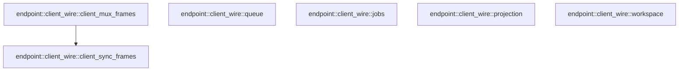

# endpoint::client_wire

[Package atlas](index.md) · [Source](../../src/client_wire.rs)

## Declarations

Visibility is the declaration spelling; trait members and reexports require their enclosing interface. `cfg` is not evaluated.

| Symbol | Kind | Visibility | Test / cfg |
|---|---|---|---|
| [endpoint::client_wire::workspace](../../src/client_wire.rs#L6) | function_item | `private` |  |
| [endpoint::client_wire::queue](../../src/client_wire.rs#L10) | function_item | `private` |  |
| [endpoint::client_wire::jobs](../../src/client_wire.rs#L13) | function_item | `private` |  |
| [endpoint::client_wire::projection](../../src/client_wire.rs#L16) | function_item | `private` |  |
| [endpoint::client_wire::client_sync_frames](../../src/client_wire.rs#L20) | function_item | `pub` |  |
| [endpoint::client_wire::client_mux_frames](../../src/client_wire.rs#L107) | function_item | `pub` |  |
| [endpoint::client_wire::tests::control_replacements_keep_empty_arrays_to_clear_client_state](../../src/client_wire.rs#L130) | function_item | `private` | test; #[cfg(test)] |
| [endpoint::client_wire::tests::actionable_resolution_preserves_zero_revision_and_public_identity](../../src/client_wire.rs#L157) | function_item | `private` | test; #[cfg(test)] |

## Imports / reexports

| Local name | Source path | Visibility |
|---|---|---|
| `SessionControlItem` | `crate::SessionControlItem` | `private` |
| `SessionMuxServerFrame` | `crate::SessionMuxServerFrame` | `private` |
| `SessionSyncFrame` | `crate::SessionSyncFrame` | `private` |
| `WorkspaceSummary` | `crate::WorkspaceSummary` | `private` |
| `Value` | `serde_json::Value` | `private` |
| `json` | `serde_json::json` | `private` |
| `*` | `super::*` | `private` |
| `IJsonValue` | `schema::IJsonValue` | `private` |

## Module declarations

| Module | Visibility | Attributes |
|---|---|---|
| `endpoint::client_wire::tests` | `private` | #[cfg(test)] |

## Function call graphs

Edges below are syntactically resolved calls only, including private functions. Graphs partition callers into groups of 20; they are not execution order. All unresolved sites are listed below and in the JSON inventory.

Functions 1–6: 1 direct edges

## Call sites

Includes test functions (marked in declarations). Receiver-type-required sites need type analysis/manual tracing. Calls in closures are attributed to their enclosing function; their occurrence here does not mean the closure executes immediately.

| Caller | Callee expression | Source lines | Target / classification |
|---|---|---|---|
| `client_sync_frames` | `frame.generation().to_string` | [22](../../src/client_wire.rs#L22) | receiver-type-required |
| `client_sync_frames` | `frame.generation` | [22](../../src/client_wire.rs#L22) | receiver-type-required |
| `client_sync_frames` | `values.extend` | [84](../../src/client_wire.rs#L84) | receiver-type-required |
| `client_sync_frames` | `items                     .iter()                     .map` | [85](../../src/client_wire.rs#L85) | receiver-type-required |
| `client_sync_frames` | `items                     .iter` | [85](../../src/client_wire.rs#L85) | receiver-type-required |
| `client_sync_frames` | `frames         .into_iter()         .map(&#124;mut frame&#124; {             frame["generation"] = json!(generation);             frame         })         .collect` | [98](../../src/client_wire.rs#L98) | receiver-type-required |
| `client_sync_frames` | `frames         .into_iter()         .map` | [98](../../src/client_wire.rs#L98) | receiver-type-required |
| `client_sync_frames` | `frames         .into_iter` | [98](../../src/client_wire.rs#L98) | receiver-type-required |
| `client_mux_frames` | `Ok` | [109](../../src/client_wire.rs#L109), [113](../../src/client_wire.rs#L113), [117](../../src/client_wire.rs#L117), [120](../../src/client_wire.rs#L120) | external-constructor-callback-or-unresolved |
| `client_mux_frames` | `client_sync_frames(frame)             .into_iter()             .map(&#124;frame&#124; json!({"type":"stream","streamId":stream_id,"frame":frame}))             .collect` | [109](../../src/client_wire.rs#L109) | receiver-type-required |
| `client_mux_frames` | `client_sync_frames(frame)             .into_iter()             .map` | [109](../../src/client_wire.rs#L109) | receiver-type-required |
| `client_mux_frames` | `client_sync_frames(frame)             .into_iter` | [109](../../src/client_wire.rs#L109) | receiver-type-required |
| `client_mux_frames` | `client_sync_frames` | [109](../../src/client_wire.rs#L109) | [endpoint::client_wire::client_sync_frames](../../src/client_wire.rs#L20) |
| `control_replacements_keep_empty_arrays_to_clear_client_state` | `"session".into` | [134](../../src/client_wire.rs#L134) | receiver-type-required |
| `control_replacements_keep_empty_arrays_to_clear_client_state` | `IJsonValue::parse(br#"{}"#).unwrap` | [137](../../src/client_wire.rs#L137) | receiver-type-required |
| `control_replacements_keep_empty_arrays_to_clear_client_state` | `IJsonValue::parse` | [137](../../src/client_wire.rs#L137) | [schema::ijson::IJsonValue::parse](../../../schema/src/ijson.rs#L16) |
| `control_replacements_keep_empty_arrays_to_clear_client_state` | `client_sync_frames` | [140](../../src/client_wire.rs#L140) | external-constructor-callback-or-unresolved |
| `actionable_resolution_preserves_zero_revision_and_public_identity` | `client_sync_frames` | [158](../../src/client_wire.rs#L158) | external-constructor-callback-or-unresolved |
| `actionable_resolution_preserves_zero_revision_and_public_identity` | `"approval".into` | [160](../../src/client_wire.rs#L160) | receiver-type-required |
