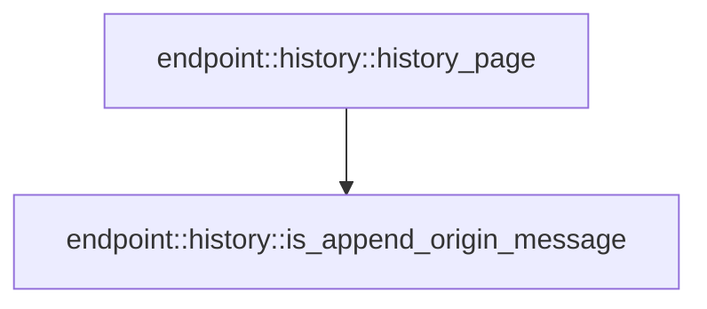

# endpoint::history

[Package atlas](index.md) · [Source](../../src/history.rs)

## Declarations

Visibility is the declaration spelling; trait members and reexports require their enclosing interface. `cfg` is not evaluated.

| Symbol | Kind | Visibility | Test / cfg |
|---|---|---|---|
| [endpoint::history::HistoryPage](../../src/history.rs#L8) | struct_item | `pub` |  |
| [endpoint::history::history_page](../../src/history.rs#L13) | function_item | `pub` |  |
| [endpoint::history::is_append_origin_message](../../src/history.rs#L120) | function_item | `private` |  |
| [endpoint::history::HistoryError](../../src/history.rs#L131) | enum_item | `pub` |  |
| [endpoint::history::tests::record](../../src/history.rs#L145) | function_item | `private` | test; #[cfg(test)] |
| [endpoint::history::tests::page_is_message_aligned_and_keeps_projection_group](../../src/history.rs#L164) | function_item | `private` | test; #[cfg(test)] |

## Imports / reexports

| Local name | Source path | Visibility |
|---|---|---|
| `BTreeSet` | `std::collections::BTreeSet` | `private` |
| `Error` | `thiserror::Error` | `private` |
| `JournalRecord` | `crate::JournalRecord` | `private` |
| `SessionHistoryEntry` | `crate::SessionHistoryEntry` | `private` |
| `IJsonValue` | `schema::IJsonValue` | `private` |
| `*` | `super::*` | `private` |
| `SessionEvent` | `crate::SessionEvent` | `private` |
| `SurfaceOperation` | `crate::SurfaceOperation` | `private` |

## Module declarations

| Module | Visibility | Attributes |
|---|---|---|
| `endpoint::history::tests` | `private` | #[cfg(test)] |

## Function call graphs

Edges below are syntactically resolved calls only, including private functions. Graphs partition callers into groups of 20; they are not execution order. All unresolved sites are listed below and in the JSON inventory.

Functions 1–2: 1 direct edges

## Call sites

Includes test functions (marked in declarations). Receiver-type-required sites need type analysis/manual tracing. Calls in closures are attributed to their enclosing function; their occurrence here does not mean the closure executes immediately.

| Caller | Callee expression | Source lines | Target / classification |
|---|---|---|---|
| `history_page` | `max_messages.unwrap_or` | [18](../../src/history.rs#L18) | receiver-type-required |
| `history_page` | `Err` | [20](../../src/history.rs#L20), [97](../../src/history.rs#L97) | external-constructor-callback-or-unresolved |
| `history_page` | `before_seq.unwrap_or` | [22](../../src/history.rs#L22) | receiver-type-required |
| `history_page` | `records.len` | [22](../../src/history.rs#L22), [24](../../src/history.rs#L24), [96](../../src/history.rs#L96) | receiver-type-required |
| `history_page` | `records.partition_point` | [23](../../src/history.rs#L23) | receiver-type-required |
| `history_page` | `records[eligible_end].kernel_seqs.is_empty` | [24](../../src/history.rs#L24) | receiver-type-required |
| `history_page` | `records[eligible_end]             .kernel_seqs             .iter()             .copied()             .collect::<BTreeSet<_>>` | [25](../../src/history.rs#L25) | receiver-type-required |
| `history_page` | `records[eligible_end]             .kernel_seqs             .iter()             .copied` | [25](../../src/history.rs#L25) | receiver-type-required |
| `history_page` | `records[eligible_end]             .kernel_seqs             .iter` | [25](../../src/history.rs#L25) | receiver-type-required |
| `history_page` | `records[..eligible_end]             .iter()             .position` | [30](../../src/history.rs#L30) | receiver-type-required |
| `history_page` | `records[..eligible_end]             .iter` | [30](../../src/history.rs#L30) | receiver-type-required |
| `history_page` | `record.kernel_seqs.iter().any` | [32](../../src/history.rs#L32), [69](../../src/history.rs#L69) | receiver-type-required |
| `history_page` | `record.kernel_seqs.iter` | [32](../../src/history.rs#L32), [64](../../src/history.rs#L64), [69](../../src/history.rs#L69), [77](../../src/history.rs#L77) | receiver-type-required |
| `history_page` | `boundary.contains` | [32](../../src/history.rs#L32) | receiver-type-required |
| `history_page` | `Ok` | [38](../../src/history.rs#L38), [108](../../src/history.rs#L108) | external-constructor-callback-or-unresolved |
| `history_page` | `Vec::new` | [39](../../src/history.rs#L39) | external-constructor-callback-or-unresolved |
| `history_page` | `is_append_origin_message` | [49](../../src/history.rs#L49) | [endpoint::history::is_append_origin_message](../../src/history.rs#L120) |
| `history_page` | `records[lower..eligible_end]             .iter()             .flat_map(&#124;record&#124; record.kernel_seqs.iter().copied())             .collect::<BTreeSet<_>>` | [62](../../src/history.rs#L62) | receiver-type-required |
| `history_page` | `records[lower..eligible_end]             .iter()             .flat_map` | [62](../../src/history.rs#L62) | receiver-type-required |
| `history_page` | `records[lower..eligible_end]             .iter` | [62](../../src/history.rs#L62), [109](../../src/history.rs#L109) | receiver-type-required |
| `history_page` | `record.kernel_seqs.iter().copied` | [64](../../src/history.rs#L64), [77](../../src/history.rs#L77) | receiver-type-required |
| `history_page` | `records[..lower]                 .iter()                 .position` | [67](../../src/history.rs#L67) | receiver-type-required |
| `history_page` | `records[..lower]                 .iter` | [67](../../src/history.rs#L67) | receiver-type-required |
| `history_page` | `group.contains` | [69](../../src/history.rs#L69) | receiver-type-required |
| `history_page` | `group.extend` | [74](../../src/history.rs#L74) | receiver-type-required |
| `history_page` | `records[lower..eligible_end]                     .iter()                     .flat_map` | [75](../../src/history.rs#L75) | receiver-type-required |
| `history_page` | `records[lower..eligible_end]                     .iter` | [75](../../src/history.rs#L75) | receiver-type-required |
| `history_page` | `BTreeSet::new` | [80](../../src/history.rs#L80) | external-constructor-callback-or-unresolved |
| `history_page` | `record                 .event                 .source_event_seqs                 .as_deref()                 .unwrap_or_default` | [82](../../src/history.rs#L82) | receiver-type-required |
| `history_page` | `record                 .event                 .source_event_seqs                 .as_deref` | [82](../../src/history.rs#L82) | receiver-type-required |
| `history_page` | `needed.insert` | [89](../../src/history.rs#L89) | receiver-type-required |
| `history_page` | `needed.first` | [93](../../src/history.rs#L93), [98](../../src/history.rs#L98) | receiver-type-required |
| `history_page` | `usize::try_from(*first).map_err` | [95](../../src/history.rs#L95) | receiver-type-required |
| `history_page` | `usize::try_from` | [95](../../src/history.rs#L95) | external-constructor-callback-or-unresolved |
| `history_page` | `HistoryError::SourceSequence` | [95](../../src/history.rs#L95), [97](../../src/history.rs#L97) | external-constructor-callback-or-unresolved |
| `history_page` | `needed.first().expect` | [98](../../src/history.rs#L98) | receiver-type-required |
| `history_page` | `lower.min` | [101](../../src/history.rs#L101) | receiver-type-required |
| `history_page` | `records[lower..eligible_end]             .iter()             .map(&#124;record&#124; SessionHistoryEntry {                 event: record.event.clone(),                 view: None,             })             .collect` | [109](../../src/history.rs#L109) | receiver-type-required |
| `history_page` | `records[lower..eligible_end]             .iter()             .map` | [109](../../src/history.rs#L109) | receiver-type-required |
| `history_page` | `record.event.clone` | [112](../../src/history.rs#L112) | receiver-type-required |
| `record` | `event_type.to_owned` | [149](../../src/history.rs#L149) | receiver-type-required |
| `record` | `IJsonValue::parse_str("{}").expect` | [152](../../src/history.rs#L152) | receiver-type-required |
| `record` | `IJsonValue::parse_str` | [152](../../src/history.rs#L152) | [schema::ijson::IJsonValue::parse_str](../../../schema/src/ijson.rs#L23) |
| `record` | `matches!(event_type, "user/message" &#124; "assistant/message")                     .then` | [155](../../src/history.rs#L155) | receiver-type-required |
| `record` | `SurfaceOperation::Append` | [156](../../src/history.rs#L156) | external-constructor-callback-or-unresolved |
| `record` | `"append".to_owned` | [156](../../src/history.rs#L156) | receiver-type-required |
| `page_is_message_aligned_and_keeps_projection_group` | `history_page(&records, None, Some(1)).expect` | [173](../../src/history.rs#L173) | receiver-type-required |
| `page_is_message_aligned_and_keeps_projection_group` | `history_page` | [173](../../src/history.rs#L173), [176](../../src/history.rs#L176) | external-constructor-callback-or-unresolved |
| `page_is_message_aligned_and_keeps_projection_group` | `Some` | [173](../../src/history.rs#L173), [176](../../src/history.rs#L176) | external-constructor-callback-or-unresolved |
| `page_is_message_aligned_and_keeps_projection_group` | `history_page(&records, Some(4), Some(1)).expect` | [176](../../src/history.rs#L176) | receiver-type-required |
