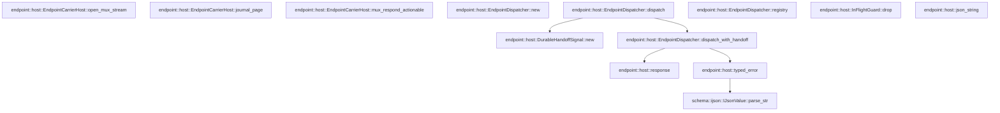

# endpoint::host

[Package atlas](index.md) · [Source](../../src/host.rs)

## Declarations

Visibility is the declaration spelling; trait members and reexports require their enclosing interface. `cfg` is not evaluated.

| Symbol | Kind | Visibility | Test / cfg |
|---|---|---|---|
| [endpoint::host::EndpointHostFuture](../../src/host.rs#L22) | type_item | `pub` |  |
| [endpoint::host::EndpointHostCall](../../src/host.rs#L25) | struct_item | `pub` |  |
| [endpoint::host::EndpointHost](../../src/host.rs#L40) | trait_item | `pub` |  |
| [endpoint::host::EndpointHost::capabilities](../../src/host.rs#L41) | function_signature_item | `private` |  |
| [endpoint::host::EndpointHost::extension_capabilities](../../src/host.rs#L46) | function_item | `private` |  |
| [endpoint::host::EndpointHost::method_class](../../src/host.rs#L50) | function_item | `private` |  |
| [endpoint::host::EndpointHost::validate_request](../../src/host.rs#L60) | function_item | `private` |  |
| [endpoint::host::EndpointHost::call](../../src/host.rs#L64) | function_signature_item | `private` |  |
| [endpoint::host::CarrierHostFuture](../../src/host.rs#L67) | type_item | `pub` |  |
| [endpoint::host::HostReadiness](../../src/host.rs#L70) | enum_item | `pub` |  |
| [endpoint::host::MethodClass](../../src/host.rs#L76) | enum_item | `pub` |  |
| [endpoint::host::StreamChannel](../../src/host.rs#L83) | enum_item | `pub` |  |
| [endpoint::host::StreamChannel::method](../../src/host.rs#L90) | function_item | `pub` |  |
| [endpoint::host::StreamChannel::frame_types](../../src/host.rs#L98) | function_item | `pub(crate)` |  |
| [endpoint::host::StreamErrorCode](../../src/host.rs#L130) | enum_item | `pub` |  |
| [endpoint::host::StreamErrorCode::code](../../src/host.rs#L140) | function_item | `pub` |  |
| [endpoint::host::StreamErrorCode::close_code](../../src/host.rs#L151) | function_item | `pub` |  |
| [endpoint::host::CallContext](../../src/host.rs#L162) | struct_item | `pub` |  |
| [endpoint::host::DrainSignal](../../src/host.rs#L171) | struct_item | `pub` |  |
| [endpoint::host::DrainSignal::new](../../src/host.rs#L175) | function_item | `pub` |  |
| [endpoint::host::DrainSignal::is_draining](../../src/host.rs#L180) | function_item | `pub` |  |
| [endpoint::host::DurableHandoffProof](../../src/host.rs#L186) | struct_item | `pub` |  |
| [endpoint::host::DurableHandoffState](../../src/host.rs#L192) | struct_item | `private` |  |
| [endpoint::host::DurableHandoffSignal](../../src/host.rs#L198) | struct_item | `pub` |  |
| [endpoint::host::DurableHandoffSignal::new](../../src/host.rs#L202) | function_item | `pub` |  |
| [endpoint::host::DurableHandoffSignal::mark_durable](../../src/host.rs#L210) | function_item | `pub` |  |
| [endpoint::host::DurableHandoffSignal::mark_handed_off](../../src/host.rs#L216) | function_item | `pub` |  |
| [endpoint::host::DurableHandoffSignal::proof](../../src/host.rs#L244) | function_item | `private` |  |
| [endpoint::host::DurableHandoffSignal::is_durable](../../src/host.rs#L254) | function_item | `pub` |  |
| [endpoint::host::DurableHandoffError](../../src/host.rs#L260) | enum_item | `pub` |  |
| [endpoint::host::EndpointStream](../../src/host.rs#L273) | trait_item | `pub` |  |
| [endpoint::host::EndpointStream::recv](../../src/host.rs#L274) | function_signature_item | `private` |  |
| [endpoint::host::EndpointStreamReceiver](../../src/host.rs#L277) | type_item | `pub` |  |
| [endpoint::host::SessionStream](../../src/host.rs#L279) | trait_item | `pub` |  |
| [endpoint::host::SessionStream::recv](../../src/host.rs#L280) | function_signature_item | `private` |  |
| [endpoint::host::SessionStreamReceiver](../../src/host.rs#L283) | type_item | `pub` |  |
| [endpoint::host::StreamFailure](../../src/host.rs#L289) | struct_item | `pub` |  |
| [endpoint::host::StreamFailure::new](../../src/host.rs#L296) | function_item | `pub` |  |
| [endpoint::host::StreamFailure::internal](../../src/host.rs#L304) | function_item | `pub` |  |
| [endpoint::host::StreamFailure::code](../../src/host.rs#L312) | function_item | `pub` |  |
| [endpoint::host::StreamFailure::diagnostic](../../src/host.rs#L317) | function_item | `pub` |  |
| [endpoint::host::EndpointCarrierHost](../../src/host.rs#L325) | trait_item | `pub` |  |
| [endpoint::host::EndpointCarrierHost::readiness](../../src/host.rs#L326) | function_signature_item | `private` |  |
| [endpoint::host::EndpointCarrierHost::registered_methods](../../src/host.rs#L331) | function_signature_item | `private` |  |
| [endpoint::host::EndpointCarrierHost::advertised_extension_methods](../../src/host.rs#L336) | function_item | `private` |  |
| [endpoint::host::EndpointCarrierHost::classify_method](../../src/host.rs#L340) | function_signature_item | `private` |  |
| [endpoint::host::EndpointCarrierHost::unary](../../src/host.rs#L342) | function_signature_item | `private` |  |
| [endpoint::host::EndpointCarrierHost::respond](../../src/host.rs#L348) | function_signature_item | `private` |  |
| [endpoint::host::EndpointCarrierHost::open_stream](../../src/host.rs#L356) | function_signature_item | `private` |  |
| [endpoint::host::EndpointCarrierHost::stream_error](../../src/host.rs#L363) | function_signature_item | `private` |  |
| [endpoint::host::EndpointCarrierHost::mux_description](../../src/host.rs#L369) | function_item | `private` |  |
| [endpoint::host::EndpointCarrierHost::open_mux_stream](../../src/host.rs#L375) | function_item | `private` |  |
| [endpoint::host::EndpointCarrierHost::journal_page](../../src/host.rs#L385) | function_item | `private` |  |
| [endpoint::host::EndpointCarrierHost::mux_respond_actionable](../../src/host.rs#L394) | function_item | `private` |  |
| [endpoint::host::HostFailure](../../src/host.rs#L406) | enum_item | `pub` |  |
| [endpoint::host::SessionHostDescription](../../src/host.rs#L421) | struct_item | `pub` |  |
| [endpoint::host::EndpointDispatcher](../../src/host.rs#L437) | struct_item | `pub` |  |
| [endpoint::host::EndpointDispatcher::new](../../src/host.rs#L444) | function_item | `pub` |  |
| [endpoint::host::EndpointDispatcher::dispatch](../../src/host.rs#L451) | function_item | `pub` |  |
| [endpoint::host::EndpointDispatcher::dispatch_with_handoff](../../src/host.rs#L460) | function_item | `pub` |  |
| [endpoint::host::EndpointDispatcher::registry](../../src/host.rs#L583) | function_item | `pub` |  |
| [endpoint::host::InFlightGuard](../../src/host.rs#L588) | struct_item | `private` |  |
| [endpoint::host::InFlightGuard::drop](../../src/host.rs#L594) | function_item | `private` |  |
| [endpoint::host::response](../../src/host.rs#L601) | function_item | `private` |  |
| [endpoint::host::typed_error](../../src/host.rs#L609) | function_item | `private` |  |
| [endpoint::host::json_string](../../src/host.rs#L625) | function_item | `private` |  |
| [endpoint::host::EndpointDispatchError](../../src/host.rs#L630) | enum_item | `pub` |  |

## Imports / reexports

| Local name | Source path | Visibility |
|---|---|---|
| `BTreeSet` | `std::collections::BTreeSet` | `private` |
| `HashSet` | `std::collections::HashSet` | `private` |
| `Future` | `std::future::Future` | `private` |
| `Pin` | `std::pin::Pin` | `private` |
| `AtomicBool` | `std::sync::atomic::AtomicBool` | `private` |
| `Ordering` | `std::sync::atomic::Ordering` | `private` |
| `Arc` | `std::sync::Arc` | `private` |
| `Mutex` | `std::sync::Mutex` | `private` |
| `Instant` | `std::time::Instant` | `private` |
| `IJsonValue` | `schema::IJsonValue` | `private` |
| `Deserialize` | `serde::Deserialize` | `private` |
| `Serialize` | `serde::Serialize` | `private` |
| `Error` | `thiserror::Error` | `private` |
| `RpcBegin` | `crate::idempotency::RpcBegin` | `private` |
| `RpcDurableIdentity` | `crate::idempotency::RpcDurableIdentity` | `private` |
| `RpcRegistry` | `crate::idempotency::RpcRegistry` | `private` |
| `RpcRegistryError` | `crate::idempotency::RpcRegistryError` | `private` |
| `MuxHostDescription` | `crate::mux::MuxHostDescription` | `private` |
| `SessionJournalPage` | `crate::mux::SessionJournalPage` | `private` |
| `SessionMuxClientFrame` | `crate::mux::SessionMuxClientFrame` | `private` |
| `SessionStreamTarget` | `crate::mux::SessionStreamTarget` | `private` |
| `SessionSyncFrame` | `crate::mux::SessionSyncFrame` | `private` |
| `ClientRequest` | `crate::rpc::ClientRequest` | `private` |
| `ClientResponse` | `crate::rpc::ClientResponse` | `private` |
| `RequestError` | `crate::rpc::RequestError` | `private` |
| `RespondReceipt` | `crate::rpc::RespondReceipt` | `private` |
| `RpcError` | `crate::rpc::RpcError` | `private` |
| `RpcResult` | `crate::rpc::RpcResult` | `private` |
| `ServerRequest` | `crate::rpc::ServerRequest` | `private` |
| `ServerResponse` | `crate::rpc::ServerResponse` | `private` |

## Module declarations

| Module | Visibility | Attributes |
|---|---|---|

## Function call graphs

Edges below are syntactically resolved calls only, including private functions. Graphs partition callers into groups of 20; they are not execution order. All unresolved sites are listed below and in the JSON inventory.

Functions 1–20: 1 direct edges

Functions 21–31: 5 direct edges

## Call sites

Includes test functions (marked in declarations). Receiver-type-required sites need type analysis/manual tracing. Calls in closures are attributed to their enclosing function; their occurrence here does not mean the closure executes immediately.

| Caller | Callee expression | Source lines | Target / classification |
|---|---|---|---|
| `extension_capabilities` | `BTreeSet::new` | [47](../../src/host.rs#L47) | external-constructor-callback-or-unresolved |
| `method_class` | `self.capabilities().contains` | [51](../../src/host.rs#L51) | receiver-type-required |
| `method_class` | `self.capabilities` | [51](../../src/host.rs#L51) | receiver-type-required |
| `validate_request` | `Ok` | [61](../../src/host.rs#L61) | external-constructor-callback-or-unresolved |
| `new` | `Self` | [176](../../src/host.rs#L176) | external-constructor-callback-or-unresolved |
| `is_draining` | `self.0.load` | [181](../../src/host.rs#L181) | receiver-type-required |
| `new` | `Self::default` | [203](../../src/host.rs#L203) | external-constructor-callback-or-unresolved |
| `mark_durable` | `self.0.durable.store` | [211](../../src/host.rs#L211) | receiver-type-required |
| `mark_handed_off` | `proof.delivery.is_empty` | [217](../../src/host.rs#L217) | receiver-type-required |
| `mark_handed_off` | `Err` | [218](../../src/host.rs#L218), [225](../../src/host.rs#L225), [234](../../src/host.rs#L234) | external-constructor-callback-or-unresolved |
| `mark_handed_off` | `proof             .durable_identity             .as_ref()             .is_some_and` | [220](../../src/host.rs#L220) | receiver-type-required |
| `mark_handed_off` | `proof             .durable_identity             .as_ref` | [220](../../src/host.rs#L220) | receiver-type-required |
| `mark_handed_off` | `identity.kind.is_empty` | [223](../../src/host.rs#L223) | receiver-type-required |
| `mark_handed_off` | `identity.id.is_empty` | [223](../../src/host.rs#L223) | receiver-type-required |
| `mark_handed_off` | `self             .0             .proof             .lock()             .map_err` | [227](../../src/host.rs#L227) | receiver-type-required |
| `mark_handed_off` | `self             .0             .proof             .lock` | [227](../../src/host.rs#L227) | receiver-type-required |
| `mark_handed_off` | `current.as_ref` | [232](../../src/host.rs#L232) | receiver-type-required |
| `mark_handed_off` | `Some` | [237](../../src/host.rs#L237) | external-constructor-callback-or-unresolved |
| `mark_handed_off` | `drop` | [239](../../src/host.rs#L239) | external-constructor-callback-or-unresolved |
| `mark_handed_off` | `self.mark_durable` | [240](../../src/host.rs#L240) | [endpoint::host::DurableHandoffSignal::mark_durable](../../src/host.rs#L210) |
| `mark_handed_off` | `Ok` | [241](../../src/host.rs#L241) | external-constructor-callback-or-unresolved |
| `proof` | `self.0             .proof             .lock()             .map(&#124;proof&#124; proof.clone())             .map_err` | [245](../../src/host.rs#L245) | receiver-type-required |
| `proof` | `self.0             .proof             .lock()             .map` | [245](../../src/host.rs#L245) | receiver-type-required |
| `proof` | `self.0             .proof             .lock` | [245](../../src/host.rs#L245) | receiver-type-required |
| `proof` | `proof.clone` | [248](../../src/host.rs#L248) | receiver-type-required |
| `is_durable` | `self.0.durable.load` | [255](../../src/host.rs#L255) | receiver-type-required |
| `internal` | `Some` | [307](../../src/host.rs#L307) | external-constructor-callback-or-unresolved |
| `internal` | `diagnostic.into` | [307](../../src/host.rs#L307) | receiver-type-required |
| `diagnostic` | `self.diagnostic.as_deref` | [318](../../src/host.rs#L318) | receiver-type-required |
| `advertised_extension_methods` | `BTreeSet::new` | [337](../../src/host.rs#L337) | external-constructor-callback-or-unresolved |
| `mux_description` | `Err` | [370](../../src/host.rs#L370) | external-constructor-callback-or-unresolved |
| `mux_description` | `HostFailure::Protocol` | [370](../../src/host.rs#L370) | external-constructor-callback-or-unresolved |
| `mux_description` | `"Session Endpoint V3 is unavailable".to_owned` | [371](../../src/host.rs#L371) | receiver-type-required |
| `open_mux_stream` | `Box::pin` | [380](../../src/host.rs#L380) | external-constructor-callback-or-unresolved |
| `open_mux_stream` | `std::future::ready` | [380](../../src/host.rs#L380) | external-constructor-callback-or-unresolved |
| `open_mux_stream` | `Err` | [380](../../src/host.rs#L380) | external-constructor-callback-or-unresolved |
| `open_mux_stream` | `HostFailure::Protocol` | [380](../../src/host.rs#L380) | external-constructor-callback-or-unresolved |
| `open_mux_stream` | `"Session Endpoint V3 stream is unavailable".to_owned` | [381](../../src/host.rs#L381) | receiver-type-required |
| `journal_page` | `Box::pin` | [389](../../src/host.rs#L389) | external-constructor-callback-or-unresolved |
| `journal_page` | `std::future::ready` | [389](../../src/host.rs#L389) | external-constructor-callback-or-unresolved |
| `journal_page` | `Err` | [389](../../src/host.rs#L389) | external-constructor-callback-or-unresolved |
| `journal_page` | `HostFailure::Protocol` | [389](../../src/host.rs#L389) | external-constructor-callback-or-unresolved |
| `journal_page` | `"Session Endpoint V3 journal page is unavailable".to_owned` | [390](../../src/host.rs#L390) | receiver-type-required |
| `mux_respond_actionable` | `Box::pin` | [399](../../src/host.rs#L399) | external-constructor-callback-or-unresolved |
| `mux_respond_actionable` | `std::future::ready` | [399](../../src/host.rs#L399) | external-constructor-callback-or-unresolved |
| `mux_respond_actionable` | `Err` | [399](../../src/host.rs#L399) | external-constructor-callback-or-unresolved |
| `mux_respond_actionable` | `HostFailure::Protocol` | [399](../../src/host.rs#L399) | external-constructor-callback-or-unresolved |
| `mux_respond_actionable` | `"Session Endpoint V3 actionable response is unavailable".to_owned` | [400](../../src/host.rs#L400) | receiver-type-required |
| `new` | `Mutex::new` | [447](../../src/host.rs#L447) | external-constructor-callback-or-unresolved |
| `new` | `HashSet::new` | [447](../../src/host.rs#L447) | external-constructor-callback-or-unresolved |
| `dispatch` | `self.dispatch_with_handoff` | [456](../../src/host.rs#L456) | [endpoint::host::EndpointDispatcher::dispatch_with_handoff](../../src/host.rs#L460) |
| `dispatch` | `DurableHandoffSignal::new` | [456](../../src/host.rs#L456) | [endpoint::host::DurableHandoffSignal::new](../../src/host.rs#L202) |
| `dispatch_with_handoff` | `request.rpc_id.clone` | [466](../../src/host.rs#L466) | receiver-type-required |
| `dispatch_with_handoff` | `Err` | [468](../../src/host.rs#L468), [527](../../src/host.rs#L527), [573](../../src/host.rs#L573) | external-constructor-callback-or-unresolved |
| `dispatch_with_handoff` | `EndpointDispatchError::Request` | [468](../../src/host.rs#L468) | external-constructor-callback-or-unresolved |
| `dispatch_with_handoff` | `host.capabilities().contains` | [470](../../src/host.rs#L470) | receiver-type-required |
| `dispatch_with_handoff` | `host.capabilities` | [470](../../src/host.rs#L470) | receiver-type-required |
| `dispatch_with_handoff` | `typed_error` | [471](../../src/host.rs#L471), [487](../../src/host.rs#L487), [516](../../src/host.rs#L516), [545](../../src/host.rs#L545) | [endpoint::host::typed_error](../../src/host.rs#L609) |
| `dispatch_with_handoff` | `Ok` | [476](../../src/host.rs#L476), [485](../../src/host.rs#L485), [508](../../src/host.rs#L508), [514](../../src/host.rs#L514), [534](../../src/host.rs#L534), [543](../../src/host.rs#L543), [579](../../src/host.rs#L579) | external-constructor-callback-or-unresolved |
| `dispatch_with_handoff` | `response` | [476](../../src/host.rs#L476), [485](../../src/host.rs#L485), [508](../../src/host.rs#L508), [514](../../src/host.rs#L514), [534](../../src/host.rs#L534), [543](../../src/host.rs#L543), [579](../../src/host.rs#L579) | [endpoint::host::response](../../src/host.rs#L601) |
| `dispatch_with_handoff` | `host.method_class` | [478](../../src/host.rs#L478) | receiver-type-required |
| `dispatch_with_handoff` | `self                     .in_flight                     .lock()                     .map_err` | [480](../../src/host.rs#L480) | receiver-type-required |
| `dispatch_with_handoff` | `self                     .in_flight                     .lock` | [480](../../src/host.rs#L480) | receiver-type-required |
| `dispatch_with_handoff` | `in_flight.insert` | [484](../../src/host.rs#L484), [542](../../src/host.rs#L542) | receiver-type-required |
| `dispatch_with_handoff` | `rpc_id.clone` | [484](../../src/host.rs#L484), [497](../../src/host.rs#L497), [515](../../src/host.rs#L515), [542](../../src/host.rs#L542), [555](../../src/host.rs#L555) | receiver-type-required |
| `dispatch_with_handoff` | `"{}".to_owned` | [490](../../src/host.rs#L490), [548](../../src/host.rs#L548) | receiver-type-required |
| `dispatch_with_handoff` | `host                 .call` | [499](../../src/host.rs#L499) | receiver-type-required |
| `dispatch_with_handoff` | `self.registry.begin` | [510](../../src/host.rs#L510) | receiver-type-required |
| `dispatch_with_handoff` | `request.method.clone` | [513](../../src/host.rs#L513) | receiver-type-required |
| `dispatch_with_handoff` | `error.into` | [527](../../src/host.rs#L527) | receiver-type-required |
| `dispatch_with_handoff` | `handoff.mark_durable` | [533](../../src/host.rs#L533), [578](../../src/host.rs#L578) | receiver-type-required |
| `dispatch_with_handoff` | `self                 .in_flight                 .lock()                 .map_err` | [538](../../src/host.rs#L538) | receiver-type-required |
| `dispatch_with_handoff` | `self                 .in_flight                 .lock` | [538](../../src/host.rs#L538) | receiver-type-required |
| `dispatch_with_handoff` | `host             .call` | [558](../../src/host.rs#L558) | receiver-type-required |
| `dispatch_with_handoff` | `handoff.clone` | [564](../../src/host.rs#L564) | receiver-type-required |
| `dispatch_with_handoff` | `handoff.proof` | [567](../../src/host.rs#L567) | receiver-type-required |
| `dispatch_with_handoff` | `self.registry                     .mark_handed_off` | [569](../../src/host.rs#L569) | receiver-type-required |
| `dispatch_with_handoff` | `handoff.is_durable` | [572](../../src/host.rs#L572) | receiver-type-required |
| `dispatch_with_handoff` | `self.registry.complete` | [577](../../src/host.rs#L577) | receiver-type-required |
| `drop` | `self.set.lock` | [595](../../src/host.rs#L595) | receiver-type-required |
| `drop` | `set.remove` | [596](../../src/host.rs#L596) | receiver-type-required |
| `response` | `"server-response".to_owned` | [603](../../src/host.rs#L603) | receiver-type-required |
| `typed_error` | `Ok` | [614](../../src/host.rs#L614) | external-constructor-callback-or-unresolved |
| `typed_error` | `Some` | [617](../../src/host.rs#L617) | external-constructor-callback-or-unresolved |
| `typed_error` | `code.to_owned` | [618](../../src/host.rs#L618) | receiver-type-required |
| `typed_error` | `message.to_owned` | [619](../../src/host.rs#L619) | receiver-type-required |
| `typed_error` | `IJsonValue::parse_str` | [620](../../src/host.rs#L620) | [schema::ijson::IJsonValue::parse_str](../../../schema/src/ijson.rs#L23) |
| `json_string` | `serde_json::to_string(value).expect` | [626](../../src/host.rs#L626) | receiver-type-required |
| `json_string` | `serde_json::to_string` | [626](../../src/host.rs#L626) | external-constructor-callback-or-unresolved |
