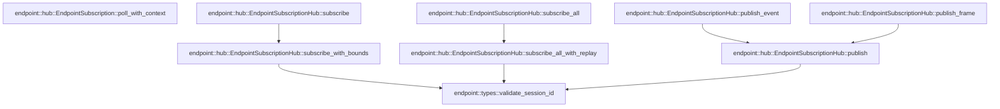

# endpoint::hub

[Package atlas](index.md) · [Source](../../src/hub.rs)

## Declarations

Visibility is the declaration spelling; trait members and reexports require their enclosing interface. `cfg` is not evaluated.

| Symbol | Kind | Visibility | Test / cfg |
|---|---|---|---|
| [endpoint::hub::DEFAULT_SUBSCRIPTION_MAX_FRAMES](../../src/hub.rs#L14) | const_item | `pub` |  |
| [endpoint::hub::DEFAULT_SUBSCRIPTION_MAX_BYTES](../../src/hub.rs#L15) | const_item | `pub` |  |
| [endpoint::hub::MAX_MUX_SESSIONS](../../src/hub.rs#L16) | const_item | `pub` |  |
| [endpoint::hub::MuxRegistration](../../src/hub.rs#L18) | struct_item | `pub` |  |
| [endpoint::hub::MuxReplayRegistration](../../src/hub.rs#L25) | struct_item | `pub` |  |
| [endpoint::hub::MuxFrame](../../src/hub.rs#L32) | enum_item | `pub` |  |
| [endpoint::hub::HostFrameKind](../../src/hub.rs#L117) | enum_item | `pub` |  |
| [endpoint::hub::HostFrameKind::as_str](../../src/hub.rs#L132) | function_item | `pub` |  |
| [endpoint::hub::HostFrame](../../src/hub.rs#L152) | struct_item | `pub` |  |
| [endpoint::hub::HostFrame::new](../../src/hub.rs#L158) | function_item | `pub` |  |
| [endpoint::hub::HostFrame::kind](../../src/hub.rs#L175) | function_item | `pub` |  |
| [endpoint::hub::HostFrame::payload](../../src/hub.rs#L180) | function_item | `pub` |  |
| [endpoint::hub::HostFrame::into_envelope](../../src/hub.rs#L184) | function_item | `pub` |  |
| [endpoint::hub::MuxFrame::kind](../../src/hub.rs#L198) | function_item | `pub` |  |
| [endpoint::hub::MuxFrame::session_id](../../src/hub.rs#L215) | function_item | `pub` |  |
| [endpoint::hub::MuxFrame::event_seq](../../src/hub.rs#L232) | function_item | `pub` |  |
| [endpoint::hub::MuxFrame::into_envelope](../../src/hub.rs#L239) | function_item | `pub` |  |
| [endpoint::hub::SubscriptionBaseline](../../src/hub.rs#L257) | struct_item | `pub` |  |
| [endpoint::hub::SubscriptionPoll](../../src/hub.rs#L263) | enum_item | `pub` |  |
| [endpoint::hub::SubscriptionState](../../src/hub.rs#L270) | struct_item | `private` |  |
| [endpoint::hub::SubscriptionState::has_capacity](../../src/hub.rs#L284) | function_item | `private` |  |
| [endpoint::hub::SubscriptionState::overflow](../../src/hub.rs#L292) | function_item | `private` |  |
| [endpoint::hub::SubscriptionState::wake](../../src/hub.rs#L305) | function_item | `private` |  |
| [endpoint::hub::SubscriptionState::enqueue](../../src/hub.rs#L311) | function_item | `private` |  |
| [endpoint::hub::SubscriptionState::enqueue_event](../../src/hub.rs#L323) | function_item | `private` |  |
| [endpoint::hub::SubscriptionState::poll](../../src/hub.rs#L354) | function_item | `private` |  |
| [endpoint::hub::SubscriptionState::poll_with_context](../../src/hub.rs#L372) | function_item | `private` |  |
| [endpoint::hub::EndpointSubscription](../../src/hub.rs#L390) | struct_item | `pub` |  |
| [endpoint::hub::EndpointSubscription::baseline](../../src/hub.rs#L397) | function_item | `pub` |  |
| [endpoint::hub::EndpointSubscription::poll](../../src/hub.rs#L401) | function_item | `pub` |  |
| [endpoint::hub::EndpointSubscription::close](../../src/hub.rs#L405) | function_item | `pub` |  |
| [endpoint::hub::EndpointSubscription::wake](../../src/hub.rs#L412) | function_item | `pub(crate)` |  |
| [endpoint::hub::EndpointSubscription::poll_with_context](../../src/hub.rs#L417) | function_item | `pub(crate)` |  |
| [endpoint::hub::EndpointSubscriptionHub](../../src/hub.rs#L430) | struct_item | `pub` |  |
| [endpoint::hub::EndpointSubscriptionHub::subscribe](../../src/hub.rs#L435) | function_item | `pub` |  |
| [endpoint::hub::EndpointSubscriptionHub::subscribe_with_bounds](../../src/hub.rs#L450) | function_item | `pub` |  |
| [endpoint::hub::EndpointSubscriptionHub::subscribe_all](../../src/hub.rs#L515) | function_item | `pub` |  |
| [endpoint::hub::EndpointSubscriptionHub::subscribe_all_with_replay](../../src/hub.rs#L537) | function_item | `pub` |  |
| [endpoint::hub::EndpointSubscriptionHub::publish_event](../../src/hub.rs#L632) | function_item | `pub` |  |
| [endpoint::hub::EndpointSubscriptionHub::publish_frame](../../src/hub.rs#L658) | function_item | `pub` |  |
| [endpoint::hub::EndpointSubscriptionHub::publish](../../src/hub.rs#L676) | function_item | `private` |  |
| [endpoint::hub::HubError](../../src/hub.rs#L710) | enum_item | `pub` |  |

## Imports / reexports

| Local name | Source path | Visibility |
|---|---|---|
| `BTreeMap` | `std::collections::BTreeMap` | `private` |
| `HashMap` | `std::collections::HashMap` | `private` |
| `VecDeque` | `std::collections::VecDeque` | `private` |
| `Arc` | `std::sync::Arc` | `private` |
| `Mutex` | `std::sync::Mutex` | `private` |
| `Weak` | `std::sync::Weak` | `private` |
| `Context` | `std::task::Context` | `private` |
| `Poll` | `std::task::Poll` | `private` |
| `Waker` | `std::task::Waker` | `private` |
| `IJsonValue` | `schema::IJsonValue` | `private` |
| `Deserialize` | `serde::Deserialize` | `private` |
| `Serialize` | `serde::Serialize` | `private` |
| `Error` | `thiserror::Error` | `private` |
| `RpcError` | `crate::rpc::RpcError` | `private` |
| `ServerRequest` | `crate::rpc::ServerRequest` | `private` |
| `EndpointJournal` | `crate::EndpointJournal` | `private` |
| `JournalError` | `crate::JournalError` | `private` |
| `SessionEvent` | `crate::SessionEvent` | `private` |
| `SessionToolEventView` | `crate::SessionToolEventView` | `private` |
| `validate_session_id` | `crate::validate_session_id` | `private` |

## Module declarations

| Module | Visibility | Attributes |
|---|---|---|

## Function call graphs

Edges below are syntactically resolved calls only, including private functions. Graphs partition callers into groups of 20; they are not execution order. All unresolved sites are listed below and in the JSON inventory.

Functions 1–20: 10 direct edges

Functions 21–28: 7 direct edges

## Call sites

Includes test functions (marked in declarations). Receiver-type-required sites need type analysis/manual tracing. Calls in closures are attributed to their enclosing function; their occurrence here does not mean the closure executes immediately.

| Caller | Callee expression | Source lines | Target / classification |
|---|---|---|---|
| `new` | `serde_json::from_slice` | [159](../../src/hub.rs#L159) | external-constructor-callback-or-unresolved |
| `new` | `payload.canonical_bytes` | [159](../../src/hub.rs#L159) | receiver-type-required |
| `new` | `value             .as_object()             .and_then(&#124;object&#124; object.get("type"))             .and_then(serde_json::Value::as_str)             .ok_or` | [160](../../src/hub.rs#L160) | receiver-type-required |
| `new` | `value             .as_object()             .and_then(&#124;object&#124; object.get("type"))             .and_then` | [160](../../src/hub.rs#L160) | receiver-type-required |
| `new` | `value             .as_object()             .and_then` | [160](../../src/hub.rs#L160) | receiver-type-required |
| `new` | `value             .as_object` | [160](../../src/hub.rs#L160) | receiver-type-required |
| `new` | `object.get` | [162](../../src/hub.rs#L162) | receiver-type-required |
| `new` | `kind.as_str` | [165](../../src/hub.rs#L165), [167](../../src/hub.rs#L167) | receiver-type-required |
| `new` | `Err` | [166](../../src/hub.rs#L166) | external-constructor-callback-or-unresolved |
| `new` | `actual.to_owned` | [168](../../src/hub.rs#L168) | receiver-type-required |
| `new` | `Ok` | [171](../../src/hub.rs#L171) | external-constructor-callback-or-unresolved |
| `into_envelope` | `"server-request".to_owned` | [186](../../src/hub.rs#L186) | receiver-type-required |
| `into_envelope` | `rpc_id.into` | [187](../../src/hub.rs#L187) | receiver-type-required |
| `into_envelope` | `self.kind.as_str().to_owned` | [188](../../src/hub.rs#L188) | receiver-type-required |
| `into_envelope` | `self.kind.as_str` | [188](../../src/hub.rs#L188) | receiver-type-required |
| `into_envelope` | `envelope.validate_stream` | [191](../../src/hub.rs#L191) | receiver-type-required |
| `into_envelope` | `Ok` | [192](../../src/hub.rs#L192) | external-constructor-callback-or-unresolved |
| `session_id` | `Some` | [226](../../src/hub.rs#L226) | external-constructor-callback-or-unresolved |
| `event_seq` | `Some` | [234](../../src/hub.rs#L234) | external-constructor-callback-or-unresolved |
| `into_envelope` | `self.kind().to_owned` | [240](../../src/hub.rs#L240) | receiver-type-required |
| `into_envelope` | `self.kind` | [240](../../src/hub.rs#L240) | [endpoint::hub::MuxFrame::kind](../../src/hub.rs#L198) |
| `into_envelope` | `IJsonValue::parse` | [241](../../src/hub.rs#L241) | [schema::ijson::IJsonValue::parse](../../../schema/src/ijson.rs#L16) |
| `into_envelope` | `serde_json_canonicalizer::to_vec(&self)                 .map_err` | [242](../../src/hub.rs#L242) | receiver-type-required |
| `into_envelope` | `serde_json_canonicalizer::to_vec` | [242](../../src/hub.rs#L242) | external-constructor-callback-or-unresolved |
| `into_envelope` | `HubError::Canonical` | [243](../../src/hub.rs#L243) | external-constructor-callback-or-unresolved |
| `into_envelope` | `error.to_string` | [243](../../src/hub.rs#L243) | receiver-type-required |
| `into_envelope` | `"server-request".to_owned` | [246](../../src/hub.rs#L246) | receiver-type-required |
| `into_envelope` | `rpc_id.into` | [247](../../src/hub.rs#L247) | receiver-type-required |
| `into_envelope` | `envelope.validate_stream` | [251](../../src/hub.rs#L251) | receiver-type-required |
| `into_envelope` | `Ok` | [252](../../src/hub.rs#L252) | external-constructor-callback-or-unresolved |
| `has_capacity` | `self.frames.len` | [285](../../src/hub.rs#L285) | receiver-type-required |
| `has_capacity` | `self.pending_events.len` | [285](../../src/hub.rs#L285) | receiver-type-required |
| `has_capacity` | `self                 .bytes                 .checked_add(size)                 .is_some_and` | [286](../../src/hub.rs#L286) | receiver-type-required |
| `has_capacity` | `self                 .bytes                 .checked_add` | [286](../../src/hub.rs#L286) | receiver-type-required |
| `overflow` | `self             .pending_events             .values()             .map(&#124;(_, size)&#124; *size)             .sum::<usize>` | [293](../../src/hub.rs#L293) | receiver-type-required |
| `overflow` | `self             .pending_events             .values()             .map` | [293](../../src/hub.rs#L293) | receiver-type-required |
| `overflow` | `self             .pending_events             .values` | [293](../../src/hub.rs#L293) | receiver-type-required |
| `overflow` | `self.pending_events.clear` | [299](../../src/hub.rs#L299) | receiver-type-required |
| `overflow` | `self.wake` | [302](../../src/hub.rs#L302) | [endpoint::hub::SubscriptionState::wake](../../src/hub.rs#L305) |
| `wake` | `self.waker.take` | [306](../../src/hub.rs#L306) | receiver-type-required |
| `wake` | `waker.wake` | [307](../../src/hub.rs#L307) | receiver-type-required |
| `enqueue` | `frame.canonical_bytes()?.len` | [312](../../src/hub.rs#L312) | receiver-type-required |
| `enqueue` | `frame.canonical_bytes` | [312](../../src/hub.rs#L312) | receiver-type-required |
| `enqueue` | `self.has_capacity` | [313](../../src/hub.rs#L313) | [endpoint::hub::SubscriptionState::has_capacity](../../src/hub.rs#L284) |
| `enqueue` | `self.overflow` | [314](../../src/hub.rs#L314) | [endpoint::hub::SubscriptionState::overflow](../../src/hub.rs#L292) |
| `enqueue` | `Err` | [315](../../src/hub.rs#L315) | external-constructor-callback-or-unresolved |
| `enqueue` | `self.frames.push_back` | [318](../../src/hub.rs#L318) | receiver-type-required |
| `enqueue` | `self.wake` | [319](../../src/hub.rs#L319) | [endpoint::hub::SubscriptionState::wake](../../src/hub.rs#L305) |
| `enqueue` | `Ok` | [320](../../src/hub.rs#L320) | external-constructor-callback-or-unresolved |
| `enqueue_event` | `Ok` | [325](../../src/hub.rs#L325), [333](../../src/hub.rs#L333), [351](../../src/hub.rs#L351) | external-constructor-callback-or-unresolved |
| `enqueue_event` | `frame.canonical_bytes()?.len` | [327](../../src/hub.rs#L327) | receiver-type-required |
| `enqueue_event` | `frame.canonical_bytes` | [327](../../src/hub.rs#L327), [329](../../src/hub.rs#L329) | receiver-type-required |
| `enqueue_event` | `self.pending_events.get` | [328](../../src/hub.rs#L328) | receiver-type-required |
| `enqueue_event` | `existing.canonical_bytes` | [329](../../src/hub.rs#L329) | receiver-type-required |
| `enqueue_event` | `self.overflow` | [330](../../src/hub.rs#L330), [336](../../src/hub.rs#L336) | [endpoint::hub::SubscriptionState::overflow](../../src/hub.rs#L292) |
| `enqueue_event` | `Err` | [331](../../src/hub.rs#L331), [337](../../src/hub.rs#L337) | external-constructor-callback-or-unresolved |
| `enqueue_event` | `HubError::EventConflict` | [331](../../src/hub.rs#L331) | external-constructor-callback-or-unresolved |
| `enqueue_event` | `self.has_capacity` | [335](../../src/hub.rs#L335) | [endpoint::hub::SubscriptionState::has_capacity](../../src/hub.rs#L284) |
| `enqueue_event` | `self.frames.push_back` | [341](../../src/hub.rs#L341), [344](../../src/hub.rs#L344) | receiver-type-required |
| `enqueue_event` | `self.next_seq.saturating_add` | [342](../../src/hub.rs#L342), [345](../../src/hub.rs#L345) | receiver-type-required |
| `enqueue_event` | `self.pending_events.remove` | [343](../../src/hub.rs#L343) | receiver-type-required |
| `enqueue_event` | `self.pending_events.insert` | [348](../../src/hub.rs#L348) | receiver-type-required |
| `enqueue_event` | `self.wake` | [350](../../src/hub.rs#L350) | [endpoint::hub::SubscriptionState::wake](../../src/hub.rs#L305) |
| `poll` | `self.frames.pop_front` | [355](../../src/hub.rs#L355) | receiver-type-required |
| `poll` | `SubscriptionPoll::Frame` | [357](../../src/hub.rs#L357) | external-constructor-callback-or-unresolved |
| `poll_with_context` | `self.poll` | [373](../../src/hub.rs#L373) | [endpoint::hub::SubscriptionState::poll](../../src/hub.rs#L354) |
| `poll_with_context` | `self                     .waker                     .as_ref()                     .is_none_or` | [375](../../src/hub.rs#L375) | receiver-type-required |
| `poll_with_context` | `self                     .waker                     .as_ref` | [375](../../src/hub.rs#L375) | receiver-type-required |
| `poll_with_context` | `waker.will_wake` | [378](../../src/hub.rs#L378) | receiver-type-required |
| `poll_with_context` | `context.waker` | [378](../../src/hub.rs#L378), [380](../../src/hub.rs#L380) | receiver-type-required |
| `poll_with_context` | `Some` | [380](../../src/hub.rs#L380) | external-constructor-callback-or-unresolved |
| `poll_with_context` | `context.waker().clone` | [380](../../src/hub.rs#L380) | receiver-type-required |
| `poll_with_context` | `Poll::Ready` | [384](../../src/hub.rs#L384) | external-constructor-callback-or-unresolved |
| `poll` | `Ok` | [402](../../src/hub.rs#L402) | external-constructor-callback-or-unresolved |
| `poll` | `self.state.lock().map_err(&#124;_&#124; HubError::Poisoned)?.poll` | [402](../../src/hub.rs#L402) | receiver-type-required |
| `poll` | `self.state.lock().map_err` | [402](../../src/hub.rs#L402) | receiver-type-required |
| `poll` | `self.state.lock` | [402](../../src/hub.rs#L402) | receiver-type-required |
| `close` | `self.state.lock().map_err` | [406](../../src/hub.rs#L406) | receiver-type-required |
| `close` | `self.state.lock` | [406](../../src/hub.rs#L406) | receiver-type-required |
| `close` | `state.wake` | [408](../../src/hub.rs#L408) | receiver-type-required |
| `close` | `Ok` | [409](../../src/hub.rs#L409) | external-constructor-callback-or-unresolved |
| `wake` | `self.state.lock().map_err(&#124;_&#124; HubError::Poisoned)?.wake` | [413](../../src/hub.rs#L413) | receiver-type-required |
| `wake` | `self.state.lock().map_err` | [413](../../src/hub.rs#L413) | receiver-type-required |
| `wake` | `self.state.lock` | [413](../../src/hub.rs#L413) | receiver-type-required |
| `wake` | `Ok` | [414](../../src/hub.rs#L414) | external-constructor-callback-or-unresolved |
| `poll_with_context` | `Ok` | [421](../../src/hub.rs#L421) | external-constructor-callback-or-unresolved |
| `poll_with_context` | `self             .state             .lock()             .map_err(&#124;_&#124; HubError::Poisoned)?             .poll_with_context` | [421](../../src/hub.rs#L421) | receiver-type-required |
| `poll_with_context` | `self             .state             .lock()             .map_err` | [421](../../src/hub.rs#L421) | receiver-type-required |
| `poll_with_context` | `self             .state             .lock` | [421](../../src/hub.rs#L421) | receiver-type-required |
| `subscribe` | `self.subscribe_with_bounds` | [441](../../src/hub.rs#L441) | [endpoint::hub::EndpointSubscriptionHub::subscribe_with_bounds](../../src/hub.rs#L450) |
| `subscribe_with_bounds` | `validate_session_id` | [458](../../src/hub.rs#L458) | [endpoint::types::validate_session_id](../../src/types.rs#L130) |
| `subscribe_with_bounds` | `Err` | [460](../../src/hub.rs#L460) | external-constructor-callback-or-unresolved |
| `subscribe_with_bounds` | `self.sessions.lock().map_err` | [466](../../src/hub.rs#L466) | receiver-type-required |
| `subscribe_with_bounds` | `self.sessions.lock` | [466](../../src/hub.rs#L466) | receiver-type-required |
| `subscribe_with_bounds` | `journal.last_seq()?.map_or` | [467](../../src/hub.rs#L467) | receiver-type-required |
| `subscribe_with_bounds` | `journal.last_seq` | [467](../../src/hub.rs#L467) | receiver-type-required |
| `subscribe_with_bounds` | `Ok` | [467](../../src/hub.rs#L467), [503](../../src/hub.rs#L503) | external-constructor-callback-or-unresolved |
| `subscribe_with_bounds` | `i64::try_from(seq).map_err` | [468](../../src/hub.rs#L468) | receiver-type-required |
| `subscribe_with_bounds` | `i64::try_from` | [468](../../src/hub.rs#L468) | external-constructor-callback-or-unresolved |
| `subscribe_with_bounds` | `u64::try_from(last_seq)                 .map_err(&#124;_&#124; HubError::Sequence)?                 .checked_add(1)                 .ok_or` | [473](../../src/hub.rs#L473) | receiver-type-required |
| `subscribe_with_bounds` | `u64::try_from(last_seq)                 .map_err(&#124;_&#124; HubError::Sequence)?                 .checked_add` | [473](../../src/hub.rs#L473) | receiver-type-required |
| `subscribe_with_bounds` | `u64::try_from(last_seq)                 .map_err` | [473](../../src/hub.rs#L473) | receiver-type-required |
| `subscribe_with_bounds` | `u64::try_from` | [473](../../src/hub.rs#L473) | external-constructor-callback-or-unresolved |
| `subscribe_with_bounds` | `Arc::new` | [478](../../src/hub.rs#L478) | external-constructor-callback-or-unresolved |
| `subscribe_with_bounds` | `Mutex::new` | [478](../../src/hub.rs#L478) | external-constructor-callback-or-unresolved |
| `subscribe_with_bounds` | `VecDeque::new` | [479](../../src/hub.rs#L479) | external-constructor-callback-or-unresolved |
| `subscribe_with_bounds` | `BTreeMap::new` | [480](../../src/hub.rs#L480) | external-constructor-callback-or-unresolved |
| `subscribe_with_bounds` | `MuxFrame::Subscribed {             session_id: session_id.to_owned(),             last_seq,         }         .into_envelope` | [490](../../src/hub.rs#L490) | receiver-type-required |
| `subscribe_with_bounds` | `session_id.to_owned` | [491](../../src/hub.rs#L491), [500](../../src/hub.rs#L500), [505](../../src/hub.rs#L505) | receiver-type-required |
| `subscribe_with_bounds` | `state             .lock()             .map_err(&#124;_&#124; HubError::Poisoned)?             .enqueue` | [495](../../src/hub.rs#L495) | receiver-type-required |
| `subscribe_with_bounds` | `state             .lock()             .map_err` | [495](../../src/hub.rs#L495) | receiver-type-required |
| `subscribe_with_bounds` | `state             .lock` | [495](../../src/hub.rs#L495) | receiver-type-required |
| `subscribe_with_bounds` | `sessions             .entry(session_id.to_owned())             .or_default()             .push` | [499](../../src/hub.rs#L499) | receiver-type-required |
| `subscribe_with_bounds` | `sessions             .entry(session_id.to_owned())             .or_default` | [499](../../src/hub.rs#L499) | receiver-type-required |
| `subscribe_with_bounds` | `sessions             .entry` | [499](../../src/hub.rs#L499) | receiver-type-required |
| `subscribe_with_bounds` | `Arc::downgrade` | [502](../../src/hub.rs#L502) | external-constructor-callback-or-unresolved |
| `subscribe_all` | `registrations             .iter()             .map(&#124;registration&#124; MuxReplayRegistration {                 registration: MuxRegistration {                     session_id: registration.session_id,                     journal: registration.journal,                     subscribed_rpc_id: registration.subscribed_rpc_id,                 },                 unresolved: &[],             })             .collect::<Vec<_>>` | [519](../../src/hub.rs#L519) | receiver-type-required |
| `subscribe_all` | `registrations             .iter()             .map` | [519](../../src/hub.rs#L519) | receiver-type-required |
| `subscribe_all` | `registrations             .iter` | [519](../../src/hub.rs#L519) | receiver-type-required |
| `subscribe_all` | `self.subscribe_all_with_replay` | [530](../../src/hub.rs#L530) | [endpoint::hub::EndpointSubscriptionHub::subscribe_all_with_replay](../../src/hub.rs#L537) |
| `subscribe_all_with_replay` | `registrations.len` | [541](../../src/hub.rs#L541), [542](../../src/hub.rs#L542), [567](../../src/hub.rs#L567) | receiver-type-required |
| `subscribe_all_with_replay` | `Err` | [542](../../src/hub.rs#L542), [549](../../src/hub.rs#L549), [560](../../src/hub.rs#L560) | external-constructor-callback-or-unresolved |
| `subscribe_all_with_replay` | `HubError::ActiveSessionLimit` | [542](../../src/hub.rs#L542) | external-constructor-callback-or-unresolved |
| `subscribe_all_with_replay` | `validate_session_id` | [547](../../src/hub.rs#L547) | [endpoint::types::validate_session_id](../../src/types.rs#L130) |
| `subscribe_all_with_replay` | `previous.is_some_and` | [548](../../src/hub.rs#L548) | receiver-type-required |
| `subscribe_all_with_replay` | `frame.validate_stream` | [552](../../src/hub.rs#L552) | receiver-type-required |
| `subscribe_all_with_replay` | `serde_json::from_slice` | [553](../../src/hub.rs#L553) | external-constructor-callback-or-unresolved |
| `subscribe_all_with_replay` | `frame.payload.canonical_bytes` | [553](../../src/hub.rs#L553) | receiver-type-required |
| `subscribe_all_with_replay` | `payload.session_id` | [554](../../src/hub.rs#L554) | receiver-type-required |
| `subscribe_all_with_replay` | `Some` | [554](../../src/hub.rs#L554), [563](../../src/hub.rs#L563) | external-constructor-callback-or-unresolved |
| `subscribe_all_with_replay` | `self.sessions.lock().map_err` | [566](../../src/hub.rs#L566) | receiver-type-required |
| `subscribe_all_with_replay` | `self.sessions.lock` | [566](../../src/hub.rs#L566) | receiver-type-required |
| `subscribe_all_with_replay` | `Vec::with_capacity` | [567](../../src/hub.rs#L567) | external-constructor-callback-or-unresolved |
| `subscribe_all_with_replay` | `base.journal.last_seq()?.map_or` | [570](../../src/hub.rs#L570) | receiver-type-required |
| `subscribe_all_with_replay` | `base.journal.last_seq` | [570](../../src/hub.rs#L570) | receiver-type-required |
| `subscribe_all_with_replay` | `Ok` | [570](../../src/hub.rs#L570), [626](../../src/hub.rs#L626) | external-constructor-callback-or-unresolved |
| `subscribe_all_with_replay` | `i64::try_from(seq).map_err` | [571](../../src/hub.rs#L571) | receiver-type-required |
| `subscribe_all_with_replay` | `i64::try_from` | [571](../../src/hub.rs#L571) | external-constructor-callback-or-unresolved |
| `subscribe_all_with_replay` | `u64::try_from(last_seq)                     .map_err(&#124;_&#124; HubError::Sequence)?                     .checked_add(1)                     .ok_or` | [576](../../src/hub.rs#L576) | receiver-type-required |
| `subscribe_all_with_replay` | `u64::try_from(last_seq)                     .map_err(&#124;_&#124; HubError::Sequence)?                     .checked_add` | [576](../../src/hub.rs#L576) | receiver-type-required |
| `subscribe_all_with_replay` | `u64::try_from(last_seq)                     .map_err` | [576](../../src/hub.rs#L576) | receiver-type-required |
| `subscribe_all_with_replay` | `u64::try_from` | [576](../../src/hub.rs#L576) | external-constructor-callback-or-unresolved |
| `subscribe_all_with_replay` | `Arc::new` | [581](../../src/hub.rs#L581) | external-constructor-callback-or-unresolved |
| `subscribe_all_with_replay` | `Mutex::new` | [581](../../src/hub.rs#L581) | external-constructor-callback-or-unresolved |
| `subscribe_all_with_replay` | `VecDeque::new` | [582](../../src/hub.rs#L582) | external-constructor-callback-or-unresolved |
| `subscribe_all_with_replay` | `BTreeMap::new` | [583](../../src/hub.rs#L583), [609](../../src/hub.rs#L609) | external-constructor-callback-or-unresolved |
| `subscribe_all_with_replay` | `state.lock().map_err(&#124;_&#124; HubError::Poisoned)?.enqueue` | [593](../../src/hub.rs#L593) | receiver-type-required |
| `subscribe_all_with_replay` | `state.lock().map_err` | [593](../../src/hub.rs#L593), [601](../../src/hub.rs#L601) | receiver-type-required |
| `subscribe_all_with_replay` | `state.lock` | [593](../../src/hub.rs#L593), [601](../../src/hub.rs#L601) | receiver-type-required |
| `subscribe_all_with_replay` | `MuxFrame::Subscribed {                     session_id: base.session_id.to_owned(),                     last_seq,                 }                 .into_envelope` | [594](../../src/hub.rs#L594) | receiver-type-required |
| `subscribe_all_with_replay` | `base.session_id.to_owned` | [595](../../src/hub.rs#L595), [606](../../src/hub.rs#L606) | receiver-type-required |
| `subscribe_all_with_replay` | `state.enqueue` | [603](../../src/hub.rs#L603) | receiver-type-required |
| `subscribe_all_with_replay` | `frame.clone` | [603](../../src/hub.rs#L603) | receiver-type-required |
| `subscribe_all_with_replay` | `prepared.push` | [606](../../src/hub.rs#L606) | receiver-type-required |
| `subscribe_all_with_replay` | `sessions                 .entry(session_id.clone())                 .or_default()                 .push` | [611](../../src/hub.rs#L611) | receiver-type-required |
| `subscribe_all_with_replay` | `sessions                 .entry(session_id.clone())                 .or_default` | [611](../../src/hub.rs#L611) | receiver-type-required |
| `subscribe_all_with_replay` | `sessions                 .entry` | [611](../../src/hub.rs#L611) | receiver-type-required |
| `subscribe_all_with_replay` | `session_id.clone` | [612](../../src/hub.rs#L612), [616](../../src/hub.rs#L616) | receiver-type-required |
| `subscribe_all_with_replay` | `Arc::downgrade` | [614](../../src/hub.rs#L614) | external-constructor-callback-or-unresolved |
| `subscribe_all_with_replay` | `result.insert` | [615](../../src/hub.rs#L615) | receiver-type-required |
| `publish_event` | `event.validate` | [640](../../src/hub.rs#L640) | receiver-type-required |
| `publish_event` | `journal             .event(event.seq)?             .ok_or` | [641](../../src/hub.rs#L641) | receiver-type-required |
| `publish_event` | `journal             .event` | [641](../../src/hub.rs#L641) | receiver-type-required |
| `publish_event` | `HubError::NotDurable` | [643](../../src/hub.rs#L643) | external-constructor-callback-or-unresolved |
| `publish_event` | `durable.canonical_bytes` | [644](../../src/hub.rs#L644) | receiver-type-required |
| `publish_event` | `event.canonical_bytes` | [644](../../src/hub.rs#L644) | receiver-type-required |
| `publish_event` | `Err` | [645](../../src/hub.rs#L645) | external-constructor-callback-or-unresolved |
| `publish_event` | `HubError::DurableMismatch` | [645](../../src/hub.rs#L645) | external-constructor-callback-or-unresolved |
| `publish_event` | `self.publish` | [647](../../src/hub.rs#L647) | [endpoint::hub::EndpointSubscriptionHub::publish](../../src/hub.rs#L676) |
| `publish_event` | `MuxFrame::Event {                 session_id: session_id.to_owned(),                 event,                 view,             }             .into_envelope` | [649](../../src/hub.rs#L649) | receiver-type-required |
| `publish_event` | `session_id.to_owned` | [650](../../src/hub.rs#L650) | receiver-type-required |
| `publish_frame` | `Err` | [665](../../src/hub.rs#L665), [671](../../src/hub.rs#L671) | external-constructor-callback-or-unresolved |
| `publish_frame` | `frame             .session_id()             .is_some_and` | [667](../../src/hub.rs#L667) | receiver-type-required |
| `publish_frame` | `frame             .session_id` | [667](../../src/hub.rs#L667) | receiver-type-required |
| `publish_frame` | `self.publish` | [673](../../src/hub.rs#L673) | [endpoint::hub::EndpointSubscriptionHub::publish](../../src/hub.rs#L676) |
| `publish_frame` | `frame.into_envelope` | [673](../../src/hub.rs#L673) | receiver-type-required |
| `publish` | `validate_session_id` | [677](../../src/hub.rs#L677) | [endpoint::types::validate_session_id](../../src/types.rs#L130) |
| `publish` | `serde_json::from_slice` | [678](../../src/hub.rs#L678) | external-constructor-callback-or-unresolved |
| `publish` | `frame.payload.canonical_bytes` | [678](../../src/hub.rs#L678) | receiver-type-required |
| `publish` | `payload.event_seq` | [679](../../src/hub.rs#L679) | receiver-type-required |
| `publish` | `self.sessions.lock().map_err` | [680](../../src/hub.rs#L680) | receiver-type-required |
| `publish` | `self.sessions.lock` | [680](../../src/hub.rs#L680) | receiver-type-required |
| `publish` | `sessions.entry(session_id.to_owned()).or_default` | [681](../../src/hub.rs#L681) | receiver-type-required |
| `publish` | `sessions.entry` | [681](../../src/hub.rs#L681) | receiver-type-required |
| `publish` | `session_id.to_owned` | [681](../../src/hub.rs#L681) | receiver-type-required |
| `publish` | `subscribers.retain` | [683](../../src/hub.rs#L683) | receiver-type-required |
| `publish` | `weak.upgrade` | [684](../../src/hub.rs#L684) | receiver-type-required |
| `publish` | `state.lock` | [687](../../src/hub.rs#L687) | receiver-type-required |
| `publish` | `state                     .enqueue_event(seq, frame.clone())                     .is_ok_and` | [694](../../src/hub.rs#L694) | receiver-type-required |
| `publish` | `state                     .enqueue_event` | [694](../../src/hub.rs#L694) | receiver-type-required |
| `publish` | `frame.clone` | [695](../../src/hub.rs#L695), [700](../../src/hub.rs#L700) | receiver-type-required |
| `publish` | `state.enqueue(frame.clone()).is_ok` | [700](../../src/hub.rs#L700) | receiver-type-required |
| `publish` | `state.enqueue` | [700](../../src/hub.rs#L700) | receiver-type-required |
| `publish` | `Ok` | [705](../../src/hub.rs#L705) | external-constructor-callback-or-unresolved |
