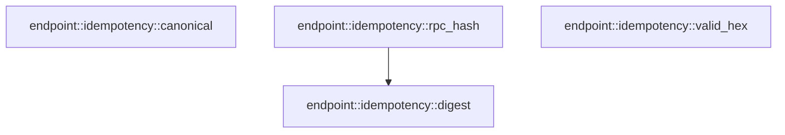

# endpoint::idempotency

[Package atlas](index.md) · [Source](../../src/idempotency.rs)

## Declarations

Visibility is the declaration spelling; trait members and reexports require their enclosing interface. `cfg` is not evaluated.

| Symbol | Kind | Visibility | Test / cfg |
|---|---|---|---|
| [endpoint::idempotency::VERSION](../../src/idempotency.rs#L16) | const_item | `private` |  |
| [endpoint::idempotency::RpcClaim](../../src/idempotency.rs#L19) | struct_item | `pub` |  |
| [endpoint::idempotency::RpcClaim::rpc_id](../../src/idempotency.rs#L29) | function_item | `pub` |  |
| [endpoint::idempotency::RpcClaim::method](../../src/idempotency.rs#L34) | function_item | `pub` |  |
| [endpoint::idempotency::RpcBegin](../../src/idempotency.rs#L40) | enum_item | `pub` |  |
| [endpoint::idempotency::RpcLookup](../../src/idempotency.rs#L46) | enum_item | `pub` |  |
| [endpoint::idempotency::Phase](../../src/idempotency.rs#L54) | enum_item | `private` |  |
| [endpoint::idempotency::ProjectionMetadata](../../src/idempotency.rs#L63) | struct_item | `private` |  |
| [endpoint::idempotency::RpcDurableIdentity](../../src/idempotency.rs#L69) | struct_item | `pub` |  |
| [endpoint::idempotency::Record](../../src/idempotency.rs#L78) | struct_item | `private` |  |
| [endpoint::idempotency::Entry](../../src/idempotency.rs#L102) | enum_item | `private` |  |
| [endpoint::idempotency::RpcRegistry](../../src/idempotency.rs#L114) | struct_item | `pub` |  |
| [endpoint::idempotency::RpcRegistry::open](../../src/idempotency.rs#L121) | function_item | `pub` |  |
| [endpoint::idempotency::RpcRegistry::path](../../src/idempotency.rs#L144) | function_item | `pub` |  |
| [endpoint::idempotency::RpcRegistry::begin](../../src/idempotency.rs#L148) | function_item | `pub` |  |
| [endpoint::idempotency::RpcRegistry::lookup](../../src/idempotency.rs#L177) | function_item | `pub` |  |
| [endpoint::idempotency::RpcRegistry::handoff](../../src/idempotency.rs#L197) | function_item | `pub` |  |
| [endpoint::idempotency::RpcRegistry::complete](../../src/idempotency.rs#L217) | function_item | `pub` |  |
| [endpoint::idempotency::RpcRegistry::mark_handed_off](../../src/idempotency.rs#L313) | function_item | `pub` |  |
| [endpoint::idempotency::RpcRegistry::publish_prepared](../../src/idempotency.rs#L375) | function_item | `private` |  |
| [endpoint::idempotency::RpcRegistry::append](../../src/idempotency.rs#L414) | function_item | `private` |  |
| [endpoint::idempotency::RpcRegistry::read_unlocked](../../src/idempotency.rs#L425) | function_item | `private` |  |
| [endpoint::idempotency::RpcRegistry::repair_all](../../src/idempotency.rs#L438) | function_item | `private` |  |
| [endpoint::idempotency::RpcRegistry::record_path](../../src/idempotency.rs#L484) | function_item | `private` |  |
| [endpoint::idempotency::make_claim](../../src/idempotency.rs#L489) | function_item | `private` |  |
| [endpoint::idempotency::same_claim](../../src/idempotency.rs#L525) | function_item | `private` |  |
| [endpoint::idempotency::parse](../../src/idempotency.rs#L533) | function_item | `private` |  |
| [endpoint::idempotency::decode_response](../../src/idempotency.rs#L687) | function_item | `private` |  |
| [endpoint::idempotency::parse_cached_result](../../src/idempotency.rs#L700) | function_item | `private` |  |
| [endpoint::idempotency::validate_durable_identity](../../src/idempotency.rs#L732) | function_item | `private` |  |
| [endpoint::idempotency::canonical](../../src/idempotency.rs#L742) | function_item | `private` |  |
| [endpoint::idempotency::rpc_hash](../../src/idempotency.rs#L747) | function_item | `private` |  |
| [endpoint::idempotency::digest](../../src/idempotency.rs#L751) | function_item | `private` |  |
| [endpoint::idempotency::valid_hex](../../src/idempotency.rs#L755) | function_item | `private` |  |
| [endpoint::idempotency::RpcRegistryError](../../src/idempotency.rs#L768) | enum_item | `pub` |  |

## Imports / reexports

| Local name | Source path | Visibility |
|---|---|---|
| `fs` | `std::fs` | `private` |
| `OpenOptions` | `std::fs::OpenOptions` | `private` |
| `Write` | `std::io::Write` | `private` |
| `Path` | `std::path::Path` | `private` |
| `PathBuf` | `std::path::PathBuf` | `private` |
| `Engine` | `base64::Engine` | `private` |
| `BASE64` | `base64::engine::general_purpose::STANDARD` | `private` |
| `Deserialize` | `serde::Deserialize` | `private` |
| `Serialize` | `serde::Serialize` | `private` |
| `Digest` | `sha2::Digest` | `private` |
| `Sha256` | `sha2::Sha256` | `private` |
| `FullSync` | `store::FullSync` | `private` |
| `NamedLock` | `store::NamedLock` | `private` |
| `Error` | `thiserror::Error` | `private` |
| `ClientRequest` | `crate::ClientRequest` | `private` |
| `RespondReceipt` | `crate::RespondReceipt` | `private` |
| `RpcResult` | `crate::RpcResult` | `private` |
| `ServerResponse` | `crate::ServerResponse` | `private` |
| `validate_response` | `crate::validate_response` | `private` |
| `validate_rpc_id` | `crate::validate_rpc_id` | `private` |

## Module declarations

| Module | Visibility | Attributes |
|---|---|---|

## Function call graphs

Edges below are syntactically resolved calls only, including private functions. Graphs partition callers into groups of 20; they are not execution order. All unresolved sites are listed below and in the JSON inventory.

```mermaid
flowchart TD
  n0["endpoint::idempotency::RpcRegistry::open"]
  n1["endpoint::idempotency::RpcRegistry::path"]
  n2["endpoint::idempotency::RpcRegistry::begin"]
  n3["endpoint::idempotency::RpcRegistry::lookup"]
  n4["endpoint::idempotency::RpcRegistry::handoff"]
  n5["endpoint::idempotency::RpcRegistry::complete"]
  n6["endpoint::idempotency::RpcClaim::rpc_id"]
  n7["endpoint::idempotency::RpcRegistry::mark_handed_off"]
  n8["endpoint::idempotency::RpcClaim::method"]
  n9["endpoint::idempotency::RpcRegistry::publish_prepared"]
  n10["endpoint::idempotency::RpcRegistry::append"]
  n11["endpoint::idempotency::RpcRegistry::read_unlocked"]
  n12["endpoint::idempotency::RpcRegistry::repair_all"]
  n13["endpoint::idempotency::RpcRegistry::record_path"]
  n14["endpoint::idempotency::make_claim"]
  n15["endpoint::idempotency::same_claim"]
  n16["endpoint::idempotency::parse"]
  n17["endpoint::idempotency::decode_response"]
  n18["endpoint::idempotency::parse_cached_result"]
  n19["endpoint::idempotency::validate_durable_identity"]
  n20["endpoint::idempotency::canonical"]
  n21["endpoint::idempotency::rpc_hash"]
  n22["endpoint::idempotency::digest"]
  n23["endpoint::idempotency::valid_hex"]
  n24["endpoint::rpc::validate_response"]
  n25["endpoint::rpc::validate_rpc_id"]
  n26["schema::ijson::IJsonValue::parse"]
  n27["store::management_root::endpoint_management_root"]
  n28["store::platform::NamedLock::exclusive"]
  n29["store::platform::FullSync::full_sync"]
  n30["store::platform::NamedLock::shared"]
  n0 --> n27
  n2 --> n9
  n2 --> n11
  n2 --> n14
  n2 --> n15
  n2 --> n28
  n3 --> n11
  n3 --> n14
  n3 --> n15
  n3 --> n30
  n4 --> n11
  n4 --> n15
  n4 --> n30
  n5 --> n10
  n5 --> n11
  n5 --> n15
  n5 --> n22
  n5 --> n28
  n7 --> n10
  n7 --> n11
  n7 --> n15
  n7 --> n19
  n7 --> n28
  n9 --> n13
  n9 --> n20
  n9 --> n21
  n9 --> n29
  n10 --> n13
  n10 --> n20
  n10 --> n21
  n10 --> n29
  n11 --> n13
  n11 --> n16
  n11 --> n21
  n12 --> n13
  n12 --> n16
  n12 --> n28
  n12 --> n29
  n14 --> n22
  n14 --> n25
  n16 --> n17
  n16 --> n18
  n16 --> n19
  n16 --> n20
  n16 --> n21
  n16 --> n22
  n16 --> n23
  n16 --> n25
  n18 --> n24
  n18 --> n26
```

Functions 1–20: 50 direct edges

Functions 21–24: 1 direct edges

## Call sites

Includes test functions (marked in declarations). Receiver-type-required sites need type analysis/manual tracing. Calls in closures are attributed to their enclosing function; their occurrence here does not mean the closure executes immediately.

| Caller | Callee expression | Source lines | Target / classification |
|---|---|---|---|
| `open` | `store::endpoint_management_root` | [122](../../src/idempotency.rs#L122) | [store::management_root::endpoint_management_root](../../../store/src/management_root.rs#L47) |
| `open` | `endpoint_root.as_ref` | [122](../../src/idempotency.rs#L122) | receiver-type-required |
| `open` | `root.join` | [123](../../src/idempotency.rs#L123), [125](../../src/idempotency.rs#L125) | receiver-type-required |
| `open` | `fs::create_dir_all` | [124](../../src/idempotency.rs#L124) | external-constructor-callback-or-unresolved |
| `open` | `lock_path.exists` | [126](../../src/idempotency.rs#L126) | receiver-type-required |
| `open` | `OpenOptions::new()             .create(true)             .append(true)             .open` | [127](../../src/idempotency.rs#L127) | receiver-type-required |
| `open` | `OpenOptions::new()             .create(true)             .append` | [127](../../src/idempotency.rs#L127) | receiver-type-required |
| `open` | `OpenOptions::new()             .create` | [127](../../src/idempotency.rs#L127) | receiver-type-required |
| `open` | `OpenOptions::new` | [127](../../src/idempotency.rs#L127) | external-constructor-callback-or-unresolved |
| `open` | `fs::File::open(&root)?.sync_all` | [132](../../src/idempotency.rs#L132) | receiver-type-required |
| `open` | `fs::File::open` | [132](../../src/idempotency.rs#L132) | external-constructor-callback-or-unresolved |
| `open` | `registry.repair_all` | [139](../../src/idempotency.rs#L139) | receiver-type-required |
| `open` | `Ok` | [140](../../src/idempotency.rs#L140) | external-constructor-callback-or-unresolved |
| `begin` | `make_claim` | [149](../../src/idempotency.rs#L149) | [endpoint::idempotency::make_claim](../../src/idempotency.rs#L489) |
| `begin` | `NamedLock::exclusive` | [150](../../src/idempotency.rs#L150) | [store::platform::NamedLock::exclusive](../../../store/src/platform.rs#L103) |
| `begin` | `self.read_unlocked` | [151](../../src/idempotency.rs#L151) | [endpoint::idempotency::RpcRegistry::read_unlocked](../../src/idempotency.rs#L425) |
| `begin` | `same_claim` | [157](../../src/idempotency.rs#L157) | [endpoint::idempotency::same_claim](../../src/idempotency.rs#L525) |
| `begin` | `Ok` | [158](../../src/idempotency.rs#L158), [169](../../src/idempotency.rs#L169) | external-constructor-callback-or-unresolved |
| `begin` | `RpcBegin::Completed` | [159](../../src/idempotency.rs#L159) | external-constructor-callback-or-unresolved |
| `begin` | `Err` | [166](../../src/idempotency.rs#L166) | external-constructor-callback-or-unresolved |
| `begin` | `RpcRegistryError::Conflict` | [166](../../src/idempotency.rs#L166) | external-constructor-callback-or-unresolved |
| `begin` | `self.publish_prepared` | [168](../../src/idempotency.rs#L168) | [endpoint::idempotency::RpcRegistry::publish_prepared](../../src/idempotency.rs#L375) |
| `lookup` | `make_claim` | [178](../../src/idempotency.rs#L178) | [endpoint::idempotency::make_claim](../../src/idempotency.rs#L489) |
| `lookup` | `NamedLock::shared` | [179](../../src/idempotency.rs#L179) | [store::platform::NamedLock::shared](../../../store/src/platform.rs#L99) |
| `lookup` | `self.read_unlocked` | [180](../../src/idempotency.rs#L180) | [endpoint::idempotency::RpcRegistry::read_unlocked](../../src/idempotency.rs#L425) |
| `lookup` | `Ok` | [181](../../src/idempotency.rs#L181), [189](../../src/idempotency.rs#L189) | external-constructor-callback-or-unresolved |
| `lookup` | `Err` | [182](../../src/idempotency.rs#L182) | external-constructor-callback-or-unresolved |
| `lookup` | `RpcRegistryError::Conflict` | [182](../../src/idempotency.rs#L182) | external-constructor-callback-or-unresolved |
| `lookup` | `same_claim` | [188](../../src/idempotency.rs#L188) | [endpoint::idempotency::same_claim](../../src/idempotency.rs#L525) |
| `lookup` | `RpcLookup::Completed` | [190](../../src/idempotency.rs#L190) | external-constructor-callback-or-unresolved |
| `lookup` | `RpcLookup::Pending` | [191](../../src/idempotency.rs#L191) | external-constructor-callback-or-unresolved |
| `handoff` | `NamedLock::shared` | [201](../../src/idempotency.rs#L201) | [store::platform::NamedLock::shared](../../../store/src/platform.rs#L99) |
| `handoff` | `self             .read_unlocked(&claim.rpc_id, false)?             .ok_or_else` | [202](../../src/idempotency.rs#L202) | receiver-type-required |
| `handoff` | `self             .read_unlocked` | [202](../../src/idempotency.rs#L202) | [endpoint::idempotency::RpcRegistry::read_unlocked](../../src/idempotency.rs#L425) |
| `handoff` | `RpcRegistryError::MissingClaim` | [204](../../src/idempotency.rs#L204) | external-constructor-callback-or-unresolved |
| `handoff` | `claim.rpc_id.clone` | [204](../../src/idempotency.rs#L204), [211](../../src/idempotency.rs#L211) | receiver-type-required |
| `handoff` | `Err` | [211](../../src/idempotency.rs#L211) | external-constructor-callback-or-unresolved |
| `handoff` | `RpcRegistryError::Conflict` | [211](../../src/idempotency.rs#L211) | external-constructor-callback-or-unresolved |
| `handoff` | `same_claim` | [213](../../src/idempotency.rs#L213) | [endpoint::idempotency::same_claim](../../src/idempotency.rs#L525) |
| `handoff` | `Ok` | [214](../../src/idempotency.rs#L214) | external-constructor-callback-or-unresolved |
| `complete` | `result.validate` | [222](../../src/idempotency.rs#L222) | receiver-type-required |
| `complete` | `NamedLock::exclusive` | [223](../../src/idempotency.rs#L223) | [store::platform::NamedLock::exclusive](../../../store/src/platform.rs#L103) |
| `complete` | `self             .read_unlocked(&claim.rpc_id, false)?             .ok_or_else` | [224](../../src/idempotency.rs#L224) | receiver-type-required |
| `complete` | `self             .read_unlocked` | [224](../../src/idempotency.rs#L224) | [endpoint::idempotency::RpcRegistry::read_unlocked](../../src/idempotency.rs#L425) |
| `complete` | `RpcRegistryError::MissingClaim` | [226](../../src/idempotency.rs#L226) | external-constructor-callback-or-unresolved |
| `complete` | `claim.rpc_id.clone` | [226](../../src/idempotency.rs#L226), [234](../../src/idempotency.rs#L234), [241](../../src/idempotency.rs#L241), [264](../../src/idempotency.rs#L264), [297](../../src/idempotency.rs#L297) | receiver-type-required |
| `complete` | `Err` | [234](../../src/idempotency.rs#L234), [241](../../src/idempotency.rs#L241), [245](../../src/idempotency.rs#L245), [256](../../src/idempotency.rs#L256), [287](../../src/idempotency.rs#L287) | external-constructor-callback-or-unresolved |
| `complete` | `RpcRegistryError::Conflict` | [234](../../src/idempotency.rs#L234) | external-constructor-callback-or-unresolved |
| `complete` | `same_claim` | [236](../../src/idempotency.rs#L236) | [endpoint::idempotency::same_claim](../../src/idempotency.rs#L525) |
| `complete` | `Ok` | [239](../../src/idempotency.rs#L239), [310](../../src/idempotency.rs#L310) | external-constructor-callback-or-unresolved |
| `complete` | `RpcRegistryError::ResultConflict` | [241](../../src/idempotency.rs#L241) | external-constructor-callback-or-unresolved |
| `complete` | `RpcRegistryError::Corruption` | [245](../../src/idempotency.rs#L245), [251](../../src/idempotency.rs#L251), [256](../../src/idempotency.rs#L256), [287](../../src/idempotency.rs#L287) | external-constructor-callback-or-unresolved |
| `complete` | `"unsupported completion phase".to_owned` | [246](../../src/idempotency.rs#L246) | receiver-type-required |
| `complete` | `result.value.as_ref().ok_or_else` | [250](../../src/idempotency.rs#L250) | receiver-type-required |
| `complete` | `result.value.as_ref` | [250](../../src/idempotency.rs#L250) | receiver-type-required |
| `complete` | `"respond completion omitted receipt".to_owned` | [251](../../src/idempotency.rs#L251) | receiver-type-required |
| `complete` | `value.canonical_bytes` | [253](../../src/idempotency.rs#L253) | receiver-type-required |
| `complete` | `serde_json::from_slice` | [254](../../src/idempotency.rs#L254) | external-constructor-callback-or-unresolved |
| `complete` | `receipt.reason.is_some` | [255](../../src/idempotency.rs#L255) | receiver-type-required |
| `complete` | `"respond carrier may cache only accepted:true".to_owned` | [257](../../src/idempotency.rs#L257) | receiver-type-required |
| `complete` | `serde_json_canonicalizer::to_vec(&ServerResponse {                 envelope_type: "server-response".to_owned(),                 rpc_id: claim.rpc_id.clone(),                 result: result.clone(),             })             .map_err` | [262](../../src/idempotency.rs#L262) | receiver-type-required |
| `complete` | `serde_json_canonicalizer::to_vec` | [262](../../src/idempotency.rs#L262) | external-constructor-callback-or-unresolved |
| `complete` | `"server-response".to_owned` | [263](../../src/idempotency.rs#L263) | receiver-type-required |
| `complete` | `result.clone` | [265](../../src/idempotency.rs#L265), [310](../../src/idempotency.rs#L310) | receiver-type-required |
| `complete` | `RpcRegistryError::Canonical` | [267](../../src/idempotency.rs#L267) | external-constructor-callback-or-unresolved |
| `complete` | `error.to_string` | [267](../../src/idempotency.rs#L267) | receiver-type-required |
| `complete` | `"rpc-result".to_owned` | [273](../../src/idempotency.rs#L273), [281](../../src/idempotency.rs#L281) | receiver-type-required |
| `complete` | `digest` | [274](../../src/idempotency.rs#L274), [282](../../src/idempotency.rs#L282) | [endpoint::idempotency::digest](../../src/idempotency.rs#L751) |
| `complete` | `Some` | [279](../../src/idempotency.rs#L279), [297](../../src/idempotency.rs#L297), [304](../../src/idempotency.rs#L304), [306](../../src/idempotency.rs#L306) | external-constructor-callback-or-unresolved |
| `complete` | `durable_identity.unwrap_or_else` | [280](../../src/idempotency.rs#L280) | receiver-type-required |
| `complete` | `"rpc phase omitted its handoff proof".to_owned` | [288](../../src/idempotency.rs#L288) | receiver-type-required |
| `complete` | `self.append` | [292](../../src/idempotency.rs#L292) | [endpoint::idempotency::RpcRegistry::append](../../src/idempotency.rs#L414) |
| `complete` | `claim.operation.clone` | [299](../../src/idempotency.rs#L299) | receiver-type-required |
| `complete` | `claim.request_sha256.clone` | [300](../../src/idempotency.rs#L300) | receiver-type-required |
| `complete` | `claim.target_session.clone` | [301](../../src/idempotency.rs#L301) | receiver-type-required |
| `complete` | `claim.projection_metadata.clone` | [305](../../src/idempotency.rs#L305) | receiver-type-required |
| `complete` | `BASE64.encode` | [306](../../src/idempotency.rs#L306) | receiver-type-required |
| `mark_handed_off` | `delivery.is_empty` | [319](../../src/idempotency.rs#L319) | receiver-type-required |
| `mark_handed_off` | `Err` | [320](../../src/idempotency.rs#L320), [338](../../src/idempotency.rs#L338), [345](../../src/idempotency.rs#L345), [351](../../src/idempotency.rs#L351) | external-constructor-callback-or-unresolved |
| `mark_handed_off` | `RpcRegistryError::Corruption` | [320](../../src/idempotency.rs#L320), [345](../../src/idempotency.rs#L345), [351](../../src/idempotency.rs#L351) | external-constructor-callback-or-unresolved |
| `mark_handed_off` | `"handoff delivery must be nonempty".to_owned` | [321](../../src/idempotency.rs#L321) | receiver-type-required |
| `mark_handed_off` | `durable_identity.as_ref` | [324](../../src/idempotency.rs#L324) | receiver-type-required |
| `mark_handed_off` | `validate_durable_identity` | [325](../../src/idempotency.rs#L325) | [endpoint::idempotency::validate_durable_identity](../../src/idempotency.rs#L732) |
| `mark_handed_off` | `NamedLock::exclusive` | [327](../../src/idempotency.rs#L327) | [store::platform::NamedLock::exclusive](../../../store/src/platform.rs#L103) |
| `mark_handed_off` | `self             .read_unlocked(&claim.rpc_id, false)?             .ok_or_else` | [328](../../src/idempotency.rs#L328) | receiver-type-required |
| `mark_handed_off` | `self             .read_unlocked` | [328](../../src/idempotency.rs#L328) | [endpoint::idempotency::RpcRegistry::read_unlocked](../../src/idempotency.rs#L425) |
| `mark_handed_off` | `RpcRegistryError::MissingClaim` | [330](../../src/idempotency.rs#L330) | external-constructor-callback-or-unresolved |
| `mark_handed_off` | `claim.rpc_id.clone` | [330](../../src/idempotency.rs#L330), [338](../../src/idempotency.rs#L338), [360](../../src/idempotency.rs#L360) | receiver-type-required |
| `mark_handed_off` | `RpcRegistryError::Conflict` | [338](../../src/idempotency.rs#L338) | external-constructor-callback-or-unresolved |
| `mark_handed_off` | `same_claim` | [340](../../src/idempotency.rs#L340) | [endpoint::idempotency::same_claim](../../src/idempotency.rs#L525) |
| `mark_handed_off` | `Some` | [342](../../src/idempotency.rs#L342), [360](../../src/idempotency.rs#L360), [366](../../src/idempotency.rs#L366) | external-constructor-callback-or-unresolved |
| `mark_handed_off` | `delivery.to_owned` | [342](../../src/idempotency.rs#L342), [366](../../src/idempotency.rs#L366) | receiver-type-required |
| `mark_handed_off` | `Ok` | [343](../../src/idempotency.rs#L343) | external-constructor-callback-or-unresolved |
| `mark_handed_off` | `"handoff proof changed during retry".to_owned` | [346](../../src/idempotency.rs#L346) | receiver-type-required |
| `mark_handed_off` | `"handoff cannot follow terminal completion".to_owned` | [352](../../src/idempotency.rs#L352) | receiver-type-required |
| `mark_handed_off` | `self.append` | [355](../../src/idempotency.rs#L355) | [endpoint::idempotency::RpcRegistry::append](../../src/idempotency.rs#L414) |
| `mark_handed_off` | `claim.operation.clone` | [362](../../src/idempotency.rs#L362) | receiver-type-required |
| `mark_handed_off` | `claim.request_sha256.clone` | [363](../../src/idempotency.rs#L363) | receiver-type-required |
| `mark_handed_off` | `claim.target_session.clone` | [364](../../src/idempotency.rs#L364) | receiver-type-required |
| `mark_handed_off` | `claim.projection_metadata.clone` | [368](../../src/idempotency.rs#L368) | receiver-type-required |
| `publish_prepared` | `rpc_hash` | [376](../../src/idempotency.rs#L376) | [endpoint::idempotency::rpc_hash](../../src/idempotency.rs#L747) |
| `publish_prepared` | `self.rpc_root.join` | [377](../../src/idempotency.rs#L377) | receiver-type-required |
| `publish_prepared` | `shard.exists` | [378](../../src/idempotency.rs#L378) | receiver-type-required |
| `publish_prepared` | `fs::create_dir_all` | [379](../../src/idempotency.rs#L379) | external-constructor-callback-or-unresolved |
| `publish_prepared` | `fs::File::open(&self.rpc_root)?.sync_all` | [381](../../src/idempotency.rs#L381) | receiver-type-required |
| `publish_prepared` | `fs::File::open` | [381](../../src/idempotency.rs#L381), [410](../../src/idempotency.rs#L410) | external-constructor-callback-or-unresolved |
| `publish_prepared` | `self.record_path` | [383](../../src/idempotency.rs#L383) | [endpoint::idempotency::RpcRegistry::record_path](../../src/idempotency.rs#L484) |
| `publish_prepared` | `Some` | [387](../../src/idempotency.rs#L387) | external-constructor-callback-or-unresolved |
| `publish_prepared` | `claim.rpc_id.clone` | [387](../../src/idempotency.rs#L387) | receiver-type-required |
| `publish_prepared` | `claim.operation.clone` | [389](../../src/idempotency.rs#L389) | receiver-type-required |
| `publish_prepared` | `claim.request_sha256.clone` | [390](../../src/idempotency.rs#L390) | receiver-type-required |
| `publish_prepared` | `claim.target_session.clone` | [391](../../src/idempotency.rs#L391) | receiver-type-required |
| `publish_prepared` | `claim.projection_metadata.clone` | [395](../../src/idempotency.rs#L395) | receiver-type-required |
| `publish_prepared` | `canonical` | [399](../../src/idempotency.rs#L399) | [endpoint::idempotency::canonical](../../src/idempotency.rs#L742) |
| `publish_prepared` | `bytes.push` | [400](../../src/idempotency.rs#L400) | receiver-type-required |
| `publish_prepared` | `shard.join` | [401](../../src/idempotency.rs#L401) | receiver-type-required |
| `publish_prepared` | `OpenOptions::new()             .write(true)             .create_new(true)             .open` | [402](../../src/idempotency.rs#L402) | receiver-type-required |
| `publish_prepared` | `OpenOptions::new()             .write(true)             .create_new` | [402](../../src/idempotency.rs#L402) | receiver-type-required |
| `publish_prepared` | `OpenOptions::new()             .write` | [402](../../src/idempotency.rs#L402) | receiver-type-required |
| `publish_prepared` | `OpenOptions::new` | [402](../../src/idempotency.rs#L402) | external-constructor-callback-or-unresolved |
| `publish_prepared` | `file.write_all` | [406](../../src/idempotency.rs#L406) | receiver-type-required |
| `publish_prepared` | `FullSync::full_sync` | [407](../../src/idempotency.rs#L407) | [store::platform::FullSync::full_sync](../../../store/src/platform.rs#L31) |
| `publish_prepared` | `drop` | [408](../../src/idempotency.rs#L408) | external-constructor-callback-or-unresolved |
| `publish_prepared` | `fs::rename` | [409](../../src/idempotency.rs#L409) | external-constructor-callback-or-unresolved |
| `publish_prepared` | `fs::File::open(shard)?.sync_all` | [410](../../src/idempotency.rs#L410) | receiver-type-required |
| `publish_prepared` | `Ok` | [411](../../src/idempotency.rs#L411) | external-constructor-callback-or-unresolved |
| `append` | `canonical` | [415](../../src/idempotency.rs#L415) | [endpoint::idempotency::canonical](../../src/idempotency.rs#L742) |
| `append` | `bytes.push` | [416](../../src/idempotency.rs#L416) | receiver-type-required |
| `append` | `OpenOptions::new()             .append(true)             .open` | [417](../../src/idempotency.rs#L417) | receiver-type-required |
| `append` | `OpenOptions::new()             .append` | [417](../../src/idempotency.rs#L417) | receiver-type-required |
| `append` | `OpenOptions::new` | [417](../../src/idempotency.rs#L417) | external-constructor-callback-or-unresolved |
| `append` | `self.record_path` | [419](../../src/idempotency.rs#L419) | [endpoint::idempotency::RpcRegistry::record_path](../../src/idempotency.rs#L484) |
| `append` | `rpc_hash` | [419](../../src/idempotency.rs#L419) | [endpoint::idempotency::rpc_hash](../../src/idempotency.rs#L747) |
| `append` | `file.write_all` | [420](../../src/idempotency.rs#L420) | receiver-type-required |
| `append` | `FullSync::full_sync` | [421](../../src/idempotency.rs#L421) | [store::platform::FullSync::full_sync](../../../store/src/platform.rs#L31) |
| `append` | `Ok` | [422](../../src/idempotency.rs#L422) | external-constructor-callback-or-unresolved |
| `read_unlocked` | `rpc_hash` | [430](../../src/idempotency.rs#L430) | [endpoint::idempotency::rpc_hash](../../src/idempotency.rs#L747) |
| `read_unlocked` | `self.record_path` | [431](../../src/idempotency.rs#L431) | [endpoint::idempotency::RpcRegistry::record_path](../../src/idempotency.rs#L484) |
| `read_unlocked` | `path.exists` | [432](../../src/idempotency.rs#L432) | receiver-type-required |
| `read_unlocked` | `Ok` | [433](../../src/idempotency.rs#L433), [435](../../src/idempotency.rs#L435) | external-constructor-callback-or-unresolved |
| `read_unlocked` | `Some` | [435](../../src/idempotency.rs#L435) | external-constructor-callback-or-unresolved |
| `read_unlocked` | `parse` | [435](../../src/idempotency.rs#L435) | [endpoint::idempotency::parse](../../src/idempotency.rs#L533) |
| `read_unlocked` | `fs::read` | [435](../../src/idempotency.rs#L435) | external-constructor-callback-or-unresolved |
| `repair_all` | `NamedLock::exclusive` | [439](../../src/idempotency.rs#L439) | [store::platform::NamedLock::exclusive](../../../store/src/platform.rs#L103) |
| `repair_all` | `fs::read_dir` | [440](../../src/idempotency.rs#L440), [447](../../src/idempotency.rs#L447) | external-constructor-callback-or-unresolved |
| `repair_all` | `shard.file_type()?.is_dir` | [442](../../src/idempotency.rs#L442) | receiver-type-required |
| `repair_all` | `shard.file_type` | [442](../../src/idempotency.rs#L442) | receiver-type-required |
| `repair_all` | `Err` | [443](../../src/idempotency.rs#L443), [457](../../src/idempotency.rs#L457) | external-constructor-callback-or-unresolved |
| `repair_all` | `RpcRegistryError::Corruption` | [443](../../src/idempotency.rs#L443), [457](../../src/idempotency.rs#L457), [470](../../src/idempotency.rs#L470) | external-constructor-callback-or-unresolved |
| `repair_all` | `"rpc root contains non-shard entry".to_owned` | [444](../../src/idempotency.rs#L444) | receiver-type-required |
| `repair_all` | `shard.path` | [447](../../src/idempotency.rs#L447), [466](../../src/idempotency.rs#L466) | receiver-type-required |
| `repair_all` | `file.file_name().to_string_lossy().into_owned` | [449](../../src/idempotency.rs#L449) | receiver-type-required |
| `repair_all` | `file.file_name().to_string_lossy` | [449](../../src/idempotency.rs#L449) | receiver-type-required |
| `repair_all` | `file.file_name` | [449](../../src/idempotency.rs#L449) | receiver-type-required |
| `repair_all` | `name                     .strip_prefix('.')                     .and_then` | [450](../../src/idempotency.rs#L450) | receiver-type-required |
| `repair_all` | `name                     .strip_prefix` | [450](../../src/idempotency.rs#L450) | receiver-type-required |
| `repair_all` | `name.strip_suffix` | [452](../../src/idempotency.rs#L452), [469](../../src/idempotency.rs#L469) | receiver-type-required |
| `repair_all` | `fs::read` | [454](../../src/idempotency.rs#L454), [472](../../src/idempotency.rs#L472) | external-constructor-callback-or-unresolved |
| `repair_all` | `file.path` | [454](../../src/idempotency.rs#L454), [462](../../src/idempotency.rs#L462), [464](../../src/idempotency.rs#L464), [472](../../src/idempotency.rs#L472), [475](../../src/idempotency.rs#L475) | receiver-type-required |
| `repair_all` | `self.record_path` | [455](../../src/idempotency.rs#L455) | [endpoint::idempotency::RpcRegistry::record_path](../../src/idempotency.rs#L484) |
| `repair_all` | `target.exists` | [456](../../src/idempotency.rs#L456) | receiver-type-required |
| `repair_all` | `"rpc temp and published carrier coexist".to_owned` | [458](../../src/idempotency.rs#L458) | receiver-type-required |
| `repair_all` | `bytes.last` | [461](../../src/idempotency.rs#L461) | receiver-type-required |
| `repair_all` | `Some` | [461](../../src/idempotency.rs#L461) | external-constructor-callback-or-unresolved |
| `repair_all` | `parse(&bytes, hash, false).is_ok` | [461](../../src/idempotency.rs#L461) | receiver-type-required |
| `repair_all` | `parse` | [461](../../src/idempotency.rs#L461), [473](../../src/idempotency.rs#L473) | [endpoint::idempotency::parse](../../src/idempotency.rs#L533) |
| `repair_all` | `fs::rename` | [462](../../src/idempotency.rs#L462) | external-constructor-callback-or-unresolved |
| `repair_all` | `fs::remove_file` | [464](../../src/idempotency.rs#L464) | external-constructor-callback-or-unresolved |
| `repair_all` | `fs::File::open(shard.path())?.sync_all` | [466](../../src/idempotency.rs#L466) | receiver-type-required |
| `repair_all` | `fs::File::open` | [466](../../src/idempotency.rs#L466) | external-constructor-callback-or-unresolved |
| `repair_all` | `name.strip_suffix(".jsonl").ok_or_else` | [469](../../src/idempotency.rs#L469) | receiver-type-required |
| `repair_all` | `"rpc shard contains unknown entry".to_owned` | [470](../../src/idempotency.rs#L470) | receiver-type-required |
| `repair_all` | `bytes.len` | [474](../../src/idempotency.rs#L474) | receiver-type-required |
| `repair_all` | `OpenOptions::new().write(true).open` | [475](../../src/idempotency.rs#L475) | receiver-type-required |
| `repair_all` | `OpenOptions::new().write` | [475](../../src/idempotency.rs#L475) | receiver-type-required |
| `repair_all` | `OpenOptions::new` | [475](../../src/idempotency.rs#L475) | external-constructor-callback-or-unresolved |
| `repair_all` | `handle.set_len` | [476](../../src/idempotency.rs#L476) | receiver-type-required |
| `repair_all` | `FullSync::full_sync` | [477](../../src/idempotency.rs#L477) | [store::platform::FullSync::full_sync](../../../store/src/platform.rs#L31) |
| `repair_all` | `Ok` | [481](../../src/idempotency.rs#L481) | external-constructor-callback-or-unresolved |
| `record_path` | `self.rpc_root.join(&hash[..2]).join` | [485](../../src/idempotency.rs#L485) | receiver-type-required |
| `record_path` | `self.rpc_root.join` | [485](../../src/idempotency.rs#L485) | receiver-type-required |
| `make_claim` | `Err` | [491](../../src/idempotency.rs#L491), [495](../../src/idempotency.rs#L495) | external-constructor-callback-or-unresolved |
| `make_claim` | `crate::rpc::RequestError::Envelope.into` | [491](../../src/idempotency.rs#L491) | receiver-type-required |
| `make_claim` | `validate_rpc_id` | [493](../../src/idempotency.rs#L493) | [endpoint::rpc::validate_rpc_id](../../src/rpc.rs#L186) |
| `make_claim` | `request.method.is_empty` | [494](../../src/idempotency.rs#L494) | receiver-type-required |
| `make_claim` | `serde_json_canonicalizer::to_vec(request)         .map_err` | [497](../../src/idempotency.rs#L497) | receiver-type-required |
| `make_claim` | `serde_json_canonicalizer::to_vec` | [497](../../src/idempotency.rs#L497) | external-constructor-callback-or-unresolved |
| `make_claim` | `RpcRegistryError::Canonical` | [498](../../src/idempotency.rs#L498) | external-constructor-callback-or-unresolved |
| `make_claim` | `error.to_string` | [498](../../src/idempotency.rs#L498) | receiver-type-required |
| `make_claim` | `serde_json::from_slice` | [499](../../src/idempotency.rs#L499) | external-constructor-callback-or-unresolved |
| `make_claim` | `request.payload.canonical_bytes` | [499](../../src/idempotency.rs#L499) | receiver-type-required |
| `make_claim` | `payload         .get("sessionId")         .or_else(&#124;&#124; payload.pointer("/result/value/sessionId"))         .and_then(serde_json::Value::as_str)         .filter(&#124;value&#124; uuid::Uuid::parse_str(value).is_ok())         .map` | [500](../../src/idempotency.rs#L500) | receiver-type-required |
| `make_claim` | `payload         .get("sessionId")         .or_else(&#124;&#124; payload.pointer("/result/value/sessionId"))         .and_then(serde_json::Value::as_str)         .filter` | [500](../../src/idempotency.rs#L500) | receiver-type-required |
| `make_claim` | `payload         .get("sessionId")         .or_else(&#124;&#124; payload.pointer("/result/value/sessionId"))         .and_then` | [500](../../src/idempotency.rs#L500) | receiver-type-required |
| `make_claim` | `payload         .get("sessionId")         .or_else` | [500](../../src/idempotency.rs#L500) | receiver-type-required |
| `make_claim` | `payload         .get` | [500](../../src/idempotency.rs#L500) | receiver-type-required |
| `make_claim` | `payload.pointer` | [502](../../src/idempotency.rs#L502) | receiver-type-required |
| `make_claim` | `uuid::Uuid::parse_str(value).is_ok` | [504](../../src/idempotency.rs#L504) | receiver-type-required |
| `make_claim` | `uuid::Uuid::parse_str` | [504](../../src/idempotency.rs#L504) | external-constructor-callback-or-unresolved |
| `make_claim` | `(request.method == "session.prompt")         .then(&#124;&#124; {             payload                 .get("clientTimeZone")                 .and_then(serde_json::Value::as_str)                 .map(&#124;value&#124; ProjectionMetadata {                     client_time_zone: value.to_owned(),                 })         })         .flatten` | [506](../../src/idempotency.rs#L506) | receiver-type-required |
| `make_claim` | `(request.method == "session.prompt")         .then` | [506](../../src/idempotency.rs#L506) | receiver-type-required |
| `make_claim` | `payload                 .get("clientTimeZone")                 .and_then(serde_json::Value::as_str)                 .map` | [508](../../src/idempotency.rs#L508) | receiver-type-required |
| `make_claim` | `payload                 .get("clientTimeZone")                 .and_then` | [508](../../src/idempotency.rs#L508) | receiver-type-required |
| `make_claim` | `payload                 .get` | [508](../../src/idempotency.rs#L508) | receiver-type-required |
| `make_claim` | `value.to_owned` | [512](../../src/idempotency.rs#L512) | receiver-type-required |
| `make_claim` | `Ok` | [516](../../src/idempotency.rs#L516) | external-constructor-callback-or-unresolved |
| `make_claim` | `request.rpc_id.clone` | [517](../../src/idempotency.rs#L517) | receiver-type-required |
| `make_claim` | `request.method.clone` | [518](../../src/idempotency.rs#L518) | receiver-type-required |
| `make_claim` | `digest` | [519](../../src/idempotency.rs#L519) | [endpoint::idempotency::digest](../../src/idempotency.rs#L751) |
| `same_claim` | `Ok` | [527](../../src/idempotency.rs#L527) | external-constructor-callback-or-unresolved |
| `same_claim` | `Err` | [529](../../src/idempotency.rs#L529) | external-constructor-callback-or-unresolved |
| `same_claim` | `RpcRegistryError::Conflict` | [529](../../src/idempotency.rs#L529) | external-constructor-callback-or-unresolved |
| `same_claim` | `right.rpc_id.clone` | [529](../../src/idempotency.rs#L529) | receiver-type-required |
| `parse` | `Vec::new` | [538](../../src/idempotency.rs#L538) | external-constructor-callback-or-unresolved |
| `parse` | `bytes.len` | [540](../../src/idempotency.rs#L540) | receiver-type-required |
| `parse` | `bytes[offset..].iter().position` | [541](../../src/idempotency.rs#L541) | receiver-type-required |
| `parse` | `bytes[offset..].iter` | [541](../../src/idempotency.rs#L541) | receiver-type-required |
| `parse` | `rows.is_empty` | [542](../../src/idempotency.rs#L542) | receiver-type-required |
| `parse` | `Err` | [545](../../src/idempotency.rs#L545), [551](../../src/idempotency.rs#L551), [562](../../src/idempotency.rs#L562), [575](../../src/idempotency.rs#L575), [586](../../src/idempotency.rs#L586), [596](../../src/idempotency.rs#L596), [621](../../src/idempotency.rs#L621), [649](../../src/idempotency.rs#L649), [669](../../src/idempotency.rs#L669) | external-constructor-callback-or-unresolved |
| `parse` | `RpcRegistryError::Corruption` | [545](../../src/idempotency.rs#L545), [551](../../src/idempotency.rs#L551), [560](../../src/idempotency.rs#L560), [562](../../src/idempotency.rs#L562), [575](../../src/idempotency.rs#L575), [586](../../src/idempotency.rs#L586), [593](../../src/idempotency.rs#L593), [596](../../src/idempotency.rs#L596), [621](../../src/idempotency.rs#L621), [649](../../src/idempotency.rs#L649), [669](../../src/idempotency.rs#L669) | external-constructor-callback-or-unresolved |
| `parse` | `"partial rpc tail".to_owned` | [545](../../src/idempotency.rs#L545) | receiver-type-required |
| `parse` | `serde_json::from_slice` | [549](../../src/idempotency.rs#L549) | external-constructor-callback-or-unresolved |
| `parse` | `line.is_empty` | [550](../../src/idempotency.rs#L550) | receiver-type-required |
| `parse` | `canonical` | [550](../../src/idempotency.rs#L550) | [endpoint::idempotency::canonical](../../src/idempotency.rs#L742) |
| `parse` | `rows.len` | [550](../../src/idempotency.rs#L550), [567](../../src/idempotency.rs#L567) | receiver-type-required |
| `parse` | `"noncanonical row or ordinal gap".to_owned` | [552](../../src/idempotency.rs#L552) | receiver-type-required |
| `parse` | `rows.push` | [555](../../src/idempotency.rs#L555) | receiver-type-required |
| `parse` | `rows         .first()         .ok_or_else` | [558](../../src/idempotency.rs#L558) | receiver-type-required |
| `parse` | `rows         .first` | [558](../../src/idempotency.rs#L558) | receiver-type-required |
| `parse` | `"empty rpc carrier".to_owned` | [560](../../src/idempotency.rs#L560) | receiver-type-required |
| `parse` | `"unsupported rpc version".to_owned` | [563](../../src/idempotency.rs#L563) | receiver-type-required |
| `parse` | `first.rpc_id.is_none` | [568](../../src/idempotency.rs#L568) | receiver-type-required |
| `parse` | `first.rpc_sha256.as_deref` | [569](../../src/idempotency.rs#L569) | receiver-type-required |
| `parse` | `Some` | [569](../../src/idempotency.rs#L569), [570](../../src/idempotency.rs#L570), [613](../../src/idempotency.rs#L613), [633](../../src/idempotency.rs#L633), [653](../../src/idempotency.rs#L653), [657](../../src/idempotency.rs#L657), [660](../../src/idempotency.rs#L660), [666](../../src/idempotency.rs#L666) | external-constructor-callback-or-unresolved |
| `parse` | `first.retired_reason.as_deref` | [570](../../src/idempotency.rs#L570) | receiver-type-required |
| `parse` | `first.response_b64.is_none` | [571](../../src/idempotency.rs#L571) | receiver-type-required |
| `parse` | `Ok` | [573](../../src/idempotency.rs#L573), [676](../../src/idempotency.rs#L676) | external-constructor-callback-or-unresolved |
| `parse` | `"invalid retired rpc".to_owned` | [576](../../src/idempotency.rs#L576) | receiver-type-required |
| `parse` | `first.rpc_sha256.is_some` | [580](../../src/idempotency.rs#L580) | receiver-type-required |
| `parse` | `first.delivery.is_some` | [581](../../src/idempotency.rs#L581) | receiver-type-required |
| `parse` | `first.durable_identity.is_some` | [582](../../src/idempotency.rs#L582) | receiver-type-required |
| `parse` | `first.response_b64.is_some` | [583](../../src/idempotency.rs#L583) | receiver-type-required |
| `parse` | `first.retired_reason.is_some` | [584](../../src/idempotency.rs#L584) | receiver-type-required |
| `parse` | `"invalid prepared row".to_owned` | [587](../../src/idempotency.rs#L587) | receiver-type-required |
| `parse` | `first         .rpc_id         .as_ref()         .ok_or_else` | [590](../../src/idempotency.rs#L590) | receiver-type-required |
| `parse` | `first         .rpc_id         .as_ref` | [590](../../src/idempotency.rs#L590) | receiver-type-required |
| `parse` | `"prepared omitted rpc_id".to_owned` | [593](../../src/idempotency.rs#L593) | receiver-type-required |
| `parse` | `validate_rpc_id` | [594](../../src/idempotency.rs#L594) | [endpoint::rpc::validate_rpc_id](../../src/rpc.rs#L186) |
| `parse` | `rpc_hash` | [595](../../src/idempotency.rs#L595) | [endpoint::idempotency::rpc_hash](../../src/idempotency.rs#L747) |
| `parse` | `"rpc filename mismatch".to_owned` | [597](../../src/idempotency.rs#L597) | receiver-type-required |
| `parse` | `valid_hex` | [600](../../src/idempotency.rs#L600) | [endpoint::idempotency::valid_hex](../../src/idempotency.rs#L755) |
| `parse` | `rpc_id.clone` | [602](../../src/idempotency.rs#L602) | receiver-type-required |
| `parse` | `first.operation.clone` | [603](../../src/idempotency.rs#L603) | receiver-type-required |
| `parse` | `first.request_sha256.clone` | [604](../../src/idempotency.rs#L604) | receiver-type-required |
| `parse` | `first.target_session.clone` | [605](../../src/idempotency.rs#L605) | receiver-type-required |
| `parse` | `first.projection_metadata.clone` | [606](../../src/idempotency.rs#L606) | receiver-type-required |
| `parse` | `rows.iter().skip` | [611](../../src/idempotency.rs#L611) | receiver-type-required |
| `parse` | `rows.iter` | [611](../../src/idempotency.rs#L611) | receiver-type-required |
| `parse` | `row.rpc_id.as_deref` | [613](../../src/idempotency.rs#L613) | receiver-type-required |
| `parse` | `row.rpc_sha256.is_some` | [614](../../src/idempotency.rs#L614) | receiver-type-required |
| `parse` | `row.retired_reason.is_some` | [619](../../src/idempotency.rs#L619) | receiver-type-required |
| `parse` | `"rpc fields changed".to_owned` | [622](../../src/idempotency.rs#L622) | receiver-type-required |
| `parse` | `row                     .delivery                     .as_deref()                     .is_some_and` | [627](../../src/idempotency.rs#L627) | receiver-type-required |
| `parse` | `row                     .delivery                     .as_deref` | [627](../../src/idempotency.rs#L627) | receiver-type-required |
| `parse` | `delivery.is_empty` | [630](../../src/idempotency.rs#L630) | receiver-type-required |
| `parse` | `row.response_b64.is_none` | [631](../../src/idempotency.rs#L631) | receiver-type-required |
| `parse` | `row.delivery.clone().expect` | [634](../../src/idempotency.rs#L634) | receiver-type-required |
| `parse` | `row.delivery.clone` | [634](../../src/idempotency.rs#L634) | receiver-type-required |
| `parse` | `row.durable_identity.clone` | [635](../../src/idempotency.rs#L635) | receiver-type-required |
| `parse` | `row.delivery.is_none` | [639](../../src/idempotency.rs#L639) | receiver-type-required |
| `parse` | `row.durable_identity.is_some` | [640](../../src/idempotency.rs#L640), [661](../../src/idempotency.rs#L661) | receiver-type-required |
| `parse` | `row.response_b64.is_some` | [641](../../src/idempotency.rs#L641), [662](../../src/idempotency.rs#L662) | receiver-type-required |
| `parse` | `decode_response` | [643](../../src/idempotency.rs#L643), [665](../../src/idempotency.rs#L665) | [endpoint::idempotency::decode_response](../../src/idempotency.rs#L687) |
| `parse` | `row.durable_identity.as_ref().expect` | [644](../../src/idempotency.rs#L644), [664](../../src/idempotency.rs#L664) | receiver-type-required |
| `parse` | `row.durable_identity.as_ref` | [644](../../src/idempotency.rs#L644), [660](../../src/idempotency.rs#L660), [664](../../src/idempotency.rs#L664) | receiver-type-required |
| `parse` | `digest` | [646](../../src/idempotency.rs#L646) | [endpoint::idempotency::digest](../../src/idempotency.rs#L751) |
| `parse` | `identity.seq.is_some` | [647](../../src/idempotency.rs#L647) | receiver-type-required |
| `parse` | `"response identity mismatch".to_owned` | [650](../../src/idempotency.rs#L650) | receiver-type-required |
| `parse` | `parse_cached_result` | [653](../../src/idempotency.rs#L653), [666](../../src/idempotency.rs#L666) | [endpoint::idempotency::parse_cached_result](../../src/idempotency.rs#L700) |
| `parse` | `handoff.as_ref().is_some_and` | [656](../../src/idempotency.rs#L656) | receiver-type-required |
| `parse` | `handoff.as_ref` | [656](../../src/idempotency.rs#L656) | receiver-type-required |
| `parse` | `row.delivery.as_deref` | [657](../../src/idempotency.rs#L657) | receiver-type-required |
| `parse` | `identity                             .as_ref()                             .is_none_or` | [658](../../src/idempotency.rs#L658) | receiver-type-required |
| `parse` | `identity                             .as_ref` | [658](../../src/idempotency.rs#L658) | receiver-type-required |
| `parse` | `validate_durable_identity` | [664](../../src/idempotency.rs#L664) | [endpoint::idempotency::validate_durable_identity](../../src/idempotency.rs#L732) |
| `parse` | `"invalid phase transition".to_owned` | [670](../../src/idempotency.rs#L670) | receiver-type-required |
| `parse` | `Box::new` | [678](../../src/idempotency.rs#L678) | external-constructor-callback-or-unresolved |
| `decode_response` | `row.response_b64.as_ref().expect` | [688](../../src/idempotency.rs#L688) | receiver-type-required |
| `decode_response` | `row.response_b64.as_ref` | [688](../../src/idempotency.rs#L688) | receiver-type-required |
| `decode_response` | `BASE64         .decode(encoded)         .map_err` | [689](../../src/idempotency.rs#L689) | receiver-type-required |
| `decode_response` | `BASE64         .decode` | [689](../../src/idempotency.rs#L689) | receiver-type-required |
| `decode_response` | `RpcRegistryError::Corruption` | [691](../../src/idempotency.rs#L691), [693](../../src/idempotency.rs#L693) | external-constructor-callback-or-unresolved |
| `decode_response` | `"invalid response base64".to_owned` | [691](../../src/idempotency.rs#L691) | receiver-type-required |
| `decode_response` | `BASE64.encode` | [692](../../src/idempotency.rs#L692) | receiver-type-required |
| `decode_response` | `Err` | [693](../../src/idempotency.rs#L693) | external-constructor-callback-or-unresolved |
| `decode_response` | `"noncanonical base64".to_owned` | [694](../../src/idempotency.rs#L694) | receiver-type-required |
| `decode_response` | `Ok` | [697](../../src/idempotency.rs#L697) | external-constructor-callback-or-unresolved |
| `parse_cached_result` | `schema::IJsonValue::parse` | [705](../../src/idempotency.rs#L705) | [schema::ijson::IJsonValue::parse](../../../schema/src/ijson.rs#L16) |
| `parse_cached_result` | `serde_json::from_slice` | [706](../../src/idempotency.rs#L706), [718](../../src/idempotency.rs#L718) | external-constructor-callback-or-unresolved |
| `parse_cached_result` | `receipt.reason.is_some` | [707](../../src/idempotency.rs#L707) | receiver-type-required |
| `parse_cached_result` | `Err` | [708](../../src/idempotency.rs#L708), [724](../../src/idempotency.rs#L724) | external-constructor-callback-or-unresolved |
| `parse_cached_result` | `RpcRegistryError::Corruption` | [708](../../src/idempotency.rs#L708), [724](../../src/idempotency.rs#L724) | external-constructor-callback-or-unresolved |
| `parse_cached_result` | `"invalid cached respond receipt".to_owned` | [709](../../src/idempotency.rs#L709) | receiver-type-required |
| `parse_cached_result` | `Ok` | [712](../../src/idempotency.rs#L712), [728](../../src/idempotency.rs#L728) | external-constructor-callback-or-unresolved |
| `parse_cached_result` | `Some` | [714](../../src/idempotency.rs#L714) | external-constructor-callback-or-unresolved |
| `parse_cached_result` | `validate_response` | [719](../../src/idempotency.rs#L719) | [endpoint::rpc::validate_response](../../src/rpc.rs#L159) |
| `parse_cached_result` | `serde_json_canonicalizer::to_vec(&response)             .map_err` | [720](../../src/idempotency.rs#L720) | receiver-type-required |
| `parse_cached_result` | `serde_json_canonicalizer::to_vec` | [720](../../src/idempotency.rs#L720) | external-constructor-callback-or-unresolved |
| `parse_cached_result` | `RpcRegistryError::Canonical` | [721](../../src/idempotency.rs#L721) | external-constructor-callback-or-unresolved |
| `parse_cached_result` | `error.to_string` | [721](../../src/idempotency.rs#L721) | receiver-type-required |
| `parse_cached_result` | `"noncanonical cached response".to_owned` | [725](../../src/idempotency.rs#L725) | receiver-type-required |
| `validate_durable_identity` | `identity.kind.is_empty` | [733](../../src/idempotency.rs#L733) | receiver-type-required |
| `validate_durable_identity` | `identity.id.is_empty` | [733](../../src/idempotency.rs#L733) | receiver-type-required |
| `validate_durable_identity` | `Err` | [734](../../src/idempotency.rs#L734) | external-constructor-callback-or-unresolved |
| `validate_durable_identity` | `RpcRegistryError::Corruption` | [734](../../src/idempotency.rs#L734) | external-constructor-callback-or-unresolved |
| `validate_durable_identity` | `"durable identity fields must be nonempty".to_owned` | [735](../../src/idempotency.rs#L735) | receiver-type-required |
| `validate_durable_identity` | `Ok` | [738](../../src/idempotency.rs#L738) | external-constructor-callback-or-unresolved |
| `canonical` | `serde_json_canonicalizer::to_vec(record)         .map_err` | [743](../../src/idempotency.rs#L743) | receiver-type-required |
| `canonical` | `serde_json_canonicalizer::to_vec` | [743](../../src/idempotency.rs#L743) | external-constructor-callback-or-unresolved |
| `canonical` | `RpcRegistryError::Canonical` | [744](../../src/idempotency.rs#L744) | external-constructor-callback-or-unresolved |
| `canonical` | `error.to_string` | [744](../../src/idempotency.rs#L744) | receiver-type-required |
| `rpc_hash` | `digest` | [748](../../src/idempotency.rs#L748) | [endpoint::idempotency::digest](../../src/idempotency.rs#L751) |
| `rpc_hash` | `value.as_bytes` | [748](../../src/idempotency.rs#L748) | receiver-type-required |
| `valid_hex` | `value.len` | [756](../../src/idempotency.rs#L756) | receiver-type-required |
| `valid_hex` | `value             .bytes()             .all` | [757](../../src/idempotency.rs#L757) | receiver-type-required |
| `valid_hex` | `value             .bytes` | [757](../../src/idempotency.rs#L757) | receiver-type-required |
| `valid_hex` | `byte.is_ascii_hexdigit` | [759](../../src/idempotency.rs#L759) | receiver-type-required |
| `valid_hex` | `byte.is_ascii_uppercase` | [759](../../src/idempotency.rs#L759) | receiver-type-required |
| `valid_hex` | `Ok` | [761](../../src/idempotency.rs#L761) | external-constructor-callback-or-unresolved |
| `valid_hex` | `Err` | [763](../../src/idempotency.rs#L763) | external-constructor-callback-or-unresolved |
| `valid_hex` | `RpcRegistryError::Corruption` | [763](../../src/idempotency.rs#L763) | external-constructor-callback-or-unresolved |
| `valid_hex` | `"invalid sha256".to_owned` | [763](../../src/idempotency.rs#L763) | receiver-type-required |
