# endpoint::management

[Package atlas](index.md) · [Source](../../src/management.rs)

## Declarations

Visibility is the declaration spelling; trait members and reexports require their enclosing interface. `cfg` is not evaluated.

| Symbol | Kind | Visibility | Test / cfg |
|---|---|---|---|
| [endpoint::management::VERSION](../../src/management.rs#L28) | const_item | `private` |  |
| [endpoint::management::WorkspaceView](../../src/management.rs#L32) | struct_item | `pub` |  |
| [endpoint::management::WorkspaceList](../../src/management.rs#L42) | struct_item | `pub` |  |
| [endpoint::management::WorkspaceMetadata](../../src/management.rs#L49) | struct_item | `private` |  |
| [endpoint::management::OperationPhase](../../src/management.rs#L60) | enum_item | `private` |  |
| [endpoint::management::WorkspaceIntent](../../src/management.rs#L70) | struct_item | `private` |  |
| [endpoint::management::FolderMoveIntent](../../src/management.rs#L87) | struct_item | `private` |  |
| [endpoint::management::DiscardIntent](../../src/management.rs#L99) | struct_item | `private` |  |
| [endpoint::management::SessionCreateIntent](../../src/management.rs#L108) | struct_item | `private` |  |
| [endpoint::management::SelectModelIntent](../../src/management.rs#L123) | struct_item | `private` |  |
| [endpoint::management::ForkIntent](../../src/management.rs#L136) | struct_item | `private` |  |
| [endpoint::management::QueueTransactionIntent](../../src/management.rs#L151) | struct_item | `private` |  |
| [endpoint::management::QueueTailSnapshot](../../src/management.rs#L164) | struct_item | `private` |  |
| [endpoint::management::ORIGIN_CLIENT](../../src/management.rs#L172) | const_item | `pub` |  |
| [endpoint::management::LEGACY_ORIGIN_CLIENT](../../src/management.rs#L175) | const_item | `pub` |  |
| [endpoint::management::is_endpoint_origin_client](../../src/management.rs#L178) | function_item | `pub` |  |
| [endpoint::management::OperationRecord](../../src/management.rs#L184) | struct_item | `private` |  |
| [endpoint::management::WorkspaceOperationWrite](../../src/management.rs#L196) | struct_item | `private` |  |
| [endpoint::management::SessionCreateOperation](../../src/management.rs#L207) | struct_item | `pub` |  |
| [endpoint::management::SelectModelOperation](../../src/management.rs#L219) | struct_item | `pub` |  |
| [endpoint::management::ForkSessionOperation](../../src/management.rs#L229) | struct_item | `pub` |  |
| [endpoint::management::ForkLineage](../../src/management.rs#L242) | struct_item | `pub` |  |
| [endpoint::management::QueueTransactionOperation](../../src/management.rs#L247) | struct_item | `pub` |  |
| [endpoint::management::PendingQueueTransaction](../../src/management.rs#L260) | struct_item | `pub` |  |
| [endpoint::management::QueueTransactionDecision](../../src/management.rs#L271) | enum_item | `pub` |  |
| [endpoint::management::QueueTransactionCompletion](../../src/management.rs#L280) | enum_item | `pub` |  |
| [endpoint::management::QueueTransactionState](../../src/management.rs#L289) | enum_item | `pub` |  |
| [endpoint::management::QueueRecoveryDriver](../../src/management.rs#L294) | trait_item | `pub` |  |
| [endpoint::management::QueueRecoveryDriver::execute](../../src/management.rs#L295) | function_signature_item | `private` |  |
| [endpoint::management::SelectedModel](../../src/management.rs#L302) | struct_item | `pub` |  |
| [endpoint::management::ManagementStore](../../src/management.rs#L309) | struct_item | `pub` |  |
| [endpoint::management::ManagementStore::open](../../src/management.rs#L316) | function_item | `pub` |  |
| [endpoint::management::ManagementStore::open_at](../../src/management.rs#L320) | function_item | `pub` |  |
| [endpoint::management::ManagementStore::open_at_with_queue_driver](../../src/management.rs#L327) | function_item | `pub` |  |
| [endpoint::management::ManagementStore::root](../../src/management.rs#L356) | function_item | `pub` |  |
| [endpoint::management::ManagementStore::recover](../../src/management.rs#L361) | function_item | `pub` |  |
| [endpoint::management::ManagementStore::recover_with_queue_driver](../../src/management.rs#L365) | function_item | `pub` |  |
| [endpoint::management::ManagementStore::seed_missing_workspace_policies](../../src/management.rs#L475) | function_item | `private` |  |
| [endpoint::management::ManagementStore::reconcile_workspace_metadata](../../src/management.rs#L491) | function_item | `private` |  |
| [endpoint::management::ManagementStore::list_workspaces](../../src/management.rs#L525) | function_item | `pub` |  |
| [endpoint::management::ManagementStore::workspace_path](../../src/management.rs#L562) | function_item | `pub` |  |
| [endpoint::management::ManagementStore::create_session](../../src/management.rs#L575) | function_item | `pub` |  |
| [endpoint::management::ManagementStore::select_model](../../src/management.rs#L699) | function_item | `pub` |  |
| [endpoint::management::ManagementStore::fork_session](../../src/management.rs#L781) | function_item | `pub` |  |
| [endpoint::management::ManagementStore::prepare_queue_transaction](../../src/management.rs#L865) | function_item | `pub` |  |
| [endpoint::management::ManagementStore::complete_queue_transaction](../../src/management.rs#L966) | function_item | `pub` |  |
| [endpoint::management::ManagementStore::has_incomplete_session_operation](../../src/management.rs#L982) | function_item | `pub` |  |
| [endpoint::management::ManagementStore::completed_fork_lineage](../../src/management.rs#L999) | function_item | `pub` |  |
| [endpoint::management::ManagementStore::create_workspace](../../src/management.rs#L1020) | function_item | `pub` |  |
| [endpoint::management::ManagementStore::rename_workspace](../../src/management.rs#L1085) | function_item | `pub` |  |
| [endpoint::management::ManagementStore::relocate_workspace](../../src/management.rs#L1130) | function_item | `pub` |  |
| [endpoint::management::ManagementStore::archive_session](../../src/management.rs#L1202) | function_item | `pub` |  |
| [endpoint::management::ManagementStore::unarchive_session](../../src/management.rs#L1232) | function_item | `pub` |  |
| [endpoint::management::ManagementStore::discard_session](../../src/management.rs#L1253) | function_item | `pub` |  |
| [endpoint::management::ManagementStore::drive_discard](../../src/management.rs#L1314) | function_item | `private` |  |
| [endpoint::management::ManagementStore::folder_move](../../src/management.rs#L1369) | function_item | `private` |  |
| [endpoint::management::ManagementStore::begin_workspace_operation](../../src/management.rs#L1445) | function_item | `private` |  |
| [endpoint::management::ManagementStore::drive_workspace_operation](../../src/management.rs#L1500) | function_item | `private` |  |
| [endpoint::management::ManagementStore::workspace_configs](../../src/management.rs#L1605) | function_item | `private` |  |
| [endpoint::management::ManagementStore::operation_created](../../src/management.rs#L1617) | function_item | `private` |  |
| [endpoint::management::ManagementStore::rebuild_candidate](../../src/management.rs#L1651) | function_item | `private` |  |
| [endpoint::management::ManagementStore::drive_session_create](../../src/management.rs#L1748) | function_item | `private` |  |
| [endpoint::management::ManagementStore::session_id_from_response](../../src/management.rs#L1816) | function_item | `private` |  |
| [endpoint::management::ManagementStore::drive_select_model](../../src/management.rs#L1830) | function_item | `private` |  |
| [endpoint::management::ManagementStore::fork_was_quarantined](../../src/management.rs#L1896) | function_item | `private` |  |
| [endpoint::management::ManagementStore::drive_fork](../../src/management.rs#L1925) | function_item | `private` |  |
| [endpoint::management::ManagementStore::drive_queue_completion](../../src/management.rs#L2004) | function_item | `private` |  |
| [endpoint::management::ManagementStore::remove_recordless_payloads](../../src/management.rs#L2063) | function_item | `private` |  |
| [endpoint::management::ManagementStore::remove_recordless_payload](../../src/management.rs#L2090) | function_item | `private` |  |
| [endpoint::management::ManagementStore::drive_folder_move](../../src/management.rs#L2109) | function_item | `private` |  |
| [endpoint::management::ManagementStore::operation_paths](../../src/management.rs#L2187) | function_item | `private` |  |
| [endpoint::management::ManagementStore::operation_path](../../src/management.rs#L2207) | function_item | `private` |  |
| [endpoint::management::ManagementStore::operation_payload_path](../../src/management.rs#L2215) | function_item | `private` |  |
| [endpoint::management::ManagementStore::metadata_path](../../src/management.rs#L2224) | function_item | `private` |  |
| [endpoint::management::ManagementStore::read_metadata](../../src/management.rs#L2230) | function_item | `private` |  |
| [endpoint::management::ManagementStore::read_metadata_optional](../../src/management.rs#L2238) | function_item | `private` |  |
| [endpoint::management::primary_path](../../src/management.rs#L2251) | function_item | `private` |  |
| [endpoint::management::binding_for_path](../../src/management.rs#L2260) | function_item | `private` |  |
| [endpoint::management::binding_for_canonical_path](../../src/management.rs#L2266) | function_item | `private` |  |
| [endpoint::management::execution_path_from_snapshot](../../src/management.rs#L2281) | function_item | `private` |  |
| [endpoint::management::folder_binding_matches_snapshot](../../src/management.rs#L2287) | function_item | `private` |  |
| [endpoint::management::resolve_session_workspace](../../src/management.rs#L2291) | function_item | `private` |  |
| [endpoint::management::existing_session_cwd](../../src/management.rs#L2353) | function_item | `private` |  |
| [endpoint::management::create_genesis](../../src/management.rs#L2374) | function_item | `private` |  |
| [endpoint::management::canonical_event_line](../../src/management.rs#L2405) | function_item | `private` |  |
| [endpoint::management::read_canonical_event](../../src/management.rs#L2411) | function_item | `private` |  |
| [endpoint::management::verify_session_create_genesis](../../src/management.rs#L2422) | function_item | `private` |  |
| [endpoint::management::sync_operation_payload](../../src/management.rs#L2467) | function_item | `private` |  |
| [endpoint::management::is_hex_digest](../../src/management.rs#L2480) | function_item | `private` |  |
| [endpoint::management::default_workspace_policy](../../src/management.rs#L2494) | function_item | `pub` |  |
| [endpoint::management::relocate_policy_roots](../../src/management.rs#L2508) | function_item | `private` |  |
| [endpoint::management::canonical_workspace_path](../../src/management.rs#L2531) | function_item | `private` |  |
| [endpoint::management::unavailable_absolute_path](../../src/management.rs#L2540) | function_item | `private` |  |
| [endpoint::management::allocate_uuid_v7](../../src/management.rs#L2545) | function_item | `private` |  |
| [endpoint::management::current_timestamp](../../src/management.rs#L2564) | function_item | `private` |  |
| [endpoint::management::validate_title](../../src/management.rs#L2573) | function_item | `private` |  |
| [endpoint::management::ensure_unique_title](../../src/management.rs#L2585) | function_item | `private` |  |
| [endpoint::management::verify_metadata](../../src/management.rs#L2599) | function_item | `private` |  |
| [endpoint::management::workspace_view](../../src/management.rs#L2617) | function_item | `private` |  |
| [endpoint::management::timestamp_from_millis](../../src/management.rs#L2643) | function_item | `private` |  |
| [endpoint::management::publish_canonical](../../src/management.rs#L2667) | function_item | `private` |  |
| [endpoint::management::read_canonical](../../src/management.rs#L2672) | function_item | `private` |  |
| [endpoint::management::decode_canonical](../../src/management.rs#L2676) | function_item | `private` |  |
| [endpoint::management::canonical_line](../../src/management.rs#L2697) | function_item | `private` |  |
| [endpoint::management::to_ijson](../../src/management.rs#L2704) | function_item | `private` |  |
| [endpoint::management::intent_kind](../../src/management.rs#L2712) | function_item | `private` |  |
| [endpoint::management::workspace_intent](../../src/management.rs#L2723) | function_item | `private` |  |
| [endpoint::management::discard_intent](../../src/management.rs#L2747) | function_item | `private` |  |
| [endpoint::management::folder_is_ephemeral](../../src/management.rs#L2759) | function_item | `private` |  |
| [endpoint::management::folder_move_intent](../../src/management.rs#L2769) | function_item | `private` |  |
| [endpoint::management::session_create_intent](../../src/management.rs#L2780) | function_item | `private` |  |
| [endpoint::management::select_model_intent](../../src/management.rs#L2805) | function_item | `private` |  |
| [endpoint::management::fork_intent](../../src/management.rs#L2825) | function_item | `private` |  |
| [endpoint::management::queue_transaction_intent](../../src/management.rs#L2842) | function_item | `private` |  |
| [endpoint::management::pending_queue_transaction](../../src/management.rs#L2870) | function_item | `private` |  |
| [endpoint::management::verify_queue_payload](../../src/management.rs#L2885) | function_item | `private` |  |
| [endpoint::management::completion_for_decision](../../src/management.rs#L2920) | function_item | `private` |  |
| [endpoint::management::queue_completion_value](../../src/management.rs#L2932) | function_item | `private` |  |
| [endpoint::management::queue_completion_from_record](../../src/management.rs#L2970) | function_item | `private` |  |
| [endpoint::management::operation_target_session](../../src/management.rs#L3017) | function_item | `private` |  |
| [endpoint::management::is_uid_principal](../../src/management.rs#L3033) | function_item | `private` |  |
| [endpoint::management::fork_id_from_response](../../src/management.rs#L3039) | function_item | `private` |  |
| [endpoint::management::selected_model_from_response](../../src/management.rs#L3051) | function_item | `private` |  |
| [endpoint::management::active_session_folder](../../src/management.rs#L3089) | function_item | `private` |  |
| [endpoint::management::valid_folder_projection](../../src/management.rs#L3100) | function_item | `private` |  |
| [endpoint::management::folder_reservation](../../src/management.rs#L3113) | function_item | `private` |  |
| [endpoint::management::verify_folder_reservation](../../src/management.rs#L3131) | function_item | `private` |  |
| [endpoint::management::folder_workspace](../../src/management.rs#L3144) | function_item | `private` |  |
| [endpoint::management::active_session_count](../../src/management.rs#L3159) | function_item | `private` |  |
| [endpoint::management::hex_digest](../../src/management.rs#L3169) | function_item | `private` |  |
| [endpoint::management::ManagementError](../../src/management.rs#L3174) | enum_item | `pub` |  |
| [endpoint::management::tests::omitted_identity_is_auto_but_explicit_and_legacy_identity_stay_fixed](../../src/management.rs#L3253) | function_item | `private` | test; #[cfg(test)] |
| [endpoint::management::tests::legacy_session_create_without_folder_binding_remains_recoverable](../../src/management.rs#L3286) | function_item | `private` | test; #[cfg(test)] |
| [endpoint::management::tests::quarantined_fork_does_not_block_recovery_or_claim_success](../../src/management.rs#L3301) | function_item | `private` | test; #[cfg(test)] |
| [endpoint::management::tests::unavailable_workspace_keeps_its_management_operation_pending](../../src/management.rs#L3372) | function_item | `private` | test; #[cfg(test)] |
| [endpoint::management::tests::a_select_model_payload_staged_before_the_rename_is_read_on_recovery](../../src/management.rs#L3410) | function_item | `private` | test; #[cfg(test)] |
| [endpoint::management::tests::a_created_workspace_starts_with_the_interactive_fixed_catalog_writable_in_its_folder](../../src/management.rs#L3478) | function_item | `private` | test; #[cfg(test)] |
| [endpoint::management::tests::opening_the_store_seeds_a_policy_for_a_policy_less_workspace_once](../../src/management.rs#L3522) | function_item | `private` | test; #[cfg(test)] |
| [endpoint::management::tests::relocation_moves_writable_roots_with_their_folder](../../src/management.rs#L3570) | function_item | `private` | test; #[cfg(test)] |
| [endpoint::management::tests::completed_workspace_operation_never_reopens_its_old_path](../../src/management.rs#L3606) | function_item | `private` | test; #[cfg(test)] |

## Imports / reexports

| Local name | Source path | Visibility |
|---|---|---|
| `BTreeMap` | `std::collections::BTreeMap` | `private` |
| `fs` | `std::fs` | `private` |
| `File` | `std::fs::File` | `private` |
| `Read` | `std::io::Read` | `private` |
| `MetadataExt` | `std::os::unix::fs::MetadataExt` | `private` |
| `Path` | `std::path::Path` | `private` |
| `PathBuf` | `std::path::PathBuf` | `private` |
| `SystemTime` | `std::time::SystemTime` | `private` |
| `UNIX_EPOCH` | `std::time::UNIX_EPOCH` | `private` |
| `ConfigRepository` | `profile::ConfigRepository` | `private` |
| `InstructionResolver` | `profile::InstructionResolver` | `private` |
| `WorkspaceConfig` | `profile::WorkspaceConfig` | `private` |
| `WorkspaceFolder` | `profile::WorkspaceFolder` | `private` |
| `WorkspacePolicy` | `profile::WorkspacePolicy` | `private` |
| `Event` | `schema::Event` | `private` |
| `IJsonValue` | `schema::IJsonValue` | `private` |
| `OriginTuple` | `schema::OriginTuple` | `private` |
| `ResumePolicy` | `schema::ResumePolicy` | `private` |
| `Deserialize` | `serde::Deserialize` | `private` |
| `Serialize` | `serde::Serialize` | `private` |
| `Value` | `serde_json::Value` | `private` |
| `json` | `serde_json::json` | `private` |
| `Digest` | `sha2::Digest` | `private` |
| `Sha256` | `sha2::Sha256` | `private` |
| `AssetStore` | `store::AssetStore` | `private` |
| `AtomicPublisher` | `store::AtomicPublisher` | `private` |
| `DirectoryLock` | `store::DirectoryLock` | `private` |
| `NamedLock` | `store::NamedLock` | `private` |
| `ThreadStore` | `store::ThreadStore` | `private` |
| `scan_valid_prefix` | `store::scan_valid_prefix` | `private` |
| `Error` | `thiserror::Error` | `private` |
| `Uuid` | `uuid::Uuid` | `private` |
| `SessionInventoryItem` | `crate::SessionInventoryItem` | `private` |
| `ForkIntent` | `super::ForkIntent` | `private` |
| `ManagementError` | `super::ManagementError` | `private` |
| `ManagementStore` | `super::ManagementStore` | `private` |
| `OperationPhase` | `super::OperationPhase` | `private` |
| `OperationRecord` | `super::OperationRecord` | `private` |
| `VERSION` | `super::VERSION` | `private` |
| `WorkspaceOperationWrite` | `super::WorkspaceOperationWrite` | `private` |
| `create_genesis` | `super::create_genesis` | `private` |
| `folder_binding_matches_snapshot` | `super::folder_binding_matches_snapshot` | `private` |
| `publish_canonical` | `super::publish_canonical` | `private` |
| `read_canonical` | `super::read_canonical` | `private` |
| `to_ijson` | `super::to_ijson` | `private` |
| `WorkspaceConfig` | `profile::WorkspaceConfig` | `private` |
| `WorkspaceFolder` | `profile::WorkspaceFolder` | `private` |
| `Value` | `serde_json::Value` | `private` |
| `json` | `serde_json::json` | `private` |
| `fs` | `std::fs` | `private` |
| `ThreadStore` | `store::ThreadStore` | `private` |

## Module declarations

| Module | Visibility | Attributes |
|---|---|---|
| `endpoint::management::tests` | `private` | #[cfg(test)] |

## Function call graphs

Edges below are syntactically resolved calls only, including private functions. Graphs partition callers into groups of 20; they are not execution order. All unresolved sites are listed below and in the JSON inventory.

Functions 1–20: 148 direct edges

Functions 21–40: 121 direct edges

Functions 41–60: 17 direct edges

Functions 61–80: 13 direct edges

Functions 81–100: 21 direct edges

```mermaid
flowchart TD
  n0["endpoint::management::is_hex_digest"]
  n1["endpoint::management::read_canonical"]
  n2["endpoint::management::to_ijson"]
  n3["endpoint::management::intent_kind"]
  n4["endpoint::management::folder_move_intent"]
  n5["endpoint::management::session_create_intent"]
  n6["endpoint::management::select_model_intent"]
  n7["endpoint::management::fork_intent"]
  n8["endpoint::management::queue_transaction_intent"]
  n9["endpoint::management::pending_queue_transaction"]
  n10["endpoint::management::verify_queue_payload"]
  n11["endpoint::management::completion_for_decision"]
  n12["endpoint::management::queue_completion_value"]
  n13["endpoint::management::queue_completion_from_record"]
  n14["endpoint::management::operation_target_session"]
  n15["endpoint::management::is_uid_principal"]
  n16["endpoint::management::fork_id_from_response"]
  n17["endpoint::management::selected_model_from_response"]
  n18["endpoint::management::active_session_folder"]
  n19["endpoint::management::valid_folder_projection"]
  n20["endpoint::management::folder_reservation"]
  n21["endpoint::management::verify_folder_reservation"]
  n22["endpoint::management::folder_workspace"]
  n23["endpoint::management::active_session_count"]
  n24["endpoint::management::hex_digest"]
  n25["endpoint::types::validate_session_id"]
  n26["store::tail::scan_valid_prefix"]
  n5 --> n0
  n5 --> n25
  n6 --> n25
  n7 --> n15
  n7 --> n25
  n8 --> n25
  n9 --> n8
  n10 --> n1
  n12 --> n2
  n13 --> n8
  n13 --> n12
  n14 --> n3
  n14 --> n4
  n14 --> n5
  n14 --> n6
  n14 --> n7
  n14 --> n8
  n19 --> n26
  n20 --> n26
  n21 --> n20
  n22 --> n26
```

## Call sites

Includes test functions (marked in declarations). Receiver-type-required sites need type analysis/manual tracing. Calls in closures are attributed to their enclosing function; their occurrence here does not mean the closure executes immediately.

| Caller | Callee expression | Source lines | Target / classification |
|---|---|---|---|
| `open` | `Self::open_at` | [317](../../src/management.rs#L317) | [endpoint::management::ManagementStore::open_at](../../src/management.rs#L320) |
| `open` | `current_timestamp` | [317](../../src/management.rs#L317) | [endpoint::management::current_timestamp](../../src/management.rs#L2564) |
| `open_at` | `Self::open_at_with_queue_driver` | [324](../../src/management.rs#L324) | [endpoint::management::ManagementStore::open_at_with_queue_driver](../../src/management.rs#L327) |
| `open_at_with_queue_driver` | `storage_root.as_ref().to_path_buf` | [332](../../src/management.rs#L332) | receiver-type-required |
| `open_at_with_queue_driver` | `storage_root.as_ref` | [332](../../src/management.rs#L332) | receiver-type-required |
| `open_at_with_queue_driver` | `ThreadStore::open` | [333](../../src/management.rs#L333) | [store::folder::ThreadStore::open](../../../store/src/folder.rs#L35) |
| `open_at_with_queue_driver` | `store::endpoint_management_root` | [334](../../src/management.rs#L334) | [store::management_root::endpoint_management_root](../../../store/src/management_root.rs#L47) |
| `open_at_with_queue_driver` | `fs::create_dir_all` | [335](../../src/management.rs#L335), [336](../../src/management.rs#L336) | external-constructor-callback-or-unresolved |
| `open_at_with_queue_driver` | `root.join` | [335](../../src/management.rs#L335), [336](../../src/management.rs#L336), [340](../../src/management.rs#L340) | receiver-type-required |
| `open_at_with_queue_driver` | `fs::OpenOptions::new()             .create(true)             .append(true)             .open` | [337](../../src/management.rs#L337) | receiver-type-required |
| `open_at_with_queue_driver` | `fs::OpenOptions::new()             .create(true)             .append` | [337](../../src/management.rs#L337) | receiver-type-required |
| `open_at_with_queue_driver` | `fs::OpenOptions::new()             .create` | [337](../../src/management.rs#L337) | receiver-type-required |
| `open_at_with_queue_driver` | `fs::OpenOptions::new` | [337](../../src/management.rs#L337) | external-constructor-callback-or-unresolved |
| `open_at_with_queue_driver` | `ConfigRepository::open` | [342](../../src/management.rs#L342) | [profile::config::ConfigRepository::open](../../../profile/src/config.rs#L684) |
| `open_at_with_queue_driver` | `store.recover_with_queue_driver` | [346](../../src/management.rs#L346) | receiver-type-required |
| `open_at_with_queue_driver` | `store.seed_missing_workspace_policies` | [347](../../src/management.rs#L347) | receiver-type-required |
| `open_at_with_queue_driver` | `store.reconcile_workspace_metadata` | [348](../../src/management.rs#L348) | receiver-type-required |
| `open_at_with_queue_driver` | `active_session_count` | [349](../../src/management.rs#L349) | [endpoint::management::active_session_count](../../src/management.rs#L3159) |
| `open_at_with_queue_driver` | `Err` | [350](../../src/management.rs#L350) | external-constructor-callback-or-unresolved |
| `open_at_with_queue_driver` | `Ok` | [352](../../src/management.rs#L352) | external-constructor-callback-or-unresolved |
| `recover` | `self.recover_with_queue_driver` | [362](../../src/management.rs#L362) | [endpoint::management::ManagementStore::recover_with_queue_driver](../../src/management.rs#L365) |
| `recover_with_queue_driver` | `NamedLock::exclusive` | [369](../../src/management.rs#L369) | [store::platform::NamedLock::exclusive](../../../store/src/platform.rs#L103) |
| `recover_with_queue_driver` | `self.root.join` | [369](../../src/management.rs#L369) | receiver-type-required |
| `recover_with_queue_driver` | `self.remove_recordless_payloads` | [370](../../src/management.rs#L370) | [endpoint::management::ManagementStore::remove_recordless_payloads](../../src/management.rs#L2063) |
| `recover_with_queue_driver` | `self.operation_paths` | [371](../../src/management.rs#L371) | [endpoint::management::ManagementStore::operation_paths](../../src/management.rs#L2187) |
| `recover_with_queue_driver` | `read_canonical::<OperationRecord>` | [372](../../src/management.rs#L372) | [endpoint::management::read_canonical](../../src/management.rs#L2672) |
| `recover_with_queue_driver` | `intent_kind` | [373](../../src/management.rs#L373) | [endpoint::management::intent_kind](../../src/management.rs#L2712) |
| `recover_with_queue_driver` | `kind.as_str` | [375](../../src/management.rs#L375), [413](../../src/management.rs#L413) | receiver-type-required |
| `recover_with_queue_driver` | `workspace_intent` | [377](../../src/management.rs#L377), [415](../../src/management.rs#L415) | [endpoint::management::workspace_intent](../../src/management.rs#L2723) |
| `recover_with_queue_driver` | `folder_move_intent` | [380](../../src/management.rs#L380), [419](../../src/management.rs#L419) | [endpoint::management::folder_move_intent](../../src/management.rs#L2769) |
| `recover_with_queue_driver` | `session_create_intent` | [383](../../src/management.rs#L383), [423](../../src/management.rs#L423) | [endpoint::management::session_create_intent](../../src/management.rs#L2780) |
| `recover_with_queue_driver` | `select_model_intent` | [386](../../src/management.rs#L386), [427](../../src/management.rs#L427) | [endpoint::management::select_model_intent](../../src/management.rs#L2805) |
| `recover_with_queue_driver` | `fork_intent` | [389](../../src/management.rs#L389) | [endpoint::management::fork_intent](../../src/management.rs#L2825) |
| `recover_with_queue_driver` | `queue_transaction_intent` | [392](../../src/management.rs#L392), [439](../../src/management.rs#L439) | [endpoint::management::queue_transaction_intent](../../src/management.rs#L2842) |
| `recover_with_queue_driver` | `verify_queue_payload` | [393](../../src/management.rs#L393), [440](../../src/management.rs#L440) | [endpoint::management::verify_queue_payload](../../src/management.rs#L2885) |
| `recover_with_queue_driver` | `self.operation_payload_path` | [394](../../src/management.rs#L394), [440](../../src/management.rs#L440) | [endpoint::management::ManagementStore::operation_payload_path](../../src/management.rs#L2215) |
| `recover_with_queue_driver` | `queue_completion_from_record` | [397](../../src/management.rs#L397) | [endpoint::management::queue_completion_from_record](../../src/management.rs#L2970) |
| `recover_with_queue_driver` | `Err` | [401](../../src/management.rs#L401), [407](../../src/management.rs#L407), [450](../../src/management.rs#L450), [464](../../src/management.rs#L464) | external-constructor-callback-or-unresolved |
| `recover_with_queue_driver` | `ManagementError::CorruptOperation` | [401](../../src/management.rs#L401), [407](../../src/management.rs#L407), [450](../../src/management.rs#L450) | external-constructor-callback-or-unresolved |
| `recover_with_queue_driver` | `record.response.is_none` | [406](../../src/management.rs#L406) | receiver-type-required |
| `recover_with_queue_driver` | `"complete operation lacks response".to_owned` | [408](../../src/management.rs#L408) | receiver-type-required |
| `recover_with_queue_driver` | `self.drive_workspace_operation(&path, record).map` | [416](../../src/management.rs#L416) | receiver-type-required |
| `recover_with_queue_driver` | `self.drive_workspace_operation` | [416](../../src/management.rs#L416) | [endpoint::management::ManagementStore::drive_workspace_operation](../../src/management.rs#L1500) |
| `recover_with_queue_driver` | `self.drive_folder_move(&path, record, None).map` | [420](../../src/management.rs#L420) | receiver-type-required |
| `recover_with_queue_driver` | `self.drive_folder_move` | [420](../../src/management.rs#L420) | [endpoint::management::ManagementStore::drive_folder_move](../../src/management.rs#L2109) |
| `recover_with_queue_driver` | `self.drive_session_create(&path, record).map` | [424](../../src/management.rs#L424) | receiver-type-required |
| `recover_with_queue_driver` | `self.drive_session_create` | [424](../../src/management.rs#L424) | [endpoint::management::ManagementStore::drive_session_create](../../src/management.rs#L1748) |
| `recover_with_queue_driver` | `self.drive_select_model(&path, record).map` | [428](../../src/management.rs#L428) | receiver-type-required |
| `recover_with_queue_driver` | `self.drive_select_model` | [428](../../src/management.rs#L428) | [endpoint::management::ManagementStore::drive_select_model](../../src/management.rs#L1830) |
| `recover_with_queue_driver` | `self.fork_was_quarantined` | [431](../../src/management.rs#L431) | [endpoint::management::ManagementStore::fork_was_quarantined](../../src/management.rs#L1896) |
| `recover_with_queue_driver` | `self.drive_fork(&path, record).map` | [436](../../src/management.rs#L436) | receiver-type-required |
| `recover_with_queue_driver` | `self.drive_fork` | [436](../../src/management.rs#L436) | [endpoint::management::ManagementStore::drive_fork](../../src/management.rs#L1925) |
| `recover_with_queue_driver` | `pending_queue_transaction` | [441](../../src/management.rs#L441) | [endpoint::management::pending_queue_transaction](../../src/management.rs#L2870) |
| `recover_with_queue_driver` | `queue_driver.ok_or_else` | [442](../../src/management.rs#L442) | receiver-type-required |
| `recover_with_queue_driver` | `ManagementError::QueueRecoveryRequired` | [443](../../src/management.rs#L443) | external-constructor-callback-or-unresolved |
| `recover_with_queue_driver` | `pending.session_id.clone` | [443](../../src/management.rs#L443) | receiver-type-required |
| `recover_with_queue_driver` | `driver.execute` | [445](../../src/management.rs#L445) | receiver-type-required |
| `recover_with_queue_driver` | `self.drive_queue_completion(&path, record, decision)                         .map` | [446](../../src/management.rs#L446) | receiver-type-required |
| `recover_with_queue_driver` | `self.drive_queue_completion` | [446](../../src/management.rs#L446) | [endpoint::management::ManagementStore::drive_queue_completion](../../src/management.rs#L2004) |
| `recover_with_queue_driver` | `unavailable_absolute_path` | [458](../../src/management.rs#L458) | [endpoint::management::unavailable_absolute_path](../../src/management.rs#L2540) |
| `recover_with_queue_driver` | `Ok` | [467](../../src/management.rs#L467) | external-constructor-callback-or-unresolved |
| `seed_missing_workspace_policies` | `NamedLock::exclusive` | [476](../../src/management.rs#L476) | [store::platform::NamedLock::exclusive](../../../store/src/platform.rs#L103) |
| `seed_missing_workspace_policies` | `self.root.join` | [476](../../src/management.rs#L476) | receiver-type-required |
| `seed_missing_workspace_policies` | `self.workspace_configs()?.into_values` | [477](../../src/management.rs#L477) | receiver-type-required |
| `seed_missing_workspace_policies` | `self.workspace_configs` | [477](../../src/management.rs#L477) | [endpoint::management::ManagementStore::workspace_configs](../../src/management.rs#L1605) |
| `seed_missing_workspace_policies` | `config.policy.is_some` | [478](../../src/management.rs#L478) | receiver-type-required |
| `seed_missing_workspace_policies` | `primary_path(&config)?.to_owned` | [481](../../src/management.rs#L481) | receiver-type-required |
| `seed_missing_workspace_policies` | `primary_path` | [481](../../src/management.rs#L481) | [endpoint::management::primary_path](../../src/management.rs#L2251) |
| `seed_missing_workspace_policies` | `self.config.publish_workspace_policy` | [482](../../src/management.rs#L482) | receiver-type-required |
| `seed_missing_workspace_policies` | `default_workspace_policy` | [485](../../src/management.rs#L485) | [endpoint::management::default_workspace_policy](../../src/management.rs#L2494) |
| `seed_missing_workspace_policies` | `Ok` | [488](../../src/management.rs#L488) | external-constructor-callback-or-unresolved |
| `reconcile_workspace_metadata` | `NamedLock::exclusive` | [492](../../src/management.rs#L492) | [store::platform::NamedLock::exclusive](../../../store/src/platform.rs#L103) |
| `reconcile_workspace_metadata` | `self.root.join` | [492](../../src/management.rs#L492) | receiver-type-required |
| `reconcile_workspace_metadata` | `self.workspace_configs()?.into_values` | [493](../../src/management.rs#L493) | receiver-type-required |
| `reconcile_workspace_metadata` | `self.workspace_configs` | [493](../../src/management.rs#L493) | [endpoint::management::ManagementStore::workspace_configs](../../src/management.rs#L1605) |
| `reconcile_workspace_metadata` | `self.read_metadata_optional` | [494](../../src/management.rs#L494) | [endpoint::management::ManagementStore::read_metadata_optional](../../src/management.rs#L2238) |
| `reconcile_workspace_metadata` | `metadata                 .as_ref()                 .is_some_and` | [495](../../src/management.rs#L495) | receiver-type-required |
| `reconcile_workspace_metadata` | `metadata                 .as_ref` | [495](../../src/management.rs#L495) | receiver-type-required |
| `reconcile_workspace_metadata` | `verify_metadata(&config, metadata).is_ok` | [497](../../src/management.rs#L497) | receiver-type-required |
| `reconcile_workspace_metadata` | `verify_metadata` | [497](../../src/management.rs#L497) | [endpoint::management::verify_metadata](../../src/management.rs#L2599) |
| `reconcile_workspace_metadata` | `hex_digest` | [501](../../src/management.rs#L501) | [endpoint::management::hex_digest](../../src/management.rs#L3169) |
| `reconcile_workspace_metadata` | `canonical_line` | [501](../../src/management.rs#L501) | [endpoint::management::canonical_line](../../src/management.rs#L2697) |
| `reconcile_workspace_metadata` | `metadata.is_none` | [502](../../src/management.rs#L502) | receiver-type-required |
| `reconcile_workspace_metadata` | `self.begin_workspace_operation` | [510](../../src/management.rs#L510) | [endpoint::management::ManagementStore::begin_workspace_operation](../../src/management.rs#L1445) |
| `reconcile_workspace_metadata` | `missing.then_some` | [517](../../src/management.rs#L517) | receiver-type-required |
| `reconcile_workspace_metadata` | `self.drive_workspace_operation` | [520](../../src/management.rs#L520) | [endpoint::management::ManagementStore::drive_workspace_operation](../../src/management.rs#L1500) |
| `reconcile_workspace_metadata` | `Ok` | [522](../../src/management.rs#L522) | external-constructor-callback-or-unresolved |
| `list_workspaces` | `NamedLock::exclusive` | [529](../../src/management.rs#L529) | [store::platform::NamedLock::exclusive](../../../store/src/platform.rs#L103) |
| `list_workspaces` | `self.root.join` | [529](../../src/management.rs#L529) | receiver-type-required |
| `list_workspaces` | `self.workspace_configs` | [530](../../src/management.rs#L530) | [endpoint::management::ManagementStore::workspace_configs](../../src/management.rs#L1605) |
| `list_workspaces` | `BTreeMap::<String, Vec<&SessionInventoryItem>>::new` | [531](../../src/management.rs#L531) | external-constructor-callback-or-unresolved |
| `list_workspaces` | `Vec::new` | [532](../../src/management.rs#L532) | external-constructor-callback-or-unresolved |
| `list_workspaces` | `archived_session_ids.push` | [535](../../src/management.rs#L535) | receiver-type-required |
| `list_workspaces` | `session.session_id.clone` | [535](../../src/management.rs#L535) | receiver-type-required |
| `list_workspaces` | `active                     .entry(session.workspace_id.clone())                     .or_default()                     .push` | [537](../../src/management.rs#L537) | receiver-type-required |
| `list_workspaces` | `active                     .entry(session.workspace_id.clone())                     .or_default` | [537](../../src/management.rs#L537) | receiver-type-required |
| `list_workspaces` | `active                     .entry` | [537](../../src/management.rs#L537) | receiver-type-required |
| `list_workspaces` | `session.workspace_id.clone` | [538](../../src/management.rs#L538) | receiver-type-required |
| `list_workspaces` | `archived_session_ids.sort` | [543](../../src/management.rs#L543) | receiver-type-required |
| `list_workspaces` | `Vec::with_capacity` | [545](../../src/management.rs#L545) | external-constructor-callback-or-unresolved |
| `list_workspaces` | `configs.len` | [545](../../src/management.rs#L545) | receiver-type-required |
| `list_workspaces` | `configs.values` | [546](../../src/management.rs#L546) | receiver-type-required |
| `list_workspaces` | `self.read_metadata` | [547](../../src/management.rs#L547) | [endpoint::management::ManagementStore::read_metadata](../../src/management.rs#L2230) |
| `list_workspaces` | `verify_metadata` | [548](../../src/management.rs#L548) | [endpoint::management::verify_metadata](../../src/management.rs#L2599) |
| `list_workspaces` | `items.push` | [549](../../src/management.rs#L549) | receiver-type-required |
| `list_workspaces` | `workspace_view` | [549](../../src/management.rs#L549) | [endpoint::management::workspace_view](../../src/management.rs#L2617) |
| `list_workspaces` | `active.get(&config.id).cloned().unwrap_or_default` | [552](../../src/management.rs#L552) | receiver-type-required |
| `list_workspaces` | `active.get(&config.id).cloned` | [552](../../src/management.rs#L552) | receiver-type-required |
| `list_workspaces` | `active.get` | [552](../../src/management.rs#L552) | receiver-type-required |
| `list_workspaces` | `items.sort_by` | [555](../../src/management.rs#L555) | receiver-type-required |
| `list_workspaces` | `left.workspace_id.cmp` | [555](../../src/management.rs#L555) | receiver-type-required |
| `list_workspaces` | `Ok` | [556](../../src/management.rs#L556) | external-constructor-callback-or-unresolved |
| `workspace_path` | `NamedLock::exclusive` | [563](../../src/management.rs#L563) | [store::platform::NamedLock::exclusive](../../../store/src/platform.rs#L103) |
| `workspace_path` | `self.root.join` | [563](../../src/management.rs#L563) | receiver-type-required |
| `workspace_path` | `self             .workspace_configs()?             .remove(workspace_id)             .ok_or_else` | [564](../../src/management.rs#L564) | receiver-type-required |
| `workspace_path` | `self             .workspace_configs()?             .remove` | [564](../../src/management.rs#L564) | receiver-type-required |
| `workspace_path` | `self             .workspace_configs` | [564](../../src/management.rs#L564) | [endpoint::management::ManagementStore::workspace_configs](../../src/management.rs#L1605) |
| `workspace_path` | `ManagementError::WorkspaceNotFound` | [567](../../src/management.rs#L567) | external-constructor-callback-or-unresolved |
| `workspace_path` | `workspace_id.to_owned` | [567](../../src/management.rs#L567) | receiver-type-required |
| `workspace_path` | `Ok` | [568](../../src/management.rs#L568) | external-constructor-callback-or-unresolved |
| `workspace_path` | `primary_path(&config)?.to_owned` | [568](../../src/management.rs#L568) | receiver-type-required |
| `workspace_path` | `primary_path` | [568](../../src/management.rs#L568) | [endpoint::management::primary_path](../../src/management.rs#L2251) |
| `create_session` | `NamedLock::exclusive` | [579](../../src/management.rs#L579) | [store::platform::NamedLock::exclusive](../../../store/src/platform.rs#L103) |
| `create_session` | `self.root.join` | [579](../../src/management.rs#L579) | receiver-type-required |
| `create_session` | `self.operation_path` | [580](../../src/management.rs#L580) | [endpoint::management::ManagementStore::operation_path](../../src/management.rs#L2207) |
| `create_session` | `operation_path.exists` | [581](../../src/management.rs#L581) | receiver-type-required |
| `create_session` | `read_canonical::<OperationRecord>` | [582](../../src/management.rs#L582) | [endpoint::management::read_canonical](../../src/management.rs#L2672) |
| `create_session` | `Err` | [587](../../src/management.rs#L587), [597](../../src/management.rs#L597), [612](../../src/management.rs#L612), [664](../../src/management.rs#L664) | external-constructor-callback-or-unresolved |
| `create_session` | `request.rpc_id.to_owned` | [588](../../src/management.rs#L588), [643](../../src/management.rs#L643), [673](../../src/management.rs#L673) | receiver-type-required |
| `create_session` | `"session.create".to_owned` | [589](../../src/management.rs#L589), [642](../../src/management.rs#L642), [674](../../src/management.rs#L674) | receiver-type-required |
| `create_session` | `self                 .session_id_from_response` | [592](../../src/management.rs#L592) | [endpoint::management::ManagementStore::session_id_from_response](../../src/management.rs#L1816) |
| `create_session` | `self.drive_session_create` | [593](../../src/management.rs#L593), [696](../../src/management.rs#L696) | [endpoint::management::ManagementStore::drive_session_create](../../src/management.rs#L1748) |
| `create_session` | `active_session_count` | [596](../../src/management.rs#L596) | [endpoint::management::active_session_count](../../src/management.rs#L3159) |
| `create_session` | `self.workspace_configs` | [599](../../src/management.rs#L599) | [endpoint::management::ManagementStore::workspace_configs](../../src/management.rs#L1605) |
| `create_session` | `resolve_session_workspace` | [601](../../src/management.rs#L601) | [endpoint::management::resolve_session_workspace](../../src/management.rs#L2291) |
| `create_session` | `crate::validate_session_id` | [604](../../src/management.rs#L604) | [endpoint::types::validate_session_id](../../src/types.rs#L130) |
| `create_session` | `value.to_owned` | [605](../../src/management.rs#L605) | receiver-type-required |
| `create_session` | `allocate_uuid_v7` | [607](../../src/management.rs#L607) | [endpoint::management::allocate_uuid_v7](../../src/management.rs#L2545) |
| `create_session` | `self.storage_root.join("threads").join` | [609](../../src/management.rs#L609) | receiver-type-required |
| `create_session` | `self.storage_root.join` | [609](../../src/management.rs#L609), [610](../../src/management.rs#L610) | receiver-type-required |
| `create_session` | `self.storage_root.join("archive").join` | [610](../../src/management.rs#L610) | receiver-type-required |
| `create_session` | `active.exists` | [611](../../src/management.rs#L611) | receiver-type-required |
| `create_session` | `archived.exists` | [611](../../src/management.rs#L611) | receiver-type-required |
| `create_session` | `existing_session_cwd` | [615](../../src/management.rs#L615) | [endpoint::management::existing_session_cwd](../../src/management.rs#L2353) |
| `create_session` | `self             .config             .resolve_for_binding` | [619](../../src/management.rs#L619) | receiver-type-required |
| `create_session` | `InstructionResolver::new_scoped(             request.user_agent_dir,             request                 .user_agent_dir                 .join("workspaces")                 .join(&workspace.id),             config.workspace.cwd.iter().map(Path::new),         )         .capture` | [622](../../src/management.rs#L622) | receiver-type-required |
| `create_session` | `InstructionResolver::new_scoped` | [622](../../src/management.rs#L622) | [profile::instruction::InstructionResolver::new_scoped](../../../profile/src/instruction.rs#L300) |
| `create_session` | `request                 .user_agent_dir                 .join("workspaces")                 .join` | [624](../../src/management.rs#L624) | receiver-type-required |
| `create_session` | `request                 .user_agent_dir                 .join` | [624](../../src/management.rs#L624) | receiver-type-required |
| `create_session` | `config.workspace.cwd.iter().map` | [628](../../src/management.rs#L628) | receiver-type-required |
| `create_session` | `config.workspace.cwd.iter` | [628](../../src/management.rs#L628) | receiver-type-required |
| `create_session` | `instruction.validate_against_config` | [631](../../src/management.rs#L631) | receiver-type-required |
| `create_session` | `config.canonical_bytes` | [632](../../src/management.rs#L632) | receiver-type-required |
| `create_session` | `instruction.canonical_bytes` | [633](../../src/management.rs#L633) | receiver-type-required |
| `create_session` | `hex_digest` | [634](../../src/management.rs#L634), [635](../../src/management.rs#L635) | [endpoint::management::hex_digest](../../src/management.rs#L3169) |
| `create_session` | `request.principal.to_owned` | [639](../../src/management.rs#L639) | receiver-type-required |
| `create_session` | `ORIGIN_CLIENT.to_owned` | [640](../../src/management.rs#L640) | receiver-type-required |
| `create_session` | `session_id.clone` | [641](../../src/management.rs#L641), [680](../../src/management.rs#L680) | receiver-type-required |
| `create_session` | `create_genesis` | [645](../../src/management.rs#L645) | [endpoint::management::create_genesis](../../src/management.rs#L2374) |
| `create_session` | `canonical_event_line` | [655](../../src/management.rs#L655) | [endpoint::management::canonical_event_line](../../src/management.rs#L2405) |
| `create_session` | `self.operation_payload_path` | [656](../../src/management.rs#L656) | [endpoint::management::ManagementStore::operation_payload_path](../../src/management.rs#L2215) |
| `create_session` | `self.remove_recordless_payload` | [657](../../src/management.rs#L657) | [endpoint::management::ManagementStore::remove_recordless_payload](../../src/management.rs#L2090) |
| `create_session` | `AssetStore::new` | [658](../../src/management.rs#L658) | [store::asset::AssetStore::new](../../../store/src/asset.rs#L27) |
| `create_session` | `payload.join` | [658](../../src/management.rs#L658), [668](../../src/management.rs#L668) | receiver-type-required |
| `create_session` | `assets.publish` | [659](../../src/management.rs#L659), [660](../../src/management.rs#L660) | receiver-type-required |
| `create_session` | `ManagementError::CorruptOperation` | [664](../../src/management.rs#L664) | external-constructor-callback-or-unresolved |
| `create_session` | `"session snapshot publication changed digest identity".to_owned` | [665](../../src/management.rs#L665) | receiver-type-required |
| `create_session` | `AtomicPublisher::replace` | [668](../../src/management.rs#L668) | [store::atomic::AtomicPublisher::replace](../../../store/src/atomic.rs#L16) |
| `create_session` | `sync_operation_payload` | [669](../../src/management.rs#L669) | [endpoint::management::sync_operation_payload](../../src/management.rs#L2467) |
| `create_session` | `request.request_sha256.to_owned` | [675](../../src/management.rs#L675) | receiver-type-required |
| `create_session` | `request.started_at.to_owned` | [677](../../src/management.rs#L677) | receiver-type-required |
| `create_session` | `to_ijson` | [678](../../src/management.rs#L678) | [endpoint::management::to_ijson](../../src/management.rs#L2704) |
| `create_session` | `"session-create".to_owned` | [679](../../src/management.rs#L679) | receiver-type-required |
| `create_session` | `workspace.id.clone` | [681](../../src/management.rs#L681) | receiver-type-required |
| `create_session` | `Some` | [686](../../src/management.rs#L686) | external-constructor-callback-or-unresolved |
| `create_session` | `request                         .identity_profile                         .map_or("auto", tools::IdentityProfile::as_str)                         .to_owned` | [687](../../src/management.rs#L687) | receiver-type-required |
| `create_session` | `request                         .identity_profile                         .map_or` | [687](../../src/management.rs#L687) | receiver-type-required |
| `create_session` | `publish_canonical` | [695](../../src/management.rs#L695) | [endpoint::management::publish_canonical](../../src/management.rs#L2667) |
| `create_session` | `self.session_id_from_response` | [696](../../src/management.rs#L696) | [endpoint::management::ManagementStore::session_id_from_response](../../src/management.rs#L1816) |
| `select_model` | `crate::validate_session_id` | [703](../../src/management.rs#L703) | [endpoint::types::validate_session_id](../../src/types.rs#L130) |
| `select_model` | `NamedLock::exclusive` | [704](../../src/management.rs#L704) | [store::platform::NamedLock::exclusive](../../../store/src/platform.rs#L103) |
| `select_model` | `self.root.join` | [704](../../src/management.rs#L704) | receiver-type-required |
| `select_model` | `self.operation_path` | [705](../../src/management.rs#L705) | [endpoint::management::ManagementStore::operation_path](../../src/management.rs#L2207) |
| `select_model` | `operation_path.exists` | [706](../../src/management.rs#L706) | receiver-type-required |
| `select_model` | `read_canonical::<OperationRecord>` | [707](../../src/management.rs#L707) | [endpoint::management::read_canonical](../../src/management.rs#L2672) |
| `select_model` | `Err` | [712](../../src/management.rs#L712), [723](../../src/management.rs#L723), [741](../../src/management.rs#L741) | external-constructor-callback-or-unresolved |
| `select_model` | `request.rpc_id.to_owned` | [713](../../src/management.rs#L713), [761](../../src/management.rs#L761) | receiver-type-required |
| `select_model` | `"session.selectModel".to_owned` | [714](../../src/management.rs#L714), [762](../../src/management.rs#L762) | receiver-type-required |
| `select_model` | `selected_model_from_response` | [717](../../src/management.rs#L717), [778](../../src/management.rs#L778) | [endpoint::management::selected_model_from_response](../../src/management.rs#L3051) |
| `select_model` | `self.drive_select_model` | [717](../../src/management.rs#L717), [778](../../src/management.rs#L778) | [endpoint::management::ManagementStore::drive_select_model](../../src/management.rs#L1830) |
| `select_model` | `active_session_folder` | [719](../../src/management.rs#L719) | [endpoint::management::active_session_folder](../../src/management.rs#L3089) |
| `select_model` | `ThreadStore::open(&self.storage_root)?             .session_has_live_line_holder` | [720](../../src/management.rs#L720) | receiver-type-required |
| `select_model` | `ThreadStore::open` | [720](../../src/management.rs#L720) | [store::folder::ThreadStore::open](../../../store/src/folder.rs#L35) |
| `select_model` | `ManagementError::SessionRunning` | [723](../../src/management.rs#L723), [741](../../src/management.rs#L741) | external-constructor-callback-or-unresolved |
| `select_model` | `request.session_id.to_owned` | [724](../../src/management.rs#L724), [742](../../src/management.rs#L742), [768](../../src/management.rs#L768) | receiver-type-required |
| `select_model` | `valid_folder_projection` | [727](../../src/management.rs#L727) | [endpoint::management::valid_folder_projection](../../src/management.rs#L3100) |
| `select_model` | `projection.lifecycle.latest_turn.is_some` | [733](../../src/management.rs#L733) | receiver-type-required |
| `select_model` | `projection.lifecycle.live_inputs.is_empty` | [738](../../src/management.rs#L738) | receiver-type-required |
| `select_model` | `self.config.session_settings` | [745](../../src/management.rs#L745) | receiver-type-required |
| `select_model` | `current.as_ref().map_or` | [746](../../src/management.rs#L746) | receiver-type-required |
| `select_model` | `current.as_ref` | [746](../../src/management.rs#L746) | receiver-type-required |
| `select_model` | `request.provider.to_owned` | [750](../../src/management.rs#L750) | receiver-type-required |
| `select_model` | `request.model.to_owned` | [751](../../src/management.rs#L751) | receiver-type-required |
| `select_model` | `request.reasoning_effort.map` | [752](../../src/management.rs#L752) | receiver-type-required |
| `select_model` | `candidate.canonical_bytes` | [754](../../src/management.rs#L754) | receiver-type-required |
| `select_model` | `self.remove_recordless_payload` | [755](../../src/management.rs#L755) | [endpoint::management::ManagementStore::remove_recordless_payload](../../src/management.rs#L2090) |
| `select_model` | `self.operation_payload_path` | [756](../../src/management.rs#L756) | [endpoint::management::ManagementStore::operation_payload_path](../../src/management.rs#L2215) |
| `select_model` | `AtomicPublisher::replace` | [757](../../src/management.rs#L757) | [store::atomic::AtomicPublisher::replace](../../../store/src/atomic.rs#L16) |
| `select_model` | `payload.join` | [757](../../src/management.rs#L757) | receiver-type-required |
| `select_model` | `sync_operation_payload` | [758](../../src/management.rs#L758) | [endpoint::management::sync_operation_payload](../../src/management.rs#L2467) |
| `select_model` | `request.request_sha256.to_owned` | [763](../../src/management.rs#L763) | receiver-type-required |
| `select_model` | `request.started_at.to_owned` | [765](../../src/management.rs#L765) | receiver-type-required |
| `select_model` | `to_ijson` | [766](../../src/management.rs#L766) | [endpoint::management::to_ijson](../../src/management.rs#L2704) |
| `select_model` | `"select-model".to_owned` | [767](../../src/management.rs#L767) | receiver-type-required |
| `select_model` | `candidate.provider.clone` | [771](../../src/management.rs#L771) | receiver-type-required |
| `select_model` | `candidate.model.clone` | [772](../../src/management.rs#L772) | receiver-type-required |
| `select_model` | `candidate.reasoning_effort.clone` | [773](../../src/management.rs#L773) | receiver-type-required |
| `select_model` | `publish_canonical` | [777](../../src/management.rs#L777) | [endpoint::management::publish_canonical](../../src/management.rs#L2667) |
| `fork_session` | `crate::validate_session_id` | [785](../../src/management.rs#L785) | [endpoint::types::validate_session_id](../../src/types.rs#L130) |
| `fork_session` | `NamedLock::exclusive` | [786](../../src/management.rs#L786) | [store::platform::NamedLock::exclusive](../../../store/src/platform.rs#L103) |
| `fork_session` | `self.root.join` | [786](../../src/management.rs#L786) | receiver-type-required |
| `fork_session` | `self.operation_path` | [787](../../src/management.rs#L787) | [endpoint::management::ManagementStore::operation_path](../../src/management.rs#L2207) |
| `fork_session` | `operation_path.exists` | [788](../../src/management.rs#L788) | receiver-type-required |
| `fork_session` | `read_canonical::<OperationRecord>` | [789](../../src/management.rs#L789) | [endpoint::management::read_canonical](../../src/management.rs#L2672) |
| `fork_session` | `Err` | [794](../../src/management.rs#L794), [802](../../src/management.rs#L802) | external-constructor-callback-or-unresolved |
| `fork_session` | `request.rpc_id.to_owned` | [795](../../src/management.rs#L795), [849](../../src/management.rs#L849) | receiver-type-required |
| `fork_session` | `"session.fork".to_owned` | [796](../../src/management.rs#L796), [850](../../src/management.rs#L850) | receiver-type-required |
| `fork_session` | `fork_id_from_response` | [799](../../src/management.rs#L799), [859](../../src/management.rs#L859) | [endpoint::management::fork_id_from_response](../../src/management.rs#L3039) |
| `fork_session` | `self.drive_fork` | [799](../../src/management.rs#L799), [858](../../src/management.rs#L858) | [endpoint::management::ManagementStore::drive_fork](../../src/management.rs#L1925) |
| `fork_session` | `active_session_count` | [801](../../src/management.rs#L801) | [endpoint::management::active_session_count](../../src/management.rs#L3159) |
| `fork_session` | `active_session_folder` | [804](../../src/management.rs#L804) | [endpoint::management::active_session_folder](../../src/management.rs#L3089) |
| `fork_session` | `crate::NativeEndpoint::open(&self.storage_root)?             .reconcile_projection` | [805](../../src/management.rs#L805) | receiver-type-required |
| `fork_session` | `crate::NativeEndpoint::open` | [805](../../src/management.rs#L805) | [endpoint::service::NativeEndpoint::open](../../src/service.rs#L130) |
| `fork_session` | `crate::EndpointJournal::open` | [807](../../src/management.rs#L807) | [endpoint::journal::EndpointJournal::open](../../src/journal.rs#L154) |
| `fork_session` | `journal.last_settled_endpoint_seq()?.ok_or_else` | [813](../../src/management.rs#L813) | receiver-type-required |
| `fork_session` | `journal.last_settled_endpoint_seq` | [813](../../src/management.rs#L813) | receiver-type-required |
| `fork_session` | `request.source_session_id.to_owned` | [815](../../src/management.rs#L815), [826](../../src/management.rs#L826), [839](../../src/management.rs#L839) | receiver-type-required |
| `fork_session` | `journal             .kernel_anchor_for_endpoint_seq(selected_endpoint_seq)             .map_err` | [820](../../src/management.rs#L820) | receiver-type-required |
| `fork_session` | `journal             .kernel_anchor_for_endpoint_seq` | [820](../../src/management.rs#L820) | receiver-type-required |
| `fork_session` | `ManagementError::Journal` | [830](../../src/management.rs#L830) | external-constructor-callback-or-unresolved |
| `fork_session` | `drop` | [834](../../src/management.rs#L834) | external-constructor-callback-or-unresolved |
| `fork_session` | `allocate_uuid_v7` | [835](../../src/management.rs#L835) | [endpoint::management::allocate_uuid_v7](../../src/management.rs#L2545) |
| `fork_session` | `"fork".to_owned` | [838](../../src/management.rs#L838) | receiver-type-required |
| `fork_session` | `destination.clone` | [840](../../src/management.rs#L840) | receiver-type-required |
| `fork_session` | `request.principal.to_owned` | [844](../../src/management.rs#L844) | receiver-type-required |
| `fork_session` | `request.request_sha256.to_owned` | [851](../../src/management.rs#L851) | receiver-type-required |
| `fork_session` | `request.started_at.to_owned` | [853](../../src/management.rs#L853) | receiver-type-required |
| `fork_session` | `to_ijson` | [854](../../src/management.rs#L854) | [endpoint::management::to_ijson](../../src/management.rs#L2704) |
| `fork_session` | `publish_canonical` | [857](../../src/management.rs#L857) | [endpoint::management::publish_canonical](../../src/management.rs#L2667) |
| `prepare_queue_transaction` | `crate::validate_session_id` | [869](../../src/management.rs#L869) | [endpoint::types::validate_session_id](../../src/types.rs#L130) |
| `prepare_queue_transaction` | `request.replacement_origin.is_some_and` | [874](../../src/management.rs#L874) | receiver-type-required |
| `prepare_queue_transaction` | `Err` | [880](../../src/management.rs#L880), [892](../../src/management.rs#L892) | external-constructor-callback-or-unresolved |
| `prepare_queue_transaction` | `ManagementError::CorruptOperation` | [880](../../src/management.rs#L880), [916](../../src/management.rs#L916), [921](../../src/management.rs#L921) | external-constructor-callback-or-unresolved |
| `prepare_queue_transaction` | `"queue transaction binding is invalid".to_owned` | [881](../../src/management.rs#L881) | receiver-type-required |
| `prepare_queue_transaction` | `NamedLock::exclusive` | [884](../../src/management.rs#L884) | [store::platform::NamedLock::exclusive](../../../store/src/platform.rs#L103) |
| `prepare_queue_transaction` | `self.root.join` | [884](../../src/management.rs#L884) | receiver-type-required |
| `prepare_queue_transaction` | `self.operation_path` | [885](../../src/management.rs#L885) | [endpoint::management::ManagementStore::operation_path](../../src/management.rs#L2207) |
| `prepare_queue_transaction` | `operation_path.exists` | [886](../../src/management.rs#L886) | receiver-type-required |
| `prepare_queue_transaction` | `read_canonical::<OperationRecord>` | [887](../../src/management.rs#L887) | [endpoint::management::read_canonical](../../src/management.rs#L2672) |
| `prepare_queue_transaction` | `request.rpc_id.to_owned` | [893](../../src/management.rs#L893), [951](../../src/management.rs#L951) | receiver-type-required |
| `prepare_queue_transaction` | `"session.updateQueue".to_owned` | [894](../../src/management.rs#L894), [952](../../src/management.rs#L952) | receiver-type-required |
| `prepare_queue_transaction` | `verify_queue_payload` | [898](../../src/management.rs#L898), [960](../../src/management.rs#L960) | [endpoint::management::verify_queue_payload](../../src/management.rs#L2885) |
| `prepare_queue_transaction` | `self.operation_payload_path` | [899](../../src/management.rs#L899), [923](../../src/management.rs#L923) | [endpoint::management::ManagementStore::operation_payload_path](../../src/management.rs#L2215) |
| `prepare_queue_transaction` | `queue_transaction_intent` | [900](../../src/management.rs#L900) | [endpoint::management::queue_transaction_intent](../../src/management.rs#L2842) |
| `prepare_queue_transaction` | `Ok` | [902](../../src/management.rs#L902), [906](../../src/management.rs#L906), [961](../../src/management.rs#L961) | external-constructor-callback-or-unresolved |
| `prepare_queue_transaction` | `QueueTransactionState::Complete` | [902](../../src/management.rs#L902) | external-constructor-callback-or-unresolved |
| `prepare_queue_transaction` | `queue_completion_from_record` | [903](../../src/management.rs#L903) | [endpoint::management::queue_completion_from_record](../../src/management.rs#L2970) |
| `prepare_queue_transaction` | `QueueTransactionState::Pending` | [906](../../src/management.rs#L906), [961](../../src/management.rs#L961) | external-constructor-callback-or-unresolved |
| `prepare_queue_transaction` | `pending_queue_transaction` | [906](../../src/management.rs#L906), [961](../../src/management.rs#L961) | [endpoint::management::pending_queue_transaction](../../src/management.rs#L2870) |
| `prepare_queue_transaction` | `active_session_folder` | [912](../../src/management.rs#L912) | [endpoint::management::active_session_folder](../../src/management.rs#L3089) |
| `prepare_queue_transaction` | `fs::read` | [913](../../src/management.rs#L913) | external-constructor-callback-or-unresolved |
| `prepare_queue_transaction` | `folder.join` | [913](../../src/management.rs#L913) | receiver-type-required |
| `prepare_queue_transaction` | `scan_valid_prefix` | [914](../../src/management.rs#L914) | [store::tail::scan_valid_prefix](../../../store/src/tail.rs#L37) |
| `prepare_queue_transaction` | `scan.projection.ok_or_else` | [915](../../src/management.rs#L915) | receiver-type-required |
| `prepare_queue_transaction` | `"queue target has no valid semantic ledger prefix".to_owned` | [917](../../src/management.rs#L917) | receiver-type-required |
| `prepare_queue_transaction` | `usize::try_from(scan.valid_bytes).map_err` | [920](../../src/management.rs#L920) | receiver-type-required |
| `prepare_queue_transaction` | `usize::try_from` | [920](../../src/management.rs#L920) | external-constructor-callback-or-unresolved |
| `prepare_queue_transaction` | `"queue tail length exceeds this host".to_owned` | [921](../../src/management.rs#L921) | receiver-type-required |
| `prepare_queue_transaction` | `self.remove_recordless_payload` | [924](../../src/management.rs#L924) | [endpoint::management::ManagementStore::remove_recordless_payload](../../src/management.rs#L2090) |
| `prepare_queue_transaction` | `AtomicPublisher::replace` | [925](../../src/management.rs#L925), [929](../../src/management.rs#L929) | [store::atomic::AtomicPublisher::replace](../../../store/src/atomic.rs#L16) |
| `prepare_queue_transaction` | `payload.join` | [926](../../src/management.rs#L926), [930](../../src/management.rs#L930) | receiver-type-required |
| `prepare_queue_transaction` | `request.action.canonical_bytes` | [927](../../src/management.rs#L927) | receiver-type-required |
| `prepare_queue_transaction` | `canonical_line` | [931](../../src/management.rs#L931) | [endpoint::management::canonical_line](../../src/management.rs#L2697) |
| `prepare_queue_transaction` | `request.session_id.to_owned` | [933](../../src/management.rs#L933), [942](../../src/management.rs#L942) | receiver-type-required |
| `prepare_queue_transaction` | `sync_operation_payload` | [939](../../src/management.rs#L939) | [endpoint::management::sync_operation_payload](../../src/management.rs#L2467) |
| `prepare_queue_transaction` | `"queue-transaction".to_owned` | [941](../../src/management.rs#L941) | receiver-type-required |
| `prepare_queue_transaction` | `request.action.clone` | [944](../../src/management.rs#L944) | receiver-type-required |
| `prepare_queue_transaction` | `request.retract_origin.clone` | [945](../../src/management.rs#L945) | receiver-type-required |
| `prepare_queue_transaction` | `request.replacement_origin.cloned` | [946](../../src/management.rs#L946) | receiver-type-required |
| `prepare_queue_transaction` | `request.asset_digests.to_vec` | [947](../../src/management.rs#L947) | receiver-type-required |
| `prepare_queue_transaction` | `request.request_sha256.to_owned` | [953](../../src/management.rs#L953) | receiver-type-required |
| `prepare_queue_transaction` | `request.started_at.to_owned` | [955](../../src/management.rs#L955) | receiver-type-required |
| `prepare_queue_transaction` | `to_ijson` | [956](../../src/management.rs#L956) | [endpoint::management::to_ijson](../../src/management.rs#L2704) |
| `prepare_queue_transaction` | `publish_canonical` | [959](../../src/management.rs#L959) | [endpoint::management::publish_canonical](../../src/management.rs#L2667) |
| `complete_queue_transaction` | `NamedLock::exclusive` | [971](../../src/management.rs#L971) | [store::platform::NamedLock::exclusive](../../../store/src/platform.rs#L103) |
| `complete_queue_transaction` | `self.root.join` | [971](../../src/management.rs#L971) | receiver-type-required |
| `complete_queue_transaction` | `self.operation_path` | [972](../../src/management.rs#L972) | [endpoint::management::ManagementStore::operation_path](../../src/management.rs#L2207) |
| `complete_queue_transaction` | `read_canonical::<OperationRecord>` | [973](../../src/management.rs#L973) | [endpoint::management::read_canonical](../../src/management.rs#L2672) |
| `complete_queue_transaction` | `Err` | [975](../../src/management.rs#L975) | external-constructor-callback-or-unresolved |
| `complete_queue_transaction` | `ManagementError::CorruptOperation` | [975](../../src/management.rs#L975) | external-constructor-callback-or-unresolved |
| `complete_queue_transaction` | `"queue completion does not match its operation".to_owned` | [976](../../src/management.rs#L976) | receiver-type-required |
| `complete_queue_transaction` | `self.drive_queue_completion` | [979](../../src/management.rs#L979) | [endpoint::management::ManagementStore::drive_queue_completion](../../src/management.rs#L2004) |
| `has_incomplete_session_operation` | `crate::validate_session_id` | [986](../../src/management.rs#L986) | [endpoint::types::validate_session_id](../../src/types.rs#L130) |
| `has_incomplete_session_operation` | `NamedLock::shared` | [987](../../src/management.rs#L987) | [store::platform::NamedLock::shared](../../../store/src/platform.rs#L99) |
| `has_incomplete_session_operation` | `self.root.join` | [987](../../src/management.rs#L987) | receiver-type-required |
| `has_incomplete_session_operation` | `self.operation_paths` | [988](../../src/management.rs#L988) | [endpoint::management::ManagementStore::operation_paths](../../src/management.rs#L2187) |
| `has_incomplete_session_operation` | `read_canonical::<OperationRecord>` | [989](../../src/management.rs#L989) | [endpoint::management::read_canonical](../../src/management.rs#L2672) |
| `has_incomplete_session_operation` | `operation_target_session(&record)?.as_deref` | [991](../../src/management.rs#L991) | receiver-type-required |
| `has_incomplete_session_operation` | `operation_target_session` | [991](../../src/management.rs#L991) | [endpoint::management::operation_target_session](../../src/management.rs#L3017) |
| `has_incomplete_session_operation` | `Some` | [991](../../src/management.rs#L991) | external-constructor-callback-or-unresolved |
| `has_incomplete_session_operation` | `Ok` | [993](../../src/management.rs#L993), [996](../../src/management.rs#L996) | external-constructor-callback-or-unresolved |
| `completed_fork_lineage` | `NamedLock::shared` | [1000](../../src/management.rs#L1000) | [store::platform::NamedLock::shared](../../../store/src/platform.rs#L99) |
| `completed_fork_lineage` | `self.root.join` | [1000](../../src/management.rs#L1000) | receiver-type-required |
| `completed_fork_lineage` | `BTreeMap::new` | [1001](../../src/management.rs#L1001) | external-constructor-callback-or-unresolved |
| `completed_fork_lineage` | `self.operation_paths` | [1002](../../src/management.rs#L1002) | [endpoint::management::ManagementStore::operation_paths](../../src/management.rs#L2187) |
| `completed_fork_lineage` | `read_canonical::<OperationRecord>` | [1003](../../src/management.rs#L1003) | [endpoint::management::read_canonical](../../src/management.rs#L2672) |
| `completed_fork_lineage` | `intent_kind` | [1004](../../src/management.rs#L1004) | [endpoint::management::intent_kind](../../src/management.rs#L2712) |
| `completed_fork_lineage` | `fork_intent` | [1005](../../src/management.rs#L1005) | [endpoint::management::fork_intent](../../src/management.rs#L2825) |
| `completed_fork_lineage` | `lineage.insert(intent.dest, entry).is_some` | [1010](../../src/management.rs#L1010) | receiver-type-required |
| `completed_fork_lineage` | `lineage.insert` | [1010](../../src/management.rs#L1010) | receiver-type-required |
| `completed_fork_lineage` | `Err` | [1011](../../src/management.rs#L1011) | external-constructor-callback-or-unresolved |
| `completed_fork_lineage` | `ManagementError::CorruptOperation` | [1011](../../src/management.rs#L1011) | external-constructor-callback-or-unresolved |
| `completed_fork_lineage` | `"fork destination has more than one completed lineage".to_owned` | [1012](../../src/management.rs#L1012) | receiver-type-required |
| `completed_fork_lineage` | `Ok` | [1017](../../src/management.rs#L1017) | external-constructor-callback-or-unresolved |
| `create_workspace` | `NamedLock::exclusive` | [1027](../../src/management.rs#L1027) | [store::platform::NamedLock::exclusive](../../../store/src/platform.rs#L103) |
| `create_workspace` | `self.root.join` | [1027](../../src/management.rs#L1027) | receiver-type-required |
| `create_workspace` | `canonical_workspace_path` | [1028](../../src/management.rs#L1028) | [endpoint::management::canonical_workspace_path](../../src/management.rs#L2531) |
| `create_workspace` | `canonical.to_string_lossy().into_owned` | [1029](../../src/management.rs#L1029) | receiver-type-required |
| `create_workspace` | `canonical.to_string_lossy` | [1029](../../src/management.rs#L1029) | receiver-type-required |
| `create_workspace` | `self.workspace_configs` | [1030](../../src/management.rs#L1030) | [endpoint::management::ManagementStore::workspace_configs](../../src/management.rs#L1605) |
| `create_workspace` | `configs             .values()             .find` | [1031](../../src/management.rs#L1031) | receiver-type-required |
| `create_workspace` | `configs             .values` | [1031](../../src/management.rs#L1031) | receiver-type-required |
| `create_workspace` | `primary_path(config).ok` | [1033](../../src/management.rs#L1033) | receiver-type-required |
| `create_workspace` | `primary_path` | [1033](../../src/management.rs#L1033) | [endpoint::management::primary_path](../../src/management.rs#L2251) |
| `create_workspace` | `Some` | [1033](../../src/management.rs#L1033), [1050](../../src/management.rs#L1050), [1067](../../src/management.rs#L1067) | external-constructor-callback-or-unresolved |
| `create_workspace` | `canonical_string.as_str` | [1033](../../src/management.rs#L1033) | receiver-type-required |
| `create_workspace` | `config.clone` | [1035](../../src/management.rs#L1035) | receiver-type-required |
| `create_workspace` | `canonical                     .file_name()                     .and_then(&#124;name&#124; name.to_str())                     .ok_or_else` | [1037](../../src/management.rs#L1037) | receiver-type-required |
| `create_workspace` | `canonical                     .file_name()                     .and_then` | [1037](../../src/management.rs#L1037) | receiver-type-required |
| `create_workspace` | `canonical                     .file_name` | [1037](../../src/management.rs#L1037) | receiver-type-required |
| `create_workspace` | `name.to_str` | [1039](../../src/management.rs#L1039) | receiver-type-required |
| `create_workspace` | `ManagementError::InvalidTitle` | [1040](../../src/management.rs#L1040) | external-constructor-callback-or-unresolved |
| `create_workspace` | `path.to_owned` | [1040](../../src/management.rs#L1040) | receiver-type-required |
| `create_workspace` | `validate_title` | [1041](../../src/management.rs#L1041) | [endpoint::management::validate_title](../../src/management.rs#L2573) |
| `create_workspace` | `ensure_unique_title` | [1042](../../src/management.rs#L1042) | [endpoint::management::ensure_unique_title](../../src/management.rs#L2585) |
| `create_workspace` | `allocate_uuid_v7` | [1047](../../src/management.rs#L1047) | [endpoint::management::allocate_uuid_v7](../../src/management.rs#L2545) |
| `create_workspace` | `title.to_owned` | [1048](../../src/management.rs#L1048) | receiver-type-required |
| `create_workspace` | `Vec::new` | [1049](../../src/management.rs#L1049) | external-constructor-callback-or-unresolved |
| `create_workspace` | `default_workspace_policy` | [1050](../../src/management.rs#L1050) | [endpoint::management::default_workspace_policy](../../src/management.rs#L2494) |
| `create_workspace` | `self.begin_workspace_operation` | [1060](../../src/management.rs#L1060) | [endpoint::management::ManagementStore::begin_workspace_operation](../../src/management.rs#L1445) |
| `create_workspace` | `self.drive_workspace_operation` | [1070](../../src/management.rs#L1070) | [endpoint::management::ManagementStore::drive_workspace_operation](../../src/management.rs#L1500) |
| `create_workspace` | `response             .get("workspace")             .ok_or` | [1071](../../src/management.rs#L1071) | receiver-type-required |
| `create_workspace` | `response             .get` | [1071](../../src/management.rs#L1071), [1076](../../src/management.rs#L1076) | receiver-type-required |
| `create_workspace` | `ManagementError::CorruptOperation` | [1073](../../src/management.rs#L1073), [1080](../../src/management.rs#L1080) | external-constructor-callback-or-unresolved |
| `create_workspace` | `"missing workspace response".to_owned` | [1074](../../src/management.rs#L1074) | receiver-type-required |
| `create_workspace` | `response             .get("created")             .and_then(Value::as_bool)             .ok_or_else` | [1076](../../src/management.rs#L1076) | receiver-type-required |
| `create_workspace` | `response             .get("created")             .and_then` | [1076](../../src/management.rs#L1076) | receiver-type-required |
| `create_workspace` | `"missing create decision".to_owned` | [1080](../../src/management.rs#L1080) | receiver-type-required |
| `create_workspace` | `Ok` | [1082](../../src/management.rs#L1082) | external-constructor-callback-or-unresolved |
| `create_workspace` | `serde_json::from_value` | [1082](../../src/management.rs#L1082) | external-constructor-callback-or-unresolved |
| `create_workspace` | `workspace.clone` | [1082](../../src/management.rs#L1082) | receiver-type-required |
| `rename_workspace` | `validate_title` | [1093](../../src/management.rs#L1093) | [endpoint::management::validate_title](../../src/management.rs#L2573) |
| `rename_workspace` | `NamedLock::exclusive` | [1094](../../src/management.rs#L1094) | [store::platform::NamedLock::exclusive](../../../store/src/platform.rs#L103) |
| `rename_workspace` | `self.root.join` | [1094](../../src/management.rs#L1094) | receiver-type-required |
| `rename_workspace` | `self.workspace_configs` | [1095](../../src/management.rs#L1095) | [endpoint::management::ManagementStore::workspace_configs](../../src/management.rs#L1605) |
| `rename_workspace` | `ensure_unique_title` | [1096](../../src/management.rs#L1096) | [endpoint::management::ensure_unique_title](../../src/management.rs#L2585) |
| `rename_workspace` | `Some` | [1096](../../src/management.rs#L1096) | external-constructor-callback-or-unresolved |
| `rename_workspace` | `configs             .get(workspace_id)             .ok_or_else` | [1097](../../src/management.rs#L1097) | receiver-type-required |
| `rename_workspace` | `configs             .get` | [1097](../../src/management.rs#L1097) | receiver-type-required |
| `rename_workspace` | `ManagementError::WorkspaceNotFound` | [1099](../../src/management.rs#L1099) | external-constructor-callback-or-unresolved |
| `rename_workspace` | `workspace_id.to_owned` | [1099](../../src/management.rs#L1099) | receiver-type-required |
| `rename_workspace` | `current.id.clone` | [1103](../../src/management.rs#L1103) | receiver-type-required |
| `rename_workspace` | `title.to_owned` | [1104](../../src/management.rs#L1104) | receiver-type-required |
| `rename_workspace` | `current.cwd.clone` | [1105](../../src/management.rs#L1105) | receiver-type-required |
| `rename_workspace` | `current.folders.clone` | [1106](../../src/management.rs#L1106) | receiver-type-required |
| `rename_workspace` | `current.policy.clone` | [1107](../../src/management.rs#L1107) | receiver-type-required |
| `rename_workspace` | `self.begin_workspace_operation` | [1109](../../src/management.rs#L1109) | [endpoint::management::ManagementStore::begin_workspace_operation](../../src/management.rs#L1445) |
| `rename_workspace` | `self.drive_workspace_operation` | [1119](../../src/management.rs#L1119) | [endpoint::management::ManagementStore::drive_workspace_operation](../../src/management.rs#L1500) |
| `rename_workspace` | `serde_json::from_value(response.get("workspace").cloned().ok_or_else(&#124;&#124; {             ManagementError::CorruptOperation("missing workspace response".to_owned())         })?)         .map_err` | [1120](../../src/management.rs#L1120) | receiver-type-required |
| `rename_workspace` | `serde_json::from_value` | [1120](../../src/management.rs#L1120) | external-constructor-callback-or-unresolved |
| `rename_workspace` | `response.get("workspace").cloned().ok_or_else` | [1120](../../src/management.rs#L1120) | receiver-type-required |
| `rename_workspace` | `response.get("workspace").cloned` | [1120](../../src/management.rs#L1120) | receiver-type-required |
| `rename_workspace` | `response.get` | [1120](../../src/management.rs#L1120) | receiver-type-required |
| `rename_workspace` | `ManagementError::CorruptOperation` | [1121](../../src/management.rs#L1121) | external-constructor-callback-or-unresolved |
| `rename_workspace` | `"missing workspace response".to_owned` | [1121](../../src/management.rs#L1121) | receiver-type-required |
| `relocate_workspace` | `canonical_workspace_path` | [1139](../../src/management.rs#L1139) | [endpoint::management::canonical_workspace_path](../../src/management.rs#L2531) |
| `relocate_workspace` | `canonical.to_string_lossy().into_owned` | [1140](../../src/management.rs#L1140) | receiver-type-required |
| `relocate_workspace` | `canonical.to_string_lossy` | [1140](../../src/management.rs#L1140) | receiver-type-required |
| `relocate_workspace` | `NamedLock::exclusive` | [1141](../../src/management.rs#L1141) | [store::platform::NamedLock::exclusive](../../../store/src/platform.rs#L103) |
| `relocate_workspace` | `self.root.join` | [1141](../../src/management.rs#L1141) | receiver-type-required |
| `relocate_workspace` | `self.workspace_configs` | [1142](../../src/management.rs#L1142) | [endpoint::management::ManagementStore::workspace_configs](../../src/management.rs#L1605) |
| `relocate_workspace` | `configs             .get(workspace_id)             .ok_or_else` | [1143](../../src/management.rs#L1143) | receiver-type-required |
| `relocate_workspace` | `configs             .get` | [1143](../../src/management.rs#L1143) | receiver-type-required |
| `relocate_workspace` | `ManagementError::WorkspaceNotFound` | [1145](../../src/management.rs#L1145) | external-constructor-callback-or-unresolved |
| `relocate_workspace` | `workspace_id.to_owned` | [1145](../../src/management.rs#L1145) | receiver-type-required |
| `relocate_workspace` | `current.folders.clone` | [1147](../../src/management.rs#L1147) | receiver-type-required |
| `relocate_workspace` | `folders             .iter_mut()             .find(&#124;folder&#124; folder.path == previous_path)             .ok_or_else` | [1148](../../src/management.rs#L1148) | receiver-type-required |
| `relocate_workspace` | `folders             .iter_mut()             .find` | [1148](../../src/management.rs#L1148) | receiver-type-required |
| `relocate_workspace` | `folders             .iter_mut` | [1148](../../src/management.rs#L1148) | receiver-type-required |
| `relocate_workspace` | `ManagementError::InvalidPath` | [1151](../../src/management.rs#L1151) | external-constructor-callback-or-unresolved |
| `relocate_workspace` | `previous_path.to_owned` | [1151](../../src/management.rs#L1151) | receiver-type-required |
| `relocate_workspace` | `target.id.clone` | [1152](../../src/management.rs#L1152) | receiver-type-required |
| `relocate_workspace` | `configs.values().any` | [1153](../../src/management.rs#L1153) | receiver-type-required |
| `relocate_workspace` | `configs.values` | [1153](../../src/management.rs#L1153) | receiver-type-required |
| `relocate_workspace` | `config.folders.iter().any` | [1154](../../src/management.rs#L1154) | receiver-type-required |
| `relocate_workspace` | `config.folders.iter` | [1154](../../src/management.rs#L1154) | receiver-type-required |
| `relocate_workspace` | `Err` | [1159](../../src/management.rs#L1159) | external-constructor-callback-or-unresolved |
| `relocate_workspace` | `ManagementError::WorkspaceAmbiguous` | [1159](../../src/management.rs#L1159) | external-constructor-callback-or-unresolved |
| `relocate_workspace` | `canonical_string.clone` | [1161](../../src/management.rs#L1161), [1167](../../src/management.rs#L1167) | receiver-type-required |
| `relocate_workspace` | `current             .cwd             .iter()             .map(&#124;candidate&#124; {                 if candidate == previous_path {                     canonical_string.clone()                 } else {                     candidate.clone()                 }             })             .collect` | [1162](../../src/management.rs#L1162) | receiver-type-required |
| `relocate_workspace` | `current             .cwd             .iter()             .map` | [1162](../../src/management.rs#L1162) | receiver-type-required |
| `relocate_workspace` | `current             .cwd             .iter` | [1162](../../src/management.rs#L1162) | receiver-type-required |
| `relocate_workspace` | `candidate.clone` | [1169](../../src/management.rs#L1169) | receiver-type-required |
| `relocate_workspace` | `current.id.clone` | [1176](../../src/management.rs#L1176) | receiver-type-required |
| `relocate_workspace` | `current.name.clone` | [1177](../../src/management.rs#L1177) | receiver-type-required |
| `relocate_workspace` | `current                 .policy                 .clone()                 .map` | [1180](../../src/management.rs#L1180) | receiver-type-required |
| `relocate_workspace` | `current                 .policy                 .clone` | [1180](../../src/management.rs#L1180) | receiver-type-required |
| `relocate_workspace` | `relocate_policy_roots` | [1183](../../src/management.rs#L1183) | [endpoint::management::relocate_policy_roots](../../src/management.rs#L2508) |
| `relocate_workspace` | `self.begin_workspace_operation` | [1185](../../src/management.rs#L1185) | [endpoint::management::ManagementStore::begin_workspace_operation](../../src/management.rs#L1445) |
| `relocate_workspace` | `Some` | [1193](../../src/management.rs#L1193) | external-constructor-callback-or-unresolved |
| `relocate_workspace` | `self.drive_workspace_operation` | [1195](../../src/management.rs#L1195) | [endpoint::management::ManagementStore::drive_workspace_operation](../../src/management.rs#L1500) |
| `relocate_workspace` | `serde_json::from_value(response.get("workspace").cloned().ok_or_else(&#124;&#124; {             ManagementError::CorruptOperation("missing workspace response".to_owned())         })?)         .map_err` | [1196](../../src/management.rs#L1196) | receiver-type-required |
| `relocate_workspace` | `serde_json::from_value` | [1196](../../src/management.rs#L1196) | external-constructor-callback-or-unresolved |
| `relocate_workspace` | `response.get("workspace").cloned().ok_or_else` | [1196](../../src/management.rs#L1196) | receiver-type-required |
| `relocate_workspace` | `response.get("workspace").cloned` | [1196](../../src/management.rs#L1196) | receiver-type-required |
| `relocate_workspace` | `response.get` | [1196](../../src/management.rs#L1196) | receiver-type-required |
| `relocate_workspace` | `ManagementError::CorruptOperation` | [1197](../../src/management.rs#L1197) | external-constructor-callback-or-unresolved |
| `relocate_workspace` | `"missing workspace response".to_owned` | [1197](../../src/management.rs#L1197) | receiver-type-required |
| `archive_session` | `self.folder_move` | [1209](../../src/management.rs#L1209) | [endpoint::management::ManagementStore::folder_move](../../src/management.rs#L1369) |
| `archive_session` | `value             .get("archivedSessionIds")             .and_then(Value::as_array)             .map(&#124;values&#124; {                 values                     .iter()                     .map(&#124;value&#124; {                         value.as_str().map(str::to_owned).ok_or_else(&#124;&#124; {                             ManagementError::CorruptOperation(                                 "archive response contains a non-string id".to_owned(),                             )                         })                     })                     .collect()             })             .ok_or_else` | [1210](../../src/management.rs#L1210) | receiver-type-required |
| `archive_session` | `value             .get("archivedSessionIds")             .and_then(Value::as_array)             .map` | [1210](../../src/management.rs#L1210) | receiver-type-required |
| `archive_session` | `value             .get("archivedSessionIds")             .and_then` | [1210](../../src/management.rs#L1210) | receiver-type-required |
| `archive_session` | `value             .get` | [1210](../../src/management.rs#L1210) | receiver-type-required |
| `archive_session` | `values                     .iter()                     .map(&#124;value&#124; {                         value.as_str().map(str::to_owned).ok_or_else(&#124;&#124; {                             ManagementError::CorruptOperation(                                 "archive response contains a non-string id".to_owned(),                             )                         })                     })                     .collect` | [1214](../../src/management.rs#L1214) | receiver-type-required |
| `archive_session` | `values                     .iter()                     .map` | [1214](../../src/management.rs#L1214) | receiver-type-required |
| `archive_session` | `values                     .iter` | [1214](../../src/management.rs#L1214) | receiver-type-required |
| `archive_session` | `value.as_str().map(str::to_owned).ok_or_else` | [1217](../../src/management.rs#L1217) | receiver-type-required |
| `archive_session` | `value.as_str().map` | [1217](../../src/management.rs#L1217) | receiver-type-required |
| `archive_session` | `value.as_str` | [1217](../../src/management.rs#L1217) | receiver-type-required |
| `archive_session` | `ManagementError::CorruptOperation` | [1218](../../src/management.rs#L1218), [1226](../../src/management.rs#L1226) | external-constructor-callback-or-unresolved |
| `archive_session` | `"archive response contains a non-string id".to_owned` | [1219](../../src/management.rs#L1219) | receiver-type-required |
| `archive_session` | `"archive response lacks archivedSessionIds".to_owned` | [1227](../../src/management.rs#L1227) | receiver-type-required |
| `unarchive_session` | `self.folder_move` | [1240](../../src/management.rs#L1240) | [endpoint::management::ManagementStore::folder_move](../../src/management.rs#L1369) |
| `unarchive_session` | `value             .get("sessionId")             .and_then(Value::as_str)             .map(str::to_owned)             .ok_or_else` | [1241](../../src/management.rs#L1241) | receiver-type-required |
| `unarchive_session` | `value             .get("sessionId")             .and_then(Value::as_str)             .map` | [1241](../../src/management.rs#L1241) | receiver-type-required |
| `unarchive_session` | `value             .get("sessionId")             .and_then` | [1241](../../src/management.rs#L1241) | receiver-type-required |
| `unarchive_session` | `value             .get` | [1241](../../src/management.rs#L1241) | receiver-type-required |
| `unarchive_session` | `ManagementError::CorruptOperation` | [1246](../../src/management.rs#L1246) | external-constructor-callback-or-unresolved |
| `unarchive_session` | `"unarchive response lacks sessionId".to_owned` | [1246](../../src/management.rs#L1246) | receiver-type-required |
| `discard_session` | `crate::validate_session_id` | [1260](../../src/management.rs#L1260) | [endpoint::types::validate_session_id](../../src/types.rs#L130) |
| `discard_session` | `NamedLock::exclusive` | [1261](../../src/management.rs#L1261) | [store::platform::NamedLock::exclusive](../../../store/src/platform.rs#L103) |
| `discard_session` | `self.root.join` | [1261](../../src/management.rs#L1261) | receiver-type-required |
| `discard_session` | `self.operation_path` | [1262](../../src/management.rs#L1262) | [endpoint::management::ManagementStore::operation_path](../../src/management.rs#L2207) |
| `discard_session` | `operation_path.exists` | [1263](../../src/management.rs#L1263) | receiver-type-required |
| `discard_session` | `read_canonical::<OperationRecord>` | [1264](../../src/management.rs#L1264) | [endpoint::management::read_canonical](../../src/management.rs#L2672) |
| `discard_session` | `Err` | [1269](../../src/management.rs#L1269), [1277](../../src/management.rs#L1277), [1281](../../src/management.rs#L1281), [1284](../../src/management.rs#L1284), [1291](../../src/management.rs#L1291) | external-constructor-callback-or-unresolved |
| `discard_session` | `rpc_id.to_owned` | [1270](../../src/management.rs#L1270), [1297](../../src/management.rs#L1297) | receiver-type-required |
| `discard_session` | `"session.discard".to_owned` | [1271](../../src/management.rs#L1271), [1298](../../src/management.rs#L1298) | receiver-type-required |
| `discard_session` | `self.drive_discard` | [1274](../../src/management.rs#L1274), [1311](../../src/management.rs#L1311) | [endpoint::management::ManagementStore::drive_discard](../../src/management.rs#L1314) |
| `discard_session` | `self.storage_root.join("archive").join(session_id).is_dir` | [1276](../../src/management.rs#L1276) | receiver-type-required |
| `discard_session` | `self.storage_root.join("archive").join` | [1276](../../src/management.rs#L1276) | receiver-type-required |
| `discard_session` | `self.storage_root.join` | [1276](../../src/management.rs#L1276), [1279](../../src/management.rs#L1279) | receiver-type-required |
| `discard_session` | `ManagementError::SessionArchived` | [1277](../../src/management.rs#L1277) | external-constructor-callback-or-unresolved |
| `discard_session` | `session_id.to_owned` | [1277](../../src/management.rs#L1277), [1281](../../src/management.rs#L1281), [1284](../../src/management.rs#L1284), [1287](../../src/management.rs#L1287), [1291](../../src/management.rs#L1291), [1304](../../src/management.rs#L1304) | receiver-type-required |
| `discard_session` | `self.storage_root.join("threads").join` | [1279](../../src/management.rs#L1279) | receiver-type-required |
| `discard_session` | `source.is_dir` | [1280](../../src/management.rs#L1280) | receiver-type-required |
| `discard_session` | `ManagementError::SessionNotFound` | [1281](../../src/management.rs#L1281) | external-constructor-callback-or-unresolved |
| `discard_session` | `folder_is_ephemeral` | [1283](../../src/management.rs#L1283) | [endpoint::management::folder_is_ephemeral](../../src/management.rs#L2759) |
| `discard_session` | `ManagementError::SessionNotEphemeral` | [1284](../../src/management.rs#L1284) | external-constructor-callback-or-unresolved |
| `discard_session` | `DirectoryLock::try_exclusive(&source).map_err` | [1286](../../src/management.rs#L1286) | receiver-type-required |
| `discard_session` | `DirectoryLock::try_exclusive` | [1286](../../src/management.rs#L1286) | [store::platform::DirectoryLock::try_exclusive](../../../store/src/platform.rs#L66) |
| `discard_session` | `ManagementError::SessionRunning` | [1287](../../src/management.rs#L1287), [1291](../../src/management.rs#L1291) | external-constructor-callback-or-unresolved |
| `discard_session` | `ManagementError::Store` | [1288](../../src/management.rs#L1288) | external-constructor-callback-or-unresolved |
| `discard_session` | `ThreadStore::open(&self.storage_root)?.session_has_live_line_holder` | [1290](../../src/management.rs#L1290) | receiver-type-required |
| `discard_session` | `ThreadStore::open` | [1290](../../src/management.rs#L1290) | [store::folder::ThreadStore::open](../../../store/src/folder.rs#L35) |
| `discard_session` | `folder_reservation` | [1293](../../src/management.rs#L1293) | [endpoint::management::folder_reservation](../../src/management.rs#L3113) |
| `discard_session` | `drop` | [1294](../../src/management.rs#L1294) | external-constructor-callback-or-unresolved |
| `discard_session` | `request_sha256.to_owned` | [1299](../../src/management.rs#L1299) | receiver-type-required |
| `discard_session` | `started_at.to_owned` | [1301](../../src/management.rs#L1301) | receiver-type-required |
| `discard_session` | `to_ijson` | [1302](../../src/management.rs#L1302) | [endpoint::management::to_ijson](../../src/management.rs#L2704) |
| `discard_session` | `"discard".to_owned` | [1303](../../src/management.rs#L1303) | receiver-type-required |
| `discard_session` | `publish_canonical` | [1310](../../src/management.rs#L1310) | [endpoint::management::publish_canonical](../../src/management.rs#L2667) |
| `drive_discard` | `discard_intent` | [1319](../../src/management.rs#L1319) | [endpoint::management::discard_intent](../../src/management.rs#L2747) |
| `drive_discard` | `Err` | [1321](../../src/management.rs#L1321), [1334](../../src/management.rs#L1334) | external-constructor-callback-or-unresolved |
| `drive_discard` | `ManagementError::CorruptOperation` | [1321](../../src/management.rs#L1321), [1334](../../src/management.rs#L1334), [1364](../../src/management.rs#L1364) | external-constructor-callback-or-unresolved |
| `drive_discard` | `"unsupported discard operation".to_owned` | [1322](../../src/management.rs#L1322) | receiver-type-required |
| `drive_discard` | `publish_canonical` | [1327](../../src/management.rs#L1327), [1351](../../src/management.rs#L1351), [1356](../../src/management.rs#L1356), [1361](../../src/management.rs#L1361) | [endpoint::management::publish_canonical](../../src/management.rs#L2667) |
| `drive_discard` | `self.storage_root.join("threads").join` | [1330](../../src/management.rs#L1330) | receiver-type-required |
| `drive_discard` | `self.storage_root.join` | [1330](../../src/management.rs#L1330) | receiver-type-required |
| `drive_discard` | `source.is_dir` | [1331](../../src/management.rs#L1331) | receiver-type-required |
| `drive_discard` | `folder_reservation` | [1332](../../src/management.rs#L1332) | [endpoint::management::folder_reservation](../../src/management.rs#L3113) |
| `drive_discard` | `"discard reservation no longer matches target".to_owned` | [1335](../../src/management.rs#L1335) | receiver-type-required |
| `drive_discard` | `ThreadStore::open(&self.storage_root)?                     .discard_ephemeral(&intent.session_id)                     .map_err` | [1338](../../src/management.rs#L1338) | receiver-type-required |
| `drive_discard` | `ThreadStore::open(&self.storage_root)?                     .discard_ephemeral` | [1338](../../src/management.rs#L1338) | receiver-type-required |
| `drive_discard` | `ThreadStore::open` | [1338](../../src/management.rs#L1338) | [store::folder::ThreadStore::open](../../../store/src/folder.rs#L35) |
| `drive_discard` | `ManagementError::SessionRunning` | [1342](../../src/management.rs#L1342) | external-constructor-callback-or-unresolved |
| `drive_discard` | `intent.session_id.clone` | [1342](../../src/management.rs#L1342), [1345](../../src/management.rs#L1345) | receiver-type-required |
| `drive_discard` | `ManagementError::SessionNotEphemeral` | [1345](../../src/management.rs#L1345) | external-constructor-callback-or-unresolved |
| `drive_discard` | `ManagementError::Store` | [1347](../../src/management.rs#L1347) | external-constructor-callback-or-unresolved |
| `drive_discard` | `Some` | [1360](../../src/management.rs#L1360) | external-constructor-callback-or-unresolved |
| `drive_discard` | `to_ijson` | [1360](../../src/management.rs#L1360) | [endpoint::management::to_ijson](../../src/management.rs#L2704) |
| `drive_discard` | `record.response.ok_or_else` | [1363](../../src/management.rs#L1363) | receiver-type-required |
| `drive_discard` | `"complete discard lacks response".to_owned` | [1364](../../src/management.rs#L1364) | receiver-type-required |
| `drive_discard` | `fork_id_from_response` | [1366](../../src/management.rs#L1366) | [endpoint::management::fork_id_from_response](../../src/management.rs#L3039) |
| `drive_discard` | `serde_json::from_slice` | [1366](../../src/management.rs#L1366) | external-constructor-callback-or-unresolved |
| `drive_discard` | `response.canonical_bytes` | [1366](../../src/management.rs#L1366) | receiver-type-required |
| `folder_move` | `crate::validate_session_id` | [1377](../../src/management.rs#L1377) | [endpoint::types::validate_session_id](../../src/types.rs#L130) |
| `folder_move` | `NamedLock::exclusive` | [1378](../../src/management.rs#L1378) | [store::platform::NamedLock::exclusive](../../../store/src/platform.rs#L103) |
| `folder_move` | `self.root.join` | [1378](../../src/management.rs#L1378) | receiver-type-required |
| `folder_move` | `self.operation_path` | [1379](../../src/management.rs#L1379) | [endpoint::management::ManagementStore::operation_path](../../src/management.rs#L2207) |
| `folder_move` | `operation_path.exists` | [1385](../../src/management.rs#L1385) | receiver-type-required |
| `folder_move` | `read_canonical::<OperationRecord>` | [1386](../../src/management.rs#L1386) | [endpoint::management::read_canonical](../../src/management.rs#L2672) |
| `folder_move` | `Err` | [1391](../../src/management.rs#L1391), [1399](../../src/management.rs#L1399), [1408](../../src/management.rs#L1408), [1411](../../src/management.rs#L1411) | external-constructor-callback-or-unresolved |
| `folder_move` | `rpc_id.to_owned` | [1392](../../src/management.rs#L1392), [1420](../../src/management.rs#L1420) | receiver-type-required |
| `folder_move` | `requested_operation.to_owned` | [1393](../../src/management.rs#L1393) | receiver-type-required |
| `folder_move` | `self.drive_folder_move` | [1396](../../src/management.rs#L1396), [1442](../../src/management.rs#L1442) | [endpoint::management::ManagementStore::drive_folder_move](../../src/management.rs#L2109) |
| `folder_move` | `active_session_count` | [1398](../../src/management.rs#L1398) | [endpoint::management::active_session_count](../../src/management.rs#L3159) |
| `folder_move` | `self.storage_root.join(source_area).join` | [1406](../../src/management.rs#L1406) | receiver-type-required |
| `folder_move` | `self.storage_root.join` | [1406](../../src/management.rs#L1406) | receiver-type-required |
| `folder_move` | `source.is_dir` | [1407](../../src/management.rs#L1407) | receiver-type-required |
| `folder_move` | `ManagementError::SessionNotFound` | [1408](../../src/management.rs#L1408) | external-constructor-callback-or-unresolved |
| `folder_move` | `session_id.to_owned` | [1408](../../src/management.rs#L1408), [1411](../../src/management.rs#L1411), [1414](../../src/management.rs#L1414), [1428](../../src/management.rs#L1428) | receiver-type-required |
| `folder_move` | `folder_is_ephemeral` | [1410](../../src/management.rs#L1410) | [endpoint::management::folder_is_ephemeral](../../src/management.rs#L2759) |
| `folder_move` | `ManagementError::SessionEphemeral` | [1411](../../src/management.rs#L1411) | external-constructor-callback-or-unresolved |
| `folder_move` | `DirectoryLock::try_exclusive(&source).map_err` | [1413](../../src/management.rs#L1413) | receiver-type-required |
| `folder_move` | `DirectoryLock::try_exclusive` | [1413](../../src/management.rs#L1413) | [store::platform::DirectoryLock::try_exclusive](../../../store/src/platform.rs#L66) |
| `folder_move` | `ManagementError::SessionRunning` | [1414](../../src/management.rs#L1414) | external-constructor-callback-or-unresolved |
| `folder_move` | `ManagementError::Store` | [1415](../../src/management.rs#L1415) | external-constructor-callback-or-unresolved |
| `folder_move` | `folder_reservation` | [1417](../../src/management.rs#L1417) | [endpoint::management::folder_reservation](../../src/management.rs#L3113) |
| `folder_move` | `operation.to_owned` | [1421](../../src/management.rs#L1421) | receiver-type-required |
| `folder_move` | `request_sha256.to_owned` | [1422](../../src/management.rs#L1422) | receiver-type-required |
| `folder_move` | `started_at.to_owned` | [1424](../../src/management.rs#L1424) | receiver-type-required |
| `folder_move` | `to_ijson` | [1425](../../src/management.rs#L1425) | [endpoint::management::to_ijson](../../src/management.rs#L2704) |
| `folder_move` | `"folder-move".to_owned` | [1426](../../src/management.rs#L1426) | receiver-type-required |
| `folder_move` | `action.to_owned` | [1427](../../src/management.rs#L1427) | receiver-type-required |
| `folder_move` | `source.to_string_lossy().into_owned` | [1429](../../src/management.rs#L1429) | receiver-type-required |
| `folder_move` | `source.to_string_lossy` | [1429](../../src/management.rs#L1429) | receiver-type-required |
| `folder_move` | `self                     .storage_root                     .join(destination_area)                     .join(session_id)                     .to_string_lossy()                     .into_owned` | [1430](../../src/management.rs#L1430) | receiver-type-required |
| `folder_move` | `self                     .storage_root                     .join(destination_area)                     .join(session_id)                     .to_string_lossy` | [1430](../../src/management.rs#L1430) | receiver-type-required |
| `folder_move` | `self                     .storage_root                     .join(destination_area)                     .join` | [1430](../../src/management.rs#L1430) | receiver-type-required |
| `folder_move` | `self                     .storage_root                     .join` | [1430](../../src/management.rs#L1430) | receiver-type-required |
| `folder_move` | `publish_canonical` | [1441](../../src/management.rs#L1441) | [endpoint::management::publish_canonical](../../src/management.rs#L2667) |
| `folder_move` | `Some` | [1442](../../src/management.rs#L1442) | external-constructor-callback-or-unresolved |
| `begin_workspace_operation` | `self.operation_path` | [1449](../../src/management.rs#L1449) | [endpoint::management::ManagementStore::operation_path](../../src/management.rs#L2207) |
| `begin_workspace_operation` | `operation_path.exists` | [1450](../../src/management.rs#L1450) | receiver-type-required |
| `begin_workspace_operation` | `read_canonical::<OperationRecord>` | [1451](../../src/management.rs#L1451) | [endpoint::management::read_canonical](../../src/management.rs#L2672) |
| `begin_workspace_operation` | `Err` | [1456](../../src/management.rs#L1456) | external-constructor-callback-or-unresolved |
| `begin_workspace_operation` | `write.rpc_id.to_owned` | [1457](../../src/management.rs#L1457), [1478](../../src/management.rs#L1478) | receiver-type-required |
| `begin_workspace_operation` | `write.operation.to_owned` | [1458](../../src/management.rs#L1458), [1479](../../src/management.rs#L1479) | receiver-type-required |
| `begin_workspace_operation` | `Ok` | [1461](../../src/management.rs#L1461), [1497](../../src/management.rs#L1497) | external-constructor-callback-or-unresolved |
| `begin_workspace_operation` | `canonical_line` | [1463](../../src/management.rs#L1463) | [endpoint::management::canonical_line](../../src/management.rs#L2697) |
| `begin_workspace_operation` | `hex_digest` | [1464](../../src/management.rs#L1464) | [endpoint::management::hex_digest](../../src/management.rs#L3169) |
| `begin_workspace_operation` | `self.remove_recordless_payload` | [1465](../../src/management.rs#L1465) | [endpoint::management::ManagementStore::remove_recordless_payload](../../src/management.rs#L2090) |
| `begin_workspace_operation` | `self.operation_payload_path` | [1466](../../src/management.rs#L1466) | [endpoint::management::ManagementStore::operation_payload_path](../../src/management.rs#L2215) |
| `begin_workspace_operation` | `payload.join` | [1467](../../src/management.rs#L1467), [1471](../../src/management.rs#L1471) | receiver-type-required |
| `begin_workspace_operation` | `AtomicPublisher::replace` | [1468](../../src/management.rs#L1468) | [store::atomic::AtomicPublisher::replace](../../../store/src/atomic.rs#L16) |
| `begin_workspace_operation` | `publish_canonical` | [1470](../../src/management.rs#L1470), [1496](../../src/management.rs#L1496) | [endpoint::management::publish_canonical](../../src/management.rs#L2667) |
| `begin_workspace_operation` | `sync_operation_payload` | [1475](../../src/management.rs#L1475) | [endpoint::management::sync_operation_payload](../../src/management.rs#L2467) |
| `begin_workspace_operation` | `write.request_sha256.to_owned` | [1480](../../src/management.rs#L1480) | receiver-type-required |
| `begin_workspace_operation` | `write.started_at.to_owned` | [1482](../../src/management.rs#L1482) | receiver-type-required |
| `begin_workspace_operation` | `to_ijson` | [1483](../../src/management.rs#L1483) | [endpoint::management::to_ijson](../../src/management.rs#L2704) |
| `begin_workspace_operation` | `"workspace".to_owned` | [1484](../../src/management.rs#L1484) | receiver-type-required |
| `begin_workspace_operation` | `write.action.to_owned` | [1485](../../src/management.rs#L1485) | receiver-type-required |
| `begin_workspace_operation` | `write.config.id.clone` | [1486](../../src/management.rs#L1486) | receiver-type-required |
| `begin_workspace_operation` | `primary_path(write.config)?.to_owned` | [1487](../../src/management.rs#L1487) | receiver-type-required |
| `begin_workspace_operation` | `primary_path` | [1487](../../src/management.rs#L1487) | [endpoint::management::primary_path](../../src/management.rs#L2251) |
| `begin_workspace_operation` | `write.config.name.clone` | [1488](../../src/management.rs#L1488) | receiver-type-required |
| `begin_workspace_operation` | `write.relocation.map` | [1490](../../src/management.rs#L1490), [1491](../../src/management.rs#L1491), [1492](../../src/management.rs#L1492) | receiver-type-required |
| `begin_workspace_operation` | `value.0.to_owned` | [1490](../../src/management.rs#L1490) | receiver-type-required |
| `begin_workspace_operation` | `value.1.to_owned` | [1491](../../src/management.rs#L1491) | receiver-type-required |
| `begin_workspace_operation` | `value.2.to_owned` | [1492](../../src/management.rs#L1492) | receiver-type-required |
| `drive_workspace_operation` | `Err` | [1506](../../src/management.rs#L1506), [1521](../../src/management.rs#L1521), [1528](../../src/management.rs#L1528), [1545](../../src/management.rs#L1545) | external-constructor-callback-or-unresolved |
| `drive_workspace_operation` | `ManagementError::CorruptOperation` | [1506](../../src/management.rs#L1506), [1528](../../src/management.rs#L1528), [1545](../../src/management.rs#L1545), [1600](../../src/management.rs#L1600) | external-constructor-callback-or-unresolved |
| `drive_workspace_operation` | `"unsupported management operation record".to_owned` | [1507](../../src/management.rs#L1507) | receiver-type-required |
| `drive_workspace_operation` | `workspace_intent` | [1510](../../src/management.rs#L1510) | [endpoint::management::workspace_intent](../../src/management.rs#L2723) |
| `drive_workspace_operation` | `self             .operation_payload_path(&record.rpc_id)             .join` | [1511](../../src/management.rs#L1511) | receiver-type-required |
| `drive_workspace_operation` | `self             .operation_payload_path` | [1511](../../src/management.rs#L1511) | [endpoint::management::ManagementStore::operation_payload_path](../../src/management.rs#L2215) |
| `drive_workspace_operation` | `fs::read` | [1514](../../src/management.rs#L1514) | external-constructor-callback-or-unresolved |
| `drive_workspace_operation` | `WorkspaceConfig::decode` | [1515](../../src/management.rs#L1515) | external-constructor-callback-or-unresolved |
| `drive_workspace_operation` | `error.kind` | [1516](../../src/management.rs#L1516) | receiver-type-required |
| `drive_workspace_operation` | `self.rebuild_candidate` | [1517](../../src/management.rs#L1517) | [endpoint::management::ManagementStore::rebuild_candidate](../../src/management.rs#L1651) |
| `drive_workspace_operation` | `AtomicPublisher::replace` | [1518](../../src/management.rs#L1518) | [store::atomic::AtomicPublisher::replace](../../../store/src/atomic.rs#L16) |
| `drive_workspace_operation` | `canonical_line` | [1518](../../src/management.rs#L1518), [1526](../../src/management.rs#L1526) | [endpoint::management::canonical_line](../../src/management.rs#L2697) |
| `drive_workspace_operation` | `error.into` | [1521](../../src/management.rs#L1521) | receiver-type-required |
| `drive_workspace_operation` | `primary_path` | [1525](../../src/management.rs#L1525), [1560](../../src/management.rs#L1560), [1568](../../src/management.rs#L1568) | [endpoint::management::primary_path](../../src/management.rs#L2251) |
| `drive_workspace_operation` | `hex_digest` | [1526](../../src/management.rs#L1526) | [endpoint::management::hex_digest](../../src/management.rs#L3169) |
| `drive_workspace_operation` | `"staged workspace does not match immutable intent".to_owned` | [1529](../../src/management.rs#L1529) | receiver-type-required |
| `drive_workspace_operation` | `publish_canonical` | [1534](../../src/management.rs#L1534), [1551](../../src/management.rs#L1551), [1574](../../src/management.rs#L1574), [1576](../../src/management.rs#L1576), [1597](../../src/management.rs#L1597) | [endpoint::management::publish_canonical](../../src/management.rs#L2667) |
| `drive_workspace_operation` | `self.workspace_configs` | [1537](../../src/management.rs#L1537) | [endpoint::management::ManagementStore::workspace_configs](../../src/management.rs#L1605) |
| `drive_workspace_operation` | `configs.get` | [1538](../../src/management.rs#L1538) | receiver-type-required |
| `drive_workspace_operation` | `self.config.publish_workspace` | [1541](../../src/management.rs#L1541), [1543](../../src/management.rs#L1543) | receiver-type-required |
| `drive_workspace_operation` | `"workspace publication does not match prepared revision".to_owned` | [1546](../../src/management.rs#L1546) | receiver-type-required |
| `drive_workspace_operation` | `self.operation_created` | [1554](../../src/management.rs#L1554), [1590](../../src/management.rs#L1590) | [endpoint::management::ManagementStore::operation_created](../../src/management.rs#L1617) |
| `drive_workspace_operation` | `self.read_metadata_optional` | [1555](../../src/management.rs#L1555) | [endpoint::management::ManagementStore::read_metadata_optional](../../src/management.rs#L2238) |
| `drive_workspace_operation` | `config.id.clone` | [1559](../../src/management.rs#L1559), [1567](../../src/management.rs#L1567) | receiver-type-required |
| `drive_workspace_operation` | `primary_path(&config)?.to_owned` | [1560](../../src/management.rs#L1560), [1568](../../src/management.rs#L1568) | receiver-type-required |
| `drive_workspace_operation` | `record.started_at.clone` | [1562](../../src/management.rs#L1562), [1569](../../src/management.rs#L1569), [1570](../../src/management.rs#L1570) | receiver-type-required |
| `drive_workspace_operation` | `intent.config_digest.clone` | [1563](../../src/management.rs#L1563), [1571](../../src/management.rs#L1571) | receiver-type-required |
| `drive_workspace_operation` | `self.metadata_path` | [1574](../../src/management.rs#L1574) | [endpoint::management::ManagementStore::metadata_path](../../src/management.rs#L2224) |
| `drive_workspace_operation` | `self.read_metadata` | [1579](../../src/management.rs#L1579) | [endpoint::management::ManagementStore::read_metadata](../../src/management.rs#L2230) |
| `drive_workspace_operation` | `crate::NativeEndpoint::open(&self.storage_root)?                 .list_sessions` | [1580](../../src/management.rs#L1580) | receiver-type-required |
| `drive_workspace_operation` | `crate::NativeEndpoint::open` | [1580](../../src/management.rs#L1580) | [endpoint::service::NativeEndpoint::open](../../src/service.rs#L130) |
| `drive_workspace_operation` | `std::collections::HashSet::new` | [1581](../../src/management.rs#L1581) | external-constructor-callback-or-unresolved |
| `drive_workspace_operation` | `sessions                 .iter()                 .filter(&#124;session&#124; !session.archived && session.workspace_id == config.id)                 .collect::<Vec<_>>` | [1582](../../src/management.rs#L1582) | receiver-type-required |
| `drive_workspace_operation` | `sessions                 .iter()                 .filter` | [1582](../../src/management.rs#L1582) | receiver-type-required |
| `drive_workspace_operation` | `sessions                 .iter` | [1582](../../src/management.rs#L1582) | receiver-type-required |
| `drive_workspace_operation` | `workspace_view` | [1586](../../src/management.rs#L1586) | [endpoint::management::workspace_view](../../src/management.rs#L2617) |
| `drive_workspace_operation` | `Some` | [1596](../../src/management.rs#L1596) | external-constructor-callback-or-unresolved |
| `drive_workspace_operation` | `IJsonValue::parse` | [1596](../../src/management.rs#L1596) | [schema::ijson::IJsonValue::parse](../../../schema/src/ijson.rs#L16) |
| `drive_workspace_operation` | `serde_json::to_vec` | [1596](../../src/management.rs#L1596) | external-constructor-callback-or-unresolved |
| `drive_workspace_operation` | `record.response.ok_or_else` | [1599](../../src/management.rs#L1599) | receiver-type-required |
| `drive_workspace_operation` | `"complete operation lacks response".to_owned` | [1600](../../src/management.rs#L1600) | receiver-type-required |
| `drive_workspace_operation` | `serde_json::from_slice(&response.canonical_bytes()?).map_err` | [1602](../../src/management.rs#L1602) | receiver-type-required |
| `drive_workspace_operation` | `serde_json::from_slice` | [1602](../../src/management.rs#L1602) | external-constructor-callback-or-unresolved |
| `drive_workspace_operation` | `response.canonical_bytes` | [1602](../../src/management.rs#L1602) | receiver-type-required |
| `workspace_configs` | `BTreeMap::new` | [1606](../../src/management.rs#L1606) | external-constructor-callback-or-unresolved |
| `workspace_configs` | `self.config.workspaces` | [1607](../../src/management.rs#L1607) | receiver-type-required |
| `workspace_configs` | `values.insert(config.id.clone(), config).is_some` | [1608](../../src/management.rs#L1608) | receiver-type-required |
| `workspace_configs` | `values.insert` | [1608](../../src/management.rs#L1608) | receiver-type-required |
| `workspace_configs` | `config.id.clone` | [1608](../../src/management.rs#L1608) | receiver-type-required |
| `workspace_configs` | `Err` | [1609](../../src/management.rs#L1609) | external-constructor-callback-or-unresolved |
| `workspace_configs` | `ManagementError::CorruptOperation` | [1609](../../src/management.rs#L1609) | external-constructor-callback-or-unresolved |
| `workspace_configs` | `"duplicate workspace id".to_owned` | [1610](../../src/management.rs#L1610) | receiver-type-required |
| `workspace_configs` | `Ok` | [1614](../../src/management.rs#L1614) | external-constructor-callback-or-unresolved |
| `operation_created` | `Ok` | [1623](../../src/management.rs#L1623) | external-constructor-callback-or-unresolved |
| `operation_created` | `self             .operation_payload_path(&record.rpc_id)             .join` | [1625](../../src/management.rs#L1625) | receiver-type-required |
| `operation_created` | `self             .operation_payload_path` | [1625](../../src/management.rs#L1625) | [endpoint::management::ManagementStore::operation_payload_path](../../src/management.rs#L2215) |
| `operation_created` | `fs::read` | [1628](../../src/management.rs#L1628) | external-constructor-callback-or-unresolved |
| `operation_created` | `decode_canonical::<Value>` | [1629](../../src/management.rs#L1629) | [endpoint::management::decode_canonical](../../src/management.rs#L2676) |
| `operation_created` | `error.kind` | [1630](../../src/management.rs#L1630) | receiver-type-required |
| `operation_created` | `self.workspace_configs()?.get(&intent.workspace_id).cloned` | [1631](../../src/management.rs#L1631) | receiver-type-required |
| `operation_created` | `self.workspace_configs()?.get` | [1631](../../src/management.rs#L1631) | receiver-type-required |
| `operation_created` | `self.workspace_configs` | [1631](../../src/management.rs#L1631) | [endpoint::management::ManagementStore::workspace_configs](../../src/management.rs#L1605) |
| `operation_created` | `existing.is_none` | [1632](../../src/management.rs#L1632) | receiver-type-required |
| `operation_created` | `publish_canonical` | [1634](../../src/management.rs#L1634) | [endpoint::management::publish_canonical](../../src/management.rs#L2667) |
| `operation_created` | `Err` | [1637](../../src/management.rs#L1637) | external-constructor-callback-or-unresolved |
| `operation_created` | `error.into` | [1637](../../src/management.rs#L1637) | receiver-type-required |
| `operation_created` | `value             .as_object()             .filter(&#124;object&#124; object.len() == 1)             .and_then(&#124;object&#124; object.get("created"))             .and_then(Value::as_bool)             .ok_or_else` | [1639](../../src/management.rs#L1639) | receiver-type-required |
| `operation_created` | `value             .as_object()             .filter(&#124;object&#124; object.len() == 1)             .and_then(&#124;object&#124; object.get("created"))             .and_then` | [1639](../../src/management.rs#L1639) | receiver-type-required |
| `operation_created` | `value             .as_object()             .filter(&#124;object&#124; object.len() == 1)             .and_then` | [1639](../../src/management.rs#L1639) | receiver-type-required |
| `operation_created` | `value             .as_object()             .filter` | [1639](../../src/management.rs#L1639) | receiver-type-required |
| `operation_created` | `value             .as_object` | [1639](../../src/management.rs#L1639) | receiver-type-required |
| `operation_created` | `object.len` | [1641](../../src/management.rs#L1641) | receiver-type-required |
| `operation_created` | `object.get` | [1642](../../src/management.rs#L1642) | receiver-type-required |
| `operation_created` | `ManagementError::CorruptOperation` | [1645](../../src/management.rs#L1645) | external-constructor-callback-or-unresolved |
| `operation_created` | `"workspace create stage lacks exact created decision".to_owned` | [1646](../../src/management.rs#L1646) | receiver-type-required |
| `rebuild_candidate` | `intent.workspace_id.clone` | [1659](../../src/management.rs#L1659) | receiver-type-required |
| `rebuild_candidate` | `intent.title.clone` | [1660](../../src/management.rs#L1660), [1686](../../src/management.rs#L1686) | receiver-type-required |
| `rebuild_candidate` | `Vec::new` | [1661](../../src/management.rs#L1661) | external-constructor-callback-or-unresolved |
| `rebuild_candidate` | `self                 .workspace_configs()?                 .remove(&intent.workspace_id)                 .ok_or_else` | [1669](../../src/management.rs#L1669), [1693](../../src/management.rs#L1693) | receiver-type-required |
| `rebuild_candidate` | `self                 .workspace_configs()?                 .remove` | [1669](../../src/management.rs#L1669), [1693](../../src/management.rs#L1693) | receiver-type-required |
| `rebuild_candidate` | `self                 .workspace_configs` | [1669](../../src/management.rs#L1669), [1693](../../src/management.rs#L1693) | [endpoint::management::ManagementStore::workspace_configs](../../src/management.rs#L1605) |
| `rebuild_candidate` | `ManagementError::CorruptOperation` | [1673](../../src/management.rs#L1673), [1697](../../src/management.rs#L1697), [1705](../../src/management.rs#L1705), [1708](../../src/management.rs#L1708), [1713](../../src/management.rs#L1713), [1722](../../src/management.rs#L1722), [1736](../../src/management.rs#L1736), [1741](../../src/management.rs#L1741) | external-constructor-callback-or-unresolved |
| `rebuild_candidate` | `"rename recovery cannot find source workspace".to_owned` | [1674](../../src/management.rs#L1674) | receiver-type-required |
| `rebuild_candidate` | `hex_digest` | [1678](../../src/management.rs#L1678), [1701](../../src/management.rs#L1701), [1740](../../src/management.rs#L1740) | [endpoint::management::hex_digest](../../src/management.rs#L3169) |
| `rebuild_candidate` | `canonical_line` | [1678](../../src/management.rs#L1678), [1701](../../src/management.rs#L1701), [1740](../../src/management.rs#L1740) | [endpoint::management::canonical_line](../../src/management.rs#L2697) |
| `rebuild_candidate` | `"relocate recovery cannot find source workspace".to_owned` | [1698](../../src/management.rs#L1698) | receiver-type-required |
| `rebuild_candidate` | `intent.relocate_folder_id.as_deref().ok_or_else` | [1704](../../src/management.rs#L1704) | receiver-type-required |
| `rebuild_candidate` | `intent.relocate_folder_id.as_deref` | [1704](../../src/management.rs#L1704) | receiver-type-required |
| `rebuild_candidate` | `"relocate intent lacks folder id".to_owned` | [1705](../../src/management.rs#L1705) | receiver-type-required |
| `rebuild_candidate` | `intent.previous_path.as_deref().ok_or_else` | [1707](../../src/management.rs#L1707) | receiver-type-required |
| `rebuild_candidate` | `intent.previous_path.as_deref` | [1707](../../src/management.rs#L1707) | receiver-type-required |
| `rebuild_candidate` | `"relocate intent lacks previous path".to_owned` | [1709](../../src/management.rs#L1709) | receiver-type-required |
| `rebuild_candidate` | `intent.relocated_path.as_deref().ok_or_else` | [1712](../../src/management.rs#L1712) | receiver-type-required |
| `rebuild_candidate` | `intent.relocated_path.as_deref` | [1712](../../src/management.rs#L1712) | receiver-type-required |
| `rebuild_candidate` | `"relocate intent lacks destination path".to_owned` | [1714](../../src/management.rs#L1714) | receiver-type-required |
| `rebuild_candidate` | `current                     .folders                     .iter_mut()                     .find(&#124;folder&#124; folder.id == folder_id && folder.path == previous_path)                     .ok_or_else` | [1717](../../src/management.rs#L1717) | receiver-type-required |
| `rebuild_candidate` | `current                     .folders                     .iter_mut()                     .find` | [1717](../../src/management.rs#L1717) | receiver-type-required |
| `rebuild_candidate` | `current                     .folders                     .iter_mut` | [1717](../../src/management.rs#L1717) | receiver-type-required |
| `rebuild_candidate` | `"relocate recovery source no longer matches intent".to_owned` | [1723](../../src/management.rs#L1723) | receiver-type-required |
| `rebuild_candidate` | `relocated_path.to_owned` | [1726](../../src/management.rs#L1726), [1729](../../src/management.rs#L1729) | receiver-type-required |
| `rebuild_candidate` | `Err` | [1736](../../src/management.rs#L1736), [1741](../../src/management.rs#L1741) | external-constructor-callback-or-unresolved |
| `rebuild_candidate` | `"unknown workspace action".to_owned` | [1737](../../src/management.rs#L1737) | receiver-type-required |
| `rebuild_candidate` | `"rebuilt candidate does not match prepared digest".to_owned` | [1742](../../src/management.rs#L1742) | receiver-type-required |
| `rebuild_candidate` | `Ok` | [1745](../../src/management.rs#L1745) | external-constructor-callback-or-unresolved |
| `drive_session_create` | `session_create_intent` | [1753](../../src/management.rs#L1753) | [endpoint::management::session_create_intent](../../src/management.rs#L2780) |
| `drive_session_create` | `Err` | [1755](../../src/management.rs#L1755), [1775](../../src/management.rs#L1775) | external-constructor-callback-or-unresolved |
| `drive_session_create` | `ManagementError::CorruptOperation` | [1755](../../src/management.rs#L1755), [1775](../../src/management.rs#L1775), [1809](../../src/management.rs#L1809) | external-constructor-callback-or-unresolved |
| `drive_session_create` | `"unsupported session-create operation".to_owned` | [1756](../../src/management.rs#L1756) | receiver-type-required |
| `drive_session_create` | `self.operation_payload_path` | [1759](../../src/management.rs#L1759) | [endpoint::management::ManagementStore::operation_payload_path](../../src/management.rs#L2215) |
| `drive_session_create` | `AssetStore::new` | [1760](../../src/management.rs#L1760) | [store::asset::AssetStore::new](../../../store/src/asset.rs#L27) |
| `drive_session_create` | `payload.join` | [1760](../../src/management.rs#L1760), [1779](../../src/management.rs#L1779) | receiver-type-required |
| `drive_session_create` | `asset_store.read_verified` | [1761](../../src/management.rs#L1761), [1762](../../src/management.rs#L1762) | receiver-type-required |
| `drive_session_create` | `profile::ConfigSnapshot::decode` | [1763](../../src/management.rs#L1763) | [profile::config::ConfigSnapshot::decode](../../../profile/src/config.rs#L289) |
| `drive_session_create` | `profile::InstructionSnapshot::decode` | [1764](../../src/management.rs#L1764) | [profile::instruction::InstructionSnapshot::decode](../../../profile/src/instruction.rs#L183) |
| `drive_session_create` | `instruction.validate_against_config` | [1765](../../src/management.rs#L1765) | receiver-type-required |
| `drive_session_create` | `execution_path_from_snapshot` | [1767](../../src/management.rs#L1767) | [endpoint::management::execution_path_from_snapshot](../../src/management.rs#L2281) |
| `drive_session_create` | `folder_binding_matches_snapshot` | [1768](../../src/management.rs#L1768) | [endpoint::management::folder_binding_matches_snapshot](../../src/management.rs#L2287) |
| `drive_session_create` | `config.workspace.folder_binding.as_deref` | [1769](../../src/management.rs#L1769) | receiver-type-required |
| `drive_session_create` | `"session-create snapshots disagree with immutable intent".to_owned` | [1776](../../src/management.rs#L1776) | receiver-type-required |
| `drive_session_create` | `read_canonical_event` | [1779](../../src/management.rs#L1779) | [endpoint::management::read_canonical_event](../../src/management.rs#L2411) |
| `drive_session_create` | `verify_session_create_genesis` | [1780](../../src/management.rs#L1780) | [endpoint::management::verify_session_create_genesis](../../src/management.rs#L2422) |
| `drive_session_create` | `publish_canonical` | [1784](../../src/management.rs#L1784), [1793](../../src/management.rs#L1793), [1798](../../src/management.rs#L1798), [1800](../../src/management.rs#L1800), [1806](../../src/management.rs#L1806) | [endpoint::management::publish_canonical](../../src/management.rs#L2667) |
| `drive_session_create` | `ThreadStore::open(&self.storage_root)?.create_thread_with_assets` | [1787](../../src/management.rs#L1787) | receiver-type-required |
| `drive_session_create` | `ThreadStore::open` | [1787](../../src/management.rs#L1787) | [store::folder::ThreadStore::open](../../../store/src/folder.rs#L35) |
| `drive_session_create` | `self.read_metadata` | [1796](../../src/management.rs#L1796) | [endpoint::management::ManagementStore::read_metadata](../../src/management.rs#L2230) |
| `drive_session_create` | `record.started_at.clone` | [1797](../../src/management.rs#L1797) | receiver-type-required |
| `drive_session_create` | `self.metadata_path` | [1798](../../src/management.rs#L1798) | [endpoint::management::ManagementStore::metadata_path](../../src/management.rs#L2224) |
| `drive_session_create` | `Some` | [1805](../../src/management.rs#L1805) | external-constructor-callback-or-unresolved |
| `drive_session_create` | `to_ijson` | [1805](../../src/management.rs#L1805) | [endpoint::management::to_ijson](../../src/management.rs#L2704) |
| `drive_session_create` | `record.response.ok_or_else` | [1808](../../src/management.rs#L1808) | receiver-type-required |
| `drive_session_create` | `"complete session-create operation lacks response".to_owned` | [1810](../../src/management.rs#L1810) | receiver-type-required |
| `drive_session_create` | `serde_json::from_slice(&response.canonical_bytes()?).map_err` | [1813](../../src/management.rs#L1813) | receiver-type-required |
| `drive_session_create` | `serde_json::from_slice` | [1813](../../src/management.rs#L1813) | external-constructor-callback-or-unresolved |
| `drive_session_create` | `response.canonical_bytes` | [1813](../../src/management.rs#L1813) | receiver-type-required |
| `session_id_from_response` | `response             .as_object()             .filter(&#124;object&#124; object.len() == 1)             .and_then(&#124;object&#124; object.get("sessionId"))             .and_then(Value::as_str)             .map(str::to_owned)             .ok_or_else` | [1817](../../src/management.rs#L1817) | receiver-type-required |
| `session_id_from_response` | `response             .as_object()             .filter(&#124;object&#124; object.len() == 1)             .and_then(&#124;object&#124; object.get("sessionId"))             .and_then(Value::as_str)             .map` | [1817](../../src/management.rs#L1817) | receiver-type-required |
| `session_id_from_response` | `response             .as_object()             .filter(&#124;object&#124; object.len() == 1)             .and_then(&#124;object&#124; object.get("sessionId"))             .and_then` | [1817](../../src/management.rs#L1817) | receiver-type-required |
| `session_id_from_response` | `response             .as_object()             .filter(&#124;object&#124; object.len() == 1)             .and_then` | [1817](../../src/management.rs#L1817) | receiver-type-required |
| `session_id_from_response` | `response             .as_object()             .filter` | [1817](../../src/management.rs#L1817) | receiver-type-required |
| `session_id_from_response` | `response             .as_object` | [1817](../../src/management.rs#L1817) | receiver-type-required |
| `session_id_from_response` | `object.len` | [1819](../../src/management.rs#L1819) | receiver-type-required |
| `session_id_from_response` | `object.get` | [1820](../../src/management.rs#L1820) | receiver-type-required |
| `session_id_from_response` | `ManagementError::CorruptOperation` | [1824](../../src/management.rs#L1824) | external-constructor-callback-or-unresolved |
| `session_id_from_response` | `"session-create response lacks exact sessionId".to_owned` | [1825](../../src/management.rs#L1825) | receiver-type-required |
| `drive_select_model` | `select_model_intent` | [1835](../../src/management.rs#L1835) | [endpoint::management::select_model_intent](../../src/management.rs#L2805) |
| `drive_select_model` | `Err` | [1837](../../src/management.rs#L1837), [1851](../../src/management.rs#L1851) | external-constructor-callback-or-unresolved |
| `drive_select_model` | `ManagementError::CorruptOperation` | [1837](../../src/management.rs#L1837), [1851](../../src/management.rs#L1851), [1889](../../src/management.rs#L1889) | external-constructor-callback-or-unresolved |
| `drive_select_model` | `"unsupported select-model operation".to_owned` | [1838](../../src/management.rs#L1838) | receiver-type-required |
| `drive_select_model` | `self.operation_payload_path` | [1841](../../src/management.rs#L1841) | [endpoint::management::ManagementStore::operation_payload_path](../../src/management.rs#L2215) |
| `drive_select_model` | `store::session_settings_path` | [1844](../../src/management.rs#L1844) | [store::management_root::session_settings_path](../../../store/src/management_root.rs#L57) |
| `drive_select_model` | `profile::SessionSettings::decode` | [1845](../../src/management.rs#L1845) | external-constructor-callback-or-unresolved |
| `drive_select_model` | `fs::read` | [1845](../../src/management.rs#L1845) | external-constructor-callback-or-unresolved |
| `drive_select_model` | `"select-model candidate disagrees with immutable intent".to_owned` | [1852](../../src/management.rs#L1852) | receiver-type-required |
| `drive_select_model` | `publish_canonical` | [1857](../../src/management.rs#L1857), [1864](../../src/management.rs#L1864), [1871](../../src/management.rs#L1871), [1873](../../src/management.rs#L1873), [1886](../../src/management.rs#L1886) | [endpoint::management::publish_canonical](../../src/management.rs#L2667) |
| `drive_select_model` | `active_session_folder` | [1860](../../src/management.rs#L1860), [1867](../../src/management.rs#L1867) | [endpoint::management::active_session_folder](../../src/management.rs#L3089) |
| `drive_select_model` | `self.config                 .publish_session_settings` | [1861](../../src/management.rs#L1861) | receiver-type-required |
| `drive_select_model` | `folder_workspace` | [1868](../../src/management.rs#L1868) | [endpoint::management::folder_workspace](../../src/management.rs#L3144) |
| `drive_select_model` | `self.read_metadata` | [1869](../../src/management.rs#L1869) | [endpoint::management::ManagementStore::read_metadata](../../src/management.rs#L2230) |
| `drive_select_model` | `record.started_at.clone` | [1870](../../src/management.rs#L1870) | receiver-type-required |
| `drive_select_model` | `self.metadata_path` | [1871](../../src/management.rs#L1871) | [endpoint::management::ManagementStore::metadata_path](../../src/management.rs#L2224) |
| `drive_select_model` | `Value::String` | [1881](../../src/management.rs#L1881) | external-constructor-callback-or-unresolved |
| `drive_select_model` | `Some` | [1885](../../src/management.rs#L1885) | external-constructor-callback-or-unresolved |
| `drive_select_model` | `to_ijson` | [1885](../../src/management.rs#L1885) | [endpoint::management::to_ijson](../../src/management.rs#L2704) |
| `drive_select_model` | `record.response.ok_or_else` | [1888](../../src/management.rs#L1888) | receiver-type-required |
| `drive_select_model` | `"complete select-model operation lacks response".to_owned` | [1890](../../src/management.rs#L1890) | receiver-type-required |
| `drive_select_model` | `serde_json::from_slice(&response.canonical_bytes()?).map_err` | [1893](../../src/management.rs#L1893) | receiver-type-required |
| `drive_select_model` | `serde_json::from_slice` | [1893](../../src/management.rs#L1893) | external-constructor-callback-or-unresolved |
| `drive_select_model` | `response.canonical_bytes` | [1893](../../src/management.rs#L1893) | receiver-type-required |
| `fork_was_quarantined` | `fork_intent` | [1897](../../src/management.rs#L1897) | [endpoint::management::fork_intent](../../src/management.rs#L2825) |
| `fork_was_quarantined` | `Ok` | [1902](../../src/management.rs#L1902), [1910](../../src/management.rs#L1910), [1913](../../src/management.rs#L1913) | external-constructor-callback-or-unresolved |
| `fork_was_quarantined` | `self             .storage_root             .join(".rewrite-quarantine")             .join(&intent.rewrite_op_id)             .join` | [1904](../../src/management.rs#L1904) | receiver-type-required |
| `fork_was_quarantined` | `self             .storage_root             .join(".rewrite-quarantine")             .join` | [1904](../../src/management.rs#L1904) | receiver-type-required |
| `fork_was_quarantined` | `self             .storage_root             .join` | [1904](../../src/management.rs#L1904) | receiver-type-required |
| `fork_was_quarantined` | `path.is_file` | [1909](../../src/management.rs#L1909) | receiver-type-required |
| `fork_was_quarantined` | `store::RewriteOperation::decode_canonical` | [1912](../../src/management.rs#L1912) | [store::rewrite::RewriteOperation::decode_canonical](../../../store/src/rewrite.rs#L101) |
| `fork_was_quarantined` | `fs::read` | [1912](../../src/management.rs#L1912) | external-constructor-callback-or-unresolved |
| `fork_was_quarantined` | `self                 .storage_root                 .join("threads")                 .join(&intent.dest)                 .exists` | [1918](../../src/management.rs#L1918) | receiver-type-required |
| `fork_was_quarantined` | `self                 .storage_root                 .join("threads")                 .join` | [1918](../../src/management.rs#L1918) | receiver-type-required |
| `fork_was_quarantined` | `self                 .storage_root                 .join` | [1918](../../src/management.rs#L1918) | receiver-type-required |
| `drive_fork` | `fork_intent` | [1930](../../src/management.rs#L1930) | [endpoint::management::fork_intent](../../src/management.rs#L2825) |
| `drive_fork` | `Err` | [1932](../../src/management.rs#L1932), [1937](../../src/management.rs#L1937), [1974](../../src/management.rs#L1974) | external-constructor-callback-or-unresolved |
| `drive_fork` | `ManagementError::CorruptOperation` | [1932](../../src/management.rs#L1932), [1937](../../src/management.rs#L1937), [1974](../../src/management.rs#L1974), [1999](../../src/management.rs#L1999) | external-constructor-callback-or-unresolved |
| `drive_fork` | `"unsupported fork operation".to_owned` | [1933](../../src/management.rs#L1933) | receiver-type-required |
| `drive_fork` | `self.fork_was_quarantined` | [1936](../../src/management.rs#L1936) | [endpoint::management::ManagementStore::fork_was_quarantined](../../src/management.rs#L1896) |
| `drive_fork` | `"fork could not recover its assets; operation preserved in .rewrite-quarantine"                     .to_owned` | [1938](../../src/management.rs#L1938) | receiver-type-required |
| `drive_fork` | `self             .storage_root             .join("staging")             .join` | [1942](../../src/management.rs#L1942) | receiver-type-required |
| `drive_fork` | `self             .storage_root             .join` | [1942](../../src/management.rs#L1942) | receiver-type-required |
| `drive_fork` | `self.storage_root.join("threads").join` | [1946](../../src/management.rs#L1946) | receiver-type-required |
| `drive_fork` | `self.storage_root.join` | [1946](../../src/management.rs#L1946) | receiver-type-required |
| `drive_fork` | `rewrite_stage.is_dir` | [1948](../../src/management.rs#L1948) | receiver-type-required |
| `drive_fork` | `destination.is_dir` | [1948](../../src/management.rs#L1948), [1973](../../src/management.rs#L1973) | receiver-type-required |
| `drive_fork` | `intent.principal.clone` | [1950](../../src/management.rs#L1950) | receiver-type-required |
| `drive_fork` | `ORIGIN_CLIENT.to_owned` | [1951](../../src/management.rs#L1951) | receiver-type-required |
| `drive_fork` | `intent.dest.clone` | [1952](../../src/management.rs#L1952), [1961](../../src/management.rs#L1961) | receiver-type-required |
| `drive_fork` | `"session.fork".to_owned` | [1953](../../src/management.rs#L1953) | receiver-type-required |
| `drive_fork` | `record.rpc_id.clone` | [1954](../../src/management.rs#L1954) | receiver-type-required |
| `drive_fork` | `ThreadStore::open(&self.storage_root)?.begin_fork_at_kernel_anchor` | [1956](../../src/management.rs#L1956) | receiver-type-required |
| `drive_fork` | `ThreadStore::open` | [1956](../../src/management.rs#L1956), [1972](../../src/management.rs#L1972) | [store::folder::ThreadStore::open](../../../store/src/folder.rs#L35) |
| `drive_fork` | `publish_canonical` | [1969](../../src/management.rs#L1969), [1979](../../src/management.rs#L1979), [1988](../../src/management.rs#L1988), [1991](../../src/management.rs#L1991), [1996](../../src/management.rs#L1996) | [endpoint::management::publish_canonical](../../src/management.rs#L2667) |
| `drive_fork` | `ThreadStore::open(&self.storage_root)?.recover_rewrites` | [1972](../../src/management.rs#L1972) | receiver-type-required |
| `drive_fork` | `"fork rewrite did not publish its destination".to_owned` | [1975](../../src/management.rs#L1975) | receiver-type-required |
| `drive_fork` | `folder_workspace` | [1985](../../src/management.rs#L1985) | [endpoint::management::folder_workspace](../../src/management.rs#L3144) |
| `drive_fork` | `self.read_metadata` | [1986](../../src/management.rs#L1986) | [endpoint::management::ManagementStore::read_metadata](../../src/management.rs#L2230) |
| `drive_fork` | `record.started_at.clone` | [1987](../../src/management.rs#L1987) | receiver-type-required |
| `drive_fork` | `self.metadata_path` | [1988](../../src/management.rs#L1988) | [endpoint::management::ManagementStore::metadata_path](../../src/management.rs#L2224) |
| `drive_fork` | `Some` | [1995](../../src/management.rs#L1995) | external-constructor-callback-or-unresolved |
| `drive_fork` | `to_ijson` | [1995](../../src/management.rs#L1995) | [endpoint::management::to_ijson](../../src/management.rs#L2704) |
| `drive_fork` | `record.response.ok_or_else` | [1998](../../src/management.rs#L1998) | receiver-type-required |
| `drive_fork` | `"complete fork operation lacks response".to_owned` | [1999](../../src/management.rs#L1999) | receiver-type-required |
| `drive_fork` | `serde_json::from_slice(&response.canonical_bytes()?).map_err` | [2001](../../src/management.rs#L2001) | receiver-type-required |
| `drive_fork` | `serde_json::from_slice` | [2001](../../src/management.rs#L2001) | external-constructor-callback-or-unresolved |
| `drive_fork` | `response.canonical_bytes` | [2001](../../src/management.rs#L2001) | receiver-type-required |
| `drive_queue_completion` | `queue_transaction_intent` | [2010](../../src/management.rs#L2010) | [endpoint::management::queue_transaction_intent](../../src/management.rs#L2842) |
| `drive_queue_completion` | `Err` | [2012](../../src/management.rs#L2012), [2019](../../src/management.rs#L2019), [2029](../../src/management.rs#L2029) | external-constructor-callback-or-unresolved |
| `drive_queue_completion` | `ManagementError::CorruptOperation` | [2012](../../src/management.rs#L2012), [2019](../../src/management.rs#L2019), [2029](../../src/management.rs#L2029) | external-constructor-callback-or-unresolved |
| `drive_queue_completion` | `"unsupported queue transaction operation".to_owned` | [2013](../../src/management.rs#L2013) | receiver-type-required |
| `drive_queue_completion` | `queue_completion_from_record` | [2017](../../src/management.rs#L2017), [2058](../../src/management.rs#L2058) | [endpoint::management::queue_completion_from_record](../../src/management.rs#L2970) |
| `drive_queue_completion` | `completion_for_decision` | [2018](../../src/management.rs#L2018) | [endpoint::management::completion_for_decision](../../src/management.rs#L2920) |
| `drive_queue_completion` | `"queue completion decision changed after durability".to_owned` | [2020](../../src/management.rs#L2020) | receiver-type-required |
| `drive_queue_completion` | `Ok` | [2023](../../src/management.rs#L2023), [2037](../../src/management.rs#L2037) | external-constructor-callback-or-unresolved |
| `drive_queue_completion` | `verify_queue_payload` | [2025](../../src/management.rs#L2025) | [endpoint::management::verify_queue_payload](../../src/management.rs#L2885) |
| `drive_queue_completion` | `self.operation_payload_path` | [2025](../../src/management.rs#L2025) | [endpoint::management::ManagementStore::operation_payload_path](../../src/management.rs#L2215) |
| `drive_queue_completion` | `"rejected queue transaction advanced before its decision".to_owned` | [2030](../../src/management.rs#L2030) | receiver-type-required |
| `drive_queue_completion` | `Some` | [2035](../../src/management.rs#L2035), [2055](../../src/management.rs#L2055) | external-constructor-callback-or-unresolved |
| `drive_queue_completion` | `queue_completion_value` | [2035](../../src/management.rs#L2035), [2055](../../src/management.rs#L2055) | [endpoint::management::queue_completion_value](../../src/management.rs#L2932) |
| `drive_queue_completion` | `publish_canonical` | [2036](../../src/management.rs#L2036), [2042](../../src/management.rs#L2042), [2046](../../src/management.rs#L2046), [2050](../../src/management.rs#L2050), [2056](../../src/management.rs#L2056) | [endpoint::management::publish_canonical](../../src/management.rs#L2667) |
| `remove_recordless_payloads` | `self.root.join` | [2064](../../src/management.rs#L2064) | receiver-type-required |
| `remove_recordless_payloads` | `fs::read_dir` | [2065](../../src/management.rs#L2065), [2070](../../src/management.rs#L2070) | external-constructor-callback-or-unresolved |
| `remove_recordless_payloads` | `prefix.file_type()?.is_dir` | [2067](../../src/management.rs#L2067) | receiver-type-required |
| `remove_recordless_payloads` | `prefix.file_type` | [2067](../../src/management.rs#L2067) | receiver-type-required |
| `remove_recordless_payloads` | `prefix.path` | [2070](../../src/management.rs#L2070), [2081](../../src/management.rs#L2081), [2083](../../src/management.rs#L2083) | receiver-type-required |
| `remove_recordless_payloads` | `entry.file_type()?.is_dir` | [2072](../../src/management.rs#L2072) | receiver-type-required |
| `remove_recordless_payloads` | `entry.file_type` | [2072](../../src/management.rs#L2072) | receiver-type-required |
| `remove_recordless_payloads` | `entry.file_name().to_string_lossy().into_owned` | [2075](../../src/management.rs#L2075) | receiver-type-required |
| `remove_recordless_payloads` | `entry.file_name().to_string_lossy` | [2075](../../src/management.rs#L2075) | receiver-type-required |
| `remove_recordless_payloads` | `entry.file_name` | [2075](../../src/management.rs#L2075) | receiver-type-required |
| `remove_recordless_payloads` | `is_hex_digest` | [2076](../../src/management.rs#L2076) | [endpoint::management::is_hex_digest](../../src/management.rs#L2480) |
| `remove_recordless_payloads` | `Err` | [2077](../../src/management.rs#L2077) | external-constructor-callback-or-unresolved |
| `remove_recordless_payloads` | `ManagementError::CorruptOperation` | [2077](../../src/management.rs#L2077) | external-constructor-callback-or-unresolved |
| `remove_recordless_payloads` | `"operation payload directory has invalid digest name".to_owned` | [2078](../../src/management.rs#L2078) | receiver-type-required |
| `remove_recordless_payloads` | `prefix.path().join(format!("{digest}.json")).is_file` | [2081](../../src/management.rs#L2081) | receiver-type-required |
| `remove_recordless_payloads` | `prefix.path().join` | [2081](../../src/management.rs#L2081) | receiver-type-required |
| `remove_recordless_payloads` | `fs::remove_dir_all` | [2082](../../src/management.rs#L2082) | external-constructor-callback-or-unresolved |
| `remove_recordless_payloads` | `entry.path` | [2082](../../src/management.rs#L2082) | receiver-type-required |
| `remove_recordless_payloads` | `File::open(prefix.path())?.sync_all` | [2083](../../src/management.rs#L2083) | receiver-type-required |
| `remove_recordless_payloads` | `File::open` | [2083](../../src/management.rs#L2083) | external-constructor-callback-or-unresolved |
| `remove_recordless_payloads` | `Ok` | [2087](../../src/management.rs#L2087) | external-constructor-callback-or-unresolved |
| `remove_recordless_payload` | `self.operation_path` | [2091](../../src/management.rs#L2091) | [endpoint::management::ManagementStore::operation_path](../../src/management.rs#L2207) |
| `remove_recordless_payload` | `self             .operation_payload_path(rpc_id)             .parent()             .ok_or_else(&#124;&#124; {                 ManagementError::CorruptOperation("operation payload has no root".to_owned())             })?             .to_path_buf` | [2092](../../src/management.rs#L2092) | receiver-type-required |
| `remove_recordless_payload` | `self             .operation_payload_path(rpc_id)             .parent()             .ok_or_else` | [2092](../../src/management.rs#L2092) | receiver-type-required |
| `remove_recordless_payload` | `self             .operation_payload_path(rpc_id)             .parent` | [2092](../../src/management.rs#L2092) | receiver-type-required |
| `remove_recordless_payload` | `self             .operation_payload_path` | [2092](../../src/management.rs#L2092) | [endpoint::management::ManagementStore::operation_payload_path](../../src/management.rs#L2215) |
| `remove_recordless_payload` | `ManagementError::CorruptOperation` | [2096](../../src/management.rs#L2096), [2102](../../src/management.rs#L2102) | external-constructor-callback-or-unresolved |
| `remove_recordless_payload` | `"operation payload has no root".to_owned` | [2096](../../src/management.rs#L2096) | receiver-type-required |
| `remove_recordless_payload` | `operation_path.exists` | [2099](../../src/management.rs#L2099) | receiver-type-required |
| `remove_recordless_payload` | `payload_root.exists` | [2099](../../src/management.rs#L2099) | receiver-type-required |
| `remove_recordless_payload` | `fs::remove_dir_all` | [2100](../../src/management.rs#L2100) | external-constructor-callback-or-unresolved |
| `remove_recordless_payload` | `File::open(payload_root.parent().ok_or_else(&#124;&#124; {                 ManagementError::CorruptOperation("operation payload has no prefix".to_owned())             })?)?             .sync_all` | [2101](../../src/management.rs#L2101) | receiver-type-required |
| `remove_recordless_payload` | `File::open` | [2101](../../src/management.rs#L2101) | external-constructor-callback-or-unresolved |
| `remove_recordless_payload` | `payload_root.parent().ok_or_else` | [2101](../../src/management.rs#L2101) | receiver-type-required |
| `remove_recordless_payload` | `payload_root.parent` | [2101](../../src/management.rs#L2101) | receiver-type-required |
| `remove_recordless_payload` | `"operation payload has no prefix".to_owned` | [2102](../../src/management.rs#L2102) | receiver-type-required |
| `remove_recordless_payload` | `Ok` | [2106](../../src/management.rs#L2106) | external-constructor-callback-or-unresolved |
| `drive_folder_move` | `folder_move_intent` | [2115](../../src/management.rs#L2115) | [endpoint::management::folder_move_intent](../../src/management.rs#L2769) |
| `drive_folder_move` | `Err` | [2117](../../src/management.rs#L2117), [2135](../../src/management.rs#L2135), [2154](../../src/management.rs#L2154) | external-constructor-callback-or-unresolved |
| `drive_folder_move` | `ManagementError::CorruptOperation` | [2117](../../src/management.rs#L2117), [2135](../../src/management.rs#L2135), [2141](../../src/management.rs#L2141), [2145](../../src/management.rs#L2145), [2154](../../src/management.rs#L2154), [2182](../../src/management.rs#L2182) | external-constructor-callback-or-unresolved |
| `drive_folder_move` | `"unsupported folder move operation".to_owned` | [2118](../../src/management.rs#L2118) | receiver-type-required |
| `drive_folder_move` | `publish_canonical` | [2123](../../src/management.rs#L2123), [2159](../../src/management.rs#L2159), [2166](../../src/management.rs#L2166), [2169](../../src/management.rs#L2169), [2179](../../src/management.rs#L2179) | [endpoint::management::publish_canonical](../../src/management.rs#L2667) |
| `drive_folder_move` | `Path::new` | [2126](../../src/management.rs#L2126), [2127](../../src/management.rs#L2127), [2162](../../src/management.rs#L2162) | external-constructor-callback-or-unresolved |
| `drive_folder_move` | `source.is_dir` | [2128](../../src/management.rs#L2128) | receiver-type-required |
| `drive_folder_move` | `DirectoryLock::try_exclusive` | [2131](../../src/management.rs#L2131) | [store::platform::DirectoryLock::try_exclusive](../../../store/src/platform.rs#L66) |
| `drive_folder_move` | `verify_folder_reservation` | [2133](../../src/management.rs#L2133), [2152](../../src/management.rs#L2152) | [endpoint::management::verify_folder_reservation](../../src/management.rs#L3131) |
| `drive_folder_move` | `destination.exists` | [2134](../../src/management.rs#L2134) | receiver-type-required |
| `drive_folder_move` | `"folder move destination already exists".to_owned` | [2136](../../src/management.rs#L2136) | receiver-type-required |
| `drive_folder_move` | `fs::rename` | [2139](../../src/management.rs#L2139) | external-constructor-callback-or-unresolved |
| `drive_folder_move` | `File::open(source.parent().ok_or_else(&#124;&#124; {                     ManagementError::CorruptOperation("folder move source has no parent".to_owned())                 })?)?                 .sync_all` | [2140](../../src/management.rs#L2140) | receiver-type-required |
| `drive_folder_move` | `File::open` | [2140](../../src/management.rs#L2140), [2144](../../src/management.rs#L2144) | external-constructor-callback-or-unresolved |
| `drive_folder_move` | `source.parent().ok_or_else` | [2140](../../src/management.rs#L2140) | receiver-type-required |
| `drive_folder_move` | `source.parent` | [2140](../../src/management.rs#L2140) | receiver-type-required |
| `drive_folder_move` | `"folder move source has no parent".to_owned` | [2141](../../src/management.rs#L2141) | receiver-type-required |
| `drive_folder_move` | `File::open(destination.parent().ok_or_else(&#124;&#124; {                     ManagementError::CorruptOperation(                         "folder move destination has no parent".to_owned(),                     )                 })?)?                 .sync_all` | [2144](../../src/management.rs#L2144) | receiver-type-required |
| `drive_folder_move` | `destination.parent().ok_or_else` | [2144](../../src/management.rs#L2144) | receiver-type-required |
| `drive_folder_move` | `destination.parent` | [2144](../../src/management.rs#L2144) | receiver-type-required |
| `drive_folder_move` | `"folder move destination has no parent".to_owned` | [2146](../../src/management.rs#L2146) | receiver-type-required |
| `drive_folder_move` | `drop` | [2150](../../src/management.rs#L2150) | external-constructor-callback-or-unresolved |
| `drive_folder_move` | `destination.is_dir` | [2151](../../src/management.rs#L2151) | receiver-type-required |
| `drive_folder_move` | `"folder move lost both source and destination".to_owned` | [2155](../../src/management.rs#L2155) | receiver-type-required |
| `drive_folder_move` | `folder_workspace` | [2163](../../src/management.rs#L2163) | [endpoint::management::folder_workspace](../../src/management.rs#L3144) |
| `drive_folder_move` | `self.read_metadata_optional` | [2164](../../src/management.rs#L2164) | [endpoint::management::ManagementStore::read_metadata_optional](../../src/management.rs#L2238) |
| `drive_folder_move` | `record.started_at.clone` | [2165](../../src/management.rs#L2165) | receiver-type-required |
| `drive_folder_move` | `self.metadata_path` | [2166](../../src/management.rs#L2166) | [endpoint::management::ManagementStore::metadata_path](../../src/management.rs#L2224) |
| `drive_folder_move` | `Some` | [2178](../../src/management.rs#L2178) | external-constructor-callback-or-unresolved |
| `drive_folder_move` | `IJsonValue::parse` | [2178](../../src/management.rs#L2178) | [schema::ijson::IJsonValue::parse](../../../schema/src/ijson.rs#L16) |
| `drive_folder_move` | `serde_json::to_vec` | [2178](../../src/management.rs#L2178) | external-constructor-callback-or-unresolved |
| `drive_folder_move` | `record.response.ok_or_else` | [2181](../../src/management.rs#L2181) | receiver-type-required |
| `drive_folder_move` | `"complete folder move lacks response".to_owned` | [2182](../../src/management.rs#L2182) | receiver-type-required |
| `drive_folder_move` | `serde_json::from_slice(&response.canonical_bytes()?).map_err` | [2184](../../src/management.rs#L2184) | receiver-type-required |
| `drive_folder_move` | `serde_json::from_slice` | [2184](../../src/management.rs#L2184) | external-constructor-callback-or-unresolved |
| `drive_folder_move` | `response.canonical_bytes` | [2184](../../src/management.rs#L2184) | receiver-type-required |
| `operation_paths` | `Vec::new` | [2188](../../src/management.rs#L2188) | external-constructor-callback-or-unresolved |
| `operation_paths` | `fs::read_dir` | [2189](../../src/management.rs#L2189), [2194](../../src/management.rs#L2194) | external-constructor-callback-or-unresolved |
| `operation_paths` | `self.root.join` | [2189](../../src/management.rs#L2189) | receiver-type-required |
| `operation_paths` | `prefix.file_type()?.is_dir` | [2191](../../src/management.rs#L2191) | receiver-type-required |
| `operation_paths` | `prefix.file_type` | [2191](../../src/management.rs#L2191) | receiver-type-required |
| `operation_paths` | `prefix.path` | [2194](../../src/management.rs#L2194) | receiver-type-required |
| `operation_paths` | `entry.file_type()?.is_file` | [2196](../../src/management.rs#L2196) | receiver-type-required |
| `operation_paths` | `entry.file_type` | [2196](../../src/management.rs#L2196) | receiver-type-required |
| `operation_paths` | `entry.path().extension().and_then` | [2197](../../src/management.rs#L2197) | receiver-type-required |
| `operation_paths` | `entry.path().extension` | [2197](../../src/management.rs#L2197) | receiver-type-required |
| `operation_paths` | `entry.path` | [2197](../../src/management.rs#L2197), [2199](../../src/management.rs#L2199) | receiver-type-required |
| `operation_paths` | `value.to_str` | [2197](../../src/management.rs#L2197) | receiver-type-required |
| `operation_paths` | `Some` | [2197](../../src/management.rs#L2197) | external-constructor-callback-or-unresolved |
| `operation_paths` | `paths.push` | [2199](../../src/management.rs#L2199) | receiver-type-required |
| `operation_paths` | `paths.sort` | [2203](../../src/management.rs#L2203) | receiver-type-required |
| `operation_paths` | `Ok` | [2204](../../src/management.rs#L2204) | external-constructor-callback-or-unresolved |
| `operation_path` | `hex_digest` | [2208](../../src/management.rs#L2208) | [endpoint::management::hex_digest](../../src/management.rs#L3169) |
| `operation_path` | `rpc_id.as_bytes` | [2208](../../src/management.rs#L2208) | receiver-type-required |
| `operation_path` | `self.root             .join("operations")             .join(&digest[..2])             .join` | [2209](../../src/management.rs#L2209) | receiver-type-required |
| `operation_path` | `self.root             .join("operations")             .join` | [2209](../../src/management.rs#L2209) | receiver-type-required |
| `operation_path` | `self.root             .join` | [2209](../../src/management.rs#L2209) | receiver-type-required |
| `operation_payload_path` | `hex_digest` | [2216](../../src/management.rs#L2216) | [endpoint::management::hex_digest](../../src/management.rs#L3169) |
| `operation_payload_path` | `rpc_id.as_bytes` | [2216](../../src/management.rs#L2216) | receiver-type-required |
| `operation_payload_path` | `self.root             .join("operations")             .join(&digest[..2])             .join(digest)             .join` | [2217](../../src/management.rs#L2217) | receiver-type-required |
| `operation_payload_path` | `self.root             .join("operations")             .join(&digest[..2])             .join` | [2217](../../src/management.rs#L2217) | receiver-type-required |
| `operation_payload_path` | `self.root             .join("operations")             .join` | [2217](../../src/management.rs#L2217) | receiver-type-required |
| `operation_payload_path` | `self.root             .join` | [2217](../../src/management.rs#L2217) | receiver-type-required |
| `metadata_path` | `self.root             .join("workspaces")             .join` | [2225](../../src/management.rs#L2225) | receiver-type-required |
| `metadata_path` | `self.root             .join` | [2225](../../src/management.rs#L2225) | receiver-type-required |
| `read_metadata` | `self.read_metadata_optional(workspace_id)?.ok_or_else` | [2231](../../src/management.rs#L2231) | receiver-type-required |
| `read_metadata` | `self.read_metadata_optional` | [2231](../../src/management.rs#L2231) | [endpoint::management::ManagementStore::read_metadata_optional](../../src/management.rs#L2238) |
| `read_metadata` | `ManagementError::CorruptOperation` | [2232](../../src/management.rs#L2232) | external-constructor-callback-or-unresolved |
| `read_metadata_optional` | `self.metadata_path` | [2242](../../src/management.rs#L2242) | [endpoint::management::ManagementStore::metadata_path](../../src/management.rs#L2224) |
| `read_metadata_optional` | `fs::read` | [2243](../../src/management.rs#L2243) | external-constructor-callback-or-unresolved |
| `read_metadata_optional` | `Ok` | [2244](../../src/management.rs#L2244), [2245](../../src/management.rs#L2245) | external-constructor-callback-or-unresolved |
| `read_metadata_optional` | `Some` | [2244](../../src/management.rs#L2244) | external-constructor-callback-or-unresolved |
| `read_metadata_optional` | `decode_canonical` | [2244](../../src/management.rs#L2244) | [endpoint::management::decode_canonical](../../src/management.rs#L2676) |
| `read_metadata_optional` | `error.kind` | [2245](../../src/management.rs#L2245) | receiver-type-required |
| `read_metadata_optional` | `Err` | [2246](../../src/management.rs#L2246) | external-constructor-callback-or-unresolved |
| `read_metadata_optional` | `error.into` | [2246](../../src/management.rs#L2246) | receiver-type-required |
| `primary_path` | `config         .folders         .first()         .map(&#124;folder&#124; folder.path.as_str())         .or_else(&#124;&#124; config.cwd.first().map(String::as_str))         .ok_or_else` | [2252](../../src/management.rs#L2252) | receiver-type-required |
| `primary_path` | `config         .folders         .first()         .map(&#124;folder&#124; folder.path.as_str())         .or_else` | [2252](../../src/management.rs#L2252) | receiver-type-required |
| `primary_path` | `config         .folders         .first()         .map` | [2252](../../src/management.rs#L2252) | receiver-type-required |
| `primary_path` | `config         .folders         .first` | [2252](../../src/management.rs#L2252) | receiver-type-required |
| `primary_path` | `folder.path.as_str` | [2255](../../src/management.rs#L2255) | receiver-type-required |
| `primary_path` | `config.cwd.first().map` | [2256](../../src/management.rs#L2256) | receiver-type-required |
| `primary_path` | `config.cwd.first` | [2256](../../src/management.rs#L2256) | receiver-type-required |
| `primary_path` | `ManagementError::CorruptOperation` | [2257](../../src/management.rs#L2257) | external-constructor-callback-or-unresolved |
| `primary_path` | `"workspace cwd is empty".to_owned` | [2257](../../src/management.rs#L2257) | receiver-type-required |
| `binding_for_path` | `config.binding_for_path(path).ok_or_else` | [2261](../../src/management.rs#L2261) | receiver-type-required |
| `binding_for_path` | `config.binding_for_path` | [2261](../../src/management.rs#L2261) | receiver-type-required |
| `binding_for_path` | `ManagementError::CorruptOperation` | [2262](../../src/management.rs#L2262) | external-constructor-callback-or-unresolved |
| `binding_for_path` | `"workspace path has no folder binding".to_owned` | [2262](../../src/management.rs#L2262) | receiver-type-required |
| `binding_for_canonical_path` | `config.folder_paths` | [2270](../../src/management.rs#L2270) | receiver-type-required |
| `binding_for_canonical_path` | `canonical_workspace_path(authored)?             .to_string_lossy()             .into_owned` | [2271](../../src/management.rs#L2271) | receiver-type-required |
| `binding_for_canonical_path` | `canonical_workspace_path(authored)?             .to_string_lossy` | [2271](../../src/management.rs#L2271) | receiver-type-required |
| `binding_for_canonical_path` | `canonical_workspace_path` | [2271](../../src/management.rs#L2271) | [endpoint::management::canonical_workspace_path](../../src/management.rs#L2531) |
| `binding_for_canonical_path` | `binding_for_path(config, authored).map` | [2275](../../src/management.rs#L2275) | receiver-type-required |
| `binding_for_canonical_path` | `binding_for_path` | [2275](../../src/management.rs#L2275) | [endpoint::management::binding_for_path](../../src/management.rs#L2260) |
| `binding_for_canonical_path` | `Ok` | [2278](../../src/management.rs#L2278) | external-constructor-callback-or-unresolved |
| `execution_path_from_snapshot` | `config.execution_cwd().ok_or_else` | [2282](../../src/management.rs#L2282) | receiver-type-required |
| `execution_path_from_snapshot` | `config.execution_cwd` | [2282](../../src/management.rs#L2282) | receiver-type-required |
| `execution_path_from_snapshot` | `ManagementError::CorruptOperation` | [2283](../../src/management.rs#L2283) | external-constructor-callback-or-unresolved |
| `execution_path_from_snapshot` | `"snapshot workspace cwd is empty".to_owned` | [2283](../../src/management.rs#L2283) | receiver-type-required |
| `folder_binding_matches_snapshot` | `intent.is_empty` | [2288](../../src/management.rs#L2288) | receiver-type-required |
| `folder_binding_matches_snapshot` | `Some` | [2288](../../src/management.rs#L2288) | external-constructor-callback-or-unresolved |
| `resolve_session_workspace` | `configs                 .get(workspace_id)                 .ok_or_else` | [2298](../../src/management.rs#L2298) | receiver-type-required |
| `resolve_session_workspace` | `configs                 .get` | [2298](../../src/management.rs#L2298) | receiver-type-required |
| `resolve_session_workspace` | `ManagementError::WorkspaceNotFound` | [2300](../../src/management.rs#L2300) | external-constructor-callback-or-unresolved |
| `resolve_session_workspace` | `workspace_id.to_owned` | [2300](../../src/management.rs#L2300) | receiver-type-required |
| `resolve_session_workspace` | `primary_path` | [2301](../../src/management.rs#L2301), [2341](../../src/management.rs#L2341) | [endpoint::management::primary_path](../../src/management.rs#L2251) |
| `resolve_session_workspace` | `canonical_workspace_path(cwd)?                     .to_string_lossy()                     .into_owned` | [2303](../../src/management.rs#L2303) | receiver-type-required |
| `resolve_session_workspace` | `canonical_workspace_path(cwd)?                     .to_string_lossy` | [2303](../../src/management.rs#L2303) | receiver-type-required |
| `resolve_session_workspace` | `canonical_workspace_path` | [2303](../../src/management.rs#L2303), [2310](../../src/management.rs#L2310), [2324](../../src/management.rs#L2324), [2342](../../src/management.rs#L2342) | [endpoint::management::canonical_workspace_path](../../src/management.rs#L2531) |
| `resolve_session_workspace` | `binding_for_canonical_path(workspace, &canonical)?                     .ok_or_else` | [2306](../../src/management.rs#L2306) | receiver-type-required |
| `resolve_session_workspace` | `binding_for_canonical_path` | [2306](../../src/management.rs#L2306), [2316](../../src/management.rs#L2316), [2329](../../src/management.rs#L2329) | [endpoint::management::binding_for_canonical_path](../../src/management.rs#L2266) |
| `resolve_session_workspace` | `ManagementError::InvalidPath` | [2307](../../src/management.rs#L2307), [2335](../../src/management.rs#L2335) | external-constructor-callback-or-unresolved |
| `resolve_session_workspace` | `cwd.to_owned` | [2307](../../src/management.rs#L2307), [2335](../../src/management.rs#L2335) | receiver-type-required |
| `resolve_session_workspace` | `Ok` | [2308](../../src/management.rs#L2308), [2313](../../src/management.rs#L2313), [2334](../../src/management.rs#L2334), [2346](../../src/management.rs#L2346) | external-constructor-callback-or-unresolved |
| `resolve_session_workspace` | `canonical_workspace_path(primary)?                 .to_string_lossy()                 .into_owned` | [2310](../../src/management.rs#L2310) | receiver-type-required |
| `resolve_session_workspace` | `canonical_workspace_path(primary)?                 .to_string_lossy` | [2310](../../src/management.rs#L2310) | receiver-type-required |
| `resolve_session_workspace` | `primary.clone` | [2315](../../src/management.rs#L2315) | receiver-type-required |
| `resolve_session_workspace` | `binding_for_canonical_path(workspace, &primary)?.ok_or_else` | [2316](../../src/management.rs#L2316) | receiver-type-required |
| `resolve_session_workspace` | `ManagementError::CorruptOperation` | [2317](../../src/management.rs#L2317) | external-constructor-callback-or-unresolved |
| `resolve_session_workspace` | `"primary workspace path has no folder binding".to_owned` | [2318](../../src/management.rs#L2318) | receiver-type-required |
| `resolve_session_workspace` | `canonical_workspace_path(cwd)?                 .to_string_lossy()                 .into_owned` | [2324](../../src/management.rs#L2324) | receiver-type-required |
| `resolve_session_workspace` | `canonical_workspace_path(cwd)?                 .to_string_lossy` | [2324](../../src/management.rs#L2324) | receiver-type-required |
| `resolve_session_workspace` | `Vec::new` | [2327](../../src/management.rs#L2327) | external-constructor-callback-or-unresolved |
| `resolve_session_workspace` | `configs.values` | [2328](../../src/management.rs#L2328), [2339](../../src/management.rs#L2339) | receiver-type-required |
| `resolve_session_workspace` | `matches.push` | [2330](../../src/management.rs#L2330) | receiver-type-required |
| `resolve_session_workspace` | `matches.as_slice` | [2333](../../src/management.rs#L2333) | receiver-type-required |
| `resolve_session_workspace` | `binding.clone` | [2334](../../src/management.rs#L2334) | receiver-type-required |
| `resolve_session_workspace` | `Err` | [2335](../../src/management.rs#L2335), [2336](../../src/management.rs#L2336), [2348](../../src/management.rs#L2348) | external-constructor-callback-or-unresolved |
| `resolve_session_workspace` | `ManagementError::WorkspaceAmbiguous` | [2336](../../src/management.rs#L2336) | external-constructor-callback-or-unresolved |
| `resolve_session_workspace` | `configs.values().collect::<Vec<_>>().as_slice` | [2339](../../src/management.rs#L2339) | receiver-type-required |
| `resolve_session_workspace` | `configs.values().collect::<Vec<_>>` | [2339](../../src/management.rs#L2339) | receiver-type-required |
| `resolve_session_workspace` | `canonical_workspace_path(authored)?                     .to_string_lossy()                     .into_owned` | [2342](../../src/management.rs#L2342) | receiver-type-required |
| `resolve_session_workspace` | `canonical_workspace_path(authored)?                     .to_string_lossy` | [2342](../../src/management.rs#L2342) | receiver-type-required |
| `resolve_session_workspace` | `binding_for_path` | [2345](../../src/management.rs#L2345) | [endpoint::management::binding_for_path](../../src/management.rs#L2260) |
| `existing_session_cwd` | `active.is_dir` | [2358](../../src/management.rs#L2358) | receiver-type-required |
| `existing_session_cwd` | `archived.is_dir` | [2360](../../src/management.rs#L2360) | receiver-type-required |
| `existing_session_cwd` | `Ok` | [2363](../../src/management.rs#L2363) | external-constructor-callback-or-unresolved |
| `existing_session_cwd` | `folder_workspace` | [2365](../../src/management.rs#L2365) | [endpoint::management::folder_workspace](../../src/management.rs#L3144) |
| `existing_session_cwd` | `configs         .get(&workspace_id)         .map(primary_path)         .transpose()         .map` | [2366](../../src/management.rs#L2366) | receiver-type-required |
| `existing_session_cwd` | `configs         .get(&workspace_id)         .map(primary_path)         .transpose` | [2366](../../src/management.rs#L2366) | receiver-type-required |
| `existing_session_cwd` | `configs         .get(&workspace_id)         .map` | [2366](../../src/management.rs#L2366) | receiver-type-required |
| `existing_session_cwd` | `configs         .get` | [2366](../../src/management.rs#L2366) | receiver-type-required |
| `existing_session_cwd` | `value.map` | [2370](../../src/management.rs#L2370) | receiver-type-required |
| `create_genesis` | `Event::from_value(IJsonValue::parse(&serde_json::to_vec(&value)?)?).map_err` | [2402](../../src/management.rs#L2402) | receiver-type-required |
| `create_genesis` | `Event::from_value` | [2402](../../src/management.rs#L2402) | [schema::event::Event::from_value](../../../schema/src/event.rs#L178) |
| `create_genesis` | `IJsonValue::parse` | [2402](../../src/management.rs#L2402) | [schema::ijson::IJsonValue::parse](../../../schema/src/ijson.rs#L16) |
| `create_genesis` | `serde_json::to_vec` | [2402](../../src/management.rs#L2402) | external-constructor-callback-or-unresolved |
| `canonical_event_line` | `event.canonical_bytes` | [2406](../../src/management.rs#L2406) | receiver-type-required |
| `canonical_event_line` | `bytes.push` | [2407](../../src/management.rs#L2407) | receiver-type-required |
| `canonical_event_line` | `Ok` | [2408](../../src/management.rs#L2408) | external-constructor-callback-or-unresolved |
| `read_canonical_event` | `fs::read` | [2412](../../src/management.rs#L2412) | external-constructor-callback-or-unresolved |
| `read_canonical_event` | `bytes.ends_with` | [2413](../../src/management.rs#L2413) | receiver-type-required |
| `read_canonical_event` | `bytes.len` | [2413](../../src/management.rs#L2413), [2419](../../src/management.rs#L2419) | receiver-type-required |
| `read_canonical_event` | `Err` | [2414](../../src/management.rs#L2414) | external-constructor-callback-or-unresolved |
| `read_canonical_event` | `ManagementError::CorruptOperation` | [2414](../../src/management.rs#L2414) | external-constructor-callback-or-unresolved |
| `read_canonical_event` | `Event::decode_canonical(&bytes[..bytes.len() - 1]).map_err` | [2419](../../src/management.rs#L2419) | receiver-type-required |
| `read_canonical_event` | `Event::decode_canonical` | [2419](../../src/management.rs#L2419) | [schema::event::Event::decode_canonical](../../../schema/src/event.rs#L168) |
| `verify_session_create_genesis` | `genesis.origin_tuple()?.ok_or_else` | [2427](../../src/management.rs#L2427) | receiver-type-required |
| `verify_session_create_genesis` | `genesis.origin_tuple` | [2427](../../src/management.rs#L2427) | receiver-type-required |
| `verify_session_create_genesis` | `ManagementError::CorruptOperation` | [2428](../../src/management.rs#L2428), [2432](../../src/management.rs#L2432), [2460](../../src/management.rs#L2460) | external-constructor-callback-or-unresolved |
| `verify_session_create_genesis` | `"session-create genesis lacks origin".to_owned` | [2428](../../src/management.rs#L2428) | receiver-type-required |
| `verify_session_create_genesis` | `serde_json::from_slice` | [2430](../../src/management.rs#L2430) | external-constructor-callback-or-unresolved |
| `verify_session_create_genesis` | `genesis.canonical_bytes` | [2430](../../src/management.rs#L2430) | receiver-type-required |
| `verify_session_create_genesis` | `genesis_value.as_object().ok_or_else` | [2431](../../src/management.rs#L2431) | receiver-type-required |
| `verify_session_create_genesis` | `genesis_value.as_object` | [2431](../../src/management.rs#L2431) | receiver-type-required |
| `verify_session_create_genesis` | `"session-create genesis is not an object".to_owned` | [2432](../../src/management.rs#L2432) | receiver-type-required |
| `verify_session_create_genesis` | `object         .get("config")         .and_then(Value::as_object)         .and_then(&#124;value&#124; value.get("digest"))         .and_then` | [2434](../../src/management.rs#L2434) | receiver-type-required |
| `verify_session_create_genesis` | `object         .get("config")         .and_then(Value::as_object)         .and_then` | [2434](../../src/management.rs#L2434) | receiver-type-required |
| `verify_session_create_genesis` | `object         .get("config")         .and_then` | [2434](../../src/management.rs#L2434) | receiver-type-required |
| `verify_session_create_genesis` | `object         .get` | [2434](../../src/management.rs#L2434), [2439](../../src/management.rs#L2439) | receiver-type-required |
| `verify_session_create_genesis` | `value.get` | [2437](../../src/management.rs#L2437), [2442](../../src/management.rs#L2442) | receiver-type-required |
| `verify_session_create_genesis` | `object         .get("instruction")         .and_then(Value::as_object)         .and_then(&#124;value&#124; value.get("digest"))         .and_then` | [2439](../../src/management.rs#L2439) | receiver-type-required |
| `verify_session_create_genesis` | `object         .get("instruction")         .and_then(Value::as_object)         .and_then` | [2439](../../src/management.rs#L2439) | receiver-type-required |
| `verify_session_create_genesis` | `object         .get("instruction")         .and_then` | [2439](../../src/management.rs#L2439) | receiver-type-required |
| `verify_session_create_genesis` | `genesis.seq` | [2444](../../src/management.rs#L2444) | receiver-type-required |
| `verify_session_create_genesis` | `genesis.string_field` | [2445](../../src/management.rs#L2445), [2446](../../src/management.rs#L2446), [2448](../../src/management.rs#L2448), [2449](../../src/management.rs#L2449), [2453](../../src/management.rs#L2453) | receiver-type-required |
| `verify_session_create_genesis` | `Some` | [2445](../../src/management.rs#L2445), [2446](../../src/management.rs#L2446), [2448](../../src/management.rs#L2448), [2449](../../src/management.rs#L2449), [2453](../../src/management.rs#L2453) | external-constructor-callback-or-unresolved |
| `verify_session_create_genesis` | `intent.session_id.as_str` | [2445](../../src/management.rs#L2445) | receiver-type-required |
| `verify_session_create_genesis` | `intent.workspace_id.as_str` | [2446](../../src/management.rs#L2446) | receiver-type-required |
| `verify_session_create_genesis` | `intent.folder_binding.is_empty` | [2447](../../src/management.rs#L2447) | receiver-type-required |
| `verify_session_create_genesis` | `intent.folder_binding.as_str` | [2448](../../src/management.rs#L2448) | receiver-type-required |
| `verify_session_create_genesis` | `record.started_at.as_str` | [2449](../../src/management.rs#L2449) | receiver-type-required |
| `verify_session_create_genesis` | `intent.config_asset.strip_prefix` | [2450](../../src/management.rs#L2450) | receiver-type-required |
| `verify_session_create_genesis` | `intent.instruction_asset.strip_prefix` | [2451](../../src/management.rs#L2451) | receiver-type-required |
| `verify_session_create_genesis` | `intent.identity_profile.as_ref().is_some_and` | [2452](../../src/management.rs#L2452) | receiver-type-required |
| `verify_session_create_genesis` | `intent.identity_profile.as_ref` | [2452](../../src/management.rs#L2452) | receiver-type-required |
| `verify_session_create_genesis` | `profile.as_str` | [2453](../../src/management.rs#L2453) | receiver-type-required |
| `verify_session_create_genesis` | `is_endpoint_origin_client` | [2455](../../src/management.rs#L2455) | [endpoint::management::is_endpoint_origin_client](../../src/management.rs#L178) |
| `verify_session_create_genesis` | `Err` | [2460](../../src/management.rs#L2460) | external-constructor-callback-or-unresolved |
| `verify_session_create_genesis` | `"session-create genesis disagrees with immutable intent".to_owned` | [2461](../../src/management.rs#L2461) | receiver-type-required |
| `verify_session_create_genesis` | `Ok` | [2464](../../src/management.rs#L2464) | external-constructor-callback-or-unresolved |
| `sync_operation_payload` | `File::open(payload)?.sync_all` | [2468](../../src/management.rs#L2468) | receiver-type-required |
| `sync_operation_payload` | `File::open` | [2468](../../src/management.rs#L2468), [2472](../../src/management.rs#L2472), [2476](../../src/management.rs#L2476) | external-constructor-callback-or-unresolved |
| `sync_operation_payload` | `payload.parent().ok_or_else` | [2469](../../src/management.rs#L2469) | receiver-type-required |
| `sync_operation_payload` | `payload.parent` | [2469](../../src/management.rs#L2469) | receiver-type-required |
| `sync_operation_payload` | `ManagementError::CorruptOperation` | [2470](../../src/management.rs#L2470), [2474](../../src/management.rs#L2474) | external-constructor-callback-or-unresolved |
| `sync_operation_payload` | `"operation payload has no rpc root".to_owned` | [2470](../../src/management.rs#L2470) | receiver-type-required |
| `sync_operation_payload` | `File::open(rpc_root)?.sync_all` | [2472](../../src/management.rs#L2472) | receiver-type-required |
| `sync_operation_payload` | `rpc_root.parent().ok_or_else` | [2473](../../src/management.rs#L2473) | receiver-type-required |
| `sync_operation_payload` | `rpc_root.parent` | [2473](../../src/management.rs#L2473) | receiver-type-required |
| `sync_operation_payload` | `"operation payload has no prefix".to_owned` | [2474](../../src/management.rs#L2474) | receiver-type-required |
| `sync_operation_payload` | `File::open(prefix)?.sync_all` | [2476](../../src/management.rs#L2476) | receiver-type-required |
| `sync_operation_payload` | `Ok` | [2477](../../src/management.rs#L2477) | external-constructor-callback-or-unresolved |
| `is_hex_digest` | `value.len` | [2481](../../src/management.rs#L2481) | receiver-type-required |
| `is_hex_digest` | `value             .bytes()             .all` | [2482](../../src/management.rs#L2482) | receiver-type-required |
| `is_hex_digest` | `value             .bytes` | [2482](../../src/management.rs#L2482) | receiver-type-required |
| `is_hex_digest` | `byte.is_ascii_hexdigit` | [2484](../../src/management.rs#L2484) | receiver-type-required |
| `is_hex_digest` | `byte.is_ascii_uppercase` | [2484](../../src/management.rs#L2484) | receiver-type-required |
| `default_workspace_policy` | `Vec::new` | [2497](../../src/management.rs#L2497) | external-constructor-callback-or-unresolved |
| `default_workspace_policy` | `tools::BuiltinManifest::compiled().interactive_names` | [2499](../../src/management.rs#L2499) | receiver-type-required |
| `default_workspace_policy` | `tools::BuiltinManifest::compiled` | [2499](../../src/management.rs#L2499) | [tools::builtin::BuiltinManifest::compiled](../../../tools/src/builtin.rs#L315) |
| `relocate_policy_roots` | `Path::new` | [2513](../../src/management.rs#L2513), [2515](../../src/management.rs#L2515), [2519](../../src/management.rs#L2519) | external-constructor-callback-or-unresolved |
| `relocate_policy_roots` | `Path::new(root.as_str()).strip_prefix` | [2515](../../src/management.rs#L2515) | receiver-type-required |
| `relocate_policy_roots` | `root.as_str` | [2515](../../src/management.rs#L2515) | receiver-type-required |
| `relocate_policy_roots` | `suffix.as_os_str().is_empty` | [2516](../../src/management.rs#L2516) | receiver-type-required |
| `relocate_policy_roots` | `suffix.as_os_str` | [2516](../../src/management.rs#L2516) | receiver-type-required |
| `relocate_policy_roots` | `new_path.to_owned` | [2517](../../src/management.rs#L2517) | receiver-type-required |
| `relocate_policy_roots` | `Path::new(new_path)                     .join(suffix)                     .to_string_lossy()                     .into_owned` | [2519](../../src/management.rs#L2519) | receiver-type-required |
| `relocate_policy_roots` | `Path::new(new_path)                     .join(suffix)                     .to_string_lossy` | [2519](../../src/management.rs#L2519) | receiver-type-required |
| `relocate_policy_roots` | `Path::new(new_path)                     .join` | [2519](../../src/management.rs#L2519) | receiver-type-required |
| `relocate_policy_roots` | `policy.writable_roots.sort` | [2526](../../src/management.rs#L2526) | receiver-type-required |
| `relocate_policy_roots` | `policy.writable_roots.dedup` | [2527](../../src/management.rs#L2527) | receiver-type-required |
| `canonical_workspace_path` | `Path::new` | [2532](../../src/management.rs#L2532) | external-constructor-callback-or-unresolved |
| `canonical_workspace_path` | `path.is_absolute` | [2533](../../src/management.rs#L2533) | receiver-type-required |
| `canonical_workspace_path` | `Err` | [2534](../../src/management.rs#L2534) | external-constructor-callback-or-unresolved |
| `canonical_workspace_path` | `ManagementError::InvalidPath` | [2534](../../src/management.rs#L2534), [2537](../../src/management.rs#L2537) | external-constructor-callback-or-unresolved |
| `canonical_workspace_path` | `value.to_owned` | [2534](../../src/management.rs#L2534), [2537](../../src/management.rs#L2537) | receiver-type-required |
| `canonical_workspace_path` | `path.canonicalize()         .map_err` | [2536](../../src/management.rs#L2536) | receiver-type-required |
| `canonical_workspace_path` | `path.canonicalize` | [2536](../../src/management.rs#L2536) | receiver-type-required |
| `unavailable_absolute_path` | `Path::new` | [2541](../../src/management.rs#L2541) | external-constructor-callback-or-unresolved |
| `unavailable_absolute_path` | `path.is_absolute` | [2542](../../src/management.rs#L2542) | receiver-type-required |
| `unavailable_absolute_path` | `path.exists` | [2542](../../src/management.rs#L2542) | receiver-type-required |
| `allocate_uuid_v7` | `SystemTime::now()         .duration_since(UNIX_EPOCH)         .map_err(&#124;error&#124; ManagementError::Clock(error.to_string()))?         .as_millis` | [2546](../../src/management.rs#L2546) | receiver-type-required |
| `allocate_uuid_v7` | `SystemTime::now()         .duration_since(UNIX_EPOCH)         .map_err` | [2546](../../src/management.rs#L2546) | receiver-type-required |
| `allocate_uuid_v7` | `SystemTime::now()         .duration_since` | [2546](../../src/management.rs#L2546) | receiver-type-required |
| `allocate_uuid_v7` | `SystemTime::now` | [2546](../../src/management.rs#L2546) | external-constructor-callback-or-unresolved |
| `allocate_uuid_v7` | `ManagementError::Clock` | [2548](../../src/management.rs#L2548), [2551](../../src/management.rs#L2551) | external-constructor-callback-or-unresolved |
| `allocate_uuid_v7` | `error.to_string` | [2548](../../src/management.rs#L2548) | receiver-type-required |
| `allocate_uuid_v7` | `u128::from` | [2550](../../src/management.rs#L2550) | external-constructor-callback-or-unresolved |
| `allocate_uuid_v7` | `Err` | [2551](../../src/management.rs#L2551) | external-constructor-callback-or-unresolved |
| `allocate_uuid_v7` | `"system clock exceeds UUIDv7 timestamp width".to_owned` | [2552](../../src/management.rs#L2552) | receiver-type-required |
| `allocate_uuid_v7` | `fs::File::open("/dev/urandom")?.read_exact` | [2556](../../src/management.rs#L2556) | receiver-type-required |
| `allocate_uuid_v7` | `fs::File::open` | [2556](../../src/management.rs#L2556) | external-constructor-callback-or-unresolved |
| `allocate_uuid_v7` | `(millis as u64).to_be_bytes` | [2557](../../src/management.rs#L2557) | receiver-type-required |
| `allocate_uuid_v7` | `bytes[..6].copy_from_slice` | [2558](../../src/management.rs#L2558) | receiver-type-required |
| `allocate_uuid_v7` | `Ok` | [2561](../../src/management.rs#L2561) | external-constructor-callback-or-unresolved |
| `allocate_uuid_v7` | `Uuid::from_bytes(bytes).hyphenated().to_string` | [2561](../../src/management.rs#L2561) | receiver-type-required |
| `allocate_uuid_v7` | `Uuid::from_bytes(bytes).hyphenated` | [2561](../../src/management.rs#L2561) | receiver-type-required |
| `allocate_uuid_v7` | `Uuid::from_bytes` | [2561](../../src/management.rs#L2561) | external-constructor-callback-or-unresolved |
| `current_timestamp` | `SystemTime::now()         .duration_since(UNIX_EPOCH)         .map_err` | [2565](../../src/management.rs#L2565) | receiver-type-required |
| `current_timestamp` | `SystemTime::now()         .duration_since` | [2565](../../src/management.rs#L2565) | receiver-type-required |
| `current_timestamp` | `SystemTime::now` | [2565](../../src/management.rs#L2565) | external-constructor-callback-or-unresolved |
| `current_timestamp` | `ManagementError::Clock` | [2567](../../src/management.rs#L2567), [2569](../../src/management.rs#L2569) | external-constructor-callback-or-unresolved |
| `current_timestamp` | `error.to_string` | [2567](../../src/management.rs#L2567) | receiver-type-required |
| `current_timestamp` | `timestamp_from_millis` | [2568](../../src/management.rs#L2568) | [endpoint::management::timestamp_from_millis](../../src/management.rs#L2643) |
| `current_timestamp` | `u64::try_from(duration.as_millis()).map_err` | [2568](../../src/management.rs#L2568) | receiver-type-required |
| `current_timestamp` | `u64::try_from` | [2568](../../src/management.rs#L2568) | external-constructor-callback-or-unresolved |
| `current_timestamp` | `duration.as_millis` | [2568](../../src/management.rs#L2568) | receiver-type-required |
| `current_timestamp` | `"system clock exceeds supported millisecond range".to_owned` | [2569](../../src/management.rs#L2569) | receiver-type-required |
| `validate_title` | `title.trim_matches` | [2574](../../src/management.rs#L2574) | receiver-type-required |
| `validate_title` | `title.is_empty` | [2576](../../src/management.rs#L2576) | receiver-type-required |
| `validate_title` | `title.len` | [2577](../../src/management.rs#L2577) | receiver-type-required |
| `validate_title` | `title.chars().any` | [2578](../../src/management.rs#L2578) | receiver-type-required |
| `validate_title` | `title.chars` | [2578](../../src/management.rs#L2578) | receiver-type-required |
| `validate_title` | `Err` | [2580](../../src/management.rs#L2580) | external-constructor-callback-or-unresolved |
| `validate_title` | `ManagementError::InvalidTitle` | [2580](../../src/management.rs#L2580) | external-constructor-callback-or-unresolved |
| `validate_title` | `title.to_owned` | [2580](../../src/management.rs#L2580) | receiver-type-required |
| `validate_title` | `Ok` | [2582](../../src/management.rs#L2582) | external-constructor-callback-or-unresolved |
| `ensure_unique_title` | `configs         .values()         .any` | [2590](../../src/management.rs#L2590) | receiver-type-required |
| `ensure_unique_title` | `configs         .values` | [2590](../../src/management.rs#L2590) | receiver-type-required |
| `ensure_unique_title` | `Some` | [2592](../../src/management.rs#L2592) | external-constructor-callback-or-unresolved |
| `ensure_unique_title` | `config.id.as_str` | [2592](../../src/management.rs#L2592) | receiver-type-required |
| `ensure_unique_title` | `Err` | [2594](../../src/management.rs#L2594) | external-constructor-callback-or-unresolved |
| `ensure_unique_title` | `ManagementError::NameConflict` | [2594](../../src/management.rs#L2594) | external-constructor-callback-or-unresolved |
| `ensure_unique_title` | `title.to_owned` | [2594](../../src/management.rs#L2594) | receiver-type-required |
| `ensure_unique_title` | `Ok` | [2596](../../src/management.rs#L2596) | external-constructor-callback-or-unresolved |
| `verify_metadata` | `hex_digest` | [2603](../../src/management.rs#L2603) | [endpoint::management::hex_digest](../../src/management.rs#L3169) |
| `verify_metadata` | `canonical_line` | [2603](../../src/management.rs#L2603) | [endpoint::management::canonical_line](../../src/management.rs#L2697) |
| `verify_metadata` | `primary_path` | [2606](../../src/management.rs#L2606) | [endpoint::management::primary_path](../../src/management.rs#L2251) |
| `verify_metadata` | `Err` | [2609](../../src/management.rs#L2609) | external-constructor-callback-or-unresolved |
| `verify_metadata` | `ManagementError::CorruptOperation` | [2609](../../src/management.rs#L2609) | external-constructor-callback-or-unresolved |
| `verify_metadata` | `Ok` | [2614](../../src/management.rs#L2614) | external-constructor-callback-or-unresolved |
| `workspace_view` | `members         .iter()         .map(&#124;session&#124; session.session_id.clone())         .collect::<Vec<_>>` | [2622](../../src/management.rs#L2622) | receiver-type-required |
| `workspace_view` | `members         .iter()         .map` | [2622](../../src/management.rs#L2622) | receiver-type-required |
| `workspace_view` | `members         .iter` | [2622](../../src/management.rs#L2622), [2627](../../src/management.rs#L2627) | receiver-type-required |
| `workspace_view` | `session.session_id.clone` | [2624](../../src/management.rs#L2624) | receiver-type-required |
| `workspace_view` | `session_ids.sort` | [2626](../../src/management.rs#L2626) | receiver-type-required |
| `workspace_view` | `members         .iter()         .filter_map(&#124;session&#124; timestamp_from_millis(session.updated_at).ok())         .chain(std::iter::once(metadata.metadata_updated_at.clone()))         .max()         .expect` | [2627](../../src/management.rs#L2627) | receiver-type-required |
| `workspace_view` | `members         .iter()         .filter_map(&#124;session&#124; timestamp_from_millis(session.updated_at).ok())         .chain(std::iter::once(metadata.metadata_updated_at.clone()))         .max` | [2627](../../src/management.rs#L2627) | receiver-type-required |
| `workspace_view` | `members         .iter()         .filter_map(&#124;session&#124; timestamp_from_millis(session.updated_at).ok())         .chain` | [2627](../../src/management.rs#L2627) | receiver-type-required |
| `workspace_view` | `members         .iter()         .filter_map` | [2627](../../src/management.rs#L2627) | receiver-type-required |
| `workspace_view` | `timestamp_from_millis(session.updated_at).ok` | [2629](../../src/management.rs#L2629) | receiver-type-required |
| `workspace_view` | `timestamp_from_millis` | [2629](../../src/management.rs#L2629) | [endpoint::management::timestamp_from_millis](../../src/management.rs#L2643) |
| `workspace_view` | `std::iter::once` | [2630](../../src/management.rs#L2630) | external-constructor-callback-or-unresolved |
| `workspace_view` | `metadata.metadata_updated_at.clone` | [2630](../../src/management.rs#L2630) | receiver-type-required |
| `workspace_view` | `Ok` | [2633](../../src/management.rs#L2633) | external-constructor-callback-or-unresolved |
| `workspace_view` | `config.id.clone` | [2634](../../src/management.rs#L2634) | receiver-type-required |
| `workspace_view` | `primary_path(config)?.to_owned` | [2635](../../src/management.rs#L2635) | receiver-type-required |
| `workspace_view` | `primary_path` | [2635](../../src/management.rs#L2635) | [endpoint::management::primary_path](../../src/management.rs#L2251) |
| `workspace_view` | `config.name.clone` | [2636](../../src/management.rs#L2636) | receiver-type-required |
| `timestamp_from_millis` | `i64::try_from(seconds / 86_400)         .map_err` | [2646](../../src/management.rs#L2646) | receiver-type-required |
| `timestamp_from_millis` | `i64::try_from` | [2646](../../src/management.rs#L2646) | external-constructor-callback-or-unresolved |
| `timestamp_from_millis` | `ManagementError::CorruptOperation` | [2647](../../src/management.rs#L2647) | external-constructor-callback-or-unresolved |
| `timestamp_from_millis` | `"timestamp overflow".to_owned` | [2647](../../src/management.rs#L2647) | receiver-type-required |
| `timestamp_from_millis` | `i64::from` | [2658](../../src/management.rs#L2658) | external-constructor-callback-or-unresolved |
| `timestamp_from_millis` | `Ok` | [2659](../../src/management.rs#L2659) | external-constructor-callback-or-unresolved |
| `publish_canonical` | `AtomicPublisher::replace` | [2668](../../src/management.rs#L2668) | [store::atomic::AtomicPublisher::replace](../../../store/src/atomic.rs#L16) |
| `publish_canonical` | `canonical_line` | [2668](../../src/management.rs#L2668) | [endpoint::management::canonical_line](../../src/management.rs#L2697) |
| `publish_canonical` | `Ok` | [2669](../../src/management.rs#L2669) | external-constructor-callback-or-unresolved |
| `read_canonical` | `decode_canonical` | [2673](../../src/management.rs#L2673) | [endpoint::management::decode_canonical](../../src/management.rs#L2676) |
| `read_canonical` | `fs::read` | [2673](../../src/management.rs#L2673) | external-constructor-callback-or-unresolved |
| `decode_canonical` | `bytes.ends_with` | [2680](../../src/management.rs#L2680) | receiver-type-required |
| `decode_canonical` | `bytes[..bytes.len().saturating_sub(1)].ends_with` | [2680](../../src/management.rs#L2680) | receiver-type-required |
| `decode_canonical` | `bytes.len().saturating_sub` | [2680](../../src/management.rs#L2680) | receiver-type-required |
| `decode_canonical` | `bytes.len` | [2680](../../src/management.rs#L2680), [2686](../../src/management.rs#L2686) | receiver-type-required |
| `decode_canonical` | `Err` | [2681](../../src/management.rs#L2681), [2689](../../src/management.rs#L2689) | external-constructor-callback-or-unresolved |
| `decode_canonical` | `ManagementError::CorruptOperation` | [2681](../../src/management.rs#L2681), [2689](../../src/management.rs#L2689) | external-constructor-callback-or-unresolved |
| `decode_canonical` | `IJsonValue::parse` | [2687](../../src/management.rs#L2687) | [schema::ijson::IJsonValue::parse](../../../schema/src/ijson.rs#L16) |
| `decode_canonical` | `value.canonical_bytes` | [2688](../../src/management.rs#L2688) | receiver-type-required |
| `decode_canonical` | `serde_json::from_slice(body).map_err` | [2694](../../src/management.rs#L2694) | receiver-type-required |
| `decode_canonical` | `serde_json::from_slice` | [2694](../../src/management.rs#L2694) | external-constructor-callback-or-unresolved |
| `canonical_line` | `serde_json_canonicalizer::to_vec(value)         .map_err` | [2698](../../src/management.rs#L2698) | receiver-type-required |
| `canonical_line` | `serde_json_canonicalizer::to_vec` | [2698](../../src/management.rs#L2698) | external-constructor-callback-or-unresolved |
| `canonical_line` | `ManagementError::Canonical` | [2699](../../src/management.rs#L2699) | external-constructor-callback-or-unresolved |
| `canonical_line` | `error.to_string` | [2699](../../src/management.rs#L2699) | receiver-type-required |
| `canonical_line` | `bytes.push` | [2700](../../src/management.rs#L2700) | receiver-type-required |
| `canonical_line` | `Ok` | [2701](../../src/management.rs#L2701) | external-constructor-callback-or-unresolved |
| `to_ijson` | `IJsonValue::parse(         &serde_json_canonicalizer::to_vec(value)             .map_err(&#124;error&#124; ManagementError::Canonical(error.to_string()))?,     )     .map_err` | [2705](../../src/management.rs#L2705) | receiver-type-required |
| `to_ijson` | `IJsonValue::parse` | [2705](../../src/management.rs#L2705) | [schema::ijson::IJsonValue::parse](../../../schema/src/ijson.rs#L16) |
| `to_ijson` | `serde_json_canonicalizer::to_vec(value)             .map_err` | [2706](../../src/management.rs#L2706) | receiver-type-required |
| `to_ijson` | `serde_json_canonicalizer::to_vec` | [2706](../../src/management.rs#L2706) | external-constructor-callback-or-unresolved |
| `to_ijson` | `ManagementError::Canonical` | [2707](../../src/management.rs#L2707) | external-constructor-callback-or-unresolved |
| `to_ijson` | `error.to_string` | [2707](../../src/management.rs#L2707) | receiver-type-required |
| `intent_kind` | `record.intent.canonical_bytes` | [2713](../../src/management.rs#L2713) | receiver-type-required |
| `intent_kind` | `serde_json::from_slice` | [2714](../../src/management.rs#L2714) | external-constructor-callback-or-unresolved |
| `intent_kind` | `value         .as_object()         .and_then(&#124;object&#124; object.get("kind"))         .and_then(Value::as_str)         .map(str::to_owned)         .ok_or_else` | [2715](../../src/management.rs#L2715) | receiver-type-required |
| `intent_kind` | `value         .as_object()         .and_then(&#124;object&#124; object.get("kind"))         .and_then(Value::as_str)         .map` | [2715](../../src/management.rs#L2715) | receiver-type-required |
| `intent_kind` | `value         .as_object()         .and_then(&#124;object&#124; object.get("kind"))         .and_then` | [2715](../../src/management.rs#L2715) | receiver-type-required |
| `intent_kind` | `value         .as_object()         .and_then` | [2715](../../src/management.rs#L2715) | receiver-type-required |
| `intent_kind` | `value         .as_object` | [2715](../../src/management.rs#L2715) | receiver-type-required |
| `intent_kind` | `object.get` | [2717](../../src/management.rs#L2717) | receiver-type-required |
| `intent_kind` | `ManagementError::CorruptOperation` | [2720](../../src/management.rs#L2720) | external-constructor-callback-or-unresolved |
| `intent_kind` | `"operation intent has no kind".to_owned` | [2720](../../src/management.rs#L2720) | receiver-type-required |
| `workspace_intent` | `record.intent.canonical_bytes` | [2724](../../src/management.rs#L2724) | receiver-type-required |
| `workspace_intent` | `serde_json::from_slice` | [2725](../../src/management.rs#L2725) | external-constructor-callback-or-unresolved |
| `workspace_intent` | `intent.action.as_str` | [2726](../../src/management.rs#L2726) | receiver-type-required |
| `workspace_intent` | `intent.relocate_folder_id.is_none` | [2728](../../src/management.rs#L2728) | receiver-type-required |
| `workspace_intent` | `intent.previous_path.is_none` | [2729](../../src/management.rs#L2729) | receiver-type-required |
| `workspace_intent` | `intent.relocated_path.is_none` | [2730](../../src/management.rs#L2730) | receiver-type-required |
| `workspace_intent` | `intent.relocate_folder_id.is_some` | [2733](../../src/management.rs#L2733) | receiver-type-required |
| `workspace_intent` | `intent.previous_path.is_some` | [2734](../../src/management.rs#L2734) | receiver-type-required |
| `workspace_intent` | `intent.relocated_path.is_some` | [2735](../../src/management.rs#L2735) | receiver-type-required |
| `workspace_intent` | `Err` | [2740](../../src/management.rs#L2740) | external-constructor-callback-or-unresolved |
| `workspace_intent` | `ManagementError::CorruptOperation` | [2740](../../src/management.rs#L2740) | external-constructor-callback-or-unresolved |
| `workspace_intent` | `"operation is not a workspace intent".to_owned` | [2741](../../src/management.rs#L2741) | receiver-type-required |
| `workspace_intent` | `Ok` | [2744](../../src/management.rs#L2744) | external-constructor-callback-or-unresolved |
| `discard_intent` | `record.intent.canonical_bytes` | [2748](../../src/management.rs#L2748) | receiver-type-required |
| `discard_intent` | `serde_json::from_slice` | [2749](../../src/management.rs#L2749) | external-constructor-callback-or-unresolved |
| `discard_intent` | `Err` | [2751](../../src/management.rs#L2751) | external-constructor-callback-or-unresolved |
| `discard_intent` | `ManagementError::CorruptOperation` | [2751](../../src/management.rs#L2751) | external-constructor-callback-or-unresolved |
| `discard_intent` | `"operation is not a discard intent".to_owned` | [2752](../../src/management.rs#L2752) | receiver-type-required |
| `discard_intent` | `crate::validate_session_id` | [2755](../../src/management.rs#L2755) | [endpoint::types::validate_session_id](../../src/types.rs#L130) |
| `discard_intent` | `Ok` | [2756](../../src/management.rs#L2756) | external-constructor-callback-or-unresolved |
| `folder_is_ephemeral` | `fs::read` | [2760](../../src/management.rs#L2760) | external-constructor-callback-or-unresolved |
| `folder_is_ephemeral` | `folder.join` | [2760](../../src/management.rs#L2760) | receiver-type-required |
| `folder_is_ephemeral` | `scan_valid_prefix` | [2761](../../src/management.rs#L2761) | [store::tail::scan_valid_prefix](../../../store/src/tail.rs#L37) |
| `folder_is_ephemeral` | `Ok` | [2762](../../src/management.rs#L2762) | external-constructor-callback-or-unresolved |
| `folder_is_ephemeral` | `scan         .projection         .as_ref()         .and_then(&#124;projection&#124; projection.events.first())         .is_some_and` | [2762](../../src/management.rs#L2762) | receiver-type-required |
| `folder_is_ephemeral` | `scan         .projection         .as_ref()         .and_then` | [2762](../../src/management.rs#L2762) | receiver-type-required |
| `folder_is_ephemeral` | `scan         .projection         .as_ref` | [2762](../../src/management.rs#L2762) | receiver-type-required |
| `folder_is_ephemeral` | `projection.events.first` | [2765](../../src/management.rs#L2765) | receiver-type-required |
| `folder_move_intent` | `record.intent.canonical_bytes` | [2770](../../src/management.rs#L2770) | receiver-type-required |
| `folder_move_intent` | `serde_json::from_slice` | [2771](../../src/management.rs#L2771) | external-constructor-callback-or-unresolved |
| `folder_move_intent` | `Err` | [2773](../../src/management.rs#L2773) | external-constructor-callback-or-unresolved |
| `folder_move_intent` | `ManagementError::CorruptOperation` | [2773](../../src/management.rs#L2773) | external-constructor-callback-or-unresolved |
| `folder_move_intent` | `"operation is not a folder-move intent".to_owned` | [2774](../../src/management.rs#L2774) | receiver-type-required |
| `folder_move_intent` | `Ok` | [2777](../../src/management.rs#L2777) | external-constructor-callback-or-unresolved |
| `session_create_intent` | `record.intent.canonical_bytes` | [2781](../../src/management.rs#L2781) | receiver-type-required |
| `session_create_intent` | `serde_json::from_slice` | [2782](../../src/management.rs#L2782) | external-constructor-callback-or-unresolved |
| `session_create_intent` | `is_hex_digest` | [2784](../../src/management.rs#L2784), [2790](../../src/management.rs#L2790) | [endpoint::management::is_hex_digest](../../src/management.rs#L2480) |
| `session_create_intent` | `intent                 .config_asset                 .strip_prefix("sha256-")                 .unwrap_or_default` | [2785](../../src/management.rs#L2785) | receiver-type-required |
| `session_create_intent` | `intent                 .config_asset                 .strip_prefix` | [2785](../../src/management.rs#L2785) | receiver-type-required |
| `session_create_intent` | `intent                 .instruction_asset                 .strip_prefix("sha256-")                 .unwrap_or_default` | [2791](../../src/management.rs#L2791) | receiver-type-required |
| `session_create_intent` | `intent                 .instruction_asset                 .strip_prefix` | [2791](../../src/management.rs#L2791) | receiver-type-required |
| `session_create_intent` | `Err` | [2797](../../src/management.rs#L2797) | external-constructor-callback-or-unresolved |
| `session_create_intent` | `ManagementError::CorruptOperation` | [2797](../../src/management.rs#L2797) | external-constructor-callback-or-unresolved |
| `session_create_intent` | `"operation is not a valid session-create intent".to_owned` | [2798](../../src/management.rs#L2798) | receiver-type-required |
| `session_create_intent` | `crate::validate_session_id` | [2801](../../src/management.rs#L2801) | [endpoint::types::validate_session_id](../../src/types.rs#L130) |
| `session_create_intent` | `Ok` | [2802](../../src/management.rs#L2802) | external-constructor-callback-or-unresolved |
| `select_model_intent` | `record.intent.canonical_bytes` | [2806](../../src/management.rs#L2806) | receiver-type-required |
| `select_model_intent` | `serde_json::from_slice` | [2807](../../src/management.rs#L2807) | external-constructor-callback-or-unresolved |
| `select_model_intent` | `intent.provider.is_empty` | [2810](../../src/management.rs#L2810) | receiver-type-required |
| `select_model_intent` | `intent.model.is_empty` | [2811](../../src/management.rs#L2811) | receiver-type-required |
| `select_model_intent` | `intent             .reasoning_effort             .as_deref()             .is_some_and` | [2812](../../src/management.rs#L2812) | receiver-type-required |
| `select_model_intent` | `intent             .reasoning_effort             .as_deref` | [2812](../../src/management.rs#L2812) | receiver-type-required |
| `select_model_intent` | `Err` | [2817](../../src/management.rs#L2817) | external-constructor-callback-or-unresolved |
| `select_model_intent` | `ManagementError::CorruptOperation` | [2817](../../src/management.rs#L2817) | external-constructor-callback-or-unresolved |
| `select_model_intent` | `"operation is not a valid select-model intent".to_owned` | [2818](../../src/management.rs#L2818) | receiver-type-required |
| `select_model_intent` | `crate::validate_session_id` | [2821](../../src/management.rs#L2821) | [endpoint::types::validate_session_id](../../src/types.rs#L130) |
| `select_model_intent` | `Ok` | [2822](../../src/management.rs#L2822) | external-constructor-callback-or-unresolved |
| `fork_intent` | `record.intent.canonical_bytes` | [2826](../../src/management.rs#L2826) | receiver-type-required |
| `fork_intent` | `serde_json::from_slice` | [2827](../../src/management.rs#L2827) | external-constructor-callback-or-unresolved |
| `fork_intent` | `intent.rewrite_op_id.is_empty` | [2830](../../src/management.rs#L2830) | receiver-type-required |
| `fork_intent` | `is_uid_principal` | [2831](../../src/management.rs#L2831) | [endpoint::management::is_uid_principal](../../src/management.rs#L3033) |
| `fork_intent` | `Err` | [2833](../../src/management.rs#L2833) | external-constructor-callback-or-unresolved |
| `fork_intent` | `ManagementError::CorruptOperation` | [2833](../../src/management.rs#L2833) | external-constructor-callback-or-unresolved |
| `fork_intent` | `"operation is not a valid fork intent".to_owned` | [2834](../../src/management.rs#L2834) | receiver-type-required |
| `fork_intent` | `crate::validate_session_id` | [2837](../../src/management.rs#L2837), [2838](../../src/management.rs#L2838) | [endpoint::types::validate_session_id](../../src/types.rs#L130) |
| `fork_intent` | `Ok` | [2839](../../src/management.rs#L2839) | external-constructor-callback-or-unresolved |
| `queue_transaction_intent` | `record.intent.canonical_bytes` | [2845](../../src/management.rs#L2845) | receiver-type-required |
| `queue_transaction_intent` | `serde_json::from_slice` | [2846](../../src/management.rs#L2846) | external-constructor-callback-or-unresolved |
| `queue_transaction_intent` | `intent.replacement_origin.as_ref().is_some_and` | [2852](../../src/management.rs#L2852) | receiver-type-required |
| `queue_transaction_intent` | `intent.replacement_origin.as_ref` | [2852](../../src/management.rs#L2852) | receiver-type-required |
| `queue_transaction_intent` | `intent             .asset_digests             .iter()             .any` | [2857](../../src/management.rs#L2857) | receiver-type-required |
| `queue_transaction_intent` | `intent             .asset_digests             .iter` | [2857](../../src/management.rs#L2857) | receiver-type-required |
| `queue_transaction_intent` | `asset.strip_prefix("sha256-").is_some_and` | [2860](../../src/management.rs#L2860) | receiver-type-required |
| `queue_transaction_intent` | `asset.strip_prefix` | [2860](../../src/management.rs#L2860) | receiver-type-required |
| `queue_transaction_intent` | `Err` | [2862](../../src/management.rs#L2862) | external-constructor-callback-or-unresolved |
| `queue_transaction_intent` | `ManagementError::CorruptOperation` | [2862](../../src/management.rs#L2862) | external-constructor-callback-or-unresolved |
| `queue_transaction_intent` | `"operation is not a valid queue-transaction intent".to_owned` | [2863](../../src/management.rs#L2863) | receiver-type-required |
| `queue_transaction_intent` | `crate::validate_session_id` | [2866](../../src/management.rs#L2866) | [endpoint::types::validate_session_id](../../src/types.rs#L130) |
| `queue_transaction_intent` | `Ok` | [2867](../../src/management.rs#L2867) | external-constructor-callback-or-unresolved |
| `pending_queue_transaction` | `queue_transaction_intent` | [2873](../../src/management.rs#L2873) | [endpoint::management::queue_transaction_intent](../../src/management.rs#L2842) |
| `pending_queue_transaction` | `Ok` | [2874](../../src/management.rs#L2874) | external-constructor-callback-or-unresolved |
| `pending_queue_transaction` | `record.rpc_id.clone` | [2875](../../src/management.rs#L2875) | receiver-type-required |
| `verify_queue_payload` | `payload.join` | [2889](../../src/management.rs#L2889), [2896](../../src/management.rs#L2896), [2911](../../src/management.rs#L2911) | receiver-type-required |
| `verify_queue_payload` | `fs::read` | [2890](../../src/management.rs#L2890) | external-constructor-callback-or-unresolved |
| `verify_queue_payload` | `intent.action.canonical_bytes` | [2891](../../src/management.rs#L2891) | receiver-type-required |
| `verify_queue_payload` | `Err` | [2892](../../src/management.rs#L2892), [2906](../../src/management.rs#L2906), [2912](../../src/management.rs#L2912) | external-constructor-callback-or-unresolved |
| `verify_queue_payload` | `ManagementError::CorruptOperation` | [2892](../../src/management.rs#L2892), [2906](../../src/management.rs#L2906), [2912](../../src/management.rs#L2912) | external-constructor-callback-or-unresolved |
| `verify_queue_payload` | `"queue action staging bytes disagree with prepared intent".to_owned` | [2893](../../src/management.rs#L2893) | receiver-type-required |
| `verify_queue_payload` | `read_canonical` | [2896](../../src/management.rs#L2896) | [endpoint::management::read_canonical](../../src/management.rs#L2672) |
| `verify_queue_payload` | `snapshot             .valid_prefix_digest             .strip_prefix("sha256-")             .is_some_and` | [2901](../../src/management.rs#L2901) | receiver-type-required |
| `verify_queue_payload` | `snapshot             .valid_prefix_digest             .strip_prefix` | [2901](../../src/management.rs#L2901) | receiver-type-required |
| `verify_queue_payload` | `"queue tail snapshot disagrees with prepared intent".to_owned` | [2907](../../src/management.rs#L2907) | receiver-type-required |
| `verify_queue_payload` | `payload.join("assets").join(asset).is_file` | [2911](../../src/management.rs#L2911) | receiver-type-required |
| `verify_queue_payload` | `payload.join("assets").join` | [2911](../../src/management.rs#L2911) | receiver-type-required |
| `verify_queue_payload` | `Ok` | [2917](../../src/management.rs#L2917) | external-constructor-callback-or-unresolved |
| `completion_for_decision` | `code.clone` | [2925](../../src/management.rs#L2925) | receiver-type-required |
| `completion_for_decision` | `reason.clone` | [2926](../../src/management.rs#L2926) | receiver-type-required |
| `queue_completion_value` | `code.as_str` | [2943](../../src/management.rs#L2943) | receiver-type-required |
| `queue_completion_value` | `reason.as_deref` | [2943](../../src/management.rs#L2943) | receiver-type-required |
| `queue_completion_value` | `reason.is_empty` | [2952](../../src/management.rs#L2952) | receiver-type-required |
| `queue_completion_value` | `Err` | [2956](../../src/management.rs#L2956) | external-constructor-callback-or-unresolved |
| `queue_completion_value` | `ManagementError::CorruptOperation` | [2956](../../src/management.rs#L2956) | external-constructor-callback-or-unresolved |
| `queue_completion_value` | `"queue rejection is outside the closed union".to_owned` | [2957](../../src/management.rs#L2957) | receiver-type-required |
| `queue_completion_value` | `to_ijson` | [2967](../../src/management.rs#L2967) | [endpoint::management::to_ijson](../../src/management.rs#L2704) |
| `queue_completion_from_record` | `Err` | [2974](../../src/management.rs#L2974), [3010](../../src/management.rs#L3010) | external-constructor-callback-or-unresolved |
| `queue_completion_from_record` | `ManagementError::CorruptOperation` | [2974](../../src/management.rs#L2974), [2980](../../src/management.rs#L2980), [2991](../../src/management.rs#L2991), [2996](../../src/management.rs#L2996), [3010](../../src/management.rs#L3010) | external-constructor-callback-or-unresolved |
| `queue_completion_from_record` | `"queue operation is not complete".to_owned` | [2975](../../src/management.rs#L2975) | receiver-type-required |
| `queue_completion_from_record` | `queue_transaction_intent` | [2978](../../src/management.rs#L2978) | [endpoint::management::queue_transaction_intent](../../src/management.rs#L2842) |
| `queue_completion_from_record` | `record.response.as_ref().ok_or_else` | [2979](../../src/management.rs#L2979) | receiver-type-required |
| `queue_completion_from_record` | `record.response.as_ref` | [2979](../../src/management.rs#L2979) | receiver-type-required |
| `queue_completion_from_record` | `"complete queue operation lacks response".to_owned` | [2980](../../src/management.rs#L2980) | receiver-type-required |
| `queue_completion_from_record` | `response.canonical_bytes` | [2982](../../src/management.rs#L2982) | receiver-type-required |
| `queue_completion_from_record` | `serde_json::from_slice` | [2983](../../src/management.rs#L2983) | external-constructor-callback-or-unresolved |
| `queue_completion_from_record` | `value.get` | [2984](../../src/management.rs#L2984) | receiver-type-required |
| `queue_completion_from_record` | `Some` | [2984](../../src/management.rs#L2984) | external-constructor-callback-or-unresolved |
| `queue_completion_from_record` | `Value::Bool` | [2984](../../src/management.rs#L2984) | external-constructor-callback-or-unresolved |
| `queue_completion_from_record` | `value             .get("error")             .and_then(Value::as_object)             .ok_or_else` | [2987](../../src/management.rs#L2987) | receiver-type-required |
| `queue_completion_from_record` | `value             .get("error")             .and_then` | [2987](../../src/management.rs#L2987) | receiver-type-required |
| `queue_completion_from_record` | `value             .get` | [2987](../../src/management.rs#L2987) | receiver-type-required |
| `queue_completion_from_record` | `"queue completion lacks its exact error".to_owned` | [2992](../../src/management.rs#L2992) | receiver-type-required |
| `queue_completion_from_record` | `error.get("code").and_then(Value::as_str).ok_or_else` | [2995](../../src/management.rs#L2995) | receiver-type-required |
| `queue_completion_from_record` | `error.get("code").and_then` | [2995](../../src/management.rs#L2995) | receiver-type-required |
| `queue_completion_from_record` | `error.get` | [2995](../../src/management.rs#L2995) | receiver-type-required |
| `queue_completion_from_record` | `"queue completion lacks error code".to_owned` | [2996](../../src/management.rs#L2996) | receiver-type-required |
| `queue_completion_from_record` | `error             .get("details")             .and_then(Value::as_object)             .and_then(&#124;details&#124; details.get("reason"))             .and_then(Value::as_str)             .map` | [2998](../../src/management.rs#L2998) | receiver-type-required |
| `queue_completion_from_record` | `error             .get("details")             .and_then(Value::as_object)             .and_then(&#124;details&#124; details.get("reason"))             .and_then` | [2998](../../src/management.rs#L2998) | receiver-type-required |
| `queue_completion_from_record` | `error             .get("details")             .and_then(Value::as_object)             .and_then` | [2998](../../src/management.rs#L2998) | receiver-type-required |
| `queue_completion_from_record` | `error             .get("details")             .and_then` | [2998](../../src/management.rs#L2998) | receiver-type-required |
| `queue_completion_from_record` | `error             .get` | [2998](../../src/management.rs#L2998) | receiver-type-required |
| `queue_completion_from_record` | `details.get` | [3001](../../src/management.rs#L3001) | receiver-type-required |
| `queue_completion_from_record` | `code.to_owned` | [3005](../../src/management.rs#L3005) | receiver-type-required |
| `queue_completion_from_record` | `queue_completion_value` | [3009](../../src/management.rs#L3009) | [endpoint::management::queue_completion_value](../../src/management.rs#L2932) |
| `queue_completion_from_record` | `"queue completion response is not exact".to_owned` | [3011](../../src/management.rs#L3011) | receiver-type-required |
| `queue_completion_from_record` | `Ok` | [3014](../../src/management.rs#L3014) | external-constructor-callback-or-unresolved |
| `operation_target_session` | `Ok` | [3018](../../src/management.rs#L3018) | external-constructor-callback-or-unresolved |
| `operation_target_session` | `intent_kind(record)?.as_str` | [3018](../../src/management.rs#L3018) | receiver-type-required |
| `operation_target_session` | `intent_kind` | [3018](../../src/management.rs#L3018) | [endpoint::management::intent_kind](../../src/management.rs#L2712) |
| `operation_target_session` | `Some` | [3019](../../src/management.rs#L3019), [3020](../../src/management.rs#L3020), [3021](../../src/management.rs#L3021), [3022](../../src/management.rs#L3022), [3023](../../src/management.rs#L3023) | external-constructor-callback-or-unresolved |
| `operation_target_session` | `session_create_intent` | [3019](../../src/management.rs#L3019) | [endpoint::management::session_create_intent](../../src/management.rs#L2780) |
| `operation_target_session` | `select_model_intent` | [3020](../../src/management.rs#L3020) | [endpoint::management::select_model_intent](../../src/management.rs#L2805) |
| `operation_target_session` | `folder_move_intent` | [3021](../../src/management.rs#L3021) | [endpoint::management::folder_move_intent](../../src/management.rs#L2769) |
| `operation_target_session` | `fork_intent` | [3022](../../src/management.rs#L3022) | [endpoint::management::fork_intent](../../src/management.rs#L2825) |
| `operation_target_session` | `queue_transaction_intent` | [3023](../../src/management.rs#L3023) | [endpoint::management::queue_transaction_intent](../../src/management.rs#L2842) |
| `operation_target_session` | `Err` | [3026](../../src/management.rs#L3026) | external-constructor-callback-or-unresolved |
| `operation_target_session` | `ManagementError::CorruptOperation` | [3026](../../src/management.rs#L3026) | external-constructor-callback-or-unresolved |
| `is_uid_principal` | `value.strip_prefix("uid:").is_some_and` | [3034](../../src/management.rs#L3034) | receiver-type-required |
| `is_uid_principal` | `value.strip_prefix` | [3034](../../src/management.rs#L3034) | receiver-type-required |
| `is_uid_principal` | `digits.is_empty` | [3035](../../src/management.rs#L3035) | receiver-type-required |
| `is_uid_principal` | `digits.bytes().all` | [3035](../../src/management.rs#L3035) | receiver-type-required |
| `is_uid_principal` | `digits.bytes` | [3035](../../src/management.rs#L3035) | receiver-type-required |
| `is_uid_principal` | `byte.is_ascii_digit` | [3035](../../src/management.rs#L3035) | receiver-type-required |
| `fork_id_from_response` | `response         .as_object()         .filter(&#124;object&#124; object.len() == 1)         .and_then(&#124;object&#124; object.get("sessionId"))         .and_then(Value::as_str)         .map(str::to_owned)         .ok_or_else` | [3040](../../src/management.rs#L3040) | receiver-type-required |
| `fork_id_from_response` | `response         .as_object()         .filter(&#124;object&#124; object.len() == 1)         .and_then(&#124;object&#124; object.get("sessionId"))         .and_then(Value::as_str)         .map` | [3040](../../src/management.rs#L3040) | receiver-type-required |
| `fork_id_from_response` | `response         .as_object()         .filter(&#124;object&#124; object.len() == 1)         .and_then(&#124;object&#124; object.get("sessionId"))         .and_then` | [3040](../../src/management.rs#L3040) | receiver-type-required |
| `fork_id_from_response` | `response         .as_object()         .filter(&#124;object&#124; object.len() == 1)         .and_then` | [3040](../../src/management.rs#L3040) | receiver-type-required |
| `fork_id_from_response` | `response         .as_object()         .filter` | [3040](../../src/management.rs#L3040) | receiver-type-required |
| `fork_id_from_response` | `response         .as_object` | [3040](../../src/management.rs#L3040) | receiver-type-required |
| `fork_id_from_response` | `object.len` | [3042](../../src/management.rs#L3042) | receiver-type-required |
| `fork_id_from_response` | `object.get` | [3043](../../src/management.rs#L3043) | receiver-type-required |
| `fork_id_from_response` | `ManagementError::CorruptOperation` | [3047](../../src/management.rs#L3047) | external-constructor-callback-or-unresolved |
| `fork_id_from_response` | `"fork response lacks exact sessionId".to_owned` | [3047](../../src/management.rs#L3047) | receiver-type-required |
| `selected_model_from_response` | `response         .as_object()         .filter(&#124;object&#124; object.len() == 1)         .and_then(&#124;object&#124; object.get("selected"))         .and_then(Value::as_object)         .ok_or_else` | [3052](../../src/management.rs#L3052) | receiver-type-required |
| `selected_model_from_response` | `response         .as_object()         .filter(&#124;object&#124; object.len() == 1)         .and_then(&#124;object&#124; object.get("selected"))         .and_then` | [3052](../../src/management.rs#L3052) | receiver-type-required |
| `selected_model_from_response` | `response         .as_object()         .filter(&#124;object&#124; object.len() == 1)         .and_then` | [3052](../../src/management.rs#L3052) | receiver-type-required |
| `selected_model_from_response` | `response         .as_object()         .filter` | [3052](../../src/management.rs#L3052) | receiver-type-required |
| `selected_model_from_response` | `response         .as_object` | [3052](../../src/management.rs#L3052) | receiver-type-required |
| `selected_model_from_response` | `object.len` | [3054](../../src/management.rs#L3054) | receiver-type-required |
| `selected_model_from_response` | `object.get` | [3055](../../src/management.rs#L3055) | receiver-type-required |
| `selected_model_from_response` | `ManagementError::CorruptOperation` | [3058](../../src/management.rs#L3058), [3066](../../src/management.rs#L3066), [3071](../../src/management.rs#L3071), [3076](../../src/management.rs#L3076) | external-constructor-callback-or-unresolved |
| `selected_model_from_response` | `"select-model response lacks exact selected value".to_owned` | [3059](../../src/management.rs#L3059) | receiver-type-required |
| `selected_model_from_response` | `selected         .get("provider")         .and_then(Value::as_str)         .ok_or_else` | [3062](../../src/management.rs#L3062) | receiver-type-required |
| `selected_model_from_response` | `selected         .get("provider")         .and_then` | [3062](../../src/management.rs#L3062) | receiver-type-required |
| `selected_model_from_response` | `selected         .get` | [3062](../../src/management.rs#L3062), [3068](../../src/management.rs#L3068), [3072](../../src/management.rs#L3072) | receiver-type-required |
| `selected_model_from_response` | `"selected provider is missing".to_owned` | [3066](../../src/management.rs#L3066) | receiver-type-required |
| `selected_model_from_response` | `selected         .get("model")         .and_then(Value::as_str)         .ok_or_else` | [3068](../../src/management.rs#L3068) | receiver-type-required |
| `selected_model_from_response` | `selected         .get("model")         .and_then` | [3068](../../src/management.rs#L3068) | receiver-type-required |
| `selected_model_from_response` | `"selected model is missing".to_owned` | [3071](../../src/management.rs#L3071) | receiver-type-required |
| `selected_model_from_response` | `selected         .get("reasoningEffort")         .map(&#124;value&#124; {             value.as_str().map(str::to_owned).ok_or_else(&#124;&#124; {                 ManagementError::CorruptOperation(                     "selected reasoning effort is not a string".to_owned(),                 )             })         })         .transpose` | [3072](../../src/management.rs#L3072) | receiver-type-required |
| `selected_model_from_response` | `selected         .get("reasoningEffort")         .map` | [3072](../../src/management.rs#L3072) | receiver-type-required |
| `selected_model_from_response` | `value.as_str().map(str::to_owned).ok_or_else` | [3075](../../src/management.rs#L3075) | receiver-type-required |
| `selected_model_from_response` | `value.as_str().map` | [3075](../../src/management.rs#L3075) | receiver-type-required |
| `selected_model_from_response` | `value.as_str` | [3075](../../src/management.rs#L3075) | receiver-type-required |
| `selected_model_from_response` | `"selected reasoning effort is not a string".to_owned` | [3077](../../src/management.rs#L3077) | receiver-type-required |
| `selected_model_from_response` | `Ok` | [3082](../../src/management.rs#L3082) | external-constructor-callback-or-unresolved |
| `selected_model_from_response` | `provider.to_owned` | [3083](../../src/management.rs#L3083) | receiver-type-required |
| `selected_model_from_response` | `model.to_owned` | [3084](../../src/management.rs#L3084) | receiver-type-required |
| `active_session_folder` | `root.join("archive").join(session_id).is_dir` | [3090](../../src/management.rs#L3090) | receiver-type-required |
| `active_session_folder` | `root.join("archive").join` | [3090](../../src/management.rs#L3090) | receiver-type-required |
| `active_session_folder` | `root.join` | [3090](../../src/management.rs#L3090), [3093](../../src/management.rs#L3093) | receiver-type-required |
| `active_session_folder` | `Err` | [3091](../../src/management.rs#L3091), [3095](../../src/management.rs#L3095) | external-constructor-callback-or-unresolved |
| `active_session_folder` | `ManagementError::SessionArchived` | [3091](../../src/management.rs#L3091) | external-constructor-callback-or-unresolved |
| `active_session_folder` | `session_id.to_owned` | [3091](../../src/management.rs#L3091), [3095](../../src/management.rs#L3095) | receiver-type-required |
| `active_session_folder` | `root.join("threads").join` | [3093](../../src/management.rs#L3093) | receiver-type-required |
| `active_session_folder` | `folder.is_dir` | [3094](../../src/management.rs#L3094) | receiver-type-required |
| `active_session_folder` | `ManagementError::SessionNotFound` | [3095](../../src/management.rs#L3095) | external-constructor-callback-or-unresolved |
| `active_session_folder` | `Ok` | [3097](../../src/management.rs#L3097) | external-constructor-callback-or-unresolved |
| `valid_folder_projection` | `fs::read` | [3101](../../src/management.rs#L3101) | external-constructor-callback-or-unresolved |
| `valid_folder_projection` | `folder.join` | [3101](../../src/management.rs#L3101) | receiver-type-required |
| `valid_folder_projection` | `scan_valid_prefix` | [3102](../../src/management.rs#L3102) | [store::tail::scan_valid_prefix](../../../store/src/tail.rs#L37) |
| `valid_folder_projection` | `Err` | [3104](../../src/management.rs#L3104) | external-constructor-callback-or-unresolved |
| `valid_folder_projection` | `ManagementError::CorruptOperation` | [3104](../../src/management.rs#L3104), [3109](../../src/management.rs#L3109) | external-constructor-callback-or-unresolved |
| `valid_folder_projection` | `"session ledger has a torn or invalid tail".to_owned` | [3105](../../src/management.rs#L3105) | receiver-type-required |
| `valid_folder_projection` | `scan.projection.ok_or_else` | [3108](../../src/management.rs#L3108) | receiver-type-required |
| `valid_folder_projection` | `"session ledger has no valid genesis".to_owned` | [3109](../../src/management.rs#L3109) | receiver-type-required |
| `folder_reservation` | `fs::metadata` | [3114](../../src/management.rs#L3114) | external-constructor-callback-or-unresolved |
| `folder_reservation` | `fs::read` | [3115](../../src/management.rs#L3115) | external-constructor-callback-or-unresolved |
| `folder_reservation` | `folder.join` | [3115](../../src/management.rs#L3115) | receiver-type-required |
| `folder_reservation` | `scan_valid_prefix` | [3116](../../src/management.rs#L3116) | [store::tail::scan_valid_prefix](../../../store/src/tail.rs#L37) |
| `folder_reservation` | `scan.projection.is_none` | [3117](../../src/management.rs#L3117) | receiver-type-required |
| `folder_reservation` | `Err` | [3118](../../src/management.rs#L3118) | external-constructor-callback-or-unresolved |
| `folder_reservation` | `ManagementError::CorruptOperation` | [3118](../../src/management.rs#L3118), [3123](../../src/management.rs#L3123) | external-constructor-callback-or-unresolved |
| `folder_reservation` | `"folder move source has no complete valid ledger prefix".to_owned` | [3119](../../src/management.rs#L3119) | receiver-type-required |
| `folder_reservation` | `usize::try_from(scan.valid_bytes).map_err` | [3122](../../src/management.rs#L3122) | receiver-type-required |
| `folder_reservation` | `usize::try_from` | [3122](../../src/management.rs#L3122) | external-constructor-callback-or-unresolved |
| `folder_reservation` | `"valid prefix length exceeds usize".to_owned` | [3123](../../src/management.rs#L3123) | receiver-type-required |
| `folder_reservation` | `Ok` | [3125](../../src/management.rs#L3125) | external-constructor-callback-or-unresolved |
| `verify_folder_reservation` | `folder_reservation` | [3135](../../src/management.rs#L3135) | [endpoint::management::folder_reservation](../../src/management.rs#L3113) |
| `verify_folder_reservation` | `Err` | [3137](../../src/management.rs#L3137) | external-constructor-callback-or-unresolved |
| `verify_folder_reservation` | `ManagementError::CorruptOperation` | [3137](../../src/management.rs#L3137) | external-constructor-callback-or-unresolved |
| `verify_folder_reservation` | `"folder move reservation no longer matches target".to_owned` | [3138](../../src/management.rs#L3138) | receiver-type-required |
| `verify_folder_reservation` | `Ok` | [3141](../../src/management.rs#L3141) | external-constructor-callback-or-unresolved |
| `folder_workspace` | `fs::read` | [3145](../../src/management.rs#L3145) | external-constructor-callback-or-unresolved |
| `folder_workspace` | `folder.join` | [3145](../../src/management.rs#L3145) | receiver-type-required |
| `folder_workspace` | `scan_valid_prefix(&bytes, 1).projection.ok_or_else` | [3146](../../src/management.rs#L3146) | receiver-type-required |
| `folder_workspace` | `scan_valid_prefix` | [3146](../../src/management.rs#L3146) | [store::tail::scan_valid_prefix](../../../store/src/tail.rs#L37) |
| `folder_workspace` | `ManagementError::CorruptOperation` | [3147](../../src/management.rs#L3147), [3155](../../src/management.rs#L3155) | external-constructor-callback-or-unresolved |
| `folder_workspace` | `"folder ledger lacks genesis".to_owned` | [3147](../../src/management.rs#L3147) | receiver-type-required |
| `folder_workspace` | `projection         .events         .first()         .and_then(&#124;event&#124; event.string_field("workspace"))         .map(str::to_owned)         .ok_or_else` | [3149](../../src/management.rs#L3149) | receiver-type-required |
| `folder_workspace` | `projection         .events         .first()         .and_then(&#124;event&#124; event.string_field("workspace"))         .map` | [3149](../../src/management.rs#L3149) | receiver-type-required |
| `folder_workspace` | `projection         .events         .first()         .and_then` | [3149](../../src/management.rs#L3149) | receiver-type-required |
| `folder_workspace` | `projection         .events         .first` | [3149](../../src/management.rs#L3149) | receiver-type-required |
| `folder_workspace` | `event.string_field` | [3152](../../src/management.rs#L3152) | receiver-type-required |
| `folder_workspace` | `"folder genesis lacks workspace".to_owned` | [3155](../../src/management.rs#L3155) | receiver-type-required |
| `active_session_count` | `fs::read_dir` | [3161](../../src/management.rs#L3161) | external-constructor-callback-or-unresolved |
| `active_session_count` | `root.join` | [3161](../../src/management.rs#L3161) | receiver-type-required |
| `active_session_count` | `entry?.file_type()?.is_dir` | [3162](../../src/management.rs#L3162) | receiver-type-required |
| `active_session_count` | `entry?.file_type` | [3162](../../src/management.rs#L3162) | receiver-type-required |
| `active_session_count` | `Ok` | [3166](../../src/management.rs#L3166) | external-constructor-callback-or-unresolved |
| `omitted_identity_is_auto_but_explicit_and_legacy_identity_stay_fixed` | `"test".to_owned` | [3255](../../src/management.rs#L3255) | receiver-type-required |
| `omitted_identity_is_auto_but_explicit_and_legacy_identity_stay_fixed` | `"session-endpoint".to_owned` | [3256](../../src/management.rs#L3256) | receiver-type-required |
| `omitted_identity_is_auto_but_explicit_and_legacy_identity_stay_fixed` | `"018f0000-0000-7000-8000-000000000003".to_owned` | [3257](../../src/management.rs#L3257) | receiver-type-required |
| `omitted_identity_is_auto_but_explicit_and_legacy_identity_stay_fixed` | `"session.create".to_owned` | [3258](../../src/management.rs#L3258) | receiver-type-required |
| `omitted_identity_is_auto_but_explicit_and_legacy_identity_stay_fixed` | `"create".to_owned` | [3259](../../src/management.rs#L3259) | receiver-type-required |
| `omitted_identity_is_auto_but_explicit_and_legacy_identity_stay_fixed` | `create_genesis(                 &origin.target,                 "ws",                 "folder-1",                 "cfg",                 "ins",                 identity,                 "2026-09-27T00:00:00.000Z",                 &origin,             )             .unwrap` | [3262](../../src/management.rs#L3262) | receiver-type-required |
| `omitted_identity_is_auto_but_explicit_and_legacy_identity_stay_fixed` | `create_genesis` | [3262](../../src/management.rs#L3262) | [endpoint::management::create_genesis](../../src/management.rs#L2374) |
| `quarantined_fork_does_not_block_recovery_or_claim_success` | `tempfile::tempdir().unwrap` | [3302](../../src/management.rs#L3302) | receiver-type-required |
| `quarantined_fork_does_not_block_recovery_or_claim_success` | `tempfile::tempdir` | [3302](../../src/management.rs#L3302) | external-constructor-callback-or-unresolved |
| `quarantined_fork_does_not_block_recovery_or_claim_success` | `ManagementStore::open_at(root.path(), timestamp).unwrap` | [3304](../../src/management.rs#L3304), [3356](../../src/management.rs#L3356) | receiver-type-required |
| `quarantined_fork_does_not_block_recovery_or_claim_success` | `ManagementStore::open_at` | [3304](../../src/management.rs#L3304), [3356](../../src/management.rs#L3356) | [endpoint::management::ManagementStore::open_at](../../src/management.rs#L320) |
| `quarantined_fork_does_not_block_recovery_or_claim_success` | `root.path` | [3304](../../src/management.rs#L3304), [3305](../../src/management.rs#L3305), [3308](../../src/management.rs#L3308), [3356](../../src/management.rs#L3356) | receiver-type-required |
| `quarantined_fork_does_not_block_recovery_or_claim_success` | `ThreadStore::open(root.path()).unwrap` | [3305](../../src/management.rs#L3305) | receiver-type-required |
| `quarantined_fork_does_not_block_recovery_or_claim_success` | `ThreadStore::open` | [3305](../../src/management.rs#L3305) | [store::folder::ThreadStore::open](../../../store/src/folder.rs#L35) |
| `quarantined_fork_does_not_block_recovery_or_claim_success` | `root.path().join("threads").join` | [3308](../../src/management.rs#L3308) | receiver-type-required |
| `quarantined_fork_does_not_block_recovery_or_claim_success` | `root.path().join` | [3308](../../src/management.rs#L3308) | receiver-type-required |
| `quarantined_fork_does_not_block_recovery_or_claim_success` | `fs::create_dir(&folder).unwrap` | [3309](../../src/management.rs#L3309) | receiver-type-required |
| `quarantined_fork_does_not_block_recovery_or_claim_success` | `fs::create_dir` | [3309](../../src/management.rs#L3309) | external-constructor-callback-or-unresolved |
| `quarantined_fork_does_not_block_recovery_or_claim_success` | `baseline             .split(&#124;b&#124; *b == b'\n')             .filter(&#124;line&#124; !line.is_empty())             .map(&#124;line&#124; serde_json::from_slice(line).unwrap())             .collect` | [3311](../../src/management.rs#L3311) | receiver-type-required |
| `quarantined_fork_does_not_block_recovery_or_claim_success` | `baseline             .split(&#124;b&#124; *b == b'\n')             .filter(&#124;line&#124; !line.is_empty())             .map` | [3311](../../src/management.rs#L3311) | receiver-type-required |
| `quarantined_fork_does_not_block_recovery_or_claim_success` | `baseline             .split(&#124;b&#124; *b == b'\n')             .filter` | [3311](../../src/management.rs#L3311) | receiver-type-required |
| `quarantined_fork_does_not_block_recovery_or_claim_success` | `baseline             .split` | [3311](../../src/management.rs#L3311) | receiver-type-required |
| `quarantined_fork_does_not_block_recovery_or_claim_success` | `line.is_empty` | [3313](../../src/management.rs#L3313) | receiver-type-required |
| `quarantined_fork_does_not_block_recovery_or_claim_success` | `serde_json::from_slice(line).unwrap` | [3314](../../src/management.rs#L3314) | receiver-type-required |
| `quarantined_fork_does_not_block_recovery_or_claim_success` | `serde_json::from_slice` | [3314](../../src/management.rs#L3314) | external-constructor-callback-or-unresolved |
| `quarantined_fork_does_not_block_recovery_or_claim_success` | `events             .iter_mut()             .find(&#124;event&#124; event["kind"] == "run_start")             .unwrap()             .as_object_mut()             .unwrap()             .insert` | [3316](../../src/management.rs#L3316) | receiver-type-required |
| `quarantined_fork_does_not_block_recovery_or_claim_success` | `events             .iter_mut()             .find(&#124;event&#124; event["kind"] == "run_start")             .unwrap()             .as_object_mut()             .unwrap` | [3316](../../src/management.rs#L3316) | receiver-type-required |
| `quarantined_fork_does_not_block_recovery_or_claim_success` | `events             .iter_mut()             .find(&#124;event&#124; event["kind"] == "run_start")             .unwrap()             .as_object_mut` | [3316](../../src/management.rs#L3316) | receiver-type-required |
| `quarantined_fork_does_not_block_recovery_or_claim_success` | `events             .iter_mut()             .find(&#124;event&#124; event["kind"] == "run_start")             .unwrap` | [3316](../../src/management.rs#L3316) | receiver-type-required |
| `quarantined_fork_does_not_block_recovery_or_claim_success` | `events             .iter_mut()             .find` | [3316](../../src/management.rs#L3316) | receiver-type-required |
| `quarantined_fork_does_not_block_recovery_or_claim_success` | `events             .iter_mut` | [3316](../../src/management.rs#L3316) | receiver-type-required |
| `quarantined_fork_does_not_block_recovery_or_claim_success` | `"launch_bindings_digest".into` | [3322](../../src/management.rs#L3322) | receiver-type-required |
| `quarantined_fork_does_not_block_recovery_or_claim_success` | `Vec::new` | [3323](../../src/management.rs#L3323) | external-constructor-callback-or-unresolved |
| `quarantined_fork_does_not_block_recovery_or_claim_success` | `ledger.extend` | [3325](../../src/management.rs#L3325) | receiver-type-required |
| `quarantined_fork_does_not_block_recovery_or_claim_success` | `serde_json_canonicalizer::to_vec(&event).unwrap` | [3325](../../src/management.rs#L3325) | receiver-type-required |
| `quarantined_fork_does_not_block_recovery_or_claim_success` | `serde_json_canonicalizer::to_vec` | [3325](../../src/management.rs#L3325) | external-constructor-callback-or-unresolved |
| `quarantined_fork_does_not_block_recovery_or_claim_success` | `ledger.push` | [3326](../../src/management.rs#L3326) | receiver-type-required |
| `quarantined_fork_does_not_block_recovery_or_claim_success` | `fs::write(folder.join("main.jsonl"), &ledger).unwrap` | [3328](../../src/management.rs#L3328) | receiver-type-required |
| `quarantined_fork_does_not_block_recovery_or_claim_success` | `fs::write` | [3328](../../src/management.rs#L3328) | external-constructor-callback-or-unresolved |
| `quarantined_fork_does_not_block_recovery_or_claim_success` | `folder.join` | [3328](../../src/management.rs#L3328) | receiver-type-required |
| `quarantined_fork_does_not_block_recovery_or_claim_success` | `store             .begin_fork("failed-fork", source, dest, timestamp)             .unwrap` | [3329](../../src/management.rs#L3329) | receiver-type-required |
| `quarantined_fork_does_not_block_recovery_or_claim_success` | `store             .begin_fork` | [3329](../../src/management.rs#L3329) | receiver-type-required |
| `quarantined_fork_does_not_block_recovery_or_claim_success` | `"failed-fork-rpc".into` | [3334](../../src/management.rs#L3334) | receiver-type-required |
| `quarantined_fork_does_not_block_recovery_or_claim_success` | `"session.fork".into` | [3335](../../src/management.rs#L3335) | receiver-type-required |
| `quarantined_fork_does_not_block_recovery_or_claim_success` | `"0".repeat` | [3336](../../src/management.rs#L3336) | receiver-type-required |
| `quarantined_fork_does_not_block_recovery_or_claim_success` | `timestamp.into` | [3338](../../src/management.rs#L3338) | receiver-type-required |
| `quarantined_fork_does_not_block_recovery_or_claim_success` | `to_ijson(&ForkIntent {                 kind: "fork".into(),                 source: source.into(),                 dest: dest.into(),                 at_endpoint_seq: None,                 kernel_anchor: 8,                 rewrite_op_id: "failed-fork".into(),                 principal: "uid:501".into(),                 ephemeral: false,             })             .unwrap` | [3340](../../src/management.rs#L3340) | receiver-type-required |
| `quarantined_fork_does_not_block_recovery_or_claim_success` | `to_ijson` | [3340](../../src/management.rs#L3340) | [endpoint::management::to_ijson](../../src/management.rs#L2704) |
| `quarantined_fork_does_not_block_recovery_or_claim_success` | `"fork".into` | [3341](../../src/management.rs#L3341) | receiver-type-required |
| `quarantined_fork_does_not_block_recovery_or_claim_success` | `source.into` | [3342](../../src/management.rs#L3342) | receiver-type-required |
| `quarantined_fork_does_not_block_recovery_or_claim_success` | `dest.into` | [3343](../../src/management.rs#L3343) | receiver-type-required |
| `quarantined_fork_does_not_block_recovery_or_claim_success` | `"failed-fork".into` | [3346](../../src/management.rs#L3346) | receiver-type-required |
| `quarantined_fork_does_not_block_recovery_or_claim_success` | `"uid:501".into` | [3347](../../src/management.rs#L3347) | receiver-type-required |
| `quarantined_fork_does_not_block_recovery_or_claim_success` | `management.operation_path` | [3352](../../src/management.rs#L3352) | receiver-type-required |
| `quarantined_fork_does_not_block_recovery_or_claim_success` | `publish_canonical(&path, &record).unwrap` | [3353](../../src/management.rs#L3353) | receiver-type-required |
| `quarantined_fork_does_not_block_recovery_or_claim_success` | `publish_canonical` | [3353](../../src/management.rs#L3353) | [endpoint::management::publish_canonical](../../src/management.rs#L2667) |
| `quarantined_fork_does_not_block_recovery_or_claim_success` | `store.recover_rewrites_for_startup().unwrap` | [3354](../../src/management.rs#L3354) | receiver-type-required |
| `quarantined_fork_does_not_block_recovery_or_claim_success` | `store.recover_rewrites_for_startup` | [3354](../../src/management.rs#L3354) | receiver-type-required |
| `quarantined_fork_does_not_block_recovery_or_claim_success` | `management.recover().unwrap` | [3355](../../src/management.rs#L3355) | receiver-type-required |
| `quarantined_fork_does_not_block_recovery_or_claim_success` | `management.recover` | [3355](../../src/management.rs#L3355) | receiver-type-required |
| `unavailable_workspace_keeps_its_management_operation_pending` | `tempfile::tempdir().expect` | [3373](../../src/management.rs#L3373) | receiver-type-required |
| `unavailable_workspace_keeps_its_management_operation_pending` | `tempfile::tempdir` | [3373](../../src/management.rs#L3373) | external-constructor-callback-or-unresolved |
| `unavailable_workspace_keeps_its_management_operation_pending` | `root.path().join` | [3374](../../src/management.rs#L3374) | receiver-type-required |
| `unavailable_workspace_keeps_its_management_operation_pending` | `root.path` | [3374](../../src/management.rs#L3374), [3376](../../src/management.rs#L3376), [3404](../../src/management.rs#L3404) | receiver-type-required |
| `unavailable_workspace_keeps_its_management_operation_pending` | `std::fs::create_dir(&project).expect` | [3375](../../src/management.rs#L3375) | receiver-type-required |
| `unavailable_workspace_keeps_its_management_operation_pending` | `std::fs::create_dir` | [3375](../../src/management.rs#L3375) | external-constructor-callback-or-unresolved |
| `unavailable_workspace_keeps_its_management_operation_pending` | `ManagementStore::open_at(root.path(), "2026-09-01T00:00:00.000Z")             .expect` | [3376](../../src/management.rs#L3376) | receiver-type-required |
| `unavailable_workspace_keeps_its_management_operation_pending` | `ManagementStore::open_at` | [3376](../../src/management.rs#L3376), [3404](../../src/management.rs#L3404) | [endpoint::management::ManagementStore::open_at](../../src/management.rs#L320) |
| `unavailable_workspace_keeps_its_management_operation_pending` | `"workspace-offline".to_owned` | [3381](../../src/management.rs#L3381) | receiver-type-required |
| `unavailable_workspace_keeps_its_management_operation_pending` | `"Offline".to_owned` | [3382](../../src/management.rs#L3382) | receiver-type-required |
| `unavailable_workspace_keeps_its_management_operation_pending` | `Vec::new` | [3383](../../src/management.rs#L3383) | external-constructor-callback-or-unresolved |
| `unavailable_workspace_keeps_its_management_operation_pending` | `store             .begin_workspace_operation(WorkspaceOperationWrite {                 rpc_id: "workspace-offline-create",                 request_sha256: &"0".repeat(64),                 operation: "workspace.create",                 action: "create",                 config: &config,                 started_at: "2026-09-01T00:00:00.000Z",                 created: Some(true),                 relocation: None,             })             .expect` | [3390](../../src/management.rs#L3390) | receiver-type-required |
| `unavailable_workspace_keeps_its_management_operation_pending` | `store             .begin_workspace_operation` | [3390](../../src/management.rs#L3390) | receiver-type-required |
| `unavailable_workspace_keeps_its_management_operation_pending` | `"0".repeat` | [3393](../../src/management.rs#L3393) | receiver-type-required |
| `unavailable_workspace_keeps_its_management_operation_pending` | `Some` | [3398](../../src/management.rs#L3398) | external-constructor-callback-or-unresolved |
| `unavailable_workspace_keeps_its_management_operation_pending` | `std::fs::remove_dir(&project).expect` | [3402](../../src/management.rs#L3402) | receiver-type-required |
| `unavailable_workspace_keeps_its_management_operation_pending` | `std::fs::remove_dir` | [3402](../../src/management.rs#L3402) | external-constructor-callback-or-unresolved |
| `unavailable_workspace_keeps_its_management_operation_pending` | `ManagementStore::open_at(root.path(), "2026-09-01T00:00:01.000Z")             .expect` | [3404](../../src/management.rs#L3404) | receiver-type-required |
| `a_select_model_payload_staged_before_the_rename_is_read_on_recovery` | `tempfile::tempdir().expect` | [3411](../../src/management.rs#L3411) | receiver-type-required |
| `a_select_model_payload_staged_before_the_rename_is_read_on_recovery` | `tempfile::tempdir` | [3411](../../src/management.rs#L3411) | external-constructor-callback-or-unresolved |
| `a_select_model_payload_staged_before_the_rename_is_read_on_recovery` | `ManagementStore::open_at(root.path(), "2026-09-01T00:00:00.000Z")             .expect` | [3412](../../src/management.rs#L3412) | receiver-type-required |
| `a_select_model_payload_staged_before_the_rename_is_read_on_recovery` | `ManagementStore::open_at` | [3412](../../src/management.rs#L3412), [3454](../../src/management.rs#L3454) | [endpoint::management::ManagementStore::open_at](../../src/management.rs#L320) |
| `a_select_model_payload_staged_before_the_rename_is_read_on_recovery` | `root.path` | [3412](../../src/management.rs#L3412), [3454](../../src/management.rs#L3454) | receiver-type-required |
| `a_select_model_payload_staged_before_the_rename_is_read_on_recovery` | `store.operation_payload_path` | [3415](../../src/management.rs#L3415) | receiver-type-required |
| `a_select_model_payload_staged_before_the_rename_is_read_on_recovery` | `std::fs::create_dir_all(&payload).expect` | [3416](../../src/management.rs#L3416) | receiver-type-required |
| `a_select_model_payload_staged_before_the_rename_is_read_on_recovery` | `std::fs::create_dir_all` | [3416](../../src/management.rs#L3416), [3446](../../src/management.rs#L3446) | external-constructor-callback-or-unresolved |
| `a_select_model_payload_staged_before_the_rename_is_read_on_recovery` | `serde_json_canonicalizer::to_vec(&candidate).expect` | [3423](../../src/management.rs#L3423) | receiver-type-required |
| `a_select_model_payload_staged_before_the_rename_is_read_on_recovery` | `serde_json_canonicalizer::to_vec` | [3423](../../src/management.rs#L3423), [3447](../../src/management.rs#L3447) | external-constructor-callback-or-unresolved |
| `a_select_model_payload_staged_before_the_rename_is_read_on_recovery` | `bytes.push` | [3424](../../src/management.rs#L3424) | receiver-type-required |
| `a_select_model_payload_staged_before_the_rename_is_read_on_recovery` | `std::fs::write(payload.join("session-settings-v1.json"), &candidate_bytes)             .expect` | [3427](../../src/management.rs#L3427) | receiver-type-required |
| `a_select_model_payload_staged_before_the_rename_is_read_on_recovery` | `std::fs::write` | [3427](../../src/management.rs#L3427), [3449](../../src/management.rs#L3449) | external-constructor-callback-or-unresolved |
| `a_select_model_payload_staged_before_the_rename_is_read_on_recovery` | `payload.join` | [3427](../../src/management.rs#L3427) | receiver-type-required |
| `a_select_model_payload_staged_before_the_rename_is_read_on_recovery` | `store.operation_path` | [3445](../../src/management.rs#L3445) | receiver-type-required |
| `a_select_model_payload_staged_before_the_rename_is_read_on_recovery` | `std::fs::create_dir_all(operation_path.parent().expect("prefix")).expect` | [3446](../../src/management.rs#L3446) | receiver-type-required |
| `a_select_model_payload_staged_before_the_rename_is_read_on_recovery` | `operation_path.parent().expect` | [3446](../../src/management.rs#L3446) | receiver-type-required |
| `a_select_model_payload_staged_before_the_rename_is_read_on_recovery` | `operation_path.parent` | [3446](../../src/management.rs#L3446) | receiver-type-required |
| `a_select_model_payload_staged_before_the_rename_is_read_on_recovery` | `serde_json_canonicalizer::to_vec(&record).expect` | [3447](../../src/management.rs#L3447) | receiver-type-required |
| `a_select_model_payload_staged_before_the_rename_is_read_on_recovery` | `record_bytes.push` | [3448](../../src/management.rs#L3448) | receiver-type-required |
| `a_select_model_payload_staged_before_the_rename_is_read_on_recovery` | `std::fs::write(&operation_path, &record_bytes).expect` | [3449](../../src/management.rs#L3449) | receiver-type-required |
| `a_select_model_payload_staged_before_the_rename_is_read_on_recovery` | `recovered             .err()             .map(&#124;error&#124; error.to_string())             .unwrap_or_default` | [3457](../../src/management.rs#L3457) | receiver-type-required |
| `a_select_model_payload_staged_before_the_rename_is_read_on_recovery` | `recovered             .err()             .map` | [3457](../../src/management.rs#L3457) | receiver-type-required |
| `a_select_model_payload_staged_before_the_rename_is_read_on_recovery` | `recovered             .err` | [3457](../../src/management.rs#L3457) | receiver-type-required |
| `a_select_model_payload_staged_before_the_rename_is_read_on_recovery` | `error.to_string` | [3459](../../src/management.rs#L3459) | receiver-type-required |
| `a_created_workspace_starts_with_the_interactive_fixed_catalog_writable_in_its_folder` | `tempfile::tempdir().expect` | [3479](../../src/management.rs#L3479) | receiver-type-required |
| `a_created_workspace_starts_with_the_interactive_fixed_catalog_writable_in_its_folder` | `tempfile::tempdir` | [3479](../../src/management.rs#L3479) | external-constructor-callback-or-unresolved |
| `a_created_workspace_starts_with_the_interactive_fixed_catalog_writable_in_its_folder` | `root.path().join` | [3480](../../src/management.rs#L3480) | receiver-type-required |
| `a_created_workspace_starts_with_the_interactive_fixed_catalog_writable_in_its_folder` | `root.path` | [3480](../../src/management.rs#L3480), [3482](../../src/management.rs#L3482), [3507](../../src/management.rs#L3507) | receiver-type-required |
| `a_created_workspace_starts_with_the_interactive_fixed_catalog_writable_in_its_folder` | `std::fs::create_dir(&project).expect` | [3481](../../src/management.rs#L3481) | receiver-type-required |
| `a_created_workspace_starts_with_the_interactive_fixed_catalog_writable_in_its_folder` | `std::fs::create_dir` | [3481](../../src/management.rs#L3481) | external-constructor-callback-or-unresolved |
| `a_created_workspace_starts_with_the_interactive_fixed_catalog_writable_in_its_folder` | `ManagementStore::open_at(root.path(), "2026-09-14T00:00:00.000Z")             .expect` | [3482](../../src/management.rs#L3482) | receiver-type-required |
| `a_created_workspace_starts_with_the_interactive_fixed_catalog_writable_in_its_folder` | `ManagementStore::open_at` | [3482](../../src/management.rs#L3482) | [endpoint::management::ManagementStore::open_at](../../src/management.rs#L320) |
| `a_created_workspace_starts_with_the_interactive_fixed_catalog_writable_in_its_folder` | `store             .create_workspace(                 "seeded-create",                 &"2".repeat(64),                 &project.to_string_lossy(),                 "2026-09-14T00:00:00.000Z",             )             .expect` | [3484](../../src/management.rs#L3484) | receiver-type-required |
| `a_created_workspace_starts_with_the_interactive_fixed_catalog_writable_in_its_folder` | `store             .create_workspace` | [3484](../../src/management.rs#L3484) | receiver-type-required |
| `a_created_workspace_starts_with_the_interactive_fixed_catalog_writable_in_its_folder` | `"2".repeat` | [3487](../../src/management.rs#L3487) | receiver-type-required |
| `a_created_workspace_starts_with_the_interactive_fixed_catalog_writable_in_its_folder` | `project.to_string_lossy` | [3488](../../src/management.rs#L3488) | receiver-type-required |
| `a_created_workspace_starts_with_the_interactive_fixed_catalog_writable_in_its_folder` | `store.workspace_configs().expect("configs")[&view.workspace_id].clone` | [3493](../../src/management.rs#L3493) | receiver-type-required |
| `a_created_workspace_starts_with_the_interactive_fixed_catalog_writable_in_its_folder` | `store.workspace_configs().expect` | [3493](../../src/management.rs#L3493) | receiver-type-required |
| `a_created_workspace_starts_with_the_interactive_fixed_catalog_writable_in_its_folder` | `store.workspace_configs` | [3493](../../src/management.rs#L3493) | receiver-type-required |
| `a_created_workspace_starts_with_the_interactive_fixed_catalog_writable_in_its_folder` | `config.policy.expect` | [3494](../../src/management.rs#L3494) | receiver-type-required |
| `a_created_workspace_starts_with_the_interactive_fixed_catalog_writable_in_its_folder` | `profile::ConfigRepository::open(root.path())             .expect("repository")             .resolve(&view.workspace_id)             .expect` | [3507](../../src/management.rs#L3507) | receiver-type-required |
| `a_created_workspace_starts_with_the_interactive_fixed_catalog_writable_in_its_folder` | `profile::ConfigRepository::open(root.path())             .expect("repository")             .resolve` | [3507](../../src/management.rs#L3507) | receiver-type-required |
| `a_created_workspace_starts_with_the_interactive_fixed_catalog_writable_in_its_folder` | `profile::ConfigRepository::open(root.path())             .expect` | [3507](../../src/management.rs#L3507) | receiver-type-required |
| `a_created_workspace_starts_with_the_interactive_fixed_catalog_writable_in_its_folder` | `profile::ConfigRepository::open` | [3507](../../src/management.rs#L3507) | [profile::config::ConfigRepository::open](../../../profile/src/config.rs#L684) |
| `opening_the_store_seeds_a_policy_for_a_policy_less_workspace_once` | `tempfile::tempdir().expect` | [3523](../../src/management.rs#L3523) | receiver-type-required |
| `opening_the_store_seeds_a_policy_for_a_policy_less_workspace_once` | `tempfile::tempdir` | [3523](../../src/management.rs#L3523) | external-constructor-callback-or-unresolved |
| `opening_the_store_seeds_a_policy_for_a_policy_less_workspace_once` | `root.path().join` | [3524](../../src/management.rs#L3524) | receiver-type-required |
| `opening_the_store_seeds_a_policy_for_a_policy_less_workspace_once` | `root.path` | [3524](../../src/management.rs#L3524), [3526](../../src/management.rs#L3526), [3550](../../src/management.rs#L3550), [3563](../../src/management.rs#L3563) | receiver-type-required |
| `opening_the_store_seeds_a_policy_for_a_policy_less_workspace_once` | `std::fs::create_dir(&project).expect` | [3525](../../src/management.rs#L3525) | receiver-type-required |
| `opening_the_store_seeds_a_policy_for_a_policy_less_workspace_once` | `std::fs::create_dir` | [3525](../../src/management.rs#L3525) | external-constructor-callback-or-unresolved |
| `opening_the_store_seeds_a_policy_for_a_policy_less_workspace_once` | `ManagementStore::open_at(root.path(), "2026-09-14T00:00:00.000Z")             .expect` | [3526](../../src/management.rs#L3526) | receiver-type-required |
| `opening_the_store_seeds_a_policy_for_a_policy_less_workspace_once` | `ManagementStore::open_at` | [3526](../../src/management.rs#L3526), [3550](../../src/management.rs#L3550), [3563](../../src/management.rs#L3563) | [endpoint::management::ManagementStore::open_at](../../src/management.rs#L320) |
| `opening_the_store_seeds_a_policy_for_a_policy_less_workspace_once` | `store             .create_workspace(                 "legacy-create",                 &"5".repeat(64),                 &project.to_string_lossy(),                 "2026-09-14T00:00:00.000Z",             )             .expect` | [3528](../../src/management.rs#L3528) | receiver-type-required |
| `opening_the_store_seeds_a_policy_for_a_policy_less_workspace_once` | `store             .create_workspace` | [3528](../../src/management.rs#L3528) | receiver-type-required |
| `opening_the_store_seeds_a_policy_for_a_policy_less_workspace_once` | `"5".repeat` | [3531](../../src/management.rs#L3531) | receiver-type-required |
| `opening_the_store_seeds_a_policy_for_a_policy_less_workspace_once` | `project.to_string_lossy` | [3532](../../src/management.rs#L3532) | receiver-type-required |
| `opening_the_store_seeds_a_policy_for_a_policy_less_workspace_once` | `root             .path()             .join("workspaces")             .join(&view.workspace_id)             .join` | [3537](../../src/management.rs#L3537) | receiver-type-required |
| `opening_the_store_seeds_a_policy_for_a_policy_less_workspace_once` | `root             .path()             .join("workspaces")             .join` | [3537](../../src/management.rs#L3537) | receiver-type-required |
| `opening_the_store_seeds_a_policy_for_a_policy_less_workspace_once` | `root             .path()             .join` | [3537](../../src/management.rs#L3537) | receiver-type-required |
| `opening_the_store_seeds_a_policy_for_a_policy_less_workspace_once` | `root             .path` | [3537](../../src/management.rs#L3537) | receiver-type-required |
| `opening_the_store_seeds_a_policy_for_a_policy_less_workspace_once` | `serde_json::from_slice(&std::fs::read(&path).expect("document")).expect` | [3543](../../src/management.rs#L3543) | receiver-type-required |
| `opening_the_store_seeds_a_policy_for_a_policy_less_workspace_once` | `serde_json::from_slice` | [3543](../../src/management.rs#L3543) | external-constructor-callback-or-unresolved |
| `opening_the_store_seeds_a_policy_for_a_policy_less_workspace_once` | `std::fs::read(&path).expect` | [3543](../../src/management.rs#L3543) | receiver-type-required |
| `opening_the_store_seeds_a_policy_for_a_policy_less_workspace_once` | `std::fs::read` | [3543](../../src/management.rs#L3543) | external-constructor-callback-or-unresolved |
| `opening_the_store_seeds_a_policy_for_a_policy_less_workspace_once` | `document.as_object_mut().expect("object").remove` | [3544](../../src/management.rs#L3544) | receiver-type-required |
| `opening_the_store_seeds_a_policy_for_a_policy_less_workspace_once` | `document.as_object_mut().expect` | [3544](../../src/management.rs#L3544) | receiver-type-required |
| `opening_the_store_seeds_a_policy_for_a_policy_less_workspace_once` | `document.as_object_mut` | [3544](../../src/management.rs#L3544) | receiver-type-required |
| `opening_the_store_seeds_a_policy_for_a_policy_less_workspace_once` | `serde_json_canonicalizer::to_vec(&document).expect` | [3545](../../src/management.rs#L3545) | receiver-type-required |
| `opening_the_store_seeds_a_policy_for_a_policy_less_workspace_once` | `serde_json_canonicalizer::to_vec` | [3545](../../src/management.rs#L3545) | external-constructor-callback-or-unresolved |
| `opening_the_store_seeds_a_policy_for_a_policy_less_workspace_once` | `bytes.push` | [3546](../../src/management.rs#L3546) | receiver-type-required |
| `opening_the_store_seeds_a_policy_for_a_policy_less_workspace_once` | `std::fs::write(&path, bytes).expect` | [3547](../../src/management.rs#L3547) | receiver-type-required |
| `opening_the_store_seeds_a_policy_for_a_policy_less_workspace_once` | `std::fs::write` | [3547](../../src/management.rs#L3547) | external-constructor-callback-or-unresolved |
| `opening_the_store_seeds_a_policy_for_a_policy_less_workspace_once` | `drop` | [3548](../../src/management.rs#L3548), [3560](../../src/management.rs#L3560) | external-constructor-callback-or-unresolved |
| `opening_the_store_seeds_a_policy_for_a_policy_less_workspace_once` | `ManagementStore::open_at(root.path(), "2026-09-14T00:00:01.000Z")             .expect` | [3550](../../src/management.rs#L3550) | receiver-type-required |
| `opening_the_store_seeds_a_policy_for_a_policy_less_workspace_once` | `reopened.workspace_configs().expect("configs")[&view.workspace_id].clone` | [3552](../../src/management.rs#L3552) | receiver-type-required |
| `opening_the_store_seeds_a_policy_for_a_policy_less_workspace_once` | `reopened.workspace_configs().expect` | [3552](../../src/management.rs#L3552) | receiver-type-required |
| `opening_the_store_seeds_a_policy_for_a_policy_less_workspace_once` | `reopened.workspace_configs` | [3552](../../src/management.rs#L3552) | receiver-type-required |
| `opening_the_store_seeds_a_policy_for_a_policy_less_workspace_once` | `config.policy.expect` | [3553](../../src/management.rs#L3553) | receiver-type-required |
| `opening_the_store_seeds_a_policy_for_a_policy_less_workspace_once` | `ManagementStore::open_at(root.path(), "2026-09-14T00:00:02.000Z")             .expect` | [3563](../../src/management.rs#L3563) | receiver-type-required |
| `opening_the_store_seeds_a_policy_for_a_policy_less_workspace_once` | `again.workspace_configs().expect("configs")[&view.workspace_id].clone` | [3565](../../src/management.rs#L3565) | receiver-type-required |
| `opening_the_store_seeds_a_policy_for_a_policy_less_workspace_once` | `again.workspace_configs().expect` | [3565](../../src/management.rs#L3565) | receiver-type-required |
| `opening_the_store_seeds_a_policy_for_a_policy_less_workspace_once` | `again.workspace_configs` | [3565](../../src/management.rs#L3565) | receiver-type-required |
| `relocation_moves_writable_roots_with_their_folder` | `tempfile::tempdir().expect` | [3571](../../src/management.rs#L3571) | receiver-type-required |
| `relocation_moves_writable_roots_with_their_folder` | `tempfile::tempdir` | [3571](../../src/management.rs#L3571) | external-constructor-callback-or-unresolved |
| `relocation_moves_writable_roots_with_their_folder` | `root.path().join` | [3572](../../src/management.rs#L3572), [3584](../../src/management.rs#L3584) | receiver-type-required |
| `relocation_moves_writable_roots_with_their_folder` | `root.path` | [3572](../../src/management.rs#L3572), [3574](../../src/management.rs#L3574), [3584](../../src/management.rs#L3584) | receiver-type-required |
| `relocation_moves_writable_roots_with_their_folder` | `std::fs::create_dir(&before).expect` | [3573](../../src/management.rs#L3573) | receiver-type-required |
| `relocation_moves_writable_roots_with_their_folder` | `std::fs::create_dir` | [3573](../../src/management.rs#L3573) | external-constructor-callback-or-unresolved |
| `relocation_moves_writable_roots_with_their_folder` | `ManagementStore::open_at(root.path(), "2026-09-14T00:00:00.000Z")             .expect` | [3574](../../src/management.rs#L3574) | receiver-type-required |
| `relocation_moves_writable_roots_with_their_folder` | `ManagementStore::open_at` | [3574](../../src/management.rs#L3574) | [endpoint::management::ManagementStore::open_at](../../src/management.rs#L320) |
| `relocation_moves_writable_roots_with_their_folder` | `store             .create_workspace(                 "relocate-create",                 &"3".repeat(64),                 &before.to_string_lossy(),                 "2026-09-14T00:00:00.000Z",             )             .expect` | [3576](../../src/management.rs#L3576) | receiver-type-required |
| `relocation_moves_writable_roots_with_their_folder` | `store             .create_workspace` | [3576](../../src/management.rs#L3576) | receiver-type-required |
| `relocation_moves_writable_roots_with_their_folder` | `"3".repeat` | [3579](../../src/management.rs#L3579) | receiver-type-required |
| `relocation_moves_writable_roots_with_their_folder` | `before.to_string_lossy` | [3580](../../src/management.rs#L3580) | receiver-type-required |
| `relocation_moves_writable_roots_with_their_folder` | `std::fs::rename(&before, &after).expect` | [3585](../../src/management.rs#L3585) | receiver-type-required |
| `relocation_moves_writable_roots_with_their_folder` | `std::fs::rename` | [3585](../../src/management.rs#L3585) | external-constructor-callback-or-unresolved |
| `relocation_moves_writable_roots_with_their_folder` | `store             .relocate_workspace(                 "relocate-move",                 &"4".repeat(64),                 &view.workspace_id,                 &view.path,                 &after.to_string_lossy(),                 "2026-09-14T00:00:01.000Z",             )             .expect` | [3586](../../src/management.rs#L3586) | receiver-type-required |
| `relocation_moves_writable_roots_with_their_folder` | `store             .relocate_workspace` | [3586](../../src/management.rs#L3586) | receiver-type-required |
| `relocation_moves_writable_roots_with_their_folder` | `"4".repeat` | [3589](../../src/management.rs#L3589) | receiver-type-required |
| `relocation_moves_writable_roots_with_their_folder` | `after.to_string_lossy` | [3592](../../src/management.rs#L3592) | receiver-type-required |
| `relocation_moves_writable_roots_with_their_folder` | `store.workspace_configs().expect("configs")[&view.workspace_id].clone` | [3596](../../src/management.rs#L3596) | receiver-type-required |
| `relocation_moves_writable_roots_with_their_folder` | `store.workspace_configs().expect` | [3596](../../src/management.rs#L3596) | receiver-type-required |
| `relocation_moves_writable_roots_with_their_folder` | `store.workspace_configs` | [3596](../../src/management.rs#L3596) | receiver-type-required |
| `relocation_moves_writable_roots_with_their_folder` | `config.policy.expect` | [3597](../../src/management.rs#L3597) | receiver-type-required |
| `completed_workspace_operation_never_reopens_its_old_path` | `tempfile::tempdir().expect` | [3607](../../src/management.rs#L3607) | receiver-type-required |
| `completed_workspace_operation_never_reopens_its_old_path` | `tempfile::tempdir` | [3607](../../src/management.rs#L3607) | external-constructor-callback-or-unresolved |
| `completed_workspace_operation_never_reopens_its_old_path` | `root.path().join` | [3608](../../src/management.rs#L3608) | receiver-type-required |
| `completed_workspace_operation_never_reopens_its_old_path` | `root.path` | [3608](../../src/management.rs#L3608), [3610](../../src/management.rs#L3610), [3622](../../src/management.rs#L3622) | receiver-type-required |
| `completed_workspace_operation_never_reopens_its_old_path` | `std::fs::create_dir(&project).expect` | [3609](../../src/management.rs#L3609) | receiver-type-required |
| `completed_workspace_operation_never_reopens_its_old_path` | `std::fs::create_dir` | [3609](../../src/management.rs#L3609) | external-constructor-callback-or-unresolved |
| `completed_workspace_operation_never_reopens_its_old_path` | `ManagementStore::open_at(root.path(), "2026-09-01T00:00:00.000Z")             .expect` | [3610](../../src/management.rs#L3610) | receiver-type-required |
| `completed_workspace_operation_never_reopens_its_old_path` | `ManagementStore::open_at` | [3610](../../src/management.rs#L3610), [3622](../../src/management.rs#L3622) | [endpoint::management::ManagementStore::open_at](../../src/management.rs#L320) |
| `completed_workspace_operation_never_reopens_its_old_path` | `store             .create_workspace(                 "completed-workspace-create",                 &"1".repeat(64),                 &project.to_string_lossy(),                 "2026-09-01T00:00:00.000Z",             )             .expect` | [3612](../../src/management.rs#L3612) | receiver-type-required |
| `completed_workspace_operation_never_reopens_its_old_path` | `store             .create_workspace` | [3612](../../src/management.rs#L3612) | receiver-type-required |
| `completed_workspace_operation_never_reopens_its_old_path` | `"1".repeat` | [3615](../../src/management.rs#L3615) | receiver-type-required |
| `completed_workspace_operation_never_reopens_its_old_path` | `project.to_string_lossy` | [3616](../../src/management.rs#L3616) | receiver-type-required |
| `completed_workspace_operation_never_reopens_its_old_path` | `std::fs::remove_dir(&project).expect` | [3620](../../src/management.rs#L3620) | receiver-type-required |
| `completed_workspace_operation_never_reopens_its_old_path` | `std::fs::remove_dir` | [3620](../../src/management.rs#L3620) | external-constructor-callback-or-unresolved |
| `completed_workspace_operation_never_reopens_its_old_path` | `ManagementStore::open_at(root.path(), "2026-09-01T00:00:01.000Z")             .expect` | [3622](../../src/management.rs#L3622) | receiver-type-required |
