```mermaid
flowchart TD
  n0["endpoint::management::ManagementStore::fork_was_quarantined"]
  n1["endpoint::management::ManagementStore::drive_fork"]
  n2["endpoint::management::ManagementStore::drive_queue_completion"]
  n3["endpoint::management::ManagementStore::remove_recordless_payloads"]
  n4["endpoint::management::ManagementStore::remove_recordless_payload"]
  n5["endpoint::management::ManagementStore::drive_folder_move"]
  n6["endpoint::management::ManagementStore::operation_paths"]
  n7["endpoint::management::ManagementStore::operation_path"]
  n8["endpoint::management::ManagementStore::operation_payload_path"]
  n9["endpoint::management::ManagementStore::metadata_path"]
  n10["endpoint::management::ManagementStore::read_metadata"]
  n11["endpoint::management::ManagementStore::read_metadata_optional"]
  n12["endpoint::management::primary_path"]
  n13["endpoint::management::binding_for_path"]
  n14["endpoint::management::binding_for_canonical_path"]
  n15["endpoint::management::execution_path_from_snapshot"]
  n16["endpoint::management::folder_binding_matches_snapshot"]
  n17["endpoint::management::resolve_session_workspace"]
  n18["endpoint::management::existing_session_cwd"]
  n19["endpoint::management::create_genesis"]
  n20["endpoint::management::is_hex_digest"]
  n21["endpoint::management::canonical_workspace_path"]
  n22["endpoint::management::publish_canonical"]
  n23["endpoint::management::decode_canonical"]
  n24["endpoint::management::to_ijson"]
  n25["endpoint::management::folder_move_intent"]
  n26["endpoint::management::fork_intent"]
  n27["endpoint::management::queue_transaction_intent"]
  n28["endpoint::management::verify_queue_payload"]
  n29["endpoint::management::completion_for_decision"]
  n30["endpoint::management::queue_completion_value"]
  n31["endpoint::management::queue_completion_from_record"]
  n32["endpoint::management::verify_folder_reservation"]
  n33["endpoint::management::folder_workspace"]
  n34["endpoint::management::hex_digest"]
  n35["schema::event::Event::from_value"]
  n36["schema::ijson::IJsonValue::parse"]
  n37["store::folder::ThreadStore::open"]
  n38["store::platform::DirectoryLock::try_exclusive"]
  n39["store::rewrite::RewriteOperation::decode_canonical"]
  n0 --> n26
  n0 --> n39
  n1 --> n0
  n1 --> n9
  n1 --> n10
  n1 --> n22
  n1 --> n24
  n1 --> n26
  n1 --> n33
  n1 --> n37
  n2 --> n8
  n2 --> n22
  n2 --> n27
  n2 --> n28
  n2 --> n29
  n2 --> n30
  n2 --> n31
  n3 --> n20
  n4 --> n7
  n4 --> n8
  n5 --> n9
  n5 --> n11
  n5 --> n22
  n5 --> n25
  n5 --> n32
  n5 --> n33
  n5 --> n36
  n5 --> n38
  n7 --> n34
  n8 --> n34
  n10 --> n11
  n11 --> n9
  n11 --> n23
  n14 --> n13
  n14 --> n21
  n17 --> n12
  n17 --> n13
  n17 --> n14
  n17 --> n21
  n18 --> n33
  n19 --> n35
  n19 --> n36
```

```mermaid
flowchart TD
  n0["endpoint::management::primary_path"]
  n1["endpoint::management::is_hex_digest"]
  n2["endpoint::management::workspace_view"]
  n3["endpoint::management::timestamp_from_millis"]
  n4["endpoint::management::publish_canonical"]
  n5["endpoint::management::read_canonical"]
  n6["endpoint::management::decode_canonical"]
  n7["endpoint::management::canonical_line"]
  n8["endpoint::management::to_ijson"]
  n9["endpoint::management::intent_kind"]
  n10["endpoint::management::workspace_intent"]
  n11["endpoint::management::discard_intent"]
  n12["endpoint::management::folder_is_ephemeral"]
  n13["endpoint::management::folder_move_intent"]
  n14["endpoint::management::session_create_intent"]
  n15["endpoint::management::select_model_intent"]
  n16["endpoint::management::fork_intent"]
  n17["endpoint::management::queue_transaction_intent"]
  n18["endpoint::management::pending_queue_transaction"]
  n19["endpoint::management::verify_queue_payload"]
  n20["endpoint::management::completion_for_decision"]
  n21["endpoint::management::queue_completion_value"]
  n22["endpoint::management::is_uid_principal"]
  n23["endpoint::types::validate_session_id"]
  n24["schema::ijson::IJsonValue::parse"]
  n25["store::atomic::AtomicPublisher::replace"]
  n26["store::tail::scan_valid_prefix"]
  n2 --> n0
  n2 --> n3
  n4 --> n7
  n4 --> n25
  n5 --> n6
  n6 --> n24
  n8 --> n24
  n11 --> n23
  n12 --> n26
  n14 --> n1
  n14 --> n23
  n15 --> n23
  n16 --> n22
  n16 --> n23
  n17 --> n23
  n18 --> n17
  n19 --> n5
  n21 --> n8
```

# endpoint::management

[Package atlas](index.md) · [Source](../../src/management.rs)

## Declarations

Visibility is the declaration spelling; trait members and reexports require their enclosing interface. `cfg` is not evaluated.

| Symbol | Kind | Visibility | Test / cfg |
|---|---|---|---|
| [endpoint::management::VERSION](../../src/management.rs#L28) | const_item | `private` |  |
| [endpoint::management::WorkspaceView](../../src/management.rs#L32) | struct_item | `pub` |  |
| [endpoint::management::WorkspaceFolderView](../../src/management.rs#L44) | struct_item | `pub` |  |
| [endpoint::management::WorkspaceFolders](../../src/management.rs#L52) | struct_item | `pub` |  |
| [endpoint::management::WorkspaceList](../../src/management.rs#L59) | struct_item | `pub` |  |
| [endpoint::management::WorkspaceMetadata](../../src/management.rs#L66) | struct_item | `private` |  |
| [endpoint::management::OperationPhase](../../src/management.rs#L77) | enum_item | `private` |  |
| [endpoint::management::WorkspaceIntent](../../src/management.rs#L87) | struct_item | `private` |  |
| [endpoint::management::FolderMoveIntent](../../src/management.rs#L108) | struct_item | `private` |  |
| [endpoint::management::DiscardIntent](../../src/management.rs#L120) | struct_item | `private` |  |
| [endpoint::management::SessionCreateIntent](../../src/management.rs#L129) | struct_item | `private` |  |
| [endpoint::management::SelectModelIntent](../../src/management.rs#L144) | struct_item | `private` |  |
| [endpoint::management::ForkIntent](../../src/management.rs#L157) | struct_item | `private` |  |
| [endpoint::management::QueueTransactionIntent](../../src/management.rs#L172) | struct_item | `private` |  |
| [endpoint::management::QueueTailSnapshot](../../src/management.rs#L185) | struct_item | `private` |  |
| [endpoint::management::ORIGIN_CLIENT](../../src/management.rs#L193) | const_item | `pub` |  |
| [endpoint::management::LEGACY_ORIGIN_CLIENT](../../src/management.rs#L196) | const_item | `pub` |  |
| [endpoint::management::is_endpoint_origin_client](../../src/management.rs#L199) | function_item | `pub` |  |
| [endpoint::management::OperationRecord](../../src/management.rs#L205) | struct_item | `private` |  |
| [endpoint::management::WorkspaceOperationWrite](../../src/management.rs#L217) | struct_item | `private` |  |
| [endpoint::management::SessionCreateOperation](../../src/management.rs#L230) | struct_item | `pub` |  |
| [endpoint::management::SelectModelOperation](../../src/management.rs#L242) | struct_item | `pub` |  |
| [endpoint::management::ForkSessionOperation](../../src/management.rs#L252) | struct_item | `pub` |  |
| [endpoint::management::ForkLineage](../../src/management.rs#L265) | struct_item | `pub` |  |
| [endpoint::management::QueueTransactionOperation](../../src/management.rs#L270) | struct_item | `pub` |  |
| [endpoint::management::PendingQueueTransaction](../../src/management.rs#L283) | struct_item | `pub` |  |
| [endpoint::management::QueueTransactionDecision](../../src/management.rs#L294) | enum_item | `pub` |  |
| [endpoint::management::QueueTransactionCompletion](../../src/management.rs#L303) | enum_item | `pub` |  |
| [endpoint::management::QueueTransactionState](../../src/management.rs#L312) | enum_item | `pub` |  |
| [endpoint::management::QueueRecoveryDriver](../../src/management.rs#L317) | trait_item | `pub` |  |
| [endpoint::management::QueueRecoveryDriver::execute](../../src/management.rs#L318) | function_signature_item | `private` |  |
| [endpoint::management::SelectedModel](../../src/management.rs#L325) | struct_item | `pub` |  |
| [endpoint::management::ManagementStore](../../src/management.rs#L332) | struct_item | `pub` |  |
| [endpoint::management::ManagementStore::open](../../src/management.rs#L339) | function_item | `pub` |  |
| [endpoint::management::ManagementStore::open_at](../../src/management.rs#L343) | function_item | `pub` |  |
| [endpoint::management::ManagementStore::open_at_with_queue_driver](../../src/management.rs#L350) | function_item | `pub` |  |
| [endpoint::management::ManagementStore::root](../../src/management.rs#L379) | function_item | `pub` |  |
| [endpoint::management::ManagementStore::recover](../../src/management.rs#L384) | function_item | `pub` |  |
| [endpoint::management::ManagementStore::recover_with_queue_driver](../../src/management.rs#L388) | function_item | `pub` |  |
| [endpoint::management::ManagementStore::seed_missing_workspace_policies](../../src/management.rs#L498) | function_item | `private` |  |
| [endpoint::management::ManagementStore::reconcile_workspace_metadata](../../src/management.rs#L514) | function_item | `private` |  |
| [endpoint::management::ManagementStore::list_workspaces](../../src/management.rs#L549) | function_item | `pub` |  |
| [endpoint::management::ManagementStore::workspace_path](../../src/management.rs#L586) | function_item | `pub` |  |
| [endpoint::management::ManagementStore::create_session](../../src/management.rs#L599) | function_item | `pub` |  |
| [endpoint::management::ManagementStore::select_model](../../src/management.rs#L723) | function_item | `pub` |  |
| [endpoint::management::ManagementStore::fork_session](../../src/management.rs#L805) | function_item | `pub` |  |
| [endpoint::management::ManagementStore::prepare_queue_transaction](../../src/management.rs#L889) | function_item | `pub` |  |
| [endpoint::management::ManagementStore::complete_queue_transaction](../../src/management.rs#L990) | function_item | `pub` |  |
| [endpoint::management::ManagementStore::has_incomplete_session_operation](../../src/management.rs#L1006) | function_item | `pub` |  |
| [endpoint::management::ManagementStore::completed_fork_lineage](../../src/management.rs#L1023) | function_item | `pub` |  |
| [endpoint::management::ManagementStore::create_workspace](../../src/management.rs#L1044) | function_item | `pub` |  |
| [endpoint::management::ManagementStore::rename_workspace](../../src/management.rs#L1118) | function_item | `pub` |  |
| [endpoint::management::ManagementStore::relocate_workspace](../../src/management.rs#L1164) | function_item | `pub` |  |
| [endpoint::management::ManagementStore::workspace_folders](../../src/management.rs#L1239) | function_item | `pub` |  |
| [endpoint::management::ManagementStore::add_workspace_folder](../../src/management.rs#L1254) | function_item | `pub` |  |
| [endpoint::management::ManagementStore::remove_workspace_folder](../../src/management.rs#L1315) | function_item | `pub` |  |
| [endpoint::management::ManagementStore::resume_folder_operation](../../src/management.rs#L1373) | function_item | `private` |  |
| [endpoint::management::ManagementStore::drive_folder_operation](../../src/management.rs#L1397) | function_item | `private` |  |
| [endpoint::management::ManagementStore::workspace_session_bindings](../../src/management.rs#L1407) | function_item | `private` |  |
| [endpoint::management::ManagementStore::archive_session](../../src/management.rs#L1468) | function_item | `pub` |  |
| [endpoint::management::ManagementStore::unarchive_session](../../src/management.rs#L1498) | function_item | `pub` |  |
| [endpoint::management::ManagementStore::discard_session](../../src/management.rs#L1519) | function_item | `pub` |  |
| [endpoint::management::ManagementStore::drive_discard](../../src/management.rs#L1580) | function_item | `private` |  |
| [endpoint::management::ManagementStore::folder_move](../../src/management.rs#L1635) | function_item | `private` |  |
| [endpoint::management::ManagementStore::begin_workspace_operation](../../src/management.rs#L1711) | function_item | `private` |  |
| [endpoint::management::ManagementStore::drive_workspace_operation](../../src/management.rs#L1768) | function_item | `private` |  |
| [endpoint::management::ManagementStore::workspace_configs](../../src/management.rs#L1875) | function_item | `private` |  |
| [endpoint::management::ManagementStore::operation_created](../../src/management.rs#L1887) | function_item | `private` |  |
| [endpoint::management::ManagementStore::rebuild_candidate](../../src/management.rs#L1921) | function_item | `private` |  |
| [endpoint::management::ManagementStore::drive_session_create](../../src/management.rs#L2046) | function_item | `private` |  |
| [endpoint::management::ManagementStore::session_id_from_response](../../src/management.rs#L2114) | function_item | `private` |  |
| [endpoint::management::ManagementStore::drive_select_model](../../src/management.rs#L2128) | function_item | `private` |  |
| [endpoint::management::ManagementStore::fork_was_quarantined](../../src/management.rs#L2194) | function_item | `private` |  |
| [endpoint::management::ManagementStore::drive_fork](../../src/management.rs#L2223) | function_item | `private` |  |
| [endpoint::management::ManagementStore::drive_queue_completion](../../src/management.rs#L2302) | function_item | `private` |  |
| [endpoint::management::ManagementStore::remove_recordless_payloads](../../src/management.rs#L2361) | function_item | `private` |  |
| [endpoint::management::ManagementStore::remove_recordless_payload](../../src/management.rs#L2388) | function_item | `private` |  |
| [endpoint::management::ManagementStore::drive_folder_move](../../src/management.rs#L2407) | function_item | `private` |  |
| [endpoint::management::ManagementStore::operation_paths](../../src/management.rs#L2485) | function_item | `private` |  |
| [endpoint::management::ManagementStore::operation_path](../../src/management.rs#L2505) | function_item | `private` |  |
| [endpoint::management::ManagementStore::operation_payload_path](../../src/management.rs#L2513) | function_item | `private` |  |
| [endpoint::management::ManagementStore::metadata_path](../../src/management.rs#L2522) | function_item | `private` |  |
| [endpoint::management::ManagementStore::read_metadata](../../src/management.rs#L2528) | function_item | `private` |  |
| [endpoint::management::ManagementStore::read_metadata_optional](../../src/management.rs#L2536) | function_item | `private` |  |
| [endpoint::management::primary_path](../../src/management.rs#L2549) | function_item | `private` |  |
| [endpoint::management::binding_for_path](../../src/management.rs#L2558) | function_item | `private` |  |
| [endpoint::management::binding_for_canonical_path](../../src/management.rs#L2564) | function_item | `private` |  |
| [endpoint::management::execution_path_from_snapshot](../../src/management.rs#L2579) | function_item | `private` |  |
| [endpoint::management::folder_binding_matches_snapshot](../../src/management.rs#L2585) | function_item | `private` |  |
| [endpoint::management::resolve_session_workspace](../../src/management.rs#L2589) | function_item | `private` |  |
| [endpoint::management::existing_session_cwd](../../src/management.rs#L2651) | function_item | `private` |  |
| [endpoint::management::create_genesis](../../src/management.rs#L2672) | function_item | `private` |  |
| [endpoint::management::canonical_event_line](../../src/management.rs#L2703) | function_item | `private` |  |
| [endpoint::management::read_canonical_event](../../src/management.rs#L2709) | function_item | `private` |  |
| [endpoint::management::verify_session_create_genesis](../../src/management.rs#L2720) | function_item | `private` |  |
| [endpoint::management::sync_operation_payload](../../src/management.rs#L2765) | function_item | `private` |  |
| [endpoint::management::is_hex_digest](../../src/management.rs#L2778) | function_item | `private` |  |
| [endpoint::management::default_workspace_policy](../../src/management.rs#L2792) | function_item | `pub` |  |
| [endpoint::management::relocate_policy_roots](../../src/management.rs#L2806) | function_item | `private` |  |
| [endpoint::management::materialized_folders](../../src/management.rs#L2831) | function_item | `private` |  |
| [endpoint::management::next_folder_id](../../src/management.rs#L2847) | function_item | `private` |  |
| [endpoint::management::with_added_folder](../../src/management.rs#L2858) | function_item | `private` |  |
| [endpoint::management::with_removed_folder](../../src/management.rs#L2882) | function_item | `private` |  |
| [endpoint::management::folders_view](../../src/management.rs#L2915) | function_item | `private` |  |
| [endpoint::management::folder_response](../../src/management.rs#L2929) | function_item | `private` |  |
| [endpoint::management::canonical_workspace_path](../../src/management.rs#L2941) | function_item | `private` |  |
| [endpoint::management::unavailable_absolute_path](../../src/management.rs#L2950) | function_item | `private` |  |
| [endpoint::management::allocate_uuid_v7](../../src/management.rs#L2955) | function_item | `private` |  |
| [endpoint::management::current_timestamp](../../src/management.rs#L2974) | function_item | `private` |  |
| [endpoint::management::validate_title](../../src/management.rs#L2983) | function_item | `private` |  |
| [endpoint::management::ensure_unique_title](../../src/management.rs#L2995) | function_item | `private` |  |
| [endpoint::management::verify_metadata](../../src/management.rs#L3009) | function_item | `private` |  |
| [endpoint::management::workspace_view](../../src/management.rs#L3027) | function_item | `private` |  |
| [endpoint::management::timestamp_from_millis](../../src/management.rs#L3053) | function_item | `private` |  |
| [endpoint::management::publish_canonical](../../src/management.rs#L3077) | function_item | `private` |  |
| [endpoint::management::read_canonical](../../src/management.rs#L3082) | function_item | `private` |  |
| [endpoint::management::decode_canonical](../../src/management.rs#L3086) | function_item | `private` |  |
| [endpoint::management::canonical_line](../../src/management.rs#L3107) | function_item | `private` |  |
| [endpoint::management::to_ijson](../../src/management.rs#L3114) | function_item | `private` |  |
| [endpoint::management::intent_kind](../../src/management.rs#L3122) | function_item | `private` |  |
| [endpoint::management::workspace_intent](../../src/management.rs#L3133) | function_item | `private` |  |
| [endpoint::management::discard_intent](../../src/management.rs#L3165) | function_item | `private` |  |
| [endpoint::management::folder_is_ephemeral](../../src/management.rs#L3177) | function_item | `private` |  |
| [endpoint::management::folder_move_intent](../../src/management.rs#L3187) | function_item | `private` |  |
| [endpoint::management::session_create_intent](../../src/management.rs#L3198) | function_item | `private` |  |
| [endpoint::management::select_model_intent](../../src/management.rs#L3223) | function_item | `private` |  |
| [endpoint::management::fork_intent](../../src/management.rs#L3243) | function_item | `private` |  |
| [endpoint::management::queue_transaction_intent](../../src/management.rs#L3260) | function_item | `private` |  |
| [endpoint::management::pending_queue_transaction](../../src/management.rs#L3288) | function_item | `private` |  |
| [endpoint::management::verify_queue_payload](../../src/management.rs#L3303) | function_item | `private` |  |
| [endpoint::management::completion_for_decision](../../src/management.rs#L3338) | function_item | `private` |  |
| [endpoint::management::queue_completion_value](../../src/management.rs#L3350) | function_item | `private` |  |
| [endpoint::management::queue_completion_from_record](../../src/management.rs#L3388) | function_item | `private` |  |
| [endpoint::management::operation_target_session](../../src/management.rs#L3435) | function_item | `private` |  |
| [endpoint::management::is_uid_principal](../../src/management.rs#L3451) | function_item | `private` |  |
| [endpoint::management::fork_id_from_response](../../src/management.rs#L3457) | function_item | `private` |  |
| [endpoint::management::selected_model_from_response](../../src/management.rs#L3469) | function_item | `private` |  |
| [endpoint::management::active_session_folder](../../src/management.rs#L3507) | function_item | `private` |  |
| [endpoint::management::valid_folder_projection](../../src/management.rs#L3518) | function_item | `private` |  |
| [endpoint::management::folder_reservation](../../src/management.rs#L3531) | function_item | `private` |  |
| [endpoint::management::verify_folder_reservation](../../src/management.rs#L3549) | function_item | `private` |  |
| [endpoint::management::folder_workspace](../../src/management.rs#L3562) | function_item | `private` |  |
| [endpoint::management::active_session_count](../../src/management.rs#L3577) | function_item | `private` |  |
| [endpoint::management::hex_digest](../../src/management.rs#L3587) | function_item | `private` |  |
| [endpoint::management::ManagementError](../../src/management.rs#L3592) | enum_item | `pub` |  |
| [endpoint::management::tests::omitted_identity_is_auto_but_explicit_and_legacy_identity_stay_fixed](../../src/management.rs#L3685) | function_item | `private` | test; #[cfg(test)] |
| [endpoint::management::tests::legacy_session_create_without_folder_binding_remains_recoverable](../../src/management.rs#L3718) | function_item | `private` | test; #[cfg(test)] |
| [endpoint::management::tests::quarantined_fork_does_not_block_recovery_or_claim_success](../../src/management.rs#L3733) | function_item | `private` | test; #[cfg(test)] |
| [endpoint::management::tests::unavailable_workspace_keeps_its_management_operation_pending](../../src/management.rs#L3804) | function_item | `private` | test; #[cfg(test)] |
| [endpoint::management::tests::a_select_model_payload_staged_before_the_rename_is_read_on_recovery](../../src/management.rs#L3843) | function_item | `private` | test; #[cfg(test)] |
| [endpoint::management::tests::a_created_workspace_starts_with_the_interactive_fixed_catalog_writable_in_its_folder](../../src/management.rs#L3911) | function_item | `private` | test; #[cfg(test)] |
| [endpoint::management::tests::opening_the_store_seeds_a_policy_for_a_policy_less_workspace_once](../../src/management.rs#L3955) | function_item | `private` | test; #[cfg(test)] |
| [endpoint::management::tests::relocation_moves_writable_roots_with_their_folder](../../src/management.rs#L4003) | function_item | `private` | test; #[cfg(test)] |
| [endpoint::management::tests::folder_store](../../src/management.rs#L4038) | function_item | `private` | test; #[cfg(test)] |
| [endpoint::management::tests::sibling](../../src/management.rs#L4055) | function_item | `private` | test; #[cfg(test)] |
| [endpoint::management::tests::write_session](../../src/management.rs#L4066) | function_item | `private` | test; #[cfg(test)] |
| [endpoint::management::tests::folders_are_added_listed_and_removed_with_their_writable_roots](../../src/management.rs#L4107) | function_item | `private` | test; #[cfg(test)] |
| [endpoint::management::tests::a_folder_bound_to_a_session_is_not_removed](../../src/management.rs#L4222) | function_item | `private` | test; #[cfg(test)] |
| [endpoint::management::tests::a_legacy_unbound_session_blocks_a_second_folder](../../src/management.rs#L4268) | function_item | `private` | test; #[cfg(test)] |
| [endpoint::management::tests::folder_edits_materialize_a_legacy_cwd_workspace_with_its_synthesized_ids](../../src/management.rs#L4296) | function_item | `private` | test; #[cfg(test)] |
| [endpoint::management::tests::completed_workspace_operation_never_reopens_its_old_path](../../src/management.rs#L4328) | function_item | `private` | test; #[cfg(test)] |

## Imports / reexports

| Local name | Source path | Visibility |
|---|---|---|
| `BTreeMap` | `std::collections::BTreeMap` | `private` |
| `fs` | `std::fs` | `private` |
| `File` | `std::fs::File` | `private` |
| `Read` | `std::io::Read` | `private` |
| `MetadataExt` | `std::os::unix::fs::MetadataExt` | `private` |
| `Path` | `std::path::Path` | `private` |
| `PathBuf` | `std::path::PathBuf` | `private` |
| `SystemTime` | `std::time::SystemTime` | `private` |
| `UNIX_EPOCH` | `std::time::UNIX_EPOCH` | `private` |
| `ConfigRepository` | `profile::ConfigRepository` | `private` |
| `InstructionResolver` | `profile::InstructionResolver` | `private` |
| `WorkspaceConfig` | `profile::WorkspaceConfig` | `private` |
| `WorkspaceFolder` | `profile::WorkspaceFolder` | `private` |
| `WorkspacePolicy` | `profile::WorkspacePolicy` | `private` |
| `Event` | `schema::Event` | `private` |
| `IJsonValue` | `schema::IJsonValue` | `private` |
| `OriginTuple` | `schema::OriginTuple` | `private` |
| `ResumePolicy` | `schema::ResumePolicy` | `private` |
| `Deserialize` | `serde::Deserialize` | `private` |
| `Serialize` | `serde::Serialize` | `private` |
| `Value` | `serde_json::Value` | `private` |
| `json` | `serde_json::json` | `private` |
| `Digest` | `sha2::Digest` | `private` |
| `Sha256` | `sha2::Sha256` | `private` |
| `AssetStore` | `store::AssetStore` | `private` |
| `AtomicPublisher` | `store::AtomicPublisher` | `private` |
| `DirectoryLock` | `store::DirectoryLock` | `private` |
| `NamedLock` | `store::NamedLock` | `private` |
| `ThreadStore` | `store::ThreadStore` | `private` |
| `scan_valid_prefix` | `store::scan_valid_prefix` | `private` |
| `Error` | `thiserror::Error` | `private` |
| `Uuid` | `uuid::Uuid` | `private` |
| `SessionInventoryItem` | `crate::SessionInventoryItem` | `private` |
| `ForkIntent` | `super::ForkIntent` | `private` |
| `ManagementError` | `super::ManagementError` | `private` |
| `ManagementStore` | `super::ManagementStore` | `private` |
| `OperationPhase` | `super::OperationPhase` | `private` |
| `OperationRecord` | `super::OperationRecord` | `private` |
| `VERSION` | `super::VERSION` | `private` |
| `WorkspaceOperationWrite` | `super::WorkspaceOperationWrite` | `private` |
| `WorkspaceView` | `super::WorkspaceView` | `private` |
| `canonical_event_line` | `super::canonical_event_line` | `private` |
| `create_genesis` | `super::create_genesis` | `private` |
| `folder_binding_matches_snapshot` | `super::folder_binding_matches_snapshot` | `private` |
| `publish_canonical` | `super::publish_canonical` | `private` |
| `read_canonical` | `super::read_canonical` | `private` |
| `to_ijson` | `super::to_ijson` | `private` |
| `WorkspaceConfig` | `profile::WorkspaceConfig` | `private` |
| `WorkspaceFolder` | `profile::WorkspaceFolder` | `private` |
| `Value` | `serde_json::Value` | `private` |
| `json` | `serde_json::json` | `private` |
| `fs` | `std::fs` | `private` |
| `Path` | `std::path::Path` | `private` |
| `ThreadStore` | `store::ThreadStore` | `private` |

## Module declarations

| Module | Visibility | Attributes |
|---|---|---|
| `endpoint::management::tests` | `private` | #[cfg(test)] |

## Function call graphs

Edges below are syntactically resolved calls only, including private functions. Graphs partition callers into groups of 20; they are not execution order. All unresolved sites are listed below and in the JSON inventory.

Functions 1–20: 148 direct edges

Functions 21–40: 126 direct edges

Functions 41–60: 42 direct edges

Functions 61–80: 10 direct edges

Functions 81–100: 18 direct edges

Functions 101–112: 12 direct edges

```mermaid
flowchart TD
  n0["endpoint::management::intent_kind"]
  n1["endpoint::management::folder_move_intent"]
  n2["endpoint::management::session_create_intent"]
  n3["endpoint::management::select_model_intent"]
  n4["endpoint::management::fork_intent"]
  n5["endpoint::management::queue_transaction_intent"]
  n6["endpoint::management::queue_completion_value"]
  n7["endpoint::management::queue_completion_from_record"]
  n8["endpoint::management::operation_target_session"]
  n9["endpoint::management::is_uid_principal"]
  n10["endpoint::management::fork_id_from_response"]
  n11["endpoint::management::selected_model_from_response"]
  n12["endpoint::management::active_session_folder"]
  n13["endpoint::management::valid_folder_projection"]
  n14["endpoint::management::folder_reservation"]
  n15["endpoint::management::verify_folder_reservation"]
  n16["endpoint::management::folder_workspace"]
  n17["endpoint::management::active_session_count"]
  n18["endpoint::management::hex_digest"]
  n19["store::tail::scan_valid_prefix"]
  n7 --> n5
  n7 --> n6
  n8 --> n0
  n8 --> n1
  n8 --> n2
  n8 --> n3
  n8 --> n4
  n8 --> n5
  n13 --> n19
  n14 --> n19
  n15 --> n14
  n16 --> n19
```

## Call sites

Includes test functions (marked in declarations). Receiver-type-required sites need type analysis/manual tracing. Calls in closures are attributed to their enclosing function; their occurrence here does not mean the closure executes immediately.

| Caller | Callee expression | Source lines | Target / classification |
|---|---|---|---|
| `open` | `Self::open_at` | [340](../../src/management.rs#L340) | [endpoint::management::ManagementStore::open_at](../../src/management.rs#L343) |
| `open` | `current_timestamp` | [340](../../src/management.rs#L340) | [endpoint::management::current_timestamp](../../src/management.rs#L2974) |
| `open_at` | `Self::open_at_with_queue_driver` | [347](../../src/management.rs#L347) | [endpoint::management::ManagementStore::open_at_with_queue_driver](../../src/management.rs#L350) |
| `open_at_with_queue_driver` | `storage_root.as_ref().to_path_buf` | [355](../../src/management.rs#L355) | receiver-type-required |
| `open_at_with_queue_driver` | `storage_root.as_ref` | [355](../../src/management.rs#L355) | receiver-type-required |
| `open_at_with_queue_driver` | `ThreadStore::open` | [356](../../src/management.rs#L356) | [store::folder::ThreadStore::open](../../../store/src/folder.rs#L35) |
| `open_at_with_queue_driver` | `store::endpoint_management_root` | [357](../../src/management.rs#L357) | [store::management_root::endpoint_management_root](../../../store/src/management_root.rs#L47) |
| `open_at_with_queue_driver` | `fs::create_dir_all` | [358](../../src/management.rs#L358), [359](../../src/management.rs#L359) | external-constructor-callback-or-unresolved |
| `open_at_with_queue_driver` | `root.join` | [358](../../src/management.rs#L358), [359](../../src/management.rs#L359), [363](../../src/management.rs#L363) | receiver-type-required |
| `open_at_with_queue_driver` | `fs::OpenOptions::new()             .create(true)             .append(true)             .open` | [360](../../src/management.rs#L360) | receiver-type-required |
| `open_at_with_queue_driver` | `fs::OpenOptions::new()             .create(true)             .append` | [360](../../src/management.rs#L360) | receiver-type-required |
| `open_at_with_queue_driver` | `fs::OpenOptions::new()             .create` | [360](../../src/management.rs#L360) | receiver-type-required |
| `open_at_with_queue_driver` | `fs::OpenOptions::new` | [360](../../src/management.rs#L360) | external-constructor-callback-or-unresolved |
| `open_at_with_queue_driver` | `ConfigRepository::open` | [365](../../src/management.rs#L365) | [profile::config::ConfigRepository::open](../../../profile/src/config.rs#L684) |
| `open_at_with_queue_driver` | `store.recover_with_queue_driver` | [369](../../src/management.rs#L369) | receiver-type-required |
| `open_at_with_queue_driver` | `store.seed_missing_workspace_policies` | [370](../../src/management.rs#L370) | receiver-type-required |
| `open_at_with_queue_driver` | `store.reconcile_workspace_metadata` | [371](../../src/management.rs#L371) | receiver-type-required |
| `open_at_with_queue_driver` | `active_session_count` | [372](../../src/management.rs#L372) | [endpoint::management::active_session_count](../../src/management.rs#L3577) |
| `open_at_with_queue_driver` | `Err` | [373](../../src/management.rs#L373) | external-constructor-callback-or-unresolved |
| `open_at_with_queue_driver` | `Ok` | [375](../../src/management.rs#L375) | external-constructor-callback-or-unresolved |
| `recover` | `self.recover_with_queue_driver` | [385](../../src/management.rs#L385) | [endpoint::management::ManagementStore::recover_with_queue_driver](../../src/management.rs#L388) |
| `recover_with_queue_driver` | `NamedLock::exclusive` | [392](../../src/management.rs#L392) | [store::platform::NamedLock::exclusive](../../../store/src/platform.rs#L103) |
| `recover_with_queue_driver` | `self.root.join` | [392](../../src/management.rs#L392) | receiver-type-required |
| `recover_with_queue_driver` | `self.remove_recordless_payloads` | [393](../../src/management.rs#L393) | [endpoint::management::ManagementStore::remove_recordless_payloads](../../src/management.rs#L2361) |
| `recover_with_queue_driver` | `self.operation_paths` | [394](../../src/management.rs#L394) | [endpoint::management::ManagementStore::operation_paths](../../src/management.rs#L2485) |
| `recover_with_queue_driver` | `read_canonical::<OperationRecord>` | [395](../../src/management.rs#L395) | [endpoint::management::read_canonical](../../src/management.rs#L3082) |
| `recover_with_queue_driver` | `intent_kind` | [396](../../src/management.rs#L396) | [endpoint::management::intent_kind](../../src/management.rs#L3122) |
| `recover_with_queue_driver` | `kind.as_str` | [398](../../src/management.rs#L398), [436](../../src/management.rs#L436) | receiver-type-required |
| `recover_with_queue_driver` | `workspace_intent` | [400](../../src/management.rs#L400), [438](../../src/management.rs#L438) | [endpoint::management::workspace_intent](../../src/management.rs#L3133) |
| `recover_with_queue_driver` | `folder_move_intent` | [403](../../src/management.rs#L403), [442](../../src/management.rs#L442) | [endpoint::management::folder_move_intent](../../src/management.rs#L3187) |
| `recover_with_queue_driver` | `session_create_intent` | [406](../../src/management.rs#L406), [446](../../src/management.rs#L446) | [endpoint::management::session_create_intent](../../src/management.rs#L3198) |
| `recover_with_queue_driver` | `select_model_intent` | [409](../../src/management.rs#L409), [450](../../src/management.rs#L450) | [endpoint::management::select_model_intent](../../src/management.rs#L3223) |
| `recover_with_queue_driver` | `fork_intent` | [412](../../src/management.rs#L412) | [endpoint::management::fork_intent](../../src/management.rs#L3243) |
| `recover_with_queue_driver` | `queue_transaction_intent` | [415](../../src/management.rs#L415), [462](../../src/management.rs#L462) | [endpoint::management::queue_transaction_intent](../../src/management.rs#L3260) |
| `recover_with_queue_driver` | `verify_queue_payload` | [416](../../src/management.rs#L416), [463](../../src/management.rs#L463) | [endpoint::management::verify_queue_payload](../../src/management.rs#L3303) |
| `recover_with_queue_driver` | `self.operation_payload_path` | [417](../../src/management.rs#L417), [463](../../src/management.rs#L463) | [endpoint::management::ManagementStore::operation_payload_path](../../src/management.rs#L2513) |
| `recover_with_queue_driver` | `queue_completion_from_record` | [420](../../src/management.rs#L420) | [endpoint::management::queue_completion_from_record](../../src/management.rs#L3388) |
| `recover_with_queue_driver` | `Err` | [424](../../src/management.rs#L424), [430](../../src/management.rs#L430), [473](../../src/management.rs#L473), [487](../../src/management.rs#L487) | external-constructor-callback-or-unresolved |
| `recover_with_queue_driver` | `ManagementError::CorruptOperation` | [424](../../src/management.rs#L424), [430](../../src/management.rs#L430), [473](../../src/management.rs#L473) | external-constructor-callback-or-unresolved |
| `recover_with_queue_driver` | `record.response.is_none` | [429](../../src/management.rs#L429) | receiver-type-required |
| `recover_with_queue_driver` | `"complete operation lacks response".to_owned` | [431](../../src/management.rs#L431) | receiver-type-required |
| `recover_with_queue_driver` | `self.drive_workspace_operation(&path, record).map` | [439](../../src/management.rs#L439) | receiver-type-required |
| `recover_with_queue_driver` | `self.drive_workspace_operation` | [439](../../src/management.rs#L439) | [endpoint::management::ManagementStore::drive_workspace_operation](../../src/management.rs#L1768) |
| `recover_with_queue_driver` | `self.drive_folder_move(&path, record, None).map` | [443](../../src/management.rs#L443) | receiver-type-required |
| `recover_with_queue_driver` | `self.drive_folder_move` | [443](../../src/management.rs#L443) | [endpoint::management::ManagementStore::drive_folder_move](../../src/management.rs#L2407) |
| `recover_with_queue_driver` | `self.drive_session_create(&path, record).map` | [447](../../src/management.rs#L447) | receiver-type-required |
| `recover_with_queue_driver` | `self.drive_session_create` | [447](../../src/management.rs#L447) | [endpoint::management::ManagementStore::drive_session_create](../../src/management.rs#L2046) |
| `recover_with_queue_driver` | `self.drive_select_model(&path, record).map` | [451](../../src/management.rs#L451) | receiver-type-required |
| `recover_with_queue_driver` | `self.drive_select_model` | [451](../../src/management.rs#L451) | [endpoint::management::ManagementStore::drive_select_model](../../src/management.rs#L2128) |
| `recover_with_queue_driver` | `self.fork_was_quarantined` | [454](../../src/management.rs#L454) | [endpoint::management::ManagementStore::fork_was_quarantined](../../src/management.rs#L2194) |
| `recover_with_queue_driver` | `self.drive_fork(&path, record).map` | [459](../../src/management.rs#L459) | receiver-type-required |
| `recover_with_queue_driver` | `self.drive_fork` | [459](../../src/management.rs#L459) | [endpoint::management::ManagementStore::drive_fork](../../src/management.rs#L2223) |
| `recover_with_queue_driver` | `pending_queue_transaction` | [464](../../src/management.rs#L464) | [endpoint::management::pending_queue_transaction](../../src/management.rs#L3288) |
| `recover_with_queue_driver` | `queue_driver.ok_or_else` | [465](../../src/management.rs#L465) | receiver-type-required |
| `recover_with_queue_driver` | `ManagementError::QueueRecoveryRequired` | [466](../../src/management.rs#L466) | external-constructor-callback-or-unresolved |
| `recover_with_queue_driver` | `pending.session_id.clone` | [466](../../src/management.rs#L466) | receiver-type-required |
| `recover_with_queue_driver` | `driver.execute` | [468](../../src/management.rs#L468) | receiver-type-required |
| `recover_with_queue_driver` | `self.drive_queue_completion(&path, record, decision)                         .map` | [469](../../src/management.rs#L469) | receiver-type-required |
| `recover_with_queue_driver` | `self.drive_queue_completion` | [469](../../src/management.rs#L469) | [endpoint::management::ManagementStore::drive_queue_completion](../../src/management.rs#L2302) |
| `recover_with_queue_driver` | `unavailable_absolute_path` | [481](../../src/management.rs#L481) | [endpoint::management::unavailable_absolute_path](../../src/management.rs#L2950) |
| `recover_with_queue_driver` | `Ok` | [490](../../src/management.rs#L490) | external-constructor-callback-or-unresolved |
| `seed_missing_workspace_policies` | `NamedLock::exclusive` | [499](../../src/management.rs#L499) | [store::platform::NamedLock::exclusive](../../../store/src/platform.rs#L103) |
| `seed_missing_workspace_policies` | `self.root.join` | [499](../../src/management.rs#L499) | receiver-type-required |
| `seed_missing_workspace_policies` | `self.workspace_configs()?.into_values` | [500](../../src/management.rs#L500) | receiver-type-required |
| `seed_missing_workspace_policies` | `self.workspace_configs` | [500](../../src/management.rs#L500) | [endpoint::management::ManagementStore::workspace_configs](../../src/management.rs#L1875) |
| `seed_missing_workspace_policies` | `config.policy.is_some` | [501](../../src/management.rs#L501) | receiver-type-required |
| `seed_missing_workspace_policies` | `primary_path(&config)?.to_owned` | [504](../../src/management.rs#L504) | receiver-type-required |
| `seed_missing_workspace_policies` | `primary_path` | [504](../../src/management.rs#L504) | [endpoint::management::primary_path](../../src/management.rs#L2549) |
| `seed_missing_workspace_policies` | `self.config.publish_workspace_policy` | [505](../../src/management.rs#L505) | receiver-type-required |
| `seed_missing_workspace_policies` | `default_workspace_policy` | [508](../../src/management.rs#L508) | [endpoint::management::default_workspace_policy](../../src/management.rs#L2792) |
| `seed_missing_workspace_policies` | `Ok` | [511](../../src/management.rs#L511) | external-constructor-callback-or-unresolved |
| `reconcile_workspace_metadata` | `NamedLock::exclusive` | [515](../../src/management.rs#L515) | [store::platform::NamedLock::exclusive](../../../store/src/platform.rs#L103) |
| `reconcile_workspace_metadata` | `self.root.join` | [515](../../src/management.rs#L515) | receiver-type-required |
| `reconcile_workspace_metadata` | `self.workspace_configs()?.into_values` | [516](../../src/management.rs#L516) | receiver-type-required |
| `reconcile_workspace_metadata` | `self.workspace_configs` | [516](../../src/management.rs#L516) | [endpoint::management::ManagementStore::workspace_configs](../../src/management.rs#L1875) |
| `reconcile_workspace_metadata` | `self.read_metadata_optional` | [517](../../src/management.rs#L517) | [endpoint::management::ManagementStore::read_metadata_optional](../../src/management.rs#L2536) |
| `reconcile_workspace_metadata` | `metadata                 .as_ref()                 .is_some_and` | [518](../../src/management.rs#L518) | receiver-type-required |
| `reconcile_workspace_metadata` | `metadata                 .as_ref` | [518](../../src/management.rs#L518) | receiver-type-required |
| `reconcile_workspace_metadata` | `verify_metadata(&config, metadata).is_ok` | [520](../../src/management.rs#L520) | receiver-type-required |
| `reconcile_workspace_metadata` | `verify_metadata` | [520](../../src/management.rs#L520) | [endpoint::management::verify_metadata](../../src/management.rs#L3009) |
| `reconcile_workspace_metadata` | `hex_digest` | [524](../../src/management.rs#L524) | [endpoint::management::hex_digest](../../src/management.rs#L3587) |
| `reconcile_workspace_metadata` | `canonical_line` | [524](../../src/management.rs#L524) | [endpoint::management::canonical_line](../../src/management.rs#L3107) |
| `reconcile_workspace_metadata` | `metadata.is_none` | [525](../../src/management.rs#L525) | receiver-type-required |
| `reconcile_workspace_metadata` | `self.begin_workspace_operation` | [533](../../src/management.rs#L533) | [endpoint::management::ManagementStore::begin_workspace_operation](../../src/management.rs#L1711) |
| `reconcile_workspace_metadata` | `missing.then_some` | [540](../../src/management.rs#L540) | receiver-type-required |
| `reconcile_workspace_metadata` | `self.drive_workspace_operation` | [544](../../src/management.rs#L544) | [endpoint::management::ManagementStore::drive_workspace_operation](../../src/management.rs#L1768) |
| `reconcile_workspace_metadata` | `Ok` | [546](../../src/management.rs#L546) | external-constructor-callback-or-unresolved |
| `list_workspaces` | `NamedLock::exclusive` | [553](../../src/management.rs#L553) | [store::platform::NamedLock::exclusive](../../../store/src/platform.rs#L103) |
| `list_workspaces` | `self.root.join` | [553](../../src/management.rs#L553) | receiver-type-required |
| `list_workspaces` | `self.workspace_configs` | [554](../../src/management.rs#L554) | [endpoint::management::ManagementStore::workspace_configs](../../src/management.rs#L1875) |
| `list_workspaces` | `BTreeMap::<String, Vec<&SessionInventoryItem>>::new` | [555](../../src/management.rs#L555) | external-constructor-callback-or-unresolved |
| `list_workspaces` | `Vec::new` | [556](../../src/management.rs#L556) | external-constructor-callback-or-unresolved |
| `list_workspaces` | `archived_session_ids.push` | [559](../../src/management.rs#L559) | receiver-type-required |
| `list_workspaces` | `session.session_id.clone` | [559](../../src/management.rs#L559) | receiver-type-required |
| `list_workspaces` | `active                     .entry(session.workspace_id.clone())                     .or_default()                     .push` | [561](../../src/management.rs#L561) | receiver-type-required |
| `list_workspaces` | `active                     .entry(session.workspace_id.clone())                     .or_default` | [561](../../src/management.rs#L561) | receiver-type-required |
| `list_workspaces` | `active                     .entry` | [561](../../src/management.rs#L561) | receiver-type-required |
| `list_workspaces` | `session.workspace_id.clone` | [562](../../src/management.rs#L562) | receiver-type-required |
| `list_workspaces` | `archived_session_ids.sort` | [567](../../src/management.rs#L567) | receiver-type-required |
| `list_workspaces` | `Vec::with_capacity` | [569](../../src/management.rs#L569) | external-constructor-callback-or-unresolved |
| `list_workspaces` | `configs.len` | [569](../../src/management.rs#L569) | receiver-type-required |
| `list_workspaces` | `configs.values` | [570](../../src/management.rs#L570) | receiver-type-required |
| `list_workspaces` | `self.read_metadata` | [571](../../src/management.rs#L571) | [endpoint::management::ManagementStore::read_metadata](../../src/management.rs#L2528) |
| `list_workspaces` | `verify_metadata` | [572](../../src/management.rs#L572) | [endpoint::management::verify_metadata](../../src/management.rs#L3009) |
| `list_workspaces` | `items.push` | [573](../../src/management.rs#L573) | receiver-type-required |
| `list_workspaces` | `workspace_view` | [573](../../src/management.rs#L573) | [endpoint::management::workspace_view](../../src/management.rs#L3027) |
| `list_workspaces` | `active.get(&config.id).cloned().unwrap_or_default` | [576](../../src/management.rs#L576) | receiver-type-required |
| `list_workspaces` | `active.get(&config.id).cloned` | [576](../../src/management.rs#L576) | receiver-type-required |
| `list_workspaces` | `active.get` | [576](../../src/management.rs#L576) | receiver-type-required |
| `list_workspaces` | `items.sort_by` | [579](../../src/management.rs#L579) | receiver-type-required |
| `list_workspaces` | `left.workspace_id.cmp` | [579](../../src/management.rs#L579) | receiver-type-required |
| `list_workspaces` | `Ok` | [580](../../src/management.rs#L580) | external-constructor-callback-or-unresolved |
| `workspace_path` | `NamedLock::exclusive` | [587](../../src/management.rs#L587) | [store::platform::NamedLock::exclusive](../../../store/src/platform.rs#L103) |
| `workspace_path` | `self.root.join` | [587](../../src/management.rs#L587) | receiver-type-required |
| `workspace_path` | `self             .workspace_configs()?             .remove(workspace_id)             .ok_or_else` | [588](../../src/management.rs#L588) | receiver-type-required |
| `workspace_path` | `self             .workspace_configs()?             .remove` | [588](../../src/management.rs#L588) | receiver-type-required |
| `workspace_path` | `self             .workspace_configs` | [588](../../src/management.rs#L588) | [endpoint::management::ManagementStore::workspace_configs](../../src/management.rs#L1875) |
| `workspace_path` | `ManagementError::WorkspaceNotFound` | [591](../../src/management.rs#L591) | external-constructor-callback-or-unresolved |
| `workspace_path` | `workspace_id.to_owned` | [591](../../src/management.rs#L591) | receiver-type-required |
| `workspace_path` | `Ok` | [592](../../src/management.rs#L592) | external-constructor-callback-or-unresolved |
| `workspace_path` | `primary_path(&config)?.to_owned` | [592](../../src/management.rs#L592) | receiver-type-required |
| `workspace_path` | `primary_path` | [592](../../src/management.rs#L592) | [endpoint::management::primary_path](../../src/management.rs#L2549) |
| `create_session` | `NamedLock::exclusive` | [603](../../src/management.rs#L603) | [store::platform::NamedLock::exclusive](../../../store/src/platform.rs#L103) |
| `create_session` | `self.root.join` | [603](../../src/management.rs#L603) | receiver-type-required |
| `create_session` | `self.operation_path` | [604](../../src/management.rs#L604) | [endpoint::management::ManagementStore::operation_path](../../src/management.rs#L2505) |
| `create_session` | `operation_path.exists` | [605](../../src/management.rs#L605) | receiver-type-required |
| `create_session` | `read_canonical::<OperationRecord>` | [606](../../src/management.rs#L606) | [endpoint::management::read_canonical](../../src/management.rs#L3082) |
| `create_session` | `Err` | [611](../../src/management.rs#L611), [621](../../src/management.rs#L621), [636](../../src/management.rs#L636), [688](../../src/management.rs#L688) | external-constructor-callback-or-unresolved |
| `create_session` | `request.rpc_id.to_owned` | [612](../../src/management.rs#L612), [667](../../src/management.rs#L667), [697](../../src/management.rs#L697) | receiver-type-required |
| `create_session` | `"session.create".to_owned` | [613](../../src/management.rs#L613), [666](../../src/management.rs#L666), [698](../../src/management.rs#L698) | receiver-type-required |
| `create_session` | `self                 .session_id_from_response` | [616](../../src/management.rs#L616) | [endpoint::management::ManagementStore::session_id_from_response](../../src/management.rs#L2114) |
| `create_session` | `self.drive_session_create` | [617](../../src/management.rs#L617), [720](../../src/management.rs#L720) | [endpoint::management::ManagementStore::drive_session_create](../../src/management.rs#L2046) |
| `create_session` | `active_session_count` | [620](../../src/management.rs#L620) | [endpoint::management::active_session_count](../../src/management.rs#L3577) |
| `create_session` | `self.workspace_configs` | [623](../../src/management.rs#L623) | [endpoint::management::ManagementStore::workspace_configs](../../src/management.rs#L1875) |
| `create_session` | `resolve_session_workspace` | [625](../../src/management.rs#L625) | [endpoint::management::resolve_session_workspace](../../src/management.rs#L2589) |
| `create_session` | `crate::validate_session_id` | [628](../../src/management.rs#L628) | [endpoint::types::validate_session_id](../../src/types.rs#L130) |
| `create_session` | `value.to_owned` | [629](../../src/management.rs#L629) | receiver-type-required |
| `create_session` | `allocate_uuid_v7` | [631](../../src/management.rs#L631) | [endpoint::management::allocate_uuid_v7](../../src/management.rs#L2955) |
| `create_session` | `self.storage_root.join("threads").join` | [633](../../src/management.rs#L633) | receiver-type-required |
| `create_session` | `self.storage_root.join` | [633](../../src/management.rs#L633), [634](../../src/management.rs#L634) | receiver-type-required |
| `create_session` | `self.storage_root.join("archive").join` | [634](../../src/management.rs#L634) | receiver-type-required |
| `create_session` | `active.exists` | [635](../../src/management.rs#L635) | receiver-type-required |
| `create_session` | `archived.exists` | [635](../../src/management.rs#L635) | receiver-type-required |
| `create_session` | `existing_session_cwd` | [639](../../src/management.rs#L639) | [endpoint::management::existing_session_cwd](../../src/management.rs#L2651) |
| `create_session` | `self             .config             .resolve_for_binding` | [643](../../src/management.rs#L643) | receiver-type-required |
| `create_session` | `InstructionResolver::new_scoped(             request.user_agent_dir,             request                 .user_agent_dir                 .join("workspaces")                 .join(&workspace.id),             config.workspace.cwd.iter().map(Path::new),         )         .capture` | [646](../../src/management.rs#L646) | receiver-type-required |
| `create_session` | `InstructionResolver::new_scoped` | [646](../../src/management.rs#L646) | [profile::instruction::InstructionResolver::new_scoped](../../../profile/src/instruction.rs#L300) |
| `create_session` | `request                 .user_agent_dir                 .join("workspaces")                 .join` | [648](../../src/management.rs#L648) | receiver-type-required |
| `create_session` | `request                 .user_agent_dir                 .join` | [648](../../src/management.rs#L648) | receiver-type-required |
| `create_session` | `config.workspace.cwd.iter().map` | [652](../../src/management.rs#L652) | receiver-type-required |
| `create_session` | `config.workspace.cwd.iter` | [652](../../src/management.rs#L652) | receiver-type-required |
| `create_session` | `instruction.validate_against_config` | [655](../../src/management.rs#L655) | receiver-type-required |
| `create_session` | `config.canonical_bytes` | [656](../../src/management.rs#L656) | receiver-type-required |
| `create_session` | `instruction.canonical_bytes` | [657](../../src/management.rs#L657) | receiver-type-required |
| `create_session` | `hex_digest` | [658](../../src/management.rs#L658), [659](../../src/management.rs#L659) | [endpoint::management::hex_digest](../../src/management.rs#L3587) |
| `create_session` | `request.principal.to_owned` | [663](../../src/management.rs#L663) | receiver-type-required |
| `create_session` | `ORIGIN_CLIENT.to_owned` | [664](../../src/management.rs#L664) | receiver-type-required |
| `create_session` | `session_id.clone` | [665](../../src/management.rs#L665), [704](../../src/management.rs#L704) | receiver-type-required |
| `create_session` | `create_genesis` | [669](../../src/management.rs#L669) | [endpoint::management::create_genesis](../../src/management.rs#L2672) |
| `create_session` | `canonical_event_line` | [679](../../src/management.rs#L679) | [endpoint::management::canonical_event_line](../../src/management.rs#L2703) |
| `create_session` | `self.operation_payload_path` | [680](../../src/management.rs#L680) | [endpoint::management::ManagementStore::operation_payload_path](../../src/management.rs#L2513) |
| `create_session` | `self.remove_recordless_payload` | [681](../../src/management.rs#L681) | [endpoint::management::ManagementStore::remove_recordless_payload](../../src/management.rs#L2388) |
| `create_session` | `AssetStore::new` | [682](../../src/management.rs#L682) | [store::asset::AssetStore::new](../../../store/src/asset.rs#L27) |
| `create_session` | `payload.join` | [682](../../src/management.rs#L682), [692](../../src/management.rs#L692) | receiver-type-required |
| `create_session` | `assets.publish` | [683](../../src/management.rs#L683), [684](../../src/management.rs#L684) | receiver-type-required |
| `create_session` | `ManagementError::CorruptOperation` | [688](../../src/management.rs#L688) | external-constructor-callback-or-unresolved |
| `create_session` | `"session snapshot publication changed digest identity".to_owned` | [689](../../src/management.rs#L689) | receiver-type-required |
| `create_session` | `AtomicPublisher::replace` | [692](../../src/management.rs#L692) | [store::atomic::AtomicPublisher::replace](../../../store/src/atomic.rs#L16) |
| `create_session` | `sync_operation_payload` | [693](../../src/management.rs#L693) | [endpoint::management::sync_operation_payload](../../src/management.rs#L2765) |
| `create_session` | `request.request_sha256.to_owned` | [699](../../src/management.rs#L699) | receiver-type-required |
| `create_session` | `request.started_at.to_owned` | [701](../../src/management.rs#L701) | receiver-type-required |
| `create_session` | `to_ijson` | [702](../../src/management.rs#L702) | [endpoint::management::to_ijson](../../src/management.rs#L3114) |
| `create_session` | `"session-create".to_owned` | [703](../../src/management.rs#L703) | receiver-type-required |
| `create_session` | `workspace.id.clone` | [705](../../src/management.rs#L705) | receiver-type-required |
| `create_session` | `Some` | [710](../../src/management.rs#L710) | external-constructor-callback-or-unresolved |
| `create_session` | `request                         .identity_profile                         .map_or("auto", tools::IdentityProfile::as_str)                         .to_owned` | [711](../../src/management.rs#L711) | receiver-type-required |
| `create_session` | `request                         .identity_profile                         .map_or` | [711](../../src/management.rs#L711) | receiver-type-required |
| `create_session` | `publish_canonical` | [719](../../src/management.rs#L719) | [endpoint::management::publish_canonical](../../src/management.rs#L3077) |
| `create_session` | `self.session_id_from_response` | [720](../../src/management.rs#L720) | [endpoint::management::ManagementStore::session_id_from_response](../../src/management.rs#L2114) |
| `select_model` | `crate::validate_session_id` | [727](../../src/management.rs#L727) | [endpoint::types::validate_session_id](../../src/types.rs#L130) |
| `select_model` | `NamedLock::exclusive` | [728](../../src/management.rs#L728) | [store::platform::NamedLock::exclusive](../../../store/src/platform.rs#L103) |
| `select_model` | `self.root.join` | [728](../../src/management.rs#L728) | receiver-type-required |
| `select_model` | `self.operation_path` | [729](../../src/management.rs#L729) | [endpoint::management::ManagementStore::operation_path](../../src/management.rs#L2505) |
| `select_model` | `operation_path.exists` | [730](../../src/management.rs#L730) | receiver-type-required |
| `select_model` | `read_canonical::<OperationRecord>` | [731](../../src/management.rs#L731) | [endpoint::management::read_canonical](../../src/management.rs#L3082) |
| `select_model` | `Err` | [736](../../src/management.rs#L736), [747](../../src/management.rs#L747), [765](../../src/management.rs#L765) | external-constructor-callback-or-unresolved |
| `select_model` | `request.rpc_id.to_owned` | [737](../../src/management.rs#L737), [785](../../src/management.rs#L785) | receiver-type-required |
| `select_model` | `"session.selectModel".to_owned` | [738](../../src/management.rs#L738), [786](../../src/management.rs#L786) | receiver-type-required |
| `select_model` | `selected_model_from_response` | [741](../../src/management.rs#L741), [802](../../src/management.rs#L802) | [endpoint::management::selected_model_from_response](../../src/management.rs#L3469) |
| `select_model` | `self.drive_select_model` | [741](../../src/management.rs#L741), [802](../../src/management.rs#L802) | [endpoint::management::ManagementStore::drive_select_model](../../src/management.rs#L2128) |
| `select_model` | `active_session_folder` | [743](../../src/management.rs#L743) | [endpoint::management::active_session_folder](../../src/management.rs#L3507) |
| `select_model` | `ThreadStore::open(&self.storage_root)?             .session_has_live_line_holder` | [744](../../src/management.rs#L744) | receiver-type-required |
| `select_model` | `ThreadStore::open` | [744](../../src/management.rs#L744) | [store::folder::ThreadStore::open](../../../store/src/folder.rs#L35) |
| `select_model` | `ManagementError::SessionRunning` | [747](../../src/management.rs#L747), [765](../../src/management.rs#L765) | external-constructor-callback-or-unresolved |
| `select_model` | `request.session_id.to_owned` | [748](../../src/management.rs#L748), [766](../../src/management.rs#L766), [792](../../src/management.rs#L792) | receiver-type-required |
| `select_model` | `valid_folder_projection` | [751](../../src/management.rs#L751) | [endpoint::management::valid_folder_projection](../../src/management.rs#L3518) |
| `select_model` | `projection.lifecycle.latest_turn.is_some` | [757](../../src/management.rs#L757) | receiver-type-required |
| `select_model` | `projection.lifecycle.live_inputs.is_empty` | [762](../../src/management.rs#L762) | receiver-type-required |
| `select_model` | `self.config.session_settings` | [769](../../src/management.rs#L769) | receiver-type-required |
| `select_model` | `current.as_ref().map_or` | [770](../../src/management.rs#L770) | receiver-type-required |
| `select_model` | `current.as_ref` | [770](../../src/management.rs#L770) | receiver-type-required |
| `select_model` | `request.provider.to_owned` | [774](../../src/management.rs#L774) | receiver-type-required |
| `select_model` | `request.model.to_owned` | [775](../../src/management.rs#L775) | receiver-type-required |
| `select_model` | `request.reasoning_effort.map` | [776](../../src/management.rs#L776) | receiver-type-required |
| `select_model` | `candidate.canonical_bytes` | [778](../../src/management.rs#L778) | receiver-type-required |
| `select_model` | `self.remove_recordless_payload` | [779](../../src/management.rs#L779) | [endpoint::management::ManagementStore::remove_recordless_payload](../../src/management.rs#L2388) |
| `select_model` | `self.operation_payload_path` | [780](../../src/management.rs#L780) | [endpoint::management::ManagementStore::operation_payload_path](../../src/management.rs#L2513) |
| `select_model` | `AtomicPublisher::replace` | [781](../../src/management.rs#L781) | [store::atomic::AtomicPublisher::replace](../../../store/src/atomic.rs#L16) |
| `select_model` | `payload.join` | [781](../../src/management.rs#L781) | receiver-type-required |
| `select_model` | `sync_operation_payload` | [782](../../src/management.rs#L782) | [endpoint::management::sync_operation_payload](../../src/management.rs#L2765) |
| `select_model` | `request.request_sha256.to_owned` | [787](../../src/management.rs#L787) | receiver-type-required |
| `select_model` | `request.started_at.to_owned` | [789](../../src/management.rs#L789) | receiver-type-required |
| `select_model` | `to_ijson` | [790](../../src/management.rs#L790) | [endpoint::management::to_ijson](../../src/management.rs#L3114) |
| `select_model` | `"select-model".to_owned` | [791](../../src/management.rs#L791) | receiver-type-required |
| `select_model` | `candidate.provider.clone` | [795](../../src/management.rs#L795) | receiver-type-required |
| `select_model` | `candidate.model.clone` | [796](../../src/management.rs#L796) | receiver-type-required |
| `select_model` | `candidate.reasoning_effort.clone` | [797](../../src/management.rs#L797) | receiver-type-required |
| `select_model` | `publish_canonical` | [801](../../src/management.rs#L801) | [endpoint::management::publish_canonical](../../src/management.rs#L3077) |
| `fork_session` | `crate::validate_session_id` | [809](../../src/management.rs#L809) | [endpoint::types::validate_session_id](../../src/types.rs#L130) |
| `fork_session` | `NamedLock::exclusive` | [810](../../src/management.rs#L810) | [store::platform::NamedLock::exclusive](../../../store/src/platform.rs#L103) |
| `fork_session` | `self.root.join` | [810](../../src/management.rs#L810) | receiver-type-required |
| `fork_session` | `self.operation_path` | [811](../../src/management.rs#L811) | [endpoint::management::ManagementStore::operation_path](../../src/management.rs#L2505) |
| `fork_session` | `operation_path.exists` | [812](../../src/management.rs#L812) | receiver-type-required |
| `fork_session` | `read_canonical::<OperationRecord>` | [813](../../src/management.rs#L813) | [endpoint::management::read_canonical](../../src/management.rs#L3082) |
| `fork_session` | `Err` | [818](../../src/management.rs#L818), [826](../../src/management.rs#L826) | external-constructor-callback-or-unresolved |
| `fork_session` | `request.rpc_id.to_owned` | [819](../../src/management.rs#L819), [873](../../src/management.rs#L873) | receiver-type-required |
| `fork_session` | `"session.fork".to_owned` | [820](../../src/management.rs#L820), [874](../../src/management.rs#L874) | receiver-type-required |
| `fork_session` | `fork_id_from_response` | [823](../../src/management.rs#L823), [883](../../src/management.rs#L883) | [endpoint::management::fork_id_from_response](../../src/management.rs#L3457) |
| `fork_session` | `self.drive_fork` | [823](../../src/management.rs#L823), [882](../../src/management.rs#L882) | [endpoint::management::ManagementStore::drive_fork](../../src/management.rs#L2223) |
| `fork_session` | `active_session_count` | [825](../../src/management.rs#L825) | [endpoint::management::active_session_count](../../src/management.rs#L3577) |
| `fork_session` | `active_session_folder` | [828](../../src/management.rs#L828) | [endpoint::management::active_session_folder](../../src/management.rs#L3507) |
| `fork_session` | `crate::NativeEndpoint::open(&self.storage_root)?             .reconcile_projection` | [829](../../src/management.rs#L829) | receiver-type-required |
| `fork_session` | `crate::NativeEndpoint::open` | [829](../../src/management.rs#L829) | [endpoint::service::NativeEndpoint::open](../../src/service.rs#L130) |
| `fork_session` | `crate::EndpointJournal::open` | [831](../../src/management.rs#L831) | [endpoint::journal::EndpointJournal::open](../../src/journal.rs#L154) |
| `fork_session` | `journal.last_settled_endpoint_seq()?.ok_or_else` | [837](../../src/management.rs#L837) | receiver-type-required |
| `fork_session` | `journal.last_settled_endpoint_seq` | [837](../../src/management.rs#L837) | receiver-type-required |
| `fork_session` | `request.source_session_id.to_owned` | [839](../../src/management.rs#L839), [850](../../src/management.rs#L850), [863](../../src/management.rs#L863) | receiver-type-required |
| `fork_session` | `journal             .kernel_anchor_for_endpoint_seq(selected_endpoint_seq)             .map_err` | [844](../../src/management.rs#L844) | receiver-type-required |
| `fork_session` | `journal             .kernel_anchor_for_endpoint_seq` | [844](../../src/management.rs#L844) | receiver-type-required |
| `fork_session` | `ManagementError::Journal` | [854](../../src/management.rs#L854) | external-constructor-callback-or-unresolved |
| `fork_session` | `drop` | [858](../../src/management.rs#L858) | external-constructor-callback-or-unresolved |
| `fork_session` | `allocate_uuid_v7` | [859](../../src/management.rs#L859) | [endpoint::management::allocate_uuid_v7](../../src/management.rs#L2955) |
| `fork_session` | `"fork".to_owned` | [862](../../src/management.rs#L862) | receiver-type-required |
| `fork_session` | `destination.clone` | [864](../../src/management.rs#L864) | receiver-type-required |
| `fork_session` | `request.principal.to_owned` | [868](../../src/management.rs#L868) | receiver-type-required |
| `fork_session` | `request.request_sha256.to_owned` | [875](../../src/management.rs#L875) | receiver-type-required |
| `fork_session` | `request.started_at.to_owned` | [877](../../src/management.rs#L877) | receiver-type-required |
| `fork_session` | `to_ijson` | [878](../../src/management.rs#L878) | [endpoint::management::to_ijson](../../src/management.rs#L3114) |
| `fork_session` | `publish_canonical` | [881](../../src/management.rs#L881) | [endpoint::management::publish_canonical](../../src/management.rs#L3077) |
| `prepare_queue_transaction` | `crate::validate_session_id` | [893](../../src/management.rs#L893) | [endpoint::types::validate_session_id](../../src/types.rs#L130) |
| `prepare_queue_transaction` | `request.replacement_origin.is_some_and` | [898](../../src/management.rs#L898) | receiver-type-required |
| `prepare_queue_transaction` | `Err` | [904](../../src/management.rs#L904), [916](../../src/management.rs#L916) | external-constructor-callback-or-unresolved |
| `prepare_queue_transaction` | `ManagementError::CorruptOperation` | [904](../../src/management.rs#L904), [940](../../src/management.rs#L940), [945](../../src/management.rs#L945) | external-constructor-callback-or-unresolved |
| `prepare_queue_transaction` | `"queue transaction binding is invalid".to_owned` | [905](../../src/management.rs#L905) | receiver-type-required |
| `prepare_queue_transaction` | `NamedLock::exclusive` | [908](../../src/management.rs#L908) | [store::platform::NamedLock::exclusive](../../../store/src/platform.rs#L103) |
| `prepare_queue_transaction` | `self.root.join` | [908](../../src/management.rs#L908) | receiver-type-required |
| `prepare_queue_transaction` | `self.operation_path` | [909](../../src/management.rs#L909) | [endpoint::management::ManagementStore::operation_path](../../src/management.rs#L2505) |
| `prepare_queue_transaction` | `operation_path.exists` | [910](../../src/management.rs#L910) | receiver-type-required |
| `prepare_queue_transaction` | `read_canonical::<OperationRecord>` | [911](../../src/management.rs#L911) | [endpoint::management::read_canonical](../../src/management.rs#L3082) |
| `prepare_queue_transaction` | `request.rpc_id.to_owned` | [917](../../src/management.rs#L917), [975](../../src/management.rs#L975) | receiver-type-required |
| `prepare_queue_transaction` | `"session.updateQueue".to_owned` | [918](../../src/management.rs#L918), [976](../../src/management.rs#L976) | receiver-type-required |
| `prepare_queue_transaction` | `verify_queue_payload` | [922](../../src/management.rs#L922), [984](../../src/management.rs#L984) | [endpoint::management::verify_queue_payload](../../src/management.rs#L3303) |
| `prepare_queue_transaction` | `self.operation_payload_path` | [923](../../src/management.rs#L923), [947](../../src/management.rs#L947) | [endpoint::management::ManagementStore::operation_payload_path](../../src/management.rs#L2513) |
| `prepare_queue_transaction` | `queue_transaction_intent` | [924](../../src/management.rs#L924) | [endpoint::management::queue_transaction_intent](../../src/management.rs#L3260) |
| `prepare_queue_transaction` | `Ok` | [926](../../src/management.rs#L926), [930](../../src/management.rs#L930), [985](../../src/management.rs#L985) | external-constructor-callback-or-unresolved |
| `prepare_queue_transaction` | `QueueTransactionState::Complete` | [926](../../src/management.rs#L926) | external-constructor-callback-or-unresolved |
| `prepare_queue_transaction` | `queue_completion_from_record` | [927](../../src/management.rs#L927) | [endpoint::management::queue_completion_from_record](../../src/management.rs#L3388) |
| `prepare_queue_transaction` | `QueueTransactionState::Pending` | [930](../../src/management.rs#L930), [985](../../src/management.rs#L985) | external-constructor-callback-or-unresolved |
| `prepare_queue_transaction` | `pending_queue_transaction` | [930](../../src/management.rs#L930), [985](../../src/management.rs#L985) | [endpoint::management::pending_queue_transaction](../../src/management.rs#L3288) |
| `prepare_queue_transaction` | `active_session_folder` | [936](../../src/management.rs#L936) | [endpoint::management::active_session_folder](../../src/management.rs#L3507) |
| `prepare_queue_transaction` | `fs::read` | [937](../../src/management.rs#L937) | external-constructor-callback-or-unresolved |
| `prepare_queue_transaction` | `folder.join` | [937](../../src/management.rs#L937) | receiver-type-required |
| `prepare_queue_transaction` | `scan_valid_prefix` | [938](../../src/management.rs#L938) | [store::tail::scan_valid_prefix](../../../store/src/tail.rs#L37) |
| `prepare_queue_transaction` | `scan.projection.ok_or_else` | [939](../../src/management.rs#L939) | receiver-type-required |
| `prepare_queue_transaction` | `"queue target has no valid semantic ledger prefix".to_owned` | [941](../../src/management.rs#L941) | receiver-type-required |
| `prepare_queue_transaction` | `usize::try_from(scan.valid_bytes).map_err` | [944](../../src/management.rs#L944) | receiver-type-required |
| `prepare_queue_transaction` | `usize::try_from` | [944](../../src/management.rs#L944) | external-constructor-callback-or-unresolved |
| `prepare_queue_transaction` | `"queue tail length exceeds this host".to_owned` | [945](../../src/management.rs#L945) | receiver-type-required |
| `prepare_queue_transaction` | `self.remove_recordless_payload` | [948](../../src/management.rs#L948) | [endpoint::management::ManagementStore::remove_recordless_payload](../../src/management.rs#L2388) |
| `prepare_queue_transaction` | `AtomicPublisher::replace` | [949](../../src/management.rs#L949), [953](../../src/management.rs#L953) | [store::atomic::AtomicPublisher::replace](../../../store/src/atomic.rs#L16) |
| `prepare_queue_transaction` | `payload.join` | [950](../../src/management.rs#L950), [954](../../src/management.rs#L954) | receiver-type-required |
| `prepare_queue_transaction` | `request.action.canonical_bytes` | [951](../../src/management.rs#L951) | receiver-type-required |
| `prepare_queue_transaction` | `canonical_line` | [955](../../src/management.rs#L955) | [endpoint::management::canonical_line](../../src/management.rs#L3107) |
| `prepare_queue_transaction` | `request.session_id.to_owned` | [957](../../src/management.rs#L957), [966](../../src/management.rs#L966) | receiver-type-required |
| `prepare_queue_transaction` | `sync_operation_payload` | [963](../../src/management.rs#L963) | [endpoint::management::sync_operation_payload](../../src/management.rs#L2765) |
| `prepare_queue_transaction` | `"queue-transaction".to_owned` | [965](../../src/management.rs#L965) | receiver-type-required |
| `prepare_queue_transaction` | `request.action.clone` | [968](../../src/management.rs#L968) | receiver-type-required |
| `prepare_queue_transaction` | `request.retract_origin.clone` | [969](../../src/management.rs#L969) | receiver-type-required |
| `prepare_queue_transaction` | `request.replacement_origin.cloned` | [970](../../src/management.rs#L970) | receiver-type-required |
| `prepare_queue_transaction` | `request.asset_digests.to_vec` | [971](../../src/management.rs#L971) | receiver-type-required |
| `prepare_queue_transaction` | `request.request_sha256.to_owned` | [977](../../src/management.rs#L977) | receiver-type-required |
| `prepare_queue_transaction` | `request.started_at.to_owned` | [979](../../src/management.rs#L979) | receiver-type-required |
| `prepare_queue_transaction` | `to_ijson` | [980](../../src/management.rs#L980) | [endpoint::management::to_ijson](../../src/management.rs#L3114) |
| `prepare_queue_transaction` | `publish_canonical` | [983](../../src/management.rs#L983) | [endpoint::management::publish_canonical](../../src/management.rs#L3077) |
| `complete_queue_transaction` | `NamedLock::exclusive` | [995](../../src/management.rs#L995) | [store::platform::NamedLock::exclusive](../../../store/src/platform.rs#L103) |
| `complete_queue_transaction` | `self.root.join` | [995](../../src/management.rs#L995) | receiver-type-required |
| `complete_queue_transaction` | `self.operation_path` | [996](../../src/management.rs#L996) | [endpoint::management::ManagementStore::operation_path](../../src/management.rs#L2505) |
| `complete_queue_transaction` | `read_canonical::<OperationRecord>` | [997](../../src/management.rs#L997) | [endpoint::management::read_canonical](../../src/management.rs#L3082) |
| `complete_queue_transaction` | `Err` | [999](../../src/management.rs#L999) | external-constructor-callback-or-unresolved |
| `complete_queue_transaction` | `ManagementError::CorruptOperation` | [999](../../src/management.rs#L999) | external-constructor-callback-or-unresolved |
| `complete_queue_transaction` | `"queue completion does not match its operation".to_owned` | [1000](../../src/management.rs#L1000) | receiver-type-required |
| `complete_queue_transaction` | `self.drive_queue_completion` | [1003](../../src/management.rs#L1003) | [endpoint::management::ManagementStore::drive_queue_completion](../../src/management.rs#L2302) |
| `has_incomplete_session_operation` | `crate::validate_session_id` | [1010](../../src/management.rs#L1010) | [endpoint::types::validate_session_id](../../src/types.rs#L130) |
| `has_incomplete_session_operation` | `NamedLock::shared` | [1011](../../src/management.rs#L1011) | [store::platform::NamedLock::shared](../../../store/src/platform.rs#L99) |
| `has_incomplete_session_operation` | `self.root.join` | [1011](../../src/management.rs#L1011) | receiver-type-required |
| `has_incomplete_session_operation` | `self.operation_paths` | [1012](../../src/management.rs#L1012) | [endpoint::management::ManagementStore::operation_paths](../../src/management.rs#L2485) |
| `has_incomplete_session_operation` | `read_canonical::<OperationRecord>` | [1013](../../src/management.rs#L1013) | [endpoint::management::read_canonical](../../src/management.rs#L3082) |
| `has_incomplete_session_operation` | `operation_target_session(&record)?.as_deref` | [1015](../../src/management.rs#L1015) | receiver-type-required |
| `has_incomplete_session_operation` | `operation_target_session` | [1015](../../src/management.rs#L1015) | [endpoint::management::operation_target_session](../../src/management.rs#L3435) |
| `has_incomplete_session_operation` | `Some` | [1015](../../src/management.rs#L1015) | external-constructor-callback-or-unresolved |
| `has_incomplete_session_operation` | `Ok` | [1017](../../src/management.rs#L1017), [1020](../../src/management.rs#L1020) | external-constructor-callback-or-unresolved |
| `completed_fork_lineage` | `NamedLock::shared` | [1024](../../src/management.rs#L1024) | [store::platform::NamedLock::shared](../../../store/src/platform.rs#L99) |
| `completed_fork_lineage` | `self.root.join` | [1024](../../src/management.rs#L1024) | receiver-type-required |
| `completed_fork_lineage` | `BTreeMap::new` | [1025](../../src/management.rs#L1025) | external-constructor-callback-or-unresolved |
| `completed_fork_lineage` | `self.operation_paths` | [1026](../../src/management.rs#L1026) | [endpoint::management::ManagementStore::operation_paths](../../src/management.rs#L2485) |
| `completed_fork_lineage` | `read_canonical::<OperationRecord>` | [1027](../../src/management.rs#L1027) | [endpoint::management::read_canonical](../../src/management.rs#L3082) |
| `completed_fork_lineage` | `intent_kind` | [1028](../../src/management.rs#L1028) | [endpoint::management::intent_kind](../../src/management.rs#L3122) |
| `completed_fork_lineage` | `fork_intent` | [1029](../../src/management.rs#L1029) | [endpoint::management::fork_intent](../../src/management.rs#L3243) |
| `completed_fork_lineage` | `lineage.insert(intent.dest, entry).is_some` | [1034](../../src/management.rs#L1034) | receiver-type-required |
| `completed_fork_lineage` | `lineage.insert` | [1034](../../src/management.rs#L1034) | receiver-type-required |
| `completed_fork_lineage` | `Err` | [1035](../../src/management.rs#L1035) | external-constructor-callback-or-unresolved |
| `completed_fork_lineage` | `ManagementError::CorruptOperation` | [1035](../../src/management.rs#L1035) | external-constructor-callback-or-unresolved |
| `completed_fork_lineage` | `"fork destination has more than one completed lineage".to_owned` | [1036](../../src/management.rs#L1036) | receiver-type-required |
| `completed_fork_lineage` | `Ok` | [1041](../../src/management.rs#L1041) | external-constructor-callback-or-unresolved |
| `create_workspace` | `NamedLock::exclusive` | [1051](../../src/management.rs#L1051) | [store::platform::NamedLock::exclusive](../../../store/src/platform.rs#L103) |
| `create_workspace` | `self.root.join` | [1051](../../src/management.rs#L1051) | receiver-type-required |
| `create_workspace` | `canonical_workspace_path` | [1052](../../src/management.rs#L1052) | [endpoint::management::canonical_workspace_path](../../src/management.rs#L2941) |
| `create_workspace` | `canonical.to_string_lossy().into_owned` | [1053](../../src/management.rs#L1053) | receiver-type-required |
| `create_workspace` | `canonical.to_string_lossy` | [1053](../../src/management.rs#L1053) | receiver-type-required |
| `create_workspace` | `self.workspace_configs` | [1054](../../src/management.rs#L1054) | [endpoint::management::ManagementStore::workspace_configs](../../src/management.rs#L1875) |
| `create_workspace` | `configs             .values()             .find` | [1055](../../src/management.rs#L1055) | receiver-type-required |
| `create_workspace` | `configs             .values` | [1055](../../src/management.rs#L1055) | receiver-type-required |
| `create_workspace` | `primary_path(config).ok` | [1057](../../src/management.rs#L1057) | receiver-type-required |
| `create_workspace` | `primary_path` | [1057](../../src/management.rs#L1057) | [endpoint::management::primary_path](../../src/management.rs#L2549) |
| `create_workspace` | `Some` | [1057](../../src/management.rs#L1057), [1082](../../src/management.rs#L1082), [1099](../../src/management.rs#L1099) | external-constructor-callback-or-unresolved |
| `create_workspace` | `canonical_string.as_str` | [1057](../../src/management.rs#L1057), [1064](../../src/management.rs#L1064) | receiver-type-required |
| `create_workspace` | `config.clone` | [1059](../../src/management.rs#L1059) | receiver-type-required |
| `create_workspace` | `configs                 .values()                 .any` | [1062](../../src/management.rs#L1062) | receiver-type-required |
| `create_workspace` | `configs                 .values` | [1062](../../src/management.rs#L1062) | receiver-type-required |
| `create_workspace` | `config.folder_paths().contains` | [1064](../../src/management.rs#L1064) | receiver-type-required |
| `create_workspace` | `config.folder_paths` | [1064](../../src/management.rs#L1064) | receiver-type-required |
| `create_workspace` | `Err` | [1066](../../src/management.rs#L1066) | external-constructor-callback-or-unresolved |
| `create_workspace` | `ManagementError::InvalidPath` | [1066](../../src/management.rs#L1066) | external-constructor-callback-or-unresolved |
| `create_workspace` | `path.to_owned` | [1066](../../src/management.rs#L1066), [1072](../../src/management.rs#L1072) | receiver-type-required |
| `create_workspace` | `canonical                     .file_name()                     .and_then(&#124;name&#124; name.to_str())                     .ok_or_else` | [1069](../../src/management.rs#L1069) | receiver-type-required |
| `create_workspace` | `canonical                     .file_name()                     .and_then` | [1069](../../src/management.rs#L1069) | receiver-type-required |
| `create_workspace` | `canonical                     .file_name` | [1069](../../src/management.rs#L1069) | receiver-type-required |
| `create_workspace` | `name.to_str` | [1071](../../src/management.rs#L1071) | receiver-type-required |
| `create_workspace` | `ManagementError::InvalidTitle` | [1072](../../src/management.rs#L1072) | external-constructor-callback-or-unresolved |
| `create_workspace` | `validate_title` | [1073](../../src/management.rs#L1073) | [endpoint::management::validate_title](../../src/management.rs#L2983) |
| `create_workspace` | `ensure_unique_title` | [1074](../../src/management.rs#L1074) | [endpoint::management::ensure_unique_title](../../src/management.rs#L2995) |
| `create_workspace` | `allocate_uuid_v7` | [1079](../../src/management.rs#L1079) | [endpoint::management::allocate_uuid_v7](../../src/management.rs#L2955) |
| `create_workspace` | `title.to_owned` | [1080](../../src/management.rs#L1080) | receiver-type-required |
| `create_workspace` | `Vec::new` | [1081](../../src/management.rs#L1081) | external-constructor-callback-or-unresolved |
| `create_workspace` | `default_workspace_policy` | [1082](../../src/management.rs#L1082) | [endpoint::management::default_workspace_policy](../../src/management.rs#L2792) |
| `create_workspace` | `self.begin_workspace_operation` | [1092](../../src/management.rs#L1092) | [endpoint::management::ManagementStore::begin_workspace_operation](../../src/management.rs#L1711) |
| `create_workspace` | `self.drive_workspace_operation` | [1103](../../src/management.rs#L1103) | [endpoint::management::ManagementStore::drive_workspace_operation](../../src/management.rs#L1768) |
| `create_workspace` | `response             .get("workspace")             .ok_or` | [1104](../../src/management.rs#L1104) | receiver-type-required |
| `create_workspace` | `response             .get` | [1104](../../src/management.rs#L1104), [1109](../../src/management.rs#L1109) | receiver-type-required |
| `create_workspace` | `ManagementError::CorruptOperation` | [1106](../../src/management.rs#L1106), [1113](../../src/management.rs#L1113) | external-constructor-callback-or-unresolved |
| `create_workspace` | `"missing workspace response".to_owned` | [1107](../../src/management.rs#L1107) | receiver-type-required |
| `create_workspace` | `response             .get("created")             .and_then(Value::as_bool)             .ok_or_else` | [1109](../../src/management.rs#L1109) | receiver-type-required |
| `create_workspace` | `response             .get("created")             .and_then` | [1109](../../src/management.rs#L1109) | receiver-type-required |
| `create_workspace` | `"missing create decision".to_owned` | [1113](../../src/management.rs#L1113) | receiver-type-required |
| `create_workspace` | `Ok` | [1115](../../src/management.rs#L1115) | external-constructor-callback-or-unresolved |
| `create_workspace` | `serde_json::from_value` | [1115](../../src/management.rs#L1115) | external-constructor-callback-or-unresolved |
| `create_workspace` | `workspace.clone` | [1115](../../src/management.rs#L1115) | receiver-type-required |
| `rename_workspace` | `validate_title` | [1126](../../src/management.rs#L1126) | [endpoint::management::validate_title](../../src/management.rs#L2983) |
| `rename_workspace` | `NamedLock::exclusive` | [1127](../../src/management.rs#L1127) | [store::platform::NamedLock::exclusive](../../../store/src/platform.rs#L103) |
| `rename_workspace` | `self.root.join` | [1127](../../src/management.rs#L1127) | receiver-type-required |
| `rename_workspace` | `self.workspace_configs` | [1128](../../src/management.rs#L1128) | [endpoint::management::ManagementStore::workspace_configs](../../src/management.rs#L1875) |
| `rename_workspace` | `ensure_unique_title` | [1129](../../src/management.rs#L1129) | [endpoint::management::ensure_unique_title](../../src/management.rs#L2995) |
| `rename_workspace` | `Some` | [1129](../../src/management.rs#L1129) | external-constructor-callback-or-unresolved |
| `rename_workspace` | `configs             .get(workspace_id)             .ok_or_else` | [1130](../../src/management.rs#L1130) | receiver-type-required |
| `rename_workspace` | `configs             .get` | [1130](../../src/management.rs#L1130) | receiver-type-required |
| `rename_workspace` | `ManagementError::WorkspaceNotFound` | [1132](../../src/management.rs#L1132) | external-constructor-callback-or-unresolved |
| `rename_workspace` | `workspace_id.to_owned` | [1132](../../src/management.rs#L1132) | receiver-type-required |
| `rename_workspace` | `current.id.clone` | [1136](../../src/management.rs#L1136) | receiver-type-required |
| `rename_workspace` | `title.to_owned` | [1137](../../src/management.rs#L1137) | receiver-type-required |
| `rename_workspace` | `current.cwd.clone` | [1138](../../src/management.rs#L1138) | receiver-type-required |
| `rename_workspace` | `current.folders.clone` | [1139](../../src/management.rs#L1139) | receiver-type-required |
| `rename_workspace` | `current.policy.clone` | [1140](../../src/management.rs#L1140) | receiver-type-required |
| `rename_workspace` | `self.begin_workspace_operation` | [1142](../../src/management.rs#L1142) | [endpoint::management::ManagementStore::begin_workspace_operation](../../src/management.rs#L1711) |
| `rename_workspace` | `self.drive_workspace_operation` | [1153](../../src/management.rs#L1153) | [endpoint::management::ManagementStore::drive_workspace_operation](../../src/management.rs#L1768) |
| `rename_workspace` | `serde_json::from_value(response.get("workspace").cloned().ok_or_else(&#124;&#124; {             ManagementError::CorruptOperation("missing workspace response".to_owned())         })?)         .map_err` | [1154](../../src/management.rs#L1154) | receiver-type-required |
| `rename_workspace` | `serde_json::from_value` | [1154](../../src/management.rs#L1154) | external-constructor-callback-or-unresolved |
| `rename_workspace` | `response.get("workspace").cloned().ok_or_else` | [1154](../../src/management.rs#L1154) | receiver-type-required |
| `rename_workspace` | `response.get("workspace").cloned` | [1154](../../src/management.rs#L1154) | receiver-type-required |
| `rename_workspace` | `response.get` | [1154](../../src/management.rs#L1154) | receiver-type-required |
| `rename_workspace` | `ManagementError::CorruptOperation` | [1155](../../src/management.rs#L1155) | external-constructor-callback-or-unresolved |
| `rename_workspace` | `"missing workspace response".to_owned` | [1155](../../src/management.rs#L1155) | receiver-type-required |
| `relocate_workspace` | `canonical_workspace_path` | [1173](../../src/management.rs#L1173) | [endpoint::management::canonical_workspace_path](../../src/management.rs#L2941) |
| `relocate_workspace` | `canonical.to_string_lossy().into_owned` | [1174](../../src/management.rs#L1174) | receiver-type-required |
| `relocate_workspace` | `canonical.to_string_lossy` | [1174](../../src/management.rs#L1174) | receiver-type-required |
| `relocate_workspace` | `NamedLock::exclusive` | [1175](../../src/management.rs#L1175) | [store::platform::NamedLock::exclusive](../../../store/src/platform.rs#L103) |
| `relocate_workspace` | `self.root.join` | [1175](../../src/management.rs#L1175) | receiver-type-required |
| `relocate_workspace` | `self.workspace_configs` | [1176](../../src/management.rs#L1176) | [endpoint::management::ManagementStore::workspace_configs](../../src/management.rs#L1875) |
| `relocate_workspace` | `configs             .get(workspace_id)             .ok_or_else` | [1177](../../src/management.rs#L1177) | receiver-type-required |
| `relocate_workspace` | `configs             .get` | [1177](../../src/management.rs#L1177) | receiver-type-required |
| `relocate_workspace` | `ManagementError::WorkspaceNotFound` | [1179](../../src/management.rs#L1179) | external-constructor-callback-or-unresolved |
| `relocate_workspace` | `workspace_id.to_owned` | [1179](../../src/management.rs#L1179) | receiver-type-required |
| `relocate_workspace` | `current.folders.clone` | [1181](../../src/management.rs#L1181) | receiver-type-required |
| `relocate_workspace` | `folders             .iter_mut()             .find(&#124;folder&#124; folder.path == previous_path)             .ok_or_else` | [1182](../../src/management.rs#L1182) | receiver-type-required |
| `relocate_workspace` | `folders             .iter_mut()             .find` | [1182](../../src/management.rs#L1182) | receiver-type-required |
| `relocate_workspace` | `folders             .iter_mut` | [1182](../../src/management.rs#L1182) | receiver-type-required |
| `relocate_workspace` | `ManagementError::InvalidPath` | [1185](../../src/management.rs#L1185) | external-constructor-callback-or-unresolved |
| `relocate_workspace` | `previous_path.to_owned` | [1185](../../src/management.rs#L1185) | receiver-type-required |
| `relocate_workspace` | `target.id.clone` | [1186](../../src/management.rs#L1186) | receiver-type-required |
| `relocate_workspace` | `configs.values().any` | [1187](../../src/management.rs#L1187) | receiver-type-required |
| `relocate_workspace` | `configs.values` | [1187](../../src/management.rs#L1187) | receiver-type-required |
| `relocate_workspace` | `config.folders.iter().any` | [1188](../../src/management.rs#L1188) | receiver-type-required |
| `relocate_workspace` | `config.folders.iter` | [1188](../../src/management.rs#L1188) | receiver-type-required |
| `relocate_workspace` | `Err` | [1193](../../src/management.rs#L1193) | external-constructor-callback-or-unresolved |
| `relocate_workspace` | `ManagementError::WorkspaceAmbiguous` | [1193](../../src/management.rs#L1193) | external-constructor-callback-or-unresolved |
| `relocate_workspace` | `canonical_string.clone` | [1195](../../src/management.rs#L1195), [1201](../../src/management.rs#L1201) | receiver-type-required |
| `relocate_workspace` | `current             .cwd             .iter()             .map(&#124;candidate&#124; {                 if candidate == previous_path {                     canonical_string.clone()                 } else {                     candidate.clone()                 }             })             .collect` | [1196](../../src/management.rs#L1196) | receiver-type-required |
| `relocate_workspace` | `current             .cwd             .iter()             .map` | [1196](../../src/management.rs#L1196) | receiver-type-required |
| `relocate_workspace` | `current             .cwd             .iter` | [1196](../../src/management.rs#L1196) | receiver-type-required |
| `relocate_workspace` | `candidate.clone` | [1203](../../src/management.rs#L1203) | receiver-type-required |
| `relocate_workspace` | `current.id.clone` | [1210](../../src/management.rs#L1210) | receiver-type-required |
| `relocate_workspace` | `current.name.clone` | [1211](../../src/management.rs#L1211) | receiver-type-required |
| `relocate_workspace` | `current                 .policy                 .clone()                 .map` | [1214](../../src/management.rs#L1214) | receiver-type-required |
| `relocate_workspace` | `current                 .policy                 .clone` | [1214](../../src/management.rs#L1214) | receiver-type-required |
| `relocate_workspace` | `relocate_policy_roots` | [1217](../../src/management.rs#L1217) | [endpoint::management::relocate_policy_roots](../../src/management.rs#L2806) |
| `relocate_workspace` | `self.begin_workspace_operation` | [1219](../../src/management.rs#L1219) | [endpoint::management::ManagementStore::begin_workspace_operation](../../src/management.rs#L1711) |
| `relocate_workspace` | `Some` | [1227](../../src/management.rs#L1227) | external-constructor-callback-or-unresolved |
| `relocate_workspace` | `self.drive_workspace_operation` | [1230](../../src/management.rs#L1230) | [endpoint::management::ManagementStore::drive_workspace_operation](../../src/management.rs#L1768) |
| `relocate_workspace` | `serde_json::from_value(response.get("workspace").cloned().ok_or_else(&#124;&#124; {             ManagementError::CorruptOperation("missing workspace response".to_owned())         })?)         .map_err` | [1231](../../src/management.rs#L1231) | receiver-type-required |
| `relocate_workspace` | `serde_json::from_value` | [1231](../../src/management.rs#L1231) | external-constructor-callback-or-unresolved |
| `relocate_workspace` | `response.get("workspace").cloned().ok_or_else` | [1231](../../src/management.rs#L1231) | receiver-type-required |
| `relocate_workspace` | `response.get("workspace").cloned` | [1231](../../src/management.rs#L1231) | receiver-type-required |
| `relocate_workspace` | `response.get` | [1231](../../src/management.rs#L1231) | receiver-type-required |
| `relocate_workspace` | `ManagementError::CorruptOperation` | [1232](../../src/management.rs#L1232) | external-constructor-callback-or-unresolved |
| `relocate_workspace` | `"missing workspace response".to_owned` | [1232](../../src/management.rs#L1232) | receiver-type-required |
| `workspace_folders` | `self             .workspace_configs()?             .remove(workspace_id)             .ok_or_else` | [1243](../../src/management.rs#L1243) | receiver-type-required |
| `workspace_folders` | `self             .workspace_configs()?             .remove` | [1243](../../src/management.rs#L1243) | receiver-type-required |
| `workspace_folders` | `self             .workspace_configs` | [1243](../../src/management.rs#L1243) | [endpoint::management::ManagementStore::workspace_configs](../../src/management.rs#L1875) |
| `workspace_folders` | `ManagementError::WorkspaceNotFound` | [1246](../../src/management.rs#L1246) | external-constructor-callback-or-unresolved |
| `workspace_folders` | `workspace_id.to_owned` | [1246](../../src/management.rs#L1246) | receiver-type-required |
| `workspace_folders` | `Ok` | [1247](../../src/management.rs#L1247) | external-constructor-callback-or-unresolved |
| `workspace_folders` | `folders_view` | [1247](../../src/management.rs#L1247) | [endpoint::management::folders_view](../../src/management.rs#L2915) |
| `add_workspace_folder` | `NamedLock::exclusive` | [1262](../../src/management.rs#L1262) | [store::platform::NamedLock::exclusive](../../../store/src/platform.rs#L103) |
| `add_workspace_folder` | `self.root.join` | [1262](../../src/management.rs#L1262) | receiver-type-required |
| `add_workspace_folder` | `self.resume_folder_operation` | [1264](../../src/management.rs#L1264) | [endpoint::management::ManagementStore::resume_folder_operation](../../src/management.rs#L1373) |
| `add_workspace_folder` | `folder_response` | [1266](../../src/management.rs#L1266) | [endpoint::management::folder_response](../../src/management.rs#L2929) |
| `add_workspace_folder` | `canonical_workspace_path(path)?             .to_string_lossy()             .into_owned` | [1268](../../src/management.rs#L1268) | receiver-type-required |
| `add_workspace_folder` | `canonical_workspace_path(path)?             .to_string_lossy` | [1268](../../src/management.rs#L1268) | receiver-type-required |
| `add_workspace_folder` | `canonical_workspace_path` | [1268](../../src/management.rs#L1268) | [endpoint::management::canonical_workspace_path](../../src/management.rs#L2941) |
| `add_workspace_folder` | `self.workspace_configs` | [1271](../../src/management.rs#L1271) | [endpoint::management::ManagementStore::workspace_configs](../../src/management.rs#L1875) |
| `add_workspace_folder` | `configs             .get(workspace_id)             .ok_or_else` | [1272](../../src/management.rs#L1272) | receiver-type-required |
| `add_workspace_folder` | `configs             .get` | [1272](../../src/management.rs#L1272) | receiver-type-required |
| `add_workspace_folder` | `ManagementError::WorkspaceNotFound` | [1274](../../src/management.rs#L1274) | external-constructor-callback-or-unresolved |
| `add_workspace_folder` | `workspace_id.to_owned` | [1274](../../src/management.rs#L1274), [1291](../../src/management.rs#L1291) | receiver-type-required |
| `add_workspace_folder` | `configs             .values()             .any` | [1275](../../src/management.rs#L1275) | receiver-type-required |
| `add_workspace_folder` | `configs             .values` | [1275](../../src/management.rs#L1275) | receiver-type-required |
| `add_workspace_folder` | `config.folder_paths().contains` | [1277](../../src/management.rs#L1277) | receiver-type-required |
| `add_workspace_folder` | `config.folder_paths` | [1277](../../src/management.rs#L1277) | receiver-type-required |
| `add_workspace_folder` | `canonical.as_str` | [1277](../../src/management.rs#L1277) | receiver-type-required |
| `add_workspace_folder` | `Err` | [1279](../../src/management.rs#L1279), [1290](../../src/management.rs#L1290) | external-constructor-callback-or-unresolved |
| `add_workspace_folder` | `ManagementError::WorkspaceAmbiguous` | [1279](../../src/management.rs#L1279) | external-constructor-callback-or-unresolved |
| `add_workspace_folder` | `self             .workspace_session_bindings(workspace_id)?             .into_iter()             .filter(&#124;(_, binding)&#124; binding.is_none())             .map(&#124;(session_id, _)&#124; session_id)             .collect::<Vec<_>>` | [1283](../../src/management.rs#L1283) | receiver-type-required |
| `add_workspace_folder` | `self             .workspace_session_bindings(workspace_id)?             .into_iter()             .filter(&#124;(_, binding)&#124; binding.is_none())             .map` | [1283](../../src/management.rs#L1283) | receiver-type-required |
| `add_workspace_folder` | `self             .workspace_session_bindings(workspace_id)?             .into_iter()             .filter` | [1283](../../src/management.rs#L1283) | receiver-type-required |
| `add_workspace_folder` | `self             .workspace_session_bindings(workspace_id)?             .into_iter` | [1283](../../src/management.rs#L1283) | receiver-type-required |
| `add_workspace_folder` | `self             .workspace_session_bindings` | [1283](../../src/management.rs#L1283) | [endpoint::management::ManagementStore::workspace_session_bindings](../../src/management.rs#L1407) |
| `add_workspace_folder` | `binding.is_none` | [1286](../../src/management.rs#L1286) | receiver-type-required |
| `add_workspace_folder` | `legacy.is_empty` | [1289](../../src/management.rs#L1289) | receiver-type-required |
| `add_workspace_folder` | `next_folder_id` | [1295](../../src/management.rs#L1295) | [endpoint::management::next_folder_id](../../src/management.rs#L2847) |
| `add_workspace_folder` | `materialized_folders` | [1295](../../src/management.rs#L1295) | [endpoint::management::materialized_folders](../../src/management.rs#L2831) |
| `add_workspace_folder` | `with_added_folder` | [1296](../../src/management.rs#L1296) | [endpoint::management::with_added_folder](../../src/management.rs#L2858) |
| `add_workspace_folder` | `self.drive_folder_operation` | [1297](../../src/management.rs#L1297) | [endpoint::management::ManagementStore::drive_folder_operation](../../src/management.rs#L1397) |
| `add_workspace_folder` | `Some` | [1306](../../src/management.rs#L1306) | external-constructor-callback-or-unresolved |
| `remove_workspace_folder` | `NamedLock::exclusive` | [1323](../../src/management.rs#L1323) | [store::platform::NamedLock::exclusive](../../../store/src/platform.rs#L103) |
| `remove_workspace_folder` | `self.root.join` | [1323](../../src/management.rs#L1323) | receiver-type-required |
| `remove_workspace_folder` | `self.resume_folder_operation` | [1325](../../src/management.rs#L1325) | [endpoint::management::ManagementStore::resume_folder_operation](../../src/management.rs#L1373) |
| `remove_workspace_folder` | `folder_response` | [1327](../../src/management.rs#L1327) | [endpoint::management::folder_response](../../src/management.rs#L2929) |
| `remove_workspace_folder` | `self.workspace_configs` | [1329](../../src/management.rs#L1329) | [endpoint::management::ManagementStore::workspace_configs](../../src/management.rs#L1875) |
| `remove_workspace_folder` | `configs             .get(workspace_id)             .ok_or_else` | [1330](../../src/management.rs#L1330) | receiver-type-required |
| `remove_workspace_folder` | `configs             .get` | [1330](../../src/management.rs#L1330) | receiver-type-required |
| `remove_workspace_folder` | `ManagementError::WorkspaceNotFound` | [1332](../../src/management.rs#L1332) | external-constructor-callback-or-unresolved |
| `remove_workspace_folder` | `workspace_id.to_owned` | [1332](../../src/management.rs#L1332), [1340](../../src/management.rs#L1340), [1350](../../src/management.rs#L1350) | receiver-type-required |
| `remove_workspace_folder` | `materialized_folders` | [1333](../../src/management.rs#L1333) | [endpoint::management::materialized_folders](../../src/management.rs#L2831) |
| `remove_workspace_folder` | `folders             .iter()             .find(&#124;folder&#124; folder.path == path)             .map(&#124;folder&#124; folder.id.clone())             .ok_or_else` | [1334](../../src/management.rs#L1334) | receiver-type-required |
| `remove_workspace_folder` | `folders             .iter()             .find(&#124;folder&#124; folder.path == path)             .map` | [1334](../../src/management.rs#L1334) | receiver-type-required |
| `remove_workspace_folder` | `folders             .iter()             .find` | [1334](../../src/management.rs#L1334) | receiver-type-required |
| `remove_workspace_folder` | `folders             .iter` | [1334](../../src/management.rs#L1334) | receiver-type-required |
| `remove_workspace_folder` | `folder.id.clone` | [1337](../../src/management.rs#L1337) | receiver-type-required |
| `remove_workspace_folder` | `ManagementError::InvalidPath` | [1338](../../src/management.rs#L1338) | external-constructor-callback-or-unresolved |
| `remove_workspace_folder` | `path.to_owned` | [1338](../../src/management.rs#L1338), [1351](../../src/management.rs#L1351) | receiver-type-required |
| `remove_workspace_folder` | `folders.len` | [1339](../../src/management.rs#L1339) | receiver-type-required |
| `remove_workspace_folder` | `Err` | [1340](../../src/management.rs#L1340), [1349](../../src/management.rs#L1349) | external-constructor-callback-or-unresolved |
| `remove_workspace_folder` | `ManagementError::LastFolder` | [1340](../../src/management.rs#L1340) | external-constructor-callback-or-unresolved |
| `remove_workspace_folder` | `self             .workspace_session_bindings(workspace_id)?             .into_iter()             .filter(&#124;(_, binding)&#124; binding.as_deref() == Some(folder_id.as_str()))             .map(&#124;(session_id, _)&#124; session_id)             .collect::<Vec<_>>` | [1342](../../src/management.rs#L1342) | receiver-type-required |
| `remove_workspace_folder` | `self             .workspace_session_bindings(workspace_id)?             .into_iter()             .filter(&#124;(_, binding)&#124; binding.as_deref() == Some(folder_id.as_str()))             .map` | [1342](../../src/management.rs#L1342) | receiver-type-required |
| `remove_workspace_folder` | `self             .workspace_session_bindings(workspace_id)?             .into_iter()             .filter` | [1342](../../src/management.rs#L1342) | receiver-type-required |
| `remove_workspace_folder` | `self             .workspace_session_bindings(workspace_id)?             .into_iter` | [1342](../../src/management.rs#L1342) | receiver-type-required |
| `remove_workspace_folder` | `self             .workspace_session_bindings` | [1342](../../src/management.rs#L1342) | [endpoint::management::ManagementStore::workspace_session_bindings](../../src/management.rs#L1407) |
| `remove_workspace_folder` | `binding.as_deref` | [1345](../../src/management.rs#L1345) | receiver-type-required |
| `remove_workspace_folder` | `Some` | [1345](../../src/management.rs#L1345), [1367](../../src/management.rs#L1367) | external-constructor-callback-or-unresolved |
| `remove_workspace_folder` | `folder_id.as_str` | [1345](../../src/management.rs#L1345) | receiver-type-required |
| `remove_workspace_folder` | `bound.is_empty` | [1348](../../src/management.rs#L1348) | receiver-type-required |
| `remove_workspace_folder` | `with_removed_folder(current, &folder_id, path).ok_or_else` | [1355](../../src/management.rs#L1355) | receiver-type-required |
| `remove_workspace_folder` | `with_removed_folder` | [1355](../../src/management.rs#L1355) | [endpoint::management::with_removed_folder](../../src/management.rs#L2882) |
| `remove_workspace_folder` | `ManagementError::CorruptOperation` | [1356](../../src/management.rs#L1356) | external-constructor-callback-or-unresolved |
| `remove_workspace_folder` | `"located folder vanished".to_owned` | [1356](../../src/management.rs#L1356) | receiver-type-required |
| `remove_workspace_folder` | `self.drive_folder_operation` | [1358](../../src/management.rs#L1358) | [endpoint::management::ManagementStore::drive_folder_operation](../../src/management.rs#L1397) |
| `resume_folder_operation` | `self.operation_path` | [1379](../../src/management.rs#L1379) | [endpoint::management::ManagementStore::operation_path](../../src/management.rs#L2505) |
| `resume_folder_operation` | `operation_path.exists` | [1380](../../src/management.rs#L1380) | receiver-type-required |
| `resume_folder_operation` | `Ok` | [1381](../../src/management.rs#L1381) | external-constructor-callback-or-unresolved |
| `resume_folder_operation` | `read_canonical::<OperationRecord>` | [1383](../../src/management.rs#L1383) | [endpoint::management::read_canonical](../../src/management.rs#L3082) |
| `resume_folder_operation` | `Err` | [1388](../../src/management.rs#L1388) | external-constructor-callback-or-unresolved |
| `resume_folder_operation` | `rpc_id.to_owned` | [1389](../../src/management.rs#L1389) | receiver-type-required |
| `resume_folder_operation` | `operation.to_owned` | [1390](../../src/management.rs#L1390) | receiver-type-required |
| `resume_folder_operation` | `self.drive_workspace_operation(&operation_path, record)             .map` | [1393](../../src/management.rs#L1393) | receiver-type-required |
| `resume_folder_operation` | `self.drive_workspace_operation` | [1393](../../src/management.rs#L1393) | [endpoint::management::ManagementStore::drive_workspace_operation](../../src/management.rs#L1768) |
| `drive_folder_operation` | `self.begin_workspace_operation` | [1401](../../src/management.rs#L1401) | [endpoint::management::ManagementStore::begin_workspace_operation](../../src/management.rs#L1711) |
| `drive_folder_operation` | `folder_response` | [1402](../../src/management.rs#L1402) | [endpoint::management::folder_response](../../src/management.rs#L2929) |
| `drive_folder_operation` | `self.drive_workspace_operation` | [1402](../../src/management.rs#L1402) | [endpoint::management::ManagementStore::drive_workspace_operation](../../src/management.rs#L1768) |
| `workspace_session_bindings` | `Vec::new` | [1411](../../src/management.rs#L1411), [1428](../../src/management.rs#L1428) | external-constructor-callback-or-unresolved |
| `workspace_session_bindings` | `fs::read_dir` | [1413](../../src/management.rs#L1413) | external-constructor-callback-or-unresolved |
| `workspace_session_bindings` | `self.storage_root.join` | [1413](../../src/management.rs#L1413) | receiver-type-required |
| `workspace_session_bindings` | `error.kind` | [1415](../../src/management.rs#L1415), [1437](../../src/management.rs#L1437) | receiver-type-required |
| `workspace_session_bindings` | `Err` | [1416](../../src/management.rs#L1416), [1438](../../src/management.rs#L1438) | external-constructor-callback-or-unresolved |
| `workspace_session_bindings` | `error.into` | [1416](../../src/management.rs#L1416), [1438](../../src/management.rs#L1438) | receiver-type-required |
| `workspace_session_bindings` | `entry.file_name().to_str().map` | [1420](../../src/management.rs#L1420) | receiver-type-required |
| `workspace_session_bindings` | `entry.file_name().to_str` | [1420](../../src/management.rs#L1420) | receiver-type-required |
| `workspace_session_bindings` | `entry.file_name` | [1420](../../src/management.rs#L1420) | receiver-type-required |
| `workspace_session_bindings` | `entry.file_type()?.is_dir` | [1423](../../src/management.rs#L1423) | receiver-type-required |
| `workspace_session_bindings` | `entry.file_type` | [1423](../../src/management.rs#L1423) | receiver-type-required |
| `workspace_session_bindings` | `crate::validate_session_id(&session_id).is_err` | [1423](../../src/management.rs#L1423) | receiver-type-required |
| `workspace_session_bindings` | `crate::validate_session_id` | [1423](../../src/management.rs#L1423) | [endpoint::types::validate_session_id](../../src/types.rs#L130) |
| `workspace_session_bindings` | `fs::File::open` | [1429](../../src/management.rs#L1429) | external-constructor-callback-or-unresolved |
| `workspace_session_bindings` | `entry.path().join` | [1429](../../src/management.rs#L1429) | receiver-type-required |
| `workspace_session_bindings` | `entry.path` | [1429](../../src/management.rs#L1429) | receiver-type-required |
| `workspace_session_bindings` | `std::io::BufRead::read_until` | [1431](../../src/management.rs#L1431) | external-constructor-callback-or-unresolved |
| `workspace_session_bindings` | `std::io::BufReader::new` | [1432](../../src/management.rs#L1432) | external-constructor-callback-or-unresolved |
| `workspace_session_bindings` | `scan_valid_prefix(&bytes, 1).projection.ok_or_else` | [1440](../../src/management.rs#L1440) | receiver-type-required |
| `workspace_session_bindings` | `scan_valid_prefix` | [1440](../../src/management.rs#L1440) | [store::tail::scan_valid_prefix](../../../store/src/tail.rs#L37) |
| `workspace_session_bindings` | `ManagementError::CorruptOperation` | [1441](../../src/management.rs#L1441), [1444](../../src/management.rs#L1444) | external-constructor-callback-or-unresolved |
| `workspace_session_bindings` | `"session ledger lacks genesis".to_owned` | [1441](../../src/management.rs#L1441), [1444](../../src/management.rs#L1444) | receiver-type-required |
| `workspace_session_bindings` | `projection.events.first().ok_or_else` | [1443](../../src/management.rs#L1443) | receiver-type-required |
| `workspace_session_bindings` | `projection.events.first` | [1443](../../src/management.rs#L1443) | receiver-type-required |
| `workspace_session_bindings` | `genesis.string_field` | [1446](../../src/management.rs#L1446), [1447](../../src/management.rs#L1447) | receiver-type-required |
| `workspace_session_bindings` | `Some` | [1446](../../src/management.rs#L1446) | external-constructor-callback-or-unresolved |
| `workspace_session_bindings` | `genesis.string_field("folder_binding").map` | [1447](../../src/management.rs#L1447) | receiver-type-required |
| `workspace_session_bindings` | `sessions.push` | [1448](../../src/management.rs#L1448), [1460](../../src/management.rs#L1460) | receiver-type-required |
| `workspace_session_bindings` | `self.operation_paths` | [1452](../../src/management.rs#L1452) | [endpoint::management::ManagementStore::operation_paths](../../src/management.rs#L2485) |
| `workspace_session_bindings` | `read_canonical::<OperationRecord>` | [1453](../../src/management.rs#L1453) | [endpoint::management::read_canonical](../../src/management.rs#L3082) |
| `workspace_session_bindings` | `session_create_intent` | [1457](../../src/management.rs#L1457) | [endpoint::management::session_create_intent](../../src/management.rs#L3198) |
| `workspace_session_bindings` | `(!intent.folder_binding.is_empty()).then_some` | [1459](../../src/management.rs#L1459) | receiver-type-required |
| `workspace_session_bindings` | `intent.folder_binding.is_empty` | [1459](../../src/management.rs#L1459) | receiver-type-required |
| `workspace_session_bindings` | `sessions.sort` | [1463](../../src/management.rs#L1463) | receiver-type-required |
| `workspace_session_bindings` | `sessions.dedup` | [1464](../../src/management.rs#L1464) | receiver-type-required |
| `workspace_session_bindings` | `Ok` | [1465](../../src/management.rs#L1465) | external-constructor-callback-or-unresolved |
| `archive_session` | `self.folder_move` | [1475](../../src/management.rs#L1475) | [endpoint::management::ManagementStore::folder_move](../../src/management.rs#L1635) |
| `archive_session` | `value             .get("archivedSessionIds")             .and_then(Value::as_array)             .map(&#124;values&#124; {                 values                     .iter()                     .map(&#124;value&#124; {                         value.as_str().map(str::to_owned).ok_or_else(&#124;&#124; {                             ManagementError::CorruptOperation(                                 "archive response contains a non-string id".to_owned(),                             )                         })                     })                     .collect()             })             .ok_or_else` | [1476](../../src/management.rs#L1476) | receiver-type-required |
| `archive_session` | `value             .get("archivedSessionIds")             .and_then(Value::as_array)             .map` | [1476](../../src/management.rs#L1476) | receiver-type-required |
| `archive_session` | `value             .get("archivedSessionIds")             .and_then` | [1476](../../src/management.rs#L1476) | receiver-type-required |
| `archive_session` | `value             .get` | [1476](../../src/management.rs#L1476) | receiver-type-required |
| `archive_session` | `values                     .iter()                     .map(&#124;value&#124; {                         value.as_str().map(str::to_owned).ok_or_else(&#124;&#124; {                             ManagementError::CorruptOperation(                                 "archive response contains a non-string id".to_owned(),                             )                         })                     })                     .collect` | [1480](../../src/management.rs#L1480) | receiver-type-required |
| `archive_session` | `values                     .iter()                     .map` | [1480](../../src/management.rs#L1480) | receiver-type-required |
| `archive_session` | `values                     .iter` | [1480](../../src/management.rs#L1480) | receiver-type-required |
| `archive_session` | `value.as_str().map(str::to_owned).ok_or_else` | [1483](../../src/management.rs#L1483) | receiver-type-required |
| `archive_session` | `value.as_str().map` | [1483](../../src/management.rs#L1483) | receiver-type-required |
| `archive_session` | `value.as_str` | [1483](../../src/management.rs#L1483) | receiver-type-required |
| `archive_session` | `ManagementError::CorruptOperation` | [1484](../../src/management.rs#L1484), [1492](../../src/management.rs#L1492) | external-constructor-callback-or-unresolved |
| `archive_session` | `"archive response contains a non-string id".to_owned` | [1485](../../src/management.rs#L1485) | receiver-type-required |
| `archive_session` | `"archive response lacks archivedSessionIds".to_owned` | [1493](../../src/management.rs#L1493) | receiver-type-required |
| `unarchive_session` | `self.folder_move` | [1506](../../src/management.rs#L1506) | [endpoint::management::ManagementStore::folder_move](../../src/management.rs#L1635) |
| `unarchive_session` | `value             .get("sessionId")             .and_then(Value::as_str)             .map(str::to_owned)             .ok_or_else` | [1507](../../src/management.rs#L1507) | receiver-type-required |
| `unarchive_session` | `value             .get("sessionId")             .and_then(Value::as_str)             .map` | [1507](../../src/management.rs#L1507) | receiver-type-required |
| `unarchive_session` | `value             .get("sessionId")             .and_then` | [1507](../../src/management.rs#L1507) | receiver-type-required |
| `unarchive_session` | `value             .get` | [1507](../../src/management.rs#L1507) | receiver-type-required |
| `unarchive_session` | `ManagementError::CorruptOperation` | [1512](../../src/management.rs#L1512) | external-constructor-callback-or-unresolved |
| `unarchive_session` | `"unarchive response lacks sessionId".to_owned` | [1512](../../src/management.rs#L1512) | receiver-type-required |
| `discard_session` | `crate::validate_session_id` | [1526](../../src/management.rs#L1526) | [endpoint::types::validate_session_id](../../src/types.rs#L130) |
| `discard_session` | `NamedLock::exclusive` | [1527](../../src/management.rs#L1527) | [store::platform::NamedLock::exclusive](../../../store/src/platform.rs#L103) |
| `discard_session` | `self.root.join` | [1527](../../src/management.rs#L1527) | receiver-type-required |
| `discard_session` | `self.operation_path` | [1528](../../src/management.rs#L1528) | [endpoint::management::ManagementStore::operation_path](../../src/management.rs#L2505) |
| `discard_session` | `operation_path.exists` | [1529](../../src/management.rs#L1529) | receiver-type-required |
| `discard_session` | `read_canonical::<OperationRecord>` | [1530](../../src/management.rs#L1530) | [endpoint::management::read_canonical](../../src/management.rs#L3082) |
| `discard_session` | `Err` | [1535](../../src/management.rs#L1535), [1543](../../src/management.rs#L1543), [1547](../../src/management.rs#L1547), [1550](../../src/management.rs#L1550), [1557](../../src/management.rs#L1557) | external-constructor-callback-or-unresolved |
| `discard_session` | `rpc_id.to_owned` | [1536](../../src/management.rs#L1536), [1563](../../src/management.rs#L1563) | receiver-type-required |
| `discard_session` | `"session.discard".to_owned` | [1537](../../src/management.rs#L1537), [1564](../../src/management.rs#L1564) | receiver-type-required |
| `discard_session` | `self.drive_discard` | [1540](../../src/management.rs#L1540), [1577](../../src/management.rs#L1577) | [endpoint::management::ManagementStore::drive_discard](../../src/management.rs#L1580) |
| `discard_session` | `self.storage_root.join("archive").join(session_id).is_dir` | [1542](../../src/management.rs#L1542) | receiver-type-required |
| `discard_session` | `self.storage_root.join("archive").join` | [1542](../../src/management.rs#L1542) | receiver-type-required |
| `discard_session` | `self.storage_root.join` | [1542](../../src/management.rs#L1542), [1545](../../src/management.rs#L1545) | receiver-type-required |
| `discard_session` | `ManagementError::SessionArchived` | [1543](../../src/management.rs#L1543) | external-constructor-callback-or-unresolved |
| `discard_session` | `session_id.to_owned` | [1543](../../src/management.rs#L1543), [1547](../../src/management.rs#L1547), [1550](../../src/management.rs#L1550), [1553](../../src/management.rs#L1553), [1557](../../src/management.rs#L1557), [1570](../../src/management.rs#L1570) | receiver-type-required |
| `discard_session` | `self.storage_root.join("threads").join` | [1545](../../src/management.rs#L1545) | receiver-type-required |
| `discard_session` | `source.is_dir` | [1546](../../src/management.rs#L1546) | receiver-type-required |
| `discard_session` | `ManagementError::SessionNotFound` | [1547](../../src/management.rs#L1547) | external-constructor-callback-or-unresolved |
| `discard_session` | `folder_is_ephemeral` | [1549](../../src/management.rs#L1549) | [endpoint::management::folder_is_ephemeral](../../src/management.rs#L3177) |
| `discard_session` | `ManagementError::SessionNotEphemeral` | [1550](../../src/management.rs#L1550) | external-constructor-callback-or-unresolved |
| `discard_session` | `DirectoryLock::try_exclusive(&source).map_err` | [1552](../../src/management.rs#L1552) | receiver-type-required |
| `discard_session` | `DirectoryLock::try_exclusive` | [1552](../../src/management.rs#L1552) | [store::platform::DirectoryLock::try_exclusive](../../../store/src/platform.rs#L66) |
| `discard_session` | `ManagementError::SessionRunning` | [1553](../../src/management.rs#L1553), [1557](../../src/management.rs#L1557) | external-constructor-callback-or-unresolved |
| `discard_session` | `ManagementError::Store` | [1554](../../src/management.rs#L1554) | external-constructor-callback-or-unresolved |
| `discard_session` | `ThreadStore::open(&self.storage_root)?.session_has_live_line_holder` | [1556](../../src/management.rs#L1556) | receiver-type-required |
| `discard_session` | `ThreadStore::open` | [1556](../../src/management.rs#L1556) | [store::folder::ThreadStore::open](../../../store/src/folder.rs#L35) |
| `discard_session` | `folder_reservation` | [1559](../../src/management.rs#L1559) | [endpoint::management::folder_reservation](../../src/management.rs#L3531) |
| `discard_session` | `drop` | [1560](../../src/management.rs#L1560) | external-constructor-callback-or-unresolved |
| `discard_session` | `request_sha256.to_owned` | [1565](../../src/management.rs#L1565) | receiver-type-required |
| `discard_session` | `started_at.to_owned` | [1567](../../src/management.rs#L1567) | receiver-type-required |
| `discard_session` | `to_ijson` | [1568](../../src/management.rs#L1568) | [endpoint::management::to_ijson](../../src/management.rs#L3114) |
| `discard_session` | `"discard".to_owned` | [1569](../../src/management.rs#L1569) | receiver-type-required |
| `discard_session` | `publish_canonical` | [1576](../../src/management.rs#L1576) | [endpoint::management::publish_canonical](../../src/management.rs#L3077) |
| `drive_discard` | `discard_intent` | [1585](../../src/management.rs#L1585) | [endpoint::management::discard_intent](../../src/management.rs#L3165) |
| `drive_discard` | `Err` | [1587](../../src/management.rs#L1587), [1600](../../src/management.rs#L1600) | external-constructor-callback-or-unresolved |
| `drive_discard` | `ManagementError::CorruptOperation` | [1587](../../src/management.rs#L1587), [1600](../../src/management.rs#L1600), [1630](../../src/management.rs#L1630) | external-constructor-callback-or-unresolved |
| `drive_discard` | `"unsupported discard operation".to_owned` | [1588](../../src/management.rs#L1588) | receiver-type-required |
| `drive_discard` | `publish_canonical` | [1593](../../src/management.rs#L1593), [1617](../../src/management.rs#L1617), [1622](../../src/management.rs#L1622), [1627](../../src/management.rs#L1627) | [endpoint::management::publish_canonical](../../src/management.rs#L3077) |
| `drive_discard` | `self.storage_root.join("threads").join` | [1596](../../src/management.rs#L1596) | receiver-type-required |
| `drive_discard` | `self.storage_root.join` | [1596](../../src/management.rs#L1596) | receiver-type-required |
| `drive_discard` | `source.is_dir` | [1597](../../src/management.rs#L1597) | receiver-type-required |
| `drive_discard` | `folder_reservation` | [1598](../../src/management.rs#L1598) | [endpoint::management::folder_reservation](../../src/management.rs#L3531) |
| `drive_discard` | `"discard reservation no longer matches target".to_owned` | [1601](../../src/management.rs#L1601) | receiver-type-required |
| `drive_discard` | `ThreadStore::open(&self.storage_root)?                     .discard_ephemeral(&intent.session_id)                     .map_err` | [1604](../../src/management.rs#L1604) | receiver-type-required |
| `drive_discard` | `ThreadStore::open(&self.storage_root)?                     .discard_ephemeral` | [1604](../../src/management.rs#L1604) | receiver-type-required |
| `drive_discard` | `ThreadStore::open` | [1604](../../src/management.rs#L1604) | [store::folder::ThreadStore::open](../../../store/src/folder.rs#L35) |
| `drive_discard` | `ManagementError::SessionRunning` | [1608](../../src/management.rs#L1608) | external-constructor-callback-or-unresolved |
| `drive_discard` | `intent.session_id.clone` | [1608](../../src/management.rs#L1608), [1611](../../src/management.rs#L1611) | receiver-type-required |
| `drive_discard` | `ManagementError::SessionNotEphemeral` | [1611](../../src/management.rs#L1611) | external-constructor-callback-or-unresolved |
| `drive_discard` | `ManagementError::Store` | [1613](../../src/management.rs#L1613) | external-constructor-callback-or-unresolved |
| `drive_discard` | `Some` | [1626](../../src/management.rs#L1626) | external-constructor-callback-or-unresolved |
| `drive_discard` | `to_ijson` | [1626](../../src/management.rs#L1626) | [endpoint::management::to_ijson](../../src/management.rs#L3114) |
| `drive_discard` | `record.response.ok_or_else` | [1629](../../src/management.rs#L1629) | receiver-type-required |
| `drive_discard` | `"complete discard lacks response".to_owned` | [1630](../../src/management.rs#L1630) | receiver-type-required |
| `drive_discard` | `fork_id_from_response` | [1632](../../src/management.rs#L1632) | [endpoint::management::fork_id_from_response](../../src/management.rs#L3457) |
| `drive_discard` | `serde_json::from_slice` | [1632](../../src/management.rs#L1632) | external-constructor-callback-or-unresolved |
| `drive_discard` | `response.canonical_bytes` | [1632](../../src/management.rs#L1632) | receiver-type-required |
| `folder_move` | `crate::validate_session_id` | [1643](../../src/management.rs#L1643) | [endpoint::types::validate_session_id](../../src/types.rs#L130) |
| `folder_move` | `NamedLock::exclusive` | [1644](../../src/management.rs#L1644) | [store::platform::NamedLock::exclusive](../../../store/src/platform.rs#L103) |
| `folder_move` | `self.root.join` | [1644](../../src/management.rs#L1644) | receiver-type-required |
| `folder_move` | `self.operation_path` | [1645](../../src/management.rs#L1645) | [endpoint::management::ManagementStore::operation_path](../../src/management.rs#L2505) |
| `folder_move` | `operation_path.exists` | [1651](../../src/management.rs#L1651) | receiver-type-required |
| `folder_move` | `read_canonical::<OperationRecord>` | [1652](../../src/management.rs#L1652) | [endpoint::management::read_canonical](../../src/management.rs#L3082) |
| `folder_move` | `Err` | [1657](../../src/management.rs#L1657), [1665](../../src/management.rs#L1665), [1674](../../src/management.rs#L1674), [1677](../../src/management.rs#L1677) | external-constructor-callback-or-unresolved |
| `folder_move` | `rpc_id.to_owned` | [1658](../../src/management.rs#L1658), [1686](../../src/management.rs#L1686) | receiver-type-required |
| `folder_move` | `requested_operation.to_owned` | [1659](../../src/management.rs#L1659) | receiver-type-required |
| `folder_move` | `self.drive_folder_move` | [1662](../../src/management.rs#L1662), [1708](../../src/management.rs#L1708) | [endpoint::management::ManagementStore::drive_folder_move](../../src/management.rs#L2407) |
| `folder_move` | `active_session_count` | [1664](../../src/management.rs#L1664) | [endpoint::management::active_session_count](../../src/management.rs#L3577) |
| `folder_move` | `self.storage_root.join(source_area).join` | [1672](../../src/management.rs#L1672) | receiver-type-required |
| `folder_move` | `self.storage_root.join` | [1672](../../src/management.rs#L1672) | receiver-type-required |
| `folder_move` | `source.is_dir` | [1673](../../src/management.rs#L1673) | receiver-type-required |
| `folder_move` | `ManagementError::SessionNotFound` | [1674](../../src/management.rs#L1674) | external-constructor-callback-or-unresolved |
| `folder_move` | `session_id.to_owned` | [1674](../../src/management.rs#L1674), [1677](../../src/management.rs#L1677), [1680](../../src/management.rs#L1680), [1694](../../src/management.rs#L1694) | receiver-type-required |
| `folder_move` | `folder_is_ephemeral` | [1676](../../src/management.rs#L1676) | [endpoint::management::folder_is_ephemeral](../../src/management.rs#L3177) |
| `folder_move` | `ManagementError::SessionEphemeral` | [1677](../../src/management.rs#L1677) | external-constructor-callback-or-unresolved |
| `folder_move` | `DirectoryLock::try_exclusive(&source).map_err` | [1679](../../src/management.rs#L1679) | receiver-type-required |
| `folder_move` | `DirectoryLock::try_exclusive` | [1679](../../src/management.rs#L1679) | [store::platform::DirectoryLock::try_exclusive](../../../store/src/platform.rs#L66) |
| `folder_move` | `ManagementError::SessionRunning` | [1680](../../src/management.rs#L1680) | external-constructor-callback-or-unresolved |
| `folder_move` | `ManagementError::Store` | [1681](../../src/management.rs#L1681) | external-constructor-callback-or-unresolved |
| `folder_move` | `folder_reservation` | [1683](../../src/management.rs#L1683) | [endpoint::management::folder_reservation](../../src/management.rs#L3531) |
| `folder_move` | `operation.to_owned` | [1687](../../src/management.rs#L1687) | receiver-type-required |
| `folder_move` | `request_sha256.to_owned` | [1688](../../src/management.rs#L1688) | receiver-type-required |
| `folder_move` | `started_at.to_owned` | [1690](../../src/management.rs#L1690) | receiver-type-required |
| `folder_move` | `to_ijson` | [1691](../../src/management.rs#L1691) | [endpoint::management::to_ijson](../../src/management.rs#L3114) |
| `folder_move` | `"folder-move".to_owned` | [1692](../../src/management.rs#L1692) | receiver-type-required |
| `folder_move` | `action.to_owned` | [1693](../../src/management.rs#L1693) | receiver-type-required |
| `folder_move` | `source.to_string_lossy().into_owned` | [1695](../../src/management.rs#L1695) | receiver-type-required |
| `folder_move` | `source.to_string_lossy` | [1695](../../src/management.rs#L1695) | receiver-type-required |
| `folder_move` | `self                     .storage_root                     .join(destination_area)                     .join(session_id)                     .to_string_lossy()                     .into_owned` | [1696](../../src/management.rs#L1696) | receiver-type-required |
| `folder_move` | `self                     .storage_root                     .join(destination_area)                     .join(session_id)                     .to_string_lossy` | [1696](../../src/management.rs#L1696) | receiver-type-required |
| `folder_move` | `self                     .storage_root                     .join(destination_area)                     .join` | [1696](../../src/management.rs#L1696) | receiver-type-required |
| `folder_move` | `self                     .storage_root                     .join` | [1696](../../src/management.rs#L1696) | receiver-type-required |
| `folder_move` | `publish_canonical` | [1707](../../src/management.rs#L1707) | [endpoint::management::publish_canonical](../../src/management.rs#L3077) |
| `folder_move` | `Some` | [1708](../../src/management.rs#L1708) | external-constructor-callback-or-unresolved |
| `begin_workspace_operation` | `self.operation_path` | [1715](../../src/management.rs#L1715) | [endpoint::management::ManagementStore::operation_path](../../src/management.rs#L2505) |
| `begin_workspace_operation` | `operation_path.exists` | [1716](../../src/management.rs#L1716) | receiver-type-required |
| `begin_workspace_operation` | `read_canonical::<OperationRecord>` | [1717](../../src/management.rs#L1717) | [endpoint::management::read_canonical](../../src/management.rs#L3082) |
| `begin_workspace_operation` | `Err` | [1722](../../src/management.rs#L1722) | external-constructor-callback-or-unresolved |
| `begin_workspace_operation` | `write.rpc_id.to_owned` | [1723](../../src/management.rs#L1723), [1744](../../src/management.rs#L1744) | receiver-type-required |
| `begin_workspace_operation` | `write.operation.to_owned` | [1724](../../src/management.rs#L1724), [1745](../../src/management.rs#L1745) | receiver-type-required |
| `begin_workspace_operation` | `Ok` | [1727](../../src/management.rs#L1727), [1765](../../src/management.rs#L1765) | external-constructor-callback-or-unresolved |
| `begin_workspace_operation` | `canonical_line` | [1729](../../src/management.rs#L1729) | [endpoint::management::canonical_line](../../src/management.rs#L3107) |
| `begin_workspace_operation` | `hex_digest` | [1730](../../src/management.rs#L1730) | [endpoint::management::hex_digest](../../src/management.rs#L3587) |
| `begin_workspace_operation` | `self.remove_recordless_payload` | [1731](../../src/management.rs#L1731) | [endpoint::management::ManagementStore::remove_recordless_payload](../../src/management.rs#L2388) |
| `begin_workspace_operation` | `self.operation_payload_path` | [1732](../../src/management.rs#L1732) | [endpoint::management::ManagementStore::operation_payload_path](../../src/management.rs#L2513) |
| `begin_workspace_operation` | `payload.join` | [1733](../../src/management.rs#L1733), [1737](../../src/management.rs#L1737) | receiver-type-required |
| `begin_workspace_operation` | `AtomicPublisher::replace` | [1734](../../src/management.rs#L1734) | [store::atomic::AtomicPublisher::replace](../../../store/src/atomic.rs#L16) |
| `begin_workspace_operation` | `publish_canonical` | [1736](../../src/management.rs#L1736), [1764](../../src/management.rs#L1764) | [endpoint::management::publish_canonical](../../src/management.rs#L3077) |
| `begin_workspace_operation` | `sync_operation_payload` | [1741](../../src/management.rs#L1741) | [endpoint::management::sync_operation_payload](../../src/management.rs#L2765) |
| `begin_workspace_operation` | `write.request_sha256.to_owned` | [1746](../../src/management.rs#L1746) | receiver-type-required |
| `begin_workspace_operation` | `write.started_at.to_owned` | [1748](../../src/management.rs#L1748) | receiver-type-required |
| `begin_workspace_operation` | `to_ijson` | [1749](../../src/management.rs#L1749) | [endpoint::management::to_ijson](../../src/management.rs#L3114) |
| `begin_workspace_operation` | `"workspace".to_owned` | [1750](../../src/management.rs#L1750) | receiver-type-required |
| `begin_workspace_operation` | `write.action.to_owned` | [1751](../../src/management.rs#L1751) | receiver-type-required |
| `begin_workspace_operation` | `write.config.id.clone` | [1752](../../src/management.rs#L1752) | receiver-type-required |
| `begin_workspace_operation` | `primary_path(write.config)?.to_owned` | [1753](../../src/management.rs#L1753) | receiver-type-required |
| `begin_workspace_operation` | `primary_path` | [1753](../../src/management.rs#L1753) | [endpoint::management::primary_path](../../src/management.rs#L2549) |
| `begin_workspace_operation` | `write.config.name.clone` | [1754](../../src/management.rs#L1754) | receiver-type-required |
| `begin_workspace_operation` | `write.relocation.map` | [1756](../../src/management.rs#L1756), [1757](../../src/management.rs#L1757), [1758](../../src/management.rs#L1758) | receiver-type-required |
| `begin_workspace_operation` | `value.0.to_owned` | [1756](../../src/management.rs#L1756), [1759](../../src/management.rs#L1759) | receiver-type-required |
| `begin_workspace_operation` | `value.1.to_owned` | [1757](../../src/management.rs#L1757), [1760](../../src/management.rs#L1760) | receiver-type-required |
| `begin_workspace_operation` | `value.2.to_owned` | [1758](../../src/management.rs#L1758) | receiver-type-required |
| `begin_workspace_operation` | `write.folder.map` | [1759](../../src/management.rs#L1759), [1760](../../src/management.rs#L1760) | receiver-type-required |
| `drive_workspace_operation` | `Err` | [1774](../../src/management.rs#L1774), [1789](../../src/management.rs#L1789), [1796](../../src/management.rs#L1796), [1813](../../src/management.rs#L1813) | external-constructor-callback-or-unresolved |
| `drive_workspace_operation` | `ManagementError::CorruptOperation` | [1774](../../src/management.rs#L1774), [1796](../../src/management.rs#L1796), [1813](../../src/management.rs#L1813), [1870](../../src/management.rs#L1870) | external-constructor-callback-or-unresolved |
| `drive_workspace_operation` | `"unsupported management operation record".to_owned` | [1775](../../src/management.rs#L1775) | receiver-type-required |
| `drive_workspace_operation` | `workspace_intent` | [1778](../../src/management.rs#L1778) | [endpoint::management::workspace_intent](../../src/management.rs#L3133) |
| `drive_workspace_operation` | `self             .operation_payload_path(&record.rpc_id)             .join` | [1779](../../src/management.rs#L1779) | receiver-type-required |
| `drive_workspace_operation` | `self             .operation_payload_path` | [1779](../../src/management.rs#L1779) | [endpoint::management::ManagementStore::operation_payload_path](../../src/management.rs#L2513) |
| `drive_workspace_operation` | `fs::read` | [1782](../../src/management.rs#L1782) | external-constructor-callback-or-unresolved |
| `drive_workspace_operation` | `WorkspaceConfig::decode` | [1783](../../src/management.rs#L1783) | external-constructor-callback-or-unresolved |
| `drive_workspace_operation` | `error.kind` | [1784](../../src/management.rs#L1784) | receiver-type-required |
| `drive_workspace_operation` | `self.rebuild_candidate` | [1785](../../src/management.rs#L1785) | [endpoint::management::ManagementStore::rebuild_candidate](../../src/management.rs#L1921) |
| `drive_workspace_operation` | `AtomicPublisher::replace` | [1786](../../src/management.rs#L1786) | [store::atomic::AtomicPublisher::replace](../../../store/src/atomic.rs#L16) |
| `drive_workspace_operation` | `canonical_line` | [1786](../../src/management.rs#L1786), [1794](../../src/management.rs#L1794) | [endpoint::management::canonical_line](../../src/management.rs#L3107) |
| `drive_workspace_operation` | `error.into` | [1789](../../src/management.rs#L1789) | receiver-type-required |
| `drive_workspace_operation` | `primary_path` | [1793](../../src/management.rs#L1793), [1828](../../src/management.rs#L1828), [1836](../../src/management.rs#L1836) | [endpoint::management::primary_path](../../src/management.rs#L2549) |
| `drive_workspace_operation` | `hex_digest` | [1794](../../src/management.rs#L1794) | [endpoint::management::hex_digest](../../src/management.rs#L3587) |
| `drive_workspace_operation` | `"staged workspace does not match immutable intent".to_owned` | [1797](../../src/management.rs#L1797) | receiver-type-required |
| `drive_workspace_operation` | `publish_canonical` | [1802](../../src/management.rs#L1802), [1819](../../src/management.rs#L1819), [1842](../../src/management.rs#L1842), [1844](../../src/management.rs#L1844), [1867](../../src/management.rs#L1867) | [endpoint::management::publish_canonical](../../src/management.rs#L3077) |
| `drive_workspace_operation` | `self.workspace_configs` | [1805](../../src/management.rs#L1805) | [endpoint::management::ManagementStore::workspace_configs](../../src/management.rs#L1875) |
| `drive_workspace_operation` | `configs.get` | [1806](../../src/management.rs#L1806) | receiver-type-required |
| `drive_workspace_operation` | `self.config.publish_workspace` | [1809](../../src/management.rs#L1809), [1811](../../src/management.rs#L1811) | receiver-type-required |
| `drive_workspace_operation` | `"workspace publication does not match prepared revision".to_owned` | [1814](../../src/management.rs#L1814) | receiver-type-required |
| `drive_workspace_operation` | `self.operation_created` | [1822](../../src/management.rs#L1822), [1858](../../src/management.rs#L1858) | [endpoint::management::ManagementStore::operation_created](../../src/management.rs#L1887) |
| `drive_workspace_operation` | `self.read_metadata_optional` | [1823](../../src/management.rs#L1823) | [endpoint::management::ManagementStore::read_metadata_optional](../../src/management.rs#L2536) |
| `drive_workspace_operation` | `config.id.clone` | [1827](../../src/management.rs#L1827), [1835](../../src/management.rs#L1835) | receiver-type-required |
| `drive_workspace_operation` | `primary_path(&config)?.to_owned` | [1828](../../src/management.rs#L1828), [1836](../../src/management.rs#L1836) | receiver-type-required |
| `drive_workspace_operation` | `record.started_at.clone` | [1830](../../src/management.rs#L1830), [1837](../../src/management.rs#L1837), [1838](../../src/management.rs#L1838) | receiver-type-required |
| `drive_workspace_operation` | `intent.config_digest.clone` | [1831](../../src/management.rs#L1831), [1839](../../src/management.rs#L1839) | receiver-type-required |
| `drive_workspace_operation` | `self.metadata_path` | [1842](../../src/management.rs#L1842) | [endpoint::management::ManagementStore::metadata_path](../../src/management.rs#L2522) |
| `drive_workspace_operation` | `self.read_metadata` | [1847](../../src/management.rs#L1847) | [endpoint::management::ManagementStore::read_metadata](../../src/management.rs#L2528) |
| `drive_workspace_operation` | `crate::NativeEndpoint::open(&self.storage_root)?                 .list_sessions` | [1848](../../src/management.rs#L1848) | receiver-type-required |
| `drive_workspace_operation` | `crate::NativeEndpoint::open` | [1848](../../src/management.rs#L1848) | [endpoint::service::NativeEndpoint::open](../../src/service.rs#L130) |
| `drive_workspace_operation` | `std::collections::HashSet::new` | [1849](../../src/management.rs#L1849) | external-constructor-callback-or-unresolved |
| `drive_workspace_operation` | `sessions                 .iter()                 .filter(&#124;session&#124; !session.archived && session.workspace_id == config.id)                 .collect::<Vec<_>>` | [1850](../../src/management.rs#L1850) | receiver-type-required |
| `drive_workspace_operation` | `sessions                 .iter()                 .filter` | [1850](../../src/management.rs#L1850) | receiver-type-required |
| `drive_workspace_operation` | `sessions                 .iter` | [1850](../../src/management.rs#L1850) | receiver-type-required |
| `drive_workspace_operation` | `workspace_view` | [1854](../../src/management.rs#L1854) | [endpoint::management::workspace_view](../../src/management.rs#L3027) |
| `drive_workspace_operation` | `intent.folder_id.is_some` | [1860](../../src/management.rs#L1860) | receiver-type-required |
| `drive_workspace_operation` | `Some` | [1866](../../src/management.rs#L1866) | external-constructor-callback-or-unresolved |
| `drive_workspace_operation` | `IJsonValue::parse` | [1866](../../src/management.rs#L1866) | [schema::ijson::IJsonValue::parse](../../../schema/src/ijson.rs#L16) |
| `drive_workspace_operation` | `serde_json::to_vec` | [1866](../../src/management.rs#L1866) | external-constructor-callback-or-unresolved |
| `drive_workspace_operation` | `record.response.ok_or_else` | [1869](../../src/management.rs#L1869) | receiver-type-required |
| `drive_workspace_operation` | `"complete operation lacks response".to_owned` | [1870](../../src/management.rs#L1870) | receiver-type-required |
| `drive_workspace_operation` | `serde_json::from_slice(&response.canonical_bytes()?).map_err` | [1872](../../src/management.rs#L1872) | receiver-type-required |
| `drive_workspace_operation` | `serde_json::from_slice` | [1872](../../src/management.rs#L1872) | external-constructor-callback-or-unresolved |
| `drive_workspace_operation` | `response.canonical_bytes` | [1872](../../src/management.rs#L1872) | receiver-type-required |
| `workspace_configs` | `BTreeMap::new` | [1876](../../src/management.rs#L1876) | external-constructor-callback-or-unresolved |
| `workspace_configs` | `self.config.workspaces` | [1877](../../src/management.rs#L1877) | receiver-type-required |
| `workspace_configs` | `values.insert(config.id.clone(), config).is_some` | [1878](../../src/management.rs#L1878) | receiver-type-required |
| `workspace_configs` | `values.insert` | [1878](../../src/management.rs#L1878) | receiver-type-required |
| `workspace_configs` | `config.id.clone` | [1878](../../src/management.rs#L1878) | receiver-type-required |
| `workspace_configs` | `Err` | [1879](../../src/management.rs#L1879) | external-constructor-callback-or-unresolved |
| `workspace_configs` | `ManagementError::CorruptOperation` | [1879](../../src/management.rs#L1879) | external-constructor-callback-or-unresolved |
| `workspace_configs` | `"duplicate workspace id".to_owned` | [1880](../../src/management.rs#L1880) | receiver-type-required |
| `workspace_configs` | `Ok` | [1884](../../src/management.rs#L1884) | external-constructor-callback-or-unresolved |
| `operation_created` | `Ok` | [1893](../../src/management.rs#L1893) | external-constructor-callback-or-unresolved |
| `operation_created` | `self             .operation_payload_path(&record.rpc_id)             .join` | [1895](../../src/management.rs#L1895) | receiver-type-required |
| `operation_created` | `self             .operation_payload_path` | [1895](../../src/management.rs#L1895) | [endpoint::management::ManagementStore::operation_payload_path](../../src/management.rs#L2513) |
| `operation_created` | `fs::read` | [1898](../../src/management.rs#L1898) | external-constructor-callback-or-unresolved |
| `operation_created` | `decode_canonical::<Value>` | [1899](../../src/management.rs#L1899) | [endpoint::management::decode_canonical](../../src/management.rs#L3086) |
| `operation_created` | `error.kind` | [1900](../../src/management.rs#L1900) | receiver-type-required |
| `operation_created` | `self.workspace_configs()?.get(&intent.workspace_id).cloned` | [1901](../../src/management.rs#L1901) | receiver-type-required |
| `operation_created` | `self.workspace_configs()?.get` | [1901](../../src/management.rs#L1901) | receiver-type-required |
| `operation_created` | `self.workspace_configs` | [1901](../../src/management.rs#L1901) | [endpoint::management::ManagementStore::workspace_configs](../../src/management.rs#L1875) |
| `operation_created` | `existing.is_none` | [1902](../../src/management.rs#L1902) | receiver-type-required |
| `operation_created` | `publish_canonical` | [1904](../../src/management.rs#L1904) | [endpoint::management::publish_canonical](../../src/management.rs#L3077) |
| `operation_created` | `Err` | [1907](../../src/management.rs#L1907) | external-constructor-callback-or-unresolved |
| `operation_created` | `error.into` | [1907](../../src/management.rs#L1907) | receiver-type-required |
| `operation_created` | `value             .as_object()             .filter(&#124;object&#124; object.len() == 1)             .and_then(&#124;object&#124; object.get("created"))             .and_then(Value::as_bool)             .ok_or_else` | [1909](../../src/management.rs#L1909) | receiver-type-required |
| `operation_created` | `value             .as_object()             .filter(&#124;object&#124; object.len() == 1)             .and_then(&#124;object&#124; object.get("created"))             .and_then` | [1909](../../src/management.rs#L1909) | receiver-type-required |
| `operation_created` | `value             .as_object()             .filter(&#124;object&#124; object.len() == 1)             .and_then` | [1909](../../src/management.rs#L1909) | receiver-type-required |
| `operation_created` | `value             .as_object()             .filter` | [1909](../../src/management.rs#L1909) | receiver-type-required |
| `operation_created` | `value             .as_object` | [1909](../../src/management.rs#L1909) | receiver-type-required |
| `operation_created` | `object.len` | [1911](../../src/management.rs#L1911) | receiver-type-required |
| `operation_created` | `object.get` | [1912](../../src/management.rs#L1912) | receiver-type-required |
| `operation_created` | `ManagementError::CorruptOperation` | [1915](../../src/management.rs#L1915) | external-constructor-callback-or-unresolved |
| `operation_created` | `"workspace create stage lacks exact created decision".to_owned` | [1916](../../src/management.rs#L1916) | receiver-type-required |
| `rebuild_candidate` | `intent.workspace_id.clone` | [1929](../../src/management.rs#L1929) | receiver-type-required |
| `rebuild_candidate` | `intent.title.clone` | [1930](../../src/management.rs#L1930), [1956](../../src/management.rs#L1956) | receiver-type-required |
| `rebuild_candidate` | `Vec::new` | [1931](../../src/management.rs#L1931) | external-constructor-callback-or-unresolved |
| `rebuild_candidate` | `self                 .workspace_configs()?                 .remove(&intent.workspace_id)                 .ok_or_else` | [1939](../../src/management.rs#L1939), [1963](../../src/management.rs#L1963), [2006](../../src/management.rs#L2006) | receiver-type-required |
| `rebuild_candidate` | `self                 .workspace_configs()?                 .remove` | [1939](../../src/management.rs#L1939), [1963](../../src/management.rs#L1963), [2006](../../src/management.rs#L2006) | receiver-type-required |
| `rebuild_candidate` | `self                 .workspace_configs` | [1939](../../src/management.rs#L1939), [1963](../../src/management.rs#L1963), [2006](../../src/management.rs#L2006) | [endpoint::management::ManagementStore::workspace_configs](../../src/management.rs#L1875) |
| `rebuild_candidate` | `ManagementError::CorruptOperation` | [1943](../../src/management.rs#L1943), [1967](../../src/management.rs#L1967), [1975](../../src/management.rs#L1975), [1978](../../src/management.rs#L1978), [1983](../../src/management.rs#L1983), [1992](../../src/management.rs#L1992), [2010](../../src/management.rs#L2010), [2019](../../src/management.rs#L2019), [2027](../../src/management.rs#L2027), [2034](../../src/management.rs#L2034), [2039](../../src/management.rs#L2039) | external-constructor-callback-or-unresolved |
| `rebuild_candidate` | `"rename recovery cannot find source workspace".to_owned` | [1944](../../src/management.rs#L1944) | receiver-type-required |
| `rebuild_candidate` | `hex_digest` | [1948](../../src/management.rs#L1948), [1971](../../src/management.rs#L1971), [2014](../../src/management.rs#L2014), [2038](../../src/management.rs#L2038) | [endpoint::management::hex_digest](../../src/management.rs#L3587) |
| `rebuild_candidate` | `canonical_line` | [1948](../../src/management.rs#L1948), [1971](../../src/management.rs#L1971), [2014](../../src/management.rs#L2014), [2038](../../src/management.rs#L2038) | [endpoint::management::canonical_line](../../src/management.rs#L3107) |
| `rebuild_candidate` | `"relocate recovery cannot find source workspace".to_owned` | [1968](../../src/management.rs#L1968) | receiver-type-required |
| `rebuild_candidate` | `intent.relocate_folder_id.as_deref().ok_or_else` | [1974](../../src/management.rs#L1974) | receiver-type-required |
| `rebuild_candidate` | `intent.relocate_folder_id.as_deref` | [1974](../../src/management.rs#L1974) | receiver-type-required |
| `rebuild_candidate` | `"relocate intent lacks folder id".to_owned` | [1975](../../src/management.rs#L1975) | receiver-type-required |
| `rebuild_candidate` | `intent.previous_path.as_deref().ok_or_else` | [1977](../../src/management.rs#L1977) | receiver-type-required |
| `rebuild_candidate` | `intent.previous_path.as_deref` | [1977](../../src/management.rs#L1977) | receiver-type-required |
| `rebuild_candidate` | `"relocate intent lacks previous path".to_owned` | [1979](../../src/management.rs#L1979) | receiver-type-required |
| `rebuild_candidate` | `intent.relocated_path.as_deref().ok_or_else` | [1982](../../src/management.rs#L1982) | receiver-type-required |
| `rebuild_candidate` | `intent.relocated_path.as_deref` | [1982](../../src/management.rs#L1982) | receiver-type-required |
| `rebuild_candidate` | `"relocate intent lacks destination path".to_owned` | [1984](../../src/management.rs#L1984) | receiver-type-required |
| `rebuild_candidate` | `current                     .folders                     .iter_mut()                     .find(&#124;folder&#124; folder.id == folder_id && folder.path == previous_path)                     .ok_or_else` | [1987](../../src/management.rs#L1987) | receiver-type-required |
| `rebuild_candidate` | `current                     .folders                     .iter_mut()                     .find` | [1987](../../src/management.rs#L1987) | receiver-type-required |
| `rebuild_candidate` | `current                     .folders                     .iter_mut` | [1987](../../src/management.rs#L1987) | receiver-type-required |
| `rebuild_candidate` | `"relocate recovery source no longer matches intent".to_owned` | [1993](../../src/management.rs#L1993) | receiver-type-required |
| `rebuild_candidate` | `relocated_path.to_owned` | [1996](../../src/management.rs#L1996), [1999](../../src/management.rs#L1999) | receiver-type-required |
| `rebuild_candidate` | `"folder recovery cannot find source workspace".to_owned` | [2011](../../src/management.rs#L2011) | receiver-type-required |
| `rebuild_candidate` | `Err` | [2019](../../src/management.rs#L2019), [2034](../../src/management.rs#L2034), [2039](../../src/management.rs#L2039) | external-constructor-callback-or-unresolved |
| `rebuild_candidate` | `"folder intent lacks its folder".to_owned` | [2020](../../src/management.rs#L2020) | receiver-type-required |
| `rebuild_candidate` | `with_added_folder` | [2024](../../src/management.rs#L2024) | [endpoint::management::with_added_folder](../../src/management.rs#L2858) |
| `rebuild_candidate` | `with_removed_folder(&current, folder_id, folder_path).ok_or_else` | [2026](../../src/management.rs#L2026) | receiver-type-required |
| `rebuild_candidate` | `with_removed_folder` | [2026](../../src/management.rs#L2026) | [endpoint::management::with_removed_folder](../../src/management.rs#L2882) |
| `rebuild_candidate` | `"folder removal recovery source no longer matches intent".to_owned` | [2028](../../src/management.rs#L2028) | receiver-type-required |
| `rebuild_candidate` | `"unknown workspace action".to_owned` | [2035](../../src/management.rs#L2035) | receiver-type-required |
| `rebuild_candidate` | `"rebuilt candidate does not match prepared digest".to_owned` | [2040](../../src/management.rs#L2040) | receiver-type-required |
| `rebuild_candidate` | `Ok` | [2043](../../src/management.rs#L2043) | external-constructor-callback-or-unresolved |
| `drive_session_create` | `session_create_intent` | [2051](../../src/management.rs#L2051) | [endpoint::management::session_create_intent](../../src/management.rs#L3198) |
| `drive_session_create` | `Err` | [2053](../../src/management.rs#L2053), [2073](../../src/management.rs#L2073) | external-constructor-callback-or-unresolved |
| `drive_session_create` | `ManagementError::CorruptOperation` | [2053](../../src/management.rs#L2053), [2073](../../src/management.rs#L2073), [2107](../../src/management.rs#L2107) | external-constructor-callback-or-unresolved |
| `drive_session_create` | `"unsupported session-create operation".to_owned` | [2054](../../src/management.rs#L2054) | receiver-type-required |
| `drive_session_create` | `self.operation_payload_path` | [2057](../../src/management.rs#L2057) | [endpoint::management::ManagementStore::operation_payload_path](../../src/management.rs#L2513) |
| `drive_session_create` | `AssetStore::new` | [2058](../../src/management.rs#L2058) | [store::asset::AssetStore::new](../../../store/src/asset.rs#L27) |
| `drive_session_create` | `payload.join` | [2058](../../src/management.rs#L2058), [2077](../../src/management.rs#L2077) | receiver-type-required |
| `drive_session_create` | `asset_store.read_verified` | [2059](../../src/management.rs#L2059), [2060](../../src/management.rs#L2060) | receiver-type-required |
| `drive_session_create` | `profile::ConfigSnapshot::decode` | [2061](../../src/management.rs#L2061) | [profile::config::ConfigSnapshot::decode](../../../profile/src/config.rs#L289) |
| `drive_session_create` | `profile::InstructionSnapshot::decode` | [2062](../../src/management.rs#L2062) | [profile::instruction::InstructionSnapshot::decode](../../../profile/src/instruction.rs#L183) |
| `drive_session_create` | `instruction.validate_against_config` | [2063](../../src/management.rs#L2063) | receiver-type-required |
| `drive_session_create` | `execution_path_from_snapshot` | [2065](../../src/management.rs#L2065) | [endpoint::management::execution_path_from_snapshot](../../src/management.rs#L2579) |
| `drive_session_create` | `folder_binding_matches_snapshot` | [2066](../../src/management.rs#L2066) | [endpoint::management::folder_binding_matches_snapshot](../../src/management.rs#L2585) |
| `drive_session_create` | `config.workspace.folder_binding.as_deref` | [2067](../../src/management.rs#L2067) | receiver-type-required |
| `drive_session_create` | `"session-create snapshots disagree with immutable intent".to_owned` | [2074](../../src/management.rs#L2074) | receiver-type-required |
| `drive_session_create` | `read_canonical_event` | [2077](../../src/management.rs#L2077) | [endpoint::management::read_canonical_event](../../src/management.rs#L2709) |
| `drive_session_create` | `verify_session_create_genesis` | [2078](../../src/management.rs#L2078) | [endpoint::management::verify_session_create_genesis](../../src/management.rs#L2720) |
| `drive_session_create` | `publish_canonical` | [2082](../../src/management.rs#L2082), [2091](../../src/management.rs#L2091), [2096](../../src/management.rs#L2096), [2098](../../src/management.rs#L2098), [2104](../../src/management.rs#L2104) | [endpoint::management::publish_canonical](../../src/management.rs#L3077) |
| `drive_session_create` | `ThreadStore::open(&self.storage_root)?.create_thread_with_assets` | [2085](../../src/management.rs#L2085) | receiver-type-required |
| `drive_session_create` | `ThreadStore::open` | [2085](../../src/management.rs#L2085) | [store::folder::ThreadStore::open](../../../store/src/folder.rs#L35) |
| `drive_session_create` | `self.read_metadata` | [2094](../../src/management.rs#L2094) | [endpoint::management::ManagementStore::read_metadata](../../src/management.rs#L2528) |
| `drive_session_create` | `record.started_at.clone` | [2095](../../src/management.rs#L2095) | receiver-type-required |
| `drive_session_create` | `self.metadata_path` | [2096](../../src/management.rs#L2096) | [endpoint::management::ManagementStore::metadata_path](../../src/management.rs#L2522) |
| `drive_session_create` | `Some` | [2103](../../src/management.rs#L2103) | external-constructor-callback-or-unresolved |
| `drive_session_create` | `to_ijson` | [2103](../../src/management.rs#L2103) | [endpoint::management::to_ijson](../../src/management.rs#L3114) |
| `drive_session_create` | `record.response.ok_or_else` | [2106](../../src/management.rs#L2106) | receiver-type-required |
| `drive_session_create` | `"complete session-create operation lacks response".to_owned` | [2108](../../src/management.rs#L2108) | receiver-type-required |
| `drive_session_create` | `serde_json::from_slice(&response.canonical_bytes()?).map_err` | [2111](../../src/management.rs#L2111) | receiver-type-required |
| `drive_session_create` | `serde_json::from_slice` | [2111](../../src/management.rs#L2111) | external-constructor-callback-or-unresolved |
| `drive_session_create` | `response.canonical_bytes` | [2111](../../src/management.rs#L2111) | receiver-type-required |
| `session_id_from_response` | `response             .as_object()             .filter(&#124;object&#124; object.len() == 1)             .and_then(&#124;object&#124; object.get("sessionId"))             .and_then(Value::as_str)             .map(str::to_owned)             .ok_or_else` | [2115](../../src/management.rs#L2115) | receiver-type-required |
| `session_id_from_response` | `response             .as_object()             .filter(&#124;object&#124; object.len() == 1)             .and_then(&#124;object&#124; object.get("sessionId"))             .and_then(Value::as_str)             .map` | [2115](../../src/management.rs#L2115) | receiver-type-required |
| `session_id_from_response` | `response             .as_object()             .filter(&#124;object&#124; object.len() == 1)             .and_then(&#124;object&#124; object.get("sessionId"))             .and_then` | [2115](../../src/management.rs#L2115) | receiver-type-required |
| `session_id_from_response` | `response             .as_object()             .filter(&#124;object&#124; object.len() == 1)             .and_then` | [2115](../../src/management.rs#L2115) | receiver-type-required |
| `session_id_from_response` | `response             .as_object()             .filter` | [2115](../../src/management.rs#L2115) | receiver-type-required |
| `session_id_from_response` | `response             .as_object` | [2115](../../src/management.rs#L2115) | receiver-type-required |
| `session_id_from_response` | `object.len` | [2117](../../src/management.rs#L2117) | receiver-type-required |
| `session_id_from_response` | `object.get` | [2118](../../src/management.rs#L2118) | receiver-type-required |
| `session_id_from_response` | `ManagementError::CorruptOperation` | [2122](../../src/management.rs#L2122) | external-constructor-callback-or-unresolved |
| `session_id_from_response` | `"session-create response lacks exact sessionId".to_owned` | [2123](../../src/management.rs#L2123) | receiver-type-required |
| `drive_select_model` | `select_model_intent` | [2133](../../src/management.rs#L2133) | [endpoint::management::select_model_intent](../../src/management.rs#L3223) |
| `drive_select_model` | `Err` | [2135](../../src/management.rs#L2135), [2149](../../src/management.rs#L2149) | external-constructor-callback-or-unresolved |
| `drive_select_model` | `ManagementError::CorruptOperation` | [2135](../../src/management.rs#L2135), [2149](../../src/management.rs#L2149), [2187](../../src/management.rs#L2187) | external-constructor-callback-or-unresolved |
| `drive_select_model` | `"unsupported select-model operation".to_owned` | [2136](../../src/management.rs#L2136) | receiver-type-required |
| `drive_select_model` | `self.operation_payload_path` | [2139](../../src/management.rs#L2139) | [endpoint::management::ManagementStore::operation_payload_path](../../src/management.rs#L2513) |
| `drive_select_model` | `store::session_settings_path` | [2142](../../src/management.rs#L2142) | [store::management_root::session_settings_path](../../../store/src/management_root.rs#L57) |
| `drive_select_model` | `profile::SessionSettings::decode` | [2143](../../src/management.rs#L2143) | external-constructor-callback-or-unresolved |
| `drive_select_model` | `fs::read` | [2143](../../src/management.rs#L2143) | external-constructor-callback-or-unresolved |
| `drive_select_model` | `"select-model candidate disagrees with immutable intent".to_owned` | [2150](../../src/management.rs#L2150) | receiver-type-required |
| `drive_select_model` | `publish_canonical` | [2155](../../src/management.rs#L2155), [2162](../../src/management.rs#L2162), [2169](../../src/management.rs#L2169), [2171](../../src/management.rs#L2171), [2184](../../src/management.rs#L2184) | [endpoint::management::publish_canonical](../../src/management.rs#L3077) |
| `drive_select_model` | `active_session_folder` | [2158](../../src/management.rs#L2158), [2165](../../src/management.rs#L2165) | [endpoint::management::active_session_folder](../../src/management.rs#L3507) |
| `drive_select_model` | `self.config                 .publish_session_settings` | [2159](../../src/management.rs#L2159) | receiver-type-required |
| `drive_select_model` | `folder_workspace` | [2166](../../src/management.rs#L2166) | [endpoint::management::folder_workspace](../../src/management.rs#L3562) |
| `drive_select_model` | `self.read_metadata` | [2167](../../src/management.rs#L2167) | [endpoint::management::ManagementStore::read_metadata](../../src/management.rs#L2528) |
| `drive_select_model` | `record.started_at.clone` | [2168](../../src/management.rs#L2168) | receiver-type-required |
| `drive_select_model` | `self.metadata_path` | [2169](../../src/management.rs#L2169) | [endpoint::management::ManagementStore::metadata_path](../../src/management.rs#L2522) |
| `drive_select_model` | `Value::String` | [2179](../../src/management.rs#L2179) | external-constructor-callback-or-unresolved |
| `drive_select_model` | `Some` | [2183](../../src/management.rs#L2183) | external-constructor-callback-or-unresolved |
| `drive_select_model` | `to_ijson` | [2183](../../src/management.rs#L2183) | [endpoint::management::to_ijson](../../src/management.rs#L3114) |
| `drive_select_model` | `record.response.ok_or_else` | [2186](../../src/management.rs#L2186) | receiver-type-required |
| `drive_select_model` | `"complete select-model operation lacks response".to_owned` | [2188](../../src/management.rs#L2188) | receiver-type-required |
| `drive_select_model` | `serde_json::from_slice(&response.canonical_bytes()?).map_err` | [2191](../../src/management.rs#L2191) | receiver-type-required |
| `drive_select_model` | `serde_json::from_slice` | [2191](../../src/management.rs#L2191) | external-constructor-callback-or-unresolved |
| `drive_select_model` | `response.canonical_bytes` | [2191](../../src/management.rs#L2191) | receiver-type-required |
| `fork_was_quarantined` | `fork_intent` | [2195](../../src/management.rs#L2195) | [endpoint::management::fork_intent](../../src/management.rs#L3243) |
| `fork_was_quarantined` | `Ok` | [2200](../../src/management.rs#L2200), [2208](../../src/management.rs#L2208), [2211](../../src/management.rs#L2211) | external-constructor-callback-or-unresolved |
| `fork_was_quarantined` | `self             .storage_root             .join(".rewrite-quarantine")             .join(&intent.rewrite_op_id)             .join` | [2202](../../src/management.rs#L2202) | receiver-type-required |
| `fork_was_quarantined` | `self             .storage_root             .join(".rewrite-quarantine")             .join` | [2202](../../src/management.rs#L2202) | receiver-type-required |
| `fork_was_quarantined` | `self             .storage_root             .join` | [2202](../../src/management.rs#L2202) | receiver-type-required |
| `fork_was_quarantined` | `path.is_file` | [2207](../../src/management.rs#L2207) | receiver-type-required |
| `fork_was_quarantined` | `store::RewriteOperation::decode_canonical` | [2210](../../src/management.rs#L2210) | [store::rewrite::RewriteOperation::decode_canonical](../../../store/src/rewrite.rs#L101) |
| `fork_was_quarantined` | `fs::read` | [2210](../../src/management.rs#L2210) | external-constructor-callback-or-unresolved |
| `fork_was_quarantined` | `self                 .storage_root                 .join("threads")                 .join(&intent.dest)                 .exists` | [2216](../../src/management.rs#L2216) | receiver-type-required |
| `fork_was_quarantined` | `self                 .storage_root                 .join("threads")                 .join` | [2216](../../src/management.rs#L2216) | receiver-type-required |
| `fork_was_quarantined` | `self                 .storage_root                 .join` | [2216](../../src/management.rs#L2216) | receiver-type-required |
| `drive_fork` | `fork_intent` | [2228](../../src/management.rs#L2228) | [endpoint::management::fork_intent](../../src/management.rs#L3243) |
| `drive_fork` | `Err` | [2230](../../src/management.rs#L2230), [2235](../../src/management.rs#L2235), [2272](../../src/management.rs#L2272) | external-constructor-callback-or-unresolved |
| `drive_fork` | `ManagementError::CorruptOperation` | [2230](../../src/management.rs#L2230), [2235](../../src/management.rs#L2235), [2272](../../src/management.rs#L2272), [2297](../../src/management.rs#L2297) | external-constructor-callback-or-unresolved |
| `drive_fork` | `"unsupported fork operation".to_owned` | [2231](../../src/management.rs#L2231) | receiver-type-required |
| `drive_fork` | `self.fork_was_quarantined` | [2234](../../src/management.rs#L2234) | [endpoint::management::ManagementStore::fork_was_quarantined](../../src/management.rs#L2194) |
| `drive_fork` | `"fork could not recover its assets; operation preserved in .rewrite-quarantine"                     .to_owned` | [2236](../../src/management.rs#L2236) | receiver-type-required |
| `drive_fork` | `self             .storage_root             .join("staging")             .join` | [2240](../../src/management.rs#L2240) | receiver-type-required |
| `drive_fork` | `self             .storage_root             .join` | [2240](../../src/management.rs#L2240) | receiver-type-required |
| `drive_fork` | `self.storage_root.join("threads").join` | [2244](../../src/management.rs#L2244) | receiver-type-required |
| `drive_fork` | `self.storage_root.join` | [2244](../../src/management.rs#L2244) | receiver-type-required |
| `drive_fork` | `rewrite_stage.is_dir` | [2246](../../src/management.rs#L2246) | receiver-type-required |
| `drive_fork` | `destination.is_dir` | [2246](../../src/management.rs#L2246), [2271](../../src/management.rs#L2271) | receiver-type-required |
| `drive_fork` | `intent.principal.clone` | [2248](../../src/management.rs#L2248) | receiver-type-required |
| `drive_fork` | `ORIGIN_CLIENT.to_owned` | [2249](../../src/management.rs#L2249) | receiver-type-required |
| `drive_fork` | `intent.dest.clone` | [2250](../../src/management.rs#L2250), [2259](../../src/management.rs#L2259) | receiver-type-required |
| `drive_fork` | `"session.fork".to_owned` | [2251](../../src/management.rs#L2251) | receiver-type-required |
| `drive_fork` | `record.rpc_id.clone` | [2252](../../src/management.rs#L2252) | receiver-type-required |
| `drive_fork` | `ThreadStore::open(&self.storage_root)?.begin_fork_at_kernel_anchor` | [2254](../../src/management.rs#L2254) | receiver-type-required |
| `drive_fork` | `ThreadStore::open` | [2254](../../src/management.rs#L2254), [2270](../../src/management.rs#L2270) | [store::folder::ThreadStore::open](../../../store/src/folder.rs#L35) |
| `drive_fork` | `publish_canonical` | [2267](../../src/management.rs#L2267), [2277](../../src/management.rs#L2277), [2286](../../src/management.rs#L2286), [2289](../../src/management.rs#L2289), [2294](../../src/management.rs#L2294) | [endpoint::management::publish_canonical](../../src/management.rs#L3077) |
| `drive_fork` | `ThreadStore::open(&self.storage_root)?.recover_rewrites` | [2270](../../src/management.rs#L2270) | receiver-type-required |
| `drive_fork` | `"fork rewrite did not publish its destination".to_owned` | [2273](../../src/management.rs#L2273) | receiver-type-required |
| `drive_fork` | `folder_workspace` | [2283](../../src/management.rs#L2283) | [endpoint::management::folder_workspace](../../src/management.rs#L3562) |
| `drive_fork` | `self.read_metadata` | [2284](../../src/management.rs#L2284) | [endpoint::management::ManagementStore::read_metadata](../../src/management.rs#L2528) |
| `drive_fork` | `record.started_at.clone` | [2285](../../src/management.rs#L2285) | receiver-type-required |
| `drive_fork` | `self.metadata_path` | [2286](../../src/management.rs#L2286) | [endpoint::management::ManagementStore::metadata_path](../../src/management.rs#L2522) |
| `drive_fork` | `Some` | [2293](../../src/management.rs#L2293) | external-constructor-callback-or-unresolved |
| `drive_fork` | `to_ijson` | [2293](../../src/management.rs#L2293) | [endpoint::management::to_ijson](../../src/management.rs#L3114) |
| `drive_fork` | `record.response.ok_or_else` | [2296](../../src/management.rs#L2296) | receiver-type-required |
| `drive_fork` | `"complete fork operation lacks response".to_owned` | [2297](../../src/management.rs#L2297) | receiver-type-required |
| `drive_fork` | `serde_json::from_slice(&response.canonical_bytes()?).map_err` | [2299](../../src/management.rs#L2299) | receiver-type-required |
| `drive_fork` | `serde_json::from_slice` | [2299](../../src/management.rs#L2299) | external-constructor-callback-or-unresolved |
| `drive_fork` | `response.canonical_bytes` | [2299](../../src/management.rs#L2299) | receiver-type-required |
| `drive_queue_completion` | `queue_transaction_intent` | [2308](../../src/management.rs#L2308) | [endpoint::management::queue_transaction_intent](../../src/management.rs#L3260) |
| `drive_queue_completion` | `Err` | [2310](../../src/management.rs#L2310), [2317](../../src/management.rs#L2317), [2327](../../src/management.rs#L2327) | external-constructor-callback-or-unresolved |
| `drive_queue_completion` | `ManagementError::CorruptOperation` | [2310](../../src/management.rs#L2310), [2317](../../src/management.rs#L2317), [2327](../../src/management.rs#L2327) | external-constructor-callback-or-unresolved |
| `drive_queue_completion` | `"unsupported queue transaction operation".to_owned` | [2311](../../src/management.rs#L2311) | receiver-type-required |
| `drive_queue_completion` | `queue_completion_from_record` | [2315](../../src/management.rs#L2315), [2356](../../src/management.rs#L2356) | [endpoint::management::queue_completion_from_record](../../src/management.rs#L3388) |
| `drive_queue_completion` | `completion_for_decision` | [2316](../../src/management.rs#L2316) | [endpoint::management::completion_for_decision](../../src/management.rs#L3338) |
| `drive_queue_completion` | `"queue completion decision changed after durability".to_owned` | [2318](../../src/management.rs#L2318) | receiver-type-required |
| `drive_queue_completion` | `Ok` | [2321](../../src/management.rs#L2321), [2335](../../src/management.rs#L2335) | external-constructor-callback-or-unresolved |
| `drive_queue_completion` | `verify_queue_payload` | [2323](../../src/management.rs#L2323) | [endpoint::management::verify_queue_payload](../../src/management.rs#L3303) |
| `drive_queue_completion` | `self.operation_payload_path` | [2323](../../src/management.rs#L2323) | [endpoint::management::ManagementStore::operation_payload_path](../../src/management.rs#L2513) |
| `drive_queue_completion` | `"rejected queue transaction advanced before its decision".to_owned` | [2328](../../src/management.rs#L2328) | receiver-type-required |
| `drive_queue_completion` | `Some` | [2333](../../src/management.rs#L2333), [2353](../../src/management.rs#L2353) | external-constructor-callback-or-unresolved |
| `drive_queue_completion` | `queue_completion_value` | [2333](../../src/management.rs#L2333), [2353](../../src/management.rs#L2353) | [endpoint::management::queue_completion_value](../../src/management.rs#L3350) |
| `drive_queue_completion` | `publish_canonical` | [2334](../../src/management.rs#L2334), [2340](../../src/management.rs#L2340), [2344](../../src/management.rs#L2344), [2348](../../src/management.rs#L2348), [2354](../../src/management.rs#L2354) | [endpoint::management::publish_canonical](../../src/management.rs#L3077) |
| `remove_recordless_payloads` | `self.root.join` | [2362](../../src/management.rs#L2362) | receiver-type-required |
| `remove_recordless_payloads` | `fs::read_dir` | [2363](../../src/management.rs#L2363), [2368](../../src/management.rs#L2368) | external-constructor-callback-or-unresolved |
| `remove_recordless_payloads` | `prefix.file_type()?.is_dir` | [2365](../../src/management.rs#L2365) | receiver-type-required |
| `remove_recordless_payloads` | `prefix.file_type` | [2365](../../src/management.rs#L2365) | receiver-type-required |
| `remove_recordless_payloads` | `prefix.path` | [2368](../../src/management.rs#L2368), [2379](../../src/management.rs#L2379), [2381](../../src/management.rs#L2381) | receiver-type-required |
| `remove_recordless_payloads` | `entry.file_type()?.is_dir` | [2370](../../src/management.rs#L2370) | receiver-type-required |
| `remove_recordless_payloads` | `entry.file_type` | [2370](../../src/management.rs#L2370) | receiver-type-required |
| `remove_recordless_payloads` | `entry.file_name().to_string_lossy().into_owned` | [2373](../../src/management.rs#L2373) | receiver-type-required |
| `remove_recordless_payloads` | `entry.file_name().to_string_lossy` | [2373](../../src/management.rs#L2373) | receiver-type-required |
| `remove_recordless_payloads` | `entry.file_name` | [2373](../../src/management.rs#L2373) | receiver-type-required |
| `remove_recordless_payloads` | `is_hex_digest` | [2374](../../src/management.rs#L2374) | [endpoint::management::is_hex_digest](../../src/management.rs#L2778) |
| `remove_recordless_payloads` | `Err` | [2375](../../src/management.rs#L2375) | external-constructor-callback-or-unresolved |
| `remove_recordless_payloads` | `ManagementError::CorruptOperation` | [2375](../../src/management.rs#L2375) | external-constructor-callback-or-unresolved |
| `remove_recordless_payloads` | `"operation payload directory has invalid digest name".to_owned` | [2376](../../src/management.rs#L2376) | receiver-type-required |
| `remove_recordless_payloads` | `prefix.path().join(format!("{digest}.json")).is_file` | [2379](../../src/management.rs#L2379) | receiver-type-required |
| `remove_recordless_payloads` | `prefix.path().join` | [2379](../../src/management.rs#L2379) | receiver-type-required |
| `remove_recordless_payloads` | `fs::remove_dir_all` | [2380](../../src/management.rs#L2380) | external-constructor-callback-or-unresolved |
| `remove_recordless_payloads` | `entry.path` | [2380](../../src/management.rs#L2380) | receiver-type-required |
| `remove_recordless_payloads` | `File::open(prefix.path())?.sync_all` | [2381](../../src/management.rs#L2381) | receiver-type-required |
| `remove_recordless_payloads` | `File::open` | [2381](../../src/management.rs#L2381) | external-constructor-callback-or-unresolved |
| `remove_recordless_payloads` | `Ok` | [2385](../../src/management.rs#L2385) | external-constructor-callback-or-unresolved |
| `remove_recordless_payload` | `self.operation_path` | [2389](../../src/management.rs#L2389) | [endpoint::management::ManagementStore::operation_path](../../src/management.rs#L2505) |
| `remove_recordless_payload` | `self             .operation_payload_path(rpc_id)             .parent()             .ok_or_else(&#124;&#124; {                 ManagementError::CorruptOperation("operation payload has no root".to_owned())             })?             .to_path_buf` | [2390](../../src/management.rs#L2390) | receiver-type-required |
| `remove_recordless_payload` | `self             .operation_payload_path(rpc_id)             .parent()             .ok_or_else` | [2390](../../src/management.rs#L2390) | receiver-type-required |
| `remove_recordless_payload` | `self             .operation_payload_path(rpc_id)             .parent` | [2390](../../src/management.rs#L2390) | receiver-type-required |
| `remove_recordless_payload` | `self             .operation_payload_path` | [2390](../../src/management.rs#L2390) | [endpoint::management::ManagementStore::operation_payload_path](../../src/management.rs#L2513) |
| `remove_recordless_payload` | `ManagementError::CorruptOperation` | [2394](../../src/management.rs#L2394), [2400](../../src/management.rs#L2400) | external-constructor-callback-or-unresolved |
| `remove_recordless_payload` | `"operation payload has no root".to_owned` | [2394](../../src/management.rs#L2394) | receiver-type-required |
| `remove_recordless_payload` | `operation_path.exists` | [2397](../../src/management.rs#L2397) | receiver-type-required |
| `remove_recordless_payload` | `payload_root.exists` | [2397](../../src/management.rs#L2397) | receiver-type-required |
| `remove_recordless_payload` | `fs::remove_dir_all` | [2398](../../src/management.rs#L2398) | external-constructor-callback-or-unresolved |
| `remove_recordless_payload` | `File::open(payload_root.parent().ok_or_else(&#124;&#124; {                 ManagementError::CorruptOperation("operation payload has no prefix".to_owned())             })?)?             .sync_all` | [2399](../../src/management.rs#L2399) | receiver-type-required |
| `remove_recordless_payload` | `File::open` | [2399](../../src/management.rs#L2399) | external-constructor-callback-or-unresolved |
| `remove_recordless_payload` | `payload_root.parent().ok_or_else` | [2399](../../src/management.rs#L2399) | receiver-type-required |
| `remove_recordless_payload` | `payload_root.parent` | [2399](../../src/management.rs#L2399) | receiver-type-required |
| `remove_recordless_payload` | `"operation payload has no prefix".to_owned` | [2400](../../src/management.rs#L2400) | receiver-type-required |
| `remove_recordless_payload` | `Ok` | [2404](../../src/management.rs#L2404) | external-constructor-callback-or-unresolved |
| `drive_folder_move` | `folder_move_intent` | [2413](../../src/management.rs#L2413) | [endpoint::management::folder_move_intent](../../src/management.rs#L3187) |
| `drive_folder_move` | `Err` | [2415](../../src/management.rs#L2415), [2433](../../src/management.rs#L2433), [2452](../../src/management.rs#L2452) | external-constructor-callback-or-unresolved |
| `drive_folder_move` | `ManagementError::CorruptOperation` | [2415](../../src/management.rs#L2415), [2433](../../src/management.rs#L2433), [2439](../../src/management.rs#L2439), [2443](../../src/management.rs#L2443), [2452](../../src/management.rs#L2452), [2480](../../src/management.rs#L2480) | external-constructor-callback-or-unresolved |
| `drive_folder_move` | `"unsupported folder move operation".to_owned` | [2416](../../src/management.rs#L2416) | receiver-type-required |
| `drive_folder_move` | `publish_canonical` | [2421](../../src/management.rs#L2421), [2457](../../src/management.rs#L2457), [2464](../../src/management.rs#L2464), [2467](../../src/management.rs#L2467), [2477](../../src/management.rs#L2477) | [endpoint::management::publish_canonical](../../src/management.rs#L3077) |
| `drive_folder_move` | `Path::new` | [2424](../../src/management.rs#L2424), [2425](../../src/management.rs#L2425), [2460](../../src/management.rs#L2460) | external-constructor-callback-or-unresolved |
| `drive_folder_move` | `source.is_dir` | [2426](../../src/management.rs#L2426) | receiver-type-required |
| `drive_folder_move` | `DirectoryLock::try_exclusive` | [2429](../../src/management.rs#L2429) | [store::platform::DirectoryLock::try_exclusive](../../../store/src/platform.rs#L66) |
| `drive_folder_move` | `verify_folder_reservation` | [2431](../../src/management.rs#L2431), [2450](../../src/management.rs#L2450) | [endpoint::management::verify_folder_reservation](../../src/management.rs#L3549) |
| `drive_folder_move` | `destination.exists` | [2432](../../src/management.rs#L2432) | receiver-type-required |
| `drive_folder_move` | `"folder move destination already exists".to_owned` | [2434](../../src/management.rs#L2434) | receiver-type-required |
| `drive_folder_move` | `fs::rename` | [2437](../../src/management.rs#L2437) | external-constructor-callback-or-unresolved |
| `drive_folder_move` | `File::open(source.parent().ok_or_else(&#124;&#124; {                     ManagementError::CorruptOperation("folder move source has no parent".to_owned())                 })?)?                 .sync_all` | [2438](../../src/management.rs#L2438) | receiver-type-required |
| `drive_folder_move` | `File::open` | [2438](../../src/management.rs#L2438), [2442](../../src/management.rs#L2442) | external-constructor-callback-or-unresolved |
| `drive_folder_move` | `source.parent().ok_or_else` | [2438](../../src/management.rs#L2438) | receiver-type-required |
| `drive_folder_move` | `source.parent` | [2438](../../src/management.rs#L2438) | receiver-type-required |
| `drive_folder_move` | `"folder move source has no parent".to_owned` | [2439](../../src/management.rs#L2439) | receiver-type-required |
| `drive_folder_move` | `File::open(destination.parent().ok_or_else(&#124;&#124; {                     ManagementError::CorruptOperation(                         "folder move destination has no parent".to_owned(),                     )                 })?)?                 .sync_all` | [2442](../../src/management.rs#L2442) | receiver-type-required |
| `drive_folder_move` | `destination.parent().ok_or_else` | [2442](../../src/management.rs#L2442) | receiver-type-required |
| `drive_folder_move` | `destination.parent` | [2442](../../src/management.rs#L2442) | receiver-type-required |
| `drive_folder_move` | `"folder move destination has no parent".to_owned` | [2444](../../src/management.rs#L2444) | receiver-type-required |
| `drive_folder_move` | `drop` | [2448](../../src/management.rs#L2448) | external-constructor-callback-or-unresolved |
| `drive_folder_move` | `destination.is_dir` | [2449](../../src/management.rs#L2449) | receiver-type-required |
| `drive_folder_move` | `"folder move lost both source and destination".to_owned` | [2453](../../src/management.rs#L2453) | receiver-type-required |
| `drive_folder_move` | `folder_workspace` | [2461](../../src/management.rs#L2461) | [endpoint::management::folder_workspace](../../src/management.rs#L3562) |
| `drive_folder_move` | `self.read_metadata_optional` | [2462](../../src/management.rs#L2462) | [endpoint::management::ManagementStore::read_metadata_optional](../../src/management.rs#L2536) |
| `drive_folder_move` | `record.started_at.clone` | [2463](../../src/management.rs#L2463) | receiver-type-required |
| `drive_folder_move` | `self.metadata_path` | [2464](../../src/management.rs#L2464) | [endpoint::management::ManagementStore::metadata_path](../../src/management.rs#L2522) |
| `drive_folder_move` | `Some` | [2476](../../src/management.rs#L2476) | external-constructor-callback-or-unresolved |
| `drive_folder_move` | `IJsonValue::parse` | [2476](../../src/management.rs#L2476) | [schema::ijson::IJsonValue::parse](../../../schema/src/ijson.rs#L16) |
| `drive_folder_move` | `serde_json::to_vec` | [2476](../../src/management.rs#L2476) | external-constructor-callback-or-unresolved |
| `drive_folder_move` | `record.response.ok_or_else` | [2479](../../src/management.rs#L2479) | receiver-type-required |
| `drive_folder_move` | `"complete folder move lacks response".to_owned` | [2480](../../src/management.rs#L2480) | receiver-type-required |
| `drive_folder_move` | `serde_json::from_slice(&response.canonical_bytes()?).map_err` | [2482](../../src/management.rs#L2482) | receiver-type-required |
| `drive_folder_move` | `serde_json::from_slice` | [2482](../../src/management.rs#L2482) | external-constructor-callback-or-unresolved |
| `drive_folder_move` | `response.canonical_bytes` | [2482](../../src/management.rs#L2482) | receiver-type-required |
| `operation_paths` | `Vec::new` | [2486](../../src/management.rs#L2486) | external-constructor-callback-or-unresolved |
| `operation_paths` | `fs::read_dir` | [2487](../../src/management.rs#L2487), [2492](../../src/management.rs#L2492) | external-constructor-callback-or-unresolved |
| `operation_paths` | `self.root.join` | [2487](../../src/management.rs#L2487) | receiver-type-required |
| `operation_paths` | `prefix.file_type()?.is_dir` | [2489](../../src/management.rs#L2489) | receiver-type-required |
| `operation_paths` | `prefix.file_type` | [2489](../../src/management.rs#L2489) | receiver-type-required |
| `operation_paths` | `prefix.path` | [2492](../../src/management.rs#L2492) | receiver-type-required |
| `operation_paths` | `entry.file_type()?.is_file` | [2494](../../src/management.rs#L2494) | receiver-type-required |
| `operation_paths` | `entry.file_type` | [2494](../../src/management.rs#L2494) | receiver-type-required |
| `operation_paths` | `entry.path().extension().and_then` | [2495](../../src/management.rs#L2495) | receiver-type-required |
| `operation_paths` | `entry.path().extension` | [2495](../../src/management.rs#L2495) | receiver-type-required |
| `operation_paths` | `entry.path` | [2495](../../src/management.rs#L2495), [2497](../../src/management.rs#L2497) | receiver-type-required |
| `operation_paths` | `value.to_str` | [2495](../../src/management.rs#L2495) | receiver-type-required |
| `operation_paths` | `Some` | [2495](../../src/management.rs#L2495) | external-constructor-callback-or-unresolved |
| `operation_paths` | `paths.push` | [2497](../../src/management.rs#L2497) | receiver-type-required |
| `operation_paths` | `paths.sort` | [2501](../../src/management.rs#L2501) | receiver-type-required |
| `operation_paths` | `Ok` | [2502](../../src/management.rs#L2502) | external-constructor-callback-or-unresolved |
| `operation_path` | `hex_digest` | [2506](../../src/management.rs#L2506) | [endpoint::management::hex_digest](../../src/management.rs#L3587) |
| `operation_path` | `rpc_id.as_bytes` | [2506](../../src/management.rs#L2506) | receiver-type-required |
| `operation_path` | `self.root             .join("operations")             .join(&digest[..2])             .join` | [2507](../../src/management.rs#L2507) | receiver-type-required |
| `operation_path` | `self.root             .join("operations")             .join` | [2507](../../src/management.rs#L2507) | receiver-type-required |
| `operation_path` | `self.root             .join` | [2507](../../src/management.rs#L2507) | receiver-type-required |
| `operation_payload_path` | `hex_digest` | [2514](../../src/management.rs#L2514) | [endpoint::management::hex_digest](../../src/management.rs#L3587) |
| `operation_payload_path` | `rpc_id.as_bytes` | [2514](../../src/management.rs#L2514) | receiver-type-required |
| `operation_payload_path` | `self.root             .join("operations")             .join(&digest[..2])             .join(digest)             .join` | [2515](../../src/management.rs#L2515) | receiver-type-required |
| `operation_payload_path` | `self.root             .join("operations")             .join(&digest[..2])             .join` | [2515](../../src/management.rs#L2515) | receiver-type-required |
| `operation_payload_path` | `self.root             .join("operations")             .join` | [2515](../../src/management.rs#L2515) | receiver-type-required |
| `operation_payload_path` | `self.root             .join` | [2515](../../src/management.rs#L2515) | receiver-type-required |
| `metadata_path` | `self.root             .join("workspaces")             .join` | [2523](../../src/management.rs#L2523) | receiver-type-required |
| `metadata_path` | `self.root             .join` | [2523](../../src/management.rs#L2523) | receiver-type-required |
| `read_metadata` | `self.read_metadata_optional(workspace_id)?.ok_or_else` | [2529](../../src/management.rs#L2529) | receiver-type-required |
| `read_metadata` | `self.read_metadata_optional` | [2529](../../src/management.rs#L2529) | [endpoint::management::ManagementStore::read_metadata_optional](../../src/management.rs#L2536) |
| `read_metadata` | `ManagementError::CorruptOperation` | [2530](../../src/management.rs#L2530) | external-constructor-callback-or-unresolved |
| `read_metadata_optional` | `self.metadata_path` | [2540](../../src/management.rs#L2540) | [endpoint::management::ManagementStore::metadata_path](../../src/management.rs#L2522) |
| `read_metadata_optional` | `fs::read` | [2541](../../src/management.rs#L2541) | external-constructor-callback-or-unresolved |
| `read_metadata_optional` | `Ok` | [2542](../../src/management.rs#L2542), [2543](../../src/management.rs#L2543) | external-constructor-callback-or-unresolved |
| `read_metadata_optional` | `Some` | [2542](../../src/management.rs#L2542) | external-constructor-callback-or-unresolved |
| `read_metadata_optional` | `decode_canonical` | [2542](../../src/management.rs#L2542) | [endpoint::management::decode_canonical](../../src/management.rs#L3086) |
| `read_metadata_optional` | `error.kind` | [2543](../../src/management.rs#L2543) | receiver-type-required |
| `read_metadata_optional` | `Err` | [2544](../../src/management.rs#L2544) | external-constructor-callback-or-unresolved |
| `read_metadata_optional` | `error.into` | [2544](../../src/management.rs#L2544) | receiver-type-required |
| `primary_path` | `config         .folders         .first()         .map(&#124;folder&#124; folder.path.as_str())         .or_else(&#124;&#124; config.cwd.first().map(String::as_str))         .ok_or_else` | [2550](../../src/management.rs#L2550) | receiver-type-required |
| `primary_path` | `config         .folders         .first()         .map(&#124;folder&#124; folder.path.as_str())         .or_else` | [2550](../../src/management.rs#L2550) | receiver-type-required |
| `primary_path` | `config         .folders         .first()         .map` | [2550](../../src/management.rs#L2550) | receiver-type-required |
| `primary_path` | `config         .folders         .first` | [2550](../../src/management.rs#L2550) | receiver-type-required |
| `primary_path` | `folder.path.as_str` | [2553](../../src/management.rs#L2553) | receiver-type-required |
| `primary_path` | `config.cwd.first().map` | [2554](../../src/management.rs#L2554) | receiver-type-required |
| `primary_path` | `config.cwd.first` | [2554](../../src/management.rs#L2554) | receiver-type-required |
| `primary_path` | `ManagementError::CorruptOperation` | [2555](../../src/management.rs#L2555) | external-constructor-callback-or-unresolved |
| `primary_path` | `"workspace cwd is empty".to_owned` | [2555](../../src/management.rs#L2555) | receiver-type-required |
| `binding_for_path` | `config.binding_for_path(path).ok_or_else` | [2559](../../src/management.rs#L2559) | receiver-type-required |
| `binding_for_path` | `config.binding_for_path` | [2559](../../src/management.rs#L2559) | receiver-type-required |
| `binding_for_path` | `ManagementError::CorruptOperation` | [2560](../../src/management.rs#L2560) | external-constructor-callback-or-unresolved |
| `binding_for_path` | `"workspace path has no folder binding".to_owned` | [2560](../../src/management.rs#L2560) | receiver-type-required |
| `binding_for_canonical_path` | `config.folder_paths` | [2568](../../src/management.rs#L2568) | receiver-type-required |
| `binding_for_canonical_path` | `canonical_workspace_path(authored)?             .to_string_lossy()             .into_owned` | [2569](../../src/management.rs#L2569) | receiver-type-required |
| `binding_for_canonical_path` | `canonical_workspace_path(authored)?             .to_string_lossy` | [2569](../../src/management.rs#L2569) | receiver-type-required |
| `binding_for_canonical_path` | `canonical_workspace_path` | [2569](../../src/management.rs#L2569) | [endpoint::management::canonical_workspace_path](../../src/management.rs#L2941) |
| `binding_for_canonical_path` | `binding_for_path(config, authored).map` | [2573](../../src/management.rs#L2573) | receiver-type-required |
| `binding_for_canonical_path` | `binding_for_path` | [2573](../../src/management.rs#L2573) | [endpoint::management::binding_for_path](../../src/management.rs#L2558) |
| `binding_for_canonical_path` | `Ok` | [2576](../../src/management.rs#L2576) | external-constructor-callback-or-unresolved |
| `execution_path_from_snapshot` | `config.execution_cwd().ok_or_else` | [2580](../../src/management.rs#L2580) | receiver-type-required |
| `execution_path_from_snapshot` | `config.execution_cwd` | [2580](../../src/management.rs#L2580) | receiver-type-required |
| `execution_path_from_snapshot` | `ManagementError::CorruptOperation` | [2581](../../src/management.rs#L2581) | external-constructor-callback-or-unresolved |
| `execution_path_from_snapshot` | `"snapshot workspace cwd is empty".to_owned` | [2581](../../src/management.rs#L2581) | receiver-type-required |
| `folder_binding_matches_snapshot` | `intent.is_empty` | [2586](../../src/management.rs#L2586) | receiver-type-required |
| `folder_binding_matches_snapshot` | `Some` | [2586](../../src/management.rs#L2586) | external-constructor-callback-or-unresolved |
| `resolve_session_workspace` | `configs                 .get(workspace_id)                 .ok_or_else` | [2596](../../src/management.rs#L2596) | receiver-type-required |
| `resolve_session_workspace` | `configs                 .get` | [2596](../../src/management.rs#L2596) | receiver-type-required |
| `resolve_session_workspace` | `ManagementError::WorkspaceNotFound` | [2598](../../src/management.rs#L2598) | external-constructor-callback-or-unresolved |
| `resolve_session_workspace` | `workspace_id.to_owned` | [2598](../../src/management.rs#L2598) | receiver-type-required |
| `resolve_session_workspace` | `primary_path` | [2599](../../src/management.rs#L2599), [2639](../../src/management.rs#L2639) | [endpoint::management::primary_path](../../src/management.rs#L2549) |
| `resolve_session_workspace` | `canonical_workspace_path(cwd)?                     .to_string_lossy()                     .into_owned` | [2601](../../src/management.rs#L2601) | receiver-type-required |
| `resolve_session_workspace` | `canonical_workspace_path(cwd)?                     .to_string_lossy` | [2601](../../src/management.rs#L2601) | receiver-type-required |
| `resolve_session_workspace` | `canonical_workspace_path` | [2601](../../src/management.rs#L2601), [2608](../../src/management.rs#L2608), [2622](../../src/management.rs#L2622), [2640](../../src/management.rs#L2640) | [endpoint::management::canonical_workspace_path](../../src/management.rs#L2941) |
| `resolve_session_workspace` | `binding_for_canonical_path(workspace, &canonical)?                     .ok_or_else` | [2604](../../src/management.rs#L2604) | receiver-type-required |
| `resolve_session_workspace` | `binding_for_canonical_path` | [2604](../../src/management.rs#L2604), [2614](../../src/management.rs#L2614), [2627](../../src/management.rs#L2627) | [endpoint::management::binding_for_canonical_path](../../src/management.rs#L2564) |
| `resolve_session_workspace` | `ManagementError::InvalidPath` | [2605](../../src/management.rs#L2605), [2633](../../src/management.rs#L2633) | external-constructor-callback-or-unresolved |
| `resolve_session_workspace` | `cwd.to_owned` | [2605](../../src/management.rs#L2605), [2633](../../src/management.rs#L2633) | receiver-type-required |
| `resolve_session_workspace` | `Ok` | [2606](../../src/management.rs#L2606), [2611](../../src/management.rs#L2611), [2632](../../src/management.rs#L2632), [2644](../../src/management.rs#L2644) | external-constructor-callback-or-unresolved |
| `resolve_session_workspace` | `canonical_workspace_path(primary)?                 .to_string_lossy()                 .into_owned` | [2608](../../src/management.rs#L2608) | receiver-type-required |
| `resolve_session_workspace` | `canonical_workspace_path(primary)?                 .to_string_lossy` | [2608](../../src/management.rs#L2608) | receiver-type-required |
| `resolve_session_workspace` | `primary.clone` | [2613](../../src/management.rs#L2613) | receiver-type-required |
| `resolve_session_workspace` | `binding_for_canonical_path(workspace, &primary)?.ok_or_else` | [2614](../../src/management.rs#L2614) | receiver-type-required |
| `resolve_session_workspace` | `ManagementError::CorruptOperation` | [2615](../../src/management.rs#L2615) | external-constructor-callback-or-unresolved |
| `resolve_session_workspace` | `"primary workspace path has no folder binding".to_owned` | [2616](../../src/management.rs#L2616) | receiver-type-required |
| `resolve_session_workspace` | `canonical_workspace_path(cwd)?                 .to_string_lossy()                 .into_owned` | [2622](../../src/management.rs#L2622) | receiver-type-required |
| `resolve_session_workspace` | `canonical_workspace_path(cwd)?                 .to_string_lossy` | [2622](../../src/management.rs#L2622) | receiver-type-required |
| `resolve_session_workspace` | `Vec::new` | [2625](../../src/management.rs#L2625) | external-constructor-callback-or-unresolved |
| `resolve_session_workspace` | `configs.values` | [2626](../../src/management.rs#L2626), [2637](../../src/management.rs#L2637) | receiver-type-required |
| `resolve_session_workspace` | `matches.push` | [2628](../../src/management.rs#L2628) | receiver-type-required |
| `resolve_session_workspace` | `matches.as_slice` | [2631](../../src/management.rs#L2631) | receiver-type-required |
| `resolve_session_workspace` | `binding.clone` | [2632](../../src/management.rs#L2632) | receiver-type-required |
| `resolve_session_workspace` | `Err` | [2633](../../src/management.rs#L2633), [2634](../../src/management.rs#L2634), [2646](../../src/management.rs#L2646) | external-constructor-callback-or-unresolved |
| `resolve_session_workspace` | `ManagementError::WorkspaceAmbiguous` | [2634](../../src/management.rs#L2634) | external-constructor-callback-or-unresolved |
| `resolve_session_workspace` | `configs.values().collect::<Vec<_>>().as_slice` | [2637](../../src/management.rs#L2637) | receiver-type-required |
| `resolve_session_workspace` | `configs.values().collect::<Vec<_>>` | [2637](../../src/management.rs#L2637) | receiver-type-required |
| `resolve_session_workspace` | `canonical_workspace_path(authored)?                     .to_string_lossy()                     .into_owned` | [2640](../../src/management.rs#L2640) | receiver-type-required |
| `resolve_session_workspace` | `canonical_workspace_path(authored)?                     .to_string_lossy` | [2640](../../src/management.rs#L2640) | receiver-type-required |
| `resolve_session_workspace` | `binding_for_path` | [2643](../../src/management.rs#L2643) | [endpoint::management::binding_for_path](../../src/management.rs#L2558) |
| `existing_session_cwd` | `active.is_dir` | [2656](../../src/management.rs#L2656) | receiver-type-required |
| `existing_session_cwd` | `archived.is_dir` | [2658](../../src/management.rs#L2658) | receiver-type-required |
| `existing_session_cwd` | `Ok` | [2661](../../src/management.rs#L2661) | external-constructor-callback-or-unresolved |
| `existing_session_cwd` | `folder_workspace` | [2663](../../src/management.rs#L2663) | [endpoint::management::folder_workspace](../../src/management.rs#L3562) |
| `existing_session_cwd` | `configs         .get(&workspace_id)         .map(primary_path)         .transpose()         .map` | [2664](../../src/management.rs#L2664) | receiver-type-required |
| `existing_session_cwd` | `configs         .get(&workspace_id)         .map(primary_path)         .transpose` | [2664](../../src/management.rs#L2664) | receiver-type-required |
| `existing_session_cwd` | `configs         .get(&workspace_id)         .map` | [2664](../../src/management.rs#L2664) | receiver-type-required |
| `existing_session_cwd` | `configs         .get` | [2664](../../src/management.rs#L2664) | receiver-type-required |
| `existing_session_cwd` | `value.map` | [2668](../../src/management.rs#L2668) | receiver-type-required |
| `create_genesis` | `Event::from_value(IJsonValue::parse(&serde_json::to_vec(&value)?)?).map_err` | [2700](../../src/management.rs#L2700) | receiver-type-required |
| `create_genesis` | `Event::from_value` | [2700](../../src/management.rs#L2700) | [schema::event::Event::from_value](../../../schema/src/event.rs#L178) |
| `create_genesis` | `IJsonValue::parse` | [2700](../../src/management.rs#L2700) | [schema::ijson::IJsonValue::parse](../../../schema/src/ijson.rs#L16) |
| `create_genesis` | `serde_json::to_vec` | [2700](../../src/management.rs#L2700) | external-constructor-callback-or-unresolved |
| `canonical_event_line` | `event.canonical_bytes` | [2704](../../src/management.rs#L2704) | receiver-type-required |
| `canonical_event_line` | `bytes.push` | [2705](../../src/management.rs#L2705) | receiver-type-required |
| `canonical_event_line` | `Ok` | [2706](../../src/management.rs#L2706) | external-constructor-callback-or-unresolved |
| `read_canonical_event` | `fs::read` | [2710](../../src/management.rs#L2710) | external-constructor-callback-or-unresolved |
| `read_canonical_event` | `bytes.ends_with` | [2711](../../src/management.rs#L2711) | receiver-type-required |
| `read_canonical_event` | `bytes.len` | [2711](../../src/management.rs#L2711), [2717](../../src/management.rs#L2717) | receiver-type-required |
| `read_canonical_event` | `Err` | [2712](../../src/management.rs#L2712) | external-constructor-callback-or-unresolved |
| `read_canonical_event` | `ManagementError::CorruptOperation` | [2712](../../src/management.rs#L2712) | external-constructor-callback-or-unresolved |
| `read_canonical_event` | `Event::decode_canonical(&bytes[..bytes.len() - 1]).map_err` | [2717](../../src/management.rs#L2717) | receiver-type-required |
| `read_canonical_event` | `Event::decode_canonical` | [2717](../../src/management.rs#L2717) | [schema::event::Event::decode_canonical](../../../schema/src/event.rs#L168) |
| `verify_session_create_genesis` | `genesis.origin_tuple()?.ok_or_else` | [2725](../../src/management.rs#L2725) | receiver-type-required |
| `verify_session_create_genesis` | `genesis.origin_tuple` | [2725](../../src/management.rs#L2725) | receiver-type-required |
| `verify_session_create_genesis` | `ManagementError::CorruptOperation` | [2726](../../src/management.rs#L2726), [2730](../../src/management.rs#L2730), [2758](../../src/management.rs#L2758) | external-constructor-callback-or-unresolved |
| `verify_session_create_genesis` | `"session-create genesis lacks origin".to_owned` | [2726](../../src/management.rs#L2726) | receiver-type-required |
| `verify_session_create_genesis` | `serde_json::from_slice` | [2728](../../src/management.rs#L2728) | external-constructor-callback-or-unresolved |
| `verify_session_create_genesis` | `genesis.canonical_bytes` | [2728](../../src/management.rs#L2728) | receiver-type-required |
| `verify_session_create_genesis` | `genesis_value.as_object().ok_or_else` | [2729](../../src/management.rs#L2729) | receiver-type-required |
| `verify_session_create_genesis` | `genesis_value.as_object` | [2729](../../src/management.rs#L2729) | receiver-type-required |
| `verify_session_create_genesis` | `"session-create genesis is not an object".to_owned` | [2730](../../src/management.rs#L2730) | receiver-type-required |
| `verify_session_create_genesis` | `object         .get("config")         .and_then(Value::as_object)         .and_then(&#124;value&#124; value.get("digest"))         .and_then` | [2732](../../src/management.rs#L2732) | receiver-type-required |
| `verify_session_create_genesis` | `object         .get("config")         .and_then(Value::as_object)         .and_then` | [2732](../../src/management.rs#L2732) | receiver-type-required |
| `verify_session_create_genesis` | `object         .get("config")         .and_then` | [2732](../../src/management.rs#L2732) | receiver-type-required |
| `verify_session_create_genesis` | `object         .get` | [2732](../../src/management.rs#L2732), [2737](../../src/management.rs#L2737) | receiver-type-required |
| `verify_session_create_genesis` | `value.get` | [2735](../../src/management.rs#L2735), [2740](../../src/management.rs#L2740) | receiver-type-required |
| `verify_session_create_genesis` | `object         .get("instruction")         .and_then(Value::as_object)         .and_then(&#124;value&#124; value.get("digest"))         .and_then` | [2737](../../src/management.rs#L2737) | receiver-type-required |
| `verify_session_create_genesis` | `object         .get("instruction")         .and_then(Value::as_object)         .and_then` | [2737](../../src/management.rs#L2737) | receiver-type-required |
| `verify_session_create_genesis` | `object         .get("instruction")         .and_then` | [2737](../../src/management.rs#L2737) | receiver-type-required |
| `verify_session_create_genesis` | `genesis.seq` | [2742](../../src/management.rs#L2742) | receiver-type-required |
| `verify_session_create_genesis` | `genesis.string_field` | [2743](../../src/management.rs#L2743), [2744](../../src/management.rs#L2744), [2746](../../src/management.rs#L2746), [2747](../../src/management.rs#L2747), [2751](../../src/management.rs#L2751) | receiver-type-required |
| `verify_session_create_genesis` | `Some` | [2743](../../src/management.rs#L2743), [2744](../../src/management.rs#L2744), [2746](../../src/management.rs#L2746), [2747](../../src/management.rs#L2747), [2751](../../src/management.rs#L2751) | external-constructor-callback-or-unresolved |
| `verify_session_create_genesis` | `intent.session_id.as_str` | [2743](../../src/management.rs#L2743) | receiver-type-required |
| `verify_session_create_genesis` | `intent.workspace_id.as_str` | [2744](../../src/management.rs#L2744) | receiver-type-required |
| `verify_session_create_genesis` | `intent.folder_binding.is_empty` | [2745](../../src/management.rs#L2745) | receiver-type-required |
| `verify_session_create_genesis` | `intent.folder_binding.as_str` | [2746](../../src/management.rs#L2746) | receiver-type-required |
| `verify_session_create_genesis` | `record.started_at.as_str` | [2747](../../src/management.rs#L2747) | receiver-type-required |
| `verify_session_create_genesis` | `intent.config_asset.strip_prefix` | [2748](../../src/management.rs#L2748) | receiver-type-required |
| `verify_session_create_genesis` | `intent.instruction_asset.strip_prefix` | [2749](../../src/management.rs#L2749) | receiver-type-required |
| `verify_session_create_genesis` | `intent.identity_profile.as_ref().is_some_and` | [2750](../../src/management.rs#L2750) | receiver-type-required |
| `verify_session_create_genesis` | `intent.identity_profile.as_ref` | [2750](../../src/management.rs#L2750) | receiver-type-required |
| `verify_session_create_genesis` | `profile.as_str` | [2751](../../src/management.rs#L2751) | receiver-type-required |
| `verify_session_create_genesis` | `is_endpoint_origin_client` | [2753](../../src/management.rs#L2753) | [endpoint::management::is_endpoint_origin_client](../../src/management.rs#L199) |
| `verify_session_create_genesis` | `Err` | [2758](../../src/management.rs#L2758) | external-constructor-callback-or-unresolved |
| `verify_session_create_genesis` | `"session-create genesis disagrees with immutable intent".to_owned` | [2759](../../src/management.rs#L2759) | receiver-type-required |
| `verify_session_create_genesis` | `Ok` | [2762](../../src/management.rs#L2762) | external-constructor-callback-or-unresolved |
| `sync_operation_payload` | `File::open(payload)?.sync_all` | [2766](../../src/management.rs#L2766) | receiver-type-required |
| `sync_operation_payload` | `File::open` | [2766](../../src/management.rs#L2766), [2770](../../src/management.rs#L2770), [2774](../../src/management.rs#L2774) | external-constructor-callback-or-unresolved |
| `sync_operation_payload` | `payload.parent().ok_or_else` | [2767](../../src/management.rs#L2767) | receiver-type-required |
| `sync_operation_payload` | `payload.parent` | [2767](../../src/management.rs#L2767) | receiver-type-required |
| `sync_operation_payload` | `ManagementError::CorruptOperation` | [2768](../../src/management.rs#L2768), [2772](../../src/management.rs#L2772) | external-constructor-callback-or-unresolved |
| `sync_operation_payload` | `"operation payload has no rpc root".to_owned` | [2768](../../src/management.rs#L2768) | receiver-type-required |
| `sync_operation_payload` | `File::open(rpc_root)?.sync_all` | [2770](../../src/management.rs#L2770) | receiver-type-required |
| `sync_operation_payload` | `rpc_root.parent().ok_or_else` | [2771](../../src/management.rs#L2771) | receiver-type-required |
| `sync_operation_payload` | `rpc_root.parent` | [2771](../../src/management.rs#L2771) | receiver-type-required |
| `sync_operation_payload` | `"operation payload has no prefix".to_owned` | [2772](../../src/management.rs#L2772) | receiver-type-required |
| `sync_operation_payload` | `File::open(prefix)?.sync_all` | [2774](../../src/management.rs#L2774) | receiver-type-required |
| `sync_operation_payload` | `Ok` | [2775](../../src/management.rs#L2775) | external-constructor-callback-or-unresolved |
| `is_hex_digest` | `value.len` | [2779](../../src/management.rs#L2779) | receiver-type-required |
| `is_hex_digest` | `value             .bytes()             .all` | [2780](../../src/management.rs#L2780) | receiver-type-required |
| `is_hex_digest` | `value             .bytes` | [2780](../../src/management.rs#L2780) | receiver-type-required |
| `is_hex_digest` | `byte.is_ascii_hexdigit` | [2782](../../src/management.rs#L2782) | receiver-type-required |
| `is_hex_digest` | `byte.is_ascii_uppercase` | [2782](../../src/management.rs#L2782) | receiver-type-required |
| `default_workspace_policy` | `Vec::new` | [2795](../../src/management.rs#L2795) | external-constructor-callback-or-unresolved |
| `default_workspace_policy` | `tools::BuiltinManifest::compiled().interactive_names` | [2797](../../src/management.rs#L2797) | receiver-type-required |
| `default_workspace_policy` | `tools::BuiltinManifest::compiled` | [2797](../../src/management.rs#L2797) | [tools::builtin::BuiltinManifest::compiled](../../../tools/src/builtin.rs#L315) |
| `relocate_policy_roots` | `Path::new` | [2811](../../src/management.rs#L2811), [2813](../../src/management.rs#L2813), [2817](../../src/management.rs#L2817) | external-constructor-callback-or-unresolved |
| `relocate_policy_roots` | `Path::new(root.as_str()).strip_prefix` | [2813](../../src/management.rs#L2813) | receiver-type-required |
| `relocate_policy_roots` | `root.as_str` | [2813](../../src/management.rs#L2813) | receiver-type-required |
| `relocate_policy_roots` | `suffix.as_os_str().is_empty` | [2814](../../src/management.rs#L2814) | receiver-type-required |
| `relocate_policy_roots` | `suffix.as_os_str` | [2814](../../src/management.rs#L2814) | receiver-type-required |
| `relocate_policy_roots` | `new_path.to_owned` | [2815](../../src/management.rs#L2815) | receiver-type-required |
| `relocate_policy_roots` | `Path::new(new_path)                     .join(suffix)                     .to_string_lossy()                     .into_owned` | [2817](../../src/management.rs#L2817) | receiver-type-required |
| `relocate_policy_roots` | `Path::new(new_path)                     .join(suffix)                     .to_string_lossy` | [2817](../../src/management.rs#L2817) | receiver-type-required |
| `relocate_policy_roots` | `Path::new(new_path)                     .join` | [2817](../../src/management.rs#L2817) | receiver-type-required |
| `relocate_policy_roots` | `policy.writable_roots.sort` | [2824](../../src/management.rs#L2824) | receiver-type-required |
| `relocate_policy_roots` | `policy.writable_roots.dedup` | [2825](../../src/management.rs#L2825) | receiver-type-required |
| `materialized_folders` | `config.folders.is_empty` | [2832](../../src/management.rs#L2832) | receiver-type-required |
| `materialized_folders` | `config             .cwd             .iter()             .enumerate()             .map(&#124;(index, path)&#124; WorkspaceFolder {                 id: format!("folder-{:04}", index + 1),                 path: path.clone(),             })             .collect` | [2833](../../src/management.rs#L2833) | receiver-type-required |
| `materialized_folders` | `config             .cwd             .iter()             .enumerate()             .map` | [2833](../../src/management.rs#L2833) | receiver-type-required |
| `materialized_folders` | `config             .cwd             .iter()             .enumerate` | [2833](../../src/management.rs#L2833) | receiver-type-required |
| `materialized_folders` | `config             .cwd             .iter` | [2833](../../src/management.rs#L2833) | receiver-type-required |
| `materialized_folders` | `path.clone` | [2839](../../src/management.rs#L2839) | receiver-type-required |
| `materialized_folders` | `config.folders.clone` | [2843](../../src/management.rs#L2843) | receiver-type-required |
| `next_folder_id` | `folders         .iter()         .filter_map(&#124;folder&#124; folder.id.strip_prefix("folder-")?.parse::<u64>().ok())         .max()         .unwrap_or(0)         .checked_add(1)         .ok_or_else` | [2848](../../src/management.rs#L2848) | receiver-type-required |
| `next_folder_id` | `folders         .iter()         .filter_map(&#124;folder&#124; folder.id.strip_prefix("folder-")?.parse::<u64>().ok())         .max()         .unwrap_or(0)         .checked_add` | [2848](../../src/management.rs#L2848) | receiver-type-required |
| `next_folder_id` | `folders         .iter()         .filter_map(&#124;folder&#124; folder.id.strip_prefix("folder-")?.parse::<u64>().ok())         .max()         .unwrap_or` | [2848](../../src/management.rs#L2848) | receiver-type-required |
| `next_folder_id` | `folders         .iter()         .filter_map(&#124;folder&#124; folder.id.strip_prefix("folder-")?.parse::<u64>().ok())         .max` | [2848](../../src/management.rs#L2848) | receiver-type-required |
| `next_folder_id` | `folders         .iter()         .filter_map` | [2848](../../src/management.rs#L2848) | receiver-type-required |
| `next_folder_id` | `folders         .iter` | [2848](../../src/management.rs#L2848) | receiver-type-required |
| `next_folder_id` | `folder.id.strip_prefix("folder-")?.parse::<u64>().ok` | [2850](../../src/management.rs#L2850) | receiver-type-required |
| `next_folder_id` | `folder.id.strip_prefix("folder-")?.parse::<u64>` | [2850](../../src/management.rs#L2850) | receiver-type-required |
| `next_folder_id` | `folder.id.strip_prefix` | [2850](../../src/management.rs#L2850) | receiver-type-required |
| `next_folder_id` | `ManagementError::CorruptOperation` | [2854](../../src/management.rs#L2854) | external-constructor-callback-or-unresolved |
| `next_folder_id` | `"folder ids are exhausted".to_owned` | [2854](../../src/management.rs#L2854) | receiver-type-required |
| `next_folder_id` | `Ok` | [2855](../../src/management.rs#L2855) | external-constructor-callback-or-unresolved |
| `with_added_folder` | `materialized_folders` | [2859](../../src/management.rs#L2859) | [endpoint::management::materialized_folders](../../src/management.rs#L2831) |
| `with_added_folder` | `folders.push` | [2860](../../src/management.rs#L2860) | receiver-type-required |
| `with_added_folder` | `folder_id.to_owned` | [2861](../../src/management.rs#L2861) | receiver-type-required |
| `with_added_folder` | `path.to_owned` | [2862](../../src/management.rs#L2862), [2865](../../src/management.rs#L2865) | receiver-type-required |
| `with_added_folder` | `current.policy.clone().map` | [2864](../../src/management.rs#L2864) | receiver-type-required |
| `with_added_folder` | `current.policy.clone` | [2864](../../src/management.rs#L2864) | receiver-type-required |
| `with_added_folder` | `policy.writable_roots.push` | [2865](../../src/management.rs#L2865) | receiver-type-required |
| `with_added_folder` | `policy.writable_roots.sort` | [2866](../../src/management.rs#L2866) | receiver-type-required |
| `with_added_folder` | `policy.writable_roots.dedup` | [2867](../../src/management.rs#L2867) | receiver-type-required |
| `with_added_folder` | `current.id.clone` | [2873](../../src/management.rs#L2873) | receiver-type-required |
| `with_added_folder` | `current.name.clone` | [2874](../../src/management.rs#L2874) | receiver-type-required |
| `with_added_folder` | `Vec::new` | [2875](../../src/management.rs#L2875) | external-constructor-callback-or-unresolved |
| `with_removed_folder` | `materialized_folders` | [2887](../../src/management.rs#L2887) | [endpoint::management::materialized_folders](../../src/management.rs#L2831) |
| `with_removed_folder` | `folders.len` | [2888](../../src/management.rs#L2888), [2890](../../src/management.rs#L2890) | receiver-type-required |
| `with_removed_folder` | `folders.retain` | [2889](../../src/management.rs#L2889) | receiver-type-required |
| `with_removed_folder` | `Path::new` | [2893](../../src/management.rs#L2893), [2896](../../src/management.rs#L2896), [2900](../../src/management.rs#L2900) | external-constructor-callback-or-unresolved |
| `with_removed_folder` | `current.policy.clone().map` | [2894](../../src/management.rs#L2894) | receiver-type-required |
| `with_removed_folder` | `current.policy.clone` | [2894](../../src/management.rs#L2894) | receiver-type-required |
| `with_removed_folder` | `policy.writable_roots.retain` | [2895](../../src/management.rs#L2895) | receiver-type-required |
| `with_removed_folder` | `root.as_str` | [2896](../../src/management.rs#L2896) | receiver-type-required |
| `with_removed_folder` | `root.starts_with` | [2897](../../src/management.rs#L2897), [2900](../../src/management.rs#L2900) | receiver-type-required |
| `with_removed_folder` | `folders                     .iter()                     .any` | [2898](../../src/management.rs#L2898) | receiver-type-required |
| `with_removed_folder` | `folders                     .iter` | [2898](../../src/management.rs#L2898) | receiver-type-required |
| `with_removed_folder` | `Some` | [2904](../../src/management.rs#L2904) | external-constructor-callback-or-unresolved |
| `with_removed_folder` | `current.id.clone` | [2907](../../src/management.rs#L2907) | receiver-type-required |
| `with_removed_folder` | `current.name.clone` | [2908](../../src/management.rs#L2908) | receiver-type-required |
| `with_removed_folder` | `Vec::new` | [2909](../../src/management.rs#L2909) | external-constructor-callback-or-unresolved |
| `folders_view` | `config.id.clone` | [2917](../../src/management.rs#L2917) | receiver-type-required |
| `folders_view` | `materialized_folders(config)             .into_iter()             .map(&#124;folder&#124; WorkspaceFolderView {                 folder_id: folder.id,                 path: folder.path,             })             .collect` | [2919](../../src/management.rs#L2919) | receiver-type-required |
| `folders_view` | `materialized_folders(config)             .into_iter()             .map` | [2919](../../src/management.rs#L2919) | receiver-type-required |
| `folders_view` | `materialized_folders(config)             .into_iter` | [2919](../../src/management.rs#L2919) | receiver-type-required |
| `folders_view` | `materialized_folders` | [2919](../../src/management.rs#L2919) | [endpoint::management::materialized_folders](../../src/management.rs#L2831) |
| `folder_response` | `response.get(name).cloned().ok_or_else` | [2931](../../src/management.rs#L2931) | receiver-type-required |
| `folder_response` | `response.get(name).cloned` | [2931](../../src/management.rs#L2931) | receiver-type-required |
| `folder_response` | `response.get` | [2931](../../src/management.rs#L2931) | receiver-type-required |
| `folder_response` | `ManagementError::CorruptOperation` | [2932](../../src/management.rs#L2932) | external-constructor-callback-or-unresolved |
| `folder_response` | `Ok` | [2935](../../src/management.rs#L2935) | external-constructor-callback-or-unresolved |
| `folder_response` | `serde_json::from_value` | [2936](../../src/management.rs#L2936), [2937](../../src/management.rs#L2937) | external-constructor-callback-or-unresolved |
| `folder_response` | `field` | [2936](../../src/management.rs#L2936), [2937](../../src/management.rs#L2937) | external-constructor-callback-or-unresolved |
| `canonical_workspace_path` | `Path::new` | [2942](../../src/management.rs#L2942) | external-constructor-callback-or-unresolved |
| `canonical_workspace_path` | `path.is_absolute` | [2943](../../src/management.rs#L2943) | receiver-type-required |
| `canonical_workspace_path` | `Err` | [2944](../../src/management.rs#L2944) | external-constructor-callback-or-unresolved |
| `canonical_workspace_path` | `ManagementError::InvalidPath` | [2944](../../src/management.rs#L2944), [2947](../../src/management.rs#L2947) | external-constructor-callback-or-unresolved |
| `canonical_workspace_path` | `value.to_owned` | [2944](../../src/management.rs#L2944), [2947](../../src/management.rs#L2947) | receiver-type-required |
| `canonical_workspace_path` | `path.canonicalize()         .map_err` | [2946](../../src/management.rs#L2946) | receiver-type-required |
| `canonical_workspace_path` | `path.canonicalize` | [2946](../../src/management.rs#L2946) | receiver-type-required |
| `unavailable_absolute_path` | `Path::new` | [2951](../../src/management.rs#L2951) | external-constructor-callback-or-unresolved |
| `unavailable_absolute_path` | `path.is_absolute` | [2952](../../src/management.rs#L2952) | receiver-type-required |
| `unavailable_absolute_path` | `path.exists` | [2952](../../src/management.rs#L2952) | receiver-type-required |
| `allocate_uuid_v7` | `SystemTime::now()         .duration_since(UNIX_EPOCH)         .map_err(&#124;error&#124; ManagementError::Clock(error.to_string()))?         .as_millis` | [2956](../../src/management.rs#L2956) | receiver-type-required |
| `allocate_uuid_v7` | `SystemTime::now()         .duration_since(UNIX_EPOCH)         .map_err` | [2956](../../src/management.rs#L2956) | receiver-type-required |
| `allocate_uuid_v7` | `SystemTime::now()         .duration_since` | [2956](../../src/management.rs#L2956) | receiver-type-required |
| `allocate_uuid_v7` | `SystemTime::now` | [2956](../../src/management.rs#L2956) | external-constructor-callback-or-unresolved |
| `allocate_uuid_v7` | `ManagementError::Clock` | [2958](../../src/management.rs#L2958), [2961](../../src/management.rs#L2961) | external-constructor-callback-or-unresolved |
| `allocate_uuid_v7` | `error.to_string` | [2958](../../src/management.rs#L2958) | receiver-type-required |
| `allocate_uuid_v7` | `u128::from` | [2960](../../src/management.rs#L2960) | external-constructor-callback-or-unresolved |
| `allocate_uuid_v7` | `Err` | [2961](../../src/management.rs#L2961) | external-constructor-callback-or-unresolved |
| `allocate_uuid_v7` | `"system clock exceeds UUIDv7 timestamp width".to_owned` | [2962](../../src/management.rs#L2962) | receiver-type-required |
| `allocate_uuid_v7` | `fs::File::open("/dev/urandom")?.read_exact` | [2966](../../src/management.rs#L2966) | receiver-type-required |
| `allocate_uuid_v7` | `fs::File::open` | [2966](../../src/management.rs#L2966) | external-constructor-callback-or-unresolved |
| `allocate_uuid_v7` | `(millis as u64).to_be_bytes` | [2967](../../src/management.rs#L2967) | receiver-type-required |
| `allocate_uuid_v7` | `bytes[..6].copy_from_slice` | [2968](../../src/management.rs#L2968) | receiver-type-required |
| `allocate_uuid_v7` | `Ok` | [2971](../../src/management.rs#L2971) | external-constructor-callback-or-unresolved |
| `allocate_uuid_v7` | `Uuid::from_bytes(bytes).hyphenated().to_string` | [2971](../../src/management.rs#L2971) | receiver-type-required |
| `allocate_uuid_v7` | `Uuid::from_bytes(bytes).hyphenated` | [2971](../../src/management.rs#L2971) | receiver-type-required |
| `allocate_uuid_v7` | `Uuid::from_bytes` | [2971](../../src/management.rs#L2971) | external-constructor-callback-or-unresolved |
| `current_timestamp` | `SystemTime::now()         .duration_since(UNIX_EPOCH)         .map_err` | [2975](../../src/management.rs#L2975) | receiver-type-required |
| `current_timestamp` | `SystemTime::now()         .duration_since` | [2975](../../src/management.rs#L2975) | receiver-type-required |
| `current_timestamp` | `SystemTime::now` | [2975](../../src/management.rs#L2975) | external-constructor-callback-or-unresolved |
| `current_timestamp` | `ManagementError::Clock` | [2977](../../src/management.rs#L2977), [2979](../../src/management.rs#L2979) | external-constructor-callback-or-unresolved |
| `current_timestamp` | `error.to_string` | [2977](../../src/management.rs#L2977) | receiver-type-required |
| `current_timestamp` | `timestamp_from_millis` | [2978](../../src/management.rs#L2978) | [endpoint::management::timestamp_from_millis](../../src/management.rs#L3053) |
| `current_timestamp` | `u64::try_from(duration.as_millis()).map_err` | [2978](../../src/management.rs#L2978) | receiver-type-required |
| `current_timestamp` | `u64::try_from` | [2978](../../src/management.rs#L2978) | external-constructor-callback-or-unresolved |
| `current_timestamp` | `duration.as_millis` | [2978](../../src/management.rs#L2978) | receiver-type-required |
| `current_timestamp` | `"system clock exceeds supported millisecond range".to_owned` | [2979](../../src/management.rs#L2979) | receiver-type-required |
| `validate_title` | `title.trim_matches` | [2984](../../src/management.rs#L2984) | receiver-type-required |
| `validate_title` | `title.is_empty` | [2986](../../src/management.rs#L2986) | receiver-type-required |
| `validate_title` | `title.len` | [2987](../../src/management.rs#L2987) | receiver-type-required |
| `validate_title` | `title.chars().any` | [2988](../../src/management.rs#L2988) | receiver-type-required |
| `validate_title` | `title.chars` | [2988](../../src/management.rs#L2988) | receiver-type-required |
| `validate_title` | `Err` | [2990](../../src/management.rs#L2990) | external-constructor-callback-or-unresolved |
| `validate_title` | `ManagementError::InvalidTitle` | [2990](../../src/management.rs#L2990) | external-constructor-callback-or-unresolved |
| `validate_title` | `title.to_owned` | [2990](../../src/management.rs#L2990) | receiver-type-required |
| `validate_title` | `Ok` | [2992](../../src/management.rs#L2992) | external-constructor-callback-or-unresolved |
| `ensure_unique_title` | `configs         .values()         .any` | [3000](../../src/management.rs#L3000) | receiver-type-required |
| `ensure_unique_title` | `configs         .values` | [3000](../../src/management.rs#L3000) | receiver-type-required |
| `ensure_unique_title` | `Some` | [3002](../../src/management.rs#L3002) | external-constructor-callback-or-unresolved |
| `ensure_unique_title` | `config.id.as_str` | [3002](../../src/management.rs#L3002) | receiver-type-required |
| `ensure_unique_title` | `Err` | [3004](../../src/management.rs#L3004) | external-constructor-callback-or-unresolved |
| `ensure_unique_title` | `ManagementError::NameConflict` | [3004](../../src/management.rs#L3004) | external-constructor-callback-or-unresolved |
| `ensure_unique_title` | `title.to_owned` | [3004](../../src/management.rs#L3004) | receiver-type-required |
| `ensure_unique_title` | `Ok` | [3006](../../src/management.rs#L3006) | external-constructor-callback-or-unresolved |
| `verify_metadata` | `hex_digest` | [3013](../../src/management.rs#L3013) | [endpoint::management::hex_digest](../../src/management.rs#L3587) |
| `verify_metadata` | `canonical_line` | [3013](../../src/management.rs#L3013) | [endpoint::management::canonical_line](../../src/management.rs#L3107) |
| `verify_metadata` | `primary_path` | [3016](../../src/management.rs#L3016) | [endpoint::management::primary_path](../../src/management.rs#L2549) |
| `verify_metadata` | `Err` | [3019](../../src/management.rs#L3019) | external-constructor-callback-or-unresolved |
| `verify_metadata` | `ManagementError::CorruptOperation` | [3019](../../src/management.rs#L3019) | external-constructor-callback-or-unresolved |
| `verify_metadata` | `Ok` | [3024](../../src/management.rs#L3024) | external-constructor-callback-or-unresolved |
| `workspace_view` | `members         .iter()         .map(&#124;session&#124; session.session_id.clone())         .collect::<Vec<_>>` | [3032](../../src/management.rs#L3032) | receiver-type-required |
| `workspace_view` | `members         .iter()         .map` | [3032](../../src/management.rs#L3032) | receiver-type-required |
| `workspace_view` | `members         .iter` | [3032](../../src/management.rs#L3032), [3037](../../src/management.rs#L3037) | receiver-type-required |
| `workspace_view` | `session.session_id.clone` | [3034](../../src/management.rs#L3034) | receiver-type-required |
| `workspace_view` | `session_ids.sort` | [3036](../../src/management.rs#L3036) | receiver-type-required |
| `workspace_view` | `members         .iter()         .filter_map(&#124;session&#124; timestamp_from_millis(session.updated_at).ok())         .chain(std::iter::once(metadata.metadata_updated_at.clone()))         .max()         .expect` | [3037](../../src/management.rs#L3037) | receiver-type-required |
| `workspace_view` | `members         .iter()         .filter_map(&#124;session&#124; timestamp_from_millis(session.updated_at).ok())         .chain(std::iter::once(metadata.metadata_updated_at.clone()))         .max` | [3037](../../src/management.rs#L3037) | receiver-type-required |
| `workspace_view` | `members         .iter()         .filter_map(&#124;session&#124; timestamp_from_millis(session.updated_at).ok())         .chain` | [3037](../../src/management.rs#L3037) | receiver-type-required |
| `workspace_view` | `members         .iter()         .filter_map` | [3037](../../src/management.rs#L3037) | receiver-type-required |
| `workspace_view` | `timestamp_from_millis(session.updated_at).ok` | [3039](../../src/management.rs#L3039) | receiver-type-required |
| `workspace_view` | `timestamp_from_millis` | [3039](../../src/management.rs#L3039) | [endpoint::management::timestamp_from_millis](../../src/management.rs#L3053) |
| `workspace_view` | `std::iter::once` | [3040](../../src/management.rs#L3040) | external-constructor-callback-or-unresolved |
| `workspace_view` | `metadata.metadata_updated_at.clone` | [3040](../../src/management.rs#L3040) | receiver-type-required |
| `workspace_view` | `Ok` | [3043](../../src/management.rs#L3043) | external-constructor-callback-or-unresolved |
| `workspace_view` | `config.id.clone` | [3044](../../src/management.rs#L3044) | receiver-type-required |
| `workspace_view` | `primary_path(config)?.to_owned` | [3045](../../src/management.rs#L3045) | receiver-type-required |
| `workspace_view` | `primary_path` | [3045](../../src/management.rs#L3045) | [endpoint::management::primary_path](../../src/management.rs#L2549) |
| `workspace_view` | `config.name.clone` | [3046](../../src/management.rs#L3046) | receiver-type-required |
| `timestamp_from_millis` | `i64::try_from(seconds / 86_400)         .map_err` | [3056](../../src/management.rs#L3056) | receiver-type-required |
| `timestamp_from_millis` | `i64::try_from` | [3056](../../src/management.rs#L3056) | external-constructor-callback-or-unresolved |
| `timestamp_from_millis` | `ManagementError::CorruptOperation` | [3057](../../src/management.rs#L3057) | external-constructor-callback-or-unresolved |
| `timestamp_from_millis` | `"timestamp overflow".to_owned` | [3057](../../src/management.rs#L3057) | receiver-type-required |
| `timestamp_from_millis` | `i64::from` | [3068](../../src/management.rs#L3068) | external-constructor-callback-or-unresolved |
| `timestamp_from_millis` | `Ok` | [3069](../../src/management.rs#L3069) | external-constructor-callback-or-unresolved |
| `publish_canonical` | `AtomicPublisher::replace` | [3078](../../src/management.rs#L3078) | [store::atomic::AtomicPublisher::replace](../../../store/src/atomic.rs#L16) |
| `publish_canonical` | `canonical_line` | [3078](../../src/management.rs#L3078) | [endpoint::management::canonical_line](../../src/management.rs#L3107) |
| `publish_canonical` | `Ok` | [3079](../../src/management.rs#L3079) | external-constructor-callback-or-unresolved |
| `read_canonical` | `decode_canonical` | [3083](../../src/management.rs#L3083) | [endpoint::management::decode_canonical](../../src/management.rs#L3086) |
| `read_canonical` | `fs::read` | [3083](../../src/management.rs#L3083) | external-constructor-callback-or-unresolved |
| `decode_canonical` | `bytes.ends_with` | [3090](../../src/management.rs#L3090) | receiver-type-required |
| `decode_canonical` | `bytes[..bytes.len().saturating_sub(1)].ends_with` | [3090](../../src/management.rs#L3090) | receiver-type-required |
| `decode_canonical` | `bytes.len().saturating_sub` | [3090](../../src/management.rs#L3090) | receiver-type-required |
| `decode_canonical` | `bytes.len` | [3090](../../src/management.rs#L3090), [3096](../../src/management.rs#L3096) | receiver-type-required |
| `decode_canonical` | `Err` | [3091](../../src/management.rs#L3091), [3099](../../src/management.rs#L3099) | external-constructor-callback-or-unresolved |
| `decode_canonical` | `ManagementError::CorruptOperation` | [3091](../../src/management.rs#L3091), [3099](../../src/management.rs#L3099) | external-constructor-callback-or-unresolved |
| `decode_canonical` | `IJsonValue::parse` | [3097](../../src/management.rs#L3097) | [schema::ijson::IJsonValue::parse](../../../schema/src/ijson.rs#L16) |
| `decode_canonical` | `value.canonical_bytes` | [3098](../../src/management.rs#L3098) | receiver-type-required |
| `decode_canonical` | `serde_json::from_slice(body).map_err` | [3104](../../src/management.rs#L3104) | receiver-type-required |
| `decode_canonical` | `serde_json::from_slice` | [3104](../../src/management.rs#L3104) | external-constructor-callback-or-unresolved |
| `canonical_line` | `serde_json_canonicalizer::to_vec(value)         .map_err` | [3108](../../src/management.rs#L3108) | receiver-type-required |
| `canonical_line` | `serde_json_canonicalizer::to_vec` | [3108](../../src/management.rs#L3108) | external-constructor-callback-or-unresolved |
| `canonical_line` | `ManagementError::Canonical` | [3109](../../src/management.rs#L3109) | external-constructor-callback-or-unresolved |
| `canonical_line` | `error.to_string` | [3109](../../src/management.rs#L3109) | receiver-type-required |
| `canonical_line` | `bytes.push` | [3110](../../src/management.rs#L3110) | receiver-type-required |
| `canonical_line` | `Ok` | [3111](../../src/management.rs#L3111) | external-constructor-callback-or-unresolved |
| `to_ijson` | `IJsonValue::parse(         &serde_json_canonicalizer::to_vec(value)             .map_err(&#124;error&#124; ManagementError::Canonical(error.to_string()))?,     )     .map_err` | [3115](../../src/management.rs#L3115) | receiver-type-required |
| `to_ijson` | `IJsonValue::parse` | [3115](../../src/management.rs#L3115) | [schema::ijson::IJsonValue::parse](../../../schema/src/ijson.rs#L16) |
| `to_ijson` | `serde_json_canonicalizer::to_vec(value)             .map_err` | [3116](../../src/management.rs#L3116) | receiver-type-required |
| `to_ijson` | `serde_json_canonicalizer::to_vec` | [3116](../../src/management.rs#L3116) | external-constructor-callback-or-unresolved |
| `to_ijson` | `ManagementError::Canonical` | [3117](../../src/management.rs#L3117) | external-constructor-callback-or-unresolved |
| `to_ijson` | `error.to_string` | [3117](../../src/management.rs#L3117) | receiver-type-required |
| `intent_kind` | `record.intent.canonical_bytes` | [3123](../../src/management.rs#L3123) | receiver-type-required |
| `intent_kind` | `serde_json::from_slice` | [3124](../../src/management.rs#L3124) | external-constructor-callback-or-unresolved |
| `intent_kind` | `value         .as_object()         .and_then(&#124;object&#124; object.get("kind"))         .and_then(Value::as_str)         .map(str::to_owned)         .ok_or_else` | [3125](../../src/management.rs#L3125) | receiver-type-required |
| `intent_kind` | `value         .as_object()         .and_then(&#124;object&#124; object.get("kind"))         .and_then(Value::as_str)         .map` | [3125](../../src/management.rs#L3125) | receiver-type-required |
| `intent_kind` | `value         .as_object()         .and_then(&#124;object&#124; object.get("kind"))         .and_then` | [3125](../../src/management.rs#L3125) | receiver-type-required |
| `intent_kind` | `value         .as_object()         .and_then` | [3125](../../src/management.rs#L3125) | receiver-type-required |
| `intent_kind` | `value         .as_object` | [3125](../../src/management.rs#L3125) | receiver-type-required |
| `intent_kind` | `object.get` | [3127](../../src/management.rs#L3127) | receiver-type-required |
| `intent_kind` | `ManagementError::CorruptOperation` | [3130](../../src/management.rs#L3130) | external-constructor-callback-or-unresolved |
| `intent_kind` | `"operation intent has no kind".to_owned` | [3130](../../src/management.rs#L3130) | receiver-type-required |
| `workspace_intent` | `record.intent.canonical_bytes` | [3134](../../src/management.rs#L3134) | receiver-type-required |
| `workspace_intent` | `serde_json::from_slice` | [3135](../../src/management.rs#L3135) | external-constructor-callback-or-unresolved |
| `workspace_intent` | `intent.action.as_str` | [3142](../../src/management.rs#L3142) | receiver-type-required |
| `workspace_intent` | `relocation.iter().all` | [3144](../../src/management.rs#L3144), [3148](../../src/management.rs#L3148), [3152](../../src/management.rs#L3152) | receiver-type-required |
| `workspace_intent` | `relocation.iter` | [3144](../../src/management.rs#L3144), [3148](../../src/management.rs#L3148), [3152](../../src/management.rs#L3152) | receiver-type-required |
| `workspace_intent` | `field.is_none` | [3144](../../src/management.rs#L3144), [3145](../../src/management.rs#L3145), [3149](../../src/management.rs#L3149), [3152](../../src/management.rs#L3152) | receiver-type-required |
| `workspace_intent` | `folder.iter().all` | [3145](../../src/management.rs#L3145), [3149](../../src/management.rs#L3149), [3153](../../src/management.rs#L3153) | receiver-type-required |
| `workspace_intent` | `folder.iter` | [3145](../../src/management.rs#L3145), [3149](../../src/management.rs#L3149), [3153](../../src/management.rs#L3153) | receiver-type-required |
| `workspace_intent` | `field.is_some` | [3148](../../src/management.rs#L3148), [3153](../../src/management.rs#L3153) | receiver-type-required |
| `workspace_intent` | `Err` | [3158](../../src/management.rs#L3158) | external-constructor-callback-or-unresolved |
| `workspace_intent` | `ManagementError::CorruptOperation` | [3158](../../src/management.rs#L3158) | external-constructor-callback-or-unresolved |
| `workspace_intent` | `"operation is not a workspace intent".to_owned` | [3159](../../src/management.rs#L3159) | receiver-type-required |
| `workspace_intent` | `Ok` | [3162](../../src/management.rs#L3162) | external-constructor-callback-or-unresolved |
| `discard_intent` | `record.intent.canonical_bytes` | [3166](../../src/management.rs#L3166) | receiver-type-required |
| `discard_intent` | `serde_json::from_slice` | [3167](../../src/management.rs#L3167) | external-constructor-callback-or-unresolved |
| `discard_intent` | `Err` | [3169](../../src/management.rs#L3169) | external-constructor-callback-or-unresolved |
| `discard_intent` | `ManagementError::CorruptOperation` | [3169](../../src/management.rs#L3169) | external-constructor-callback-or-unresolved |
| `discard_intent` | `"operation is not a discard intent".to_owned` | [3170](../../src/management.rs#L3170) | receiver-type-required |
| `discard_intent` | `crate::validate_session_id` | [3173](../../src/management.rs#L3173) | [endpoint::types::validate_session_id](../../src/types.rs#L130) |
| `discard_intent` | `Ok` | [3174](../../src/management.rs#L3174) | external-constructor-callback-or-unresolved |
| `folder_is_ephemeral` | `fs::read` | [3178](../../src/management.rs#L3178) | external-constructor-callback-or-unresolved |
| `folder_is_ephemeral` | `folder.join` | [3178](../../src/management.rs#L3178) | receiver-type-required |
| `folder_is_ephemeral` | `scan_valid_prefix` | [3179](../../src/management.rs#L3179) | [store::tail::scan_valid_prefix](../../../store/src/tail.rs#L37) |
| `folder_is_ephemeral` | `Ok` | [3180](../../src/management.rs#L3180) | external-constructor-callback-or-unresolved |
| `folder_is_ephemeral` | `scan         .projection         .as_ref()         .and_then(&#124;projection&#124; projection.events.first())         .is_some_and` | [3180](../../src/management.rs#L3180) | receiver-type-required |
| `folder_is_ephemeral` | `scan         .projection         .as_ref()         .and_then` | [3180](../../src/management.rs#L3180) | receiver-type-required |
| `folder_is_ephemeral` | `scan         .projection         .as_ref` | [3180](../../src/management.rs#L3180) | receiver-type-required |
| `folder_is_ephemeral` | `projection.events.first` | [3183](../../src/management.rs#L3183) | receiver-type-required |
| `folder_move_intent` | `record.intent.canonical_bytes` | [3188](../../src/management.rs#L3188) | receiver-type-required |
| `folder_move_intent` | `serde_json::from_slice` | [3189](../../src/management.rs#L3189) | external-constructor-callback-or-unresolved |
| `folder_move_intent` | `Err` | [3191](../../src/management.rs#L3191) | external-constructor-callback-or-unresolved |
| `folder_move_intent` | `ManagementError::CorruptOperation` | [3191](../../src/management.rs#L3191) | external-constructor-callback-or-unresolved |
| `folder_move_intent` | `"operation is not a folder-move intent".to_owned` | [3192](../../src/management.rs#L3192) | receiver-type-required |
| `folder_move_intent` | `Ok` | [3195](../../src/management.rs#L3195) | external-constructor-callback-or-unresolved |
| `session_create_intent` | `record.intent.canonical_bytes` | [3199](../../src/management.rs#L3199) | receiver-type-required |
| `session_create_intent` | `serde_json::from_slice` | [3200](../../src/management.rs#L3200) | external-constructor-callback-or-unresolved |
| `session_create_intent` | `is_hex_digest` | [3202](../../src/management.rs#L3202), [3208](../../src/management.rs#L3208) | [endpoint::management::is_hex_digest](../../src/management.rs#L2778) |
| `session_create_intent` | `intent                 .config_asset                 .strip_prefix("sha256-")                 .unwrap_or_default` | [3203](../../src/management.rs#L3203) | receiver-type-required |
| `session_create_intent` | `intent                 .config_asset                 .strip_prefix` | [3203](../../src/management.rs#L3203) | receiver-type-required |
| `session_create_intent` | `intent                 .instruction_asset                 .strip_prefix("sha256-")                 .unwrap_or_default` | [3209](../../src/management.rs#L3209) | receiver-type-required |
| `session_create_intent` | `intent                 .instruction_asset                 .strip_prefix` | [3209](../../src/management.rs#L3209) | receiver-type-required |
| `session_create_intent` | `Err` | [3215](../../src/management.rs#L3215) | external-constructor-callback-or-unresolved |
| `session_create_intent` | `ManagementError::CorruptOperation` | [3215](../../src/management.rs#L3215) | external-constructor-callback-or-unresolved |
| `session_create_intent` | `"operation is not a valid session-create intent".to_owned` | [3216](../../src/management.rs#L3216) | receiver-type-required |
| `session_create_intent` | `crate::validate_session_id` | [3219](../../src/management.rs#L3219) | [endpoint::types::validate_session_id](../../src/types.rs#L130) |
| `session_create_intent` | `Ok` | [3220](../../src/management.rs#L3220) | external-constructor-callback-or-unresolved |
| `select_model_intent` | `record.intent.canonical_bytes` | [3224](../../src/management.rs#L3224) | receiver-type-required |
| `select_model_intent` | `serde_json::from_slice` | [3225](../../src/management.rs#L3225) | external-constructor-callback-or-unresolved |
| `select_model_intent` | `intent.provider.is_empty` | [3228](../../src/management.rs#L3228) | receiver-type-required |
| `select_model_intent` | `intent.model.is_empty` | [3229](../../src/management.rs#L3229) | receiver-type-required |
| `select_model_intent` | `intent             .reasoning_effort             .as_deref()             .is_some_and` | [3230](../../src/management.rs#L3230) | receiver-type-required |
| `select_model_intent` | `intent             .reasoning_effort             .as_deref` | [3230](../../src/management.rs#L3230) | receiver-type-required |
| `select_model_intent` | `Err` | [3235](../../src/management.rs#L3235) | external-constructor-callback-or-unresolved |
| `select_model_intent` | `ManagementError::CorruptOperation` | [3235](../../src/management.rs#L3235) | external-constructor-callback-or-unresolved |
| `select_model_intent` | `"operation is not a valid select-model intent".to_owned` | [3236](../../src/management.rs#L3236) | receiver-type-required |
| `select_model_intent` | `crate::validate_session_id` | [3239](../../src/management.rs#L3239) | [endpoint::types::validate_session_id](../../src/types.rs#L130) |
| `select_model_intent` | `Ok` | [3240](../../src/management.rs#L3240) | external-constructor-callback-or-unresolved |
| `fork_intent` | `record.intent.canonical_bytes` | [3244](../../src/management.rs#L3244) | receiver-type-required |
| `fork_intent` | `serde_json::from_slice` | [3245](../../src/management.rs#L3245) | external-constructor-callback-or-unresolved |
| `fork_intent` | `intent.rewrite_op_id.is_empty` | [3248](../../src/management.rs#L3248) | receiver-type-required |
| `fork_intent` | `is_uid_principal` | [3249](../../src/management.rs#L3249) | [endpoint::management::is_uid_principal](../../src/management.rs#L3451) |
| `fork_intent` | `Err` | [3251](../../src/management.rs#L3251) | external-constructor-callback-or-unresolved |
| `fork_intent` | `ManagementError::CorruptOperation` | [3251](../../src/management.rs#L3251) | external-constructor-callback-or-unresolved |
| `fork_intent` | `"operation is not a valid fork intent".to_owned` | [3252](../../src/management.rs#L3252) | receiver-type-required |
| `fork_intent` | `crate::validate_session_id` | [3255](../../src/management.rs#L3255), [3256](../../src/management.rs#L3256) | [endpoint::types::validate_session_id](../../src/types.rs#L130) |
| `fork_intent` | `Ok` | [3257](../../src/management.rs#L3257) | external-constructor-callback-or-unresolved |
| `queue_transaction_intent` | `record.intent.canonical_bytes` | [3263](../../src/management.rs#L3263) | receiver-type-required |
| `queue_transaction_intent` | `serde_json::from_slice` | [3264](../../src/management.rs#L3264) | external-constructor-callback-or-unresolved |
| `queue_transaction_intent` | `intent.replacement_origin.as_ref().is_some_and` | [3270](../../src/management.rs#L3270) | receiver-type-required |
| `queue_transaction_intent` | `intent.replacement_origin.as_ref` | [3270](../../src/management.rs#L3270) | receiver-type-required |
| `queue_transaction_intent` | `intent             .asset_digests             .iter()             .any` | [3275](../../src/management.rs#L3275) | receiver-type-required |
| `queue_transaction_intent` | `intent             .asset_digests             .iter` | [3275](../../src/management.rs#L3275) | receiver-type-required |
| `queue_transaction_intent` | `asset.strip_prefix("sha256-").is_some_and` | [3278](../../src/management.rs#L3278) | receiver-type-required |
| `queue_transaction_intent` | `asset.strip_prefix` | [3278](../../src/management.rs#L3278) | receiver-type-required |
| `queue_transaction_intent` | `Err` | [3280](../../src/management.rs#L3280) | external-constructor-callback-or-unresolved |
| `queue_transaction_intent` | `ManagementError::CorruptOperation` | [3280](../../src/management.rs#L3280) | external-constructor-callback-or-unresolved |
| `queue_transaction_intent` | `"operation is not a valid queue-transaction intent".to_owned` | [3281](../../src/management.rs#L3281) | receiver-type-required |
| `queue_transaction_intent` | `crate::validate_session_id` | [3284](../../src/management.rs#L3284) | [endpoint::types::validate_session_id](../../src/types.rs#L130) |
| `queue_transaction_intent` | `Ok` | [3285](../../src/management.rs#L3285) | external-constructor-callback-or-unresolved |
| `pending_queue_transaction` | `queue_transaction_intent` | [3291](../../src/management.rs#L3291) | [endpoint::management::queue_transaction_intent](../../src/management.rs#L3260) |
| `pending_queue_transaction` | `Ok` | [3292](../../src/management.rs#L3292) | external-constructor-callback-or-unresolved |
| `pending_queue_transaction` | `record.rpc_id.clone` | [3293](../../src/management.rs#L3293) | receiver-type-required |
| `verify_queue_payload` | `payload.join` | [3307](../../src/management.rs#L3307), [3314](../../src/management.rs#L3314), [3329](../../src/management.rs#L3329) | receiver-type-required |
| `verify_queue_payload` | `fs::read` | [3308](../../src/management.rs#L3308) | external-constructor-callback-or-unresolved |
| `verify_queue_payload` | `intent.action.canonical_bytes` | [3309](../../src/management.rs#L3309) | receiver-type-required |
| `verify_queue_payload` | `Err` | [3310](../../src/management.rs#L3310), [3324](../../src/management.rs#L3324), [3330](../../src/management.rs#L3330) | external-constructor-callback-or-unresolved |
| `verify_queue_payload` | `ManagementError::CorruptOperation` | [3310](../../src/management.rs#L3310), [3324](../../src/management.rs#L3324), [3330](../../src/management.rs#L3330) | external-constructor-callback-or-unresolved |
| `verify_queue_payload` | `"queue action staging bytes disagree with prepared intent".to_owned` | [3311](../../src/management.rs#L3311) | receiver-type-required |
| `verify_queue_payload` | `read_canonical` | [3314](../../src/management.rs#L3314) | [endpoint::management::read_canonical](../../src/management.rs#L3082) |
| `verify_queue_payload` | `snapshot             .valid_prefix_digest             .strip_prefix("sha256-")             .is_some_and` | [3319](../../src/management.rs#L3319) | receiver-type-required |
| `verify_queue_payload` | `snapshot             .valid_prefix_digest             .strip_prefix` | [3319](../../src/management.rs#L3319) | receiver-type-required |
| `verify_queue_payload` | `"queue tail snapshot disagrees with prepared intent".to_owned` | [3325](../../src/management.rs#L3325) | receiver-type-required |
| `verify_queue_payload` | `payload.join("assets").join(asset).is_file` | [3329](../../src/management.rs#L3329) | receiver-type-required |
| `verify_queue_payload` | `payload.join("assets").join` | [3329](../../src/management.rs#L3329) | receiver-type-required |
| `verify_queue_payload` | `Ok` | [3335](../../src/management.rs#L3335) | external-constructor-callback-or-unresolved |
| `completion_for_decision` | `code.clone` | [3343](../../src/management.rs#L3343) | receiver-type-required |
| `completion_for_decision` | `reason.clone` | [3344](../../src/management.rs#L3344) | receiver-type-required |
| `queue_completion_value` | `code.as_str` | [3361](../../src/management.rs#L3361) | receiver-type-required |
| `queue_completion_value` | `reason.as_deref` | [3361](../../src/management.rs#L3361) | receiver-type-required |
| `queue_completion_value` | `reason.is_empty` | [3370](../../src/management.rs#L3370) | receiver-type-required |
| `queue_completion_value` | `Err` | [3374](../../src/management.rs#L3374) | external-constructor-callback-or-unresolved |
| `queue_completion_value` | `ManagementError::CorruptOperation` | [3374](../../src/management.rs#L3374) | external-constructor-callback-or-unresolved |
| `queue_completion_value` | `"queue rejection is outside the closed union".to_owned` | [3375](../../src/management.rs#L3375) | receiver-type-required |
| `queue_completion_value` | `to_ijson` | [3385](../../src/management.rs#L3385) | [endpoint::management::to_ijson](../../src/management.rs#L3114) |
| `queue_completion_from_record` | `Err` | [3392](../../src/management.rs#L3392), [3428](../../src/management.rs#L3428) | external-constructor-callback-or-unresolved |
| `queue_completion_from_record` | `ManagementError::CorruptOperation` | [3392](../../src/management.rs#L3392), [3398](../../src/management.rs#L3398), [3409](../../src/management.rs#L3409), [3414](../../src/management.rs#L3414), [3428](../../src/management.rs#L3428) | external-constructor-callback-or-unresolved |
| `queue_completion_from_record` | `"queue operation is not complete".to_owned` | [3393](../../src/management.rs#L3393) | receiver-type-required |
| `queue_completion_from_record` | `queue_transaction_intent` | [3396](../../src/management.rs#L3396) | [endpoint::management::queue_transaction_intent](../../src/management.rs#L3260) |
| `queue_completion_from_record` | `record.response.as_ref().ok_or_else` | [3397](../../src/management.rs#L3397) | receiver-type-required |
| `queue_completion_from_record` | `record.response.as_ref` | [3397](../../src/management.rs#L3397) | receiver-type-required |
| `queue_completion_from_record` | `"complete queue operation lacks response".to_owned` | [3398](../../src/management.rs#L3398) | receiver-type-required |
| `queue_completion_from_record` | `response.canonical_bytes` | [3400](../../src/management.rs#L3400) | receiver-type-required |
| `queue_completion_from_record` | `serde_json::from_slice` | [3401](../../src/management.rs#L3401) | external-constructor-callback-or-unresolved |
| `queue_completion_from_record` | `value.get` | [3402](../../src/management.rs#L3402) | receiver-type-required |
| `queue_completion_from_record` | `Some` | [3402](../../src/management.rs#L3402) | external-constructor-callback-or-unresolved |
| `queue_completion_from_record` | `Value::Bool` | [3402](../../src/management.rs#L3402) | external-constructor-callback-or-unresolved |
| `queue_completion_from_record` | `value             .get("error")             .and_then(Value::as_object)             .ok_or_else` | [3405](../../src/management.rs#L3405) | receiver-type-required |
| `queue_completion_from_record` | `value             .get("error")             .and_then` | [3405](../../src/management.rs#L3405) | receiver-type-required |
| `queue_completion_from_record` | `value             .get` | [3405](../../src/management.rs#L3405) | receiver-type-required |
| `queue_completion_from_record` | `"queue completion lacks its exact error".to_owned` | [3410](../../src/management.rs#L3410) | receiver-type-required |
| `queue_completion_from_record` | `error.get("code").and_then(Value::as_str).ok_or_else` | [3413](../../src/management.rs#L3413) | receiver-type-required |
| `queue_completion_from_record` | `error.get("code").and_then` | [3413](../../src/management.rs#L3413) | receiver-type-required |
| `queue_completion_from_record` | `error.get` | [3413](../../src/management.rs#L3413) | receiver-type-required |
| `queue_completion_from_record` | `"queue completion lacks error code".to_owned` | [3414](../../src/management.rs#L3414) | receiver-type-required |
| `queue_completion_from_record` | `error             .get("details")             .and_then(Value::as_object)             .and_then(&#124;details&#124; details.get("reason"))             .and_then(Value::as_str)             .map` | [3416](../../src/management.rs#L3416) | receiver-type-required |
| `queue_completion_from_record` | `error             .get("details")             .and_then(Value::as_object)             .and_then(&#124;details&#124; details.get("reason"))             .and_then` | [3416](../../src/management.rs#L3416) | receiver-type-required |
| `queue_completion_from_record` | `error             .get("details")             .and_then(Value::as_object)             .and_then` | [3416](../../src/management.rs#L3416) | receiver-type-required |
| `queue_completion_from_record` | `error             .get("details")             .and_then` | [3416](../../src/management.rs#L3416) | receiver-type-required |
| `queue_completion_from_record` | `error             .get` | [3416](../../src/management.rs#L3416) | receiver-type-required |
| `queue_completion_from_record` | `details.get` | [3419](../../src/management.rs#L3419) | receiver-type-required |
| `queue_completion_from_record` | `code.to_owned` | [3423](../../src/management.rs#L3423) | receiver-type-required |
| `queue_completion_from_record` | `queue_completion_value` | [3427](../../src/management.rs#L3427) | [endpoint::management::queue_completion_value](../../src/management.rs#L3350) |
| `queue_completion_from_record` | `"queue completion response is not exact".to_owned` | [3429](../../src/management.rs#L3429) | receiver-type-required |
| `queue_completion_from_record` | `Ok` | [3432](../../src/management.rs#L3432) | external-constructor-callback-or-unresolved |
| `operation_target_session` | `Ok` | [3436](../../src/management.rs#L3436) | external-constructor-callback-or-unresolved |
| `operation_target_session` | `intent_kind(record)?.as_str` | [3436](../../src/management.rs#L3436) | receiver-type-required |
| `operation_target_session` | `intent_kind` | [3436](../../src/management.rs#L3436) | [endpoint::management::intent_kind](../../src/management.rs#L3122) |
| `operation_target_session` | `Some` | [3437](../../src/management.rs#L3437), [3438](../../src/management.rs#L3438), [3439](../../src/management.rs#L3439), [3440](../../src/management.rs#L3440), [3441](../../src/management.rs#L3441) | external-constructor-callback-or-unresolved |
| `operation_target_session` | `session_create_intent` | [3437](../../src/management.rs#L3437) | [endpoint::management::session_create_intent](../../src/management.rs#L3198) |
| `operation_target_session` | `select_model_intent` | [3438](../../src/management.rs#L3438) | [endpoint::management::select_model_intent](../../src/management.rs#L3223) |
| `operation_target_session` | `folder_move_intent` | [3439](../../src/management.rs#L3439) | [endpoint::management::folder_move_intent](../../src/management.rs#L3187) |
| `operation_target_session` | `fork_intent` | [3440](../../src/management.rs#L3440) | [endpoint::management::fork_intent](../../src/management.rs#L3243) |
| `operation_target_session` | `queue_transaction_intent` | [3441](../../src/management.rs#L3441) | [endpoint::management::queue_transaction_intent](../../src/management.rs#L3260) |
| `operation_target_session` | `Err` | [3444](../../src/management.rs#L3444) | external-constructor-callback-or-unresolved |
| `operation_target_session` | `ManagementError::CorruptOperation` | [3444](../../src/management.rs#L3444) | external-constructor-callback-or-unresolved |
| `is_uid_principal` | `value.strip_prefix("uid:").is_some_and` | [3452](../../src/management.rs#L3452) | receiver-type-required |
| `is_uid_principal` | `value.strip_prefix` | [3452](../../src/management.rs#L3452) | receiver-type-required |
| `is_uid_principal` | `digits.is_empty` | [3453](../../src/management.rs#L3453) | receiver-type-required |
| `is_uid_principal` | `digits.bytes().all` | [3453](../../src/management.rs#L3453) | receiver-type-required |
| `is_uid_principal` | `digits.bytes` | [3453](../../src/management.rs#L3453) | receiver-type-required |
| `is_uid_principal` | `byte.is_ascii_digit` | [3453](../../src/management.rs#L3453) | receiver-type-required |
| `fork_id_from_response` | `response         .as_object()         .filter(&#124;object&#124; object.len() == 1)         .and_then(&#124;object&#124; object.get("sessionId"))         .and_then(Value::as_str)         .map(str::to_owned)         .ok_or_else` | [3458](../../src/management.rs#L3458) | receiver-type-required |
| `fork_id_from_response` | `response         .as_object()         .filter(&#124;object&#124; object.len() == 1)         .and_then(&#124;object&#124; object.get("sessionId"))         .and_then(Value::as_str)         .map` | [3458](../../src/management.rs#L3458) | receiver-type-required |
| `fork_id_from_response` | `response         .as_object()         .filter(&#124;object&#124; object.len() == 1)         .and_then(&#124;object&#124; object.get("sessionId"))         .and_then` | [3458](../../src/management.rs#L3458) | receiver-type-required |
| `fork_id_from_response` | `response         .as_object()         .filter(&#124;object&#124; object.len() == 1)         .and_then` | [3458](../../src/management.rs#L3458) | receiver-type-required |
| `fork_id_from_response` | `response         .as_object()         .filter` | [3458](../../src/management.rs#L3458) | receiver-type-required |
| `fork_id_from_response` | `response         .as_object` | [3458](../../src/management.rs#L3458) | receiver-type-required |
| `fork_id_from_response` | `object.len` | [3460](../../src/management.rs#L3460) | receiver-type-required |
| `fork_id_from_response` | `object.get` | [3461](../../src/management.rs#L3461) | receiver-type-required |
| `fork_id_from_response` | `ManagementError::CorruptOperation` | [3465](../../src/management.rs#L3465) | external-constructor-callback-or-unresolved |
| `fork_id_from_response` | `"fork response lacks exact sessionId".to_owned` | [3465](../../src/management.rs#L3465) | receiver-type-required |
| `selected_model_from_response` | `response         .as_object()         .filter(&#124;object&#124; object.len() == 1)         .and_then(&#124;object&#124; object.get("selected"))         .and_then(Value::as_object)         .ok_or_else` | [3470](../../src/management.rs#L3470) | receiver-type-required |
| `selected_model_from_response` | `response         .as_object()         .filter(&#124;object&#124; object.len() == 1)         .and_then(&#124;object&#124; object.get("selected"))         .and_then` | [3470](../../src/management.rs#L3470) | receiver-type-required |
| `selected_model_from_response` | `response         .as_object()         .filter(&#124;object&#124; object.len() == 1)         .and_then` | [3470](../../src/management.rs#L3470) | receiver-type-required |
| `selected_model_from_response` | `response         .as_object()         .filter` | [3470](../../src/management.rs#L3470) | receiver-type-required |
| `selected_model_from_response` | `response         .as_object` | [3470](../../src/management.rs#L3470) | receiver-type-required |
| `selected_model_from_response` | `object.len` | [3472](../../src/management.rs#L3472) | receiver-type-required |
| `selected_model_from_response` | `object.get` | [3473](../../src/management.rs#L3473) | receiver-type-required |
| `selected_model_from_response` | `ManagementError::CorruptOperation` | [3476](../../src/management.rs#L3476), [3484](../../src/management.rs#L3484), [3489](../../src/management.rs#L3489), [3494](../../src/management.rs#L3494) | external-constructor-callback-or-unresolved |
| `selected_model_from_response` | `"select-model response lacks exact selected value".to_owned` | [3477](../../src/management.rs#L3477) | receiver-type-required |
| `selected_model_from_response` | `selected         .get("provider")         .and_then(Value::as_str)         .ok_or_else` | [3480](../../src/management.rs#L3480) | receiver-type-required |
| `selected_model_from_response` | `selected         .get("provider")         .and_then` | [3480](../../src/management.rs#L3480) | receiver-type-required |
| `selected_model_from_response` | `selected         .get` | [3480](../../src/management.rs#L3480), [3486](../../src/management.rs#L3486), [3490](../../src/management.rs#L3490) | receiver-type-required |
| `selected_model_from_response` | `"selected provider is missing".to_owned` | [3484](../../src/management.rs#L3484) | receiver-type-required |
| `selected_model_from_response` | `selected         .get("model")         .and_then(Value::as_str)         .ok_or_else` | [3486](../../src/management.rs#L3486) | receiver-type-required |
| `selected_model_from_response` | `selected         .get("model")         .and_then` | [3486](../../src/management.rs#L3486) | receiver-type-required |
| `selected_model_from_response` | `"selected model is missing".to_owned` | [3489](../../src/management.rs#L3489) | receiver-type-required |
| `selected_model_from_response` | `selected         .get("reasoningEffort")         .map(&#124;value&#124; {             value.as_str().map(str::to_owned).ok_or_else(&#124;&#124; {                 ManagementError::CorruptOperation(                     "selected reasoning effort is not a string".to_owned(),                 )             })         })         .transpose` | [3490](../../src/management.rs#L3490) | receiver-type-required |
| `selected_model_from_response` | `selected         .get("reasoningEffort")         .map` | [3490](../../src/management.rs#L3490) | receiver-type-required |
| `selected_model_from_response` | `value.as_str().map(str::to_owned).ok_or_else` | [3493](../../src/management.rs#L3493) | receiver-type-required |
| `selected_model_from_response` | `value.as_str().map` | [3493](../../src/management.rs#L3493) | receiver-type-required |
| `selected_model_from_response` | `value.as_str` | [3493](../../src/management.rs#L3493) | receiver-type-required |
| `selected_model_from_response` | `"selected reasoning effort is not a string".to_owned` | [3495](../../src/management.rs#L3495) | receiver-type-required |
| `selected_model_from_response` | `Ok` | [3500](../../src/management.rs#L3500) | external-constructor-callback-or-unresolved |
| `selected_model_from_response` | `provider.to_owned` | [3501](../../src/management.rs#L3501) | receiver-type-required |
| `selected_model_from_response` | `model.to_owned` | [3502](../../src/management.rs#L3502) | receiver-type-required |
| `active_session_folder` | `root.join("archive").join(session_id).is_dir` | [3508](../../src/management.rs#L3508) | receiver-type-required |
| `active_session_folder` | `root.join("archive").join` | [3508](../../src/management.rs#L3508) | receiver-type-required |
| `active_session_folder` | `root.join` | [3508](../../src/management.rs#L3508), [3511](../../src/management.rs#L3511) | receiver-type-required |
| `active_session_folder` | `Err` | [3509](../../src/management.rs#L3509), [3513](../../src/management.rs#L3513) | external-constructor-callback-or-unresolved |
| `active_session_folder` | `ManagementError::SessionArchived` | [3509](../../src/management.rs#L3509) | external-constructor-callback-or-unresolved |
| `active_session_folder` | `session_id.to_owned` | [3509](../../src/management.rs#L3509), [3513](../../src/management.rs#L3513) | receiver-type-required |
| `active_session_folder` | `root.join("threads").join` | [3511](../../src/management.rs#L3511) | receiver-type-required |
| `active_session_folder` | `folder.is_dir` | [3512](../../src/management.rs#L3512) | receiver-type-required |
| `active_session_folder` | `ManagementError::SessionNotFound` | [3513](../../src/management.rs#L3513) | external-constructor-callback-or-unresolved |
| `active_session_folder` | `Ok` | [3515](../../src/management.rs#L3515) | external-constructor-callback-or-unresolved |
| `valid_folder_projection` | `fs::read` | [3519](../../src/management.rs#L3519) | external-constructor-callback-or-unresolved |
| `valid_folder_projection` | `folder.join` | [3519](../../src/management.rs#L3519) | receiver-type-required |
| `valid_folder_projection` | `scan_valid_prefix` | [3520](../../src/management.rs#L3520) | [store::tail::scan_valid_prefix](../../../store/src/tail.rs#L37) |
| `valid_folder_projection` | `Err` | [3522](../../src/management.rs#L3522) | external-constructor-callback-or-unresolved |
| `valid_folder_projection` | `ManagementError::CorruptOperation` | [3522](../../src/management.rs#L3522), [3527](../../src/management.rs#L3527) | external-constructor-callback-or-unresolved |
| `valid_folder_projection` | `"session ledger has a torn or invalid tail".to_owned` | [3523](../../src/management.rs#L3523) | receiver-type-required |
| `valid_folder_projection` | `scan.projection.ok_or_else` | [3526](../../src/management.rs#L3526) | receiver-type-required |
| `valid_folder_projection` | `"session ledger has no valid genesis".to_owned` | [3527](../../src/management.rs#L3527) | receiver-type-required |
| `folder_reservation` | `fs::metadata` | [3532](../../src/management.rs#L3532) | external-constructor-callback-or-unresolved |
| `folder_reservation` | `fs::read` | [3533](../../src/management.rs#L3533) | external-constructor-callback-or-unresolved |
| `folder_reservation` | `folder.join` | [3533](../../src/management.rs#L3533) | receiver-type-required |
| `folder_reservation` | `scan_valid_prefix` | [3534](../../src/management.rs#L3534) | [store::tail::scan_valid_prefix](../../../store/src/tail.rs#L37) |
| `folder_reservation` | `scan.projection.is_none` | [3535](../../src/management.rs#L3535) | receiver-type-required |
| `folder_reservation` | `Err` | [3536](../../src/management.rs#L3536) | external-constructor-callback-or-unresolved |
| `folder_reservation` | `ManagementError::CorruptOperation` | [3536](../../src/management.rs#L3536), [3541](../../src/management.rs#L3541) | external-constructor-callback-or-unresolved |
| `folder_reservation` | `"folder move source has no complete valid ledger prefix".to_owned` | [3537](../../src/management.rs#L3537) | receiver-type-required |
| `folder_reservation` | `usize::try_from(scan.valid_bytes).map_err` | [3540](../../src/management.rs#L3540) | receiver-type-required |
| `folder_reservation` | `usize::try_from` | [3540](../../src/management.rs#L3540) | external-constructor-callback-or-unresolved |
| `folder_reservation` | `"valid prefix length exceeds usize".to_owned` | [3541](../../src/management.rs#L3541) | receiver-type-required |
| `folder_reservation` | `Ok` | [3543](../../src/management.rs#L3543) | external-constructor-callback-or-unresolved |
| `verify_folder_reservation` | `folder_reservation` | [3553](../../src/management.rs#L3553) | [endpoint::management::folder_reservation](../../src/management.rs#L3531) |
| `verify_folder_reservation` | `Err` | [3555](../../src/management.rs#L3555) | external-constructor-callback-or-unresolved |
| `verify_folder_reservation` | `ManagementError::CorruptOperation` | [3555](../../src/management.rs#L3555) | external-constructor-callback-or-unresolved |
| `verify_folder_reservation` | `"folder move reservation no longer matches target".to_owned` | [3556](../../src/management.rs#L3556) | receiver-type-required |
| `verify_folder_reservation` | `Ok` | [3559](../../src/management.rs#L3559) | external-constructor-callback-or-unresolved |
| `folder_workspace` | `fs::read` | [3563](../../src/management.rs#L3563) | external-constructor-callback-or-unresolved |
| `folder_workspace` | `folder.join` | [3563](../../src/management.rs#L3563) | receiver-type-required |
| `folder_workspace` | `scan_valid_prefix(&bytes, 1).projection.ok_or_else` | [3564](../../src/management.rs#L3564) | receiver-type-required |
| `folder_workspace` | `scan_valid_prefix` | [3564](../../src/management.rs#L3564) | [store::tail::scan_valid_prefix](../../../store/src/tail.rs#L37) |
| `folder_workspace` | `ManagementError::CorruptOperation` | [3565](../../src/management.rs#L3565), [3573](../../src/management.rs#L3573) | external-constructor-callback-or-unresolved |
| `folder_workspace` | `"folder ledger lacks genesis".to_owned` | [3565](../../src/management.rs#L3565) | receiver-type-required |
| `folder_workspace` | `projection         .events         .first()         .and_then(&#124;event&#124; event.string_field("workspace"))         .map(str::to_owned)         .ok_or_else` | [3567](../../src/management.rs#L3567) | receiver-type-required |
| `folder_workspace` | `projection         .events         .first()         .and_then(&#124;event&#124; event.string_field("workspace"))         .map` | [3567](../../src/management.rs#L3567) | receiver-type-required |
| `folder_workspace` | `projection         .events         .first()         .and_then` | [3567](../../src/management.rs#L3567) | receiver-type-required |
| `folder_workspace` | `projection         .events         .first` | [3567](../../src/management.rs#L3567) | receiver-type-required |
| `folder_workspace` | `event.string_field` | [3570](../../src/management.rs#L3570) | receiver-type-required |
| `folder_workspace` | `"folder genesis lacks workspace".to_owned` | [3573](../../src/management.rs#L3573) | receiver-type-required |
| `active_session_count` | `fs::read_dir` | [3579](../../src/management.rs#L3579) | external-constructor-callback-or-unresolved |
| `active_session_count` | `root.join` | [3579](../../src/management.rs#L3579) | receiver-type-required |
| `active_session_count` | `entry?.file_type()?.is_dir` | [3580](../../src/management.rs#L3580) | receiver-type-required |
| `active_session_count` | `entry?.file_type` | [3580](../../src/management.rs#L3580) | receiver-type-required |
| `active_session_count` | `Ok` | [3584](../../src/management.rs#L3584) | external-constructor-callback-or-unresolved |
| `omitted_identity_is_auto_but_explicit_and_legacy_identity_stay_fixed` | `"test".to_owned` | [3687](../../src/management.rs#L3687) | receiver-type-required |
| `omitted_identity_is_auto_but_explicit_and_legacy_identity_stay_fixed` | `"session-endpoint".to_owned` | [3688](../../src/management.rs#L3688) | receiver-type-required |
| `omitted_identity_is_auto_but_explicit_and_legacy_identity_stay_fixed` | `"018f0000-0000-7000-8000-000000000003".to_owned` | [3689](../../src/management.rs#L3689) | receiver-type-required |
| `omitted_identity_is_auto_but_explicit_and_legacy_identity_stay_fixed` | `"session.create".to_owned` | [3690](../../src/management.rs#L3690) | receiver-type-required |
| `omitted_identity_is_auto_but_explicit_and_legacy_identity_stay_fixed` | `"create".to_owned` | [3691](../../src/management.rs#L3691) | receiver-type-required |
| `omitted_identity_is_auto_but_explicit_and_legacy_identity_stay_fixed` | `create_genesis(                 &origin.target,                 "ws",                 "folder-1",                 "cfg",                 "ins",                 identity,                 "2026-09-27T00:00:00.000Z",                 &origin,             )             .unwrap` | [3694](../../src/management.rs#L3694) | receiver-type-required |
| `omitted_identity_is_auto_but_explicit_and_legacy_identity_stay_fixed` | `create_genesis` | [3694](../../src/management.rs#L3694) | [endpoint::management::create_genesis](../../src/management.rs#L2672) |
| `quarantined_fork_does_not_block_recovery_or_claim_success` | `tempfile::tempdir().unwrap` | [3734](../../src/management.rs#L3734) | receiver-type-required |
| `quarantined_fork_does_not_block_recovery_or_claim_success` | `tempfile::tempdir` | [3734](../../src/management.rs#L3734) | external-constructor-callback-or-unresolved |
| `quarantined_fork_does_not_block_recovery_or_claim_success` | `ManagementStore::open_at(root.path(), timestamp).unwrap` | [3736](../../src/management.rs#L3736), [3788](../../src/management.rs#L3788) | receiver-type-required |
| `quarantined_fork_does_not_block_recovery_or_claim_success` | `ManagementStore::open_at` | [3736](../../src/management.rs#L3736), [3788](../../src/management.rs#L3788) | [endpoint::management::ManagementStore::open_at](../../src/management.rs#L343) |
| `quarantined_fork_does_not_block_recovery_or_claim_success` | `root.path` | [3736](../../src/management.rs#L3736), [3737](../../src/management.rs#L3737), [3740](../../src/management.rs#L3740), [3788](../../src/management.rs#L3788) | receiver-type-required |
| `quarantined_fork_does_not_block_recovery_or_claim_success` | `ThreadStore::open(root.path()).unwrap` | [3737](../../src/management.rs#L3737) | receiver-type-required |
| `quarantined_fork_does_not_block_recovery_or_claim_success` | `ThreadStore::open` | [3737](../../src/management.rs#L3737) | [store::folder::ThreadStore::open](../../../store/src/folder.rs#L35) |
| `quarantined_fork_does_not_block_recovery_or_claim_success` | `root.path().join("threads").join` | [3740](../../src/management.rs#L3740) | receiver-type-required |
| `quarantined_fork_does_not_block_recovery_or_claim_success` | `root.path().join` | [3740](../../src/management.rs#L3740) | receiver-type-required |
| `quarantined_fork_does_not_block_recovery_or_claim_success` | `fs::create_dir(&folder).unwrap` | [3741](../../src/management.rs#L3741) | receiver-type-required |
| `quarantined_fork_does_not_block_recovery_or_claim_success` | `fs::create_dir` | [3741](../../src/management.rs#L3741) | external-constructor-callback-or-unresolved |
| `quarantined_fork_does_not_block_recovery_or_claim_success` | `baseline             .split(&#124;b&#124; *b == b'\n')             .filter(&#124;line&#124; !line.is_empty())             .map(&#124;line&#124; serde_json::from_slice(line).unwrap())             .collect` | [3743](../../src/management.rs#L3743) | receiver-type-required |
| `quarantined_fork_does_not_block_recovery_or_claim_success` | `baseline             .split(&#124;b&#124; *b == b'\n')             .filter(&#124;line&#124; !line.is_empty())             .map` | [3743](../../src/management.rs#L3743) | receiver-type-required |
| `quarantined_fork_does_not_block_recovery_or_claim_success` | `baseline             .split(&#124;b&#124; *b == b'\n')             .filter` | [3743](../../src/management.rs#L3743) | receiver-type-required |
| `quarantined_fork_does_not_block_recovery_or_claim_success` | `baseline             .split` | [3743](../../src/management.rs#L3743) | receiver-type-required |
| `quarantined_fork_does_not_block_recovery_or_claim_success` | `line.is_empty` | [3745](../../src/management.rs#L3745) | receiver-type-required |
| `quarantined_fork_does_not_block_recovery_or_claim_success` | `serde_json::from_slice(line).unwrap` | [3746](../../src/management.rs#L3746) | receiver-type-required |
| `quarantined_fork_does_not_block_recovery_or_claim_success` | `serde_json::from_slice` | [3746](../../src/management.rs#L3746) | external-constructor-callback-or-unresolved |
| `quarantined_fork_does_not_block_recovery_or_claim_success` | `events             .iter_mut()             .find(&#124;event&#124; event["kind"] == "run_start")             .unwrap()             .as_object_mut()             .unwrap()             .insert` | [3748](../../src/management.rs#L3748) | receiver-type-required |
| `quarantined_fork_does_not_block_recovery_or_claim_success` | `events             .iter_mut()             .find(&#124;event&#124; event["kind"] == "run_start")             .unwrap()             .as_object_mut()             .unwrap` | [3748](../../src/management.rs#L3748) | receiver-type-required |
| `quarantined_fork_does_not_block_recovery_or_claim_success` | `events             .iter_mut()             .find(&#124;event&#124; event["kind"] == "run_start")             .unwrap()             .as_object_mut` | [3748](../../src/management.rs#L3748) | receiver-type-required |
| `quarantined_fork_does_not_block_recovery_or_claim_success` | `events             .iter_mut()             .find(&#124;event&#124; event["kind"] == "run_start")             .unwrap` | [3748](../../src/management.rs#L3748) | receiver-type-required |
| `quarantined_fork_does_not_block_recovery_or_claim_success` | `events             .iter_mut()             .find` | [3748](../../src/management.rs#L3748) | receiver-type-required |
| `quarantined_fork_does_not_block_recovery_or_claim_success` | `events             .iter_mut` | [3748](../../src/management.rs#L3748) | receiver-type-required |
| `quarantined_fork_does_not_block_recovery_or_claim_success` | `"launch_bindings_digest".into` | [3754](../../src/management.rs#L3754) | receiver-type-required |
| `quarantined_fork_does_not_block_recovery_or_claim_success` | `Vec::new` | [3755](../../src/management.rs#L3755) | external-constructor-callback-or-unresolved |
| `quarantined_fork_does_not_block_recovery_or_claim_success` | `ledger.extend` | [3757](../../src/management.rs#L3757) | receiver-type-required |
| `quarantined_fork_does_not_block_recovery_or_claim_success` | `serde_json_canonicalizer::to_vec(&event).unwrap` | [3757](../../src/management.rs#L3757) | receiver-type-required |
| `quarantined_fork_does_not_block_recovery_or_claim_success` | `serde_json_canonicalizer::to_vec` | [3757](../../src/management.rs#L3757) | external-constructor-callback-or-unresolved |
| `quarantined_fork_does_not_block_recovery_or_claim_success` | `ledger.push` | [3758](../../src/management.rs#L3758) | receiver-type-required |
| `quarantined_fork_does_not_block_recovery_or_claim_success` | `fs::write(folder.join("main.jsonl"), &ledger).unwrap` | [3760](../../src/management.rs#L3760) | receiver-type-required |
| `quarantined_fork_does_not_block_recovery_or_claim_success` | `fs::write` | [3760](../../src/management.rs#L3760) | external-constructor-callback-or-unresolved |
| `quarantined_fork_does_not_block_recovery_or_claim_success` | `folder.join` | [3760](../../src/management.rs#L3760) | receiver-type-required |
| `quarantined_fork_does_not_block_recovery_or_claim_success` | `store             .begin_fork("failed-fork", source, dest, timestamp)             .unwrap` | [3761](../../src/management.rs#L3761) | receiver-type-required |
| `quarantined_fork_does_not_block_recovery_or_claim_success` | `store             .begin_fork` | [3761](../../src/management.rs#L3761) | receiver-type-required |
| `quarantined_fork_does_not_block_recovery_or_claim_success` | `"failed-fork-rpc".into` | [3766](../../src/management.rs#L3766) | receiver-type-required |
| `quarantined_fork_does_not_block_recovery_or_claim_success` | `"session.fork".into` | [3767](../../src/management.rs#L3767) | receiver-type-required |
| `quarantined_fork_does_not_block_recovery_or_claim_success` | `"0".repeat` | [3768](../../src/management.rs#L3768) | receiver-type-required |
| `quarantined_fork_does_not_block_recovery_or_claim_success` | `timestamp.into` | [3770](../../src/management.rs#L3770) | receiver-type-required |
| `quarantined_fork_does_not_block_recovery_or_claim_success` | `to_ijson(&ForkIntent {                 kind: "fork".into(),                 source: source.into(),                 dest: dest.into(),                 at_endpoint_seq: None,                 kernel_anchor: 8,                 rewrite_op_id: "failed-fork".into(),                 principal: "uid:501".into(),                 ephemeral: false,             })             .unwrap` | [3772](../../src/management.rs#L3772) | receiver-type-required |
| `quarantined_fork_does_not_block_recovery_or_claim_success` | `to_ijson` | [3772](../../src/management.rs#L3772) | [endpoint::management::to_ijson](../../src/management.rs#L3114) |
| `quarantined_fork_does_not_block_recovery_or_claim_success` | `"fork".into` | [3773](../../src/management.rs#L3773) | receiver-type-required |
| `quarantined_fork_does_not_block_recovery_or_claim_success` | `source.into` | [3774](../../src/management.rs#L3774) | receiver-type-required |
| `quarantined_fork_does_not_block_recovery_or_claim_success` | `dest.into` | [3775](../../src/management.rs#L3775) | receiver-type-required |
| `quarantined_fork_does_not_block_recovery_or_claim_success` | `"failed-fork".into` | [3778](../../src/management.rs#L3778) | receiver-type-required |
| `quarantined_fork_does_not_block_recovery_or_claim_success` | `"uid:501".into` | [3779](../../src/management.rs#L3779) | receiver-type-required |
| `quarantined_fork_does_not_block_recovery_or_claim_success` | `management.operation_path` | [3784](../../src/management.rs#L3784) | receiver-type-required |
| `quarantined_fork_does_not_block_recovery_or_claim_success` | `publish_canonical(&path, &record).unwrap` | [3785](../../src/management.rs#L3785) | receiver-type-required |
| `quarantined_fork_does_not_block_recovery_or_claim_success` | `publish_canonical` | [3785](../../src/management.rs#L3785) | [endpoint::management::publish_canonical](../../src/management.rs#L3077) |
| `quarantined_fork_does_not_block_recovery_or_claim_success` | `store.recover_rewrites_for_startup().unwrap` | [3786](../../src/management.rs#L3786) | receiver-type-required |
| `quarantined_fork_does_not_block_recovery_or_claim_success` | `store.recover_rewrites_for_startup` | [3786](../../src/management.rs#L3786) | receiver-type-required |
| `quarantined_fork_does_not_block_recovery_or_claim_success` | `management.recover().unwrap` | [3787](../../src/management.rs#L3787) | receiver-type-required |
| `quarantined_fork_does_not_block_recovery_or_claim_success` | `management.recover` | [3787](../../src/management.rs#L3787) | receiver-type-required |
| `unavailable_workspace_keeps_its_management_operation_pending` | `tempfile::tempdir().expect` | [3805](../../src/management.rs#L3805) | receiver-type-required |
| `unavailable_workspace_keeps_its_management_operation_pending` | `tempfile::tempdir` | [3805](../../src/management.rs#L3805) | external-constructor-callback-or-unresolved |
| `unavailable_workspace_keeps_its_management_operation_pending` | `root.path().join` | [3806](../../src/management.rs#L3806) | receiver-type-required |
| `unavailable_workspace_keeps_its_management_operation_pending` | `root.path` | [3806](../../src/management.rs#L3806), [3808](../../src/management.rs#L3808), [3837](../../src/management.rs#L3837) | receiver-type-required |
| `unavailable_workspace_keeps_its_management_operation_pending` | `std::fs::create_dir(&project).expect` | [3807](../../src/management.rs#L3807) | receiver-type-required |
| `unavailable_workspace_keeps_its_management_operation_pending` | `std::fs::create_dir` | [3807](../../src/management.rs#L3807) | external-constructor-callback-or-unresolved |
| `unavailable_workspace_keeps_its_management_operation_pending` | `ManagementStore::open_at(root.path(), "2026-09-01T00:00:00.000Z")             .expect` | [3808](../../src/management.rs#L3808) | receiver-type-required |
| `unavailable_workspace_keeps_its_management_operation_pending` | `ManagementStore::open_at` | [3808](../../src/management.rs#L3808), [3837](../../src/management.rs#L3837) | [endpoint::management::ManagementStore::open_at](../../src/management.rs#L343) |
| `unavailable_workspace_keeps_its_management_operation_pending` | `"workspace-offline".to_owned` | [3813](../../src/management.rs#L3813) | receiver-type-required |
| `unavailable_workspace_keeps_its_management_operation_pending` | `"Offline".to_owned` | [3814](../../src/management.rs#L3814) | receiver-type-required |
| `unavailable_workspace_keeps_its_management_operation_pending` | `Vec::new` | [3815](../../src/management.rs#L3815) | external-constructor-callback-or-unresolved |
| `unavailable_workspace_keeps_its_management_operation_pending` | `store             .begin_workspace_operation(WorkspaceOperationWrite {                 rpc_id: "workspace-offline-create",                 request_sha256: &"0".repeat(64),                 operation: "workspace.create",                 action: "create",                 config: &config,                 started_at: "2026-09-01T00:00:00.000Z",                 created: Some(true),                 relocation: None,                 folder: None,             })             .expect` | [3822](../../src/management.rs#L3822) | receiver-type-required |
| `unavailable_workspace_keeps_its_management_operation_pending` | `store             .begin_workspace_operation` | [3822](../../src/management.rs#L3822) | receiver-type-required |
| `unavailable_workspace_keeps_its_management_operation_pending` | `"0".repeat` | [3825](../../src/management.rs#L3825) | receiver-type-required |
| `unavailable_workspace_keeps_its_management_operation_pending` | `Some` | [3830](../../src/management.rs#L3830) | external-constructor-callback-or-unresolved |
| `unavailable_workspace_keeps_its_management_operation_pending` | `std::fs::remove_dir(&project).expect` | [3835](../../src/management.rs#L3835) | receiver-type-required |
| `unavailable_workspace_keeps_its_management_operation_pending` | `std::fs::remove_dir` | [3835](../../src/management.rs#L3835) | external-constructor-callback-or-unresolved |
| `unavailable_workspace_keeps_its_management_operation_pending` | `ManagementStore::open_at(root.path(), "2026-09-01T00:00:01.000Z")             .expect` | [3837](../../src/management.rs#L3837) | receiver-type-required |
| `a_select_model_payload_staged_before_the_rename_is_read_on_recovery` | `tempfile::tempdir().expect` | [3844](../../src/management.rs#L3844) | receiver-type-required |
| `a_select_model_payload_staged_before_the_rename_is_read_on_recovery` | `tempfile::tempdir` | [3844](../../src/management.rs#L3844) | external-constructor-callback-or-unresolved |
| `a_select_model_payload_staged_before_the_rename_is_read_on_recovery` | `ManagementStore::open_at(root.path(), "2026-09-01T00:00:00.000Z")             .expect` | [3845](../../src/management.rs#L3845) | receiver-type-required |
| `a_select_model_payload_staged_before_the_rename_is_read_on_recovery` | `ManagementStore::open_at` | [3845](../../src/management.rs#L3845), [3887](../../src/management.rs#L3887) | [endpoint::management::ManagementStore::open_at](../../src/management.rs#L343) |
| `a_select_model_payload_staged_before_the_rename_is_read_on_recovery` | `root.path` | [3845](../../src/management.rs#L3845), [3887](../../src/management.rs#L3887) | receiver-type-required |
| `a_select_model_payload_staged_before_the_rename_is_read_on_recovery` | `store.operation_payload_path` | [3848](../../src/management.rs#L3848) | receiver-type-required |
| `a_select_model_payload_staged_before_the_rename_is_read_on_recovery` | `std::fs::create_dir_all(&payload).expect` | [3849](../../src/management.rs#L3849) | receiver-type-required |
| `a_select_model_payload_staged_before_the_rename_is_read_on_recovery` | `std::fs::create_dir_all` | [3849](../../src/management.rs#L3849), [3879](../../src/management.rs#L3879) | external-constructor-callback-or-unresolved |
| `a_select_model_payload_staged_before_the_rename_is_read_on_recovery` | `serde_json_canonicalizer::to_vec(&candidate).expect` | [3856](../../src/management.rs#L3856) | receiver-type-required |
| `a_select_model_payload_staged_before_the_rename_is_read_on_recovery` | `serde_json_canonicalizer::to_vec` | [3856](../../src/management.rs#L3856), [3880](../../src/management.rs#L3880) | external-constructor-callback-or-unresolved |
| `a_select_model_payload_staged_before_the_rename_is_read_on_recovery` | `bytes.push` | [3857](../../src/management.rs#L3857) | receiver-type-required |
| `a_select_model_payload_staged_before_the_rename_is_read_on_recovery` | `std::fs::write(payload.join("session-settings-v1.json"), &candidate_bytes)             .expect` | [3860](../../src/management.rs#L3860) | receiver-type-required |
| `a_select_model_payload_staged_before_the_rename_is_read_on_recovery` | `std::fs::write` | [3860](../../src/management.rs#L3860), [3882](../../src/management.rs#L3882) | external-constructor-callback-or-unresolved |
| `a_select_model_payload_staged_before_the_rename_is_read_on_recovery` | `payload.join` | [3860](../../src/management.rs#L3860) | receiver-type-required |
| `a_select_model_payload_staged_before_the_rename_is_read_on_recovery` | `store.operation_path` | [3878](../../src/management.rs#L3878) | receiver-type-required |
| `a_select_model_payload_staged_before_the_rename_is_read_on_recovery` | `std::fs::create_dir_all(operation_path.parent().expect("prefix")).expect` | [3879](../../src/management.rs#L3879) | receiver-type-required |
| `a_select_model_payload_staged_before_the_rename_is_read_on_recovery` | `operation_path.parent().expect` | [3879](../../src/management.rs#L3879) | receiver-type-required |
| `a_select_model_payload_staged_before_the_rename_is_read_on_recovery` | `operation_path.parent` | [3879](../../src/management.rs#L3879) | receiver-type-required |
| `a_select_model_payload_staged_before_the_rename_is_read_on_recovery` | `serde_json_canonicalizer::to_vec(&record).expect` | [3880](../../src/management.rs#L3880) | receiver-type-required |
| `a_select_model_payload_staged_before_the_rename_is_read_on_recovery` | `record_bytes.push` | [3881](../../src/management.rs#L3881) | receiver-type-required |
| `a_select_model_payload_staged_before_the_rename_is_read_on_recovery` | `std::fs::write(&operation_path, &record_bytes).expect` | [3882](../../src/management.rs#L3882) | receiver-type-required |
| `a_select_model_payload_staged_before_the_rename_is_read_on_recovery` | `recovered             .err()             .map(&#124;error&#124; error.to_string())             .unwrap_or_default` | [3890](../../src/management.rs#L3890) | receiver-type-required |
| `a_select_model_payload_staged_before_the_rename_is_read_on_recovery` | `recovered             .err()             .map` | [3890](../../src/management.rs#L3890) | receiver-type-required |
| `a_select_model_payload_staged_before_the_rename_is_read_on_recovery` | `recovered             .err` | [3890](../../src/management.rs#L3890) | receiver-type-required |
| `a_select_model_payload_staged_before_the_rename_is_read_on_recovery` | `error.to_string` | [3892](../../src/management.rs#L3892) | receiver-type-required |
| `a_created_workspace_starts_with_the_interactive_fixed_catalog_writable_in_its_folder` | `tempfile::tempdir().expect` | [3912](../../src/management.rs#L3912) | receiver-type-required |
| `a_created_workspace_starts_with_the_interactive_fixed_catalog_writable_in_its_folder` | `tempfile::tempdir` | [3912](../../src/management.rs#L3912) | external-constructor-callback-or-unresolved |
| `a_created_workspace_starts_with_the_interactive_fixed_catalog_writable_in_its_folder` | `root.path().join` | [3913](../../src/management.rs#L3913) | receiver-type-required |
| `a_created_workspace_starts_with_the_interactive_fixed_catalog_writable_in_its_folder` | `root.path` | [3913](../../src/management.rs#L3913), [3915](../../src/management.rs#L3915), [3940](../../src/management.rs#L3940) | receiver-type-required |
| `a_created_workspace_starts_with_the_interactive_fixed_catalog_writable_in_its_folder` | `std::fs::create_dir(&project).expect` | [3914](../../src/management.rs#L3914) | receiver-type-required |
| `a_created_workspace_starts_with_the_interactive_fixed_catalog_writable_in_its_folder` | `std::fs::create_dir` | [3914](../../src/management.rs#L3914) | external-constructor-callback-or-unresolved |
| `a_created_workspace_starts_with_the_interactive_fixed_catalog_writable_in_its_folder` | `ManagementStore::open_at(root.path(), "2026-09-14T00:00:00.000Z")             .expect` | [3915](../../src/management.rs#L3915) | receiver-type-required |
| `a_created_workspace_starts_with_the_interactive_fixed_catalog_writable_in_its_folder` | `ManagementStore::open_at` | [3915](../../src/management.rs#L3915) | [endpoint::management::ManagementStore::open_at](../../src/management.rs#L343) |
| `a_created_workspace_starts_with_the_interactive_fixed_catalog_writable_in_its_folder` | `store             .create_workspace(                 "seeded-create",                 &"2".repeat(64),                 &project.to_string_lossy(),                 "2026-09-14T00:00:00.000Z",             )             .expect` | [3917](../../src/management.rs#L3917) | receiver-type-required |
| `a_created_workspace_starts_with_the_interactive_fixed_catalog_writable_in_its_folder` | `store             .create_workspace` | [3917](../../src/management.rs#L3917) | receiver-type-required |
| `a_created_workspace_starts_with_the_interactive_fixed_catalog_writable_in_its_folder` | `"2".repeat` | [3920](../../src/management.rs#L3920) | receiver-type-required |
| `a_created_workspace_starts_with_the_interactive_fixed_catalog_writable_in_its_folder` | `project.to_string_lossy` | [3921](../../src/management.rs#L3921) | receiver-type-required |
| `a_created_workspace_starts_with_the_interactive_fixed_catalog_writable_in_its_folder` | `store.workspace_configs().expect("configs")[&view.workspace_id].clone` | [3926](../../src/management.rs#L3926) | receiver-type-required |
| `a_created_workspace_starts_with_the_interactive_fixed_catalog_writable_in_its_folder` | `store.workspace_configs().expect` | [3926](../../src/management.rs#L3926) | receiver-type-required |
| `a_created_workspace_starts_with_the_interactive_fixed_catalog_writable_in_its_folder` | `store.workspace_configs` | [3926](../../src/management.rs#L3926) | receiver-type-required |
| `a_created_workspace_starts_with_the_interactive_fixed_catalog_writable_in_its_folder` | `config.policy.expect` | [3927](../../src/management.rs#L3927) | receiver-type-required |
| `a_created_workspace_starts_with_the_interactive_fixed_catalog_writable_in_its_folder` | `profile::ConfigRepository::open(root.path())             .expect("repository")             .resolve(&view.workspace_id)             .expect` | [3940](../../src/management.rs#L3940) | receiver-type-required |
| `a_created_workspace_starts_with_the_interactive_fixed_catalog_writable_in_its_folder` | `profile::ConfigRepository::open(root.path())             .expect("repository")             .resolve` | [3940](../../src/management.rs#L3940) | receiver-type-required |
| `a_created_workspace_starts_with_the_interactive_fixed_catalog_writable_in_its_folder` | `profile::ConfigRepository::open(root.path())             .expect` | [3940](../../src/management.rs#L3940) | receiver-type-required |
| `a_created_workspace_starts_with_the_interactive_fixed_catalog_writable_in_its_folder` | `profile::ConfigRepository::open` | [3940](../../src/management.rs#L3940) | [profile::config::ConfigRepository::open](../../../profile/src/config.rs#L684) |
| `opening_the_store_seeds_a_policy_for_a_policy_less_workspace_once` | `tempfile::tempdir().expect` | [3956](../../src/management.rs#L3956) | receiver-type-required |
| `opening_the_store_seeds_a_policy_for_a_policy_less_workspace_once` | `tempfile::tempdir` | [3956](../../src/management.rs#L3956) | external-constructor-callback-or-unresolved |
| `opening_the_store_seeds_a_policy_for_a_policy_less_workspace_once` | `root.path().join` | [3957](../../src/management.rs#L3957) | receiver-type-required |
| `opening_the_store_seeds_a_policy_for_a_policy_less_workspace_once` | `root.path` | [3957](../../src/management.rs#L3957), [3959](../../src/management.rs#L3959), [3983](../../src/management.rs#L3983), [3996](../../src/management.rs#L3996) | receiver-type-required |
| `opening_the_store_seeds_a_policy_for_a_policy_less_workspace_once` | `std::fs::create_dir(&project).expect` | [3958](../../src/management.rs#L3958) | receiver-type-required |
| `opening_the_store_seeds_a_policy_for_a_policy_less_workspace_once` | `std::fs::create_dir` | [3958](../../src/management.rs#L3958) | external-constructor-callback-or-unresolved |
| `opening_the_store_seeds_a_policy_for_a_policy_less_workspace_once` | `ManagementStore::open_at(root.path(), "2026-09-14T00:00:00.000Z")             .expect` | [3959](../../src/management.rs#L3959) | receiver-type-required |
| `opening_the_store_seeds_a_policy_for_a_policy_less_workspace_once` | `ManagementStore::open_at` | [3959](../../src/management.rs#L3959), [3983](../../src/management.rs#L3983), [3996](../../src/management.rs#L3996) | [endpoint::management::ManagementStore::open_at](../../src/management.rs#L343) |
| `opening_the_store_seeds_a_policy_for_a_policy_less_workspace_once` | `store             .create_workspace(                 "legacy-create",                 &"5".repeat(64),                 &project.to_string_lossy(),                 "2026-09-14T00:00:00.000Z",             )             .expect` | [3961](../../src/management.rs#L3961) | receiver-type-required |
| `opening_the_store_seeds_a_policy_for_a_policy_less_workspace_once` | `store             .create_workspace` | [3961](../../src/management.rs#L3961) | receiver-type-required |
| `opening_the_store_seeds_a_policy_for_a_policy_less_workspace_once` | `"5".repeat` | [3964](../../src/management.rs#L3964) | receiver-type-required |
| `opening_the_store_seeds_a_policy_for_a_policy_less_workspace_once` | `project.to_string_lossy` | [3965](../../src/management.rs#L3965) | receiver-type-required |
| `opening_the_store_seeds_a_policy_for_a_policy_less_workspace_once` | `root             .path()             .join("workspaces")             .join(&view.workspace_id)             .join` | [3970](../../src/management.rs#L3970) | receiver-type-required |
| `opening_the_store_seeds_a_policy_for_a_policy_less_workspace_once` | `root             .path()             .join("workspaces")             .join` | [3970](../../src/management.rs#L3970) | receiver-type-required |
| `opening_the_store_seeds_a_policy_for_a_policy_less_workspace_once` | `root             .path()             .join` | [3970](../../src/management.rs#L3970) | receiver-type-required |
| `opening_the_store_seeds_a_policy_for_a_policy_less_workspace_once` | `root             .path` | [3970](../../src/management.rs#L3970) | receiver-type-required |
| `opening_the_store_seeds_a_policy_for_a_policy_less_workspace_once` | `serde_json::from_slice(&std::fs::read(&path).expect("document")).expect` | [3976](../../src/management.rs#L3976) | receiver-type-required |
| `opening_the_store_seeds_a_policy_for_a_policy_less_workspace_once` | `serde_json::from_slice` | [3976](../../src/management.rs#L3976) | external-constructor-callback-or-unresolved |
| `opening_the_store_seeds_a_policy_for_a_policy_less_workspace_once` | `std::fs::read(&path).expect` | [3976](../../src/management.rs#L3976) | receiver-type-required |
| `opening_the_store_seeds_a_policy_for_a_policy_less_workspace_once` | `std::fs::read` | [3976](../../src/management.rs#L3976) | external-constructor-callback-or-unresolved |
| `opening_the_store_seeds_a_policy_for_a_policy_less_workspace_once` | `document.as_object_mut().expect("object").remove` | [3977](../../src/management.rs#L3977) | receiver-type-required |
| `opening_the_store_seeds_a_policy_for_a_policy_less_workspace_once` | `document.as_object_mut().expect` | [3977](../../src/management.rs#L3977) | receiver-type-required |
| `opening_the_store_seeds_a_policy_for_a_policy_less_workspace_once` | `document.as_object_mut` | [3977](../../src/management.rs#L3977) | receiver-type-required |
| `opening_the_store_seeds_a_policy_for_a_policy_less_workspace_once` | `serde_json_canonicalizer::to_vec(&document).expect` | [3978](../../src/management.rs#L3978) | receiver-type-required |
| `opening_the_store_seeds_a_policy_for_a_policy_less_workspace_once` | `serde_json_canonicalizer::to_vec` | [3978](../../src/management.rs#L3978) | external-constructor-callback-or-unresolved |
| `opening_the_store_seeds_a_policy_for_a_policy_less_workspace_once` | `bytes.push` | [3979](../../src/management.rs#L3979) | receiver-type-required |
| `opening_the_store_seeds_a_policy_for_a_policy_less_workspace_once` | `std::fs::write(&path, bytes).expect` | [3980](../../src/management.rs#L3980) | receiver-type-required |
| `opening_the_store_seeds_a_policy_for_a_policy_less_workspace_once` | `std::fs::write` | [3980](../../src/management.rs#L3980) | external-constructor-callback-or-unresolved |
| `opening_the_store_seeds_a_policy_for_a_policy_less_workspace_once` | `drop` | [3981](../../src/management.rs#L3981), [3993](../../src/management.rs#L3993) | external-constructor-callback-or-unresolved |
| `opening_the_store_seeds_a_policy_for_a_policy_less_workspace_once` | `ManagementStore::open_at(root.path(), "2026-09-14T00:00:01.000Z")             .expect` | [3983](../../src/management.rs#L3983) | receiver-type-required |
| `opening_the_store_seeds_a_policy_for_a_policy_less_workspace_once` | `reopened.workspace_configs().expect("configs")[&view.workspace_id].clone` | [3985](../../src/management.rs#L3985) | receiver-type-required |
| `opening_the_store_seeds_a_policy_for_a_policy_less_workspace_once` | `reopened.workspace_configs().expect` | [3985](../../src/management.rs#L3985) | receiver-type-required |
| `opening_the_store_seeds_a_policy_for_a_policy_less_workspace_once` | `reopened.workspace_configs` | [3985](../../src/management.rs#L3985) | receiver-type-required |
| `opening_the_store_seeds_a_policy_for_a_policy_less_workspace_once` | `config.policy.expect` | [3986](../../src/management.rs#L3986) | receiver-type-required |
| `opening_the_store_seeds_a_policy_for_a_policy_less_workspace_once` | `ManagementStore::open_at(root.path(), "2026-09-14T00:00:02.000Z")             .expect` | [3996](../../src/management.rs#L3996) | receiver-type-required |
| `opening_the_store_seeds_a_policy_for_a_policy_less_workspace_once` | `again.workspace_configs().expect("configs")[&view.workspace_id].clone` | [3998](../../src/management.rs#L3998) | receiver-type-required |
| `opening_the_store_seeds_a_policy_for_a_policy_less_workspace_once` | `again.workspace_configs().expect` | [3998](../../src/management.rs#L3998) | receiver-type-required |
| `opening_the_store_seeds_a_policy_for_a_policy_less_workspace_once` | `again.workspace_configs` | [3998](../../src/management.rs#L3998) | receiver-type-required |
| `relocation_moves_writable_roots_with_their_folder` | `tempfile::tempdir().expect` | [4004](../../src/management.rs#L4004) | receiver-type-required |
| `relocation_moves_writable_roots_with_their_folder` | `tempfile::tempdir` | [4004](../../src/management.rs#L4004) | external-constructor-callback-or-unresolved |
| `relocation_moves_writable_roots_with_their_folder` | `root.path().join` | [4005](../../src/management.rs#L4005), [4017](../../src/management.rs#L4017) | receiver-type-required |
| `relocation_moves_writable_roots_with_their_folder` | `root.path` | [4005](../../src/management.rs#L4005), [4007](../../src/management.rs#L4007), [4017](../../src/management.rs#L4017) | receiver-type-required |
| `relocation_moves_writable_roots_with_their_folder` | `std::fs::create_dir(&before).expect` | [4006](../../src/management.rs#L4006) | receiver-type-required |
| `relocation_moves_writable_roots_with_their_folder` | `std::fs::create_dir` | [4006](../../src/management.rs#L4006) | external-constructor-callback-or-unresolved |
| `relocation_moves_writable_roots_with_their_folder` | `ManagementStore::open_at(root.path(), "2026-09-14T00:00:00.000Z")             .expect` | [4007](../../src/management.rs#L4007) | receiver-type-required |
| `relocation_moves_writable_roots_with_their_folder` | `ManagementStore::open_at` | [4007](../../src/management.rs#L4007) | [endpoint::management::ManagementStore::open_at](../../src/management.rs#L343) |
| `relocation_moves_writable_roots_with_their_folder` | `store             .create_workspace(                 "relocate-create",                 &"3".repeat(64),                 &before.to_string_lossy(),                 "2026-09-14T00:00:00.000Z",             )             .expect` | [4009](../../src/management.rs#L4009) | receiver-type-required |
| `relocation_moves_writable_roots_with_their_folder` | `store             .create_workspace` | [4009](../../src/management.rs#L4009) | receiver-type-required |
| `relocation_moves_writable_roots_with_their_folder` | `"3".repeat` | [4012](../../src/management.rs#L4012) | receiver-type-required |
| `relocation_moves_writable_roots_with_their_folder` | `before.to_string_lossy` | [4013](../../src/management.rs#L4013) | receiver-type-required |
| `relocation_moves_writable_roots_with_their_folder` | `std::fs::rename(&before, &after).expect` | [4018](../../src/management.rs#L4018) | receiver-type-required |
| `relocation_moves_writable_roots_with_their_folder` | `std::fs::rename` | [4018](../../src/management.rs#L4018) | external-constructor-callback-or-unresolved |
| `relocation_moves_writable_roots_with_their_folder` | `store             .relocate_workspace(                 "relocate-move",                 &"4".repeat(64),                 &view.workspace_id,                 &view.path,                 &after.to_string_lossy(),                 "2026-09-14T00:00:01.000Z",             )             .expect` | [4019](../../src/management.rs#L4019) | receiver-type-required |
| `relocation_moves_writable_roots_with_their_folder` | `store             .relocate_workspace` | [4019](../../src/management.rs#L4019) | receiver-type-required |
| `relocation_moves_writable_roots_with_their_folder` | `"4".repeat` | [4022](../../src/management.rs#L4022) | receiver-type-required |
| `relocation_moves_writable_roots_with_their_folder` | `after.to_string_lossy` | [4025](../../src/management.rs#L4025) | receiver-type-required |
| `relocation_moves_writable_roots_with_their_folder` | `store.workspace_configs().expect("configs")[&view.workspace_id].clone` | [4029](../../src/management.rs#L4029) | receiver-type-required |
| `relocation_moves_writable_roots_with_their_folder` | `store.workspace_configs().expect` | [4029](../../src/management.rs#L4029) | receiver-type-required |
| `relocation_moves_writable_roots_with_their_folder` | `store.workspace_configs` | [4029](../../src/management.rs#L4029) | receiver-type-required |
| `relocation_moves_writable_roots_with_their_folder` | `config.policy.expect` | [4030](../../src/management.rs#L4030) | receiver-type-required |
| `folder_store` | `tempfile::tempdir().expect` | [4039](../../src/management.rs#L4039) | receiver-type-required |
| `folder_store` | `tempfile::tempdir` | [4039](../../src/management.rs#L4039) | external-constructor-callback-or-unresolved |
| `folder_store` | `root.path().join` | [4040](../../src/management.rs#L4040) | receiver-type-required |
| `folder_store` | `root.path` | [4040](../../src/management.rs#L4040), [4042](../../src/management.rs#L4042) | receiver-type-required |
| `folder_store` | `std::fs::create_dir(&project).expect` | [4041](../../src/management.rs#L4041) | receiver-type-required |
| `folder_store` | `std::fs::create_dir` | [4041](../../src/management.rs#L4041) | external-constructor-callback-or-unresolved |
| `folder_store` | `ManagementStore::open_at(root.path(), "2026-10-08T00:00:00.000Z")             .expect` | [4042](../../src/management.rs#L4042) | receiver-type-required |
| `folder_store` | `ManagementStore::open_at` | [4042](../../src/management.rs#L4042) | [endpoint::management::ManagementStore::open_at](../../src/management.rs#L343) |
| `folder_store` | `store             .create_workspace(                 &format!("{name}-create"),                 &"5".repeat(64),                 &project.to_string_lossy(),                 "2026-10-08T00:00:00.000Z",             )             .expect` | [4044](../../src/management.rs#L4044) | receiver-type-required |
| `folder_store` | `store             .create_workspace` | [4044](../../src/management.rs#L4044) | receiver-type-required |
| `folder_store` | `"5".repeat` | [4047](../../src/management.rs#L4047) | receiver-type-required |
| `folder_store` | `project.to_string_lossy` | [4048](../../src/management.rs#L4048) | receiver-type-required |
| `sibling` | `root.path().join` | [4056](../../src/management.rs#L4056) | receiver-type-required |
| `sibling` | `root.path` | [4056](../../src/management.rs#L4056) | receiver-type-required |
| `sibling` | `std::fs::create_dir_all(&path).expect` | [4057](../../src/management.rs#L4057) | receiver-type-required |
| `sibling` | `std::fs::create_dir_all` | [4057](../../src/management.rs#L4057) | external-constructor-callback-or-unresolved |
| `sibling` | `path.canonicalize()             .expect("canonical")             .to_string_lossy()             .into_owned` | [4058](../../src/management.rs#L4058) | receiver-type-required |
| `sibling` | `path.canonicalize()             .expect("canonical")             .to_string_lossy` | [4058](../../src/management.rs#L4058) | receiver-type-required |
| `sibling` | `path.canonicalize()             .expect` | [4058](../../src/management.rs#L4058) | receiver-type-required |
| `sibling` | `path.canonicalize` | [4058](../../src/management.rs#L4058) | receiver-type-required |
| `write_session` | `"test".to_owned` | [4068](../../src/management.rs#L4068) | receiver-type-required |
| `write_session` | `"session-endpoint".to_owned` | [4069](../../src/management.rs#L4069) | receiver-type-required |
| `write_session` | `session_id.to_owned` | [4070](../../src/management.rs#L4070), [4072](../../src/management.rs#L4072) | receiver-type-required |
| `write_session` | `"session.create".to_owned` | [4071](../../src/management.rs#L4071) | receiver-type-required |
| `write_session` | `create_genesis(             session_id,             workspace_id,             binding.unwrap_or("folder-0001"),             &format!("sha256-{}", "a".repeat(64)),             &format!("sha256-{}", "b".repeat(64)),             None,             "2026-10-08T00:00:00.000Z",             &origin,         )         .expect` | [4074](../../src/management.rs#L4074) | receiver-type-required |
| `write_session` | `create_genesis` | [4074](../../src/management.rs#L4074) | [endpoint::management::create_genesis](../../src/management.rs#L2672) |
| `write_session` | `binding.unwrap_or` | [4077](../../src/management.rs#L4077) | receiver-type-required |
| `write_session` | `serde_json::from_slice(&genesis.canonical_bytes().expect("bytes")).expect` | [4086](../../src/management.rs#L4086) | receiver-type-required |
| `write_session` | `serde_json::from_slice` | [4086](../../src/management.rs#L4086) | external-constructor-callback-or-unresolved |
| `write_session` | `genesis.canonical_bytes().expect` | [4086](../../src/management.rs#L4086) | receiver-type-required |
| `write_session` | `genesis.canonical_bytes` | [4086](../../src/management.rs#L4086) | receiver-type-required |
| `write_session` | `binding.is_none` | [4087](../../src/management.rs#L4087) | receiver-type-required |
| `write_session` | `value                 .as_object_mut()                 .expect("object")                 .remove` | [4088](../../src/management.rs#L4088) | receiver-type-required |
| `write_session` | `value                 .as_object_mut()                 .expect` | [4088](../../src/management.rs#L4088) | receiver-type-required |
| `write_session` | `value                 .as_object_mut` | [4088](../../src/management.rs#L4088) | receiver-type-required |
| `write_session` | `schema::Event::from_value(             schema::IJsonValue::parse(&serde_json::to_vec(&value).expect("json")).expect("ijson"),         )         .expect` | [4093](../../src/management.rs#L4093) | receiver-type-required |
| `write_session` | `schema::Event::from_value` | [4093](../../src/management.rs#L4093) | [schema::event::Event::from_value](../../../schema/src/event.rs#L178) |
| `write_session` | `schema::IJsonValue::parse(&serde_json::to_vec(&value).expect("json")).expect` | [4094](../../src/management.rs#L4094) | receiver-type-required |
| `write_session` | `schema::IJsonValue::parse` | [4094](../../src/management.rs#L4094) | [schema::ijson::IJsonValue::parse](../../../schema/src/ijson.rs#L16) |
| `write_session` | `serde_json::to_vec(&value).expect` | [4094](../../src/management.rs#L4094) | receiver-type-required |
| `write_session` | `serde_json::to_vec` | [4094](../../src/management.rs#L4094) | external-constructor-callback-or-unresolved |
| `write_session` | `root.join("threads").join` | [4097](../../src/management.rs#L4097) | receiver-type-required |
| `write_session` | `root.join` | [4097](../../src/management.rs#L4097) | receiver-type-required |
| `write_session` | `std::fs::create_dir_all(&folder).expect` | [4098](../../src/management.rs#L4098) | receiver-type-required |
| `write_session` | `std::fs::create_dir_all` | [4098](../../src/management.rs#L4098) | external-constructor-callback-or-unresolved |
| `write_session` | `std::fs::write(             folder.join("main.jsonl"),             canonical_event_line(&event).expect("line"),         )         .expect` | [4099](../../src/management.rs#L4099) | receiver-type-required |
| `write_session` | `std::fs::write` | [4099](../../src/management.rs#L4099) | external-constructor-callback-or-unresolved |
| `write_session` | `folder.join` | [4100](../../src/management.rs#L4100) | receiver-type-required |
| `write_session` | `canonical_event_line(&event).expect` | [4101](../../src/management.rs#L4101) | receiver-type-required |
| `write_session` | `canonical_event_line` | [4101](../../src/management.rs#L4101) | [endpoint::management::canonical_event_line](../../src/management.rs#L2703) |
| `folders_are_added_listed_and_removed_with_their_writable_roots` | `folder_store` | [4108](../../src/management.rs#L4108) | [endpoint::management::tests::folder_store](../../src/management.rs#L4038) |
| `folders_are_added_listed_and_removed_with_their_writable_roots` | `sibling` | [4109](../../src/management.rs#L4109) | [endpoint::management::tests::sibling](../../src/management.rs#L4055) |
| `folders_are_added_listed_and_removed_with_their_writable_roots` | `store             .add_workspace_folder(                 "folders-add",                 &"6".repeat(64),                 &view.workspace_id,                 &second,                 "2026-10-08T00:00:01.000Z",             )             .expect` | [4110](../../src/management.rs#L4110) | receiver-type-required |
| `folders_are_added_listed_and_removed_with_their_writable_roots` | `store             .add_workspace_folder` | [4110](../../src/management.rs#L4110), [4143](../../src/management.rs#L4143) | receiver-type-required |
| `folders_are_added_listed_and_removed_with_their_writable_roots` | `"6".repeat` | [4113](../../src/management.rs#L4113), [4146](../../src/management.rs#L4146) | receiver-type-required |
| `folders_are_added_listed_and_removed_with_their_writable_roots` | `store.workspace_configs().unwrap()[&view.workspace_id].clone` | [4136](../../src/management.rs#L4136), [4198](../../src/management.rs#L4198) | receiver-type-required |
| `folders_are_added_listed_and_removed_with_their_writable_roots` | `store.workspace_configs().unwrap` | [4136](../../src/management.rs#L4136), [4198](../../src/management.rs#L4198) | receiver-type-required |
| `folders_are_added_listed_and_removed_with_their_writable_roots` | `store.workspace_configs` | [4136](../../src/management.rs#L4136), [4198](../../src/management.rs#L4198) | receiver-type-required |
| `folders_are_added_listed_and_removed_with_their_writable_roots` | `expected_roots.sort` | [4138](../../src/management.rs#L4138) | receiver-type-required |
| `folders_are_added_listed_and_removed_with_their_writable_roots` | `store             .add_workspace_folder(                 "folders-add",                 &"6".repeat(64),                 &view.workspace_id,                 &second,                 "2026-10-08T00:00:09.000Z",             )             .expect` | [4143](../../src/management.rs#L4143) | receiver-type-required |
| `folders_are_added_listed_and_removed_with_their_writable_roots` | `store             .remove_workspace_folder(                 "folders-remove",                 &"a".repeat(64),                 &view.workspace_id,                 &view.path,                 "2026-10-08T00:00:03.000Z",             )             .expect` | [4185](../../src/management.rs#L4185) | receiver-type-required |
| `folders_are_added_listed_and_removed_with_their_writable_roots` | `store             .remove_workspace_folder` | [4185](../../src/management.rs#L4185) | receiver-type-required |
| `folders_are_added_listed_and_removed_with_their_writable_roots` | `"a".repeat` | [4188](../../src/management.rs#L4188) | receiver-type-required |
| `folders_are_added_listed_and_removed_with_their_writable_roots` | `drop` | [4212](../../src/management.rs#L4212) | external-constructor-callback-or-unresolved |
| `folders_are_added_listed_and_removed_with_their_writable_roots` | `ManagementStore::open_at(root.path(), "2026-10-08T00:01:00.000Z").expect` | [4214](../../src/management.rs#L4214) | receiver-type-required |
| `folders_are_added_listed_and_removed_with_their_writable_roots` | `ManagementStore::open_at` | [4214](../../src/management.rs#L4214) | [endpoint::management::ManagementStore::open_at](../../src/management.rs#L343) |
| `folders_are_added_listed_and_removed_with_their_writable_roots` | `root.path` | [4214](../../src/management.rs#L4214) | receiver-type-required |
| `a_folder_bound_to_a_session_is_not_removed` | `folder_store` | [4223](../../src/management.rs#L4223) | [endpoint::management::tests::folder_store](../../src/management.rs#L4038) |
| `a_folder_bound_to_a_session_is_not_removed` | `sibling` | [4224](../../src/management.rs#L4224) | [endpoint::management::tests::sibling](../../src/management.rs#L4055) |
| `a_folder_bound_to_a_session_is_not_removed` | `store             .add_workspace_folder(                 "bound-add",                 &"6".repeat(64),                 &view.workspace_id,                 &second,                 "2026-10-08T00:00:01.000Z",             )             .expect` | [4225](../../src/management.rs#L4225) | receiver-type-required |
| `a_folder_bound_to_a_session_is_not_removed` | `store             .add_workspace_folder` | [4225](../../src/management.rs#L4225) | receiver-type-required |
| `a_folder_bound_to_a_session_is_not_removed` | `"6".repeat` | [4228](../../src/management.rs#L4228) | receiver-type-required |
| `a_folder_bound_to_a_session_is_not_removed` | `write_session` | [4235](../../src/management.rs#L4235) | [endpoint::management::tests::write_session](../../src/management.rs#L4066) |
| `a_folder_bound_to_a_session_is_not_removed` | `root.path` | [4236](../../src/management.rs#L4236) | receiver-type-required |
| `a_folder_bound_to_a_session_is_not_removed` | `Some` | [4239](../../src/management.rs#L4239) | external-constructor-callback-or-unresolved |
| `a_folder_bound_to_a_session_is_not_removed` | `store.remove_workspace_folder` | [4241](../../src/management.rs#L4241) | receiver-type-required |
| `a_folder_bound_to_a_session_is_not_removed` | `"a".repeat` | [4243](../../src/management.rs#L4243) | receiver-type-required |
| `a_legacy_unbound_session_blocks_a_second_folder` | `folder_store` | [4269](../../src/management.rs#L4269) | [endpoint::management::tests::folder_store](../../src/management.rs#L4038) |
| `a_legacy_unbound_session_blocks_a_second_folder` | `sibling` | [4270](../../src/management.rs#L4270) | [endpoint::management::tests::sibling](../../src/management.rs#L4055) |
| `a_legacy_unbound_session_blocks_a_second_folder` | `write_session` | [4272](../../src/management.rs#L4272) | [endpoint::management::tests::write_session](../../src/management.rs#L4066) |
| `a_legacy_unbound_session_blocks_a_second_folder` | `root.path` | [4272](../../src/management.rs#L4272) | receiver-type-required |
| `a_legacy_unbound_session_blocks_a_second_folder` | `store.add_workspace_folder` | [4273](../../src/management.rs#L4273) | receiver-type-required |
| `a_legacy_unbound_session_blocks_a_second_folder` | `"6".repeat` | [4275](../../src/management.rs#L4275) | receiver-type-required |
| `folder_edits_materialize_a_legacy_cwd_workspace_with_its_synthesized_ids` | `"legacy".to_owned` | [4300](../../src/management.rs#L4300), [4301](../../src/management.rs#L4301) | receiver-type-required |
| `folder_edits_materialize_a_legacy_cwd_workspace_with_its_synthesized_ids` | `Vec::new` | [4303](../../src/management.rs#L4303) | external-constructor-callback-or-unresolved |
| `folder_edits_materialize_a_legacy_cwd_workspace_with_its_synthesized_ids` | `super::with_added_folder` | [4306](../../src/management.rs#L4306) | [endpoint::management::with_added_folder](../../src/management.rs#L2858) |
| `completed_workspace_operation_never_reopens_its_old_path` | `tempfile::tempdir().expect` | [4329](../../src/management.rs#L4329) | receiver-type-required |
| `completed_workspace_operation_never_reopens_its_old_path` | `tempfile::tempdir` | [4329](../../src/management.rs#L4329) | external-constructor-callback-or-unresolved |
| `completed_workspace_operation_never_reopens_its_old_path` | `root.path().join` | [4330](../../src/management.rs#L4330) | receiver-type-required |
| `completed_workspace_operation_never_reopens_its_old_path` | `root.path` | [4330](../../src/management.rs#L4330), [4332](../../src/management.rs#L4332), [4344](../../src/management.rs#L4344) | receiver-type-required |
| `completed_workspace_operation_never_reopens_its_old_path` | `std::fs::create_dir(&project).expect` | [4331](../../src/management.rs#L4331) | receiver-type-required |
| `completed_workspace_operation_never_reopens_its_old_path` | `std::fs::create_dir` | [4331](../../src/management.rs#L4331) | external-constructor-callback-or-unresolved |
| `completed_workspace_operation_never_reopens_its_old_path` | `ManagementStore::open_at(root.path(), "2026-09-01T00:00:00.000Z")             .expect` | [4332](../../src/management.rs#L4332) | receiver-type-required |
| `completed_workspace_operation_never_reopens_its_old_path` | `ManagementStore::open_at` | [4332](../../src/management.rs#L4332), [4344](../../src/management.rs#L4344) | [endpoint::management::ManagementStore::open_at](../../src/management.rs#L343) |
| `completed_workspace_operation_never_reopens_its_old_path` | `store             .create_workspace(                 "completed-workspace-create",                 &"1".repeat(64),                 &project.to_string_lossy(),                 "2026-09-01T00:00:00.000Z",             )             .expect` | [4334](../../src/management.rs#L4334) | receiver-type-required |
| `completed_workspace_operation_never_reopens_its_old_path` | `store             .create_workspace` | [4334](../../src/management.rs#L4334) | receiver-type-required |
| `completed_workspace_operation_never_reopens_its_old_path` | `"1".repeat` | [4337](../../src/management.rs#L4337) | receiver-type-required |
| `completed_workspace_operation_never_reopens_its_old_path` | `project.to_string_lossy` | [4338](../../src/management.rs#L4338) | receiver-type-required |
| `completed_workspace_operation_never_reopens_its_old_path` | `std::fs::remove_dir(&project).expect` | [4342](../../src/management.rs#L4342) | receiver-type-required |
| `completed_workspace_operation_never_reopens_its_old_path` | `std::fs::remove_dir` | [4342](../../src/management.rs#L4342) | external-constructor-callback-or-unresolved |
| `completed_workspace_operation_never_reopens_its_old_path` | `ManagementStore::open_at(root.path(), "2026-09-01T00:00:01.000Z")             .expect` | [4344](../../src/management.rs#L4344) | receiver-type-required |
