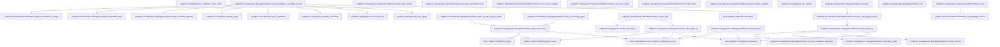
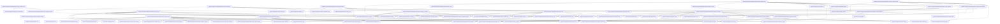
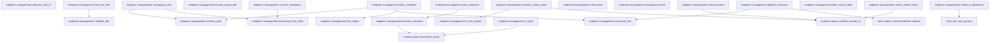

# endpoint::management

[Package atlas](index.md) · [Source](../../src/management.rs)

## Declarations

Visibility is the declaration spelling; trait members and reexports require their enclosing interface. `cfg` is not evaluated.

| Symbol | Kind | Visibility | Test / cfg |
|---|---|---|---|
| [endpoint::management::VERSION](../../src/management.rs#L26) | const_item | `private` |  |
| [endpoint::management::WorkspaceView](../../src/management.rs#L30) | struct_item | `pub` |  |
| [endpoint::management::WorkspaceFolderView](../../src/management.rs#L42) | struct_item | `pub` |  |
| [endpoint::management::WorkspaceFolders](../../src/management.rs#L50) | struct_item | `pub` |  |
| [endpoint::management::WorkspaceList](../../src/management.rs#L57) | struct_item | `pub` |  |
| [endpoint::management::WorkspaceMetadata](../../src/management.rs#L64) | struct_item | `private` |  |
| [endpoint::management::OperationPhase](../../src/management.rs#L75) | enum_item | `private` |  |
| [endpoint::management::WorkspaceIntent](../../src/management.rs#L85) | struct_item | `private` |  |
| [endpoint::management::FolderMoveIntent](../../src/management.rs#L106) | struct_item | `private` |  |
| [endpoint::management::DiscardIntent](../../src/management.rs#L118) | struct_item | `private` |  |
| [endpoint::management::SessionCreateIntent](../../src/management.rs#L127) | struct_item | `private` |  |
| [endpoint::management::SelectModelIntent](../../src/management.rs#L144) | struct_item | `private` |  |
| [endpoint::management::ForkIntent](../../src/management.rs#L157) | struct_item | `private` |  |
| [endpoint::management::QueueTransactionIntent](../../src/management.rs#L176) | struct_item | `private` |  |
| [endpoint::management::QueueTailSnapshot](../../src/management.rs#L189) | struct_item | `private` |  |
| [endpoint::management::ORIGIN_CLIENT](../../src/management.rs#L197) | const_item | `pub` |  |
| [endpoint::management::LEGACY_ORIGIN_CLIENT](../../src/management.rs#L200) | const_item | `pub` |  |
| [endpoint::management::is_endpoint_origin_client](../../src/management.rs#L203) | function_item | `pub` |  |
| [endpoint::management::OperationRecord](../../src/management.rs#L209) | struct_item | `private` |  |
| [endpoint::management::WorkspaceOperationWrite](../../src/management.rs#L221) | struct_item | `private` |  |
| [endpoint::management::PresetMcpSource](../../src/management.rs#L236) | trait_item | `pub` |  |
| [endpoint::management::PresetMcpSource::server_digest](../../src/management.rs#L239) | function_signature_item | `private` |  |
| [endpoint::management::PresetMcpSource::tool_name](../../src/management.rs#L241) | function_signature_item | `private` |  |
| [endpoint::management::PresetModelSource](../../src/management.rs#L246) | trait_item | `pub` |  |
| [endpoint::management::PresetModelSource::model_available](../../src/management.rs#L249) | function_signature_item | `private` |  |
| [endpoint::management::SessionPresetEnvironment](../../src/management.rs#L261) | struct_item | `pub` |  |
| [endpoint::management::SessionPresetEnvironment::new](../../src/management.rs#L273) | function_item | `pub` |  |
| [endpoint::management::SessionPresetEnvironment::with_models](../../src/management.rs#L294) | function_item | `pub` |  |
| [endpoint::management::SessionPresetEnvironment::permitted_tools](../../src/management.rs#L305) | function_item | `private` |  |
| [endpoint::management::SessionPresetEnvironment::mcp_server_digest](../../src/management.rs#L309) | function_item | `private` |  |
| [endpoint::management::SessionPresetEnvironment::mcp_tool_name](../../src/management.rs#L313) | function_item | `private` |  |
| [endpoint::management::SessionPresetEnvironment::skill_known](../../src/management.rs#L317) | function_item | `private` |  |
| [endpoint::management::SessionPresetEnvironment::model_available](../../src/management.rs#L321) | function_item | `private` |  |
| [endpoint::management::SessionCreateOperation](../../src/management.rs#L327) | struct_item | `pub` |  |
| [endpoint::management::SelectModelOperation](../../src/management.rs#L345) | struct_item | `pub` |  |
| [endpoint::management::ForkSessionOperation](../../src/management.rs#L355) | struct_item | `pub` |  |
| [endpoint::management::ForkLineage](../../src/management.rs#L374) | struct_item | `pub` |  |
| [endpoint::management::QueueTransactionOperation](../../src/management.rs#L379) | struct_item | `pub` |  |
| [endpoint::management::PendingQueueTransaction](../../src/management.rs#L392) | struct_item | `pub` |  |
| [endpoint::management::QueueTransactionDecision](../../src/management.rs#L403) | enum_item | `pub` |  |
| [endpoint::management::QueueTransactionCompletion](../../src/management.rs#L412) | enum_item | `pub` |  |
| [endpoint::management::QueueTransactionState](../../src/management.rs#L423) | enum_item | `pub` |  |
| [endpoint::management::QueueRecoveryDriver](../../src/management.rs#L428) | trait_item | `pub` |  |
| [endpoint::management::QueueRecoveryDriver::execute](../../src/management.rs#L429) | function_signature_item | `private` |  |
| [endpoint::management::SelectedModel](../../src/management.rs#L436) | struct_item | `pub` |  |
| [endpoint::management::CompleteOperations](../../src/management.rs#L445) | struct_item | `pub` |  |
| [endpoint::management::file_identity](../../src/management.rs#L449) | function_item | `private` |  |
| [endpoint::management::ManagementStore](../../src/management.rs#L455) | struct_item | `pub` |  |
| [endpoint::management::ManagementStore::open_at](../../src/management.rs#L466) | function_item | `pub(crate)` | test; #[cfg(test)] |
| [endpoint::management::ManagementStore::open_at_with_queue_driver](../../src/management.rs#L473) | function_item | `pub` |  |
| [endpoint::management::ManagementStore::open_recovering_again](../../src/management.rs#L484) | function_item | `pub` |  |
| [endpoint::management::ManagementStore::open_recovering](../../src/management.rs#L498) | function_item | `private` |  |
| [endpoint::management::ManagementStore::open_light](../../src/management.rs#L533) | function_item | `pub` |  |
| [endpoint::management::ManagementStore::open_light_at](../../src/management.rs#L537) | function_item | `pub` |  |
| [endpoint::management::ManagementStore::heal_workspace_metadata_locked](../../src/management.rs#L568) | function_item | `private` |  |
| [endpoint::management::ManagementStore::lock_exclusive](../../src/management.rs#L605) | function_item | `pub` |  |
| [endpoint::management::ManagementStore::root](../../src/management.rs#L612) | function_item | `pub` |  |
| [endpoint::management::ManagementStore::recover](../../src/management.rs#L617) | function_item | `pub` |  |
| [endpoint::management::ManagementStore::recover_with_queue_driver](../../src/management.rs#L621) | function_item | `pub` |  |
| [endpoint::management::ManagementStore::recover_skipping](../../src/management.rs#L628) | function_item | `private` |  |
| [endpoint::management::ManagementStore::recover_record](../../src/management.rs#L653) | function_item | `private` |  |
| [endpoint::management::ManagementStore::quarantine_corrupt_workspace](../../src/management.rs#L795) | function_item | `private` |  |
| [endpoint::management::ManagementStore::quarantine_operation](../../src/management.rs#L812) | function_item | `private` |  |
| [endpoint::management::ManagementStore::seed_missing_workspace_policies](../../src/management.rs#L861) | function_item | `private` |  |
| [endpoint::management::ManagementStore::reconcile_workspace_metadata](../../src/management.rs#L883) | function_item | `private` |  |
| [endpoint::management::ManagementStore::list_workspaces](../../src/management.rs#L888) | function_item | `pub` |  |
| [endpoint::management::ManagementStore::workspace_paths](../../src/management.rs#L950) | function_item | `pub` |  |
| [endpoint::management::ManagementStore::workspace_path](../../src/management.rs#L960) | function_item | `pub` |  |
| [endpoint::management::ManagementStore::create_session](../../src/management.rs#L973) | function_item | `pub` |  |
| [endpoint::management::ManagementStore::select_model](../../src/management.rs#L1112) | function_item | `pub` |  |
| [endpoint::management::ManagementStore::fork_session](../../src/management.rs#L1194) | function_item | `pub` |  |
| [endpoint::management::ManagementStore::apply_preset_defaults](../../src/management.rs#L1290) | function_item | `private` |  |
| [endpoint::management::ManagementStore::resolve_fork_preset](../../src/management.rs#L1320) | function_item | `private` |  |
| [endpoint::management::ManagementStore::prepare_queue_transaction](../../src/management.rs#L1348) | function_item | `pub` |  |
| [endpoint::management::ManagementStore::complete_queue_transaction](../../src/management.rs#L1449) | function_item | `pub` |  |
| [endpoint::management::ManagementStore::has_incomplete_session_operation](../../src/management.rs#L1465) | function_item | `pub` |  |
| [endpoint::management::ManagementStore::completed_fork_lineage](../../src/management.rs#L1482) | function_item | `pub` |  |
| [endpoint::management::ManagementStore::create_workspace](../../src/management.rs#L1503) | function_item | `pub` |  |
| [endpoint::management::ManagementStore::create_workspace_locked](../../src/management.rs#L1524) | function_item | `private` |  |
| [endpoint::management::ManagementStore::guard_folder_entry](../../src/management.rs#L1614) | function_item | `private` |  |
| [endpoint::management::ManagementStore::register_session_cwd](../../src/management.rs#L1630) | function_item | `private` |  |
| [endpoint::management::ManagementStore::rename_workspace](../../src/management.rs#L1659) | function_item | `pub` |  |
| [endpoint::management::ManagementStore::relocate_workspace](../../src/management.rs#L1705) | function_item | `pub` |  |
| [endpoint::management::ManagementStore::workspace_folders](../../src/management.rs#L1781) | function_item | `pub` |  |
| [endpoint::management::ManagementStore::add_workspace_folder](../../src/management.rs#L1796) | function_item | `pub` |  |
| [endpoint::management::ManagementStore::remove_workspace_folder](../../src/management.rs#L1857) | function_item | `pub` |  |
| [endpoint::management::ManagementStore::resume_folder_operation](../../src/management.rs#L1915) | function_item | `private` |  |
| [endpoint::management::ManagementStore::drive_folder_operation](../../src/management.rs#L1939) | function_item | `private` |  |
| [endpoint::management::ManagementStore::workspace_session_bindings](../../src/management.rs#L1949) | function_item | `private` |  |
| [endpoint::management::ManagementStore::archive_session](../../src/management.rs#L2012) | function_item | `pub` |  |
| [endpoint::management::ManagementStore::unarchive_session](../../src/management.rs#L2042) | function_item | `pub` |  |
| [endpoint::management::ManagementStore::discard_session](../../src/management.rs#L2063) | function_item | `pub` |  |
| [endpoint::management::ManagementStore::drive_discard](../../src/management.rs#L2124) | function_item | `private` |  |
| [endpoint::management::ManagementStore::folder_move](../../src/management.rs#L2179) | function_item | `private` |  |
| [endpoint::management::ManagementStore::begin_workspace_operation](../../src/management.rs#L2255) | function_item | `private` |  |
| [endpoint::management::ManagementStore::drive_workspace_operation](../../src/management.rs#L2312) | function_item | `private` |  |
| [endpoint::management::ManagementStore::workspace_configs](../../src/management.rs#L2419) | function_item | `private` |  |
| [endpoint::management::ManagementStore::operation_created](../../src/management.rs#L2431) | function_item | `private` |  |
| [endpoint::management::ManagementStore::rebuild_candidate](../../src/management.rs#L2465) | function_item | `private` |  |
| [endpoint::management::ManagementStore::drive_session_create](../../src/management.rs#L2590) | function_item | `private` |  |
| [endpoint::management::ManagementStore::session_id_from_response](../../src/management.rs#L2665) | function_item | `private` |  |
| [endpoint::management::ManagementStore::drive_select_model](../../src/management.rs#L2679) | function_item | `private` |  |
| [endpoint::management::ManagementStore::fork_was_quarantined](../../src/management.rs#L2745) | function_item | `private` |  |
| [endpoint::management::ManagementStore::drive_fork](../../src/management.rs#L2774) | function_item | `private` |  |
| [endpoint::management::ManagementStore::drive_queue_completion](../../src/management.rs#L2865) | function_item | `private` |  |
| [endpoint::management::ManagementStore::remove_recordless_payloads](../../src/management.rs#L2924) | function_item | `private` |  |
| [endpoint::management::ManagementStore::remove_recordless_payload](../../src/management.rs#L2951) | function_item | `private` |  |
| [endpoint::management::ManagementStore::drive_folder_move](../../src/management.rs#L2970) | function_item | `private` |  |
| [endpoint::management::ManagementStore::operation_paths](../../src/management.rs#L3040) | function_item | `private` |  |
| [endpoint::management::ManagementStore::operation_path](../../src/management.rs#L3060) | function_item | `private` |  |
| [endpoint::management::ManagementStore::operation_payload_path](../../src/management.rs#L3068) | function_item | `private` |  |
| [endpoint::management::ManagementStore::metadata_path](../../src/management.rs#L3077) | function_item | `private` |  |
| [endpoint::management::ManagementStore::read_metadata](../../src/management.rs#L3083) | function_item | `private` |  |
| [endpoint::management::ManagementStore::read_metadata_optional](../../src/management.rs#L3091) | function_item | `private` |  |
| [endpoint::management::primary_path](../../src/management.rs#L3104) | function_item | `private` |  |
| [endpoint::management::binding_for_path](../../src/management.rs#L3113) | function_item | `private` |  |
| [endpoint::management::binding_for_canonical_path](../../src/management.rs#L3119) | function_item | `private` |  |
| [endpoint::management::execution_path_from_snapshot](../../src/management.rs#L3134) | function_item | `private` |  |
| [endpoint::management::folder_binding_matches_snapshot](../../src/management.rs#L3140) | function_item | `private` |  |
| [endpoint::management::resolve_session_workspace](../../src/management.rs#L3144) | function_item | `private` |  |
| [endpoint::management::existing_session_cwd](../../src/management.rs#L3206) | function_item | `private` |  |
| [endpoint::management::session_preset](../../src/management.rs#L3229) | function_item | `private` |  |
| [endpoint::management::genesis_preset_defaults](../../src/management.rs#L3253) | function_item | `private` |  |
| [endpoint::management::create_genesis](../../src/management.rs#L3266) | function_item | `private` |  |
| [endpoint::management::canonical_event_line](../../src/management.rs#L3309) | function_item | `private` |  |
| [endpoint::management::read_canonical_event](../../src/management.rs#L3315) | function_item | `private` |  |
| [endpoint::management::verify_session_create_genesis](../../src/management.rs#L3326) | function_item | `private` |  |
| [endpoint::management::copy_payload_tree](../../src/management.rs#L3377) | function_item | `private` |  |
| [endpoint::management::sync_operation_payload](../../src/management.rs#L3398) | function_item | `private` |  |
| [endpoint::management::is_hex_digest](../../src/management.rs#L3411) | function_item | `private` |  |
| [endpoint::management::default_workspace_policy](../../src/management.rs#L3425) | function_item | `pub` |  |
| [endpoint::management::relocate_policy_roots](../../src/management.rs#L3440) | function_item | `private` |  |
| [endpoint::management::materialized_folders](../../src/management.rs#L3465) | function_item | `private` |  |
| [endpoint::management::next_folder_id](../../src/management.rs#L3481) | function_item | `private` |  |
| [endpoint::management::with_added_folder](../../src/management.rs#L3492) | function_item | `private` |  |
| [endpoint::management::with_removed_folder](../../src/management.rs#L3516) | function_item | `private` |  |
| [endpoint::management::folders_view](../../src/management.rs#L3549) | function_item | `private` |  |
| [endpoint::management::folder_response](../../src/management.rs#L3563) | function_item | `private` |  |
| [endpoint::management::canonical_workspace_path](../../src/management.rs#L3575) | function_item | `private` |  |
| [endpoint::management::unavailable_absolute_path](../../src/management.rs#L3584) | function_item | `private` |  |
| [endpoint::management::allocate_uuid_v7](../../src/management.rs#L3589) | function_item | `private` |  |
| [endpoint::management::current_timestamp](../../src/management.rs#L3608) | function_item | `private` |  |
| [endpoint::management::validate_title](../../src/management.rs#L3617) | function_item | `private` |  |
| [endpoint::management::TitleChoice](../../src/management.rs#L3630) | enum_item | `private` |  |
| [endpoint::management::WorkspaceCreate](../../src/management.rs#L3638) | struct_item | `private` |  |
| [endpoint::management::first_free_title](../../src/management.rs#L3647) | function_item | `private` |  |
| [endpoint::management::ensure_unique_title](../../src/management.rs#L3665) | function_item | `private` |  |
| [endpoint::management::verify_metadata](../../src/management.rs#L3679) | function_item | `private` |  |
| [endpoint::management::workspace_view](../../src/management.rs#L3697) | function_item | `private` |  |
| [endpoint::management::timestamp_from_millis](../../src/management.rs#L3723) | function_item | `private` |  |
| [endpoint::management::publish_canonical](../../src/management.rs#L3747) | function_item | `private` |  |
| [endpoint::management::read_canonical](../../src/management.rs#L3752) | function_item | `private` |  |
| [endpoint::management::decode_canonical](../../src/management.rs#L3756) | function_item | `private` |  |
| [endpoint::management::canonical_line](../../src/management.rs#L3777) | function_item | `private` |  |
| [endpoint::management::to_ijson](../../src/management.rs#L3784) | function_item | `private` |  |
| [endpoint::management::intent_kind](../../src/management.rs#L3792) | function_item | `private` |  |
| [endpoint::management::workspace_intent](../../src/management.rs#L3803) | function_item | `private` |  |
| [endpoint::management::discard_intent](../../src/management.rs#L3835) | function_item | `private` |  |
| [endpoint::management::folder_is_ephemeral](../../src/management.rs#L3847) | function_item | `private` |  |
| [endpoint::management::folder_move_intent](../../src/management.rs#L3853) | function_item | `private` |  |
| [endpoint::management::session_create_intent](../../src/management.rs#L3864) | function_item | `private` |  |
| [endpoint::management::select_model_intent](../../src/management.rs#L3889) | function_item | `private` |  |
| [endpoint::management::fork_intent](../../src/management.rs#L3909) | function_item | `private` |  |
| [endpoint::management::queue_transaction_intent](../../src/management.rs#L3926) | function_item | `private` |  |
| [endpoint::management::pending_queue_transaction](../../src/management.rs#L3954) | function_item | `private` |  |
| [endpoint::management::verify_queue_payload](../../src/management.rs#L3969) | function_item | `private` |  |
| [endpoint::management::completion_for_decision](../../src/management.rs#L4004) | function_item | `private` |  |
| [endpoint::management::queue_completion_value](../../src/management.rs#L4016) | function_item | `private` |  |
| [endpoint::management::queue_completion_from_record](../../src/management.rs#L4054) | function_item | `private` |  |
| [endpoint::management::operation_target_session](../../src/management.rs#L4101) | function_item | `private` |  |
| [endpoint::management::is_uid_principal](../../src/management.rs#L4117) | function_item | `private` |  |
| [endpoint::management::fork_id_from_response](../../src/management.rs#L4123) | function_item | `private` |  |
| [endpoint::management::selected_model_from_response](../../src/management.rs#L4135) | function_item | `private` |  |
| [endpoint::management::active_session_folder](../../src/management.rs#L4173) | function_item | `private` |  |
| [endpoint::management::valid_folder_projection](../../src/management.rs#L4184) | function_item | `private` |  |
| [endpoint::management::folder_reservation](../../src/management.rs#L4197) | function_item | `private` |  |
| [endpoint::management::verify_folder_reservation](../../src/management.rs#L4214) | function_item | `private` |  |
| [endpoint::management::folder_workspace](../../src/management.rs#L4227) | function_item | `private` |  |
| [endpoint::management::active_session_count](../../src/management.rs#L4239) | function_item | `private` |  |
| [endpoint::management::hex_digest](../../src/management.rs#L4249) | function_item | `private` |  |
| [endpoint::management::ManagementError](../../src/management.rs#L4254) | enum_item | `pub` |  |
| [endpoint::management::tests::omitted_identity_is_auto_but_explicit_and_legacy_identity_stay_fixed](../../src/management.rs#L4353) | function_item | `private` | test; #[cfg(test)] |
| [endpoint::management::tests::preset_genesis_replaces_identity_and_needs_reader_two](../../src/management.rs#L4388) | function_item | `private` | test; #[cfg(test)] |
| [endpoint::management::tests::preset_skills_resolve_against_package_names](../../src/management.rs#L4476) | function_item | `private` | test; #[cfg(test)] |
| [endpoint::management::tests::legacy_session_create_without_folder_binding_remains_recoverable](../../src/management.rs#L4510) | function_item | `private` | test; #[cfg(test)] |
| [endpoint::management::tests::quarantined_fork_does_not_block_recovery_or_claim_success](../../src/management.rs#L4525) | function_item | `private` | test; #[cfg(test)] |
| [endpoint::management::tests::open_light_heals_metadata_after_any_config_writer_without_reading_threads](../../src/management.rs#L4600) | function_item | `private` | test; #[cfg(test)] |
| [endpoint::management::tests::unavailable_workspace_keeps_its_management_operation_pending](../../src/management.rs#L4689) | function_item | `private` | test; #[cfg(test)] |
| [endpoint::management::tests::a_select_model_payload_staged_before_the_rename_is_read_on_recovery](../../src/management.rs#L4728) | function_item | `private` | test; #[cfg(test)] |
| [endpoint::management::tests::a_created_workspace_starts_with_the_interactive_fixed_catalog_writable_in_its_folder](../../src/management.rs#L4796) | function_item | `private` | test; #[cfg(test)] |
| [endpoint::management::tests::opening_the_store_seeds_a_policy_for_a_policy_less_workspace_once](../../src/management.rs#L4841) | function_item | `private` | test; #[cfg(test)] |
| [endpoint::management::tests::relocation_moves_writable_roots_with_their_folder](../../src/management.rs#L4893) | function_item | `private` | test; #[cfg(test)] |
| [endpoint::management::tests::folder_store](../../src/management.rs#L4929) | function_item | `private` | test; #[cfg(test)] |
| [endpoint::management::tests::sibling](../../src/management.rs#L4947) | function_item | `private` | test; #[cfg(test)] |
| [endpoint::management::tests::write_session](../../src/management.rs#L4958) | function_item | `private` | test; #[cfg(test)] |
| [endpoint::management::tests::folders_are_added_listed_and_removed_with_their_writable_roots](../../src/management.rs#L5002) | function_item | `private` | test; #[cfg(test)] |
| [endpoint::management::tests::a_folder_bound_to_a_session_is_not_removed](../../src/management.rs#L5118) | function_item | `private` | test; #[cfg(test)] |
| [endpoint::management::tests::a_legacy_unbound_session_blocks_a_second_folder](../../src/management.rs#L5164) | function_item | `private` | test; #[cfg(test)] |
| [endpoint::management::tests::folder_edits_materialize_a_legacy_cwd_workspace_with_its_synthesized_ids](../../src/management.rs#L5197) | function_item | `private` | test; #[cfg(test)] |
| [endpoint::management::tests::completed_workspace_operation_never_reopens_its_old_path](../../src/management.rs#L5229) | function_item | `private` | test; #[cfg(test)] |
| [endpoint::management::tests::create_in](../../src/management.rs#L5250) | function_item | `private` | test; #[cfg(test)] |
| [endpoint::management::tests::session_create_registers_an_unknown_cwd_once](../../src/management.rs#L5270) | function_item | `private` | test; #[cfg(test)] |
| [endpoint::management::tests::session_create_reads_workspace_skills_where_the_worker_launch_does](../../src/management.rs#L5337) | function_item | `private` | test; #[cfg(test)] |
| [endpoint::management::tests::folders_never_name_the_filesystem_root_or_kernel_storage](../../src/management.rs#L5390) | function_item | `private` | test; #[cfg(test)] |
| [endpoint::management::k1_management_race::BOOT](../../src/management.rs#L5484) | const_item | `private` | test; #[cfg(test)] |
| [endpoint::management::k1_management_race::TICK](../../src/management.rs#L5485) | const_item | `private` | test; #[cfg(test)] |
| [endpoint::management::k1_management_race::LATER](../../src/management.rs#L5486) | const_item | `private` | test; #[cfg(test)] |
| [endpoint::management::k1_management_race::WORKSPACE](../../src/management.rs#L5487) | const_item | `private` | test; #[cfg(test)] |
| [endpoint::management::k1_management_race::fixture](../../src/management.rs#L5489) | function_item | `private` | test; #[cfg(test)] |
| [endpoint::management::k1_management_race::policy_with](../../src/management.rs#L5514) | function_item | `private` | test; #[cfg(test)] |
| [endpoint::management::k1_management_race::set_policy](../../src/management.rs#L5520) | function_item | `private` | test; #[cfg(test)] |
| [endpoint::management::k1_management_race::quarantine_root](../../src/management.rs#L5527) | function_item | `private` | test; #[cfg(test)] |
| [endpoint::management::k1_management_race::stale_metadata](../../src/management.rs#L5533) | function_item | `private` | test; #[cfg(test)] |
| [endpoint::management::k1_management_race::metadata_matches](../../src/management.rs#L5540) | function_item | `private` | test; #[cfg(test)] |
| [endpoint::management::k1_management_race::stuck_carriers_record](../../src/management.rs#L5547) | function_item | `private` | test; #[cfg(test)] |
| [endpoint::management::k1_management_race::tick_heals_stale_metadata_without_staging_an_operation](../../src/management.rs#L5581) | function_item | `private` | test; #[cfg(test)] |
| [endpoint::management::k1_management_race::tick_never_fails_while_policy_set_publishes](../../src/management.rs#L5611) | function_item | `private` | test; #[cfg(test)] |
| [endpoint::management::k1_management_race::parked_synthetic_rename](../../src/management.rs#L5656) | function_item | `private` | test; #[cfg(test)] |
| [endpoint::management::k1_management_race::boot_quarantines_the_parked_carriers_record_and_succeeds](../../src/management.rs#L5705) | function_item | `private` | test; #[cfg(test)] |
| [endpoint::management::k1_management_race::record_of_another_version_is_left_in_place_not_quarantined](../../src/management.rs#L5760) | function_item | `private` | test; #[cfg(test)] |
| [endpoint::management::k1_management_race::quarantine_keeps_the_payload_and_never_redrives_the_operation](../../src/management.rs#L5782) | function_item | `private` | test; #[cfg(test)] |
| [endpoint::management::k1_management_race::complete_workspace_record_without_response_is_quarantined](../../src/management.rs#L5845) | function_item | `private` | test; #[cfg(test)] |
| [endpoint::management::k1_management_race::one_failing_record_does_not_stop_the_others_from_recovering](../../src/management.rs#L5881) | function_item | `private` | test; #[cfg(test)] |

## Imports / reexports

| Local name | Source path | Visibility |
|---|---|---|
| `BTreeMap` | `std::collections::BTreeMap` | `private` |
| `fs` | `std::fs` | `private` |
| `File` | `std::fs::File` | `private` |
| `Read` | `std::io::Read` | `private` |
| `MetadataExt` | `std::os::unix::fs::MetadataExt` | `private` |
| `Path` | `std::path::Path` | `private` |
| `PathBuf` | `std::path::PathBuf` | `private` |
| `SystemTime` | `std::time::SystemTime` | `private` |
| `UNIX_EPOCH` | `std::time::UNIX_EPOCH` | `private` |
| `ConfigRepository` | `profile::ConfigRepository` | `private` |
| `WorkspaceConfig` | `profile::WorkspaceConfig` | `private` |
| `WorkspaceFolder` | `profile::WorkspaceFolder` | `private` |
| `WorkspacePolicy` | `profile::WorkspacePolicy` | `private` |
| `Event` | `schema::Event` | `private` |
| `IJsonValue` | `schema::IJsonValue` | `private` |
| `OriginTuple` | `schema::OriginTuple` | `private` |
| `ResumePolicy` | `schema::ResumePolicy` | `private` |
| `Deserialize` | `serde::Deserialize` | `private` |
| `Serialize` | `serde::Serialize` | `private` |
| `Value` | `serde_json::Value` | `private` |
| `json` | `serde_json::json` | `private` |
| `Digest` | `sha2::Digest` | `private` |
| `Sha256` | `sha2::Sha256` | `private` |
| `AssetStore` | `store::AssetStore` | `private` |
| `AtomicPublisher` | `store::AtomicPublisher` | `private` |
| `DirectoryLock` | `store::DirectoryLock` | `private` |
| `NamedLock` | `store::NamedLock` | `private` |
| `ThreadStore` | `store::ThreadStore` | `private` |
| `scan_valid_prefix` | `store::scan_valid_prefix` | `private` |
| `Error` | `thiserror::Error` | `private` |
| `Uuid` | `uuid::Uuid` | `private` |
| `SessionInventoryItem` | `crate::SessionInventoryItem` | `private` |
| `ForkIntent` | `super::ForkIntent` | `private` |
| `ManagementError` | `super::ManagementError` | `private` |
| `ManagementStore` | `super::ManagementStore` | `private` |
| `OperationPhase` | `super::OperationPhase` | `private` |
| `OperationRecord` | `super::OperationRecord` | `private` |
| `VERSION` | `super::VERSION` | `private` |
| `WorkspaceMetadata` | `super::WorkspaceMetadata` | `private` |
| `WorkspaceOperationWrite` | `super::WorkspaceOperationWrite` | `private` |
| `WorkspaceView` | `super::WorkspaceView` | `private` |
| `canonical_event_line` | `super::canonical_event_line` | `private` |
| `create_genesis` | `super::create_genesis` | `private` |
| `default_workspace_policy` | `super::default_workspace_policy` | `private` |
| `folder_binding_matches_snapshot` | `super::folder_binding_matches_snapshot` | `private` |
| `publish_canonical` | `super::publish_canonical` | `private` |
| `read_canonical` | `super::read_canonical` | `private` |
| `session_preset` | `super::session_preset` | `private` |
| `to_ijson` | `super::to_ijson` | `private` |
| `SessionInventoryItem` | `crate::SessionInventoryItem` | `private` |
| `ConfigRepository` | `profile::ConfigRepository` | `private` |
| `WorkspaceConfig` | `profile::WorkspaceConfig` | `private` |
| `WorkspaceFolder` | `profile::WorkspaceFolder` | `private` |
| `Value` | `serde_json::Value` | `private` |
| `json` | `serde_json::json` | `private` |
| `fs` | `std::fs` | `private` |
| `Path` | `std::path::Path` | `private` |
| `ThreadStore` | `store::ThreadStore` | `private` |
| `*` | `super::*` | `private` |
| `ConfigRepository` | `profile::ConfigRepository` | `private` |
| `WorkspaceConfig` | `profile::WorkspaceConfig` | `private` |
| `WorkspaceFolder` | `profile::WorkspaceFolder` | `private` |
| `Arc` | `std::sync::Arc` | `private` |
| `AtomicBool` | `std::sync::atomic::AtomicBool` | `private` |
| `Ordering` | `std::sync::atomic::Ordering` | `private` |

## Module declarations

| Module | Visibility | Attributes |
|---|---|---|
| `endpoint::management::tests` | `private` | #[cfg(test)] |
| `endpoint::management::k1_management_race` | `private` | #[cfg(test)] |

## Function call graphs

Edges below are syntactically resolved calls only, including private functions. Graphs partition callers into groups of 20; they are not execution order. All unresolved sites are listed below and in the JSON inventory.

Functions 1–20: 28 direct edges

```mermaid
flowchart TD
  n0["endpoint::management::is_endpoint_origin_client"]
  n1["endpoint::management::ManagementStore::workspace_configs"]
  n2["endpoint::management::SessionPresetEnvironment::new"]
  n3["endpoint::management::ManagementStore::remove_recordless_payloads"]
  n4["endpoint::management::SessionPresetEnvironment::with_models"]
  n5["endpoint::management::ManagementStore::operation_paths"]
  n6["endpoint::management::SessionPresetEnvironment::permitted_tools"]
  n7["endpoint::management::ManagementStore::metadata_path"]
  n8["endpoint::management::ManagementStore::read_metadata_optional"]
  n9["endpoint::management::SessionPresetEnvironment::mcp_server_digest"]
  n10["endpoint::management::primary_path"]
  n11["endpoint::management::SessionPresetEnvironment::mcp_tool_name"]
  n12["endpoint::management::SessionPresetEnvironment::skill_known"]
  n13["endpoint::management::SessionPresetEnvironment::model_available"]
  n14["endpoint::management::current_timestamp"]
  n15["endpoint::management::verify_metadata"]
  n16["endpoint::management::publish_canonical"]
  n17["endpoint::management::canonical_line"]
  n18["endpoint::management::hex_digest"]
  n19["endpoint::management::file_identity"]
  n20["endpoint::management::ManagementStore::open_at_with_queue_driver"]
  n21["endpoint::management::ManagementStore::open_recovering_again"]
  n22["endpoint::management::ManagementStore::open_recovering"]
  n23["endpoint::management::ManagementStore::open_light"]
  n24["endpoint::management::ManagementStore::open_light_at"]
  n25["endpoint::management::ManagementStore::heal_workspace_metadata_locked"]
  n26["endpoint::management::ManagementStore::lock_exclusive"]
  n27["endpoint::management::ManagementStore::root"]
  n28["endpoint::management::ManagementStore::recover"]
  n29["endpoint::management::ManagementStore::recover_with_queue_driver"]
  n30["endpoint::management::ManagementStore::recover_skipping"]
  n31["endpoint::management::ManagementStore::recover_record"]
  n32["profile::config::ConfigRepository::open"]
  n33["profile::resources::ResourceCatalog::skill_package_names"]
  n34["store::folder::ThreadStore::open"]
  n35["store::management_root::endpoint_management_root"]
  n36["store::platform::NamedLock::exclusive"]
  n37["store::platform::NamedLock::shared"]
  n2 --> n33
  n20 --> n22
  n21 --> n22
  n22 --> n32
  n22 --> n34
  n22 --> n35
  n23 --> n14
  n23 --> n24
  n24 --> n32
  n24 --> n35
  n24 --> n36
  n25 --> n1
  n25 --> n7
  n25 --> n8
  n25 --> n10
  n25 --> n15
  n25 --> n16
  n25 --> n17
  n25 --> n18
  n25 --> n37
  n26 --> n35
  n26 --> n36
  n28 --> n29
  n29 --> n30
  n30 --> n3
  n30 --> n5
  n30 --> n31
  n30 --> n36
```

Functions 21–40: 151 direct edges

```mermaid
flowchart TD
  n0["endpoint::journal::EndpointJournal::open"]
  n1["endpoint::management::ManagementStore::select_model"]
  n2["endpoint::management::ManagementStore::fork_session"]
  n3["endpoint::management::ManagementStore::apply_preset_defaults"]
  n4["endpoint::management::ManagementStore::resolve_fork_preset"]
  n5["endpoint::management::ManagementStore::prepare_queue_transaction"]
  n6["endpoint::management::ManagementStore::complete_queue_transaction"]
  n7["endpoint::management::ManagementStore::has_incomplete_session_operation"]
  n8["endpoint::management::ManagementStore::completed_fork_lineage"]
  n9["endpoint::management::ManagementStore::create_workspace"]
  n10["endpoint::management::ManagementStore::create_workspace_locked"]
  n11["endpoint::management::ManagementStore::guard_folder_entry"]
  n12["endpoint::management::ManagementStore::register_session_cwd"]
  n13["endpoint::management::ManagementStore::begin_workspace_operation"]
  n14["endpoint::management::ManagementStore::drive_workspace_operation"]
  n15["endpoint::management::ManagementStore::workspace_configs"]
  n16["endpoint::management::ManagementStore::drive_session_create"]
  n17["endpoint::management::ManagementStore::session_id_from_response"]
  n18["endpoint::management::ManagementStore::drive_select_model"]
  n19["endpoint::management::SessionPresetEnvironment::new"]
  n20["endpoint::management::ManagementStore::fork_was_quarantined"]
  n21["endpoint::management::ManagementStore::drive_fork"]
  n22["endpoint::management::ManagementStore::drive_queue_completion"]
  n23["endpoint::management::ManagementStore::remove_recordless_payload"]
  n24["endpoint::management::ManagementStore::drive_folder_move"]
  n25["endpoint::management::ManagementStore::operation_paths"]
  n26["endpoint::management::ManagementStore::operation_path"]
  n27["endpoint::management::ManagementStore::operation_payload_path"]
  n28["endpoint::management::ManagementStore::read_metadata"]
  n29["endpoint::management::ManagementStore::read_metadata_optional"]
  n30["endpoint::management::primary_path"]
  n31["endpoint::management::resolve_session_workspace"]
  n32["endpoint::management::existing_session_cwd"]
  n33["endpoint::management::session_preset"]
  n34["endpoint::management::create_genesis"]
  n35["endpoint::management::canonical_event_line"]
  n36["endpoint::management::copy_payload_tree"]
  n37["endpoint::management::sync_operation_payload"]
  n38["endpoint::management::is_hex_digest"]
  n39["endpoint::management::default_workspace_policy"]
  n40["endpoint::management::canonical_workspace_path"]
  n41["endpoint::management::unavailable_absolute_path"]
  n42["endpoint::management::allocate_uuid_v7"]
  n43["endpoint::management::current_timestamp"]
  n44["endpoint::management::validate_title"]
  n45["endpoint::management::first_free_title"]
  n46["endpoint::management::ensure_unique_title"]
  n47["endpoint::management::verify_metadata"]
  n48["endpoint::management::workspace_view"]
  n49["endpoint::management::publish_canonical"]
  n50["endpoint::management::read_canonical"]
  n51["endpoint::management::canonical_line"]
  n52["endpoint::management::to_ijson"]
  n53["endpoint::management::intent_kind"]
  n54["endpoint::management::workspace_intent"]
  n55["endpoint::management::folder_move_intent"]
  n56["endpoint::management::session_create_intent"]
  n57["endpoint::management::select_model_intent"]
  n58["endpoint::management::fork_intent"]
  n59["endpoint::management::queue_transaction_intent"]
  n60["endpoint::management::pending_queue_transaction"]
  n61["endpoint::management::verify_queue_payload"]
  n62["endpoint::management::queue_completion_from_record"]
  n63["endpoint::management::operation_target_session"]
  n64["endpoint::management::fork_id_from_response"]
  n65["endpoint::management::selected_model_from_response"]
  n66["endpoint::management::active_session_folder"]
  n67["endpoint::management::valid_folder_projection"]
  n68["endpoint::management::active_session_count"]
  n69["endpoint::management::hex_digest"]
  n70["endpoint::management::file_identity"]
  n71["endpoint::management::ManagementStore::heal_workspace_metadata_locked"]
  n72["endpoint::management::ManagementStore::recover_record"]
  n73["endpoint::management::ManagementStore::quarantine_corrupt_workspace"]
  n74["endpoint::management::ManagementStore::quarantine_operation"]
  n75["endpoint::management::ManagementStore::seed_missing_workspace_policies"]
  n76["endpoint::management::ManagementStore::reconcile_workspace_metadata"]
  n77["endpoint::management::ManagementStore::list_workspaces"]
  n78["endpoint::management::ManagementStore::workspace_paths"]
  n79["endpoint::management::ManagementStore::workspace_path"]
  n80["endpoint::management::ManagementStore::create_session"]
  n81["endpoint::service::NativeEndpoint::open"]
  n82["endpoint::types::validate_session_id"]
  n83["profile::scope::workspace_instructions"]
  n84["profile::scope::SessionScope::for_session_folder"]
  n85["store::asset::AssetStore::new"]
  n86["store::atomic::AtomicPublisher::replace"]
  n87["store::folder::ThreadStore::open"]
  n88["store::platform::NamedLock::exclusive"]
  n89["store::platform::NamedLock::shared"]
  n90["store::tail::scan_valid_prefix"]
  n91["tools::sandbox::kernel_protected_roots"]
  n92["tools::sandbox::protected_root_containing"]
  n1 --> n18
  n1 --> n23
  n1 --> n26
  n1 --> n27
  n1 --> n37
  n1 --> n49
  n1 --> n50
  n1 --> n52
  n1 --> n65
  n1 --> n66
  n1 --> n67
  n1 --> n82
  n1 --> n86
  n1 --> n87
  n1 --> n88
  n2 --> n0
  n2 --> n4
  n2 --> n21
  n2 --> n26
  n2 --> n42
  n2 --> n49
  n2 --> n50
  n2 --> n52
  n2 --> n64
  n2 --> n66
  n2 --> n68
  n2 --> n81
  n2 --> n82
  n2 --> n88
  n4 --> n19
  n4 --> n33
  n4 --> n84
  n5 --> n23
  n5 --> n26
  n5 --> n27
  n5 --> n37
  n5 --> n49
  n5 --> n50
  n5 --> n51
  n5 --> n52
  n5 --> n59
  n5 --> n60
  n5 --> n61
  n5 --> n62
  n5 --> n66
  n5 --> n82
  n5 --> n86
  n5 --> n88
  n5 --> n90
  n6 --> n22
  n6 --> n26
  n6 --> n50
  n6 --> n88
  n7 --> n25
  n7 --> n50
  n7 --> n63
  n7 --> n82
  n7 --> n89
  n8 --> n25
  n8 --> n50
  n8 --> n53
  n8 --> n58
  n8 --> n89
  n9 --> n10
  n9 --> n40
  n9 --> n88
  n10 --> n11
  n10 --> n13
  n10 --> n14
  n10 --> n15
  n10 --> n30
  n10 --> n39
  n10 --> n42
  n10 --> n44
  n10 --> n45
  n10 --> n46
  n11 --> n91
  n11 --> n92
  n72 --> n14
  n72 --> n16
  n72 --> n18
  n72 --> n20
  n72 --> n21
  n72 --> n22
  n72 --> n24
  n72 --> n27
  n72 --> n41
  n72 --> n50
  n72 --> n53
  n72 --> n54
  n72 --> n55
  n72 --> n56
  n72 --> n57
  n72 --> n58
  n72 --> n59
  n72 --> n60
  n72 --> n61
  n72 --> n62
  n72 --> n70
  n72 --> n73
  n72 --> n88
  n73 --> n74
  n74 --> n36
  n74 --> n38
  n74 --> n86
  n75 --> n15
  n75 --> n30
  n75 --> n39
  n75 --> n88
  n76 --> n71
  n76 --> n88
  n77 --> n15
  n77 --> n28
  n77 --> n29
  n77 --> n30
  n77 --> n43
  n77 --> n47
  n77 --> n48
  n77 --> n71
  n77 --> n88
  n78 --> n15
  n78 --> n30
  n78 --> n89
  n79 --> n15
  n79 --> n30
  n79 --> n88
  n80 --> n12
  n80 --> n15
  n80 --> n16
  n80 --> n17
  n80 --> n19
  n80 --> n23
  n80 --> n26
  n80 --> n27
  n80 --> n31
  n80 --> n32
  n80 --> n33
  n80 --> n34
  n80 --> n35
  n80 --> n37
  n80 --> n42
  n80 --> n49
  n80 --> n50
  n80 --> n52
  n80 --> n68
  n80 --> n69
  n80 --> n82
  n80 --> n83
  n80 --> n85
  n80 --> n86
  n80 --> n88
```

Functions 41–60: 130 direct edges

```mermaid
flowchart TD
  n0["endpoint::management::ManagementStore::apply_preset_defaults"]
  n1["endpoint::management::ManagementStore::create_workspace_locked"]
  n2["endpoint::management::ManagementStore::guard_folder_entry"]
  n3["endpoint::management::ManagementStore::register_session_cwd"]
  n4["endpoint::management::ManagementStore::rename_workspace"]
  n5["endpoint::management::ManagementStore::relocate_workspace"]
  n6["endpoint::management::ManagementStore::workspace_folders"]
  n7["endpoint::management::ManagementStore::add_workspace_folder"]
  n8["endpoint::management::ManagementStore::remove_workspace_folder"]
  n9["endpoint::management::ManagementStore::resume_folder_operation"]
  n10["endpoint::management::ManagementStore::drive_folder_operation"]
  n11["endpoint::management::ManagementStore::workspace_session_bindings"]
  n12["endpoint::management::ManagementStore::archive_session"]
  n13["endpoint::management::ManagementStore::unarchive_session"]
  n14["endpoint::management::ManagementStore::discard_session"]
  n15["endpoint::management::ManagementStore::drive_discard"]
  n16["endpoint::management::ManagementStore::folder_move"]
  n17["endpoint::management::ManagementStore::begin_workspace_operation"]
  n18["endpoint::management::ManagementStore::drive_workspace_operation"]
  n19["endpoint::management::ManagementStore::workspace_configs"]
  n20["endpoint::management::ManagementStore::operation_created"]
  n21["endpoint::management::ManagementStore::rebuild_candidate"]
  n22["endpoint::management::ManagementStore::drive_session_create"]
  n23["endpoint::management::ManagementStore::remove_recordless_payload"]
  n24["endpoint::management::ManagementStore::drive_folder_move"]
  n25["endpoint::management::ManagementStore::operation_paths"]
  n26["endpoint::management::ManagementStore::operation_path"]
  n27["endpoint::management::ManagementStore::operation_payload_path"]
  n28["endpoint::management::ManagementStore::metadata_path"]
  n29["endpoint::management::ManagementStore::read_metadata"]
  n30["endpoint::management::ManagementStore::read_metadata_optional"]
  n31["endpoint::management::primary_path"]
  n32["endpoint::management::binding_for_canonical_path"]
  n33["endpoint::management::execution_path_from_snapshot"]
  n34["endpoint::management::folder_binding_matches_snapshot"]
  n35["endpoint::management::genesis_preset_defaults"]
  n36["endpoint::management::read_canonical_event"]
  n37["endpoint::management::verify_session_create_genesis"]
  n38["endpoint::management::sync_operation_payload"]
  n39["endpoint::management::relocate_policy_roots"]
  n40["endpoint::management::materialized_folders"]
  n41["endpoint::management::next_folder_id"]
  n42["endpoint::management::with_added_folder"]
  n43["endpoint::management::with_removed_folder"]
  n44["endpoint::management::folders_view"]
  n45["endpoint::management::folder_response"]
  n46["endpoint::management::canonical_workspace_path"]
  n47["endpoint::management::validate_title"]
  n48["endpoint::management::ensure_unique_title"]
  n49["endpoint::management::workspace_view"]
  n50["endpoint::management::publish_canonical"]
  n51["endpoint::management::read_canonical"]
  n52["endpoint::management::decode_canonical"]
  n53["endpoint::management::canonical_line"]
  n54["endpoint::management::to_ijson"]
  n55["endpoint::management::workspace_intent"]
  n56["endpoint::management::discard_intent"]
  n57["endpoint::management::folder_is_ephemeral"]
  n58["endpoint::management::session_create_intent"]
  n59["endpoint::management::fork_id_from_response"]
  n60["endpoint::management::folder_reservation"]
  n61["endpoint::management::active_session_count"]
  n62["endpoint::management::hex_digest"]
  n63["endpoint::service::NativeEndpoint::open"]
  n64["endpoint::types::validate_session_id"]
  n65["profile::config::ConfigSnapshot::decode"]
  n66["profile::instruction::InstructionSnapshot::decode"]
  n67["schema::ijson::IJsonValue::parse"]
  n68["store::asset::AssetStore::new"]
  n69["store::atomic::AtomicPublisher::replace"]
  n70["store::folder::ThreadStore::open"]
  n71["store::platform::NamedLock::exclusive"]
  n72["store::platform::DirectoryLock::try_exclusive"]
  n73["store::tail::scan_valid_prefix"]
  n3 --> n1
  n3 --> n32
  n3 --> n46
  n4 --> n17
  n4 --> n18
  n4 --> n19
  n4 --> n47
  n4 --> n48
  n4 --> n71
  n5 --> n2
  n5 --> n17
  n5 --> n18
  n5 --> n19
  n5 --> n39
  n5 --> n46
  n5 --> n71
  n6 --> n19
  n6 --> n44
  n7 --> n2
  n7 --> n9
  n7 --> n10
  n7 --> n11
  n7 --> n19
  n7 --> n40
  n7 --> n41
  n7 --> n42
  n7 --> n45
  n7 --> n46
  n7 --> n71
  n8 --> n9
  n8 --> n10
  n8 --> n11
  n8 --> n19
  n8 --> n40
  n8 --> n43
  n8 --> n45
  n8 --> n71
  n9 --> n18
  n9 --> n26
  n9 --> n51
  n10 --> n17
  n10 --> n18
  n10 --> n45
  n11 --> n25
  n11 --> n51
  n11 --> n58
  n11 --> n64
  n11 --> n73
  n12 --> n16
  n13 --> n16
  n14 --> n15
  n14 --> n26
  n14 --> n50
  n14 --> n51
  n14 --> n54
  n14 --> n57
  n14 --> n60
  n14 --> n64
  n14 --> n70
  n14 --> n71
  n14 --> n72
  n15 --> n50
  n15 --> n54
  n15 --> n56
  n15 --> n59
  n15 --> n60
  n15 --> n70
  n16 --> n24
  n16 --> n26
  n16 --> n50
  n16 --> n51
  n16 --> n54
  n16 --> n57
  n16 --> n60
  n16 --> n61
  n16 --> n64
  n16 --> n71
  n16 --> n72
  n17 --> n23
  n17 --> n26
  n17 --> n27
  n17 --> n31
  n17 --> n38
  n17 --> n50
  n17 --> n51
  n17 --> n53
  n17 --> n54
  n17 --> n62
  n17 --> n69
  n18 --> n19
  n18 --> n20
  n18 --> n21
  n18 --> n27
  n18 --> n28
  n18 --> n29
  n18 --> n30
  n18 --> n31
  n18 --> n49
  n18 --> n50
  n18 --> n53
  n18 --> n55
  n18 --> n62
  n18 --> n63
  n18 --> n67
  n18 --> n69
  n20 --> n19
  n20 --> n27
  n20 --> n50
  n20 --> n52
  n21 --> n19
  n21 --> n42
  n21 --> n43
  n21 --> n53
  n21 --> n62
  n22 --> n0
  n22 --> n27
  n22 --> n28
  n22 --> n29
  n22 --> n33
  n22 --> n34
  n22 --> n35
  n22 --> n36
  n22 --> n37
  n22 --> n50
  n22 --> n54
  n22 --> n58
  n22 --> n65
  n22 --> n66
  n22 --> n68
  n22 --> n70
```

Functions 61–80: 50 direct edges

```mermaid
flowchart TD
  n0["endpoint::management::ManagementStore::apply_preset_defaults"]
  n1["endpoint::management::ManagementStore::session_id_from_response"]
  n2["endpoint::management::ManagementStore::drive_select_model"]
  n3["endpoint::management::ManagementStore::fork_was_quarantined"]
  n4["endpoint::management::ManagementStore::drive_fork"]
  n5["endpoint::management::ManagementStore::drive_queue_completion"]
  n6["endpoint::management::ManagementStore::remove_recordless_payloads"]
  n7["endpoint::management::ManagementStore::remove_recordless_payload"]
  n8["endpoint::management::ManagementStore::drive_folder_move"]
  n9["endpoint::management::ManagementStore::operation_paths"]
  n10["endpoint::management::ManagementStore::operation_path"]
  n11["endpoint::management::ManagementStore::operation_payload_path"]
  n12["endpoint::management::ManagementStore::metadata_path"]
  n13["endpoint::management::ManagementStore::read_metadata"]
  n14["endpoint::management::ManagementStore::read_metadata_optional"]
  n15["endpoint::management::primary_path"]
  n16["endpoint::management::binding_for_path"]
  n17["endpoint::management::binding_for_canonical_path"]
  n18["endpoint::management::execution_path_from_snapshot"]
  n19["endpoint::management::folder_binding_matches_snapshot"]
  n20["endpoint::management::resolve_session_workspace"]
  n21["endpoint::management::is_hex_digest"]
  n22["endpoint::management::canonical_workspace_path"]
  n23["endpoint::management::publish_canonical"]
  n24["endpoint::management::decode_canonical"]
  n25["endpoint::management::to_ijson"]
  n26["endpoint::management::folder_move_intent"]
  n27["endpoint::management::select_model_intent"]
  n28["endpoint::management::fork_intent"]
  n29["endpoint::management::queue_transaction_intent"]
  n30["endpoint::management::verify_queue_payload"]
  n31["endpoint::management::completion_for_decision"]
  n32["endpoint::management::queue_completion_value"]
  n33["endpoint::management::queue_completion_from_record"]
  n34["endpoint::management::active_session_folder"]
  n35["endpoint::management::verify_folder_reservation"]
  n36["endpoint::management::folder_workspace"]
  n37["endpoint::management::hex_digest"]
  n38["schema::ijson::IJsonValue::parse"]
  n39["store::folder::ThreadStore::open"]
  n40["store::folder::move_thread_folder"]
  n41["store::management_root::session_settings_path"]
  n42["store::platform::DirectoryLock::try_exclusive"]
  n43["store::rewrite::RewriteOperation::decode_canonical"]
  n2 --> n11
  n2 --> n12
  n2 --> n13
  n2 --> n23
  n2 --> n25
  n2 --> n27
  n2 --> n34
  n2 --> n36
  n2 --> n41
  n3 --> n28
  n3 --> n43
  n4 --> n0
  n4 --> n3
  n4 --> n12
  n4 --> n13
  n4 --> n23
  n4 --> n25
  n4 --> n28
  n4 --> n36
  n4 --> n39
  n5 --> n11
  n5 --> n23
  n5 --> n29
  n5 --> n30
  n5 --> n31
  n5 --> n32
  n5 --> n33
  n6 --> n21
  n7 --> n10
  n7 --> n11
  n8 --> n12
  n8 --> n14
  n8 --> n23
  n8 --> n26
  n8 --> n35
  n8 --> n36
  n8 --> n38
  n8 --> n40
  n8 --> n42
  n10 --> n37
  n11 --> n37
  n13 --> n14
  n14 --> n12
  n14 --> n24
  n17 --> n16
  n17 --> n22
  n20 --> n15
  n20 --> n16
  n20 --> n17
  n20 --> n22
```

Functions 81–100: 13 direct edges

```mermaid
flowchart TD
  n0["endpoint::management::is_endpoint_origin_client"]
  n1["endpoint::management::existing_session_cwd"]
  n2["endpoint::management::session_preset"]
  n3["endpoint::management::genesis_preset_defaults"]
  n4["endpoint::management::create_genesis"]
  n5["endpoint::management::canonical_event_line"]
  n6["endpoint::management::read_canonical_event"]
  n7["endpoint::management::verify_session_create_genesis"]
  n8["endpoint::management::copy_payload_tree"]
  n9["endpoint::management::sync_operation_payload"]
  n10["endpoint::management::is_hex_digest"]
  n11["endpoint::management::default_workspace_policy"]
  n12["endpoint::management::relocate_policy_roots"]
  n13["endpoint::management::materialized_folders"]
  n14["endpoint::management::next_folder_id"]
  n15["endpoint::management::with_added_folder"]
  n16["endpoint::management::with_removed_folder"]
  n17["endpoint::management::folders_view"]
  n18["endpoint::management::folder_response"]
  n19["endpoint::management::canonical_workspace_path"]
  n20["endpoint::management::unavailable_absolute_path"]
  n21["endpoint::management::folder_workspace"]
  n22["schema::event::Event::decode_canonical"]
  n23["schema::event::Event::from_value"]
  n24["schema::ijson::IJsonValue::parse"]
  n25["tools::builtin::BuiltinManifest::compiled"]
  n26["tools::preset::ResolvedPreset::resolve_request"]
  n27["tools::preset::ResolvedPreset::from_identity"]
  n28["tools::preset::ResolvedPreset::from_genesis"]
  n1 --> n21
  n2 --> n26
  n2 --> n27
  n3 --> n28
  n4 --> n23
  n4 --> n24
  n6 --> n22
  n7 --> n0
  n8 --> n8
  n11 --> n25
  n15 --> n13
  n16 --> n13
  n17 --> n13
```

Functions 101–120: 17 direct edges

```mermaid
flowchart TD
  n0["endpoint::management::primary_path"]
  n1["endpoint::management::is_hex_digest"]
  n2["endpoint::management::allocate_uuid_v7"]
  n3["endpoint::management::current_timestamp"]
  n4["endpoint::management::validate_title"]
  n5["endpoint::management::first_free_title"]
  n6["endpoint::management::ensure_unique_title"]
  n7["endpoint::management::verify_metadata"]
  n8["endpoint::management::workspace_view"]
  n9["endpoint::management::timestamp_from_millis"]
  n10["endpoint::management::publish_canonical"]
  n11["endpoint::management::read_canonical"]
  n12["endpoint::management::decode_canonical"]
  n13["endpoint::management::canonical_line"]
  n14["endpoint::management::to_ijson"]
  n15["endpoint::management::intent_kind"]
  n16["endpoint::management::workspace_intent"]
  n17["endpoint::management::discard_intent"]
  n18["endpoint::management::folder_is_ephemeral"]
  n19["endpoint::management::folder_move_intent"]
  n20["endpoint::management::session_create_intent"]
  n21["endpoint::management::select_model_intent"]
  n22["endpoint::management::hex_digest"]
  n23["endpoint::types::validate_session_id"]
  n24["schema::ijson::IJsonValue::parse"]
  n25["store::atomic::AtomicPublisher::replace"]
  n26["store::tail::read_genesis"]
  n3 --> n9
  n5 --> n4
  n7 --> n0
  n7 --> n13
  n7 --> n22
  n8 --> n0
  n8 --> n9
  n10 --> n13
  n10 --> n25
  n11 --> n12
  n12 --> n24
  n14 --> n24
  n17 --> n23
  n18 --> n26
  n20 --> n1
  n20 --> n23
  n21 --> n23
```

Functions 121–138: 18 direct edges

```mermaid
flowchart TD
  n0["endpoint::management::read_canonical"]
  n1["endpoint::management::to_ijson"]
  n2["endpoint::management::intent_kind"]
  n3["endpoint::management::folder_move_intent"]
  n4["endpoint::management::session_create_intent"]
  n5["endpoint::management::select_model_intent"]
  n6["endpoint::management::fork_intent"]
  n7["endpoint::management::queue_transaction_intent"]
  n8["endpoint::management::pending_queue_transaction"]
  n9["endpoint::management::verify_queue_payload"]
  n10["endpoint::management::completion_for_decision"]
  n11["endpoint::management::queue_completion_value"]
  n12["endpoint::management::queue_completion_from_record"]
  n13["endpoint::management::operation_target_session"]
  n14["endpoint::management::is_uid_principal"]
  n15["endpoint::management::fork_id_from_response"]
  n16["endpoint::management::selected_model_from_response"]
  n17["endpoint::management::active_session_folder"]
  n18["endpoint::management::valid_folder_projection"]
  n19["endpoint::management::folder_reservation"]
  n20["endpoint::management::verify_folder_reservation"]
  n21["endpoint::management::folder_workspace"]
  n22["endpoint::management::active_session_count"]
  n23["endpoint::management::hex_digest"]
  n24["endpoint::types::validate_session_id"]
  n25["store::tail::read_ledger_repaired"]
  n26["store::tail::read_genesis"]
  n6 --> n14
  n6 --> n24
  n7 --> n24
  n8 --> n7
  n9 --> n0
  n11 --> n1
  n12 --> n7
  n12 --> n11
  n13 --> n2
  n13 --> n3
  n13 --> n4
  n13 --> n5
  n13 --> n6
  n13 --> n7
  n18 --> n25
  n19 --> n25
  n20 --> n19
  n21 --> n26
```

## Call sites

Includes test functions (marked in declarations). Receiver-type-required sites need type analysis/manual tracing. Calls in closures are attributed to their enclosing function; their occurrence here does not mean the closure executes immediately.

| Caller | Callee expression | Source lines | Target / classification |
|---|---|---|---|
| `new` | `instruction                 .effective                 .policy                 .allowed_tools                 .as_ref()                 .map` | [280](../../src/management.rs#L280) | receiver-type-required |
| `new` | `instruction                 .effective                 .policy                 .allowed_tools                 .as_ref` | [280](../../src/management.rs#L280) | receiver-type-required |
| `new` | `tools.iter().cloned().collect` | [285](../../src/management.rs#L285) | receiver-type-required |
| `new` | `tools.iter().cloned` | [285](../../src/management.rs#L285) | receiver-type-required |
| `new` | `tools.iter` | [285](../../src/management.rs#L285) | receiver-type-required |
| `new` | `profile::ResourceCatalog::skill_package_names` | [286](../../src/management.rs#L286) | [profile::resources::ResourceCatalog::skill_package_names](../../../profile/src/resources.rs#L109) |
| `with_models` | `models.map` | [299](../../src/management.rs#L299) | receiver-type-required |
| `permitted_tools` | `self.permitted.as_ref` | [306](../../src/management.rs#L306) | receiver-type-required |
| `mcp_server_digest` | `self.mcp?.server_digest` | [310](../../src/management.rs#L310) | receiver-type-required |
| `mcp_tool_name` | `self.mcp?.tool_name` | [314](../../src/management.rs#L314) | receiver-type-required |
| `skill_known` | `self.skills.contains` | [318](../../src/management.rs#L318) | receiver-type-required |
| `model_available` | `self.models             .is_some_and` | [322](../../src/management.rs#L322) | receiver-type-required |
| `model_available` | `models.model_available` | [323](../../src/management.rs#L323) | receiver-type-required |
| `file_identity` | `fs::metadata(path).ok` | [450](../../src/management.rs#L450) | receiver-type-required |
| `file_identity` | `fs::metadata` | [450](../../src/management.rs#L450) | external-constructor-callback-or-unresolved |
| `file_identity` | `Some` | [451](../../src/management.rs#L451) | external-constructor-callback-or-unresolved |
| `file_identity` | `metadata.len` | [451](../../src/management.rs#L451) | receiver-type-required |
| `file_identity` | `metadata.modified().ok` | [451](../../src/management.rs#L451) | receiver-type-required |
| `file_identity` | `metadata.modified` | [451](../../src/management.rs#L451) | receiver-type-required |
| `open_at` | `Self::open_at_with_queue_driver` | [470](../../src/management.rs#L470) | [endpoint::management::ManagementStore::open_at_with_queue_driver](../../src/management.rs#L473) |
| `open_at_with_queue_driver` | `Self::open_recovering` | [478](../../src/management.rs#L478) | [endpoint::management::ManagementStore::open_recovering](../../src/management.rs#L498) |
| `open_recovering_again` | `Self::open_recovering` | [490](../../src/management.rs#L490) | [endpoint::management::ManagementStore::open_recovering](../../src/management.rs#L498) |
| `open_recovering_again` | `Some` | [494](../../src/management.rs#L494) | external-constructor-callback-or-unresolved |
| `open_recovering` | `storage_root.as_ref().to_path_buf` | [504](../../src/management.rs#L504) | receiver-type-required |
| `open_recovering` | `storage_root.as_ref` | [504](../../src/management.rs#L504) | receiver-type-required |
| `open_recovering` | `ThreadStore::open` | [505](../../src/management.rs#L505) | [store::folder::ThreadStore::open](../../../store/src/folder.rs#L36) |
| `open_recovering` | `store::endpoint_management_root` | [506](../../src/management.rs#L506) | [store::management_root::endpoint_management_root](../../../store/src/management_root.rs#L47) |
| `open_recovering` | `fs::create_dir_all` | [507](../../src/management.rs#L507), [508](../../src/management.rs#L508) | external-constructor-callback-or-unresolved |
| `open_recovering` | `root.join` | [507](../../src/management.rs#L507), [508](../../src/management.rs#L508), [512](../../src/management.rs#L512) | receiver-type-required |
| `open_recovering` | `fs::OpenOptions::new()             .create(true)             .append(true)             .open` | [509](../../src/management.rs#L509) | receiver-type-required |
| `open_recovering` | `fs::OpenOptions::new()             .create(true)             .append` | [509](../../src/management.rs#L509) | receiver-type-required |
| `open_recovering` | `fs::OpenOptions::new()             .create` | [509](../../src/management.rs#L509) | receiver-type-required |
| `open_recovering` | `fs::OpenOptions::new` | [509](../../src/management.rs#L509) | external-constructor-callback-or-unresolved |
| `open_recovering` | `ConfigRepository::open` | [514](../../src/management.rs#L514) | [profile::config::ConfigRepository::open](../../../profile/src/config.rs#L704) |
| `open_recovering` | `store.recover_skipping` | [518](../../src/management.rs#L518) | receiver-type-required |
| `open_recovering` | `store.seed_missing_workspace_policies` | [519](../../src/management.rs#L519) | receiver-type-required |
| `open_recovering` | `store.reconcile_workspace_metadata` | [520](../../src/management.rs#L520) | receiver-type-required |
| `open_recovering` | `Ok` | [524](../../src/management.rs#L524) | external-constructor-callback-or-unresolved |
| `open_light` | `Self::open_light_at` | [534](../../src/management.rs#L534) | [endpoint::management::ManagementStore::open_light_at](../../src/management.rs#L537) |
| `open_light` | `current_timestamp` | [534](../../src/management.rs#L534) | [endpoint::management::current_timestamp](../../src/management.rs#L3608) |
| `open_light_at` | `storage_root.as_ref().to_path_buf` | [541](../../src/management.rs#L541) | receiver-type-required |
| `open_light_at` | `storage_root.as_ref` | [541](../../src/management.rs#L541) | receiver-type-required |
| `open_light_at` | `store::endpoint_management_root` | [542](../../src/management.rs#L542) | [store::management_root::endpoint_management_root](../../../store/src/management_root.rs#L47) |
| `open_light_at` | `fs::create_dir_all` | [543](../../src/management.rs#L543), [544](../../src/management.rs#L544) | external-constructor-callback-or-unresolved |
| `open_light_at` | `root.join` | [543](../../src/management.rs#L543), [544](../../src/management.rs#L544), [548](../../src/management.rs#L548) | receiver-type-required |
| `open_light_at` | `fs::OpenOptions::new()             .create(true)             .append(true)             .open` | [545](../../src/management.rs#L545) | receiver-type-required |
| `open_light_at` | `fs::OpenOptions::new()             .create(true)             .append` | [545](../../src/management.rs#L545) | receiver-type-required |
| `open_light_at` | `fs::OpenOptions::new()             .create` | [545](../../src/management.rs#L545) | receiver-type-required |
| `open_light_at` | `fs::OpenOptions::new` | [545](../../src/management.rs#L545) | external-constructor-callback-or-unresolved |
| `open_light_at` | `ConfigRepository::open` | [550](../../src/management.rs#L550) | [profile::config::ConfigRepository::open](../../../profile/src/config.rs#L704) |
| `open_light_at` | `NamedLock::exclusive` | [554](../../src/management.rs#L554) | [store::platform::NamedLock::exclusive](../../../store/src/platform.rs#L103) |
| `open_light_at` | `store.root.join` | [554](../../src/management.rs#L554) | receiver-type-required |
| `open_light_at` | `store.heal_workspace_metadata_locked` | [555](../../src/management.rs#L555) | receiver-type-required |
| `open_light_at` | `drop` | [556](../../src/management.rs#L556) | external-constructor-callback-or-unresolved |
| `open_light_at` | `Ok` | [557](../../src/management.rs#L557) | external-constructor-callback-or-unresolved |
| `heal_workspace_metadata_locked` | `NamedLock::shared` | [569](../../src/management.rs#L569) | [store::platform::NamedLock::shared](../../../store/src/platform.rs#L99) |
| `heal_workspace_metadata_locked` | `self.storage_root.join` | [569](../../src/management.rs#L569) | receiver-type-required |
| `heal_workspace_metadata_locked` | `self.workspace_configs()?.into_values` | [570](../../src/management.rs#L570) | receiver-type-required |
| `heal_workspace_metadata_locked` | `self.workspace_configs` | [570](../../src/management.rs#L570) | [endpoint::management::ManagementStore::workspace_configs](../../src/management.rs#L2419) |
| `heal_workspace_metadata_locked` | `primary_path(&config).map` | [572](../../src/management.rs#L572) | receiver-type-required |
| `heal_workspace_metadata_locked` | `primary_path` | [572](../../src/management.rs#L572) | [endpoint::management::primary_path](../../src/management.rs#L3104) |
| `heal_workspace_metadata_locked` | `self.read_metadata_optional` | [579](../../src/management.rs#L579) | [endpoint::management::ManagementStore::read_metadata_optional](../../src/management.rs#L3091) |
| `heal_workspace_metadata_locked` | `existing                 .as_ref()                 .is_some_and` | [580](../../src/management.rs#L580) | receiver-type-required |
| `heal_workspace_metadata_locked` | `existing                 .as_ref` | [580](../../src/management.rs#L580) | receiver-type-required |
| `heal_workspace_metadata_locked` | `verify_metadata(&config, metadata).is_ok` | [582](../../src/management.rs#L582) | receiver-type-required |
| `heal_workspace_metadata_locked` | `verify_metadata` | [582](../../src/management.rs#L582) | [endpoint::management::verify_metadata](../../src/management.rs#L3679) |
| `heal_workspace_metadata_locked` | `config.id.clone` | [588](../../src/management.rs#L588) | receiver-type-required |
| `heal_workspace_metadata_locked` | `existing                     .map_or_else` | [590](../../src/management.rs#L590) | receiver-type-required |
| `heal_workspace_metadata_locked` | `started_at.to_owned` | [591](../../src/management.rs#L591), [592](../../src/management.rs#L592) | receiver-type-required |
| `heal_workspace_metadata_locked` | `hex_digest` | [593](../../src/management.rs#L593) | [endpoint::management::hex_digest](../../src/management.rs#L4249) |
| `heal_workspace_metadata_locked` | `canonical_line` | [593](../../src/management.rs#L593) | [endpoint::management::canonical_line](../../src/management.rs#L3777) |
| `heal_workspace_metadata_locked` | `publish_canonical` | [595](../../src/management.rs#L595) | [endpoint::management::publish_canonical](../../src/management.rs#L3747) |
| `heal_workspace_metadata_locked` | `self.metadata_path` | [595](../../src/management.rs#L595) | [endpoint::management::ManagementStore::metadata_path](../../src/management.rs#L3077) |
| `heal_workspace_metadata_locked` | `Ok` | [597](../../src/management.rs#L597) | external-constructor-callback-or-unresolved |
| `lock_exclusive` | `store::endpoint_management_root` | [606](../../src/management.rs#L606) | [store::management_root::endpoint_management_root](../../../store/src/management_root.rs#L47) |
| `lock_exclusive` | `storage_root.as_ref` | [606](../../src/management.rs#L606) | receiver-type-required |
| `lock_exclusive` | `fs::create_dir_all` | [607](../../src/management.rs#L607) | external-constructor-callback-or-unresolved |
| `lock_exclusive` | `Ok` | [608](../../src/management.rs#L608) | external-constructor-callback-or-unresolved |
| `lock_exclusive` | `NamedLock::exclusive` | [608](../../src/management.rs#L608) | [store::platform::NamedLock::exclusive](../../../store/src/platform.rs#L103) |
| `lock_exclusive` | `root.join` | [608](../../src/management.rs#L608) | receiver-type-required |
| `recover` | `self.recover_with_queue_driver` | [618](../../src/management.rs#L618) | [endpoint::management::ManagementStore::recover_with_queue_driver](../../src/management.rs#L621) |
| `recover_with_queue_driver` | `self.recover_skipping` | [625](../../src/management.rs#L625) | [endpoint::management::ManagementStore::recover_skipping](../../src/management.rs#L628) |
| `recover_skipping` | `NamedLock::exclusive` | [637](../../src/management.rs#L637) | [store::platform::NamedLock::exclusive](../../../store/src/platform.rs#L103) |
| `recover_skipping` | `self.root.join` | [637](../../src/management.rs#L637) | receiver-type-required |
| `recover_skipping` | `self.remove_recordless_payloads` | [638](../../src/management.rs#L638) | [endpoint::management::ManagementStore::remove_recordless_payloads](../../src/management.rs#L2924) |
| `recover_skipping` | `self.operation_paths` | [639](../../src/management.rs#L639) | [endpoint::management::ManagementStore::operation_paths](../../src/management.rs#L3040) |
| `recover_skipping` | `self.recover_record` | [645](../../src/management.rs#L645) | [endpoint::management::ManagementStore::recover_record](../../src/management.rs#L653) |
| `recover_skipping` | `validated.as_deref_mut` | [645](../../src/management.rs#L645) | receiver-type-required |
| `recover_skipping` | `first_error.get_or_insert` | [646](../../src/management.rs#L646) | receiver-type-required |
| `recover_skipping` | `first_error.map_or` | [649](../../src/management.rs#L649) | receiver-type-required |
| `recover_skipping` | `Ok` | [649](../../src/management.rs#L649) | external-constructor-callback-or-unresolved |
| `recover_record` | `Some` | [659](../../src/management.rs#L659), [762](../../src/management.rs#L762) | external-constructor-callback-or-unresolved |
| `recover_record` | `NamedLock::exclusive` | [659](../../src/management.rs#L659), [762](../../src/management.rs#L762) | [store::platform::NamedLock::exclusive](../../../store/src/platform.rs#L103) |
| `recover_record` | `self.root.join` | [659](../../src/management.rs#L659), [762](../../src/management.rs#L762) | receiver-type-required |
| `recover_record` | `path.exists` | [660](../../src/management.rs#L660) | receiver-type-required |
| `recover_record` | `Ok` | [661](../../src/management.rs#L661), [667](../../src/management.rs#L667), [679](../../src/management.rs#L679), [707](../../src/management.rs#L707), [725](../../src/management.rs#L725), [747](../../src/management.rs#L747), [765](../../src/management.rs#L765), [792](../../src/management.rs#L792) | external-constructor-callback-or-unresolved |
| `recover_record` | `file_identity` | [663](../../src/management.rs#L663) | [endpoint::management::file_identity](../../src/management.rs#L449) |
| `recover_record` | `validated.as_deref` | [664](../../src/management.rs#L664) | receiver-type-required |
| `recover_record` | `identity.as_ref` | [664](../../src/management.rs#L664) | receiver-type-required |
| `recover_record` | `known.0.contains` | [665](../../src/management.rs#L665) | receiver-type-required |
| `recover_record` | `path.clone` | [665](../../src/management.rs#L665), [683](../../src/management.rs#L683) | receiver-type-required |
| `recover_record` | `read_canonical::<OperationRecord>` | [669](../../src/management.rs#L669), [763](../../src/management.rs#L763) | [endpoint::management::read_canonical](../../src/management.rs#L3752) |
| `recover_record` | `intent_kind` | [670](../../src/management.rs#L670) | [endpoint::management::intent_kind](../../src/management.rs#L3792) |
| `recover_record` | `known.0.insert` | [683](../../src/management.rs#L683) | receiver-type-required |
| `recover_record` | `kind.as_str` | [685](../../src/management.rs#L685), [727](../../src/management.rs#L727) | receiver-type-required |
| `recover_record` | `workspace_intent` | [687](../../src/management.rs#L687), [728](../../src/management.rs#L728) | [endpoint::management::workspace_intent](../../src/management.rs#L3803) |
| `recover_record` | `self.quarantine_corrupt_workspace` | [688](../../src/management.rs#L688), [720](../../src/management.rs#L720), [788](../../src/management.rs#L788) | [endpoint::management::ManagementStore::quarantine_corrupt_workspace](../../src/management.rs#L795) |
| `recover_record` | `folder_move_intent` | [692](../../src/management.rs#L692), [732](../../src/management.rs#L732) | [endpoint::management::folder_move_intent](../../src/management.rs#L3853) |
| `recover_record` | `session_create_intent` | [695](../../src/management.rs#L695), [736](../../src/management.rs#L736) | [endpoint::management::session_create_intent](../../src/management.rs#L3864) |
| `recover_record` | `select_model_intent` | [698](../../src/management.rs#L698), [740](../../src/management.rs#L740) | [endpoint::management::select_model_intent](../../src/management.rs#L3889) |
| `recover_record` | `fork_intent` | [701](../../src/management.rs#L701) | [endpoint::management::fork_intent](../../src/management.rs#L3909) |
| `recover_record` | `queue_transaction_intent` | [704](../../src/management.rs#L704), [752](../../src/management.rs#L752) | [endpoint::management::queue_transaction_intent](../../src/management.rs#L3926) |
| `recover_record` | `verify_queue_payload` | [705](../../src/management.rs#L705), [753](../../src/management.rs#L753) | [endpoint::management::verify_queue_payload](../../src/management.rs#L3969) |
| `recover_record` | `self.operation_payload_path` | [705](../../src/management.rs#L705), [753](../../src/management.rs#L753) | [endpoint::management::ManagementStore::operation_payload_path](../../src/management.rs#L3068) |
| `recover_record` | `queue_completion_from_record` | [706](../../src/management.rs#L706) | [endpoint::management::queue_completion_from_record](../../src/management.rs#L4054) |
| `recover_record` | `Err` | [710](../../src/management.rs#L710), [722](../../src/management.rs#L722), [771](../../src/management.rs#L771), [790](../../src/management.rs#L790) | external-constructor-callback-or-unresolved |
| `recover_record` | `ManagementError::CorruptOperation` | [710](../../src/management.rs#L710), [716](../../src/management.rs#L716), [771](../../src/management.rs#L771) | external-constructor-callback-or-unresolved |
| `recover_record` | `record.response.is_none` | [715](../../src/management.rs#L715) | receiver-type-required |
| `recover_record` | `"complete operation lacks response".to_owned` | [717](../../src/management.rs#L717) | receiver-type-required |
| `recover_record` | `workspace_intent(&record)                 .and_then(&#124;_&#124; self.drive_workspace_operation(&path, record))                 .map` | [728](../../src/management.rs#L728) | receiver-type-required |
| `recover_record` | `workspace_intent(&record)                 .and_then` | [728](../../src/management.rs#L728) | receiver-type-required |
| `recover_record` | `self.drive_workspace_operation` | [729](../../src/management.rs#L729) | [endpoint::management::ManagementStore::drive_workspace_operation](../../src/management.rs#L2312) |
| `recover_record` | `self.drive_folder_move(&path, record, None).map` | [733](../../src/management.rs#L733) | receiver-type-required |
| `recover_record` | `self.drive_folder_move` | [733](../../src/management.rs#L733) | [endpoint::management::ManagementStore::drive_folder_move](../../src/management.rs#L2970) |
| `recover_record` | `self.drive_session_create(&path, record).map` | [737](../../src/management.rs#L737) | receiver-type-required |
| `recover_record` | `self.drive_session_create` | [737](../../src/management.rs#L737) | [endpoint::management::ManagementStore::drive_session_create](../../src/management.rs#L2590) |
| `recover_record` | `self.drive_select_model(&path, record).map` | [741](../../src/management.rs#L741) | receiver-type-required |
| `recover_record` | `self.drive_select_model` | [741](../../src/management.rs#L741) | [endpoint::management::ManagementStore::drive_select_model](../../src/management.rs#L2679) |
| `recover_record` | `self.fork_was_quarantined` | [744](../../src/management.rs#L744) | [endpoint::management::ManagementStore::fork_was_quarantined](../../src/management.rs#L2745) |
| `recover_record` | `self.drive_fork(&path, record).map` | [749](../../src/management.rs#L749) | receiver-type-required |
| `recover_record` | `self.drive_fork` | [749](../../src/management.rs#L749) | [endpoint::management::ManagementStore::drive_fork](../../src/management.rs#L2774) |
| `recover_record` | `pending_queue_transaction` | [754](../../src/management.rs#L754) | [endpoint::management::pending_queue_transaction](../../src/management.rs#L3954) |
| `recover_record` | `queue_driver.ok_or_else` | [755](../../src/management.rs#L755) | receiver-type-required |
| `recover_record` | `ManagementError::QueueRecoveryRequired` | [756](../../src/management.rs#L756) | external-constructor-callback-or-unresolved |
| `recover_record` | `pending.session_id.clone` | [756](../../src/management.rs#L756) | receiver-type-required |
| `recover_record` | `drop` | [760](../../src/management.rs#L760) | external-constructor-callback-or-unresolved |
| `recover_record` | `lock.take` | [760](../../src/management.rs#L760) | receiver-type-required |
| `recover_record` | `driver.execute` | [761](../../src/management.rs#L761) | receiver-type-required |
| `recover_record` | `self.drive_queue_completion(&path, record, decision)                     .map` | [767](../../src/management.rs#L767) | receiver-type-required |
| `recover_record` | `self.drive_queue_completion` | [767](../../src/management.rs#L767) | [endpoint::management::ManagementStore::drive_queue_completion](../../src/management.rs#L2865) |
| `recover_record` | `unavailable_absolute_path` | [779](../../src/management.rs#L779) | [endpoint::management::unavailable_absolute_path](../../src/management.rs#L3584) |
| `quarantine_corrupt_workspace` | `self.quarantine_operation` | [801](../../src/management.rs#L801) | [endpoint::management::ManagementStore::quarantine_operation](../../src/management.rs#L812) |
| `quarantine_corrupt_workspace` | `Err` | [802](../../src/management.rs#L802) | external-constructor-callback-or-unresolved |
| `quarantine_operation` | `path             .file_stem()             .and_then(&#124;value&#124; value.to_str())             .filter(&#124;value&#124; is_hex_digest(value))             .ok_or_else(&#124;&#124; {                 ManagementError::CorruptOperation("operation record has no digest name".to_owned())             })?             .to_owned` | [813](../../src/management.rs#L813) | receiver-type-required |
| `quarantine_operation` | `path             .file_stem()             .and_then(&#124;value&#124; value.to_str())             .filter(&#124;value&#124; is_hex_digest(value))             .ok_or_else` | [813](../../src/management.rs#L813) | receiver-type-required |
| `quarantine_operation` | `path             .file_stem()             .and_then(&#124;value&#124; value.to_str())             .filter` | [813](../../src/management.rs#L813) | receiver-type-required |
| `quarantine_operation` | `path             .file_stem()             .and_then` | [813](../../src/management.rs#L813) | receiver-type-required |
| `quarantine_operation` | `path             .file_stem` | [813](../../src/management.rs#L813) | receiver-type-required |
| `quarantine_operation` | `value.to_str` | [815](../../src/management.rs#L815) | receiver-type-required |
| `quarantine_operation` | `is_hex_digest` | [816](../../src/management.rs#L816) | [endpoint::management::is_hex_digest](../../src/management.rs#L3411) |
| `quarantine_operation` | `ManagementError::CorruptOperation` | [818](../../src/management.rs#L818), [845](../../src/management.rs#L845) | external-constructor-callback-or-unresolved |
| `quarantine_operation` | `"operation record has no digest name".to_owned` | [818](../../src/management.rs#L818) | receiver-type-required |
| `quarantine_operation` | `self.root.join` | [821](../../src/management.rs#L821) | receiver-type-required |
| `quarantine_operation` | `fs::create_dir_all` | [822](../../src/management.rs#L822), [834](../../src/management.rs#L834) | external-constructor-callback-or-unresolved |
| `quarantine_operation` | `quarantine.join` | [824](../../src/management.rs#L824), [827](../../src/management.rs#L827) | receiver-type-required |
| `quarantine_operation` | `target.join("record.json").exists` | [826](../../src/management.rs#L826) | receiver-type-required |
| `quarantine_operation` | `target.join` | [826](../../src/management.rs#L826), [837](../../src/management.rs#L837), [839](../../src/management.rs#L839), [842](../../src/management.rs#L842) | receiver-type-required |
| `quarantine_operation` | `target.exists` | [831](../../src/management.rs#L831) | receiver-type-required |
| `quarantine_operation` | `fs::remove_dir_all` | [832](../../src/management.rs#L832), [849](../../src/management.rs#L849) | external-constructor-callback-or-unresolved |
| `quarantine_operation` | `path.with_extension` | [835](../../src/management.rs#L835) | receiver-type-required |
| `quarantine_operation` | `payload_root.is_dir` | [836](../../src/management.rs#L836), [848](../../src/management.rs#L848) | receiver-type-required |
| `quarantine_operation` | `copy_payload_tree` | [837](../../src/management.rs#L837) | [endpoint::management::copy_payload_tree](../../src/management.rs#L3377) |
| `quarantine_operation` | `AtomicPublisher::replace` | [839](../../src/management.rs#L839) | [store::atomic::AtomicPublisher::replace](../../../store/src/atomic.rs#L16) |
| `quarantine_operation` | `reason.as_bytes` | [839](../../src/management.rs#L839) | receiver-type-required |
| `quarantine_operation` | `File::open(&target)?.sync_all` | [840](../../src/management.rs#L840), [843](../../src/management.rs#L843) | receiver-type-required |
| `quarantine_operation` | `File::open` | [840](../../src/management.rs#L840), [841](../../src/management.rs#L841), [843](../../src/management.rs#L843), [847](../../src/management.rs#L847), [850](../../src/management.rs#L850) | external-constructor-callback-or-unresolved |
| `quarantine_operation` | `File::open(&quarantine)?.sync_all` | [841](../../src/management.rs#L841) | receiver-type-required |
| `quarantine_operation` | `fs::rename` | [842](../../src/management.rs#L842) | external-constructor-callback-or-unresolved |
| `quarantine_operation` | `path.parent().ok_or_else` | [844](../../src/management.rs#L844) | receiver-type-required |
| `quarantine_operation` | `path.parent` | [844](../../src/management.rs#L844) | receiver-type-required |
| `quarantine_operation` | `"operation record has no prefix".to_owned` | [845](../../src/management.rs#L845) | receiver-type-required |
| `quarantine_operation` | `File::open(prefix)?.sync_all` | [847](../../src/management.rs#L847), [850](../../src/management.rs#L850) | receiver-type-required |
| `quarantine_operation` | `Ok` | [853](../../src/management.rs#L853) | external-constructor-callback-or-unresolved |
| `seed_missing_workspace_policies` | `NamedLock::exclusive` | [862](../../src/management.rs#L862) | [store::platform::NamedLock::exclusive](../../../store/src/platform.rs#L103) |
| `seed_missing_workspace_policies` | `self.root.join` | [862](../../src/management.rs#L862) | receiver-type-required |
| `seed_missing_workspace_policies` | `self.workspace_configs()?.into_values` | [863](../../src/management.rs#L863) | receiver-type-required |
| `seed_missing_workspace_policies` | `self.workspace_configs` | [863](../../src/management.rs#L863) | [endpoint::management::ManagementStore::workspace_configs](../../src/management.rs#L2419) |
| `seed_missing_workspace_policies` | `config.policy.is_some` | [864](../../src/management.rs#L864) | receiver-type-required |
| `seed_missing_workspace_policies` | `primary_path(&config).map` | [867](../../src/management.rs#L867) | receiver-type-required |
| `seed_missing_workspace_policies` | `primary_path` | [867](../../src/management.rs#L867) | [endpoint::management::primary_path](../../src/management.rs#L3104) |
| `seed_missing_workspace_policies` | `self.config.publish_workspace_policy` | [870](../../src/management.rs#L870) | receiver-type-required |
| `seed_missing_workspace_policies` | `default_workspace_policy` | [873](../../src/management.rs#L873) | [endpoint::management::default_workspace_policy](../../src/management.rs#L3425) |
| `seed_missing_workspace_policies` | `Ok` | [876](../../src/management.rs#L876) | external-constructor-callback-or-unresolved |
| `reconcile_workspace_metadata` | `NamedLock::exclusive` | [884](../../src/management.rs#L884) | [store::platform::NamedLock::exclusive](../../../store/src/platform.rs#L103) |
| `reconcile_workspace_metadata` | `self.root.join` | [884](../../src/management.rs#L884) | receiver-type-required |
| `reconcile_workspace_metadata` | `self.heal_workspace_metadata_locked` | [885](../../src/management.rs#L885) | [endpoint::management::ManagementStore::heal_workspace_metadata_locked](../../src/management.rs#L568) |
| `list_workspaces` | `NamedLock::exclusive` | [892](../../src/management.rs#L892) | [store::platform::NamedLock::exclusive](../../../store/src/platform.rs#L103) |
| `list_workspaces` | `self.root.join` | [892](../../src/management.rs#L892) | receiver-type-required |
| `list_workspaces` | `self.workspace_configs` | [893](../../src/management.rs#L893), [926](../../src/management.rs#L926) | [endpoint::management::ManagementStore::workspace_configs](../../src/management.rs#L2419) |
| `list_workspaces` | `configs.retain` | [894](../../src/management.rs#L894) | receiver-type-required |
| `list_workspaces` | `primary_path(config).is_ok` | [895](../../src/management.rs#L895), [927](../../src/management.rs#L927) | receiver-type-required |
| `list_workspaces` | `primary_path` | [895](../../src/management.rs#L895), [927](../../src/management.rs#L927) | [endpoint::management::primary_path](../../src/management.rs#L3104) |
| `list_workspaces` | `BTreeMap::<String, Vec<&SessionInventoryItem>>::new` | [901](../../src/management.rs#L901) | external-constructor-callback-or-unresolved |
| `list_workspaces` | `Vec::new` | [902](../../src/management.rs#L902) | external-constructor-callback-or-unresolved |
| `list_workspaces` | `archived_session_ids.push` | [905](../../src/management.rs#L905) | receiver-type-required |
| `list_workspaces` | `session.session_id.clone` | [905](../../src/management.rs#L905) | receiver-type-required |
| `list_workspaces` | `active                     .entry(session.workspace_id.clone())                     .or_default()                     .push` | [907](../../src/management.rs#L907) | receiver-type-required |
| `list_workspaces` | `active                     .entry(session.workspace_id.clone())                     .or_default` | [907](../../src/management.rs#L907) | receiver-type-required |
| `list_workspaces` | `active                     .entry` | [907](../../src/management.rs#L907) | receiver-type-required |
| `list_workspaces` | `session.workspace_id.clone` | [908](../../src/management.rs#L908) | receiver-type-required |
| `list_workspaces` | `archived_session_ids.sort` | [913](../../src/management.rs#L913) | receiver-type-required |
| `list_workspaces` | `configs.values().all` | [917](../../src/management.rs#L917) | receiver-type-required |
| `list_workspaces` | `configs.values` | [917](../../src/management.rs#L917), [931](../../src/management.rs#L931) | receiver-type-required |
| `list_workspaces` | `self.read_metadata_optional(&config.id)                 .ok()                 .flatten()                 .is_some_and` | [918](../../src/management.rs#L918) | receiver-type-required |
| `list_workspaces` | `self.read_metadata_optional(&config.id)                 .ok()                 .flatten` | [918](../../src/management.rs#L918) | receiver-type-required |
| `list_workspaces` | `self.read_metadata_optional(&config.id)                 .ok` | [918](../../src/management.rs#L918) | receiver-type-required |
| `list_workspaces` | `self.read_metadata_optional` | [918](../../src/management.rs#L918) | [endpoint::management::ManagementStore::read_metadata_optional](../../src/management.rs#L3091) |
| `list_workspaces` | `verify_metadata(config, &metadata).is_ok` | [921](../../src/management.rs#L921) | receiver-type-required |
| `list_workspaces` | `verify_metadata` | [921](../../src/management.rs#L921), [933](../../src/management.rs#L933) | [endpoint::management::verify_metadata](../../src/management.rs#L3679) |
| `list_workspaces` | `self.heal_workspace_metadata_locked` | [925](../../src/management.rs#L925) | [endpoint::management::ManagementStore::heal_workspace_metadata_locked](../../src/management.rs#L568) |
| `list_workspaces` | `current_timestamp` | [925](../../src/management.rs#L925) | [endpoint::management::current_timestamp](../../src/management.rs#L3608) |
| `list_workspaces` | `healed.retain` | [927](../../src/management.rs#L927) | receiver-type-required |
| `list_workspaces` | `Vec::with_capacity` | [930](../../src/management.rs#L930) | external-constructor-callback-or-unresolved |
| `list_workspaces` | `configs.len` | [930](../../src/management.rs#L930) | receiver-type-required |
| `list_workspaces` | `self.read_metadata` | [932](../../src/management.rs#L932) | [endpoint::management::ManagementStore::read_metadata](../../src/management.rs#L3083) |
| `list_workspaces` | `items.push` | [934](../../src/management.rs#L934) | receiver-type-required |
| `list_workspaces` | `workspace_view` | [934](../../src/management.rs#L934) | [endpoint::management::workspace_view](../../src/management.rs#L3697) |
| `list_workspaces` | `active.get(&config.id).cloned().unwrap_or_default` | [937](../../src/management.rs#L937) | receiver-type-required |
| `list_workspaces` | `active.get(&config.id).cloned` | [937](../../src/management.rs#L937) | receiver-type-required |
| `list_workspaces` | `active.get` | [937](../../src/management.rs#L937) | receiver-type-required |
| `list_workspaces` | `items.sort_by` | [940](../../src/management.rs#L940) | receiver-type-required |
| `list_workspaces` | `left.workspace_id.cmp` | [940](../../src/management.rs#L940) | receiver-type-required |
| `list_workspaces` | `Ok` | [941](../../src/management.rs#L941) | external-constructor-callback-or-unresolved |
| `workspace_paths` | `NamedLock::shared` | [951](../../src/management.rs#L951) | [store::platform::NamedLock::shared](../../../store/src/platform.rs#L99) |
| `workspace_paths` | `self.root.join` | [951](../../src/management.rs#L951) | receiver-type-required |
| `workspace_paths` | `Ok` | [953](../../src/management.rs#L953) | external-constructor-callback-or-unresolved |
| `workspace_paths` | `self             .workspace_configs()?             .into_iter()             .filter_map(&#124;(id, config)&#124; primary_path(&config).ok().map(&#124;path&#124; (id, path.to_owned())))             .collect` | [953](../../src/management.rs#L953) | receiver-type-required |
| `workspace_paths` | `self             .workspace_configs()?             .into_iter()             .filter_map` | [953](../../src/management.rs#L953) | receiver-type-required |
| `workspace_paths` | `self             .workspace_configs()?             .into_iter` | [953](../../src/management.rs#L953) | receiver-type-required |
| `workspace_paths` | `self             .workspace_configs` | [953](../../src/management.rs#L953) | [endpoint::management::ManagementStore::workspace_configs](../../src/management.rs#L2419) |
| `workspace_paths` | `primary_path(&config).ok().map` | [956](../../src/management.rs#L956) | receiver-type-required |
| `workspace_paths` | `primary_path(&config).ok` | [956](../../src/management.rs#L956) | receiver-type-required |
| `workspace_paths` | `primary_path` | [956](../../src/management.rs#L956) | [endpoint::management::primary_path](../../src/management.rs#L3104) |
| `workspace_paths` | `path.to_owned` | [956](../../src/management.rs#L956) | receiver-type-required |
| `workspace_path` | `NamedLock::exclusive` | [961](../../src/management.rs#L961) | [store::platform::NamedLock::exclusive](../../../store/src/platform.rs#L103) |
| `workspace_path` | `self.root.join` | [961](../../src/management.rs#L961) | receiver-type-required |
| `workspace_path` | `self             .workspace_configs()?             .remove(workspace_id)             .ok_or_else` | [962](../../src/management.rs#L962) | receiver-type-required |
| `workspace_path` | `self             .workspace_configs()?             .remove` | [962](../../src/management.rs#L962) | receiver-type-required |
| `workspace_path` | `self             .workspace_configs` | [962](../../src/management.rs#L962) | [endpoint::management::ManagementStore::workspace_configs](../../src/management.rs#L2419) |
| `workspace_path` | `ManagementError::WorkspaceNotFound` | [965](../../src/management.rs#L965) | external-constructor-callback-or-unresolved |
| `workspace_path` | `workspace_id.to_owned` | [965](../../src/management.rs#L965) | receiver-type-required |
| `workspace_path` | `Ok` | [966](../../src/management.rs#L966) | external-constructor-callback-or-unresolved |
| `workspace_path` | `primary_path(&config)?.to_owned` | [966](../../src/management.rs#L966) | receiver-type-required |
| `workspace_path` | `primary_path` | [966](../../src/management.rs#L966) | [endpoint::management::primary_path](../../src/management.rs#L3104) |
| `create_session` | `NamedLock::exclusive` | [977](../../src/management.rs#L977) | [store::platform::NamedLock::exclusive](../../../store/src/platform.rs#L103) |
| `create_session` | `self.root.join` | [977](../../src/management.rs#L977) | receiver-type-required |
| `create_session` | `self.operation_path` | [978](../../src/management.rs#L978) | [endpoint::management::ManagementStore::operation_path](../../src/management.rs#L3060) |
| `create_session` | `operation_path.exists` | [979](../../src/management.rs#L979) | receiver-type-required |
| `create_session` | `read_canonical::<OperationRecord>` | [980](../../src/management.rs#L980) | [endpoint::management::read_canonical](../../src/management.rs#L3752) |
| `create_session` | `Err` | [985](../../src/management.rs#L985), [995](../../src/management.rs#L995), [1015](../../src/management.rs#L1015), [1076](../../src/management.rs#L1076) | external-constructor-callback-or-unresolved |
| `create_session` | `request.rpc_id.to_owned` | [986](../../src/management.rs#L986), [1053](../../src/management.rs#L1053), [1085](../../src/management.rs#L1085) | receiver-type-required |
| `create_session` | `"session.create".to_owned` | [987](../../src/management.rs#L987), [1052](../../src/management.rs#L1052), [1086](../../src/management.rs#L1086) | receiver-type-required |
| `create_session` | `self                 .session_id_from_response` | [990](../../src/management.rs#L990) | [endpoint::management::ManagementStore::session_id_from_response](../../src/management.rs#L2665) |
| `create_session` | `self.drive_session_create` | [991](../../src/management.rs#L991), [1109](../../src/management.rs#L1109) | [endpoint::management::ManagementStore::drive_session_create](../../src/management.rs#L2590) |
| `create_session` | `active_session_count` | [994](../../src/management.rs#L994) | [endpoint::management::active_session_count](../../src/management.rs#L4239) |
| `create_session` | `self.workspace_configs` | [997](../../src/management.rs#L997), [1001](../../src/management.rs#L1001) | [endpoint::management::ManagementStore::workspace_configs](../../src/management.rs#L2419) |
| `create_session` | `self.register_session_cwd` | [999](../../src/management.rs#L999) | [endpoint::management::ManagementStore::register_session_cwd](../../src/management.rs#L1630) |
| `create_session` | `resolve_session_workspace` | [1004](../../src/management.rs#L1004) | [endpoint::management::resolve_session_workspace](../../src/management.rs#L3144) |
| `create_session` | `crate::validate_session_id` | [1007](../../src/management.rs#L1007) | [endpoint::types::validate_session_id](../../src/types.rs#L130) |
| `create_session` | `value.to_owned` | [1008](../../src/management.rs#L1008) | receiver-type-required |
| `create_session` | `allocate_uuid_v7` | [1010](../../src/management.rs#L1010) | [endpoint::management::allocate_uuid_v7](../../src/management.rs#L3589) |
| `create_session` | `self.storage_root.join("threads").join` | [1012](../../src/management.rs#L1012) | receiver-type-required |
| `create_session` | `self.storage_root.join` | [1012](../../src/management.rs#L1012), [1013](../../src/management.rs#L1013) | receiver-type-required |
| `create_session` | `self.storage_root.join("archive").join` | [1013](../../src/management.rs#L1013) | receiver-type-required |
| `create_session` | `active.exists` | [1014](../../src/management.rs#L1014) | receiver-type-required |
| `create_session` | `archived.exists` | [1014](../../src/management.rs#L1014) | receiver-type-required |
| `create_session` | `existing_session_cwd` | [1018](../../src/management.rs#L1018) | [endpoint::management::existing_session_cwd](../../src/management.rs#L3206) |
| `create_session` | `self             .config             .resolve_for_binding` | [1022](../../src/management.rs#L1022) | receiver-type-required |
| `create_session` | `profile::workspace_instructions(             &self.config,             &workspace.id,             request.user_agent_dir,             &config,         )?         .capture` | [1025](../../src/management.rs#L1025) | receiver-type-required |
| `create_session` | `profile::workspace_instructions` | [1025](../../src/management.rs#L1025) | [profile::scope::workspace_instructions](../../../profile/src/scope.rs#L211) |
| `create_session` | `instruction.validate_against_config` | [1032](../../src/management.rs#L1032) | receiver-type-required |
| `create_session` | `SessionPresetEnvironment::new(&workspace.id, &instruction, request.preset_mcp)                 .with_models` | [1034](../../src/management.rs#L1034) | receiver-type-required |
| `create_session` | `SessionPresetEnvironment::new` | [1034](../../src/management.rs#L1034) | [endpoint::management::SessionPresetEnvironment::new](../../src/management.rs#L273) |
| `create_session` | `session_preset` | [1036](../../src/management.rs#L1036) | [endpoint::management::session_preset](../../src/management.rs#L3229) |
| `create_session` | `config.workspace.policy.base.unwrap_or_default` | [1039](../../src/management.rs#L1039) | receiver-type-required |
| `create_session` | `config.canonical_bytes` | [1042](../../src/management.rs#L1042) | receiver-type-required |
| `create_session` | `instruction.canonical_bytes` | [1043](../../src/management.rs#L1043) | receiver-type-required |
| `create_session` | `hex_digest` | [1044](../../src/management.rs#L1044), [1045](../../src/management.rs#L1045) | [endpoint::management::hex_digest](../../src/management.rs#L4249) |
| `create_session` | `request.principal.to_owned` | [1049](../../src/management.rs#L1049) | receiver-type-required |
| `create_session` | `ORIGIN_CLIENT.to_owned` | [1050](../../src/management.rs#L1050) | receiver-type-required |
| `create_session` | `session_id.clone` | [1051](../../src/management.rs#L1051), [1092](../../src/management.rs#L1092) | receiver-type-required |
| `create_session` | `create_genesis` | [1055](../../src/management.rs#L1055) | [endpoint::management::create_genesis](../../src/management.rs#L3266) |
| `create_session` | `workspace.folder_ids` | [1059](../../src/management.rs#L1059) | receiver-type-required |
| `create_session` | `preset.as_ref` | [1063](../../src/management.rs#L1063), [1104](../../src/management.rs#L1104) | receiver-type-required |
| `create_session` | `canonical_event_line` | [1067](../../src/management.rs#L1067) | [endpoint::management::canonical_event_line](../../src/management.rs#L3309) |
| `create_session` | `self.operation_payload_path` | [1068](../../src/management.rs#L1068) | [endpoint::management::ManagementStore::operation_payload_path](../../src/management.rs#L3068) |
| `create_session` | `self.remove_recordless_payload` | [1069](../../src/management.rs#L1069) | [endpoint::management::ManagementStore::remove_recordless_payload](../../src/management.rs#L2951) |
| `create_session` | `AssetStore::new` | [1070](../../src/management.rs#L1070) | [store::asset::AssetStore::new](../../../store/src/asset.rs#L27) |
| `create_session` | `payload.join` | [1070](../../src/management.rs#L1070), [1080](../../src/management.rs#L1080) | receiver-type-required |
| `create_session` | `assets.publish` | [1071](../../src/management.rs#L1071), [1072](../../src/management.rs#L1072) | receiver-type-required |
| `create_session` | `ManagementError::CorruptOperation` | [1076](../../src/management.rs#L1076) | external-constructor-callback-or-unresolved |
| `create_session` | `"session snapshot publication changed digest identity".to_owned` | [1077](../../src/management.rs#L1077) | receiver-type-required |
| `create_session` | `AtomicPublisher::replace` | [1080](../../src/management.rs#L1080) | [store::atomic::AtomicPublisher::replace](../../../store/src/atomic.rs#L16) |
| `create_session` | `sync_operation_payload` | [1081](../../src/management.rs#L1081) | [endpoint::management::sync_operation_payload](../../src/management.rs#L3398) |
| `create_session` | `request.request_sha256.to_owned` | [1087](../../src/management.rs#L1087) | receiver-type-required |
| `create_session` | `request.started_at.to_owned` | [1089](../../src/management.rs#L1089) | receiver-type-required |
| `create_session` | `to_ijson` | [1090](../../src/management.rs#L1090) | [endpoint::management::to_ijson](../../src/management.rs#L3784) |
| `create_session` | `"session-create".to_owned` | [1091](../../src/management.rs#L1091) | receiver-type-required |
| `create_session` | `workspace.id.clone` | [1093](../../src/management.rs#L1093) | receiver-type-required |
| `create_session` | `preset.is_none().then` | [1098](../../src/management.rs#L1098) | receiver-type-required |
| `create_session` | `preset.is_none` | [1098](../../src/management.rs#L1098) | receiver-type-required |
| `create_session` | `request                         .identity_profile                         .map_or("auto", tools::IdentityProfile::as_str)                         .to_owned` | [1099](../../src/management.rs#L1099) | receiver-type-required |
| `create_session` | `request                         .identity_profile                         .map_or` | [1099](../../src/management.rs#L1099) | receiver-type-required |
| `create_session` | `preset.as_ref().map` | [1104](../../src/management.rs#L1104) | receiver-type-required |
| `create_session` | `preset.digest.clone` | [1104](../../src/management.rs#L1104) | receiver-type-required |
| `create_session` | `publish_canonical` | [1108](../../src/management.rs#L1108) | [endpoint::management::publish_canonical](../../src/management.rs#L3747) |
| `create_session` | `self.session_id_from_response` | [1109](../../src/management.rs#L1109) | [endpoint::management::ManagementStore::session_id_from_response](../../src/management.rs#L2665) |
| `select_model` | `crate::validate_session_id` | [1116](../../src/management.rs#L1116) | [endpoint::types::validate_session_id](../../src/types.rs#L130) |
| `select_model` | `NamedLock::exclusive` | [1117](../../src/management.rs#L1117) | [store::platform::NamedLock::exclusive](../../../store/src/platform.rs#L103) |
| `select_model` | `self.root.join` | [1117](../../src/management.rs#L1117) | receiver-type-required |
| `select_model` | `self.operation_path` | [1118](../../src/management.rs#L1118) | [endpoint::management::ManagementStore::operation_path](../../src/management.rs#L3060) |
| `select_model` | `operation_path.exists` | [1119](../../src/management.rs#L1119) | receiver-type-required |
| `select_model` | `read_canonical::<OperationRecord>` | [1120](../../src/management.rs#L1120) | [endpoint::management::read_canonical](../../src/management.rs#L3752) |
| `select_model` | `Err` | [1125](../../src/management.rs#L1125), [1136](../../src/management.rs#L1136), [1154](../../src/management.rs#L1154) | external-constructor-callback-or-unresolved |
| `select_model` | `request.rpc_id.to_owned` | [1126](../../src/management.rs#L1126), [1174](../../src/management.rs#L1174) | receiver-type-required |
| `select_model` | `"session.selectModel".to_owned` | [1127](../../src/management.rs#L1127), [1175](../../src/management.rs#L1175) | receiver-type-required |
| `select_model` | `selected_model_from_response` | [1130](../../src/management.rs#L1130), [1191](../../src/management.rs#L1191) | [endpoint::management::selected_model_from_response](../../src/management.rs#L4135) |
| `select_model` | `self.drive_select_model` | [1130](../../src/management.rs#L1130), [1191](../../src/management.rs#L1191) | [endpoint::management::ManagementStore::drive_select_model](../../src/management.rs#L2679) |
| `select_model` | `active_session_folder` | [1132](../../src/management.rs#L1132) | [endpoint::management::active_session_folder](../../src/management.rs#L4173) |
| `select_model` | `ThreadStore::open(&self.storage_root)?             .session_has_live_line_holder` | [1133](../../src/management.rs#L1133) | receiver-type-required |
| `select_model` | `ThreadStore::open` | [1133](../../src/management.rs#L1133) | [store::folder::ThreadStore::open](../../../store/src/folder.rs#L36) |
| `select_model` | `ManagementError::SessionRunning` | [1136](../../src/management.rs#L1136), [1154](../../src/management.rs#L1154) | external-constructor-callback-or-unresolved |
| `select_model` | `request.session_id.to_owned` | [1137](../../src/management.rs#L1137), [1155](../../src/management.rs#L1155), [1181](../../src/management.rs#L1181) | receiver-type-required |
| `select_model` | `valid_folder_projection` | [1140](../../src/management.rs#L1140) | [endpoint::management::valid_folder_projection](../../src/management.rs#L4184) |
| `select_model` | `projection.lifecycle.latest_turn.is_some` | [1146](../../src/management.rs#L1146) | receiver-type-required |
| `select_model` | `projection.lifecycle.live_inputs.is_empty` | [1151](../../src/management.rs#L1151) | receiver-type-required |
| `select_model` | `self.config.session_settings` | [1158](../../src/management.rs#L1158) | receiver-type-required |
| `select_model` | `current.as_ref().map_or` | [1159](../../src/management.rs#L1159) | receiver-type-required |
| `select_model` | `current.as_ref` | [1159](../../src/management.rs#L1159) | receiver-type-required |
| `select_model` | `request.provider.to_owned` | [1163](../../src/management.rs#L1163) | receiver-type-required |
| `select_model` | `request.model.to_owned` | [1164](../../src/management.rs#L1164) | receiver-type-required |
| `select_model` | `request.reasoning_effort.map` | [1165](../../src/management.rs#L1165) | receiver-type-required |
| `select_model` | `candidate.canonical_bytes` | [1167](../../src/management.rs#L1167) | receiver-type-required |
| `select_model` | `self.remove_recordless_payload` | [1168](../../src/management.rs#L1168) | [endpoint::management::ManagementStore::remove_recordless_payload](../../src/management.rs#L2951) |
| `select_model` | `self.operation_payload_path` | [1169](../../src/management.rs#L1169) | [endpoint::management::ManagementStore::operation_payload_path](../../src/management.rs#L3068) |
| `select_model` | `AtomicPublisher::replace` | [1170](../../src/management.rs#L1170) | [store::atomic::AtomicPublisher::replace](../../../store/src/atomic.rs#L16) |
| `select_model` | `payload.join` | [1170](../../src/management.rs#L1170) | receiver-type-required |
| `select_model` | `sync_operation_payload` | [1171](../../src/management.rs#L1171) | [endpoint::management::sync_operation_payload](../../src/management.rs#L3398) |
| `select_model` | `request.request_sha256.to_owned` | [1176](../../src/management.rs#L1176) | receiver-type-required |
| `select_model` | `request.started_at.to_owned` | [1178](../../src/management.rs#L1178) | receiver-type-required |
| `select_model` | `to_ijson` | [1179](../../src/management.rs#L1179) | [endpoint::management::to_ijson](../../src/management.rs#L3784) |
| `select_model` | `"select-model".to_owned` | [1180](../../src/management.rs#L1180) | receiver-type-required |
| `select_model` | `candidate.provider.clone` | [1184](../../src/management.rs#L1184) | receiver-type-required |
| `select_model` | `candidate.model.clone` | [1185](../../src/management.rs#L1185) | receiver-type-required |
| `select_model` | `candidate.reasoning_effort.clone` | [1186](../../src/management.rs#L1186) | receiver-type-required |
| `select_model` | `publish_canonical` | [1190](../../src/management.rs#L1190) | [endpoint::management::publish_canonical](../../src/management.rs#L3747) |
| `fork_session` | `crate::validate_session_id` | [1198](../../src/management.rs#L1198) | [endpoint::types::validate_session_id](../../src/types.rs#L130) |
| `fork_session` | `NamedLock::exclusive` | [1199](../../src/management.rs#L1199) | [store::platform::NamedLock::exclusive](../../../store/src/platform.rs#L103) |
| `fork_session` | `self.root.join` | [1199](../../src/management.rs#L1199) | receiver-type-required |
| `fork_session` | `self.operation_path` | [1200](../../src/management.rs#L1200) | [endpoint::management::ManagementStore::operation_path](../../src/management.rs#L3060) |
| `fork_session` | `operation_path.exists` | [1201](../../src/management.rs#L1201) | receiver-type-required |
| `fork_session` | `read_canonical::<OperationRecord>` | [1202](../../src/management.rs#L1202) | [endpoint::management::read_canonical](../../src/management.rs#L3752) |
| `fork_session` | `Err` | [1207](../../src/management.rs#L1207), [1215](../../src/management.rs#L1215) | external-constructor-callback-or-unresolved |
| `fork_session` | `request.rpc_id.to_owned` | [1208](../../src/management.rs#L1208), [1275](../../src/management.rs#L1275) | receiver-type-required |
| `fork_session` | `"session.fork".to_owned` | [1209](../../src/management.rs#L1209), [1276](../../src/management.rs#L1276) | receiver-type-required |
| `fork_session` | `fork_id_from_response` | [1212](../../src/management.rs#L1212), [1285](../../src/management.rs#L1285) | [endpoint::management::fork_id_from_response](../../src/management.rs#L4123) |
| `fork_session` | `self.drive_fork` | [1212](../../src/management.rs#L1212), [1284](../../src/management.rs#L1284) | [endpoint::management::ManagementStore::drive_fork](../../src/management.rs#L2774) |
| `fork_session` | `active_session_count` | [1214](../../src/management.rs#L1214) | [endpoint::management::active_session_count](../../src/management.rs#L4239) |
| `fork_session` | `active_session_folder` | [1217](../../src/management.rs#L1217) | [endpoint::management::active_session_folder](../../src/management.rs#L4173) |
| `fork_session` | `crate::NativeEndpoint::open(&self.storage_root)?             .reconcile_projection` | [1218](../../src/management.rs#L1218) | receiver-type-required |
| `fork_session` | `crate::NativeEndpoint::open` | [1218](../../src/management.rs#L1218) | [endpoint::service::NativeEndpoint::open](../../src/service.rs#L263) |
| `fork_session` | `crate::EndpointJournal::open` | [1220](../../src/management.rs#L1220) | [endpoint::journal::EndpointJournal::open](../../src/journal.rs#L165) |
| `fork_session` | `journal.last_settled_endpoint_seq()?.ok_or_else` | [1226](../../src/management.rs#L1226) | receiver-type-required |
| `fork_session` | `journal.last_settled_endpoint_seq` | [1226](../../src/management.rs#L1226) | receiver-type-required |
| `fork_session` | `request.source_session_id.to_owned` | [1228](../../src/management.rs#L1228), [1239](../../src/management.rs#L1239), [1264](../../src/management.rs#L1264) | receiver-type-required |
| `fork_session` | `journal             .kernel_anchor_for_endpoint_seq(selected_endpoint_seq)             .map_err` | [1233](../../src/management.rs#L1233) | receiver-type-required |
| `fork_session` | `journal             .kernel_anchor_for_endpoint_seq` | [1233](../../src/management.rs#L1233) | receiver-type-required |
| `fork_session` | `ManagementError::Journal` | [1243](../../src/management.rs#L1243) | external-constructor-callback-or-unresolved |
| `fork_session` | `drop` | [1247](../../src/management.rs#L1247) | external-constructor-callback-or-unresolved |
| `fork_session` | `request             .preset             .map(&#124;raw&#124; {                 self.resolve_fork_preset(                     &source_folder,                     raw,                     request.user_agent_dir,                     request.preset_mcp,                     request.preset_models,                 )             })             .transpose` | [1248](../../src/management.rs#L1248) | receiver-type-required |
| `fork_session` | `request             .preset             .map` | [1248](../../src/management.rs#L1248) | receiver-type-required |
| `fork_session` | `self.resolve_fork_preset` | [1251](../../src/management.rs#L1251) | [endpoint::management::ManagementStore::resolve_fork_preset](../../src/management.rs#L1320) |
| `fork_session` | `allocate_uuid_v7` | [1260](../../src/management.rs#L1260) | [endpoint::management::allocate_uuid_v7](../../src/management.rs#L3589) |
| `fork_session` | `"fork".to_owned` | [1263](../../src/management.rs#L1263) | receiver-type-required |
| `fork_session` | `destination.clone` | [1265](../../src/management.rs#L1265) | receiver-type-required |
| `fork_session` | `request.principal.to_owned` | [1269](../../src/management.rs#L1269) | receiver-type-required |
| `fork_session` | `request.request_sha256.to_owned` | [1277](../../src/management.rs#L1277) | receiver-type-required |
| `fork_session` | `request.started_at.to_owned` | [1279](../../src/management.rs#L1279) | receiver-type-required |
| `fork_session` | `to_ijson` | [1280](../../src/management.rs#L1280) | [endpoint::management::to_ijson](../../src/management.rs#L3784) |
| `fork_session` | `publish_canonical` | [1283](../../src/management.rs#L1283) | [endpoint::management::publish_canonical](../../src/management.rs#L3747) |
| `apply_preset_defaults` | `self.config.session_settings` | [1295](../../src/management.rs#L1295) | receiver-type-required |
| `apply_preset_defaults` | `current.as_ref().is_some_and` | [1296](../../src/management.rs#L1296) | receiver-type-required |
| `apply_preset_defaults` | `current.as_ref` | [1296](../../src/management.rs#L1296), [1303](../../src/management.rs#L1303) | receiver-type-required |
| `apply_preset_defaults` | `Ok` | [1301](../../src/management.rs#L1301), [1315](../../src/management.rs#L1315) | external-constructor-callback-or-unresolved |
| `apply_preset_defaults` | `current.as_ref().map_or` | [1303](../../src/management.rs#L1303) | receiver-type-required |
| `apply_preset_defaults` | `self.config.publish_session_settings` | [1304](../../src/management.rs#L1304) | receiver-type-required |
| `apply_preset_defaults` | `defaults.provider.clone` | [1310](../../src/management.rs#L1310) | receiver-type-required |
| `apply_preset_defaults` | `defaults.model.clone` | [1311](../../src/management.rs#L1311) | receiver-type-required |
| `apply_preset_defaults` | `defaults.reasoning_effort.clone` | [1312](../../src/management.rs#L1312) | receiver-type-required |
| `resolve_fork_preset` | `profile::SessionScope::for_session_folder` | [1328](../../src/management.rs#L1328) | [profile::scope::SessionScope::for_session_folder](../../../profile/src/scope.rs#L46) |
| `resolve_fork_preset` | `scope.workspace_id().to_owned` | [1329](../../src/management.rs#L1329) | receiver-type-required |
| `resolve_fork_preset` | `scope.workspace_id` | [1329](../../src/management.rs#L1329) | receiver-type-required |
| `resolve_fork_preset` | `scope.workspace_config` | [1330](../../src/management.rs#L1330) | receiver-type-required |
| `resolve_fork_preset` | `scope             .instructions(&self.config, user_agent_dir, &config)?             .capture` | [1331](../../src/management.rs#L1331) | receiver-type-required |
| `resolve_fork_preset` | `scope             .instructions` | [1331](../../src/management.rs#L1331) | receiver-type-required |
| `resolve_fork_preset` | `SessionPresetEnvironment::new(&workspace_id, &instruction, mcp)             .with_models` | [1334](../../src/management.rs#L1334) | receiver-type-required |
| `resolve_fork_preset` | `SessionPresetEnvironment::new` | [1334](../../src/management.rs#L1334) | [endpoint::management::SessionPresetEnvironment::new](../../src/management.rs#L273) |
| `resolve_fork_preset` | `session_preset(             Some(raw),             None,             config.workspace.policy.base.unwrap_or_default(),             &environment,         )?         .ok_or_else` | [1336](../../src/management.rs#L1336) | receiver-type-required |
| `resolve_fork_preset` | `session_preset` | [1336](../../src/management.rs#L1336) | [endpoint::management::session_preset](../../src/management.rs#L3229) |
| `resolve_fork_preset` | `Some` | [1337](../../src/management.rs#L1337) | external-constructor-callback-or-unresolved |
| `resolve_fork_preset` | `config.workspace.policy.base.unwrap_or_default` | [1339](../../src/management.rs#L1339) | receiver-type-required |
| `resolve_fork_preset` | `ManagementError::CorruptOperation` | [1342](../../src/management.rs#L1342) | external-constructor-callback-or-unresolved |
| `resolve_fork_preset` | `"fork preset did not resolve".to_owned` | [1342](../../src/management.rs#L1342) | receiver-type-required |
| `prepare_queue_transaction` | `crate::validate_session_id` | [1352](../../src/management.rs#L1352) | [endpoint::types::validate_session_id](../../src/types.rs#L130) |
| `prepare_queue_transaction` | `request.replacement_origin.is_some_and` | [1357](../../src/management.rs#L1357) | receiver-type-required |
| `prepare_queue_transaction` | `Err` | [1363](../../src/management.rs#L1363), [1375](../../src/management.rs#L1375) | external-constructor-callback-or-unresolved |
| `prepare_queue_transaction` | `ManagementError::CorruptOperation` | [1363](../../src/management.rs#L1363), [1399](../../src/management.rs#L1399), [1404](../../src/management.rs#L1404) | external-constructor-callback-or-unresolved |
| `prepare_queue_transaction` | `"queue transaction binding is invalid".to_owned` | [1364](../../src/management.rs#L1364) | receiver-type-required |
| `prepare_queue_transaction` | `NamedLock::exclusive` | [1367](../../src/management.rs#L1367) | [store::platform::NamedLock::exclusive](../../../store/src/platform.rs#L103) |
| `prepare_queue_transaction` | `self.root.join` | [1367](../../src/management.rs#L1367) | receiver-type-required |
| `prepare_queue_transaction` | `self.operation_path` | [1368](../../src/management.rs#L1368) | [endpoint::management::ManagementStore::operation_path](../../src/management.rs#L3060) |
| `prepare_queue_transaction` | `operation_path.exists` | [1369](../../src/management.rs#L1369) | receiver-type-required |
| `prepare_queue_transaction` | `read_canonical::<OperationRecord>` | [1370](../../src/management.rs#L1370) | [endpoint::management::read_canonical](../../src/management.rs#L3752) |
| `prepare_queue_transaction` | `request.rpc_id.to_owned` | [1376](../../src/management.rs#L1376), [1434](../../src/management.rs#L1434) | receiver-type-required |
| `prepare_queue_transaction` | `"session.updateQueue".to_owned` | [1377](../../src/management.rs#L1377), [1435](../../src/management.rs#L1435) | receiver-type-required |
| `prepare_queue_transaction` | `verify_queue_payload` | [1381](../../src/management.rs#L1381), [1443](../../src/management.rs#L1443) | [endpoint::management::verify_queue_payload](../../src/management.rs#L3969) |
| `prepare_queue_transaction` | `self.operation_payload_path` | [1382](../../src/management.rs#L1382), [1406](../../src/management.rs#L1406) | [endpoint::management::ManagementStore::operation_payload_path](../../src/management.rs#L3068) |
| `prepare_queue_transaction` | `queue_transaction_intent` | [1383](../../src/management.rs#L1383) | [endpoint::management::queue_transaction_intent](../../src/management.rs#L3926) |
| `prepare_queue_transaction` | `Ok` | [1385](../../src/management.rs#L1385), [1389](../../src/management.rs#L1389), [1444](../../src/management.rs#L1444) | external-constructor-callback-or-unresolved |
| `prepare_queue_transaction` | `QueueTransactionState::Complete` | [1385](../../src/management.rs#L1385) | external-constructor-callback-or-unresolved |
| `prepare_queue_transaction` | `queue_completion_from_record` | [1386](../../src/management.rs#L1386) | [endpoint::management::queue_completion_from_record](../../src/management.rs#L4054) |
| `prepare_queue_transaction` | `QueueTransactionState::Pending` | [1389](../../src/management.rs#L1389), [1444](../../src/management.rs#L1444) | external-constructor-callback-or-unresolved |
| `prepare_queue_transaction` | `pending_queue_transaction` | [1389](../../src/management.rs#L1389), [1444](../../src/management.rs#L1444) | [endpoint::management::pending_queue_transaction](../../src/management.rs#L3954) |
| `prepare_queue_transaction` | `active_session_folder` | [1395](../../src/management.rs#L1395) | [endpoint::management::active_session_folder](../../src/management.rs#L4173) |
| `prepare_queue_transaction` | `fs::read` | [1396](../../src/management.rs#L1396) | external-constructor-callback-or-unresolved |
| `prepare_queue_transaction` | `folder.join` | [1396](../../src/management.rs#L1396) | receiver-type-required |
| `prepare_queue_transaction` | `scan_valid_prefix` | [1397](../../src/management.rs#L1397) | [store::tail::scan_valid_prefix](../../../store/src/tail.rs#L37) |
| `prepare_queue_transaction` | `scan.projection.ok_or_else` | [1398](../../src/management.rs#L1398) | receiver-type-required |
| `prepare_queue_transaction` | `"queue target has no valid semantic ledger prefix".to_owned` | [1400](../../src/management.rs#L1400) | receiver-type-required |
| `prepare_queue_transaction` | `usize::try_from(scan.valid_bytes).map_err` | [1403](../../src/management.rs#L1403) | receiver-type-required |
| `prepare_queue_transaction` | `usize::try_from` | [1403](../../src/management.rs#L1403) | external-constructor-callback-or-unresolved |
| `prepare_queue_transaction` | `"queue tail length exceeds this host".to_owned` | [1404](../../src/management.rs#L1404) | receiver-type-required |
| `prepare_queue_transaction` | `self.remove_recordless_payload` | [1407](../../src/management.rs#L1407) | [endpoint::management::ManagementStore::remove_recordless_payload](../../src/management.rs#L2951) |
| `prepare_queue_transaction` | `AtomicPublisher::replace` | [1408](../../src/management.rs#L1408), [1412](../../src/management.rs#L1412) | [store::atomic::AtomicPublisher::replace](../../../store/src/atomic.rs#L16) |
| `prepare_queue_transaction` | `payload.join` | [1409](../../src/management.rs#L1409), [1413](../../src/management.rs#L1413) | receiver-type-required |
| `prepare_queue_transaction` | `request.action.canonical_bytes` | [1410](../../src/management.rs#L1410) | receiver-type-required |
| `prepare_queue_transaction` | `canonical_line` | [1414](../../src/management.rs#L1414) | [endpoint::management::canonical_line](../../src/management.rs#L3777) |
| `prepare_queue_transaction` | `request.session_id.to_owned` | [1416](../../src/management.rs#L1416), [1425](../../src/management.rs#L1425) | receiver-type-required |
| `prepare_queue_transaction` | `sync_operation_payload` | [1422](../../src/management.rs#L1422) | [endpoint::management::sync_operation_payload](../../src/management.rs#L3398) |
| `prepare_queue_transaction` | `"queue-transaction".to_owned` | [1424](../../src/management.rs#L1424) | receiver-type-required |
| `prepare_queue_transaction` | `request.action.clone` | [1427](../../src/management.rs#L1427) | receiver-type-required |
| `prepare_queue_transaction` | `request.retract_origin.clone` | [1428](../../src/management.rs#L1428) | receiver-type-required |
| `prepare_queue_transaction` | `request.replacement_origin.cloned` | [1429](../../src/management.rs#L1429) | receiver-type-required |
| `prepare_queue_transaction` | `request.asset_digests.to_vec` | [1430](../../src/management.rs#L1430) | receiver-type-required |
| `prepare_queue_transaction` | `request.request_sha256.to_owned` | [1436](../../src/management.rs#L1436) | receiver-type-required |
| `prepare_queue_transaction` | `request.started_at.to_owned` | [1438](../../src/management.rs#L1438) | receiver-type-required |
| `prepare_queue_transaction` | `to_ijson` | [1439](../../src/management.rs#L1439) | [endpoint::management::to_ijson](../../src/management.rs#L3784) |
| `prepare_queue_transaction` | `publish_canonical` | [1442](../../src/management.rs#L1442) | [endpoint::management::publish_canonical](../../src/management.rs#L3747) |
| `complete_queue_transaction` | `NamedLock::exclusive` | [1454](../../src/management.rs#L1454) | [store::platform::NamedLock::exclusive](../../../store/src/platform.rs#L103) |
| `complete_queue_transaction` | `self.root.join` | [1454](../../src/management.rs#L1454) | receiver-type-required |
| `complete_queue_transaction` | `self.operation_path` | [1455](../../src/management.rs#L1455) | [endpoint::management::ManagementStore::operation_path](../../src/management.rs#L3060) |
| `complete_queue_transaction` | `read_canonical::<OperationRecord>` | [1456](../../src/management.rs#L1456) | [endpoint::management::read_canonical](../../src/management.rs#L3752) |
| `complete_queue_transaction` | `Err` | [1458](../../src/management.rs#L1458) | external-constructor-callback-or-unresolved |
| `complete_queue_transaction` | `ManagementError::CorruptOperation` | [1458](../../src/management.rs#L1458) | external-constructor-callback-or-unresolved |
| `complete_queue_transaction` | `"queue completion does not match its operation".to_owned` | [1459](../../src/management.rs#L1459) | receiver-type-required |
| `complete_queue_transaction` | `self.drive_queue_completion` | [1462](../../src/management.rs#L1462) | [endpoint::management::ManagementStore::drive_queue_completion](../../src/management.rs#L2865) |
| `has_incomplete_session_operation` | `crate::validate_session_id` | [1469](../../src/management.rs#L1469) | [endpoint::types::validate_session_id](../../src/types.rs#L130) |
| `has_incomplete_session_operation` | `NamedLock::shared` | [1470](../../src/management.rs#L1470) | [store::platform::NamedLock::shared](../../../store/src/platform.rs#L99) |
| `has_incomplete_session_operation` | `self.root.join` | [1470](../../src/management.rs#L1470) | receiver-type-required |
| `has_incomplete_session_operation` | `self.operation_paths` | [1471](../../src/management.rs#L1471) | [endpoint::management::ManagementStore::operation_paths](../../src/management.rs#L3040) |
| `has_incomplete_session_operation` | `read_canonical::<OperationRecord>` | [1472](../../src/management.rs#L1472) | [endpoint::management::read_canonical](../../src/management.rs#L3752) |
| `has_incomplete_session_operation` | `operation_target_session(&record)?.as_deref` | [1474](../../src/management.rs#L1474) | receiver-type-required |
| `has_incomplete_session_operation` | `operation_target_session` | [1474](../../src/management.rs#L1474) | [endpoint::management::operation_target_session](../../src/management.rs#L4101) |
| `has_incomplete_session_operation` | `Some` | [1474](../../src/management.rs#L1474) | external-constructor-callback-or-unresolved |
| `has_incomplete_session_operation` | `Ok` | [1476](../../src/management.rs#L1476), [1479](../../src/management.rs#L1479) | external-constructor-callback-or-unresolved |
| `completed_fork_lineage` | `NamedLock::shared` | [1483](../../src/management.rs#L1483) | [store::platform::NamedLock::shared](../../../store/src/platform.rs#L99) |
| `completed_fork_lineage` | `self.root.join` | [1483](../../src/management.rs#L1483) | receiver-type-required |
| `completed_fork_lineage` | `BTreeMap::new` | [1484](../../src/management.rs#L1484) | external-constructor-callback-or-unresolved |
| `completed_fork_lineage` | `self.operation_paths` | [1485](../../src/management.rs#L1485) | [endpoint::management::ManagementStore::operation_paths](../../src/management.rs#L3040) |
| `completed_fork_lineage` | `read_canonical::<OperationRecord>` | [1486](../../src/management.rs#L1486) | [endpoint::management::read_canonical](../../src/management.rs#L3752) |
| `completed_fork_lineage` | `intent_kind` | [1487](../../src/management.rs#L1487) | [endpoint::management::intent_kind](../../src/management.rs#L3792) |
| `completed_fork_lineage` | `fork_intent` | [1488](../../src/management.rs#L1488) | [endpoint::management::fork_intent](../../src/management.rs#L3909) |
| `completed_fork_lineage` | `lineage.insert(intent.dest, entry).is_some` | [1493](../../src/management.rs#L1493) | receiver-type-required |
| `completed_fork_lineage` | `lineage.insert` | [1493](../../src/management.rs#L1493) | receiver-type-required |
| `completed_fork_lineage` | `Err` | [1494](../../src/management.rs#L1494) | external-constructor-callback-or-unresolved |
| `completed_fork_lineage` | `ManagementError::CorruptOperation` | [1494](../../src/management.rs#L1494) | external-constructor-callback-or-unresolved |
| `completed_fork_lineage` | `"fork destination has more than one completed lineage".to_owned` | [1495](../../src/management.rs#L1495) | receiver-type-required |
| `completed_fork_lineage` | `Ok` | [1500](../../src/management.rs#L1500) | external-constructor-callback-or-unresolved |
| `create_workspace` | `NamedLock::exclusive` | [1510](../../src/management.rs#L1510) | [store::platform::NamedLock::exclusive](../../../store/src/platform.rs#L103) |
| `create_workspace` | `self.root.join` | [1510](../../src/management.rs#L1510) | receiver-type-required |
| `create_workspace` | `canonical_workspace_path` | [1511](../../src/management.rs#L1511) | [endpoint::management::canonical_workspace_path](../../src/management.rs#L3575) |
| `create_workspace` | `self.create_workspace_locked` | [1512](../../src/management.rs#L1512) | [endpoint::management::ManagementStore::create_workspace_locked](../../src/management.rs#L1524) |
| `create_workspace_locked` | `canonical.to_string_lossy().into_owned` | [1536](../../src/management.rs#L1536) | receiver-type-required |
| `create_workspace_locked` | `canonical.to_string_lossy` | [1536](../../src/management.rs#L1536) | receiver-type-required |
| `create_workspace_locked` | `self.workspace_configs` | [1537](../../src/management.rs#L1537) | [endpoint::management::ManagementStore::workspace_configs](../../src/management.rs#L2419) |
| `create_workspace_locked` | `configs             .values()             .find` | [1538](../../src/management.rs#L1538) | receiver-type-required |
| `create_workspace_locked` | `configs             .values` | [1538](../../src/management.rs#L1538) | receiver-type-required |
| `create_workspace_locked` | `primary_path(config).ok` | [1540](../../src/management.rs#L1540) | receiver-type-required |
| `create_workspace_locked` | `primary_path` | [1540](../../src/management.rs#L1540) | [endpoint::management::primary_path](../../src/management.rs#L3104) |
| `create_workspace_locked` | `Some` | [1540](../../src/management.rs#L1540), [1573](../../src/management.rs#L1573), [1590](../../src/management.rs#L1590) | external-constructor-callback-or-unresolved |
| `create_workspace_locked` | `canonical_string.as_str` | [1540](../../src/management.rs#L1540), [1550](../../src/management.rs#L1550) | receiver-type-required |
| `create_workspace_locked` | `existing.is_none` | [1541](../../src/management.rs#L1541) | receiver-type-required |
| `create_workspace_locked` | `self.guard_folder_entry` | [1542](../../src/management.rs#L1542) | [endpoint::management::ManagementStore::guard_folder_entry](../../src/management.rs#L1614) |
| `create_workspace_locked` | `config.clone` | [1545](../../src/management.rs#L1545) | receiver-type-required |
| `create_workspace_locked` | `configs                 .values()                 .any` | [1548](../../src/management.rs#L1548) | receiver-type-required |
| `create_workspace_locked` | `configs                 .values` | [1548](../../src/management.rs#L1548) | receiver-type-required |
| `create_workspace_locked` | `config.folder_paths().contains` | [1550](../../src/management.rs#L1550) | receiver-type-required |
| `create_workspace_locked` | `config.folder_paths` | [1550](../../src/management.rs#L1550) | receiver-type-required |
| `create_workspace_locked` | `Err` | [1552](../../src/management.rs#L1552) | external-constructor-callback-or-unresolved |
| `create_workspace_locked` | `ManagementError::InvalidPath` | [1552](../../src/management.rs#L1552) | external-constructor-callback-or-unresolved |
| `create_workspace_locked` | `path.to_owned` | [1552](../../src/management.rs#L1552), [1559](../../src/management.rs#L1559) | receiver-type-required |
| `create_workspace_locked` | `canonical.file_name().and_then` | [1555](../../src/management.rs#L1555) | receiver-type-required |
| `create_workspace_locked` | `canonical.file_name` | [1555](../../src/management.rs#L1555) | receiver-type-required |
| `create_workspace_locked` | `name.to_str` | [1555](../../src/management.rs#L1555) | receiver-type-required |
| `create_workspace_locked` | `folder_name                             .ok_or_else` | [1558](../../src/management.rs#L1558) | receiver-type-required |
| `create_workspace_locked` | `ManagementError::InvalidTitle` | [1559](../../src/management.rs#L1559) | external-constructor-callback-or-unresolved |
| `create_workspace_locked` | `validate_title` | [1560](../../src/management.rs#L1560) | [endpoint::management::validate_title](../../src/management.rs#L3617) |
| `create_workspace_locked` | `ensure_unique_title` | [1561](../../src/management.rs#L1561) | [endpoint::management::ensure_unique_title](../../src/management.rs#L3665) |
| `create_workspace_locked` | `title.to_owned` | [1562](../../src/management.rs#L1562) | receiver-type-required |
| `create_workspace_locked` | `first_free_title` | [1564](../../src/management.rs#L1564) | [endpoint::management::first_free_title](../../src/management.rs#L3647) |
| `create_workspace_locked` | `allocate_uuid_v7` | [1570](../../src/management.rs#L1570) | [endpoint::management::allocate_uuid_v7](../../src/management.rs#L3589) |
| `create_workspace_locked` | `Vec::new` | [1572](../../src/management.rs#L1572) | external-constructor-callback-or-unresolved |
| `create_workspace_locked` | `default_workspace_policy` | [1573](../../src/management.rs#L1573) | [endpoint::management::default_workspace_policy](../../src/management.rs#L3425) |
| `create_workspace_locked` | `self.begin_workspace_operation` | [1583](../../src/management.rs#L1583) | [endpoint::management::ManagementStore::begin_workspace_operation](../../src/management.rs#L2255) |
| `create_workspace_locked` | `self.drive_workspace_operation` | [1594](../../src/management.rs#L1594) | [endpoint::management::ManagementStore::drive_workspace_operation](../../src/management.rs#L2312) |
| `create_workspace_locked` | `response             .get("workspace")             .ok_or` | [1595](../../src/management.rs#L1595) | receiver-type-required |
| `create_workspace_locked` | `response             .get` | [1595](../../src/management.rs#L1595), [1600](../../src/management.rs#L1600) | receiver-type-required |
| `create_workspace_locked` | `ManagementError::CorruptOperation` | [1597](../../src/management.rs#L1597), [1604](../../src/management.rs#L1604) | external-constructor-callback-or-unresolved |
| `create_workspace_locked` | `"missing workspace response".to_owned` | [1598](../../src/management.rs#L1598) | receiver-type-required |
| `create_workspace_locked` | `response             .get("created")             .and_then(Value::as_bool)             .ok_or_else` | [1600](../../src/management.rs#L1600) | receiver-type-required |
| `create_workspace_locked` | `response             .get("created")             .and_then` | [1600](../../src/management.rs#L1600) | receiver-type-required |
| `create_workspace_locked` | `"missing create decision".to_owned` | [1604](../../src/management.rs#L1604) | receiver-type-required |
| `create_workspace_locked` | `Ok` | [1606](../../src/management.rs#L1606) | external-constructor-callback-or-unresolved |
| `create_workspace_locked` | `serde_json::from_value` | [1606](../../src/management.rs#L1606) | external-constructor-callback-or-unresolved |
| `create_workspace_locked` | `workspace.clone` | [1606](../../src/management.rs#L1606) | receiver-type-required |
| `guard_folder_entry` | `tools::kernel_protected_roots` | [1615](../../src/management.rs#L1615) | [tools::sandbox::kernel_protected_roots](../../../tools/src/sandbox.rs#L150) |
| `guard_folder_entry` | `canonical.parent().is_none` | [1616](../../src/management.rs#L1616) | receiver-type-required |
| `guard_folder_entry` | `canonical.parent` | [1616](../../src/management.rs#L1616) | receiver-type-required |
| `guard_folder_entry` | `canonical.is_dir` | [1617](../../src/management.rs#L1617) | receiver-type-required |
| `guard_folder_entry` | `tools::protected_root_containing(&protected, canonical).is_some` | [1618](../../src/management.rs#L1618) | receiver-type-required |
| `guard_folder_entry` | `tools::protected_root_containing` | [1618](../../src/management.rs#L1618) | [tools::sandbox::protected_root_containing](../../../tools/src/sandbox.rs#L199) |
| `guard_folder_entry` | `Err` | [1620](../../src/management.rs#L1620) | external-constructor-callback-or-unresolved |
| `guard_folder_entry` | `ManagementError::InvalidPath` | [1620](../../src/management.rs#L1620) | external-constructor-callback-or-unresolved |
| `guard_folder_entry` | `requested.to_owned` | [1620](../../src/management.rs#L1620) | receiver-type-required |
| `guard_folder_entry` | `Ok` | [1622](../../src/management.rs#L1622) | external-constructor-callback-or-unresolved |
| `register_session_cwd` | `canonical_workspace_path` | [1636](../../src/management.rs#L1636) | [endpoint::management::canonical_workspace_path](../../src/management.rs#L3575) |
| `register_session_cwd` | `canonical.to_string_lossy().into_owned` | [1637](../../src/management.rs#L1637) | receiver-type-required |
| `register_session_cwd` | `canonical.to_string_lossy` | [1637](../../src/management.rs#L1637) | receiver-type-required |
| `register_session_cwd` | `configs.values` | [1638](../../src/management.rs#L1638) | receiver-type-required |
| `register_session_cwd` | `binding_for_canonical_path(workspace, &canonical_string)?.is_some` | [1639](../../src/management.rs#L1639) | receiver-type-required |
| `register_session_cwd` | `binding_for_canonical_path` | [1639](../../src/management.rs#L1639) | [endpoint::management::binding_for_canonical_path](../../src/management.rs#L3119) |
| `register_session_cwd` | `Ok` | [1640](../../src/management.rs#L1640), [1656](../../src/management.rs#L1656) | external-constructor-callback-or-unresolved |
| `register_session_cwd` | `self.create_workspace_locked` | [1648](../../src/management.rs#L1648) | [endpoint::management::ManagementStore::create_workspace_locked](../../src/management.rs#L1524) |
| `rename_workspace` | `validate_title` | [1667](../../src/management.rs#L1667) | [endpoint::management::validate_title](../../src/management.rs#L3617) |
| `rename_workspace` | `NamedLock::exclusive` | [1668](../../src/management.rs#L1668) | [store::platform::NamedLock::exclusive](../../../store/src/platform.rs#L103) |
| `rename_workspace` | `self.root.join` | [1668](../../src/management.rs#L1668) | receiver-type-required |
| `rename_workspace` | `self.workspace_configs` | [1669](../../src/management.rs#L1669) | [endpoint::management::ManagementStore::workspace_configs](../../src/management.rs#L2419) |
| `rename_workspace` | `ensure_unique_title` | [1670](../../src/management.rs#L1670) | [endpoint::management::ensure_unique_title](../../src/management.rs#L3665) |
| `rename_workspace` | `Some` | [1670](../../src/management.rs#L1670) | external-constructor-callback-or-unresolved |
| `rename_workspace` | `configs             .get(workspace_id)             .ok_or_else` | [1671](../../src/management.rs#L1671) | receiver-type-required |
| `rename_workspace` | `configs             .get` | [1671](../../src/management.rs#L1671) | receiver-type-required |
| `rename_workspace` | `ManagementError::WorkspaceNotFound` | [1673](../../src/management.rs#L1673) | external-constructor-callback-or-unresolved |
| `rename_workspace` | `workspace_id.to_owned` | [1673](../../src/management.rs#L1673) | receiver-type-required |
| `rename_workspace` | `current.id.clone` | [1677](../../src/management.rs#L1677) | receiver-type-required |
| `rename_workspace` | `title.to_owned` | [1678](../../src/management.rs#L1678) | receiver-type-required |
| `rename_workspace` | `current.cwd.clone` | [1679](../../src/management.rs#L1679) | receiver-type-required |
| `rename_workspace` | `current.folders.clone` | [1680](../../src/management.rs#L1680) | receiver-type-required |
| `rename_workspace` | `current.policy.clone` | [1681](../../src/management.rs#L1681) | receiver-type-required |
| `rename_workspace` | `self.begin_workspace_operation` | [1683](../../src/management.rs#L1683) | [endpoint::management::ManagementStore::begin_workspace_operation](../../src/management.rs#L2255) |
| `rename_workspace` | `self.drive_workspace_operation` | [1694](../../src/management.rs#L1694) | [endpoint::management::ManagementStore::drive_workspace_operation](../../src/management.rs#L2312) |
| `rename_workspace` | `serde_json::from_value(response.get("workspace").cloned().ok_or_else(&#124;&#124; {             ManagementError::CorruptOperation("missing workspace response".to_owned())         })?)         .map_err` | [1695](../../src/management.rs#L1695) | receiver-type-required |
| `rename_workspace` | `serde_json::from_value` | [1695](../../src/management.rs#L1695) | external-constructor-callback-or-unresolved |
| `rename_workspace` | `response.get("workspace").cloned().ok_or_else` | [1695](../../src/management.rs#L1695) | receiver-type-required |
| `rename_workspace` | `response.get("workspace").cloned` | [1695](../../src/management.rs#L1695) | receiver-type-required |
| `rename_workspace` | `response.get` | [1695](../../src/management.rs#L1695) | receiver-type-required |
| `rename_workspace` | `ManagementError::CorruptOperation` | [1696](../../src/management.rs#L1696) | external-constructor-callback-or-unresolved |
| `rename_workspace` | `"missing workspace response".to_owned` | [1696](../../src/management.rs#L1696) | receiver-type-required |
| `relocate_workspace` | `canonical_workspace_path` | [1714](../../src/management.rs#L1714) | [endpoint::management::canonical_workspace_path](../../src/management.rs#L3575) |
| `relocate_workspace` | `self.guard_folder_entry` | [1715](../../src/management.rs#L1715) | [endpoint::management::ManagementStore::guard_folder_entry](../../src/management.rs#L1614) |
| `relocate_workspace` | `canonical.to_string_lossy().into_owned` | [1716](../../src/management.rs#L1716) | receiver-type-required |
| `relocate_workspace` | `canonical.to_string_lossy` | [1716](../../src/management.rs#L1716) | receiver-type-required |
| `relocate_workspace` | `NamedLock::exclusive` | [1717](../../src/management.rs#L1717) | [store::platform::NamedLock::exclusive](../../../store/src/platform.rs#L103) |
| `relocate_workspace` | `self.root.join` | [1717](../../src/management.rs#L1717) | receiver-type-required |
| `relocate_workspace` | `self.workspace_configs` | [1718](../../src/management.rs#L1718) | [endpoint::management::ManagementStore::workspace_configs](../../src/management.rs#L2419) |
| `relocate_workspace` | `configs             .get(workspace_id)             .ok_or_else` | [1719](../../src/management.rs#L1719) | receiver-type-required |
| `relocate_workspace` | `configs             .get` | [1719](../../src/management.rs#L1719) | receiver-type-required |
| `relocate_workspace` | `ManagementError::WorkspaceNotFound` | [1721](../../src/management.rs#L1721) | external-constructor-callback-or-unresolved |
| `relocate_workspace` | `workspace_id.to_owned` | [1721](../../src/management.rs#L1721) | receiver-type-required |
| `relocate_workspace` | `current.folders.clone` | [1723](../../src/management.rs#L1723) | receiver-type-required |
| `relocate_workspace` | `folders             .iter_mut()             .find(&#124;folder&#124; folder.path == previous_path)             .ok_or_else` | [1724](../../src/management.rs#L1724) | receiver-type-required |
| `relocate_workspace` | `folders             .iter_mut()             .find` | [1724](../../src/management.rs#L1724) | receiver-type-required |
| `relocate_workspace` | `folders             .iter_mut` | [1724](../../src/management.rs#L1724) | receiver-type-required |
| `relocate_workspace` | `ManagementError::InvalidPath` | [1727](../../src/management.rs#L1727) | external-constructor-callback-or-unresolved |
| `relocate_workspace` | `previous_path.to_owned` | [1727](../../src/management.rs#L1727) | receiver-type-required |
| `relocate_workspace` | `target.id.clone` | [1728](../../src/management.rs#L1728) | receiver-type-required |
| `relocate_workspace` | `configs.values().any` | [1729](../../src/management.rs#L1729) | receiver-type-required |
| `relocate_workspace` | `configs.values` | [1729](../../src/management.rs#L1729) | receiver-type-required |
| `relocate_workspace` | `config.folders.iter().any` | [1730](../../src/management.rs#L1730) | receiver-type-required |
| `relocate_workspace` | `config.folders.iter` | [1730](../../src/management.rs#L1730) | receiver-type-required |
| `relocate_workspace` | `Err` | [1735](../../src/management.rs#L1735) | external-constructor-callback-or-unresolved |
| `relocate_workspace` | `ManagementError::WorkspaceAmbiguous` | [1735](../../src/management.rs#L1735) | external-constructor-callback-or-unresolved |
| `relocate_workspace` | `canonical_string.clone` | [1737](../../src/management.rs#L1737), [1743](../../src/management.rs#L1743) | receiver-type-required |
| `relocate_workspace` | `current             .cwd             .iter()             .map(&#124;candidate&#124; {                 if candidate == previous_path {                     canonical_string.clone()                 } else {                     candidate.clone()                 }             })             .collect` | [1738](../../src/management.rs#L1738) | receiver-type-required |
| `relocate_workspace` | `current             .cwd             .iter()             .map` | [1738](../../src/management.rs#L1738) | receiver-type-required |
| `relocate_workspace` | `current             .cwd             .iter` | [1738](../../src/management.rs#L1738) | receiver-type-required |
| `relocate_workspace` | `candidate.clone` | [1745](../../src/management.rs#L1745) | receiver-type-required |
| `relocate_workspace` | `current.id.clone` | [1752](../../src/management.rs#L1752) | receiver-type-required |
| `relocate_workspace` | `current.name.clone` | [1753](../../src/management.rs#L1753) | receiver-type-required |
| `relocate_workspace` | `current                 .policy                 .clone()                 .map` | [1756](../../src/management.rs#L1756) | receiver-type-required |
| `relocate_workspace` | `current                 .policy                 .clone` | [1756](../../src/management.rs#L1756) | receiver-type-required |
| `relocate_workspace` | `relocate_policy_roots` | [1759](../../src/management.rs#L1759) | [endpoint::management::relocate_policy_roots](../../src/management.rs#L3440) |
| `relocate_workspace` | `self.begin_workspace_operation` | [1761](../../src/management.rs#L1761) | [endpoint::management::ManagementStore::begin_workspace_operation](../../src/management.rs#L2255) |
| `relocate_workspace` | `Some` | [1769](../../src/management.rs#L1769) | external-constructor-callback-or-unresolved |
| `relocate_workspace` | `self.drive_workspace_operation` | [1772](../../src/management.rs#L1772) | [endpoint::management::ManagementStore::drive_workspace_operation](../../src/management.rs#L2312) |
| `relocate_workspace` | `serde_json::from_value(response.get("workspace").cloned().ok_or_else(&#124;&#124; {             ManagementError::CorruptOperation("missing workspace response".to_owned())         })?)         .map_err` | [1773](../../src/management.rs#L1773) | receiver-type-required |
| `relocate_workspace` | `serde_json::from_value` | [1773](../../src/management.rs#L1773) | external-constructor-callback-or-unresolved |
| `relocate_workspace` | `response.get("workspace").cloned().ok_or_else` | [1773](../../src/management.rs#L1773) | receiver-type-required |
| `relocate_workspace` | `response.get("workspace").cloned` | [1773](../../src/management.rs#L1773) | receiver-type-required |
| `relocate_workspace` | `response.get` | [1773](../../src/management.rs#L1773) | receiver-type-required |
| `relocate_workspace` | `ManagementError::CorruptOperation` | [1774](../../src/management.rs#L1774) | external-constructor-callback-or-unresolved |
| `relocate_workspace` | `"missing workspace response".to_owned` | [1774](../../src/management.rs#L1774) | receiver-type-required |
| `workspace_folders` | `self             .workspace_configs()?             .remove(workspace_id)             .ok_or_else` | [1785](../../src/management.rs#L1785) | receiver-type-required |
| `workspace_folders` | `self             .workspace_configs()?             .remove` | [1785](../../src/management.rs#L1785) | receiver-type-required |
| `workspace_folders` | `self             .workspace_configs` | [1785](../../src/management.rs#L1785) | [endpoint::management::ManagementStore::workspace_configs](../../src/management.rs#L2419) |
| `workspace_folders` | `ManagementError::WorkspaceNotFound` | [1788](../../src/management.rs#L1788) | external-constructor-callback-or-unresolved |
| `workspace_folders` | `workspace_id.to_owned` | [1788](../../src/management.rs#L1788) | receiver-type-required |
| `workspace_folders` | `Ok` | [1789](../../src/management.rs#L1789) | external-constructor-callback-or-unresolved |
| `workspace_folders` | `folders_view` | [1789](../../src/management.rs#L1789) | [endpoint::management::folders_view](../../src/management.rs#L3549) |
| `add_workspace_folder` | `NamedLock::exclusive` | [1804](../../src/management.rs#L1804) | [store::platform::NamedLock::exclusive](../../../store/src/platform.rs#L103) |
| `add_workspace_folder` | `self.root.join` | [1804](../../src/management.rs#L1804) | receiver-type-required |
| `add_workspace_folder` | `self.resume_folder_operation` | [1806](../../src/management.rs#L1806) | [endpoint::management::ManagementStore::resume_folder_operation](../../src/management.rs#L1915) |
| `add_workspace_folder` | `folder_response` | [1808](../../src/management.rs#L1808) | [endpoint::management::folder_response](../../src/management.rs#L3563) |
| `add_workspace_folder` | `canonical_workspace_path` | [1810](../../src/management.rs#L1810) | [endpoint::management::canonical_workspace_path](../../src/management.rs#L3575) |
| `add_workspace_folder` | `self.guard_folder_entry` | [1811](../../src/management.rs#L1811) | [endpoint::management::ManagementStore::guard_folder_entry](../../src/management.rs#L1614) |
| `add_workspace_folder` | `canonical_path.to_string_lossy().into_owned` | [1812](../../src/management.rs#L1812) | receiver-type-required |
| `add_workspace_folder` | `canonical_path.to_string_lossy` | [1812](../../src/management.rs#L1812) | receiver-type-required |
| `add_workspace_folder` | `self.workspace_configs` | [1813](../../src/management.rs#L1813) | [endpoint::management::ManagementStore::workspace_configs](../../src/management.rs#L2419) |
| `add_workspace_folder` | `configs             .get(workspace_id)             .ok_or_else` | [1814](../../src/management.rs#L1814) | receiver-type-required |
| `add_workspace_folder` | `configs             .get` | [1814](../../src/management.rs#L1814) | receiver-type-required |
| `add_workspace_folder` | `ManagementError::WorkspaceNotFound` | [1816](../../src/management.rs#L1816) | external-constructor-callback-or-unresolved |
| `add_workspace_folder` | `workspace_id.to_owned` | [1816](../../src/management.rs#L1816), [1833](../../src/management.rs#L1833) | receiver-type-required |
| `add_workspace_folder` | `configs             .values()             .any` | [1817](../../src/management.rs#L1817) | receiver-type-required |
| `add_workspace_folder` | `configs             .values` | [1817](../../src/management.rs#L1817) | receiver-type-required |
| `add_workspace_folder` | `config.folder_paths().contains` | [1819](../../src/management.rs#L1819) | receiver-type-required |
| `add_workspace_folder` | `config.folder_paths` | [1819](../../src/management.rs#L1819) | receiver-type-required |
| `add_workspace_folder` | `canonical.as_str` | [1819](../../src/management.rs#L1819) | receiver-type-required |
| `add_workspace_folder` | `Err` | [1821](../../src/management.rs#L1821), [1832](../../src/management.rs#L1832) | external-constructor-callback-or-unresolved |
| `add_workspace_folder` | `ManagementError::WorkspaceAmbiguous` | [1821](../../src/management.rs#L1821) | external-constructor-callback-or-unresolved |
| `add_workspace_folder` | `self             .workspace_session_bindings(workspace_id)?             .into_iter()             .filter(&#124;(_, binding)&#124; binding.is_none())             .map(&#124;(session_id, _)&#124; session_id)             .collect::<Vec<_>>` | [1825](../../src/management.rs#L1825) | receiver-type-required |
| `add_workspace_folder` | `self             .workspace_session_bindings(workspace_id)?             .into_iter()             .filter(&#124;(_, binding)&#124; binding.is_none())             .map` | [1825](../../src/management.rs#L1825) | receiver-type-required |
| `add_workspace_folder` | `self             .workspace_session_bindings(workspace_id)?             .into_iter()             .filter` | [1825](../../src/management.rs#L1825) | receiver-type-required |
| `add_workspace_folder` | `self             .workspace_session_bindings(workspace_id)?             .into_iter` | [1825](../../src/management.rs#L1825) | receiver-type-required |
| `add_workspace_folder` | `self             .workspace_session_bindings` | [1825](../../src/management.rs#L1825) | [endpoint::management::ManagementStore::workspace_session_bindings](../../src/management.rs#L1949) |
| `add_workspace_folder` | `binding.is_none` | [1828](../../src/management.rs#L1828) | receiver-type-required |
| `add_workspace_folder` | `legacy.is_empty` | [1831](../../src/management.rs#L1831) | receiver-type-required |
| `add_workspace_folder` | `next_folder_id` | [1837](../../src/management.rs#L1837) | [endpoint::management::next_folder_id](../../src/management.rs#L3481) |
| `add_workspace_folder` | `materialized_folders` | [1837](../../src/management.rs#L1837) | [endpoint::management::materialized_folders](../../src/management.rs#L3465) |
| `add_workspace_folder` | `with_added_folder` | [1838](../../src/management.rs#L1838) | [endpoint::management::with_added_folder](../../src/management.rs#L3492) |
| `add_workspace_folder` | `self.drive_folder_operation` | [1839](../../src/management.rs#L1839) | [endpoint::management::ManagementStore::drive_folder_operation](../../src/management.rs#L1939) |
| `add_workspace_folder` | `Some` | [1848](../../src/management.rs#L1848) | external-constructor-callback-or-unresolved |
| `remove_workspace_folder` | `NamedLock::exclusive` | [1865](../../src/management.rs#L1865) | [store::platform::NamedLock::exclusive](../../../store/src/platform.rs#L103) |
| `remove_workspace_folder` | `self.root.join` | [1865](../../src/management.rs#L1865) | receiver-type-required |
| `remove_workspace_folder` | `self.resume_folder_operation` | [1867](../../src/management.rs#L1867) | [endpoint::management::ManagementStore::resume_folder_operation](../../src/management.rs#L1915) |
| `remove_workspace_folder` | `folder_response` | [1869](../../src/management.rs#L1869) | [endpoint::management::folder_response](../../src/management.rs#L3563) |
| `remove_workspace_folder` | `self.workspace_configs` | [1871](../../src/management.rs#L1871) | [endpoint::management::ManagementStore::workspace_configs](../../src/management.rs#L2419) |
| `remove_workspace_folder` | `configs             .get(workspace_id)             .ok_or_else` | [1872](../../src/management.rs#L1872) | receiver-type-required |
| `remove_workspace_folder` | `configs             .get` | [1872](../../src/management.rs#L1872) | receiver-type-required |
| `remove_workspace_folder` | `ManagementError::WorkspaceNotFound` | [1874](../../src/management.rs#L1874) | external-constructor-callback-or-unresolved |
| `remove_workspace_folder` | `workspace_id.to_owned` | [1874](../../src/management.rs#L1874), [1882](../../src/management.rs#L1882), [1892](../../src/management.rs#L1892) | receiver-type-required |
| `remove_workspace_folder` | `materialized_folders` | [1875](../../src/management.rs#L1875) | [endpoint::management::materialized_folders](../../src/management.rs#L3465) |
| `remove_workspace_folder` | `folders             .iter()             .find(&#124;folder&#124; folder.path == path)             .map(&#124;folder&#124; folder.id.clone())             .ok_or_else` | [1876](../../src/management.rs#L1876) | receiver-type-required |
| `remove_workspace_folder` | `folders             .iter()             .find(&#124;folder&#124; folder.path == path)             .map` | [1876](../../src/management.rs#L1876) | receiver-type-required |
| `remove_workspace_folder` | `folders             .iter()             .find` | [1876](../../src/management.rs#L1876) | receiver-type-required |
| `remove_workspace_folder` | `folders             .iter` | [1876](../../src/management.rs#L1876) | receiver-type-required |
| `remove_workspace_folder` | `folder.id.clone` | [1879](../../src/management.rs#L1879) | receiver-type-required |
| `remove_workspace_folder` | `ManagementError::InvalidPath` | [1880](../../src/management.rs#L1880) | external-constructor-callback-or-unresolved |
| `remove_workspace_folder` | `path.to_owned` | [1880](../../src/management.rs#L1880), [1893](../../src/management.rs#L1893) | receiver-type-required |
| `remove_workspace_folder` | `folders.len` | [1881](../../src/management.rs#L1881) | receiver-type-required |
| `remove_workspace_folder` | `Err` | [1882](../../src/management.rs#L1882), [1891](../../src/management.rs#L1891) | external-constructor-callback-or-unresolved |
| `remove_workspace_folder` | `ManagementError::LastFolder` | [1882](../../src/management.rs#L1882) | external-constructor-callback-or-unresolved |
| `remove_workspace_folder` | `self             .workspace_session_bindings(workspace_id)?             .into_iter()             .filter(&#124;(_, binding)&#124; binding.as_deref() == Some(folder_id.as_str()))             .map(&#124;(session_id, _)&#124; session_id)             .collect::<Vec<_>>` | [1884](../../src/management.rs#L1884) | receiver-type-required |
| `remove_workspace_folder` | `self             .workspace_session_bindings(workspace_id)?             .into_iter()             .filter(&#124;(_, binding)&#124; binding.as_deref() == Some(folder_id.as_str()))             .map` | [1884](../../src/management.rs#L1884) | receiver-type-required |
| `remove_workspace_folder` | `self             .workspace_session_bindings(workspace_id)?             .into_iter()             .filter` | [1884](../../src/management.rs#L1884) | receiver-type-required |
| `remove_workspace_folder` | `self             .workspace_session_bindings(workspace_id)?             .into_iter` | [1884](../../src/management.rs#L1884) | receiver-type-required |
| `remove_workspace_folder` | `self             .workspace_session_bindings` | [1884](../../src/management.rs#L1884) | [endpoint::management::ManagementStore::workspace_session_bindings](../../src/management.rs#L1949) |
| `remove_workspace_folder` | `binding.as_deref` | [1887](../../src/management.rs#L1887) | receiver-type-required |
| `remove_workspace_folder` | `Some` | [1887](../../src/management.rs#L1887), [1909](../../src/management.rs#L1909) | external-constructor-callback-or-unresolved |
| `remove_workspace_folder` | `folder_id.as_str` | [1887](../../src/management.rs#L1887) | receiver-type-required |
| `remove_workspace_folder` | `bound.is_empty` | [1890](../../src/management.rs#L1890) | receiver-type-required |
| `remove_workspace_folder` | `with_removed_folder(current, &folder_id, path).ok_or_else` | [1897](../../src/management.rs#L1897) | receiver-type-required |
| `remove_workspace_folder` | `with_removed_folder` | [1897](../../src/management.rs#L1897) | [endpoint::management::with_removed_folder](../../src/management.rs#L3516) |
| `remove_workspace_folder` | `ManagementError::CorruptOperation` | [1898](../../src/management.rs#L1898) | external-constructor-callback-or-unresolved |
| `remove_workspace_folder` | `"located folder vanished".to_owned` | [1898](../../src/management.rs#L1898) | receiver-type-required |
| `remove_workspace_folder` | `self.drive_folder_operation` | [1900](../../src/management.rs#L1900) | [endpoint::management::ManagementStore::drive_folder_operation](../../src/management.rs#L1939) |
| `resume_folder_operation` | `self.operation_path` | [1921](../../src/management.rs#L1921) | [endpoint::management::ManagementStore::operation_path](../../src/management.rs#L3060) |
| `resume_folder_operation` | `operation_path.exists` | [1922](../../src/management.rs#L1922) | receiver-type-required |
| `resume_folder_operation` | `Ok` | [1923](../../src/management.rs#L1923) | external-constructor-callback-or-unresolved |
| `resume_folder_operation` | `read_canonical::<OperationRecord>` | [1925](../../src/management.rs#L1925) | [endpoint::management::read_canonical](../../src/management.rs#L3752) |
| `resume_folder_operation` | `Err` | [1930](../../src/management.rs#L1930) | external-constructor-callback-or-unresolved |
| `resume_folder_operation` | `rpc_id.to_owned` | [1931](../../src/management.rs#L1931) | receiver-type-required |
| `resume_folder_operation` | `operation.to_owned` | [1932](../../src/management.rs#L1932) | receiver-type-required |
| `resume_folder_operation` | `self.drive_workspace_operation(&operation_path, record)             .map` | [1935](../../src/management.rs#L1935) | receiver-type-required |
| `resume_folder_operation` | `self.drive_workspace_operation` | [1935](../../src/management.rs#L1935) | [endpoint::management::ManagementStore::drive_workspace_operation](../../src/management.rs#L2312) |
| `drive_folder_operation` | `self.begin_workspace_operation` | [1943](../../src/management.rs#L1943) | [endpoint::management::ManagementStore::begin_workspace_operation](../../src/management.rs#L2255) |
| `drive_folder_operation` | `folder_response` | [1944](../../src/management.rs#L1944) | [endpoint::management::folder_response](../../src/management.rs#L3563) |
| `drive_folder_operation` | `self.drive_workspace_operation` | [1944](../../src/management.rs#L1944) | [endpoint::management::ManagementStore::drive_workspace_operation](../../src/management.rs#L2312) |
| `workspace_session_bindings` | `Vec::new` | [1953](../../src/management.rs#L1953), [1970](../../src/management.rs#L1970) | external-constructor-callback-or-unresolved |
| `workspace_session_bindings` | `fs::read_dir` | [1955](../../src/management.rs#L1955) | external-constructor-callback-or-unresolved |
| `workspace_session_bindings` | `self.storage_root.join` | [1955](../../src/management.rs#L1955) | receiver-type-required |
| `workspace_session_bindings` | `error.kind` | [1957](../../src/management.rs#L1957), [1979](../../src/management.rs#L1979) | receiver-type-required |
| `workspace_session_bindings` | `Err` | [1958](../../src/management.rs#L1958), [1980](../../src/management.rs#L1980) | external-constructor-callback-or-unresolved |
| `workspace_session_bindings` | `error.into` | [1958](../../src/management.rs#L1958), [1980](../../src/management.rs#L1980) | receiver-type-required |
| `workspace_session_bindings` | `entry.file_name().to_str().map` | [1962](../../src/management.rs#L1962) | receiver-type-required |
| `workspace_session_bindings` | `entry.file_name().to_str` | [1962](../../src/management.rs#L1962) | receiver-type-required |
| `workspace_session_bindings` | `entry.file_name` | [1962](../../src/management.rs#L1962) | receiver-type-required |
| `workspace_session_bindings` | `entry.file_type()?.is_dir` | [1965](../../src/management.rs#L1965) | receiver-type-required |
| `workspace_session_bindings` | `entry.file_type` | [1965](../../src/management.rs#L1965) | receiver-type-required |
| `workspace_session_bindings` | `crate::validate_session_id(&session_id).is_err` | [1965](../../src/management.rs#L1965) | receiver-type-required |
| `workspace_session_bindings` | `crate::validate_session_id` | [1965](../../src/management.rs#L1965) | [endpoint::types::validate_session_id](../../src/types.rs#L130) |
| `workspace_session_bindings` | `fs::File::open` | [1971](../../src/management.rs#L1971) | external-constructor-callback-or-unresolved |
| `workspace_session_bindings` | `entry.path().join` | [1971](../../src/management.rs#L1971) | receiver-type-required |
| `workspace_session_bindings` | `entry.path` | [1971](../../src/management.rs#L1971) | receiver-type-required |
| `workspace_session_bindings` | `std::io::BufRead::read_until` | [1973](../../src/management.rs#L1973) | external-constructor-callback-or-unresolved |
| `workspace_session_bindings` | `std::io::BufReader::new` | [1974](../../src/management.rs#L1974) | external-constructor-callback-or-unresolved |
| `workspace_session_bindings` | `scan_valid_prefix(&bytes, schema::READER_VERSION)                     .projection                     .ok_or_else` | [1982](../../src/management.rs#L1982) | receiver-type-required |
| `workspace_session_bindings` | `scan_valid_prefix` | [1982](../../src/management.rs#L1982) | [store::tail::scan_valid_prefix](../../../store/src/tail.rs#L37) |
| `workspace_session_bindings` | `ManagementError::CorruptOperation` | [1985](../../src/management.rs#L1985), [1988](../../src/management.rs#L1988) | external-constructor-callback-or-unresolved |
| `workspace_session_bindings` | `"session ledger lacks genesis".to_owned` | [1985](../../src/management.rs#L1985), [1988](../../src/management.rs#L1988) | receiver-type-required |
| `workspace_session_bindings` | `projection.events.first().ok_or_else` | [1987](../../src/management.rs#L1987) | receiver-type-required |
| `workspace_session_bindings` | `projection.events.first` | [1987](../../src/management.rs#L1987) | receiver-type-required |
| `workspace_session_bindings` | `genesis.string_field` | [1990](../../src/management.rs#L1990), [1991](../../src/management.rs#L1991) | receiver-type-required |
| `workspace_session_bindings` | `Some` | [1990](../../src/management.rs#L1990) | external-constructor-callback-or-unresolved |
| `workspace_session_bindings` | `genesis.string_field("folder_binding").map` | [1991](../../src/management.rs#L1991) | receiver-type-required |
| `workspace_session_bindings` | `sessions.push` | [1992](../../src/management.rs#L1992), [2004](../../src/management.rs#L2004) | receiver-type-required |
| `workspace_session_bindings` | `self.operation_paths` | [1996](../../src/management.rs#L1996) | [endpoint::management::ManagementStore::operation_paths](../../src/management.rs#L3040) |
| `workspace_session_bindings` | `read_canonical::<OperationRecord>` | [1997](../../src/management.rs#L1997) | [endpoint::management::read_canonical](../../src/management.rs#L3752) |
| `workspace_session_bindings` | `session_create_intent` | [2001](../../src/management.rs#L2001) | [endpoint::management::session_create_intent](../../src/management.rs#L3864) |
| `workspace_session_bindings` | `(!intent.folder_binding.is_empty()).then_some` | [2003](../../src/management.rs#L2003) | receiver-type-required |
| `workspace_session_bindings` | `intent.folder_binding.is_empty` | [2003](../../src/management.rs#L2003) | receiver-type-required |
| `workspace_session_bindings` | `sessions.sort` | [2007](../../src/management.rs#L2007) | receiver-type-required |
| `workspace_session_bindings` | `sessions.dedup` | [2008](../../src/management.rs#L2008) | receiver-type-required |
| `workspace_session_bindings` | `Ok` | [2009](../../src/management.rs#L2009) | external-constructor-callback-or-unresolved |
| `archive_session` | `self.folder_move` | [2019](../../src/management.rs#L2019) | [endpoint::management::ManagementStore::folder_move](../../src/management.rs#L2179) |
| `archive_session` | `value             .get("archivedSessionIds")             .and_then(Value::as_array)             .map(&#124;values&#124; {                 values                     .iter()                     .map(&#124;value&#124; {                         value.as_str().map(str::to_owned).ok_or_else(&#124;&#124; {                             ManagementError::CorruptOperation(                                 "archive response contains a non-string id".to_owned(),                             )                         })                     })                     .collect()             })             .ok_or_else` | [2020](../../src/management.rs#L2020) | receiver-type-required |
| `archive_session` | `value             .get("archivedSessionIds")             .and_then(Value::as_array)             .map` | [2020](../../src/management.rs#L2020) | receiver-type-required |
| `archive_session` | `value             .get("archivedSessionIds")             .and_then` | [2020](../../src/management.rs#L2020) | receiver-type-required |
| `archive_session` | `value             .get` | [2020](../../src/management.rs#L2020) | receiver-type-required |
| `archive_session` | `values                     .iter()                     .map(&#124;value&#124; {                         value.as_str().map(str::to_owned).ok_or_else(&#124;&#124; {                             ManagementError::CorruptOperation(                                 "archive response contains a non-string id".to_owned(),                             )                         })                     })                     .collect` | [2024](../../src/management.rs#L2024) | receiver-type-required |
| `archive_session` | `values                     .iter()                     .map` | [2024](../../src/management.rs#L2024) | receiver-type-required |
| `archive_session` | `values                     .iter` | [2024](../../src/management.rs#L2024) | receiver-type-required |
| `archive_session` | `value.as_str().map(str::to_owned).ok_or_else` | [2027](../../src/management.rs#L2027) | receiver-type-required |
| `archive_session` | `value.as_str().map` | [2027](../../src/management.rs#L2027) | receiver-type-required |
| `archive_session` | `value.as_str` | [2027](../../src/management.rs#L2027) | receiver-type-required |
| `archive_session` | `ManagementError::CorruptOperation` | [2028](../../src/management.rs#L2028), [2036](../../src/management.rs#L2036) | external-constructor-callback-or-unresolved |
| `archive_session` | `"archive response contains a non-string id".to_owned` | [2029](../../src/management.rs#L2029) | receiver-type-required |
| `archive_session` | `"archive response lacks archivedSessionIds".to_owned` | [2037](../../src/management.rs#L2037) | receiver-type-required |
| `unarchive_session` | `self.folder_move` | [2050](../../src/management.rs#L2050) | [endpoint::management::ManagementStore::folder_move](../../src/management.rs#L2179) |
| `unarchive_session` | `value             .get("sessionId")             .and_then(Value::as_str)             .map(str::to_owned)             .ok_or_else` | [2051](../../src/management.rs#L2051) | receiver-type-required |
| `unarchive_session` | `value             .get("sessionId")             .and_then(Value::as_str)             .map` | [2051](../../src/management.rs#L2051) | receiver-type-required |
| `unarchive_session` | `value             .get("sessionId")             .and_then` | [2051](../../src/management.rs#L2051) | receiver-type-required |
| `unarchive_session` | `value             .get` | [2051](../../src/management.rs#L2051) | receiver-type-required |
| `unarchive_session` | `ManagementError::CorruptOperation` | [2056](../../src/management.rs#L2056) | external-constructor-callback-or-unresolved |
| `unarchive_session` | `"unarchive response lacks sessionId".to_owned` | [2056](../../src/management.rs#L2056) | receiver-type-required |
| `discard_session` | `crate::validate_session_id` | [2070](../../src/management.rs#L2070) | [endpoint::types::validate_session_id](../../src/types.rs#L130) |
| `discard_session` | `NamedLock::exclusive` | [2071](../../src/management.rs#L2071) | [store::platform::NamedLock::exclusive](../../../store/src/platform.rs#L103) |
| `discard_session` | `self.root.join` | [2071](../../src/management.rs#L2071) | receiver-type-required |
| `discard_session` | `self.operation_path` | [2072](../../src/management.rs#L2072) | [endpoint::management::ManagementStore::operation_path](../../src/management.rs#L3060) |
| `discard_session` | `operation_path.exists` | [2073](../../src/management.rs#L2073) | receiver-type-required |
| `discard_session` | `read_canonical::<OperationRecord>` | [2074](../../src/management.rs#L2074) | [endpoint::management::read_canonical](../../src/management.rs#L3752) |
| `discard_session` | `Err` | [2079](../../src/management.rs#L2079), [2087](../../src/management.rs#L2087), [2091](../../src/management.rs#L2091), [2094](../../src/management.rs#L2094), [2101](../../src/management.rs#L2101) | external-constructor-callback-or-unresolved |
| `discard_session` | `rpc_id.to_owned` | [2080](../../src/management.rs#L2080), [2107](../../src/management.rs#L2107) | receiver-type-required |
| `discard_session` | `"session.discard".to_owned` | [2081](../../src/management.rs#L2081), [2108](../../src/management.rs#L2108) | receiver-type-required |
| `discard_session` | `self.drive_discard` | [2084](../../src/management.rs#L2084), [2121](../../src/management.rs#L2121) | [endpoint::management::ManagementStore::drive_discard](../../src/management.rs#L2124) |
| `discard_session` | `self.storage_root.join("archive").join(session_id).is_dir` | [2086](../../src/management.rs#L2086) | receiver-type-required |
| `discard_session` | `self.storage_root.join("archive").join` | [2086](../../src/management.rs#L2086) | receiver-type-required |
| `discard_session` | `self.storage_root.join` | [2086](../../src/management.rs#L2086), [2089](../../src/management.rs#L2089) | receiver-type-required |
| `discard_session` | `ManagementError::SessionArchived` | [2087](../../src/management.rs#L2087) | external-constructor-callback-or-unresolved |
| `discard_session` | `session_id.to_owned` | [2087](../../src/management.rs#L2087), [2091](../../src/management.rs#L2091), [2094](../../src/management.rs#L2094), [2097](../../src/management.rs#L2097), [2101](../../src/management.rs#L2101), [2114](../../src/management.rs#L2114) | receiver-type-required |
| `discard_session` | `self.storage_root.join("threads").join` | [2089](../../src/management.rs#L2089) | receiver-type-required |
| `discard_session` | `source.is_dir` | [2090](../../src/management.rs#L2090) | receiver-type-required |
| `discard_session` | `ManagementError::SessionNotFound` | [2091](../../src/management.rs#L2091) | external-constructor-callback-or-unresolved |
| `discard_session` | `folder_is_ephemeral` | [2093](../../src/management.rs#L2093) | [endpoint::management::folder_is_ephemeral](../../src/management.rs#L3847) |
| `discard_session` | `ManagementError::SessionNotEphemeral` | [2094](../../src/management.rs#L2094) | external-constructor-callback-or-unresolved |
| `discard_session` | `DirectoryLock::try_exclusive(&source).map_err` | [2096](../../src/management.rs#L2096) | receiver-type-required |
| `discard_session` | `DirectoryLock::try_exclusive` | [2096](../../src/management.rs#L2096) | [store::platform::DirectoryLock::try_exclusive](../../../store/src/platform.rs#L66) |
| `discard_session` | `ManagementError::SessionRunning` | [2097](../../src/management.rs#L2097), [2101](../../src/management.rs#L2101) | external-constructor-callback-or-unresolved |
| `discard_session` | `ManagementError::Store` | [2098](../../src/management.rs#L2098) | external-constructor-callback-or-unresolved |
| `discard_session` | `ThreadStore::open(&self.storage_root)?.session_has_live_line_holder` | [2100](../../src/management.rs#L2100) | receiver-type-required |
| `discard_session` | `ThreadStore::open` | [2100](../../src/management.rs#L2100) | [store::folder::ThreadStore::open](../../../store/src/folder.rs#L36) |
| `discard_session` | `folder_reservation` | [2103](../../src/management.rs#L2103) | [endpoint::management::folder_reservation](../../src/management.rs#L4197) |
| `discard_session` | `drop` | [2104](../../src/management.rs#L2104) | external-constructor-callback-or-unresolved |
| `discard_session` | `request_sha256.to_owned` | [2109](../../src/management.rs#L2109) | receiver-type-required |
| `discard_session` | `started_at.to_owned` | [2111](../../src/management.rs#L2111) | receiver-type-required |
| `discard_session` | `to_ijson` | [2112](../../src/management.rs#L2112) | [endpoint::management::to_ijson](../../src/management.rs#L3784) |
| `discard_session` | `"discard".to_owned` | [2113](../../src/management.rs#L2113) | receiver-type-required |
| `discard_session` | `publish_canonical` | [2120](../../src/management.rs#L2120) | [endpoint::management::publish_canonical](../../src/management.rs#L3747) |
| `drive_discard` | `discard_intent` | [2129](../../src/management.rs#L2129) | [endpoint::management::discard_intent](../../src/management.rs#L3835) |
| `drive_discard` | `Err` | [2131](../../src/management.rs#L2131), [2144](../../src/management.rs#L2144) | external-constructor-callback-or-unresolved |
| `drive_discard` | `ManagementError::CorruptOperation` | [2131](../../src/management.rs#L2131), [2144](../../src/management.rs#L2144), [2174](../../src/management.rs#L2174) | external-constructor-callback-or-unresolved |
| `drive_discard` | `"unsupported discard operation".to_owned` | [2132](../../src/management.rs#L2132) | receiver-type-required |
| `drive_discard` | `publish_canonical` | [2137](../../src/management.rs#L2137), [2161](../../src/management.rs#L2161), [2166](../../src/management.rs#L2166), [2171](../../src/management.rs#L2171) | [endpoint::management::publish_canonical](../../src/management.rs#L3747) |
| `drive_discard` | `self.storage_root.join("threads").join` | [2140](../../src/management.rs#L2140) | receiver-type-required |
| `drive_discard` | `self.storage_root.join` | [2140](../../src/management.rs#L2140) | receiver-type-required |
| `drive_discard` | `source.is_dir` | [2141](../../src/management.rs#L2141) | receiver-type-required |
| `drive_discard` | `folder_reservation` | [2142](../../src/management.rs#L2142) | [endpoint::management::folder_reservation](../../src/management.rs#L4197) |
| `drive_discard` | `"discard reservation no longer matches target".to_owned` | [2145](../../src/management.rs#L2145) | receiver-type-required |
| `drive_discard` | `ThreadStore::open(&self.storage_root)?                     .discard_ephemeral(&intent.session_id)                     .map_err` | [2148](../../src/management.rs#L2148) | receiver-type-required |
| `drive_discard` | `ThreadStore::open(&self.storage_root)?                     .discard_ephemeral` | [2148](../../src/management.rs#L2148) | receiver-type-required |
| `drive_discard` | `ThreadStore::open` | [2148](../../src/management.rs#L2148) | [store::folder::ThreadStore::open](../../../store/src/folder.rs#L36) |
| `drive_discard` | `ManagementError::SessionRunning` | [2152](../../src/management.rs#L2152) | external-constructor-callback-or-unresolved |
| `drive_discard` | `intent.session_id.clone` | [2152](../../src/management.rs#L2152), [2155](../../src/management.rs#L2155) | receiver-type-required |
| `drive_discard` | `ManagementError::SessionNotEphemeral` | [2155](../../src/management.rs#L2155) | external-constructor-callback-or-unresolved |
| `drive_discard` | `ManagementError::Store` | [2157](../../src/management.rs#L2157) | external-constructor-callback-or-unresolved |
| `drive_discard` | `Some` | [2170](../../src/management.rs#L2170) | external-constructor-callback-or-unresolved |
| `drive_discard` | `to_ijson` | [2170](../../src/management.rs#L2170) | [endpoint::management::to_ijson](../../src/management.rs#L3784) |
| `drive_discard` | `record.response.ok_or_else` | [2173](../../src/management.rs#L2173) | receiver-type-required |
| `drive_discard` | `"complete discard lacks response".to_owned` | [2174](../../src/management.rs#L2174) | receiver-type-required |
| `drive_discard` | `fork_id_from_response` | [2176](../../src/management.rs#L2176) | [endpoint::management::fork_id_from_response](../../src/management.rs#L4123) |
| `drive_discard` | `serde_json::from_slice` | [2176](../../src/management.rs#L2176) | external-constructor-callback-or-unresolved |
| `drive_discard` | `response.canonical_bytes` | [2176](../../src/management.rs#L2176) | receiver-type-required |
| `folder_move` | `crate::validate_session_id` | [2187](../../src/management.rs#L2187) | [endpoint::types::validate_session_id](../../src/types.rs#L130) |
| `folder_move` | `NamedLock::exclusive` | [2188](../../src/management.rs#L2188) | [store::platform::NamedLock::exclusive](../../../store/src/platform.rs#L103) |
| `folder_move` | `self.root.join` | [2188](../../src/management.rs#L2188) | receiver-type-required |
| `folder_move` | `self.operation_path` | [2189](../../src/management.rs#L2189) | [endpoint::management::ManagementStore::operation_path](../../src/management.rs#L3060) |
| `folder_move` | `operation_path.exists` | [2195](../../src/management.rs#L2195) | receiver-type-required |
| `folder_move` | `read_canonical::<OperationRecord>` | [2196](../../src/management.rs#L2196) | [endpoint::management::read_canonical](../../src/management.rs#L3752) |
| `folder_move` | `Err` | [2201](../../src/management.rs#L2201), [2209](../../src/management.rs#L2209), [2218](../../src/management.rs#L2218), [2221](../../src/management.rs#L2221) | external-constructor-callback-or-unresolved |
| `folder_move` | `rpc_id.to_owned` | [2202](../../src/management.rs#L2202), [2230](../../src/management.rs#L2230) | receiver-type-required |
| `folder_move` | `requested_operation.to_owned` | [2203](../../src/management.rs#L2203) | receiver-type-required |
| `folder_move` | `self.drive_folder_move` | [2206](../../src/management.rs#L2206), [2252](../../src/management.rs#L2252) | [endpoint::management::ManagementStore::drive_folder_move](../../src/management.rs#L2970) |
| `folder_move` | `active_session_count` | [2208](../../src/management.rs#L2208) | [endpoint::management::active_session_count](../../src/management.rs#L4239) |
| `folder_move` | `self.storage_root.join(source_area).join` | [2216](../../src/management.rs#L2216) | receiver-type-required |
| `folder_move` | `self.storage_root.join` | [2216](../../src/management.rs#L2216) | receiver-type-required |
| `folder_move` | `source.is_dir` | [2217](../../src/management.rs#L2217) | receiver-type-required |
| `folder_move` | `ManagementError::SessionNotFound` | [2218](../../src/management.rs#L2218) | external-constructor-callback-or-unresolved |
| `folder_move` | `session_id.to_owned` | [2218](../../src/management.rs#L2218), [2221](../../src/management.rs#L2221), [2224](../../src/management.rs#L2224), [2238](../../src/management.rs#L2238) | receiver-type-required |
| `folder_move` | `folder_is_ephemeral` | [2220](../../src/management.rs#L2220) | [endpoint::management::folder_is_ephemeral](../../src/management.rs#L3847) |
| `folder_move` | `ManagementError::SessionEphemeral` | [2221](../../src/management.rs#L2221) | external-constructor-callback-or-unresolved |
| `folder_move` | `DirectoryLock::try_exclusive(&source).map_err` | [2223](../../src/management.rs#L2223) | receiver-type-required |
| `folder_move` | `DirectoryLock::try_exclusive` | [2223](../../src/management.rs#L2223) | [store::platform::DirectoryLock::try_exclusive](../../../store/src/platform.rs#L66) |
| `folder_move` | `ManagementError::SessionRunning` | [2224](../../src/management.rs#L2224) | external-constructor-callback-or-unresolved |
| `folder_move` | `ManagementError::Store` | [2225](../../src/management.rs#L2225) | external-constructor-callback-or-unresolved |
| `folder_move` | `folder_reservation` | [2227](../../src/management.rs#L2227) | [endpoint::management::folder_reservation](../../src/management.rs#L4197) |
| `folder_move` | `operation.to_owned` | [2231](../../src/management.rs#L2231) | receiver-type-required |
| `folder_move` | `request_sha256.to_owned` | [2232](../../src/management.rs#L2232) | receiver-type-required |
| `folder_move` | `started_at.to_owned` | [2234](../../src/management.rs#L2234) | receiver-type-required |
| `folder_move` | `to_ijson` | [2235](../../src/management.rs#L2235) | [endpoint::management::to_ijson](../../src/management.rs#L3784) |
| `folder_move` | `"folder-move".to_owned` | [2236](../../src/management.rs#L2236) | receiver-type-required |
| `folder_move` | `action.to_owned` | [2237](../../src/management.rs#L2237) | receiver-type-required |
| `folder_move` | `source.to_string_lossy().into_owned` | [2239](../../src/management.rs#L2239) | receiver-type-required |
| `folder_move` | `source.to_string_lossy` | [2239](../../src/management.rs#L2239) | receiver-type-required |
| `folder_move` | `self                     .storage_root                     .join(destination_area)                     .join(session_id)                     .to_string_lossy()                     .into_owned` | [2240](../../src/management.rs#L2240) | receiver-type-required |
| `folder_move` | `self                     .storage_root                     .join(destination_area)                     .join(session_id)                     .to_string_lossy` | [2240](../../src/management.rs#L2240) | receiver-type-required |
| `folder_move` | `self                     .storage_root                     .join(destination_area)                     .join` | [2240](../../src/management.rs#L2240) | receiver-type-required |
| `folder_move` | `self                     .storage_root                     .join` | [2240](../../src/management.rs#L2240) | receiver-type-required |
| `folder_move` | `publish_canonical` | [2251](../../src/management.rs#L2251) | [endpoint::management::publish_canonical](../../src/management.rs#L3747) |
| `folder_move` | `Some` | [2252](../../src/management.rs#L2252) | external-constructor-callback-or-unresolved |
| `begin_workspace_operation` | `self.operation_path` | [2259](../../src/management.rs#L2259) | [endpoint::management::ManagementStore::operation_path](../../src/management.rs#L3060) |
| `begin_workspace_operation` | `operation_path.exists` | [2260](../../src/management.rs#L2260) | receiver-type-required |
| `begin_workspace_operation` | `read_canonical::<OperationRecord>` | [2261](../../src/management.rs#L2261) | [endpoint::management::read_canonical](../../src/management.rs#L3752) |
| `begin_workspace_operation` | `Err` | [2266](../../src/management.rs#L2266) | external-constructor-callback-or-unresolved |
| `begin_workspace_operation` | `write.rpc_id.to_owned` | [2267](../../src/management.rs#L2267), [2288](../../src/management.rs#L2288) | receiver-type-required |
| `begin_workspace_operation` | `write.operation.to_owned` | [2268](../../src/management.rs#L2268), [2289](../../src/management.rs#L2289) | receiver-type-required |
| `begin_workspace_operation` | `Ok` | [2271](../../src/management.rs#L2271), [2309](../../src/management.rs#L2309) | external-constructor-callback-or-unresolved |
| `begin_workspace_operation` | `canonical_line` | [2273](../../src/management.rs#L2273) | [endpoint::management::canonical_line](../../src/management.rs#L3777) |
| `begin_workspace_operation` | `hex_digest` | [2274](../../src/management.rs#L2274) | [endpoint::management::hex_digest](../../src/management.rs#L4249) |
| `begin_workspace_operation` | `self.remove_recordless_payload` | [2275](../../src/management.rs#L2275) | [endpoint::management::ManagementStore::remove_recordless_payload](../../src/management.rs#L2951) |
| `begin_workspace_operation` | `self.operation_payload_path` | [2276](../../src/management.rs#L2276) | [endpoint::management::ManagementStore::operation_payload_path](../../src/management.rs#L3068) |
| `begin_workspace_operation` | `payload.join` | [2277](../../src/management.rs#L2277), [2281](../../src/management.rs#L2281) | receiver-type-required |
| `begin_workspace_operation` | `AtomicPublisher::replace` | [2278](../../src/management.rs#L2278) | [store::atomic::AtomicPublisher::replace](../../../store/src/atomic.rs#L16) |
| `begin_workspace_operation` | `publish_canonical` | [2280](../../src/management.rs#L2280), [2308](../../src/management.rs#L2308) | [endpoint::management::publish_canonical](../../src/management.rs#L3747) |
| `begin_workspace_operation` | `sync_operation_payload` | [2285](../../src/management.rs#L2285) | [endpoint::management::sync_operation_payload](../../src/management.rs#L3398) |
| `begin_workspace_operation` | `write.request_sha256.to_owned` | [2290](../../src/management.rs#L2290) | receiver-type-required |
| `begin_workspace_operation` | `write.started_at.to_owned` | [2292](../../src/management.rs#L2292) | receiver-type-required |
| `begin_workspace_operation` | `to_ijson` | [2293](../../src/management.rs#L2293) | [endpoint::management::to_ijson](../../src/management.rs#L3784) |
| `begin_workspace_operation` | `"workspace".to_owned` | [2294](../../src/management.rs#L2294) | receiver-type-required |
| `begin_workspace_operation` | `write.action.to_owned` | [2295](../../src/management.rs#L2295) | receiver-type-required |
| `begin_workspace_operation` | `write.config.id.clone` | [2296](../../src/management.rs#L2296) | receiver-type-required |
| `begin_workspace_operation` | `primary_path(write.config)?.to_owned` | [2297](../../src/management.rs#L2297) | receiver-type-required |
| `begin_workspace_operation` | `primary_path` | [2297](../../src/management.rs#L2297) | [endpoint::management::primary_path](../../src/management.rs#L3104) |
| `begin_workspace_operation` | `write.config.name.clone` | [2298](../../src/management.rs#L2298) | receiver-type-required |
| `begin_workspace_operation` | `write.relocation.map` | [2300](../../src/management.rs#L2300), [2301](../../src/management.rs#L2301), [2302](../../src/management.rs#L2302) | receiver-type-required |
| `begin_workspace_operation` | `value.0.to_owned` | [2300](../../src/management.rs#L2300), [2303](../../src/management.rs#L2303) | receiver-type-required |
| `begin_workspace_operation` | `value.1.to_owned` | [2301](../../src/management.rs#L2301), [2304](../../src/management.rs#L2304) | receiver-type-required |
| `begin_workspace_operation` | `value.2.to_owned` | [2302](../../src/management.rs#L2302) | receiver-type-required |
| `begin_workspace_operation` | `write.folder.map` | [2303](../../src/management.rs#L2303), [2304](../../src/management.rs#L2304) | receiver-type-required |
| `drive_workspace_operation` | `Err` | [2318](../../src/management.rs#L2318), [2333](../../src/management.rs#L2333), [2340](../../src/management.rs#L2340), [2357](../../src/management.rs#L2357) | external-constructor-callback-or-unresolved |
| `drive_workspace_operation` | `ManagementError::CorruptOperation` | [2318](../../src/management.rs#L2318), [2340](../../src/management.rs#L2340), [2357](../../src/management.rs#L2357), [2414](../../src/management.rs#L2414) | external-constructor-callback-or-unresolved |
| `drive_workspace_operation` | `"unsupported management operation record".to_owned` | [2319](../../src/management.rs#L2319) | receiver-type-required |
| `drive_workspace_operation` | `workspace_intent` | [2322](../../src/management.rs#L2322) | [endpoint::management::workspace_intent](../../src/management.rs#L3803) |
| `drive_workspace_operation` | `self             .operation_payload_path(&record.rpc_id)             .join` | [2323](../../src/management.rs#L2323) | receiver-type-required |
| `drive_workspace_operation` | `self             .operation_payload_path` | [2323](../../src/management.rs#L2323) | [endpoint::management::ManagementStore::operation_payload_path](../../src/management.rs#L3068) |
| `drive_workspace_operation` | `fs::read` | [2326](../../src/management.rs#L2326) | external-constructor-callback-or-unresolved |
| `drive_workspace_operation` | `WorkspaceConfig::decode` | [2327](../../src/management.rs#L2327) | external-constructor-callback-or-unresolved |
| `drive_workspace_operation` | `error.kind` | [2328](../../src/management.rs#L2328) | receiver-type-required |
| `drive_workspace_operation` | `self.rebuild_candidate` | [2329](../../src/management.rs#L2329) | [endpoint::management::ManagementStore::rebuild_candidate](../../src/management.rs#L2465) |
| `drive_workspace_operation` | `AtomicPublisher::replace` | [2330](../../src/management.rs#L2330) | [store::atomic::AtomicPublisher::replace](../../../store/src/atomic.rs#L16) |
| `drive_workspace_operation` | `canonical_line` | [2330](../../src/management.rs#L2330), [2338](../../src/management.rs#L2338) | [endpoint::management::canonical_line](../../src/management.rs#L3777) |
| `drive_workspace_operation` | `error.into` | [2333](../../src/management.rs#L2333) | receiver-type-required |
| `drive_workspace_operation` | `primary_path` | [2337](../../src/management.rs#L2337), [2372](../../src/management.rs#L2372), [2380](../../src/management.rs#L2380) | [endpoint::management::primary_path](../../src/management.rs#L3104) |
| `drive_workspace_operation` | `hex_digest` | [2338](../../src/management.rs#L2338) | [endpoint::management::hex_digest](../../src/management.rs#L4249) |
| `drive_workspace_operation` | `"staged workspace does not match immutable intent".to_owned` | [2341](../../src/management.rs#L2341) | receiver-type-required |
| `drive_workspace_operation` | `publish_canonical` | [2346](../../src/management.rs#L2346), [2363](../../src/management.rs#L2363), [2386](../../src/management.rs#L2386), [2388](../../src/management.rs#L2388), [2411](../../src/management.rs#L2411) | [endpoint::management::publish_canonical](../../src/management.rs#L3747) |
| `drive_workspace_operation` | `self.workspace_configs` | [2349](../../src/management.rs#L2349) | [endpoint::management::ManagementStore::workspace_configs](../../src/management.rs#L2419) |
| `drive_workspace_operation` | `configs.get` | [2350](../../src/management.rs#L2350) | receiver-type-required |
| `drive_workspace_operation` | `self.config.publish_workspace` | [2353](../../src/management.rs#L2353), [2355](../../src/management.rs#L2355) | receiver-type-required |
| `drive_workspace_operation` | `"workspace publication does not match prepared revision".to_owned` | [2358](../../src/management.rs#L2358) | receiver-type-required |
| `drive_workspace_operation` | `self.operation_created` | [2366](../../src/management.rs#L2366), [2402](../../src/management.rs#L2402) | [endpoint::management::ManagementStore::operation_created](../../src/management.rs#L2431) |
| `drive_workspace_operation` | `self.read_metadata_optional` | [2367](../../src/management.rs#L2367) | [endpoint::management::ManagementStore::read_metadata_optional](../../src/management.rs#L3091) |
| `drive_workspace_operation` | `config.id.clone` | [2371](../../src/management.rs#L2371), [2379](../../src/management.rs#L2379) | receiver-type-required |
| `drive_workspace_operation` | `primary_path(&config)?.to_owned` | [2372](../../src/management.rs#L2372), [2380](../../src/management.rs#L2380) | receiver-type-required |
| `drive_workspace_operation` | `record.started_at.clone` | [2374](../../src/management.rs#L2374), [2381](../../src/management.rs#L2381), [2382](../../src/management.rs#L2382) | receiver-type-required |
| `drive_workspace_operation` | `intent.config_digest.clone` | [2375](../../src/management.rs#L2375), [2383](../../src/management.rs#L2383) | receiver-type-required |
| `drive_workspace_operation` | `self.metadata_path` | [2386](../../src/management.rs#L2386) | [endpoint::management::ManagementStore::metadata_path](../../src/management.rs#L3077) |
| `drive_workspace_operation` | `self.read_metadata` | [2391](../../src/management.rs#L2391) | [endpoint::management::ManagementStore::read_metadata](../../src/management.rs#L3083) |
| `drive_workspace_operation` | `crate::NativeEndpoint::open(&self.storage_root)?                 .list_sessions` | [2392](../../src/management.rs#L2392) | receiver-type-required |
| `drive_workspace_operation` | `crate::NativeEndpoint::open` | [2392](../../src/management.rs#L2392) | [endpoint::service::NativeEndpoint::open](../../src/service.rs#L263) |
| `drive_workspace_operation` | `std::collections::HashSet::new` | [2393](../../src/management.rs#L2393) | external-constructor-callback-or-unresolved |
| `drive_workspace_operation` | `sessions                 .iter()                 .filter(&#124;session&#124; !session.archived && session.workspace_id == config.id)                 .collect::<Vec<_>>` | [2394](../../src/management.rs#L2394) | receiver-type-required |
| `drive_workspace_operation` | `sessions                 .iter()                 .filter` | [2394](../../src/management.rs#L2394) | receiver-type-required |
| `drive_workspace_operation` | `sessions                 .iter` | [2394](../../src/management.rs#L2394) | receiver-type-required |
| `drive_workspace_operation` | `workspace_view` | [2398](../../src/management.rs#L2398) | [endpoint::management::workspace_view](../../src/management.rs#L3697) |
| `drive_workspace_operation` | `intent.folder_id.is_some` | [2404](../../src/management.rs#L2404) | receiver-type-required |
| `drive_workspace_operation` | `Some` | [2410](../../src/management.rs#L2410) | external-constructor-callback-or-unresolved |
| `drive_workspace_operation` | `IJsonValue::parse` | [2410](../../src/management.rs#L2410) | [schema::ijson::IJsonValue::parse](../../../schema/src/ijson.rs#L16) |
| `drive_workspace_operation` | `serde_json::to_vec` | [2410](../../src/management.rs#L2410) | external-constructor-callback-or-unresolved |
| `drive_workspace_operation` | `record.response.ok_or_else` | [2413](../../src/management.rs#L2413) | receiver-type-required |
| `drive_workspace_operation` | `"complete operation lacks response".to_owned` | [2414](../../src/management.rs#L2414) | receiver-type-required |
| `drive_workspace_operation` | `serde_json::from_slice(&response.canonical_bytes()?).map_err` | [2416](../../src/management.rs#L2416) | receiver-type-required |
| `drive_workspace_operation` | `serde_json::from_slice` | [2416](../../src/management.rs#L2416) | external-constructor-callback-or-unresolved |
| `drive_workspace_operation` | `response.canonical_bytes` | [2416](../../src/management.rs#L2416) | receiver-type-required |
| `workspace_configs` | `BTreeMap::new` | [2420](../../src/management.rs#L2420) | external-constructor-callback-or-unresolved |
| `workspace_configs` | `self.config.workspaces` | [2421](../../src/management.rs#L2421) | receiver-type-required |
| `workspace_configs` | `values.insert(config.id.clone(), config).is_some` | [2422](../../src/management.rs#L2422) | receiver-type-required |
| `workspace_configs` | `values.insert` | [2422](../../src/management.rs#L2422) | receiver-type-required |
| `workspace_configs` | `config.id.clone` | [2422](../../src/management.rs#L2422) | receiver-type-required |
| `workspace_configs` | `Err` | [2423](../../src/management.rs#L2423) | external-constructor-callback-or-unresolved |
| `workspace_configs` | `ManagementError::CorruptOperation` | [2423](../../src/management.rs#L2423) | external-constructor-callback-or-unresolved |
| `workspace_configs` | `"duplicate workspace id".to_owned` | [2424](../../src/management.rs#L2424) | receiver-type-required |
| `workspace_configs` | `Ok` | [2428](../../src/management.rs#L2428) | external-constructor-callback-or-unresolved |
| `operation_created` | `Ok` | [2437](../../src/management.rs#L2437) | external-constructor-callback-or-unresolved |
| `operation_created` | `self             .operation_payload_path(&record.rpc_id)             .join` | [2439](../../src/management.rs#L2439) | receiver-type-required |
| `operation_created` | `self             .operation_payload_path` | [2439](../../src/management.rs#L2439) | [endpoint::management::ManagementStore::operation_payload_path](../../src/management.rs#L3068) |
| `operation_created` | `fs::read` | [2442](../../src/management.rs#L2442) | external-constructor-callback-or-unresolved |
| `operation_created` | `decode_canonical::<Value>` | [2443](../../src/management.rs#L2443) | [endpoint::management::decode_canonical](../../src/management.rs#L3756) |
| `operation_created` | `error.kind` | [2444](../../src/management.rs#L2444) | receiver-type-required |
| `operation_created` | `self.workspace_configs()?.get(&intent.workspace_id).cloned` | [2445](../../src/management.rs#L2445) | receiver-type-required |
| `operation_created` | `self.workspace_configs()?.get` | [2445](../../src/management.rs#L2445) | receiver-type-required |
| `operation_created` | `self.workspace_configs` | [2445](../../src/management.rs#L2445) | [endpoint::management::ManagementStore::workspace_configs](../../src/management.rs#L2419) |
| `operation_created` | `existing.is_none` | [2446](../../src/management.rs#L2446) | receiver-type-required |
| `operation_created` | `publish_canonical` | [2448](../../src/management.rs#L2448) | [endpoint::management::publish_canonical](../../src/management.rs#L3747) |
| `operation_created` | `Err` | [2451](../../src/management.rs#L2451) | external-constructor-callback-or-unresolved |
| `operation_created` | `error.into` | [2451](../../src/management.rs#L2451) | receiver-type-required |
| `operation_created` | `value             .as_object()             .filter(&#124;object&#124; object.len() == 1)             .and_then(&#124;object&#124; object.get("created"))             .and_then(Value::as_bool)             .ok_or_else` | [2453](../../src/management.rs#L2453) | receiver-type-required |
| `operation_created` | `value             .as_object()             .filter(&#124;object&#124; object.len() == 1)             .and_then(&#124;object&#124; object.get("created"))             .and_then` | [2453](../../src/management.rs#L2453) | receiver-type-required |
| `operation_created` | `value             .as_object()             .filter(&#124;object&#124; object.len() == 1)             .and_then` | [2453](../../src/management.rs#L2453) | receiver-type-required |
| `operation_created` | `value             .as_object()             .filter` | [2453](../../src/management.rs#L2453) | receiver-type-required |
| `operation_created` | `value             .as_object` | [2453](../../src/management.rs#L2453) | receiver-type-required |
| `operation_created` | `object.len` | [2455](../../src/management.rs#L2455) | receiver-type-required |
| `operation_created` | `object.get` | [2456](../../src/management.rs#L2456) | receiver-type-required |
| `operation_created` | `ManagementError::CorruptOperation` | [2459](../../src/management.rs#L2459) | external-constructor-callback-or-unresolved |
| `operation_created` | `"workspace create stage lacks exact created decision".to_owned` | [2460](../../src/management.rs#L2460) | receiver-type-required |
| `rebuild_candidate` | `intent.workspace_id.clone` | [2473](../../src/management.rs#L2473) | receiver-type-required |
| `rebuild_candidate` | `intent.title.clone` | [2474](../../src/management.rs#L2474), [2500](../../src/management.rs#L2500) | receiver-type-required |
| `rebuild_candidate` | `Vec::new` | [2475](../../src/management.rs#L2475) | external-constructor-callback-or-unresolved |
| `rebuild_candidate` | `self                 .workspace_configs()?                 .remove(&intent.workspace_id)                 .ok_or_else` | [2483](../../src/management.rs#L2483), [2507](../../src/management.rs#L2507), [2550](../../src/management.rs#L2550) | receiver-type-required |
| `rebuild_candidate` | `self                 .workspace_configs()?                 .remove` | [2483](../../src/management.rs#L2483), [2507](../../src/management.rs#L2507), [2550](../../src/management.rs#L2550) | receiver-type-required |
| `rebuild_candidate` | `self                 .workspace_configs` | [2483](../../src/management.rs#L2483), [2507](../../src/management.rs#L2507), [2550](../../src/management.rs#L2550) | [endpoint::management::ManagementStore::workspace_configs](../../src/management.rs#L2419) |
| `rebuild_candidate` | `ManagementError::CorruptOperation` | [2487](../../src/management.rs#L2487), [2511](../../src/management.rs#L2511), [2519](../../src/management.rs#L2519), [2522](../../src/management.rs#L2522), [2527](../../src/management.rs#L2527), [2536](../../src/management.rs#L2536), [2554](../../src/management.rs#L2554), [2563](../../src/management.rs#L2563), [2571](../../src/management.rs#L2571), [2578](../../src/management.rs#L2578), [2583](../../src/management.rs#L2583) | external-constructor-callback-or-unresolved |
| `rebuild_candidate` | `"rename recovery cannot find source workspace".to_owned` | [2488](../../src/management.rs#L2488) | receiver-type-required |
| `rebuild_candidate` | `hex_digest` | [2492](../../src/management.rs#L2492), [2515](../../src/management.rs#L2515), [2558](../../src/management.rs#L2558), [2582](../../src/management.rs#L2582) | [endpoint::management::hex_digest](../../src/management.rs#L4249) |
| `rebuild_candidate` | `canonical_line` | [2492](../../src/management.rs#L2492), [2515](../../src/management.rs#L2515), [2558](../../src/management.rs#L2558), [2582](../../src/management.rs#L2582) | [endpoint::management::canonical_line](../../src/management.rs#L3777) |
| `rebuild_candidate` | `"relocate recovery cannot find source workspace".to_owned` | [2512](../../src/management.rs#L2512) | receiver-type-required |
| `rebuild_candidate` | `intent.relocate_folder_id.as_deref().ok_or_else` | [2518](../../src/management.rs#L2518) | receiver-type-required |
| `rebuild_candidate` | `intent.relocate_folder_id.as_deref` | [2518](../../src/management.rs#L2518) | receiver-type-required |
| `rebuild_candidate` | `"relocate intent lacks folder id".to_owned` | [2519](../../src/management.rs#L2519) | receiver-type-required |
| `rebuild_candidate` | `intent.previous_path.as_deref().ok_or_else` | [2521](../../src/management.rs#L2521) | receiver-type-required |
| `rebuild_candidate` | `intent.previous_path.as_deref` | [2521](../../src/management.rs#L2521) | receiver-type-required |
| `rebuild_candidate` | `"relocate intent lacks previous path".to_owned` | [2523](../../src/management.rs#L2523) | receiver-type-required |
| `rebuild_candidate` | `intent.relocated_path.as_deref().ok_or_else` | [2526](../../src/management.rs#L2526) | receiver-type-required |
| `rebuild_candidate` | `intent.relocated_path.as_deref` | [2526](../../src/management.rs#L2526) | receiver-type-required |
| `rebuild_candidate` | `"relocate intent lacks destination path".to_owned` | [2528](../../src/management.rs#L2528) | receiver-type-required |
| `rebuild_candidate` | `current                     .folders                     .iter_mut()                     .find(&#124;folder&#124; folder.id == folder_id && folder.path == previous_path)                     .ok_or_else` | [2531](../../src/management.rs#L2531) | receiver-type-required |
| `rebuild_candidate` | `current                     .folders                     .iter_mut()                     .find` | [2531](../../src/management.rs#L2531) | receiver-type-required |
| `rebuild_candidate` | `current                     .folders                     .iter_mut` | [2531](../../src/management.rs#L2531) | receiver-type-required |
| `rebuild_candidate` | `"relocate recovery source no longer matches intent".to_owned` | [2537](../../src/management.rs#L2537) | receiver-type-required |
| `rebuild_candidate` | `relocated_path.to_owned` | [2540](../../src/management.rs#L2540), [2543](../../src/management.rs#L2543) | receiver-type-required |
| `rebuild_candidate` | `"folder recovery cannot find source workspace".to_owned` | [2555](../../src/management.rs#L2555) | receiver-type-required |
| `rebuild_candidate` | `Err` | [2563](../../src/management.rs#L2563), [2578](../../src/management.rs#L2578), [2583](../../src/management.rs#L2583) | external-constructor-callback-or-unresolved |
| `rebuild_candidate` | `"folder intent lacks its folder".to_owned` | [2564](../../src/management.rs#L2564) | receiver-type-required |
| `rebuild_candidate` | `with_added_folder` | [2568](../../src/management.rs#L2568) | [endpoint::management::with_added_folder](../../src/management.rs#L3492) |
| `rebuild_candidate` | `with_removed_folder(&current, folder_id, folder_path).ok_or_else` | [2570](../../src/management.rs#L2570) | receiver-type-required |
| `rebuild_candidate` | `with_removed_folder` | [2570](../../src/management.rs#L2570) | [endpoint::management::with_removed_folder](../../src/management.rs#L3516) |
| `rebuild_candidate` | `"folder removal recovery source no longer matches intent".to_owned` | [2572](../../src/management.rs#L2572) | receiver-type-required |
| `rebuild_candidate` | `"unknown workspace action".to_owned` | [2579](../../src/management.rs#L2579) | receiver-type-required |
| `rebuild_candidate` | `"rebuilt candidate does not match prepared digest".to_owned` | [2584](../../src/management.rs#L2584) | receiver-type-required |
| `rebuild_candidate` | `Ok` | [2587](../../src/management.rs#L2587) | external-constructor-callback-or-unresolved |
| `drive_session_create` | `session_create_intent` | [2595](../../src/management.rs#L2595) | [endpoint::management::session_create_intent](../../src/management.rs#L3864) |
| `drive_session_create` | `Err` | [2597](../../src/management.rs#L2597), [2617](../../src/management.rs#L2617) | external-constructor-callback-or-unresolved |
| `drive_session_create` | `ManagementError::CorruptOperation` | [2597](../../src/management.rs#L2597), [2617](../../src/management.rs#L2617), [2658](../../src/management.rs#L2658) | external-constructor-callback-or-unresolved |
| `drive_session_create` | `"unsupported session-create operation".to_owned` | [2598](../../src/management.rs#L2598) | receiver-type-required |
| `drive_session_create` | `self.operation_payload_path` | [2601](../../src/management.rs#L2601) | [endpoint::management::ManagementStore::operation_payload_path](../../src/management.rs#L3068) |
| `drive_session_create` | `AssetStore::new` | [2602](../../src/management.rs#L2602) | [store::asset::AssetStore::new](../../../store/src/asset.rs#L27) |
| `drive_session_create` | `payload.join` | [2602](../../src/management.rs#L2602), [2621](../../src/management.rs#L2621) | receiver-type-required |
| `drive_session_create` | `asset_store.read_verified` | [2603](../../src/management.rs#L2603), [2604](../../src/management.rs#L2604) | receiver-type-required |
| `drive_session_create` | `profile::ConfigSnapshot::decode` | [2605](../../src/management.rs#L2605) | [profile::config::ConfigSnapshot::decode](../../../profile/src/config.rs#L309) |
| `drive_session_create` | `profile::InstructionSnapshot::decode` | [2606](../../src/management.rs#L2606) | [profile::instruction::InstructionSnapshot::decode](../../../profile/src/instruction.rs#L180) |
| `drive_session_create` | `instruction.validate_against_config` | [2607](../../src/management.rs#L2607) | receiver-type-required |
| `drive_session_create` | `execution_path_from_snapshot` | [2609](../../src/management.rs#L2609) | [endpoint::management::execution_path_from_snapshot](../../src/management.rs#L3134) |
| `drive_session_create` | `folder_binding_matches_snapshot` | [2610](../../src/management.rs#L2610) | [endpoint::management::folder_binding_matches_snapshot](../../src/management.rs#L3140) |
| `drive_session_create` | `config.workspace.folder_binding.as_deref` | [2611](../../src/management.rs#L2611) | receiver-type-required |
| `drive_session_create` | `"session-create snapshots disagree with immutable intent".to_owned` | [2618](../../src/management.rs#L2618) | receiver-type-required |
| `drive_session_create` | `read_canonical_event` | [2621](../../src/management.rs#L2621) | [endpoint::management::read_canonical_event](../../src/management.rs#L3315) |
| `drive_session_create` | `verify_session_create_genesis` | [2622](../../src/management.rs#L2622) | [endpoint::management::verify_session_create_genesis](../../src/management.rs#L3326) |
| `drive_session_create` | `genesis_preset_defaults` | [2623](../../src/management.rs#L2623) | [endpoint::management::genesis_preset_defaults](../../src/management.rs#L3253) |
| `drive_session_create` | `publish_canonical` | [2627](../../src/management.rs#L2627), [2636](../../src/management.rs#L2636), [2647](../../src/management.rs#L2647), [2649](../../src/management.rs#L2649), [2655](../../src/management.rs#L2655) | [endpoint::management::publish_canonical](../../src/management.rs#L3747) |
| `drive_session_create` | `ThreadStore::open(&self.storage_root)?.create_thread_with_assets` | [2630](../../src/management.rs#L2630) | receiver-type-required |
| `drive_session_create` | `ThreadStore::open` | [2630](../../src/management.rs#L2630) | [store::folder::ThreadStore::open](../../../store/src/folder.rs#L36) |
| `drive_session_create` | `self.apply_preset_defaults` | [2640](../../src/management.rs#L2640) | [endpoint::management::ManagementStore::apply_preset_defaults](../../src/management.rs#L1290) |
| `drive_session_create` | `self.storage_root.join("threads").join` | [2641](../../src/management.rs#L2641) | receiver-type-required |
| `drive_session_create` | `self.storage_root.join` | [2641](../../src/management.rs#L2641) | receiver-type-required |
| `drive_session_create` | `self.read_metadata` | [2645](../../src/management.rs#L2645) | [endpoint::management::ManagementStore::read_metadata](../../src/management.rs#L3083) |
| `drive_session_create` | `record.started_at.clone` | [2646](../../src/management.rs#L2646) | receiver-type-required |
| `drive_session_create` | `self.metadata_path` | [2647](../../src/management.rs#L2647) | [endpoint::management::ManagementStore::metadata_path](../../src/management.rs#L3077) |
| `drive_session_create` | `Some` | [2654](../../src/management.rs#L2654) | external-constructor-callback-or-unresolved |
| `drive_session_create` | `to_ijson` | [2654](../../src/management.rs#L2654) | [endpoint::management::to_ijson](../../src/management.rs#L3784) |
| `drive_session_create` | `record.response.ok_or_else` | [2657](../../src/management.rs#L2657) | receiver-type-required |
| `drive_session_create` | `"complete session-create operation lacks response".to_owned` | [2659](../../src/management.rs#L2659) | receiver-type-required |
| `drive_session_create` | `serde_json::from_slice(&response.canonical_bytes()?).map_err` | [2662](../../src/management.rs#L2662) | receiver-type-required |
| `drive_session_create` | `serde_json::from_slice` | [2662](../../src/management.rs#L2662) | external-constructor-callback-or-unresolved |
| `drive_session_create` | `response.canonical_bytes` | [2662](../../src/management.rs#L2662) | receiver-type-required |
| `session_id_from_response` | `response             .as_object()             .filter(&#124;object&#124; object.len() == 1)             .and_then(&#124;object&#124; object.get("sessionId"))             .and_then(Value::as_str)             .map(str::to_owned)             .ok_or_else` | [2666](../../src/management.rs#L2666) | receiver-type-required |
| `session_id_from_response` | `response             .as_object()             .filter(&#124;object&#124; object.len() == 1)             .and_then(&#124;object&#124; object.get("sessionId"))             .and_then(Value::as_str)             .map` | [2666](../../src/management.rs#L2666) | receiver-type-required |
| `session_id_from_response` | `response             .as_object()             .filter(&#124;object&#124; object.len() == 1)             .and_then(&#124;object&#124; object.get("sessionId"))             .and_then` | [2666](../../src/management.rs#L2666) | receiver-type-required |
| `session_id_from_response` | `response             .as_object()             .filter(&#124;object&#124; object.len() == 1)             .and_then` | [2666](../../src/management.rs#L2666) | receiver-type-required |
| `session_id_from_response` | `response             .as_object()             .filter` | [2666](../../src/management.rs#L2666) | receiver-type-required |
| `session_id_from_response` | `response             .as_object` | [2666](../../src/management.rs#L2666) | receiver-type-required |
| `session_id_from_response` | `object.len` | [2668](../../src/management.rs#L2668) | receiver-type-required |
| `session_id_from_response` | `object.get` | [2669](../../src/management.rs#L2669) | receiver-type-required |
| `session_id_from_response` | `ManagementError::CorruptOperation` | [2673](../../src/management.rs#L2673) | external-constructor-callback-or-unresolved |
| `session_id_from_response` | `"session-create response lacks exact sessionId".to_owned` | [2674](../../src/management.rs#L2674) | receiver-type-required |
| `drive_select_model` | `select_model_intent` | [2684](../../src/management.rs#L2684) | [endpoint::management::select_model_intent](../../src/management.rs#L3889) |
| `drive_select_model` | `Err` | [2686](../../src/management.rs#L2686), [2700](../../src/management.rs#L2700) | external-constructor-callback-or-unresolved |
| `drive_select_model` | `ManagementError::CorruptOperation` | [2686](../../src/management.rs#L2686), [2700](../../src/management.rs#L2700), [2738](../../src/management.rs#L2738) | external-constructor-callback-or-unresolved |
| `drive_select_model` | `"unsupported select-model operation".to_owned` | [2687](../../src/management.rs#L2687) | receiver-type-required |
| `drive_select_model` | `self.operation_payload_path` | [2690](../../src/management.rs#L2690) | [endpoint::management::ManagementStore::operation_payload_path](../../src/management.rs#L3068) |
| `drive_select_model` | `store::session_settings_path` | [2693](../../src/management.rs#L2693) | [store::management_root::session_settings_path](../../../store/src/management_root.rs#L57) |
| `drive_select_model` | `profile::SessionSettings::decode` | [2694](../../src/management.rs#L2694) | external-constructor-callback-or-unresolved |
| `drive_select_model` | `fs::read` | [2694](../../src/management.rs#L2694) | external-constructor-callback-or-unresolved |
| `drive_select_model` | `"select-model candidate disagrees with immutable intent".to_owned` | [2701](../../src/management.rs#L2701) | receiver-type-required |
| `drive_select_model` | `publish_canonical` | [2706](../../src/management.rs#L2706), [2713](../../src/management.rs#L2713), [2720](../../src/management.rs#L2720), [2722](../../src/management.rs#L2722), [2735](../../src/management.rs#L2735) | [endpoint::management::publish_canonical](../../src/management.rs#L3747) |
| `drive_select_model` | `active_session_folder` | [2709](../../src/management.rs#L2709), [2716](../../src/management.rs#L2716) | [endpoint::management::active_session_folder](../../src/management.rs#L4173) |
| `drive_select_model` | `self.config                 .publish_session_settings` | [2710](../../src/management.rs#L2710) | receiver-type-required |
| `drive_select_model` | `folder_workspace` | [2717](../../src/management.rs#L2717) | [endpoint::management::folder_workspace](../../src/management.rs#L4227) |
| `drive_select_model` | `self.read_metadata` | [2718](../../src/management.rs#L2718) | [endpoint::management::ManagementStore::read_metadata](../../src/management.rs#L3083) |
| `drive_select_model` | `record.started_at.clone` | [2719](../../src/management.rs#L2719) | receiver-type-required |
| `drive_select_model` | `self.metadata_path` | [2720](../../src/management.rs#L2720) | [endpoint::management::ManagementStore::metadata_path](../../src/management.rs#L3077) |
| `drive_select_model` | `Value::String` | [2730](../../src/management.rs#L2730) | external-constructor-callback-or-unresolved |
| `drive_select_model` | `Some` | [2734](../../src/management.rs#L2734) | external-constructor-callback-or-unresolved |
| `drive_select_model` | `to_ijson` | [2734](../../src/management.rs#L2734) | [endpoint::management::to_ijson](../../src/management.rs#L3784) |
| `drive_select_model` | `record.response.ok_or_else` | [2737](../../src/management.rs#L2737) | receiver-type-required |
| `drive_select_model` | `"complete select-model operation lacks response".to_owned` | [2739](../../src/management.rs#L2739) | receiver-type-required |
| `drive_select_model` | `serde_json::from_slice(&response.canonical_bytes()?).map_err` | [2742](../../src/management.rs#L2742) | receiver-type-required |
| `drive_select_model` | `serde_json::from_slice` | [2742](../../src/management.rs#L2742) | external-constructor-callback-or-unresolved |
| `drive_select_model` | `response.canonical_bytes` | [2742](../../src/management.rs#L2742) | receiver-type-required |
| `fork_was_quarantined` | `fork_intent` | [2746](../../src/management.rs#L2746) | [endpoint::management::fork_intent](../../src/management.rs#L3909) |
| `fork_was_quarantined` | `Ok` | [2751](../../src/management.rs#L2751), [2759](../../src/management.rs#L2759), [2762](../../src/management.rs#L2762) | external-constructor-callback-or-unresolved |
| `fork_was_quarantined` | `self             .storage_root             .join(".rewrite-quarantine")             .join(&intent.rewrite_op_id)             .join` | [2753](../../src/management.rs#L2753) | receiver-type-required |
| `fork_was_quarantined` | `self             .storage_root             .join(".rewrite-quarantine")             .join` | [2753](../../src/management.rs#L2753) | receiver-type-required |
| `fork_was_quarantined` | `self             .storage_root             .join` | [2753](../../src/management.rs#L2753) | receiver-type-required |
| `fork_was_quarantined` | `path.is_file` | [2758](../../src/management.rs#L2758) | receiver-type-required |
| `fork_was_quarantined` | `store::RewriteOperation::decode_canonical` | [2761](../../src/management.rs#L2761) | [store::rewrite::RewriteOperation::decode_canonical](../../../store/src/rewrite.rs#L107) |
| `fork_was_quarantined` | `fs::read` | [2761](../../src/management.rs#L2761) | external-constructor-callback-or-unresolved |
| `fork_was_quarantined` | `self                 .storage_root                 .join("threads")                 .join(&intent.dest)                 .exists` | [2767](../../src/management.rs#L2767) | receiver-type-required |
| `fork_was_quarantined` | `self                 .storage_root                 .join("threads")                 .join` | [2767](../../src/management.rs#L2767) | receiver-type-required |
| `fork_was_quarantined` | `self                 .storage_root                 .join` | [2767](../../src/management.rs#L2767) | receiver-type-required |
| `drive_fork` | `fork_intent` | [2779](../../src/management.rs#L2779) | [endpoint::management::fork_intent](../../src/management.rs#L3909) |
| `drive_fork` | `Err` | [2781](../../src/management.rs#L2781), [2786](../../src/management.rs#L2786), [2828](../../src/management.rs#L2828) | external-constructor-callback-or-unresolved |
| `drive_fork` | `ManagementError::CorruptOperation` | [2781](../../src/management.rs#L2781), [2786](../../src/management.rs#L2786), [2828](../../src/management.rs#L2828), [2860](../../src/management.rs#L2860) | external-constructor-callback-or-unresolved |
| `drive_fork` | `"unsupported fork operation".to_owned` | [2782](../../src/management.rs#L2782) | receiver-type-required |
| `drive_fork` | `self.fork_was_quarantined` | [2785](../../src/management.rs#L2785) | [endpoint::management::ManagementStore::fork_was_quarantined](../../src/management.rs#L2745) |
| `drive_fork` | `"fork could not recover its assets; operation preserved in .rewrite-quarantine"                     .to_owned` | [2787](../../src/management.rs#L2787) | receiver-type-required |
| `drive_fork` | `self             .storage_root             .join("staging")             .join` | [2791](../../src/management.rs#L2791) | receiver-type-required |
| `drive_fork` | `self             .storage_root             .join` | [2791](../../src/management.rs#L2791) | receiver-type-required |
| `drive_fork` | `self.storage_root.join("threads").join` | [2795](../../src/management.rs#L2795) | receiver-type-required |
| `drive_fork` | `self.storage_root.join` | [2795](../../src/management.rs#L2795) | receiver-type-required |
| `drive_fork` | `rewrite_stage.is_dir` | [2797](../../src/management.rs#L2797) | receiver-type-required |
| `drive_fork` | `destination.is_dir` | [2797](../../src/management.rs#L2797), [2827](../../src/management.rs#L2827) | receiver-type-required |
| `drive_fork` | `intent.principal.clone` | [2799](../../src/management.rs#L2799) | receiver-type-required |
| `drive_fork` | `ORIGIN_CLIENT.to_owned` | [2800](../../src/management.rs#L2800) | receiver-type-required |
| `drive_fork` | `intent.dest.clone` | [2801](../../src/management.rs#L2801), [2810](../../src/management.rs#L2810) | receiver-type-required |
| `drive_fork` | `"session.fork".to_owned` | [2802](../../src/management.rs#L2802) | receiver-type-required |
| `drive_fork` | `record.rpc_id.clone` | [2803](../../src/management.rs#L2803) | receiver-type-required |
| `drive_fork` | `ThreadStore::open(&self.storage_root)?.begin_fork_at_kernel_anchor` | [2805](../../src/management.rs#L2805) | receiver-type-required |
| `drive_fork` | `ThreadStore::open` | [2805](../../src/management.rs#L2805), [2826](../../src/management.rs#L2826) | [store::folder::ThreadStore::open](../../../store/src/folder.rs#L36) |
| `drive_fork` | `intent                             .preset                             .as_ref()                             .map(serde_json::to_value)                             .transpose` | [2813](../../src/management.rs#L2813) | receiver-type-required |
| `drive_fork` | `intent                             .preset                             .as_ref()                             .map` | [2813](../../src/management.rs#L2813) | receiver-type-required |
| `drive_fork` | `intent                             .preset                             .as_ref` | [2813](../../src/management.rs#L2813) | receiver-type-required |
| `drive_fork` | `publish_canonical` | [2823](../../src/management.rs#L2823), [2833](../../src/management.rs#L2833), [2849](../../src/management.rs#L2849), [2852](../../src/management.rs#L2852), [2857](../../src/management.rs#L2857) | [endpoint::management::publish_canonical](../../src/management.rs#L3747) |
| `drive_fork` | `ThreadStore::open(&self.storage_root)?.recover_rewrites` | [2826](../../src/management.rs#L2826) | receiver-type-required |
| `drive_fork` | `"fork rewrite did not publish its destination".to_owned` | [2829](../../src/management.rs#L2829) | receiver-type-required |
| `drive_fork` | `intent                 .preset                 .as_ref()                 .and_then` | [2836](../../src/management.rs#L2836) | receiver-type-required |
| `drive_fork` | `intent                 .preset                 .as_ref` | [2836](../../src/management.rs#L2836) | receiver-type-required |
| `drive_fork` | `preset.defaults.as_ref` | [2839](../../src/management.rs#L2839) | receiver-type-required |
| `drive_fork` | `self.apply_preset_defaults` | [2841](../../src/management.rs#L2841) | [endpoint::management::ManagementStore::apply_preset_defaults](../../src/management.rs#L1290) |
| `drive_fork` | `folder_workspace` | [2846](../../src/management.rs#L2846) | [endpoint::management::folder_workspace](../../src/management.rs#L4227) |
| `drive_fork` | `self.read_metadata` | [2847](../../src/management.rs#L2847) | [endpoint::management::ManagementStore::read_metadata](../../src/management.rs#L3083) |
| `drive_fork` | `record.started_at.clone` | [2848](../../src/management.rs#L2848) | receiver-type-required |
| `drive_fork` | `self.metadata_path` | [2849](../../src/management.rs#L2849) | [endpoint::management::ManagementStore::metadata_path](../../src/management.rs#L3077) |
| `drive_fork` | `Some` | [2856](../../src/management.rs#L2856) | external-constructor-callback-or-unresolved |
| `drive_fork` | `to_ijson` | [2856](../../src/management.rs#L2856) | [endpoint::management::to_ijson](../../src/management.rs#L3784) |
| `drive_fork` | `record.response.ok_or_else` | [2859](../../src/management.rs#L2859) | receiver-type-required |
| `drive_fork` | `"complete fork operation lacks response".to_owned` | [2860](../../src/management.rs#L2860) | receiver-type-required |
| `drive_fork` | `serde_json::from_slice(&response.canonical_bytes()?).map_err` | [2862](../../src/management.rs#L2862) | receiver-type-required |
| `drive_fork` | `serde_json::from_slice` | [2862](../../src/management.rs#L2862) | external-constructor-callback-or-unresolved |
| `drive_fork` | `response.canonical_bytes` | [2862](../../src/management.rs#L2862) | receiver-type-required |
| `drive_queue_completion` | `queue_transaction_intent` | [2871](../../src/management.rs#L2871) | [endpoint::management::queue_transaction_intent](../../src/management.rs#L3926) |
| `drive_queue_completion` | `Err` | [2873](../../src/management.rs#L2873), [2880](../../src/management.rs#L2880), [2890](../../src/management.rs#L2890) | external-constructor-callback-or-unresolved |
| `drive_queue_completion` | `ManagementError::CorruptOperation` | [2873](../../src/management.rs#L2873), [2880](../../src/management.rs#L2880), [2890](../../src/management.rs#L2890) | external-constructor-callback-or-unresolved |
| `drive_queue_completion` | `"unsupported queue transaction operation".to_owned` | [2874](../../src/management.rs#L2874) | receiver-type-required |
| `drive_queue_completion` | `queue_completion_from_record` | [2878](../../src/management.rs#L2878), [2919](../../src/management.rs#L2919) | [endpoint::management::queue_completion_from_record](../../src/management.rs#L4054) |
| `drive_queue_completion` | `completion_for_decision` | [2879](../../src/management.rs#L2879) | [endpoint::management::completion_for_decision](../../src/management.rs#L4004) |
| `drive_queue_completion` | `"queue completion decision changed after durability".to_owned` | [2881](../../src/management.rs#L2881) | receiver-type-required |
| `drive_queue_completion` | `Ok` | [2884](../../src/management.rs#L2884), [2898](../../src/management.rs#L2898) | external-constructor-callback-or-unresolved |
| `drive_queue_completion` | `verify_queue_payload` | [2886](../../src/management.rs#L2886) | [endpoint::management::verify_queue_payload](../../src/management.rs#L3969) |
| `drive_queue_completion` | `self.operation_payload_path` | [2886](../../src/management.rs#L2886) | [endpoint::management::ManagementStore::operation_payload_path](../../src/management.rs#L3068) |
| `drive_queue_completion` | `"rejected queue transaction advanced before its decision".to_owned` | [2891](../../src/management.rs#L2891) | receiver-type-required |
| `drive_queue_completion` | `Some` | [2896](../../src/management.rs#L2896), [2916](../../src/management.rs#L2916) | external-constructor-callback-or-unresolved |
| `drive_queue_completion` | `queue_completion_value` | [2896](../../src/management.rs#L2896), [2916](../../src/management.rs#L2916) | [endpoint::management::queue_completion_value](../../src/management.rs#L4016) |
| `drive_queue_completion` | `publish_canonical` | [2897](../../src/management.rs#L2897), [2903](../../src/management.rs#L2903), [2907](../../src/management.rs#L2907), [2911](../../src/management.rs#L2911), [2917](../../src/management.rs#L2917) | [endpoint::management::publish_canonical](../../src/management.rs#L3747) |
| `remove_recordless_payloads` | `self.root.join` | [2925](../../src/management.rs#L2925) | receiver-type-required |
| `remove_recordless_payloads` | `fs::read_dir` | [2926](../../src/management.rs#L2926), [2931](../../src/management.rs#L2931) | external-constructor-callback-or-unresolved |
| `remove_recordless_payloads` | `prefix.file_type()?.is_dir` | [2928](../../src/management.rs#L2928) | receiver-type-required |
| `remove_recordless_payloads` | `prefix.file_type` | [2928](../../src/management.rs#L2928) | receiver-type-required |
| `remove_recordless_payloads` | `prefix.path` | [2931](../../src/management.rs#L2931), [2942](../../src/management.rs#L2942), [2944](../../src/management.rs#L2944) | receiver-type-required |
| `remove_recordless_payloads` | `entry.file_type()?.is_dir` | [2933](../../src/management.rs#L2933) | receiver-type-required |
| `remove_recordless_payloads` | `entry.file_type` | [2933](../../src/management.rs#L2933) | receiver-type-required |
| `remove_recordless_payloads` | `entry.file_name().to_string_lossy().into_owned` | [2936](../../src/management.rs#L2936) | receiver-type-required |
| `remove_recordless_payloads` | `entry.file_name().to_string_lossy` | [2936](../../src/management.rs#L2936) | receiver-type-required |
| `remove_recordless_payloads` | `entry.file_name` | [2936](../../src/management.rs#L2936) | receiver-type-required |
| `remove_recordless_payloads` | `is_hex_digest` | [2937](../../src/management.rs#L2937) | [endpoint::management::is_hex_digest](../../src/management.rs#L3411) |
| `remove_recordless_payloads` | `Err` | [2938](../../src/management.rs#L2938) | external-constructor-callback-or-unresolved |
| `remove_recordless_payloads` | `ManagementError::CorruptOperation` | [2938](../../src/management.rs#L2938) | external-constructor-callback-or-unresolved |
| `remove_recordless_payloads` | `"operation payload directory has invalid digest name".to_owned` | [2939](../../src/management.rs#L2939) | receiver-type-required |
| `remove_recordless_payloads` | `prefix.path().join(format!("{digest}.json")).is_file` | [2942](../../src/management.rs#L2942) | receiver-type-required |
| `remove_recordless_payloads` | `prefix.path().join` | [2942](../../src/management.rs#L2942) | receiver-type-required |
| `remove_recordless_payloads` | `fs::remove_dir_all` | [2943](../../src/management.rs#L2943) | external-constructor-callback-or-unresolved |
| `remove_recordless_payloads` | `entry.path` | [2943](../../src/management.rs#L2943) | receiver-type-required |
| `remove_recordless_payloads` | `File::open(prefix.path())?.sync_all` | [2944](../../src/management.rs#L2944) | receiver-type-required |
| `remove_recordless_payloads` | `File::open` | [2944](../../src/management.rs#L2944) | external-constructor-callback-or-unresolved |
| `remove_recordless_payloads` | `Ok` | [2948](../../src/management.rs#L2948) | external-constructor-callback-or-unresolved |
| `remove_recordless_payload` | `self.operation_path` | [2952](../../src/management.rs#L2952) | [endpoint::management::ManagementStore::operation_path](../../src/management.rs#L3060) |
| `remove_recordless_payload` | `self             .operation_payload_path(rpc_id)             .parent()             .ok_or_else(&#124;&#124; {                 ManagementError::CorruptOperation("operation payload has no root".to_owned())             })?             .to_path_buf` | [2953](../../src/management.rs#L2953) | receiver-type-required |
| `remove_recordless_payload` | `self             .operation_payload_path(rpc_id)             .parent()             .ok_or_else` | [2953](../../src/management.rs#L2953) | receiver-type-required |
| `remove_recordless_payload` | `self             .operation_payload_path(rpc_id)             .parent` | [2953](../../src/management.rs#L2953) | receiver-type-required |
| `remove_recordless_payload` | `self             .operation_payload_path` | [2953](../../src/management.rs#L2953) | [endpoint::management::ManagementStore::operation_payload_path](../../src/management.rs#L3068) |
| `remove_recordless_payload` | `ManagementError::CorruptOperation` | [2957](../../src/management.rs#L2957), [2963](../../src/management.rs#L2963) | external-constructor-callback-or-unresolved |
| `remove_recordless_payload` | `"operation payload has no root".to_owned` | [2957](../../src/management.rs#L2957) | receiver-type-required |
| `remove_recordless_payload` | `operation_path.exists` | [2960](../../src/management.rs#L2960) | receiver-type-required |
| `remove_recordless_payload` | `payload_root.exists` | [2960](../../src/management.rs#L2960) | receiver-type-required |
| `remove_recordless_payload` | `fs::remove_dir_all` | [2961](../../src/management.rs#L2961) | external-constructor-callback-or-unresolved |
| `remove_recordless_payload` | `File::open(payload_root.parent().ok_or_else(&#124;&#124; {                 ManagementError::CorruptOperation("operation payload has no prefix".to_owned())             })?)?             .sync_all` | [2962](../../src/management.rs#L2962) | receiver-type-required |
| `remove_recordless_payload` | `File::open` | [2962](../../src/management.rs#L2962) | external-constructor-callback-or-unresolved |
| `remove_recordless_payload` | `payload_root.parent().ok_or_else` | [2962](../../src/management.rs#L2962) | receiver-type-required |
| `remove_recordless_payload` | `payload_root.parent` | [2962](../../src/management.rs#L2962) | receiver-type-required |
| `remove_recordless_payload` | `"operation payload has no prefix".to_owned` | [2963](../../src/management.rs#L2963) | receiver-type-required |
| `remove_recordless_payload` | `Ok` | [2967](../../src/management.rs#L2967) | external-constructor-callback-or-unresolved |
| `drive_folder_move` | `folder_move_intent` | [2976](../../src/management.rs#L2976) | [endpoint::management::folder_move_intent](../../src/management.rs#L3853) |
| `drive_folder_move` | `Err` | [2978](../../src/management.rs#L2978), [2996](../../src/management.rs#L2996), [3007](../../src/management.rs#L3007) | external-constructor-callback-or-unresolved |
| `drive_folder_move` | `ManagementError::CorruptOperation` | [2978](../../src/management.rs#L2978), [2996](../../src/management.rs#L2996), [3007](../../src/management.rs#L3007), [3035](../../src/management.rs#L3035) | external-constructor-callback-or-unresolved |
| `drive_folder_move` | `"unsupported folder move operation".to_owned` | [2979](../../src/management.rs#L2979) | receiver-type-required |
| `drive_folder_move` | `publish_canonical` | [2984](../../src/management.rs#L2984), [3012](../../src/management.rs#L3012), [3019](../../src/management.rs#L3019), [3022](../../src/management.rs#L3022), [3032](../../src/management.rs#L3032) | [endpoint::management::publish_canonical](../../src/management.rs#L3747) |
| `drive_folder_move` | `Path::new` | [2987](../../src/management.rs#L2987), [2988](../../src/management.rs#L2988), [3015](../../src/management.rs#L3015) | external-constructor-callback-or-unresolved |
| `drive_folder_move` | `source.is_dir` | [2989](../../src/management.rs#L2989) | receiver-type-required |
| `drive_folder_move` | `DirectoryLock::try_exclusive` | [2992](../../src/management.rs#L2992) | [store::platform::DirectoryLock::try_exclusive](../../../store/src/platform.rs#L66) |
| `drive_folder_move` | `verify_folder_reservation` | [2994](../../src/management.rs#L2994), [3005](../../src/management.rs#L3005) | [endpoint::management::verify_folder_reservation](../../src/management.rs#L4214) |
| `drive_folder_move` | `destination.exists` | [2995](../../src/management.rs#L2995) | receiver-type-required |
| `drive_folder_move` | `"folder move destination already exists".to_owned` | [2997](../../src/management.rs#L2997) | receiver-type-required |
| `drive_folder_move` | `store::move_thread_folder` | [3002](../../src/management.rs#L3002) | [store::folder::move_thread_folder](../../../store/src/folder.rs#L986) |
| `drive_folder_move` | `drop` | [3003](../../src/management.rs#L3003) | external-constructor-callback-or-unresolved |
| `drive_folder_move` | `destination.is_dir` | [3004](../../src/management.rs#L3004) | receiver-type-required |
| `drive_folder_move` | `"folder move lost both source and destination".to_owned` | [3008](../../src/management.rs#L3008) | receiver-type-required |
| `drive_folder_move` | `folder_workspace` | [3016](../../src/management.rs#L3016) | [endpoint::management::folder_workspace](../../src/management.rs#L4227) |
| `drive_folder_move` | `self.read_metadata_optional` | [3017](../../src/management.rs#L3017) | [endpoint::management::ManagementStore::read_metadata_optional](../../src/management.rs#L3091) |
| `drive_folder_move` | `record.started_at.clone` | [3018](../../src/management.rs#L3018) | receiver-type-required |
| `drive_folder_move` | `self.metadata_path` | [3019](../../src/management.rs#L3019) | [endpoint::management::ManagementStore::metadata_path](../../src/management.rs#L3077) |
| `drive_folder_move` | `Some` | [3031](../../src/management.rs#L3031) | external-constructor-callback-or-unresolved |
| `drive_folder_move` | `IJsonValue::parse` | [3031](../../src/management.rs#L3031) | [schema::ijson::IJsonValue::parse](../../../schema/src/ijson.rs#L16) |
| `drive_folder_move` | `serde_json::to_vec` | [3031](../../src/management.rs#L3031) | external-constructor-callback-or-unresolved |
| `drive_folder_move` | `record.response.ok_or_else` | [3034](../../src/management.rs#L3034) | receiver-type-required |
| `drive_folder_move` | `"complete folder move lacks response".to_owned` | [3035](../../src/management.rs#L3035) | receiver-type-required |
| `drive_folder_move` | `serde_json::from_slice(&response.canonical_bytes()?).map_err` | [3037](../../src/management.rs#L3037) | receiver-type-required |
| `drive_folder_move` | `serde_json::from_slice` | [3037](../../src/management.rs#L3037) | external-constructor-callback-or-unresolved |
| `drive_folder_move` | `response.canonical_bytes` | [3037](../../src/management.rs#L3037) | receiver-type-required |
| `operation_paths` | `Vec::new` | [3041](../../src/management.rs#L3041) | external-constructor-callback-or-unresolved |
| `operation_paths` | `fs::read_dir` | [3042](../../src/management.rs#L3042), [3047](../../src/management.rs#L3047) | external-constructor-callback-or-unresolved |
| `operation_paths` | `self.root.join` | [3042](../../src/management.rs#L3042) | receiver-type-required |
| `operation_paths` | `prefix.file_type()?.is_dir` | [3044](../../src/management.rs#L3044) | receiver-type-required |
| `operation_paths` | `prefix.file_type` | [3044](../../src/management.rs#L3044) | receiver-type-required |
| `operation_paths` | `prefix.path` | [3047](../../src/management.rs#L3047) | receiver-type-required |
| `operation_paths` | `entry.file_type()?.is_file` | [3049](../../src/management.rs#L3049) | receiver-type-required |
| `operation_paths` | `entry.file_type` | [3049](../../src/management.rs#L3049) | receiver-type-required |
| `operation_paths` | `entry.path().extension().and_then` | [3050](../../src/management.rs#L3050) | receiver-type-required |
| `operation_paths` | `entry.path().extension` | [3050](../../src/management.rs#L3050) | receiver-type-required |
| `operation_paths` | `entry.path` | [3050](../../src/management.rs#L3050), [3052](../../src/management.rs#L3052) | receiver-type-required |
| `operation_paths` | `value.to_str` | [3050](../../src/management.rs#L3050) | receiver-type-required |
| `operation_paths` | `Some` | [3050](../../src/management.rs#L3050) | external-constructor-callback-or-unresolved |
| `operation_paths` | `paths.push` | [3052](../../src/management.rs#L3052) | receiver-type-required |
| `operation_paths` | `paths.sort` | [3056](../../src/management.rs#L3056) | receiver-type-required |
| `operation_paths` | `Ok` | [3057](../../src/management.rs#L3057) | external-constructor-callback-or-unresolved |
| `operation_path` | `hex_digest` | [3061](../../src/management.rs#L3061) | [endpoint::management::hex_digest](../../src/management.rs#L4249) |
| `operation_path` | `rpc_id.as_bytes` | [3061](../../src/management.rs#L3061) | receiver-type-required |
| `operation_path` | `self.root             .join("operations")             .join(&digest[..2])             .join` | [3062](../../src/management.rs#L3062) | receiver-type-required |
| `operation_path` | `self.root             .join("operations")             .join` | [3062](../../src/management.rs#L3062) | receiver-type-required |
| `operation_path` | `self.root             .join` | [3062](../../src/management.rs#L3062) | receiver-type-required |
| `operation_payload_path` | `hex_digest` | [3069](../../src/management.rs#L3069) | [endpoint::management::hex_digest](../../src/management.rs#L4249) |
| `operation_payload_path` | `rpc_id.as_bytes` | [3069](../../src/management.rs#L3069) | receiver-type-required |
| `operation_payload_path` | `self.root             .join("operations")             .join(&digest[..2])             .join(digest)             .join` | [3070](../../src/management.rs#L3070) | receiver-type-required |
| `operation_payload_path` | `self.root             .join("operations")             .join(&digest[..2])             .join` | [3070](../../src/management.rs#L3070) | receiver-type-required |
| `operation_payload_path` | `self.root             .join("operations")             .join` | [3070](../../src/management.rs#L3070) | receiver-type-required |
| `operation_payload_path` | `self.root             .join` | [3070](../../src/management.rs#L3070) | receiver-type-required |
| `metadata_path` | `self.root             .join("workspaces")             .join` | [3078](../../src/management.rs#L3078) | receiver-type-required |
| `metadata_path` | `self.root             .join` | [3078](../../src/management.rs#L3078) | receiver-type-required |
| `read_metadata` | `self.read_metadata_optional(workspace_id)?.ok_or_else` | [3084](../../src/management.rs#L3084) | receiver-type-required |
| `read_metadata` | `self.read_metadata_optional` | [3084](../../src/management.rs#L3084) | [endpoint::management::ManagementStore::read_metadata_optional](../../src/management.rs#L3091) |
| `read_metadata` | `ManagementError::CorruptOperation` | [3085](../../src/management.rs#L3085) | external-constructor-callback-or-unresolved |
| `read_metadata_optional` | `self.metadata_path` | [3095](../../src/management.rs#L3095) | [endpoint::management::ManagementStore::metadata_path](../../src/management.rs#L3077) |
| `read_metadata_optional` | `fs::read` | [3096](../../src/management.rs#L3096) | external-constructor-callback-or-unresolved |
| `read_metadata_optional` | `Ok` | [3097](../../src/management.rs#L3097), [3098](../../src/management.rs#L3098) | external-constructor-callback-or-unresolved |
| `read_metadata_optional` | `Some` | [3097](../../src/management.rs#L3097) | external-constructor-callback-or-unresolved |
| `read_metadata_optional` | `decode_canonical` | [3097](../../src/management.rs#L3097) | [endpoint::management::decode_canonical](../../src/management.rs#L3756) |
| `read_metadata_optional` | `error.kind` | [3098](../../src/management.rs#L3098) | receiver-type-required |
| `read_metadata_optional` | `Err` | [3099](../../src/management.rs#L3099) | external-constructor-callback-or-unresolved |
| `read_metadata_optional` | `error.into` | [3099](../../src/management.rs#L3099) | receiver-type-required |
| `primary_path` | `config         .folders         .first()         .map(&#124;folder&#124; folder.path.as_str())         .or_else(&#124;&#124; config.cwd.first().map(String::as_str))         .ok_or_else` | [3105](../../src/management.rs#L3105) | receiver-type-required |
| `primary_path` | `config         .folders         .first()         .map(&#124;folder&#124; folder.path.as_str())         .or_else` | [3105](../../src/management.rs#L3105) | receiver-type-required |
| `primary_path` | `config         .folders         .first()         .map` | [3105](../../src/management.rs#L3105) | receiver-type-required |
| `primary_path` | `config         .folders         .first` | [3105](../../src/management.rs#L3105) | receiver-type-required |
| `primary_path` | `folder.path.as_str` | [3108](../../src/management.rs#L3108) | receiver-type-required |
| `primary_path` | `config.cwd.first().map` | [3109](../../src/management.rs#L3109) | receiver-type-required |
| `primary_path` | `config.cwd.first` | [3109](../../src/management.rs#L3109) | receiver-type-required |
| `primary_path` | `ManagementError::CorruptOperation` | [3110](../../src/management.rs#L3110) | external-constructor-callback-or-unresolved |
| `primary_path` | `"workspace cwd is empty".to_owned` | [3110](../../src/management.rs#L3110) | receiver-type-required |
| `binding_for_path` | `config.binding_for_path(path).ok_or_else` | [3114](../../src/management.rs#L3114) | receiver-type-required |
| `binding_for_path` | `config.binding_for_path` | [3114](../../src/management.rs#L3114) | receiver-type-required |
| `binding_for_path` | `ManagementError::CorruptOperation` | [3115](../../src/management.rs#L3115) | external-constructor-callback-or-unresolved |
| `binding_for_path` | `"workspace path has no folder binding".to_owned` | [3115](../../src/management.rs#L3115) | receiver-type-required |
| `binding_for_canonical_path` | `config.folder_paths` | [3123](../../src/management.rs#L3123) | receiver-type-required |
| `binding_for_canonical_path` | `canonical_workspace_path(authored)?             .to_string_lossy()             .into_owned` | [3124](../../src/management.rs#L3124) | receiver-type-required |
| `binding_for_canonical_path` | `canonical_workspace_path(authored)?             .to_string_lossy` | [3124](../../src/management.rs#L3124) | receiver-type-required |
| `binding_for_canonical_path` | `canonical_workspace_path` | [3124](../../src/management.rs#L3124) | [endpoint::management::canonical_workspace_path](../../src/management.rs#L3575) |
| `binding_for_canonical_path` | `binding_for_path(config, authored).map` | [3128](../../src/management.rs#L3128) | receiver-type-required |
| `binding_for_canonical_path` | `binding_for_path` | [3128](../../src/management.rs#L3128) | [endpoint::management::binding_for_path](../../src/management.rs#L3113) |
| `binding_for_canonical_path` | `Ok` | [3131](../../src/management.rs#L3131) | external-constructor-callback-or-unresolved |
| `execution_path_from_snapshot` | `config.execution_cwd().ok_or_else` | [3135](../../src/management.rs#L3135) | receiver-type-required |
| `execution_path_from_snapshot` | `config.execution_cwd` | [3135](../../src/management.rs#L3135) | receiver-type-required |
| `execution_path_from_snapshot` | `ManagementError::CorruptOperation` | [3136](../../src/management.rs#L3136) | external-constructor-callback-or-unresolved |
| `execution_path_from_snapshot` | `"snapshot workspace cwd is empty".to_owned` | [3136](../../src/management.rs#L3136) | receiver-type-required |
| `folder_binding_matches_snapshot` | `intent.is_empty` | [3141](../../src/management.rs#L3141) | receiver-type-required |
| `folder_binding_matches_snapshot` | `Some` | [3141](../../src/management.rs#L3141) | external-constructor-callback-or-unresolved |
| `resolve_session_workspace` | `configs                 .get(workspace_id)                 .ok_or_else` | [3151](../../src/management.rs#L3151) | receiver-type-required |
| `resolve_session_workspace` | `configs                 .get` | [3151](../../src/management.rs#L3151) | receiver-type-required |
| `resolve_session_workspace` | `ManagementError::WorkspaceNotFound` | [3153](../../src/management.rs#L3153) | external-constructor-callback-or-unresolved |
| `resolve_session_workspace` | `workspace_id.to_owned` | [3153](../../src/management.rs#L3153) | receiver-type-required |
| `resolve_session_workspace` | `primary_path` | [3154](../../src/management.rs#L3154), [3194](../../src/management.rs#L3194) | [endpoint::management::primary_path](../../src/management.rs#L3104) |
| `resolve_session_workspace` | `canonical_workspace_path(cwd)?                     .to_string_lossy()                     .into_owned` | [3156](../../src/management.rs#L3156) | receiver-type-required |
| `resolve_session_workspace` | `canonical_workspace_path(cwd)?                     .to_string_lossy` | [3156](../../src/management.rs#L3156) | receiver-type-required |
| `resolve_session_workspace` | `canonical_workspace_path` | [3156](../../src/management.rs#L3156), [3163](../../src/management.rs#L3163), [3177](../../src/management.rs#L3177), [3195](../../src/management.rs#L3195) | [endpoint::management::canonical_workspace_path](../../src/management.rs#L3575) |
| `resolve_session_workspace` | `binding_for_canonical_path(workspace, &canonical)?                     .ok_or_else` | [3159](../../src/management.rs#L3159) | receiver-type-required |
| `resolve_session_workspace` | `binding_for_canonical_path` | [3159](../../src/management.rs#L3159), [3169](../../src/management.rs#L3169), [3182](../../src/management.rs#L3182) | [endpoint::management::binding_for_canonical_path](../../src/management.rs#L3119) |
| `resolve_session_workspace` | `ManagementError::InvalidPath` | [3160](../../src/management.rs#L3160), [3188](../../src/management.rs#L3188) | external-constructor-callback-or-unresolved |
| `resolve_session_workspace` | `cwd.to_owned` | [3160](../../src/management.rs#L3160), [3188](../../src/management.rs#L3188) | receiver-type-required |
| `resolve_session_workspace` | `Ok` | [3161](../../src/management.rs#L3161), [3166](../../src/management.rs#L3166), [3187](../../src/management.rs#L3187), [3199](../../src/management.rs#L3199) | external-constructor-callback-or-unresolved |
| `resolve_session_workspace` | `canonical_workspace_path(primary)?                 .to_string_lossy()                 .into_owned` | [3163](../../src/management.rs#L3163) | receiver-type-required |
| `resolve_session_workspace` | `canonical_workspace_path(primary)?                 .to_string_lossy` | [3163](../../src/management.rs#L3163) | receiver-type-required |
| `resolve_session_workspace` | `primary.clone` | [3168](../../src/management.rs#L3168) | receiver-type-required |
| `resolve_session_workspace` | `binding_for_canonical_path(workspace, &primary)?.ok_or_else` | [3169](../../src/management.rs#L3169) | receiver-type-required |
| `resolve_session_workspace` | `ManagementError::CorruptOperation` | [3170](../../src/management.rs#L3170) | external-constructor-callback-or-unresolved |
| `resolve_session_workspace` | `"primary workspace path has no folder binding".to_owned` | [3171](../../src/management.rs#L3171) | receiver-type-required |
| `resolve_session_workspace` | `canonical_workspace_path(cwd)?                 .to_string_lossy()                 .into_owned` | [3177](../../src/management.rs#L3177) | receiver-type-required |
| `resolve_session_workspace` | `canonical_workspace_path(cwd)?                 .to_string_lossy` | [3177](../../src/management.rs#L3177) | receiver-type-required |
| `resolve_session_workspace` | `Vec::new` | [3180](../../src/management.rs#L3180) | external-constructor-callback-or-unresolved |
| `resolve_session_workspace` | `configs.values` | [3181](../../src/management.rs#L3181), [3192](../../src/management.rs#L3192) | receiver-type-required |
| `resolve_session_workspace` | `matches.push` | [3183](../../src/management.rs#L3183) | receiver-type-required |
| `resolve_session_workspace` | `matches.as_slice` | [3186](../../src/management.rs#L3186) | receiver-type-required |
| `resolve_session_workspace` | `binding.clone` | [3187](../../src/management.rs#L3187) | receiver-type-required |
| `resolve_session_workspace` | `Err` | [3188](../../src/management.rs#L3188), [3189](../../src/management.rs#L3189), [3201](../../src/management.rs#L3201) | external-constructor-callback-or-unresolved |
| `resolve_session_workspace` | `ManagementError::WorkspaceAmbiguous` | [3189](../../src/management.rs#L3189) | external-constructor-callback-or-unresolved |
| `resolve_session_workspace` | `configs.values().collect::<Vec<_>>().as_slice` | [3192](../../src/management.rs#L3192) | receiver-type-required |
| `resolve_session_workspace` | `configs.values().collect::<Vec<_>>` | [3192](../../src/management.rs#L3192) | receiver-type-required |
| `resolve_session_workspace` | `canonical_workspace_path(authored)?                     .to_string_lossy()                     .into_owned` | [3195](../../src/management.rs#L3195) | receiver-type-required |
| `resolve_session_workspace` | `canonical_workspace_path(authored)?                     .to_string_lossy` | [3195](../../src/management.rs#L3195) | receiver-type-required |
| `resolve_session_workspace` | `binding_for_path` | [3198](../../src/management.rs#L3198) | [endpoint::management::binding_for_path](../../src/management.rs#L3113) |
| `existing_session_cwd` | `active.is_dir` | [3211](../../src/management.rs#L3211) | receiver-type-required |
| `existing_session_cwd` | `archived.is_dir` | [3213](../../src/management.rs#L3213) | receiver-type-required |
| `existing_session_cwd` | `Ok` | [3216](../../src/management.rs#L3216) | external-constructor-callback-or-unresolved |
| `existing_session_cwd` | `folder_workspace` | [3218](../../src/management.rs#L3218) | [endpoint::management::folder_workspace](../../src/management.rs#L4227) |
| `existing_session_cwd` | `configs         .get(&workspace_id)         .map(primary_path)         .transpose()         .map` | [3219](../../src/management.rs#L3219) | receiver-type-required |
| `existing_session_cwd` | `configs         .get(&workspace_id)         .map(primary_path)         .transpose` | [3219](../../src/management.rs#L3219) | receiver-type-required |
| `existing_session_cwd` | `configs         .get(&workspace_id)         .map` | [3219](../../src/management.rs#L3219) | receiver-type-required |
| `existing_session_cwd` | `configs         .get` | [3219](../../src/management.rs#L3219) | receiver-type-required |
| `existing_session_cwd` | `value.map` | [3223](../../src/management.rs#L3223) | receiver-type-required |
| `session_preset` | `tools::ResolvedPreset::resolve_request(request, base, environment)             .map(Some)             .map_err` | [3236](../../src/management.rs#L3236) | receiver-type-required |
| `session_preset` | `tools::ResolvedPreset::resolve_request(request, base, environment)             .map` | [3236](../../src/management.rs#L3236) | receiver-type-required |
| `session_preset` | `tools::ResolvedPreset::resolve_request` | [3236](../../src/management.rs#L3236) | [tools::preset::ResolvedPreset::resolve_request](../../../tools/src/preset.rs#L721) |
| `session_preset` | `ManagementError::PresetBadRequest` | [3240](../../src/management.rs#L3240) | external-constructor-callback-or-unresolved |
| `session_preset` | `ManagementError::PresetInvalid` | [3242](../../src/management.rs#L3242) | external-constructor-callback-or-unresolved |
| `session_preset` | `Ok` | [3244](../../src/management.rs#L3244), [3248](../../src/management.rs#L3248) | external-constructor-callback-or-unresolved |
| `session_preset` | `Some` | [3244](../../src/management.rs#L3244) | external-constructor-callback-or-unresolved |
| `session_preset` | `tools::ResolvedPreset::from_identity` | [3244](../../src/management.rs#L3244) | [tools::preset::ResolvedPreset::from_identity](../../../tools/src/preset.rs#L770) |
| `genesis_preset_defaults` | `serde_json::from_slice` | [3256](../../src/management.rs#L3256) | external-constructor-callback-or-unresolved |
| `genesis_preset_defaults` | `genesis.canonical_bytes` | [3256](../../src/management.rs#L3256) | receiver-type-required |
| `genesis_preset_defaults` | `value.get` | [3257](../../src/management.rs#L3257) | receiver-type-required |
| `genesis_preset_defaults` | `Ok` | [3258](../../src/management.rs#L3258) | external-constructor-callback-or-unresolved |
| `genesis_preset_defaults` | `tools::ResolvedPreset::from_genesis(preset)         .map(&#124;preset&#124; preset.defaults)         .map_err` | [3260](../../src/management.rs#L3260) | receiver-type-required |
| `genesis_preset_defaults` | `tools::ResolvedPreset::from_genesis(preset)         .map` | [3260](../../src/management.rs#L3260) | receiver-type-required |
| `genesis_preset_defaults` | `tools::ResolvedPreset::from_genesis` | [3260](../../src/management.rs#L3260) | [tools::preset::ResolvedPreset::from_genesis](../../../tools/src/preset.rs#L855) |
| `create_genesis` | `value.as_object_mut().expect` | [3301](../../src/management.rs#L3301) | receiver-type-required |
| `create_genesis` | `value.as_object_mut` | [3301](../../src/management.rs#L3301) | receiver-type-required |
| `create_genesis` | `object.remove` | [3302](../../src/management.rs#L3302) | receiver-type-required |
| `create_genesis` | `object.insert` | [3303](../../src/management.rs#L3303), [3304](../../src/management.rs#L3304) | receiver-type-required |
| `create_genesis` | `"min_reader".to_owned` | [3303](../../src/management.rs#L3303) | receiver-type-required |
| `create_genesis` | `"preset".to_owned` | [3304](../../src/management.rs#L3304) | receiver-type-required |
| `create_genesis` | `serde_json::to_value` | [3304](../../src/management.rs#L3304) | external-constructor-callback-or-unresolved |
| `create_genesis` | `Event::from_value(IJsonValue::parse(&serde_json::to_vec(&value)?)?).map_err` | [3306](../../src/management.rs#L3306) | receiver-type-required |
| `create_genesis` | `Event::from_value` | [3306](../../src/management.rs#L3306) | [schema::event::Event::from_value](../../../schema/src/event.rs#L179) |
| `create_genesis` | `IJsonValue::parse` | [3306](../../src/management.rs#L3306) | [schema::ijson::IJsonValue::parse](../../../schema/src/ijson.rs#L16) |
| `create_genesis` | `serde_json::to_vec` | [3306](../../src/management.rs#L3306) | external-constructor-callback-or-unresolved |
| `canonical_event_line` | `event.canonical_bytes` | [3310](../../src/management.rs#L3310) | receiver-type-required |
| `canonical_event_line` | `bytes.push` | [3311](../../src/management.rs#L3311) | receiver-type-required |
| `canonical_event_line` | `Ok` | [3312](../../src/management.rs#L3312) | external-constructor-callback-or-unresolved |
| `read_canonical_event` | `fs::read` | [3316](../../src/management.rs#L3316) | external-constructor-callback-or-unresolved |
| `read_canonical_event` | `bytes.ends_with` | [3317](../../src/management.rs#L3317) | receiver-type-required |
| `read_canonical_event` | `bytes.len` | [3317](../../src/management.rs#L3317), [3323](../../src/management.rs#L3323) | receiver-type-required |
| `read_canonical_event` | `Err` | [3318](../../src/management.rs#L3318) | external-constructor-callback-or-unresolved |
| `read_canonical_event` | `ManagementError::CorruptOperation` | [3318](../../src/management.rs#L3318) | external-constructor-callback-or-unresolved |
| `read_canonical_event` | `Event::decode_canonical(&bytes[..bytes.len() - 1]).map_err` | [3323](../../src/management.rs#L3323) | receiver-type-required |
| `read_canonical_event` | `Event::decode_canonical` | [3323](../../src/management.rs#L3323) | [schema::event::Event::decode_canonical](../../../schema/src/event.rs#L168) |
| `verify_session_create_genesis` | `genesis.origin_tuple()?.ok_or_else` | [3331](../../src/management.rs#L3331) | receiver-type-required |
| `verify_session_create_genesis` | `genesis.origin_tuple` | [3331](../../src/management.rs#L3331) | receiver-type-required |
| `verify_session_create_genesis` | `ManagementError::CorruptOperation` | [3332](../../src/management.rs#L3332), [3336](../../src/management.rs#L3336), [3369](../../src/management.rs#L3369) | external-constructor-callback-or-unresolved |
| `verify_session_create_genesis` | `"session-create genesis lacks origin".to_owned` | [3332](../../src/management.rs#L3332) | receiver-type-required |
| `verify_session_create_genesis` | `serde_json::from_slice` | [3334](../../src/management.rs#L3334) | external-constructor-callback-or-unresolved |
| `verify_session_create_genesis` | `genesis.canonical_bytes` | [3334](../../src/management.rs#L3334) | receiver-type-required |
| `verify_session_create_genesis` | `genesis_value.as_object().ok_or_else` | [3335](../../src/management.rs#L3335) | receiver-type-required |
| `verify_session_create_genesis` | `genesis_value.as_object` | [3335](../../src/management.rs#L3335) | receiver-type-required |
| `verify_session_create_genesis` | `"session-create genesis is not an object".to_owned` | [3336](../../src/management.rs#L3336) | receiver-type-required |
| `verify_session_create_genesis` | `object         .get("config")         .and_then(Value::as_object)         .and_then(&#124;value&#124; value.get("digest"))         .and_then` | [3338](../../src/management.rs#L3338) | receiver-type-required |
| `verify_session_create_genesis` | `object         .get("config")         .and_then(Value::as_object)         .and_then` | [3338](../../src/management.rs#L3338) | receiver-type-required |
| `verify_session_create_genesis` | `object         .get("config")         .and_then` | [3338](../../src/management.rs#L3338) | receiver-type-required |
| `verify_session_create_genesis` | `object         .get` | [3338](../../src/management.rs#L3338), [3343](../../src/management.rs#L3343) | receiver-type-required |
| `verify_session_create_genesis` | `value.get` | [3341](../../src/management.rs#L3341), [3346](../../src/management.rs#L3346) | receiver-type-required |
| `verify_session_create_genesis` | `object         .get("instruction")         .and_then(Value::as_object)         .and_then(&#124;value&#124; value.get("digest"))         .and_then` | [3343](../../src/management.rs#L3343) | receiver-type-required |
| `verify_session_create_genesis` | `object         .get("instruction")         .and_then(Value::as_object)         .and_then` | [3343](../../src/management.rs#L3343) | receiver-type-required |
| `verify_session_create_genesis` | `object         .get("instruction")         .and_then` | [3343](../../src/management.rs#L3343) | receiver-type-required |
| `verify_session_create_genesis` | `genesis.seq` | [3348](../../src/management.rs#L3348) | receiver-type-required |
| `verify_session_create_genesis` | `genesis.string_field` | [3349](../../src/management.rs#L3349), [3350](../../src/management.rs#L3350), [3352](../../src/management.rs#L3352), [3353](../../src/management.rs#L3353), [3357](../../src/management.rs#L3357) | receiver-type-required |
| `verify_session_create_genesis` | `Some` | [3349](../../src/management.rs#L3349), [3350](../../src/management.rs#L3350), [3352](../../src/management.rs#L3352), [3353](../../src/management.rs#L3353), [3357](../../src/management.rs#L3357) | external-constructor-callback-or-unresolved |
| `verify_session_create_genesis` | `intent.session_id.as_str` | [3349](../../src/management.rs#L3349) | receiver-type-required |
| `verify_session_create_genesis` | `intent.workspace_id.as_str` | [3350](../../src/management.rs#L3350) | receiver-type-required |
| `verify_session_create_genesis` | `intent.folder_binding.is_empty` | [3351](../../src/management.rs#L3351) | receiver-type-required |
| `verify_session_create_genesis` | `intent.folder_binding.as_str` | [3352](../../src/management.rs#L3352) | receiver-type-required |
| `verify_session_create_genesis` | `record.started_at.as_str` | [3353](../../src/management.rs#L3353) | receiver-type-required |
| `verify_session_create_genesis` | `intent.config_asset.strip_prefix` | [3354](../../src/management.rs#L3354) | receiver-type-required |
| `verify_session_create_genesis` | `intent.instruction_asset.strip_prefix` | [3355](../../src/management.rs#L3355) | receiver-type-required |
| `verify_session_create_genesis` | `intent.identity_profile.as_ref().is_some_and` | [3356](../../src/management.rs#L3356) | receiver-type-required |
| `verify_session_create_genesis` | `intent.identity_profile.as_ref` | [3356](../../src/management.rs#L3356) | receiver-type-required |
| `verify_session_create_genesis` | `profile.as_str` | [3357](../../src/management.rs#L3357) | receiver-type-required |
| `verify_session_create_genesis` | `intent.preset_digest.as_deref` | [3359](../../src/management.rs#L3359) | receiver-type-required |
| `verify_session_create_genesis` | `object                 .get("preset")                 .and_then(&#124;preset&#124; preset.get("digest"))                 .and_then` | [3360](../../src/management.rs#L3360) | receiver-type-required |
| `verify_session_create_genesis` | `object                 .get("preset")                 .and_then` | [3360](../../src/management.rs#L3360) | receiver-type-required |
| `verify_session_create_genesis` | `object                 .get` | [3360](../../src/management.rs#L3360) | receiver-type-required |
| `verify_session_create_genesis` | `preset.get` | [3362](../../src/management.rs#L3362) | receiver-type-required |
| `verify_session_create_genesis` | `is_endpoint_origin_client` | [3364](../../src/management.rs#L3364) | [endpoint::management::is_endpoint_origin_client](../../src/management.rs#L203) |
| `verify_session_create_genesis` | `Err` | [3369](../../src/management.rs#L3369) | external-constructor-callback-or-unresolved |
| `verify_session_create_genesis` | `"session-create genesis disagrees with immutable intent".to_owned` | [3370](../../src/management.rs#L3370) | receiver-type-required |
| `verify_session_create_genesis` | `Ok` | [3373](../../src/management.rs#L3373) | external-constructor-callback-or-unresolved |
| `copy_payload_tree` | `fs::create_dir_all` | [3378](../../src/management.rs#L3378) | external-constructor-callback-or-unresolved |
| `copy_payload_tree` | `fs::read_dir` | [3379](../../src/management.rs#L3379) | external-constructor-callback-or-unresolved |
| `copy_payload_tree` | `target.join` | [3381](../../src/management.rs#L3381) | receiver-type-required |
| `copy_payload_tree` | `entry.file_name` | [3381](../../src/management.rs#L3381) | receiver-type-required |
| `copy_payload_tree` | `entry.file_type` | [3382](../../src/management.rs#L3382) | receiver-type-required |
| `copy_payload_tree` | `kind.is_dir` | [3383](../../src/management.rs#L3383) | receiver-type-required |
| `copy_payload_tree` | `copy_payload_tree` | [3384](../../src/management.rs#L3384) | [endpoint::management::copy_payload_tree](../../src/management.rs#L3377) |
| `copy_payload_tree` | `entry.path` | [3384](../../src/management.rs#L3384), [3386](../../src/management.rs#L3386) | receiver-type-required |
| `copy_payload_tree` | `kind.is_file` | [3385](../../src/management.rs#L3385) | receiver-type-required |
| `copy_payload_tree` | `fs::copy` | [3386](../../src/management.rs#L3386) | external-constructor-callback-or-unresolved |
| `copy_payload_tree` | `File::open(&destination)?.sync_all` | [3387](../../src/management.rs#L3387) | receiver-type-required |
| `copy_payload_tree` | `File::open` | [3387](../../src/management.rs#L3387), [3394](../../src/management.rs#L3394) | external-constructor-callback-or-unresolved |
| `copy_payload_tree` | `Err` | [3389](../../src/management.rs#L3389) | external-constructor-callback-or-unresolved |
| `copy_payload_tree` | `ManagementError::CorruptOperation` | [3389](../../src/management.rs#L3389) | external-constructor-callback-or-unresolved |
| `copy_payload_tree` | `"operation payload holds a non-regular entry".to_owned` | [3390](../../src/management.rs#L3390) | receiver-type-required |
| `copy_payload_tree` | `File::open(target)?.sync_all` | [3394](../../src/management.rs#L3394) | receiver-type-required |
| `copy_payload_tree` | `Ok` | [3395](../../src/management.rs#L3395) | external-constructor-callback-or-unresolved |
| `sync_operation_payload` | `File::open(payload)?.sync_all` | [3399](../../src/management.rs#L3399) | receiver-type-required |
| `sync_operation_payload` | `File::open` | [3399](../../src/management.rs#L3399), [3403](../../src/management.rs#L3403), [3407](../../src/management.rs#L3407) | external-constructor-callback-or-unresolved |
| `sync_operation_payload` | `payload.parent().ok_or_else` | [3400](../../src/management.rs#L3400) | receiver-type-required |
| `sync_operation_payload` | `payload.parent` | [3400](../../src/management.rs#L3400) | receiver-type-required |
| `sync_operation_payload` | `ManagementError::CorruptOperation` | [3401](../../src/management.rs#L3401), [3405](../../src/management.rs#L3405) | external-constructor-callback-or-unresolved |
| `sync_operation_payload` | `"operation payload has no rpc root".to_owned` | [3401](../../src/management.rs#L3401) | receiver-type-required |
| `sync_operation_payload` | `File::open(rpc_root)?.sync_all` | [3403](../../src/management.rs#L3403) | receiver-type-required |
| `sync_operation_payload` | `rpc_root.parent().ok_or_else` | [3404](../../src/management.rs#L3404) | receiver-type-required |
| `sync_operation_payload` | `rpc_root.parent` | [3404](../../src/management.rs#L3404) | receiver-type-required |
| `sync_operation_payload` | `"operation payload has no prefix".to_owned` | [3405](../../src/management.rs#L3405) | receiver-type-required |
| `sync_operation_payload` | `File::open(prefix)?.sync_all` | [3407](../../src/management.rs#L3407) | receiver-type-required |
| `sync_operation_payload` | `Ok` | [3408](../../src/management.rs#L3408) | external-constructor-callback-or-unresolved |
| `is_hex_digest` | `value.len` | [3412](../../src/management.rs#L3412) | receiver-type-required |
| `is_hex_digest` | `value             .bytes()             .all` | [3413](../../src/management.rs#L3413) | receiver-type-required |
| `is_hex_digest` | `value             .bytes` | [3413](../../src/management.rs#L3413) | receiver-type-required |
| `is_hex_digest` | `byte.is_ascii_hexdigit` | [3415](../../src/management.rs#L3415) | receiver-type-required |
| `is_hex_digest` | `byte.is_ascii_uppercase` | [3415](../../src/management.rs#L3415) | receiver-type-required |
| `default_workspace_policy` | `Vec::new` | [3428](../../src/management.rs#L3428) | external-constructor-callback-or-unresolved |
| `default_workspace_policy` | `tools::BuiltinManifest::compiled().interactive_names` | [3430](../../src/management.rs#L3430) | receiver-type-required |
| `default_workspace_policy` | `tools::BuiltinManifest::compiled` | [3430](../../src/management.rs#L3430) | [tools::builtin::BuiltinManifest::compiled](../../../tools/src/builtin.rs#L315) |
| `relocate_policy_roots` | `Path::new` | [3445](../../src/management.rs#L3445), [3447](../../src/management.rs#L3447), [3451](../../src/management.rs#L3451) | external-constructor-callback-or-unresolved |
| `relocate_policy_roots` | `Path::new(root.as_str()).strip_prefix` | [3447](../../src/management.rs#L3447) | receiver-type-required |
| `relocate_policy_roots` | `root.as_str` | [3447](../../src/management.rs#L3447) | receiver-type-required |
| `relocate_policy_roots` | `suffix.as_os_str().is_empty` | [3448](../../src/management.rs#L3448) | receiver-type-required |
| `relocate_policy_roots` | `suffix.as_os_str` | [3448](../../src/management.rs#L3448) | receiver-type-required |
| `relocate_policy_roots` | `new_path.to_owned` | [3449](../../src/management.rs#L3449) | receiver-type-required |
| `relocate_policy_roots` | `Path::new(new_path)                     .join(suffix)                     .to_string_lossy()                     .into_owned` | [3451](../../src/management.rs#L3451) | receiver-type-required |
| `relocate_policy_roots` | `Path::new(new_path)                     .join(suffix)                     .to_string_lossy` | [3451](../../src/management.rs#L3451) | receiver-type-required |
| `relocate_policy_roots` | `Path::new(new_path)                     .join` | [3451](../../src/management.rs#L3451) | receiver-type-required |
| `relocate_policy_roots` | `policy.writable_roots.sort` | [3458](../../src/management.rs#L3458) | receiver-type-required |
| `relocate_policy_roots` | `policy.writable_roots.dedup` | [3459](../../src/management.rs#L3459) | receiver-type-required |
| `materialized_folders` | `config.folders.is_empty` | [3466](../../src/management.rs#L3466) | receiver-type-required |
| `materialized_folders` | `config             .cwd             .iter()             .enumerate()             .map(&#124;(index, path)&#124; WorkspaceFolder {                 id: format!("folder-{:04}", index + 1),                 path: path.clone(),             })             .collect` | [3467](../../src/management.rs#L3467) | receiver-type-required |
| `materialized_folders` | `config             .cwd             .iter()             .enumerate()             .map` | [3467](../../src/management.rs#L3467) | receiver-type-required |
| `materialized_folders` | `config             .cwd             .iter()             .enumerate` | [3467](../../src/management.rs#L3467) | receiver-type-required |
| `materialized_folders` | `config             .cwd             .iter` | [3467](../../src/management.rs#L3467) | receiver-type-required |
| `materialized_folders` | `path.clone` | [3473](../../src/management.rs#L3473) | receiver-type-required |
| `materialized_folders` | `config.folders.clone` | [3477](../../src/management.rs#L3477) | receiver-type-required |
| `next_folder_id` | `folders         .iter()         .filter_map(&#124;folder&#124; folder.id.strip_prefix("folder-")?.parse::<u64>().ok())         .max()         .unwrap_or(0)         .checked_add(1)         .ok_or_else` | [3482](../../src/management.rs#L3482) | receiver-type-required |
| `next_folder_id` | `folders         .iter()         .filter_map(&#124;folder&#124; folder.id.strip_prefix("folder-")?.parse::<u64>().ok())         .max()         .unwrap_or(0)         .checked_add` | [3482](../../src/management.rs#L3482) | receiver-type-required |
| `next_folder_id` | `folders         .iter()         .filter_map(&#124;folder&#124; folder.id.strip_prefix("folder-")?.parse::<u64>().ok())         .max()         .unwrap_or` | [3482](../../src/management.rs#L3482) | receiver-type-required |
| `next_folder_id` | `folders         .iter()         .filter_map(&#124;folder&#124; folder.id.strip_prefix("folder-")?.parse::<u64>().ok())         .max` | [3482](../../src/management.rs#L3482) | receiver-type-required |
| `next_folder_id` | `folders         .iter()         .filter_map` | [3482](../../src/management.rs#L3482) | receiver-type-required |
| `next_folder_id` | `folders         .iter` | [3482](../../src/management.rs#L3482) | receiver-type-required |
| `next_folder_id` | `folder.id.strip_prefix("folder-")?.parse::<u64>().ok` | [3484](../../src/management.rs#L3484) | receiver-type-required |
| `next_folder_id` | `folder.id.strip_prefix("folder-")?.parse::<u64>` | [3484](../../src/management.rs#L3484) | receiver-type-required |
| `next_folder_id` | `folder.id.strip_prefix` | [3484](../../src/management.rs#L3484) | receiver-type-required |
| `next_folder_id` | `ManagementError::CorruptOperation` | [3488](../../src/management.rs#L3488) | external-constructor-callback-or-unresolved |
| `next_folder_id` | `"folder ids are exhausted".to_owned` | [3488](../../src/management.rs#L3488) | receiver-type-required |
| `next_folder_id` | `Ok` | [3489](../../src/management.rs#L3489) | external-constructor-callback-or-unresolved |
| `with_added_folder` | `materialized_folders` | [3493](../../src/management.rs#L3493) | [endpoint::management::materialized_folders](../../src/management.rs#L3465) |
| `with_added_folder` | `folders.push` | [3494](../../src/management.rs#L3494) | receiver-type-required |
| `with_added_folder` | `folder_id.to_owned` | [3495](../../src/management.rs#L3495) | receiver-type-required |
| `with_added_folder` | `path.to_owned` | [3496](../../src/management.rs#L3496), [3499](../../src/management.rs#L3499) | receiver-type-required |
| `with_added_folder` | `current.policy.clone().map` | [3498](../../src/management.rs#L3498) | receiver-type-required |
| `with_added_folder` | `current.policy.clone` | [3498](../../src/management.rs#L3498) | receiver-type-required |
| `with_added_folder` | `policy.writable_roots.push` | [3499](../../src/management.rs#L3499) | receiver-type-required |
| `with_added_folder` | `policy.writable_roots.sort` | [3500](../../src/management.rs#L3500) | receiver-type-required |
| `with_added_folder` | `policy.writable_roots.dedup` | [3501](../../src/management.rs#L3501) | receiver-type-required |
| `with_added_folder` | `current.id.clone` | [3507](../../src/management.rs#L3507) | receiver-type-required |
| `with_added_folder` | `current.name.clone` | [3508](../../src/management.rs#L3508) | receiver-type-required |
| `with_added_folder` | `Vec::new` | [3509](../../src/management.rs#L3509) | external-constructor-callback-or-unresolved |
| `with_removed_folder` | `materialized_folders` | [3521](../../src/management.rs#L3521) | [endpoint::management::materialized_folders](../../src/management.rs#L3465) |
| `with_removed_folder` | `folders.len` | [3522](../../src/management.rs#L3522), [3524](../../src/management.rs#L3524) | receiver-type-required |
| `with_removed_folder` | `folders.retain` | [3523](../../src/management.rs#L3523) | receiver-type-required |
| `with_removed_folder` | `Path::new` | [3527](../../src/management.rs#L3527), [3530](../../src/management.rs#L3530), [3534](../../src/management.rs#L3534) | external-constructor-callback-or-unresolved |
| `with_removed_folder` | `current.policy.clone().map` | [3528](../../src/management.rs#L3528) | receiver-type-required |
| `with_removed_folder` | `current.policy.clone` | [3528](../../src/management.rs#L3528) | receiver-type-required |
| `with_removed_folder` | `policy.writable_roots.retain` | [3529](../../src/management.rs#L3529) | receiver-type-required |
| `with_removed_folder` | `root.as_str` | [3530](../../src/management.rs#L3530) | receiver-type-required |
| `with_removed_folder` | `root.starts_with` | [3531](../../src/management.rs#L3531), [3534](../../src/management.rs#L3534) | receiver-type-required |
| `with_removed_folder` | `folders                     .iter()                     .any` | [3532](../../src/management.rs#L3532) | receiver-type-required |
| `with_removed_folder` | `folders                     .iter` | [3532](../../src/management.rs#L3532) | receiver-type-required |
| `with_removed_folder` | `Some` | [3538](../../src/management.rs#L3538) | external-constructor-callback-or-unresolved |
| `with_removed_folder` | `current.id.clone` | [3541](../../src/management.rs#L3541) | receiver-type-required |
| `with_removed_folder` | `current.name.clone` | [3542](../../src/management.rs#L3542) | receiver-type-required |
| `with_removed_folder` | `Vec::new` | [3543](../../src/management.rs#L3543) | external-constructor-callback-or-unresolved |
| `folders_view` | `config.id.clone` | [3551](../../src/management.rs#L3551) | receiver-type-required |
| `folders_view` | `materialized_folders(config)             .into_iter()             .map(&#124;folder&#124; WorkspaceFolderView {                 folder_id: folder.id,                 path: folder.path,             })             .collect` | [3553](../../src/management.rs#L3553) | receiver-type-required |
| `folders_view` | `materialized_folders(config)             .into_iter()             .map` | [3553](../../src/management.rs#L3553) | receiver-type-required |
| `folders_view` | `materialized_folders(config)             .into_iter` | [3553](../../src/management.rs#L3553) | receiver-type-required |
| `folders_view` | `materialized_folders` | [3553](../../src/management.rs#L3553) | [endpoint::management::materialized_folders](../../src/management.rs#L3465) |
| `folder_response` | `response.get(name).cloned().ok_or_else` | [3565](../../src/management.rs#L3565) | receiver-type-required |
| `folder_response` | `response.get(name).cloned` | [3565](../../src/management.rs#L3565) | receiver-type-required |
| `folder_response` | `response.get` | [3565](../../src/management.rs#L3565) | receiver-type-required |
| `folder_response` | `ManagementError::CorruptOperation` | [3566](../../src/management.rs#L3566) | external-constructor-callback-or-unresolved |
| `folder_response` | `Ok` | [3569](../../src/management.rs#L3569) | external-constructor-callback-or-unresolved |
| `folder_response` | `serde_json::from_value` | [3570](../../src/management.rs#L3570), [3571](../../src/management.rs#L3571) | external-constructor-callback-or-unresolved |
| `folder_response` | `field` | [3570](../../src/management.rs#L3570), [3571](../../src/management.rs#L3571) | external-constructor-callback-or-unresolved |
| `canonical_workspace_path` | `Path::new` | [3576](../../src/management.rs#L3576) | external-constructor-callback-or-unresolved |
| `canonical_workspace_path` | `path.is_absolute` | [3577](../../src/management.rs#L3577) | receiver-type-required |
| `canonical_workspace_path` | `Err` | [3578](../../src/management.rs#L3578) | external-constructor-callback-or-unresolved |
| `canonical_workspace_path` | `ManagementError::InvalidPath` | [3578](../../src/management.rs#L3578), [3581](../../src/management.rs#L3581) | external-constructor-callback-or-unresolved |
| `canonical_workspace_path` | `value.to_owned` | [3578](../../src/management.rs#L3578), [3581](../../src/management.rs#L3581) | receiver-type-required |
| `canonical_workspace_path` | `path.canonicalize()         .map_err` | [3580](../../src/management.rs#L3580) | receiver-type-required |
| `canonical_workspace_path` | `path.canonicalize` | [3580](../../src/management.rs#L3580) | receiver-type-required |
| `unavailable_absolute_path` | `Path::new` | [3585](../../src/management.rs#L3585) | external-constructor-callback-or-unresolved |
| `unavailable_absolute_path` | `path.is_absolute` | [3586](../../src/management.rs#L3586) | receiver-type-required |
| `unavailable_absolute_path` | `path.exists` | [3586](../../src/management.rs#L3586) | receiver-type-required |
| `allocate_uuid_v7` | `SystemTime::now()         .duration_since(UNIX_EPOCH)         .map_err(&#124;error&#124; ManagementError::Clock(error.to_string()))?         .as_millis` | [3590](../../src/management.rs#L3590) | receiver-type-required |
| `allocate_uuid_v7` | `SystemTime::now()         .duration_since(UNIX_EPOCH)         .map_err` | [3590](../../src/management.rs#L3590) | receiver-type-required |
| `allocate_uuid_v7` | `SystemTime::now()         .duration_since` | [3590](../../src/management.rs#L3590) | receiver-type-required |
| `allocate_uuid_v7` | `SystemTime::now` | [3590](../../src/management.rs#L3590) | external-constructor-callback-or-unresolved |
| `allocate_uuid_v7` | `ManagementError::Clock` | [3592](../../src/management.rs#L3592), [3595](../../src/management.rs#L3595) | external-constructor-callback-or-unresolved |
| `allocate_uuid_v7` | `error.to_string` | [3592](../../src/management.rs#L3592) | receiver-type-required |
| `allocate_uuid_v7` | `u128::from` | [3594](../../src/management.rs#L3594) | external-constructor-callback-or-unresolved |
| `allocate_uuid_v7` | `Err` | [3595](../../src/management.rs#L3595) | external-constructor-callback-or-unresolved |
| `allocate_uuid_v7` | `"system clock exceeds UUIDv7 timestamp width".to_owned` | [3596](../../src/management.rs#L3596) | receiver-type-required |
| `allocate_uuid_v7` | `fs::File::open("/dev/urandom")?.read_exact` | [3600](../../src/management.rs#L3600) | receiver-type-required |
| `allocate_uuid_v7` | `fs::File::open` | [3600](../../src/management.rs#L3600) | external-constructor-callback-or-unresolved |
| `allocate_uuid_v7` | `(millis as u64).to_be_bytes` | [3601](../../src/management.rs#L3601) | receiver-type-required |
| `allocate_uuid_v7` | `bytes[..6].copy_from_slice` | [3602](../../src/management.rs#L3602) | receiver-type-required |
| `allocate_uuid_v7` | `Ok` | [3605](../../src/management.rs#L3605) | external-constructor-callback-or-unresolved |
| `allocate_uuid_v7` | `Uuid::from_bytes(bytes).hyphenated().to_string` | [3605](../../src/management.rs#L3605) | receiver-type-required |
| `allocate_uuid_v7` | `Uuid::from_bytes(bytes).hyphenated` | [3605](../../src/management.rs#L3605) | receiver-type-required |
| `allocate_uuid_v7` | `Uuid::from_bytes` | [3605](../../src/management.rs#L3605) | external-constructor-callback-or-unresolved |
| `current_timestamp` | `SystemTime::now()         .duration_since(UNIX_EPOCH)         .map_err` | [3609](../../src/management.rs#L3609) | receiver-type-required |
| `current_timestamp` | `SystemTime::now()         .duration_since` | [3609](../../src/management.rs#L3609) | receiver-type-required |
| `current_timestamp` | `SystemTime::now` | [3609](../../src/management.rs#L3609) | external-constructor-callback-or-unresolved |
| `current_timestamp` | `ManagementError::Clock` | [3611](../../src/management.rs#L3611), [3613](../../src/management.rs#L3613) | external-constructor-callback-or-unresolved |
| `current_timestamp` | `error.to_string` | [3611](../../src/management.rs#L3611) | receiver-type-required |
| `current_timestamp` | `timestamp_from_millis` | [3612](../../src/management.rs#L3612) | [endpoint::management::timestamp_from_millis](../../src/management.rs#L3723) |
| `current_timestamp` | `u64::try_from(duration.as_millis()).map_err` | [3612](../../src/management.rs#L3612) | receiver-type-required |
| `current_timestamp` | `u64::try_from` | [3612](../../src/management.rs#L3612) | external-constructor-callback-or-unresolved |
| `current_timestamp` | `duration.as_millis` | [3612](../../src/management.rs#L3612) | receiver-type-required |
| `current_timestamp` | `"system clock exceeds supported millisecond range".to_owned` | [3613](../../src/management.rs#L3613) | receiver-type-required |
| `validate_title` | `title.trim_matches` | [3618](../../src/management.rs#L3618) | receiver-type-required |
| `validate_title` | `title.is_empty` | [3620](../../src/management.rs#L3620) | receiver-type-required |
| `validate_title` | `title.len` | [3621](../../src/management.rs#L3621) | receiver-type-required |
| `validate_title` | `title.chars().any` | [3622](../../src/management.rs#L3622) | receiver-type-required |
| `validate_title` | `title.chars` | [3622](../../src/management.rs#L3622) | receiver-type-required |
| `validate_title` | `Err` | [3624](../../src/management.rs#L3624) | external-constructor-callback-or-unresolved |
| `validate_title` | `ManagementError::InvalidTitle` | [3624](../../src/management.rs#L3624) | external-constructor-callback-or-unresolved |
| `validate_title` | `title.to_owned` | [3624](../../src/management.rs#L3624) | receiver-type-required |
| `validate_title` | `Ok` | [3626](../../src/management.rs#L3626) | external-constructor-callback-or-unresolved |
| `first_free_title` | `folder_name         .filter(&#124;name&#124; validate_title(name).is_ok())         .unwrap_or` | [3651](../../src/management.rs#L3651) | receiver-type-required |
| `first_free_title` | `folder_name         .filter` | [3651](../../src/management.rs#L3651) | receiver-type-required |
| `first_free_title` | `validate_title(name).is_ok` | [3652](../../src/management.rs#L3652) | receiver-type-required |
| `first_free_title` | `validate_title` | [3652](../../src/management.rs#L3652), [3660](../../src/management.rs#L3660) | [endpoint::management::validate_title](../../src/management.rs#L3617) |
| `first_free_title` | `(1..=configs.len() + 1)         .map(&#124;index&#124; match index {             1 => base.to_owned(),             index => format!("{base} ({index})"),         })         .find(&#124;title&#124; {             validate_title(title).is_ok() && !configs.values().any(&#124;config&#124; &config.name == title)         })         .ok_or_else` | [3654](../../src/management.rs#L3654) | receiver-type-required |
| `first_free_title` | `(1..=configs.len() + 1)         .map(&#124;index&#124; match index {             1 => base.to_owned(),             index => format!("{base} ({index})"),         })         .find` | [3654](../../src/management.rs#L3654) | receiver-type-required |
| `first_free_title` | `(1..=configs.len() + 1)         .map` | [3654](../../src/management.rs#L3654) | receiver-type-required |
| `first_free_title` | `configs.len` | [3654](../../src/management.rs#L3654) | receiver-type-required |
| `first_free_title` | `base.to_owned` | [3656](../../src/management.rs#L3656), [3662](../../src/management.rs#L3662) | receiver-type-required |
| `first_free_title` | `validate_title(title).is_ok` | [3660](../../src/management.rs#L3660) | receiver-type-required |
| `first_free_title` | `configs.values().any` | [3660](../../src/management.rs#L3660) | receiver-type-required |
| `first_free_title` | `configs.values` | [3660](../../src/management.rs#L3660) | receiver-type-required |
| `first_free_title` | `ManagementError::NameConflict` | [3662](../../src/management.rs#L3662) | external-constructor-callback-or-unresolved |
| `ensure_unique_title` | `configs         .values()         .any` | [3670](../../src/management.rs#L3670) | receiver-type-required |
| `ensure_unique_title` | `configs         .values` | [3670](../../src/management.rs#L3670) | receiver-type-required |
| `ensure_unique_title` | `Some` | [3672](../../src/management.rs#L3672) | external-constructor-callback-or-unresolved |
| `ensure_unique_title` | `config.id.as_str` | [3672](../../src/management.rs#L3672) | receiver-type-required |
| `ensure_unique_title` | `Err` | [3674](../../src/management.rs#L3674) | external-constructor-callback-or-unresolved |
| `ensure_unique_title` | `ManagementError::NameConflict` | [3674](../../src/management.rs#L3674) | external-constructor-callback-or-unresolved |
| `ensure_unique_title` | `title.to_owned` | [3674](../../src/management.rs#L3674) | receiver-type-required |
| `ensure_unique_title` | `Ok` | [3676](../../src/management.rs#L3676) | external-constructor-callback-or-unresolved |
| `verify_metadata` | `hex_digest` | [3683](../../src/management.rs#L3683) | [endpoint::management::hex_digest](../../src/management.rs#L4249) |
| `verify_metadata` | `canonical_line` | [3683](../../src/management.rs#L3683) | [endpoint::management::canonical_line](../../src/management.rs#L3777) |
| `verify_metadata` | `primary_path` | [3686](../../src/management.rs#L3686) | [endpoint::management::primary_path](../../src/management.rs#L3104) |
| `verify_metadata` | `Err` | [3689](../../src/management.rs#L3689) | external-constructor-callback-or-unresolved |
| `verify_metadata` | `ManagementError::CorruptOperation` | [3689](../../src/management.rs#L3689) | external-constructor-callback-or-unresolved |
| `verify_metadata` | `Ok` | [3694](../../src/management.rs#L3694) | external-constructor-callback-or-unresolved |
| `workspace_view` | `members         .iter()         .map(&#124;session&#124; session.session_id.clone())         .collect::<Vec<_>>` | [3702](../../src/management.rs#L3702) | receiver-type-required |
| `workspace_view` | `members         .iter()         .map` | [3702](../../src/management.rs#L3702) | receiver-type-required |
| `workspace_view` | `members         .iter` | [3702](../../src/management.rs#L3702), [3707](../../src/management.rs#L3707) | receiver-type-required |
| `workspace_view` | `session.session_id.clone` | [3704](../../src/management.rs#L3704) | receiver-type-required |
| `workspace_view` | `session_ids.sort` | [3706](../../src/management.rs#L3706) | receiver-type-required |
| `workspace_view` | `members         .iter()         .filter_map(&#124;session&#124; timestamp_from_millis(session.updated_at).ok())         .chain(std::iter::once(metadata.metadata_updated_at.clone()))         .max()         .expect` | [3707](../../src/management.rs#L3707) | receiver-type-required |
| `workspace_view` | `members         .iter()         .filter_map(&#124;session&#124; timestamp_from_millis(session.updated_at).ok())         .chain(std::iter::once(metadata.metadata_updated_at.clone()))         .max` | [3707](../../src/management.rs#L3707) | receiver-type-required |
| `workspace_view` | `members         .iter()         .filter_map(&#124;session&#124; timestamp_from_millis(session.updated_at).ok())         .chain` | [3707](../../src/management.rs#L3707) | receiver-type-required |
| `workspace_view` | `members         .iter()         .filter_map` | [3707](../../src/management.rs#L3707) | receiver-type-required |
| `workspace_view` | `timestamp_from_millis(session.updated_at).ok` | [3709](../../src/management.rs#L3709) | receiver-type-required |
| `workspace_view` | `timestamp_from_millis` | [3709](../../src/management.rs#L3709) | [endpoint::management::timestamp_from_millis](../../src/management.rs#L3723) |
| `workspace_view` | `std::iter::once` | [3710](../../src/management.rs#L3710) | external-constructor-callback-or-unresolved |
| `workspace_view` | `metadata.metadata_updated_at.clone` | [3710](../../src/management.rs#L3710) | receiver-type-required |
| `workspace_view` | `Ok` | [3713](../../src/management.rs#L3713) | external-constructor-callback-or-unresolved |
| `workspace_view` | `config.id.clone` | [3714](../../src/management.rs#L3714) | receiver-type-required |
| `workspace_view` | `primary_path(config)?.to_owned` | [3715](../../src/management.rs#L3715) | receiver-type-required |
| `workspace_view` | `primary_path` | [3715](../../src/management.rs#L3715) | [endpoint::management::primary_path](../../src/management.rs#L3104) |
| `workspace_view` | `config.name.clone` | [3716](../../src/management.rs#L3716) | receiver-type-required |
| `timestamp_from_millis` | `i64::try_from(seconds / 86_400)         .map_err` | [3726](../../src/management.rs#L3726) | receiver-type-required |
| `timestamp_from_millis` | `i64::try_from` | [3726](../../src/management.rs#L3726) | external-constructor-callback-or-unresolved |
| `timestamp_from_millis` | `ManagementError::CorruptOperation` | [3727](../../src/management.rs#L3727) | external-constructor-callback-or-unresolved |
| `timestamp_from_millis` | `"timestamp overflow".to_owned` | [3727](../../src/management.rs#L3727) | receiver-type-required |
| `timestamp_from_millis` | `i64::from` | [3738](../../src/management.rs#L3738) | external-constructor-callback-or-unresolved |
| `timestamp_from_millis` | `Ok` | [3739](../../src/management.rs#L3739) | external-constructor-callback-or-unresolved |
| `publish_canonical` | `AtomicPublisher::replace` | [3748](../../src/management.rs#L3748) | [store::atomic::AtomicPublisher::replace](../../../store/src/atomic.rs#L16) |
| `publish_canonical` | `canonical_line` | [3748](../../src/management.rs#L3748) | [endpoint::management::canonical_line](../../src/management.rs#L3777) |
| `publish_canonical` | `Ok` | [3749](../../src/management.rs#L3749) | external-constructor-callback-or-unresolved |
| `read_canonical` | `decode_canonical` | [3753](../../src/management.rs#L3753) | [endpoint::management::decode_canonical](../../src/management.rs#L3756) |
| `read_canonical` | `fs::read` | [3753](../../src/management.rs#L3753) | external-constructor-callback-or-unresolved |
| `decode_canonical` | `bytes.ends_with` | [3760](../../src/management.rs#L3760) | receiver-type-required |
| `decode_canonical` | `bytes[..bytes.len().saturating_sub(1)].ends_with` | [3760](../../src/management.rs#L3760) | receiver-type-required |
| `decode_canonical` | `bytes.len().saturating_sub` | [3760](../../src/management.rs#L3760) | receiver-type-required |
| `decode_canonical` | `bytes.len` | [3760](../../src/management.rs#L3760), [3766](../../src/management.rs#L3766) | receiver-type-required |
| `decode_canonical` | `Err` | [3761](../../src/management.rs#L3761), [3769](../../src/management.rs#L3769) | external-constructor-callback-or-unresolved |
| `decode_canonical` | `ManagementError::CorruptOperation` | [3761](../../src/management.rs#L3761), [3769](../../src/management.rs#L3769) | external-constructor-callback-or-unresolved |
| `decode_canonical` | `IJsonValue::parse` | [3767](../../src/management.rs#L3767) | [schema::ijson::IJsonValue::parse](../../../schema/src/ijson.rs#L16) |
| `decode_canonical` | `value.canonical_bytes` | [3768](../../src/management.rs#L3768) | receiver-type-required |
| `decode_canonical` | `serde_json::from_slice(body).map_err` | [3774](../../src/management.rs#L3774) | receiver-type-required |
| `decode_canonical` | `serde_json::from_slice` | [3774](../../src/management.rs#L3774) | external-constructor-callback-or-unresolved |
| `canonical_line` | `serde_json_canonicalizer::to_vec(value)         .map_err` | [3778](../../src/management.rs#L3778) | receiver-type-required |
| `canonical_line` | `serde_json_canonicalizer::to_vec` | [3778](../../src/management.rs#L3778) | external-constructor-callback-or-unresolved |
| `canonical_line` | `ManagementError::Canonical` | [3779](../../src/management.rs#L3779) | external-constructor-callback-or-unresolved |
| `canonical_line` | `error.to_string` | [3779](../../src/management.rs#L3779) | receiver-type-required |
| `canonical_line` | `bytes.push` | [3780](../../src/management.rs#L3780) | receiver-type-required |
| `canonical_line` | `Ok` | [3781](../../src/management.rs#L3781) | external-constructor-callback-or-unresolved |
| `to_ijson` | `IJsonValue::parse(         &serde_json_canonicalizer::to_vec(value)             .map_err(&#124;error&#124; ManagementError::Canonical(error.to_string()))?,     )     .map_err` | [3785](../../src/management.rs#L3785) | receiver-type-required |
| `to_ijson` | `IJsonValue::parse` | [3785](../../src/management.rs#L3785) | [schema::ijson::IJsonValue::parse](../../../schema/src/ijson.rs#L16) |
| `to_ijson` | `serde_json_canonicalizer::to_vec(value)             .map_err` | [3786](../../src/management.rs#L3786) | receiver-type-required |
| `to_ijson` | `serde_json_canonicalizer::to_vec` | [3786](../../src/management.rs#L3786) | external-constructor-callback-or-unresolved |
| `to_ijson` | `ManagementError::Canonical` | [3787](../../src/management.rs#L3787) | external-constructor-callback-or-unresolved |
| `to_ijson` | `error.to_string` | [3787](../../src/management.rs#L3787) | receiver-type-required |
| `intent_kind` | `record.intent.canonical_bytes` | [3793](../../src/management.rs#L3793) | receiver-type-required |
| `intent_kind` | `serde_json::from_slice` | [3794](../../src/management.rs#L3794) | external-constructor-callback-or-unresolved |
| `intent_kind` | `value         .as_object()         .and_then(&#124;object&#124; object.get("kind"))         .and_then(Value::as_str)         .map(str::to_owned)         .ok_or_else` | [3795](../../src/management.rs#L3795) | receiver-type-required |
| `intent_kind` | `value         .as_object()         .and_then(&#124;object&#124; object.get("kind"))         .and_then(Value::as_str)         .map` | [3795](../../src/management.rs#L3795) | receiver-type-required |
| `intent_kind` | `value         .as_object()         .and_then(&#124;object&#124; object.get("kind"))         .and_then` | [3795](../../src/management.rs#L3795) | receiver-type-required |
| `intent_kind` | `value         .as_object()         .and_then` | [3795](../../src/management.rs#L3795) | receiver-type-required |
| `intent_kind` | `value         .as_object` | [3795](../../src/management.rs#L3795) | receiver-type-required |
| `intent_kind` | `object.get` | [3797](../../src/management.rs#L3797) | receiver-type-required |
| `intent_kind` | `ManagementError::CorruptOperation` | [3800](../../src/management.rs#L3800) | external-constructor-callback-or-unresolved |
| `intent_kind` | `"operation intent has no kind".to_owned` | [3800](../../src/management.rs#L3800) | receiver-type-required |
| `workspace_intent` | `record.intent.canonical_bytes` | [3804](../../src/management.rs#L3804) | receiver-type-required |
| `workspace_intent` | `serde_json::from_slice` | [3805](../../src/management.rs#L3805) | external-constructor-callback-or-unresolved |
| `workspace_intent` | `intent.action.as_str` | [3812](../../src/management.rs#L3812) | receiver-type-required |
| `workspace_intent` | `relocation.iter().all` | [3814](../../src/management.rs#L3814), [3818](../../src/management.rs#L3818), [3822](../../src/management.rs#L3822) | receiver-type-required |
| `workspace_intent` | `relocation.iter` | [3814](../../src/management.rs#L3814), [3818](../../src/management.rs#L3818), [3822](../../src/management.rs#L3822) | receiver-type-required |
| `workspace_intent` | `field.is_none` | [3814](../../src/management.rs#L3814), [3815](../../src/management.rs#L3815), [3819](../../src/management.rs#L3819), [3822](../../src/management.rs#L3822) | receiver-type-required |
| `workspace_intent` | `folder.iter().all` | [3815](../../src/management.rs#L3815), [3819](../../src/management.rs#L3819), [3823](../../src/management.rs#L3823) | receiver-type-required |
| `workspace_intent` | `folder.iter` | [3815](../../src/management.rs#L3815), [3819](../../src/management.rs#L3819), [3823](../../src/management.rs#L3823) | receiver-type-required |
| `workspace_intent` | `field.is_some` | [3818](../../src/management.rs#L3818), [3823](../../src/management.rs#L3823) | receiver-type-required |
| `workspace_intent` | `Err` | [3828](../../src/management.rs#L3828) | external-constructor-callback-or-unresolved |
| `workspace_intent` | `ManagementError::CorruptOperation` | [3828](../../src/management.rs#L3828) | external-constructor-callback-or-unresolved |
| `workspace_intent` | `"operation is not a workspace intent".to_owned` | [3829](../../src/management.rs#L3829) | receiver-type-required |
| `workspace_intent` | `Ok` | [3832](../../src/management.rs#L3832) | external-constructor-callback-or-unresolved |
| `discard_intent` | `record.intent.canonical_bytes` | [3836](../../src/management.rs#L3836) | receiver-type-required |
| `discard_intent` | `serde_json::from_slice` | [3837](../../src/management.rs#L3837) | external-constructor-callback-or-unresolved |
| `discard_intent` | `Err` | [3839](../../src/management.rs#L3839) | external-constructor-callback-or-unresolved |
| `discard_intent` | `ManagementError::CorruptOperation` | [3839](../../src/management.rs#L3839) | external-constructor-callback-or-unresolved |
| `discard_intent` | `"operation is not a discard intent".to_owned` | [3840](../../src/management.rs#L3840) | receiver-type-required |
| `discard_intent` | `crate::validate_session_id` | [3843](../../src/management.rs#L3843) | [endpoint::types::validate_session_id](../../src/types.rs#L130) |
| `discard_intent` | `Ok` | [3844](../../src/management.rs#L3844) | external-constructor-callback-or-unresolved |
| `folder_is_ephemeral` | `Ok` | [3848](../../src/management.rs#L3848) | external-constructor-callback-or-unresolved |
| `folder_is_ephemeral` | `store::read_genesis(folder.join("main.jsonl"))?         .as_ref()         .is_some_and` | [3848](../../src/management.rs#L3848) | receiver-type-required |
| `folder_is_ephemeral` | `store::read_genesis(folder.join("main.jsonl"))?         .as_ref` | [3848](../../src/management.rs#L3848) | receiver-type-required |
| `folder_is_ephemeral` | `store::read_genesis` | [3848](../../src/management.rs#L3848) | [store::tail::read_genesis](../../../store/src/tail.rs#L86) |
| `folder_is_ephemeral` | `folder.join` | [3848](../../src/management.rs#L3848) | receiver-type-required |
| `folder_move_intent` | `record.intent.canonical_bytes` | [3854](../../src/management.rs#L3854) | receiver-type-required |
| `folder_move_intent` | `serde_json::from_slice` | [3855](../../src/management.rs#L3855) | external-constructor-callback-or-unresolved |
| `folder_move_intent` | `Err` | [3857](../../src/management.rs#L3857) | external-constructor-callback-or-unresolved |
| `folder_move_intent` | `ManagementError::CorruptOperation` | [3857](../../src/management.rs#L3857) | external-constructor-callback-or-unresolved |
| `folder_move_intent` | `"operation is not a folder-move intent".to_owned` | [3858](../../src/management.rs#L3858) | receiver-type-required |
| `folder_move_intent` | `Ok` | [3861](../../src/management.rs#L3861) | external-constructor-callback-or-unresolved |
| `session_create_intent` | `record.intent.canonical_bytes` | [3865](../../src/management.rs#L3865) | receiver-type-required |
| `session_create_intent` | `serde_json::from_slice` | [3866](../../src/management.rs#L3866) | external-constructor-callback-or-unresolved |
| `session_create_intent` | `is_hex_digest` | [3868](../../src/management.rs#L3868), [3874](../../src/management.rs#L3874) | [endpoint::management::is_hex_digest](../../src/management.rs#L3411) |
| `session_create_intent` | `intent                 .config_asset                 .strip_prefix("sha256-")                 .unwrap_or_default` | [3869](../../src/management.rs#L3869) | receiver-type-required |
| `session_create_intent` | `intent                 .config_asset                 .strip_prefix` | [3869](../../src/management.rs#L3869) | receiver-type-required |
| `session_create_intent` | `intent                 .instruction_asset                 .strip_prefix("sha256-")                 .unwrap_or_default` | [3875](../../src/management.rs#L3875) | receiver-type-required |
| `session_create_intent` | `intent                 .instruction_asset                 .strip_prefix` | [3875](../../src/management.rs#L3875) | receiver-type-required |
| `session_create_intent` | `Err` | [3881](../../src/management.rs#L3881) | external-constructor-callback-or-unresolved |
| `session_create_intent` | `ManagementError::CorruptOperation` | [3881](../../src/management.rs#L3881) | external-constructor-callback-or-unresolved |
| `session_create_intent` | `"operation is not a valid session-create intent".to_owned` | [3882](../../src/management.rs#L3882) | receiver-type-required |
| `session_create_intent` | `crate::validate_session_id` | [3885](../../src/management.rs#L3885) | [endpoint::types::validate_session_id](../../src/types.rs#L130) |
| `session_create_intent` | `Ok` | [3886](../../src/management.rs#L3886) | external-constructor-callback-or-unresolved |
| `select_model_intent` | `record.intent.canonical_bytes` | [3890](../../src/management.rs#L3890) | receiver-type-required |
| `select_model_intent` | `serde_json::from_slice` | [3891](../../src/management.rs#L3891) | external-constructor-callback-or-unresolved |
| `select_model_intent` | `intent.provider.is_empty` | [3894](../../src/management.rs#L3894) | receiver-type-required |
| `select_model_intent` | `intent.model.is_empty` | [3895](../../src/management.rs#L3895) | receiver-type-required |
| `select_model_intent` | `intent             .reasoning_effort             .as_deref()             .is_some_and` | [3896](../../src/management.rs#L3896) | receiver-type-required |
| `select_model_intent` | `intent             .reasoning_effort             .as_deref` | [3896](../../src/management.rs#L3896) | receiver-type-required |
| `select_model_intent` | `Err` | [3901](../../src/management.rs#L3901) | external-constructor-callback-or-unresolved |
| `select_model_intent` | `ManagementError::CorruptOperation` | [3901](../../src/management.rs#L3901) | external-constructor-callback-or-unresolved |
| `select_model_intent` | `"operation is not a valid select-model intent".to_owned` | [3902](../../src/management.rs#L3902) | receiver-type-required |
| `select_model_intent` | `crate::validate_session_id` | [3905](../../src/management.rs#L3905) | [endpoint::types::validate_session_id](../../src/types.rs#L130) |
| `select_model_intent` | `Ok` | [3906](../../src/management.rs#L3906) | external-constructor-callback-or-unresolved |
| `fork_intent` | `record.intent.canonical_bytes` | [3910](../../src/management.rs#L3910) | receiver-type-required |
| `fork_intent` | `serde_json::from_slice` | [3911](../../src/management.rs#L3911) | external-constructor-callback-or-unresolved |
| `fork_intent` | `intent.rewrite_op_id.is_empty` | [3914](../../src/management.rs#L3914) | receiver-type-required |
| `fork_intent` | `is_uid_principal` | [3915](../../src/management.rs#L3915) | [endpoint::management::is_uid_principal](../../src/management.rs#L4117) |
| `fork_intent` | `Err` | [3917](../../src/management.rs#L3917) | external-constructor-callback-or-unresolved |
| `fork_intent` | `ManagementError::CorruptOperation` | [3917](../../src/management.rs#L3917) | external-constructor-callback-or-unresolved |
| `fork_intent` | `"operation is not a valid fork intent".to_owned` | [3918](../../src/management.rs#L3918) | receiver-type-required |
| `fork_intent` | `crate::validate_session_id` | [3921](../../src/management.rs#L3921), [3922](../../src/management.rs#L3922) | [endpoint::types::validate_session_id](../../src/types.rs#L130) |
| `fork_intent` | `Ok` | [3923](../../src/management.rs#L3923) | external-constructor-callback-or-unresolved |
| `queue_transaction_intent` | `record.intent.canonical_bytes` | [3929](../../src/management.rs#L3929) | receiver-type-required |
| `queue_transaction_intent` | `serde_json::from_slice` | [3930](../../src/management.rs#L3930) | external-constructor-callback-or-unresolved |
| `queue_transaction_intent` | `intent.replacement_origin.as_ref().is_some_and` | [3936](../../src/management.rs#L3936) | receiver-type-required |
| `queue_transaction_intent` | `intent.replacement_origin.as_ref` | [3936](../../src/management.rs#L3936) | receiver-type-required |
| `queue_transaction_intent` | `intent             .asset_digests             .iter()             .any` | [3941](../../src/management.rs#L3941) | receiver-type-required |
| `queue_transaction_intent` | `intent             .asset_digests             .iter` | [3941](../../src/management.rs#L3941) | receiver-type-required |
| `queue_transaction_intent` | `asset.strip_prefix("sha256-").is_some_and` | [3944](../../src/management.rs#L3944) | receiver-type-required |
| `queue_transaction_intent` | `asset.strip_prefix` | [3944](../../src/management.rs#L3944) | receiver-type-required |
| `queue_transaction_intent` | `Err` | [3946](../../src/management.rs#L3946) | external-constructor-callback-or-unresolved |
| `queue_transaction_intent` | `ManagementError::CorruptOperation` | [3946](../../src/management.rs#L3946) | external-constructor-callback-or-unresolved |
| `queue_transaction_intent` | `"operation is not a valid queue-transaction intent".to_owned` | [3947](../../src/management.rs#L3947) | receiver-type-required |
| `queue_transaction_intent` | `crate::validate_session_id` | [3950](../../src/management.rs#L3950) | [endpoint::types::validate_session_id](../../src/types.rs#L130) |
| `queue_transaction_intent` | `Ok` | [3951](../../src/management.rs#L3951) | external-constructor-callback-or-unresolved |
| `pending_queue_transaction` | `queue_transaction_intent` | [3957](../../src/management.rs#L3957) | [endpoint::management::queue_transaction_intent](../../src/management.rs#L3926) |
| `pending_queue_transaction` | `Ok` | [3958](../../src/management.rs#L3958) | external-constructor-callback-or-unresolved |
| `pending_queue_transaction` | `record.rpc_id.clone` | [3959](../../src/management.rs#L3959) | receiver-type-required |
| `verify_queue_payload` | `payload.join` | [3973](../../src/management.rs#L3973), [3980](../../src/management.rs#L3980), [3995](../../src/management.rs#L3995) | receiver-type-required |
| `verify_queue_payload` | `fs::read` | [3974](../../src/management.rs#L3974) | external-constructor-callback-or-unresolved |
| `verify_queue_payload` | `intent.action.canonical_bytes` | [3975](../../src/management.rs#L3975) | receiver-type-required |
| `verify_queue_payload` | `Err` | [3976](../../src/management.rs#L3976), [3990](../../src/management.rs#L3990), [3996](../../src/management.rs#L3996) | external-constructor-callback-or-unresolved |
| `verify_queue_payload` | `ManagementError::CorruptOperation` | [3976](../../src/management.rs#L3976), [3990](../../src/management.rs#L3990), [3996](../../src/management.rs#L3996) | external-constructor-callback-or-unresolved |
| `verify_queue_payload` | `"queue action staging bytes disagree with prepared intent".to_owned` | [3977](../../src/management.rs#L3977) | receiver-type-required |
| `verify_queue_payload` | `read_canonical` | [3980](../../src/management.rs#L3980) | [endpoint::management::read_canonical](../../src/management.rs#L3752) |
| `verify_queue_payload` | `snapshot             .valid_prefix_digest             .strip_prefix("sha256-")             .is_some_and` | [3985](../../src/management.rs#L3985) | receiver-type-required |
| `verify_queue_payload` | `snapshot             .valid_prefix_digest             .strip_prefix` | [3985](../../src/management.rs#L3985) | receiver-type-required |
| `verify_queue_payload` | `"queue tail snapshot disagrees with prepared intent".to_owned` | [3991](../../src/management.rs#L3991) | receiver-type-required |
| `verify_queue_payload` | `payload.join("assets").join(asset).is_file` | [3995](../../src/management.rs#L3995) | receiver-type-required |
| `verify_queue_payload` | `payload.join("assets").join` | [3995](../../src/management.rs#L3995) | receiver-type-required |
| `verify_queue_payload` | `Ok` | [4001](../../src/management.rs#L4001) | external-constructor-callback-or-unresolved |
| `completion_for_decision` | `code.clone` | [4009](../../src/management.rs#L4009) | receiver-type-required |
| `completion_for_decision` | `reason.clone` | [4010](../../src/management.rs#L4010) | receiver-type-required |
| `queue_completion_value` | `code.as_str` | [4027](../../src/management.rs#L4027) | receiver-type-required |
| `queue_completion_value` | `reason.as_deref` | [4027](../../src/management.rs#L4027) | receiver-type-required |
| `queue_completion_value` | `reason.is_empty` | [4036](../../src/management.rs#L4036) | receiver-type-required |
| `queue_completion_value` | `Err` | [4040](../../src/management.rs#L4040) | external-constructor-callback-or-unresolved |
| `queue_completion_value` | `ManagementError::CorruptOperation` | [4040](../../src/management.rs#L4040) | external-constructor-callback-or-unresolved |
| `queue_completion_value` | `"queue rejection is outside the closed union".to_owned` | [4041](../../src/management.rs#L4041) | receiver-type-required |
| `queue_completion_value` | `to_ijson` | [4051](../../src/management.rs#L4051) | [endpoint::management::to_ijson](../../src/management.rs#L3784) |
| `queue_completion_from_record` | `Err` | [4058](../../src/management.rs#L4058), [4094](../../src/management.rs#L4094) | external-constructor-callback-or-unresolved |
| `queue_completion_from_record` | `ManagementError::CorruptOperation` | [4058](../../src/management.rs#L4058), [4064](../../src/management.rs#L4064), [4075](../../src/management.rs#L4075), [4080](../../src/management.rs#L4080), [4094](../../src/management.rs#L4094) | external-constructor-callback-or-unresolved |
| `queue_completion_from_record` | `"queue operation is not complete".to_owned` | [4059](../../src/management.rs#L4059) | receiver-type-required |
| `queue_completion_from_record` | `queue_transaction_intent` | [4062](../../src/management.rs#L4062) | [endpoint::management::queue_transaction_intent](../../src/management.rs#L3926) |
| `queue_completion_from_record` | `record.response.as_ref().ok_or_else` | [4063](../../src/management.rs#L4063) | receiver-type-required |
| `queue_completion_from_record` | `record.response.as_ref` | [4063](../../src/management.rs#L4063) | receiver-type-required |
| `queue_completion_from_record` | `"complete queue operation lacks response".to_owned` | [4064](../../src/management.rs#L4064) | receiver-type-required |
| `queue_completion_from_record` | `response.canonical_bytes` | [4066](../../src/management.rs#L4066) | receiver-type-required |
| `queue_completion_from_record` | `serde_json::from_slice` | [4067](../../src/management.rs#L4067) | external-constructor-callback-or-unresolved |
| `queue_completion_from_record` | `value.get` | [4068](../../src/management.rs#L4068) | receiver-type-required |
| `queue_completion_from_record` | `Some` | [4068](../../src/management.rs#L4068) | external-constructor-callback-or-unresolved |
| `queue_completion_from_record` | `Value::Bool` | [4068](../../src/management.rs#L4068) | external-constructor-callback-or-unresolved |
| `queue_completion_from_record` | `value             .get("error")             .and_then(Value::as_object)             .ok_or_else` | [4071](../../src/management.rs#L4071) | receiver-type-required |
| `queue_completion_from_record` | `value             .get("error")             .and_then` | [4071](../../src/management.rs#L4071) | receiver-type-required |
| `queue_completion_from_record` | `value             .get` | [4071](../../src/management.rs#L4071) | receiver-type-required |
| `queue_completion_from_record` | `"queue completion lacks its exact error".to_owned` | [4076](../../src/management.rs#L4076) | receiver-type-required |
| `queue_completion_from_record` | `error.get("code").and_then(Value::as_str).ok_or_else` | [4079](../../src/management.rs#L4079) | receiver-type-required |
| `queue_completion_from_record` | `error.get("code").and_then` | [4079](../../src/management.rs#L4079) | receiver-type-required |
| `queue_completion_from_record` | `error.get` | [4079](../../src/management.rs#L4079) | receiver-type-required |
| `queue_completion_from_record` | `"queue completion lacks error code".to_owned` | [4080](../../src/management.rs#L4080) | receiver-type-required |
| `queue_completion_from_record` | `error             .get("details")             .and_then(Value::as_object)             .and_then(&#124;details&#124; details.get("reason"))             .and_then(Value::as_str)             .map` | [4082](../../src/management.rs#L4082) | receiver-type-required |
| `queue_completion_from_record` | `error             .get("details")             .and_then(Value::as_object)             .and_then(&#124;details&#124; details.get("reason"))             .and_then` | [4082](../../src/management.rs#L4082) | receiver-type-required |
| `queue_completion_from_record` | `error             .get("details")             .and_then(Value::as_object)             .and_then` | [4082](../../src/management.rs#L4082) | receiver-type-required |
| `queue_completion_from_record` | `error             .get("details")             .and_then` | [4082](../../src/management.rs#L4082) | receiver-type-required |
| `queue_completion_from_record` | `error             .get` | [4082](../../src/management.rs#L4082) | receiver-type-required |
| `queue_completion_from_record` | `details.get` | [4085](../../src/management.rs#L4085) | receiver-type-required |
| `queue_completion_from_record` | `code.to_owned` | [4089](../../src/management.rs#L4089) | receiver-type-required |
| `queue_completion_from_record` | `queue_completion_value` | [4093](../../src/management.rs#L4093) | [endpoint::management::queue_completion_value](../../src/management.rs#L4016) |
| `queue_completion_from_record` | `"queue completion response is not exact".to_owned` | [4095](../../src/management.rs#L4095) | receiver-type-required |
| `queue_completion_from_record` | `Ok` | [4098](../../src/management.rs#L4098) | external-constructor-callback-or-unresolved |
| `operation_target_session` | `Ok` | [4102](../../src/management.rs#L4102) | external-constructor-callback-or-unresolved |
| `operation_target_session` | `intent_kind(record)?.as_str` | [4102](../../src/management.rs#L4102) | receiver-type-required |
| `operation_target_session` | `intent_kind` | [4102](../../src/management.rs#L4102) | [endpoint::management::intent_kind](../../src/management.rs#L3792) |
| `operation_target_session` | `Some` | [4103](../../src/management.rs#L4103), [4104](../../src/management.rs#L4104), [4105](../../src/management.rs#L4105), [4106](../../src/management.rs#L4106), [4107](../../src/management.rs#L4107) | external-constructor-callback-or-unresolved |
| `operation_target_session` | `session_create_intent` | [4103](../../src/management.rs#L4103) | [endpoint::management::session_create_intent](../../src/management.rs#L3864) |
| `operation_target_session` | `select_model_intent` | [4104](../../src/management.rs#L4104) | [endpoint::management::select_model_intent](../../src/management.rs#L3889) |
| `operation_target_session` | `folder_move_intent` | [4105](../../src/management.rs#L4105) | [endpoint::management::folder_move_intent](../../src/management.rs#L3853) |
| `operation_target_session` | `fork_intent` | [4106](../../src/management.rs#L4106) | [endpoint::management::fork_intent](../../src/management.rs#L3909) |
| `operation_target_session` | `queue_transaction_intent` | [4107](../../src/management.rs#L4107) | [endpoint::management::queue_transaction_intent](../../src/management.rs#L3926) |
| `operation_target_session` | `Err` | [4110](../../src/management.rs#L4110) | external-constructor-callback-or-unresolved |
| `operation_target_session` | `ManagementError::CorruptOperation` | [4110](../../src/management.rs#L4110) | external-constructor-callback-or-unresolved |
| `is_uid_principal` | `value.strip_prefix("uid:").is_some_and` | [4118](../../src/management.rs#L4118) | receiver-type-required |
| `is_uid_principal` | `value.strip_prefix` | [4118](../../src/management.rs#L4118) | receiver-type-required |
| `is_uid_principal` | `digits.is_empty` | [4119](../../src/management.rs#L4119) | receiver-type-required |
| `is_uid_principal` | `digits.bytes().all` | [4119](../../src/management.rs#L4119) | receiver-type-required |
| `is_uid_principal` | `digits.bytes` | [4119](../../src/management.rs#L4119) | receiver-type-required |
| `is_uid_principal` | `byte.is_ascii_digit` | [4119](../../src/management.rs#L4119) | receiver-type-required |
| `fork_id_from_response` | `response         .as_object()         .filter(&#124;object&#124; object.len() == 1)         .and_then(&#124;object&#124; object.get("sessionId"))         .and_then(Value::as_str)         .map(str::to_owned)         .ok_or_else` | [4124](../../src/management.rs#L4124) | receiver-type-required |
| `fork_id_from_response` | `response         .as_object()         .filter(&#124;object&#124; object.len() == 1)         .and_then(&#124;object&#124; object.get("sessionId"))         .and_then(Value::as_str)         .map` | [4124](../../src/management.rs#L4124) | receiver-type-required |
| `fork_id_from_response` | `response         .as_object()         .filter(&#124;object&#124; object.len() == 1)         .and_then(&#124;object&#124; object.get("sessionId"))         .and_then` | [4124](../../src/management.rs#L4124) | receiver-type-required |
| `fork_id_from_response` | `response         .as_object()         .filter(&#124;object&#124; object.len() == 1)         .and_then` | [4124](../../src/management.rs#L4124) | receiver-type-required |
| `fork_id_from_response` | `response         .as_object()         .filter` | [4124](../../src/management.rs#L4124) | receiver-type-required |
| `fork_id_from_response` | `response         .as_object` | [4124](../../src/management.rs#L4124) | receiver-type-required |
| `fork_id_from_response` | `object.len` | [4126](../../src/management.rs#L4126) | receiver-type-required |
| `fork_id_from_response` | `object.get` | [4127](../../src/management.rs#L4127) | receiver-type-required |
| `fork_id_from_response` | `ManagementError::CorruptOperation` | [4131](../../src/management.rs#L4131) | external-constructor-callback-or-unresolved |
| `fork_id_from_response` | `"fork response lacks exact sessionId".to_owned` | [4131](../../src/management.rs#L4131) | receiver-type-required |
| `selected_model_from_response` | `response         .as_object()         .filter(&#124;object&#124; object.len() == 1)         .and_then(&#124;object&#124; object.get("selected"))         .and_then(Value::as_object)         .ok_or_else` | [4136](../../src/management.rs#L4136) | receiver-type-required |
| `selected_model_from_response` | `response         .as_object()         .filter(&#124;object&#124; object.len() == 1)         .and_then(&#124;object&#124; object.get("selected"))         .and_then` | [4136](../../src/management.rs#L4136) | receiver-type-required |
| `selected_model_from_response` | `response         .as_object()         .filter(&#124;object&#124; object.len() == 1)         .and_then` | [4136](../../src/management.rs#L4136) | receiver-type-required |
| `selected_model_from_response` | `response         .as_object()         .filter` | [4136](../../src/management.rs#L4136) | receiver-type-required |
| `selected_model_from_response` | `response         .as_object` | [4136](../../src/management.rs#L4136) | receiver-type-required |
| `selected_model_from_response` | `object.len` | [4138](../../src/management.rs#L4138) | receiver-type-required |
| `selected_model_from_response` | `object.get` | [4139](../../src/management.rs#L4139) | receiver-type-required |
| `selected_model_from_response` | `ManagementError::CorruptOperation` | [4142](../../src/management.rs#L4142), [4150](../../src/management.rs#L4150), [4155](../../src/management.rs#L4155), [4160](../../src/management.rs#L4160) | external-constructor-callback-or-unresolved |
| `selected_model_from_response` | `"select-model response lacks exact selected value".to_owned` | [4143](../../src/management.rs#L4143) | receiver-type-required |
| `selected_model_from_response` | `selected         .get("provider")         .and_then(Value::as_str)         .ok_or_else` | [4146](../../src/management.rs#L4146) | receiver-type-required |
| `selected_model_from_response` | `selected         .get("provider")         .and_then` | [4146](../../src/management.rs#L4146) | receiver-type-required |
| `selected_model_from_response` | `selected         .get` | [4146](../../src/management.rs#L4146), [4152](../../src/management.rs#L4152), [4156](../../src/management.rs#L4156) | receiver-type-required |
| `selected_model_from_response` | `"selected provider is missing".to_owned` | [4150](../../src/management.rs#L4150) | receiver-type-required |
| `selected_model_from_response` | `selected         .get("model")         .and_then(Value::as_str)         .ok_or_else` | [4152](../../src/management.rs#L4152) | receiver-type-required |
| `selected_model_from_response` | `selected         .get("model")         .and_then` | [4152](../../src/management.rs#L4152) | receiver-type-required |
| `selected_model_from_response` | `"selected model is missing".to_owned` | [4155](../../src/management.rs#L4155) | receiver-type-required |
| `selected_model_from_response` | `selected         .get("reasoningEffort")         .map(&#124;value&#124; {             value.as_str().map(str::to_owned).ok_or_else(&#124;&#124; {                 ManagementError::CorruptOperation(                     "selected reasoning effort is not a string".to_owned(),                 )             })         })         .transpose` | [4156](../../src/management.rs#L4156) | receiver-type-required |
| `selected_model_from_response` | `selected         .get("reasoningEffort")         .map` | [4156](../../src/management.rs#L4156) | receiver-type-required |
| `selected_model_from_response` | `value.as_str().map(str::to_owned).ok_or_else` | [4159](../../src/management.rs#L4159) | receiver-type-required |
| `selected_model_from_response` | `value.as_str().map` | [4159](../../src/management.rs#L4159) | receiver-type-required |
| `selected_model_from_response` | `value.as_str` | [4159](../../src/management.rs#L4159) | receiver-type-required |
| `selected_model_from_response` | `"selected reasoning effort is not a string".to_owned` | [4161](../../src/management.rs#L4161) | receiver-type-required |
| `selected_model_from_response` | `Ok` | [4166](../../src/management.rs#L4166) | external-constructor-callback-or-unresolved |
| `selected_model_from_response` | `provider.to_owned` | [4167](../../src/management.rs#L4167) | receiver-type-required |
| `selected_model_from_response` | `model.to_owned` | [4168](../../src/management.rs#L4168) | receiver-type-required |
| `active_session_folder` | `root.join("archive").join(session_id).is_dir` | [4174](../../src/management.rs#L4174) | receiver-type-required |
| `active_session_folder` | `root.join("archive").join` | [4174](../../src/management.rs#L4174) | receiver-type-required |
| `active_session_folder` | `root.join` | [4174](../../src/management.rs#L4174), [4177](../../src/management.rs#L4177) | receiver-type-required |
| `active_session_folder` | `Err` | [4175](../../src/management.rs#L4175), [4179](../../src/management.rs#L4179) | external-constructor-callback-or-unresolved |
| `active_session_folder` | `ManagementError::SessionArchived` | [4175](../../src/management.rs#L4175) | external-constructor-callback-or-unresolved |
| `active_session_folder` | `session_id.to_owned` | [4175](../../src/management.rs#L4175), [4179](../../src/management.rs#L4179) | receiver-type-required |
| `active_session_folder` | `root.join("threads").join` | [4177](../../src/management.rs#L4177) | receiver-type-required |
| `active_session_folder` | `folder.is_dir` | [4178](../../src/management.rs#L4178) | receiver-type-required |
| `active_session_folder` | `ManagementError::SessionNotFound` | [4179](../../src/management.rs#L4179) | external-constructor-callback-or-unresolved |
| `active_session_folder` | `Ok` | [4181](../../src/management.rs#L4181) | external-constructor-callback-or-unresolved |
| `valid_folder_projection` | `store::read_ledger_repaired` | [4186](../../src/management.rs#L4186) | [store::tail::read_ledger_repaired](../../../store/src/tail.rs#L651) |
| `valid_folder_projection` | `folder.join` | [4186](../../src/management.rs#L4186) | receiver-type-required |
| `valid_folder_projection` | `Err` | [4188](../../src/management.rs#L4188) | external-constructor-callback-or-unresolved |
| `valid_folder_projection` | `ManagementError::CorruptOperation` | [4188](../../src/management.rs#L4188), [4193](../../src/management.rs#L4193) | external-constructor-callback-or-unresolved |
| `valid_folder_projection` | `"session ledger has a torn or invalid tail".to_owned` | [4189](../../src/management.rs#L4189) | receiver-type-required |
| `valid_folder_projection` | `scan.projection.ok_or_else` | [4192](../../src/management.rs#L4192) | receiver-type-required |
| `valid_folder_projection` | `"session ledger has no valid genesis".to_owned` | [4193](../../src/management.rs#L4193) | receiver-type-required |
| `folder_reservation` | `fs::metadata` | [4198](../../src/management.rs#L4198) | external-constructor-callback-or-unresolved |
| `folder_reservation` | `store::read_ledger_repaired` | [4199](../../src/management.rs#L4199) | [store::tail::read_ledger_repaired](../../../store/src/tail.rs#L651) |
| `folder_reservation` | `folder.join` | [4199](../../src/management.rs#L4199) | receiver-type-required |
| `folder_reservation` | `scan.projection.is_none` | [4200](../../src/management.rs#L4200) | receiver-type-required |
| `folder_reservation` | `Err` | [4201](../../src/management.rs#L4201) | external-constructor-callback-or-unresolved |
| `folder_reservation` | `ManagementError::CorruptOperation` | [4201](../../src/management.rs#L4201), [4206](../../src/management.rs#L4206) | external-constructor-callback-or-unresolved |
| `folder_reservation` | `"folder move source has no complete valid ledger prefix".to_owned` | [4202](../../src/management.rs#L4202) | receiver-type-required |
| `folder_reservation` | `usize::try_from(scan.valid_bytes).map_err` | [4205](../../src/management.rs#L4205) | receiver-type-required |
| `folder_reservation` | `usize::try_from` | [4205](../../src/management.rs#L4205) | external-constructor-callback-or-unresolved |
| `folder_reservation` | `"valid prefix length exceeds usize".to_owned` | [4206](../../src/management.rs#L4206) | receiver-type-required |
| `folder_reservation` | `Ok` | [4208](../../src/management.rs#L4208) | external-constructor-callback-or-unresolved |
| `verify_folder_reservation` | `folder_reservation` | [4218](../../src/management.rs#L4218) | [endpoint::management::folder_reservation](../../src/management.rs#L4197) |
| `verify_folder_reservation` | `Err` | [4220](../../src/management.rs#L4220) | external-constructor-callback-or-unresolved |
| `verify_folder_reservation` | `ManagementError::CorruptOperation` | [4220](../../src/management.rs#L4220) | external-constructor-callback-or-unresolved |
| `verify_folder_reservation` | `"folder move reservation no longer matches target".to_owned` | [4221](../../src/management.rs#L4221) | receiver-type-required |
| `verify_folder_reservation` | `Ok` | [4224](../../src/management.rs#L4224) | external-constructor-callback-or-unresolved |
| `folder_workspace` | `store::read_genesis(folder.join("main.jsonl"))?.ok_or_else` | [4228](../../src/management.rs#L4228) | receiver-type-required |
| `folder_workspace` | `store::read_genesis` | [4228](../../src/management.rs#L4228) | [store::tail::read_genesis](../../../store/src/tail.rs#L86) |
| `folder_workspace` | `folder.join` | [4228](../../src/management.rs#L4228) | receiver-type-required |
| `folder_workspace` | `ManagementError::CorruptOperation` | [4229](../../src/management.rs#L4229), [4235](../../src/management.rs#L4235) | external-constructor-callback-or-unresolved |
| `folder_workspace` | `"folder ledger lacks genesis".to_owned` | [4229](../../src/management.rs#L4229) | receiver-type-required |
| `folder_workspace` | `genesis         .string_field("workspace")         .map(str::to_owned)         .ok_or_else` | [4231](../../src/management.rs#L4231) | receiver-type-required |
| `folder_workspace` | `genesis         .string_field("workspace")         .map` | [4231](../../src/management.rs#L4231) | receiver-type-required |
| `folder_workspace` | `genesis         .string_field` | [4231](../../src/management.rs#L4231) | receiver-type-required |
| `folder_workspace` | `"folder genesis lacks workspace".to_owned` | [4235](../../src/management.rs#L4235) | receiver-type-required |
| `active_session_count` | `fs::read_dir` | [4241](../../src/management.rs#L4241) | external-constructor-callback-or-unresolved |
| `active_session_count` | `root.join` | [4241](../../src/management.rs#L4241) | receiver-type-required |
| `active_session_count` | `entry?.file_type()?.is_dir` | [4242](../../src/management.rs#L4242) | receiver-type-required |
| `active_session_count` | `entry?.file_type` | [4242](../../src/management.rs#L4242) | receiver-type-required |
| `active_session_count` | `Ok` | [4246](../../src/management.rs#L4246) | external-constructor-callback-or-unresolved |
| `omitted_identity_is_auto_but_explicit_and_legacy_identity_stay_fixed` | `"test".to_owned` | [4355](../../src/management.rs#L4355) | receiver-type-required |
| `omitted_identity_is_auto_but_explicit_and_legacy_identity_stay_fixed` | `"session-endpoint".to_owned` | [4356](../../src/management.rs#L4356) | receiver-type-required |
| `omitted_identity_is_auto_but_explicit_and_legacy_identity_stay_fixed` | `"018f0000-0000-7000-8000-000000000003".to_owned` | [4357](../../src/management.rs#L4357) | receiver-type-required |
| `omitted_identity_is_auto_but_explicit_and_legacy_identity_stay_fixed` | `"session.create".to_owned` | [4358](../../src/management.rs#L4358) | receiver-type-required |
| `omitted_identity_is_auto_but_explicit_and_legacy_identity_stay_fixed` | `"create".to_owned` | [4359](../../src/management.rs#L4359) | receiver-type-required |
| `omitted_identity_is_auto_but_explicit_and_legacy_identity_stay_fixed` | `create_genesis(                 &origin.target,                 "ws",                 "folder-1",                 &["folder-1".to_owned()],                 "cfg",                 "ins",                 identity,                 None,                 "2026-09-27T00:00:00.000Z",                 &origin,             )             .unwrap` | [4362](../../src/management.rs#L4362) | receiver-type-required |
| `omitted_identity_is_auto_but_explicit_and_legacy_identity_stay_fixed` | `create_genesis` | [4362](../../src/management.rs#L4362) | [endpoint::management::create_genesis](../../src/management.rs#L3266) |
| `omitted_identity_is_auto_but_explicit_and_legacy_identity_stay_fixed` | `"folder-1".to_owned` | [4366](../../src/management.rs#L4366) | receiver-type-required |
| `preset_genesis_replaces_identity_and_needs_reader_two` | `"test".to_owned` | [4390](../../src/management.rs#L4390) | receiver-type-required |
| `preset_genesis_replaces_identity_and_needs_reader_two` | `"session-endpoint".to_owned` | [4391](../../src/management.rs#L4391) | receiver-type-required |
| `preset_genesis_replaces_identity_and_needs_reader_two` | `"018f0000-0000-7000-8000-000000000003".to_owned` | [4392](../../src/management.rs#L4392) | receiver-type-required |
| `preset_genesis_replaces_identity_and_needs_reader_two` | `"session.create".to_owned` | [4393](../../src/management.rs#L4393) | receiver-type-required |
| `preset_genesis_replaces_identity_and_needs_reader_two` | `"create".to_owned` | [4394](../../src/management.rs#L4394) | receiver-type-required |
| `preset_genesis_replaces_identity_and_needs_reader_two` | `session_preset(             Some(&request),             None,             tools::PresetBase::General,             &tools::NoPresetEnvironment,         )         .unwrap()         .expect` | [4398](../../src/management.rs#L4398) | receiver-type-required |
| `preset_genesis_replaces_identity_and_needs_reader_two` | `session_preset(             Some(&request),             None,             tools::PresetBase::General,             &tools::NoPresetEnvironment,         )         .unwrap` | [4398](../../src/management.rs#L4398) | receiver-type-required |
| `preset_genesis_replaces_identity_and_needs_reader_two` | `session_preset` | [4398](../../src/management.rs#L4398) | [endpoint::management::session_preset](../../src/management.rs#L3229) |
| `preset_genesis_replaces_identity_and_needs_reader_two` | `Some` | [4399](../../src/management.rs#L4399), [4414](../../src/management.rs#L4414) | external-constructor-callback-or-unresolved |
| `preset_genesis_replaces_identity_and_needs_reader_two` | `create_genesis(             &origin.target,             "ws",             "folder-1",             &["folder-1".to_owned()],             "cfg",             "ins",             None,             Some(&preset),             "2026-09-27T00:00:00.000Z",             &origin,         )         .unwrap` | [4406](../../src/management.rs#L4406) | receiver-type-required |
| `preset_genesis_replaces_identity_and_needs_reader_two` | `create_genesis` | [4406](../../src/management.rs#L4406) | [endpoint::management::create_genesis](../../src/management.rs#L3266) |
| `preset_genesis_replaces_identity_and_needs_reader_two` | `"folder-1".to_owned` | [4410](../../src/management.rs#L4410) | receiver-type-required |
| `preset_genesis_replaces_identity_and_needs_reader_two` | `serde_json::from_slice(&genesis.canonical_bytes().unwrap()).unwrap` | [4421](../../src/management.rs#L4421) | receiver-type-required |
| `preset_genesis_replaces_identity_and_needs_reader_two` | `serde_json::from_slice` | [4421](../../src/management.rs#L4421) | external-constructor-callback-or-unresolved |
| `preset_genesis_replaces_identity_and_needs_reader_two` | `genesis.canonical_bytes().unwrap` | [4421](../../src/management.rs#L4421) | receiver-type-required |
| `preset_genesis_replaces_identity_and_needs_reader_two` | `genesis.canonical_bytes` | [4421](../../src/management.rs#L4421) | receiver-type-required |
| `preset_skills_resolve_against_package_names` | `profile::EffectiveInstructions::default` | [4487](../../src/management.rs#L4487) | external-constructor-callback-or-unresolved |
| `preset_skills_resolve_against_package_names` | `super::SessionPresetEnvironment::new` | [4489](../../src/management.rs#L4489) | [endpoint::management::SessionPresetEnvironment::new](../../src/management.rs#L273) |
| `preset_skills_resolve_against_package_names` | `session_preset` | [4491](../../src/management.rs#L4491) | [endpoint::management::session_preset](../../src/management.rs#L3229) |
| `preset_skills_resolve_against_package_names` | `Some` | [4492](../../src/management.rs#L4492) | external-constructor-callback-or-unresolved |
| `preset_skills_resolve_against_package_names` | `resolve(json!(["review"])).unwrap().expect` | [4498](../../src/management.rs#L4498) | receiver-type-required |
| `preset_skills_resolve_against_package_names` | `resolve(json!(["review"])).unwrap` | [4498](../../src/management.rs#L4498) | receiver-type-required |
| `preset_skills_resolve_against_package_names` | `resolve` | [4498](../../src/management.rs#L4498) | external-constructor-callback-or-unresolved |
| `quarantined_fork_does_not_block_recovery_or_claim_success` | `tempfile::tempdir().unwrap` | [4526](../../src/management.rs#L4526) | receiver-type-required |
| `quarantined_fork_does_not_block_recovery_or_claim_success` | `tempfile::tempdir` | [4526](../../src/management.rs#L4526) | external-constructor-callback-or-unresolved |
| `quarantined_fork_does_not_block_recovery_or_claim_success` | `ManagementStore::open_at(root.path(), timestamp).unwrap` | [4528](../../src/management.rs#L4528), [4581](../../src/management.rs#L4581) | receiver-type-required |
| `quarantined_fork_does_not_block_recovery_or_claim_success` | `ManagementStore::open_at` | [4528](../../src/management.rs#L4528), [4581](../../src/management.rs#L4581) | [endpoint::management::ManagementStore::open_at](../../src/management.rs#L466) |
| `quarantined_fork_does_not_block_recovery_or_claim_success` | `root.path` | [4528](../../src/management.rs#L4528), [4529](../../src/management.rs#L4529), [4532](../../src/management.rs#L4532), [4581](../../src/management.rs#L4581) | receiver-type-required |
| `quarantined_fork_does_not_block_recovery_or_claim_success` | `ThreadStore::open(root.path()).unwrap` | [4529](../../src/management.rs#L4529) | receiver-type-required |
| `quarantined_fork_does_not_block_recovery_or_claim_success` | `ThreadStore::open` | [4529](../../src/management.rs#L4529) | [store::folder::ThreadStore::open](../../../store/src/folder.rs#L36) |
| `quarantined_fork_does_not_block_recovery_or_claim_success` | `root.path().join("threads").join` | [4532](../../src/management.rs#L4532) | receiver-type-required |
| `quarantined_fork_does_not_block_recovery_or_claim_success` | `root.path().join` | [4532](../../src/management.rs#L4532) | receiver-type-required |
| `quarantined_fork_does_not_block_recovery_or_claim_success` | `fs::create_dir(&folder).unwrap` | [4533](../../src/management.rs#L4533) | receiver-type-required |
| `quarantined_fork_does_not_block_recovery_or_claim_success` | `fs::create_dir` | [4533](../../src/management.rs#L4533) | external-constructor-callback-or-unresolved |
| `quarantined_fork_does_not_block_recovery_or_claim_success` | `baseline             .split(&#124;b&#124; *b == b'\n')             .filter(&#124;line&#124; !line.is_empty())             .map(&#124;line&#124; serde_json::from_slice(line).unwrap())             .collect` | [4535](../../src/management.rs#L4535) | receiver-type-required |
| `quarantined_fork_does_not_block_recovery_or_claim_success` | `baseline             .split(&#124;b&#124; *b == b'\n')             .filter(&#124;line&#124; !line.is_empty())             .map` | [4535](../../src/management.rs#L4535) | receiver-type-required |
| `quarantined_fork_does_not_block_recovery_or_claim_success` | `baseline             .split(&#124;b&#124; *b == b'\n')             .filter` | [4535](../../src/management.rs#L4535) | receiver-type-required |
| `quarantined_fork_does_not_block_recovery_or_claim_success` | `baseline             .split` | [4535](../../src/management.rs#L4535) | receiver-type-required |
| `quarantined_fork_does_not_block_recovery_or_claim_success` | `line.is_empty` | [4537](../../src/management.rs#L4537) | receiver-type-required |
| `quarantined_fork_does_not_block_recovery_or_claim_success` | `serde_json::from_slice(line).unwrap` | [4538](../../src/management.rs#L4538) | receiver-type-required |
| `quarantined_fork_does_not_block_recovery_or_claim_success` | `serde_json::from_slice` | [4538](../../src/management.rs#L4538) | external-constructor-callback-or-unresolved |
| `quarantined_fork_does_not_block_recovery_or_claim_success` | `events             .iter_mut()             .find(&#124;event&#124; event["kind"] == "run_start")             .unwrap()             .as_object_mut()             .unwrap()             .insert` | [4540](../../src/management.rs#L4540) | receiver-type-required |
| `quarantined_fork_does_not_block_recovery_or_claim_success` | `events             .iter_mut()             .find(&#124;event&#124; event["kind"] == "run_start")             .unwrap()             .as_object_mut()             .unwrap` | [4540](../../src/management.rs#L4540) | receiver-type-required |
| `quarantined_fork_does_not_block_recovery_or_claim_success` | `events             .iter_mut()             .find(&#124;event&#124; event["kind"] == "run_start")             .unwrap()             .as_object_mut` | [4540](../../src/management.rs#L4540) | receiver-type-required |
| `quarantined_fork_does_not_block_recovery_or_claim_success` | `events             .iter_mut()             .find(&#124;event&#124; event["kind"] == "run_start")             .unwrap` | [4540](../../src/management.rs#L4540) | receiver-type-required |
| `quarantined_fork_does_not_block_recovery_or_claim_success` | `events             .iter_mut()             .find` | [4540](../../src/management.rs#L4540) | receiver-type-required |
| `quarantined_fork_does_not_block_recovery_or_claim_success` | `events             .iter_mut` | [4540](../../src/management.rs#L4540) | receiver-type-required |
| `quarantined_fork_does_not_block_recovery_or_claim_success` | `"launch_bindings_digest".into` | [4546](../../src/management.rs#L4546) | receiver-type-required |
| `quarantined_fork_does_not_block_recovery_or_claim_success` | `Vec::new` | [4547](../../src/management.rs#L4547) | external-constructor-callback-or-unresolved |
| `quarantined_fork_does_not_block_recovery_or_claim_success` | `ledger.extend` | [4549](../../src/management.rs#L4549) | receiver-type-required |
| `quarantined_fork_does_not_block_recovery_or_claim_success` | `serde_json_canonicalizer::to_vec(&event).unwrap` | [4549](../../src/management.rs#L4549) | receiver-type-required |
| `quarantined_fork_does_not_block_recovery_or_claim_success` | `serde_json_canonicalizer::to_vec` | [4549](../../src/management.rs#L4549) | external-constructor-callback-or-unresolved |
| `quarantined_fork_does_not_block_recovery_or_claim_success` | `ledger.push` | [4550](../../src/management.rs#L4550) | receiver-type-required |
| `quarantined_fork_does_not_block_recovery_or_claim_success` | `fs::write(folder.join("main.jsonl"), &ledger).unwrap` | [4552](../../src/management.rs#L4552) | receiver-type-required |
| `quarantined_fork_does_not_block_recovery_or_claim_success` | `fs::write` | [4552](../../src/management.rs#L4552) | external-constructor-callback-or-unresolved |
| `quarantined_fork_does_not_block_recovery_or_claim_success` | `folder.join` | [4552](../../src/management.rs#L4552) | receiver-type-required |
| `quarantined_fork_does_not_block_recovery_or_claim_success` | `store             .begin_fork("failed-fork", source, dest, timestamp)             .unwrap` | [4553](../../src/management.rs#L4553) | receiver-type-required |
| `quarantined_fork_does_not_block_recovery_or_claim_success` | `store             .begin_fork` | [4553](../../src/management.rs#L4553) | receiver-type-required |
| `quarantined_fork_does_not_block_recovery_or_claim_success` | `"failed-fork-rpc".into` | [4558](../../src/management.rs#L4558) | receiver-type-required |
| `quarantined_fork_does_not_block_recovery_or_claim_success` | `"session.fork".into` | [4559](../../src/management.rs#L4559) | receiver-type-required |
| `quarantined_fork_does_not_block_recovery_or_claim_success` | `"0".repeat` | [4560](../../src/management.rs#L4560) | receiver-type-required |
| `quarantined_fork_does_not_block_recovery_or_claim_success` | `timestamp.into` | [4562](../../src/management.rs#L4562) | receiver-type-required |
| `quarantined_fork_does_not_block_recovery_or_claim_success` | `to_ijson(&ForkIntent {                 kind: "fork".into(),                 source: source.into(),                 dest: dest.into(),                 at_endpoint_seq: None,                 kernel_anchor: 8,                 rewrite_op_id: "failed-fork".into(),                 principal: "uid:501".into(),                 ephemeral: false,                 preset: None,             })             .unwrap` | [4564](../../src/management.rs#L4564) | receiver-type-required |
| `quarantined_fork_does_not_block_recovery_or_claim_success` | `to_ijson` | [4564](../../src/management.rs#L4564) | [endpoint::management::to_ijson](../../src/management.rs#L3784) |
| `quarantined_fork_does_not_block_recovery_or_claim_success` | `"fork".into` | [4565](../../src/management.rs#L4565) | receiver-type-required |
| `quarantined_fork_does_not_block_recovery_or_claim_success` | `source.into` | [4566](../../src/management.rs#L4566) | receiver-type-required |
| `quarantined_fork_does_not_block_recovery_or_claim_success` | `dest.into` | [4567](../../src/management.rs#L4567) | receiver-type-required |
| `quarantined_fork_does_not_block_recovery_or_claim_success` | `"failed-fork".into` | [4570](../../src/management.rs#L4570) | receiver-type-required |
| `quarantined_fork_does_not_block_recovery_or_claim_success` | `"uid:501".into` | [4571](../../src/management.rs#L4571) | receiver-type-required |
| `quarantined_fork_does_not_block_recovery_or_claim_success` | `management.operation_path` | [4577](../../src/management.rs#L4577) | receiver-type-required |
| `quarantined_fork_does_not_block_recovery_or_claim_success` | `publish_canonical(&path, &record).unwrap` | [4578](../../src/management.rs#L4578) | receiver-type-required |
| `quarantined_fork_does_not_block_recovery_or_claim_success` | `publish_canonical` | [4578](../../src/management.rs#L4578) | [endpoint::management::publish_canonical](../../src/management.rs#L3747) |
| `quarantined_fork_does_not_block_recovery_or_claim_success` | `store.recover_rewrites_for_startup().unwrap` | [4579](../../src/management.rs#L4579) | receiver-type-required |
| `quarantined_fork_does_not_block_recovery_or_claim_success` | `store.recover_rewrites_for_startup` | [4579](../../src/management.rs#L4579) | receiver-type-required |
| `quarantined_fork_does_not_block_recovery_or_claim_success` | `management.recover().unwrap` | [4580](../../src/management.rs#L4580) | receiver-type-required |
| `quarantined_fork_does_not_block_recovery_or_claim_success` | `management.recover` | [4580](../../src/management.rs#L4580) | receiver-type-required |
| `open_light_heals_metadata_after_any_config_writer_without_reading_threads` | `tempfile::tempdir().expect` | [4602](../../src/management.rs#L4602) | receiver-type-required |
| `open_light_heals_metadata_after_any_config_writer_without_reading_threads` | `tempfile::tempdir` | [4602](../../src/management.rs#L4602) | external-constructor-callback-or-unresolved |
| `open_light_heals_metadata_after_any_config_writer_without_reading_threads` | `root.path().join` | [4603](../../src/management.rs#L4603) | receiver-type-required |
| `open_light_heals_metadata_after_any_config_writer_without_reading_threads` | `root.path` | [4603](../../src/management.rs#L4603), [4617](../../src/management.rs#L4617), [4620](../../src/management.rs#L4620), [4643](../../src/management.rs#L4643), [4656](../../src/management.rs#L4656), [4666](../../src/management.rs#L4666), [4679](../../src/management.rs#L4679) | receiver-type-required |
| `open_light_heals_metadata_after_any_config_writer_without_reading_threads` | `std::fs::create_dir(&project).expect` | [4604](../../src/management.rs#L4604) | receiver-type-required |
| `open_light_heals_metadata_after_any_config_writer_without_reading_threads` | `std::fs::create_dir` | [4604](../../src/management.rs#L4604) | external-constructor-callback-or-unresolved |
| `open_light_heals_metadata_after_any_config_writer_without_reading_threads` | `"ws-light".to_owned` | [4608](../../src/management.rs#L4608) | receiver-type-required |
| `open_light_heals_metadata_after_any_config_writer_without_reading_threads` | `"Light".to_owned` | [4609](../../src/management.rs#L4609) | receiver-type-required |
| `open_light_heals_metadata_after_any_config_writer_without_reading_threads` | `Vec::new` | [4610](../../src/management.rs#L4610), [4622](../../src/management.rs#L4622) | external-constructor-callback-or-unresolved |
| `open_light_heals_metadata_after_any_config_writer_without_reading_threads` | `ConfigRepository::open(root.path()).expect` | [4617](../../src/management.rs#L4617) | receiver-type-required |
| `open_light_heals_metadata_after_any_config_writer_without_reading_threads` | `ConfigRepository::open` | [4617](../../src/management.rs#L4617) | [profile::config::ConfigRepository::open](../../../profile/src/config.rs#L704) |
| `open_light_heals_metadata_after_any_config_writer_without_reading_threads` | `repository.publish_workspace(0, &config).expect` | [4618](../../src/management.rs#L4618) | receiver-type-required |
| `open_light_heals_metadata_after_any_config_writer_without_reading_threads` | `repository.publish_workspace` | [4618](../../src/management.rs#L4618) | receiver-type-required |
| `open_light_heals_metadata_after_any_config_writer_without_reading_threads` | `ManagementStore::open_at(root.path(), "2026-10-12T00:00:00.000Z")             .expect` | [4620](../../src/management.rs#L4620) | receiver-type-required |
| `open_light_heals_metadata_after_any_config_writer_without_reading_threads` | `ManagementStore::open_at` | [4620](../../src/management.rs#L4620) | [endpoint::management::ManagementStore::open_at](../../src/management.rs#L466) |
| `open_light_heals_metadata_after_any_config_writer_without_reading_threads` | `recovering             .list_workspaces(&sessions)             .expect` | [4623](../../src/management.rs#L4623) | receiver-type-required |
| `open_light_heals_metadata_after_any_config_writer_without_reading_threads` | `recovering             .list_workspaces` | [4623](../../src/management.rs#L4623) | receiver-type-required |
| `open_light_heals_metadata_after_any_config_writer_without_reading_threads` | `root             .path()             .join` | [4628](../../src/management.rs#L4628) | receiver-type-required |
| `open_light_heals_metadata_after_any_config_writer_without_reading_threads` | `root             .path` | [4628](../../src/management.rs#L4628) | receiver-type-required |
| `open_light_heals_metadata_after_any_config_writer_without_reading_threads` | `std::fs::create_dir_all(&trap).expect` | [4631](../../src/management.rs#L4631) | receiver-type-required |
| `open_light_heals_metadata_after_any_config_writer_without_reading_threads` | `std::fs::create_dir_all` | [4631](../../src/management.rs#L4631) | external-constructor-callback-or-unresolved |
| `open_light_heals_metadata_after_any_config_writer_without_reading_threads` | `std::fs::set_permissions(&trap, std::fs::Permissions::from_mode(0o000)).expect` | [4632](../../src/management.rs#L4632) | receiver-type-required |
| `open_light_heals_metadata_after_any_config_writer_without_reading_threads` | `std::fs::set_permissions` | [4632](../../src/management.rs#L4632), [4685](../../src/management.rs#L4685) | external-constructor-callback-or-unresolved |
| `open_light_heals_metadata_after_any_config_writer_without_reading_threads` | `std::fs::Permissions::from_mode` | [4632](../../src/management.rs#L4632), [4685](../../src/management.rs#L4685) | external-constructor-callback-or-unresolved |
| `open_light_heals_metadata_after_any_config_writer_without_reading_threads` | `repository.workspace("ws-light").expect` | [4635](../../src/management.rs#L4635), [4650](../../src/management.rs#L4650), [4663](../../src/management.rs#L4663) | receiver-type-required |
| `open_light_heals_metadata_after_any_config_writer_without_reading_threads` | `repository.workspace` | [4635](../../src/management.rs#L4635), [4650](../../src/management.rs#L4650), [4663](../../src/management.rs#L4663) | receiver-type-required |
| `open_light_heals_metadata_after_any_config_writer_without_reading_threads` | `repository             .publish_workspace_policy(                 "ws-light",                 current.revision,                 default_workspace_policy(project.to_str().unwrap()),             )             .expect` | [4636](../../src/management.rs#L4636) | receiver-type-required |
| `open_light_heals_metadata_after_any_config_writer_without_reading_threads` | `repository             .publish_workspace_policy` | [4636](../../src/management.rs#L4636) | receiver-type-required |
| `open_light_heals_metadata_after_any_config_writer_without_reading_threads` | `default_workspace_policy` | [4640](../../src/management.rs#L4640) | [endpoint::management::default_workspace_policy](../../src/management.rs#L3425) |
| `open_light_heals_metadata_after_any_config_writer_without_reading_threads` | `project.to_str().unwrap` | [4640](../../src/management.rs#L4640) | receiver-type-required |
| `open_light_heals_metadata_after_any_config_writer_without_reading_threads` | `project.to_str` | [4640](../../src/management.rs#L4640) | receiver-type-required |
| `open_light_heals_metadata_after_any_config_writer_without_reading_threads` | `ManagementStore::open_light(root.path()).expect` | [4643](../../src/management.rs#L4643), [4666](../../src/management.rs#L4666) | receiver-type-required |
| `open_light_heals_metadata_after_any_config_writer_without_reading_threads` | `ManagementStore::open_light` | [4643](../../src/management.rs#L4643), [4656](../../src/management.rs#L4656), [4666](../../src/management.rs#L4666) | [endpoint::management::ManagementStore::open_light](../../src/management.rs#L533) |
| `open_light_heals_metadata_after_any_config_writer_without_reading_threads` | `light             .list_workspaces(&sessions)             .expect` | [4644](../../src/management.rs#L4644) | receiver-type-required |
| `open_light_heals_metadata_after_any_config_writer_without_reading_threads` | `light             .list_workspaces` | [4644](../../src/management.rs#L4644) | receiver-type-required |
| `open_light_heals_metadata_after_any_config_writer_without_reading_threads` | `"Renamed".to_owned` | [4651](../../src/management.rs#L4651) | receiver-type-required |
| `open_light_heals_metadata_after_any_config_writer_without_reading_threads` | `repository             .publish_workspace(renamed.revision - 1, &renamed)             .expect` | [4653](../../src/management.rs#L4653) | receiver-type-required |
| `open_light_heals_metadata_after_any_config_writer_without_reading_threads` | `repository             .publish_workspace` | [4653](../../src/management.rs#L4653), [4667](../../src/management.rs#L4667) | receiver-type-required |
| `open_light_heals_metadata_after_any_config_writer_without_reading_threads` | `ManagementStore::open_light(root.path())             .expect("light open")             .list_workspaces(&sessions)             .expect` | [4656](../../src/management.rs#L4656) | receiver-type-required |
| `open_light_heals_metadata_after_any_config_writer_without_reading_threads` | `ManagementStore::open_light(root.path())             .expect("light open")             .list_workspaces` | [4656](../../src/management.rs#L4656) | receiver-type-required |
| `open_light_heals_metadata_after_any_config_writer_without_reading_threads` | `ManagementStore::open_light(root.path())             .expect` | [4656](../../src/management.rs#L4656) | receiver-type-required |
| `open_light_heals_metadata_after_any_config_writer_without_reading_threads` | `"Third".to_owned` | [4664](../../src/management.rs#L4664) | receiver-type-required |
| `open_light_heals_metadata_after_any_config_writer_without_reading_threads` | `repository             .publish_workspace(third.revision - 1, &third)             .expect` | [4667](../../src/management.rs#L4667) | receiver-type-required |
| `open_light_heals_metadata_after_any_config_writer_without_reading_threads` | `stale_view             .list_workspaces(&sessions)             .expect` | [4670](../../src/management.rs#L4670) | receiver-type-required |
| `open_light_heals_metadata_after_any_config_writer_without_reading_threads` | `stale_view             .list_workspaces` | [4670](../../src/management.rs#L4670) | receiver-type-required |
| `open_light_heals_metadata_after_any_config_writer_without_reading_threads` | `light.metadata_path` | [4676](../../src/management.rs#L4676) | receiver-type-required |
| `open_light_heals_metadata_after_any_config_writer_without_reading_threads` | `read_canonical(&metadata_path).expect` | [4677](../../src/management.rs#L4677) | receiver-type-required |
| `open_light_heals_metadata_after_any_config_writer_without_reading_threads` | `read_canonical` | [4677](../../src/management.rs#L4677) | [endpoint::management::read_canonical](../../src/management.rs#L3752) |
| `open_light_heals_metadata_after_any_config_writer_without_reading_threads` | `std::fs::remove_file(&metadata_path).expect` | [4678](../../src/management.rs#L4678) | receiver-type-required |
| `open_light_heals_metadata_after_any_config_writer_without_reading_threads` | `std::fs::remove_file` | [4678](../../src/management.rs#L4678) | external-constructor-callback-or-unresolved |
| `open_light_heals_metadata_after_any_config_writer_without_reading_threads` | `ManagementStore::open_light_at(root.path(), "2026-10-12T05:00:00.000Z")             .expect("light open")             .read_metadata("ws-light")             .expect` | [4679](../../src/management.rs#L4679) | receiver-type-required |
| `open_light_heals_metadata_after_any_config_writer_without_reading_threads` | `ManagementStore::open_light_at(root.path(), "2026-10-12T05:00:00.000Z")             .expect("light open")             .read_metadata` | [4679](../../src/management.rs#L4679) | receiver-type-required |
| `open_light_heals_metadata_after_any_config_writer_without_reading_threads` | `ManagementStore::open_light_at(root.path(), "2026-10-12T05:00:00.000Z")             .expect` | [4679](../../src/management.rs#L4679) | receiver-type-required |
| `open_light_heals_metadata_after_any_config_writer_without_reading_threads` | `ManagementStore::open_light_at` | [4679](../../src/management.rs#L4679) | [endpoint::management::ManagementStore::open_light_at](../../src/management.rs#L537) |
| `open_light_heals_metadata_after_any_config_writer_without_reading_threads` | `std::fs::set_permissions(&trap, std::fs::Permissions::from_mode(0o700)).expect` | [4685](../../src/management.rs#L4685) | receiver-type-required |
| `unavailable_workspace_keeps_its_management_operation_pending` | `tempfile::tempdir().expect` | [4690](../../src/management.rs#L4690) | receiver-type-required |
| `unavailable_workspace_keeps_its_management_operation_pending` | `tempfile::tempdir` | [4690](../../src/management.rs#L4690) | external-constructor-callback-or-unresolved |
| `unavailable_workspace_keeps_its_management_operation_pending` | `root.path().join` | [4691](../../src/management.rs#L4691) | receiver-type-required |
| `unavailable_workspace_keeps_its_management_operation_pending` | `root.path` | [4691](../../src/management.rs#L4691), [4693](../../src/management.rs#L4693), [4722](../../src/management.rs#L4722) | receiver-type-required |
| `unavailable_workspace_keeps_its_management_operation_pending` | `std::fs::create_dir(&project).expect` | [4692](../../src/management.rs#L4692) | receiver-type-required |
| `unavailable_workspace_keeps_its_management_operation_pending` | `std::fs::create_dir` | [4692](../../src/management.rs#L4692) | external-constructor-callback-or-unresolved |
| `unavailable_workspace_keeps_its_management_operation_pending` | `ManagementStore::open_at(root.path(), "2026-09-01T00:00:00.000Z")             .expect` | [4693](../../src/management.rs#L4693) | receiver-type-required |
| `unavailable_workspace_keeps_its_management_operation_pending` | `ManagementStore::open_at` | [4693](../../src/management.rs#L4693), [4722](../../src/management.rs#L4722) | [endpoint::management::ManagementStore::open_at](../../src/management.rs#L466) |
| `unavailable_workspace_keeps_its_management_operation_pending` | `"workspace-offline".to_owned` | [4698](../../src/management.rs#L4698) | receiver-type-required |
| `unavailable_workspace_keeps_its_management_operation_pending` | `"Offline".to_owned` | [4699](../../src/management.rs#L4699) | receiver-type-required |
| `unavailable_workspace_keeps_its_management_operation_pending` | `Vec::new` | [4700](../../src/management.rs#L4700) | external-constructor-callback-or-unresolved |
| `unavailable_workspace_keeps_its_management_operation_pending` | `store             .begin_workspace_operation(WorkspaceOperationWrite {                 rpc_id: "workspace-offline-create",                 request_sha256: &"0".repeat(64),                 operation: "workspace.create",                 action: "create",                 config: &config,                 started_at: "2026-09-01T00:00:00.000Z",                 created: Some(true),                 relocation: None,                 folder: None,             })             .expect` | [4707](../../src/management.rs#L4707) | receiver-type-required |
| `unavailable_workspace_keeps_its_management_operation_pending` | `store             .begin_workspace_operation` | [4707](../../src/management.rs#L4707) | receiver-type-required |
| `unavailable_workspace_keeps_its_management_operation_pending` | `"0".repeat` | [4710](../../src/management.rs#L4710) | receiver-type-required |
| `unavailable_workspace_keeps_its_management_operation_pending` | `Some` | [4715](../../src/management.rs#L4715) | external-constructor-callback-or-unresolved |
| `unavailable_workspace_keeps_its_management_operation_pending` | `std::fs::remove_dir(&project).expect` | [4720](../../src/management.rs#L4720) | receiver-type-required |
| `unavailable_workspace_keeps_its_management_operation_pending` | `std::fs::remove_dir` | [4720](../../src/management.rs#L4720) | external-constructor-callback-or-unresolved |
| `unavailable_workspace_keeps_its_management_operation_pending` | `ManagementStore::open_at(root.path(), "2026-09-01T00:00:01.000Z")             .expect` | [4722](../../src/management.rs#L4722) | receiver-type-required |
| `a_select_model_payload_staged_before_the_rename_is_read_on_recovery` | `tempfile::tempdir().expect` | [4729](../../src/management.rs#L4729) | receiver-type-required |
| `a_select_model_payload_staged_before_the_rename_is_read_on_recovery` | `tempfile::tempdir` | [4729](../../src/management.rs#L4729) | external-constructor-callback-or-unresolved |
| `a_select_model_payload_staged_before_the_rename_is_read_on_recovery` | `ManagementStore::open_at(root.path(), "2026-09-01T00:00:00.000Z")             .expect` | [4730](../../src/management.rs#L4730) | receiver-type-required |
| `a_select_model_payload_staged_before_the_rename_is_read_on_recovery` | `ManagementStore::open_at` | [4730](../../src/management.rs#L4730), [4772](../../src/management.rs#L4772) | [endpoint::management::ManagementStore::open_at](../../src/management.rs#L466) |
| `a_select_model_payload_staged_before_the_rename_is_read_on_recovery` | `root.path` | [4730](../../src/management.rs#L4730), [4772](../../src/management.rs#L4772) | receiver-type-required |
| `a_select_model_payload_staged_before_the_rename_is_read_on_recovery` | `store.operation_payload_path` | [4733](../../src/management.rs#L4733) | receiver-type-required |
| `a_select_model_payload_staged_before_the_rename_is_read_on_recovery` | `std::fs::create_dir_all(&payload).expect` | [4734](../../src/management.rs#L4734) | receiver-type-required |
| `a_select_model_payload_staged_before_the_rename_is_read_on_recovery` | `std::fs::create_dir_all` | [4734](../../src/management.rs#L4734), [4764](../../src/management.rs#L4764) | external-constructor-callback-or-unresolved |
| `a_select_model_payload_staged_before_the_rename_is_read_on_recovery` | `serde_json_canonicalizer::to_vec(&candidate).expect` | [4741](../../src/management.rs#L4741) | receiver-type-required |
| `a_select_model_payload_staged_before_the_rename_is_read_on_recovery` | `serde_json_canonicalizer::to_vec` | [4741](../../src/management.rs#L4741), [4765](../../src/management.rs#L4765) | external-constructor-callback-or-unresolved |
| `a_select_model_payload_staged_before_the_rename_is_read_on_recovery` | `bytes.push` | [4742](../../src/management.rs#L4742) | receiver-type-required |
| `a_select_model_payload_staged_before_the_rename_is_read_on_recovery` | `std::fs::write(payload.join("session-settings-v1.json"), &candidate_bytes)             .expect` | [4745](../../src/management.rs#L4745) | receiver-type-required |
| `a_select_model_payload_staged_before_the_rename_is_read_on_recovery` | `std::fs::write` | [4745](../../src/management.rs#L4745), [4767](../../src/management.rs#L4767) | external-constructor-callback-or-unresolved |
| `a_select_model_payload_staged_before_the_rename_is_read_on_recovery` | `payload.join` | [4745](../../src/management.rs#L4745) | receiver-type-required |
| `a_select_model_payload_staged_before_the_rename_is_read_on_recovery` | `store.operation_path` | [4763](../../src/management.rs#L4763) | receiver-type-required |
| `a_select_model_payload_staged_before_the_rename_is_read_on_recovery` | `std::fs::create_dir_all(operation_path.parent().expect("prefix")).expect` | [4764](../../src/management.rs#L4764) | receiver-type-required |
| `a_select_model_payload_staged_before_the_rename_is_read_on_recovery` | `operation_path.parent().expect` | [4764](../../src/management.rs#L4764) | receiver-type-required |
| `a_select_model_payload_staged_before_the_rename_is_read_on_recovery` | `operation_path.parent` | [4764](../../src/management.rs#L4764) | receiver-type-required |
| `a_select_model_payload_staged_before_the_rename_is_read_on_recovery` | `serde_json_canonicalizer::to_vec(&record).expect` | [4765](../../src/management.rs#L4765) | receiver-type-required |
| `a_select_model_payload_staged_before_the_rename_is_read_on_recovery` | `record_bytes.push` | [4766](../../src/management.rs#L4766) | receiver-type-required |
| `a_select_model_payload_staged_before_the_rename_is_read_on_recovery` | `std::fs::write(&operation_path, &record_bytes).expect` | [4767](../../src/management.rs#L4767) | receiver-type-required |
| `a_select_model_payload_staged_before_the_rename_is_read_on_recovery` | `recovered             .err()             .map(&#124;error&#124; error.to_string())             .unwrap_or_default` | [4775](../../src/management.rs#L4775) | receiver-type-required |
| `a_select_model_payload_staged_before_the_rename_is_read_on_recovery` | `recovered             .err()             .map` | [4775](../../src/management.rs#L4775) | receiver-type-required |
| `a_select_model_payload_staged_before_the_rename_is_read_on_recovery` | `recovered             .err` | [4775](../../src/management.rs#L4775) | receiver-type-required |
| `a_select_model_payload_staged_before_the_rename_is_read_on_recovery` | `error.to_string` | [4777](../../src/management.rs#L4777) | receiver-type-required |
| `a_created_workspace_starts_with_the_interactive_fixed_catalog_writable_in_its_folder` | `tempfile::tempdir().expect` | [4797](../../src/management.rs#L4797) | receiver-type-required |
| `a_created_workspace_starts_with_the_interactive_fixed_catalog_writable_in_its_folder` | `tempfile::tempdir` | [4797](../../src/management.rs#L4797) | external-constructor-callback-or-unresolved |
| `a_created_workspace_starts_with_the_interactive_fixed_catalog_writable_in_its_folder` | `root.path().join` | [4798](../../src/management.rs#L4798), [4801](../../src/management.rs#L4801), [4826](../../src/management.rs#L4826) | receiver-type-required |
| `a_created_workspace_starts_with_the_interactive_fixed_catalog_writable_in_its_folder` | `root.path` | [4798](../../src/management.rs#L4798), [4801](../../src/management.rs#L4801), [4826](../../src/management.rs#L4826) | receiver-type-required |
| `a_created_workspace_starts_with_the_interactive_fixed_catalog_writable_in_its_folder` | `std::fs::create_dir(&project).expect` | [4799](../../src/management.rs#L4799) | receiver-type-required |
| `a_created_workspace_starts_with_the_interactive_fixed_catalog_writable_in_its_folder` | `std::fs::create_dir` | [4799](../../src/management.rs#L4799) | external-constructor-callback-or-unresolved |
| `a_created_workspace_starts_with_the_interactive_fixed_catalog_writable_in_its_folder` | `ManagementStore::open_at(root.path().join("kernel"), "2026-09-14T00:00:00.000Z")                 .expect` | [4801](../../src/management.rs#L4801) | receiver-type-required |
| `a_created_workspace_starts_with_the_interactive_fixed_catalog_writable_in_its_folder` | `ManagementStore::open_at` | [4801](../../src/management.rs#L4801) | [endpoint::management::ManagementStore::open_at](../../src/management.rs#L466) |
| `a_created_workspace_starts_with_the_interactive_fixed_catalog_writable_in_its_folder` | `store             .create_workspace(                 "seeded-create",                 &"2".repeat(64),                 &project.to_string_lossy(),                 "2026-09-14T00:00:00.000Z",             )             .expect` | [4803](../../src/management.rs#L4803) | receiver-type-required |
| `a_created_workspace_starts_with_the_interactive_fixed_catalog_writable_in_its_folder` | `store             .create_workspace` | [4803](../../src/management.rs#L4803) | receiver-type-required |
| `a_created_workspace_starts_with_the_interactive_fixed_catalog_writable_in_its_folder` | `"2".repeat` | [4806](../../src/management.rs#L4806) | receiver-type-required |
| `a_created_workspace_starts_with_the_interactive_fixed_catalog_writable_in_its_folder` | `project.to_string_lossy` | [4807](../../src/management.rs#L4807) | receiver-type-required |
| `a_created_workspace_starts_with_the_interactive_fixed_catalog_writable_in_its_folder` | `store.workspace_configs().expect("configs")[&view.workspace_id].clone` | [4812](../../src/management.rs#L4812) | receiver-type-required |
| `a_created_workspace_starts_with_the_interactive_fixed_catalog_writable_in_its_folder` | `store.workspace_configs().expect` | [4812](../../src/management.rs#L4812) | receiver-type-required |
| `a_created_workspace_starts_with_the_interactive_fixed_catalog_writable_in_its_folder` | `store.workspace_configs` | [4812](../../src/management.rs#L4812) | receiver-type-required |
| `a_created_workspace_starts_with_the_interactive_fixed_catalog_writable_in_its_folder` | `config.policy.expect` | [4813](../../src/management.rs#L4813) | receiver-type-required |
| `a_created_workspace_starts_with_the_interactive_fixed_catalog_writable_in_its_folder` | `profile::ConfigRepository::open(root.path().join("kernel"))             .expect("repository")             .resolve(&view.workspace_id)             .expect` | [4826](../../src/management.rs#L4826) | receiver-type-required |
| `a_created_workspace_starts_with_the_interactive_fixed_catalog_writable_in_its_folder` | `profile::ConfigRepository::open(root.path().join("kernel"))             .expect("repository")             .resolve` | [4826](../../src/management.rs#L4826) | receiver-type-required |
| `a_created_workspace_starts_with_the_interactive_fixed_catalog_writable_in_its_folder` | `profile::ConfigRepository::open(root.path().join("kernel"))             .expect` | [4826](../../src/management.rs#L4826) | receiver-type-required |
| `a_created_workspace_starts_with_the_interactive_fixed_catalog_writable_in_its_folder` | `profile::ConfigRepository::open` | [4826](../../src/management.rs#L4826) | [profile::config::ConfigRepository::open](../../../profile/src/config.rs#L704) |
| `opening_the_store_seeds_a_policy_for_a_policy_less_workspace_once` | `tempfile::tempdir().expect` | [4842](../../src/management.rs#L4842) | receiver-type-required |
| `opening_the_store_seeds_a_policy_for_a_policy_less_workspace_once` | `tempfile::tempdir` | [4842](../../src/management.rs#L4842) | external-constructor-callback-or-unresolved |
| `opening_the_store_seeds_a_policy_for_a_policy_less_workspace_once` | `root.path().join` | [4843](../../src/management.rs#L4843), [4846](../../src/management.rs#L4846), [4872](../../src/management.rs#L4872), [4886](../../src/management.rs#L4886) | receiver-type-required |
| `opening_the_store_seeds_a_policy_for_a_policy_less_workspace_once` | `root.path` | [4843](../../src/management.rs#L4843), [4846](../../src/management.rs#L4846), [4872](../../src/management.rs#L4872), [4886](../../src/management.rs#L4886) | receiver-type-required |
| `opening_the_store_seeds_a_policy_for_a_policy_less_workspace_once` | `std::fs::create_dir(&project).expect` | [4844](../../src/management.rs#L4844) | receiver-type-required |
| `opening_the_store_seeds_a_policy_for_a_policy_less_workspace_once` | `std::fs::create_dir` | [4844](../../src/management.rs#L4844) | external-constructor-callback-or-unresolved |
| `opening_the_store_seeds_a_policy_for_a_policy_less_workspace_once` | `ManagementStore::open_at(root.path().join("kernel"), "2026-09-14T00:00:00.000Z")                 .expect` | [4846](../../src/management.rs#L4846) | receiver-type-required |
| `opening_the_store_seeds_a_policy_for_a_policy_less_workspace_once` | `ManagementStore::open_at` | [4846](../../src/management.rs#L4846), [4872](../../src/management.rs#L4872), [4886](../../src/management.rs#L4886) | [endpoint::management::ManagementStore::open_at](../../src/management.rs#L466) |
| `opening_the_store_seeds_a_policy_for_a_policy_less_workspace_once` | `store             .create_workspace(                 "legacy-create",                 &"5".repeat(64),                 &project.to_string_lossy(),                 "2026-09-14T00:00:00.000Z",             )             .expect` | [4848](../../src/management.rs#L4848) | receiver-type-required |
| `opening_the_store_seeds_a_policy_for_a_policy_less_workspace_once` | `store             .create_workspace` | [4848](../../src/management.rs#L4848) | receiver-type-required |
| `opening_the_store_seeds_a_policy_for_a_policy_less_workspace_once` | `"5".repeat` | [4851](../../src/management.rs#L4851) | receiver-type-required |
| `opening_the_store_seeds_a_policy_for_a_policy_less_workspace_once` | `project.to_string_lossy` | [4852](../../src/management.rs#L4852) | receiver-type-required |
| `opening_the_store_seeds_a_policy_for_a_policy_less_workspace_once` | `root             .path()             .join("kernel")             .join("workspaces")             .join(&view.workspace_id)             .join` | [4857](../../src/management.rs#L4857) | receiver-type-required |
| `opening_the_store_seeds_a_policy_for_a_policy_less_workspace_once` | `root             .path()             .join("kernel")             .join("workspaces")             .join` | [4857](../../src/management.rs#L4857) | receiver-type-required |
| `opening_the_store_seeds_a_policy_for_a_policy_less_workspace_once` | `root             .path()             .join("kernel")             .join` | [4857](../../src/management.rs#L4857) | receiver-type-required |
| `opening_the_store_seeds_a_policy_for_a_policy_less_workspace_once` | `root             .path()             .join` | [4857](../../src/management.rs#L4857) | receiver-type-required |
| `opening_the_store_seeds_a_policy_for_a_policy_less_workspace_once` | `root             .path` | [4857](../../src/management.rs#L4857) | receiver-type-required |
| `opening_the_store_seeds_a_policy_for_a_policy_less_workspace_once` | `serde_json::from_slice(&std::fs::read(&path).expect("document")).expect` | [4864](../../src/management.rs#L4864) | receiver-type-required |
| `opening_the_store_seeds_a_policy_for_a_policy_less_workspace_once` | `serde_json::from_slice` | [4864](../../src/management.rs#L4864) | external-constructor-callback-or-unresolved |
| `opening_the_store_seeds_a_policy_for_a_policy_less_workspace_once` | `std::fs::read(&path).expect` | [4864](../../src/management.rs#L4864) | receiver-type-required |
| `opening_the_store_seeds_a_policy_for_a_policy_less_workspace_once` | `std::fs::read` | [4864](../../src/management.rs#L4864) | external-constructor-callback-or-unresolved |
| `opening_the_store_seeds_a_policy_for_a_policy_less_workspace_once` | `document.as_object_mut().expect("object").remove` | [4865](../../src/management.rs#L4865) | receiver-type-required |
| `opening_the_store_seeds_a_policy_for_a_policy_less_workspace_once` | `document.as_object_mut().expect` | [4865](../../src/management.rs#L4865) | receiver-type-required |
| `opening_the_store_seeds_a_policy_for_a_policy_less_workspace_once` | `document.as_object_mut` | [4865](../../src/management.rs#L4865) | receiver-type-required |
| `opening_the_store_seeds_a_policy_for_a_policy_less_workspace_once` | `serde_json_canonicalizer::to_vec(&document).expect` | [4866](../../src/management.rs#L4866) | receiver-type-required |
| `opening_the_store_seeds_a_policy_for_a_policy_less_workspace_once` | `serde_json_canonicalizer::to_vec` | [4866](../../src/management.rs#L4866) | external-constructor-callback-or-unresolved |
| `opening_the_store_seeds_a_policy_for_a_policy_less_workspace_once` | `bytes.push` | [4867](../../src/management.rs#L4867) | receiver-type-required |
| `opening_the_store_seeds_a_policy_for_a_policy_less_workspace_once` | `std::fs::write(&path, bytes).expect` | [4868](../../src/management.rs#L4868) | receiver-type-required |
| `opening_the_store_seeds_a_policy_for_a_policy_less_workspace_once` | `std::fs::write` | [4868](../../src/management.rs#L4868) | external-constructor-callback-or-unresolved |
| `opening_the_store_seeds_a_policy_for_a_policy_less_workspace_once` | `drop` | [4869](../../src/management.rs#L4869), [4882](../../src/management.rs#L4882) | external-constructor-callback-or-unresolved |
| `opening_the_store_seeds_a_policy_for_a_policy_less_workspace_once` | `ManagementStore::open_at(root.path().join("kernel"), "2026-09-14T00:00:01.000Z")                 .expect` | [4872](../../src/management.rs#L4872) | receiver-type-required |
| `opening_the_store_seeds_a_policy_for_a_policy_less_workspace_once` | `reopened.workspace_configs().expect("configs")[&view.workspace_id].clone` | [4874](../../src/management.rs#L4874) | receiver-type-required |
| `opening_the_store_seeds_a_policy_for_a_policy_less_workspace_once` | `reopened.workspace_configs().expect` | [4874](../../src/management.rs#L4874) | receiver-type-required |
| `opening_the_store_seeds_a_policy_for_a_policy_less_workspace_once` | `reopened.workspace_configs` | [4874](../../src/management.rs#L4874) | receiver-type-required |
| `opening_the_store_seeds_a_policy_for_a_policy_less_workspace_once` | `config.policy.expect` | [4875](../../src/management.rs#L4875) | receiver-type-required |
| `opening_the_store_seeds_a_policy_for_a_policy_less_workspace_once` | `ManagementStore::open_at(root.path().join("kernel"), "2026-09-14T00:00:02.000Z")                 .expect` | [4886](../../src/management.rs#L4886) | receiver-type-required |
| `opening_the_store_seeds_a_policy_for_a_policy_less_workspace_once` | `again.workspace_configs().expect("configs")[&view.workspace_id].clone` | [4888](../../src/management.rs#L4888) | receiver-type-required |
| `opening_the_store_seeds_a_policy_for_a_policy_less_workspace_once` | `again.workspace_configs().expect` | [4888](../../src/management.rs#L4888) | receiver-type-required |
| `opening_the_store_seeds_a_policy_for_a_policy_less_workspace_once` | `again.workspace_configs` | [4888](../../src/management.rs#L4888) | receiver-type-required |
| `relocation_moves_writable_roots_with_their_folder` | `tempfile::tempdir().expect` | [4894](../../src/management.rs#L4894) | receiver-type-required |
| `relocation_moves_writable_roots_with_their_folder` | `tempfile::tempdir` | [4894](../../src/management.rs#L4894) | external-constructor-callback-or-unresolved |
| `relocation_moves_writable_roots_with_their_folder` | `root.path().join` | [4895](../../src/management.rs#L4895), [4898](../../src/management.rs#L4898), [4908](../../src/management.rs#L4908) | receiver-type-required |
| `relocation_moves_writable_roots_with_their_folder` | `root.path` | [4895](../../src/management.rs#L4895), [4898](../../src/management.rs#L4898), [4908](../../src/management.rs#L4908) | receiver-type-required |
| `relocation_moves_writable_roots_with_their_folder` | `std::fs::create_dir(&before).expect` | [4896](../../src/management.rs#L4896) | receiver-type-required |
| `relocation_moves_writable_roots_with_their_folder` | `std::fs::create_dir` | [4896](../../src/management.rs#L4896) | external-constructor-callback-or-unresolved |
| `relocation_moves_writable_roots_with_their_folder` | `ManagementStore::open_at(root.path().join("kernel"), "2026-09-14T00:00:00.000Z")                 .expect` | [4898](../../src/management.rs#L4898) | receiver-type-required |
| `relocation_moves_writable_roots_with_their_folder` | `ManagementStore::open_at` | [4898](../../src/management.rs#L4898) | [endpoint::management::ManagementStore::open_at](../../src/management.rs#L466) |
| `relocation_moves_writable_roots_with_their_folder` | `store             .create_workspace(                 "relocate-create",                 &"3".repeat(64),                 &before.to_string_lossy(),                 "2026-09-14T00:00:00.000Z",             )             .expect` | [4900](../../src/management.rs#L4900) | receiver-type-required |
| `relocation_moves_writable_roots_with_their_folder` | `store             .create_workspace` | [4900](../../src/management.rs#L4900) | receiver-type-required |
| `relocation_moves_writable_roots_with_their_folder` | `"3".repeat` | [4903](../../src/management.rs#L4903) | receiver-type-required |
| `relocation_moves_writable_roots_with_their_folder` | `before.to_string_lossy` | [4904](../../src/management.rs#L4904) | receiver-type-required |
| `relocation_moves_writable_roots_with_their_folder` | `std::fs::rename(&before, &after).expect` | [4909](../../src/management.rs#L4909) | receiver-type-required |
| `relocation_moves_writable_roots_with_their_folder` | `std::fs::rename` | [4909](../../src/management.rs#L4909) | external-constructor-callback-or-unresolved |
| `relocation_moves_writable_roots_with_their_folder` | `store             .relocate_workspace(                 "relocate-move",                 &"4".repeat(64),                 &view.workspace_id,                 &view.path,                 &after.to_string_lossy(),                 "2026-09-14T00:00:01.000Z",             )             .expect` | [4910](../../src/management.rs#L4910) | receiver-type-required |
| `relocation_moves_writable_roots_with_their_folder` | `store             .relocate_workspace` | [4910](../../src/management.rs#L4910) | receiver-type-required |
| `relocation_moves_writable_roots_with_their_folder` | `"4".repeat` | [4913](../../src/management.rs#L4913) | receiver-type-required |
| `relocation_moves_writable_roots_with_their_folder` | `after.to_string_lossy` | [4916](../../src/management.rs#L4916) | receiver-type-required |
| `relocation_moves_writable_roots_with_their_folder` | `store.workspace_configs().expect("configs")[&view.workspace_id].clone` | [4920](../../src/management.rs#L4920) | receiver-type-required |
| `relocation_moves_writable_roots_with_their_folder` | `store.workspace_configs().expect` | [4920](../../src/management.rs#L4920) | receiver-type-required |
| `relocation_moves_writable_roots_with_their_folder` | `store.workspace_configs` | [4920](../../src/management.rs#L4920) | receiver-type-required |
| `relocation_moves_writable_roots_with_their_folder` | `config.policy.expect` | [4921](../../src/management.rs#L4921) | receiver-type-required |
| `folder_store` | `tempfile::tempdir().expect` | [4930](../../src/management.rs#L4930) | receiver-type-required |
| `folder_store` | `tempfile::tempdir` | [4930](../../src/management.rs#L4930) | external-constructor-callback-or-unresolved |
| `folder_store` | `root.path().join` | [4931](../../src/management.rs#L4931), [4934](../../src/management.rs#L4934) | receiver-type-required |
| `folder_store` | `root.path` | [4931](../../src/management.rs#L4931), [4934](../../src/management.rs#L4934) | receiver-type-required |
| `folder_store` | `std::fs::create_dir(&project).expect` | [4932](../../src/management.rs#L4932) | receiver-type-required |
| `folder_store` | `std::fs::create_dir` | [4932](../../src/management.rs#L4932) | external-constructor-callback-or-unresolved |
| `folder_store` | `ManagementStore::open_at(root.path().join("kernel"), "2026-10-08T00:00:00.000Z")                 .expect` | [4934](../../src/management.rs#L4934) | receiver-type-required |
| `folder_store` | `ManagementStore::open_at` | [4934](../../src/management.rs#L4934) | [endpoint::management::ManagementStore::open_at](../../src/management.rs#L466) |
| `folder_store` | `store             .create_workspace(                 &format!("{name}-create"),                 &"5".repeat(64),                 &project.to_string_lossy(),                 "2026-10-08T00:00:00.000Z",             )             .expect` | [4936](../../src/management.rs#L4936) | receiver-type-required |
| `folder_store` | `store             .create_workspace` | [4936](../../src/management.rs#L4936) | receiver-type-required |
| `folder_store` | `"5".repeat` | [4939](../../src/management.rs#L4939) | receiver-type-required |
| `folder_store` | `project.to_string_lossy` | [4940](../../src/management.rs#L4940) | receiver-type-required |
| `sibling` | `root.path().join` | [4948](../../src/management.rs#L4948) | receiver-type-required |
| `sibling` | `root.path` | [4948](../../src/management.rs#L4948) | receiver-type-required |
| `sibling` | `std::fs::create_dir_all(&path).expect` | [4949](../../src/management.rs#L4949) | receiver-type-required |
| `sibling` | `std::fs::create_dir_all` | [4949](../../src/management.rs#L4949) | external-constructor-callback-or-unresolved |
| `sibling` | `path.canonicalize()             .expect("canonical")             .to_string_lossy()             .into_owned` | [4950](../../src/management.rs#L4950) | receiver-type-required |
| `sibling` | `path.canonicalize()             .expect("canonical")             .to_string_lossy` | [4950](../../src/management.rs#L4950) | receiver-type-required |
| `sibling` | `path.canonicalize()             .expect` | [4950](../../src/management.rs#L4950) | receiver-type-required |
| `sibling` | `path.canonicalize` | [4950](../../src/management.rs#L4950) | receiver-type-required |
| `write_session` | `"test".to_owned` | [4960](../../src/management.rs#L4960) | receiver-type-required |
| `write_session` | `"session-endpoint".to_owned` | [4961](../../src/management.rs#L4961) | receiver-type-required |
| `write_session` | `session_id.to_owned` | [4962](../../src/management.rs#L4962), [4964](../../src/management.rs#L4964) | receiver-type-required |
| `write_session` | `"session.create".to_owned` | [4963](../../src/management.rs#L4963) | receiver-type-required |
| `write_session` | `create_genesis(             session_id,             workspace_id,             binding.unwrap_or("folder-0001"),             &[binding.unwrap_or("folder-0001").to_owned()],             &format!("sha256-{}", "a".repeat(64)),             &format!("sha256-{}", "b".repeat(64)),             None,             None,             "2026-10-08T00:00:00.000Z",             &origin,         )         .expect` | [4966](../../src/management.rs#L4966) | receiver-type-required |
| `write_session` | `create_genesis` | [4966](../../src/management.rs#L4966) | [endpoint::management::create_genesis](../../src/management.rs#L3266) |
| `write_session` | `binding.unwrap_or` | [4969](../../src/management.rs#L4969), [4970](../../src/management.rs#L4970) | receiver-type-required |
| `write_session` | `binding.unwrap_or("folder-0001").to_owned` | [4970](../../src/management.rs#L4970) | receiver-type-required |
| `write_session` | `serde_json::from_slice(&genesis.canonical_bytes().expect("bytes")).expect` | [4980](../../src/management.rs#L4980) | receiver-type-required |
| `write_session` | `serde_json::from_slice` | [4980](../../src/management.rs#L4980) | external-constructor-callback-or-unresolved |
| `write_session` | `genesis.canonical_bytes().expect` | [4980](../../src/management.rs#L4980) | receiver-type-required |
| `write_session` | `genesis.canonical_bytes` | [4980](../../src/management.rs#L4980) | receiver-type-required |
| `write_session` | `binding.is_none` | [4981](../../src/management.rs#L4981) | receiver-type-required |
| `write_session` | `value.as_object_mut().expect` | [4983](../../src/management.rs#L4983) | receiver-type-required |
| `write_session` | `value.as_object_mut` | [4983](../../src/management.rs#L4983) | receiver-type-required |
| `write_session` | `object.remove` | [4985](../../src/management.rs#L4985) | receiver-type-required |
| `write_session` | `schema::Event::from_value(             schema::IJsonValue::parse(&serde_json::to_vec(&value).expect("json")).expect("ijson"),         )         .expect` | [4988](../../src/management.rs#L4988) | receiver-type-required |
| `write_session` | `schema::Event::from_value` | [4988](../../src/management.rs#L4988) | [schema::event::Event::from_value](../../../schema/src/event.rs#L179) |
| `write_session` | `schema::IJsonValue::parse(&serde_json::to_vec(&value).expect("json")).expect` | [4989](../../src/management.rs#L4989) | receiver-type-required |
| `write_session` | `schema::IJsonValue::parse` | [4989](../../src/management.rs#L4989) | [schema::ijson::IJsonValue::parse](../../../schema/src/ijson.rs#L16) |
| `write_session` | `serde_json::to_vec(&value).expect` | [4989](../../src/management.rs#L4989) | receiver-type-required |
| `write_session` | `serde_json::to_vec` | [4989](../../src/management.rs#L4989) | external-constructor-callback-or-unresolved |
| `write_session` | `root.join("threads").join` | [4992](../../src/management.rs#L4992) | receiver-type-required |
| `write_session` | `root.join` | [4992](../../src/management.rs#L4992) | receiver-type-required |
| `write_session` | `std::fs::create_dir_all(&folder).expect` | [4993](../../src/management.rs#L4993) | receiver-type-required |
| `write_session` | `std::fs::create_dir_all` | [4993](../../src/management.rs#L4993) | external-constructor-callback-or-unresolved |
| `write_session` | `std::fs::write(             folder.join("main.jsonl"),             canonical_event_line(&event).expect("line"),         )         .expect` | [4994](../../src/management.rs#L4994) | receiver-type-required |
| `write_session` | `std::fs::write` | [4994](../../src/management.rs#L4994) | external-constructor-callback-or-unresolved |
| `write_session` | `folder.join` | [4995](../../src/management.rs#L4995) | receiver-type-required |
| `write_session` | `canonical_event_line(&event).expect` | [4996](../../src/management.rs#L4996) | receiver-type-required |
| `write_session` | `canonical_event_line` | [4996](../../src/management.rs#L4996) | [endpoint::management::canonical_event_line](../../src/management.rs#L3309) |
| `folders_are_added_listed_and_removed_with_their_writable_roots` | `folder_store` | [5003](../../src/management.rs#L5003) | [endpoint::management::tests::folder_store](../../src/management.rs#L4929) |
| `folders_are_added_listed_and_removed_with_their_writable_roots` | `sibling` | [5004](../../src/management.rs#L5004) | [endpoint::management::tests::sibling](../../src/management.rs#L4947) |
| `folders_are_added_listed_and_removed_with_their_writable_roots` | `store             .add_workspace_folder(                 "folders-add",                 &"6".repeat(64),                 &view.workspace_id,                 &second,                 "2026-10-08T00:00:01.000Z",             )             .expect` | [5005](../../src/management.rs#L5005) | receiver-type-required |
| `folders_are_added_listed_and_removed_with_their_writable_roots` | `store             .add_workspace_folder` | [5005](../../src/management.rs#L5005), [5038](../../src/management.rs#L5038) | receiver-type-required |
| `folders_are_added_listed_and_removed_with_their_writable_roots` | `"6".repeat` | [5008](../../src/management.rs#L5008), [5041](../../src/management.rs#L5041) | receiver-type-required |
| `folders_are_added_listed_and_removed_with_their_writable_roots` | `store.workspace_configs().unwrap()[&view.workspace_id].clone` | [5031](../../src/management.rs#L5031), [5093](../../src/management.rs#L5093) | receiver-type-required |
| `folders_are_added_listed_and_removed_with_their_writable_roots` | `store.workspace_configs().unwrap` | [5031](../../src/management.rs#L5031), [5093](../../src/management.rs#L5093) | receiver-type-required |
| `folders_are_added_listed_and_removed_with_their_writable_roots` | `store.workspace_configs` | [5031](../../src/management.rs#L5031), [5093](../../src/management.rs#L5093) | receiver-type-required |
| `folders_are_added_listed_and_removed_with_their_writable_roots` | `expected_roots.sort` | [5033](../../src/management.rs#L5033) | receiver-type-required |
| `folders_are_added_listed_and_removed_with_their_writable_roots` | `store             .add_workspace_folder(                 "folders-add",                 &"6".repeat(64),                 &view.workspace_id,                 &second,                 "2026-10-08T00:00:09.000Z",             )             .expect` | [5038](../../src/management.rs#L5038) | receiver-type-required |
| `folders_are_added_listed_and_removed_with_their_writable_roots` | `store             .remove_workspace_folder(                 "folders-remove",                 &"a".repeat(64),                 &view.workspace_id,                 &view.path,                 "2026-10-08T00:00:03.000Z",             )             .expect` | [5080](../../src/management.rs#L5080) | receiver-type-required |
| `folders_are_added_listed_and_removed_with_their_writable_roots` | `store             .remove_workspace_folder` | [5080](../../src/management.rs#L5080) | receiver-type-required |
| `folders_are_added_listed_and_removed_with_their_writable_roots` | `"a".repeat` | [5083](../../src/management.rs#L5083) | receiver-type-required |
| `folders_are_added_listed_and_removed_with_their_writable_roots` | `drop` | [5107](../../src/management.rs#L5107) | external-constructor-callback-or-unresolved |
| `folders_are_added_listed_and_removed_with_their_writable_roots` | `ManagementStore::open_at(root.path().join("kernel"), "2026-10-08T00:01:00.000Z")                 .expect` | [5109](../../src/management.rs#L5109) | receiver-type-required |
| `folders_are_added_listed_and_removed_with_their_writable_roots` | `ManagementStore::open_at` | [5109](../../src/management.rs#L5109) | [endpoint::management::ManagementStore::open_at](../../src/management.rs#L466) |
| `folders_are_added_listed_and_removed_with_their_writable_roots` | `root.path().join` | [5109](../../src/management.rs#L5109) | receiver-type-required |
| `folders_are_added_listed_and_removed_with_their_writable_roots` | `root.path` | [5109](../../src/management.rs#L5109) | receiver-type-required |
| `a_folder_bound_to_a_session_is_not_removed` | `folder_store` | [5119](../../src/management.rs#L5119) | [endpoint::management::tests::folder_store](../../src/management.rs#L4929) |
| `a_folder_bound_to_a_session_is_not_removed` | `sibling` | [5120](../../src/management.rs#L5120) | [endpoint::management::tests::sibling](../../src/management.rs#L4947) |
| `a_folder_bound_to_a_session_is_not_removed` | `store             .add_workspace_folder(                 "bound-add",                 &"6".repeat(64),                 &view.workspace_id,                 &second,                 "2026-10-08T00:00:01.000Z",             )             .expect` | [5121](../../src/management.rs#L5121) | receiver-type-required |
| `a_folder_bound_to_a_session_is_not_removed` | `store             .add_workspace_folder` | [5121](../../src/management.rs#L5121) | receiver-type-required |
| `a_folder_bound_to_a_session_is_not_removed` | `"6".repeat` | [5124](../../src/management.rs#L5124) | receiver-type-required |
| `a_folder_bound_to_a_session_is_not_removed` | `write_session` | [5131](../../src/management.rs#L5131) | [endpoint::management::tests::write_session](../../src/management.rs#L4958) |
| `a_folder_bound_to_a_session_is_not_removed` | `root.path().join` | [5132](../../src/management.rs#L5132) | receiver-type-required |
| `a_folder_bound_to_a_session_is_not_removed` | `root.path` | [5132](../../src/management.rs#L5132) | receiver-type-required |
| `a_folder_bound_to_a_session_is_not_removed` | `Some` | [5135](../../src/management.rs#L5135) | external-constructor-callback-or-unresolved |
| `a_folder_bound_to_a_session_is_not_removed` | `store.remove_workspace_folder` | [5137](../../src/management.rs#L5137) | receiver-type-required |
| `a_folder_bound_to_a_session_is_not_removed` | `"a".repeat` | [5139](../../src/management.rs#L5139) | receiver-type-required |
| `a_legacy_unbound_session_blocks_a_second_folder` | `folder_store` | [5165](../../src/management.rs#L5165) | [endpoint::management::tests::folder_store](../../src/management.rs#L4929) |
| `a_legacy_unbound_session_blocks_a_second_folder` | `sibling` | [5166](../../src/management.rs#L5166) | [endpoint::management::tests::sibling](../../src/management.rs#L4947) |
| `a_legacy_unbound_session_blocks_a_second_folder` | `write_session` | [5168](../../src/management.rs#L5168) | [endpoint::management::tests::write_session](../../src/management.rs#L4958) |
| `a_legacy_unbound_session_blocks_a_second_folder` | `root.path().join` | [5169](../../src/management.rs#L5169) | receiver-type-required |
| `a_legacy_unbound_session_blocks_a_second_folder` | `root.path` | [5169](../../src/management.rs#L5169) | receiver-type-required |
| `a_legacy_unbound_session_blocks_a_second_folder` | `store.add_workspace_folder` | [5174](../../src/management.rs#L5174) | receiver-type-required |
| `a_legacy_unbound_session_blocks_a_second_folder` | `"6".repeat` | [5176](../../src/management.rs#L5176) | receiver-type-required |
| `folder_edits_materialize_a_legacy_cwd_workspace_with_its_synthesized_ids` | `"legacy".to_owned` | [5201](../../src/management.rs#L5201), [5202](../../src/management.rs#L5202) | receiver-type-required |
| `folder_edits_materialize_a_legacy_cwd_workspace_with_its_synthesized_ids` | `Vec::new` | [5204](../../src/management.rs#L5204) | external-constructor-callback-or-unresolved |
| `folder_edits_materialize_a_legacy_cwd_workspace_with_its_synthesized_ids` | `super::with_added_folder` | [5207](../../src/management.rs#L5207) | [endpoint::management::with_added_folder](../../src/management.rs#L3492) |
| `completed_workspace_operation_never_reopens_its_old_path` | `tempfile::tempdir().expect` | [5230](../../src/management.rs#L5230) | receiver-type-required |
| `completed_workspace_operation_never_reopens_its_old_path` | `tempfile::tempdir` | [5230](../../src/management.rs#L5230) | external-constructor-callback-or-unresolved |
| `completed_workspace_operation_never_reopens_its_old_path` | `root.path().join` | [5231](../../src/management.rs#L5231), [5234](../../src/management.rs#L5234), [5246](../../src/management.rs#L5246) | receiver-type-required |
| `completed_workspace_operation_never_reopens_its_old_path` | `root.path` | [5231](../../src/management.rs#L5231), [5234](../../src/management.rs#L5234), [5246](../../src/management.rs#L5246) | receiver-type-required |
| `completed_workspace_operation_never_reopens_its_old_path` | `std::fs::create_dir(&project).expect` | [5232](../../src/management.rs#L5232) | receiver-type-required |
| `completed_workspace_operation_never_reopens_its_old_path` | `std::fs::create_dir` | [5232](../../src/management.rs#L5232) | external-constructor-callback-or-unresolved |
| `completed_workspace_operation_never_reopens_its_old_path` | `ManagementStore::open_at(root.path().join("kernel"), "2026-09-01T00:00:00.000Z")                 .expect` | [5234](../../src/management.rs#L5234) | receiver-type-required |
| `completed_workspace_operation_never_reopens_its_old_path` | `ManagementStore::open_at` | [5234](../../src/management.rs#L5234), [5246](../../src/management.rs#L5246) | [endpoint::management::ManagementStore::open_at](../../src/management.rs#L466) |
| `completed_workspace_operation_never_reopens_its_old_path` | `store             .create_workspace(                 "completed-workspace-create",                 &"1".repeat(64),                 &project.to_string_lossy(),                 "2026-09-01T00:00:00.000Z",             )             .expect` | [5236](../../src/management.rs#L5236) | receiver-type-required |
| `completed_workspace_operation_never_reopens_its_old_path` | `store             .create_workspace` | [5236](../../src/management.rs#L5236) | receiver-type-required |
| `completed_workspace_operation_never_reopens_its_old_path` | `"1".repeat` | [5239](../../src/management.rs#L5239) | receiver-type-required |
| `completed_workspace_operation_never_reopens_its_old_path` | `project.to_string_lossy` | [5240](../../src/management.rs#L5240) | receiver-type-required |
| `completed_workspace_operation_never_reopens_its_old_path` | `std::fs::remove_dir(&project).expect` | [5244](../../src/management.rs#L5244) | receiver-type-required |
| `completed_workspace_operation_never_reopens_its_old_path` | `std::fs::remove_dir` | [5244](../../src/management.rs#L5244) | external-constructor-callback-or-unresolved |
| `completed_workspace_operation_never_reopens_its_old_path` | `ManagementStore::open_at(root.path().join("kernel"), "2026-09-01T00:00:01.000Z")             .expect` | [5246](../../src/management.rs#L5246) | receiver-type-required |
| `create_in` | `store             .create_session(super::SessionCreateOperation {                 rpc_id,                 request_sha256: &format!("{:0>64}", rpc_id.len()),                 requested_session_id: None,                 workspace_id: None,                 cwd: Some(cwd),                 identity_profile: None,                 preset: None,                 preset_mcp: None,                 preset_models: None,                 user_agent_dir: agents,                 started_at: "2026-10-15T00:00:00.000Z",                 principal: "test",             })             .expect` | [5251](../../src/management.rs#L5251) | receiver-type-required |
| `create_in` | `store             .create_session` | [5251](../../src/management.rs#L5251) | receiver-type-required |
| `create_in` | `Some` | [5257](../../src/management.rs#L5257) | external-constructor-callback-or-unresolved |
| `session_create_registers_an_unknown_cwd_once` | `tempfile::tempdir().expect` | [5271](../../src/management.rs#L5271) | receiver-type-required |
| `session_create_registers_an_unknown_cwd_once` | `tempfile::tempdir` | [5271](../../src/management.rs#L5271) | external-constructor-callback-or-unresolved |
| `session_create_registers_an_unknown_cwd_once` | `root.path().join` | [5272](../../src/management.rs#L5272), [5273](../../src/management.rs#L5273), [5274](../../src/management.rs#L5274), [5275](../../src/management.rs#L5275) | receiver-type-required |
| `session_create_registers_an_unknown_cwd_once` | `root.path` | [5272](../../src/management.rs#L5272), [5273](../../src/management.rs#L5273), [5274](../../src/management.rs#L5274), [5275](../../src/management.rs#L5275) | receiver-type-required |
| `session_create_registers_an_unknown_cwd_once` | `root.path().join("one").join` | [5274](../../src/management.rs#L5274) | receiver-type-required |
| `session_create_registers_an_unknown_cwd_once` | `root.path().join("two").join` | [5275](../../src/management.rs#L5275) | receiver-type-required |
| `session_create_registers_an_unknown_cwd_once` | `fs::create_dir_all(&alpha).expect` | [5276](../../src/management.rs#L5276) | receiver-type-required |
| `session_create_registers_an_unknown_cwd_once` | `fs::create_dir_all` | [5276](../../src/management.rs#L5276), [5277](../../src/management.rs#L5277) | external-constructor-callback-or-unresolved |
| `session_create_registers_an_unknown_cwd_once` | `fs::create_dir_all(&beta).expect` | [5277](../../src/management.rs#L5277) | receiver-type-required |
| `session_create_registers_an_unknown_cwd_once` | `ManagementStore::open_at(&storage, "2026-10-15T00:00:00.000Z").expect` | [5278](../../src/management.rs#L5278) | receiver-type-required |
| `session_create_registers_an_unknown_cwd_once` | `ManagementStore::open_at` | [5278](../../src/management.rs#L5278) | [endpoint::management::ManagementStore::open_at](../../src/management.rs#L466) |
| `session_create_registers_an_unknown_cwd_once` | `alpha.to_string_lossy` | [5279](../../src/management.rs#L5279) | receiver-type-required |
| `session_create_registers_an_unknown_cwd_once` | `create_in` | [5281](../../src/management.rs#L5281), [5307](../../src/management.rs#L5307), [5312](../../src/management.rs#L5312) | [endpoint::management::tests::create_in](../../src/management.rs#L5250) |
| `session_create_registers_an_unknown_cwd_once` | `store.workspace_configs().expect` | [5282](../../src/management.rs#L5282) | receiver-type-required |
| `session_create_registers_an_unknown_cwd_once` | `store.workspace_configs` | [5282](../../src/management.rs#L5282) | receiver-type-required |
| `session_create_registers_an_unknown_cwd_once` | `configs.values().next().expect("registered").clone` | [5284](../../src/management.rs#L5284) | receiver-type-required |
| `session_create_registers_an_unknown_cwd_once` | `configs.values().next().expect` | [5284](../../src/management.rs#L5284) | receiver-type-required |
| `session_create_registers_an_unknown_cwd_once` | `configs.values().next` | [5284](../../src/management.rs#L5284) | receiver-type-required |
| `session_create_registers_an_unknown_cwd_once` | `configs.values` | [5284](../../src/management.rs#L5284) | receiver-type-required |
| `session_create_registers_an_unknown_cwd_once` | `alpha.canonicalize().expect` | [5285](../../src/management.rs#L5285) | receiver-type-required |
| `session_create_registers_an_unknown_cwd_once` | `alpha.canonicalize` | [5285](../../src/management.rs#L5285) | receiver-type-required |
| `session_create_registers_an_unknown_cwd_once` | `store::read_genesis(storage.join("threads").join(&first).join("main.jsonl"))             .expect("read genesis")             .expect` | [5297](../../src/management.rs#L5297) | receiver-type-required |
| `session_create_registers_an_unknown_cwd_once` | `store::read_genesis(storage.join("threads").join(&first).join("main.jsonl"))             .expect` | [5297](../../src/management.rs#L5297) | receiver-type-required |
| `session_create_registers_an_unknown_cwd_once` | `store::read_genesis` | [5297](../../src/management.rs#L5297) | [store::tail::read_genesis](../../../store/src/tail.rs#L86) |
| `session_create_registers_an_unknown_cwd_once` | `storage.join("threads").join(&first).join` | [5297](../../src/management.rs#L5297) | receiver-type-required |
| `session_create_registers_an_unknown_cwd_once` | `storage.join("threads").join` | [5297](../../src/management.rs#L5297) | receiver-type-required |
| `session_create_registers_an_unknown_cwd_once` | `storage.join` | [5297](../../src/management.rs#L5297) | receiver-type-required |
| `session_create_registers_an_unknown_cwd_once` | `serde_json::to_value(genesis.raw()).expect` | [5301](../../src/management.rs#L5301) | receiver-type-required |
| `session_create_registers_an_unknown_cwd_once` | `serde_json::to_value` | [5301](../../src/management.rs#L5301) | external-constructor-callback-or-unresolved |
| `session_create_registers_an_unknown_cwd_once` | `genesis.raw` | [5301](../../src/management.rs#L5301) | receiver-type-required |
| `session_create_registers_an_unknown_cwd_once` | `beta.to_string_lossy` | [5312](../../src/management.rs#L5312) | receiver-type-required |
| `session_create_registers_an_unknown_cwd_once` | `store             .workspace_configs()             .expect("configs")             .values()             .map(&#124;config&#124; config.name.clone())             .collect::<Vec<_>>` | [5313](../../src/management.rs#L5313) | receiver-type-required |
| `session_create_registers_an_unknown_cwd_once` | `store             .workspace_configs()             .expect("configs")             .values()             .map` | [5313](../../src/management.rs#L5313) | receiver-type-required |
| `session_create_registers_an_unknown_cwd_once` | `store             .workspace_configs()             .expect("configs")             .values` | [5313](../../src/management.rs#L5313) | receiver-type-required |
| `session_create_registers_an_unknown_cwd_once` | `store             .workspace_configs()             .expect` | [5313](../../src/management.rs#L5313) | receiver-type-required |
| `session_create_registers_an_unknown_cwd_once` | `store             .workspace_configs` | [5313](../../src/management.rs#L5313) | receiver-type-required |
| `session_create_registers_an_unknown_cwd_once` | `config.name.clone` | [5317](../../src/management.rs#L5317) | receiver-type-required |
| `session_create_registers_an_unknown_cwd_once` | `names.sort` | [5319](../../src/management.rs#L5319) | receiver-type-required |
| `session_create_registers_an_unknown_cwd_once` | `crate::NativeEndpoint::open(&storage)             .expect("endpoint")             .list_sessions(&std::collections::HashSet::new())             .expect` | [5322](../../src/management.rs#L5322) | receiver-type-required |
| `session_create_registers_an_unknown_cwd_once` | `crate::NativeEndpoint::open(&storage)             .expect("endpoint")             .list_sessions` | [5322](../../src/management.rs#L5322) | receiver-type-required |
| `session_create_registers_an_unknown_cwd_once` | `crate::NativeEndpoint::open(&storage)             .expect` | [5322](../../src/management.rs#L5322) | receiver-type-required |
| `session_create_registers_an_unknown_cwd_once` | `crate::NativeEndpoint::open` | [5322](../../src/management.rs#L5322) | [endpoint::service::NativeEndpoint::open](../../src/service.rs#L263) |
| `session_create_registers_an_unknown_cwd_once` | `std::collections::HashSet::new` | [5324](../../src/management.rs#L5324) | external-constructor-callback-or-unresolved |
| `session_create_reads_workspace_skills_where_the_worker_launch_does` | `tempfile::tempdir().expect` | [5338](../../src/management.rs#L5338) | receiver-type-required |
| `session_create_reads_workspace_skills_where_the_worker_launch_does` | `tempfile::tempdir` | [5338](../../src/management.rs#L5338) | external-constructor-callback-or-unresolved |
| `session_create_reads_workspace_skills_where_the_worker_launch_does` | `root.path().join` | [5339](../../src/management.rs#L5339), [5340](../../src/management.rs#L5340), [5341](../../src/management.rs#L5341) | receiver-type-required |
| `session_create_reads_workspace_skills_where_the_worker_launch_does` | `root.path` | [5339](../../src/management.rs#L5339), [5340](../../src/management.rs#L5340), [5341](../../src/management.rs#L5341) | receiver-type-required |
| `session_create_reads_workspace_skills_where_the_worker_launch_does` | `fs::create_dir_all(&project).expect` | [5342](../../src/management.rs#L5342) | receiver-type-required |
| `session_create_reads_workspace_skills_where_the_worker_launch_does` | `fs::create_dir_all` | [5342](../../src/management.rs#L5342), [5355](../../src/management.rs#L5355) | external-constructor-callback-or-unresolved |
| `session_create_reads_workspace_skills_where_the_worker_launch_does` | `ManagementStore::open_at(&storage, "2026-10-15T00:00:00.000Z").expect` | [5343](../../src/management.rs#L5343) | receiver-type-required |
| `session_create_reads_workspace_skills_where_the_worker_launch_does` | `ManagementStore::open_at` | [5343](../../src/management.rs#L5343) | [endpoint::management::ManagementStore::open_at](../../src/management.rs#L466) |
| `session_create_reads_workspace_skills_where_the_worker_launch_does` | `store             .create_workspace(                 "skills-workspace",                 &"7".repeat(64),                 &project.to_string_lossy(),                 "2026-10-15T00:00:00.000Z",             )             .expect` | [5344](../../src/management.rs#L5344) | receiver-type-required |
| `session_create_reads_workspace_skills_where_the_worker_launch_does` | `store             .create_workspace` | [5344](../../src/management.rs#L5344) | receiver-type-required |
| `session_create_reads_workspace_skills_where_the_worker_launch_does` | `"7".repeat` | [5347](../../src/management.rs#L5347) | receiver-type-required |
| `session_create_reads_workspace_skills_where_the_worker_launch_does` | `project.to_string_lossy` | [5348](../../src/management.rs#L5348) | receiver-type-required |
| `session_create_reads_workspace_skills_where_the_worker_launch_does` | `dir.join("skills").join` | [5354](../../src/management.rs#L5354) | receiver-type-required |
| `session_create_reads_workspace_skills_where_the_worker_launch_does` | `dir.join` | [5354](../../src/management.rs#L5354) | receiver-type-required |
| `session_create_reads_workspace_skills_where_the_worker_launch_does` | `fs::create_dir_all(&skill).expect` | [5355](../../src/management.rs#L5355) | receiver-type-required |
| `session_create_reads_workspace_skills_where_the_worker_launch_does` | `fs::write(skill.join("SKILL.md"), manifest).expect` | [5356](../../src/management.rs#L5356) | receiver-type-required |
| `session_create_reads_workspace_skills_where_the_worker_launch_does` | `fs::write` | [5356](../../src/management.rs#L5356) | external-constructor-callback-or-unresolved |
| `session_create_reads_workspace_skills_where_the_worker_launch_does` | `skill.join` | [5356](../../src/management.rs#L5356) | receiver-type-required |
| `session_create_reads_workspace_skills_where_the_worker_launch_does` | `store.create_session` | [5360](../../src/management.rs#L5360) | receiver-type-required |
| `session_create_reads_workspace_skills_where_the_worker_launch_does` | `"8".repeat` | [5362](../../src/management.rs#L5362) | receiver-type-required |
| `session_create_reads_workspace_skills_where_the_worker_launch_does` | `Some` | [5364](../../src/management.rs#L5364), [5367](../../src/management.rs#L5367) | external-constructor-callback-or-unresolved |
| `session_create_reads_workspace_skills_where_the_worker_launch_does` | `write_skill` | [5377](../../src/management.rs#L5377), [5385](../../src/management.rs#L5385) | external-constructor-callback-or-unresolved |
| `session_create_reads_workspace_skills_where_the_worker_launch_does` | `agents.join("workspaces").join` | [5377](../../src/management.rs#L5377) | receiver-type-required |
| `session_create_reads_workspace_skills_where_the_worker_launch_does` | `agents.join` | [5377](../../src/management.rs#L5377) | receiver-type-required |
| `session_create_reads_workspace_skills_where_the_worker_launch_does` | `storage.join("workspaces").join` | [5385](../../src/management.rs#L5385) | receiver-type-required |
| `session_create_reads_workspace_skills_where_the_worker_launch_does` | `storage.join` | [5385](../../src/management.rs#L5385) | receiver-type-required |
| `folders_never_name_the_filesystem_root_or_kernel_storage` | `tempfile::tempdir().expect` | [5391](../../src/management.rs#L5391) | receiver-type-required |
| `folders_never_name_the_filesystem_root_or_kernel_storage` | `tempfile::tempdir` | [5391](../../src/management.rs#L5391) | external-constructor-callback-or-unresolved |
| `folders_never_name_the_filesystem_root_or_kernel_storage` | `root.path().join` | [5393](../../src/management.rs#L5393), [5395](../../src/management.rs#L5395) | receiver-type-required |
| `folders_never_name_the_filesystem_root_or_kernel_storage` | `root.path` | [5393](../../src/management.rs#L5393), [5395](../../src/management.rs#L5395) | receiver-type-required |
| `folders_never_name_the_filesystem_root_or_kernel_storage` | `home.join` | [5394](../../src/management.rs#L5394), [5396](../../src/management.rs#L5396) | receiver-type-required |
| `folders_never_name_the_filesystem_root_or_kernel_storage` | `ManagementStore::open_at(&storage, "2026-10-15T00:00:00.000Z").expect` | [5397](../../src/management.rs#L5397) | receiver-type-required |
| `folders_never_name_the_filesystem_root_or_kernel_storage` | `ManagementStore::open_at` | [5397](../../src/management.rs#L5397) | [endpoint::management::ManagementStore::open_at](../../src/management.rs#L466) |
| `folders_never_name_the_filesystem_root_or_kernel_storage` | `fs::write(&file, b"notes").expect` | [5398](../../src/management.rs#L5398) | receiver-type-required |
| `folders_never_name_the_filesystem_root_or_kernel_storage` | `fs::write` | [5398](../../src/management.rs#L5398) | external-constructor-callback-or-unresolved |
| `folders_never_name_the_filesystem_root_or_kernel_storage` | `"/".to_owned` | [5400](../../src/management.rs#L5400) | receiver-type-required |
| `folders_never_name_the_filesystem_root_or_kernel_storage` | `storage.to_string_lossy().into_owned` | [5401](../../src/management.rs#L5401) | receiver-type-required |
| `folders_never_name_the_filesystem_root_or_kernel_storage` | `storage.to_string_lossy` | [5401](../../src/management.rs#L5401) | receiver-type-required |
| `folders_never_name_the_filesystem_root_or_kernel_storage` | `storage.join("threads").to_string_lossy().into_owned` | [5402](../../src/management.rs#L5402) | receiver-type-required |
| `folders_never_name_the_filesystem_root_or_kernel_storage` | `storage.join("threads").to_string_lossy` | [5402](../../src/management.rs#L5402) | receiver-type-required |
| `folders_never_name_the_filesystem_root_or_kernel_storage` | `storage.join` | [5402](../../src/management.rs#L5402), [5448](../../src/management.rs#L5448) | receiver-type-required |
| `folders_never_name_the_filesystem_root_or_kernel_storage` | `file.to_string_lossy().into_owned` | [5403](../../src/management.rs#L5403) | receiver-type-required |
| `folders_never_name_the_filesystem_root_or_kernel_storage` | `file.to_string_lossy` | [5403](../../src/management.rs#L5403) | receiver-type-required |
| `folders_never_name_the_filesystem_root_or_kernel_storage` | `rejected.iter().enumerate` | [5405](../../src/management.rs#L5405) | receiver-type-required |
| `folders_never_name_the_filesystem_root_or_kernel_storage` | `rejected.iter` | [5405](../../src/management.rs#L5405) | receiver-type-required |
| `folders_never_name_the_filesystem_root_or_kernel_storage` | `store.create_session` | [5418](../../src/management.rs#L5418) | receiver-type-required |
| `folders_never_name_the_filesystem_root_or_kernel_storage` | `"2".repeat` | [5420](../../src/management.rs#L5420) | receiver-type-required |
| `folders_never_name_the_filesystem_root_or_kernel_storage` | `Some` | [5423](../../src/management.rs#L5423) | external-constructor-callback-or-unresolved |
| `folders_never_name_the_filesystem_root_or_kernel_storage` | `created.err` | [5432](../../src/management.rs#L5432) | receiver-type-required |
| `folders_never_name_the_filesystem_root_or_kernel_storage` | `home.to_string_lossy` | [5440](../../src/management.rs#L5440) | receiver-type-required |
| `folders_never_name_the_filesystem_root_or_kernel_storage` | `create_in` | [5441](../../src/management.rs#L5441) | [endpoint::management::tests::create_in](../../src/management.rs#L5250) |
| `folders_never_name_the_filesystem_root_or_kernel_storage` | `store             .workspace_configs()             .expect("configs")             .into_keys()             .next()             .expect` | [5442](../../src/management.rs#L5442) | receiver-type-required |
| `folders_never_name_the_filesystem_root_or_kernel_storage` | `store             .workspace_configs()             .expect("configs")             .into_keys()             .next` | [5442](../../src/management.rs#L5442) | receiver-type-required |
| `folders_never_name_the_filesystem_root_or_kernel_storage` | `store             .workspace_configs()             .expect("configs")             .into_keys` | [5442](../../src/management.rs#L5442) | receiver-type-required |
| `folders_never_name_the_filesystem_root_or_kernel_storage` | `store             .workspace_configs()             .expect` | [5442](../../src/management.rs#L5442) | receiver-type-required |
| `folders_never_name_the_filesystem_root_or_kernel_storage` | `store             .workspace_configs` | [5442](../../src/management.rs#L5442) | receiver-type-required |
| `folders_never_name_the_filesystem_root_or_kernel_storage` | `fs::create_dir_all(&inside).expect` | [5449](../../src/management.rs#L5449) | receiver-type-required |
| `folders_never_name_the_filesystem_root_or_kernel_storage` | `fs::create_dir_all` | [5449](../../src/management.rs#L5449) | external-constructor-callback-or-unresolved |
| `fixture` | `root.join` | [5490](../../src/management.rs#L5490) | receiver-type-required |
| `fixture` | `fs::create_dir(&project).expect` | [5491](../../src/management.rs#L5491) | receiver-type-required |
| `fixture` | `fs::create_dir` | [5491](../../src/management.rs#L5491) | external-constructor-callback-or-unresolved |
| `fixture` | `project.to_string_lossy().into_owned` | [5492](../../src/management.rs#L5492) | receiver-type-required |
| `fixture` | `project.to_string_lossy` | [5492](../../src/management.rs#L5492) | receiver-type-required |
| `fixture` | `ConfigRepository::open(root).expect` | [5493](../../src/management.rs#L5493) | receiver-type-required |
| `fixture` | `ConfigRepository::open` | [5493](../../src/management.rs#L5493) | [profile::config::ConfigRepository::open](../../../profile/src/config.rs#L704) |
| `fixture` | `repository             .publish_workspace(                 0,                 &WorkspaceConfig {                     format: 1,                     revision: 1,                     id: WORKSPACE.to_owned(),                     name: "K1".to_owned(),                     cwd: Vec::new(),                     folders: vec![WorkspaceFolder {                         id: "folder-0001".to_owned(),                         path: folder.clone(),                     }],                     policy: Some(default_workspace_policy(&folder)),                 },             )             .expect` | [5494](../../src/management.rs#L5494) | receiver-type-required |
| `fixture` | `repository             .publish_workspace` | [5494](../../src/management.rs#L5494) | receiver-type-required |
| `fixture` | `WORKSPACE.to_owned` | [5500](../../src/management.rs#L5500) | receiver-type-required |
| `fixture` | `"K1".to_owned` | [5501](../../src/management.rs#L5501) | receiver-type-required |
| `fixture` | `Vec::new` | [5502](../../src/management.rs#L5502) | external-constructor-callback-or-unresolved |
| `fixture` | `Some` | [5507](../../src/management.rs#L5507) | external-constructor-callback-or-unresolved |
| `fixture` | `default_workspace_policy` | [5507](../../src/management.rs#L5507) | external-constructor-callback-or-unresolved |
| `policy_with` | `default_workspace_policy` | [5515](../../src/management.rs#L5515) | external-constructor-callback-or-unresolved |
| `policy_with` | `project.to_string_lossy` | [5515](../../src/management.rs#L5515) | receiver-type-required |
| `policy_with` | `policy.allowed_tools.push` | [5516](../../src/management.rs#L5516) | receiver-type-required |
| `policy_with` | `extra.to_owned` | [5516](../../src/management.rs#L5516) | receiver-type-required |
| `set_policy` | `repository.workspace(WORKSPACE).expect` | [5521](../../src/management.rs#L5521) | receiver-type-required |
| `set_policy` | `repository.workspace` | [5521](../../src/management.rs#L5521) | receiver-type-required |
| `set_policy` | `repository             .publish_workspace_policy(WORKSPACE, revision, policy_with(project, extra))             .expect` | [5522](../../src/management.rs#L5522) | receiver-type-required |
| `set_policy` | `repository             .publish_workspace_policy` | [5522](../../src/management.rs#L5522) | receiver-type-required |
| `set_policy` | `policy_with` | [5523](../../src/management.rs#L5523) | [endpoint::management::k1_management_race::policy_with](../../src/management.rs#L5514) |
| `quarantine_root` | `store::endpoint_management_root(root)             .expect("management root")             .join` | [5528](../../src/management.rs#L5528) | receiver-type-required |
| `quarantine_root` | `store::endpoint_management_root(root)             .expect` | [5528](../../src/management.rs#L5528) | receiver-type-required |
| `quarantine_root` | `store::endpoint_management_root` | [5528](../../src/management.rs#L5528) | [store::management_root::endpoint_management_root](../../../store/src/management_root.rs#L47) |
| `stale_metadata` | `store.metadata_path` | [5534](../../src/management.rs#L5534) | receiver-type-required |
| `stale_metadata` | `read_canonical(&path).expect` | [5535](../../src/management.rs#L5535) | receiver-type-required |
| `stale_metadata` | `read_canonical` | [5535](../../src/management.rs#L5535) | external-constructor-callback-or-unresolved |
| `stale_metadata` | `"0".repeat` | [5536](../../src/management.rs#L5536) | receiver-type-required |
| `stale_metadata` | `publish_canonical(&path, &metadata).expect` | [5537](../../src/management.rs#L5537) | receiver-type-required |
| `stale_metadata` | `publish_canonical` | [5537](../../src/management.rs#L5537) | external-constructor-callback-or-unresolved |
| `metadata_matches` | `store.workspace_configs().expect("configs")[id].clone` | [5541](../../src/management.rs#L5541) | receiver-type-required |
| `metadata_matches` | `store.workspace_configs().expect` | [5541](../../src/management.rs#L5541) | receiver-type-required |
| `metadata_matches` | `store.workspace_configs` | [5541](../../src/management.rs#L5541) | receiver-type-required |
| `metadata_matches` | `verify_metadata(&config, &store.read_metadata(id).expect("metadata")).is_ok` | [5542](../../src/management.rs#L5542) | receiver-type-required |
| `metadata_matches` | `verify_metadata` | [5542](../../src/management.rs#L5542) | external-constructor-callback-or-unresolved |
| `metadata_matches` | `store.read_metadata(id).expect` | [5542](../../src/management.rs#L5542) | receiver-type-required |
| `metadata_matches` | `store.read_metadata` | [5542](../../src/management.rs#L5542) | receiver-type-required |
| `stuck_carriers_record` | `store.workspace_configs().expect("configs")[WORKSPACE].clone` | [5553](../../src/management.rs#L5553) | receiver-type-required |
| `stuck_carriers_record` | `store.workspace_configs().expect` | [5553](../../src/management.rs#L5553) | receiver-type-required |
| `stuck_carriers_record` | `store.workspace_configs` | [5553](../../src/management.rs#L5553) | receiver-type-required |
| `stuck_carriers_record` | `"K1 renamed".to_owned` | [5555](../../src/management.rs#L5555) | receiver-type-required |
| `stuck_carriers_record` | `hex_digest` | [5556](../../src/management.rs#L5556) | external-constructor-callback-or-unresolved |
| `stuck_carriers_record` | `canonical_line(&config).expect` | [5556](../../src/management.rs#L5556) | receiver-type-required |
| `stuck_carriers_record` | `canonical_line` | [5556](../../src/management.rs#L5556) | external-constructor-callback-or-unresolved |
| `stuck_carriers_record` | `store             .begin_workspace_operation(WorkspaceOperationWrite {                 rpc_id,                 request_sha256: &digest,                 operation: "workspace.rename",                 action: "rename",                 config: &config,                 started_at: TICK,                 created: None,                 relocation: None,                 folder: None,             })             .expect` | [5557](../../src/management.rs#L5557) | receiver-type-required |
| `stuck_carriers_record` | `store             .begin_workspace_operation` | [5557](../../src/management.rs#L5557) | receiver-type-required |
| `stuck_carriers_record` | `publish_canonical(&path, &record).expect` | [5571](../../src/management.rs#L5571) | receiver-type-required |
| `stuck_carriers_record` | `publish_canonical` | [5571](../../src/management.rs#L5571) | external-constructor-callback-or-unresolved |
| `stuck_carriers_record` | `set_policy` | [5572](../../src/management.rs#L5572), [5573](../../src/management.rs#L5573) | [endpoint::management::k1_management_race::set_policy](../../src/management.rs#L5520) |
| `tick_heals_stale_metadata_without_staging_an_operation` | `tempfile::tempdir().expect` | [5582](../../src/management.rs#L5582) | receiver-type-required |
| `tick_heals_stale_metadata_without_staging_an_operation` | `tempfile::tempdir` | [5582](../../src/management.rs#L5582) | external-constructor-callback-or-unresolved |
| `tick_heals_stale_metadata_without_staging_an_operation` | `fixture` | [5583](../../src/management.rs#L5583) | [endpoint::management::k1_management_race::fixture](../../src/management.rs#L5489) |
| `tick_heals_stale_metadata_without_staging_an_operation` | `root.path` | [5583](../../src/management.rs#L5583), [5584](../../src/management.rs#L5584), [5591](../../src/management.rs#L5591), [5605](../../src/management.rs#L5605) | receiver-type-required |
| `tick_heals_stale_metadata_without_staging_an_operation` | `ManagementStore::open_at(root.path(), BOOT).expect` | [5584](../../src/management.rs#L5584) | receiver-type-required |
| `tick_heals_stale_metadata_without_staging_an_operation` | `ManagementStore::open_at` | [5584](../../src/management.rs#L5584) | external-constructor-callback-or-unresolved |
| `tick_heals_stale_metadata_without_staging_an_operation` | `store.operation_paths().expect` | [5585](../../src/management.rs#L5585) | receiver-type-required |
| `tick_heals_stale_metadata_without_staging_an_operation` | `store.operation_paths` | [5585](../../src/management.rs#L5585) | receiver-type-required |
| `tick_heals_stale_metadata_without_staging_an_operation` | `set_policy` | [5586](../../src/management.rs#L5586), [5604](../../src/management.rs#L5604) | [endpoint::management::k1_management_race::set_policy](../../src/management.rs#L5520) |
| `tick_heals_stale_metadata_without_staging_an_operation` | `stale_metadata` | [5587](../../src/management.rs#L5587) | [endpoint::management::k1_management_race::stale_metadata](../../src/management.rs#L5533) |
| `tick_heals_stale_metadata_without_staging_an_operation` | `CompleteOperations::default` | [5590](../../src/management.rs#L5590) | external-constructor-callback-or-unresolved |
| `tick_heals_stale_metadata_without_staging_an_operation` | `ManagementStore::open_recovering_again(root.path(), TICK, None, &mut validated)             .expect` | [5591](../../src/management.rs#L5591) | receiver-type-required |
| `tick_heals_stale_metadata_without_staging_an_operation` | `ManagementStore::open_recovering_again` | [5591](../../src/management.rs#L5591) | external-constructor-callback-or-unresolved |
| `tick_heals_stale_metadata_without_staging_an_operation` | `ManagementStore::open_at_with_queue_driver(root.path(), LATER, None).expect` | [5605](../../src/management.rs#L5605) | receiver-type-required |
| `tick_heals_stale_metadata_without_staging_an_operation` | `ManagementStore::open_at_with_queue_driver` | [5605](../../src/management.rs#L5605) | external-constructor-callback-or-unresolved |
| `tick_never_fails_while_policy_set_publishes` | `tempfile::tempdir().expect` | [5612](../../src/management.rs#L5612) | receiver-type-required |
| `tick_never_fails_while_policy_set_publishes` | `tempfile::tempdir` | [5612](../../src/management.rs#L5612) | external-constructor-callback-or-unresolved |
| `tick_never_fails_while_policy_set_publishes` | `fixture` | [5613](../../src/management.rs#L5613) | [endpoint::management::k1_management_race::fixture](../../src/management.rs#L5489) |
| `tick_never_fails_while_policy_set_publishes` | `root.path` | [5613](../../src/management.rs#L5613), [5614](../../src/management.rs#L5614), [5618](../../src/management.rs#L5618), [5637](../../src/management.rs#L5637), [5648](../../src/management.rs#L5648) | receiver-type-required |
| `tick_never_fails_while_policy_set_publishes` | `ManagementStore::open_at(root.path(), BOOT).expect` | [5614](../../src/management.rs#L5614) | receiver-type-required |
| `tick_never_fails_while_policy_set_publishes` | `ManagementStore::open_at` | [5614](../../src/management.rs#L5614) | external-constructor-callback-or-unresolved |
| `tick_never_fails_while_policy_set_publishes` | `Arc::new` | [5615](../../src/management.rs#L5615) | external-constructor-callback-or-unresolved |
| `tick_never_fails_while_policy_set_publishes` | `AtomicBool::new` | [5615](../../src/management.rs#L5615) | external-constructor-callback-or-unresolved |
| `tick_never_fails_while_policy_set_publishes` | `Arc::clone` | [5617](../../src/management.rs#L5617) | external-constructor-callback-or-unresolved |
| `tick_never_fails_while_policy_set_publishes` | `root.path().to_path_buf` | [5618](../../src/management.rs#L5618) | receiver-type-required |
| `tick_never_fails_while_policy_set_publishes` | `std::thread::spawn` | [5619](../../src/management.rs#L5619) | external-constructor-callback-or-unresolved |
| `tick_never_fails_while_policy_set_publishes` | `ConfigRepository::open(&root).expect` | [5620](../../src/management.rs#L5620) | receiver-type-required |
| `tick_never_fails_while_policy_set_publishes` | `ConfigRepository::open` | [5620](../../src/management.rs#L5620) | [profile::config::ConfigRepository::open](../../../profile/src/config.rs#L704) |
| `tick_never_fails_while_policy_set_publishes` | `stop.load` | [5622](../../src/management.rs#L5622) | receiver-type-required |
| `tick_never_fails_while_policy_set_publishes` | `repository.workspace(WORKSPACE).expect` | [5623](../../src/management.rs#L5623) | receiver-type-required |
| `tick_never_fails_while_policy_set_publishes` | `repository.workspace` | [5623](../../src/management.rs#L5623) | receiver-type-required |
| `tick_never_fails_while_policy_set_publishes` | `repository.publish_workspace_policy` | [5624](../../src/management.rs#L5624) | receiver-type-required |
| `tick_never_fails_while_policy_set_publishes` | `policy_with` | [5627](../../src/management.rs#L5627) | [endpoint::management::k1_management_race::policy_with](../../src/management.rs#L5514) |
| `tick_never_fails_while_policy_set_publishes` | `CompleteOperations::default` | [5634](../../src/management.rs#L5634) | external-constructor-callback-or-unresolved |
| `tick_never_fails_while_policy_set_publishes` | `ManagementStore::open_recovering_again(root.path(), TICK, None, &mut validated)                 .is_err` | [5637](../../src/management.rs#L5637) | receiver-type-required |
| `tick_never_fails_while_policy_set_publishes` | `ManagementStore::open_recovering_again` | [5637](../../src/management.rs#L5637) | external-constructor-callback-or-unresolved |
| `tick_never_fails_while_policy_set_publishes` | `stop.store` | [5643](../../src/management.rs#L5643) | receiver-type-required |
| `tick_never_fails_while_policy_set_publishes` | `writer.join().expect` | [5644](../../src/management.rs#L5644) | receiver-type-required |
| `tick_never_fails_while_policy_set_publishes` | `writer.join` | [5644](../../src/management.rs#L5644) | receiver-type-required |
| `tick_never_fails_while_policy_set_publishes` | `ManagementStore::open_at_with_queue_driver(root.path(), LATER, None).expect` | [5648](../../src/management.rs#L5648) | receiver-type-required |
| `tick_never_fails_while_policy_set_publishes` | `ManagementStore::open_at_with_queue_driver` | [5648](../../src/management.rs#L5648) | external-constructor-callback-or-unresolved |
| `parked_synthetic_rename` | `fixture` | [5657](../../src/management.rs#L5657) | [endpoint::management::k1_management_race::fixture](../../src/management.rs#L5489) |
| `parked_synthetic_rename` | `ManagementStore::open_at(root, BOOT).expect` | [5658](../../src/management.rs#L5658) | receiver-type-required |
| `parked_synthetic_rename` | `ManagementStore::open_at` | [5658](../../src/management.rs#L5658) | external-constructor-callback-or-unresolved |
| `parked_synthetic_rename` | `default_workspace_policy` | [5660](../../src/management.rs#L5660) | external-constructor-callback-or-unresolved |
| `parked_synthetic_rename` | `project.to_string_lossy` | [5660](../../src/management.rs#L5660) | receiver-type-required |
| `parked_synthetic_rename` | `(0..232)             .map(&#124;index&#124; format!("mcp__fixture_server__tool_{index:03}"))             .collect` | [5661](../../src/management.rs#L5661) | receiver-type-required |
| `parked_synthetic_rename` | `(0..232)             .map` | [5661](../../src/management.rs#L5661) | receiver-type-required |
| `parked_synthetic_rename` | `repository.workspace(WORKSPACE).expect` | [5664](../../src/management.rs#L5664) | receiver-type-required |
| `parked_synthetic_rename` | `repository.workspace` | [5664](../../src/management.rs#L5664) | receiver-type-required |
| `parked_synthetic_rename` | `repository             .publish_workspace_policy(WORKSPACE, revision, policy)             .expect` | [5665](../../src/management.rs#L5665) | receiver-type-required |
| `parked_synthetic_rename` | `repository             .publish_workspace_policy` | [5665](../../src/management.rs#L5665) | receiver-type-required |
| `parked_synthetic_rename` | `stale_metadata` | [5668](../../src/management.rs#L5668) | [endpoint::management::k1_management_race::stale_metadata](../../src/management.rs#L5533) |
| `parked_synthetic_rename` | `store.workspace_configs().expect("configs")[WORKSPACE].clone` | [5669](../../src/management.rs#L5669) | receiver-type-required |
| `parked_synthetic_rename` | `store.workspace_configs().expect` | [5669](../../src/management.rs#L5669) | receiver-type-required |
| `parked_synthetic_rename` | `store.workspace_configs` | [5669](../../src/management.rs#L5669) | receiver-type-required |
| `parked_synthetic_rename` | `hex_digest` | [5671](../../src/management.rs#L5671) | external-constructor-callback-or-unresolved |
| `parked_synthetic_rename` | `canonical_line(&config).expect` | [5671](../../src/management.rs#L5671) | receiver-type-required |
| `parked_synthetic_rename` | `canonical_line` | [5671](../../src/management.rs#L5671) | external-constructor-callback-or-unresolved |
| `parked_synthetic_rename` | `store             .begin_workspace_operation(WorkspaceOperationWrite {                 rpc_id: &rpc_id,                 request_sha256: &digest,                 operation: "workspace.rename",                 action: "rename",                 config: &config,                 started_at: TICK,                 created: None,                 relocation: None,                 folder: None,             })             .expect` | [5674](../../src/management.rs#L5674) | receiver-type-required |
| `parked_synthetic_rename` | `store             .begin_workspace_operation` | [5674](../../src/management.rs#L5674) | receiver-type-required |
| `parked_synthetic_rename` | `publish_canonical(&path, &record).expect` | [5688](../../src/management.rs#L5688) | receiver-type-required |
| `parked_synthetic_rename` | `publish_canonical` | [5688](../../src/management.rs#L5688) | external-constructor-callback-or-unresolved |
| `parked_synthetic_rename` | `set_policy` | [5694](../../src/management.rs#L5694) | [endpoint::management::k1_management_race::set_policy](../../src/management.rs#L5520) |
| `parked_synthetic_rename` | `fs::read(store.operation_payload_path(&rpc_id).join("workspace.json")).expect` | [5697](../../src/management.rs#L5697) | receiver-type-required |
| `parked_synthetic_rename` | `fs::read` | [5697](../../src/management.rs#L5697), [5698](../../src/management.rs#L5698) | external-constructor-callback-or-unresolved |
| `parked_synthetic_rename` | `store.operation_payload_path(&rpc_id).join` | [5697](../../src/management.rs#L5697) | receiver-type-required |
| `parked_synthetic_rename` | `store.operation_payload_path` | [5697](../../src/management.rs#L5697) | receiver-type-required |
| `parked_synthetic_rename` | `fs::read(&path).expect` | [5698](../../src/management.rs#L5698) | receiver-type-required |
| `boot_quarantines_the_parked_carriers_record_and_succeeds` | `tempfile::tempdir().expect` | [5706](../../src/management.rs#L5706) | receiver-type-required |
| `boot_quarantines_the_parked_carriers_record_and_succeeds` | `tempfile::tempdir` | [5706](../../src/management.rs#L5706) | external-constructor-callback-or-unresolved |
| `boot_quarantines_the_parked_carriers_record_and_succeeds` | `parked_synthetic_rename` | [5707](../../src/management.rs#L5707) | [endpoint::management::k1_management_race::parked_synthetic_rename](../../src/management.rs#L5656) |
| `boot_quarantines_the_parked_carriers_record_and_succeeds` | `root.path` | [5707](../../src/management.rs#L5707), [5708](../../src/management.rs#L5708), [5717](../../src/management.rs#L5717), [5721](../../src/management.rs#L5721), [5748](../../src/management.rs#L5748) | receiver-type-required |
| `boot_quarantines_the_parked_carriers_record_and_succeeds` | `ConfigRepository::open(root.path()).expect` | [5708](../../src/management.rs#L5708) | receiver-type-required |
| `boot_quarantines_the_parked_carriers_record_and_succeeds` | `ConfigRepository::open` | [5708](../../src/management.rs#L5708) | [profile::config::ConfigRepository::open](../../../profile/src/config.rs#L704) |
| `boot_quarantines_the_parked_carriers_record_and_succeeds` | `path             .file_stem()             .expect("stem")             .to_string_lossy()             .into_owned` | [5710](../../src/management.rs#L5710) | receiver-type-required |
| `boot_quarantines_the_parked_carriers_record_and_succeeds` | `path             .file_stem()             .expect("stem")             .to_string_lossy` | [5710](../../src/management.rs#L5710) | receiver-type-required |
| `boot_quarantines_the_parked_carriers_record_and_succeeds` | `path             .file_stem()             .expect` | [5710](../../src/management.rs#L5710) | receiver-type-required |
| `boot_quarantines_the_parked_carriers_record_and_succeeds` | `path             .file_stem` | [5710](../../src/management.rs#L5710) | receiver-type-required |
| `boot_quarantines_the_parked_carriers_record_and_succeeds` | `ManagementStore::open_at_with_queue_driver(root.path(), LATER, None)             .expect` | [5717](../../src/management.rs#L5717) | receiver-type-required |
| `boot_quarantines_the_parked_carriers_record_and_succeeds` | `ManagementStore::open_at_with_queue_driver` | [5717](../../src/management.rs#L5717), [5748](../../src/management.rs#L5748) | external-constructor-callback-or-unresolved |
| `boot_quarantines_the_parked_carriers_record_and_succeeds` | `quarantine_root(root.path()).join` | [5721](../../src/management.rs#L5721) | receiver-type-required |
| `boot_quarantines_the_parked_carriers_record_and_succeeds` | `quarantine_root` | [5721](../../src/management.rs#L5721) | [endpoint::management::k1_management_race::quarantine_root](../../src/management.rs#L5527) |
| `boot_quarantines_the_parked_carriers_record_and_succeeds` | `ManagementStore::open_at_with_queue_driver(root.path(), LATER, None).expect` | [5748](../../src/management.rs#L5748) | receiver-type-required |
| `record_of_another_version_is_left_in_place_not_quarantined` | `tempfile::tempdir().expect` | [5761](../../src/management.rs#L5761) | receiver-type-required |
| `record_of_another_version_is_left_in_place_not_quarantined` | `tempfile::tempdir` | [5761](../../src/management.rs#L5761) | external-constructor-callback-or-unresolved |
| `record_of_another_version_is_left_in_place_not_quarantined` | `parked_synthetic_rename` | [5762](../../src/management.rs#L5762) | [endpoint::management::k1_management_race::parked_synthetic_rename](../../src/management.rs#L5656) |
| `record_of_another_version_is_left_in_place_not_quarantined` | `root.path` | [5762](../../src/management.rs#L5762), [5768](../../src/management.rs#L5768) | receiver-type-required |
| `record_of_another_version_is_left_in_place_not_quarantined` | `read_canonical(&path).expect` | [5763](../../src/management.rs#L5763) | receiver-type-required |
| `record_of_another_version_is_left_in_place_not_quarantined` | `read_canonical` | [5763](../../src/management.rs#L5763) | external-constructor-callback-or-unresolved |
| `record_of_another_version_is_left_in_place_not_quarantined` | `publish_canonical(&path, &record).expect` | [5765](../../src/management.rs#L5765) | receiver-type-required |
| `record_of_another_version_is_left_in_place_not_quarantined` | `publish_canonical` | [5765](../../src/management.rs#L5765) | external-constructor-callback-or-unresolved |
| `record_of_another_version_is_left_in_place_not_quarantined` | `fs::read(&path).expect` | [5766](../../src/management.rs#L5766) | receiver-type-required |
| `record_of_another_version_is_left_in_place_not_quarantined` | `fs::read` | [5766](../../src/management.rs#L5766) | external-constructor-callback-or-unresolved |
| `record_of_another_version_is_left_in_place_not_quarantined` | `ManagementStore::open_at_with_queue_driver(root.path(), LATER, None)             .expect` | [5768](../../src/management.rs#L5768) | receiver-type-required |
| `record_of_another_version_is_left_in_place_not_quarantined` | `ManagementStore::open_at_with_queue_driver` | [5768](../../src/management.rs#L5768) | external-constructor-callback-or-unresolved |
| `quarantine_keeps_the_payload_and_never_redrives_the_operation` | `tempfile::tempdir().expect` | [5783](../../src/management.rs#L5783) | receiver-type-required |
| `quarantine_keeps_the_payload_and_never_redrives_the_operation` | `tempfile::tempdir` | [5783](../../src/management.rs#L5783) | external-constructor-callback-or-unresolved |
| `quarantine_keeps_the_payload_and_never_redrives_the_operation` | `fixture` | [5784](../../src/management.rs#L5784) | [endpoint::management::k1_management_race::fixture](../../src/management.rs#L5489) |
| `quarantine_keeps_the_payload_and_never_redrives_the_operation` | `root.path` | [5784](../../src/management.rs#L5784), [5785](../../src/management.rs#L5785), [5800](../../src/management.rs#L5800), [5805](../../src/management.rs#L5805), [5807](../../src/management.rs#L5807), [5824](../../src/management.rs#L5824), [5833](../../src/management.rs#L5833), [5834](../../src/management.rs#L5834) | receiver-type-required |
| `quarantine_keeps_the_payload_and_never_redrives_the_operation` | `ManagementStore::open_at(root.path(), BOOT).expect` | [5785](../../src/management.rs#L5785) | receiver-type-required |
| `quarantine_keeps_the_payload_and_never_redrives_the_operation` | `ManagementStore::open_at` | [5785](../../src/management.rs#L5785) | external-constructor-callback-or-unresolved |
| `quarantine_keeps_the_payload_and_never_redrives_the_operation` | `stuck_carriers_record` | [5786](../../src/management.rs#L5786), [5831](../../src/management.rs#L5831) | [endpoint::management::k1_management_race::stuck_carriers_record](../../src/management.rs#L5547) |
| `quarantine_keeps_the_payload_and_never_redrives_the_operation` | `path             .file_stem()             .expect("stem")             .to_string_lossy()             .into_owned` | [5787](../../src/management.rs#L5787) | receiver-type-required |
| `quarantine_keeps_the_payload_and_never_redrives_the_operation` | `path             .file_stem()             .expect("stem")             .to_string_lossy` | [5787](../../src/management.rs#L5787) | receiver-type-required |
| `quarantine_keeps_the_payload_and_never_redrives_the_operation` | `path             .file_stem()             .expect` | [5787](../../src/management.rs#L5787) | receiver-type-required |
| `quarantine_keeps_the_payload_and_never_redrives_the_operation` | `path             .file_stem` | [5787](../../src/management.rs#L5787) | receiver-type-required |
| `quarantine_keeps_the_payload_and_never_redrives_the_operation` | `fs::read(&path).expect` | [5792](../../src/management.rs#L5792) | receiver-type-required |
| `quarantine_keeps_the_payload_and_never_redrives_the_operation` | `fs::read` | [5792](../../src/management.rs#L5792), [5793](../../src/management.rs#L5793) | external-constructor-callback-or-unresolved |
| `quarantine_keeps_the_payload_and_never_redrives_the_operation` | `fs::read(             store                 .operation_payload_path("rpc-stuck")                 .join("workspace.json"),         )         .expect` | [5793](../../src/management.rs#L5793) | receiver-type-required |
| `quarantine_keeps_the_payload_and_never_redrives_the_operation` | `store                 .operation_payload_path("rpc-stuck")                 .join` | [5794](../../src/management.rs#L5794) | receiver-type-required |
| `quarantine_keeps_the_payload_and_never_redrives_the_operation` | `store                 .operation_payload_path` | [5794](../../src/management.rs#L5794) | receiver-type-required |
| `quarantine_keeps_the_payload_and_never_redrives_the_operation` | `quarantine_root(root.path()).join` | [5800](../../src/management.rs#L5800), [5807](../../src/management.rs#L5807), [5834](../../src/management.rs#L5834) | receiver-type-required |
| `quarantine_keeps_the_payload_and_never_redrives_the_operation` | `quarantine_root` | [5800](../../src/management.rs#L5800), [5807](../../src/management.rs#L5807), [5834](../../src/management.rs#L5834) | [endpoint::management::k1_management_race::quarantine_root](../../src/management.rs#L5527) |
| `quarantine_keeps_the_payload_and_never_redrives_the_operation` | `fs::create_dir_all(partial.join("payload-root/stale")).expect` | [5801](../../src/management.rs#L5801) | receiver-type-required |
| `quarantine_keeps_the_payload_and_never_redrives_the_operation` | `fs::create_dir_all` | [5801](../../src/management.rs#L5801) | external-constructor-callback-or-unresolved |
| `quarantine_keeps_the_payload_and_never_redrives_the_operation` | `partial.join` | [5801](../../src/management.rs#L5801), [5802](../../src/management.rs#L5802) | receiver-type-required |
| `quarantine_keeps_the_payload_and_never_redrives_the_operation` | `fs::write(partial.join("payload-root/stale/leftover"), b"x").expect` | [5802](../../src/management.rs#L5802) | receiver-type-required |
| `quarantine_keeps_the_payload_and_never_redrives_the_operation` | `fs::write` | [5802](../../src/management.rs#L5802) | external-constructor-callback-or-unresolved |
| `quarantine_keeps_the_payload_and_never_redrives_the_operation` | `repository.workspace(WORKSPACE).expect` | [5803](../../src/management.rs#L5803) | receiver-type-required |
| `quarantine_keeps_the_payload_and_never_redrives_the_operation` | `repository.workspace` | [5803](../../src/management.rs#L5803) | receiver-type-required |
| `quarantine_keeps_the_payload_and_never_redrives_the_operation` | `ManagementStore::open_at_with_queue_driver(root.path(), LATER, None).expect` | [5805](../../src/management.rs#L5805), [5824](../../src/management.rs#L5824), [5833](../../src/management.rs#L5833) | receiver-type-required |
| `quarantine_keeps_the_payload_and_never_redrives_the_operation` | `ManagementStore::open_at_with_queue_driver` | [5805](../../src/management.rs#L5805), [5824](../../src/management.rs#L5824), [5833](../../src/management.rs#L5833) | external-constructor-callback-or-unresolved |
| `complete_workspace_record_without_response_is_quarantined` | `tempfile::tempdir().expect` | [5846](../../src/management.rs#L5846) | receiver-type-required |
| `complete_workspace_record_without_response_is_quarantined` | `tempfile::tempdir` | [5846](../../src/management.rs#L5846) | external-constructor-callback-or-unresolved |
| `complete_workspace_record_without_response_is_quarantined` | `fixture` | [5847](../../src/management.rs#L5847) | [endpoint::management::k1_management_race::fixture](../../src/management.rs#L5489) |
| `complete_workspace_record_without_response_is_quarantined` | `root.path` | [5847](../../src/management.rs#L5847), [5848](../../src/management.rs#L5848), [5866](../../src/management.rs#L5866) | receiver-type-required |
| `complete_workspace_record_without_response_is_quarantined` | `ManagementStore::open_at(root.path(), BOOT).expect` | [5848](../../src/management.rs#L5848) | receiver-type-required |
| `complete_workspace_record_without_response_is_quarantined` | `ManagementStore::open_at` | [5848](../../src/management.rs#L5848) | external-constructor-callback-or-unresolved |
| `complete_workspace_record_without_response_is_quarantined` | `store.workspace_configs().expect("configs")[WORKSPACE].clone` | [5849](../../src/management.rs#L5849) | receiver-type-required |
| `complete_workspace_record_without_response_is_quarantined` | `store.workspace_configs().expect` | [5849](../../src/management.rs#L5849) | receiver-type-required |
| `complete_workspace_record_without_response_is_quarantined` | `store.workspace_configs` | [5849](../../src/management.rs#L5849) | receiver-type-required |
| `complete_workspace_record_without_response_is_quarantined` | `store             .begin_workspace_operation(WorkspaceOperationWrite {                 rpc_id: "rpc-complete",                 request_sha256: &"1".repeat(64),                 operation: "workspace.rename",                 action: "rename",                 config: &config,                 started_at: TICK,                 created: None,                 relocation: None,                 folder: None,             })             .expect` | [5850](../../src/management.rs#L5850) | receiver-type-required |
| `complete_workspace_record_without_response_is_quarantined` | `store             .begin_workspace_operation` | [5850](../../src/management.rs#L5850) | receiver-type-required |
| `complete_workspace_record_without_response_is_quarantined` | `"1".repeat` | [5853](../../src/management.rs#L5853) | receiver-type-required |
| `complete_workspace_record_without_response_is_quarantined` | `publish_canonical(&path, &record).expect` | [5864](../../src/management.rs#L5864) | receiver-type-required |
| `complete_workspace_record_without_response_is_quarantined` | `publish_canonical` | [5864](../../src/management.rs#L5864) | external-constructor-callback-or-unresolved |
| `complete_workspace_record_without_response_is_quarantined` | `ManagementStore::open_at_with_queue_driver(root.path(), LATER, None).expect` | [5866](../../src/management.rs#L5866) | receiver-type-required |
| `complete_workspace_record_without_response_is_quarantined` | `ManagementStore::open_at_with_queue_driver` | [5866](../../src/management.rs#L5866) | external-constructor-callback-or-unresolved |
| `complete_workspace_record_without_response_is_quarantined` | `path.file_stem().expect` | [5869](../../src/management.rs#L5869) | receiver-type-required |
| `complete_workspace_record_without_response_is_quarantined` | `path.file_stem` | [5869](../../src/management.rs#L5869) | receiver-type-required |
| `one_failing_record_does_not_stop_the_others_from_recovering` | `tempfile::tempdir().expect` | [5882](../../src/management.rs#L5882) | receiver-type-required |
| `one_failing_record_does_not_stop_the_others_from_recovering` | `tempfile::tempdir` | [5882](../../src/management.rs#L5882) | external-constructor-callback-or-unresolved |
| `one_failing_record_does_not_stop_the_others_from_recovering` | `fixture` | [5883](../../src/management.rs#L5883) | [endpoint::management::k1_management_race::fixture](../../src/management.rs#L5489) |
| `one_failing_record_does_not_stop_the_others_from_recovering` | `root.path` | [5883](../../src/management.rs#L5883), [5884](../../src/management.rs#L5884) | receiver-type-required |
| `one_failing_record_does_not_stop_the_others_from_recovering` | `ManagementStore::open_at(root.path(), BOOT).expect` | [5884](../../src/management.rs#L5884) | receiver-type-required |
| `one_failing_record_does_not_stop_the_others_from_recovering` | `ManagementStore::open_at` | [5884](../../src/management.rs#L5884) | external-constructor-callback-or-unresolved |
| `one_failing_record_does_not_stop_the_others_from_recovering` | `store.workspace_configs().expect("configs")[WORKSPACE].clone` | [5885](../../src/management.rs#L5885) | receiver-type-required |
| `one_failing_record_does_not_stop_the_others_from_recovering` | `store.workspace_configs().expect` | [5885](../../src/management.rs#L5885) | receiver-type-required |
| `one_failing_record_does_not_stop_the_others_from_recovering` | `store.workspace_configs` | [5885](../../src/management.rs#L5885) | receiver-type-required |
| `one_failing_record_does_not_stop_the_others_from_recovering` | `"K1 recovered".to_owned` | [5887](../../src/management.rs#L5887) | receiver-type-required |
| `one_failing_record_does_not_stop_the_others_from_recovering` | `hex_digest` | [5888](../../src/management.rs#L5888) | external-constructor-callback-or-unresolved |
| `one_failing_record_does_not_stop_the_others_from_recovering` | `canonical_line(&config).expect` | [5888](../../src/management.rs#L5888) | receiver-type-required |
| `one_failing_record_does_not_stop_the_others_from_recovering` | `canonical_line` | [5888](../../src/management.rs#L5888) | external-constructor-callback-or-unresolved |
| `one_failing_record_does_not_stop_the_others_from_recovering` | `store             .begin_workspace_operation(WorkspaceOperationWrite {                 rpc_id: "rpc-pending",                 request_sha256: &digest,                 operation: "workspace.rename",                 action: "rename",                 config: &config,                 started_at: TICK,                 created: None,                 relocation: None,                 folder: None,             })             .expect` | [5889](../../src/management.rs#L5889) | receiver-type-required |
| `one_failing_record_does_not_stop_the_others_from_recovering` | `store             .begin_workspace_operation` | [5889](../../src/management.rs#L5889) | receiver-type-required |
| `one_failing_record_does_not_stop_the_others_from_recovering` | `(0..)             .map(&#124;index&#124; format!("rpc-bogus-{index}"))             .find(&#124;rpc_id&#124; store.operation_path(rpc_id) < pending)             .expect` | [5903](../../src/management.rs#L5903) | receiver-type-required |
| `one_failing_record_does_not_stop_the_others_from_recovering` | `(0..)             .map(&#124;index&#124; format!("rpc-bogus-{index}"))             .find` | [5903](../../src/management.rs#L5903) | receiver-type-required |
| `one_failing_record_does_not_stop_the_others_from_recovering` | `(0..)             .map` | [5903](../../src/management.rs#L5903) | receiver-type-required |
| `one_failing_record_does_not_stop_the_others_from_recovering` | `store.operation_path` | [5905](../../src/management.rs#L5905), [5907](../../src/management.rs#L5907) | receiver-type-required |
| `one_failing_record_does_not_stop_the_others_from_recovering` | `fs::create_dir_all(bogus_path.parent().expect("prefix")).expect` | [5908](../../src/management.rs#L5908) | receiver-type-required |
| `one_failing_record_does_not_stop_the_others_from_recovering` | `fs::create_dir_all` | [5908](../../src/management.rs#L5908) | external-constructor-callback-or-unresolved |
| `one_failing_record_does_not_stop_the_others_from_recovering` | `bogus_path.parent().expect` | [5908](../../src/management.rs#L5908) | receiver-type-required |
| `one_failing_record_does_not_stop_the_others_from_recovering` | `bogus_path.parent` | [5908](../../src/management.rs#L5908) | receiver-type-required |
| `one_failing_record_does_not_stop_the_others_from_recovering` | `publish_canonical(             &bogus_path,             &OperationRecord {                 v: VERSION,                 rpc_id: bogus,                 operation: "bogus".to_owned(),                 request_sha256: "0".repeat(64),                 phase: OperationPhase::Prepared,                 started_at: TICK.to_owned(),                 intent: to_ijson(&json!({"kind":"bogus"})).expect("intent"),                 response: None,             },         )         .expect` | [5909](../../src/management.rs#L5909) | receiver-type-required |
| `one_failing_record_does_not_stop_the_others_from_recovering` | `publish_canonical` | [5909](../../src/management.rs#L5909) | external-constructor-callback-or-unresolved |
| `one_failing_record_does_not_stop_the_others_from_recovering` | `"bogus".to_owned` | [5914](../../src/management.rs#L5914) | receiver-type-required |
| `one_failing_record_does_not_stop_the_others_from_recovering` | `"0".repeat` | [5915](../../src/management.rs#L5915) | receiver-type-required |
| `one_failing_record_does_not_stop_the_others_from_recovering` | `TICK.to_owned` | [5917](../../src/management.rs#L5917) | receiver-type-required |
| `one_failing_record_does_not_stop_the_others_from_recovering` | `to_ijson(&json!({"kind":"bogus"})).expect` | [5918](../../src/management.rs#L5918) | receiver-type-required |
| `one_failing_record_does_not_stop_the_others_from_recovering` | `to_ijson` | [5918](../../src/management.rs#L5918) | external-constructor-callback-or-unresolved |
| `one_failing_record_does_not_stop_the_others_from_recovering` | `store             .recover()             .expect_err` | [5924](../../src/management.rs#L5924) | receiver-type-required |
| `one_failing_record_does_not_stop_the_others_from_recovering` | `store             .recover` | [5924](../../src/management.rs#L5924) | receiver-type-required |
| `one_failing_record_does_not_stop_the_others_from_recovering` | `read_canonical(&pending).expect` | [5934](../../src/management.rs#L5934) | receiver-type-required |
| `one_failing_record_does_not_stop_the_others_from_recovering` | `read_canonical` | [5934](../../src/management.rs#L5934) | external-constructor-callback-or-unresolved |
