# endpoint::mux

[Package atlas](index.md) · [Source](../../src/mux.rs)

## Declarations

Visibility is the declaration spelling; trait members and reexports require their enclosing interface. `cfg` is not evaluated.

| Symbol | Kind | Visibility | Test / cfg |
|---|---|---|---|
| [endpoint::mux::SESSION_ENDPOINT_PROTOCOL_VERSION](../../src/mux.rs#L15) | const_item | `pub` |  |
| [endpoint::mux::DEFAULT_JOURNAL_WINDOW_MESSAGES](../../src/mux.rs#L16) | const_item | `pub` |  |
| [endpoint::mux::MAX_JOURNAL_WINDOW_MESSAGES](../../src/mux.rs#L17) | const_item | `pub` |  |
| [endpoint::mux::SessionEndpointCapability](../../src/mux.rs#L21) | enum_item | `pub` |  |
| [endpoint::mux::SessionEndpointCapability::required](../../src/mux.rs#L34) | function_item | `pub` |  |
| [endpoint::mux::MuxHostProduct](../../src/mux.rs#L49) | struct_item | `pub` |  |
| [endpoint::mux::MuxHostDescription](../../src/mux.rs#L56) | struct_item | `pub` |  |
| [endpoint::mux::MuxHostDescription::validate](../../src/mux.rs#L74) | function_item | `pub` |  |
| [endpoint::mux::SessionErrorCategory](../../src/mux.rs#L98) | enum_item | `pub` |  |
| [endpoint::mux::Retryability](../../src/mux.rs#L111) | enum_item | `pub` |  |
| [endpoint::mux::SessionRemoteError](../../src/mux.rs#L120) | struct_item | `pub` |  |
| [endpoint::mux::SessionAddress](../../src/mux.rs#L131) | struct_item | `pub` |  |
| [endpoint::mux::SessionAddress::validate](../../src/mux.rs#L137) | function_item | `pub` |  |
| [endpoint::mux::SessionStreamTarget](../../src/mux.rs#L144) | enum_item | `pub` |  |
| [endpoint::mux::SessionMuxClientFrame](../../src/mux.rs#L158) | enum_item | `pub` |  |
| [endpoint::mux::SessionMuxClientFrame::validate](../../src/mux.rs#L191) | function_item | `pub` |  |
| [endpoint::mux::WorkspaceSummary](../../src/mux.rs#L239) | struct_item | `pub` |  |
| [endpoint::mux::WorkspaceBaseline](../../src/mux.rs#L253) | struct_item | `pub` |  |
| [endpoint::mux::SessionSummary](../../src/mux.rs#L261) | struct_item | `pub` |  |
| [endpoint::mux::SessionJournalSnapshot](../../src/mux.rs#L305) | struct_item | `pub` |  |
| [endpoint::mux::SessionJournalPage](../../src/mux.rs#L319) | struct_item | `pub` |  |
| [endpoint::mux::SessionControlItem](../../src/mux.rs#L330) | struct_item | `pub` |  |
| [endpoint::mux::SessionActionableKind](../../src/mux.rs#L340) | enum_item | `pub` |  |
| [endpoint::mux::SessionActionable](../../src/mux.rs#L347) | struct_item | `pub` |  |
| [endpoint::mux::SessionActionable::validate](../../src/mux.rs#L357) | function_item | `pub` |  |
| [endpoint::mux::SessionSyncFrame](../../src/mux.rs#L366) | enum_item | `pub` |  |
| [endpoint::mux::SessionSyncFrame::generation](../../src/mux.rs#L451) | function_item | `pub` |  |
| [endpoint::mux::SessionSyncFrame::is_baseline](../../src/mux.rs#L474) | function_item | `pub` |  |
| [endpoint::mux::SessionMuxServerFrame](../../src/mux.rs#L488) | enum_item | `pub` |  |
| [endpoint::mux::SessionMuxGeneration](../../src/mux.rs#L522) | struct_item | `pub` |  |
| [endpoint::mux::StreamState](../../src/mux.rs#L528) | struct_item | `private` |  |
| [endpoint::mux::MuxStreamKind](../../src/mux.rs#L535) | enum_item | `private` |  |
| [endpoint::mux::SessionMuxGeneration::new](../../src/mux.rs#L544) | function_item | `pub` |  |
| [endpoint::mux::SessionMuxGeneration::generation](../../src/mux.rs#L555) | function_item | `pub` |  |
| [endpoint::mux::SessionMuxGeneration::open](../../src/mux.rs#L559) | function_item | `pub` |  |
| [endpoint::mux::SessionMuxGeneration::close](../../src/mux.rs#L594) | function_item | `pub` |  |
| [endpoint::mux::SessionMuxGeneration::accept](../../src/mux.rs#L601) | function_item | `pub` |  |
| [endpoint::mux::JournalFollow](../../src/mux.rs#L674) | struct_item | `pub` |  |
| [endpoint::mux::open_journal_follow](../../src/mux.rs#L679) | function_item | `pub` |  |
| [endpoint::mux::frozen_history_page](../../src/mux.rs#L710) | function_item | `pub` |  |
| [endpoint::mux::ActionableRegistry](../../src/mux.rs#L743) | struct_item | `pub` |  |
| [endpoint::mux::ActionableRegistry::upsert](../../src/mux.rs#L748) | function_item | `pub` |  |
| [endpoint::mux::ActionableRegistry::baseline](../../src/mux.rs#L774) | function_item | `pub` |  |
| [endpoint::mux::ActionableRegistry::resolve](../../src/mux.rs#L784) | function_item | `pub` |  |
| [endpoint::mux::frame_kind](../../src/mux.rs#L810) | function_item | `private` |  |
| [endpoint::mux::validate_identifier](../../src/mux.rs#L833) | function_item | `private` |  |
| [endpoint::mux::validate_window](../../src/mux.rs#L840) | function_item | `private` |  |
| [endpoint::mux::validate_journal_entries](../../src/mux.rs#L847) | function_item | `private` |  |
| [endpoint::mux::MuxProtocolError](../../src/mux.rs#L871) | enum_item | `pub` |  |
| [endpoint::mux::default_window_limit](../../src/mux.rs#L922) | function_item | `private` |  |

## Imports / reexports

| Local name | Source path | Visibility |
|---|---|---|
| `BTreeMap` | `std::collections::BTreeMap` | `private` |
| `BTreeSet` | `std::collections::BTreeSet` | `private` |
| `Mutex` | `std::sync::Mutex` | `private` |
| `IJsonValue` | `schema::IJsonValue` | `private` |
| `Deserialize` | `serde::Deserialize` | `private` |
| `Serialize` | `serde::Serialize` | `private` |
| `Error` | `thiserror::Error` | `private` |
| `HistoryError` | `crate::history::HistoryError` | `private` |
| `EndpointTypeError` | `crate::types::EndpointTypeError` | `private` |
| `EndpointJournal` | `crate::EndpointJournal` | `private` |
| `EndpointSubscription` | `crate::EndpointSubscription` | `private` |
| `EndpointSubscriptionHub` | `crate::EndpointSubscriptionHub` | `private` |
| `HistoryPage` | `crate::HistoryPage` | `private` |
| `JournalRecord` | `crate::JournalRecord` | `private` |
| `SessionEvent` | `crate::SessionEvent` | `private` |
| `SessionHistoryEntry` | `crate::SessionHistoryEntry` | `private` |
| `SessionToolEventView` | `crate::SessionToolEventView` | `private` |
| `history_page` | `crate::history_page` | `private` |
| `validate_session_id` | `crate::validate_session_id` | `private` |

## Module declarations

| Module | Visibility | Attributes |
|---|---|---|

## Function call graphs

Edges below are syntactically resolved calls only, including private functions. Graphs partition callers into groups of 20; they are not execution order. All unresolved sites are listed below and in the JSON inventory.

```mermaid
flowchart TD
  n0["endpoint::history::history_page"]
  n1["endpoint::mux::SessionAddress::validate"]
  n2["endpoint::mux::SessionMuxClientFrame::validate"]
  n3["endpoint::mux::SessionEndpointCapability::required"]
  n4["endpoint::mux::SessionActionable::validate"]
  n5["endpoint::mux::SessionSyncFrame::generation"]
  n6["endpoint::mux::SessionSyncFrame::is_baseline"]
  n7["endpoint::mux::SessionMuxGeneration::new"]
  n8["endpoint::mux::SessionMuxGeneration::generation"]
  n9["endpoint::mux::SessionMuxGeneration::open"]
  n10["endpoint::mux::SessionMuxGeneration::close"]
  n11["endpoint::mux::SessionMuxGeneration::accept"]
  n12["endpoint::mux::open_journal_follow"]
  n13["endpoint::mux::frozen_history_page"]
  n14["endpoint::mux::ActionableRegistry::upsert"]
  n15["endpoint::mux::MuxHostDescription::validate"]
  n16["endpoint::mux::ActionableRegistry::baseline"]
  n17["endpoint::mux::ActionableRegistry::resolve"]
  n18["endpoint::mux::frame_kind"]
  n19["endpoint::mux::validate_identifier"]
  n20["endpoint::mux::validate_window"]
  n21["endpoint::mux::validate_journal_entries"]
  n22["endpoint::types::validate_session_id"]
  n1 --> n22
  n2 --> n19
  n2 --> n20
  n4 --> n19
  n4 --> n22
  n9 --> n19
  n9 --> n20
  n11 --> n18
  n11 --> n19
  n11 --> n21
  n12 --> n13
  n12 --> n20
  n13 --> n0
  n13 --> n20
  n15 --> n3
  n17 --> n19
```

Functions 1–20: 16 direct edges

Functions 21–22: 0 direct edges

## Call sites

Includes test functions (marked in declarations). Receiver-type-required sites need type analysis/manual tracing. Calls in closures are attributed to their enclosing function; their occurrence here does not mean the closure executes immediately.

| Caller | Callee expression | Source lines | Target / classification |
|---|---|---|---|
| `required` | `[             Self::WorkspaceSync,             Self::SessionInventorySync,             Self::SessionJournal,             Self::SessionControlSync,             Self::ActionableSync,         ]         .into_iter()         .collect` | [35](../../src/mux.rs#L35) | receiver-type-required |
| `required` | `[             Self::WorkspaceSync,             Self::SessionInventorySync,             Self::SessionJournal,             Self::SessionControlSync,             Self::ActionableSync,         ]         .into_iter` | [35](../../src/mux.rs#L35) | receiver-type-required |
| `validate` | `Err` | [76](../../src/mux.rs#L76), [83](../../src/mux.rs#L83), [90](../../src/mux.rs#L90) | external-constructor-callback-or-unresolved |
| `validate` | `MuxProtocolError::ProtocolVersion` | [76](../../src/mux.rs#L76) | external-constructor-callback-or-unresolved |
| `validate` | `self.product.name.is_empty` | [78](../../src/mux.rs#L78) | receiver-type-required |
| `validate` | `self.product.version.is_empty` | [79](../../src/mux.rs#L79) | receiver-type-required |
| `validate` | `self.cwd.is_empty` | [80](../../src/mux.rs#L80) | receiver-type-required |
| `validate` | `self.home.is_empty` | [81](../../src/mux.rs#L81) | receiver-type-required |
| `validate` | `SessionEndpointCapability::required()             .difference(&self.capabilities)             .copied()             .collect::<Vec<_>>` | [85](../../src/mux.rs#L85) | receiver-type-required |
| `validate` | `SessionEndpointCapability::required()             .difference(&self.capabilities)             .copied` | [85](../../src/mux.rs#L85) | receiver-type-required |
| `validate` | `SessionEndpointCapability::required()             .difference` | [85](../../src/mux.rs#L85) | receiver-type-required |
| `validate` | `SessionEndpointCapability::required` | [85](../../src/mux.rs#L85) | [endpoint::mux::SessionEndpointCapability::required](../../src/mux.rs#L34) |
| `validate` | `missing.is_empty` | [89](../../src/mux.rs#L89) | receiver-type-required |
| `validate` | `MuxProtocolError::MissingCapabilities` | [90](../../src/mux.rs#L90) | external-constructor-callback-or-unresolved |
| `validate` | `Ok` | [92](../../src/mux.rs#L92) | external-constructor-callback-or-unresolved |
| `validate` | `validate_session_id(&self.session_id).map_err` | [138](../../src/mux.rs#L138) | receiver-type-required |
| `validate` | `validate_session_id` | [138](../../src/mux.rs#L138) | [endpoint::types::validate_session_id](../../src/types.rs#L130) |
| `validate` | `validate_identifier` | [194](../../src/mux.rs#L194), [204](../../src/mux.rs#L204), [212](../../src/mux.rs#L212), [228](../../src/mux.rs#L228), [229](../../src/mux.rs#L229) | [endpoint::mux::validate_identifier](../../src/mux.rs#L833) |
| `validate` | `address.validate` | [200](../../src/mux.rs#L200), [213](../../src/mux.rs#L213) | receiver-type-required |
| `validate` | `validate_window` | [201](../../src/mux.rs#L201), [214](../../src/mux.rs#L214) | [endpoint::mux::validate_window](../../src/mux.rs#L840) |
| `validate` | `before_sequence                         .is_some_and` | [216](../../src/mux.rs#L216) | receiver-type-required |
| `validate` | `Err` | [219](../../src/mux.rs#L219) | external-constructor-callback-or-unresolved |
| `validate` | `Ok` | [233](../../src/mux.rs#L233) | external-constructor-callback-or-unresolved |
| `validate` | `validate_identifier` | [358](../../src/mux.rs#L358) | [endpoint::mux::validate_identifier](../../src/mux.rs#L833) |
| `validate` | `validate_session_id(&self.session_id).map_err` | [359](../../src/mux.rs#L359) | receiver-type-required |
| `validate` | `validate_session_id` | [359](../../src/mux.rs#L359) | [endpoint::types::validate_session_id](../../src/types.rs#L130) |
| `validate` | `Ok` | [360](../../src/mux.rs#L360) | external-constructor-callback-or-unresolved |
| `new` | `Err` | [546](../../src/mux.rs#L546) | external-constructor-callback-or-unresolved |
| `new` | `Ok` | [548](../../src/mux.rs#L548) | external-constructor-callback-or-unresolved |
| `new` | `BTreeMap::new` | [550](../../src/mux.rs#L550) | external-constructor-callback-or-unresolved |
| `open` | `stream_id.into` | [564](../../src/mux.rs#L564) | receiver-type-required |
| `open` | `validate_identifier` | [565](../../src/mux.rs#L565) | [endpoint::mux::validate_identifier](../../src/mux.rs#L833) |
| `open` | `self.streams.contains_key` | [566](../../src/mux.rs#L566) | receiver-type-required |
| `open` | `Err` | [567](../../src/mux.rs#L567) | external-constructor-callback-or-unresolved |
| `open` | `MuxProtocolError::DuplicateStream` | [567](../../src/mux.rs#L567) | external-constructor-callback-or-unresolved |
| `open` | `address.validate` | [576](../../src/mux.rs#L576) | receiver-type-required |
| `open` | `validate_window` | [577](../../src/mux.rs#L577) | [endpoint::mux::validate_window](../../src/mux.rs#L840) |
| `open` | `self.streams.insert` | [583](../../src/mux.rs#L583) | receiver-type-required |
| `open` | `Ok` | [591](../../src/mux.rs#L591) | external-constructor-callback-or-unresolved |
| `close` | `self.streams             .remove(stream_id)             .ok_or_else` | [595](../../src/mux.rs#L595) | receiver-type-required |
| `close` | `self.streams             .remove` | [595](../../src/mux.rs#L595) | receiver-type-required |
| `close` | `MuxProtocolError::UnknownStream` | [597](../../src/mux.rs#L597) | external-constructor-callback-or-unresolved |
| `close` | `stream_id.to_owned` | [597](../../src/mux.rs#L597) | receiver-type-required |
| `close` | `Ok` | [598](../../src/mux.rs#L598) | external-constructor-callback-or-unresolved |
| `accept` | `frame.generation` | [606](../../src/mux.rs#L606), [609](../../src/mux.rs#L609) | receiver-type-required |
| `accept` | `Err` | [607](../../src/mux.rs#L607), [617](../../src/mux.rs#L617), [620](../../src/mux.rs#L620), [624](../../src/mux.rs#L624), [641](../../src/mux.rs#L641), [652](../../src/mux.rs#L652) | external-constructor-callback-or-unresolved |
| `accept` | `self             .streams             .get_mut(stream_id)             .ok_or_else` | [612](../../src/mux.rs#L612) | receiver-type-required |
| `accept` | `self             .streams             .get_mut` | [612](../../src/mux.rs#L612) | receiver-type-required |
| `accept` | `MuxProtocolError::UnknownStream` | [615](../../src/mux.rs#L615) | external-constructor-callback-or-unresolved |
| `accept` | `stream_id.to_owned` | [615](../../src/mux.rs#L615), [617](../../src/mux.rs#L617), [620](../../src/mux.rs#L620), [624](../../src/mux.rs#L624), [637](../../src/mux.rs#L637), [652](../../src/mux.rs#L652) | receiver-type-required |
| `accept` | `frame.is_baseline` | [616](../../src/mux.rs#L616), [619](../../src/mux.rs#L619) | receiver-type-required |
| `accept` | `MuxProtocolError::BaselineRequired` | [617](../../src/mux.rs#L617), [637](../../src/mux.rs#L637) | external-constructor-callback-or-unresolved |
| `accept` | `MuxProtocolError::DuplicateBaseline` | [620](../../src/mux.rs#L620) | external-constructor-callback-or-unresolved |
| `accept` | `frame_kind` | [622](../../src/mux.rs#L622) | [endpoint::mux::frame_kind](../../src/mux.rs#L810) |
| `accept` | `MuxProtocolError::StreamKind` | [624](../../src/mux.rs#L624), [652](../../src/mux.rs#L652) | external-constructor-callback-or-unresolved |
| `accept` | `snapshot.address.validate` | [628](../../src/mux.rs#L628) | receiver-type-required |
| `accept` | `validate_journal_entries` | [629](../../src/mux.rs#L629) | [endpoint::mux::validate_journal_entries](../../src/mux.rs#L847) |
| `accept` | `Some` | [630](../../src/mux.rs#L630), [640](../../src/mux.rs#L640), [646](../../src/mux.rs#L646) | external-constructor-callback-or-unresolved |
| `accept` | `address.validate` | [633](../../src/mux.rs#L633), [649](../../src/mux.rs#L649) | receiver-type-required |
| `accept` | `event.validate().map_err` | [634](../../src/mux.rs#L634), [650](../../src/mux.rs#L650) | receiver-type-required |
| `accept` | `event.validate` | [634](../../src/mux.rs#L634), [650](../../src/mux.rs#L650) | receiver-type-required |
| `accept` | `state                     .journal_tail                     .ok_or_else(&#124;&#124; MuxProtocolError::BaselineRequired(stream_id.to_owned()))?                     .checked_add(1)                     .ok_or` | [635](../../src/mux.rs#L635) | receiver-type-required |
| `accept` | `state                     .journal_tail                     .ok_or_else(&#124;&#124; MuxProtocolError::BaselineRequired(stream_id.to_owned()))?                     .checked_add` | [635](../../src/mux.rs#L635) | receiver-type-required |
| `accept` | `state                     .journal_tail                     .ok_or_else` | [635](../../src/mux.rs#L635) | receiver-type-required |
| `accept` | `i64::try_from(event.seq).ok` | [640](../../src/mux.rs#L640) | receiver-type-required |
| `accept` | `i64::try_from` | [640](../../src/mux.rs#L640) | external-constructor-callback-or-unresolved |
| `accept` | `actionable.validate` | [657](../../src/mux.rs#L657), [661](../../src/mux.rs#L661) | receiver-type-required |
| `accept` | `validate_identifier` | [664](../../src/mux.rs#L664) | [endpoint::mux::validate_identifier](../../src/mux.rs#L833) |
| `accept` | `Ok` | [670](../../src/mux.rs#L670) | external-constructor-callback-or-unresolved |
| `open_journal_follow` | `address.validate` | [687](../../src/mux.rs#L687) | receiver-type-required |
| `open_journal_follow` | `validate_window` | [688](../../src/mux.rs#L688) | [endpoint::mux::validate_window](../../src/mux.rs#L840) |
| `open_journal_follow` | `hub         .subscribe(&address.session_id, journal, subscribed_rpc_id.into())         .map_err` | [692](../../src/mux.rs#L692) | receiver-type-required |
| `open_journal_follow` | `hub         .subscribe` | [692](../../src/mux.rs#L692) | receiver-type-required |
| `open_journal_follow` | `subscribed_rpc_id.into` | [693](../../src/mux.rs#L693) | receiver-type-required |
| `open_journal_follow` | `subscription.baseline` | [695](../../src/mux.rs#L695) | receiver-type-required |
| `open_journal_follow` | `frozen_history_page` | [696](../../src/mux.rs#L696) | [endpoint::mux::frozen_history_page](../../src/mux.rs#L710) |
| `open_journal_follow` | `Ok` | [697](../../src/mux.rs#L697) | external-constructor-callback-or-unresolved |
| `frozen_history_page` | `validate_window` | [716](../../src/mux.rs#L716) | [endpoint::mux::validate_window](../../src/mux.rs#L840) |
| `frozen_history_page` | `before_sequence.is_some_and` | [718](../../src/mux.rs#L718) | receiver-type-required |
| `frozen_history_page` | `Err` | [720](../../src/mux.rs#L720), [728](../../src/mux.rs#L728) | external-constructor-callback-or-unresolved |
| `frozen_history_page` | `journal.records().map_err` | [722](../../src/mux.rs#L722) | receiver-type-required |
| `frozen_history_page` | `journal.records` | [722](../../src/mux.rs#L722) | receiver-type-required |
| `frozen_history_page` | `records         .last()         .map(&#124;record&#124; record.event.seq as i64)         .unwrap_or` | [723](../../src/mux.rs#L723) | receiver-type-required |
| `frozen_history_page` | `records         .last()         .map` | [723](../../src/mux.rs#L723) | receiver-type-required |
| `frozen_history_page` | `records         .last` | [723](../../src/mux.rs#L723) | receiver-type-required |
| `frozen_history_page` | `records         .into_iter()         .filter(&#124;record&#124; record.event.seq as i64 <= through_sequence)         .collect::<Vec<JournalRecord>>` | [730](../../src/mux.rs#L730) | receiver-type-required |
| `frozen_history_page` | `records         .into_iter()         .filter` | [730](../../src/mux.rs#L730) | receiver-type-required |
| `frozen_history_page` | `records         .into_iter` | [730](../../src/mux.rs#L730) | receiver-type-required |
| `frozen_history_page` | `history_page(         &frozen,         before_sequence.map(&#124;before&#124; before.max(0) as u64),         Some(max_messages),     )     .map_err` | [734](../../src/mux.rs#L734) | receiver-type-required |
| `frozen_history_page` | `history_page` | [734](../../src/mux.rs#L734) | [endpoint::history::history_page](../../src/history.rs#L13) |
| `frozen_history_page` | `before_sequence.map` | [736](../../src/mux.rs#L736) | receiver-type-required |
| `frozen_history_page` | `before.max` | [736](../../src/mux.rs#L736) | receiver-type-required |
| `frozen_history_page` | `Some` | [737](../../src/mux.rs#L737) | external-constructor-callback-or-unresolved |
| `upsert` | `actionable.validate` | [749](../../src/mux.rs#L749) | receiver-type-required |
| `upsert` | `self             .pending             .lock()             .map_err` | [750](../../src/mux.rs#L750) | receiver-type-required |
| `upsert` | `self             .pending             .lock` | [750](../../src/mux.rs#L750) | receiver-type-required |
| `upsert` | `pending.get` | [754](../../src/mux.rs#L754) | receiver-type-required |
| `upsert` | `Ok` | [755](../../src/mux.rs#L755), [765](../../src/mux.rs#L765), [769](../../src/mux.rs#L769) | external-constructor-callback-or-unresolved |
| `upsert` | `Err` | [757](../../src/mux.rs#L757) | external-constructor-callback-or-unresolved |
| `upsert` | `pending.insert` | [764](../../src/mux.rs#L764), [768](../../src/mux.rs#L768) | receiver-type-required |
| `upsert` | `actionable.id.clone` | [764](../../src/mux.rs#L764), [768](../../src/mux.rs#L768) | receiver-type-required |
| `baseline` | `Ok` | [775](../../src/mux.rs#L775) | external-constructor-callback-or-unresolved |
| `baseline` | `self             .pending             .lock()             .map_err(&#124;_&#124; MuxProtocolError::Poisoned)?             .values()             .cloned()             .collect` | [775](../../src/mux.rs#L775) | receiver-type-required |
| `baseline` | `self             .pending             .lock()             .map_err(&#124;_&#124; MuxProtocolError::Poisoned)?             .values()             .cloned` | [775](../../src/mux.rs#L775) | receiver-type-required |
| `baseline` | `self             .pending             .lock()             .map_err(&#124;_&#124; MuxProtocolError::Poisoned)?             .values` | [775](../../src/mux.rs#L775) | receiver-type-required |
| `baseline` | `self             .pending             .lock()             .map_err` | [775](../../src/mux.rs#L775) | receiver-type-required |
| `baseline` | `self             .pending             .lock` | [775](../../src/mux.rs#L775) | receiver-type-required |
| `resolve` | `validate_identifier` | [789](../../src/mux.rs#L789) | [endpoint::mux::validate_identifier](../../src/mux.rs#L833) |
| `resolve` | `self             .pending             .lock()             .map_err` | [790](../../src/mux.rs#L790) | receiver-type-required |
| `resolve` | `self             .pending             .lock` | [790](../../src/mux.rs#L790) | receiver-type-required |
| `resolve` | `pending             .get(actionable_id)             .ok_or_else` | [794](../../src/mux.rs#L794) | receiver-type-required |
| `resolve` | `pending             .get` | [794](../../src/mux.rs#L794) | receiver-type-required |
| `resolve` | `MuxProtocolError::UnknownActionable` | [796](../../src/mux.rs#L796), [806](../../src/mux.rs#L806) | external-constructor-callback-or-unresolved |
| `resolve` | `actionable_id.to_owned` | [796](../../src/mux.rs#L796), [799](../../src/mux.rs#L799), [806](../../src/mux.rs#L806) | receiver-type-required |
| `resolve` | `Err` | [798](../../src/mux.rs#L798) | external-constructor-callback-or-unresolved |
| `resolve` | `pending             .remove(actionable_id)             .ok_or_else` | [804](../../src/mux.rs#L804) | receiver-type-required |
| `resolve` | `pending             .remove` | [804](../../src/mux.rs#L804) | receiver-type-required |
| `validate_identifier` | `value.is_empty` | [834](../../src/mux.rs#L834) | receiver-type-required |
| `validate_identifier` | `value.len` | [834](../../src/mux.rs#L834) | receiver-type-required |
| `validate_identifier` | `value.chars().any` | [834](../../src/mux.rs#L834) | receiver-type-required |
| `validate_identifier` | `value.chars` | [834](../../src/mux.rs#L834) | receiver-type-required |
| `validate_identifier` | `Err` | [835](../../src/mux.rs#L835) | external-constructor-callback-or-unresolved |
| `validate_identifier` | `Ok` | [837](../../src/mux.rs#L837) | external-constructor-callback-or-unresolved |
| `validate_window` | `(1..=MAX_JOURNAL_WINDOW_MESSAGES).contains` | [841](../../src/mux.rs#L841) | receiver-type-required |
| `validate_window` | `Err` | [842](../../src/mux.rs#L842) | external-constructor-callback-or-unresolved |
| `validate_window` | `MuxProtocolError::JournalWindow` | [842](../../src/mux.rs#L842) | external-constructor-callback-or-unresolved |
| `validate_window` | `Ok` | [844](../../src/mux.rs#L844) | external-constructor-callback-or-unresolved |
| `validate_journal_entries` | `Err` | [852](../../src/mux.rs#L852), [863](../../src/mux.rs#L863) | external-constructor-callback-or-unresolved |
| `validate_journal_entries` | `entry             .event             .validate()             .map_err` | [856](../../src/mux.rs#L856) | receiver-type-required |
| `validate_journal_entries` | `entry             .event             .validate` | [856](../../src/mux.rs#L856) | receiver-type-required |
| `validate_journal_entries` | `previous.is_some_and` | [861](../../src/mux.rs#L861) | receiver-type-required |
| `validate_journal_entries` | `Some` | [865](../../src/mux.rs#L865) | external-constructor-callback-or-unresolved |
| `validate_journal_entries` | `Ok` | [867](../../src/mux.rs#L867) | external-constructor-callback-or-unresolved |
