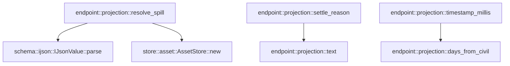

# endpoint::projection

[Package atlas](index.md) · [Source](../../src/projection.rs)

## Declarations

Visibility is the declaration spelling; trait members and reexports require their enclosing interface. `cfg` is not evaluated.

| Symbol | Kind | Visibility | Test / cfg |
|---|---|---|---|
| [endpoint::projection::AttemptInfo](../../src/projection.rs#L12) | struct_item | `private` |  |
| [endpoint::projection::EpochInfo](../../src/projection.rs#L20) | struct_item | `private` |  |
| [endpoint::projection::Projector](../../src/projection.rs#L26) | struct_item | `pub` |  |
| [endpoint::projection::AcceptedStreamFrame](../../src/projection.rs#L46) | struct_item | `pub` |  |
| [endpoint::projection::Projector::processed_through](../../src/projection.rs#L63) | function_item | `pub` |  |
| [endpoint::projection::Projector::reconcile](../../src/projection.rs#L67) | function_item | `pub` |  |
| [endpoint::projection::Projector::stream_event](../../src/projection.rs#L103) | function_item | `pub` |  |
| [endpoint::projection::Projector::project](../../src/projection.rs#L164) | function_item | `private` |  |
| [endpoint::projection::Projector::attempt](../../src/projection.rs#L554) | function_item | `private` |  |
| [endpoint::projection::Projector::validate_existing_kernel_slots](../../src/projection.rs#L560) | function_item | `private` |  |
| [endpoint::projection::Projected](../../src/projection.rs#L582) | type_item | `private` |  |
| [endpoint::projection::user_message](../../src/projection.rs#L584) | function_item | `private` |  |
| [endpoint::projection::apply_surface_supersedes](../../src/projection.rs#L608) | function_item | `private` |  |
| [endpoint::projection::session_event](../../src/projection.rs#L660) | function_item | `private` |  |
| [endpoint::projection::event_value](../../src/projection.rs#L682) | function_item | `private` |  |
| [endpoint::projection::ijson](../../src/projection.rs#L686) | function_item | `private` |  |
| [endpoint::projection::text](../../src/projection.rs#L691) | function_item | `private` |  |
| [endpoint::projection::turn](../../src/projection.rs#L698) | function_item | `private` |  |
| [endpoint::projection::wire_usage](../../src/projection.rs#L702) | function_item | `private` |  |
| [endpoint::projection::reasoning_usage_projection_tests::reasoning_usage_preserves_zero_missing_and_wire_integer_boundary](../../src/projection.rs#L729) | function_item | `private` | test; #[cfg(test)] |
| [endpoint::projection::tool_result_wire](../../src/projection.rs#L743) | function_item | `private` |  |
| [endpoint::projection::failure_object](../../src/projection.rs#L838) | function_item | `private` |  |
| [endpoint::projection::failure_error_name](../../src/projection.rs#L869) | function_item | `private` |  |
| [endpoint::projection::tool_error](../../src/projection.rs#L882) | function_item | `private` |  |
| [endpoint::projection::text_content](../../src/projection.rs#L886) | function_item | `private` |  |
| [endpoint::projection::response_error_message](../../src/projection.rs#L890) | function_item | `private` |  |
| [endpoint::projection::resolve_spill](../../src/projection.rs#L905) | function_item | `private` |  |
| [endpoint::projection::settle_reason](../../src/projection.rs#L930) | function_item | `private` |  |
| [endpoint::projection::timestamp_millis](../../src/projection.rs#L944) | function_item | `pub(crate)` |  |
| [endpoint::projection::days_from_civil](../../src/projection.rs#L980) | function_item | `private` |  |
| [endpoint::projection::ProjectionError](../../src/projection.rs#L991) | enum_item | `pub` |  |
| [endpoint::projection::tests::stream_usage_keeps_partial_reports_in_the_transient_lane](../../src/projection.rs#L1041) | function_item | `private` | test; #[cfg(test)] |
| [endpoint::projection::tests::user_message_projects_file_blocks_and_keeps_images_verbatim](../../src/projection.rs#L1073) | function_item | `private` | test; #[cfg(test)] |
| [endpoint::projection::tests::durable_reasoning_folds_into_its_attempts_assistant_message](../../src/projection.rs#L1096) | function_item | `private` | test; #[cfg(test)] |
| [endpoint::projection::tests::worker_final_and_validation_feedback_do_not_end_the_client_turn](../../src/projection.rs#L1155) | function_item | `private` | test; #[cfg(test)] |
| [endpoint::projection::tests::direct_final_settlement_promotes_the_exact_output_without_a_review_outcome](../../src/projection.rs#L1192) | function_item | `private` | test; #[cfg(test)] |
| [endpoint::projection::tests::session_notice_meta_projects_as_a_turn_independent_surface_event](../../src/projection.rs#L1235) | function_item | `private` | test; #[cfg(test)] |
| [endpoint::projection::tests::trim_of_closed_prior_turn_tool_result_keeps_original_surface_step](../../src/projection.rs#L1274) | function_item | `private` | test; #[cfg(test)] |
| [endpoint::projection::tests::kernel_producer_rejects_dsh_private_state_events](../../src/projection.rs#L1309) | function_item | `private` | test; #[cfg(test)] |
| [endpoint::projection::tests::provider_error_projects_as_turn_scoped_transcript_surface](../../src/projection.rs#L1324) | function_item | `private` | test; #[cfg(test)] |
| [endpoint::projection::tests::a_failed_effect_reports_its_message_and_its_own_code](../../src/projection.rs#L1354) | function_item | `private` | test; #[cfg(test)] |
| [endpoint::projection::tests::non_success_tool_results_have_closed_wire_shapes_and_spills_resolve](../../src/projection.rs#L1409) | function_item | `private` | test; #[cfg(test)] |

## Imports / reexports

| Local name | Source path | Visibility |
|---|---|---|
| `BTreeMap` | `std::collections::BTreeMap` | `private` |
| `BTreeSet` | `std::collections::BTreeSet` | `private` |
| `HashMap` | `std::collections::HashMap` | `private` |
| `HashSet` | `std::collections::HashSet` | `private` |
| `Event` | `schema::Event` | `private` |
| `EventKind` | `schema::EventKind` | `private` |
| `IJsonValue` | `schema::IJsonValue` | `private` |
| `Map` | `serde_json::Map` | `private` |
| `Value` | `serde_json::Value` | `private` |
| `json` | `serde_json::json` | `private` |
| `Error` | `thiserror::Error` | `private` |
| `kernel_may_emit_event_type` | `crate::session_event_registry_generated::kernel_may_emit_event_type` | `private` |
| `EndpointJournal` | `crate::EndpointJournal` | `private` |
| `JournalError` | `crate::JournalError` | `private` |
| `SessionEvent` | `crate::SessionEvent` | `private` |
| `SurfaceOperation` | `crate::SurfaceOperation` | `private` |
| `AssetStore` | `store::AssetStore` | `private` |
| `*` | `super::*` | `private` |
| `AssetStore` | `store::AssetStore` | `private` |
| `*` | `super::*` | `private` |

## Module declarations

| Module | Visibility | Attributes |
|---|---|---|
| `endpoint::projection::reasoning_usage_projection_tests` | `private` | #[cfg(test)] |
| `endpoint::projection::tests` | `private` | #[cfg(test)] |

## Function call graphs

Edges below are syntactically resolved calls only, including private functions. Graphs partition callers into groups of 20; they are not execution order. All unresolved sites are listed below and in the JSON inventory.

```mermaid
flowchart TD
  n0["endpoint::projection::Projector::stream_event"]
  n1["endpoint::projection::Projector::project"]
  n2["endpoint::projection::Projector::attempt"]
  n3["endpoint::projection::Projector::validate_existing_kernel_slots"]
  n4["endpoint::projection::user_message"]
  n5["endpoint::projection::apply_surface_supersedes"]
  n6["endpoint::projection::Projector::processed_through"]
  n7["endpoint::projection::session_event"]
  n8["endpoint::projection::Projector::reconcile"]
  n9["endpoint::projection::event_value"]
  n10["endpoint::projection::ijson"]
  n11["endpoint::projection::text"]
  n12["endpoint::projection::turn"]
  n13["endpoint::projection::wire_usage"]
  n14["endpoint::projection::tool_result_wire"]
  n15["endpoint::projection::failure_object"]
  n16["endpoint::projection::failure_error_name"]
  n17["endpoint::projection::tool_error"]
  n18["endpoint::projection::text_content"]
  n19["endpoint::projection::response_error_message"]
  n20["endpoint::projection::resolve_spill"]
  n21["endpoint::projection::timestamp_millis"]
  n22["endpoint::session_event_registry_generated::kernel_may_emit_event_type"]
  n23["schema::ijson::IJsonValue::parse"]
  n0 --> n7
  n0 --> n13
  n1 --> n2
  n1 --> n4
  n1 --> n7
  n1 --> n9
  n1 --> n11
  n1 --> n13
  n1 --> n14
  n1 --> n20
  n1 --> n21
  n4 --> n7
  n5 --> n9
  n7 --> n10
  n7 --> n22
  n8 --> n1
  n8 --> n3
  n8 --> n5
  n10 --> n23
  n14 --> n15
  n14 --> n16
  n14 --> n17
  n14 --> n18
  n14 --> n20
```

Functions 1–20: 24 direct edges

Functions 21–24: 4 direct edges

## Call sites

Includes test functions (marked in declarations). Receiver-type-required sites need type analysis/manual tracing. Calls in closures are attributed to their enclosing function; their occurrence here does not mean the closure executes immediately.

| Caller | Callee expression | Source lines | Target / classification |
|---|---|---|---|
| `reconcile` | `Vec::new` | [72](../../src/projection.rs#L72) | external-constructor-callback-or-unresolved |
| `reconcile` | `self.project` | [74](../../src/projection.rs#L74) | [endpoint::projection::Projector::project](../../src/projection.rs#L164) |
| `reconcile` | `apply_surface_supersedes` | [76](../../src/projection.rs#L76) | [endpoint::projection::apply_surface_supersedes](../../src/projection.rs#L608) |
| `reconcile` | `kernel_seqs                     .last()                     .ok_or` | [77](../../src/projection.rs#L77) | receiver-type-required |
| `reconcile` | `kernel_seqs                     .last` | [77](../../src/projection.rs#L77) | receiver-type-required |
| `reconcile` | `ProjectionError::InvalidField` | [79](../../src/projection.rs#L79) | external-constructor-callback-or-unresolved |
| `reconcile` | `self.expected_kernel_slots.insert` | [80](../../src/projection.rs#L80) | receiver-type-required |
| `reconcile` | `slot.clone` | [80](../../src/projection.rs#L80) | receiver-type-required |
| `reconcile` | `appended.extend` | [82](../../src/projection.rs#L82) | receiver-type-required |
| `reconcile` | `journal.append_kernel_batch` | [82](../../src/projection.rs#L82) | receiver-type-required |
| `reconcile` | `event.has_field` | [84](../../src/projection.rs#L84) | receiver-type-required |
| `reconcile` | `event                     .string_field("attempt")                     .ok_or` | [86](../../src/projection.rs#L86) | receiver-type-required |
| `reconcile` | `event                     .string_field` | [86](../../src/projection.rs#L86) | receiver-type-required |
| `reconcile` | `ProjectionError::MissingField` | [88](../../src/projection.rs#L88) | external-constructor-callback-or-unresolved |
| `reconcile` | `self.terminal_attempts.insert` | [89](../../src/projection.rs#L89) | receiver-type-required |
| `reconcile` | `attempt.to_owned` | [89](../../src/projection.rs#L89) | receiver-type-required |
| `reconcile` | `Some` | [91](../../src/projection.rs#L91) | external-constructor-callback-or-unresolved |
| `reconcile` | `self.processed_through                     .map_or` | [92](../../src/projection.rs#L92) | receiver-type-required |
| `reconcile` | `event.seq` | [93](../../src/projection.rs#L93) | receiver-type-required |
| `reconcile` | `seq.max` | [93](../../src/projection.rs#L93) | receiver-type-required |
| `reconcile` | `self.validate_existing_kernel_slots` | [96](../../src/projection.rs#L96) | [endpoint::projection::Projector::validate_existing_kernel_slots](../../src/projection.rs#L560) |
| `reconcile` | `Ok` | [97](../../src/projection.rs#L97) | external-constructor-callback-or-unresolved |
| `stream_event` | `self.terminal_attempts.contains` | [107](../../src/projection.rs#L107) | receiver-type-required |
| `stream_event` | `Err` | [108](../../src/projection.rs#L108), [119](../../src/projection.rs#L119), [124](../../src/projection.rs#L124), [151](../../src/projection.rs#L151) | external-constructor-callback-or-unresolved |
| `stream_event` | `ProjectionError::TerminalAttempt` | [108](../../src/projection.rs#L108) | external-constructor-callback-or-unresolved |
| `stream_event` | `frame.attempt.clone` | [108](../../src/projection.rs#L108), [113](../../src/projection.rs#L113) | receiver-type-required |
| `stream_event` | `self             .attempts             .get(&frame.attempt)             .ok_or_else` | [110](../../src/projection.rs#L110) | receiver-type-required |
| `stream_event` | `self             .attempts             .get` | [110](../../src/projection.rs#L110) | receiver-type-required |
| `stream_event` | `ProjectionError::UnknownAttempt` | [113](../../src/projection.rs#L113) | external-constructor-callback-or-unresolved |
| `stream_event` | `frame.channel.as_str` | [114](../../src/projection.rs#L114) | receiver-type-required |
| `stream_event` | `ProjectionError::StreamChannel` | [119](../../src/projection.rs#L119) | external-constructor-callback-or-unresolved |
| `stream_event` | `other.to_owned` | [119](../../src/projection.rs#L119) | receiver-type-required |
| `stream_event` | `frame.call_id.is_some` | [122](../../src/projection.rs#L122), [149](../../src/projection.rs#L149) | receiver-type-required |
| `stream_event` | `frame.name.is_some` | [122](../../src/projection.rs#L122), [149](../../src/projection.rs#L149) | receiver-type-required |
| `stream_event` | `frame.arguments_complete.is_some` | [122](../../src/projection.rs#L122), [149](../../src/projection.rs#L149) | receiver-type-required |
| `stream_event` | `ProjectionError::InvalidField` | [124](../../src/projection.rs#L124), [127](../../src/projection.rs#L127), [151](../../src/projection.rs#L151) | external-constructor-callback-or-unresolved |
| `stream_event` | `serde_json::from_str(&frame.delta)                 .map_err` | [126](../../src/projection.rs#L126) | receiver-type-required |
| `stream_event` | `serde_json::from_str` | [126](../../src/projection.rs#L126) | external-constructor-callback-or-unresolved |
| `stream_event` | `wire_usage` | [128](../../src/projection.rs#L128) | [endpoint::projection::wire_usage](../../src/projection.rs#L702) |
| `stream_event` | `frame                 .call_id                 .as_deref()                 .ok_or` | [131](../../src/projection.rs#L131) | receiver-type-required |
| `stream_event` | `frame                 .call_id                 .as_deref` | [131](../../src/projection.rs#L131) | receiver-type-required |
| `stream_event` | `ProjectionError::MissingField` | [134](../../src/projection.rs#L134) | external-constructor-callback-or-unresolved |
| `stream_event` | `Map::new` | [135](../../src/projection.rs#L135) | external-constructor-callback-or-unresolved |
| `stream_event` | `chunk.insert` | [136](../../src/projection.rs#L136), [137](../../src/projection.rs#L137), [138](../../src/projection.rs#L138), [139](../../src/projection.rs#L139), [140](../../src/projection.rs#L140), [142](../../src/projection.rs#L142), [145](../../src/projection.rs#L145) | receiver-type-required |
| `stream_event` | `"type".to_owned` | [136](../../src/projection.rs#L136) | receiver-type-required |
| `stream_event` | `"index".to_owned` | [137](../../src/projection.rs#L137) | receiver-type-required |
| `stream_event` | `"id".to_owned` | [138](../../src/projection.rs#L138) | receiver-type-required |
| `stream_event` | `"argumentsDelta".to_owned` | [139](../../src/projection.rs#L139) | receiver-type-required |
| `stream_event` | `"assistantFrameId".to_owned` | [140](../../src/projection.rs#L140) | receiver-type-required |
| `stream_event` | `"argumentsComplete".to_owned` | [142](../../src/projection.rs#L142) | receiver-type-required |
| `stream_event` | `"name".to_owned` | [145](../../src/projection.rs#L145) | receiver-type-required |
| `stream_event` | `session_event` | [159](../../src/projection.rs#L159) | [endpoint::projection::session_event](../../src/projection.rs#L660) |
| `stream_event` | `Ok` | [161](../../src/projection.rs#L161) | external-constructor-callback-or-unresolved |
| `project` | `event_value` | [169](../../src/projection.rs#L169) | [endpoint::projection::event_value](../../src/projection.rs#L682) |
| `project` | `timestamp_millis` | [170](../../src/projection.rs#L170) | [endpoint::projection::timestamp_millis](../../src/projection.rs#L944) |
| `project` | `value                 .get("ts")                 .and_then(Value::as_str)                 .ok_or` | [171](../../src/projection.rs#L171) | receiver-type-required |
| `project` | `value                 .get("ts")                 .and_then` | [171](../../src/projection.rs#L171) | receiver-type-required |
| `project` | `value                 .get` | [171](../../src/projection.rs#L171) | receiver-type-required |
| `project` | `ProjectionError::MissingField` | [174](../../src/projection.rs#L174), [294](../../src/projection.rs#L294), [362](../../src/projection.rs#L362), [515](../../src/projection.rs#L515) | external-constructor-callback-or-unresolved |
| `project` | `Vec::new` | [176](../../src/projection.rs#L176) | external-constructor-callback-or-unresolved |
| `project` | `event.kind` | [177](../../src/projection.rs#L177) | receiver-type-required |
| `project` | `self.inputs.insert` | [179](../../src/projection.rs#L179) | receiver-type-required |
| `project` | `event.seq` | [179](../../src/projection.rs#L179), [244](../../src/projection.rs#L244), [319](../../src/projection.rs#L319), [404](../../src/projection.rs#L404) | receiver-type-required |
| `project` | `text(&value, "id")?.to_owned` | [182](../../src/projection.rs#L182) | receiver-type-required |
| `project` | `text` | [182](../../src/projection.rs#L182), [186](../../src/projection.rs#L186), [187](../../src/projection.rs#L187), [222](../../src/projection.rs#L222), [243](../../src/projection.rs#L243), [290](../../src/projection.rs#L290), [305](../../src/projection.rs#L305), [357](../../src/projection.rs#L357), [383](../../src/projection.rs#L383), [431](../../src/projection.rs#L431) | [endpoint::projection::text](../../src/projection.rs#L691) |
| `project` | `self.epochs.insert` | [183](../../src/projection.rs#L183) | receiver-type-required |
| `project` | `text(&value, "adapter")?.to_owned` | [186](../../src/projection.rs#L186) | receiver-type-required |
| `project` | `text(&value, "model")?.to_owned` | [187](../../src/projection.rs#L187) | receiver-type-required |
| `project` | `turn` | [192](../../src/projection.rs#L192), [221](../../src/projection.rs#L221), [384](../../src/projection.rs#L384), [430](../../src/projection.rs#L430), [451](../../src/projection.rs#L451) | external-constructor-callback-or-unresolved |
| `project` | `output.push` | [193](../../src/projection.rs#L193), [213](../../src/projection.rs#L213), [224](../../src/projection.rs#L224), [248](../../src/projection.rs#L248), [280](../../src/projection.rs#L280), [350](../../src/projection.rs#L350), [365](../../src/projection.rs#L365), [423](../../src/projection.rs#L423), [433](../../src/projection.rs#L433), [453](../../src/projection.rs#L453), [500](../../src/projection.rs#L500), [521](../../src/projection.rs#L521), [538](../../src/projection.rs#L538) | receiver-type-required |
| `project` | `"turn-start".to_owned` | [195](../../src/projection.rs#L195) | receiver-type-required |
| `project` | `session_event` | [196](../../src/projection.rs#L196), [227](../../src/projection.rs#L227), [251](../../src/projection.rs#L251), [353](../../src/projection.rs#L353), [368](../../src/projection.rs#L368), [426](../../src/projection.rs#L426), [436](../../src/projection.rs#L436), [456](../../src/projection.rs#L456), [503](../../src/projection.rs#L503), [524](../../src/projection.rs#L524), [541](../../src/projection.rs#L541) | [endpoint::projection::session_event](../../src/projection.rs#L660) |
| `project` | `value                     .get("trigger")                     .and_then(Value::as_object)                     .and_then(&#124;trigger&#124; trigger.get("inputs"))                     .and_then(Value::as_array)                     .cloned()                     .unwrap_or_default` | [198](../../src/projection.rs#L198) | receiver-type-required |
| `project` | `value                     .get("trigger")                     .and_then(Value::as_object)                     .and_then(&#124;trigger&#124; trigger.get("inputs"))                     .and_then(Value::as_array)                     .cloned` | [198](../../src/projection.rs#L198) | receiver-type-required |
| `project` | `value                     .get("trigger")                     .and_then(Value::as_object)                     .and_then(&#124;trigger&#124; trigger.get("inputs"))                     .and_then` | [198](../../src/projection.rs#L198) | receiver-type-required |
| `project` | `value                     .get("trigger")                     .and_then(Value::as_object)                     .and_then` | [198](../../src/projection.rs#L198) | receiver-type-required |
| `project` | `value                     .get("trigger")                     .and_then` | [198](../../src/projection.rs#L198) | receiver-type-required |
| `project` | `value                     .get` | [198](../../src/projection.rs#L198), [259](../../src/projection.rs#L259), [507](../../src/projection.rs#L507) | receiver-type-required |
| `project` | `trigger.get` | [201](../../src/projection.rs#L201) | receiver-type-required |
| `project` | `input_seqs.into_iter().enumerate` | [205](../../src/projection.rs#L205) | receiver-type-required |
| `project` | `input_seqs.into_iter` | [205](../../src/projection.rs#L205) | receiver-type-required |
| `project` | `input_seq                         .as_u64()                         .ok_or` | [206](../../src/projection.rs#L206) | receiver-type-required |
| `project` | `input_seq                         .as_u64` | [206](../../src/projection.rs#L206) | receiver-type-required |
| `project` | `ProjectionError::InvalidField` | [208](../../src/projection.rs#L208), [268](../../src/projection.rs#L268), [272](../../src/projection.rs#L272), [469](../../src/projection.rs#L469), [473](../../src/projection.rs#L473), [475](../../src/projection.rs#L475), [485](../../src/projection.rs#L485), [487](../../src/projection.rs#L487), [496](../../src/projection.rs#L496), [510](../../src/projection.rs#L510), [519](../../src/projection.rs#L519) | external-constructor-callback-or-unresolved |
| `project` | `self                         .inputs                         .get(&input_seq)                         .ok_or` | [209](../../src/projection.rs#L209) | receiver-type-required |
| `project` | `self                         .inputs                         .get` | [209](../../src/projection.rs#L209) | receiver-type-required |
| `project` | `ProjectionError::UnknownInput` | [212](../../src/projection.rs#L212) | external-constructor-callback-or-unresolved |
| `project` | `user_message` | [216](../../src/projection.rs#L216), [283](../../src/projection.rs#L283) | [endpoint::projection::user_message](../../src/projection.rs#L584) |
| `project` | `text(&value, "attempt")?.to_owned` | [222](../../src/projection.rs#L222) | receiver-type-required |
| `project` | `self.open_steps.remove` | [223](../../src/projection.rs#L223), [452](../../src/projection.rs#L452) | receiver-type-required |
| `project` | `self                     .attempts                     .values()                     .filter(&#124;info&#124; info.turn == turn)                     .count` | [235](../../src/projection.rs#L235) | receiver-type-required |
| `project` | `self                     .attempts                     .values()                     .filter` | [235](../../src/projection.rs#L235) | receiver-type-required |
| `project` | `self                     .attempts                     .values` | [235](../../src/projection.rs#L235) | receiver-type-required |
| `project` | `text(&value, "epoch")?.to_owned` | [243](../../src/projection.rs#L243) | receiver-type-required |
| `project` | `self.attempts.insert` | [246](../../src/projection.rs#L246) | receiver-type-required |
| `project` | `attempt.clone` | [246](../../src/projection.rs#L246) | receiver-type-required |
| `project` | `info.clone` | [246](../../src/projection.rs#L246) | receiver-type-required |
| `project` | `self.open_steps.insert` | [247](../../src/projection.rs#L247) | receiver-type-required |
| `project` | `"step-start".to_owned` | [250](../../src/projection.rs#L250) | receiver-type-required |
| `project` | `value                     .get("admits")                     .and_then(Value::as_array)                     .into_iter()                     .flatten` | [259](../../src/projection.rs#L259) | receiver-type-required |
| `project` | `value                     .get("admits")                     .and_then(Value::as_array)                     .into_iter` | [259](../../src/projection.rs#L259) | receiver-type-required |
| `project` | `value                     .get("admits")                     .and_then` | [259](../../src/projection.rs#L259) | receiver-type-required |
| `project` | `range                         .get("from")                         .and_then(Value::as_u64)                         .ok_or` | [265](../../src/projection.rs#L265) | receiver-type-required |
| `project` | `range                         .get("from")                         .and_then` | [265](../../src/projection.rs#L265) | receiver-type-required |
| `project` | `range                         .get` | [265](../../src/projection.rs#L265), [269](../../src/projection.rs#L269) | receiver-type-required |
| `project` | `range                         .get("to")                         .and_then(Value::as_u64)                         .ok_or` | [269](../../src/projection.rs#L269) | receiver-type-required |
| `project` | `range                         .get("to")                         .and_then` | [269](../../src/projection.rs#L269) | receiver-type-required |
| `project` | `self.inputs.get` | [274](../../src/projection.rs#L274) | receiver-type-required |
| `project` | `input.get("steer").and_then` | [277](../../src/projection.rs#L277) | receiver-type-required |
| `project` | `input.get` | [277](../../src/projection.rs#L277) | receiver-type-required |
| `project` | `Some` | [277](../../src/projection.rs#L277), [317](../../src/projection.rs#L317), [491](../../src/projection.rs#L491) | external-constructor-callback-or-unresolved |
| `project` | `self.seen_steers.insert` | [278](../../src/projection.rs#L278) | receiver-type-required |
| `project` | `resolve_spill` | [291](../../src/projection.rs#L291), [359](../../src/projection.rs#L359) | [endpoint::projection::resolve_spill](../../src/projection.rs#L905) |
| `project` | `value                         .get("content")                         .ok_or` | [292](../../src/projection.rs#L292) | receiver-type-required |
| `project` | `value                         .get` | [292](../../src/projection.rs#L292), [360](../../src/projection.rs#L360), [386](../../src/projection.rs#L386) | receiver-type-required |
| `project` | `content.as_str().filter` | [297](../../src/projection.rs#L297) | receiver-type-required |
| `project` | `content.as_str` | [297](../../src/projection.rs#L297) | receiver-type-required |
| `project` | `text.is_empty` | [297](../../src/projection.rs#L297) | receiver-type-required |
| `project` | `self.reasoning                         .entry(attempt.to_owned())                         .or_default()                         .push` | [298](../../src/projection.rs#L298) | receiver-type-required |
| `project` | `self.reasoning                         .entry(attempt.to_owned())                         .or_default` | [298](../../src/projection.rs#L298) | receiver-type-required |
| `project` | `self.reasoning                         .entry` | [298](../../src/projection.rs#L298) | receiver-type-required |
| `project` | `attempt.to_owned` | [299](../../src/projection.rs#L299) | receiver-type-required |
| `project` | `text.to_owned` | [301](../../src/projection.rs#L301) | receiver-type-required |
| `project` | `self.attempt(attempt)?.clone` | [306](../../src/projection.rs#L306) | receiver-type-required |
| `project` | `self.attempt` | [306](../../src/projection.rs#L306), [358](../../src/projection.rs#L358) | [endpoint::projection::Projector::attempt](../../src/projection.rs#L554) |
| `project` | `self                     .epochs                     .get(&info.epoch)                     .ok_or_else` | [307](../../src/projection.rs#L307) | receiver-type-required |
| `project` | `self                     .epochs                     .get` | [307](../../src/projection.rs#L307) | receiver-type-required |
| `project` | `ProjectionError::UnknownEpoch` | [310](../../src/projection.rs#L310) | external-constructor-callback-or-unresolved |
| `project` | `info.epoch.clone` | [310](../../src/projection.rs#L310) | receiver-type-required |
| `project` | `Map::new` | [311](../../src/projection.rs#L311), [321](../../src/projection.rs#L321) | external-constructor-callback-or-unresolved |
| `project` | `data.insert` | [312](../../src/projection.rs#L312), [313](../../src/projection.rs#L313), [315](../../src/projection.rs#L315), [338](../../src/projection.rs#L338), [348](../../src/projection.rs#L348) | receiver-type-required |
| `project` | `"turn".to_owned` | [312](../../src/projection.rs#L312) | receiver-type-required |
| `project` | `"step".to_owned` | [313](../../src/projection.rs#L313) | receiver-type-required |
| `project` | `value.get` | [314](../../src/projection.rs#L314), [317](../../src/projection.rs#L317), [325](../../src/projection.rs#L325), [335](../../src/projection.rs#L335), [347](../../src/projection.rs#L347), [432](../../src/projection.rs#L432), [465](../../src/projection.rs#L465), [480](../../src/projection.rs#L480), [491](../../src/projection.rs#L491), [506](../../src/projection.rs#L506), [537](../../src/projection.rs#L537) | receiver-type-required |
| `project` | `"sessionFinal".to_owned` | [315](../../src/projection.rs#L315) | receiver-type-required |
| `project` | `final_answer.clone` | [315](../../src/projection.rs#L315) | receiver-type-required |
| `project` | `value.get("final_answer").and_then` | [317](../../src/projection.rs#L317) | receiver-type-required |
| `project` | `self.outputs                         .insert` | [318](../../src/projection.rs#L318) | receiver-type-required |
| `project` | `source.insert` | [322](../../src/projection.rs#L322), [323](../../src/projection.rs#L323), [324](../../src/projection.rs#L324), [326](../../src/projection.rs#L326) | receiver-type-required |
| `project` | `"kind".to_owned` | [322](../../src/projection.rs#L322) | receiver-type-required |
| `project` | `"provider".to_owned` | [323](../../src/projection.rs#L323) | receiver-type-required |
| `project` | `"model".to_owned` | [324](../../src/projection.rs#L324) | receiver-type-required |
| `project` | `"replayState".to_owned` | [326](../../src/projection.rs#L326) | receiver-type-required |
| `project` | `continuation.clone` | [326](../../src/projection.rs#L326) | receiver-type-required |
| `project` | `self                     .reasoning                     .remove(attempt)                     .unwrap_or_default()                     .into_iter()                     .map(&#124;text&#124; json!({"type": "reasoning", "text": text}))                     .collect::<Vec<_>>` | [328](../../src/projection.rs#L328) | receiver-type-required |
| `project` | `self                     .reasoning                     .remove(attempt)                     .unwrap_or_default()                     .into_iter()                     .map` | [328](../../src/projection.rs#L328) | receiver-type-required |
| `project` | `self                     .reasoning                     .remove(attempt)                     .unwrap_or_default()                     .into_iter` | [328](../../src/projection.rs#L328) | receiver-type-required |
| `project` | `self                     .reasoning                     .remove(attempt)                     .unwrap_or_default` | [328](../../src/projection.rs#L328) | receiver-type-required |
| `project` | `self                     .reasoning                     .remove` | [328](../../src/projection.rs#L328) | receiver-type-required |
| `project` | `value.get("content").and_then` | [335](../../src/projection.rs#L335) | receiver-type-required |
| `project` | `content.extend` | [336](../../src/projection.rs#L336) | receiver-type-required |
| `project` | `blocks.iter().cloned` | [336](../../src/projection.rs#L336) | receiver-type-required |
| `project` | `blocks.iter` | [336](../../src/projection.rs#L336) | receiver-type-required |
| `project` | `"message".to_owned` | [339](../../src/projection.rs#L339) | receiver-type-required |
| `project` | `"usage".to_owned` | [348](../../src/projection.rs#L348) | receiver-type-required |
| `project` | `wire_usage` | [348](../../src/projection.rs#L348) | [endpoint::projection::wire_usage](../../src/projection.rs#L702) |
| `project` | `"assistant-message".to_owned` | [352](../../src/projection.rs#L352) | receiver-type-required |
| `project` | `Value::Object` | [353](../../src/projection.rs#L353) | external-constructor-callback-or-unresolved |
| `project` | `value                         .get("args")                         .ok_or` | [360](../../src/projection.rs#L360) | receiver-type-required |
| `project` | `"tool-call".to_owned` | [367](../../src/projection.rs#L367) | receiver-type-required |
| `project` | `value                         .get("supersedes")                         .and_then(Value::as_array)                         .and_then` | [386](../../src/projection.rs#L386) | receiver-type-required |
| `project` | `value                         .get("supersedes")                         .and_then` | [386](../../src/projection.rs#L386) | receiver-type-required |
| `project` | `ranges.iter().find_map` | [390](../../src/projection.rs#L390) | receiver-type-required |
| `project` | `ranges.iter` | [390](../../src/projection.rs#L390) | receiver-type-required |
| `project` | `range.get("from")?.as_u64` | [391](../../src/projection.rs#L391) | receiver-type-required |
| `project` | `range.get` | [391](../../src/projection.rs#L391), [392](../../src/projection.rs#L392) | receiver-type-required |
| `project` | `range.get("to")?.as_u64` | [392](../../src/projection.rs#L392) | receiver-type-required |
| `project` | `self.tool_result_steps                                     .range(from..=to)                                     .next()                                     .map` | [393](../../src/projection.rs#L393) | receiver-type-required |
| `project` | `self.tool_result_steps                                     .range(from..=to)                                     .next` | [393](../../src/projection.rs#L393) | receiver-type-required |
| `project` | `self.tool_result_steps                                     .range` | [393](../../src/projection.rs#L393) | receiver-type-required |
| `project` | `replaced_step                     .or_else(&#124;&#124; self.open_steps.get(&turn).map(&#124;info&#124; (turn, info.step)))                     .ok_or` | [399](../../src/projection.rs#L399) | receiver-type-required |
| `project` | `replaced_step                     .or_else` | [399](../../src/projection.rs#L399) | receiver-type-required |
| `project` | `self.open_steps.get(&turn).map` | [400](../../src/projection.rs#L400) | receiver-type-required |
| `project` | `self.open_steps.get` | [400](../../src/projection.rs#L400) | receiver-type-required |
| `project` | `ProjectionError::NoOpenStep` | [401](../../src/projection.rs#L401) | external-constructor-callback-or-unresolved |
| `project` | `tool_result_wire` | [402](../../src/projection.rs#L402) | [endpoint::projection::tool_result_wire](../../src/projection.rs#L743) |
| `project` | `self.tool_result_steps                     .insert` | [403](../../src/projection.rs#L403) | receiver-type-required |
| `project` | `"tool-result".to_owned` | [425](../../src/projection.rs#L425) | receiver-type-required |
| `project` | `value.get("detail").and_then` | [432](../../src/projection.rs#L432) | receiver-type-required |
| `project` | `"response-error".to_owned` | [435](../../src/projection.rs#L435) | receiver-type-required |
| `project` | `"step-end-at-settle".to_owned` | [455](../../src/projection.rs#L455) | receiver-type-required |
| `project` | `validation                         .get("promoted_output_seq")                         .and_then(Value::as_u64)                         .ok_or` | [466](../../src/projection.rs#L466) | receiver-type-required |
| `project` | `validation                         .get("promoted_output_seq")                         .and_then` | [466](../../src/projection.rs#L466) | receiver-type-required |
| `project` | `validation                         .get` | [466](../../src/projection.rs#L466) | receiver-type-required |
| `project` | `self                         .outputs                         .get(&output_seq)                         .ok_or` | [470](../../src/projection.rs#L470), [482](../../src/projection.rs#L482) | receiver-type-required |
| `project` | `self                         .outputs                         .get` | [470](../../src/projection.rs#L470), [482](../../src/projection.rs#L482) | receiver-type-required |
| `project` | `Err` | [475](../../src/projection.rs#L475), [487](../../src/projection.rs#L487), [519](../../src/projection.rs#L519) | external-constructor-callback-or-unresolved |
| `project` | `validation["outcome"].clone` | [478](../../src/projection.rs#L478) | receiver-type-required |
| `project` | `value.get("promoted_output_seq").and_then` | [480](../../src/projection.rs#L480) | receiver-type-required |
| `project` | `value.get("outcome").and_then` | [491](../../src/projection.rs#L491) | receiver-type-required |
| `project` | `Value::String` | [492](../../src/projection.rs#L492) | external-constructor-callback-or-unresolved |
| `project` | `value                             .get("classification")                             .and_then(Value::as_str)                             .ok_or(ProjectionError::InvalidField("classification"))?                             .to_owned` | [493](../../src/projection.rs#L493) | receiver-type-required |
| `project` | `value                             .get("classification")                             .and_then(Value::as_str)                             .ok_or` | [493](../../src/projection.rs#L493) | receiver-type-required |
| `project` | `value                             .get("classification")                             .and_then` | [493](../../src/projection.rs#L493) | receiver-type-required |
| `project` | `value                             .get` | [493](../../src/projection.rs#L493) | receiver-type-required |
| `project` | `"turn-end".to_owned` | [502](../../src/projection.rs#L502) | receiver-type-required |
| `project` | `value.get("notice").is_some` | [506](../../src/projection.rs#L506) | receiver-type-required |
| `project` | `value                     .get("notice")                     .and_then(Value::as_object)                     .ok_or` | [507](../../src/projection.rs#L507) | receiver-type-required |
| `project` | `value                     .get("notice")                     .and_then` | [507](../../src/projection.rs#L507) | receiver-type-required |
| `project` | `notice                         .get(name)                         .and_then(Value::as_str)                         .ok_or` | [512](../../src/projection.rs#L512) | receiver-type-required |
| `project` | `notice                         .get(name)                         .and_then` | [512](../../src/projection.rs#L512) | receiver-type-required |
| `project` | `notice                         .get` | [512](../../src/projection.rs#L512) | receiver-type-required |
| `project` | `field` | [517](../../src/projection.rs#L517) | external-constructor-callback-or-unresolved |
| `project` | `"session-notice".to_owned` | [523](../../src/projection.rs#L523) | receiver-type-required |
| `project` | `value.get("title").is_some` | [537](../../src/projection.rs#L537) | receiver-type-required |
| `project` | `"session-title".to_owned` | [540](../../src/projection.rs#L540) | receiver-type-required |
| `project` | `Ok` | [551](../../src/projection.rs#L551) | external-constructor-callback-or-unresolved |
| `attempt` | `self.attempts             .get(attempt)             .ok_or_else` | [555](../../src/projection.rs#L555) | receiver-type-required |
| `attempt` | `self.attempts             .get` | [555](../../src/projection.rs#L555) | receiver-type-required |
| `attempt` | `ProjectionError::UnknownAttempt` | [557](../../src/projection.rs#L557) | external-constructor-callback-or-unresolved |
| `attempt` | `attempt.to_owned` | [557](../../src/projection.rs#L557) | receiver-type-required |
| `validate_existing_kernel_slots` | `Ok` | [565](../../src/projection.rs#L565), [578](../../src/projection.rs#L578) | external-constructor-callback-or-unresolved |
| `validate_existing_kernel_slots` | `journal.records` | [567](../../src/projection.rs#L567) | receiver-type-required |
| `validate_existing_kernel_slots` | `record.kernel_seqs.last().copied` | [569](../../src/projection.rs#L569) | receiver-type-required |
| `validate_existing_kernel_slots` | `record.kernel_seqs.last` | [569](../../src/projection.rs#L569) | receiver-type-required |
| `validate_existing_kernel_slots` | `self.expected_kernel_slots.contains` | [573](../../src/projection.rs#L573) | receiver-type-required |
| `validate_existing_kernel_slots` | `slot.clone` | [573](../../src/projection.rs#L573) | receiver-type-required |
| `validate_existing_kernel_slots` | `Err` | [575](../../src/projection.rs#L575) | external-constructor-callback-or-unresolved |
| `user_message` | `input         .get("origin_key")         .and_then(Value::as_str)         .unwrap_or` | [590](../../src/projection.rs#L590) | receiver-type-required |
| `user_message` | `input         .get("origin_key")         .and_then` | [590](../../src/projection.rs#L590) | receiver-type-required |
| `user_message` | `input         .get` | [590](../../src/projection.rs#L590) | receiver-type-required |
| `user_message` | `input.get` | [602](../../src/projection.rs#L602) | receiver-type-required |
| `user_message` | `submission.clone` | [603](../../src/projection.rs#L603) | receiver-type-required |
| `user_message` | `session_event` | [605](../../src/projection.rs#L605) | [endpoint::projection::session_event](../../src/projection.rs#L660) |
| `apply_surface_supersedes` | `wire.surface_op.is_none` | [613](../../src/projection.rs#L613) | receiver-type-required |
| `apply_surface_supersedes` | `Ok` | [614](../../src/projection.rs#L614), [618](../../src/projection.rs#L618), [657](../../src/projection.rs#L657) | external-constructor-callback-or-unresolved |
| `apply_surface_supersedes` | `event_value` | [616](../../src/projection.rs#L616) | [endpoint::projection::event_value](../../src/projection.rs#L682) |
| `apply_surface_supersedes` | `value.get("supersedes").and_then` | [617](../../src/projection.rs#L617) | receiver-type-required |
| `apply_surface_supersedes` | `value.get` | [617](../../src/projection.rs#L617) | receiver-type-required |
| `apply_surface_supersedes` | `wire         .source_event_seqs         .take()         .unwrap_or_default()         .into_iter()         .collect::<BTreeSet<_>>` | [620](../../src/projection.rs#L620) | receiver-type-required |
| `apply_surface_supersedes` | `wire         .source_event_seqs         .take()         .unwrap_or_default()         .into_iter` | [620](../../src/projection.rs#L620) | receiver-type-required |
| `apply_surface_supersedes` | `wire         .source_event_seqs         .take()         .unwrap_or_default` | [620](../../src/projection.rs#L620) | receiver-type-required |
| `apply_surface_supersedes` | `wire         .source_event_seqs         .take` | [620](../../src/projection.rs#L620) | receiver-type-required |
| `apply_surface_supersedes` | `journal.records` | [626](../../src/projection.rs#L626) | receiver-type-required |
| `apply_surface_supersedes` | `Vec::new` | [627](../../src/projection.rs#L627) | external-constructor-callback-or-unresolved |
| `apply_surface_supersedes` | `record.kernel_seqs.iter().any` | [634](../../src/projection.rs#L634) | receiver-type-required |
| `apply_surface_supersedes` | `record.kernel_seqs.iter` | [634](../../src/projection.rs#L634) | receiver-type-required |
| `apply_surface_supersedes` | `ranges.iter().any` | [635](../../src/projection.rs#L635) | receiver-type-required |
| `apply_surface_supersedes` | `ranges.iter` | [635](../../src/projection.rs#L635) | receiver-type-required |
| `apply_surface_supersedes` | `range.get("from").and_then` | [636](../../src/projection.rs#L636) | receiver-type-required |
| `apply_surface_supersedes` | `range.get` | [636](../../src/projection.rs#L636), [637](../../src/projection.rs#L637) | receiver-type-required |
| `apply_surface_supersedes` | `range.get("to").and_then` | [637](../../src/projection.rs#L637) | receiver-type-required |
| `apply_surface_supersedes` | `from.zip(to)                         .is_some_and` | [638](../../src/projection.rs#L638) | receiver-type-required |
| `apply_surface_supersedes` | `from.zip` | [638](../../src/projection.rs#L638) | receiver-type-required |
| `apply_surface_supersedes` | `replaced.push` | [643](../../src/projection.rs#L643) | receiver-type-required |
| `apply_surface_supersedes` | `replaced.first().copied` | [646](../../src/projection.rs#L646) | receiver-type-required |
| `apply_surface_supersedes` | `replaced.first` | [646](../../src/projection.rs#L646) | receiver-type-required |
| `apply_surface_supersedes` | `replaced.last().copied` | [646](../../src/projection.rs#L646) | receiver-type-required |
| `apply_surface_supersedes` | `replaced.last` | [646](../../src/projection.rs#L646) | receiver-type-required |
| `apply_surface_supersedes` | `endpoint_sources.extend` | [647](../../src/projection.rs#L647) | receiver-type-required |
| `apply_surface_supersedes` | `Some` | [648](../../src/projection.rs#L648), [649](../../src/projection.rs#L649), [655](../../src/projection.rs#L655) | external-constructor-callback-or-unresolved |
| `apply_surface_supersedes` | `endpoint_sources.into_iter().collect` | [648](../../src/projection.rs#L648), [655](../../src/projection.rs#L655) | receiver-type-required |
| `apply_surface_supersedes` | `endpoint_sources.into_iter` | [648](../../src/projection.rs#L648), [655](../../src/projection.rs#L655) | receiver-type-required |
| `apply_surface_supersedes` | `"replace".to_owned` | [650](../../src/projection.rs#L650) | receiver-type-required |
| `apply_surface_supersedes` | `endpoint_sources.is_empty` | [654](../../src/projection.rs#L654) | receiver-type-required |
| `session_event` | `kernel_may_emit_event_type` | [666](../../src/projection.rs#L666) | [endpoint::session_event_registry_generated::kernel_may_emit_event_type](../../src/session_event_registry_generated.rs#L435) |
| `session_event` | `Err` | [667](../../src/projection.rs#L667) | external-constructor-callback-or-unresolved |
| `session_event` | `ProjectionError::UnregisteredKernelEvent` | [667](../../src/projection.rs#L667) | external-constructor-callback-or-unresolved |
| `session_event` | `event_type.to_owned` | [668](../../src/projection.rs#L668), [672](../../src/projection.rs#L672) | receiver-type-required |
| `session_event` | `Ok` | [671](../../src/projection.rs#L671) | external-constructor-callback-or-unresolved |
| `session_event` | `ijson` | [675](../../src/projection.rs#L675) | [endpoint::projection::ijson](../../src/projection.rs#L686) |
| `session_event` | `surface.then` | [678](../../src/projection.rs#L678) | receiver-type-required |
| `session_event` | `SurfaceOperation::Append` | [678](../../src/projection.rs#L678) | external-constructor-callback-or-unresolved |
| `session_event` | `"append".to_owned` | [678](../../src/projection.rs#L678) | receiver-type-required |
| `event_value` | `serde_json::to_value(event.raw()).map_err` | [683](../../src/projection.rs#L683) | receiver-type-required |
| `event_value` | `serde_json::to_value` | [683](../../src/projection.rs#L683) | external-constructor-callback-or-unresolved |
| `event_value` | `event.raw` | [683](../../src/projection.rs#L683) | receiver-type-required |
| `ijson` | `serde_json::to_vec(&value).map_err` | [687](../../src/projection.rs#L687) | receiver-type-required |
| `ijson` | `serde_json::to_vec` | [687](../../src/projection.rs#L687) | external-constructor-callback-or-unresolved |
| `ijson` | `IJsonValue::parse(&bytes).map_err` | [688](../../src/projection.rs#L688) | receiver-type-required |
| `ijson` | `IJsonValue::parse` | [688](../../src/projection.rs#L688) | [schema::ijson::IJsonValue::parse](../../../schema/src/ijson.rs#L16) |
| `text` | `value         .get(field)         .and_then(Value::as_str)         .ok_or` | [692](../../src/projection.rs#L692) | receiver-type-required |
| `text` | `value         .get(field)         .and_then` | [692](../../src/projection.rs#L692) | receiver-type-required |
| `text` | `value         .get` | [692](../../src/projection.rs#L692) | receiver-type-required |
| `text` | `ProjectionError::MissingField` | [695](../../src/projection.rs#L695) | external-constructor-callback-or-unresolved |
| `turn` | `event.turn().ok_or` | [699](../../src/projection.rs#L699) | receiver-type-required |
| `turn` | `event.turn` | [699](../../src/projection.rs#L699) | receiver-type-required |
| `turn` | `ProjectionError::MissingField` | [699](../../src/projection.rs#L699) | external-constructor-callback-or-unresolved |
| `wire_usage` | `Map::new` | [703](../../src/projection.rs#L703) | external-constructor-callback-or-unresolved |
| `wire_usage` | `value.get(source).and_then` | [711](../../src/projection.rs#L711) | receiver-type-required |
| `wire_usage` | `value.get` | [711](../../src/projection.rs#L711) | receiver-type-required |
| `wire_usage` | `raw                 .parse::<u64>()                 .map_err` | [712](../../src/projection.rs#L712) | receiver-type-required |
| `wire_usage` | `raw                 .parse::<u64>` | [712](../../src/projection.rs#L712) | receiver-type-required |
| `wire_usage` | `ProjectionError::Usage` | [714](../../src/projection.rs#L714), [716](../../src/projection.rs#L716) | external-constructor-callback-or-unresolved |
| `wire_usage` | `raw.to_owned` | [714](../../src/projection.rs#L714), [716](../../src/projection.rs#L716) | receiver-type-required |
| `wire_usage` | `Err` | [716](../../src/projection.rs#L716) | external-constructor-callback-or-unresolved |
| `wire_usage` | `usage.insert` | [718](../../src/projection.rs#L718) | receiver-type-required |
| `wire_usage` | `destination.to_owned` | [718](../../src/projection.rs#L718) | receiver-type-required |
| `wire_usage` | `Ok` | [721](../../src/projection.rs#L721) | external-constructor-callback-or-unresolved |
| `wire_usage` | `Value::Object` | [721](../../src/projection.rs#L721) | external-constructor-callback-or-unresolved |
| `tool_result_wire` | `value         .get("outcome")         .ok_or` | [747](../../src/projection.rs#L747) | receiver-type-required |
| `tool_result_wire` | `value         .get` | [747](../../src/projection.rs#L747) | receiver-type-required |
| `tool_result_wire` | `ProjectionError::MissingField` | [749](../../src/projection.rs#L749) | external-constructor-callback-or-unresolved |
| `tool_result_wire` | `value.get` | [750](../../src/projection.rs#L750), [754](../../src/projection.rs#L754) | receiver-type-required |
| `tool_result_wire` | `resolve_spill` | [751](../../src/projection.rs#L751) | [endpoint::projection::resolve_spill](../../src/projection.rs#L905) |
| `tool_result_wire` | `value.get("meta").cloned` | [754](../../src/projection.rs#L754) | receiver-type-required |
| `tool_result_wire` | `failure_object` | [764](../../src/projection.rs#L764) | [endpoint::projection::failure_object](../../src/projection.rs#L838) |
| `tool_result_wire` | `text_content` | [766](../../src/projection.rs#L766), [781](../../src/projection.rs#L781), [791](../../src/projection.rs#L791), [803](../../src/projection.rs#L803), [815](../../src/projection.rs#L815) | [endpoint::projection::text_content](../../src/projection.rs#L886) |
| `tool_result_wire` | `Some` | [767](../../src/projection.rs#L767), [773](../../src/projection.rs#L773), [779](../../src/projection.rs#L779), [782](../../src/projection.rs#L782), [784](../../src/projection.rs#L784), [788](../../src/projection.rs#L788), [792](../../src/projection.rs#L792), [794](../../src/projection.rs#L794), [804](../../src/projection.rs#L804), [806](../../src/projection.rs#L806), [816](../../src/projection.rs#L816), [818](../../src/projection.rs#L818) | external-constructor-callback-or-unresolved |
| `tool_result_wire` | `tool_error` | [767](../../src/projection.rs#L767), [773](../../src/projection.rs#L773), [782](../../src/projection.rs#L782), [792](../../src/projection.rs#L792), [804](../../src/projection.rs#L804), [816](../../src/projection.rs#L816) | [endpoint::projection::tool_error](../../src/projection.rs#L882) |
| `tool_result_wire` | `failure_error_name` | [767](../../src/projection.rs#L767) | [endpoint::projection::failure_error_name](../../src/projection.rs#L869) |
| `tool_result_wire` | `object.get("aborted").and_then` | [779](../../src/projection.rs#L779), [788](../../src/projection.rs#L788) | receiver-type-required |
| `tool_result_wire` | `object.get` | [779](../../src/projection.rs#L779), [788](../../src/projection.rs#L788), [797](../../src/projection.rs#L797), [809](../../src/projection.rs#L809) | receiver-type-required |
| `tool_result_wire` | `object.get("denied").and_then(Value::as_str).is_some` | [797](../../src/projection.rs#L797) | receiver-type-required |
| `tool_result_wire` | `object.get("denied").and_then` | [797](../../src/projection.rs#L797) | receiver-type-required |
| `tool_result_wire` | `object                 .get("denied")                 .and_then(Value::as_str)                 .expect` | [798](../../src/projection.rs#L798) | receiver-type-required |
| `tool_result_wire` | `object                 .get("denied")                 .and_then` | [798](../../src/projection.rs#L798) | receiver-type-required |
| `tool_result_wire` | `object                 .get` | [798](../../src/projection.rs#L798), [810](../../src/projection.rs#L810) | receiver-type-required |
| `tool_result_wire` | `object.get("withheld").and_then(Value::as_str).is_some` | [809](../../src/projection.rs#L809) | receiver-type-required |
| `tool_result_wire` | `object.get("withheld").and_then` | [809](../../src/projection.rs#L809) | receiver-type-required |
| `tool_result_wire` | `object                 .get("withheld")                 .and_then(Value::as_str)                 .expect` | [810](../../src/projection.rs#L810) | receiver-type-required |
| `tool_result_wire` | `object                 .get("withheld")                 .and_then` | [810](../../src/projection.rs#L810) | receiver-type-required |
| `tool_result_wire` | `Err` | [821](../../src/projection.rs#L821) | external-constructor-callback-or-unresolved |
| `tool_result_wire` | `ProjectionError::InvalidField` | [821](../../src/projection.rs#L821) | external-constructor-callback-or-unresolved |
| `tool_result_wire` | `Map::new` | [823](../../src/projection.rs#L823) | external-constructor-callback-or-unresolved |
| `tool_result_wire` | `meta.insert` | [824](../../src/projection.rs#L824), [826](../../src/projection.rs#L826), [829](../../src/projection.rs#L829) | receiver-type-required |
| `tool_result_wire` | `"kernel_outcome".to_owned` | [824](../../src/projection.rs#L824) | receiver-type-required |
| `tool_result_wire` | `"reason".to_owned` | [826](../../src/projection.rs#L826) | receiver-type-required |
| `tool_result_wire` | `"source".to_owned` | [829](../../src/projection.rs#L829) | receiver-type-required |
| `tool_result_wire` | `Ok` | [831](../../src/projection.rs#L831) | external-constructor-callback-or-unresolved |
| `tool_result_wire` | `Value::Object` | [831](../../src/projection.rs#L831) | external-constructor-callback-or-unresolved |
| `failure_object` | `content.clone` | [840](../../src/projection.rs#L840) | receiver-type-required |
| `failure_object` | `blocks.as_slice` | [842](../../src/projection.rs#L842) | receiver-type-required |
| `failure_object` | `block.get("type").and_then` | [845](../../src/projection.rs#L845) | receiver-type-required |
| `failure_object` | `block.get` | [845](../../src/projection.rs#L845), [848](../../src/projection.rs#L848) | receiver-type-required |
| `failure_object` | `Some` | [845](../../src/projection.rs#L845), [863](../../src/projection.rs#L863) | external-constructor-callback-or-unresolved |
| `failure_object` | `serde_json::from_str::<Value>(block.get("text")?.as_str()?).ok` | [848](../../src/projection.rs#L848) | receiver-type-required |
| `failure_object` | `serde_json::from_str::<Value>` | [848](../../src/projection.rs#L848) | external-constructor-callback-or-unresolved |
| `failure_object` | `block.get("text")?.as_str` | [848](../../src/projection.rs#L848) | receiver-type-required |
| `failure_object` | `object.as_object` | [852](../../src/projection.rs#L852) | receiver-type-required |
| `failure_object` | `object.contains_key` | [855](../../src/projection.rs#L855) | receiver-type-required |
| `failure_object` | `object.get("code")?.as_str` | [858](../../src/projection.rs#L858) | receiver-type-required |
| `failure_object` | `object.get` | [858](../../src/projection.rs#L858), [859](../../src/projection.rs#L859) | receiver-type-required |
| `failure_object` | `object.get("message")?.as_str` | [859](../../src/projection.rs#L859) | receiver-type-required |
| `failure_object` | `code.is_empty` | [860](../../src/projection.rs#L860) | receiver-type-required |
| `failure_object` | `message.is_empty` | [860](../../src/projection.rs#L860) | receiver-type-required |
| `failure_object` | `code.to_owned` | [863](../../src/projection.rs#L863) | receiver-type-required |
| `failure_object` | `message.to_owned` | [863](../../src/projection.rs#L863) | receiver-type-required |
| `failure_error_name` | `code.split(['_', '-', '.'])         .filter(&#124;segment&#124; !segment.is_empty())         .map(&#124;segment&#124; {             let mut characters = segment.chars();             match characters.next() {                 None => String::new(),                 Some(first) => first.to_uppercase().chain(characters).collect(),             }         })         .collect` | [870](../../src/projection.rs#L870) | receiver-type-required |
| `failure_error_name` | `code.split(['_', '-', '.'])         .filter(&#124;segment&#124; !segment.is_empty())         .map` | [870](../../src/projection.rs#L870) | receiver-type-required |
| `failure_error_name` | `code.split(['_', '-', '.'])         .filter` | [870](../../src/projection.rs#L870) | receiver-type-required |
| `failure_error_name` | `code.split` | [870](../../src/projection.rs#L870) | receiver-type-required |
| `failure_error_name` | `segment.is_empty` | [871](../../src/projection.rs#L871) | receiver-type-required |
| `failure_error_name` | `segment.chars` | [873](../../src/projection.rs#L873) | receiver-type-required |
| `failure_error_name` | `characters.next` | [874](../../src/projection.rs#L874) | receiver-type-required |
| `failure_error_name` | `String::new` | [875](../../src/projection.rs#L875) | external-constructor-callback-or-unresolved |
| `failure_error_name` | `first.to_uppercase().chain(characters).collect` | [876](../../src/projection.rs#L876) | receiver-type-required |
| `failure_error_name` | `first.to_uppercase().chain` | [876](../../src/projection.rs#L876) | receiver-type-required |
| `failure_error_name` | `first.to_uppercase` | [876](../../src/projection.rs#L876) | receiver-type-required |
| `resolve_spill` | `value.get("$spill").and_then` | [906](../../src/projection.rs#L906) | receiver-type-required |
| `resolve_spill` | `value.get` | [906](../../src/projection.rs#L906) | receiver-type-required |
| `resolve_spill` | `Ok` | [907](../../src/projection.rs#L907) | external-constructor-callback-or-unresolved |
| `resolve_spill` | `value.clone` | [907](../../src/projection.rs#L907) | receiver-type-required |
| `resolve_spill` | `spill         .get("asset")         .and_then(Value::as_str)         .ok_or` | [909](../../src/projection.rs#L909) | receiver-type-required |
| `resolve_spill` | `spill         .get("asset")         .and_then` | [909](../../src/projection.rs#L909) | receiver-type-required |
| `resolve_spill` | `spill         .get` | [909](../../src/projection.rs#L909), [913](../../src/projection.rs#L913) | receiver-type-required |
| `resolve_spill` | `ProjectionError::InvalidField` | [912](../../src/projection.rs#L912), [916](../../src/projection.rs#L916) | external-constructor-callback-or-unresolved |
| `resolve_spill` | `spill         .get("bytes")         .and_then(Value::as_u64)         .ok_or` | [913](../../src/projection.rs#L913) | receiver-type-required |
| `resolve_spill` | `spill         .get("bytes")         .and_then` | [913](../../src/projection.rs#L913) | receiver-type-required |
| `resolve_spill` | `AssetStore::new` | [917](../../src/projection.rs#L917) | [store::asset::AssetStore::new](../../../store/src/asset.rs#L27) |
| `resolve_spill` | `journal.thread_folder().join` | [917](../../src/projection.rs#L917) | receiver-type-required |
| `resolve_spill` | `journal.thread_folder` | [917](../../src/projection.rs#L917) | receiver-type-required |
| `resolve_spill` | `assets.read_verified` | [918](../../src/projection.rs#L918) | receiver-type-required |
| `resolve_spill` | `bytes.len` | [919](../../src/projection.rs#L919), [923](../../src/projection.rs#L923) | receiver-type-required |
| `resolve_spill` | `Err` | [920](../../src/projection.rs#L920) | external-constructor-callback-or-unresolved |
| `resolve_spill` | `asset.to_owned` | [921](../../src/projection.rs#L921) | receiver-type-required |
| `resolve_spill` | `IJsonValue::parse` | [926](../../src/projection.rs#L926) | [schema::ijson::IJsonValue::parse](../../../schema/src/ijson.rs#L16) |
| `resolve_spill` | `serde_json::to_value(parsed).map_err` | [927](../../src/projection.rs#L927) | receiver-type-required |
| `resolve_spill` | `serde_json::to_value` | [927](../../src/projection.rs#L927) | external-constructor-callback-or-unresolved |
| `settle_reason` | `text` | [931](../../src/projection.rs#L931) | [endpoint::projection::text](../../src/projection.rs#L691) |
| `settle_reason` | `Ok` | [932](../../src/projection.rs#L932), [933](../../src/projection.rs#L933), [935](../../src/projection.rs#L935), [936](../../src/projection.rs#L936), [937](../../src/projection.rs#L937), [938](../../src/projection.rs#L938) | external-constructor-callback-or-unresolved |
| `settle_reason` | `value.get("reason").and_then` | [934](../../src/projection.rs#L934) | receiver-type-required |
| `settle_reason` | `value.get` | [934](../../src/projection.rs#L934) | receiver-type-required |
| `settle_reason` | `Err` | [940](../../src/projection.rs#L940) | external-constructor-callback-or-unresolved |
| `settle_reason` | `ProjectionError::SettleOutcome` | [940](../../src/projection.rs#L940) | external-constructor-callback-or-unresolved |
| `settle_reason` | `other.to_owned` | [940](../../src/projection.rs#L940) | receiver-type-required |
| `timestamp_millis` | `value.len` | [945](../../src/projection.rs#L945) | receiver-type-required |
| `timestamp_millis` | `Err` | [954](../../src/projection.rs#L954), [974](../../src/projection.rs#L974) | external-constructor-callback-or-unresolved |
| `timestamp_millis` | `ProjectionError::Timestamp` | [954](../../src/projection.rs#L954), [959](../../src/projection.rs#L959), [974](../../src/projection.rs#L974) | external-constructor-callback-or-unresolved |
| `timestamp_millis` | `value.to_owned` | [954](../../src/projection.rs#L954), [959](../../src/projection.rs#L959), [974](../../src/projection.rs#L974) | receiver-type-required |
| `timestamp_millis` | `value[range]             .parse::<i64>()             .map_err` | [957](../../src/projection.rs#L957) | receiver-type-required |
| `timestamp_millis` | `value[range]             .parse::<i64>` | [957](../../src/projection.rs#L957) | receiver-type-required |
| `timestamp_millis` | `parse` | [961](../../src/projection.rs#L961), [962](../../src/projection.rs#L962), [963](../../src/projection.rs#L963), [964](../../src/projection.rs#L964), [965](../../src/projection.rs#L965), [966](../../src/projection.rs#L966), [967](../../src/projection.rs#L967) | external-constructor-callback-or-unresolved |
| `timestamp_millis` | `(1..=12).contains` | [968](../../src/projection.rs#L968) | receiver-type-required |
| `timestamp_millis` | `(1..=31).contains` | [969](../../src/projection.rs#L969) | receiver-type-required |
| `timestamp_millis` | `(0..=23).contains` | [970](../../src/projection.rs#L970) | receiver-type-required |
| `timestamp_millis` | `(0..=59).contains` | [971](../../src/projection.rs#L971), [972](../../src/projection.rs#L972) | receiver-type-required |
| `timestamp_millis` | `days_from_civil` | [976](../../src/projection.rs#L976) | [endpoint::projection::days_from_civil](../../src/projection.rs#L980) |
| `timestamp_millis` | `Ok` | [977](../../src/projection.rs#L977) | external-constructor-callback-or-unresolved |
| `days_from_civil` | `i64::from` | [981](../../src/projection.rs#L981) | external-constructor-callback-or-unresolved |
| `stream_usage_keeps_partial_reports_in_the_transient_lane` | `Projector::default` | [1042](../../src/projection.rs#L1042) | external-constructor-callback-or-unresolved |
| `stream_usage_keeps_partial_reports_in_the_transient_lane` | `projector.attempts.insert` | [1043](../../src/projection.rs#L1043) | receiver-type-required |
| `stream_usage_keeps_partial_reports_in_the_transient_lane` | `"a".to_owned` | [1044](../../src/projection.rs#L1044), [1054](../../src/projection.rs#L1054), [1068](../../src/projection.rs#L1068) | receiver-type-required |
| `stream_usage_keeps_partial_reports_in_the_transient_lane` | `"e".to_owned` | [1048](../../src/projection.rs#L1048) | receiver-type-required |
| `stream_usage_keeps_partial_reports_in_the_transient_lane` | `"usage".to_owned` | [1056](../../src/projection.rs#L1056) | receiver-type-required |
| `stream_usage_keeps_partial_reports_in_the_transient_lane` | `r#"{"availability":"reported","output_tokens":"12"}"#.to_owned` | [1058](../../src/projection.rs#L1058) | receiver-type-required |
| `stream_usage_keeps_partial_reports_in_the_transient_lane` | `projector.stream_event(&frame).unwrap` | [1063](../../src/projection.rs#L1063) | receiver-type-required |
| `stream_usage_keeps_partial_reports_in_the_transient_lane` | `projector.stream_event` | [1063](../../src/projection.rs#L1063) | receiver-type-required |
| `stream_usage_keeps_partial_reports_in_the_transient_lane` | `serde_json::to_value(event.data).unwrap` | [1064](../../src/projection.rs#L1064) | receiver-type-required |
| `stream_usage_keeps_partial_reports_in_the_transient_lane` | `serde_json::to_value` | [1064](../../src/projection.rs#L1064) | external-constructor-callback-or-unresolved |
| `stream_usage_keeps_partial_reports_in_the_transient_lane` | `projector.terminal_attempts.insert` | [1068](../../src/projection.rs#L1068) | receiver-type-required |
| `user_message_projects_file_blocks_and_keeps_images_verbatim` | `"b".repeat` | [1074](../../src/projection.rs#L1074) | receiver-type-required |
| `user_message_projects_file_blocks_and_keeps_images_verbatim` | `user_message(&input, 2, 1, 1.0).expect` | [1082](../../src/projection.rs#L1082) | receiver-type-required |
| `user_message_projects_file_blocks_and_keeps_images_verbatim` | `user_message` | [1082](../../src/projection.rs#L1082) | external-constructor-callback-or-unresolved |
| `user_message_projects_file_blocks_and_keeps_images_verbatim` | `serde_json::from_slice(&serde_json::to_vec(&event.data).unwrap()).unwrap` | [1084](../../src/projection.rs#L1084) | receiver-type-required |
| `user_message_projects_file_blocks_and_keeps_images_verbatim` | `serde_json::from_slice` | [1084](../../src/projection.rs#L1084) | external-constructor-callback-or-unresolved |
| `user_message_projects_file_blocks_and_keeps_images_verbatim` | `serde_json::to_vec(&event.data).unwrap` | [1084](../../src/projection.rs#L1084) | receiver-type-required |
| `user_message_projects_file_blocks_and_keeps_images_verbatim` | `serde_json::to_vec` | [1084](../../src/projection.rs#L1084) | external-constructor-callback-or-unresolved |
| `durable_reasoning_folds_into_its_attempts_assistant_message` | `tempfile::tempdir().unwrap` | [1097](../../src/projection.rs#L1097) | receiver-type-required |
| `durable_reasoning_folds_into_its_attempts_assistant_message` | `tempfile::tempdir` | [1097](../../src/projection.rs#L1097) | external-constructor-callback-or-unresolved |
| `durable_reasoning_folds_into_its_attempts_assistant_message` | `EndpointJournal::open(folder.path()).unwrap` | [1098](../../src/projection.rs#L1098) | receiver-type-required |
| `durable_reasoning_folds_into_its_attempts_assistant_message` | `EndpointJournal::open` | [1098](../../src/projection.rs#L1098) | external-constructor-callback-or-unresolved |
| `durable_reasoning_folds_into_its_attempts_assistant_message` | `folder.path` | [1098](../../src/projection.rs#L1098) | receiver-type-required |
| `durable_reasoning_folds_into_its_attempts_assistant_message` | `Projector::default` | [1099](../../src/projection.rs#L1099) | external-constructor-callback-or-unresolved |
| `durable_reasoning_folds_into_its_attempts_assistant_message` | `projector.epochs.insert` | [1100](../../src/projection.rs#L1100) | receiver-type-required |
| `durable_reasoning_folds_into_its_attempts_assistant_message` | `"epoch".into` | [1101](../../src/projection.rs#L1101), [1113](../../src/projection.rs#L1113) | receiver-type-required |
| `durable_reasoning_folds_into_its_attempts_assistant_message` | `"deepseek_responses_v1".into` | [1103](../../src/projection.rs#L1103) | receiver-type-required |
| `durable_reasoning_folds_into_its_attempts_assistant_message` | `"deepseek-flash".into` | [1104](../../src/projection.rs#L1104) | receiver-type-required |
| `durable_reasoning_folds_into_its_attempts_assistant_message` | `projector.attempts.insert` | [1108](../../src/projection.rs#L1108) | receiver-type-required |
| `durable_reasoning_folds_into_its_attempts_assistant_message` | `attempt.into` | [1109](../../src/projection.rs#L1109) | receiver-type-required |
| `durable_reasoning_folds_into_its_attempts_assistant_message` | `Vec::new` | [1118](../../src/projection.rs#L1118) | external-constructor-callback-or-unresolved |
| `durable_reasoning_folds_into_its_attempts_assistant_message` | `[             json!({"kind":"reasoning","turn":1,"attempt":"a1","content":"think first"}),             json!({"kind":"reasoning","turn":1,"attempt":"a1","content":"then decide"}),             json!({"kind":"output","turn":1,"attempt":"a1","final_answer":true,"usage":{"availability":"unavailable"},"content":[{"type":"text","text":"answer"}],"sealed":{"version":1,"adapter":"deepseek_responses_v1","fragments":"[]"}}),             json!({"kind":"output","turn":1,"attempt":"a2","final_answer":true,"usage":{"availability":"unavailable"},"content":[{"type":"text","text":"plain"}],"sealed":{"version":1,"adapter":"deepseek_responses_v1","fragments":"[]"}}),         ].into_iter().enumerate` | [1119](../../src/projection.rs#L1119) | receiver-type-required |
| `durable_reasoning_folds_into_its_attempts_assistant_message` | `[             json!({"kind":"reasoning","turn":1,"attempt":"a1","content":"think first"}),             json!({"kind":"reasoning","turn":1,"attempt":"a1","content":"then decide"}),             json!({"kind":"output","turn":1,"attempt":"a1","final_answer":true,"usage":{"availability":"unavailable"},"content":[{"type":"text","text":"answer"}],"sealed":{"version":1,"adapter":"deepseek_responses_v1","fragments":"[]"}}),             json!({"kind":"output","turn":1,"attempt":"a2","final_answer":true,"usage":{"availability":"unavailable"},"content":[{"type":"text","text":"plain"}],"sealed":{"version":1,"adapter":"deepseek_responses_v1","fragments":"[]"}}),         ].into_iter` | [1119](../../src/projection.rs#L1119) | receiver-type-required |
| `durable_reasoning_folds_into_its_attempts_assistant_message` | `Event::decode(&serde_json::to_vec(&raw).unwrap()).unwrap` | [1127](../../src/projection.rs#L1127) | receiver-type-required |
| `durable_reasoning_folds_into_its_attempts_assistant_message` | `Event::decode` | [1127](../../src/projection.rs#L1127) | external-constructor-callback-or-unresolved |
| `durable_reasoning_folds_into_its_attempts_assistant_message` | `serde_json::to_vec(&raw).unwrap` | [1127](../../src/projection.rs#L1127) | receiver-type-required |
| `durable_reasoning_folds_into_its_attempts_assistant_message` | `serde_json::to_vec` | [1127](../../src/projection.rs#L1127), [1133](../../src/projection.rs#L1133), [1143](../../src/projection.rs#L1143) | external-constructor-callback-or-unresolved |
| `durable_reasoning_folds_into_its_attempts_assistant_message` | `projector.project(&event, &journal).unwrap` | [1128](../../src/projection.rs#L1128) | receiver-type-required |
| `durable_reasoning_folds_into_its_attempts_assistant_message` | `projector.project` | [1128](../../src/projection.rs#L1128) | receiver-type-required |
| `durable_reasoning_folds_into_its_attempts_assistant_message` | `messages.extend` | [1129](../../src/projection.rs#L1129) | receiver-type-required |
| `durable_reasoning_folds_into_its_attempts_assistant_message` | `wire.into_iter().filter(&#124;(_, _, e)&#124; e.event_type == "assistant/message").map` | [1129](../../src/projection.rs#L1129) | receiver-type-required |
| `durable_reasoning_folds_into_its_attempts_assistant_message` | `wire.into_iter().filter` | [1129](../../src/projection.rs#L1129) | receiver-type-required |
| `durable_reasoning_folds_into_its_attempts_assistant_message` | `wire.into_iter` | [1129](../../src/projection.rs#L1129) | receiver-type-required |
| `durable_reasoning_folds_into_its_attempts_assistant_message` | `serde_json::from_slice(&serde_json::to_vec(&messages[0].data).unwrap()).unwrap` | [1133](../../src/projection.rs#L1133) | receiver-type-required |
| `durable_reasoning_folds_into_its_attempts_assistant_message` | `serde_json::from_slice` | [1133](../../src/projection.rs#L1133), [1143](../../src/projection.rs#L1143) | external-constructor-callback-or-unresolved |
| `durable_reasoning_folds_into_its_attempts_assistant_message` | `serde_json::to_vec(&messages[0].data).unwrap` | [1133](../../src/projection.rs#L1133) | receiver-type-required |
| `durable_reasoning_folds_into_its_attempts_assistant_message` | `serde_json::from_slice(&serde_json::to_vec(&messages[1].data).unwrap()).unwrap` | [1143](../../src/projection.rs#L1143) | receiver-type-required |
| `durable_reasoning_folds_into_its_attempts_assistant_message` | `serde_json::to_vec(&messages[1].data).unwrap` | [1143](../../src/projection.rs#L1143) | receiver-type-required |
| `worker_final_and_validation_feedback_do_not_end_the_client_turn` | `tempfile::tempdir().unwrap` | [1156](../../src/projection.rs#L1156) | receiver-type-required |
| `worker_final_and_validation_feedback_do_not_end_the_client_turn` | `tempfile::tempdir` | [1156](../../src/projection.rs#L1156) | external-constructor-callback-or-unresolved |
| `worker_final_and_validation_feedback_do_not_end_the_client_turn` | `EndpointJournal::open(folder.path()).unwrap` | [1157](../../src/projection.rs#L1157) | receiver-type-required |
| `worker_final_and_validation_feedback_do_not_end_the_client_turn` | `EndpointJournal::open` | [1157](../../src/projection.rs#L1157) | external-constructor-callback-or-unresolved |
| `worker_final_and_validation_feedback_do_not_end_the_client_turn` | `folder.path` | [1157](../../src/projection.rs#L1157) | receiver-type-required |
| `worker_final_and_validation_feedback_do_not_end_the_client_turn` | `Projector::default` | [1158](../../src/projection.rs#L1158) | external-constructor-callback-or-unresolved |
| `worker_final_and_validation_feedback_do_not_end_the_client_turn` | `projector.epochs.insert` | [1159](../../src/projection.rs#L1159) | receiver-type-required |
| `worker_final_and_validation_feedback_do_not_end_the_client_turn` | `"epoch".into` | [1160](../../src/projection.rs#L1160), [1176](../../src/projection.rs#L1176) | receiver-type-required |
| `worker_final_and_validation_feedback_do_not_end_the_client_turn` | `"responses".into` | [1162](../../src/projection.rs#L1162) | receiver-type-required |
| `worker_final_and_validation_feedback_do_not_end_the_client_turn` | `"test".into` | [1163](../../src/projection.rs#L1163) | receiver-type-required |
| `worker_final_and_validation_feedback_do_not_end_the_client_turn` | `Vec::new` | [1166](../../src/projection.rs#L1166) | external-constructor-callback-or-unresolved |
| `worker_final_and_validation_feedback_do_not_end_the_client_turn` | `[             json!({"kind":"output","turn":1,"attempt":"first","final_answer":true,"usage":{"availability":"unavailable"},"content":[{"type":"text","text":"draft"}],"sealed":{"version":1,"adapter":"responses","fragments":"[]"}}),             json!({"kind":"state","turn":1,"subkind":"validation.feedback","visibility":"model","payload":{"instruction":"repair"}}),             json!({"kind":"output","turn":1,"attempt":"repair","final_answer":true,"usage":{"availability":"unavailable"},"content":[{"type":"text","text":"repaired answer"}],"sealed":{"version":1,"adapter":"responses","fragments":"[]"}}),             json!({"kind":"settle","turn":1,"outcome":"completed","validation":{"outcome":"pass","candidate_seq":10,"decision_seq":11,"promoted_output_seq":5}}),         ].into_iter().enumerate` | [1167](../../src/projection.rs#L1167) | receiver-type-required |
| `worker_final_and_validation_feedback_do_not_end_the_client_turn` | `[             json!({"kind":"output","turn":1,"attempt":"first","final_answer":true,"usage":{"availability":"unavailable"},"content":[{"type":"text","text":"draft"}],"sealed":{"version":1,"adapter":"responses","fragments":"[]"}}),             json!({"kind":"state","turn":1,"subkind":"validation.feedback","visibility":"model","payload":{"instruction":"repair"}}),             json!({"kind":"output","turn":1,"attempt":"repair","final_answer":true,"usage":{"availability":"unavailable"},"content":[{"type":"text","text":"repaired answer"}],"sealed":{"version":1,"adapter":"responses","fragments":"[]"}}),             json!({"kind":"settle","turn":1,"outcome":"completed","validation":{"outcome":"pass","candidate_seq":10,"decision_seq":11,"promoted_output_seq":5}}),         ].into_iter` | [1167](../../src/projection.rs#L1167) | receiver-type-required |
| `worker_final_and_validation_feedback_do_not_end_the_client_turn` | `raw["attempt"].as_str` | [1175](../../src/projection.rs#L1175) | receiver-type-required |
| `worker_final_and_validation_feedback_do_not_end_the_client_turn` | `projector.attempts.insert` | [1176](../../src/projection.rs#L1176) | receiver-type-required |
| `worker_final_and_validation_feedback_do_not_end_the_client_turn` | `attempt.into` | [1176](../../src/projection.rs#L1176) | receiver-type-required |
| `worker_final_and_validation_feedback_do_not_end_the_client_turn` | `Event::decode(&serde_json::to_vec(&raw).unwrap()).unwrap` | [1178](../../src/projection.rs#L1178) | receiver-type-required |
| `worker_final_and_validation_feedback_do_not_end_the_client_turn` | `Event::decode` | [1178](../../src/projection.rs#L1178) | external-constructor-callback-or-unresolved |
| `worker_final_and_validation_feedback_do_not_end_the_client_turn` | `serde_json::to_vec(&raw).unwrap` | [1178](../../src/projection.rs#L1178) | receiver-type-required |
| `worker_final_and_validation_feedback_do_not_end_the_client_turn` | `serde_json::to_vec` | [1178](../../src/projection.rs#L1178) | external-constructor-callback-or-unresolved |
| `worker_final_and_validation_feedback_do_not_end_the_client_turn` | `projector.project(&event, &journal).unwrap` | [1179](../../src/projection.rs#L1179) | receiver-type-required |
| `worker_final_and_validation_feedback_do_not_end_the_client_turn` | `projector.project` | [1179](../../src/projection.rs#L1179) | receiver-type-required |
| `worker_final_and_validation_feedback_do_not_end_the_client_turn` | `wire.iter().filter(&#124;(_, _, e)&#124; e.event_type == "turn/end").count` | [1180](../../src/projection.rs#L1180) | receiver-type-required |
| `worker_final_and_validation_feedback_do_not_end_the_client_turn` | `wire.iter().filter` | [1180](../../src/projection.rs#L1180) | receiver-type-required |
| `worker_final_and_validation_feedback_do_not_end_the_client_turn` | `wire.iter` | [1180](../../src/projection.rs#L1180) | receiver-type-required |
| `worker_final_and_validation_feedback_do_not_end_the_client_turn` | `ends.extend` | [1182](../../src/projection.rs#L1182) | receiver-type-required |
| `worker_final_and_validation_feedback_do_not_end_the_client_turn` | `wire.into_iter().filter` | [1182](../../src/projection.rs#L1182) | receiver-type-required |
| `worker_final_and_validation_feedback_do_not_end_the_client_turn` | `wire.into_iter` | [1182](../../src/projection.rs#L1182) | receiver-type-required |
| `worker_final_and_validation_feedback_do_not_end_the_client_turn` | `serde_json::to_value(&ends[0].2.data).unwrap` | [1186](../../src/projection.rs#L1186) | receiver-type-required |
| `worker_final_and_validation_feedback_do_not_end_the_client_turn` | `serde_json::to_value` | [1186](../../src/projection.rs#L1186) | external-constructor-callback-or-unresolved |
| `direct_final_settlement_promotes_the_exact_output_without_a_review_outcome` | `tempfile::tempdir().unwrap` | [1193](../../src/projection.rs#L1193) | receiver-type-required |
| `direct_final_settlement_promotes_the_exact_output_without_a_review_outcome` | `tempfile::tempdir` | [1193](../../src/projection.rs#L1193) | external-constructor-callback-or-unresolved |
| `direct_final_settlement_promotes_the_exact_output_without_a_review_outcome` | `EndpointJournal::open(folder.path()).unwrap` | [1194](../../src/projection.rs#L1194) | receiver-type-required |
| `direct_final_settlement_promotes_the_exact_output_without_a_review_outcome` | `EndpointJournal::open` | [1194](../../src/projection.rs#L1194) | external-constructor-callback-or-unresolved |
| `direct_final_settlement_promotes_the_exact_output_without_a_review_outcome` | `folder.path` | [1194](../../src/projection.rs#L1194) | receiver-type-required |
| `direct_final_settlement_promotes_the_exact_output_without_a_review_outcome` | `Projector::default` | [1195](../../src/projection.rs#L1195) | external-constructor-callback-or-unresolved |
| `direct_final_settlement_promotes_the_exact_output_without_a_review_outcome` | `projector.epochs.insert` | [1196](../../src/projection.rs#L1196) | receiver-type-required |
| `direct_final_settlement_promotes_the_exact_output_without_a_review_outcome` | `"epoch".into` | [1197](../../src/projection.rs#L1197), [1208](../../src/projection.rs#L1208) | receiver-type-required |
| `direct_final_settlement_promotes_the_exact_output_without_a_review_outcome` | `"responses".into` | [1199](../../src/projection.rs#L1199) | receiver-type-required |
| `direct_final_settlement_promotes_the_exact_output_without_a_review_outcome` | `"test".into` | [1200](../../src/projection.rs#L1200) | receiver-type-required |
| `direct_final_settlement_promotes_the_exact_output_without_a_review_outcome` | `projector.attempts.insert` | [1203](../../src/projection.rs#L1203) | receiver-type-required |
| `direct_final_settlement_promotes_the_exact_output_without_a_review_outcome` | `"answer".into` | [1204](../../src/projection.rs#L1204) | receiver-type-required |
| `direct_final_settlement_promotes_the_exact_output_without_a_review_outcome` | `Vec::new` | [1212](../../src/projection.rs#L1212) | external-constructor-callback-or-unresolved |
| `direct_final_settlement_promotes_the_exact_output_without_a_review_outcome` | `Event::decode(&serde_json::to_vec(&raw).unwrap()).unwrap` | [1222](../../src/projection.rs#L1222) | receiver-type-required |
| `direct_final_settlement_promotes_the_exact_output_without_a_review_outcome` | `Event::decode` | [1222](../../src/projection.rs#L1222) | external-constructor-callback-or-unresolved |
| `direct_final_settlement_promotes_the_exact_output_without_a_review_outcome` | `serde_json::to_vec(&raw).unwrap` | [1222](../../src/projection.rs#L1222) | receiver-type-required |
| `direct_final_settlement_promotes_the_exact_output_without_a_review_outcome` | `serde_json::to_vec` | [1222](../../src/projection.rs#L1222) | external-constructor-callback-or-unresolved |
| `direct_final_settlement_promotes_the_exact_output_without_a_review_outcome` | `events.extend` | [1223](../../src/projection.rs#L1223) | receiver-type-required |
| `direct_final_settlement_promotes_the_exact_output_without_a_review_outcome` | `projector.project(&event, &journal).unwrap` | [1223](../../src/projection.rs#L1223) | receiver-type-required |
| `direct_final_settlement_promotes_the_exact_output_without_a_review_outcome` | `projector.project` | [1223](../../src/projection.rs#L1223) | receiver-type-required |
| `direct_final_settlement_promotes_the_exact_output_without_a_review_outcome` | `events             .iter()             .find(&#124;(_, _, event)&#124; event.event_type == "turn/end")             .unwrap` | [1225](../../src/projection.rs#L1225) | receiver-type-required |
| `direct_final_settlement_promotes_the_exact_output_without_a_review_outcome` | `events             .iter()             .find` | [1225](../../src/projection.rs#L1225) | receiver-type-required |
| `direct_final_settlement_promotes_the_exact_output_without_a_review_outcome` | `events             .iter` | [1225](../../src/projection.rs#L1225) | receiver-type-required |
| `direct_final_settlement_promotes_the_exact_output_without_a_review_outcome` | `serde_json::to_value(&end.2.data).unwrap` | [1229](../../src/projection.rs#L1229) | receiver-type-required |
| `direct_final_settlement_promotes_the_exact_output_without_a_review_outcome` | `serde_json::to_value` | [1229](../../src/projection.rs#L1229) | external-constructor-callback-or-unresolved |
| `session_notice_meta_projects_as_a_turn_independent_surface_event` | `tempfile::tempdir().unwrap` | [1236](../../src/projection.rs#L1236) | receiver-type-required |
| `session_notice_meta_projects_as_a_turn_independent_surface_event` | `tempfile::tempdir` | [1236](../../src/projection.rs#L1236) | external-constructor-callback-or-unresolved |
| `session_notice_meta_projects_as_a_turn_independent_surface_event` | `EndpointJournal::open(folder.path()).unwrap` | [1237](../../src/projection.rs#L1237) | receiver-type-required |
| `session_notice_meta_projects_as_a_turn_independent_surface_event` | `EndpointJournal::open` | [1237](../../src/projection.rs#L1237) | external-constructor-callback-or-unresolved |
| `session_notice_meta_projects_as_a_turn_independent_surface_event` | `folder.path` | [1237](../../src/projection.rs#L1237) | receiver-type-required |
| `session_notice_meta_projects_as_a_turn_independent_surface_event` | `Projector::default` | [1238](../../src/projection.rs#L1238) | external-constructor-callback-or-unresolved |
| `session_notice_meta_projects_as_a_turn_independent_surface_event` | `Event::decode(&serde_json::to_vec(&raw).unwrap()).unwrap` | [1247](../../src/projection.rs#L1247) | receiver-type-required |
| `session_notice_meta_projects_as_a_turn_independent_surface_event` | `Event::decode` | [1247](../../src/projection.rs#L1247) | external-constructor-callback-or-unresolved |
| `session_notice_meta_projects_as_a_turn_independent_surface_event` | `serde_json::to_vec(&raw).unwrap` | [1247](../../src/projection.rs#L1247) | receiver-type-required |
| `session_notice_meta_projects_as_a_turn_independent_surface_event` | `serde_json::to_vec` | [1247](../../src/projection.rs#L1247) | external-constructor-callback-or-unresolved |
| `session_notice_meta_projects_as_a_turn_independent_surface_event` | `projector.project(&event, &journal).unwrap` | [1248](../../src/projection.rs#L1248) | receiver-type-required |
| `session_notice_meta_projects_as_a_turn_independent_surface_event` | `projector.project` | [1248](../../src/projection.rs#L1248) | receiver-type-required |
| `session_notice_meta_projects_as_a_turn_independent_surface_event` | `serde_json::to_value(&projected.data).unwrap` | [1258](../../src/projection.rs#L1258) | receiver-type-required |
| `session_notice_meta_projects_as_a_turn_independent_surface_event` | `serde_json::to_value` | [1258](../../src/projection.rs#L1258) | external-constructor-callback-or-unresolved |
| `session_notice_meta_projects_as_a_turn_independent_surface_event` | `raw.clone` | [1268](../../src/projection.rs#L1268) | receiver-type-required |
| `trim_of_closed_prior_turn_tool_result_keeps_original_surface_step` | `tempfile::tempdir().unwrap` | [1275](../../src/projection.rs#L1275) | receiver-type-required |
| `trim_of_closed_prior_turn_tool_result_keeps_original_surface_step` | `tempfile::tempdir` | [1275](../../src/projection.rs#L1275) | external-constructor-callback-or-unresolved |
| `trim_of_closed_prior_turn_tool_result_keeps_original_surface_step` | `EndpointJournal::open(folder.path()).unwrap` | [1276](../../src/projection.rs#L1276) | receiver-type-required |
| `trim_of_closed_prior_turn_tool_result_keeps_original_surface_step` | `EndpointJournal::open` | [1276](../../src/projection.rs#L1276) | external-constructor-callback-or-unresolved |
| `trim_of_closed_prior_turn_tool_result_keeps_original_surface_step` | `folder.path` | [1276](../../src/projection.rs#L1276) | receiver-type-required |
| `trim_of_closed_prior_turn_tool_result_keeps_original_surface_step` | `Projector::default` | [1277](../../src/projection.rs#L1277) | external-constructor-callback-or-unresolved |
| `trim_of_closed_prior_turn_tool_result_keeps_original_surface_step` | `projector.open_steps.insert` | [1278](../../src/projection.rs#L1278) | receiver-type-required |
| `trim_of_closed_prior_turn_tool_result_keeps_original_surface_step` | `"epoch".into` | [1283](../../src/projection.rs#L1283) | receiver-type-required |
| `trim_of_closed_prior_turn_tool_result_keeps_original_surface_step` | `Event::decode(&serde_json::to_vec(&raw).unwrap()).unwrap` | [1287](../../src/projection.rs#L1287) | receiver-type-required |
| `trim_of_closed_prior_turn_tool_result_keeps_original_surface_step` | `Event::decode` | [1287](../../src/projection.rs#L1287) | external-constructor-callback-or-unresolved |
| `trim_of_closed_prior_turn_tool_result_keeps_original_surface_step` | `serde_json::to_vec(&raw).unwrap` | [1287](../../src/projection.rs#L1287) | receiver-type-required |
| `trim_of_closed_prior_turn_tool_result_keeps_original_surface_step` | `serde_json::to_vec` | [1287](../../src/projection.rs#L1287) | external-constructor-callback-or-unresolved |
| `trim_of_closed_prior_turn_tool_result_keeps_original_surface_step` | `event` | [1288](../../src/projection.rs#L1288), [1295](../../src/projection.rs#L1295) | external-constructor-callback-or-unresolved |
| `trim_of_closed_prior_turn_tool_result_keeps_original_surface_step` | `projector.project(&original, &journal).unwrap` | [1293](../../src/projection.rs#L1293) | receiver-type-required |
| `trim_of_closed_prior_turn_tool_result_keeps_original_surface_step` | `projector.project` | [1293](../../src/projection.rs#L1293), [1301](../../src/projection.rs#L1301) | receiver-type-required |
| `trim_of_closed_prior_turn_tool_result_keeps_original_surface_step` | `projector.open_steps.remove` | [1294](../../src/projection.rs#L1294) | receiver-type-required |
| `trim_of_closed_prior_turn_tool_result_keeps_original_surface_step` | `projector.project(&trimmed, &journal).unwrap` | [1301](../../src/projection.rs#L1301) | receiver-type-required |
| `trim_of_closed_prior_turn_tool_result_keeps_original_surface_step` | `serde_json::to_value(&wire[0].2.data).unwrap` | [1302](../../src/projection.rs#L1302) | receiver-type-required |
| `trim_of_closed_prior_turn_tool_result_keeps_original_surface_step` | `serde_json::to_value` | [1302](../../src/projection.rs#L1302) | external-constructor-callback-or-unresolved |
| `kernel_producer_rejects_dsh_private_state_events` | `session_event("turn/start", 1.0, json!({"turn": 0}), false).expect` | [1320](../../src/projection.rs#L1320) | receiver-type-required |
| `kernel_producer_rejects_dsh_private_state_events` | `session_event` | [1320](../../src/projection.rs#L1320) | external-constructor-callback-or-unresolved |
| `provider_error_projects_as_turn_scoped_transcript_surface` | `tempfile::tempdir().expect` | [1325](../../src/projection.rs#L1325) | receiver-type-required |
| `provider_error_projects_as_turn_scoped_transcript_surface` | `tempfile::tempdir` | [1325](../../src/projection.rs#L1325) | external-constructor-callback-or-unresolved |
| `provider_error_projects_as_turn_scoped_transcript_surface` | `EndpointJournal::open(folder.path()).expect` | [1326](../../src/projection.rs#L1326) | receiver-type-required |
| `provider_error_projects_as_turn_scoped_transcript_surface` | `EndpointJournal::open` | [1326](../../src/projection.rs#L1326) | external-constructor-callback-or-unresolved |
| `provider_error_projects_as_turn_scoped_transcript_surface` | `folder.path` | [1326](../../src/projection.rs#L1326) | receiver-type-required |
| `provider_error_projects_as_turn_scoped_transcript_surface` | `Event::decode(             br#"{"classification":"provider_terminal","detail":"network_disabled","kind":"error","recoverable":false,"seq":5,"ts":"2026-09-02T14:12:34.029Z","turn":1,"v":1}"#,         )         .expect` | [1327](../../src/projection.rs#L1327) | receiver-type-required |
| `provider_error_projects_as_turn_scoped_transcript_surface` | `Event::decode` | [1327](../../src/projection.rs#L1327) | external-constructor-callback-or-unresolved |
| `provider_error_projects_as_turn_scoped_transcript_surface` | `Projector::default()             .project(&event, &journal)             .expect` | [1332](../../src/projection.rs#L1332) | receiver-type-required |
| `provider_error_projects_as_turn_scoped_transcript_surface` | `Projector::default()             .project` | [1332](../../src/projection.rs#L1332) | receiver-type-required |
| `provider_error_projects_as_turn_scoped_transcript_surface` | `Projector::default` | [1332](../../src/projection.rs#L1332) | external-constructor-callback-or-unresolved |
| `provider_error_projects_as_turn_scoped_transcript_surface` | `projected.first().expect` | [1335](../../src/projection.rs#L1335) | receiver-type-required |
| `provider_error_projects_as_turn_scoped_transcript_surface` | `projected.first` | [1335](../../src/projection.rs#L1335) | receiver-type-required |
| `provider_error_projects_as_turn_scoped_transcript_surface` | `serde_json::to_value(&wire.data).expect` | [1336](../../src/projection.rs#L1336) | receiver-type-required |
| `provider_error_projects_as_turn_scoped_transcript_surface` | `serde_json::to_value` | [1336](../../src/projection.rs#L1336) | external-constructor-callback-or-unresolved |
| `a_failed_effect_reports_its_message_and_its_own_code` | `tempfile::tempdir().expect` | [1355](../../src/projection.rs#L1355) | receiver-type-required |
| `a_failed_effect_reports_its_message_and_its_own_code` | `tempfile::tempdir` | [1355](../../src/projection.rs#L1355) | external-constructor-callback-or-unresolved |
| `a_failed_effect_reports_its_message_and_its_own_code` | `EndpointJournal::open(folder.path()).expect` | [1356](../../src/projection.rs#L1356) | receiver-type-required |
| `a_failed_effect_reports_its_message_and_its_own_code` | `EndpointJournal::open` | [1356](../../src/projection.rs#L1356) | external-constructor-callback-or-unresolved |
| `a_failed_effect_reports_its_message_and_its_own_code` | `folder.path` | [1356](../../src/projection.rs#L1356) | receiver-type-required |
| `a_failed_effect_reports_its_message_and_its_own_code` | `tool_result_wire(&value, &journal).expect` | [1367](../../src/projection.rs#L1367), [1384](../../src/projection.rs#L1384), [1402](../../src/projection.rs#L1402) | receiver-type-required |
| `a_failed_effect_reports_its_message_and_its_own_code` | `tool_result_wire` | [1367](../../src/projection.rs#L1367), [1384](../../src/projection.rs#L1384), [1402](../../src/projection.rs#L1402) | external-constructor-callback-or-unresolved |
| `a_failed_effect_reports_its_message_and_its_own_code` | `error.expect` | [1368](../../src/projection.rs#L1368) | receiver-type-required |
| `non_success_tool_results_have_closed_wire_shapes_and_spills_resolve` | `tempfile::tempdir().expect` | [1410](../../src/projection.rs#L1410) | receiver-type-required |
| `non_success_tool_results_have_closed_wire_shapes_and_spills_resolve` | `tempfile::tempdir` | [1410](../../src/projection.rs#L1410) | external-constructor-callback-or-unresolved |
| `non_success_tool_results_have_closed_wire_shapes_and_spills_resolve` | `EndpointJournal::open(folder.path()).expect` | [1411](../../src/projection.rs#L1411) | receiver-type-required |
| `non_success_tool_results_have_closed_wire_shapes_and_spills_resolve` | `EndpointJournal::open` | [1411](../../src/projection.rs#L1411) | external-constructor-callback-or-unresolved |
| `non_success_tool_results_have_closed_wire_shapes_and_spills_resolve` | `folder.path` | [1411](../../src/projection.rs#L1411), [1449](../../src/projection.rs#L1449) | receiver-type-required |
| `non_success_tool_results_have_closed_wire_shapes_and_spills_resolve` | `tool_result_wire(&value, &journal).expect` | [1439](../../src/projection.rs#L1439), [1457](../../src/projection.rs#L1457) | receiver-type-required |
| `non_success_tool_results_have_closed_wire_shapes_and_spills_resolve` | `tool_result_wire` | [1439](../../src/projection.rs#L1439), [1457](../../src/projection.rs#L1457) | external-constructor-callback-or-unresolved |
| `non_success_tool_results_have_closed_wire_shapes_and_spills_resolve` | `error.expect` | [1440](../../src/projection.rs#L1440) | receiver-type-required |
| `non_success_tool_results_have_closed_wire_shapes_and_spills_resolve` | `AssetStore::new(folder.path().join("assets"))             .expect("assets")             .publish(bytes)             .expect` | [1449](../../src/projection.rs#L1449) | receiver-type-required |
| `non_success_tool_results_have_closed_wire_shapes_and_spills_resolve` | `AssetStore::new(folder.path().join("assets"))             .expect("assets")             .publish` | [1449](../../src/projection.rs#L1449) | receiver-type-required |
| `non_success_tool_results_have_closed_wire_shapes_and_spills_resolve` | `AssetStore::new(folder.path().join("assets"))             .expect` | [1449](../../src/projection.rs#L1449) | receiver-type-required |
| `non_success_tool_results_have_closed_wire_shapes_and_spills_resolve` | `AssetStore::new` | [1449](../../src/projection.rs#L1449) | [store::asset::AssetStore::new](../../../store/src/asset.rs#L27) |
| `non_success_tool_results_have_closed_wire_shapes_and_spills_resolve` | `folder.path().join` | [1449](../../src/projection.rs#L1449) | receiver-type-required |
