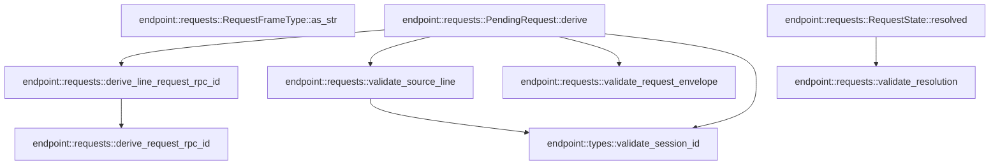

# endpoint::requests

[Package atlas](index.md) · [Source](../../src/requests.rs)

## Declarations

Visibility is the declaration spelling; trait members and reexports require their enclosing interface. `cfg` is not evaluated.

| Symbol | Kind | Visibility | Test / cfg |
|---|---|---|---|
| [endpoint::requests::RequestFrameType](../../src/requests.rs#L14) | enum_item | `pub` |  |
| [endpoint::requests::RequestFrameType::as_str](../../src/requests.rs#L23) | function_item | `pub` |  |
| [endpoint::requests::ResolutionOutcome](../../src/requests.rs#L33) | enum_item | `pub` |  |
| [endpoint::requests::PendingRequest](../../src/requests.rs#L41) | struct_item | `pub` |  |
| [endpoint::requests::RequestState](../../src/requests.rs#L53) | struct_item | `pub` |  |
| [endpoint::requests::PendingRequest::derive](../../src/requests.rs#L62) | function_item | `pub` |  |
| [endpoint::requests::RequestState::resolved](../../src/requests.rs#L97) | function_item | `pub` |  |
| [endpoint::requests::derive_request_rpc_id](../../src/requests.rs#L111) | function_item | `pub` |  |
| [endpoint::requests::derive_line_request_rpc_id](../../src/requests.rs#L128) | function_item | `pub` |  |
| [endpoint::requests::validate_source_line](../../src/requests.rs#L151) | function_item | `private` |  |
| [endpoint::requests::validate_request_envelope](../../src/requests.rs#L161) | function_item | `private` |  |
| [endpoint::requests::validate_resolution](../../src/requests.rs#L183) | function_item | `private` |  |
| [endpoint::requests::RequestError](../../src/requests.rs#L210) | enum_item | `pub` |  |
| [endpoint::requests::tests::SESSION](../../src/requests.rs#L231) | const_item | `private` | test; #[cfg(test)] |
| [endpoint::requests::tests::payload](../../src/requests.rs#L233) | function_item | `private` | test; #[cfg(test)] |
| [endpoint::requests::tests::request_identity_is_derived_from_the_hold_and_its_line](../../src/requests.rs#L241) | function_item | `private` | test; #[cfg(test)] |
| [endpoint::requests::tests::resolution_must_follow_the_hold_and_match_the_frame_type](../../src/requests.rs#L282) | function_item | `private` | test; #[cfg(test)] |

## Imports / reexports

| Local name | Source path | Visibility |
|---|---|---|
| `IJsonValue` | `schema::IJsonValue` | `private` |
| `Deserialize` | `serde::Deserialize` | `private` |
| `Serialize` | `serde::Serialize` | `private` |
| `Digest` | `sha2::Digest` | `private` |
| `Sha256` | `sha2::Sha256` | `private` |
| `Error` | `thiserror::Error` | `private` |
| `ServerRequest` | `crate::ServerRequest` | `private` |
| `StreamChannel` | `crate::StreamChannel` | `private` |
| `validate_session_id` | `crate::validate_session_id` | `private` |
| `*` | `super::*` | `private` |

## Module declarations

| Module | Visibility | Attributes |
|---|---|---|
| `endpoint::requests::tests` | `private` | #[cfg(test)] |

## Function call graphs

Edges below are syntactically resolved calls only, including private functions. Graphs partition callers into groups of 20; they are not execution order. All unresolved sites are listed below and in the JSON inventory.

Functions 1–8: 7 direct edges

## Call sites

Includes test functions (marked in declarations). Receiver-type-required sites need type analysis/manual tracing. Calls in closures are attributed to their enclosing function; their occurrence here does not mean the closure executes immediately.

| Caller | Callee expression | Source lines | Target / classification |
|---|---|---|---|
| `derive` | `validate_session_id` | [69](../../src/requests.rs#L69) | [endpoint::types::validate_session_id](../../src/types.rs#L130) |
| `derive` | `validate_source_line` | [70](../../src/requests.rs#L70) | [endpoint::requests::validate_source_line](../../src/requests.rs#L151) |
| `derive` | `Err` | [72](../../src/requests.rs#L72) | external-constructor-callback-or-unresolved |
| `derive` | `derive_line_request_rpc_id` | [75](../../src/requests.rs#L75) | [endpoint::requests::derive_line_request_rpc_id](../../src/requests.rs#L128) |
| `derive` | `"server-request".to_owned` | [77](../../src/requests.rs#L77) | receiver-type-required |
| `derive` | `rpc_id.clone` | [78](../../src/requests.rs#L78) | receiver-type-required |
| `derive` | `frame_type.as_str().to_owned` | [79](../../src/requests.rs#L79) | receiver-type-required |
| `derive` | `frame_type.as_str` | [79](../../src/requests.rs#L79) | receiver-type-required |
| `derive` | `validate_request_envelope` | [82](../../src/requests.rs#L82) | [endpoint::requests::validate_request_envelope](../../src/requests.rs#L161) |
| `derive` | `Ok` | [83](../../src/requests.rs#L83) | external-constructor-callback-or-unresolved |
| `derive` | `session_id.to_owned` | [85](../../src/requests.rs#L85) | receiver-type-required |
| `derive` | `source_line.map` | [86](../../src/requests.rs#L86) | receiver-type-required |
| `resolved` | `validate_resolution` | [102](../../src/requests.rs#L102) | [endpoint::requests::validate_resolution](../../src/requests.rs#L183) |
| `resolved` | `Ok` | [103](../../src/requests.rs#L103) | external-constructor-callback-or-unresolved |
| `resolved` | `Some` | [105](../../src/requests.rs#L105) | external-constructor-callback-or-unresolved |
| `derive_request_rpc_id` | `Sha256::new` | [116](../../src/requests.rs#L116) | external-constructor-callback-or-unresolved |
| `derive_request_rpc_id` | `hasher.update` | [117](../../src/requests.rs#L117), [118](../../src/requests.rs#L118), [119](../../src/requests.rs#L119), [120](../../src/requests.rs#L120), [121](../../src/requests.rs#L121) | receiver-type-required |
| `derive_request_rpc_id` | `session_id.as_bytes` | [117](../../src/requests.rs#L117) | receiver-type-required |
| `derive_request_rpc_id` | `frame_type.as_str().as_bytes` | [119](../../src/requests.rs#L119) | receiver-type-required |
| `derive_request_rpc_id` | `frame_type.as_str` | [119](../../src/requests.rs#L119) | receiver-type-required |
| `derive_request_rpc_id` | `causal_kernel_seq.to_string().as_bytes` | [121](../../src/requests.rs#L121) | receiver-type-required |
| `derive_request_rpc_id` | `causal_kernel_seq.to_string` | [121](../../src/requests.rs#L121) | receiver-type-required |
| `derive_line_request_rpc_id` | `derive_request_rpc_id` | [135](../../src/requests.rs#L135) | [endpoint::requests::derive_request_rpc_id](../../src/requests.rs#L111) |
| `derive_line_request_rpc_id` | `Sha256::new` | [137](../../src/requests.rs#L137) | external-constructor-callback-or-unresolved |
| `derive_line_request_rpc_id` | `kind.as_str` | [142](../../src/requests.rs#L142) | receiver-type-required |
| `derive_line_request_rpc_id` | `seq.to_string` | [143](../../src/requests.rs#L143) | receiver-type-required |
| `derive_line_request_rpc_id` | `hasher.update` | [145](../../src/requests.rs#L145), [146](../../src/requests.rs#L146) | receiver-type-required |
| `derive_line_request_rpc_id` | `component.as_bytes` | [145](../../src/requests.rs#L145) | receiver-type-required |
| `validate_source_line` | `line             .strip_suffix(".jsonl")             .ok_or_else` | [153](../../src/requests.rs#L153) | receiver-type-required |
| `validate_source_line` | `line             .strip_suffix` | [153](../../src/requests.rs#L153) | receiver-type-required |
| `validate_source_line` | `RequestError::Corruption` | [155](../../src/requests.rs#L155) | external-constructor-callback-or-unresolved |
| `validate_source_line` | `"invalid child ledger name".into` | [155](../../src/requests.rs#L155) | receiver-type-required |
| `validate_source_line` | `validate_session_id` | [156](../../src/requests.rs#L156) | [endpoint::types::validate_session_id](../../src/types.rs#L130) |
| `validate_source_line` | `Ok` | [158](../../src/requests.rs#L158) | external-constructor-callback-or-unresolved |
| `validate_request_envelope` | `envelope.validate_stream` | [166](../../src/requests.rs#L166) | receiver-type-required |
| `validate_request_envelope` | `frame_type.as_str` | [167](../../src/requests.rs#L167), [173](../../src/requests.rs#L173) | receiver-type-required |
| `validate_request_envelope` | `Err` | [168](../../src/requests.rs#L168), [176](../../src/requests.rs#L176) | external-constructor-callback-or-unresolved |
| `validate_request_envelope` | `RequestError::Corruption` | [168](../../src/requests.rs#L168), [176](../../src/requests.rs#L176) | external-constructor-callback-or-unresolved |
| `validate_request_envelope` | `"request envelope method/frame mismatch".to_owned` | [169](../../src/requests.rs#L169) | receiver-type-required |
| `validate_request_envelope` | `serde_json::from_slice` | [172](../../src/requests.rs#L172) | external-constructor-callback-or-unresolved |
| `validate_request_envelope` | `envelope.payload.canonical_bytes` | [172](../../src/requests.rs#L172) | receiver-type-required |
| `validate_request_envelope` | `payload.get("type").and_then` | [173](../../src/requests.rs#L173) | receiver-type-required |
| `validate_request_envelope` | `payload.get` | [173](../../src/requests.rs#L173), [174](../../src/requests.rs#L174) | receiver-type-required |
| `validate_request_envelope` | `Some` | [173](../../src/requests.rs#L173), [174](../../src/requests.rs#L174) | external-constructor-callback-or-unresolved |
| `validate_request_envelope` | `payload.get("sessionId").and_then` | [174](../../src/requests.rs#L174) | receiver-type-required |
| `validate_request_envelope` | `"request envelope payload identity mismatch".to_owned` | [177](../../src/requests.rs#L177) | receiver-type-required |
| `validate_request_envelope` | `Ok` | [180](../../src/requests.rs#L180) | external-constructor-callback-or-unresolved |
| `validate_resolution` | `Err` | [189](../../src/requests.rs#L189), [204](../../src/requests.rs#L204) | external-constructor-callback-or-unresolved |
| `validate_resolution` | `Ok` | [206](../../src/requests.rs#L206) | external-constructor-callback-or-unresolved |
| `payload` | `IJsonValue::parse_str(&format!(             r#"{{"approvalId":"approval:c","callId":"c","sessionId":"{SESSION}","toolName":"shell","type":"approval/requested"}}"#         ))         .unwrap` | [234](../../src/requests.rs#L234) | receiver-type-required |
| `payload` | `IJsonValue::parse_str` | [234](../../src/requests.rs#L234) | external-constructor-callback-or-unresolved |
| `request_identity_is_derived_from_the_hold_and_its_line` | `PendingRequest::derive(SESSION, None, RequestFrameType::Approval, 9, payload())             .unwrap` | [242](../../src/requests.rs#L242) | receiver-type-required |
| `request_identity_is_derived_from_the_hold_and_its_line` | `PendingRequest::derive` | [242](../../src/requests.rs#L242), [249](../../src/requests.rs#L249) | external-constructor-callback-or-unresolved |
| `request_identity_is_derived_from_the_hold_and_its_line` | `payload` | [242](../../src/requests.rs#L242), [254](../../src/requests.rs#L254) | [endpoint::requests::tests::payload](../../src/requests.rs#L233) |
| `request_identity_is_derived_from_the_hold_and_its_line` | `PendingRequest::derive(             SESSION,             Some(child_line),             RequestFrameType::Approval,             9,             payload(),         )         .unwrap` | [249](../../src/requests.rs#L249) | receiver-type-required |
| `request_identity_is_derived_from_the_hold_and_its_line` | `Some` | [251](../../src/requests.rs#L251) | external-constructor-callback-or-unresolved |
| `resolution_must_follow_the_hold_and_match_the_frame_type` | `PendingRequest::derive(SESSION, None, RequestFrameType::Approval, 9, payload())                 .unwrap` | [284](../../src/requests.rs#L284) | receiver-type-required |
| `resolution_must_follow_the_hold_and_match_the_frame_type` | `PendingRequest::derive` | [284](../../src/requests.rs#L284) | external-constructor-callback-or-unresolved |
| `resolution_must_follow_the_hold_and_match_the_frame_type` | `payload` | [284](../../src/requests.rs#L284) | [endpoint::requests::tests::payload](../../src/requests.rs#L233) |
| `resolution_must_follow_the_hold_and_match_the_frame_type` | `RequestState::resolved(request, 10, ResolutionOutcome::Rejected).unwrap` | [290](../../src/requests.rs#L290) | receiver-type-required |
| `resolution_must_follow_the_hold_and_match_the_frame_type` | `RequestState::resolved` | [290](../../src/requests.rs#L290) | external-constructor-callback-or-unresolved |
