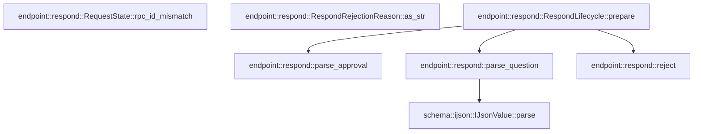

# endpoint::respond

[Package atlas](index.md) · [Source](../../src/respond.rs)

## Declarations

Visibility is the declaration spelling; trait members and reexports require their enclosing interface. `cfg` is not evaluated.

| Symbol | Kind | Visibility | Test / cfg |
|---|---|---|---|
| [endpoint::respond::RespondRejectionReason](../../src/respond.rs#L12) | enum_item | `pub` |  |
| [endpoint::respond::RespondRejectionReason::as_str](../../src/respond.rs#L23) | function_item | `pub` |  |
| [endpoint::respond::RespondPrepareContext](../../src/respond.rs#L36) | struct_item | `pub` |  |
| [endpoint::respond::RespondAuthorization](../../src/respond.rs#L45) | struct_item | `pub` |  |
| [endpoint::respond::RespondDecision](../../src/respond.rs#L57) | enum_item | `pub` |  |
| [endpoint::respond::RespondLifecycle](../../src/respond.rs#L63) | struct_item | `pub` |  |
| [endpoint::respond::RespondLifecycle::prepare](../../src/respond.rs#L68) | function_item | `pub` |  |
| [endpoint::respond::RequestState::rpc_id_mismatch](../../src/respond.rs#L136) | function_item | `private` |  |
| [endpoint::respond::ParsedResponse](../../src/respond.rs#L141) | type_item | `private` |  |
| [endpoint::respond::parse_approval](../../src/respond.rs#L143) | function_item | `private` |  |
| [endpoint::respond::parse_question](../../src/respond.rs#L187) | function_item | `private` |  |
| [endpoint::respond::reject](../../src/respond.rs#L225) | function_item | `private` |  |
| [endpoint::respond::RespondLifecycleError](../../src/respond.rs#L233) | enum_item | `pub` |  |
| [endpoint::respond::prepare_tests::prepare_rejects_resolved_unknown_and_mismatched_requests](../../src/respond.rs#L259) | function_item | `private` | test; #[cfg(test)] |
| [endpoint::respond::prepare_tests::question_fixture](../../src/respond.rs#L304) | function_item | `private` | test; #[cfg(test)] |
| [endpoint::respond::prepare_tests::question_response](../../src/respond.rs#L321) | function_item | `private` | test; #[cfg(test)] |
| [endpoint::respond::prepare_tests::question_cancellation_authors_denied_response_without_answer](../../src/respond.rs#L334) | function_item | `private` | test; #[cfg(test)] |

## Imports / reexports

| Local name | Source path | Visibility |
|---|---|---|
| `IJsonValue` | `schema::IJsonValue` | `private` |
| `Value` | `serde_json::Value` | `private` |
| `Digest` | `sha2::Digest` | `private` |
| `Sha256` | `sha2::Sha256` | `private` |
| `Error` | `thiserror::Error` | `private` |
| `ClientResponse` | `crate::ClientResponse` | `private` |
| `PendingRequest` | `crate::PendingRequest` | `private` |
| `RequestError` | `crate::RequestError` | `private` |
| `RequestFrameType` | `crate::RequestFrameType` | `private` |
| `RequestState` | `crate::RequestState` | `private` |
| `ResolutionOutcome` | `crate::ResolutionOutcome` | `private` |
| `RespondReceipt` | `crate::RespondReceipt` | `private` |
| `*` | `super::*` | `private` |

## Module declarations

| Module | Visibility | Attributes |
|---|---|---|
| `endpoint::respond::prepare_tests` | `private` | #[cfg(test)] |

## Function call graphs

Edges below are syntactically resolved calls only, including private functions. Graphs partition callers into groups of 20; they are not execution order. All unresolved sites are listed below and in the JSON inventory.

Functions 1–6: 4 direct edges

## Call sites

Includes test functions (marked in declarations). Receiver-type-required sites need type analysis/manual tracing. Calls in closures are attributed to their enclosing function; their occurrence here does not mean the closure executes immediately.

| Caller | Callee expression | Source lines | Target / classification |
|---|---|---|---|
| `prepare` | `response.validate` | [73](../../src/respond.rs#L73) | receiver-type-required |
| `prepare` | `response.result.error.is_some` | [74](../../src/respond.rs#L74) | receiver-type-required |
| `prepare` | `Err` | [75](../../src/respond.rs#L75), [81](../../src/respond.rs#L81), [112](../../src/respond.rs#L112) | external-constructor-callback-or-unresolved |
| `prepare` | `Ok` | [78](../../src/respond.rs#L78), [84](../../src/respond.rs#L84), [98](../../src/respond.rs#L98), [110](../../src/respond.rs#L110), [115](../../src/respond.rs#L115), [118](../../src/respond.rs#L118), [122](../../src/respond.rs#L122) | external-constructor-callback-or-unresolved |
| `prepare` | `reject` | [78](../../src/respond.rs#L78), [84](../../src/respond.rs#L84), [98](../../src/respond.rs#L98), [110](../../src/respond.rs#L110), [115](../../src/respond.rs#L115), [118](../../src/respond.rs#L118) | [endpoint::respond::reject](../../src/respond.rs#L225) |
| `prepare` | `state.rpc_id_mismatch` | [80](../../src/respond.rs#L80) | receiver-type-required |
| `prepare` | `state.resolution.is_some` | [83](../../src/respond.rs#L83) | receiver-type-required |
| `prepare` | `response             .result             .value             .as_ref()             .ok_or` | [86](../../src/respond.rs#L86) | receiver-type-required |
| `prepare` | `response             .result             .value             .as_ref` | [86](../../src/respond.rs#L86) | receiver-type-required |
| `prepare` | `serde_json::from_slice` | [91](../../src/respond.rs#L91) | external-constructor-callback-or-unresolved |
| `prepare` | `value.canonical_bytes` | [91](../../src/respond.rs#L91) | receiver-type-required |
| `prepare` | `value.as_object().ok_or` | [92](../../src/respond.rs#L92) | receiver-type-required |
| `prepare` | `value.as_object` | [92](../../src/respond.rs#L92) | receiver-type-required |
| `prepare` | `object             .get("sessionId")             .and_then(Value::as_str)             .ok_or` | [93](../../src/respond.rs#L93) | receiver-type-required |
| `prepare` | `object             .get("sessionId")             .and_then` | [93](../../src/respond.rs#L93) | receiver-type-required |
| `prepare` | `object             .get` | [93](../../src/respond.rs#L93) | receiver-type-required |
| `prepare` | `parse_approval` | [102](../../src/respond.rs#L102) | [endpoint::respond::parse_approval](../../src/respond.rs#L143) |
| `prepare` | `parse_question` | [104](../../src/respond.rs#L104) | [endpoint::respond::parse_question](../../src/respond.rs#L187) |
| `prepare` | `context.held_call.as_deref` | [104](../../src/respond.rs#L104) | receiver-type-required |
| `prepare` | `serde_json_canonicalizer::to_vec(response)             .map_err` | [120](../../src/respond.rs#L120) | receiver-type-required |
| `prepare` | `serde_json_canonicalizer::to_vec` | [120](../../src/respond.rs#L120) | external-constructor-callback-or-unresolved |
| `prepare` | `RespondLifecycleError::Canonical` | [121](../../src/respond.rs#L121) | external-constructor-callback-or-unresolved |
| `prepare` | `error.to_string` | [121](../../src/respond.rs#L121) | receiver-type-required |
| `prepare` | `RespondDecision::Authorize` | [122](../../src/respond.rs#L122) | external-constructor-callback-or-unresolved |
| `prepare` | `response.rpc_id.clone` | [123](../../src/respond.rs#L123) | receiver-type-required |
| `prepare` | `session_id.to_owned` | [125](../../src/respond.rs#L125) | receiver-type-required |
| `parse_approval` | `value         .keys()         .map(String::as_str)         .collect::<std::collections::BTreeSet<_>>` | [147](../../src/respond.rs#L147) | receiver-type-required |
| `parse_approval` | `value         .keys()         .map` | [147](../../src/respond.rs#L147) | receiver-type-required |
| `parse_approval` | `value         .keys` | [147](../../src/respond.rs#L147) | receiver-type-required |
| `parse_approval` | `["approvalId", "outcome", "sessionId"].into_iter().collect` | [151](../../src/respond.rs#L151) | receiver-type-required |
| `parse_approval` | `["approvalId", "outcome", "sessionId"].into_iter` | [151](../../src/respond.rs#L151) | receiver-type-required |
| `parse_approval` | `Err` | [153](../../src/respond.rs#L153), [161](../../src/respond.rs#L161), [176](../../src/respond.rs#L176) | external-constructor-callback-or-unresolved |
| `parse_approval` | `serde_json::from_slice` | [155](../../src/respond.rs#L155) | external-constructor-callback-or-unresolved |
| `parse_approval` | `request.envelope.payload.canonical_bytes` | [155](../../src/respond.rs#L155) | receiver-type-required |
| `parse_approval` | `payload.get("approvalId").and_then` | [156](../../src/respond.rs#L156) | receiver-type-required |
| `parse_approval` | `payload.get` | [156](../../src/respond.rs#L156), [158](../../src/respond.rs#L158) | receiver-type-required |
| `parse_approval` | `value.get("approvalId").and_then` | [157](../../src/respond.rs#L157) | receiver-type-required |
| `parse_approval` | `value.get` | [157](../../src/respond.rs#L157), [159](../../src/respond.rs#L159) | receiver-type-required |
| `parse_approval` | `payload.get("callId").and_then` | [158](../../src/respond.rs#L158) | receiver-type-required |
| `parse_approval` | `value.get("outcome").and_then` | [159](../../src/respond.rs#L159) | receiver-type-required |
| `parse_approval` | `call.is_none` | [160](../../src/respond.rs#L160) | receiver-type-required |
| `parse_approval` | `Ok` | [164](../../src/respond.rs#L164), [170](../../src/respond.rs#L170) | external-constructor-callback-or-unresolved |
| `parse_approval` | `call.expect("checked").to_owned` | [165](../../src/respond.rs#L165), [171](../../src/respond.rs#L171) | receiver-type-required |
| `parse_approval` | `call.expect` | [165](../../src/respond.rs#L165), [171](../../src/respond.rs#L171) | receiver-type-required |
| `parse_question` | `value         .keys()         .map(String::as_str)         .collect::<std::collections::BTreeSet<_>>` | [192](../../src/respond.rs#L192) | receiver-type-required |
| `parse_question` | `value         .keys()         .map` | [192](../../src/respond.rs#L192) | receiver-type-required |
| `parse_question` | `value         .keys` | [192](../../src/respond.rs#L192) | receiver-type-required |
| `parse_question` | `["cancelQuestion", "sessionId"].into_iter().collect` | [196](../../src/respond.rs#L196) | receiver-type-required |
| `parse_question` | `["cancelQuestion", "sessionId"].into_iter` | [196](../../src/respond.rs#L196) | receiver-type-required |
| `parse_question` | `value.get` | [197](../../src/respond.rs#L197) | receiver-type-required |
| `parse_question` | `Some` | [197](../../src/respond.rs#L197), [220](../../src/respond.rs#L220) | external-constructor-callback-or-unresolved |
| `parse_question` | `Value::Bool` | [197](../../src/respond.rs#L197) | external-constructor-callback-or-unresolved |
| `parse_question` | `Err` | [198](../../src/respond.rs#L198), [209](../../src/respond.rs#L209) | external-constructor-callback-or-unresolved |
| `parse_question` | `held_call.ok_or` | [200](../../src/respond.rs#L200), [216](../../src/respond.rs#L216) | receiver-type-required |
| `parse_question` | `Ok` | [201](../../src/respond.rs#L201), [217](../../src/respond.rs#L217) | external-constructor-callback-or-unresolved |
| `parse_question` | `held_call.to_owned` | [202](../../src/respond.rs#L202), [218](../../src/respond.rs#L218) | receiver-type-required |
| `parse_question` | `["answer", "sessionId"].into_iter().collect` | [208](../../src/respond.rs#L208) | receiver-type-required |
| `parse_question` | `["answer", "sessionId"].into_iter` | [208](../../src/respond.rs#L208) | receiver-type-required |
| `parse_question` | `value         .get("answer")         .and_then(Value::as_object)         .filter(&#124;answer&#124; answer.len() == 1 && answer.get("answers").is_some_and(Value::is_array))         .ok_or` | [211](../../src/respond.rs#L211) | receiver-type-required |
| `parse_question` | `value         .get("answer")         .and_then(Value::as_object)         .filter` | [211](../../src/respond.rs#L211) | receiver-type-required |
| `parse_question` | `value         .get("answer")         .and_then` | [211](../../src/respond.rs#L211) | receiver-type-required |
| `parse_question` | `value         .get` | [211](../../src/respond.rs#L211) | receiver-type-required |
| `parse_question` | `answer.len` | [214](../../src/respond.rs#L214) | receiver-type-required |
| `parse_question` | `answer.get("answers").is_some_and` | [214](../../src/respond.rs#L214) | receiver-type-required |
| `parse_question` | `answer.get` | [214](../../src/respond.rs#L214) | receiver-type-required |
| `parse_question` | `IJsonValue::parse` | [220](../../src/respond.rs#L220) | [schema::ijson::IJsonValue::parse](../../../schema/src/ijson.rs#L16) |
| `parse_question` | `serde_json::to_vec` | [220](../../src/respond.rs#L220) | external-constructor-callback-or-unresolved |
| `reject` | `RespondDecision::Reject` | [226](../../src/respond.rs#L226) | external-constructor-callback-or-unresolved |
| `reject` | `Some` | [228](../../src/respond.rs#L228) | external-constructor-callback-or-unresolved |
| `reject` | `reason.as_str().to_owned` | [228](../../src/respond.rs#L228) | receiver-type-required |
| `reject` | `reason.as_str` | [228](../../src/respond.rs#L228) | receiver-type-required |
| `prepare_rejects_resolved_unknown_and_mismatched_requests` | `PendingRequest::derive(session, None, RequestFrameType::Approval, 10,             IJsonValue::parse_str(&format!(r#"{{"type":"approval/requested","sessionId":"{session}","approvalId":"approval:a","callId":"a","toolName":"apply_patch"}}"#)).unwrap()).unwrap` | [261](../../src/respond.rs#L261) | receiver-type-required |
| `prepare_rejects_resolved_unknown_and_mismatched_requests` | `PendingRequest::derive` | [261](../../src/respond.rs#L261) | external-constructor-callback-or-unresolved |
| `prepare_rejects_resolved_unknown_and_mismatched_requests` | `IJsonValue::parse_str(&format!(r#"{{"type":"approval/requested","sessionId":"{session}","approvalId":"approval:a","callId":"a","toolName":"apply_patch"}}"#)).unwrap` | [262](../../src/respond.rs#L262) | receiver-type-required |
| `prepare_rejects_resolved_unknown_and_mismatched_requests` | `IJsonValue::parse_str` | [262](../../src/respond.rs#L262), [266](../../src/respond.rs#L266) | external-constructor-callback-or-unresolved |
| `prepare_rejects_resolved_unknown_and_mismatched_requests` | `"client-response".into` | [264](../../src/respond.rs#L264) | receiver-type-required |
| `prepare_rejects_resolved_unknown_and_mismatched_requests` | `request.rpc_id.clone` | [264](../../src/respond.rs#L264) | receiver-type-required |
| `prepare_rejects_resolved_unknown_and_mismatched_requests` | `Some` | [265](../../src/respond.rs#L265), [278](../../src/respond.rs#L278) | external-constructor-callback-or-unresolved |
| `prepare_rejects_resolved_unknown_and_mismatched_requests` | `IJsonValue::parse_str(&format!(r#"{{"approvalId":"approval:a","outcome":"allowed-once","sessionId":"{session}"}}"#)).unwrap` | [266](../../src/respond.rs#L266) | receiver-type-required |
| `prepare_rejects_resolved_unknown_and_mismatched_requests` | `request.clone` | [274](../../src/respond.rs#L274) | receiver-type-required |
| `prepare_rejects_resolved_unknown_and_mismatched_requests` | `RespondLifecycle::prepare(Some(&pending), &response, &context).unwrap` | [278](../../src/respond.rs#L278) | receiver-type-required |
| `prepare_rejects_resolved_unknown_and_mismatched_requests` | `RespondLifecycle::prepare` | [278](../../src/respond.rs#L278) | external-constructor-callback-or-unresolved |
| `prepare_rejects_resolved_unknown_and_mismatched_requests` | `RequestState::resolved(request, 11, ResolutionOutcome::AllowedOnce).unwrap` | [288](../../src/respond.rs#L288) | receiver-type-required |
| `prepare_rejects_resolved_unknown_and_mismatched_requests` | `RequestState::resolved` | [288](../../src/respond.rs#L288) | external-constructor-callback-or-unresolved |
| `prepare_rejects_resolved_unknown_and_mismatched_requests` | `context.clone` | [297](../../src/respond.rs#L297) | receiver-type-required |
| `question_fixture` | `PendingRequest::derive(session, None, RequestFrameType::Question, 10,             IJsonValue::parse_str(&format!(r#"{{"type":"question/requested","sessionId":"{session}","questions":[{{"id":"q1","question":"Continue?"}}]}}"#)).unwrap()).unwrap` | [305](../../src/respond.rs#L305) | receiver-type-required |
| `question_fixture` | `PendingRequest::derive` | [305](../../src/respond.rs#L305) | external-constructor-callback-or-unresolved |
| `question_fixture` | `IJsonValue::parse_str(&format!(r#"{{"type":"question/requested","sessionId":"{session}","questions":[{{"id":"q1","question":"Continue?"}}]}}"#)).unwrap` | [306](../../src/respond.rs#L306) | receiver-type-required |
| `question_fixture` | `IJsonValue::parse_str` | [306](../../src/respond.rs#L306) | external-constructor-callback-or-unresolved |
| `question_fixture` | `Some` | [310](../../src/respond.rs#L310) | external-constructor-callback-or-unresolved |
| `question_fixture` | `"call-hold".into` | [310](../../src/respond.rs#L310) | receiver-type-required |
| `question_response` | `"client-response".into` | [323](../../src/respond.rs#L323) | receiver-type-required |
| `question_response` | `rpc_id.to_owned` | [324](../../src/respond.rs#L324) | receiver-type-required |
| `question_response` | `Some` | [328](../../src/respond.rs#L328) | external-constructor-callback-or-unresolved |
| `question_response` | `IJsonValue::parse_str(value).unwrap` | [328](../../src/respond.rs#L328) | receiver-type-required |
| `question_response` | `IJsonValue::parse_str` | [328](../../src/respond.rs#L328) | external-constructor-callback-or-unresolved |
| `question_cancellation_authors_denied_response_without_answer` | `question_fixture` | [336](../../src/respond.rs#L336) | [endpoint::respond::prepare_tests::question_fixture](../../src/respond.rs#L304) |
| `question_cancellation_authors_denied_response_without_answer` | `pending.request.rpc_id.clone` | [337](../../src/respond.rs#L337) | receiver-type-required |
| `question_cancellation_authors_denied_response_without_answer` | `question_response` | [338](../../src/respond.rs#L338), [369](../../src/respond.rs#L369) | [endpoint::respond::prepare_tests::question_response](../../src/respond.rs#L321) |
| `question_cancellation_authors_denied_response_without_answer` | `RespondLifecycle::prepare(Some(&pending), &cancel, &context).unwrap` | [343](../../src/respond.rs#L343) | receiver-type-required |
| `question_cancellation_authors_denied_response_without_answer` | `RespondLifecycle::prepare` | [343](../../src/respond.rs#L343), [374](../../src/respond.rs#L374) | external-constructor-callback-or-unresolved |
| `question_cancellation_authors_denied_response_without_answer` | `Some` | [343](../../src/respond.rs#L343), [374](../../src/respond.rs#L374) | external-constructor-callback-or-unresolved |
| `question_cancellation_authors_denied_response_without_answer` | `RespondLifecycle::prepare(Some(&pending), &answer, &context).unwrap` | [374](../../src/respond.rs#L374) | receiver-type-required |
