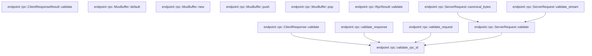

# endpoint::rpc

[Package atlas](index.md) · [Source](../../src/rpc.rs)

## Declarations

Visibility is the declaration spelling; trait members and reexports require their enclosing interface. `cfg` is not evaluated.

| Symbol | Kind | Visibility | Test / cfg |
|---|---|---|---|
| [endpoint::rpc::MAX_RPC_ID_BYTES](../../src/rpc.rs#L7) | const_item | `pub` |  |
| [endpoint::rpc::ClientRequest](../../src/rpc.rs#L11) | struct_item | `pub` |  |
| [endpoint::rpc::RpcError](../../src/rpc.rs#L22) | struct_item | `pub` |  |
| [endpoint::rpc::RpcResult](../../src/rpc.rs#L30) | struct_item | `pub` |  |
| [endpoint::rpc::RpcResult::validate](../../src/rpc.rs#L39) | function_item | `pub` |  |
| [endpoint::rpc::ServerResponse](../../src/rpc.rs#L49) | struct_item | `pub` |  |
| [endpoint::rpc::ServerRequest](../../src/rpc.rs#L62) | struct_item | `pub` |  |
| [endpoint::rpc::ServerRequest::validate](../../src/rpc.rs#L72) | function_item | `pub` |  |
| [endpoint::rpc::ServerRequest::canonical_bytes](../../src/rpc.rs#L83) | function_item | `pub` |  |
| [endpoint::rpc::ServerRequest::validate_stream](../../src/rpc.rs#L89) | function_item | `pub` |  |
| [endpoint::rpc::ClientResponse](../../src/rpc.rs#L114) | struct_item | `pub` |  |
| [endpoint::rpc::ClientResponse::validate](../../src/rpc.rs#L123) | function_item | `pub` |  |
| [endpoint::rpc::ClientResponseResult](../../src/rpc.rs#L134) | struct_item | `pub` |  |
| [endpoint::rpc::ClientResponseResult::validate](../../src/rpc.rs#L143) | function_item | `pub` |  |
| [endpoint::rpc::RespondReceipt](../../src/rpc.rs#L153) | struct_item | `pub` |  |
| [endpoint::rpc::validate_response](../../src/rpc.rs#L159) | function_item | `pub` |  |
| [endpoint::rpc::validate_request](../../src/rpc.rs#L172) | function_item | `pub` |  |
| [endpoint::rpc::validate_rpc_id](../../src/rpc.rs#L186) | function_item | `pub` |  |
| [endpoint::rpc::RequestError](../../src/rpc.rs#L194) | enum_item | `pub` |  |
| [endpoint::rpc::MuxBuffer](../../src/rpc.rs#L224) | struct_item | `pub` |  |
| [endpoint::rpc::MuxBuffer::default](../../src/rpc.rs#L232) | function_item | `private` |  |
| [endpoint::rpc::MuxBuffer::new](../../src/rpc.rs#L239) | function_item | `pub` |  |
| [endpoint::rpc::MuxBuffer::push](../../src/rpc.rs#L248) | function_item | `pub` |  |
| [endpoint::rpc::MuxBuffer::pop](../../src/rpc.rs#L262) | function_item | `pub` |  |
| [endpoint::rpc::MuxBufferError](../../src/rpc.rs#L270) | enum_item | `pub` |  |

## Imports / reexports

| Local name | Source path | Visibility |
|---|---|---|
| `BTreeSet` | `std::collections::BTreeSet` | `private` |
| `VecDeque` | `std::collections::VecDeque` | `private` |
| `IJsonValue` | `schema::IJsonValue` | `private` |
| `Deserialize` | `serde::Deserialize` | `private` |
| `Serialize` | `serde::Serialize` | `private` |
| `Error` | `thiserror::Error` | `private` |

## Module declarations

| Module | Visibility | Attributes |
|---|---|---|

## Function call graphs

Edges below are syntactically resolved calls only, including private functions. Graphs partition callers into groups of 20; they are not execution order. All unresolved sites are listed below and in the JSON inventory.

Functions 1–13: 6 direct edges

## Call sites

Includes test functions (marked in declarations). Receiver-type-required sites need type analysis/manual tracing. Calls in closures are attributed to their enclosing function; their occurrence here does not mean the closure executes immediately.

| Caller | Callee expression | Source lines | Target / classification |
|---|---|---|---|
| `validate` | `self.value.is_some` | [40](../../src/rpc.rs#L40) | receiver-type-required |
| `validate` | `self.error.is_some` | [40](../../src/rpc.rs#L40) | receiver-type-required |
| `validate` | `Ok` | [41](../../src/rpc.rs#L41) | external-constructor-callback-or-unresolved |
| `validate` | `Err` | [42](../../src/rpc.rs#L42) | external-constructor-callback-or-unresolved |
| `validate` | `Err` | [74](../../src/rpc.rs#L74), [78](../../src/rpc.rs#L78) | external-constructor-callback-or-unresolved |
| `validate` | `validate_rpc_id` | [76](../../src/rpc.rs#L76) | [endpoint::rpc::validate_rpc_id](../../src/rpc.rs#L186) |
| `validate` | `self.method.is_empty` | [77](../../src/rpc.rs#L77) | receiver-type-required |
| `validate` | `Ok` | [80](../../src/rpc.rs#L80) | external-constructor-callback-or-unresolved |
| `canonical_bytes` | `self.validate` | [84](../../src/rpc.rs#L84) | [endpoint::rpc::ServerRequest::validate](../../src/rpc.rs#L72) |
| `canonical_bytes` | `serde_json_canonicalizer::to_vec(self)             .map_err` | [85](../../src/rpc.rs#L85) | receiver-type-required |
| `canonical_bytes` | `serde_json_canonicalizer::to_vec` | [85](../../src/rpc.rs#L85) | external-constructor-callback-or-unresolved |
| `canonical_bytes` | `RequestError::Canonical` | [86](../../src/rpc.rs#L86) | external-constructor-callback-or-unresolved |
| `canonical_bytes` | `error.to_string` | [86](../../src/rpc.rs#L86) | receiver-type-required |
| `validate_stream` | `self.validate` | [90](../../src/rpc.rs#L90) | [endpoint::rpc::ServerRequest::validate](../../src/rpc.rs#L72) |
| `validate_stream` | `self             .payload             .canonical_bytes()             .map_err` | [91](../../src/rpc.rs#L91) | receiver-type-required |
| `validate_stream` | `self             .payload             .canonical_bytes` | [91](../../src/rpc.rs#L91) | receiver-type-required |
| `validate_stream` | `RequestError::Canonical` | [94](../../src/rpc.rs#L94), [96](../../src/rpc.rs#L96) | external-constructor-callback-or-unresolved |
| `validate_stream` | `error.to_string` | [94](../../src/rpc.rs#L94), [96](../../src/rpc.rs#L96) | receiver-type-required |
| `validate_stream` | `serde_json::from_slice(&payload)             .map_err` | [95](../../src/rpc.rs#L95) | receiver-type-required |
| `validate_stream` | `serde_json::from_slice` | [95](../../src/rpc.rs#L95) | external-constructor-callback-or-unresolved |
| `validate_stream` | `value             .as_object()             .and_then(&#124;object&#124; object.get("type"))             .and_then(serde_json::Value::as_str)             .ok_or` | [97](../../src/rpc.rs#L97) | receiver-type-required |
| `validate_stream` | `value             .as_object()             .and_then(&#124;object&#124; object.get("type"))             .and_then` | [97](../../src/rpc.rs#L97) | receiver-type-required |
| `validate_stream` | `value             .as_object()             .and_then` | [97](../../src/rpc.rs#L97) | receiver-type-required |
| `validate_stream` | `value             .as_object` | [97](../../src/rpc.rs#L97) | receiver-type-required |
| `validate_stream` | `object.get` | [99](../../src/rpc.rs#L99) | receiver-type-required |
| `validate_stream` | `Err` | [103](../../src/rpc.rs#L103), [106](../../src/rpc.rs#L106) | external-constructor-callback-or-unresolved |
| `validate_stream` | `channel.frame_types().contains` | [105](../../src/rpc.rs#L105) | receiver-type-required |
| `validate_stream` | `channel.frame_types` | [105](../../src/rpc.rs#L105) | receiver-type-required |
| `validate_stream` | `RequestError::UnknownRequiredFrame` | [106](../../src/rpc.rs#L106) | external-constructor-callback-or-unresolved |
| `validate_stream` | `frame_type.to_owned` | [106](../../src/rpc.rs#L106) | receiver-type-required |
| `validate_stream` | `Ok` | [108](../../src/rpc.rs#L108) | external-constructor-callback-or-unresolved |
| `validate` | `Err` | [125](../../src/rpc.rs#L125) | external-constructor-callback-or-unresolved |
| `validate` | `validate_rpc_id` | [127](../../src/rpc.rs#L127) | [endpoint::rpc::validate_rpc_id](../../src/rpc.rs#L186) |
| `validate` | `self.result.validate` | [128](../../src/rpc.rs#L128) | receiver-type-required |
| `validate` | `self.value.is_some` | [144](../../src/rpc.rs#L144) | receiver-type-required |
| `validate` | `self.error.is_some` | [144](../../src/rpc.rs#L144) | receiver-type-required |
| `validate` | `Ok` | [145](../../src/rpc.rs#L145) | external-constructor-callback-or-unresolved |
| `validate` | `Err` | [146](../../src/rpc.rs#L146) | external-constructor-callback-or-unresolved |
| `validate_response` | `Err` | [164](../../src/rpc.rs#L164), [167](../../src/rpc.rs#L167) | external-constructor-callback-or-unresolved |
| `validate_response` | `validate_rpc_id(&response.rpc_id).is_err` | [166](../../src/rpc.rs#L166) | receiver-type-required |
| `validate_response` | `validate_rpc_id` | [166](../../src/rpc.rs#L166) | [endpoint::rpc::validate_rpc_id](../../src/rpc.rs#L186) |
| `validate_response` | `response.result.validate` | [169](../../src/rpc.rs#L169) | receiver-type-required |
| `validate_request` | `Err` | [177](../../src/rpc.rs#L177), [181](../../src/rpc.rs#L181) | external-constructor-callback-or-unresolved |
| `validate_request` | `validate_rpc_id` | [179](../../src/rpc.rs#L179) | [endpoint::rpc::validate_rpc_id](../../src/rpc.rs#L186) |
| `validate_request` | `capabilities.contains` | [180](../../src/rpc.rs#L180) | receiver-type-required |
| `validate_request` | `request.method.as_str` | [180](../../src/rpc.rs#L180) | receiver-type-required |
| `validate_request` | `RequestError::Unsupported` | [181](../../src/rpc.rs#L181) | external-constructor-callback-or-unresolved |
| `validate_request` | `request.method.clone` | [181](../../src/rpc.rs#L181) | receiver-type-required |
| `validate_request` | `Ok` | [183](../../src/rpc.rs#L183) | external-constructor-callback-or-unresolved |
| `validate_rpc_id` | `rpc_id.is_empty` | [187](../../src/rpc.rs#L187) | receiver-type-required |
| `validate_rpc_id` | `rpc_id.len` | [187](../../src/rpc.rs#L187) | receiver-type-required |
| `validate_rpc_id` | `Err` | [188](../../src/rpc.rs#L188) | external-constructor-callback-or-unresolved |
| `validate_rpc_id` | `Ok` | [190](../../src/rpc.rs#L190) | external-constructor-callback-or-unresolved |
| `default` | `Self::new` | [233](../../src/rpc.rs#L233) | external-constructor-callback-or-unresolved |
| `new` | `VecDeque::new` | [241](../../src/rpc.rs#L241) | external-constructor-callback-or-unresolved |
| `push` | `self.frames.len` | [249](../../src/rpc.rs#L249) | receiver-type-required |
| `push` | `self                 .bytes                 .checked_add(frame.len())                 .is_none_or` | [250](../../src/rpc.rs#L250) | receiver-type-required |
| `push` | `self                 .bytes                 .checked_add` | [250](../../src/rpc.rs#L250) | receiver-type-required |
| `push` | `frame.len` | [252](../../src/rpc.rs#L252), [257](../../src/rpc.rs#L257) | receiver-type-required |
| `push` | `Err` | [255](../../src/rpc.rs#L255) | external-constructor-callback-or-unresolved |
| `push` | `self.frames.push_back` | [258](../../src/rpc.rs#L258) | receiver-type-required |
| `push` | `Ok` | [259](../../src/rpc.rs#L259) | external-constructor-callback-or-unresolved |
| `pop` | `self.frames.pop_front` | [263](../../src/rpc.rs#L263) | receiver-type-required |
| `pop` | `frame.len` | [264](../../src/rpc.rs#L264) | receiver-type-required |
| `pop` | `Some` | [265](../../src/rpc.rs#L265) | external-constructor-callback-or-unresolved |
