# endpoint::service

[Package atlas](index.md) · [Source](../../src/service.rs)

## Declarations

Visibility is the declaration spelling; trait members and reexports require their enclosing interface. `cfg` is not evaluated.

| Symbol | Kind | Visibility | Test / cfg |
|---|---|---|---|
| [endpoint::service::AUTOMATIC_TITLE_SEED_OPERATION](../../src/service.rs#L13) | const_item | `pub` |  |
| [endpoint::service::AUTOMATIC_TITLE_REFINE_OPERATION](../../src/service.rs#L14) | const_item | `pub` |  |
| [endpoint::service::SESSION_NOTICE_OPERATION](../../src/service.rs#L15) | const_item | `pub` |  |
| [endpoint::service::SessionNotice](../../src/service.rs#L22) | struct_item | `pub` |  |
| [endpoint::service::SessionNoticeSeverity](../../src/service.rs#L30) | enum_item | `pub` |  |
| [endpoint::service::SessionNoticeSeverity::as_str](../../src/service.rs#L37) | function_item | `pub` |  |
| [endpoint::service::MutationReceipt](../../src/service.rs#L46) | struct_item | `pub` |  |
| [endpoint::service::MutationReceipt::from](../../src/service.rs#L52) | function_item | `private` |  |
| [endpoint::service::ArchiveResult](../../src/service.rs#L61) | struct_item | `pub` |  |
| [endpoint::service::UnarchiveResult](../../src/service.rs#L66) | struct_item | `pub` |  |
| [endpoint::service::SessionInventoryItem](../../src/service.rs#L71) | struct_item | `pub` |  |
| [endpoint::service::PERMISSION_MODE_FILE](../../src/service.rs#L94) | const_item | `private` |  |
| [endpoint::service::DEFAULT_PERMISSION_MODE](../../src/service.rs#L95) | const_item | `private` |  |
| [endpoint::service::permission_mode_of](../../src/service.rs#L99) | function_item | `private` |  |
| [endpoint::service::NativeEndpoint](../../src/service.rs#L115) | struct_item | `pub` |  |
| [endpoint::service::CreateSessionWrite](../../src/service.rs#L119) | struct_item | `private` |  |
| [endpoint::service::NativeEndpoint::open](../../src/service.rs#L130) | function_item | `pub` |  |
| [endpoint::service::NativeEndpoint::capabilities](../../src/service.rs#L137) | function_item | `pub` |  |
| [endpoint::service::NativeEndpoint::list_sessions](../../src/service.rs#L154) | function_item | `pub` |  |
| [endpoint::service::NativeEndpoint::models](../../src/service.rs#L236) | function_item | `pub` |  |
| [endpoint::service::NativeEndpoint::session_config_snapshot](../../src/service.rs#L302) | function_item | `pub` |  |
| [endpoint::service::NativeEndpoint::submission_snapshot](../../src/service.rs#L331) | function_item | `pub` |  |
| [endpoint::service::NativeEndpoint::submission_metadata](../../src/service.rs#L338) | function_item | `pub` |  |
| [endpoint::service::NativeEndpoint::hydrate_historical_submissions](../../src/service.rs#L363) | function_item | `pub` |  |
| [endpoint::service::NativeEndpoint::create_session](../../src/service.rs#L460) | function_item | `pub` |  |
| [endpoint::service::NativeEndpoint::create_session_for_endpoint](../../src/service.rs#L483) | function_item | `pub` |  |
| [endpoint::service::NativeEndpoint::create_session_with_operation](../../src/service.rs#L503) | function_item | `private` |  |
| [endpoint::service::NativeEndpoint::prompt](../../src/service.rs#L533) | function_item | `pub` |  |
| [endpoint::service::NativeEndpoint::prompt_for_endpoint](../../src/service.rs#L544) | function_item | `pub` |  |
| [endpoint::service::NativeEndpoint::prompt_with_operation](../../src/service.rs#L562) | function_item | `private` |  |
| [endpoint::service::NativeEndpoint::update_queue](../../src/service.rs#L585) | function_item | `pub` |  |
| [endpoint::service::NativeEndpoint::rename_session](../../src/service.rs#L600) | function_item | `pub` |  |
| [endpoint::service::NativeEndpoint::rename_session_for_endpoint](../../src/service.rs#L610) | function_item | `pub` |  |
| [endpoint::service::NativeEndpoint::rename_session_with_operation](../../src/service.rs#L620) | function_item | `private` |  |
| [endpoint::service::NativeEndpoint::seed_automatic_title_if_missing](../../src/service.rs#L639) | function_item | `pub` |  |
| [endpoint::service::NativeEndpoint::record_session_notice](../../src/service.rs#L672) | function_item | `pub` |  |
| [endpoint::service::NativeEndpoint::refine_automatic_title](../../src/service.rs#L726) | function_item | `pub` |  |
| [endpoint::service::NativeEndpoint::author_keyed_with_ledger](../../src/service.rs#L767) | function_item | `pub` |  |
| [endpoint::service::NativeEndpoint::cancel](../../src/service.rs#L790) | function_item | `pub` |  |
| [endpoint::service::NativeEndpoint::cancel_for_endpoint](../../src/service.rs#L799) | function_item | `pub` |  |
| [endpoint::service::NativeEndpoint::cancel_with_operation](../../src/service.rs#L808) | function_item | `private` |  |
| [endpoint::service::NativeEndpoint::fork_session](../../src/service.rs#L838) | function_item | `pub` |  |
| [endpoint::service::NativeEndpoint::archive_session](../../src/service.rs#L854) | function_item | `pub` |  |
| [endpoint::service::NativeEndpoint::unarchive_session](../../src/service.rs#L862) | function_item | `pub` |  |
| [endpoint::service::NativeEndpoint::reconcile_projection](../../src/service.rs#L873) | function_item | `pub` |  |
| [endpoint::service::NativeEndpoint::reconciled_journal](../../src/service.rs#L881) | function_item | `private` |  |
| [endpoint::service::NativeEndpoint::history](../../src/service.rs#L895) | function_item | `pub` |  |
| [endpoint::service::NativeEndpoint::keyed](../../src/service.rs#L905) | function_item | `private` |  |
| [endpoint::service::NativeEndpoint::validate_origin](../../src/service.rs#L923) | function_item | `private` |  |
| [endpoint::service::NativeEndpoint::active_folder](../../src/service.rs#L936) | function_item | `private` |  |
| [endpoint::service::event](../../src/service.rs#L949) | function_item | `private` |  |
| [endpoint::service::store_error](../../src/service.rs#L954) | function_item | `private` |  |
| [endpoint::service::map_store_error](../../src/service.rs#L958) | function_item | `private` |  |
| [endpoint::service::NativeEndpointError](../../src/service.rs#L967) | enum_item | `pub` |  |

## Imports / reexports

| Local name | Source path | Visibility |
|---|---|---|
| `BTreeSet` | `std::collections::BTreeSet` | `private` |
| `HashSet` | `std::collections::HashSet` | `private` |
| `fs` | `std::fs` | `private` |
| `Path` | `std::path::Path` | `private` |
| `Event` | `schema::Event` | `private` |
| `EventKind` | `schema::EventKind` | `private` |
| `IJsonValue` | `schema::IJsonValue` | `private` |
| `OriginTuple` | `schema::OriginTuple` | `private` |
| `ResumePolicy` | `schema::ResumePolicy` | `private` |
| `SeqRange` | `schema::SeqRange` | `private` |
| `Value` | `serde_json::Value` | `private` |
| `json` | `serde_json::json` | `private` |
| `AppendOutcome` | `store::AppendOutcome` | `private` |
| `ConditionalAppendOutcome` | `store::ConditionalAppendOutcome` | `private` |
| `ThreadStore` | `store::ThreadStore` | `private` |
| `scan_valid_prefix` | `store::scan_valid_prefix` | `private` |
| `Error` | `thiserror::Error` | `private` |
| `timestamp_millis` | `crate::projection::timestamp_millis` | `private` |
| `EndpointJournal` | `crate::EndpointJournal` | `private` |
| `HistoryPage` | `crate::HistoryPage` | `private` |
| `Projector` | `crate::Projector` | `private` |
| `history_page` | `crate::history_page` | `private` |
| `validate_session_id` | `crate::validate_session_id` | `private` |

## Module declarations

| Module | Visibility | Attributes |
|---|---|---|

## Function call graphs

Edges below are syntactically resolved calls only, including private functions. Graphs partition callers into groups of 20; they are not execution order. All unresolved sites are listed below and in the JSON inventory.

```mermaid
flowchart TD
  n0["endpoint::projection::timestamp_millis"]
  n1["endpoint::service::NativeEndpoint::open"]
  n2["endpoint::service::NativeEndpoint::capabilities"]
  n3["endpoint::service::NativeEndpoint::list_sessions"]
  n4["endpoint::service::NativeEndpoint::models"]
  n5["endpoint::service::NativeEndpoint::session_config_snapshot"]
  n6["endpoint::service::NativeEndpoint::submission_snapshot"]
  n7["endpoint::service::NativeEndpoint::submission_metadata"]
  n8["endpoint::service::NativeEndpoint::hydrate_historical_submissions"]
  n9["endpoint::service::SessionNoticeSeverity::as_str"]
  n10["endpoint::service::NativeEndpoint::create_session"]
  n11["endpoint::service::NativeEndpoint::create_session_for_endpoint"]
  n12["endpoint::service::NativeEndpoint::create_session_with_operation"]
  n13["endpoint::service::MutationReceipt::from"]
  n14["endpoint::service::NativeEndpoint::prompt"]
  n15["endpoint::service::NativeEndpoint::prompt_for_endpoint"]
  n16["endpoint::service::NativeEndpoint::prompt_with_operation"]
  n17["endpoint::service::NativeEndpoint::update_queue"]
  n18["endpoint::service::NativeEndpoint::rename_session"]
  n19["endpoint::service::NativeEndpoint::rename_session_for_endpoint"]
  n20["endpoint::service::NativeEndpoint::rename_session_with_operation"]
  n21["endpoint::service::NativeEndpoint::keyed"]
  n22["endpoint::service::NativeEndpoint::active_folder"]
  n23["endpoint::service::event"]
  n24["endpoint::service::permission_mode_of"]
  n25["endpoint::types::validate_session_id"]
  n26["profile::config::ConfigSnapshot::decode"]
  n27["profile::config::ConfigRepository::open"]
  n28["schema::ijson::IJsonValue::parse"]
  n29["store::asset::AssetStore::new"]
  n30["store::folder::ThreadStore::open"]
  n31["store::tail::scan_valid_prefix"]
  n1 --> n30
  n3 --> n0
  n3 --> n24
  n3 --> n25
  n3 --> n31
  n4 --> n28
  n5 --> n22
  n5 --> n25
  n5 --> n27
  n5 --> n31
  n6 --> n5
  n6 --> n7
  n6 --> n22
  n6 --> n29
  n7 --> n28
  n8 --> n7
  n8 --> n22
  n8 --> n26
  n8 --> n28
  n8 --> n29
  n8 --> n31
  n10 --> n12
  n11 --> n12
  n12 --> n25
  n14 --> n16
  n15 --> n16
  n16 --> n6
  n16 --> n21
  n16 --> n23
  n17 --> n21
  n17 --> n23
  n18 --> n20
  n19 --> n20
```

Functions 1–20: 33 direct edges

Functions 21–40: 28 direct edges

```mermaid
flowchart TD
  n0["endpoint::history::history_page"]
  n1["endpoint::journal::EndpointJournal::open"]
  n2["endpoint::service::NativeEndpoint::rename_session_with_operation"]
  n3["endpoint::service::NativeEndpoint::seed_automatic_title_if_missing"]
  n4["endpoint::service::NativeEndpoint::record_session_notice"]
  n5["endpoint::service::NativeEndpoint::refine_automatic_title"]
  n6["endpoint::service::NativeEndpoint::author_keyed_with_ledger"]
  n7["endpoint::service::NativeEndpoint::cancel"]
  n8["endpoint::service::NativeEndpoint::cancel_for_endpoint"]
  n9["endpoint::service::NativeEndpoint::cancel_with_operation"]
  n10["endpoint::service::NativeEndpoint::fork_session"]
  n11["endpoint::service::NativeEndpoint::archive_session"]
  n12["endpoint::service::NativeEndpoint::unarchive_session"]
  n13["endpoint::service::NativeEndpoint::reconcile_projection"]
  n14["endpoint::service::NativeEndpoint::reconciled_journal"]
  n15["endpoint::service::NativeEndpoint::history"]
  n16["endpoint::service::NativeEndpoint::keyed"]
  n17["endpoint::service::NativeEndpoint::validate_origin"]
  n18["endpoint::service::NativeEndpoint::active_folder"]
  n19["endpoint::service::event"]
  n20["endpoint::service::store_error"]
  n21["endpoint::service::map_store_error"]
  n22["endpoint::types::validate_session_id"]
  n23["schema::event::Event::from_value"]
  n24["schema::ijson::IJsonValue::parse"]
  n25["store::tail::scan_valid_prefix"]
  n2 --> n16
  n2 --> n19
  n3 --> n17
  n3 --> n19
  n4 --> n17
  n4 --> n19
  n5 --> n17
  n5 --> n19
  n6 --> n22
  n7 --> n9
  n8 --> n9
  n9 --> n17
  n9 --> n19
  n9 --> n22
  n10 --> n22
  n11 --> n22
  n12 --> n22
  n13 --> n14
  n14 --> n1
  n14 --> n18
  n14 --> n25
  n15 --> n0
  n15 --> n14
  n16 --> n17
  n17 --> n22
  n18 --> n22
  n19 --> n23
  n19 --> n24
```

## Call sites

Includes test functions (marked in declarations). Receiver-type-required sites need type analysis/manual tracing. Calls in closures are attributed to their enclosing function; their occurrence here does not mean the closure executes immediately.

| Caller | Callee expression | Source lines | Target / classification |
|---|---|---|---|
| `permission_mode_of` | `fs::read` | [100](../../src/service.rs#L100) | external-constructor-callback-or-unresolved |
| `permission_mode_of` | `folder.join` | [100](../../src/service.rs#L100) | receiver-type-required |
| `permission_mode_of` | `DEFAULT_PERMISSION_MODE.to_owned` | [101](../../src/service.rs#L101), [112](../../src/service.rs#L112) | receiver-type-required |
| `permission_mode_of` | `serde_json::from_slice::<serde_json::Value>(&bytes)         .ok()         .and_then(&#124;value&#124; value.get("mode")?.as_str().map(str::to_owned))         .filter(&#124;mode&#124; {             matches!(                 mode.as_str(),                 "read-only" &#124; "workspace-write" &#124; "danger-full-access"             )         })         .unwrap_or_else` | [103](../../src/service.rs#L103) | receiver-type-required |
| `permission_mode_of` | `serde_json::from_slice::<serde_json::Value>(&bytes)         .ok()         .and_then(&#124;value&#124; value.get("mode")?.as_str().map(str::to_owned))         .filter` | [103](../../src/service.rs#L103) | receiver-type-required |
| `permission_mode_of` | `serde_json::from_slice::<serde_json::Value>(&bytes)         .ok()         .and_then` | [103](../../src/service.rs#L103) | receiver-type-required |
| `permission_mode_of` | `serde_json::from_slice::<serde_json::Value>(&bytes)         .ok` | [103](../../src/service.rs#L103) | receiver-type-required |
| `permission_mode_of` | `serde_json::from_slice::<serde_json::Value>` | [103](../../src/service.rs#L103) | external-constructor-callback-or-unresolved |
| `permission_mode_of` | `value.get("mode")?.as_str().map` | [105](../../src/service.rs#L105) | receiver-type-required |
| `permission_mode_of` | `value.get("mode")?.as_str` | [105](../../src/service.rs#L105) | receiver-type-required |
| `permission_mode_of` | `value.get` | [105](../../src/service.rs#L105) | receiver-type-required |
| `open` | `Ok` | [131](../../src/service.rs#L131) | external-constructor-callback-or-unresolved |
| `open` | `ThreadStore::open` | [132](../../src/service.rs#L132) | [store::folder::ThreadStore::open](../../../store/src/folder.rs#L35) |
| `capabilities` | `[             "session.models",             "session.create",             "session.prompt",             "session.updateQueue",             "session.cancel",             "session.rename",             "session.fork",             "session.discard",             "workspace.archiveSession",             "workspace.unarchiveSession",         ]         .into_iter()         .collect` | [138](../../src/service.rs#L138) | receiver-type-required |
| `capabilities` | `[             "session.models",             "session.create",             "session.prompt",             "session.updateQueue",             "session.cancel",             "session.rename",             "session.fork",             "session.discard",             "workspace.archiveSession",             "workspace.unarchiveSession",         ]         .into_iter` | [138](../../src/service.rs#L138) | receiver-type-required |
| `list_sessions` | `Vec::new` | [158](../../src/service.rs#L158) | external-constructor-callback-or-unresolved |
| `list_sessions` | `fs::read_dir` | [160](../../src/service.rs#L160) | external-constructor-callback-or-unresolved |
| `list_sessions` | `self.store.root().join` | [160](../../src/service.rs#L160) | receiver-type-required |
| `list_sessions` | `self.store.root` | [160](../../src/service.rs#L160) | receiver-type-required |
| `list_sessions` | `entry.file_type()?.is_dir` | [162](../../src/service.rs#L162) | receiver-type-required |
| `list_sessions` | `entry.file_type` | [162](../../src/service.rs#L162) | receiver-type-required |
| `list_sessions` | `entry.file_name().to_string_lossy().into_owned` | [165](../../src/service.rs#L165) | receiver-type-required |
| `list_sessions` | `entry.file_name().to_string_lossy` | [165](../../src/service.rs#L165) | receiver-type-required |
| `list_sessions` | `entry.file_name` | [165](../../src/service.rs#L165) | receiver-type-required |
| `list_sessions` | `validate_session_id` | [166](../../src/service.rs#L166) | [endpoint::types::validate_session_id](../../src/types.rs#L130) |
| `list_sessions` | `fs::read` | [167](../../src/service.rs#L167) | external-constructor-callback-or-unresolved |
| `list_sessions` | `entry.path().join` | [167](../../src/service.rs#L167) | receiver-type-required |
| `list_sessions` | `entry.path` | [167](../../src/service.rs#L167), [196](../../src/service.rs#L196) | receiver-type-required |
| `list_sessions` | `scan_valid_prefix` | [168](../../src/service.rs#L168) | [store::tail::scan_valid_prefix](../../../store/src/tail.rs#L37) |
| `list_sessions` | `scan.projection.ok_or_else` | [169](../../src/service.rs#L169) | receiver-type-required |
| `list_sessions` | `NativeEndpointError::Store` | [170](../../src/service.rs#L170), [175](../../src/service.rs#L175) | external-constructor-callback-or-unresolved |
| `list_sessions` | `store::StoreError::Corruption` | [170](../../src/service.rs#L170), [175](../../src/service.rs#L175) | external-constructor-callback-or-unresolved |
| `list_sessions` | `projection.events.first().ok_or_else` | [174](../../src/service.rs#L174) | receiver-type-required |
| `list_sessions` | `projection.events.first` | [174](../../src/service.rs#L174) | receiver-type-required |
| `list_sessions` | `projection                     .events                     .iter()                     .rev()                     .find_map(&#124;event&#124; event.string_field("title"))                     .map` | [179](../../src/service.rs#L179) | receiver-type-required |
| `list_sessions` | `projection                     .events                     .iter()                     .rev()                     .find_map` | [179](../../src/service.rs#L179) | receiver-type-required |
| `list_sessions` | `projection                     .events                     .iter()                     .rev` | [179](../../src/service.rs#L179) | receiver-type-required |
| `list_sessions` | `projection                     .events                     .iter` | [179](../../src/service.rs#L179) | receiver-type-required |
| `list_sessions` | `event.string_field` | [183](../../src/service.rs#L183), [188](../../src/service.rs#L188), [204](../../src/service.rs#L204) | receiver-type-required |
| `list_sessions` | `projection                     .events                     .last()                     .and_then(&#124;event&#124; event.string_field("ts"))                     .ok_or(NativeEndpointError::InventoryTimestamp)                     .and_then` | [185](../../src/service.rs#L185) | receiver-type-required |
| `list_sessions` | `projection                     .events                     .last()                     .and_then(&#124;event&#124; event.string_field("ts"))                     .ok_or` | [185](../../src/service.rs#L185) | receiver-type-required |
| `list_sessions` | `projection                     .events                     .last()                     .and_then` | [185](../../src/service.rs#L185) | receiver-type-required |
| `list_sessions` | `projection                     .events                     .last` | [185](../../src/service.rs#L185) | receiver-type-required |
| `list_sessions` | `timestamp_millis(value).map_err` | [190](../../src/service.rs#L190) | receiver-type-required |
| `list_sessions` | `timestamp_millis` | [190](../../src/service.rs#L190) | [endpoint::projection::timestamp_millis](../../src/projection.rs#L944) |
| `list_sessions` | `running.contains` | [193](../../src/service.rs#L193) | receiver-type-required |
| `list_sessions` | `self.store.session_has_live_line_holder` | [194](../../src/service.rs#L194) | receiver-type-required |
| `list_sessions` | `items.push` | [195](../../src/service.rs#L195) | receiver-type-required |
| `list_sessions` | `permission_mode_of` | [196](../../src/service.rs#L196) | [endpoint::service::permission_mode_of](../../src/service.rs#L99) |
| `list_sessions` | `genesis.string_field` | [197](../../src/service.rs#L197), [200](../../src/service.rs#L200) | receiver-type-required |
| `list_sessions` | `Some` | [198](../../src/service.rs#L198), [204](../../src/service.rs#L204) | external-constructor-callback-or-unresolved |
| `list_sessions` | `"coding".to_owned` | [198](../../src/service.rs#L198) | receiver-type-required |
| `list_sessions` | `genesis.string_field("identity_profile").map` | [200](../../src/service.rs#L200) | receiver-type-required |
| `list_sessions` | `projection.events.iter().find_map` | [202](../../src/service.rs#L202) | receiver-type-required |
| `list_sessions` | `projection.events.iter` | [202](../../src/service.rs#L202) | receiver-type-required |
| `list_sessions` | `event.kind` | [203](../../src/service.rs#L203) | receiver-type-required |
| `list_sessions` | `serde_json::to_value(event.raw())                                 .ok()?                                 .get("payload")?                                 .get("profile")?                                 .as_str()                                 .map` | [208](../../src/service.rs#L208) | receiver-type-required |
| `list_sessions` | `serde_json::to_value(event.raw())                                 .ok()?                                 .get("payload")?                                 .get("profile")?                                 .as_str` | [208](../../src/service.rs#L208) | receiver-type-required |
| `list_sessions` | `serde_json::to_value(event.raw())                                 .ok()?                                 .get("payload")?                                 .get` | [208](../../src/service.rs#L208) | receiver-type-required |
| `list_sessions` | `serde_json::to_value(event.raw())                                 .ok()?                                 .get` | [208](../../src/service.rs#L208) | receiver-type-required |
| `list_sessions` | `serde_json::to_value(event.raw())                                 .ok` | [208](../../src/service.rs#L208) | receiver-type-required |
| `list_sessions` | `serde_json::to_value` | [208](../../src/service.rs#L208) | external-constructor-callback-or-unresolved |
| `list_sessions` | `event.raw` | [208](../../src/service.rs#L208) | receiver-type-required |
| `list_sessions` | `genesis.is_ephemeral_genesis` | [216](../../src/service.rs#L216) | receiver-type-required |
| `list_sessions` | `genesis                         .string_field("workspace")                         .ok_or(NativeEndpointError::InventoryWorkspace)?                         .to_owned` | [217](../../src/service.rs#L217) | receiver-type-required |
| `list_sessions` | `genesis                         .string_field("workspace")                         .ok_or` | [217](../../src/service.rs#L217) | receiver-type-required |
| `list_sessions` | `genesis                         .string_field` | [217](../../src/service.rs#L217) | receiver-type-required |
| `list_sessions` | `projection.lifecycle.latest_turn.is_none` | [224](../../src/service.rs#L224) | receiver-type-required |
| `list_sessions` | `items.sort_by` | [232](../../src/service.rs#L232) | receiver-type-required |
| `list_sessions` | `left.session_id.as_bytes().cmp` | [232](../../src/service.rs#L232) | receiver-type-required |
| `list_sessions` | `left.session_id.as_bytes` | [232](../../src/service.rs#L232) | receiver-type-required |
| `list_sessions` | `right.session_id.as_bytes` | [232](../../src/service.rs#L232) | receiver-type-required |
| `list_sessions` | `Ok` | [233](../../src/service.rs#L233) | external-constructor-callback-or-unresolved |
| `models` | `snapshot             .session_settings             .as_ref()             .map(&#124;settings&#124; &settings.provider)             .or(snapshot.workspace.policy.provider.as_ref())             .or` | [240](../../src/service.rs#L240) | receiver-type-required |
| `models` | `snapshot             .session_settings             .as_ref()             .map(&#124;settings&#124; &settings.provider)             .or` | [240](../../src/service.rs#L240) | receiver-type-required |
| `models` | `snapshot             .session_settings             .as_ref()             .map` | [240](../../src/service.rs#L240), [246](../../src/service.rs#L246) | receiver-type-required |
| `models` | `snapshot             .session_settings             .as_ref` | [240](../../src/service.rs#L240), [246](../../src/service.rs#L246), [282](../../src/service.rs#L282) | receiver-type-required |
| `models` | `snapshot.workspace.policy.provider.as_ref` | [244](../../src/service.rs#L244) | receiver-type-required |
| `models` | `snapshot.settings.default_provider.as_ref` | [245](../../src/service.rs#L245) | receiver-type-required |
| `models` | `snapshot             .session_settings             .as_ref()             .map(&#124;settings&#124; &settings.model)             .or(snapshot.workspace.policy.model.as_ref())             .or` | [246](../../src/service.rs#L246) | receiver-type-required |
| `models` | `snapshot             .session_settings             .as_ref()             .map(&#124;settings&#124; &settings.model)             .or` | [246](../../src/service.rs#L246) | receiver-type-required |
| `models` | `snapshot.workspace.policy.model.as_ref` | [250](../../src/service.rs#L250) | receiver-type-required |
| `models` | `snapshot.settings.default_model.as_ref` | [251](../../src/service.rs#L251) | receiver-type-required |
| `models` | `snapshot             .providers             .providers             .iter()             .map(&#124;provider&#124; {                 json!({                     "id": provider.id,                     "name": provider.id,                     "models": provider.models.iter().filter(&#124;model&#124; model.enabled).map(&#124;model&#124; {                         json!({"id": model.id, "name": model.id,                             "contextWindow": model.context_window_tokens})                     }).collect::<Vec<_>>()                 })             })             .collect::<Vec<_>>` | [252](../../src/service.rs#L252) | receiver-type-required |
| `models` | `snapshot             .providers             .providers             .iter()             .map` | [252](../../src/service.rs#L252) | receiver-type-required |
| `models` | `snapshot             .providers             .providers             .iter` | [252](../../src/service.rs#L252) | receiver-type-required |
| `models` | `selected_provider             .zip(selected_model)             .is_some_and` | [267](../../src/service.rs#L267) | receiver-type-required |
| `models` | `selected_provider             .zip` | [267](../../src/service.rs#L267) | receiver-type-required |
| `models` | `snapshot.providers.providers.iter().any` | [270](../../src/service.rs#L270) | receiver-type-required |
| `models` | `snapshot.providers.providers.iter` | [270](../../src/service.rs#L270) | receiver-type-required |
| `models` | `candidate                             .models                             .iter()                             .any` | [272](../../src/service.rs#L272) | receiver-type-required |
| `models` | `candidate                             .models                             .iter` | [272](../../src/service.rs#L272) | receiver-type-required |
| `models` | `snapshot             .session_settings             .as_ref()             .and_then` | [282](../../src/service.rs#L282) | receiver-type-required |
| `models` | `settings.reasoning_effort.as_ref` | [285](../../src/service.rs#L285) | receiver-type-required |
| `models` | `Value::String` | [287](../../src/service.rs#L287) | external-constructor-callback-or-unresolved |
| `models` | `effort.clone` | [287](../../src/service.rs#L287) | receiver-type-required |
| `models` | `Ok` | [295](../../src/service.rs#L295) | external-constructor-callback-or-unresolved |
| `models` | `IJsonValue::parse` | [295](../../src/service.rs#L295) | [schema::ijson::IJsonValue::parse](../../../schema/src/ijson.rs#L16) |
| `models` | `serde_json::to_vec` | [295](../../src/service.rs#L295) | external-constructor-callback-or-unresolved |
| `session_config_snapshot` | `validate_session_id` | [306](../../src/service.rs#L306) | [endpoint::types::validate_session_id](../../src/types.rs#L130) |
| `session_config_snapshot` | `self.active_folder` | [307](../../src/service.rs#L307) | [endpoint::service::NativeEndpoint::active_folder](../../src/service.rs#L936) |
| `session_config_snapshot` | `fs::read` | [308](../../src/service.rs#L308) | external-constructor-callback-or-unresolved |
| `session_config_snapshot` | `folder.join` | [308](../../src/service.rs#L308) | receiver-type-required |
| `session_config_snapshot` | `scan_valid_prefix` | [309](../../src/service.rs#L309) | [store::tail::scan_valid_prefix](../../../store/src/tail.rs#L37) |
| `session_config_snapshot` | `scan.projection.ok_or_else` | [310](../../src/service.rs#L310) | receiver-type-required |
| `session_config_snapshot` | `NativeEndpointError::Store` | [311](../../src/service.rs#L311) | external-constructor-callback-or-unresolved |
| `session_config_snapshot` | `store::StoreError::Corruption` | [311](../../src/service.rs#L311) | external-constructor-callback-or-unresolved |
| `session_config_snapshot` | `"session ledger has no valid genesis prefix".to_owned` | [312](../../src/service.rs#L312) | receiver-type-required |
| `session_config_snapshot` | `projection             .events             .first()             .ok_or` | [315](../../src/service.rs#L315) | receiver-type-required |
| `session_config_snapshot` | `projection             .events             .first` | [315](../../src/service.rs#L315) | receiver-type-required |
| `session_config_snapshot` | `genesis             .string_field("workspace")             .ok_or` | [319](../../src/service.rs#L319) | receiver-type-required |
| `session_config_snapshot` | `genesis             .string_field` | [319](../../src/service.rs#L319) | receiver-type-required |
| `session_config_snapshot` | `profile::ConfigRepository::open` | [322](../../src/service.rs#L322) | [profile::config::ConfigRepository::open](../../../profile/src/config.rs#L654) |
| `session_config_snapshot` | `self.store.root` | [322](../../src/service.rs#L322) | receiver-type-required |
| `session_config_snapshot` | `Ok` | [323](../../src/service.rs#L323) | external-constructor-callback-or-unresolved |
| `session_config_snapshot` | `genesis.string_field` | [323](../../src/service.rs#L323) | receiver-type-required |
| `session_config_snapshot` | `repository.resolve_for_session_binding` | [324](../../src/service.rs#L324) | receiver-type-required |
| `session_config_snapshot` | `repository.resolve_for_session` | [325](../../src/service.rs#L325) | receiver-type-required |
| `submission_snapshot` | `self.session_config_snapshot` | [332](../../src/service.rs#L332) | [endpoint::service::NativeEndpoint::session_config_snapshot](../../src/service.rs#L302) |
| `submission_snapshot` | `store::AssetStore::new` | [333](../../src/service.rs#L333) | [store::asset::AssetStore::new](../../../store/src/asset.rs#L27) |
| `submission_snapshot` | `self.active_folder(session_id)?.join` | [333](../../src/service.rs#L333) | receiver-type-required |
| `submission_snapshot` | `self.active_folder` | [333](../../src/service.rs#L333) | [endpoint::service::NativeEndpoint::active_folder](../../src/service.rs#L936) |
| `submission_snapshot` | `config.publish` | [334](../../src/service.rs#L334) | receiver-type-required |
| `submission_snapshot` | `Self::submission_metadata` | [335](../../src/service.rs#L335) | [endpoint::service::NativeEndpoint::submission_metadata](../../src/service.rs#L338) |
| `submission_metadata` | `config             .session_settings             .as_ref()             .map(&#124;s&#124; s.provider.as_str())             .or(config.workspace.policy.provider.as_deref())             .or` | [342](../../src/service.rs#L342) | receiver-type-required |
| `submission_metadata` | `config             .session_settings             .as_ref()             .map(&#124;s&#124; s.provider.as_str())             .or` | [342](../../src/service.rs#L342) | receiver-type-required |
| `submission_metadata` | `config             .session_settings             .as_ref()             .map` | [342](../../src/service.rs#L342), [348](../../src/service.rs#L348) | receiver-type-required |
| `submission_metadata` | `config             .session_settings             .as_ref` | [342](../../src/service.rs#L342), [348](../../src/service.rs#L348) | receiver-type-required |
| `submission_metadata` | `s.provider.as_str` | [345](../../src/service.rs#L345) | receiver-type-required |
| `submission_metadata` | `config.workspace.policy.provider.as_deref` | [346](../../src/service.rs#L346) | receiver-type-required |
| `submission_metadata` | `config.settings.default_provider.as_deref` | [347](../../src/service.rs#L347) | receiver-type-required |
| `submission_metadata` | `config             .session_settings             .as_ref()             .map(&#124;s&#124; s.model.as_str())             .or(config.workspace.policy.model.as_deref())             .or` | [348](../../src/service.rs#L348) | receiver-type-required |
| `submission_metadata` | `config             .session_settings             .as_ref()             .map(&#124;s&#124; s.model.as_str())             .or` | [348](../../src/service.rs#L348) | receiver-type-required |
| `submission_metadata` | `s.model.as_str` | [351](../../src/service.rs#L351) | receiver-type-required |
| `submission_metadata` | `config.workspace.policy.model.as_deref` | [352](../../src/service.rs#L352) | receiver-type-required |
| `submission_metadata` | `config.settings.default_model.as_deref` | [353](../../src/service.rs#L353) | receiver-type-required |
| `submission_metadata` | `Ok` | [354](../../src/service.rs#L354) | external-constructor-callback-or-unresolved |
| `submission_metadata` | `IJsonValue::parse` | [354](../../src/service.rs#L354) | [schema::ijson::IJsonValue::parse](../../../schema/src/ijson.rs#L16) |
| `submission_metadata` | `serde_json::to_vec` | [354](../../src/service.rs#L354) | external-constructor-callback-or-unresolved |
| `hydrate_historical_submissions` | `self.active_folder` | [368](../../src/service.rs#L368) | [endpoint::service::NativeEndpoint::active_folder](../../src/service.rs#L936) |
| `hydrate_historical_submissions` | `fs::read` | [371](../../src/service.rs#L371) | external-constructor-callback-or-unresolved |
| `hydrate_historical_submissions` | `folder.join` | [371](../../src/service.rs#L371), [377](../../src/service.rs#L377) | receiver-type-required |
| `hydrate_historical_submissions` | `scan_valid_prefix` | [374](../../src/service.rs#L374) | [store::tail::scan_valid_prefix](../../../store/src/tail.rs#L37) |
| `hydrate_historical_submissions` | `store::AssetStore::new` | [377](../../src/service.rs#L377) | [store::asset::AssetStore::new](../../../store/src/asset.rs#L27) |
| `hydrate_historical_submissions` | `std::collections::BTreeMap::new` | [381](../../src/service.rs#L381), [382](../../src/service.rs#L382) | external-constructor-callback-or-unresolved |
| `hydrate_historical_submissions` | `serde_json::to_value` | [384](../../src/service.rs#L384), [435](../../src/service.rs#L435), [448](../../src/service.rs#L448) | external-constructor-callback-or-unresolved |
| `hydrate_historical_submissions` | `event.raw` | [384](../../src/service.rs#L384) | receiver-type-required |
| `hydrate_historical_submissions` | `event.kind` | [387](../../src/service.rs#L387) | receiver-type-required |
| `hydrate_historical_submissions` | `value                         .get("config")                         .and_then(&#124;c&#124; c.get("digest"))                         .and_then(Value::as_str)                         .map` | [389](../../src/service.rs#L389) | receiver-type-required |
| `hydrate_historical_submissions` | `value                         .get("config")                         .and_then(&#124;c&#124; c.get("digest"))                         .and_then` | [389](../../src/service.rs#L389) | receiver-type-required |
| `hydrate_historical_submissions` | `value                         .get("config")                         .and_then` | [389](../../src/service.rs#L389) | receiver-type-required |
| `hydrate_historical_submissions` | `value                         .get` | [389](../../src/service.rs#L389), [396](../../src/service.rs#L396), [405](../../src/service.rs#L405) | receiver-type-required |
| `hydrate_historical_submissions` | `c.get` | [391](../../src/service.rs#L391) | receiver-type-required |
| `hydrate_historical_submissions` | `value                         .get("config_digest")                         .and_then(Value::as_str)                         .map` | [396](../../src/service.rs#L396) | receiver-type-required |
| `hydrate_historical_submissions` | `value                         .get("config_digest")                         .and_then` | [396](../../src/service.rs#L396) | receiver-type-required |
| `hydrate_historical_submissions` | `inputs.insert` | [402](../../src/service.rs#L402) | receiver-type-required |
| `hydrate_historical_submissions` | `event.seq` | [402](../../src/service.rs#L402) | receiver-type-required |
| `hydrate_historical_submissions` | `value                         .get("trigger")                         .and_then(&#124;t&#124; t.get("inputs"))                         .and_then` | [405](../../src/service.rs#L405) | receiver-type-required |
| `hydrate_historical_submissions` | `value                         .get("trigger")                         .and_then` | [405](../../src/service.rs#L405) | receiver-type-required |
| `hydrate_historical_submissions` | `t.get` | [407](../../src/service.rs#L407) | receiver-type-required |
| `hydrate_historical_submissions` | `digest.as_deref().and_then` | [412](../../src/service.rs#L412) | receiver-type-required |
| `hydrate_historical_submissions` | `digest.as_deref` | [412](../../src/service.rs#L412) | receiver-type-required |
| `hydrate_historical_submissions` | `assets.read_verified(&format!("sha256-{digest}")).ok` | [413](../../src/service.rs#L413) | receiver-type-required |
| `hydrate_historical_submissions` | `assets.read_verified` | [413](../../src/service.rs#L413) | receiver-type-required |
| `hydrate_historical_submissions` | `profile::ConfigSnapshot::decode(&bytes).ok` | [414](../../src/service.rs#L414) | receiver-type-required |
| `hydrate_historical_submissions` | `profile::ConfigSnapshot::decode` | [414](../../src/service.rs#L414) | [profile::config::ConfigSnapshot::decode](../../../profile/src/config.rs#L289) |
| `hydrate_historical_submissions` | `Self::submission_metadata(&config, digest).ok` | [415](../../src/service.rs#L415) | receiver-type-required |
| `hydrate_historical_submissions` | `Self::submission_metadata` | [415](../../src/service.rs#L415) | [endpoint::service::NativeEndpoint::submission_metadata](../../src/service.rs#L338) |
| `hydrate_historical_submissions` | `seqs.iter().filter_map` | [417](../../src/service.rs#L417) | receiver-type-required |
| `hydrate_historical_submissions` | `seqs.iter` | [417](../../src/service.rs#L417) | receiver-type-required |
| `hydrate_historical_submissions` | `inputs                             .get(&seq)                             .and_then(&#124;input&#124; input.get("submission"))                             .and_then(&#124;s&#124; IJsonValue::parse(&serde_json::to_vec(s).ok()?).ok())                             .or_else` | [418](../../src/service.rs#L418) | receiver-type-required |
| `hydrate_historical_submissions` | `inputs                             .get(&seq)                             .and_then(&#124;input&#124; input.get("submission"))                             .and_then` | [418](../../src/service.rs#L418) | receiver-type-required |
| `hydrate_historical_submissions` | `inputs                             .get(&seq)                             .and_then` | [418](../../src/service.rs#L418) | receiver-type-required |
| `hydrate_historical_submissions` | `inputs                             .get` | [418](../../src/service.rs#L418) | receiver-type-required |
| `hydrate_historical_submissions` | `input.get` | [420](../../src/service.rs#L420) | receiver-type-required |
| `hydrate_historical_submissions` | `IJsonValue::parse(&serde_json::to_vec(s).ok()?).ok` | [421](../../src/service.rs#L421) | receiver-type-required |
| `hydrate_historical_submissions` | `IJsonValue::parse` | [421](../../src/service.rs#L421), [453](../../src/service.rs#L453) | [schema::ijson::IJsonValue::parse](../../../schema/src/ijson.rs#L16) |
| `hydrate_historical_submissions` | `serde_json::to_vec(s).ok` | [421](../../src/service.rs#L421) | receiver-type-required |
| `hydrate_historical_submissions` | `serde_json::to_vec` | [421](../../src/service.rs#L421), [452](../../src/service.rs#L452) | external-constructor-callback-or-unresolved |
| `hydrate_historical_submissions` | `historical.clone` | [422](../../src/service.rs#L422) | receiver-type-required |
| `hydrate_historical_submissions` | `submissions.insert` | [424](../../src/service.rs#L424) | receiver-type-required |
| `hydrate_historical_submissions` | `data.get("submission").is_some` | [438](../../src/service.rs#L438) | receiver-type-required |
| `hydrate_historical_submissions` | `data.get` | [438](../../src/service.rs#L438) | receiver-type-required |
| `hydrate_historical_submissions` | `data                 .get("id")                 .and_then(Value::as_str)                 .and_then` | [441](../../src/service.rs#L441) | receiver-type-required |
| `hydrate_historical_submissions` | `data                 .get("id")                 .and_then` | [441](../../src/service.rs#L441) | receiver-type-required |
| `hydrate_historical_submissions` | `data                 .get` | [441](../../src/service.rs#L441) | receiver-type-required |
| `hydrate_historical_submissions` | `submissions.get` | [444](../../src/service.rs#L444) | receiver-type-required |
| `create_session` | `self.create_session_with_operation` | [469](../../src/service.rs#L469) | [endpoint::service::NativeEndpoint::create_session_with_operation](../../src/service.rs#L503) |
| `create_session_for_endpoint` | `self.create_session_with_operation` | [492](../../src/service.rs#L492) | [endpoint::service::NativeEndpoint::create_session_with_operation](../../src/service.rs#L503) |
| `create_session_with_operation` | `validate_session_id` | [507](../../src/service.rs#L507) | [endpoint::types::validate_session_id](../../src/types.rs#L130) |
| `create_session_with_operation` | `Err` | [509](../../src/service.rs#L509) | external-constructor-callback-or-unresolved |
| `create_session_with_operation` | `event` | [511](../../src/service.rs#L511) | external-constructor-callback-or-unresolved |
| `create_session_with_operation` | `Ok` | [526](../../src/service.rs#L526) | external-constructor-callback-or-unresolved |
| `create_session_with_operation` | `self             .store             .create_thread(write.session_id, event)             .map_err` | [526](../../src/service.rs#L526) | receiver-type-required |
| `create_session_with_operation` | `self             .store             .create_thread` | [526](../../src/service.rs#L526) | receiver-type-required |
| `prompt` | `self.prompt_with_operation` | [541](../../src/service.rs#L541) | [endpoint::service::NativeEndpoint::prompt_with_operation](../../src/service.rs#L562) |
| `prompt_for_endpoint` | `self.prompt_with_operation` | [552](../../src/service.rs#L552) | [endpoint::service::NativeEndpoint::prompt_with_operation](../../src/service.rs#L562) |
| `prompt_with_operation` | `self.keyed` | [571](../../src/service.rs#L571) | [endpoint::service::NativeEndpoint::keyed](../../src/service.rs#L905) |
| `prompt_with_operation` | `self.submission_snapshot` | [572](../../src/service.rs#L572) | [endpoint::service::NativeEndpoint::submission_snapshot](../../src/service.rs#L331) |
| `prompt_with_operation` | `Value::Bool` | [579](../../src/service.rs#L579) | external-constructor-callback-or-unresolved |
| `prompt_with_operation` | `event` | [581](../../src/service.rs#L581) | [endpoint::service::event](../../src/service.rs#L949) |
| `update_queue` | `self.keyed` | [592](../../src/service.rs#L592) | [endpoint::service::NativeEndpoint::keyed](../../src/service.rs#L905) |
| `update_queue` | `event` | [593](../../src/service.rs#L593) | [endpoint::service::event](../../src/service.rs#L949) |
| `rename_session` | `self.rename_session_with_operation` | [607](../../src/service.rs#L607) | [endpoint::service::NativeEndpoint::rename_session_with_operation](../../src/service.rs#L620) |
| `rename_session_for_endpoint` | `self.rename_session_with_operation` | [617](../../src/service.rs#L617) | [endpoint::service::NativeEndpoint::rename_session_with_operation](../../src/service.rs#L620) |
| `rename_session_with_operation` | `self.keyed` | [628](../../src/service.rs#L628) | [endpoint::service::NativeEndpoint::keyed](../../src/service.rs#L905) |
| `rename_session_with_operation` | `event` | [629](../../src/service.rs#L629) | [endpoint::service::event](../../src/service.rs#L949) |
| `seed_automatic_title_if_missing` | `self.validate_origin` | [646](../../src/service.rs#L646) | [endpoint::service::NativeEndpoint::validate_origin](../../src/service.rs#L923) |
| `seed_automatic_title_if_missing` | `self             .store             .append_keyed_with_projection_if(session_id, origin, &#124;seq, projection&#124; {                 if projection.events.iter().any(&#124;item&#124; {                     *item.kind() == EventKind::Meta && item.string_field("title").is_some()                 }) {                     return Ok(None);                 }                 event(json!({                     "v": 1, "seq": seq, "ts": timestamp, "kind": "meta", "title": title,                     "origin_key": origin.key, "origin_tuple": origin,                 }))                 .map(Some)                 .map_err(store_error)             })             .map_err` | [647](../../src/service.rs#L647) | receiver-type-required |
| `seed_automatic_title_if_missing` | `self             .store             .append_keyed_with_projection_if` | [647](../../src/service.rs#L647) | receiver-type-required |
| `seed_automatic_title_if_missing` | `projection.events.iter().any` | [650](../../src/service.rs#L650) | receiver-type-required |
| `seed_automatic_title_if_missing` | `projection.events.iter` | [650](../../src/service.rs#L650) | receiver-type-required |
| `seed_automatic_title_if_missing` | `item.kind` | [651](../../src/service.rs#L651) | receiver-type-required |
| `seed_automatic_title_if_missing` | `item.string_field("title").is_some` | [651](../../src/service.rs#L651) | receiver-type-required |
| `seed_automatic_title_if_missing` | `item.string_field` | [651](../../src/service.rs#L651) | receiver-type-required |
| `seed_automatic_title_if_missing` | `Ok` | [653](../../src/service.rs#L653), [663](../../src/service.rs#L663) | external-constructor-callback-or-unresolved |
| `seed_automatic_title_if_missing` | `event(json!({                     "v": 1, "seq": seq, "ts": timestamp, "kind": "meta", "title": title,                     "origin_key": origin.key, "origin_tuple": origin,                 }))                 .map(Some)                 .map_err` | [655](../../src/service.rs#L655) | receiver-type-required |
| `seed_automatic_title_if_missing` | `event(json!({                     "v": 1, "seq": seq, "ts": timestamp, "kind": "meta", "title": title,                     "origin_key": origin.key, "origin_tuple": origin,                 }))                 .map` | [655](../../src/service.rs#L655) | receiver-type-required |
| `seed_automatic_title_if_missing` | `event` | [655](../../src/service.rs#L655) | [endpoint::service::event](../../src/service.rs#L949) |
| `seed_automatic_title_if_missing` | `Some` | [664](../../src/service.rs#L664) | external-constructor-callback-or-unresolved |
| `seed_automatic_title_if_missing` | `outcome.into` | [664](../../src/service.rs#L664) | receiver-type-required |
| `record_session_notice` | `self.validate_origin` | [679](../../src/service.rs#L679) | [endpoint::service::NativeEndpoint::validate_origin](../../src/service.rs#L923) |
| `record_session_notice` | `self.store                 .append_keyed_with_projection_if(session_id, origin, &#124;seq, projection&#124; {                     // A notice that repeats the newest one, with no input in between,                     // says nothing new (the same degraded launch on every worker                     // restart); fold it. An input after it is a fresh attempt the                     // user made, and its outcome must be shown again.                     let latest_notice = projection.events.iter().rposition(&#124;item&#124; {                         *item.kind() == EventKind::Meta && item.has_field("notice")                     });                     if let Some(index) = latest_notice {                         let repeats = serde_json::to_value(projection.events[index].raw())                             .ok()                             .and_then(&#124;value&#124; value.get("notice").cloned())                             .is_some_and(&#124;previous&#124; previous == payload);                         let input_since = projection.events[index + 1..]                             .iter()                             .any(&#124;item&#124; *item.kind() == EventKind::Input);                         if repeats && !input_since {                             return Ok(None);                         }                     }                     event(json!({                         "v": 1, "seq": seq, "ts": timestamp, "kind": "meta",                         "notice": payload,                         "origin_key": origin.key, "origin_tuple": origin,                     }))                     .map(Some)                     .map_err(store_error)                 })                 .map_err` | [687](../../src/service.rs#L687) | receiver-type-required |
| `record_session_notice` | `self.store                 .append_keyed_with_projection_if` | [687](../../src/service.rs#L687) | receiver-type-required |
| `record_session_notice` | `projection.events.iter().rposition` | [693](../../src/service.rs#L693) | receiver-type-required |
| `record_session_notice` | `projection.events.iter` | [693](../../src/service.rs#L693) | receiver-type-required |
| `record_session_notice` | `item.kind` | [694](../../src/service.rs#L694), [703](../../src/service.rs#L703) | receiver-type-required |
| `record_session_notice` | `item.has_field` | [694](../../src/service.rs#L694) | receiver-type-required |
| `record_session_notice` | `serde_json::to_value(projection.events[index].raw())                             .ok()                             .and_then(&#124;value&#124; value.get("notice").cloned())                             .is_some_and` | [697](../../src/service.rs#L697) | receiver-type-required |
| `record_session_notice` | `serde_json::to_value(projection.events[index].raw())                             .ok()                             .and_then` | [697](../../src/service.rs#L697) | receiver-type-required |
| `record_session_notice` | `serde_json::to_value(projection.events[index].raw())                             .ok` | [697](../../src/service.rs#L697) | receiver-type-required |
| `record_session_notice` | `serde_json::to_value` | [697](../../src/service.rs#L697) | external-constructor-callback-or-unresolved |
| `record_session_notice` | `projection.events[index].raw` | [697](../../src/service.rs#L697) | receiver-type-required |
| `record_session_notice` | `value.get("notice").cloned` | [699](../../src/service.rs#L699) | receiver-type-required |
| `record_session_notice` | `value.get` | [699](../../src/service.rs#L699) | receiver-type-required |
| `record_session_notice` | `projection.events[index + 1..]                             .iter()                             .any` | [701](../../src/service.rs#L701) | receiver-type-required |
| `record_session_notice` | `projection.events[index + 1..]                             .iter` | [701](../../src/service.rs#L701) | receiver-type-required |
| `record_session_notice` | `Ok` | [705](../../src/service.rs#L705), [717](../../src/service.rs#L717) | external-constructor-callback-or-unresolved |
| `record_session_notice` | `event(json!({                         "v": 1, "seq": seq, "ts": timestamp, "kind": "meta",                         "notice": payload,                         "origin_key": origin.key, "origin_tuple": origin,                     }))                     .map(Some)                     .map_err` | [708](../../src/service.rs#L708) | receiver-type-required |
| `record_session_notice` | `event(json!({                         "v": 1, "seq": seq, "ts": timestamp, "kind": "meta",                         "notice": payload,                         "origin_key": origin.key, "origin_tuple": origin,                     }))                     .map` | [708](../../src/service.rs#L708) | receiver-type-required |
| `record_session_notice` | `event` | [708](../../src/service.rs#L708) | [endpoint::service::event](../../src/service.rs#L949) |
| `record_session_notice` | `Some` | [718](../../src/service.rs#L718) | external-constructor-callback-or-unresolved |
| `record_session_notice` | `outcome.into` | [718](../../src/service.rs#L718) | receiver-type-required |
| `refine_automatic_title` | `self.validate_origin` | [733](../../src/service.rs#L733) | [endpoint::service::NativeEndpoint::validate_origin](../../src/service.rs#L923) |
| `refine_automatic_title` | `self             .store             .append_keyed_with_projection_if(session_id, origin, &#124;seq, projection&#124; {                 let latest_title = projection.events.iter().rev().find(&#124;item&#124; {                     *item.kind() == EventKind::Meta && item.string_field("title").is_some()                 });                 let remains_automatic_seed = latest_title                     .map(Event::origin_tuple)                     .transpose()                     .map_err(store::StoreError::from)?                     .flatten()                     .is_some_and(&#124;tuple&#124; tuple.op == AUTOMATIC_TITLE_SEED_OPERATION);                 if !remains_automatic_seed {                     return Ok(None);                 }                 event(json!({                     "v": 1, "seq": seq, "ts": timestamp, "kind": "meta", "title": title,                     "origin_key": origin.key, "origin_tuple": origin,                 }))                 .map(Some)                 .map_err(store_error)             })             .map_err` | [734](../../src/service.rs#L734) | receiver-type-required |
| `refine_automatic_title` | `self             .store             .append_keyed_with_projection_if` | [734](../../src/service.rs#L734) | receiver-type-required |
| `refine_automatic_title` | `projection.events.iter().rev().find` | [737](../../src/service.rs#L737) | receiver-type-required |
| `refine_automatic_title` | `projection.events.iter().rev` | [737](../../src/service.rs#L737) | receiver-type-required |
| `refine_automatic_title` | `projection.events.iter` | [737](../../src/service.rs#L737) | receiver-type-required |
| `refine_automatic_title` | `item.kind` | [738](../../src/service.rs#L738) | receiver-type-required |
| `refine_automatic_title` | `item.string_field("title").is_some` | [738](../../src/service.rs#L738) | receiver-type-required |
| `refine_automatic_title` | `item.string_field` | [738](../../src/service.rs#L738) | receiver-type-required |
| `refine_automatic_title` | `latest_title                     .map(Event::origin_tuple)                     .transpose()                     .map_err(store::StoreError::from)?                     .flatten()                     .is_some_and` | [740](../../src/service.rs#L740) | receiver-type-required |
| `refine_automatic_title` | `latest_title                     .map(Event::origin_tuple)                     .transpose()                     .map_err(store::StoreError::from)?                     .flatten` | [740](../../src/service.rs#L740) | receiver-type-required |
| `refine_automatic_title` | `latest_title                     .map(Event::origin_tuple)                     .transpose()                     .map_err` | [740](../../src/service.rs#L740) | receiver-type-required |
| `refine_automatic_title` | `latest_title                     .map(Event::origin_tuple)                     .transpose` | [740](../../src/service.rs#L740) | receiver-type-required |
| `refine_automatic_title` | `latest_title                     .map` | [740](../../src/service.rs#L740) | receiver-type-required |
| `refine_automatic_title` | `Ok` | [747](../../src/service.rs#L747), [757](../../src/service.rs#L757) | external-constructor-callback-or-unresolved |
| `refine_automatic_title` | `event(json!({                     "v": 1, "seq": seq, "ts": timestamp, "kind": "meta", "title": title,                     "origin_key": origin.key, "origin_tuple": origin,                 }))                 .map(Some)                 .map_err` | [749](../../src/service.rs#L749) | receiver-type-required |
| `refine_automatic_title` | `event(json!({                     "v": 1, "seq": seq, "ts": timestamp, "kind": "meta", "title": title,                     "origin_key": origin.key, "origin_tuple": origin,                 }))                 .map` | [749](../../src/service.rs#L749) | receiver-type-required |
| `refine_automatic_title` | `event` | [749](../../src/service.rs#L749) | [endpoint::service::event](../../src/service.rs#L949) |
| `refine_automatic_title` | `Some` | [758](../../src/service.rs#L758) | external-constructor-callback-or-unresolved |
| `refine_automatic_title` | `outcome.into` | [758](../../src/service.rs#L758) | receiver-type-required |
| `author_keyed_with_ledger` | `validate_session_id` | [776](../../src/service.rs#L776) | [endpoint::types::validate_session_id](../../src/types.rs#L130) |
| `author_keyed_with_ledger` | `Err` | [778](../../src/service.rs#L778) | external-constructor-callback-or-unresolved |
| `author_keyed_with_ledger` | `self             .store             .append_keyed_with_ledger_if(session_id, origin, build)             .map_err` | [780](../../src/service.rs#L780) | receiver-type-required |
| `author_keyed_with_ledger` | `self             .store             .append_keyed_with_ledger_if` | [780](../../src/service.rs#L780) | receiver-type-required |
| `author_keyed_with_ledger` | `Ok` | [784](../../src/service.rs#L784) | external-constructor-callback-or-unresolved |
| `author_keyed_with_ledger` | `Some` | [785](../../src/service.rs#L785) | external-constructor-callback-or-unresolved |
| `author_keyed_with_ledger` | `outcome.into` | [785](../../src/service.rs#L785) | receiver-type-required |
| `cancel` | `self.cancel_with_operation` | [796](../../src/service.rs#L796) | [endpoint::service::NativeEndpoint::cancel_with_operation](../../src/service.rs#L808) |
| `cancel_for_endpoint` | `self.cancel_with_operation` | [805](../../src/service.rs#L805) | [endpoint::service::NativeEndpoint::cancel_with_operation](../../src/service.rs#L808) |
| `cancel_with_operation` | `validate_session_id` | [815](../../src/service.rs#L815) | [endpoint::types::validate_session_id](../../src/types.rs#L130) |
| `cancel_with_operation` | `self.validate_origin` | [816](../../src/service.rs#L816) | [endpoint::service::NativeEndpoint::validate_origin](../../src/service.rs#L923) |
| `cancel_with_operation` | `self             .store             .append_keyed_with_projection(session_id, origin, &#124;seq, projection&#124; {                 let generation = projection                     .events                     .iter()                     .filter(&#124;item&#124; matches!(item.kind(), schema::EventKind::StopRequested))                     .filter_map(&#124;item&#124; item.integer_field("generation"))                     .max()                     .unwrap_or(0)                     + 1;                 event(json!({                 "v": 1, "seq": seq, "ts": timestamp, "kind": "stop_requested",                 "generation": generation, "origin_key": origin.key, "origin_tuple": origin,                 }))                 .map_err(store_error)             })             .map_err` | [817](../../src/service.rs#L817) | receiver-type-required |
| `cancel_with_operation` | `self             .store             .append_keyed_with_projection` | [817](../../src/service.rs#L817) | receiver-type-required |
| `cancel_with_operation` | `projection                     .events                     .iter()                     .filter(&#124;item&#124; matches!(item.kind(), schema::EventKind::StopRequested))                     .filter_map(&#124;item&#124; item.integer_field("generation"))                     .max()                     .unwrap_or` | [820](../../src/service.rs#L820) | receiver-type-required |
| `cancel_with_operation` | `projection                     .events                     .iter()                     .filter(&#124;item&#124; matches!(item.kind(), schema::EventKind::StopRequested))                     .filter_map(&#124;item&#124; item.integer_field("generation"))                     .max` | [820](../../src/service.rs#L820) | receiver-type-required |
| `cancel_with_operation` | `projection                     .events                     .iter()                     .filter(&#124;item&#124; matches!(item.kind(), schema::EventKind::StopRequested))                     .filter_map` | [820](../../src/service.rs#L820) | receiver-type-required |
| `cancel_with_operation` | `projection                     .events                     .iter()                     .filter` | [820](../../src/service.rs#L820) | receiver-type-required |
| `cancel_with_operation` | `projection                     .events                     .iter` | [820](../../src/service.rs#L820) | receiver-type-required |
| `cancel_with_operation` | `item.integer_field` | [824](../../src/service.rs#L824) | receiver-type-required |
| `cancel_with_operation` | `event(json!({                 "v": 1, "seq": seq, "ts": timestamp, "kind": "stop_requested",                 "generation": generation, "origin_key": origin.key, "origin_tuple": origin,                 }))                 .map_err` | [828](../../src/service.rs#L828) | receiver-type-required |
| `cancel_with_operation` | `event` | [828](../../src/service.rs#L828) | [endpoint::service::event](../../src/service.rs#L949) |
| `cancel_with_operation` | `Ok` | [835](../../src/service.rs#L835) | external-constructor-callback-or-unresolved |
| `cancel_with_operation` | `outcome.into` | [835](../../src/service.rs#L835) | receiver-type-required |
| `fork_session` | `validate_session_id` | [845](../../src/service.rs#L845), [846](../../src/service.rs#L846) | [endpoint::types::validate_session_id](../../src/types.rs#L130) |
| `fork_session` | `self.store             .begin_fork(operation_id, source, destination, timestamp)             .map_err` | [847](../../src/service.rs#L847) | receiver-type-required |
| `fork_session` | `self.store             .begin_fork` | [847](../../src/service.rs#L847) | receiver-type-required |
| `fork_session` | `self.store.recover_rewrites().map_err` | [850](../../src/service.rs#L850) | receiver-type-required |
| `fork_session` | `self.store.recover_rewrites` | [850](../../src/service.rs#L850) | receiver-type-required |
| `fork_session` | `Ok` | [851](../../src/service.rs#L851) | external-constructor-callback-or-unresolved |
| `fork_session` | `destination.to_owned` | [851](../../src/service.rs#L851) | receiver-type-required |
| `archive_session` | `validate_session_id` | [855](../../src/service.rs#L855) | [endpoint::types::validate_session_id](../../src/types.rs#L130) |
| `archive_session` | `self.store.archive(session_id).map_err` | [856](../../src/service.rs#L856) | receiver-type-required |
| `archive_session` | `self.store.archive` | [856](../../src/service.rs#L856) | receiver-type-required |
| `archive_session` | `Ok` | [857](../../src/service.rs#L857) | external-constructor-callback-or-unresolved |
| `unarchive_session` | `validate_session_id` | [866](../../src/service.rs#L866) | [endpoint::types::validate_session_id](../../src/types.rs#L130) |
| `unarchive_session` | `self.store.unarchive(session_id).map_err` | [867](../../src/service.rs#L867) | receiver-type-required |
| `unarchive_session` | `self.store.unarchive` | [867](../../src/service.rs#L867) | receiver-type-required |
| `unarchive_session` | `Ok` | [868](../../src/service.rs#L868) | external-constructor-callback-or-unresolved |
| `unarchive_session` | `session_id.to_owned` | [869](../../src/service.rs#L869) | receiver-type-required |
| `reconcile_projection` | `self.reconciled_journal` | [874](../../src/service.rs#L874) | [endpoint::service::NativeEndpoint::reconciled_journal](../../src/service.rs#L881) |
| `reconcile_projection` | `journal.last_seq` | [875](../../src/service.rs#L875) | receiver-type-required |
| `reconcile_projection` | `i64::try_from(seq).map_err` | [876](../../src/service.rs#L876) | receiver-type-required |
| `reconcile_projection` | `i64::try_from` | [876](../../src/service.rs#L876) | external-constructor-callback-or-unresolved |
| `reconcile_projection` | `NativeEndpointError::SequenceOverflow` | [876](../../src/service.rs#L876) | external-constructor-callback-or-unresolved |
| `reconcile_projection` | `Ok` | [877](../../src/service.rs#L877) | external-constructor-callback-or-unresolved |
| `reconciled_journal` | `self.active_folder` | [882](../../src/service.rs#L882) | [endpoint::service::NativeEndpoint::active_folder](../../src/service.rs#L936) |
| `reconciled_journal` | `fs::read` | [883](../../src/service.rs#L883) | external-constructor-callback-or-unresolved |
| `reconciled_journal` | `folder.join` | [883](../../src/service.rs#L883) | receiver-type-required |
| `reconciled_journal` | `scan_valid_prefix` | [884](../../src/service.rs#L884) | [store::tail::scan_valid_prefix](../../../store/src/tail.rs#L37) |
| `reconciled_journal` | `scan.projection.ok_or_else` | [885](../../src/service.rs#L885) | receiver-type-required |
| `reconciled_journal` | `NativeEndpointError::Store` | [886](../../src/service.rs#L886) | external-constructor-callback-or-unresolved |
| `reconciled_journal` | `store::StoreError::Corruption` | [886](../../src/service.rs#L886) | external-constructor-callback-or-unresolved |
| `reconciled_journal` | `"thread ledger has no valid genesis prefix".to_owned` | [887](../../src/service.rs#L887) | receiver-type-required |
| `reconciled_journal` | `EndpointJournal::open` | [890](../../src/service.rs#L890) | [endpoint::journal::EndpointJournal::open](../../src/journal.rs#L154) |
| `reconciled_journal` | `Projector::default().reconcile` | [891](../../src/service.rs#L891) | receiver-type-required |
| `reconciled_journal` | `Projector::default` | [891](../../src/service.rs#L891) | external-constructor-callback-or-unresolved |
| `reconciled_journal` | `Ok` | [892](../../src/service.rs#L892) | external-constructor-callback-or-unresolved |
| `history` | `self.reconciled_journal` | [901](../../src/service.rs#L901) | [endpoint::service::NativeEndpoint::reconciled_journal](../../src/service.rs#L881) |
| `history` | `Ok` | [902](../../src/service.rs#L902) | external-constructor-callback-or-unresolved |
| `history` | `history_page` | [902](../../src/service.rs#L902) | [endpoint::history::history_page](../../src/history.rs#L13) |
| `history` | `journal.records` | [902](../../src/service.rs#L902) | receiver-type-required |
| `keyed` | `self.validate_origin` | [915](../../src/service.rs#L915) | [endpoint::service::NativeEndpoint::validate_origin](../../src/service.rs#L923) |
| `keyed` | `self             .store             .append_keyed(session_id, origin, &#124;seq&#124; build(seq).map_err(store_error))             .map_err` | [916](../../src/service.rs#L916) | receiver-type-required |
| `keyed` | `self             .store             .append_keyed` | [916](../../src/service.rs#L916) | receiver-type-required |
| `keyed` | `build(seq).map_err` | [918](../../src/service.rs#L918) | receiver-type-required |
| `keyed` | `build` | [918](../../src/service.rs#L918) | external-constructor-callback-or-unresolved |
| `keyed` | `Ok` | [920](../../src/service.rs#L920) | external-constructor-callback-or-unresolved |
| `keyed` | `outcome.into` | [920](../../src/service.rs#L920) | receiver-type-required |
| `validate_origin` | `validate_session_id` | [929](../../src/service.rs#L929) | [endpoint::types::validate_session_id](../../src/types.rs#L130) |
| `validate_origin` | `Err` | [931](../../src/service.rs#L931) | external-constructor-callback-or-unresolved |
| `validate_origin` | `Ok` | [933](../../src/service.rs#L933) | external-constructor-callback-or-unresolved |
| `active_folder` | `validate_session_id` | [937](../../src/service.rs#L937) | [endpoint::types::validate_session_id](../../src/types.rs#L130) |
| `active_folder` | `self.store.root().join("archive").join(session_id).is_dir` | [938](../../src/service.rs#L938) | receiver-type-required |
| `active_folder` | `self.store.root().join("archive").join` | [938](../../src/service.rs#L938) | receiver-type-required |
| `active_folder` | `self.store.root().join` | [938](../../src/service.rs#L938), [941](../../src/service.rs#L941) | receiver-type-required |
| `active_folder` | `self.store.root` | [938](../../src/service.rs#L938), [941](../../src/service.rs#L941) | receiver-type-required |
| `active_folder` | `Err` | [939](../../src/service.rs#L939), [943](../../src/service.rs#L943) | external-constructor-callback-or-unresolved |
| `active_folder` | `self.store.root().join("threads").join` | [941](../../src/service.rs#L941) | receiver-type-required |
| `active_folder` | `folder.is_dir` | [942](../../src/service.rs#L942) | receiver-type-required |
| `active_folder` | `Ok` | [945](../../src/service.rs#L945) | external-constructor-callback-or-unresolved |
| `event` | `serde_json::to_vec` | [950](../../src/service.rs#L950) | external-constructor-callback-or-unresolved |
| `event` | `Ok` | [951](../../src/service.rs#L951) | external-constructor-callback-or-unresolved |
| `event` | `Event::from_value` | [951](../../src/service.rs#L951) | [schema::event::Event::from_value](../../../schema/src/event.rs#L178) |
| `event` | `IJsonValue::parse` | [951](../../src/service.rs#L951) | [schema::ijson::IJsonValue::parse](../../../schema/src/ijson.rs#L16) |
| `store_error` | `store::StoreError::Corruption` | [955](../../src/service.rs#L955) | external-constructor-callback-or-unresolved |
| `store_error` | `error.to_string` | [955](../../src/service.rs#L955) | receiver-type-required |
| `map_store_error` | `NativeEndpointError::Store` | [962](../../src/service.rs#L962) | external-constructor-callback-or-unresolved |
