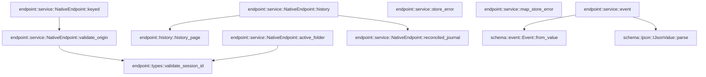

# endpoint::service

[Package atlas](index.md) · [Source](../../src/service.rs)

## Declarations

Visibility is the declaration spelling; trait members and reexports require their enclosing interface. `cfg` is not evaluated.

| Symbol | Kind | Visibility | Test / cfg |
|---|---|---|---|
| [endpoint::service::AUTOMATIC_TITLE_SEED_OPERATION](../../src/service.rs#L14) | const_item | `pub` |  |
| [endpoint::service::AUTOMATIC_TITLE_REFINE_OPERATION](../../src/service.rs#L15) | const_item | `pub` |  |
| [endpoint::service::SESSION_NOTICE_OPERATION](../../src/service.rs#L16) | const_item | `pub` |  |
| [endpoint::service::SessionNotice](../../src/service.rs#L23) | struct_item | `pub` |  |
| [endpoint::service::SessionNoticeSeverity](../../src/service.rs#L31) | enum_item | `pub` |  |
| [endpoint::service::SessionNoticeSeverity::as_str](../../src/service.rs#L38) | function_item | `pub` |  |
| [endpoint::service::MutationReceipt](../../src/service.rs#L47) | struct_item | `pub` |  |
| [endpoint::service::MutationReceipt::from](../../src/service.rs#L53) | function_item | `private` |  |
| [endpoint::service::ArchiveResult](../../src/service.rs#L62) | struct_item | `pub` |  |
| [endpoint::service::UnarchiveResult](../../src/service.rs#L67) | struct_item | `pub` |  |
| [endpoint::service::SessionInventoryItem](../../src/service.rs#L72) | struct_item | `pub` |  |
| [endpoint::service::PERMISSION_MODE_FILE](../../src/service.rs#L97) | const_item | `private` |  |
| [endpoint::service::DEFAULT_PERMISSION_MODE](../../src/service.rs#L98) | const_item | `private` |  |
| [endpoint::service::genesis_cwd](../../src/service.rs#L102) | function_item | `pub` |  |
| [endpoint::service::genesis_preset_summary](../../src/service.rs#L111) | function_item | `pub` |  |
| [endpoint::service::permission_mode_of](../../src/service.rs#L117) | function_item | `pub` |  |
| [endpoint::service::card_item](../../src/service.rs#L134) | function_item | `private` |  |
| [endpoint::service::card_updated_ms](../../src/service.rs#L173) | function_item | `pub` |  |
| [endpoint::service::last_record_updated_ms](../../src/service.rs#L188) | function_item | `pub` |  |
| [endpoint::service::last_record_updated_ms::WINDOW](../../src/service.rs#L190) | const_item | `private` |  |
| [endpoint::service::card_summary](../../src/service.rs#L211) | function_item | `pub` |  |
| [endpoint::service::NativeEndpoint](../../src/service.rs#L259) | struct_item | `pub` |  |
| [endpoint::service::NativeEndpoint::open](../../src/service.rs#L264) | function_item | `pub` |  |
| [endpoint::service::NativeEndpoint::open_with_sync](../../src/service.rs#L270) | function_item | `pub` |  |
| [endpoint::service::NativeEndpoint::capabilities](../../src/service.rs#L280) | function_item | `pub` |  |
| [endpoint::service::NativeEndpoint::list_sessions](../../src/service.rs#L299) | function_item | `pub` |  |
| [endpoint::service::NativeEndpoint::list_sessions_cached](../../src/service.rs#L309) | function_item | `pub` |  |
| [endpoint::service::NativeEndpoint::list_sessions_with](../../src/service.rs#L316) | function_item | `private` |  |
| [endpoint::service::NativeEndpoint::models](../../src/service.rs#L380) | function_item | `pub` |  |
| [endpoint::service::NativeEndpoint::session_config_snapshot](../../src/service.rs#L444) | function_item | `pub` |  |
| [endpoint::service::NativeEndpoint::submission_snapshot](../../src/service.rs#L456) | function_item | `pub` |  |
| [endpoint::service::NativeEndpoint::submission_metadata](../../src/service.rs#L463) | function_item | `pub` |  |
| [endpoint::service::NativeEndpoint::hydrate_historical_submissions](../../src/service.rs#L486) | function_item | `pub` |  |
| [endpoint::service::NativeEndpoint::create_session](../../src/service.rs#L594) | function_item | `pub` |  |
| [endpoint::service::NativeEndpoint::prompt](../../src/service.rs#L619) | function_item | `pub` |  |
| [endpoint::service::NativeEndpoint::prompt_for_endpoint](../../src/service.rs#L630) | function_item | `pub` |  |
| [endpoint::service::NativeEndpoint::prompt_with_operation](../../src/service.rs#L648) | function_item | `private` |  |
| [endpoint::service::NativeEndpoint::update_queue](../../src/service.rs#L682) | function_item | `pub` |  |
| [endpoint::service::NativeEndpoint::rename_session](../../src/service.rs#L697) | function_item | `pub` |  |
| [endpoint::service::NativeEndpoint::rename_session_for_endpoint](../../src/service.rs#L707) | function_item | `pub` |  |
| [endpoint::service::NativeEndpoint::rename_session_with_operation](../../src/service.rs#L717) | function_item | `private` |  |
| [endpoint::service::NativeEndpoint::seed_automatic_title_if_missing](../../src/service.rs#L736) | function_item | `pub` |  |
| [endpoint::service::NativeEndpoint::record_session_notice](../../src/service.rs#L769) | function_item | `pub` |  |
| [endpoint::service::NativeEndpoint::refine_automatic_title](../../src/service.rs#L823) | function_item | `pub` |  |
| [endpoint::service::NativeEndpoint::author_keyed_with_ledger](../../src/service.rs#L864) | function_item | `pub` |  |
| [endpoint::service::NativeEndpoint::cancel](../../src/service.rs#L887) | function_item | `pub` |  |
| [endpoint::service::NativeEndpoint::cancel_for_endpoint](../../src/service.rs#L896) | function_item | `pub` |  |
| [endpoint::service::NativeEndpoint::cancel_with_operation](../../src/service.rs#L905) | function_item | `private` |  |
| [endpoint::service::NativeEndpoint::fork_session](../../src/service.rs#L935) | function_item | `pub` |  |
| [endpoint::service::NativeEndpoint::archive_session](../../src/service.rs#L951) | function_item | `pub` |  |
| [endpoint::service::NativeEndpoint::unarchive_session](../../src/service.rs#L959) | function_item | `pub` |  |
| [endpoint::service::NativeEndpoint::reconcile_projection](../../src/service.rs#L970) | function_item | `pub` |  |
| [endpoint::service::NativeEndpoint::reconciled_journal](../../src/service.rs#L978) | function_item | `private` |  |
| [endpoint::service::NativeEndpoint::history](../../src/service.rs#L992) | function_item | `pub` |  |
| [endpoint::service::NativeEndpoint::keyed](../../src/service.rs#L1002) | function_item | `private` |  |
| [endpoint::service::NativeEndpoint::validate_origin](../../src/service.rs#L1020) | function_item | `private` |  |
| [endpoint::service::NativeEndpoint::active_folder](../../src/service.rs#L1033) | function_item | `private` |  |
| [endpoint::service::event](../../src/service.rs#L1046) | function_item | `private` |  |
| [endpoint::service::store_error](../../src/service.rs#L1051) | function_item | `private` |  |
| [endpoint::service::map_store_error](../../src/service.rs#L1055) | function_item | `private` |  |
| [endpoint::service::NativeEndpointError](../../src/service.rs#L1064) | enum_item | `pub` |  |

## Imports / reexports

| Local name | Source path | Visibility |
|---|---|---|
| `BTreeSet` | `std::collections::BTreeSet` | `private` |
| `HashSet` | `std::collections::HashSet` | `private` |
| `fs` | `std::fs` | `private` |
| `Path` | `std::path::Path` | `private` |
| `Arc` | `std::sync::Arc` | `private` |
| `Event` | `schema::Event` | `private` |
| `EventKind` | `schema::EventKind` | `private` |
| `IJsonValue` | `schema::IJsonValue` | `private` |
| `OriginTuple` | `schema::OriginTuple` | `private` |
| `ResumePolicy` | `schema::ResumePolicy` | `private` |
| `SeqRange` | `schema::SeqRange` | `private` |
| `Value` | `serde_json::Value` | `private` |
| `json` | `serde_json::json` | `private` |
| `AppendOutcome` | `store::AppendOutcome` | `private` |
| `ConditionalAppendOutcome` | `store::ConditionalAppendOutcome` | `private` |
| `SyncPolicy` | `store::SyncPolicy` | `private` |
| `ThreadStore` | `store::ThreadStore` | `private` |
| `scan_valid_prefix` | `store::scan_valid_prefix` | `private` |
| `Error` | `thiserror::Error` | `private` |
| `timestamp_millis` | `crate::projection::timestamp_millis` | `private` |
| `EndpointJournal` | `crate::EndpointJournal` | `private` |
| `HistoryPage` | `crate::HistoryPage` | `private` |
| `Projector` | `crate::Projector` | `private` |
| `history_page` | `crate::history_page` | `private` |
| `validate_session_id` | `crate::validate_session_id` | `private` |

## Module declarations

| Module | Visibility | Attributes |
|---|---|---|

## Function call graphs

Edges below are syntactically resolved calls only, including private functions. Graphs partition callers into groups of 20; they are not execution order. All unresolved sites are listed below and in the JSON inventory.

Functions 1–20: 37 direct edges

```mermaid
flowchart TD
  n0["endpoint::projection::timestamp_millis"]
  n1["endpoint::service::genesis_cwd"]
  n2["endpoint::service::NativeEndpoint::active_folder"]
  n3["endpoint::service::genesis_preset_summary"]
  n4["endpoint::service::permission_mode_of"]
  n5["endpoint::service::card_item"]
  n6["endpoint::service::card_updated_ms"]
  n7["endpoint::service::last_record_updated_ms"]
  n8["endpoint::service::card_summary"]
  n9["endpoint::service::NativeEndpoint::open"]
  n10["endpoint::service::NativeEndpoint::open_with_sync"]
  n11["endpoint::service::NativeEndpoint::capabilities"]
  n12["endpoint::service::NativeEndpoint::list_sessions"]
  n13["endpoint::service::NativeEndpoint::list_sessions_cached"]
  n14["endpoint::service::NativeEndpoint::list_sessions_with"]
  n15["endpoint::service::NativeEndpoint::models"]
  n16["endpoint::service::SessionNoticeSeverity::as_str"]
  n17["endpoint::service::NativeEndpoint::session_config_snapshot"]
  n18["endpoint::service::NativeEndpoint::submission_snapshot"]
  n19["endpoint::service::NativeEndpoint::submission_metadata"]
  n20["endpoint::service::NativeEndpoint::hydrate_historical_submissions"]
  n21["endpoint::service::MutationReceipt::from"]
  n22["endpoint::types::validate_session_id"]
  n23["profile::config::ConfigSnapshot::decode"]
  n24["profile::config::ConfigRepository::open"]
  n25["profile::scope::SessionScope::for_session_folder"]
  n26["schema::ijson::IJsonValue::parse"]
  n27["schema::effective_session_genesis"]
  n28["store::asset::AssetStore::new"]
  n29["store::card::read_card"]
  n30["store::card::classify"]
  n31["store::folder::ThreadStore::open"]
  n32["store::folder::ThreadStore::open_with_sync"]
  n33["store::tail::scan_valid_prefix"]
  n34["store::tail::read_genesis"]
  n35["tools::preset::ResolvedPreset::from_genesis"]
  n3 --> n35
  n5 --> n1
  n5 --> n4
  n5 --> n29
  n5 --> n30
  n5 --> n34
  n6 --> n0
  n7 --> n0
  n8 --> n3
  n8 --> n6
  n8 --> n27
  n9 --> n31
  n10 --> n32
  n12 --> n14
  n13 --> n14
  n14 --> n1
  n14 --> n4
  n14 --> n5
  n14 --> n8
  n14 --> n22
  n14 --> n33
  n15 --> n26
  n17 --> n2
  n17 --> n22
  n17 --> n24
  n17 --> n25
  n18 --> n2
  n18 --> n17
  n18 --> n19
  n18 --> n28
  n19 --> n26
  n20 --> n2
  n20 --> n19
  n20 --> n23
  n20 --> n26
  n20 --> n28
  n20 --> n33
```

Functions 21–40: 33 direct edges

```mermaid
flowchart TD
  n0["endpoint::journal::EndpointJournal::open"]
  n1["endpoint::service::NativeEndpoint::keyed"]
  n2["endpoint::service::NativeEndpoint::validate_origin"]
  n3["endpoint::service::NativeEndpoint::active_folder"]
  n4["endpoint::service::event"]
  n5["endpoint::service::NativeEndpoint::submission_snapshot"]
  n6["endpoint::service::NativeEndpoint::create_session"]
  n7["endpoint::service::NativeEndpoint::prompt"]
  n8["endpoint::service::NativeEndpoint::prompt_for_endpoint"]
  n9["endpoint::service::NativeEndpoint::prompt_with_operation"]
  n10["endpoint::service::NativeEndpoint::update_queue"]
  n11["endpoint::service::NativeEndpoint::rename_session"]
  n12["endpoint::service::NativeEndpoint::rename_session_for_endpoint"]
  n13["endpoint::service::NativeEndpoint::rename_session_with_operation"]
  n14["endpoint::service::NativeEndpoint::seed_automatic_title_if_missing"]
  n15["endpoint::service::NativeEndpoint::record_session_notice"]
  n16["endpoint::service::NativeEndpoint::refine_automatic_title"]
  n17["endpoint::service::NativeEndpoint::author_keyed_with_ledger"]
  n18["endpoint::service::NativeEndpoint::cancel"]
  n19["endpoint::service::NativeEndpoint::cancel_for_endpoint"]
  n20["endpoint::service::NativeEndpoint::cancel_with_operation"]
  n21["endpoint::service::NativeEndpoint::fork_session"]
  n22["endpoint::service::NativeEndpoint::archive_session"]
  n23["endpoint::service::NativeEndpoint::unarchive_session"]
  n24["endpoint::service::NativeEndpoint::reconcile_projection"]
  n25["endpoint::service::NativeEndpoint::reconciled_journal"]
  n26["endpoint::types::validate_session_id"]
  n27["profile::config::ConfigRepository::open"]
  n28["store::tail::scan_valid_prefix"]
  n6 --> n4
  n6 --> n26
  n6 --> n27
  n7 --> n9
  n8 --> n9
  n9 --> n2
  n9 --> n4
  n9 --> n5
  n10 --> n1
  n10 --> n4
  n11 --> n13
  n12 --> n13
  n13 --> n1
  n13 --> n4
  n14 --> n2
  n14 --> n4
  n15 --> n2
  n15 --> n4
  n16 --> n2
  n16 --> n4
  n17 --> n26
  n18 --> n20
  n19 --> n20
  n20 --> n2
  n20 --> n4
  n20 --> n26
  n21 --> n26
  n22 --> n26
  n23 --> n26
  n24 --> n25
  n25 --> n0
  n25 --> n3
  n25 --> n28
```

Functions 41–47: 7 direct edges

```mermaid
flowchart TD
  n0["endpoint::history::history_page"]
  n1["endpoint::service::NativeEndpoint::keyed"]
  n2["endpoint::service::NativeEndpoint::validate_origin"]
  n3["endpoint::service::NativeEndpoint::active_folder"]
  n4["endpoint::service::event"]
  n5["endpoint::service::store_error"]
  n6["endpoint::service::map_store_error"]
  n7["endpoint::service::NativeEndpoint::reconciled_journal"]
  n8["endpoint::service::NativeEndpoint::history"]
  n9["endpoint::types::validate_session_id"]
  n10["schema::event::Event::from_value"]
  n11["schema::ijson::IJsonValue::parse"]
  n1 --> n2
  n2 --> n9
  n3 --> n9
  n4 --> n10
  n4 --> n11
  n8 --> n0
  n8 --> n7
```

## Call sites

Includes test functions (marked in declarations). Receiver-type-required sites need type analysis/manual tracing. Calls in closures are attributed to their enclosing function; their occurrence here does not mean the closure executes immediately.

| Caller | Callee expression | Source lines | Target / classification |
|---|---|---|---|
| `genesis_cwd` | `genesis.string_field("cwd").unwrap_or_default().to_owned` | [103](../../src/service.rs#L103) | receiver-type-required |
| `genesis_cwd` | `genesis.string_field("cwd").unwrap_or_default` | [103](../../src/service.rs#L103) | receiver-type-required |
| `genesis_cwd` | `genesis.string_field` | [103](../../src/service.rs#L103) | receiver-type-required |
| `genesis_preset_summary` | `serde_json::to_value(genesis.raw()).ok` | [112](../../src/service.rs#L112) | receiver-type-required |
| `genesis_preset_summary` | `serde_json::to_value` | [112](../../src/service.rs#L112) | external-constructor-callback-or-unresolved |
| `genesis_preset_summary` | `genesis.raw` | [112](../../src/service.rs#L112) | receiver-type-required |
| `genesis_preset_summary` | `tools::ResolvedPreset::from_genesis(raw.get("preset")?).ok` | [113](../../src/service.rs#L113) | receiver-type-required |
| `genesis_preset_summary` | `tools::ResolvedPreset::from_genesis` | [113](../../src/service.rs#L113) | [tools::preset::ResolvedPreset::from_genesis](../../../tools/src/preset.rs#L855) |
| `genesis_preset_summary` | `raw.get` | [113](../../src/service.rs#L113) | receiver-type-required |
| `genesis_preset_summary` | `Some` | [114](../../src/service.rs#L114) | external-constructor-callback-or-unresolved |
| `genesis_preset_summary` | `preset.summary` | [114](../../src/service.rs#L114) | receiver-type-required |
| `permission_mode_of` | `fs::read` | [118](../../src/service.rs#L118) | external-constructor-callback-or-unresolved |
| `permission_mode_of` | `folder.join` | [118](../../src/service.rs#L118) | receiver-type-required |
| `permission_mode_of` | `DEFAULT_PERMISSION_MODE.to_owned` | [119](../../src/service.rs#L119), [130](../../src/service.rs#L130) | receiver-type-required |
| `permission_mode_of` | `serde_json::from_slice::<serde_json::Value>(&bytes)         .ok()         .and_then(&#124;value&#124; value.get("mode")?.as_str().map(str::to_owned))         .filter(&#124;mode&#124; {             matches!(                 mode.as_str(),                 "read-only" &#124; "workspace-write" &#124; "danger-full-access"             )         })         .unwrap_or_else` | [121](../../src/service.rs#L121) | receiver-type-required |
| `permission_mode_of` | `serde_json::from_slice::<serde_json::Value>(&bytes)         .ok()         .and_then(&#124;value&#124; value.get("mode")?.as_str().map(str::to_owned))         .filter` | [121](../../src/service.rs#L121) | receiver-type-required |
| `permission_mode_of` | `serde_json::from_slice::<serde_json::Value>(&bytes)         .ok()         .and_then` | [121](../../src/service.rs#L121) | receiver-type-required |
| `permission_mode_of` | `serde_json::from_slice::<serde_json::Value>(&bytes)         .ok` | [121](../../src/service.rs#L121) | receiver-type-required |
| `permission_mode_of` | `serde_json::from_slice::<serde_json::Value>` | [121](../../src/service.rs#L121) | external-constructor-callback-or-unresolved |
| `permission_mode_of` | `value.get("mode")?.as_str().map` | [123](../../src/service.rs#L123) | receiver-type-required |
| `permission_mode_of` | `value.get("mode")?.as_str` | [123](../../src/service.rs#L123) | receiver-type-required |
| `permission_mode_of` | `value.get` | [123](../../src/service.rs#L123) | receiver-type-required |
| `card_item` | `store::card::read_card` | [140](../../src/service.rs#L140) | [store::card::read_card](../../../store/src/card.rs#L176) |
| `card_item` | `store::card::classify(folder, &card).ok` | [141](../../src/service.rs#L141) | receiver-type-required |
| `card_item` | `store::card::classify` | [141](../../src/service.rs#L141) | [store::card::classify](../../../store/src/card.rs#L395) |
| `card_item` | `classified.freshness` | [142](../../src/service.rs#L142) | receiver-type-required |
| `card_item` | `card.lines.first` | [145](../../src/service.rs#L145) | receiver-type-required |
| `card_item` | `Some` | [149](../../src/service.rs#L149) | external-constructor-callback-or-unresolved |
| `card_item` | `session_id.to_owned` | [150](../../src/service.rs#L150) | receiver-type-required |
| `card_item` | `card.summary.cwd.clone().unwrap_or_else` | [151](../../src/service.rs#L151) | receiver-type-required |
| `card_item` | `card.summary.cwd.clone` | [151](../../src/service.rs#L151) | receiver-type-required |
| `card_item` | `store::read_genesis(folder.join("main.jsonl"))                 .ok()                 .flatten()                 .map(&#124;g&#124; genesis_cwd(folder, &g))                 .unwrap_or_default` | [152](../../src/service.rs#L152) | receiver-type-required |
| `card_item` | `store::read_genesis(folder.join("main.jsonl"))                 .ok()                 .flatten()                 .map` | [152](../../src/service.rs#L152) | receiver-type-required |
| `card_item` | `store::read_genesis(folder.join("main.jsonl"))                 .ok()                 .flatten` | [152](../../src/service.rs#L152) | receiver-type-required |
| `card_item` | `store::read_genesis(folder.join("main.jsonl"))                 .ok` | [152](../../src/service.rs#L152) | receiver-type-required |
| `card_item` | `store::read_genesis` | [152](../../src/service.rs#L152) | [store::tail::read_genesis](../../../store/src/tail.rs#L86) |
| `card_item` | `folder.join` | [152](../../src/service.rs#L152) | receiver-type-required |
| `card_item` | `genesis_cwd` | [155](../../src/service.rs#L155) | [endpoint::service::genesis_cwd](../../src/service.rs#L102) |
| `card_item` | `card.summary.title.clone` | [158](../../src/service.rs#L158) | receiver-type-required |
| `card_item` | `main.facts.clone` | [164](../../src/service.rs#L164) | receiver-type-required |
| `card_item` | `permission_mode_of` | [165](../../src/service.rs#L165) | [endpoint::service::permission_mode_of](../../src/service.rs#L117) |
| `card_item` | `card.summary.identity_profile.clone` | [166](../../src/service.rs#L166) | receiver-type-required |
| `card_item` | `card.summary.preset.clone` | [167](../../src/service.rs#L167) | receiver-type-required |
| `card_updated_ms` | `Ok` | [174](../../src/service.rs#L174) | external-constructor-callback-or-unresolved |
| `card_updated_ms` | `projection         .events         .last()         .and_then(&#124;event&#124; event.string_field("ts"))         .ok_or(NativeEndpointError::InventoryTimestamp)         .and_then` | [174](../../src/service.rs#L174) | receiver-type-required |
| `card_updated_ms` | `projection         .events         .last()         .and_then(&#124;event&#124; event.string_field("ts"))         .ok_or` | [174](../../src/service.rs#L174) | receiver-type-required |
| `card_updated_ms` | `projection         .events         .last()         .and_then` | [174](../../src/service.rs#L174) | receiver-type-required |
| `card_updated_ms` | `projection         .events         .last` | [174](../../src/service.rs#L174) | receiver-type-required |
| `card_updated_ms` | `event.string_field` | [177](../../src/service.rs#L177) | receiver-type-required |
| `card_updated_ms` | `timestamp_millis(value).map_err` | [179](../../src/service.rs#L179) | receiver-type-required |
| `card_updated_ms` | `timestamp_millis` | [179](../../src/service.rs#L179) | [endpoint::projection::timestamp_millis](../../src/projection.rs#L1106) |
| `last_record_updated_ms` | `fs::File::open(path).ok` | [191](../../src/service.rs#L191) | receiver-type-required |
| `last_record_updated_ms` | `fs::File::open` | [191](../../src/service.rs#L191) | external-constructor-callback-or-unresolved |
| `last_record_updated_ms` | `file.metadata().ok()?.len` | [192](../../src/service.rs#L192) | receiver-type-required |
| `last_record_updated_ms` | `file.metadata().ok` | [192](../../src/service.rs#L192) | receiver-type-required |
| `last_record_updated_ms` | `file.metadata` | [192](../../src/service.rs#L192) | receiver-type-required |
| `last_record_updated_ms` | `length.saturating_sub` | [193](../../src/service.rs#L193) | receiver-type-required |
| `last_record_updated_ms` | `file.seek(SeekFrom::Start(start)).ok` | [194](../../src/service.rs#L194) | receiver-type-required |
| `last_record_updated_ms` | `file.seek` | [194](../../src/service.rs#L194) | receiver-type-required |
| `last_record_updated_ms` | `SeekFrom::Start` | [194](../../src/service.rs#L194) | external-constructor-callback-or-unresolved |
| `last_record_updated_ms` | `Vec::new` | [195](../../src/service.rs#L195) | external-constructor-callback-or-unresolved |
| `last_record_updated_ms` | `file.take(WINDOW).read_to_end(&mut bytes).ok` | [196](../../src/service.rs#L196) | receiver-type-required |
| `last_record_updated_ms` | `file.take(WINDOW).read_to_end` | [196](../../src/service.rs#L196) | receiver-type-required |
| `last_record_updated_ms` | `file.take` | [196](../../src/service.rs#L196) | receiver-type-required |
| `last_record_updated_ms` | `bytes.iter().rposition` | [198](../../src/service.rs#L198) | receiver-type-required |
| `last_record_updated_ms` | `bytes.iter` | [198](../../src/service.rs#L198) | receiver-type-required |
| `last_record_updated_ms` | `bytes[..end]         .iter()         .rposition(&#124;byte&#124; *byte == b'\n')         .map(&#124;index&#124; index + 1)         .or` | [199](../../src/service.rs#L199) | receiver-type-required |
| `last_record_updated_ms` | `bytes[..end]         .iter()         .rposition(&#124;byte&#124; *byte == b'\n')         .map` | [199](../../src/service.rs#L199) | receiver-type-required |
| `last_record_updated_ms` | `bytes[..end]         .iter()         .rposition` | [199](../../src/service.rs#L199) | receiver-type-required |
| `last_record_updated_ms` | `bytes[..end]         .iter` | [199](../../src/service.rs#L199) | receiver-type-required |
| `last_record_updated_ms` | `(start == 0).then_some` | [203](../../src/service.rs#L203) | receiver-type-required |
| `last_record_updated_ms` | `serde_json::from_slice(&bytes[line_start..end]).ok` | [204](../../src/service.rs#L204) | receiver-type-required |
| `last_record_updated_ms` | `serde_json::from_slice` | [204](../../src/service.rs#L204) | external-constructor-callback-or-unresolved |
| `last_record_updated_ms` | `timestamp_millis(record.get("ts")?.as_str()?).ok` | [205](../../src/service.rs#L205) | receiver-type-required |
| `last_record_updated_ms` | `timestamp_millis` | [205](../../src/service.rs#L205) | [endpoint::projection::timestamp_millis](../../src/projection.rs#L1106) |
| `last_record_updated_ms` | `record.get("ts")?.as_str` | [205](../../src/service.rs#L205) | receiver-type-required |
| `last_record_updated_ms` | `record.get` | [205](../../src/service.rs#L205) | receiver-type-required |
| `last_record_updated_ms` | `Some` | [206](../../src/service.rs#L206) | external-constructor-callback-or-unresolved |
| `card_summary` | `projection.events.first().ok_or_else` | [214](../../src/service.rs#L214) | receiver-type-required |
| `card_summary` | `projection.events.first` | [214](../../src/service.rs#L214) | receiver-type-required |
| `card_summary` | `NativeEndpointError::Store` | [215](../../src/service.rs#L215) | external-constructor-callback-or-unresolved |
| `card_summary` | `store::StoreError::Corruption` | [215](../../src/service.rs#L215) | external-constructor-callback-or-unresolved |
| `card_summary` | `"ledger has no genesis".to_owned` | [216](../../src/service.rs#L216) | receiver-type-required |
| `card_summary` | `projection         .events         .iter()         .rev()         .find_map(&#124;event&#124; event.string_field("title"))         .map` | [219](../../src/service.rs#L219) | receiver-type-required |
| `card_summary` | `projection         .events         .iter()         .rev()         .find_map` | [219](../../src/service.rs#L219) | receiver-type-required |
| `card_summary` | `projection         .events         .iter()         .rev` | [219](../../src/service.rs#L219) | receiver-type-required |
| `card_summary` | `projection         .events         .iter` | [219](../../src/service.rs#L219) | receiver-type-required |
| `card_summary` | `event.string_field` | [223](../../src/service.rs#L223), [233](../../src/service.rs#L233) | receiver-type-required |
| `card_summary` | `card_updated_ms` | [225](../../src/service.rs#L225) | [endpoint::service::card_updated_ms](../../src/service.rs#L173) |
| `card_summary` | `genesis_preset_summary` | [226](../../src/service.rs#L226) | [endpoint::service::genesis_preset_summary](../../src/service.rs#L111) |
| `card_summary` | `genesis.string_field` | [227](../../src/service.rs#L227), [230](../../src/service.rs#L230), [249](../../src/service.rs#L249) | receiver-type-required |
| `card_summary` | `preset.is_some` | [228](../../src/service.rs#L228) | receiver-type-required |
| `card_summary` | `Some` | [229](../../src/service.rs#L229), [233](../../src/service.rs#L233) | external-constructor-callback-or-unresolved |
| `card_summary` | `"coding".to_owned` | [229](../../src/service.rs#L229) | receiver-type-required |
| `card_summary` | `genesis.string_field("identity_profile").map` | [230](../../src/service.rs#L230) | receiver-type-required |
| `card_summary` | `projection.events.iter().find_map` | [231](../../src/service.rs#L231) | receiver-type-required |
| `card_summary` | `projection.events.iter` | [231](../../src/service.rs#L231) | receiver-type-required |
| `card_summary` | `event.kind` | [232](../../src/service.rs#L232) | receiver-type-required |
| `card_summary` | `serde_json::to_value(event.raw())                 .ok()?                 .get("payload")?                 .get("profile")?                 .as_str()                 .map` | [237](../../src/service.rs#L237) | receiver-type-required |
| `card_summary` | `serde_json::to_value(event.raw())                 .ok()?                 .get("payload")?                 .get("profile")?                 .as_str` | [237](../../src/service.rs#L237) | receiver-type-required |
| `card_summary` | `serde_json::to_value(event.raw())                 .ok()?                 .get("payload")?                 .get` | [237](../../src/service.rs#L237) | receiver-type-required |
| `card_summary` | `serde_json::to_value(event.raw())                 .ok()?                 .get` | [237](../../src/service.rs#L237) | receiver-type-required |
| `card_summary` | `serde_json::to_value(event.raw())                 .ok` | [237](../../src/service.rs#L237) | receiver-type-required |
| `card_summary` | `serde_json::to_value` | [237](../../src/service.rs#L237) | external-constructor-callback-or-unresolved |
| `card_summary` | `event.raw` | [237](../../src/service.rs#L237) | receiver-type-required |
| `card_summary` | `schema::effective_session_genesis(&projection.events)?.expect` | [246](../../src/service.rs#L246) | receiver-type-required |
| `card_summary` | `schema::effective_session_genesis` | [246](../../src/service.rs#L246) | [schema::effective_session_genesis](../../../schema/src/lib.rs#L57) |
| `card_summary` | `Ok` | [247](../../src/service.rs#L247) | external-constructor-callback-or-unresolved |
| `card_summary` | `scope.get("cwd").and_then(Value::as_str).map` | [248](../../src/service.rs#L248) | receiver-type-required |
| `card_summary` | `scope.get("cwd").and_then` | [248](../../src/service.rs#L248) | receiver-type-required |
| `card_summary` | `scope.get` | [248](../../src/service.rs#L248) | receiver-type-required |
| `card_summary` | `genesis.string_field("ts").unwrap_or_default().to_owned` | [249](../../src/service.rs#L249) | receiver-type-required |
| `card_summary` | `genesis.string_field("ts").unwrap_or_default` | [249](../../src/service.rs#L249) | receiver-type-required |
| `card_summary` | `genesis.is_ephemeral_genesis` | [254](../../src/service.rs#L254) | receiver-type-required |
| `card_summary` | `projection.lifecycle.latest_turn.is_none` | [255](../../src/service.rs#L255) | receiver-type-required |
| `open` | `Ok` | [265](../../src/service.rs#L265) | external-constructor-callback-or-unresolved |
| `open` | `ThreadStore::open` | [266](../../src/service.rs#L266) | [store::folder::ThreadStore::open](../../../store/src/folder.rs#L48) |
| `open_with_sync` | `Ok` | [274](../../src/service.rs#L274) | external-constructor-callback-or-unresolved |
| `open_with_sync` | `ThreadStore::open_with_sync` | [275](../../src/service.rs#L275) | [store::folder::ThreadStore::open_with_sync](../../../store/src/folder.rs#L52) |
| `capabilities` | `[             "session.models",             "session.create",             "session.prompt",             "session.updateQueue",             "session.cancel",             "session.rename",             "session.fork",             "session.discard",             "workspace.archiveSession",             "workspace.unarchiveSession",         ]         .into_iter()         .collect` | [281](../../src/service.rs#L281) | receiver-type-required |
| `capabilities` | `[             "session.models",             "session.create",             "session.prompt",             "session.updateQueue",             "session.cancel",             "session.rename",             "session.fork",             "session.discard",             "workspace.archiveSession",             "workspace.unarchiveSession",         ]         .into_iter` | [281](../../src/service.rs#L281) | receiver-type-required |
| `list_sessions` | `self.list_sessions_with` | [303](../../src/service.rs#L303) | [endpoint::service::NativeEndpoint::list_sessions_with](../../src/service.rs#L316) |
| `list_sessions_cached` | `self.list_sessions_with` | [313](../../src/service.rs#L313) | [endpoint::service::NativeEndpoint::list_sessions_with](../../src/service.rs#L316) |
| `list_sessions_with` | `Vec::new` | [321](../../src/service.rs#L321) | external-constructor-callback-or-unresolved |
| `list_sessions_with` | `fs::read_dir` | [323](../../src/service.rs#L323) | external-constructor-callback-or-unresolved |
| `list_sessions_with` | `self.store.root().join` | [323](../../src/service.rs#L323) | receiver-type-required |
| `list_sessions_with` | `self.store.root` | [323](../../src/service.rs#L323) | receiver-type-required |
| `list_sessions_with` | `entry.file_type()?.is_dir` | [325](../../src/service.rs#L325) | receiver-type-required |
| `list_sessions_with` | `entry.file_type` | [325](../../src/service.rs#L325) | receiver-type-required |
| `list_sessions_with` | `entry.file_name().to_string_lossy().into_owned` | [328](../../src/service.rs#L328) | receiver-type-required |
| `list_sessions_with` | `entry.file_name().to_string_lossy` | [328](../../src/service.rs#L328) | receiver-type-required |
| `list_sessions_with` | `entry.file_name` | [328](../../src/service.rs#L328) | receiver-type-required |
| `list_sessions_with` | `validate_session_id` | [329](../../src/service.rs#L329) | [endpoint::types::validate_session_id](../../src/types.rs#L130) |
| `list_sessions_with` | `running.contains` | [331](../../src/service.rs#L331) | receiver-type-required |
| `list_sessions_with` | `self.store.session_has_live_line_holder` | [332](../../src/service.rs#L332) | receiver-type-required |
| `list_sessions_with` | `card_item` | [334](../../src/service.rs#L334) | [endpoint::service::card_item](../../src/service.rs#L134) |
| `list_sessions_with` | `entry.path` | [334](../../src/service.rs#L334), [339](../../src/service.rs#L339), [355](../../src/service.rs#L355), [361](../../src/service.rs#L361) | receiver-type-required |
| `list_sessions_with` | `items.push` | [336](../../src/service.rs#L336), [354](../../src/service.rs#L354) | receiver-type-required |
| `list_sessions_with` | `fs::read` | [339](../../src/service.rs#L339) | external-constructor-callback-or-unresolved |
| `list_sessions_with` | `entry.path().join` | [339](../../src/service.rs#L339) | receiver-type-required |
| `list_sessions_with` | `scan_valid_prefix` | [340](../../src/service.rs#L340) | [store::tail::scan_valid_prefix](../../../store/src/tail.rs#L37) |
| `list_sessions_with` | `scan.projection.ok_or_else` | [341](../../src/service.rs#L341) | receiver-type-required |
| `list_sessions_with` | `NativeEndpointError::Store` | [342](../../src/service.rs#L342), [348](../../src/service.rs#L348) | external-constructor-callback-or-unresolved |
| `list_sessions_with` | `store::StoreError::Corruption` | [342](../../src/service.rs#L342), [348](../../src/service.rs#L348) | external-constructor-callback-or-unresolved |
| `list_sessions_with` | `card_summary(&projection).map_err` | [346](../../src/service.rs#L346) | receiver-type-required |
| `list_sessions_with` | `card_summary` | [346](../../src/service.rs#L346) | [endpoint::service::card_summary](../../src/service.rs#L211) |
| `list_sessions_with` | `permission_mode_of` | [355](../../src/service.rs#L355) | [endpoint::service::permission_mode_of](../../src/service.rs#L117) |
| `list_sessions_with` | `summary.cwd.unwrap_or_else` | [359](../../src/service.rs#L359) | receiver-type-required |
| `list_sessions_with` | `genesis_cwd` | [360](../../src/service.rs#L360) | [endpoint::service::genesis_cwd](../../src/service.rs#L102) |
| `list_sessions_with` | `projection.events.first().expect` | [362](../../src/service.rs#L362) | receiver-type-required |
| `list_sessions_with` | `projection.events.first` | [362](../../src/service.rs#L362) | receiver-type-required |
| `list_sessions_with` | `items.sort_by` | [376](../../src/service.rs#L376) | receiver-type-required |
| `list_sessions_with` | `left.session_id.as_bytes().cmp` | [376](../../src/service.rs#L376) | receiver-type-required |
| `list_sessions_with` | `left.session_id.as_bytes` | [376](../../src/service.rs#L376) | receiver-type-required |
| `list_sessions_with` | `right.session_id.as_bytes` | [376](../../src/service.rs#L376) | receiver-type-required |
| `list_sessions_with` | `Ok` | [377](../../src/service.rs#L377) | external-constructor-callback-or-unresolved |
| `models` | `snapshot             .session_settings             .as_ref()             .map(&#124;settings&#124; &settings.provider)             .or` | [384](../../src/service.rs#L384) | receiver-type-required |
| `models` | `snapshot             .session_settings             .as_ref()             .map` | [384](../../src/service.rs#L384), [389](../../src/service.rs#L389) | receiver-type-required |
| `models` | `snapshot             .session_settings             .as_ref` | [384](../../src/service.rs#L384), [389](../../src/service.rs#L389), [424](../../src/service.rs#L424) | receiver-type-required |
| `models` | `snapshot.settings.default_provider.as_ref` | [388](../../src/service.rs#L388) | receiver-type-required |
| `models` | `snapshot             .session_settings             .as_ref()             .map(&#124;settings&#124; &settings.model)             .or` | [389](../../src/service.rs#L389) | receiver-type-required |
| `models` | `snapshot.settings.default_model.as_ref` | [393](../../src/service.rs#L393) | receiver-type-required |
| `models` | `snapshot             .providers             .providers             .iter()             .map(&#124;provider&#124; {                 json!({                     "id": provider.id,                     "name": provider.id,                     "models": provider.models.iter().filter(&#124;model&#124; model.enabled).map(&#124;model&#124; {                         json!({"id": model.id, "name": model.id,                             "contextWindow": model.context_window_tokens})                     }).collect::<Vec<_>>()                 })             })             .collect::<Vec<_>>` | [394](../../src/service.rs#L394) | receiver-type-required |
| `models` | `snapshot             .providers             .providers             .iter()             .map` | [394](../../src/service.rs#L394) | receiver-type-required |
| `models` | `snapshot             .providers             .providers             .iter` | [394](../../src/service.rs#L394) | receiver-type-required |
| `models` | `selected_provider             .zip(selected_model)             .is_some_and` | [409](../../src/service.rs#L409) | receiver-type-required |
| `models` | `selected_provider             .zip` | [409](../../src/service.rs#L409) | receiver-type-required |
| `models` | `snapshot.providers.providers.iter().any` | [412](../../src/service.rs#L412) | receiver-type-required |
| `models` | `snapshot.providers.providers.iter` | [412](../../src/service.rs#L412) | receiver-type-required |
| `models` | `candidate                             .models                             .iter()                             .any` | [414](../../src/service.rs#L414) | receiver-type-required |
| `models` | `candidate                             .models                             .iter` | [414](../../src/service.rs#L414) | receiver-type-required |
| `models` | `snapshot             .session_settings             .as_ref()             .and_then` | [424](../../src/service.rs#L424) | receiver-type-required |
| `models` | `settings.reasoning_effort.as_ref` | [427](../../src/service.rs#L427) | receiver-type-required |
| `models` | `Value::String` | [429](../../src/service.rs#L429) | external-constructor-callback-or-unresolved |
| `models` | `effort.clone` | [429](../../src/service.rs#L429) | receiver-type-required |
| `models` | `Ok` | [437](../../src/service.rs#L437) | external-constructor-callback-or-unresolved |
| `models` | `IJsonValue::parse` | [437](../../src/service.rs#L437) | [schema::ijson::IJsonValue::parse](../../../schema/src/ijson.rs#L16) |
| `models` | `serde_json::to_vec` | [437](../../src/service.rs#L437) | external-constructor-callback-or-unresolved |
| `session_config_snapshot` | `validate_session_id` | [448](../../src/service.rs#L448) | [endpoint::types::validate_session_id](../../src/types.rs#L130) |
| `session_config_snapshot` | `profile::SessionScope::for_session_folder` | [449](../../src/service.rs#L449) | [profile::scope::SessionScope::for_session_folder](../../../profile/src/scope.rs#L22) |
| `session_config_snapshot` | `self.active_folder` | [449](../../src/service.rs#L449) | [endpoint::service::NativeEndpoint::active_folder](../../src/service.rs#L1033) |
| `session_config_snapshot` | `profile::ConfigRepository::open` | [450](../../src/service.rs#L450) | [profile::config::ConfigRepository::open](../../../profile/src/config.rs#L568) |
| `session_config_snapshot` | `self.store.root` | [450](../../src/service.rs#L450) | receiver-type-required |
| `session_config_snapshot` | `Ok` | [451](../../src/service.rs#L451) | external-constructor-callback-or-unresolved |
| `session_config_snapshot` | `scope.config` | [451](../../src/service.rs#L451) | receiver-type-required |
| `submission_snapshot` | `self.session_config_snapshot` | [457](../../src/service.rs#L457) | [endpoint::service::NativeEndpoint::session_config_snapshot](../../src/service.rs#L444) |
| `submission_snapshot` | `store::AssetStore::new` | [458](../../src/service.rs#L458) | [store::asset::AssetStore::new](../../../store/src/asset.rs#L27) |
| `submission_snapshot` | `self.active_folder(session_id)?.join` | [458](../../src/service.rs#L458) | receiver-type-required |
| `submission_snapshot` | `self.active_folder` | [458](../../src/service.rs#L458) | [endpoint::service::NativeEndpoint::active_folder](../../src/service.rs#L1033) |
| `submission_snapshot` | `config.publish` | [459](../../src/service.rs#L459) | receiver-type-required |
| `submission_snapshot` | `Self::submission_metadata` | [460](../../src/service.rs#L460) | [endpoint::service::NativeEndpoint::submission_metadata](../../src/service.rs#L463) |
| `submission_metadata` | `config             .session_settings             .as_ref()             .map(&#124;s&#124; s.provider.as_str())             .or` | [467](../../src/service.rs#L467) | receiver-type-required |
| `submission_metadata` | `config             .session_settings             .as_ref()             .map` | [467](../../src/service.rs#L467), [472](../../src/service.rs#L472) | receiver-type-required |
| `submission_metadata` | `config             .session_settings             .as_ref` | [467](../../src/service.rs#L467), [472](../../src/service.rs#L472) | receiver-type-required |
| `submission_metadata` | `s.provider.as_str` | [470](../../src/service.rs#L470) | receiver-type-required |
| `submission_metadata` | `config.settings.default_provider.as_deref` | [471](../../src/service.rs#L471) | receiver-type-required |
| `submission_metadata` | `config             .session_settings             .as_ref()             .map(&#124;s&#124; s.model.as_str())             .or` | [472](../../src/service.rs#L472) | receiver-type-required |
| `submission_metadata` | `s.model.as_str` | [475](../../src/service.rs#L475) | receiver-type-required |
| `submission_metadata` | `config.settings.default_model.as_deref` | [476](../../src/service.rs#L476) | receiver-type-required |
| `submission_metadata` | `Ok` | [477](../../src/service.rs#L477) | external-constructor-callback-or-unresolved |
| `submission_metadata` | `IJsonValue::parse` | [477](../../src/service.rs#L477) | [schema::ijson::IJsonValue::parse](../../../schema/src/ijson.rs#L16) |
| `submission_metadata` | `serde_json::to_vec` | [477](../../src/service.rs#L477) | external-constructor-callback-or-unresolved |
| `hydrate_historical_submissions` | `entries.iter().any` | [494](../../src/service.rs#L494) | receiver-type-required |
| `hydrate_historical_submissions` | `entries.iter` | [494](../../src/service.rs#L494) | receiver-type-required |
| `hydrate_historical_submissions` | `serde_json::to_value(&entry.event.data)                     .is_ok_and` | [496](../../src/service.rs#L496) | receiver-type-required |
| `hydrate_historical_submissions` | `serde_json::to_value` | [496](../../src/service.rs#L496), [518](../../src/service.rs#L518), [569](../../src/service.rs#L569), [582](../../src/service.rs#L582) | external-constructor-callback-or-unresolved |
| `hydrate_historical_submissions` | `data.get("submission").is_none` | [497](../../src/service.rs#L497) | receiver-type-required |
| `hydrate_historical_submissions` | `data.get` | [497](../../src/service.rs#L497), [572](../../src/service.rs#L572) | receiver-type-required |
| `hydrate_historical_submissions` | `self.active_folder` | [502](../../src/service.rs#L502) | [endpoint::service::NativeEndpoint::active_folder](../../src/service.rs#L1033) |
| `hydrate_historical_submissions` | `fs::read` | [505](../../src/service.rs#L505) | external-constructor-callback-or-unresolved |
| `hydrate_historical_submissions` | `folder.join` | [505](../../src/service.rs#L505), [511](../../src/service.rs#L511) | receiver-type-required |
| `hydrate_historical_submissions` | `scan_valid_prefix` | [508](../../src/service.rs#L508) | [store::tail::scan_valid_prefix](../../../store/src/tail.rs#L37) |
| `hydrate_historical_submissions` | `store::AssetStore::new` | [511](../../src/service.rs#L511) | [store::asset::AssetStore::new](../../../store/src/asset.rs#L27) |
| `hydrate_historical_submissions` | `std::collections::BTreeMap::new` | [515](../../src/service.rs#L515), [516](../../src/service.rs#L516) | external-constructor-callback-or-unresolved |
| `hydrate_historical_submissions` | `event.raw` | [518](../../src/service.rs#L518) | receiver-type-required |
| `hydrate_historical_submissions` | `event.kind` | [521](../../src/service.rs#L521) | receiver-type-required |
| `hydrate_historical_submissions` | `value                         .get("config")                         .and_then(&#124;c&#124; c.get("digest"))                         .and_then(Value::as_str)                         .map` | [523](../../src/service.rs#L523) | receiver-type-required |
| `hydrate_historical_submissions` | `value                         .get("config")                         .and_then(&#124;c&#124; c.get("digest"))                         .and_then` | [523](../../src/service.rs#L523) | receiver-type-required |
| `hydrate_historical_submissions` | `value                         .get("config")                         .and_then` | [523](../../src/service.rs#L523) | receiver-type-required |
| `hydrate_historical_submissions` | `value                         .get` | [523](../../src/service.rs#L523), [530](../../src/service.rs#L530), [539](../../src/service.rs#L539) | receiver-type-required |
| `hydrate_historical_submissions` | `c.get` | [525](../../src/service.rs#L525) | receiver-type-required |
| `hydrate_historical_submissions` | `value                         .get("config_digest")                         .and_then(Value::as_str)                         .map` | [530](../../src/service.rs#L530) | receiver-type-required |
| `hydrate_historical_submissions` | `value                         .get("config_digest")                         .and_then` | [530](../../src/service.rs#L530) | receiver-type-required |
| `hydrate_historical_submissions` | `inputs.insert` | [536](../../src/service.rs#L536) | receiver-type-required |
| `hydrate_historical_submissions` | `event.seq` | [536](../../src/service.rs#L536) | receiver-type-required |
| `hydrate_historical_submissions` | `value                         .get("trigger")                         .and_then(&#124;t&#124; t.get("inputs"))                         .and_then` | [539](../../src/service.rs#L539) | receiver-type-required |
| `hydrate_historical_submissions` | `value                         .get("trigger")                         .and_then` | [539](../../src/service.rs#L539) | receiver-type-required |
| `hydrate_historical_submissions` | `t.get` | [541](../../src/service.rs#L541) | receiver-type-required |
| `hydrate_historical_submissions` | `digest.as_deref().and_then` | [546](../../src/service.rs#L546) | receiver-type-required |
| `hydrate_historical_submissions` | `digest.as_deref` | [546](../../src/service.rs#L546) | receiver-type-required |
| `hydrate_historical_submissions` | `assets.read_verified(&format!("sha256-{digest}")).ok` | [547](../../src/service.rs#L547) | receiver-type-required |
| `hydrate_historical_submissions` | `assets.read_verified` | [547](../../src/service.rs#L547) | receiver-type-required |
| `hydrate_historical_submissions` | `profile::ConfigSnapshot::decode(&bytes).ok` | [548](../../src/service.rs#L548) | receiver-type-required |
| `hydrate_historical_submissions` | `profile::ConfigSnapshot::decode` | [548](../../src/service.rs#L548) | [profile::config::ConfigSnapshot::decode](../../../profile/src/config.rs#L219) |
| `hydrate_historical_submissions` | `Self::submission_metadata(&config, digest).ok` | [549](../../src/service.rs#L549) | receiver-type-required |
| `hydrate_historical_submissions` | `Self::submission_metadata` | [549](../../src/service.rs#L549) | [endpoint::service::NativeEndpoint::submission_metadata](../../src/service.rs#L463) |
| `hydrate_historical_submissions` | `seqs.iter().filter_map` | [551](../../src/service.rs#L551) | receiver-type-required |
| `hydrate_historical_submissions` | `seqs.iter` | [551](../../src/service.rs#L551) | receiver-type-required |
| `hydrate_historical_submissions` | `inputs                             .get(&seq)                             .and_then(&#124;input&#124; input.get("submission"))                             .and_then(&#124;s&#124; IJsonValue::parse(&serde_json::to_vec(s).ok()?).ok())                             .or_else` | [552](../../src/service.rs#L552) | receiver-type-required |
| `hydrate_historical_submissions` | `inputs                             .get(&seq)                             .and_then(&#124;input&#124; input.get("submission"))                             .and_then` | [552](../../src/service.rs#L552) | receiver-type-required |
| `hydrate_historical_submissions` | `inputs                             .get(&seq)                             .and_then` | [552](../../src/service.rs#L552) | receiver-type-required |
| `hydrate_historical_submissions` | `inputs                             .get` | [552](../../src/service.rs#L552) | receiver-type-required |
| `hydrate_historical_submissions` | `input.get` | [554](../../src/service.rs#L554) | receiver-type-required |
| `hydrate_historical_submissions` | `IJsonValue::parse(&serde_json::to_vec(s).ok()?).ok` | [555](../../src/service.rs#L555) | receiver-type-required |
| `hydrate_historical_submissions` | `IJsonValue::parse` | [555](../../src/service.rs#L555), [587](../../src/service.rs#L587) | [schema::ijson::IJsonValue::parse](../../../schema/src/ijson.rs#L16) |
| `hydrate_historical_submissions` | `serde_json::to_vec(s).ok` | [555](../../src/service.rs#L555) | receiver-type-required |
| `hydrate_historical_submissions` | `serde_json::to_vec` | [555](../../src/service.rs#L555), [586](../../src/service.rs#L586) | external-constructor-callback-or-unresolved |
| `hydrate_historical_submissions` | `historical.clone` | [556](../../src/service.rs#L556) | receiver-type-required |
| `hydrate_historical_submissions` | `submissions.insert` | [558](../../src/service.rs#L558) | receiver-type-required |
| `hydrate_historical_submissions` | `data.get("submission").is_some` | [572](../../src/service.rs#L572) | receiver-type-required |
| `hydrate_historical_submissions` | `data                 .get("id")                 .and_then(Value::as_str)                 .and_then` | [575](../../src/service.rs#L575) | receiver-type-required |
| `hydrate_historical_submissions` | `data                 .get("id")                 .and_then` | [575](../../src/service.rs#L575) | receiver-type-required |
| `hydrate_historical_submissions` | `data                 .get` | [575](../../src/service.rs#L575) | receiver-type-required |
| `hydrate_historical_submissions` | `submissions.get` | [578](../../src/service.rs#L578) | receiver-type-required |
| `create_session` | `validate_session_id` | [603](../../src/service.rs#L603) | [endpoint::types::validate_session_id](../../src/types.rs#L130) |
| `create_session` | `Err` | [605](../../src/service.rs#L605) | external-constructor-callback-or-unresolved |
| `create_session` | `profile::ConfigRepository::open(self.store.root())?.normalize_execution` | [608](../../src/service.rs#L608) | receiver-type-required |
| `create_session` | `profile::ConfigRepository::open` | [608](../../src/service.rs#L608) | [profile::config::ConfigRepository::open](../../../profile/src/config.rs#L568) |
| `create_session` | `self.store.root` | [608](../../src/service.rs#L608) | receiver-type-required |
| `create_session` | `event` | [609](../../src/service.rs#L609) | [endpoint::service::event](../../src/service.rs#L1046) |
| `create_session` | `Ok` | [612](../../src/service.rs#L612) | external-constructor-callback-or-unresolved |
| `create_session` | `self             .store             .create_thread(session_id, genesis)             .map_err` | [612](../../src/service.rs#L612) | receiver-type-required |
| `create_session` | `self             .store             .create_thread` | [612](../../src/service.rs#L612) | receiver-type-required |
| `prompt` | `self.prompt_with_operation` | [627](../../src/service.rs#L627) | [endpoint::service::NativeEndpoint::prompt_with_operation](../../src/service.rs#L648) |
| `prompt_for_endpoint` | `self.prompt_with_operation` | [638](../../src/service.rs#L638) | [endpoint::service::NativeEndpoint::prompt_with_operation](../../src/service.rs#L648) |
| `prompt_with_operation` | `self.validate_origin` | [657](../../src/service.rs#L657) | [endpoint::service::NativeEndpoint::validate_origin](../../src/service.rs#L1020) |
| `prompt_with_operation` | `self             .store             .append_keyed_with_projection_if(session_id, origin, &#124;seq, projection&#124; {                 if steer && !projection.lifecycle.steer_window_open() {                     return Ok(None);                 }                 let submission = self.submission_snapshot(session_id).map_err(store_error)?;                 let mut value = json!({                     "v": 1, "seq": seq, "ts": timestamp, "kind": "input",                     "content": content, "origin_key": origin.key, "origin_tuple": origin,                     "submission": submission,                 });                 if steer {                     value["steer"] = Value::Bool(true);                 }                 event(value).map(Some).map_err(store_error)             })             .map_err` | [658](../../src/service.rs#L658) | receiver-type-required |
| `prompt_with_operation` | `self             .store             .append_keyed_with_projection_if` | [658](../../src/service.rs#L658) | receiver-type-required |
| `prompt_with_operation` | `projection.lifecycle.steer_window_open` | [661](../../src/service.rs#L661) | receiver-type-required |
| `prompt_with_operation` | `Ok` | [662](../../src/service.rs#L662), [677](../../src/service.rs#L677) | external-constructor-callback-or-unresolved |
| `prompt_with_operation` | `self.submission_snapshot(session_id).map_err` | [664](../../src/service.rs#L664) | receiver-type-required |
| `prompt_with_operation` | `self.submission_snapshot` | [664](../../src/service.rs#L664) | [endpoint::service::NativeEndpoint::submission_snapshot](../../src/service.rs#L456) |
| `prompt_with_operation` | `Value::Bool` | [671](../../src/service.rs#L671) | external-constructor-callback-or-unresolved |
| `prompt_with_operation` | `event(value).map(Some).map_err` | [673](../../src/service.rs#L673) | receiver-type-required |
| `prompt_with_operation` | `event(value).map` | [673](../../src/service.rs#L673) | receiver-type-required |
| `prompt_with_operation` | `event` | [673](../../src/service.rs#L673) | [endpoint::service::event](../../src/service.rs#L1046) |
| `prompt_with_operation` | `appended.into` | [677](../../src/service.rs#L677) | receiver-type-required |
| `prompt_with_operation` | `Err` | [678](../../src/service.rs#L678) | external-constructor-callback-or-unresolved |
| `update_queue` | `self.keyed` | [689](../../src/service.rs#L689) | [endpoint::service::NativeEndpoint::keyed](../../src/service.rs#L1002) |
| `update_queue` | `event` | [690](../../src/service.rs#L690) | [endpoint::service::event](../../src/service.rs#L1046) |
| `rename_session` | `self.rename_session_with_operation` | [704](../../src/service.rs#L704) | [endpoint::service::NativeEndpoint::rename_session_with_operation](../../src/service.rs#L717) |
| `rename_session_for_endpoint` | `self.rename_session_with_operation` | [714](../../src/service.rs#L714) | [endpoint::service::NativeEndpoint::rename_session_with_operation](../../src/service.rs#L717) |
| `rename_session_with_operation` | `self.keyed` | [725](../../src/service.rs#L725) | [endpoint::service::NativeEndpoint::keyed](../../src/service.rs#L1002) |
| `rename_session_with_operation` | `event` | [726](../../src/service.rs#L726) | [endpoint::service::event](../../src/service.rs#L1046) |
| `seed_automatic_title_if_missing` | `self.validate_origin` | [743](../../src/service.rs#L743) | [endpoint::service::NativeEndpoint::validate_origin](../../src/service.rs#L1020) |
| `seed_automatic_title_if_missing` | `self             .store             .append_keyed_with_projection_if(session_id, origin, &#124;seq, projection&#124; {                 if projection.events.iter().any(&#124;item&#124; {                     *item.kind() == EventKind::Meta && item.string_field("title").is_some()                 }) {                     return Ok(None);                 }                 event(json!({                     "v": 1, "seq": seq, "ts": timestamp, "kind": "meta", "title": title,                     "origin_key": origin.key, "origin_tuple": origin,                 }))                 .map(Some)                 .map_err(store_error)             })             .map_err` | [744](../../src/service.rs#L744) | receiver-type-required |
| `seed_automatic_title_if_missing` | `self             .store             .append_keyed_with_projection_if` | [744](../../src/service.rs#L744) | receiver-type-required |
| `seed_automatic_title_if_missing` | `projection.events.iter().any` | [747](../../src/service.rs#L747) | receiver-type-required |
| `seed_automatic_title_if_missing` | `projection.events.iter` | [747](../../src/service.rs#L747) | receiver-type-required |
| `seed_automatic_title_if_missing` | `item.kind` | [748](../../src/service.rs#L748) | receiver-type-required |
| `seed_automatic_title_if_missing` | `item.string_field("title").is_some` | [748](../../src/service.rs#L748) | receiver-type-required |
| `seed_automatic_title_if_missing` | `item.string_field` | [748](../../src/service.rs#L748) | receiver-type-required |
| `seed_automatic_title_if_missing` | `Ok` | [750](../../src/service.rs#L750), [760](../../src/service.rs#L760) | external-constructor-callback-or-unresolved |
| `seed_automatic_title_if_missing` | `event(json!({                     "v": 1, "seq": seq, "ts": timestamp, "kind": "meta", "title": title,                     "origin_key": origin.key, "origin_tuple": origin,                 }))                 .map(Some)                 .map_err` | [752](../../src/service.rs#L752) | receiver-type-required |
| `seed_automatic_title_if_missing` | `event(json!({                     "v": 1, "seq": seq, "ts": timestamp, "kind": "meta", "title": title,                     "origin_key": origin.key, "origin_tuple": origin,                 }))                 .map` | [752](../../src/service.rs#L752) | receiver-type-required |
| `seed_automatic_title_if_missing` | `event` | [752](../../src/service.rs#L752) | [endpoint::service::event](../../src/service.rs#L1046) |
| `seed_automatic_title_if_missing` | `Some` | [761](../../src/service.rs#L761) | external-constructor-callback-or-unresolved |
| `seed_automatic_title_if_missing` | `outcome.into` | [761](../../src/service.rs#L761) | receiver-type-required |
| `record_session_notice` | `self.validate_origin` | [776](../../src/service.rs#L776) | [endpoint::service::NativeEndpoint::validate_origin](../../src/service.rs#L1020) |
| `record_session_notice` | `self.store                 .append_keyed_with_projection_if(session_id, origin, &#124;seq, projection&#124; {                     // A notice that repeats the newest one, with no input in between,                     // says nothing new (the same degraded launch on every worker                     // restart); fold it. An input after it is a fresh attempt the                     // user made, and its outcome must be shown again.                     let latest_notice = projection.events.iter().rposition(&#124;item&#124; {                         *item.kind() == EventKind::Meta && item.has_field("notice")                     });                     if let Some(index) = latest_notice {                         let repeats = serde_json::to_value(projection.events[index].raw())                             .ok()                             .and_then(&#124;value&#124; value.get("notice").cloned())                             .is_some_and(&#124;previous&#124; previous == payload);                         let input_since = projection.events[index + 1..]                             .iter()                             .any(&#124;item&#124; *item.kind() == EventKind::Input);                         if repeats && !input_since {                             return Ok(None);                         }                     }                     event(json!({                         "v": 1, "seq": seq, "ts": timestamp, "kind": "meta",                         "notice": payload,                         "origin_key": origin.key, "origin_tuple": origin,                     }))                     .map(Some)                     .map_err(store_error)                 })                 .map_err` | [784](../../src/service.rs#L784) | receiver-type-required |
| `record_session_notice` | `self.store                 .append_keyed_with_projection_if` | [784](../../src/service.rs#L784) | receiver-type-required |
| `record_session_notice` | `projection.events.iter().rposition` | [790](../../src/service.rs#L790) | receiver-type-required |
| `record_session_notice` | `projection.events.iter` | [790](../../src/service.rs#L790) | receiver-type-required |
| `record_session_notice` | `item.kind` | [791](../../src/service.rs#L791), [800](../../src/service.rs#L800) | receiver-type-required |
| `record_session_notice` | `item.has_field` | [791](../../src/service.rs#L791) | receiver-type-required |
| `record_session_notice` | `serde_json::to_value(projection.events[index].raw())                             .ok()                             .and_then(&#124;value&#124; value.get("notice").cloned())                             .is_some_and` | [794](../../src/service.rs#L794) | receiver-type-required |
| `record_session_notice` | `serde_json::to_value(projection.events[index].raw())                             .ok()                             .and_then` | [794](../../src/service.rs#L794) | receiver-type-required |
| `record_session_notice` | `serde_json::to_value(projection.events[index].raw())                             .ok` | [794](../../src/service.rs#L794) | receiver-type-required |
| `record_session_notice` | `serde_json::to_value` | [794](../../src/service.rs#L794) | external-constructor-callback-or-unresolved |
| `record_session_notice` | `projection.events[index].raw` | [794](../../src/service.rs#L794) | receiver-type-required |
| `record_session_notice` | `value.get("notice").cloned` | [796](../../src/service.rs#L796) | receiver-type-required |
| `record_session_notice` | `value.get` | [796](../../src/service.rs#L796) | receiver-type-required |
| `record_session_notice` | `projection.events[index + 1..]                             .iter()                             .any` | [798](../../src/service.rs#L798) | receiver-type-required |
| `record_session_notice` | `projection.events[index + 1..]                             .iter` | [798](../../src/service.rs#L798) | receiver-type-required |
| `record_session_notice` | `Ok` | [802](../../src/service.rs#L802), [814](../../src/service.rs#L814) | external-constructor-callback-or-unresolved |
| `record_session_notice` | `event(json!({                         "v": 1, "seq": seq, "ts": timestamp, "kind": "meta",                         "notice": payload,                         "origin_key": origin.key, "origin_tuple": origin,                     }))                     .map(Some)                     .map_err` | [805](../../src/service.rs#L805) | receiver-type-required |
| `record_session_notice` | `event(json!({                         "v": 1, "seq": seq, "ts": timestamp, "kind": "meta",                         "notice": payload,                         "origin_key": origin.key, "origin_tuple": origin,                     }))                     .map` | [805](../../src/service.rs#L805) | receiver-type-required |
| `record_session_notice` | `event` | [805](../../src/service.rs#L805) | [endpoint::service::event](../../src/service.rs#L1046) |
| `record_session_notice` | `Some` | [815](../../src/service.rs#L815) | external-constructor-callback-or-unresolved |
| `record_session_notice` | `outcome.into` | [815](../../src/service.rs#L815) | receiver-type-required |
| `refine_automatic_title` | `self.validate_origin` | [830](../../src/service.rs#L830) | [endpoint::service::NativeEndpoint::validate_origin](../../src/service.rs#L1020) |
| `refine_automatic_title` | `self             .store             .append_keyed_with_projection_if(session_id, origin, &#124;seq, projection&#124; {                 let latest_title = projection.events.iter().rev().find(&#124;item&#124; {                     *item.kind() == EventKind::Meta && item.string_field("title").is_some()                 });                 let remains_automatic_seed = latest_title                     .map(Event::origin_tuple)                     .transpose()                     .map_err(store::StoreError::from)?                     .flatten()                     .is_some_and(&#124;tuple&#124; tuple.op == AUTOMATIC_TITLE_SEED_OPERATION);                 if !remains_automatic_seed {                     return Ok(None);                 }                 event(json!({                     "v": 1, "seq": seq, "ts": timestamp, "kind": "meta", "title": title,                     "origin_key": origin.key, "origin_tuple": origin,                 }))                 .map(Some)                 .map_err(store_error)             })             .map_err` | [831](../../src/service.rs#L831) | receiver-type-required |
| `refine_automatic_title` | `self             .store             .append_keyed_with_projection_if` | [831](../../src/service.rs#L831) | receiver-type-required |
| `refine_automatic_title` | `projection.events.iter().rev().find` | [834](../../src/service.rs#L834) | receiver-type-required |
| `refine_automatic_title` | `projection.events.iter().rev` | [834](../../src/service.rs#L834) | receiver-type-required |
| `refine_automatic_title` | `projection.events.iter` | [834](../../src/service.rs#L834) | receiver-type-required |
| `refine_automatic_title` | `item.kind` | [835](../../src/service.rs#L835) | receiver-type-required |
| `refine_automatic_title` | `item.string_field("title").is_some` | [835](../../src/service.rs#L835) | receiver-type-required |
| `refine_automatic_title` | `item.string_field` | [835](../../src/service.rs#L835) | receiver-type-required |
| `refine_automatic_title` | `latest_title                     .map(Event::origin_tuple)                     .transpose()                     .map_err(store::StoreError::from)?                     .flatten()                     .is_some_and` | [837](../../src/service.rs#L837) | receiver-type-required |
| `refine_automatic_title` | `latest_title                     .map(Event::origin_tuple)                     .transpose()                     .map_err(store::StoreError::from)?                     .flatten` | [837](../../src/service.rs#L837) | receiver-type-required |
| `refine_automatic_title` | `latest_title                     .map(Event::origin_tuple)                     .transpose()                     .map_err` | [837](../../src/service.rs#L837) | receiver-type-required |
| `refine_automatic_title` | `latest_title                     .map(Event::origin_tuple)                     .transpose` | [837](../../src/service.rs#L837) | receiver-type-required |
| `refine_automatic_title` | `latest_title                     .map` | [837](../../src/service.rs#L837) | receiver-type-required |
| `refine_automatic_title` | `Ok` | [844](../../src/service.rs#L844), [854](../../src/service.rs#L854) | external-constructor-callback-or-unresolved |
| `refine_automatic_title` | `event(json!({                     "v": 1, "seq": seq, "ts": timestamp, "kind": "meta", "title": title,                     "origin_key": origin.key, "origin_tuple": origin,                 }))                 .map(Some)                 .map_err` | [846](../../src/service.rs#L846) | receiver-type-required |
| `refine_automatic_title` | `event(json!({                     "v": 1, "seq": seq, "ts": timestamp, "kind": "meta", "title": title,                     "origin_key": origin.key, "origin_tuple": origin,                 }))                 .map` | [846](../../src/service.rs#L846) | receiver-type-required |
| `refine_automatic_title` | `event` | [846](../../src/service.rs#L846) | [endpoint::service::event](../../src/service.rs#L1046) |
| `refine_automatic_title` | `Some` | [855](../../src/service.rs#L855) | external-constructor-callback-or-unresolved |
| `refine_automatic_title` | `outcome.into` | [855](../../src/service.rs#L855) | receiver-type-required |
| `author_keyed_with_ledger` | `validate_session_id` | [873](../../src/service.rs#L873) | [endpoint::types::validate_session_id](../../src/types.rs#L130) |
| `author_keyed_with_ledger` | `Err` | [875](../../src/service.rs#L875) | external-constructor-callback-or-unresolved |
| `author_keyed_with_ledger` | `self             .store             .append_keyed_with_ledger_if(session_id, origin, build)             .map_err` | [877](../../src/service.rs#L877) | receiver-type-required |
| `author_keyed_with_ledger` | `self             .store             .append_keyed_with_ledger_if` | [877](../../src/service.rs#L877) | receiver-type-required |
| `author_keyed_with_ledger` | `Ok` | [881](../../src/service.rs#L881) | external-constructor-callback-or-unresolved |
| `author_keyed_with_ledger` | `Some` | [882](../../src/service.rs#L882) | external-constructor-callback-or-unresolved |
| `author_keyed_with_ledger` | `outcome.into` | [882](../../src/service.rs#L882) | receiver-type-required |
| `cancel` | `self.cancel_with_operation` | [893](../../src/service.rs#L893) | [endpoint::service::NativeEndpoint::cancel_with_operation](../../src/service.rs#L905) |
| `cancel_for_endpoint` | `self.cancel_with_operation` | [902](../../src/service.rs#L902) | [endpoint::service::NativeEndpoint::cancel_with_operation](../../src/service.rs#L905) |
| `cancel_with_operation` | `validate_session_id` | [912](../../src/service.rs#L912) | [endpoint::types::validate_session_id](../../src/types.rs#L130) |
| `cancel_with_operation` | `self.validate_origin` | [913](../../src/service.rs#L913) | [endpoint::service::NativeEndpoint::validate_origin](../../src/service.rs#L1020) |
| `cancel_with_operation` | `self             .store             .append_keyed_with_projection(session_id, origin, &#124;seq, projection&#124; {                 let generation = projection                     .events                     .iter()                     .filter(&#124;item&#124; matches!(item.kind(), schema::EventKind::StopRequested))                     .filter_map(&#124;item&#124; item.integer_field("generation"))                     .max()                     .unwrap_or(0)                     + 1;                 event(json!({                 "v": 1, "seq": seq, "ts": timestamp, "kind": "stop_requested",                 "generation": generation, "origin_key": origin.key, "origin_tuple": origin,                 }))                 .map_err(store_error)             })             .map_err` | [914](../../src/service.rs#L914) | receiver-type-required |
| `cancel_with_operation` | `self             .store             .append_keyed_with_projection` | [914](../../src/service.rs#L914) | receiver-type-required |
| `cancel_with_operation` | `projection                     .events                     .iter()                     .filter(&#124;item&#124; matches!(item.kind(), schema::EventKind::StopRequested))                     .filter_map(&#124;item&#124; item.integer_field("generation"))                     .max()                     .unwrap_or` | [917](../../src/service.rs#L917) | receiver-type-required |
| `cancel_with_operation` | `projection                     .events                     .iter()                     .filter(&#124;item&#124; matches!(item.kind(), schema::EventKind::StopRequested))                     .filter_map(&#124;item&#124; item.integer_field("generation"))                     .max` | [917](../../src/service.rs#L917) | receiver-type-required |
| `cancel_with_operation` | `projection                     .events                     .iter()                     .filter(&#124;item&#124; matches!(item.kind(), schema::EventKind::StopRequested))                     .filter_map` | [917](../../src/service.rs#L917) | receiver-type-required |
| `cancel_with_operation` | `projection                     .events                     .iter()                     .filter` | [917](../../src/service.rs#L917) | receiver-type-required |
| `cancel_with_operation` | `projection                     .events                     .iter` | [917](../../src/service.rs#L917) | receiver-type-required |
| `cancel_with_operation` | `item.integer_field` | [921](../../src/service.rs#L921) | receiver-type-required |
| `cancel_with_operation` | `event(json!({                 "v": 1, "seq": seq, "ts": timestamp, "kind": "stop_requested",                 "generation": generation, "origin_key": origin.key, "origin_tuple": origin,                 }))                 .map_err` | [925](../../src/service.rs#L925) | receiver-type-required |
| `cancel_with_operation` | `event` | [925](../../src/service.rs#L925) | [endpoint::service::event](../../src/service.rs#L1046) |
| `cancel_with_operation` | `Ok` | [932](../../src/service.rs#L932) | external-constructor-callback-or-unresolved |
| `cancel_with_operation` | `outcome.into` | [932](../../src/service.rs#L932) | receiver-type-required |
| `fork_session` | `validate_session_id` | [942](../../src/service.rs#L942), [943](../../src/service.rs#L943) | [endpoint::types::validate_session_id](../../src/types.rs#L130) |
| `fork_session` | `self.store             .begin_fork(operation_id, source, destination, timestamp)             .map_err` | [944](../../src/service.rs#L944) | receiver-type-required |
| `fork_session` | `self.store             .begin_fork` | [944](../../src/service.rs#L944) | receiver-type-required |
| `fork_session` | `self.store.recover_rewrites().map_err` | [947](../../src/service.rs#L947) | receiver-type-required |
| `fork_session` | `self.store.recover_rewrites` | [947](../../src/service.rs#L947) | receiver-type-required |
| `fork_session` | `Ok` | [948](../../src/service.rs#L948) | external-constructor-callback-or-unresolved |
| `fork_session` | `destination.to_owned` | [948](../../src/service.rs#L948) | receiver-type-required |
| `archive_session` | `validate_session_id` | [952](../../src/service.rs#L952) | [endpoint::types::validate_session_id](../../src/types.rs#L130) |
| `archive_session` | `self.store.archive(session_id).map_err` | [953](../../src/service.rs#L953) | receiver-type-required |
| `archive_session` | `self.store.archive` | [953](../../src/service.rs#L953) | receiver-type-required |
| `archive_session` | `Ok` | [954](../../src/service.rs#L954) | external-constructor-callback-or-unresolved |
| `unarchive_session` | `validate_session_id` | [963](../../src/service.rs#L963) | [endpoint::types::validate_session_id](../../src/types.rs#L130) |
| `unarchive_session` | `self.store.unarchive(session_id).map_err` | [964](../../src/service.rs#L964) | receiver-type-required |
| `unarchive_session` | `self.store.unarchive` | [964](../../src/service.rs#L964) | receiver-type-required |
| `unarchive_session` | `Ok` | [965](../../src/service.rs#L965) | external-constructor-callback-or-unresolved |
| `unarchive_session` | `session_id.to_owned` | [966](../../src/service.rs#L966) | receiver-type-required |
| `reconcile_projection` | `self.reconciled_journal` | [971](../../src/service.rs#L971) | [endpoint::service::NativeEndpoint::reconciled_journal](../../src/service.rs#L978) |
| `reconcile_projection` | `journal.last_seq` | [972](../../src/service.rs#L972) | receiver-type-required |
| `reconcile_projection` | `i64::try_from(seq).map_err` | [973](../../src/service.rs#L973) | receiver-type-required |
| `reconcile_projection` | `i64::try_from` | [973](../../src/service.rs#L973) | external-constructor-callback-or-unresolved |
| `reconcile_projection` | `NativeEndpointError::SequenceOverflow` | [973](../../src/service.rs#L973) | external-constructor-callback-or-unresolved |
| `reconcile_projection` | `Ok` | [974](../../src/service.rs#L974) | external-constructor-callback-or-unresolved |
| `reconciled_journal` | `self.active_folder` | [979](../../src/service.rs#L979) | [endpoint::service::NativeEndpoint::active_folder](../../src/service.rs#L1033) |
| `reconciled_journal` | `fs::read` | [980](../../src/service.rs#L980) | external-constructor-callback-or-unresolved |
| `reconciled_journal` | `folder.join` | [980](../../src/service.rs#L980) | receiver-type-required |
| `reconciled_journal` | `scan_valid_prefix` | [981](../../src/service.rs#L981) | [store::tail::scan_valid_prefix](../../../store/src/tail.rs#L37) |
| `reconciled_journal` | `scan.projection.ok_or_else` | [982](../../src/service.rs#L982) | receiver-type-required |
| `reconciled_journal` | `NativeEndpointError::Store` | [983](../../src/service.rs#L983) | external-constructor-callback-or-unresolved |
| `reconciled_journal` | `store::StoreError::Corruption` | [983](../../src/service.rs#L983) | external-constructor-callback-or-unresolved |
| `reconciled_journal` | `"thread ledger has no valid genesis prefix".to_owned` | [984](../../src/service.rs#L984) | receiver-type-required |
| `reconciled_journal` | `EndpointJournal::open` | [987](../../src/service.rs#L987) | [endpoint::journal::EndpointJournal::open](../../src/journal.rs#L225) |
| `reconciled_journal` | `Projector::default().reconcile` | [988](../../src/service.rs#L988) | receiver-type-required |
| `reconciled_journal` | `Projector::default` | [988](../../src/service.rs#L988) | external-constructor-callback-or-unresolved |
| `reconciled_journal` | `Ok` | [989](../../src/service.rs#L989) | external-constructor-callback-or-unresolved |
| `history` | `self.reconciled_journal` | [998](../../src/service.rs#L998) | [endpoint::service::NativeEndpoint::reconciled_journal](../../src/service.rs#L978) |
| `history` | `Ok` | [999](../../src/service.rs#L999) | external-constructor-callback-or-unresolved |
| `history` | `history_page` | [999](../../src/service.rs#L999) | [endpoint::history::history_page](../../src/history.rs#L13) |
| `history` | `journal.records` | [999](../../src/service.rs#L999) | receiver-type-required |
| `keyed` | `self.validate_origin` | [1012](../../src/service.rs#L1012) | [endpoint::service::NativeEndpoint::validate_origin](../../src/service.rs#L1020) |
| `keyed` | `self             .store             .append_keyed(session_id, origin, &#124;seq&#124; build(seq).map_err(store_error))             .map_err` | [1013](../../src/service.rs#L1013) | receiver-type-required |
| `keyed` | `self             .store             .append_keyed` | [1013](../../src/service.rs#L1013) | receiver-type-required |
| `keyed` | `build(seq).map_err` | [1015](../../src/service.rs#L1015) | receiver-type-required |
| `keyed` | `build` | [1015](../../src/service.rs#L1015) | external-constructor-callback-or-unresolved |
| `keyed` | `Ok` | [1017](../../src/service.rs#L1017) | external-constructor-callback-or-unresolved |
| `keyed` | `outcome.into` | [1017](../../src/service.rs#L1017) | receiver-type-required |
| `validate_origin` | `validate_session_id` | [1026](../../src/service.rs#L1026) | [endpoint::types::validate_session_id](../../src/types.rs#L130) |
| `validate_origin` | `Err` | [1028](../../src/service.rs#L1028) | external-constructor-callback-or-unresolved |
| `validate_origin` | `Ok` | [1030](../../src/service.rs#L1030) | external-constructor-callback-or-unresolved |
| `active_folder` | `validate_session_id` | [1034](../../src/service.rs#L1034) | [endpoint::types::validate_session_id](../../src/types.rs#L130) |
| `active_folder` | `self.store.root().join("archive").join(session_id).is_dir` | [1035](../../src/service.rs#L1035) | receiver-type-required |
| `active_folder` | `self.store.root().join("archive").join` | [1035](../../src/service.rs#L1035) | receiver-type-required |
| `active_folder` | `self.store.root().join` | [1035](../../src/service.rs#L1035), [1038](../../src/service.rs#L1038) | receiver-type-required |
| `active_folder` | `self.store.root` | [1035](../../src/service.rs#L1035), [1038](../../src/service.rs#L1038) | receiver-type-required |
| `active_folder` | `Err` | [1036](../../src/service.rs#L1036), [1040](../../src/service.rs#L1040) | external-constructor-callback-or-unresolved |
| `active_folder` | `self.store.root().join("threads").join` | [1038](../../src/service.rs#L1038) | receiver-type-required |
| `active_folder` | `folder.is_dir` | [1039](../../src/service.rs#L1039) | receiver-type-required |
| `active_folder` | `Ok` | [1042](../../src/service.rs#L1042) | external-constructor-callback-or-unresolved |
| `event` | `serde_json::to_vec` | [1047](../../src/service.rs#L1047) | external-constructor-callback-or-unresolved |
| `event` | `Ok` | [1048](../../src/service.rs#L1048) | external-constructor-callback-or-unresolved |
| `event` | `Event::from_value` | [1048](../../src/service.rs#L1048) | [schema::event::Event::from_value](../../../schema/src/event.rs#L182) |
| `event` | `IJsonValue::parse` | [1048](../../src/service.rs#L1048) | [schema::ijson::IJsonValue::parse](../../../schema/src/ijson.rs#L16) |
| `store_error` | `store::StoreError::Corruption` | [1052](../../src/service.rs#L1052) | external-constructor-callback-or-unresolved |
| `store_error` | `error.to_string` | [1052](../../src/service.rs#L1052) | receiver-type-required |
| `map_store_error` | `NativeEndpointError::Store` | [1059](../../src/service.rs#L1059) | external-constructor-callback-or-unresolved |
