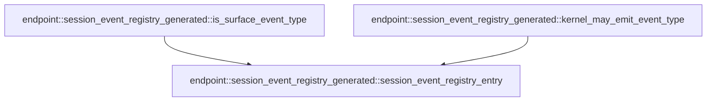

# endpoint::session_event_registry_generated

[Package atlas](index.md) · [Source](../../src/session_event_registry_generated.rs)

## Declarations

Visibility is the declaration spelling; trait members and reexports require their enclosing interface. `cfg` is not evaluated.

| Symbol | Kind | Visibility | Test / cfg |
|---|---|---|---|
| [endpoint::session_event_registry_generated::SessionEventProjectionKind](../../src/session_event_registry_generated.rs#L5) | enum_item | `pub(crate)` |  |
| [endpoint::session_event_registry_generated::SessionEventUiAuthority](../../src/session_event_registry_generated.rs#L13) | enum_item | `pub(crate)` |  |
| [endpoint::session_event_registry_generated::SessionEventProducer](../../src/session_event_registry_generated.rs#L20) | enum_item | `pub(crate)` |  |
| [endpoint::session_event_registry_generated::SessionEventRegistryEntry](../../src/session_event_registry_generated.rs#L27) | struct_item | `pub(crate)` |  |
| [endpoint::session_event_registry_generated::SESSION_EVENT_REGISTRY](../../src/session_event_registry_generated.rs#L35) | const_item | `pub(crate)` |  |
| [endpoint::session_event_registry_generated::session_event_registry_entry](../../src/session_event_registry_generated.rs#L454) | function_item | `pub(crate)` |  |
| [endpoint::session_event_registry_generated::is_surface_event_type](../../src/session_event_registry_generated.rs#L462) | function_item | `pub(crate)` |  |
| [endpoint::session_event_registry_generated::kernel_may_emit_event_type](../../src/session_event_registry_generated.rs#L467) | function_item | `pub(crate)` |  |

## Imports / reexports

| Local name | Source path | Visibility |
|---|---|---|

## Module declarations

| Module | Visibility | Attributes |
|---|---|---|

## Function call graphs

Edges below are syntactically resolved calls only, including private functions. Graphs partition callers into groups of 20; they are not execution order. All unresolved sites are listed below and in the JSON inventory.

Functions 1–3: 2 direct edges

## Call sites

Includes test functions (marked in declarations). Receiver-type-required sites need type analysis/manual tracing. Calls in closures are attributed to their enclosing function; their occurrence here does not mean the closure executes immediately.

| Caller | Callee expression | Source lines | Target / classification |
|---|---|---|---|
| `session_event_registry_entry` | `SESSION_EVENT_REGISTRY         .iter()         .find` | [457](../../src/session_event_registry_generated.rs#L457) | receiver-type-required |
| `session_event_registry_entry` | `SESSION_EVENT_REGISTRY         .iter` | [457](../../src/session_event_registry_generated.rs#L457) | receiver-type-required |
| `is_surface_event_type` | `session_event_registry_entry(event_type)         .is_some_and` | [463](../../src/session_event_registry_generated.rs#L463) | receiver-type-required |
| `is_surface_event_type` | `session_event_registry_entry` | [463](../../src/session_event_registry_generated.rs#L463) | [endpoint::session_event_registry_generated::session_event_registry_entry](../../src/session_event_registry_generated.rs#L454) |
| `kernel_may_emit_event_type` | `session_event_registry_entry(event_type)         .is_some_and` | [468](../../src/session_event_registry_generated.rs#L468) | receiver-type-required |
| `kernel_may_emit_event_type` | `session_event_registry_entry` | [468](../../src/session_event_registry_generated.rs#L468) | [endpoint::session_event_registry_generated::session_event_registry_entry](../../src/session_event_registry_generated.rs#L454) |
| `kernel_may_emit_event_type` | `entry.producers.contains` | [469](../../src/session_event_registry_generated.rs#L469) | receiver-type-required |
