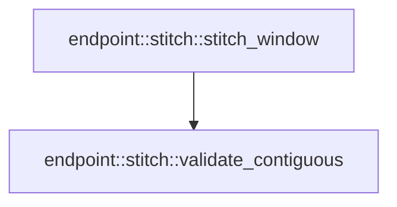

# endpoint::stitch

[Package atlas](index.md) · [Source](../../src/stitch.rs)

## Declarations

Visibility is the declaration spelling; trait members and reexports require their enclosing interface. `cfg` is not evaluated.

| Symbol | Kind | Visibility | Test / cfg |
|---|---|---|---|
| [endpoint::stitch::StitchDecision](../../src/stitch.rs#L8) | enum_item | `pub` |  |
| [endpoint::stitch::stitch_window](../../src/stitch.rs#L13) | function_item | `pub` |  |
| [endpoint::stitch::validate_contiguous](../../src/stitch.rs#L55) | function_item | `private` |  |
| [endpoint::stitch::StitchError](../../src/stitch.rs#L68) | enum_item | `pub` |  |

## Imports / reexports

| Local name | Source path | Visibility |
|---|---|---|
| `BTreeMap` | `std::collections::BTreeMap` | `private` |
| `Error` | `thiserror::Error` | `private` |
| `SessionEvent` | `crate::SessionEvent` | `private` |

## Module declarations

| Module | Visibility | Attributes |
|---|---|---|

## Function call graphs

Edges below are syntactically resolved calls only, including private functions. Graphs partition callers into groups of 20; they are not execution order. All unresolved sites are listed below and in the JSON inventory.

Functions 1–2: 1 direct edges

## Call sites

Includes test functions (marked in declarations). Receiver-type-required sites need type analysis/manual tracing. Calls in closures are attributed to their enclosing function; their occurrence here does not mean the closure executes immediately.

| Caller | Callee expression | Source lines | Target / classification |
|---|---|---|---|
| `stitch_window` | `Err` | [19](../../src/stitch.rs#L19), [39](../../src/stitch.rs#L39) | external-constructor-callback-or-unresolved |
| `stitch_window` | `StitchError::Baseline` | [19](../../src/stitch.rs#L19) | external-constructor-callback-or-unresolved |
| `stitch_window` | `validate_contiguous` | [21](../../src/stitch.rs#L21), [46](../../src/stitch.rs#L46) | [endpoint::stitch::validate_contiguous](../../src/stitch.rs#L55) |
| `stitch_window` | `history.iter().chain` | [22](../../src/stitch.rs#L22) | receiver-type-required |
| `stitch_window` | `history.iter` | [22](../../src/stitch.rs#L22) | receiver-type-required |
| `stitch_window` | `event.validate().map_err` | [23](../../src/stitch.rs#L23) | receiver-type-required |
| `stitch_window` | `event.validate` | [23](../../src/stitch.rs#L23) | receiver-type-required |
| `stitch_window` | `history.last().map` | [25](../../src/stitch.rs#L25) | receiver-type-required |
| `stitch_window` | `history.last` | [25](../../src/stitch.rs#L25) | receiver-type-required |
| `stitch_window` | `history_tail.is_none_or` | [26](../../src/stitch.rs#L26) | receiver-type-required |
| `stitch_window` | `Ok` | [28](../../src/stitch.rs#L28), [47](../../src/stitch.rs#L47), [50](../../src/stitch.rs#L50), [52](../../src/stitch.rs#L52) | external-constructor-callback-or-unresolved |
| `stitch_window` | `history         .into_iter()         .map(&#124;event&#124; (event.seq, event))         .collect::<BTreeMap<_, _>>` | [30](../../src/stitch.rs#L30) | receiver-type-required |
| `stitch_window` | `history         .into_iter()         .map` | [30](../../src/stitch.rs#L30) | receiver-type-required |
| `stitch_window` | `history         .into_iter` | [30](../../src/stitch.rs#L30) | receiver-type-required |
| `stitch_window` | `merged.get` | [35](../../src/stitch.rs#L35) | receiver-type-required |
| `stitch_window` | `existing.canonical_bytes().map_err` | [36](../../src/stitch.rs#L36) | receiver-type-required |
| `stitch_window` | `existing.canonical_bytes` | [36](../../src/stitch.rs#L36) | receiver-type-required |
| `stitch_window` | `event.canonical_bytes().map_err` | [37](../../src/stitch.rs#L37) | receiver-type-required |
| `stitch_window` | `event.canonical_bytes` | [37](../../src/stitch.rs#L37) | receiver-type-required |
| `stitch_window` | `StitchError::OverlapMismatch` | [39](../../src/stitch.rs#L39) | external-constructor-callback-or-unresolved |
| `stitch_window` | `merged.insert` | [42](../../src/stitch.rs#L42) | receiver-type-required |
| `stitch_window` | `merged.into_values().collect::<Vec<_>>` | [45](../../src/stitch.rs#L45) | receiver-type-required |
| `stitch_window` | `merged.into_values` | [45](../../src/stitch.rs#L45) | receiver-type-required |
| `stitch_window` | `validate_contiguous(&events).is_err` | [46](../../src/stitch.rs#L46) | receiver-type-required |
| `stitch_window` | `history_tail.is_none` | [49](../../src/stitch.rs#L49) | receiver-type-required |
| `stitch_window` | `events.first().is_some_and` | [49](../../src/stitch.rs#L49) | receiver-type-required |
| `stitch_window` | `events.first` | [49](../../src/stitch.rs#L49) | receiver-type-required |
| `stitch_window` | `StitchDecision::Installed` | [52](../../src/stitch.rs#L52) | external-constructor-callback-or-unresolved |
| `validate_contiguous` | `events.windows` | [56](../../src/stitch.rs#L56) | receiver-type-required |
| `validate_contiguous` | `Err` | [58](../../src/stitch.rs#L58) | external-constructor-callback-or-unresolved |
| `validate_contiguous` | `Ok` | [64](../../src/stitch.rs#L64) | external-constructor-callback-or-unresolved |
