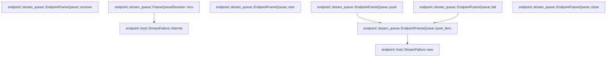

# endpoint::stream_queue

[Package atlas](index.md) · [Source](../../src/stream_queue.rs)

## Declarations

Visibility is the declaration spelling; trait members and reexports require their enclosing interface. `cfg` is not evaluated.

| Symbol | Kind | Visibility | Test / cfg |
|---|---|---|---|
| [endpoint::stream_queue::EndpointFrameQueue](../../src/stream_queue.rs#L16) | struct_item | `pub` |  |
| [endpoint::stream_queue::FrameQueueState](../../src/stream_queue.rs#L20) | struct_item | `private` |  |
| [endpoint::stream_queue::EndpointFrameQueue::new](../../src/stream_queue.rs#L30) | function_item | `pub` |  |
| [endpoint::stream_queue::EndpointFrameQueue::push](../../src/stream_queue.rs#L46) | function_item | `pub` |  |
| [endpoint::stream_queue::EndpointFrameQueue::fail](../../src/stream_queue.rs#L54) | function_item | `pub` |  |
| [endpoint::stream_queue::EndpointFrameQueue::push_item](../../src/stream_queue.rs#L58) | function_item | `private` |  |
| [endpoint::stream_queue::EndpointFrameQueue::close](../../src/stream_queue.rs#L93) | function_item | `pub` |  |
| [endpoint::stream_queue::EndpointFrameQueue::receiver](../../src/stream_queue.rs#L103) | function_item | `pub` |  |
| [endpoint::stream_queue::FrameQueueReceiver](../../src/stream_queue.rs#L110) | struct_item | `private` |  |
| [endpoint::stream_queue::FrameQueueReceiver::recv](../../src/stream_queue.rs#L115) | function_item | `private` |  |
| [endpoint::stream_queue::FrameQueueError](../../src/stream_queue.rs#L146) | enum_item | `pub` |  |

## Imports / reexports

| Local name | Source path | Visibility |
|---|---|---|
| `VecDeque` | `std::collections::VecDeque` | `private` |
| `poll_fn` | `std::future::poll_fn` | `private` |
| `Arc` | `std::sync::Arc` | `private` |
| `Mutex` | `std::sync::Mutex` | `private` |
| `Poll` | `std::task::Poll` | `private` |
| `Waker` | `std::task::Waker` | `private` |
| `Error` | `thiserror::Error` | `private` |
| `CarrierHostFuture` | `crate::CarrierHostFuture` | `private` |
| `EndpointStream` | `crate::EndpointStream` | `private` |
| `EndpointStreamReceiver` | `crate::EndpointStreamReceiver` | `private` |
| `ServerRequest` | `crate::ServerRequest` | `private` |
| `StreamFailure` | `crate::StreamFailure` | `private` |

## Module declarations

| Module | Visibility | Attributes |
|---|---|---|

## Function call graphs

Edges below are syntactically resolved calls only, including private functions. Graphs partition callers into groups of 20; they are not execution order. All unresolved sites are listed below and in the JSON inventory.

Functions 1–7: 4 direct edges

## Call sites

Includes test functions (marked in declarations). Receiver-type-required sites need type analysis/manual tracing. Calls in closures are attributed to their enclosing function; their occurrence here does not mean the closure executes immediately.

| Caller | Callee expression | Source lines | Target / classification |
|---|---|---|---|
| `new` | `Err` | [32](../../src/stream_queue.rs#L32) | external-constructor-callback-or-unresolved |
| `new` | `Ok` | [34](../../src/stream_queue.rs#L34) | external-constructor-callback-or-unresolved |
| `new` | `Arc::new` | [35](../../src/stream_queue.rs#L35) | external-constructor-callback-or-unresolved |
| `new` | `Mutex::new` | [35](../../src/stream_queue.rs#L35) | external-constructor-callback-or-unresolved |
| `new` | `VecDeque::new` | [36](../../src/stream_queue.rs#L36) | external-constructor-callback-or-unresolved |
| `push` | `frame             .canonical_bytes()             .map_err(&#124;error&#124; FrameQueueError::Canonical(error.to_string()))?             .len` | [47](../../src/stream_queue.rs#L47) | receiver-type-required |
| `push` | `frame             .canonical_bytes()             .map_err` | [47](../../src/stream_queue.rs#L47) | receiver-type-required |
| `push` | `frame             .canonical_bytes` | [47](../../src/stream_queue.rs#L47) | receiver-type-required |
| `push` | `FrameQueueError::Canonical` | [49](../../src/stream_queue.rs#L49) | external-constructor-callback-or-unresolved |
| `push` | `error.to_string` | [49](../../src/stream_queue.rs#L49) | receiver-type-required |
| `push` | `self.push_item` | [51](../../src/stream_queue.rs#L51) | [endpoint::stream_queue::EndpointFrameQueue::push_item](../../src/stream_queue.rs#L58) |
| `push` | `Ok` | [51](../../src/stream_queue.rs#L51) | external-constructor-callback-or-unresolved |
| `fail` | `self.push_item` | [55](../../src/stream_queue.rs#L55) | [endpoint::stream_queue::EndpointFrameQueue::push_item](../../src/stream_queue.rs#L58) |
| `fail` | `Err` | [55](../../src/stream_queue.rs#L55) | external-constructor-callback-or-unresolved |
| `push_item` | `self.state.lock().map_err` | [63](../../src/stream_queue.rs#L63) | receiver-type-required |
| `push_item` | `self.state.lock` | [63](../../src/stream_queue.rs#L63) | receiver-type-required |
| `push_item` | `Err` | [65](../../src/stream_queue.rs#L65), [78](../../src/stream_queue.rs#L78), [83](../../src/stream_queue.rs#L83) | external-constructor-callback-or-unresolved |
| `push_item` | `state.frames.len` | [67](../../src/stream_queue.rs#L67) | receiver-type-required |
| `push_item` | `state                 .bytes                 .checked_add(size)                 .is_none_or` | [68](../../src/stream_queue.rs#L68) | receiver-type-required |
| `push_item` | `state                 .bytes                 .checked_add` | [68](../../src/stream_queue.rs#L68) | receiver-type-required |
| `push_item` | `state                 .frames                 .push_back` | [76](../../src/stream_queue.rs#L76) | receiver-type-required |
| `push_item` | `StreamFailure::new` | [78](../../src/stream_queue.rs#L78) | [endpoint::host::StreamFailure::new](../../src/host.rs#L296) |
| `push_item` | `state.waker.take` | [80](../../src/stream_queue.rs#L80), [87](../../src/stream_queue.rs#L87) | receiver-type-required |
| `push_item` | `waker.wake` | [81](../../src/stream_queue.rs#L81), [88](../../src/stream_queue.rs#L88) | receiver-type-required |
| `push_item` | `state.frames.push_back` | [86](../../src/stream_queue.rs#L86) | receiver-type-required |
| `push_item` | `Ok` | [90](../../src/stream_queue.rs#L90) | external-constructor-callback-or-unresolved |
| `close` | `self.state.lock().map_err` | [94](../../src/stream_queue.rs#L94) | receiver-type-required |
| `close` | `self.state.lock` | [94](../../src/stream_queue.rs#L94) | receiver-type-required |
| `close` | `state.waker.take` | [96](../../src/stream_queue.rs#L96) | receiver-type-required |
| `close` | `waker.wake` | [97](../../src/stream_queue.rs#L97) | receiver-type-required |
| `close` | `Ok` | [99](../../src/stream_queue.rs#L99) | external-constructor-callback-or-unresolved |
| `receiver` | `Box::new` | [104](../../src/stream_queue.rs#L104) | external-constructor-callback-or-unresolved |
| `receiver` | `Arc::clone` | [105](../../src/stream_queue.rs#L105) | external-constructor-callback-or-unresolved |
| `recv` | `Arc::clone` | [116](../../src/stream_queue.rs#L116) | external-constructor-callback-or-unresolved |
| `recv` | `Box::pin` | [117](../../src/stream_queue.rs#L117) | external-constructor-callback-or-unresolved |
| `recv` | `poll_fn` | [117](../../src/stream_queue.rs#L117) | external-constructor-callback-or-unresolved |
| `recv` | `state.lock` | [118](../../src/stream_queue.rs#L118) | receiver-type-required |
| `recv` | `Poll::Ready` | [121](../../src/stream_queue.rs#L121), [128](../../src/stream_queue.rs#L128), [131](../../src/stream_queue.rs#L131) | external-constructor-callback-or-unresolved |
| `recv` | `Some` | [121](../../src/stream_queue.rs#L121), [128](../../src/stream_queue.rs#L128), [138](../../src/stream_queue.rs#L138) | external-constructor-callback-or-unresolved |
| `recv` | `Err` | [121](../../src/stream_queue.rs#L121) | external-constructor-callback-or-unresolved |
| `recv` | `StreamFailure::internal` | [121](../../src/stream_queue.rs#L121) | [endpoint::host::StreamFailure::internal](../../src/host.rs#L304) |
| `recv` | `"endpoint frame queue mutex was poisoned".to_owned` | [122](../../src/stream_queue.rs#L122) | receiver-type-required |
| `recv` | `state.frames.pop_front` | [126](../../src/stream_queue.rs#L126) | receiver-type-required |
| `recv` | `state                 .waker                 .as_ref()                 .is_none_or` | [133](../../src/stream_queue.rs#L133) | receiver-type-required |
| `recv` | `state                 .waker                 .as_ref` | [133](../../src/stream_queue.rs#L133) | receiver-type-required |
| `recv` | `waker.will_wake` | [136](../../src/stream_queue.rs#L136) | receiver-type-required |
| `recv` | `context.waker` | [136](../../src/stream_queue.rs#L136), [138](../../src/stream_queue.rs#L138) | receiver-type-required |
| `recv` | `context.waker().clone` | [138](../../src/stream_queue.rs#L138) | receiver-type-required |
