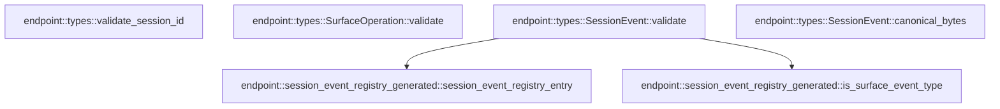

# endpoint::types

[Package atlas](index.md) · [Source](../../src/types.rs)

## Declarations

Visibility is the declaration spelling; trait members and reexports require their enclosing interface. `cfg` is not evaluated.

| Symbol | Kind | Visibility | Test / cfg |
|---|---|---|---|
| [endpoint::types::MAX_SAFE_SEQUENCE](../../src/types.rs#L9) | const_item | `pub` |  |
| [endpoint::types::SurfaceOperation](../../src/types.rs#L13) | enum_item | `pub` |  |
| [endpoint::types::SurfaceOperation::validate](../../src/types.rs#L19) | function_item | `pub` |  |
| [endpoint::types::SessionEvent](../../src/types.rs#L31) | struct_item | `pub` |  |
| [endpoint::types::SessionEvent::validate](../../src/types.rs#L46) | function_item | `pub` |  |
| [endpoint::types::SessionEvent::canonical_bytes](../../src/types.rs#L84) | function_item | `pub` |  |
| [endpoint::types::SessionToolEventView](../../src/types.rs#L92) | struct_item | `pub` |  |
| [endpoint::types::SessionHistoryEntry](../../src/types.rs#L100) | struct_item | `pub` |  |
| [endpoint::types::EndpointTypeError](../../src/types.rs#L107) | enum_item | `pub` |  |
| [endpoint::types::validate_session_id](../../src/types.rs#L130) | function_item | `pub` |  |
| [endpoint::types::tests::dsh_state_only_events_are_required_contract_members](../../src/types.rs#L143) | function_item | `private` | test; #[cfg(test)] |

## Imports / reexports

| Local name | Source path | Visibility |
|---|---|---|
| `IJsonValue` | `schema::IJsonValue` | `private` |
| `Deserialize` | `serde::Deserialize` | `private` |
| `Serialize` | `serde::Serialize` | `private` |
| `Error` | `thiserror::Error` | `private` |
| `is_surface_event_type` | `crate::session_event_registry_generated::is_surface_event_type` | `private` |
| `session_event_registry_entry` | `crate::session_event_registry_generated::session_event_registry_entry` | `private` |
| `*` | `super::*` | `private` |

## Module declarations

| Module | Visibility | Attributes |
|---|---|---|
| `endpoint::types::tests` | `private` | #[cfg(test)] |

## Function call graphs

Edges below are syntactically resolved calls only, including private functions. Graphs partition callers into groups of 20; they are not execution order. All unresolved sites are listed below and in the JSON inventory.

Functions 1–4: 2 direct edges

## Call sites

Includes test functions (marked in declarations). Receiver-type-required sites need type analysis/manual tracing. Calls in closures are attributed to their enclosing function; their occurrence here does not mean the closure executes immediately.

| Caller | Callee expression | Source lines | Target / classification |
|---|---|---|---|
| `validate` | `Ok` | [21](../../src/types.rs#L21), [23](../../src/types.rs#L23) | external-constructor-callback-or-unresolved |
| `validate` | `Err` | [22](../../src/types.rs#L22), [24](../../src/types.rs#L24) | external-constructor-callback-or-unresolved |
| `validate` | `EndpointTypeError::SurfaceOperation` | [22](../../src/types.rs#L22), [24](../../src/types.rs#L24) | external-constructor-callback-or-unresolved |
| `validate` | `value.clone` | [22](../../src/types.rs#L22) | receiver-type-required |
| `validate` | `op.clone` | [24](../../src/types.rs#L24) | receiver-type-required |
| `validate` | `Err` | [48](../../src/types.rs#L48), [55](../../src/types.rs#L55), [58](../../src/types.rs#L58), [62](../../src/types.rs#L62), [66](../../src/types.rs#L66), [71](../../src/types.rs#L71), [77](../../src/types.rs#L77) | external-constructor-callback-or-unresolved |
| `validate` | `EndpointTypeError::Sequence` | [48](../../src/types.rs#L48) | external-constructor-callback-or-unresolved |
| `validate` | `self.time.is_finite` | [50](../../src/types.rs#L50) | receiver-type-required |
| `validate` | `self.time.fract` | [52](../../src/types.rs#L52) | receiver-type-required |
| `validate` | `Some` | [57](../../src/types.rs#L57), [60](../../src/types.rs#L60), [79](../../src/types.rs#L79) | external-constructor-callback-or-unresolved |
| `validate` | `session_event_registry_entry(&self.event_type).is_none` | [60](../../src/types.rs#L60) | receiver-type-required |
| `validate` | `session_event_registry_entry` | [60](../../src/types.rs#L60) | [endpoint::session_event_registry_generated::session_event_registry_entry](../../src/session_event_registry_generated.rs#L422) |
| `validate` | `EndpointTypeError::UnknownRequired` | [62](../../src/types.rs#L62) | external-constructor-callback-or-unresolved |
| `validate` | `self.event_type.clone` | [62](../../src/types.rs#L62), [66](../../src/types.rs#L66) | receiver-type-required |
| `validate` | `is_surface_event_type` | [64](../../src/types.rs#L64) | [endpoint::session_event_registry_generated::is_surface_event_type](../../src/session_event_registry_generated.rs#L430) |
| `validate` | `self.source_event_seqs.is_some` | [65](../../src/types.rs#L65) | receiver-type-required |
| `validate` | `self.surface_op.is_some` | [65](../../src/types.rs#L65) | receiver-type-required |
| `validate` | `EndpointTypeError::SurfaceMetadata` | [66](../../src/types.rs#L66) | external-constructor-callback-or-unresolved |
| `validate` | `operation.validate` | [69](../../src/types.rs#L69) | receiver-type-required |
| `validate` | `EndpointTypeError::SurfaceRange` | [71](../../src/types.rs#L71) | external-constructor-callback-or-unresolved |
| `validate` | `self.source_event_seqs.as_deref().unwrap_or_default` | [75](../../src/types.rs#L75) | receiver-type-required |
| `validate` | `self.source_event_seqs.as_deref` | [75](../../src/types.rs#L75) | receiver-type-required |
| `validate` | `previous.is_some_and` | [76](../../src/types.rs#L76) | receiver-type-required |
| `validate` | `EndpointTypeError::SourceSequence` | [77](../../src/types.rs#L77) | external-constructor-callback-or-unresolved |
| `validate` | `Ok` | [81](../../src/types.rs#L81) | external-constructor-callback-or-unresolved |
| `canonical_bytes` | `serde_json_canonicalizer::to_vec(self)             .map_err` | [85](../../src/types.rs#L85) | receiver-type-required |
| `canonical_bytes` | `serde_json_canonicalizer::to_vec` | [85](../../src/types.rs#L85) | external-constructor-callback-or-unresolved |
| `canonical_bytes` | `EndpointTypeError::Canonical` | [86](../../src/types.rs#L86) | external-constructor-callback-or-unresolved |
| `canonical_bytes` | `error.to_string` | [86](../../src/types.rs#L86) | receiver-type-required |
| `validate_session_id` | `uuid::Uuid::parse_str(value).map_err` | [131](../../src/types.rs#L131) | receiver-type-required |
| `validate_session_id` | `uuid::Uuid::parse_str` | [131](../../src/types.rs#L131) | external-constructor-callback-or-unresolved |
| `validate_session_id` | `uuid.hyphenated().to_string` | [132](../../src/types.rs#L132) | receiver-type-required |
| `validate_session_id` | `uuid.hyphenated` | [132](../../src/types.rs#L132) | receiver-type-required |
| `validate_session_id` | `value.to_ascii_lowercase` | [132](../../src/types.rs#L132) | receiver-type-required |
| `validate_session_id` | `Err` | [133](../../src/types.rs#L133) | external-constructor-callback-or-unresolved |
| `validate_session_id` | `Ok` | [135](../../src/types.rs#L135) | external-constructor-callback-or-unresolved |
| `dsh_state_only_events_are_required_contract_members` | `[             "model/selection",             "session-log-deepseek/delivery-accepted",             "subagent/model-selection-policy",         ]         .into_iter()         .enumerate` | [144](../../src/types.rs#L144) | receiver-type-required |
| `dsh_state_only_events_are_required_contract_members` | `[             "model/selection",             "session-log-deepseek/delivery-accepted",             "subagent/model-selection-policy",         ]         .into_iter` | [144](../../src/types.rs#L144) | receiver-type-required |
| `dsh_state_only_events_are_required_contract_members` | `SessionEvent {                 event_type: event_type.to_owned(),                 seq: seq as u64,                 time: 1.0,                 data: IJsonValue::parse_str("{}").expect("data"),                 ignorable: None,                 source_event_seqs: None,                 surface_op: None,             }             .validate()             .expect` | [152](../../src/types.rs#L152) | receiver-type-required |
| `dsh_state_only_events_are_required_contract_members` | `SessionEvent {                 event_type: event_type.to_owned(),                 seq: seq as u64,                 time: 1.0,                 data: IJsonValue::parse_str("{}").expect("data"),                 ignorable: None,                 source_event_seqs: None,                 surface_op: None,             }             .validate` | [152](../../src/types.rs#L152) | receiver-type-required |
| `dsh_state_only_events_are_required_contract_members` | `event_type.to_owned` | [153](../../src/types.rs#L153) | receiver-type-required |
| `dsh_state_only_events_are_required_contract_members` | `IJsonValue::parse_str("{}").expect` | [156](../../src/types.rs#L156) | receiver-type-required |
| `dsh_state_only_events_are_required_contract_members` | `IJsonValue::parse_str` | [156](../../src/types.rs#L156) | external-constructor-callback-or-unresolved |
