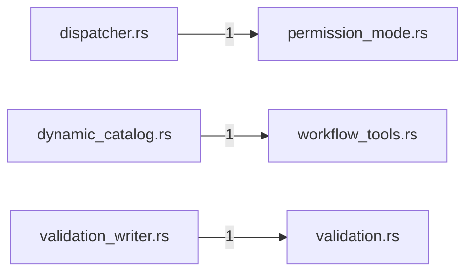

# engine — generated atlas

[All packages](../../../../docs/architecture/generated/index.md) · [Maintained explanation](../README.md)

## Cargo targets

| Target | Kind | Entry |
|---|---|---|
| `engine` | lib | [crates/engine/src/lib.rs](../../src/lib.rs) |
| `slice14e_web` | test | [crates/engine/tests/slice14e_web.rs](../../tests/slice14e_web.rs) |
| `slice8_dispatcher` | test | [crates/engine/tests/slice8_dispatcher.rs](../../tests/slice8_dispatcher.rs) |
| `slice8_dynamic_catalog` | test | [crates/engine/tests/slice8_dynamic_catalog.rs](../../tests/slice8_dynamic_catalog.rs) |
| `slice8_supervisor_backend` | test | [crates/engine/tests/slice8_supervisor_backend.rs](../../tests/slice8_supervisor_backend.rs) |
| `slice8_system_tools` | test | [crates/engine/tests/slice8_system_tools.rs](../../tests/slice8_system_tools.rs) |
| `slice8_workflow` | test | [crates/engine/tests/slice8_workflow.rs](../../tests/slice8_workflow.rs) |

## Direct workspace dependencies

| Dependency | Kind | Target cfg |
|---|---|---|
| `profile` | normal | all |
| `schema` | normal | all |
| `store` | normal | all |
| `tools` | normal | all |
| `worker-control` | normal | all |
| `mcp` | dev | all |

[Public/restricted API and direct callers](api.md)

## Source files / lexical modules

`src` files have full symbol/call tables and partitioned function graphs. Integration tests and examples remain in the JSON inventory.
File-derived paths below are lexical navigation, not a compiler-resolved module tree; inline module declarations are listed separately.

| File | Symbols | Call sites | Detail |
|---|---:|---:|---|
| [crates/engine/src/admission.rs](../../src/admission.rs) | 10 | 21 | [Symbols and calls](src--admission.md) |
| [crates/engine/src/brief_contract.rs](../../src/brief_contract.rs) | 9 | 58 | [Symbols and calls](src--brief_contract.md) |
| [crates/engine/src/compact_gate.rs](../../src/compact_gate.rs) | 10 | 65 | [Symbols and calls](src--compact_gate.md) |
| [crates/engine/src/compaction_summary.rs](../../src/compaction_summary.rs) | 19 | 145 | [Symbols and calls](src--compaction_summary.md) |
| [crates/engine/src/context.rs](../../src/context.rs) | 34 | 418 | [Symbols and calls](src--context.md) |
| [crates/engine/src/delivery.rs](../../src/delivery.rs) | 9 | 18 | [Symbols and calls](src--delivery.md) |
| [crates/engine/src/dispatcher.rs](../../src/dispatcher.rs) | 30 | 110 | [Symbols and calls](src--dispatcher.md) |
| [crates/engine/src/dynamic_catalog.rs](../../src/dynamic_catalog.rs) | 28 | 222 | [Symbols and calls](src--dynamic_catalog.md) |
| [crates/engine/src/lib.rs](../../src/lib.rs) | 0 | 0 | [Symbols and calls](src--lib.md) |
| [crates/engine/src/lifecycle.rs](../../src/lifecycle.rs) | 17 | 16 | [Symbols and calls](src--lifecycle.md) |
| [crates/engine/src/permission_mode.rs](../../src/permission_mode.rs) | 15 | 62 | [Symbols and calls](src--permission_mode.md) |
| [crates/engine/src/provider.rs](../../src/provider.rs) | 8 | 0 | [Symbols and calls](src--provider.md) |
| [crates/engine/src/seams.rs](../../src/seams.rs) | 41 | 59 | [Symbols and calls](src--seams.md) |
| [crates/engine/src/stop.rs](../../src/stop.rs) | 10 | 36 | [Symbols and calls](src--stop.md) |
| [crates/engine/src/supervisor.rs](../../src/supervisor.rs) | 6 | 7 | [Symbols and calls](src--supervisor.md) |
| [crates/engine/src/supervisor_tools.rs](../../src/supervisor_tools.rs) | 6 | 20 | [Symbols and calls](src--supervisor_tools.md) |
| [crates/engine/src/system_tools.rs](../../src/system_tools.rs) | 86 | 859 | [Symbols and calls](src--system_tools.md) |
| [crates/engine/src/tool.rs](../../src/tool.rs) | 1 | 2 | [Symbols and calls](src--tool.md) |
| [crates/engine/src/transactions.rs](../../src/transactions.rs) | 21 | 33 | [Symbols and calls](src--transactions.md) |
| [crates/engine/src/validation.rs](../../src/validation.rs) | 15 | 16 | [Symbols and calls](src--validation.md) |
| [crates/engine/src/validation_writer.rs](../../src/validation_writer.rs) | 6 | 260 | [Symbols and calls](src--validation_writer.md) |
| [crates/engine/src/workflow_tools.rs](../../src/workflow_tools.rs) | 26 | 286 | [Symbols and calls](src--workflow_tools.md) |
| [crates/engine/tests/slice14e_web.rs](../../tests/slice14e_web.rs) | 1 | 6 | `inventory.json` |
| [crates/engine/tests/slice8_dispatcher.rs](../../tests/slice8_dispatcher.rs) | 25 | 318 | `inventory.json` |
| [crates/engine/tests/slice8_dynamic_catalog.rs](../../tests/slice8_dynamic_catalog.rs) | 25 | 252 | `inventory.json` |
| [crates/engine/tests/slice8_supervisor_backend.rs](../../tests/slice8_supervisor_backend.rs) | 3 | 24 | `inventory.json` |
| [crates/engine/tests/slice8_system_tools.rs](../../tests/slice8_system_tools.rs) | 33 | 363 | `inventory.json` |
| [crates/engine/tests/slice8_workflow.rs](../../tests/slice8_workflow.rs) | 7 | 68 | `inventory.json` |

## Cross-file direct calls

Source files stand in for out-of-line modules; see declarations for inline modules. Counts are syntactic call sites, not runtime frequency.

