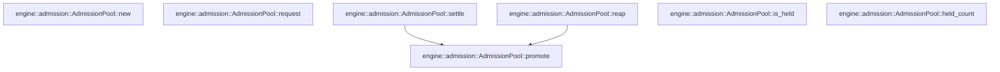

# engine::admission

[Package atlas](index.md) · [Source](../../src/admission.rs)

## Declarations

Visibility is the declaration spelling; trait members and reexports require their enclosing interface. `cfg` is not evaluated.

| Symbol | Kind | Visibility | Test / cfg |
|---|---|---|---|
| [engine::admission::AdmissionLease](../../src/admission.rs#L4) | struct_item | `pub` |  |
| [engine::admission::LeaseRelease](../../src/admission.rs#L10) | enum_item | `pub` |  |
| [engine::admission::AdmissionPool](../../src/admission.rs#L16) | struct_item | `pub` |  |
| [engine::admission::AdmissionPool::new](../../src/admission.rs#L24) | function_item | `pub` |  |
| [engine::admission::AdmissionPool::request](../../src/admission.rs#L32) | function_item | `pub` |  |
| [engine::admission::AdmissionPool::settle](../../src/admission.rs#L47) | function_item | `pub` |  |
| [engine::admission::AdmissionPool::reap](../../src/admission.rs#L55) | function_item | `pub` |  |
| [engine::admission::AdmissionPool::is_held](../../src/admission.rs#L63) | function_item | `pub` |  |
| [engine::admission::AdmissionPool::held_count](../../src/admission.rs#L68) | function_item | `pub` |  |
| [engine::admission::AdmissionPool::promote](../../src/admission.rs#L72) | function_item | `private` |  |

## Imports / reexports

| Local name | Source path | Visibility |
|---|---|---|
| `HashMap` | `std::collections::HashMap` | `private` |
| `VecDeque` | `std::collections::VecDeque` | `private` |

## Module declarations

| Module | Visibility | Attributes |
|---|---|---|

## Function call graphs

Edges below are syntactically resolved calls only, including private functions. Graphs partition callers into groups of 20; they are not execution order. All unresolved sites are listed below and in the JSON inventory.

Functions 1–7: 2 direct edges

## Call sites

Includes test functions (marked in declarations). Receiver-type-required sites need type analysis/manual tracing. Calls in closures are attributed to their enclosing function; their occurrence here does not mean the closure executes immediately.

| Caller | Callee expression | Source lines | Target / classification |
|---|---|---|---|
| `new` | `HashMap::new` | [27](../../src/admission.rs#L27) | external-constructor-callback-or-unresolved |
| `new` | `VecDeque::new` | [28](../../src/admission.rs#L28) | external-constructor-callback-or-unresolved |
| `request` | `self.held.contains_key` | [33](../../src/admission.rs#L33), [36](../../src/admission.rs#L36) | receiver-type-required |
| `request` | `self.queued.iter().any` | [34](../../src/admission.rs#L34) | receiver-type-required |
| `request` | `self.queued.iter` | [34](../../src/admission.rs#L34) | receiver-type-required |
| `request` | `self.held.len` | [38](../../src/admission.rs#L38) | receiver-type-required |
| `request` | `self.held.insert` | [39](../../src/admission.rs#L39) | receiver-type-required |
| `request` | `lease.attempt.clone` | [39](../../src/admission.rs#L39) | receiver-type-required |
| `request` | `self.queued.push_back` | [42](../../src/admission.rs#L42) | receiver-type-required |
| `settle` | `self.held.remove(attempt).is_none` | [48](../../src/admission.rs#L48) | receiver-type-required |
| `settle` | `self.held.remove` | [48](../../src/admission.rs#L48) | receiver-type-required |
| `settle` | `self.promote` | [51](../../src/admission.rs#L51) | [engine::admission::AdmissionPool::promote](../../src/admission.rs#L72) |
| `reap` | `self.held.remove` | [57](../../src/admission.rs#L57) | receiver-type-required |
| `reap` | `self.promote` | [59](../../src/admission.rs#L59) | [engine::admission::AdmissionPool::promote](../../src/admission.rs#L72) |
| `is_held` | `self.held.contains_key` | [64](../../src/admission.rs#L64) | receiver-type-required |
| `held_count` | `self.held.len` | [69](../../src/admission.rs#L69) | receiver-type-required |
| `promote` | `self.held.len` | [73](../../src/admission.rs#L73) | receiver-type-required |
| `promote` | `self.queued.pop_front` | [74](../../src/admission.rs#L74) | receiver-type-required |
| `promote` | `self.held.insert` | [77](../../src/admission.rs#L77) | receiver-type-required |
| `promote` | `next.attempt.clone` | [77](../../src/admission.rs#L77) | receiver-type-required |
