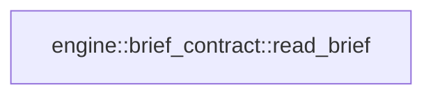

# engine::brief_contract

[Package atlas](index.md) · [Source](../../src/brief_contract.rs)

## Declarations

Visibility is the declaration spelling; trait members and reexports require their enclosing interface. `cfg` is not evaluated.

| Symbol | Kind | Visibility | Test / cfg |
|---|---|---|---|
| [engine::brief_contract::BriefAtomKind](../../src/brief_contract.rs#L12) | enum_item | `pub` |  |
| [engine::brief_contract::BriefAtom](../../src/brief_contract.rs#L19) | struct_item | `pub` |  |
| [engine::brief_contract::BriefContract](../../src/brief_contract.rs#L27) | struct_item | `pub` |  |
| [engine::brief_contract::Wire](../../src/brief_contract.rs#L35) | struct_item | `private` |  |
| [engine::brief_contract::IdList](../../src/brief_contract.rs#L42) | struct_item | `private` |  |
| [engine::brief_contract::read_brief](../../src/brief_contract.rs#L48) | function_item | `pub` |  |
| [engine::brief_contract::tests::brief](../../src/brief_contract.rs#L119) | function_item | `private` | test; #[cfg(test)] |
| [engine::brief_contract::tests::effective_completion_is_the_goal_minus_facts_when_explicit_is_empty](../../src/brief_contract.rs#L132) | function_item | `private` | test; #[cfg(test)] |
| [engine::brief_contract::tests::cross_references_are_checked](../../src/brief_contract.rs#L141) | function_item | `private` | test; #[cfg(test)] |

## Imports / reexports

| Local name | Source path | Visibility |
|---|---|---|
| `Deserialize` | `serde::Deserialize` | `private` |
| `Serialize` | `serde::Serialize` | `private` |
| `Value` | `serde_json::Value` | `private` |
| `BTreeSet` | `std::collections::BTreeSet` | `private` |
| `*` | `super::*` | `private` |
| `json` | `serde_json::json` | `private` |

## Module declarations

| Module | Visibility | Attributes |
|---|---|---|
| `engine::brief_contract::tests` | `private` | #[cfg(test)] |

## Function call graphs

Edges below are syntactically resolved calls only, including private functions. Graphs partition callers into groups of 20; they are not execution order. All unresolved sites are listed below and in the JSON inventory.

Functions 1–1: 0 direct edges

## Call sites

Includes test functions (marked in declarations). Receiver-type-required sites need type analysis/manual tracing. Calls in closures are attributed to their enclosing function; their occurrence here does not mean the closure executes immediately.

| Caller | Callee expression | Source lines | Target / classification |
|---|---|---|---|
| `read_brief` | `serde_json::from_value(arguments.clone())         .map_err` | [49](../../src/brief_contract.rs#L49) | receiver-type-required |
| `read_brief` | `serde_json::from_value` | [49](../../src/brief_contract.rs#L49) | external-constructor-callback-or-unresolved |
| `read_brief` | `arguments.clone` | [49](../../src/brief_contract.rs#L49) | receiver-type-required |
| `read_brief` | `wire.atoms.is_empty` | [51](../../src/brief_contract.rs#L51) | receiver-type-required |
| `read_brief` | `Err` | [52](../../src/brief_contract.rs#L52), [57](../../src/brief_contract.rs#L57), [60](../../src/brief_contract.rs#L60), [63](../../src/brief_contract.rs#L63), [67](../../src/brief_contract.rs#L67), [79](../../src/brief_contract.rs#L79), [82](../../src/brief_contract.rs#L82), [90](../../src/brief_contract.rs#L90) | external-constructor-callback-or-unresolved |
| `read_brief` | `"brief needs at least one atom".to_owned` | [52](../../src/brief_contract.rs#L52) | receiver-type-required |
| `read_brief` | `BTreeSet::new` | [54](../../src/brief_contract.rs#L54), [76](../../src/brief_contract.rs#L76) | external-constructor-callback-or-unresolved |
| `read_brief` | `atom.id.trim().is_empty` | [56](../../src/brief_contract.rs#L56) | receiver-type-required |
| `read_brief` | `atom.id.trim` | [56](../../src/brief_contract.rs#L56) | receiver-type-required |
| `read_brief` | `atom.text.trim().is_empty` | [56](../../src/brief_contract.rs#L56) | receiver-type-required |
| `read_brief` | `atom.text.trim` | [56](../../src/brief_contract.rs#L56) | receiver-type-required |
| `read_brief` | `"brief atoms need a non-empty id and text".to_owned` | [57](../../src/brief_contract.rs#L57) | receiver-type-required |
| `read_brief` | `ids.insert` | [59](../../src/brief_contract.rs#L59) | receiver-type-required |
| `read_brief` | `atom.id.as_str` | [59](../../src/brief_contract.rs#L59) | receiver-type-required |
| `read_brief` | `atom.source_refs.is_empty` | [62](../../src/brief_contract.rs#L62) | receiver-type-required |
| `read_brief` | `valid_aliases.iter().any` | [66](../../src/brief_contract.rs#L66) | receiver-type-required |
| `read_brief` | `valid_aliases.iter` | [66](../../src/brief_contract.rs#L66) | receiver-type-required |
| `read_brief` | `ids.contains` | [78](../../src/brief_contract.rs#L78) | receiver-type-required |
| `read_brief` | `id.as_str` | [78](../../src/brief_contract.rs#L78), [81](../../src/brief_contract.rs#L81) | receiver-type-required |
| `read_brief` | `seen.insert` | [81](../../src/brief_contract.rs#L81) | receiver-type-required |
| `read_brief` | `Ok` | [85](../../src/brief_contract.rs#L85), [106](../../src/brief_contract.rs#L106) | external-constructor-callback-or-unresolved |
| `read_brief` | `defined` | [87](../../src/brief_contract.rs#L87), [88](../../src/brief_contract.rs#L88) | external-constructor-callback-or-unresolved |
| `read_brief` | `wire.goal.atom_ids.is_empty` | [89](../../src/brief_contract.rs#L89) | receiver-type-required |
| `read_brief` | `"brief goal references no atom".to_owned` | [90](../../src/brief_contract.rs#L90) | receiver-type-required |
| `read_brief` | `wire.completion.atom_ids.is_empty` | [92](../../src/brief_contract.rs#L92) | receiver-type-required |
| `read_brief` | `wire.goal             .atom_ids             .iter()             .filter(&#124;id&#124; {                 wire.atoms                     .iter()                     .any(&#124;atom&#124; &atom.id == *id && atom.kind != BriefAtomKind::Fact)             })             .cloned()             .collect` | [93](../../src/brief_contract.rs#L93) | receiver-type-required |
| `read_brief` | `wire.goal             .atom_ids             .iter()             .filter(&#124;id&#124; {                 wire.atoms                     .iter()                     .any(&#124;atom&#124; &atom.id == *id && atom.kind != BriefAtomKind::Fact)             })             .cloned` | [93](../../src/brief_contract.rs#L93) | receiver-type-required |
| `read_brief` | `wire.goal             .atom_ids             .iter()             .filter` | [93](../../src/brief_contract.rs#L93) | receiver-type-required |
| `read_brief` | `wire.goal             .atom_ids             .iter` | [93](../../src/brief_contract.rs#L93) | receiver-type-required |
| `read_brief` | `wire.atoms                     .iter()                     .any` | [97](../../src/brief_contract.rs#L97) | receiver-type-required |
| `read_brief` | `wire.atoms                     .iter` | [97](../../src/brief_contract.rs#L97) | receiver-type-required |
| `read_brief` | `wire.completion.atom_ids.clone` | [104](../../src/brief_contract.rs#L104) | receiver-type-required |
| `effective_completion_is_the_goal_minus_facts_when_explicit_is_empty` | `read_brief(&brief(vec![]), &["s1".into(), "s2".into()]).expect` | [133](../../src/brief_contract.rs#L133) | receiver-type-required |
| `effective_completion_is_the_goal_minus_facts_when_explicit_is_empty` | `read_brief` | [133](../../src/brief_contract.rs#L133), [136](../../src/brief_contract.rs#L136) | external-constructor-callback-or-unresolved |
| `effective_completion_is_the_goal_minus_facts_when_explicit_is_empty` | `brief` | [133](../../src/brief_contract.rs#L133), [136](../../src/brief_contract.rs#L136) | [engine::brief_contract::tests::brief](../../src/brief_contract.rs#L119) |
| `effective_completion_is_the_goal_minus_facts_when_explicit_is_empty` | `"s1".into` | [133](../../src/brief_contract.rs#L133), [136](../../src/brief_contract.rs#L136) | receiver-type-required |
| `effective_completion_is_the_goal_minus_facts_when_explicit_is_empty` | `"s2".into` | [133](../../src/brief_contract.rs#L133), [136](../../src/brief_contract.rs#L136) | receiver-type-required |
| `effective_completion_is_the_goal_minus_facts_when_explicit_is_empty` | `read_brief(&brief(vec!["a1"]), &["s1".into(), "s2".into()]).expect` | [136](../../src/brief_contract.rs#L136) | receiver-type-required |
| `cross_references_are_checked` | `"s1".to_owned` | [142](../../src/brief_contract.rs#L142) | receiver-type-required |
| `cross_references_are_checked` | `"s2".to_owned` | [142](../../src/brief_contract.rs#L142) | receiver-type-required |
| `cross_references_are_checked` | `brief` | [143](../../src/brief_contract.rs#L143), [150](../../src/brief_contract.rs#L150), [157](../../src/brief_contract.rs#L157) | [engine::brief_contract::tests::brief](../../src/brief_contract.rs#L119) |
