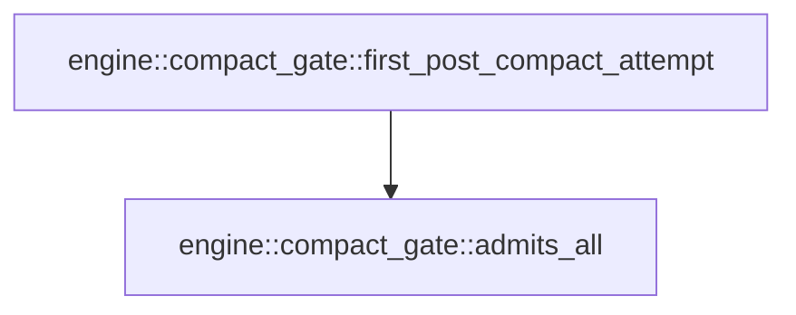

# engine::compact_gate

[Package atlas](index.md) · [Source](../../src/compact_gate.rs)

## Declarations

Visibility is the declaration spelling; trait members and reexports require their enclosing interface. `cfg` is not evaluated.

| Symbol | Kind | Visibility | Test / cfg |
|---|---|---|---|
| [engine::compact_gate::first_post_compact_attempt](../../src/compact_gate.rs#L20) | function_item | `pub` |  |
| [engine::compact_gate::admits_all](../../src/compact_gate.rs#L45) | function_item | `private` |  |
| [engine::compact_gate::tests::event](../../src/compact_gate.rs#L74) | function_item | `private` | test; #[cfg(test)] |
| [engine::compact_gate::tests::epoch](../../src/compact_gate.rs#L78) | function_item | `private` | test; #[cfg(test)] |
| [engine::compact_gate::tests::attempt](../../src/compact_gate.rs#L83) | function_item | `private` | test; #[cfg(test)] |
| [engine::compact_gate::tests::ORIGIN](../../src/compact_gate.rs#L88) | const_item | `private` | test; #[cfg(test)] |
| [engine::compact_gate::tests::chain](../../src/compact_gate.rs#L90) | function_item | `private` | test; #[cfg(test)] |
| [engine::compact_gate::tests::first_frame_of_the_compaction_generation_admitting_the_post_input_passes](../../src/compact_gate.rs#L110) | function_item | `private` | test; #[cfg(test)] |
| [engine::compact_gate::tests::absent_originated_compact_request_never_passes](../../src/compact_gate.rs#L115) | function_item | `private` | test; #[cfg(test)] |
| [engine::compact_gate::tests::frame_bound_to_the_pre_compact_epoch_is_stale](../../src/compact_gate.rs#L131) | function_item | `private` | test; #[cfg(test)] |

## Imports / reexports

| Local name | Source path | Visibility |
|---|---|---|
| `Event` | `schema::Event` | `private` |
| `EventKind` | `schema::EventKind` | `private` |
| `Value` | `serde_json::Value` | `private` |
| `first_post_compact_attempt` | `super::first_post_compact_attempt` | `private` |
| `Event` | `schema::Event` | `private` |
| `IJsonValue` | `schema::IJsonValue` | `private` |
| `Value` | `serde_json::Value` | `private` |
| `json` | `serde_json::json` | `private` |

## Module declarations

| Module | Visibility | Attributes |
|---|---|---|
| `engine::compact_gate::tests` | `private` | #[cfg(test)] |

## Function call graphs

Edges below are syntactically resolved calls only, including private functions. Graphs partition callers into groups of 20; they are not execution order. All unresolved sites are listed below and in the JSON inventory.

Functions 1–2: 1 direct edges

## Call sites

Includes test functions (marked in declarations). Receiver-type-required sites need type analysis/manual tracing. Calls in closures are attributed to their enclosing function; their occurrence here does not mean the closure executes immediately.

| Caller | Callee expression | Source lines | Target / classification |
|---|---|---|---|
| `first_post_compact_attempt` | `events.iter().find` | [25](../../src/compact_gate.rs#L25), [28](../../src/compact_gate.rs#L28) | receiver-type-required |
| `first_post_compact_attempt` | `events.iter` | [25](../../src/compact_gate.rs#L25), [28](../../src/compact_gate.rs#L28) | receiver-type-required |
| `first_post_compact_attempt` | `event.kind` | [26](../../src/compact_gate.rs#L26), [30](../../src/compact_gate.rs#L30), [38](../../src/compact_gate.rs#L38) | receiver-type-required |
| `first_post_compact_attempt` | `event.string_field` | [26](../../src/compact_gate.rs#L26), [31](../../src/compact_gate.rs#L31), [39](../../src/compact_gate.rs#L39) | receiver-type-required |
| `first_post_compact_attempt` | `Some` | [26](../../src/compact_gate.rs#L26), [31](../../src/compact_gate.rs#L31), [39](../../src/compact_gate.rs#L39) | external-constructor-callback-or-unresolved |
| `first_post_compact_attempt` | `event.seq` | [29](../../src/compact_gate.rs#L29), [37](../../src/compact_gate.rs#L37) | receiver-type-required |
| `first_post_compact_attempt` | `compact.seq` | [29](../../src/compact_gate.rs#L29) | receiver-type-required |
| `first_post_compact_attempt` | `epoch.string_field` | [33](../../src/compact_gate.rs#L33) | receiver-type-required |
| `first_post_compact_attempt` | `events         .iter()         .find(&#124;event&#124; {             event.seq() > epoch.seq()                 && *event.kind() == EventKind::Attempt                 && event.string_field("epoch") == Some(epoch_id)                 && admits_all(event, post_inputs)         })         .map` | [34](../../src/compact_gate.rs#L34) | receiver-type-required |
| `first_post_compact_attempt` | `events         .iter()         .find` | [34](../../src/compact_gate.rs#L34) | receiver-type-required |
| `first_post_compact_attempt` | `events         .iter` | [34](../../src/compact_gate.rs#L34) | receiver-type-required |
| `first_post_compact_attempt` | `epoch.seq` | [37](../../src/compact_gate.rs#L37) | receiver-type-required |
| `first_post_compact_attempt` | `admits_all` | [40](../../src/compact_gate.rs#L40) | [engine::compact_gate::admits_all](../../src/compact_gate.rs#L45) |
| `admits_all` | `serde_json::to_value` | [46](../../src/compact_gate.rs#L46) | external-constructor-callback-or-unresolved |
| `admits_all` | `attempt.raw` | [46](../../src/compact_gate.rs#L46) | receiver-type-required |
| `admits_all` | `raw         .get("admits")         .and_then(Value::as_array)         .cloned()         .unwrap_or_default` | [49](../../src/compact_gate.rs#L49) | receiver-type-required |
| `admits_all` | `raw         .get("admits")         .and_then(Value::as_array)         .cloned` | [49](../../src/compact_gate.rs#L49) | receiver-type-required |
| `admits_all` | `raw         .get("admits")         .and_then` | [49](../../src/compact_gate.rs#L49) | receiver-type-required |
| `admits_all` | `raw         .get` | [49](../../src/compact_gate.rs#L49) | receiver-type-required |
| `admits_all` | `post_inputs.iter().all` | [54](../../src/compact_gate.rs#L54) | receiver-type-required |
| `admits_all` | `post_inputs.iter` | [54](../../src/compact_gate.rs#L54) | receiver-type-required |
| `admits_all` | `ranges.iter().any` | [55](../../src/compact_gate.rs#L55) | receiver-type-required |
| `admits_all` | `ranges.iter` | [55](../../src/compact_gate.rs#L55) | receiver-type-required |
| `admits_all` | `range                 .get("from")                 .and_then(Value::as_u64)                 .is_some_and` | [56](../../src/compact_gate.rs#L56) | receiver-type-required |
| `admits_all` | `range                 .get("from")                 .and_then` | [56](../../src/compact_gate.rs#L56) | receiver-type-required |
| `admits_all` | `range                 .get` | [56](../../src/compact_gate.rs#L56) | receiver-type-required |
| `admits_all` | `range                     .get("to")                     .and_then(Value::as_u64)                     .is_some_and` | [60](../../src/compact_gate.rs#L60) | receiver-type-required |
| `admits_all` | `range                     .get("to")                     .and_then` | [60](../../src/compact_gate.rs#L60) | receiver-type-required |
| `admits_all` | `range                     .get` | [60](../../src/compact_gate.rs#L60) | receiver-type-required |
| `event` | `Event::from_value(IJsonValue::parse(&serde_json::to_vec(&value).unwrap()).unwrap()).unwrap` | [75](../../src/compact_gate.rs#L75) | receiver-type-required |
| `event` | `Event::from_value` | [75](../../src/compact_gate.rs#L75) | [schema::event::Event::from_value](../../../schema/src/event.rs#L178) |
| `event` | `IJsonValue::parse(&serde_json::to_vec(&value).unwrap()).unwrap` | [75](../../src/compact_gate.rs#L75) | receiver-type-required |
| `event` | `IJsonValue::parse` | [75](../../src/compact_gate.rs#L75) | [schema::ijson::IJsonValue::parse](../../../schema/src/ijson.rs#L16) |
| `event` | `serde_json::to_vec(&value).unwrap` | [75](../../src/compact_gate.rs#L75) | receiver-type-required |
| `event` | `serde_json::to_vec` | [75](../../src/compact_gate.rs#L75) | external-constructor-callback-or-unresolved |
| `chain` | `[             json!({"v":1,"seq":1,"kind":"input","ts":"2026-09-05T00:00:00.000Z","content":[{"type":"text","text":"PRE"}],                 "origin_key":"input:0","origin_tuple":{"principal":"user","client":"client","target":"thread","op":"input","key":"input:0"}}),             json!({"v":1,"seq":2,"turn":1,"kind":"turn_open","ts":"2026-09-05T00:00:00.000Z","trigger":{"inputs":[1]}}),             epoch(3, "e1", "initial"),             json!({"v":1,"seq":4,"kind":"compact","ts":"2026-09-05T00:00:00.000Z","covers":[{"from":1,"to":3}],                 "summary":"pre","origin_key":ORIGIN,"origin_tuple":origin}),             json!({"v":1,"seq":5,"kind":"input","ts":"2026-09-05T00:00:00.000Z","content":[{"type":"text","text":"POST"}],                 "origin_key":"input:1","origin_tuple":{"principal":"user","client":"client","target":"thread","op":"input","key":"input:1"}}),             epoch(6, "e2", "compaction"),             attempt(7, "frame", "e2", json!([{"from":5,"to":5}])),         ]         .into_iter()         .map(event)         .collect` | [92](../../src/compact_gate.rs#L92) | receiver-type-required |
| `chain` | `[             json!({"v":1,"seq":1,"kind":"input","ts":"2026-09-05T00:00:00.000Z","content":[{"type":"text","text":"PRE"}],                 "origin_key":"input:0","origin_tuple":{"principal":"user","client":"client","target":"thread","op":"input","key":"input:0"}}),             json!({"v":1,"seq":2,"turn":1,"kind":"turn_open","ts":"2026-09-05T00:00:00.000Z","trigger":{"inputs":[1]}}),             epoch(3, "e1", "initial"),             json!({"v":1,"seq":4,"kind":"compact","ts":"2026-09-05T00:00:00.000Z","covers":[{"from":1,"to":3}],                 "summary":"pre","origin_key":ORIGIN,"origin_tuple":origin}),             json!({"v":1,"seq":5,"kind":"input","ts":"2026-09-05T00:00:00.000Z","content":[{"type":"text","text":"POST"}],                 "origin_key":"input:1","origin_tuple":{"principal":"user","client":"client","target":"thread","op":"input","key":"input:1"}}),             epoch(6, "e2", "compaction"),             attempt(7, "frame", "e2", json!([{"from":5,"to":5}])),         ]         .into_iter()         .map` | [92](../../src/compact_gate.rs#L92) | receiver-type-required |
| `chain` | `[             json!({"v":1,"seq":1,"kind":"input","ts":"2026-09-05T00:00:00.000Z","content":[{"type":"text","text":"PRE"}],                 "origin_key":"input:0","origin_tuple":{"principal":"user","client":"client","target":"thread","op":"input","key":"input:0"}}),             json!({"v":1,"seq":2,"turn":1,"kind":"turn_open","ts":"2026-09-05T00:00:00.000Z","trigger":{"inputs":[1]}}),             epoch(3, "e1", "initial"),             json!({"v":1,"seq":4,"kind":"compact","ts":"2026-09-05T00:00:00.000Z","covers":[{"from":1,"to":3}],                 "summary":"pre","origin_key":ORIGIN,"origin_tuple":origin}),             json!({"v":1,"seq":5,"kind":"input","ts":"2026-09-05T00:00:00.000Z","content":[{"type":"text","text":"POST"}],                 "origin_key":"input:1","origin_tuple":{"principal":"user","client":"client","target":"thread","op":"input","key":"input:1"}}),             epoch(6, "e2", "compaction"),             attempt(7, "frame", "e2", json!([{"from":5,"to":5}])),         ]         .into_iter` | [92](../../src/compact_gate.rs#L92) | receiver-type-required |
| `chain` | `epoch` | [96](../../src/compact_gate.rs#L96), [101](../../src/compact_gate.rs#L101) | [engine::compact_gate::tests::epoch](../../src/compact_gate.rs#L78) |
| `chain` | `attempt` | [102](../../src/compact_gate.rs#L102) | [engine::compact_gate::tests::attempt](../../src/compact_gate.rs#L83) |
| `absent_originated_compact_request_never_passes` | `chain()             .into_iter()             .filter(&#124;event&#124; event.seq() != 4)             .collect` | [116](../../src/compact_gate.rs#L116) | receiver-type-required |
| `absent_originated_compact_request_never_passes` | `chain()             .into_iter()             .filter` | [116](../../src/compact_gate.rs#L116) | receiver-type-required |
| `absent_originated_compact_request_never_passes` | `chain()             .into_iter` | [116](../../src/compact_gate.rs#L116) | receiver-type-required |
| `absent_originated_compact_request_never_passes` | `chain` | [116](../../src/compact_gate.rs#L116) | [engine::compact_gate::tests::chain](../../src/compact_gate.rs#L90) |
| `absent_originated_compact_request_never_passes` | `event.seq` | [118](../../src/compact_gate.rs#L118) | receiver-type-required |
| `frame_bound_to_the_pre_compact_epoch_is_stale` | `chain` | [132](../../src/compact_gate.rs#L132), [136](../../src/compact_gate.rs#L136) | [engine::compact_gate::tests::chain](../../src/compact_gate.rs#L90) |
| `frame_bound_to_the_pre_compact_epoch_is_stale` | `stale.pop` | [133](../../src/compact_gate.rs#L133) | receiver-type-required |
| `frame_bound_to_the_pre_compact_epoch_is_stale` | `stale.push` | [134](../../src/compact_gate.rs#L134) | receiver-type-required |
| `frame_bound_to_the_pre_compact_epoch_is_stale` | `event` | [134](../../src/compact_gate.rs#L134), [138](../../src/compact_gate.rs#L138) | [engine::compact_gate::tests::event](../../src/compact_gate.rs#L74) |
| `frame_bound_to_the_pre_compact_epoch_is_stale` | `attempt` | [134](../../src/compact_gate.rs#L134), [138](../../src/compact_gate.rs#L138) | [engine::compact_gate::tests::attempt](../../src/compact_gate.rs#L83) |
| `frame_bound_to_the_pre_compact_epoch_is_stale` | `unadmitted.pop` | [137](../../src/compact_gate.rs#L137) | receiver-type-required |
| `frame_bound_to_the_pre_compact_epoch_is_stale` | `unadmitted.push` | [138](../../src/compact_gate.rs#L138) | receiver-type-required |
