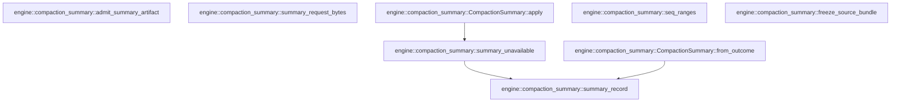

# engine::compaction_summary

[Package atlas](index.md) · [Source](../../src/compaction_summary.rs)

## Declarations

Visibility is the declaration spelling; trait members and reexports require their enclosing interface. `cfg` is not evaluated.

| Symbol | Kind | Visibility | Test / cfg |
|---|---|---|---|
| [engine::compaction_summary::MAX_CONTINUATION_BYTES](../../src/compaction_summary.rs#L14) | const_item | `pub` |  |
| [engine::compaction_summary::summary_request_bytes](../../src/compaction_summary.rs#L18) | function_item | `pub` |  |
| [engine::compaction_summary::SourceBundle](../../src/compaction_summary.rs#L31) | struct_item | `pub` |  |
| [engine::compaction_summary::freeze_source_bundle](../../src/compaction_summary.rs#L39) | function_item | `pub` |  |
| [engine::compaction_summary::SUMMARY_SYSTEM](../../src/compaction_summary.rs#L92) | const_item | `pub` |  |
| [engine::compaction_summary::SummaryArtifact](../../src/compaction_summary.rs#L95) | struct_item | `pub` |  |
| [engine::compaction_summary::admit_summary_artifact](../../src/compaction_summary.rs#L103) | function_item | `pub` |  |
| [engine::compaction_summary::summary_record](../../src/compaction_summary.rs#L153) | function_item | `pub` |  |
| [engine::compaction_summary::summary_unavailable](../../src/compaction_summary.rs#L176) | function_item | `pub` |  |
| [engine::compaction_summary::CompactionSummary](../../src/compaction_summary.rs#L182) | struct_item | `pub` |  |
| [engine::compaction_summary::CompactionSummary::from_outcome](../../src/compaction_summary.rs#L192) | function_item | `pub` |  |
| [engine::compaction_summary::CompactionSummary::apply](../../src/compaction_summary.rs#L213) | function_item | `pub` |  |
| [engine::compaction_summary::seq_ranges](../../src/compaction_summary.rs#L232) | function_item | `pub` |  |
| [engine::compaction_summary::tests::event](../../src/compaction_summary.rs#L251) | function_item | `private` | test; #[cfg(test)] |
| [engine::compaction_summary::tests::history](../../src/compaction_summary.rs#L260) | function_item | `private` | test; #[cfg(test)] |
| [engine::compaction_summary::tests::bundle_is_frozen_over_exact_covers_and_digested](../../src/compaction_summary.rs#L281) | function_item | `private` | test; #[cfg(test)] |
| [engine::compaction_summary::tests::admission_checks_evidence_addresses_against_the_bundle](../../src/compaction_summary.rs#L308) | function_item | `private` | test; #[cfg(test)] |
| [engine::compaction_summary::tests::a_stale_bundle_voids_the_artifact](../../src/compaction_summary.rs#L349) | function_item | `private` | test; #[cfg(test)] |
| [engine::compaction_summary::tests::the_record_carries_the_verdict_and_the_summary_is_the_admitted_continuation](../../src/compaction_summary.rs#L371) | function_item | `private` | test; #[cfg(test)] |

## Imports / reexports

| Local name | Source path | Visibility |
|---|---|---|
| `Event` | `schema::Event` | `private` |
| `Value` | `serde_json::Value` | `private` |
| `json` | `serde_json::json` | `private` |
| `Digest` | `sha2::Digest` | `private` |
| `Sha256` | `sha2::Sha256` | `private` |
| `BTreeSet` | `std::collections::BTreeSet` | `private` |
| `*` | `super::*` | `private` |

## Module declarations

| Module | Visibility | Attributes |
|---|---|---|
| `engine::compaction_summary::tests` | `private` | #[cfg(test)] |

## Function call graphs

Edges below are syntactically resolved calls only, including private functions. Graphs partition callers into groups of 20; they are not execution order. All unresolved sites are listed below and in the JSON inventory.

Functions 1–8: 3 direct edges

## Call sites

Includes test functions (marked in declarations). Receiver-type-required sites need type analysis/manual tracing. Calls in closures are attributed to their enclosing function; their occurrence here does not mean the closure executes immediately.

| Caller | Callee expression | Source lines | Target / classification |
|---|---|---|---|
| `summary_request_bytes` | `usize::try_from(context_window_tokens)         .unwrap_or(usize::MAX)         .saturating_mul(6)         .saturating_div(10)         .saturating_mul(4)         .max` | [19](../../src/compaction_summary.rs#L19) | receiver-type-required |
| `summary_request_bytes` | `usize::try_from(context_window_tokens)         .unwrap_or(usize::MAX)         .saturating_mul(6)         .saturating_div(10)         .saturating_mul` | [19](../../src/compaction_summary.rs#L19) | receiver-type-required |
| `summary_request_bytes` | `usize::try_from(context_window_tokens)         .unwrap_or(usize::MAX)         .saturating_mul(6)         .saturating_div` | [19](../../src/compaction_summary.rs#L19) | receiver-type-required |
| `summary_request_bytes` | `usize::try_from(context_window_tokens)         .unwrap_or(usize::MAX)         .saturating_mul` | [19](../../src/compaction_summary.rs#L19) | receiver-type-required |
| `summary_request_bytes` | `usize::try_from(context_window_tokens)         .unwrap_or` | [19](../../src/compaction_summary.rs#L19) | receiver-type-required |
| `summary_request_bytes` | `usize::try_from` | [19](../../src/compaction_summary.rs#L19) | external-constructor-callback-or-unresolved |
| `freeze_source_bundle` | `covers.iter().copied().collect::<BTreeSet<_>>` | [44](../../src/compaction_summary.rs#L44) | receiver-type-required |
| `freeze_source_bundle` | `covers.iter().copied` | [44](../../src/compaction_summary.rs#L44) | receiver-type-required |
| `freeze_source_bundle` | `covers.iter` | [44](../../src/compaction_summary.rs#L44) | receiver-type-required |
| `freeze_source_bundle` | `wanted.is_empty` | [45](../../src/compaction_summary.rs#L45) | receiver-type-required |
| `freeze_source_bundle` | `Err` | [46](../../src/compaction_summary.rs#L46), [65](../../src/compaction_summary.rs#L65) | external-constructor-callback-or-unresolved |
| `freeze_source_bundle` | `"a source bundle covers at least one record".to_owned` | [46](../../src/compaction_summary.rs#L46) | receiver-type-required |
| `freeze_source_bundle` | `Sha256::new` | [48](../../src/compaction_summary.rs#L48) | external-constructor-callback-or-unresolved |
| `freeze_source_bundle` | `digest.update` | [49](../../src/compaction_summary.rs#L49), [55](../../src/compaction_summary.rs#L55), [56](../../src/compaction_summary.rs#L56) | receiver-type-required |
| `freeze_source_bundle` | `Vec::new` | [50](../../src/compaction_summary.rs#L50) | external-constructor-callback-or-unresolved |
| `freeze_source_bundle` | `events.iter().filter` | [51](../../src/compaction_summary.rs#L51) | receiver-type-required |
| `freeze_source_bundle` | `events.iter` | [51](../../src/compaction_summary.rs#L51) | receiver-type-required |
| `freeze_source_bundle` | `wanted.contains` | [51](../../src/compaction_summary.rs#L51) | receiver-type-required |
| `freeze_source_bundle` | `event.seq` | [51](../../src/compaction_summary.rs#L51) | receiver-type-required |
| `freeze_source_bundle` | `serde_json::to_value(event.raw()).map_err` | [52](../../src/compaction_summary.rs#L52) | receiver-type-required |
| `freeze_source_bundle` | `serde_json::to_value` | [52](../../src/compaction_summary.rs#L52) | external-constructor-callback-or-unresolved |
| `freeze_source_bundle` | `event.raw` | [52](../../src/compaction_summary.rs#L52) | receiver-type-required |
| `freeze_source_bundle` | `error.to_string` | [52](../../src/compaction_summary.rs#L52), [54](../../src/compaction_summary.rs#L54) | receiver-type-required |
| `freeze_source_bundle` | `serde_json_canonicalizer::to_string(&raw).map_err` | [54](../../src/compaction_summary.rs#L54) | receiver-type-required |
| `freeze_source_bundle` | `serde_json_canonicalizer::to_string` | [54](../../src/compaction_summary.rs#L54) | external-constructor-callback-or-unresolved |
| `freeze_source_bundle` | `canonical.as_bytes` | [55](../../src/compaction_summary.rs#L55) | receiver-type-required |
| `freeze_source_bundle` | `lines.push` | [57](../../src/compaction_summary.rs#L57) | receiver-type-required |
| `freeze_source_bundle` | `lines.len` | [64](../../src/compaction_summary.rs#L64) | receiver-type-required |
| `freeze_source_bundle` | `wanted.len` | [64](../../src/compaction_summary.rs#L64) | receiver-type-required |
| `freeze_source_bundle` | `lines.join` | [71](../../src/compaction_summary.rs#L71) | receiver-type-required |
| `freeze_source_bundle` | `rendered.len` | [72](../../src/compaction_summary.rs#L72), [73](../../src/compaction_summary.rs#L73) | receiver-type-required |
| `freeze_source_bundle` | `rendered.is_char_boundary` | [76](../../src/compaction_summary.rs#L76) | receiver-type-required |
| `freeze_source_bundle` | `rendered.truncate` | [79](../../src/compaction_summary.rs#L79) | receiver-type-required |
| `freeze_source_bundle` | `rendered.push_str` | [80](../../src/compaction_summary.rs#L80) | receiver-type-required |
| `freeze_source_bundle` | `Ok` | [82](../../src/compaction_summary.rs#L82) | external-constructor-callback-or-unresolved |
| `freeze_source_bundle` | `wanted.into_iter().collect` | [83](../../src/compaction_summary.rs#L83) | receiver-type-required |
| `freeze_source_bundle` | `wanted.into_iter` | [83](../../src/compaction_summary.rs#L83) | receiver-type-required |
| `admit_summary_artifact` | `artifact.as_object().ok_or` | [107](../../src/compaction_summary.rs#L107) | receiver-type-required |
| `admit_summary_artifact` | `artifact.as_object` | [107](../../src/compaction_summary.rs#L107) | receiver-type-required |
| `admit_summary_artifact` | `object         .get("continuation")         .and_then(Value::as_str)         .ok_or("continuation is missing")?         .trim` | [108](../../src/compaction_summary.rs#L108) | receiver-type-required |
| `admit_summary_artifact` | `object         .get("continuation")         .and_then(Value::as_str)         .ok_or` | [108](../../src/compaction_summary.rs#L108) | receiver-type-required |
| `admit_summary_artifact` | `object         .get("continuation")         .and_then` | [108](../../src/compaction_summary.rs#L108) | receiver-type-required |
| `admit_summary_artifact` | `object         .get` | [108](../../src/compaction_summary.rs#L108), [121](../../src/compaction_summary.rs#L121) | receiver-type-required |
| `admit_summary_artifact` | `continuation.is_empty` | [113](../../src/compaction_summary.rs#L113) | receiver-type-required |
| `admit_summary_artifact` | `Err` | [114](../../src/compaction_summary.rs#L114), [117](../../src/compaction_summary.rs#L117), [126](../../src/compaction_summary.rs#L126), [135](../../src/compaction_summary.rs#L135), [140](../../src/compaction_summary.rs#L140) | external-constructor-callback-or-unresolved |
| `admit_summary_artifact` | `"continuation is empty".to_owned` | [114](../../src/compaction_summary.rs#L114) | receiver-type-required |
| `admit_summary_artifact` | `continuation.len` | [116](../../src/compaction_summary.rs#L116) | receiver-type-required |
| `admit_summary_artifact` | `object         .get("evidence_refs")         .and_then(Value::as_array)         .ok_or` | [121](../../src/compaction_summary.rs#L121) | receiver-type-required |
| `admit_summary_artifact` | `object         .get("evidence_refs")         .and_then` | [121](../../src/compaction_summary.rs#L121) | receiver-type-required |
| `admit_summary_artifact` | `refs.is_empty` | [125](../../src/compaction_summary.rs#L125) | receiver-type-required |
| `admit_summary_artifact` | `"evidence_refs is empty".to_owned` | [126](../../src/compaction_summary.rs#L126) | receiver-type-required |
| `admit_summary_artifact` | `BTreeSet::new` | [128](../../src/compaction_summary.rs#L128) | external-constructor-callback-or-unresolved |
| `admit_summary_artifact` | `reference             .as_u64()             .or_else(&#124;&#124; reference.get("seq").and_then(Value::as_u64))             .ok_or_else` | [130](../../src/compaction_summary.rs#L130) | receiver-type-required |
| `admit_summary_artifact` | `reference             .as_u64()             .or_else` | [130](../../src/compaction_summary.rs#L130) | receiver-type-required |
| `admit_summary_artifact` | `reference             .as_u64` | [130](../../src/compaction_summary.rs#L130) | receiver-type-required |
| `admit_summary_artifact` | `reference.get("seq").and_then` | [132](../../src/compaction_summary.rs#L132) | receiver-type-required |
| `admit_summary_artifact` | `reference.get` | [132](../../src/compaction_summary.rs#L132) | receiver-type-required |
| `admit_summary_artifact` | `bundle.covers.contains` | [134](../../src/compaction_summary.rs#L134) | receiver-type-required |
| `admit_summary_artifact` | `seen.insert` | [139](../../src/compaction_summary.rs#L139) | receiver-type-required |
| `admit_summary_artifact` | `Ok` | [143](../../src/compaction_summary.rs#L143) | external-constructor-callback-or-unresolved |
| `admit_summary_artifact` | `continuation.to_owned` | [144](../../src/compaction_summary.rs#L144) | receiver-type-required |
| `admit_summary_artifact` | `seen.into_iter().collect` | [145](../../src/compaction_summary.rs#L145) | receiver-type-required |
| `admit_summary_artifact` | `seen.into_iter` | [145](../../src/compaction_summary.rs#L145) | receiver-type-required |
| `summary_record` | `Value::String` | [166](../../src/compaction_summary.rs#L166) | external-constructor-callback-or-unresolved |
| `summary_record` | `reason.clone` | [166](../../src/compaction_summary.rs#L166) | receiver-type-required |
| `summary_unavailable` | `summary_record` | [177](../../src/compaction_summary.rs#L177) | [engine::compaction_summary::summary_record](../../src/compaction_summary.rs#L153) |
| `summary_unavailable` | `Err` | [177](../../src/compaction_summary.rs#L177) | external-constructor-callback-or-unresolved |
| `summary_unavailable` | `reason.to_owned` | [177](../../src/compaction_summary.rs#L177) | receiver-type-required |
| `from_outcome` | `summary_record` | [198](../../src/compaction_summary.rs#L198) | [engine::compaction_summary::summary_record](../../src/compaction_summary.rs#L153) |
| `from_outcome` | `outcome             .ok()             .map` | [199](../../src/compaction_summary.rs#L199) | receiver-type-required |
| `from_outcome` | `outcome             .ok` | [199](../../src/compaction_summary.rs#L199) | receiver-type-required |
| `from_outcome` | `model.to_owned` | [203](../../src/compaction_summary.rs#L203) | receiver-type-required |
| `apply` | `self.bundle.covers.as_slice` | [214](../../src/compaction_summary.rs#L214) | receiver-type-required |
| `apply` | `self.record.clone` | [216](../../src/compaction_summary.rs#L216) | receiver-type-required |
| `apply` | `self.continuation.clone().unwrap_or` | [217](../../src/compaction_summary.rs#L217) | receiver-type-required |
| `apply` | `self.continuation.clone` | [217](../../src/compaction_summary.rs#L217) | receiver-type-required |
| `apply` | `summary_unavailable` | [221](../../src/compaction_summary.rs#L221) | [engine::compaction_summary::summary_unavailable](../../src/compaction_summary.rs#L176) |
| `seq_ranges` | `Vec::new` | [233](../../src/compaction_summary.rs#L233) | external-constructor-callback-or-unresolved |
| `seq_ranges` | `ranges.last_mut().and_then` | [235](../../src/compaction_summary.rs#L235) | receiver-type-required |
| `seq_ranges` | `ranges.last_mut` | [235](../../src/compaction_summary.rs#L235) | receiver-type-required |
| `seq_ranges` | `range.get("to").and_then` | [237](../../src/compaction_summary.rs#L237) | receiver-type-required |
| `seq_ranges` | `range.get` | [237](../../src/compaction_summary.rs#L237) | receiver-type-required |
| `seq_ranges` | `Some` | [237](../../src/compaction_summary.rs#L237) | external-constructor-callback-or-unresolved |
| `seq_ranges` | `seq.saturating_sub` | [237](../../src/compaction_summary.rs#L237) | receiver-type-required |
| `seq_ranges` | `range.insert` | [239](../../src/compaction_summary.rs#L239) | receiver-type-required |
| `seq_ranges` | `"to".to_owned` | [239](../../src/compaction_summary.rs#L239) | receiver-type-required |
| `seq_ranges` | `Value::from` | [239](../../src/compaction_summary.rs#L239) | external-constructor-callback-or-unresolved |
| `seq_ranges` | `ranges.push` | [241](../../src/compaction_summary.rs#L241) | receiver-type-required |
| `event` | `extra.as_object().unwrap` | [253](../../src/compaction_summary.rs#L253) | receiver-type-required |
| `event` | `extra.as_object` | [253](../../src/compaction_summary.rs#L253) | receiver-type-required |
| `event` | `value.clone` | [254](../../src/compaction_summary.rs#L254) | receiver-type-required |
| `event` | `schema::IJsonValue::parse(&serde_json::to_vec(&object).unwrap()).unwrap` | [256](../../src/compaction_summary.rs#L256) | receiver-type-required |
| `event` | `schema::IJsonValue::parse` | [256](../../src/compaction_summary.rs#L256) | [schema::ijson::IJsonValue::parse](../../../schema/src/ijson.rs#L16) |
| `event` | `serde_json::to_vec(&object).unwrap` | [256](../../src/compaction_summary.rs#L256) | receiver-type-required |
| `event` | `serde_json::to_vec` | [256](../../src/compaction_summary.rs#L256) | external-constructor-callback-or-unresolved |
| `event` | `Event::from_value(parsed).unwrap` | [257](../../src/compaction_summary.rs#L257) | receiver-type-required |
| `event` | `Event::from_value` | [257](../../src/compaction_summary.rs#L257) | external-constructor-callback-or-unresolved |
| `bundle_is_frozen_over_exact_covers_and_digested` | `history` | [282](../../src/compaction_summary.rs#L282) | [engine::compaction_summary::tests::history](../../src/compaction_summary.rs#L260) |
| `bundle_is_frozen_over_exact_covers_and_digested` | `freeze_source_bundle(&events, &[3, 2], 1 << 20).unwrap` | [283](../../src/compaction_summary.rs#L283) | receiver-type-required |
| `bundle_is_frozen_over_exact_covers_and_digested` | `freeze_source_bundle` | [283](../../src/compaction_summary.rs#L283), [284](../../src/compaction_summary.rs#L284), [293](../../src/compaction_summary.rs#L293), [299](../../src/compaction_summary.rs#L299) | external-constructor-callback-or-unresolved |
| `bundle_is_frozen_over_exact_covers_and_digested` | `freeze_source_bundle(&events, &[2, 3], 1 << 20).unwrap` | [284](../../src/compaction_summary.rs#L284) | receiver-type-required |
| `bundle_is_frozen_over_exact_covers_and_digested` | `freeze_source_bundle(&events, &[2, 4], 1 << 20).unwrap` | [293](../../src/compaction_summary.rs#L293) | receiver-type-required |
| `bundle_is_frozen_over_exact_covers_and_digested` | `freeze_source_bundle(&events, &[2, 3], 40).unwrap` | [299](../../src/compaction_summary.rs#L299) | receiver-type-required |
| `admission_checks_evidence_addresses_against_the_bundle` | `freeze_source_bundle(&history(), &[2, 3], 1 << 20).unwrap` | [309](../../src/compaction_summary.rs#L309) | receiver-type-required |
| `admission_checks_evidence_addresses_against_the_bundle` | `freeze_source_bundle` | [309](../../src/compaction_summary.rs#L309) | external-constructor-callback-or-unresolved |
| `admission_checks_evidence_addresses_against_the_bundle` | `history` | [309](../../src/compaction_summary.rs#L309) | [engine::compaction_summary::tests::history](../../src/compaction_summary.rs#L260) |
| `admission_checks_evidence_addresses_against_the_bundle` | `admit_summary_artifact(             &bundle,             &json!({"continuation":"User gave code AZURE-17.","evidence_refs":[3,2]}),         )         .unwrap` | [310](../../src/compaction_summary.rs#L310) | receiver-type-required |
| `admission_checks_evidence_addresses_against_the_bundle` | `admit_summary_artifact` | [310](../../src/compaction_summary.rs#L310), [316](../../src/compaction_summary.rs#L316), [343](../../src/compaction_summary.rs#L343) | external-constructor-callback-or-unresolved |
| `admission_checks_evidence_addresses_against_the_bundle` | `admit_summary_artifact(             &bundle,             &json!({"continuation":"x","evidence_refs":[{"seq":2}]}),         )         .unwrap` | [316](../../src/compaction_summary.rs#L316) | receiver-type-required |
| `admission_checks_evidence_addresses_against_the_bundle` | `admit_summary_artifact(&bundle, &bad).unwrap_err` | [343](../../src/compaction_summary.rs#L343) | receiver-type-required |
| `a_stale_bundle_voids_the_artifact` | `freeze_source_bundle(&history(), &[2, 3], 1 << 20).unwrap` | [350](../../src/compaction_summary.rs#L350) | receiver-type-required |
| `a_stale_bundle_voids_the_artifact` | `freeze_source_bundle` | [350](../../src/compaction_summary.rs#L350) | external-constructor-callback-or-unresolved |
| `a_stale_bundle_voids_the_artifact` | `history` | [350](../../src/compaction_summary.rs#L350) | [engine::compaction_summary::tests::history](../../src/compaction_summary.rs#L260) |
| `a_stale_bundle_voids_the_artifact` | `admit_summary_artifact` | [351](../../src/compaction_summary.rs#L351) | external-constructor-callback-or-unresolved |
| `a_stale_bundle_voids_the_artifact` | `CompactionSummary::from_outcome` | [355](../../src/compaction_summary.rs#L355) | external-constructor-callback-or-unresolved |
| `a_stale_bundle_voids_the_artifact` | `summary.apply` | [356](../../src/compaction_summary.rs#L356), [359](../../src/compaction_summary.rs#L359) | receiver-type-required |
| `a_stale_bundle_voids_the_artifact` | `"[compacted history]\ndet".to_owned` | [356](../../src/compaction_summary.rs#L356), [359](../../src/compaction_summary.rs#L359) | receiver-type-required |
| `the_record_carries_the_verdict_and_the_summary_is_the_admitted_continuation` | `freeze_source_bundle(&history(), &[2, 3], 1 << 20).unwrap` | [372](../../src/compaction_summary.rs#L372) | receiver-type-required |
| `the_record_carries_the_verdict_and_the_summary_is_the_admitted_continuation` | `freeze_source_bundle` | [372](../../src/compaction_summary.rs#L372) | external-constructor-callback-or-unresolved |
| `the_record_carries_the_verdict_and_the_summary_is_the_admitted_continuation` | `history` | [372](../../src/compaction_summary.rs#L372) | [engine::compaction_summary::tests::history](../../src/compaction_summary.rs#L260) |
| `the_record_carries_the_verdict_and_the_summary_is_the_admitted_continuation` | `admit_summary_artifact` | [373](../../src/compaction_summary.rs#L373), [377](../../src/compaction_summary.rs#L377) | external-constructor-callback-or-unresolved |
| `the_record_carries_the_verdict_and_the_summary_is_the_admitted_continuation` | `summary_record` | [381](../../src/compaction_summary.rs#L381), [386](../../src/compaction_summary.rs#L386) | external-constructor-callback-or-unresolved |
| `the_record_carries_the_verdict_and_the_summary_is_the_admitted_continuation` | `Some` | [381](../../src/compaction_summary.rs#L381) | external-constructor-callback-or-unresolved |
| `the_record_carries_the_verdict_and_the_summary_is_the_admitted_continuation` | `CompactionSummary::from_outcome` | [392](../../src/compaction_summary.rs#L392), [398](../../src/compaction_summary.rs#L398) | external-constructor-callback-or-unresolved |
| `the_record_carries_the_verdict_and_the_summary_is_the_admitted_continuation` | `bundle.clone` | [392](../../src/compaction_summary.rs#L392) | receiver-type-required |
