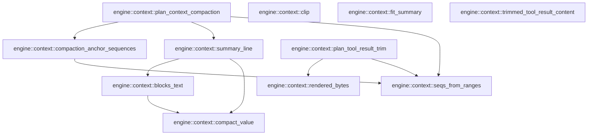

# engine::context

[Package atlas](index.md) · [Source](../../src/context.rs)

## Declarations

Visibility is the declaration spelling; trait members and reexports require their enclosing interface. `cfg` is not evaluated.

| Symbol | Kind | Visibility | Test / cfg |
|---|---|---|---|
| [engine::context::ContextCompactionPlan](../../src/context.rs#L5) | struct_item | `pub` |  |
| [engine::context::compaction_anchor_sequences](../../src/context.rs#L13) | function_item | `pub` |  |
| [engine::context::plan_context_compaction](../../src/context.rs#L106) | function_item | `pub` |  |
| [engine::context::MAX_LINE_CHARS](../../src/context.rs#L246) | const_item | `private` |  |
| [engine::context::MAX_SUMMARY_BYTES](../../src/context.rs#L248) | const_item | `private` |  |
| [engine::context::summary_line](../../src/context.rs#L253) | function_item | `private` |  |
| [engine::context::blocks_text](../../src/context.rs#L310) | function_item | `private` |  |
| [engine::context::compact_value](../../src/context.rs#L340) | function_item | `private` |  |
| [engine::context::clip](../../src/context.rs#L357) | function_item | `private` |  |
| [engine::context::fit_summary](../../src/context.rs#L373) | function_item | `private` |  |
| [engine::context::ToolResultTrim](../../src/context.rs#L411) | struct_item | `pub` |  |
| [engine::context::TRIM_THRESHOLD_BYTES](../../src/context.rs#L419) | const_item | `pub` |  |
| [engine::context::TRIM_HEAD_BYTES](../../src/context.rs#L420) | const_item | `pub` |  |
| [engine::context::TRIM_TAIL_BYTES](../../src/context.rs#L421) | const_item | `pub` |  |
| [engine::context::plan_tool_result_trim](../../src/context.rs#L431) | function_item | `pub` |  |
| [engine::context::rendered_bytes](../../src/context.rs#L485) | function_item | `private` |  |
| [engine::context::trimmed_tool_result_content](../../src/context.rs#L502) | function_item | `pub` |  |
| [engine::context::seqs_from_ranges](../../src/context.rs#L541) | function_item | `private` |  |
| [engine::context::summary_tests::event](../../src/context.rs#L562) | function_item | `private` | test; #[cfg(test)] |
| [engine::context::summary_tests::ledger](../../src/context.rs#L567) | function_item | `private` | test; #[cfg(test)] |
| [engine::context::summary_tests::TS](../../src/context.rs#L583) | const_item | `private` | test; #[cfg(test)] |
| [engine::context::summary_tests::THREAD](../../src/context.rs#L584) | const_item | `private` | test; #[cfg(test)] |
| [engine::context::summary_tests::open_turn_compaction_keeps_current_and_incomplete_batches_and_pairs_trimmed_results](../../src/context.rs#L587) | function_item | `private` | test; #[cfg(test)] |
| [engine::context::summary_tests::the_deterministic_summary_quotes_history_rather_than_json](../../src/context.rs#L627) | function_item | `private` | test; #[cfg(test)] |
| [engine::context::summary_tests::a_result_is_covered_with_the_call_it_answers_not_with_its_own_stamp](../../src/context.rs#L658) | function_item | `private` | test; #[cfg(test)] |
| [engine::context::summary_tests::a_huge_tool_result_cannot_crowd_out_the_rest_of_the_history](../../src/context.rs#L686) | function_item | `private` | test; #[cfg(test)] |
| [engine::context::trim_tests::TS](../../src/context.rs#L732) | const_item | `private` | test; #[cfg(test)] |
| [engine::context::trim_tests::THREAD](../../src/context.rs#L733) | const_item | `private` | test; #[cfg(test)] |
| [engine::context::trim_tests::event](../../src/context.rs#L735) | function_item | `private` | test; #[cfg(test)] |
| [engine::context::trim_tests::session](../../src/context.rs#L740) | function_item | `private` | test; #[cfg(test)] |
| [engine::context::trim_tests::big](../../src/context.rs#L756) | function_item | `private` | test; #[cfg(test)] |
| [engine::context::trim_tests::the_open_turns_answered_results_are_trimmable_and_the_newest_are_not](../../src/context.rs#L764) | function_item | `private` | test; #[cfg(test)] |
| [engine::context::trim_tests::trim_targets_skip_hidden_records_and_lead_with_the_largest](../../src/context.rs#L782) | function_item | `private` | test; #[cfg(test)] |
| [engine::context::trim_tests::the_replacement_keeps_a_head_a_tail_and_a_pointer_to_the_original](../../src/context.rs#L807) | function_item | `private` | test; #[cfg(test)] |

## Imports / reexports

| Local name | Source path | Visibility |
|---|---|---|
| `Event` | `schema::Event` | `private` |
| `EventKind` | `schema::EventKind` | `private` |
| `Value` | `serde_json::Value` | `private` |
| `json` | `serde_json::json` | `private` |
| `*` | `super::*` | `private` |
| `json` | `serde_json::json` | `private` |
| `*` | `super::*` | `private` |
| `json` | `serde_json::json` | `private` |

## Module declarations

| Module | Visibility | Attributes |
|---|---|---|
| `engine::context::summary_tests` | `private` | #[cfg(test)] |
| `engine::context::trim_tests` | `private` | #[cfg(test)] |

## Function call graphs

Edges below are syntactically resolved calls only, including private functions. Graphs partition callers into groups of 20; they are not execution order. All unresolved sites are listed below and in the JSON inventory.

Functions 1–11: 9 direct edges

## Call sites

Includes test functions (marked in declarations). Receiver-type-required sites need type analysis/manual tracing. Calls in closures are attributed to their enclosing function; their occurrence here does not mean the closure executes immediately.

| Caller | Callee expression | Source lines | Target / classification |
|---|---|---|---|
| `compaction_anchor_sequences` | `events         .iter()         .map(&#124;event&#124; serde_json::to_value(event.raw()))         .collect::<Result<Vec<_>, _>>` | [16](../../src/context.rs#L16) | receiver-type-required |
| `compaction_anchor_sequences` | `events         .iter()         .map` | [16](../../src/context.rs#L16) | receiver-type-required |
| `compaction_anchor_sequences` | `events         .iter` | [16](../../src/context.rs#L16) | receiver-type-required |
| `compaction_anchor_sequences` | `serde_json::to_value` | [18](../../src/context.rs#L18) | external-constructor-callback-or-unresolved |
| `compaction_anchor_sequences` | `event.raw` | [18](../../src/context.rs#L18) | receiver-type-required |
| `compaction_anchor_sequences` | `std::collections::BTreeSet::new` | [20](../../src/context.rs#L20), [21](../../src/context.rs#L21), [33](../../src/context.rs#L33), [69](../../src/context.rs#L69) | external-constructor-callback-or-unresolved |
| `compaction_anchor_sequences` | `superseded.extend` | [23](../../src/context.rs#L23) | receiver-type-required |
| `compaction_anchor_sequences` | `seqs_from_ranges` | [23](../../src/context.rs#L23) | [engine::context::seqs_from_ranges](../../src/context.rs#L541) |
| `compaction_anchor_sequences` | `row.get` | [23](../../src/context.rs#L23) | receiver-type-required |
| `compaction_anchor_sequences` | `row["trigger"]["inputs"].as_array` | [25](../../src/context.rs#L25) | receiver-type-required |
| `compaction_anchor_sequences` | `admitted_inputs.extend` | [26](../../src/context.rs#L26) | receiver-type-required |
| `compaction_anchor_sequences` | `inputs.iter().filter_map` | [26](../../src/context.rs#L26) | receiver-type-required |
| `compaction_anchor_sequences` | `inputs.iter` | [26](../../src/context.rs#L26) | receiver-type-required |
| `compaction_anchor_sequences` | `rows         .iter()         .filter` | [30](../../src/context.rs#L30) | receiver-type-required |
| `compaction_anchor_sequences` | `rows         .iter` | [30](../../src/context.rs#L30) | receiver-type-required |
| `compaction_anchor_sequences` | `superseded.contains` | [32](../../src/context.rs#L32) | receiver-type-required |
| `compaction_anchor_sequences` | `row["seq"].as_u64().unwrap` | [32](../../src/context.rs#L32), [38](../../src/context.rs#L38), [72](../../src/context.rs#L72), [100](../../src/context.rs#L100) | receiver-type-required |
| `compaction_anchor_sequences` | `row["seq"].as_u64` | [32](../../src/context.rs#L32), [38](../../src/context.rs#L38), [72](../../src/context.rs#L72), [100](../../src/context.rs#L100) | receiver-type-required |
| `compaction_anchor_sequences` | `std::collections::BTreeMap::new` | [34](../../src/context.rs#L34), [35](../../src/context.rs#L35) | external-constructor-callback-or-unresolved |
| `compaction_anchor_sequences` | `live.clone` | [37](../../src/context.rs#L37) | receiver-type-required |
| `compaction_anchor_sequences` | `anchors.insert` | [40](../../src/context.rs#L40), [43](../../src/context.rs#L43), [100](../../src/context.rs#L100) | receiver-type-required |
| `compaction_anchor_sequences` | `admitted_inputs.contains` | [42](../../src/context.rs#L42) | receiver-type-required |
| `compaction_anchor_sequences` | `calls.insert` | [47](../../src/context.rs#L47) | receiver-type-required |
| `compaction_anchor_sequences` | `row["call"].as_str().unwrap` | [47](../../src/context.rs#L47) | receiver-type-required |
| `compaction_anchor_sequences` | `row["call"].as_str` | [47](../../src/context.rs#L47), [50](../../src/context.rs#L50), [77](../../src/context.rs#L77) | receiver-type-required |
| `compaction_anchor_sequences` | `row["call"].as_str().and_then` | [50](../../src/context.rs#L50), [77](../../src/context.rs#L77) | receiver-type-required |
| `compaction_anchor_sequences` | `calls.get` | [50](../../src/context.rs#L50), [77](../../src/context.rs#L77) | receiver-type-required |
| `compaction_anchor_sequences` | `call["name"].as_str` | [53](../../src/context.rs#L53), [55](../../src/context.rs#L55) | receiver-type-required |
| `compaction_anchor_sequences` | `call["name"].as_str().unwrap().to_owned` | [55](../../src/context.rs#L55) | receiver-type-required |
| `compaction_anchor_sequences` | `call["name"].as_str().unwrap` | [55](../../src/context.rs#L55) | receiver-type-required |
| `compaction_anchor_sequences` | `latest.insert` | [65](../../src/context.rs#L65) | receiver-type-required |
| `compaction_anchor_sequences` | `anchors.extend` | [68](../../src/context.rs#L68) | receiver-type-required |
| `compaction_anchor_sequences` | `latest.into_values` | [68](../../src/context.rs#L68) | receiver-type-required |
| `compaction_anchor_sequences` | `live         .clone()         .filter` | [70](../../src/context.rs#L70) | receiver-type-required |
| `compaction_anchor_sequences` | `live         .clone` | [70](../../src/context.rs#L70) | receiver-type-required |
| `compaction_anchor_sequences` | `anchors.contains` | [72](../../src/context.rs#L72) | receiver-type-required |
| `compaction_anchor_sequences` | `row["attempt"].as_str` | [74](../../src/context.rs#L74) | receiver-type-required |
| `compaction_anchor_sequences` | `attempts.insert` | [75](../../src/context.rs#L75), [79](../../src/context.rs#L79) | receiver-type-required |
| `compaction_anchor_sequences` | `call["attempt"].as_str` | [78](../../src/context.rs#L78) | receiver-type-required |
| `compaction_anchor_sequences` | `calls         .iter()         .filter_map(&#124;(id, row)&#124; {             row["attempt"]                 .as_str()                 .is_some_and(&#124;attempt&#124; attempts.contains(attempt))                 .then_some(*id)         })         .collect::<std::collections::BTreeSet<_>>` | [83](../../src/context.rs#L83) | receiver-type-required |
| `compaction_anchor_sequences` | `calls         .iter()         .filter_map` | [83](../../src/context.rs#L83) | receiver-type-required |
| `compaction_anchor_sequences` | `calls         .iter` | [83](../../src/context.rs#L83) | receiver-type-required |
| `compaction_anchor_sequences` | `row["attempt"]                 .as_str()                 .is_some_and(&#124;attempt&#124; attempts.contains(attempt))                 .then_some` | [86](../../src/context.rs#L86) | receiver-type-required |
| `compaction_anchor_sequences` | `row["attempt"]                 .as_str()                 .is_some_and` | [86](../../src/context.rs#L86) | receiver-type-required |
| `compaction_anchor_sequences` | `row["attempt"]                 .as_str` | [86](../../src/context.rs#L86) | receiver-type-required |
| `compaction_anchor_sequences` | `attempts.contains` | [88](../../src/context.rs#L88), [95](../../src/context.rs#L95) | receiver-type-required |
| `compaction_anchor_sequences` | `row["attempt"]             .as_str()             .is_some_and` | [93](../../src/context.rs#L93) | receiver-type-required |
| `compaction_anchor_sequences` | `row["attempt"]             .as_str` | [93](../../src/context.rs#L93) | receiver-type-required |
| `compaction_anchor_sequences` | `row["call"]                 .as_str()                 .is_some_and` | [96](../../src/context.rs#L96) | receiver-type-required |
| `compaction_anchor_sequences` | `row["call"]                 .as_str` | [96](../../src/context.rs#L96) | receiver-type-required |
| `compaction_anchor_sequences` | `retained_calls.contains` | [98](../../src/context.rs#L98) | receiver-type-required |
| `compaction_anchor_sequences` | `Ok` | [103](../../src/context.rs#L103) | external-constructor-callback-or-unresolved |
| `plan_context_compaction` | `std::collections::BTreeMap::<u64, u64>::new` | [110](../../src/context.rs#L110) | external-constructor-callback-or-unresolved |
| `plan_context_compaction` | `std::collections::BTreeSet::<u64>::new` | [111](../../src/context.rs#L111), [112](../../src/context.rs#L112) | external-constructor-callback-or-unresolved |
| `plan_context_compaction` | `serde_json::to_value` | [114](../../src/context.rs#L114), [196](../../src/context.rs#L196) | external-constructor-callback-or-unresolved |
| `plan_context_compaction` | `event.raw` | [114](../../src/context.rs#L114), [196](../../src/context.rs#L196) | receiver-type-required |
| `plan_context_compaction` | `raw.as_object().ok_or` | [115](../../src/context.rs#L115), [197](../../src/context.rs#L197) | receiver-type-required |
| `plan_context_compaction` | `raw.as_object` | [115](../../src/context.rs#L115), [197](../../src/context.rs#L197) | receiver-type-required |
| `plan_context_compaction` | `seqs_from_ranges` | [116](../../src/context.rs#L116), [120](../../src/context.rs#L120) | [engine::context::seqs_from_ranges](../../src/context.rs#L541) |
| `plan_context_compaction` | `object.get` | [116](../../src/context.rs#L116), [120](../../src/context.rs#L120) | receiver-type-required |
| `plan_context_compaction` | `superseded.insert` | [117](../../src/context.rs#L117) | receiver-type-required |
| `plan_context_compaction` | `event.kind` | [119](../../src/context.rs#L119), [124](../../src/context.rs#L124), [141](../../src/context.rs#L141), [156](../../src/context.rs#L156), [165](../../src/context.rs#L165), [171](../../src/context.rs#L171), [180](../../src/context.rs#L180), [184](../../src/context.rs#L184), [198](../../src/context.rs#L198), [212](../../src/context.rs#L212) | receiver-type-required |
| `plan_context_compaction` | `already_covered.insert` | [121](../../src/context.rs#L121) | receiver-type-required |
| `plan_context_compaction` | `event.turn().ok_or` | [125](../../src/context.rs#L125) | receiver-type-required |
| `plan_context_compaction` | `event.turn` | [125](../../src/context.rs#L125), [157](../../src/context.rs#L157), [180](../../src/context.rs#L180), [184](../../src/context.rs#L184), [208](../../src/context.rs#L208), [214](../../src/context.rs#L214) | receiver-type-required |
| `plan_context_compaction` | `object                 .get("trigger")                 .and_then(&#124;trigger&#124; trigger.get("inputs"))                 .and_then(Value::as_array)                 .into_iter()                 .flatten()                 .filter_map` | [126](../../src/context.rs#L126) | receiver-type-required |
| `plan_context_compaction` | `object                 .get("trigger")                 .and_then(&#124;trigger&#124; trigger.get("inputs"))                 .and_then(Value::as_array)                 .into_iter()                 .flatten` | [126](../../src/context.rs#L126) | receiver-type-required |
| `plan_context_compaction` | `object                 .get("trigger")                 .and_then(&#124;trigger&#124; trigger.get("inputs"))                 .and_then(Value::as_array)                 .into_iter` | [126](../../src/context.rs#L126) | receiver-type-required |
| `plan_context_compaction` | `object                 .get("trigger")                 .and_then(&#124;trigger&#124; trigger.get("inputs"))                 .and_then` | [126](../../src/context.rs#L126) | receiver-type-required |
| `plan_context_compaction` | `object                 .get("trigger")                 .and_then` | [126](../../src/context.rs#L126) | receiver-type-required |
| `plan_context_compaction` | `object                 .get` | [126](../../src/context.rs#L126), [202](../../src/context.rs#L202) | receiver-type-required |
| `plan_context_compaction` | `trigger.get` | [128](../../src/context.rs#L128) | receiver-type-required |
| `plan_context_compaction` | `input_turns.insert` | [134](../../src/context.rs#L134) | receiver-type-required |
| `plan_context_compaction` | `compaction_anchor_sequences` | [138](../../src/context.rs#L138) | [engine::context::compaction_anchor_sequences](../../src/context.rs#L13) |
| `plan_context_compaction` | `events         .iter()         .filter(&#124;event&#124; *event.kind() == EventKind::ToolCall)         .filter_map(&#124;event&#124; {             Some((                 event.string_field("call")?.to_owned(),                 event.string_field("name")?.to_owned(),             ))         })         .collect::<std::collections::BTreeMap<_, _>>` | [139](../../src/context.rs#L139) | receiver-type-required |
| `plan_context_compaction` | `events         .iter()         .filter(&#124;event&#124; *event.kind() == EventKind::ToolCall)         .filter_map` | [139](../../src/context.rs#L139), [154](../../src/context.rs#L154), [163](../../src/context.rs#L163) | receiver-type-required |
| `plan_context_compaction` | `events         .iter()         .filter` | [139](../../src/context.rs#L139), [154](../../src/context.rs#L154), [163](../../src/context.rs#L163), [168](../../src/context.rs#L168), [182](../../src/context.rs#L182) | receiver-type-required |
| `plan_context_compaction` | `events         .iter` | [139](../../src/context.rs#L139), [154](../../src/context.rs#L154), [163](../../src/context.rs#L163), [168](../../src/context.rs#L168), [175](../../src/context.rs#L175), [182](../../src/context.rs#L182) | receiver-type-required |
| `plan_context_compaction` | `Some` | [143](../../src/context.rs#L143), [157](../../src/context.rs#L157), [166](../../src/context.rs#L166), [180](../../src/context.rs#L180), [184](../../src/context.rs#L184), [186](../../src/context.rs#L186), [214](../../src/context.rs#L214) | external-constructor-callback-or-unresolved |
| `plan_context_compaction` | `event.string_field("call")?.to_owned` | [144](../../src/context.rs#L144), [157](../../src/context.rs#L157) | receiver-type-required |
| `plan_context_compaction` | `event.string_field` | [144](../../src/context.rs#L144), [145](../../src/context.rs#L145), [157](../../src/context.rs#L157), [166](../../src/context.rs#L166), [173](../../src/context.rs#L173), [181](../../src/context.rs#L181), [185](../../src/context.rs#L185) | receiver-type-required |
| `plan_context_compaction` | `event.string_field("name")?.to_owned` | [145](../../src/context.rs#L145) | receiver-type-required |
| `plan_context_compaction` | `events         .iter()         .filter(&#124;event&#124; *event.kind() == EventKind::ToolCall)         .filter_map(&#124;event&#124; Some((event.string_field("call")?.to_owned(), event.turn()?)))         .collect::<std::collections::BTreeMap<_, _>>` | [154](../../src/context.rs#L154) | receiver-type-required |
| `plan_context_compaction` | `events         .iter()         .filter(&#124;event&#124; *event.kind() == EventKind::ToolCall)         .filter_map(&#124;event&#124; Some((event.string_field("call")?, event.string_field("attempt")?)))         .collect::<std::collections::BTreeMap<_, _>>` | [163](../../src/context.rs#L163) | receiver-type-required |
| `plan_context_compaction` | `events         .iter()         .filter(&#124;event&#124; {             *event.kind() == EventKind::ToolResult && !superseded.contains(&event.seq())         })         .filter_map(&#124;event&#124; event.string_field("call"))         .collect::<std::collections::BTreeSet<_>>` | [168](../../src/context.rs#L168) | receiver-type-required |
| `plan_context_compaction` | `events         .iter()         .filter(&#124;event&#124; {             *event.kind() == EventKind::ToolResult && !superseded.contains(&event.seq())         })         .filter_map` | [168](../../src/context.rs#L168) | receiver-type-required |
| `plan_context_compaction` | `superseded.contains` | [171](../../src/context.rs#L171), [228](../../src/context.rs#L228) | receiver-type-required |
| `plan_context_compaction` | `event.seq` | [171](../../src/context.rs#L171), [200](../../src/context.rs#L200), [225](../../src/context.rs#L225), [228](../../src/context.rs#L228), [229](../../src/context.rs#L229), [233](../../src/context.rs#L233) | receiver-type-required |
| `plan_context_compaction` | `events         .iter()         .rev()         // A failed newer request does not prove that its input batch has         // been consumed. Keep the last successful output's batch as well.         .filter(&#124;event&#124; event.turn() == Some(turn) && *event.kind() == EventKind::Output)         .find_map` | [175](../../src/context.rs#L175) | receiver-type-required |
| `plan_context_compaction` | `events         .iter()         .rev()         // A failed newer request does not prove that its input batch has         // been consumed. Keep the last successful output's batch as well.         .filter` | [175](../../src/context.rs#L175) | receiver-type-required |
| `plan_context_compaction` | `events         .iter()         .rev` | [175](../../src/context.rs#L175) | receiver-type-required |
| `plan_context_compaction` | `events         .iter()         .filter(&#124;event&#124; event.turn() == Some(turn) && *event.kind() == EventKind::Output)         .filter_map(&#124;event&#124; event.string_field("attempt"))         .filter(&#124;attempt&#124; Some(*attempt) != latest_attempt)         .filter(&#124;attempt&#124; {             call_attempts                 .iter()                 .all(&#124;(call, owner)&#124; owner != attempt &#124;&#124; answered.contains(call))         })         .collect::<std::collections::BTreeSet<_>>` | [182](../../src/context.rs#L182) | receiver-type-required |
| `plan_context_compaction` | `events         .iter()         .filter(&#124;event&#124; event.turn() == Some(turn) && *event.kind() == EventKind::Output)         .filter_map(&#124;event&#124; event.string_field("attempt"))         .filter(&#124;attempt&#124; Some(*attempt) != latest_attempt)         .filter` | [182](../../src/context.rs#L182) | receiver-type-required |
| `plan_context_compaction` | `events         .iter()         .filter(&#124;event&#124; event.turn() == Some(turn) && *event.kind() == EventKind::Output)         .filter_map(&#124;event&#124; event.string_field("attempt"))         .filter` | [182](../../src/context.rs#L182) | receiver-type-required |
| `plan_context_compaction` | `events         .iter()         .filter(&#124;event&#124; event.turn() == Some(turn) && *event.kind() == EventKind::Output)         .filter_map` | [182](../../src/context.rs#L182) | receiver-type-required |
| `plan_context_compaction` | `call_attempts                 .iter()                 .all` | [188](../../src/context.rs#L188) | receiver-type-required |
| `plan_context_compaction` | `call_attempts                 .iter` | [188](../../src/context.rs#L188) | receiver-type-required |
| `plan_context_compaction` | `answered.contains` | [190](../../src/context.rs#L190) | receiver-type-required |
| `plan_context_compaction` | `Vec::new` | [193](../../src/context.rs#L193), [194](../../src/context.rs#L194) | external-constructor-callback-or-unresolved |
| `plan_context_compaction` | `input_turns                 .get(&event.seq())                 .is_some_and` | [199](../../src/context.rs#L199) | receiver-type-required |
| `plan_context_compaction` | `input_turns                 .get` | [199](../../src/context.rs#L199) | receiver-type-required |
| `plan_context_compaction` | `object                 .get("call")                 .and_then(Value::as_str)                 .and_then(&#124;call&#124; call_turns.get(call))                 .is_some_and` | [202](../../src/context.rs#L202) | receiver-type-required |
| `plan_context_compaction` | `object                 .get("call")                 .and_then(Value::as_str)                 .and_then` | [202](../../src/context.rs#L202) | receiver-type-required |
| `plan_context_compaction` | `object                 .get("call")                 .and_then` | [202](../../src/context.rs#L202) | receiver-type-required |
| `plan_context_compaction` | `call_turns.get` | [205](../../src/context.rs#L205) | receiver-type-required |
| `plan_context_compaction` | `event.turn().is_some_and` | [208](../../src/context.rs#L208) | receiver-type-required |
| `plan_context_compaction` | `event                         .string_field("attempt")                         .is_some_and` | [215](../../src/context.rs#L215) | receiver-type-required |
| `plan_context_compaction` | `event                         .string_field` | [215](../../src/context.rs#L215) | receiver-type-required |
| `plan_context_compaction` | `completed_attempts.contains` | [217](../../src/context.rs#L217), [222](../../src/context.rs#L222) | receiver-type-required |
| `plan_context_compaction` | `event                 .string_field("call")                 .and_then(&#124;call&#124; call_attempts.get(call))                 .is_some_and` | [219](../../src/context.rs#L219) | receiver-type-required |
| `plan_context_compaction` | `event                 .string_field("call")                 .and_then` | [219](../../src/context.rs#L219) | receiver-type-required |
| `plan_context_compaction` | `event                 .string_field` | [219](../../src/context.rs#L219) | receiver-type-required |
| `plan_context_compaction` | `call_attempts.get` | [221](../../src/context.rs#L221) | receiver-type-required |
| `plan_context_compaction` | `semantic_anchors.contains` | [225](../../src/context.rs#L225) | receiver-type-required |
| `plan_context_compaction` | `already_covered.contains` | [229](../../src/context.rs#L229) | receiver-type-required |
| `plan_context_compaction` | `covered.push` | [233](../../src/context.rs#L233) | receiver-type-required |
| `plan_context_compaction` | `summary_line` | [234](../../src/context.rs#L234) | [engine::context::summary_line](../../src/context.rs#L253) |
| `plan_context_compaction` | `summary_lines.push` | [235](../../src/context.rs#L235) | receiver-type-required |
| `plan_context_compaction` | `Ok` | [238](../../src/context.rs#L238) | external-constructor-callback-or-unresolved |
| `summary_line` | `event.seq` | [258](../../src/context.rs#L258) | receiver-type-required |
| `summary_line` | `event.kind` | [259](../../src/context.rs#L259) | receiver-type-required |
| `summary_line` | `object.get("name").and_then(Value::as_str).unwrap_or` | [263](../../src/context.rs#L263) | receiver-type-required |
| `summary_line` | `object.get("name").and_then` | [263](../../src/context.rs#L263) | receiver-type-required |
| `summary_line` | `object.get` | [263](../../src/context.rs#L263), [272](../../src/context.rs#L272), [273](../../src/context.rs#L273) | receiver-type-required |
| `summary_line` | `object                 .get("call")                 .and_then(Value::as_str)                 .and_then(&#124;call&#124; call_names.get(call))                 .map_or` | [267](../../src/context.rs#L267) | receiver-type-required |
| `summary_line` | `object                 .get("call")                 .and_then(Value::as_str)                 .and_then` | [267](../../src/context.rs#L267) | receiver-type-required |
| `summary_line` | `object                 .get("call")                 .and_then` | [267](../../src/context.rs#L267) | receiver-type-required |
| `summary_line` | `object                 .get` | [267](../../src/context.rs#L267) | receiver-type-required |
| `summary_line` | `call_names.get` | [270](../../src/context.rs#L270) | receiver-type-required |
| `summary_line` | `compact_value` | [272](../../src/context.rs#L272) | [engine::context::compact_value](../../src/context.rs#L340) |
| `summary_line` | `blocks_text` | [273](../../src/context.rs#L273) | [engine::context::blocks_text](../../src/context.rs#L310) |
| `summary_line` | `text.is_empty` | [274](../../src/context.rs#L274) | receiver-type-required |
| `summary_line` | `Ok` | [288](../../src/context.rs#L288), [303](../../src/context.rs#L303), [305](../../src/context.rs#L305) | external-constructor-callback-or-unresolved |
| `summary_line` | `serde_json_canonicalizer::to_string` | [299](../../src/context.rs#L299) | external-constructor-callback-or-unresolved |
| `summary_line` | `body.split_whitespace().collect::<Vec<_>>().join` | [301](../../src/context.rs#L301) | receiver-type-required |
| `summary_line` | `body.split_whitespace().collect::<Vec<_>>` | [301](../../src/context.rs#L301) | receiver-type-required |
| `summary_line` | `body.split_whitespace` | [301](../../src/context.rs#L301) | receiver-type-required |
| `summary_line` | `body.is_empty` | [302](../../src/context.rs#L302) | receiver-type-required |
| `summary_line` | `Some` | [305](../../src/context.rs#L305) | external-constructor-callback-or-unresolved |
| `blocks_text` | `String::new` | [312](../../src/context.rs#L312) | external-constructor-callback-or-unresolved |
| `blocks_text` | `value.get` | [314](../../src/context.rs#L314) | receiver-type-required |
| `blocks_text` | `spill             .get("bytes")             .and_then(Value::as_u64)             .unwrap_or_default` | [315](../../src/context.rs#L315) | receiver-type-required |
| `blocks_text` | `spill             .get("bytes")             .and_then` | [315](../../src/context.rs#L315) | receiver-type-required |
| `blocks_text` | `spill             .get` | [315](../../src/context.rs#L315) | receiver-type-required |
| `blocks_text` | `value.as_array` | [321](../../src/context.rs#L321) | receiver-type-required |
| `blocks_text` | `compact_value` | [322](../../src/context.rs#L322), [333](../../src/context.rs#L333) | [engine::context::compact_value](../../src/context.rs#L340) |
| `blocks_text` | `Some` | [322](../../src/context.rs#L322), [333](../../src/context.rs#L333) | external-constructor-callback-or-unresolved |
| `blocks_text` | `blocks         .iter()         .map(&#124;block&#124; match block.get("type").and_then(Value::as_str) {             Some("text") => block                 .get("text")                 .and_then(Value::as_str)                 .unwrap_or_default()                 .to_owned(),             Some(other) => format!("[{other}]"),             None => compact_value(Some(block)),         })         .collect::<Vec<_>>()         .join` | [324](../../src/context.rs#L324) | receiver-type-required |
| `blocks_text` | `blocks         .iter()         .map(&#124;block&#124; match block.get("type").and_then(Value::as_str) {             Some("text") => block                 .get("text")                 .and_then(Value::as_str)                 .unwrap_or_default()                 .to_owned(),             Some(other) => format!("[{other}]"),             None => compact_value(Some(block)),         })         .collect::<Vec<_>>` | [324](../../src/context.rs#L324) | receiver-type-required |
| `blocks_text` | `blocks         .iter()         .map` | [324](../../src/context.rs#L324) | receiver-type-required |
| `blocks_text` | `blocks         .iter` | [324](../../src/context.rs#L324) | receiver-type-required |
| `blocks_text` | `block.get("type").and_then` | [326](../../src/context.rs#L326) | receiver-type-required |
| `blocks_text` | `block.get` | [326](../../src/context.rs#L326) | receiver-type-required |
| `blocks_text` | `block                 .get("text")                 .and_then(Value::as_str)                 .unwrap_or_default()                 .to_owned` | [327](../../src/context.rs#L327) | receiver-type-required |
| `blocks_text` | `block                 .get("text")                 .and_then(Value::as_str)                 .unwrap_or_default` | [327](../../src/context.rs#L327) | receiver-type-required |
| `blocks_text` | `block                 .get("text")                 .and_then` | [327](../../src/context.rs#L327) | receiver-type-required |
| `blocks_text` | `block                 .get` | [327](../../src/context.rs#L327) | receiver-type-required |
| `compact_value` | `String::new` | [342](../../src/context.rs#L342) | external-constructor-callback-or-unresolved |
| `compact_value` | `text.clone` | [343](../../src/context.rs#L343) | receiver-type-required |
| `compact_value` | `value.get` | [345](../../src/context.rs#L345) | receiver-type-required |
| `compact_value` | `spill                     .get("bytes")                     .and_then(Value::as_u64)                     .unwrap_or_default` | [346](../../src/context.rs#L346) | receiver-type-required |
| `compact_value` | `spill                     .get("bytes")                     .and_then` | [346](../../src/context.rs#L346) | receiver-type-required |
| `compact_value` | `spill                     .get` | [346](../../src/context.rs#L346) | receiver-type-required |
| `compact_value` | `serde_json_canonicalizer::to_string(value).unwrap_or_default` | [352](../../src/context.rs#L352) | receiver-type-required |
| `compact_value` | `serde_json_canonicalizer::to_string` | [352](../../src/context.rs#L352) | external-constructor-callback-or-unresolved |
| `clip` | `text.chars().count` | [358](../../src/context.rs#L358), [365](../../src/context.rs#L365) | receiver-type-required |
| `clip` | `text.chars` | [358](../../src/context.rs#L358), [362](../../src/context.rs#L362), [365](../../src/context.rs#L365) | receiver-type-required |
| `clip` | `text.to_owned` | [359](../../src/context.rs#L359) | receiver-type-required |
| `clip` | `limit.saturating_sub(64).max` | [361](../../src/context.rs#L361) | receiver-type-required |
| `clip` | `limit.saturating_sub` | [361](../../src/context.rs#L361) | receiver-type-required |
| `clip` | `text.chars().take(head).collect` | [362](../../src/context.rs#L362) | receiver-type-required |
| `clip` | `text.chars().take` | [362](../../src/context.rs#L362) | receiver-type-required |
| `clip` | `text         .chars()         .skip(text.chars().count().saturating_sub(48))         .collect` | [363](../../src/context.rs#L363) | receiver-type-required |
| `clip` | `text         .chars()         .skip` | [363](../../src/context.rs#L363) | receiver-type-required |
| `clip` | `text         .chars` | [363](../../src/context.rs#L363) | receiver-type-required |
| `clip` | `text.chars().count().saturating_sub` | [365](../../src/context.rs#L365) | receiver-type-required |
| `fit_summary` | `lines.join` | [374](../../src/context.rs#L374) | receiver-type-required |
| `fit_summary` | `joined.len` | [375](../../src/context.rs#L375) | receiver-type-required |
| `fit_summary` | `Vec::new` | [378](../../src/context.rs#L378) | external-constructor-callback-or-unresolved |
| `fit_summary` | `std::collections::VecDeque::new` | [379](../../src/context.rs#L379) | external-constructor-callback-or-unresolved |
| `fit_summary` | `lines.len` | [382](../../src/context.rs#L382) | receiver-type-required |
| `fit_summary` | `head.len` | [385](../../src/context.rs#L385) | receiver-type-required |
| `fit_summary` | `tail.len` | [385](../../src/context.rs#L385) | receiver-type-required |
| `fit_summary` | `lines[index].len` | [387](../../src/context.rs#L387) | receiver-type-required |
| `fit_summary` | `head.push` | [393](../../src/context.rs#L393), [401](../../src/context.rs#L401) | receiver-type-required |
| `fit_summary` | `lines[index].clone` | [393](../../src/context.rs#L393), [396](../../src/context.rs#L396) | receiver-type-required |
| `fit_summary` | `tail.push_front` | [396](../../src/context.rs#L396) | receiver-type-required |
| `fit_summary` | `back.saturating_sub` | [400](../../src/context.rs#L400) | receiver-type-required |
| `fit_summary` | `head.extend` | [402](../../src/context.rs#L402) | receiver-type-required |
| `fit_summary` | `head.join` | [403](../../src/context.rs#L403) | receiver-type-required |
| `plan_tool_result_trim` | `std::collections::BTreeSet::new` | [434](../../src/context.rs#L434) | external-constructor-callback-or-unresolved |
| `plan_tool_result_trim` | `serde_json::to_value` | [436](../../src/context.rs#L436), [460](../../src/context.rs#L460) | external-constructor-callback-or-unresolved |
| `plan_tool_result_trim` | `event.raw` | [436](../../src/context.rs#L436), [460](../../src/context.rs#L460) | receiver-type-required |
| `plan_tool_result_trim` | `raw.as_object().ok_or` | [437](../../src/context.rs#L437), [461](../../src/context.rs#L461) | receiver-type-required |
| `plan_tool_result_trim` | `raw.as_object` | [437](../../src/context.rs#L437), [461](../../src/context.rs#L461) | receiver-type-required |
| `plan_tool_result_trim` | `seqs_from_ranges` | [438](../../src/context.rs#L438), [442](../../src/context.rs#L442) | [engine::context::seqs_from_ranges](../../src/context.rs#L541) |
| `plan_tool_result_trim` | `object.get` | [438](../../src/context.rs#L438), [442](../../src/context.rs#L442), [462](../../src/context.rs#L462) | receiver-type-required |
| `plan_tool_result_trim` | `hidden.insert` | [439](../../src/context.rs#L439), [443](../../src/context.rs#L443) | receiver-type-required |
| `plan_tool_result_trim` | `event.kind` | [441](../../src/context.rs#L441), [450](../../src/context.rs#L450), [454](../../src/context.rs#L454) | receiver-type-required |
| `plan_tool_result_trim` | `events         .iter()         .rev()         .find(&#124;event&#124; *event.kind() == EventKind::Output)         .map_or` | [447](../../src/context.rs#L447) | receiver-type-required |
| `plan_tool_result_trim` | `events         .iter()         .rev()         .find` | [447](../../src/context.rs#L447) | receiver-type-required |
| `plan_tool_result_trim` | `events         .iter()         .rev` | [447](../../src/context.rs#L447) | receiver-type-required |
| `plan_tool_result_trim` | `events         .iter` | [447](../../src/context.rs#L447) | receiver-type-required |
| `plan_tool_result_trim` | `Vec::new` | [452](../../src/context.rs#L452) | external-constructor-callback-or-unresolved |
| `plan_tool_result_trim` | `hidden.contains` | [455](../../src/context.rs#L455) | receiver-type-required |
| `plan_tool_result_trim` | `event.seq` | [455](../../src/context.rs#L455), [456](../../src/context.rs#L456), [468](../../src/context.rs#L468) | receiver-type-required |
| `plan_tool_result_trim` | `rendered_bytes` | [465](../../src/context.rs#L465) | [engine::context::rendered_bytes](../../src/context.rs#L485) |
| `plan_tool_result_trim` | `targets.push` | [467](../../src/context.rs#L467) | receiver-type-required |
| `plan_tool_result_trim` | `object                     .get("call")                     .and_then(Value::as_str)                     .ok_or("tool_result lacks call")?                     .to_owned` | [469](../../src/context.rs#L469) | receiver-type-required |
| `plan_tool_result_trim` | `object                     .get("call")                     .and_then(Value::as_str)                     .ok_or` | [469](../../src/context.rs#L469) | receiver-type-required |
| `plan_tool_result_trim` | `object                     .get("call")                     .and_then` | [469](../../src/context.rs#L469) | receiver-type-required |
| `plan_tool_result_trim` | `object                     .get` | [469](../../src/context.rs#L469) | receiver-type-required |
| `plan_tool_result_trim` | `targets.sort_by` | [479](../../src/context.rs#L479) | receiver-type-required |
| `plan_tool_result_trim` | `right.bytes.cmp(&left.bytes).then` | [479](../../src/context.rs#L479) | receiver-type-required |
| `plan_tool_result_trim` | `right.bytes.cmp` | [479](../../src/context.rs#L479) | receiver-type-required |
| `plan_tool_result_trim` | `left.seq.cmp` | [479](../../src/context.rs#L479) | receiver-type-required |
| `plan_tool_result_trim` | `Ok` | [480](../../src/context.rs#L480) | external-constructor-callback-or-unresolved |
| `rendered_bytes` | `content.get` | [486](../../src/context.rs#L486) | receiver-type-required |
| `rendered_bytes` | `Ok` | [487](../../src/context.rs#L487), [495](../../src/context.rs#L495) | external-constructor-callback-or-unresolved |
| `rendered_bytes` | `usize::try_from(             spill                 .get("bytes")                 .and_then(Value::as_u64)                 .unwrap_or_default(),         )         .unwrap_or` | [487](../../src/context.rs#L487) | receiver-type-required |
| `rendered_bytes` | `usize::try_from` | [487](../../src/context.rs#L487) | external-constructor-callback-or-unresolved |
| `rendered_bytes` | `spill                 .get("bytes")                 .and_then(Value::as_u64)                 .unwrap_or_default` | [488](../../src/context.rs#L488) | receiver-type-required |
| `rendered_bytes` | `spill                 .get("bytes")                 .and_then` | [488](../../src/context.rs#L488) | receiver-type-required |
| `rendered_bytes` | `spill                 .get` | [488](../../src/context.rs#L488) | receiver-type-required |
| `rendered_bytes` | `serde_json_canonicalizer::to_string(content)?.len` | [495](../../src/context.rs#L495) | receiver-type-required |
| `rendered_bytes` | `serde_json_canonicalizer::to_string` | [495](../../src/context.rs#L495) | external-constructor-callback-or-unresolved |
| `trimmed_tool_result_content` | `content.as_array` | [503](../../src/context.rs#L503) | receiver-type-required |
| `trimmed_tool_result_content` | `content.clone` | [504](../../src/context.rs#L504) | receiver-type-required |
| `trimmed_tool_result_content` | `Vec::new` | [506](../../src/context.rs#L506) | external-constructor-callback-or-unresolved |
| `trimmed_tool_result_content` | `block.get("type").and_then` | [508](../../src/context.rs#L508) | receiver-type-required |
| `trimmed_tool_result_content` | `block.get` | [508](../../src/context.rs#L508) | receiver-type-required |
| `trimmed_tool_result_content` | `Some` | [508](../../src/context.rs#L508) | external-constructor-callback-or-unresolved |
| `trimmed_tool_result_content` | `output.push` | [509](../../src/context.rs#L509), [517](../../src/context.rs#L517), [529](../../src/context.rs#L529) | receiver-type-required |
| `trimmed_tool_result_content` | `block.clone` | [509](../../src/context.rs#L509), [517](../../src/context.rs#L517) | receiver-type-required |
| `trimmed_tool_result_content` | `block             .get("text")             .and_then(Value::as_str)             .unwrap_or_default` | [512](../../src/context.rs#L512) | receiver-type-required |
| `trimmed_tool_result_content` | `block             .get("text")             .and_then` | [512](../../src/context.rs#L512) | receiver-type-required |
| `trimmed_tool_result_content` | `block             .get` | [512](../../src/context.rs#L512) | receiver-type-required |
| `trimmed_tool_result_content` | `text.len` | [516](../../src/context.rs#L516), [520](../../src/context.rs#L520), [524](../../src/context.rs#L524) | receiver-type-required |
| `trimmed_tool_result_content` | `TRIM_HEAD_BYTES.min` | [520](../../src/context.rs#L520) | receiver-type-required |
| `trimmed_tool_result_content` | `text.is_char_boundary` | [521](../../src/context.rs#L521), [525](../../src/context.rs#L525) | receiver-type-required |
| `trimmed_tool_result_content` | `TRIM_TAIL_BYTES.min` | [524](../../src/context.rs#L524) | receiver-type-required |
| `trimmed_tool_result_content` | `tail.saturating_sub` | [528](../../src/context.rs#L528) | receiver-type-required |
| `trimmed_tool_result_content` | `Value::Array` | [538](../../src/context.rs#L538) | external-constructor-callback-or-unresolved |
| `seqs_from_ranges` | `Vec::new` | [542](../../src/context.rs#L542) | external-constructor-callback-or-unresolved |
| `seqs_from_ranges` | `value.and_then(Value::as_array).into_iter().flatten` | [543](../../src/context.rs#L543) | receiver-type-required |
| `seqs_from_ranges` | `value.and_then(Value::as_array).into_iter` | [543](../../src/context.rs#L543) | receiver-type-required |
| `seqs_from_ranges` | `value.and_then` | [543](../../src/context.rs#L543) | receiver-type-required |
| `seqs_from_ranges` | `range             .get("from")             .and_then(Value::as_u64)             .ok_or` | [544](../../src/context.rs#L544) | receiver-type-required |
| `seqs_from_ranges` | `range             .get("from")             .and_then` | [544](../../src/context.rs#L544) | receiver-type-required |
| `seqs_from_ranges` | `range             .get` | [544](../../src/context.rs#L544), [548](../../src/context.rs#L548) | receiver-type-required |
| `seqs_from_ranges` | `range             .get("to")             .and_then(Value::as_u64)             .ok_or` | [548](../../src/context.rs#L548) | receiver-type-required |
| `seqs_from_ranges` | `range             .get("to")             .and_then` | [548](../../src/context.rs#L548) | receiver-type-required |
| `seqs_from_ranges` | `seqs.extend` | [552](../../src/context.rs#L552) | receiver-type-required |
| `seqs_from_ranges` | `Ok` | [554](../../src/context.rs#L554) | external-constructor-callback-or-unresolved |
| `event` | `Event::decode_canonical(&serde_json_canonicalizer::to_vec(&value).expect("canonical"))             .expect` | [563](../../src/context.rs#L563) | receiver-type-required |
| `event` | `Event::decode_canonical` | [563](../../src/context.rs#L563) | external-constructor-callback-or-unresolved |
| `event` | `serde_json_canonicalizer::to_vec(&value).expect` | [563](../../src/context.rs#L563) | receiver-type-required |
| `event` | `serde_json_canonicalizer::to_vec` | [563](../../src/context.rs#L563) | external-constructor-callback-or-unresolved |
| `ledger` | `events.extend` | [579](../../src/context.rs#L579) | receiver-type-required |
| `ledger` | `rows.into_iter().map` | [579](../../src/context.rs#L579) | receiver-type-required |
| `ledger` | `rows.into_iter` | [579](../../src/context.rs#L579) | receiver-type-required |
| `open_turn_compaction_keeps_current_and_incomplete_batches_and_pairs_trimmed_results` | `ledger` | [588](../../src/context.rs#L588) | [engine::context::summary_tests::ledger](../../src/context.rs#L567) |
| `open_turn_compaction_keeps_current_and_incomplete_batches_and_pairs_trimmed_results` | `plan_context_compaction(&events, 1).unwrap` | [599](../../src/context.rs#L599) | receiver-type-required |
| `open_turn_compaction_keeps_current_and_incomplete_batches_and_pairs_trimmed_results` | `plan_context_compaction` | [599](../../src/context.rs#L599) | external-constructor-callback-or-unresolved |
| `open_turn_compaction_keeps_current_and_incomplete_batches_and_pairs_trimmed_results` | `events.push` | [603](../../src/context.rs#L603), [614](../../src/context.rs#L614) | receiver-type-required |
| `open_turn_compaction_keeps_current_and_incomplete_batches_and_pairs_trimmed_results` | `event` | [603](../../src/context.rs#L603), [614](../../src/context.rs#L614) | [engine::context::summary_tests::event](../../src/context.rs#L562) |
| `open_turn_compaction_keeps_current_and_incomplete_batches_and_pairs_trimmed_results` | `events.pop` | [610](../../src/context.rs#L610), [612](../../src/context.rs#L612) | receiver-type-required |
| `open_turn_compaction_keeps_current_and_incomplete_batches_and_pairs_trimmed_results` | `serde_json::to_value(events.pop().unwrap().raw()).unwrap` | [612](../../src/context.rs#L612) | receiver-type-required |
| `open_turn_compaction_keeps_current_and_incomplete_batches_and_pairs_trimmed_results` | `serde_json::to_value` | [612](../../src/context.rs#L612) | external-constructor-callback-or-unresolved |
| `open_turn_compaction_keeps_current_and_incomplete_batches_and_pairs_trimmed_results` | `events.pop().unwrap().raw` | [612](../../src/context.rs#L612) | receiver-type-required |
| `open_turn_compaction_keeps_current_and_incomplete_batches_and_pairs_trimmed_results` | `events.pop().unwrap` | [612](../../src/context.rs#L612) | receiver-type-required |
| `the_deterministic_summary_quotes_history_rather_than_json` | `ledger` | [628](../../src/context.rs#L628) | [engine::context::summary_tests::ledger](../../src/context.rs#L567) |
| `the_deterministic_summary_quotes_history_rather_than_json` | `plan_context_compaction(&events, 2).expect` | [636](../../src/context.rs#L636) | receiver-type-required |
| `the_deterministic_summary_quotes_history_rather_than_json` | `plan_context_compaction` | [636](../../src/context.rs#L636) | external-constructor-callback-or-unresolved |
| `the_deterministic_summary_quotes_history_rather_than_json` | `plan.summary.clone` | [637](../../src/context.rs#L637) | receiver-type-required |
| `a_result_is_covered_with_the_call_it_answers_not_with_its_own_stamp` | `ledger` | [659](../../src/context.rs#L659) | [engine::context::summary_tests::ledger](../../src/context.rs#L567) |
| `a_result_is_covered_with_the_call_it_answers_not_with_its_own_stamp` | `plan_context_compaction(&events, 3).expect` | [669](../../src/context.rs#L669) | receiver-type-required |
| `a_result_is_covered_with_the_call_it_answers_not_with_its_own_stamp` | `plan_context_compaction` | [669](../../src/context.rs#L669) | external-constructor-callback-or-unresolved |
| `a_result_is_covered_with_the_call_it_answers_not_with_its_own_stamp` | `plan             .covers             .iter()             .copied()             .collect::<std::collections::BTreeSet<_>>` | [670](../../src/context.rs#L670) | receiver-type-required |
| `a_result_is_covered_with_the_call_it_answers_not_with_its_own_stamp` | `plan             .covers             .iter()             .copied` | [670](../../src/context.rs#L670) | receiver-type-required |
| `a_result_is_covered_with_the_call_it_answers_not_with_its_own_stamp` | `plan             .covers             .iter` | [670](../../src/context.rs#L670) | receiver-type-required |
| `a_huge_tool_result_cannot_crowd_out_the_rest_of_the_history` | `Vec::new` | [687](../../src/context.rs#L687) | external-constructor-callback-or-unresolved |
| `a_huge_tool_result_cannot_crowd_out_the_rest_of_the_history` | `rows.push` | [690](../../src/context.rs#L690), [691](../../src/context.rs#L691), [694](../../src/context.rs#L694), [695](../../src/context.rs#L695), [698](../../src/context.rs#L698), [699](../../src/context.rs#L699) | receiver-type-required |
| `a_huge_tool_result_cannot_crowd_out_the_rest_of_the_history` | `plan_context_compaction(&ledger(rows), 2).expect` | [700](../../src/context.rs#L700) | receiver-type-required |
| `a_huge_tool_result_cannot_crowd_out_the_rest_of_the_history` | `plan_context_compaction` | [700](../../src/context.rs#L700) | external-constructor-callback-or-unresolved |
| `a_huge_tool_result_cannot_crowd_out_the_rest_of_the_history` | `ledger` | [700](../../src/context.rs#L700) | [engine::context::summary_tests::ledger](../../src/context.rs#L567) |
| `event` | `Event::decode_canonical(&serde_json_canonicalizer::to_vec(&value).expect("canonical"))             .expect` | [736](../../src/context.rs#L736) | receiver-type-required |
| `event` | `Event::decode_canonical` | [736](../../src/context.rs#L736) | external-constructor-callback-or-unresolved |
| `event` | `serde_json_canonicalizer::to_vec(&value).expect` | [736](../../src/context.rs#L736) | receiver-type-required |
| `event` | `serde_json_canonicalizer::to_vec` | [736](../../src/context.rs#L736) | external-constructor-callback-or-unresolved |
| `session` | `events.extend` | [752](../../src/context.rs#L752) | receiver-type-required |
| `session` | `rows.into_iter().map` | [752](../../src/context.rs#L752) | receiver-type-required |
| `session` | `rows.into_iter` | [752](../../src/context.rs#L752) | receiver-type-required |
| `the_open_turns_answered_results_are_trimmable_and_the_newest_are_not` | `session` | [765](../../src/context.rs#L765) | [engine::context::trim_tests::session](../../src/context.rs#L740) |
| `the_open_turns_answered_results_are_trimmable_and_the_newest_are_not` | `plan_tool_result_trim(&events).expect` | [772](../../src/context.rs#L772) | receiver-type-required |
| `the_open_turns_answered_results_are_trimmable_and_the_newest_are_not` | `plan_tool_result_trim` | [772](../../src/context.rs#L772) | external-constructor-callback-or-unresolved |
| `trim_targets_skip_hidden_records_and_lead_with_the_largest` | `session` | [783](../../src/context.rs#L783) | [engine::context::trim_tests::session](../../src/context.rs#L740) |
| `trim_targets_skip_hidden_records_and_lead_with_the_largest` | `plan_tool_result_trim(&events).expect` | [796](../../src/context.rs#L796) | receiver-type-required |
| `trim_targets_skip_hidden_records_and_lead_with_the_largest` | `plan_tool_result_trim` | [796](../../src/context.rs#L796) | external-constructor-callback-or-unresolved |
| `the_replacement_keeps_a_head_a_tail_and_a_pointer_to_the_original` | `trimmed_tool_result_content` | [812](../../src/context.rs#L812) | external-constructor-callback-or-unresolved |
| `the_replacement_keeps_a_head_a_tail_and_a_pointer_to_the_original` | `trimmed.as_array().expect` | [813](../../src/context.rs#L813) | receiver-type-required |
| `the_replacement_keeps_a_head_a_tail_and_a_pointer_to_the_original` | `trimmed.as_array` | [813](../../src/context.rs#L813) | receiver-type-required |
| `the_replacement_keeps_a_head_a_tail_and_a_pointer_to_the_original` | `blocks[0]["text"].as_str().expect` | [816](../../src/context.rs#L816) | receiver-type-required |
| `the_replacement_keeps_a_head_a_tail_and_a_pointer_to_the_original` | `blocks[0]["text"].as_str` | [816](../../src/context.rs#L816) | receiver-type-required |
