# engine::dispatcher

[Package atlas](index.md) · [Source](../../src/dispatcher.rs)

## Declarations

Visibility is the declaration spelling; trait members and reexports require their enclosing interface. `cfg` is not evaluated.

| Symbol | Kind | Visibility | Test / cfg |
|---|---|---|---|
| [engine::dispatcher::ToolInvocation](../../src/dispatcher.rs#L14) | struct_item | `pub` |  |
| [engine::dispatcher::ApprovalClass](../../src/dispatcher.rs#L25) | enum_item | `pub` |  |
| [engine::dispatcher::PolicyDecision](../../src/dispatcher.rs#L34) | enum_item | `pub` |  |
| [engine::dispatcher::ToolPolicy](../../src/dispatcher.rs#L40) | trait_item | `pub` |  |
| [engine::dispatcher::ToolPolicy::decide](../../src/dispatcher.rs#L41) | function_signature_item | `private` |  |
| [engine::dispatcher::AllowAllPolicy](../../src/dispatcher.rs#L51) | struct_item | `pub` |  |
| [engine::dispatcher::AllowAllPolicy::decide](../../src/dispatcher.rs#L54) | function_item | `private` |  |
| [engine::dispatcher::ProductionToolPolicy](../../src/dispatcher.rs#L71) | struct_item | `pub` |  |
| [engine::dispatcher::ProductionToolPolicy::decide](../../src/dispatcher.rs#L74) | function_item | `private` |  |
| [engine::dispatcher::per_call_hold](../../src/dispatcher.rs#L91) | function_item | `private` |  |
| [engine::dispatcher::PermissionModePolicy](../../src/dispatcher.rs#L119) | struct_item | `pub` |  |
| [engine::dispatcher::PermissionModePolicy::new](../../src/dispatcher.rs#L125) | function_item | `pub` |  |
| [engine::dispatcher::PermissionModePolicy::for_session_folder](../../src/dispatcher.rs#L132) | function_item | `pub` |  |
| [engine::dispatcher::PermissionModePolicy::decide](../../src/dispatcher.rs#L139) | function_item | `private` |  |
| [engine::dispatcher::ToolDispatcher](../../src/dispatcher.rs#L162) | struct_item | `pub` |  |
| [engine::dispatcher::ToolDispatcher::new](../../src/dispatcher.rs#L169) | function_item | `pub` |  |
| [engine::dispatcher::ToolDispatcher::provider_catalog](../../src/dispatcher.rs#L176) | function_item | `pub` |  |
| [engine::dispatcher::ToolDispatcher::dispatch](../../src/dispatcher.rs#L193) | function_item | `pub` |  |
| [engine::dispatcher::side_effectful](../../src/dispatcher.rs#L276) | function_item | `pub` |  |
| [engine::dispatcher::approval_class](../../src/dispatcher.rs#L284) | function_item | `pub` |  |
| [engine::dispatcher::approval_scope](../../src/dispatcher.rs#L310) | function_item | `pub` |  |
| [engine::dispatcher::DispatchError](../../src/dispatcher.rs#L321) | enum_item | `pub` |  |
| [engine::dispatcher::permission_mode_tests::tool](../../src/dispatcher.rs#L340) | function_item | `private` | test; #[cfg(test)] |
| [engine::dispatcher::permission_mode_tests::execution](../../src/dispatcher.rs#L348) | function_item | `private` | test; #[cfg(test)] |
| [engine::dispatcher::permission_mode_tests::decide](../../src/dispatcher.rs#L361) | function_item | `private` | test; #[cfg(test)] |
| [engine::dispatcher::permission_mode_tests::EVERY_CLASS](../../src/dispatcher.rs#L367) | const_item | `private` | test; #[cfg(test)] |
| [engine::dispatcher::permission_mode_tests::read_only_allows_reads_and_workflow_holds_and_denies_every_effect](../../src/dispatcher.rs#L376) | function_item | `private` | test; #[cfg(test)] |
| [engine::dispatcher::permission_mode_tests::workspace_write_allows_edit_and_execute_and_holds_destructive](../../src/dispatcher.rs#L397) | function_item | `private` | test; #[cfg(test)] |
| [engine::dispatcher::permission_mode_tests::danger_full_access_allows_everything](../../src/dispatcher.rs#L434) | function_item | `private` | test; #[cfg(test)] |
| [engine::dispatcher::permission_mode_tests::default_mode_is_workspace_write_and_folder_read_reports_corruption](../../src/dispatcher.rs#L445) | function_item | `private` | test; #[cfg(test)] |

## Imports / reexports

| Local name | Source path | Visibility |
|---|---|---|
| `IJsonValue` | `schema::IJsonValue` | `private` |
| `Value` | `serde_json::Value` | `private` |
| `Error` | `thiserror::Error` | `private` |
| `ApprovalGate` | `tools::ApprovalGate` | `private` |
| `BuiltinManifest` | `tools::BuiltinManifest` | `private` |
| `BuiltinTool` | `tools::BuiltinTool` | `private` |
| `CatalogContext` | `tools::CatalogContext` | `private` |
| `DurableApprovalResponse` | `tools::DurableApprovalResponse` | `private` |
| `Effect` | `tools::Effect` | `private` |
| `HookBinding` | `tools::HookBinding` | `private` |
| `PipelineDecision` | `tools::PipelineDecision` | `private` |
| `ToolExecution` | `tools::ToolExecution` | `private` |
| `ToolPipeline` | `tools::ToolPipeline` | `private` |
| `ToolPipelineError` | `tools::ToolPipelineError` | `private` |
| `fixed_schema` | `tools::fixed_schema` | `private` |
| `validate_fixed_arguments` | `tools::validate_fixed_arguments` | `private` |
| `ToolBackend` | `crate::ToolBackend` | `private` |
| `PermissionMode` | `crate::permission_mode::PermissionMode` | `private` |
| `read_permission_mode` | `crate::permission_mode::read_permission_mode` | `private` |
| `*` | `super::*` | `private` |

## Module declarations

| Module | Visibility | Attributes |
|---|---|---|
| `engine::dispatcher::permission_mode_tests` | `private` | #[cfg(test)] |

## Function call graphs

Edges below are syntactically resolved calls only, including private functions. Graphs partition callers into groups of 20; they are not execution order. All unresolved sites are listed below and in the JSON inventory.

```mermaid
flowchart TD
  n0["engine::dispatcher::PermissionModePolicy::new"]
  n1["engine::dispatcher::PermissionModePolicy::for_session_folder"]
  n2["engine::dispatcher::PermissionModePolicy::decide"]
  n3["engine::dispatcher::ToolDispatcher::new"]
  n4["engine::dispatcher::ToolDispatcher::provider_catalog"]
  n5["engine::dispatcher::ToolDispatcher::dispatch"]
  n6["engine::dispatcher::side_effectful"]
  n7["engine::dispatcher::approval_class"]
  n8["engine::dispatcher::approval_scope"]
  n9["engine::dispatcher::AllowAllPolicy::decide"]
  n10["engine::dispatcher::ProductionToolPolicy::decide"]
  n11["engine::dispatcher::per_call_hold"]
  n12["engine::permission_mode::read_permission_mode"]
  n13["schema::ijson::IJsonValue::parse"]
  n14["tools::schema_registry::fixed_schema"]
  n15["tools::schema_registry::validate_fixed_arguments"]
  n1 --> n12
  n2 --> n11
  n4 --> n13
  n4 --> n14
  n5 --> n6
  n5 --> n7
  n5 --> n8
  n5 --> n15
  n10 --> n11
  n11 --> n13
```

Functions 1–12: 10 direct edges

## Call sites

Includes test functions (marked in declarations). Receiver-type-required sites need type analysis/manual tracing. Calls in closures are attributed to their enclosing function; their occurrence here does not mean the closure executes immediately.

| Caller | Callee expression | Source lines | Target / classification |
|---|---|---|---|
| `decide` | `per_call_hold` | [84](../../src/dispatcher.rs#L84) | [engine::dispatcher::per_call_hold](../../src/dispatcher.rs#L91) |
| `per_call_hold` | `serde_json::to_vec(&question).expect` | [102](../../src/dispatcher.rs#L102) | receiver-type-required |
| `per_call_hold` | `serde_json::to_vec` | [102](../../src/dispatcher.rs#L102) | external-constructor-callback-or-unresolved |
| `per_call_hold` | `IJsonValue::parse(&bytes).expect` | [104](../../src/dispatcher.rs#L104) | receiver-type-required |
| `per_call_hold` | `IJsonValue::parse` | [104](../../src/dispatcher.rs#L104) | [schema::ijson::IJsonValue::parse](../../../schema/src/ijson.rs#L16) |
| `for_session_folder` | `read_permission_mode` | [133](../../src/dispatcher.rs#L133) | [engine::permission_mode::read_permission_mode](../../src/permission_mode.rs#L85) |
| `decide` | `PolicyDecision::Deny` | [150](../../src/dispatcher.rs#L150) | external-constructor-callback-or-unresolved |
| `decide` | `"read-only permission mode".to_owned` | [150](../../src/dispatcher.rs#L150) | receiver-type-required |
| `decide` | `per_call_hold` | [156](../../src/dispatcher.rs#L156) | [engine::dispatcher::per_call_hold](../../src/dispatcher.rs#L91) |
| `provider_catalog` | `self.manifest             .projection(self.context)             .into_iter()             .filter(&#124;tool&#124; backend.supports(&tool.name))             .map(&#124;tool&#124; {                 let schema = fixed_schema(&tool.name)                     .ok_or_else(&#124;&#124; DispatchError::UnknownTool(tool.name.clone()))?;                 let bytes = serde_json::to_vec(&schema.model_schema())?;                 Ok(IJsonValue::parse(&bytes)?)             })             .collect` | [180](../../src/dispatcher.rs#L180) | receiver-type-required |
| `provider_catalog` | `self.manifest             .projection(self.context)             .into_iter()             .filter(&#124;tool&#124; backend.supports(&tool.name))             .map` | [180](../../src/dispatcher.rs#L180) | receiver-type-required |
| `provider_catalog` | `self.manifest             .projection(self.context)             .into_iter()             .filter` | [180](../../src/dispatcher.rs#L180) | receiver-type-required |
| `provider_catalog` | `self.manifest             .projection(self.context)             .into_iter` | [180](../../src/dispatcher.rs#L180) | receiver-type-required |
| `provider_catalog` | `self.manifest             .projection` | [180](../../src/dispatcher.rs#L180) | receiver-type-required |
| `provider_catalog` | `backend.supports` | [183](../../src/dispatcher.rs#L183) | receiver-type-required |
| `provider_catalog` | `fixed_schema(&tool.name)                     .ok_or_else` | [185](../../src/dispatcher.rs#L185) | receiver-type-required |
| `provider_catalog` | `fixed_schema` | [185](../../src/dispatcher.rs#L185) | [tools::schema_registry::fixed_schema](../../../tools/src/schema_registry.rs#L1225) |
| `provider_catalog` | `DispatchError::UnknownTool` | [186](../../src/dispatcher.rs#L186) | external-constructor-callback-or-unresolved |
| `provider_catalog` | `tool.name.clone` | [186](../../src/dispatcher.rs#L186) | receiver-type-required |
| `provider_catalog` | `serde_json::to_vec` | [187](../../src/dispatcher.rs#L187) | external-constructor-callback-or-unresolved |
| `provider_catalog` | `schema.model_schema` | [187](../../src/dispatcher.rs#L187) | receiver-type-required |
| `provider_catalog` | `Ok` | [188](../../src/dispatcher.rs#L188) | external-constructor-callback-or-unresolved |
| `provider_catalog` | `IJsonValue::parse` | [188](../../src/dispatcher.rs#L188) | [schema::ijson::IJsonValue::parse](../../../schema/src/ijson.rs#L16) |
| `dispatch` | `self             .manifest             .tools             .iter()             .find(&#124;tool&#124; tool.name == invocation.name)             .ok_or_else` | [201](../../src/dispatcher.rs#L201) | receiver-type-required |
| `dispatch` | `self             .manifest             .tools             .iter()             .find` | [201](../../src/dispatcher.rs#L201) | receiver-type-required |
| `dispatch` | `self             .manifest             .tools             .iter` | [201](../../src/dispatcher.rs#L201) | receiver-type-required |
| `dispatch` | `DispatchError::UnknownTool` | [206](../../src/dispatcher.rs#L206) | external-constructor-callback-or-unresolved |
| `dispatch` | `invocation.name.clone` | [206](../../src/dispatcher.rs#L206), [213](../../src/dispatcher.rs#L213), [216](../../src/dispatcher.rs#L216), [223](../../src/dispatcher.rs#L223) | receiver-type-required |
| `dispatch` | `self             .manifest             .projection(self.context)             .iter()             .any` | [207](../../src/dispatcher.rs#L207) | receiver-type-required |
| `dispatch` | `self             .manifest             .projection(self.context)             .iter` | [207](../../src/dispatcher.rs#L207) | receiver-type-required |
| `dispatch` | `self             .manifest             .projection` | [207](../../src/dispatcher.rs#L207) | receiver-type-required |
| `dispatch` | `Err` | [213](../../src/dispatcher.rs#L213), [216](../../src/dispatcher.rs#L216) | external-constructor-callback-or-unresolved |
| `dispatch` | `DispatchError::UnavailableTool` | [213](../../src/dispatcher.rs#L213), [216](../../src/dispatcher.rs#L216), [235](../../src/dispatcher.rs#L235) | external-constructor-callback-or-unresolved |
| `dispatch` | `backend.supports` | [215](../../src/dispatcher.rs#L215) | receiver-type-required |
| `dispatch` | `serde_json::to_value` | [218](../../src/dispatcher.rs#L218), [243](../../src/dispatcher.rs#L243) | external-constructor-callback-or-unresolved |
| `dispatch` | `validate_fixed_arguments` | [219](../../src/dispatcher.rs#L219), [251](../../src/dispatcher.rs#L251) | [tools::schema_registry::validate_fixed_arguments](../../../tools/src/schema_registry.rs#L1231) |
| `dispatch` | `invocation.thread.clone` | [221](../../src/dispatcher.rs#L221) | receiver-type-required |
| `dispatch` | `invocation.call.clone` | [222](../../src/dispatcher.rs#L222) | receiver-type-required |
| `dispatch` | `invocation.attempt.clone` | [224](../../src/dispatcher.rs#L224) | receiver-type-required |
| `dispatch` | `invocation.arguments.clone` | [225](../../src/dispatcher.rs#L225) | receiver-type-required |
| `dispatch` | `side_effectful` | [226](../../src/dispatcher.rs#L226) | [engine::dispatcher::side_effectful](../../src/dispatcher.rs#L276) |
| `dispatch` | `invocation.timestamp.clone` | [228](../../src/dispatcher.rs#L228) | receiver-type-required |
| `dispatch` | `pipeline.verify_durable_execution` | [230](../../src/dispatcher.rs#L230) | receiver-type-required |
| `dispatch` | `arguments                 .get("skill")                 .and_then(Value::as_str)                 .ok_or_else` | [232](../../src/dispatcher.rs#L232) | receiver-type-required |
| `dispatch` | `arguments                 .get("skill")                 .and_then` | [232](../../src/dispatcher.rs#L232) | receiver-type-required |
| `dispatch` | `arguments                 .get` | [232](../../src/dispatcher.rs#L232) | receiver-type-required |
| `dispatch` | `tool.name.clone` | [235](../../src/dispatcher.rs#L235) | receiver-type-required |
| `dispatch` | `pipeline.verify_causal_offer` | [236](../../src/dispatcher.rs#L236) | receiver-type-required |
| `dispatch` | `pipeline             .execute_terminal_with_gate_and_resume(                 &execution,                 hooks,                 &#124;execution, effective&#124; {                     let effective_value = match serde_json::to_value(effective) {                         Ok(value) => value,                         Err(error) => {                             return ApprovalGate::Deny(format!(                                 "effective invocation is not JSON: {error}"                             ));                         }                     };                     if let Err(error) = validate_fixed_arguments(&tool.name, &effective_value) {                         return ApprovalGate::Deny(format!(                             "effective invocation failed validation: {error}"                         ));                     }                     let effective_class = approval_class(tool, &effective_value);                     match policy.decide(effective_class, tool, execution, effective) {                         PolicyDecision::Allow => ApprovalGate::Allow,                         PolicyDecision::Deny(reason) => ApprovalGate::Deny(reason),                         PolicyDecision::Hold { question } => ApprovalGate::Hold {                             scope: approval_scope(effective_class).to_owned(),                             question,                         },                     }                 },                 &#124;execution, effective, approval: Option<&DurableApprovalResponse>&#124; match approval {                     Some(approval) => backend.resume_after_approval(execution, effective, approval),                     None => backend.execute(execution, effective),                 },             )             .map_err` | [238](../../src/dispatcher.rs#L238) | receiver-type-required |
| `dispatch` | `pipeline             .execute_terminal_with_gate_and_resume` | [238](../../src/dispatcher.rs#L238) | receiver-type-required |
| `dispatch` | `ApprovalGate::Deny` | [246](../../src/dispatcher.rs#L246), [252](../../src/dispatcher.rs#L252), [259](../../src/dispatcher.rs#L259) | external-constructor-callback-or-unresolved |
| `dispatch` | `approval_class` | [256](../../src/dispatcher.rs#L256) | [engine::dispatcher::approval_class](../../src/dispatcher.rs#L284) |
| `dispatch` | `policy.decide` | [257](../../src/dispatcher.rs#L257) | receiver-type-required |
| `dispatch` | `approval_scope(effective_class).to_owned` | [261](../../src/dispatcher.rs#L261) | receiver-type-required |
| `dispatch` | `approval_scope` | [261](../../src/dispatcher.rs#L261) | [engine::dispatcher::approval_scope](../../src/dispatcher.rs#L310) |
| `dispatch` | `backend.resume_after_approval` | [267](../../src/dispatcher.rs#L267) | receiver-type-required |
| `dispatch` | `backend.execute` | [268](../../src/dispatcher.rs#L268) | receiver-type-required |
| `approval_class` | `tool.name.as_str` | [285](../../src/dispatcher.rs#L285) | receiver-type-required |
| `approval_class` | `arguments.get("action").and_then` | [289](../../src/dispatcher.rs#L289) | receiver-type-required |
| `approval_class` | `arguments.get` | [289](../../src/dispatcher.rs#L289), [294](../../src/dispatcher.rs#L294) | receiver-type-required |
| `approval_class` | `arguments.get("operation").and_then` | [294](../../src/dispatcher.rs#L294) | receiver-type-required |
| `tool` | `BuiltinManifest::compiled()             .tools             .into_iter()             .find(&#124;tool&#124; tool.name == name)             .expect` | [341](../../src/dispatcher.rs#L341) | receiver-type-required |
| `tool` | `BuiltinManifest::compiled()             .tools             .into_iter()             .find` | [341](../../src/dispatcher.rs#L341) | receiver-type-required |
| `tool` | `BuiltinManifest::compiled()             .tools             .into_iter` | [341](../../src/dispatcher.rs#L341) | receiver-type-required |
| `tool` | `BuiltinManifest::compiled` | [341](../../src/dispatcher.rs#L341) | external-constructor-callback-or-unresolved |
| `execution` | `"t".to_owned` | [350](../../src/dispatcher.rs#L350) | receiver-type-required |
| `execution` | `"call-1".to_owned` | [351](../../src/dispatcher.rs#L351) | receiver-type-required |
| `execution` | `name.to_owned` | [352](../../src/dispatcher.rs#L352) | receiver-type-required |
| `execution` | `"a".to_owned` | [353](../../src/dispatcher.rs#L353) | receiver-type-required |
| `execution` | `IJsonValue::parse_str("{}").expect` | [354](../../src/dispatcher.rs#L354) | receiver-type-required |
| `execution` | `IJsonValue::parse_str` | [354](../../src/dispatcher.rs#L354) | external-constructor-callback-or-unresolved |
| `execution` | `"2026-09-14T00:00:00.000Z".to_owned` | [357](../../src/dispatcher.rs#L357) | receiver-type-required |
| `decide` | `tool` | [362](../../src/dispatcher.rs#L362) | external-constructor-callback-or-unresolved |
| `decide` | `IJsonValue::parse_str("{}").expect` | [363](../../src/dispatcher.rs#L363) | receiver-type-required |
| `decide` | `IJsonValue::parse_str` | [363](../../src/dispatcher.rs#L363) | external-constructor-callback-or-unresolved |
| `decide` | `PermissionModePolicy::new(mode).decide` | [364](../../src/dispatcher.rs#L364) | receiver-type-required |
| `decide` | `PermissionModePolicy::new` | [364](../../src/dispatcher.rs#L364) | external-constructor-callback-or-unresolved |
| `decide` | `execution` | [364](../../src/dispatcher.rs#L364) | [engine::dispatcher::permission_mode_tests::execution](../../src/dispatcher.rs#L348) |
| `workspace_write_allows_edit_and_execute_and_holds_destructive` | `decide` | [411](../../src/dispatcher.rs#L411) | [engine::dispatcher::permission_mode_tests::decide](../../src/dispatcher.rs#L361) |
| `workspace_write_allows_edit_and_execute_and_holds_destructive` | `serde_json::to_value(&question).expect` | [415](../../src/dispatcher.rs#L415) | receiver-type-required |
| `workspace_write_allows_edit_and_execute_and_holds_destructive` | `serde_json::to_value` | [415](../../src/dispatcher.rs#L415), [429](../../src/dispatcher.rs#L429) | external-constructor-callback-or-unresolved |
| `workspace_write_allows_edit_and_execute_and_holds_destructive` | `ProductionToolPolicy.decide` | [421](../../src/dispatcher.rs#L421) | receiver-type-required |
| `workspace_write_allows_edit_and_execute_and_holds_destructive` | `tool` | [423](../../src/dispatcher.rs#L423) | [engine::dispatcher::permission_mode_tests::tool](../../src/dispatcher.rs#L340) |
| `workspace_write_allows_edit_and_execute_and_holds_destructive` | `execution` | [424](../../src/dispatcher.rs#L424) | [engine::dispatcher::permission_mode_tests::execution](../../src/dispatcher.rs#L348) |
| `workspace_write_allows_edit_and_execute_and_holds_destructive` | `IJsonValue::parse_str("{}").expect` | [425](../../src/dispatcher.rs#L425) | receiver-type-required |
| `workspace_write_allows_edit_and_execute_and_holds_destructive` | `IJsonValue::parse_str` | [425](../../src/dispatcher.rs#L425) | external-constructor-callback-or-unresolved |
| `workspace_write_allows_edit_and_execute_and_holds_destructive` | `serde_json::to_value(&baseline).expect` | [429](../../src/dispatcher.rs#L429) | receiver-type-required |
| `default_mode_is_workspace_write_and_folder_read_reports_corruption` | `tempfile::tempdir().expect` | [450](../../src/dispatcher.rs#L450) | receiver-type-required |
| `default_mode_is_workspace_write_and_folder_read_reports_corruption` | `tempfile::tempdir` | [450](../../src/dispatcher.rs#L450) | external-constructor-callback-or-unresolved |
| `default_mode_is_workspace_write_and_folder_read_reports_corruption` | `crate::write_permission_mode(folder.path(), PermissionMode::ReadOnly).expect` | [458](../../src/dispatcher.rs#L458) | receiver-type-required |
| `default_mode_is_workspace_write_and_folder_read_reports_corruption` | `crate::write_permission_mode` | [458](../../src/dispatcher.rs#L458) | [engine::permission_mode::write_permission_mode](../../src/permission_mode.rs#L117) |
| `default_mode_is_workspace_write_and_folder_read_reports_corruption` | `folder.path` | [458](../../src/dispatcher.rs#L458), [465](../../src/dispatcher.rs#L465), [466](../../src/dispatcher.rs#L466) | receiver-type-required |
| `default_mode_is_workspace_write_and_folder_read_reports_corruption` | `std::fs::write(crate::permission_mode_path(folder.path()), b"{").expect` | [465](../../src/dispatcher.rs#L465) | receiver-type-required |
| `default_mode_is_workspace_write_and_folder_read_reports_corruption` | `std::fs::write` | [465](../../src/dispatcher.rs#L465) | external-constructor-callback-or-unresolved |
| `default_mode_is_workspace_write_and_folder_read_reports_corruption` | `crate::permission_mode_path` | [465](../../src/dispatcher.rs#L465) | [engine::permission_mode::permission_mode_path](../../src/permission_mode.rs#L79) |
| `default_mode_is_workspace_write_and_folder_read_reports_corruption` | `PermissionModePolicy::for_session_folder` | [466](../../src/dispatcher.rs#L466) | external-constructor-callback-or-unresolved |
