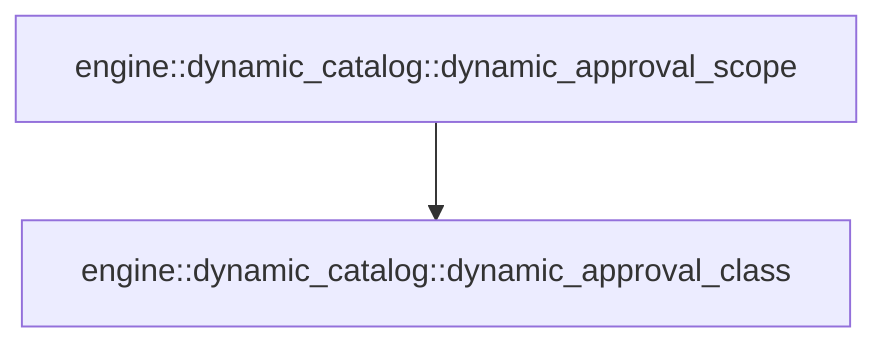

# engine::dynamic_catalog

[Package atlas](index.md) · [Source](../../src/dynamic_catalog.rs)

## Declarations

Visibility is the declaration spelling; trait members and reexports require their enclosing interface. `cfg` is not evaluated.

| Symbol | Kind | Visibility | Test / cfg |
|---|---|---|---|
| [engine::dynamic_catalog::DynamicBackend](../../src/dynamic_catalog.rs#L20) | trait_item | `pub` |  |
| [engine::dynamic_catalog::DynamicBackend::supports](../../src/dynamic_catalog.rs#L21) | function_signature_item | `private` |  |
| [engine::dynamic_catalog::DynamicBackend::execute](../../src/dynamic_catalog.rs#L23) | function_signature_item | `private` |  |
| [engine::dynamic_catalog::DynamicSupervisorBackend](../../src/dynamic_catalog.rs#L34) | struct_item | `pub` |  |
| [engine::dynamic_catalog::DynamicSupervisorBackend::new](../../src/dynamic_catalog.rs#L41) | function_item | `pub` |  |
| [engine::dynamic_catalog::DynamicSupervisorBackend::supports](../../src/dynamic_catalog.rs#L53) | function_item | `private` |  |
| [engine::dynamic_catalog::DynamicSupervisorBackend::execute](../../src/dynamic_catalog.rs#L57) | function_item | `private` |  |
| [engine::dynamic_catalog::dynamic_control_error_code](../../src/dynamic_catalog.rs#L124) | function_item | `private` |  |
| [engine::dynamic_catalog::validate_dynamic_invocation](../../src/dynamic_catalog.rs#L140) | function_item | `pub` |  |
| [engine::dynamic_catalog::DynamicToolDispatcher](../../src/dynamic_catalog.rs#L147) | struct_item | `pub` |  |
| [engine::dynamic_catalog::DynamicToolDispatcher::new](../../src/dynamic_catalog.rs#L154) | function_item | `pub` |  |
| [engine::dynamic_catalog::DynamicToolDispatcher::provider_catalog](../../src/dynamic_catalog.rs#L168) | function_item | `pub` |  |
| [engine::dynamic_catalog::DynamicToolDispatcher::provider_catalog_visible](../../src/dynamic_catalog.rs#L182) | function_item | `pub` |  |
| [engine::dynamic_catalog::DynamicToolDispatcher::complete_catalog](../../src/dynamic_catalog.rs#L203) | function_item | `pub` |  |
| [engine::dynamic_catalog::DynamicToolDispatcher::deferred_search_entries](../../src/dynamic_catalog.rs#L215) | function_item | `pub` |  |
| [engine::dynamic_catalog::DynamicToolDispatcher::dispatch](../../src/dynamic_catalog.rs#L235) | function_item | `pub` |  |
| [engine::dynamic_catalog::dynamic_workflow_backend](../../src/dynamic_catalog.rs#L300) | function_item | `pub` |  |
| [engine::dynamic_catalog::policy_descriptor](../../src/dynamic_catalog.rs#L318) | function_item | `private` |  |
| [engine::dynamic_catalog::parameter_names](../../src/dynamic_catalog.rs#L336) | function_item | `private` |  |
| [engine::dynamic_catalog::schema_description](../../src/dynamic_catalog.rs#L344) | function_item | `private` |  |
| [engine::dynamic_catalog::schema_value](../../src/dynamic_catalog.rs#L355) | function_item | `private` |  |
| [engine::dynamic_catalog::validate_dynamic_arguments](../../src/dynamic_catalog.rs#L359) | function_item | `private` |  |
| [engine::dynamic_catalog::validate_schema_value](../../src/dynamic_catalog.rs#L380) | function_item | `private` |  |
| [engine::dynamic_catalog::dynamic_side_effectful](../../src/dynamic_catalog.rs#L508) | function_item | `pub` |  |
| [engine::dynamic_catalog::dynamic_approval_class](../../src/dynamic_catalog.rs#L513) | function_item | `pub` |  |
| [engine::dynamic_catalog::dynamic_approval_scope](../../src/dynamic_catalog.rs#L526) | function_item | `private` |  |
| [engine::dynamic_catalog::DynamicDispatchError](../../src/dynamic_catalog.rs#L537) | enum_item | `pub` |  |
| [engine::dynamic_catalog::mcp_schema_defaults_tests::remote_open_and_closed_objects_keep_their_argument_semantics](../../src/dynamic_catalog.rs#L561) | function_item | `private` | test; #[cfg(test)] |

## Imports / reexports

| Local name | Source path | Visibility |
|---|---|---|
| `BTreeMap` | `std::collections::BTreeMap` | `private` |
| `DynamicTool` | `profile::DynamicTool` | `private` |
| `DynamicToolCatalog` | `profile::DynamicToolCatalog` | `private` |
| `DynamicToolEffect` | `profile::DynamicToolEffect` | `private` |
| `IJsonValue` | `schema::IJsonValue` | `private` |
| `Value` | `serde_json::Value` | `private` |
| `Error` | `thiserror::Error` | `private` |
| `Availability` | `tools::Availability` | `private` |
| `Backend` | `tools::Backend` | `private` |
| `BackendTerminal` | `tools::BackendTerminal` | `private` |
| `BuiltinTool` | `tools::BuiltinTool` | `private` |
| `Effect` | `tools::Effect` | `private` |
| `HookBinding` | `tools::HookBinding` | `private` |
| `PipelineDecision` | `tools::PipelineDecision` | `private` |
| `ToolExecution` | `tools::ToolExecution` | `private` |
| `ToolPipeline` | `tools::ToolPipeline` | `private` |
| `ToolPipelineError` | `tools::ToolPipelineError` | `private` |
| `ToolControl` | `worker_control::ToolControl` | `private` |
| `ToolControlErrorCode` | `worker_control::ToolControlErrorCode` | `private` |
| `ToolControlResult` | `worker_control::ToolControlResult` | `private` |
| `ApprovalClass` | `crate::ApprovalClass` | `private` |
| `CatalogEntry` | `crate::CatalogEntry` | `private` |
| `PolicyDecision` | `crate::PolicyDecision` | `private` |
| `ToolInvocation` | `crate::ToolInvocation` | `private` |
| `ToolPolicy` | `crate::ToolPolicy` | `private` |
| `WorkflowBackend` | `crate::WorkflowBackend` | `private` |
| `*` | `super::*` | `private` |
| `DynamicToolSource` | `profile::DynamicToolSource` | `private` |
| `DynamicToolSourceKind` | `profile::DynamicToolSourceKind` | `private` |
| `json` | `serde_json::json` | `private` |

## Module declarations

| Module | Visibility | Attributes |
|---|---|---|
| `engine::dynamic_catalog::mcp_schema_defaults_tests` | `private` | #[cfg(test)] |

## Function call graphs

Edges below are syntactically resolved calls only, including private functions. Graphs partition callers into groups of 20; they are not execution order. All unresolved sites are listed below and in the JSON inventory.

```mermaid
flowchart TD
  n0["engine::dynamic_catalog::dynamic_control_error_code"]
  n1["engine::dynamic_catalog::validate_dynamic_invocation"]
  n2["engine::dynamic_catalog::DynamicToolDispatcher::new"]
  n3["engine::dynamic_catalog::DynamicToolDispatcher::provider_catalog"]
  n4["engine::dynamic_catalog::DynamicToolDispatcher::provider_catalog_visible"]
  n5["engine::dynamic_catalog::DynamicToolDispatcher::complete_catalog"]
  n6["engine::dynamic_catalog::DynamicToolDispatcher::deferred_search_entries"]
  n7["engine::dynamic_catalog::DynamicToolDispatcher::dispatch"]
  n8["engine::dynamic_catalog::dynamic_workflow_backend"]
  n9["engine::dynamic_catalog::policy_descriptor"]
  n10["engine::dynamic_catalog::parameter_names"]
  n11["engine::dynamic_catalog::schema_description"]
  n12["engine::dynamic_catalog::schema_value"]
  n13["engine::dynamic_catalog::validate_dynamic_arguments"]
  n14["engine::dynamic_catalog::validate_schema_value"]
  n15["engine::dynamic_catalog::DynamicSupervisorBackend::new"]
  n16["engine::dynamic_catalog::dynamic_side_effectful"]
  n17["engine::dynamic_catalog::dynamic_approval_class"]
  n18["engine::dynamic_catalog::dynamic_approval_scope"]
  n19["engine::dynamic_catalog::DynamicSupervisorBackend::supports"]
  n20["engine::dynamic_catalog::DynamicSupervisorBackend::execute"]
  n21["engine::workflow_tools::WorkflowBackend::new"]
  n22["worker-control::durable::ToolControl::new"]
  n1 --> n13
  n6 --> n11
  n7 --> n9
  n7 --> n13
  n7 --> n16
  n7 --> n17
  n7 --> n18
  n8 --> n21
  n9 --> n10
  n10 --> n12
  n11 --> n12
  n13 --> n12
  n13 --> n14
  n14 --> n14
  n20 --> n0
  n20 --> n22
```

Functions 1–20: 16 direct edges

Functions 21–21: 1 direct edges

## Call sites

Includes test functions (marked in declarations). Receiver-type-required sites need type analysis/manual tracing. Calls in closures are attributed to their enclosing function; their occurrence here does not mean the closure executes immediately.

| Caller | Callee expression | Source lines | Target / classification |
|---|---|---|---|
| `new` | `session.into` | [43](../../src/dynamic_catalog.rs#L43) | receiver-type-required |
| `execute` | `self.supports` | [63](../../src/dynamic_catalog.rs#L63) | receiver-type-required |
| `execute` | `"dynamic_supervisor_unavailable".to_owned` | [65](../../src/dynamic_catalog.rs#L65) | receiver-type-required |
| `execute` | `ToolControl::new` | [70](../../src/dynamic_catalog.rs#L70) | [worker-control::durable::ToolControl::new](../../../worker-control/src/durable.rs#L203) |
| `execute` | `self.session.clone` | [71](../../src/dynamic_catalog.rs#L71) | receiver-type-required |
| `execute` | `execution.thread.clone` | [72](../../src/dynamic_catalog.rs#L72) | receiver-type-required |
| `execute` | `execution.call.clone` | [74](../../src/dynamic_catalog.rs#L74) | receiver-type-required |
| `execute` | `tool.name.clone` | [75](../../src/dynamic_catalog.rs#L75) | receiver-type-required |
| `execute` | `invocation.clone` | [76](../../src/dynamic_catalog.rs#L76) | receiver-type-required |
| `execute` | `"protocol".to_owned` | [81](../../src/dynamic_catalog.rs#L81), [99](../../src/dynamic_catalog.rs#L99), [116](../../src/dynamic_catalog.rs#L116) | receiver-type-required |
| `execute` | `error.to_string` | [82](../../src/dynamic_catalog.rs#L82), [100](../../src/dynamic_catalog.rs#L100) | receiver-type-required |
| `execute` | `(self.exchange)` | [87](../../src/dynamic_catalog.rs#L87) | external-constructor-callback-or-unresolved |
| `execute` | `"transport".to_owned` | [91](../../src/dynamic_catalog.rs#L91) | receiver-type-required |
| `execute` | `result.validate_for` | [97](../../src/dynamic_catalog.rs#L97) | receiver-type-required |
| `execute` | `BackendTerminal::Completed` | [105](../../src/dynamic_catalog.rs#L105) | external-constructor-callback-or-unresolved |
| `execute` | `dynamic_control_error_code(error.code).to_owned` | [107](../../src/dynamic_catalog.rs#L107) | receiver-type-required |
| `execute` | `dynamic_control_error_code` | [107](../../src/dynamic_catalog.rs#L107) | [engine::dynamic_catalog::dynamic_control_error_code](../../src/dynamic_catalog.rs#L124) |
| `execute` | `"invalid tool-control result union".to_owned` | [117](../../src/dynamic_catalog.rs#L117) | receiver-type-required |
| `validate_dynamic_invocation` | `validate_dynamic_arguments` | [144](../../src/dynamic_catalog.rs#L144) | [engine::dynamic_catalog::validate_dynamic_arguments](../../src/dynamic_catalog.rs#L359) |
| `new` | `catalog                 .tools                 .iter()                 .map(&#124;tool&#124; (tool.name.as_str(), tool))                 .collect` | [157](../../src/dynamic_catalog.rs#L157) | receiver-type-required |
| `new` | `catalog                 .tools                 .iter()                 .map` | [157](../../src/dynamic_catalog.rs#L157) | receiver-type-required |
| `new` | `catalog                 .tools                 .iter` | [157](../../src/dynamic_catalog.rs#L157) | receiver-type-required |
| `new` | `tool.name.as_str` | [160](../../src/dynamic_catalog.rs#L160) | receiver-type-required |
| `provider_catalog` | `self.catalog             .tools             .iter()             .filter(&#124;tool&#124; tool.always_on && backend.supports(tool))             .map(&#124;tool&#124; tool.schema.clone())             .collect` | [169](../../src/dynamic_catalog.rs#L169) | receiver-type-required |
| `provider_catalog` | `self.catalog             .tools             .iter()             .filter(&#124;tool&#124; tool.always_on && backend.supports(tool))             .map` | [169](../../src/dynamic_catalog.rs#L169) | receiver-type-required |
| `provider_catalog` | `self.catalog             .tools             .iter()             .filter` | [169](../../src/dynamic_catalog.rs#L169) | receiver-type-required |
| `provider_catalog` | `self.catalog             .tools             .iter` | [169](../../src/dynamic_catalog.rs#L169) | receiver-type-required |
| `provider_catalog` | `backend.supports` | [172](../../src/dynamic_catalog.rs#L172) | receiver-type-required |
| `provider_catalog` | `tool.schema.clone` | [173](../../src/dynamic_catalog.rs#L173) | receiver-type-required |
| `provider_catalog_visible` | `Vec::new` | [188](../../src/dynamic_catalog.rs#L188) | external-constructor-callback-or-unresolved |
| `provider_catalog_visible` | `backend.supports` | [190](../../src/dynamic_catalog.rs#L190) | receiver-type-required |
| `provider_catalog_visible` | `pipeline.has_causal_offer` | [192](../../src/dynamic_catalog.rs#L192) | receiver-type-required |
| `provider_catalog_visible` | `schemas.push` | [194](../../src/dynamic_catalog.rs#L194) | receiver-type-required |
| `provider_catalog_visible` | `tool.schema.clone` | [194](../../src/dynamic_catalog.rs#L194) | receiver-type-required |
| `provider_catalog_visible` | `Ok` | [197](../../src/dynamic_catalog.rs#L197) | external-constructor-callback-or-unresolved |
| `complete_catalog` | `self.catalog             .tools             .iter()             .filter(&#124;tool&#124; backend.supports(tool))             .map(&#124;tool&#124; tool.schema.clone())             .collect` | [204](../../src/dynamic_catalog.rs#L204) | receiver-type-required |
| `complete_catalog` | `self.catalog             .tools             .iter()             .filter(&#124;tool&#124; backend.supports(tool))             .map` | [204](../../src/dynamic_catalog.rs#L204) | receiver-type-required |
| `complete_catalog` | `self.catalog             .tools             .iter()             .filter` | [204](../../src/dynamic_catalog.rs#L204) | receiver-type-required |
| `complete_catalog` | `self.catalog             .tools             .iter` | [204](../../src/dynamic_catalog.rs#L204) | receiver-type-required |
| `complete_catalog` | `backend.supports` | [207](../../src/dynamic_catalog.rs#L207) | receiver-type-required |
| `complete_catalog` | `tool.schema.clone` | [208](../../src/dynamic_catalog.rs#L208) | receiver-type-required |
| `deferred_search_entries` | `self.catalog             .tools             .iter()             .filter(&#124;tool&#124; !tool.always_on && backend.supports(tool))             .map(&#124;tool&#124; {                 Ok(CatalogEntry {                     name: tool.name.clone(),                     summary: schema_description(tool)?,                     aliases: tool.aliases.clone(),                     schema_digest: tool.schema_digest.clone(),                     content: tool.schema.clone(),                 })             })             .collect` | [219](../../src/dynamic_catalog.rs#L219) | receiver-type-required |
| `deferred_search_entries` | `self.catalog             .tools             .iter()             .filter(&#124;tool&#124; !tool.always_on && backend.supports(tool))             .map` | [219](../../src/dynamic_catalog.rs#L219) | receiver-type-required |
| `deferred_search_entries` | `self.catalog             .tools             .iter()             .filter` | [219](../../src/dynamic_catalog.rs#L219) | receiver-type-required |
| `deferred_search_entries` | `self.catalog             .tools             .iter` | [219](../../src/dynamic_catalog.rs#L219) | receiver-type-required |
| `deferred_search_entries` | `backend.supports` | [222](../../src/dynamic_catalog.rs#L222) | receiver-type-required |
| `deferred_search_entries` | `Ok` | [224](../../src/dynamic_catalog.rs#L224) | external-constructor-callback-or-unresolved |
| `deferred_search_entries` | `tool.name.clone` | [225](../../src/dynamic_catalog.rs#L225) | receiver-type-required |
| `deferred_search_entries` | `schema_description` | [226](../../src/dynamic_catalog.rs#L226) | [engine::dynamic_catalog::schema_description](../../src/dynamic_catalog.rs#L344) |
| `deferred_search_entries` | `tool.aliases.clone` | [227](../../src/dynamic_catalog.rs#L227) | receiver-type-required |
| `deferred_search_entries` | `tool.schema_digest.clone` | [228](../../src/dynamic_catalog.rs#L228) | receiver-type-required |
| `deferred_search_entries` | `tool.schema.clone` | [229](../../src/dynamic_catalog.rs#L229) | receiver-type-required |
| `dispatch` | `self             .by_name             .get(invocation.name.as_str())             .copied()             .ok_or_else` | [243](../../src/dynamic_catalog.rs#L243) | receiver-type-required |
| `dispatch` | `self             .by_name             .get(invocation.name.as_str())             .copied` | [243](../../src/dynamic_catalog.rs#L243) | receiver-type-required |
| `dispatch` | `self             .by_name             .get` | [243](../../src/dynamic_catalog.rs#L243) | receiver-type-required |
| `dispatch` | `invocation.name.as_str` | [245](../../src/dynamic_catalog.rs#L245) | receiver-type-required |
| `dispatch` | `DynamicDispatchError::UnknownTool` | [247](../../src/dynamic_catalog.rs#L247) | external-constructor-callback-or-unresolved |
| `dispatch` | `invocation.name.clone` | [247](../../src/dynamic_catalog.rs#L247), [255](../../src/dynamic_catalog.rs#L255) | receiver-type-required |
| `dispatch` | `backend.supports` | [248](../../src/dynamic_catalog.rs#L248) | receiver-type-required |
| `dispatch` | `Err` | [249](../../src/dynamic_catalog.rs#L249) | external-constructor-callback-or-unresolved |
| `dispatch` | `DynamicDispatchError::UnavailableTool` | [249](../../src/dynamic_catalog.rs#L249) | external-constructor-callback-or-unresolved |
| `dispatch` | `tool.name.clone` | [249](../../src/dynamic_catalog.rs#L249) | receiver-type-required |
| `dispatch` | `validate_dynamic_arguments` | [251](../../src/dynamic_catalog.rs#L251), [273](../../src/dynamic_catalog.rs#L273) | [engine::dynamic_catalog::validate_dynamic_arguments](../../src/dynamic_catalog.rs#L359) |
| `dispatch` | `invocation.thread.clone` | [253](../../src/dynamic_catalog.rs#L253) | receiver-type-required |
| `dispatch` | `invocation.call.clone` | [254](../../src/dynamic_catalog.rs#L254) | receiver-type-required |
| `dispatch` | `invocation.attempt.clone` | [256](../../src/dynamic_catalog.rs#L256) | receiver-type-required |
| `dispatch` | `invocation.arguments.clone` | [257](../../src/dynamic_catalog.rs#L257) | receiver-type-required |
| `dispatch` | `dynamic_side_effectful` | [258](../../src/dynamic_catalog.rs#L258) | [engine::dynamic_catalog::dynamic_side_effectful](../../src/dynamic_catalog.rs#L508) |
| `dispatch` | `invocation.timestamp.clone` | [260](../../src/dynamic_catalog.rs#L260) | receiver-type-required |
| `dispatch` | `pipeline.verify_durable_execution` | [262](../../src/dynamic_catalog.rs#L262) | receiver-type-required |
| `dispatch` | `pipeline.verify_causal_offer` | [264](../../src/dynamic_catalog.rs#L264) | receiver-type-required |
| `dispatch` | `policy_descriptor` | [267](../../src/dynamic_catalog.rs#L267) | [engine::dynamic_catalog::policy_descriptor](../../src/dynamic_catalog.rs#L318) |
| `dispatch` | `pipeline             .execute_terminal_with_gate(                 &execution,                 hooks,                 &#124;execution, effective&#124; {                     if let Err(error) = validate_dynamic_arguments(tool, effective) {                         return tools::ApprovalGate::Deny(format!(                             "effective dynamic invocation failed validation: {error}"                         ));                     }                     match policy.decide(                         dynamic_approval_class(tool.effect),                         &policy_tool,                         execution,                         effective,                     ) {                         PolicyDecision::Allow => tools::ApprovalGate::Allow,                         PolicyDecision::Deny(reason) => tools::ApprovalGate::Deny(reason),                         PolicyDecision::Hold { question } => tools::ApprovalGate::Hold {                             scope: dynamic_approval_scope(tool.effect).to_owned(),                             question,                         },                     }                 },                 &#124;execution, effective&#124; backend.execute(tool, execution, effective),             )             .map_err` | [268](../../src/dynamic_catalog.rs#L268) | receiver-type-required |
| `dispatch` | `pipeline             .execute_terminal_with_gate` | [268](../../src/dynamic_catalog.rs#L268) | receiver-type-required |
| `dispatch` | `tools::ApprovalGate::Deny` | [274](../../src/dynamic_catalog.rs#L274), [285](../../src/dynamic_catalog.rs#L285) | external-constructor-callback-or-unresolved |
| `dispatch` | `policy.decide` | [278](../../src/dynamic_catalog.rs#L278) | receiver-type-required |
| `dispatch` | `dynamic_approval_class` | [279](../../src/dynamic_catalog.rs#L279) | [engine::dynamic_catalog::dynamic_approval_class](../../src/dynamic_catalog.rs#L513) |
| `dispatch` | `dynamic_approval_scope(tool.effect).to_owned` | [287](../../src/dynamic_catalog.rs#L287) | receiver-type-required |
| `dispatch` | `dynamic_approval_scope` | [287](../../src/dynamic_catalog.rs#L287) | [engine::dynamic_catalog::dynamic_approval_scope](../../src/dynamic_catalog.rs#L526) |
| `dispatch` | `backend.execute` | [292](../../src/dynamic_catalog.rs#L292) | receiver-type-required |
| `dynamic_workflow_backend` | `WorkflowBackend::new(         root,         workspace,         goal_id,         skills,         catalog.deferred_search_entries(backend)?,     )     .map_err` | [308](../../src/dynamic_catalog.rs#L308) | receiver-type-required |
| `dynamic_workflow_backend` | `WorkflowBackend::new` | [308](../../src/dynamic_catalog.rs#L308) | [engine::workflow_tools::WorkflowBackend::new](../../src/workflow_tools.rs#L60) |
| `dynamic_workflow_backend` | `catalog.deferred_search_entries` | [313](../../src/dynamic_catalog.rs#L313) | receiver-type-required |
| `policy_descriptor` | `parameter_names` | [320](../../src/dynamic_catalog.rs#L320) | [engine::dynamic_catalog::parameter_names](../../src/dynamic_catalog.rs#L336) |
| `policy_descriptor` | `tool.name.clone` | [332](../../src/dynamic_catalog.rs#L332) | receiver-type-required |
| `parameter_names` | `schema_value(tool)         .pointer("/parameters/properties")         .and_then(Value::as_object)         .map(&#124;properties&#124; properties.keys().cloned().collect())         .unwrap_or_default` | [337](../../src/dynamic_catalog.rs#L337) | receiver-type-required |
| `parameter_names` | `schema_value(tool)         .pointer("/parameters/properties")         .and_then(Value::as_object)         .map` | [337](../../src/dynamic_catalog.rs#L337) | receiver-type-required |
| `parameter_names` | `schema_value(tool)         .pointer("/parameters/properties")         .and_then` | [337](../../src/dynamic_catalog.rs#L337) | receiver-type-required |
| `parameter_names` | `schema_value(tool)         .pointer` | [337](../../src/dynamic_catalog.rs#L337) | receiver-type-required |
| `parameter_names` | `schema_value` | [337](../../src/dynamic_catalog.rs#L337) | [engine::dynamic_catalog::schema_value](../../src/dynamic_catalog.rs#L355) |
| `parameter_names` | `properties.keys().cloned().collect` | [340](../../src/dynamic_catalog.rs#L340) | receiver-type-required |
| `parameter_names` | `properties.keys().cloned` | [340](../../src/dynamic_catalog.rs#L340) | receiver-type-required |
| `parameter_names` | `properties.keys` | [340](../../src/dynamic_catalog.rs#L340) | receiver-type-required |
| `schema_description` | `schema_value(tool)         .get("description")         .and_then(Value::as_str)         .map(str::to_owned)         .ok_or_else` | [345](../../src/dynamic_catalog.rs#L345) | receiver-type-required |
| `schema_description` | `schema_value(tool)         .get("description")         .and_then(Value::as_str)         .map` | [345](../../src/dynamic_catalog.rs#L345) | receiver-type-required |
| `schema_description` | `schema_value(tool)         .get("description")         .and_then` | [345](../../src/dynamic_catalog.rs#L345) | receiver-type-required |
| `schema_description` | `schema_value(tool)         .get` | [345](../../src/dynamic_catalog.rs#L345) | receiver-type-required |
| `schema_description` | `schema_value` | [345](../../src/dynamic_catalog.rs#L345) | [engine::dynamic_catalog::schema_value](../../src/dynamic_catalog.rs#L355) |
| `schema_description` | `tool.name.clone` | [350](../../src/dynamic_catalog.rs#L350) | receiver-type-required |
| `schema_description` | `"description is missing".to_owned` | [351](../../src/dynamic_catalog.rs#L351) | receiver-type-required |
| `schema_value` | `serde_json::to_value(&tool.schema).expect` | [356](../../src/dynamic_catalog.rs#L356) | receiver-type-required |
| `schema_value` | `serde_json::to_value` | [356](../../src/dynamic_catalog.rs#L356) | external-constructor-callback-or-unresolved |
| `validate_dynamic_arguments` | `schema_value` | [363](../../src/dynamic_catalog.rs#L363) | [engine::dynamic_catalog::schema_value](../../src/dynamic_catalog.rs#L355) |
| `validate_dynamic_arguments` | `schema             .get("parameters")             .ok_or_else` | [365](../../src/dynamic_catalog.rs#L365) | receiver-type-required |
| `validate_dynamic_arguments` | `schema             .get` | [365](../../src/dynamic_catalog.rs#L365) | receiver-type-required |
| `validate_dynamic_arguments` | `tool.name.clone` | [368](../../src/dynamic_catalog.rs#L368), [374](../../src/dynamic_catalog.rs#L374) | receiver-type-required |
| `validate_dynamic_arguments` | `"parameters are missing".to_owned` | [369](../../src/dynamic_catalog.rs#L369) | receiver-type-required |
| `validate_dynamic_arguments` | `serde_json::to_value(arguments).map_err` | [371](../../src/dynamic_catalog.rs#L371) | receiver-type-required |
| `validate_dynamic_arguments` | `serde_json::to_value` | [371](../../src/dynamic_catalog.rs#L371) | external-constructor-callback-or-unresolved |
| `validate_dynamic_arguments` | `validate_schema_value(parameters, &arguments, "$").map_err` | [372](../../src/dynamic_catalog.rs#L372) | receiver-type-required |
| `validate_dynamic_arguments` | `validate_schema_value` | [372](../../src/dynamic_catalog.rs#L372) | [engine::dynamic_catalog::validate_schema_value](../../src/dynamic_catalog.rs#L380) |
| `validate_schema_value` | `schema         .as_object()         .ok_or_else` | [381](../../src/dynamic_catalog.rs#L381) | receiver-type-required |
| `validate_schema_value` | `schema         .as_object` | [381](../../src/dynamic_catalog.rs#L381) | receiver-type-required |
| `validate_schema_value` | `object.get` | [385](../../src/dynamic_catalog.rs#L385), [390](../../src/dynamic_catalog.rs#L390), [395](../../src/dynamic_catalog.rs#L395), [400](../../src/dynamic_catalog.rs#L400), [408](../../src/dynamic_catalog.rs#L408), [421](../../src/dynamic_catalog.rs#L421), [443](../../src/dynamic_catalog.rs#L443), [450](../../src/dynamic_catalog.rs#L450), [464](../../src/dynamic_catalog.rs#L464), [469](../../src/dynamic_catalog.rs#L469), [474](../../src/dynamic_catalog.rs#L474), [481](../../src/dynamic_catalog.rs#L481), [486](../../src/dynamic_catalog.rs#L486), [493](../../src/dynamic_catalog.rs#L493), [498](../../src/dynamic_catalog.rs#L498) | receiver-type-required |
| `validate_schema_value` | `Err` | [387](../../src/dynamic_catalog.rs#L387), [392](../../src/dynamic_catalog.rs#L392), [405](../../src/dynamic_catalog.rs#L405), [415](../../src/dynamic_catalog.rs#L415), [430](../../src/dynamic_catalog.rs#L430), [433](../../src/dynamic_catalog.rs#L433), [446](../../src/dynamic_catalog.rs#L446), [453](../../src/dynamic_catalog.rs#L453), [466](../../src/dynamic_catalog.rs#L466), [471](../../src/dynamic_catalog.rs#L471), [483](../../src/dynamic_catalog.rs#L483), [488](../../src/dynamic_catalog.rs#L488), [495](../../src/dynamic_catalog.rs#L495), [500](../../src/dynamic_catalog.rs#L500) | external-constructor-callback-or-unresolved |
| `validate_schema_value` | `object.get("enum").and_then` | [390](../../src/dynamic_catalog.rs#L390) | receiver-type-required |
| `validate_schema_value` | `values.contains` | [391](../../src/dynamic_catalog.rs#L391) | receiver-type-required |
| `validate_schema_value` | `object.get("allOf").and_then` | [395](../../src/dynamic_catalog.rs#L395) | receiver-type-required |
| `validate_schema_value` | `validate_schema_value` | [397](../../src/dynamic_catalog.rs#L397), [403](../../src/dynamic_catalog.rs#L403), [411](../../src/dynamic_catalog.rs#L411), [459](../../src/dynamic_catalog.rs#L459), [476](../../src/dynamic_catalog.rs#L476) | [engine::dynamic_catalog::validate_schema_value](../../src/dynamic_catalog.rs#L380) |
| `validate_schema_value` | `object.get("anyOf").and_then` | [400](../../src/dynamic_catalog.rs#L400) | receiver-type-required |
| `validate_schema_value` | `branches             .iter()             .any` | [401](../../src/dynamic_catalog.rs#L401) | receiver-type-required |
| `validate_schema_value` | `branches             .iter` | [401](../../src/dynamic_catalog.rs#L401), [409](../../src/dynamic_catalog.rs#L409) | receiver-type-required |
| `validate_schema_value` | `validate_schema_value(branch, value, path).is_ok` | [403](../../src/dynamic_catalog.rs#L403), [411](../../src/dynamic_catalog.rs#L411) | receiver-type-required |
| `validate_schema_value` | `object.get("oneOf").and_then` | [408](../../src/dynamic_catalog.rs#L408) | receiver-type-required |
| `validate_schema_value` | `branches             .iter()             .filter(&#124;branch&#124; validate_schema_value(branch, value, path).is_ok())             .count` | [409](../../src/dynamic_catalog.rs#L409) | receiver-type-required |
| `validate_schema_value` | `branches             .iter()             .filter` | [409](../../src/dynamic_catalog.rs#L409) | receiver-type-required |
| `validate_schema_value` | `object.get("type").and_then` | [421](../../src/dynamic_catalog.rs#L421) | receiver-type-required |
| `validate_schema_value` | `value.is_object` | [423](../../src/dynamic_catalog.rs#L423) | receiver-type-required |
| `validate_schema_value` | `value.is_array` | [424](../../src/dynamic_catalog.rs#L424) | receiver-type-required |
| `validate_schema_value` | `value.is_string` | [425](../../src/dynamic_catalog.rs#L425) | receiver-type-required |
| `validate_schema_value` | `value.as_i64().is_some` | [426](../../src/dynamic_catalog.rs#L426) | receiver-type-required |
| `validate_schema_value` | `value.as_i64` | [426](../../src/dynamic_catalog.rs#L426) | receiver-type-required |
| `validate_schema_value` | `value.as_u64().is_some` | [426](../../src/dynamic_catalog.rs#L426) | receiver-type-required |
| `validate_schema_value` | `value.as_u64` | [426](../../src/dynamic_catalog.rs#L426) | receiver-type-required |
| `validate_schema_value` | `value.is_number` | [427](../../src/dynamic_catalog.rs#L427) | receiver-type-required |
| `validate_schema_value` | `value.is_boolean` | [428](../../src/dynamic_catalog.rs#L428) | receiver-type-required |
| `validate_schema_value` | `value.is_null` | [429](../../src/dynamic_catalog.rs#L429) | receiver-type-required |
| `validate_schema_value` | `value.as_object` | [437](../../src/dynamic_catalog.rs#L437) | receiver-type-required |
| `validate_schema_value` | `object             .get("properties")             .and_then(Value::as_object)             .cloned()             .unwrap_or_default` | [438](../../src/dynamic_catalog.rs#L438) | receiver-type-required |
| `validate_schema_value` | `object             .get("properties")             .and_then(Value::as_object)             .cloned` | [438](../../src/dynamic_catalog.rs#L438) | receiver-type-required |
| `validate_schema_value` | `object             .get("properties")             .and_then` | [438](../../src/dynamic_catalog.rs#L438) | receiver-type-required |
| `validate_schema_value` | `object             .get` | [438](../../src/dynamic_catalog.rs#L438) | receiver-type-required |
| `validate_schema_value` | `object.get("required").and_then` | [443](../../src/dynamic_catalog.rs#L443) | receiver-type-required |
| `validate_schema_value` | `required.iter().filter_map` | [444](../../src/dynamic_catalog.rs#L444) | receiver-type-required |
| `validate_schema_value` | `required.iter` | [444](../../src/dynamic_catalog.rs#L444) | receiver-type-required |
| `validate_schema_value` | `map.contains_key` | [445](../../src/dynamic_catalog.rs#L445) | receiver-type-required |
| `validate_schema_value` | `object.get("additionalProperties").and_then` | [450](../../src/dynamic_catalog.rs#L450) | receiver-type-required |
| `validate_schema_value` | `Some` | [450](../../src/dynamic_catalog.rs#L450) | external-constructor-callback-or-unresolved |
| `validate_schema_value` | `map.keys` | [451](../../src/dynamic_catalog.rs#L451) | receiver-type-required |
| `validate_schema_value` | `properties.contains_key` | [452](../../src/dynamic_catalog.rs#L452) | receiver-type-required |
| `validate_schema_value` | `map.get` | [458](../../src/dynamic_catalog.rs#L458) | receiver-type-required |
| `validate_schema_value` | `value.as_array` | [463](../../src/dynamic_catalog.rs#L463) | receiver-type-required |
| `validate_schema_value` | `object.get("minItems").and_then` | [464](../../src/dynamic_catalog.rs#L464) | receiver-type-required |
| `validate_schema_value` | `items.len` | [465](../../src/dynamic_catalog.rs#L465), [470](../../src/dynamic_catalog.rs#L470) | receiver-type-required |
| `validate_schema_value` | `object.get("maxItems").and_then` | [469](../../src/dynamic_catalog.rs#L469) | receiver-type-required |
| `validate_schema_value` | `items.iter().enumerate` | [475](../../src/dynamic_catalog.rs#L475) | receiver-type-required |
| `validate_schema_value` | `items.iter` | [475](../../src/dynamic_catalog.rs#L475) | receiver-type-required |
| `validate_schema_value` | `value.as_str` | [480](../../src/dynamic_catalog.rs#L480) | receiver-type-required |
| `validate_schema_value` | `object.get("minLength").and_then` | [481](../../src/dynamic_catalog.rs#L481) | receiver-type-required |
| `validate_schema_value` | `text.chars().count` | [482](../../src/dynamic_catalog.rs#L482), [487](../../src/dynamic_catalog.rs#L487) | receiver-type-required |
| `validate_schema_value` | `text.chars` | [482](../../src/dynamic_catalog.rs#L482), [487](../../src/dynamic_catalog.rs#L487) | receiver-type-required |
| `validate_schema_value` | `object.get("maxLength").and_then` | [486](../../src/dynamic_catalog.rs#L486) | receiver-type-required |
| `validate_schema_value` | `value.as_f64` | [492](../../src/dynamic_catalog.rs#L492) | receiver-type-required |
| `validate_schema_value` | `object.get("minimum").and_then` | [493](../../src/dynamic_catalog.rs#L493) | receiver-type-required |
| `validate_schema_value` | `object.get("maximum").and_then` | [498](../../src/dynamic_catalog.rs#L498) | receiver-type-required |
| `validate_schema_value` | `Ok` | [504](../../src/dynamic_catalog.rs#L504) | external-constructor-callback-or-unresolved |
| `dynamic_approval_scope` | `dynamic_approval_class` | [527](../../src/dynamic_catalog.rs#L527) | [engine::dynamic_catalog::dynamic_approval_class](../../src/dynamic_catalog.rs#L513) |
| `remote_open_and_closed_objects_keep_their_argument_semantics` | `IJsonValue::parse(&serde_json::to_vec(&value).unwrap()).unwrap` | [562](../../src/dynamic_catalog.rs#L562) | receiver-type-required |
| `remote_open_and_closed_objects_keep_their_argument_semantics` | `IJsonValue::parse` | [562](../../src/dynamic_catalog.rs#L562) | external-constructor-callback-or-unresolved |
| `remote_open_and_closed_objects_keep_their_argument_semantics` | `serde_json::to_vec(&value).unwrap` | [562](../../src/dynamic_catalog.rs#L562) | receiver-type-required |
| `remote_open_and_closed_objects_keep_their_argument_semantics` | `serde_json::to_vec` | [562](../../src/dynamic_catalog.rs#L562) | external-constructor-callback-or-unresolved |
| `remote_open_and_closed_objects_keep_their_argument_semantics` | `DynamicTool::declared("mcp__remote__search", DynamicToolSource {                 kind: DynamicToolSourceKind::Mcp, id:"remote".into(),             }, DynamicToolEffect::ReadOnly,                 false, vec![], ijson(json!({"name":"mcp__remote__search","description":"Search","parameters":parameters}))).unwrap` | [569](../../src/dynamic_catalog.rs#L569) | receiver-type-required |
| `remote_open_and_closed_objects_keep_their_argument_semantics` | `DynamicTool::declared` | [569](../../src/dynamic_catalog.rs#L569), [582](../../src/dynamic_catalog.rs#L582) | external-constructor-callback-or-unresolved |
| `remote_open_and_closed_objects_keep_their_argument_semantics` | `"remote".into` | [570](../../src/dynamic_catalog.rs#L570), [583](../../src/dynamic_catalog.rs#L583) | receiver-type-required |
| `remote_open_and_closed_objects_keep_their_argument_semantics` | `ijson` | [572](../../src/dynamic_catalog.rs#L572), [585](../../src/dynamic_catalog.rs#L585) | external-constructor-callback-or-unresolved |
| `remote_open_and_closed_objects_keep_their_argument_semantics` | `DynamicTool::declared("mcp__remote__guide", DynamicToolSource {             kind: DynamicToolSourceKind::Mcp, id:"remote".into(),         }, DynamicToolEffect::ReadOnly, false, vec![],             ijson(json!({"name":"mcp__remote__guide","description":"Guide","parameters":{"type":"object","properties":{}}}))).unwrap` | [582](../../src/dynamic_catalog.rs#L582) | receiver-type-required |
