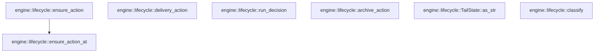

# engine::lifecycle

[Package atlas](index.md) · [Source](../../src/lifecycle.rs)

## Declarations

Visibility is the declaration spelling; trait members and reexports require their enclosing interface. `cfg` is not evaluated.

| Symbol | Kind | Visibility | Test / cfg |
|---|---|---|---|
| [engine::lifecycle::LockFacts](../../src/lifecycle.rs#L4) | struct_item | `pub` |  |
| [engine::lifecycle::FREE](../../src/lifecycle.rs#L10) | const_item | `pub` |  |
| [engine::lifecycle::CALLER](../../src/lifecycle.rs#L14) | const_item | `pub` |  |
| [engine::lifecycle::OTHER](../../src/lifecycle.rs#L18) | const_item | `pub` |  |
| [engine::lifecycle::TailState](../../src/lifecycle.rs#L25) | enum_item | `pub` |  |
| [engine::lifecycle::TailState::as_str](../../src/lifecycle.rs#L38) | function_item | `pub` |  |
| [engine::lifecycle::RunMode](../../src/lifecycle.rs#L52) | enum_item | `pub` |  |
| [engine::lifecycle::RunDecision](../../src/lifecycle.rs#L58) | enum_item | `pub` |  |
| [engine::lifecycle::EnsureAction](../../src/lifecycle.rs#L64) | enum_item | `pub` |  |
| [engine::lifecycle::DeliveryAction](../../src/lifecycle.rs#L71) | enum_item | `pub` |  |
| [engine::lifecycle::ArchiveAction](../../src/lifecycle.rs#L78) | enum_item | `pub` |  |
| [engine::lifecycle::classify](../../src/lifecycle.rs#L84) | function_item | `pub` |  |
| [engine::lifecycle::ensure_action](../../src/lifecycle.rs#L107) | function_item | `pub` |  |
| [engine::lifecycle::ensure_action_at](../../src/lifecycle.rs#L116) | function_item | `pub` |  |
| [engine::lifecycle::delivery_action](../../src/lifecycle.rs#L140) | function_item | `pub` |  |
| [engine::lifecycle::run_decision](../../src/lifecycle.rs#L159) | function_item | `pub` |  |
| [engine::lifecycle::archive_action](../../src/lifecycle.rs#L184) | function_item | `pub` |  |

## Imports / reexports

| Local name | Source path | Visibility |
|---|---|---|
| `LifecycleFacts` | `schema::LifecycleFacts` | `private` |

## Module declarations

| Module | Visibility | Attributes |
|---|---|---|

## Function call graphs

Edges below are syntactically resolved calls only, including private functions. Graphs partition callers into groups of 20; they are not execution order. All unresolved sites are listed below and in the JSON inventory.

Functions 1–7: 1 direct edges

## Call sites

Includes test functions (marked in declarations). Receiver-type-required sites need type analysis/manual tracing. Calls in closures are attributed to their enclosing function; their occurrence here does not mean the closure executes immediately.

| Caller | Callee expression | Source lines | Target / classification |
|---|---|---|---|
| `classify` | `facts.latest_turn.is_some` | [95](../../src/lifecycle.rs#L95) | receiver-type-required |
| `ensure_action` | `ensure_action_at` | [108](../../src/lifecycle.rs#L108) | [engine::lifecycle::ensure_action_at](../../src/lifecycle.rs#L116) |
| `ensure_action_at` | `facts                 .durable_wait_until()                 .zip(now)                 .is_some_and` | [124](../../src/lifecycle.rs#L124) | receiver-type-required |
| `ensure_action_at` | `facts                 .durable_wait_until()                 .zip` | [124](../../src/lifecycle.rs#L124) | receiver-type-required |
| `ensure_action_at` | `facts                 .durable_wait_until` | [124](../../src/lifecycle.rs#L124) | receiver-type-required |
| `ensure_action_at` | `facts.runnable_inputs.is_empty` | [134](../../src/lifecycle.rs#L134) | receiver-type-required |
| `run_decision` | `RunDecision::Start` | [161](../../src/lifecycle.rs#L161), [162](../../src/lifecycle.rs#L162), [171](../../src/lifecycle.rs#L171), [173](../../src/lifecycle.rs#L173), [177](../../src/lifecycle.rs#L177) | external-constructor-callback-or-unresolved |
| `run_decision` | `facts.runnable_inputs.is_empty` | [167](../../src/lifecycle.rs#L167), [176](../../src/lifecycle.rs#L176) | receiver-type-required |
| `run_decision` | `facts.durable_wait_until().is_some` | [168](../../src/lifecycle.rs#L168) | receiver-type-required |
| `run_decision` | `facts.durable_wait_until` | [168](../../src/lifecycle.rs#L168) | receiver-type-required |
| `run_decision` | `facts.resume_policy.permits` | [169](../../src/lifecycle.rs#L169) | receiver-type-required |
