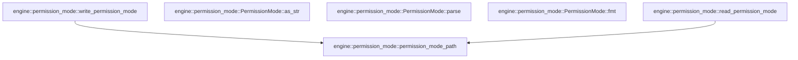

# engine::permission_mode

[Package atlas](index.md) · [Source](../../src/permission_mode.rs)

## Declarations

Visibility is the declaration spelling; trait members and reexports require their enclosing interface. `cfg` is not evaluated.

| Symbol | Kind | Visibility | Test / cfg |
|---|---|---|---|
| [engine::permission_mode::PERMISSION_MODE_FILE](../../src/permission_mode.rs#L19) | const_item | `pub` |  |
| [engine::permission_mode::PermissionMode](../../src/permission_mode.rs#L22) | enum_item | `pub` |  |
| [engine::permission_mode::ALL](../../src/permission_mode.rs#L34) | const_item | `pub` |  |
| [engine::permission_mode::PermissionMode::as_str](../../src/permission_mode.rs#L41) | function_item | `pub` |  |
| [engine::permission_mode::PermissionMode::parse](../../src/permission_mode.rs#L51) | function_item | `pub` |  |
| [engine::permission_mode::PermissionMode::fmt](../../src/permission_mode.rs#L57) | function_item | `private` |  |
| [engine::permission_mode::PermissionModeRecord](../../src/permission_mode.rs#L64) | struct_item | `private` |  |
| [engine::permission_mode::PermissionModeRead](../../src/permission_mode.rs#L73) | struct_item | `pub` |  |
| [engine::permission_mode::permission_mode_path](../../src/permission_mode.rs#L79) | function_item | `pub` |  |
| [engine::permission_mode::read_permission_mode](../../src/permission_mode.rs#L85) | function_item | `pub` |  |
| [engine::permission_mode::write_permission_mode](../../src/permission_mode.rs#L117) | function_item | `pub` |  |
| [engine::permission_mode::tests::absent_file_is_workspace_write_without_diagnostic](../../src/permission_mode.rs#L152) | function_item | `private` | test; #[cfg(test)] |
| [engine::permission_mode::tests::write_then_read_round_trips_every_mode_with_canonical_bytes](../../src/permission_mode.rs#L164) | function_item | `private` | test; #[cfg(test)] |
| [engine::permission_mode::tests::corrupt_file_falls_back_with_a_diagnostic](../../src/permission_mode.rs#L191) | function_item | `private` | test; #[cfg(test)] |
| [engine::permission_mode::tests::parse_is_exact](../../src/permission_mode.rs#L210) | function_item | `private` | test; #[cfg(test)] |

## Imports / reexports

| Local name | Source path | Visibility |
|---|---|---|
| `fmt` | `std::fmt` | `private` |
| `fs` | `std::fs` | `private` |
| `io` | `std::io` | `private` |
| `Path` | `std::path::Path` | `private` |
| `PathBuf` | `std::path::PathBuf` | `private` |
| `Deserialize` | `serde::Deserialize` | `private` |
| `Serialize` | `serde::Serialize` | `private` |
| `*` | `super::*` | `private` |

## Module declarations

| Module | Visibility | Attributes |
|---|---|---|
| `engine::permission_mode::tests` | `private` | #[cfg(test)] |

## Function call graphs

Edges below are syntactically resolved calls only, including private functions. Graphs partition callers into groups of 20; they are not execution order. All unresolved sites are listed below and in the JSON inventory.

Functions 1–6: 2 direct edges

## Call sites

Includes test functions (marked in declarations). Receiver-type-required sites need type analysis/manual tracing. Calls in closures are attributed to their enclosing function; their occurrence here does not mean the closure executes immediately.

| Caller | Callee expression | Source lines | Target / classification |
|---|---|---|---|
| `parse` | `Self::ALL.into_iter().find` | [52](../../src/permission_mode.rs#L52) | receiver-type-required |
| `parse` | `Self::ALL.into_iter` | [52](../../src/permission_mode.rs#L52) | receiver-type-required |
| `parse` | `mode.as_str` | [52](../../src/permission_mode.rs#L52) | receiver-type-required |
| `fmt` | `formatter.write_str` | [58](../../src/permission_mode.rs#L58) | receiver-type-required |
| `fmt` | `self.as_str` | [58](../../src/permission_mode.rs#L58) | receiver-type-required |
| `permission_mode_path` | `session_folder.join` | [80](../../src/permission_mode.rs#L80) | receiver-type-required |
| `read_permission_mode` | `permission_mode_path` | [86](../../src/permission_mode.rs#L86) | [engine::permission_mode::permission_mode_path](../../src/permission_mode.rs#L79) |
| `read_permission_mode` | `PermissionMode::default` | [88](../../src/permission_mode.rs#L88), [99](../../src/permission_mode.rs#L99) | external-constructor-callback-or-unresolved |
| `read_permission_mode` | `Some` | [89](../../src/permission_mode.rs#L89) | external-constructor-callback-or-unresolved |
| `read_permission_mode` | `fs::read` | [95](../../src/permission_mode.rs#L95) | external-constructor-callback-or-unresolved |
| `read_permission_mode` | `error.kind` | [97](../../src/permission_mode.rs#L97) | receiver-type-required |
| `read_permission_mode` | `fallback` | [103](../../src/permission_mode.rs#L103), [110](../../src/permission_mode.rs#L110), [111](../../src/permission_mode.rs#L111) | external-constructor-callback-or-unresolved |
| `read_permission_mode` | `error.to_string` | [103](../../src/permission_mode.rs#L103), [111](../../src/permission_mode.rs#L111) | receiver-type-required |
| `read_permission_mode` | `serde_json::from_slice::<PermissionModeRecord>` | [105](../../src/permission_mode.rs#L105) | external-constructor-callback-or-unresolved |
| `write_permission_mode` | `permission_mode_path` | [118](../../src/permission_mode.rs#L118) | [engine::permission_mode::permission_mode_path](../../src/permission_mode.rs#L79) |
| `write_permission_mode` | `serde_json_canonicalizer::to_vec(&record)         .map_err` | [120](../../src/permission_mode.rs#L120) | receiver-type-required |
| `write_permission_mode` | `serde_json_canonicalizer::to_vec` | [120](../../src/permission_mode.rs#L120) | external-constructor-callback-or-unresolved |
| `write_permission_mode` | `io::Error::new` | [121](../../src/permission_mode.rs#L121) | external-constructor-callback-or-unresolved |
| `write_permission_mode` | `error.to_string` | [121](../../src/permission_mode.rs#L121) | receiver-type-required |
| `write_permission_mode` | `bytes.push` | [122](../../src/permission_mode.rs#L122) | receiver-type-required |
| `write_permission_mode` | `session_folder.join` | [123](../../src/permission_mode.rs#L123) | receiver-type-required |
| `write_permission_mode` | `(&#124;&#124; {         let mut options = fs::OpenOptions::new();         options.write(true).create(true).truncate(true);         #[cfg(unix)]         {             use std::os::unix::fs::OpenOptionsExt as _;             options.mode(0o600);         }         let mut file = options.open(&temp)?;         io::Write::write_all(&mut file, &bytes)?;         file.sync_all()?;         drop(file);         fs::rename(&temp, &path)     })` | [127](../../src/permission_mode.rs#L127) | external-constructor-callback-or-unresolved |
| `write_permission_mode` | `fs::OpenOptions::new` | [128](../../src/permission_mode.rs#L128) | external-constructor-callback-or-unresolved |
| `write_permission_mode` | `options.write(true).create(true).truncate` | [129](../../src/permission_mode.rs#L129) | receiver-type-required |
| `write_permission_mode` | `options.write(true).create` | [129](../../src/permission_mode.rs#L129) | receiver-type-required |
| `write_permission_mode` | `options.write` | [129](../../src/permission_mode.rs#L129) | receiver-type-required |
| `write_permission_mode` | `options.mode` | [133](../../src/permission_mode.rs#L133) | receiver-type-required |
| `write_permission_mode` | `options.open` | [135](../../src/permission_mode.rs#L135) | receiver-type-required |
| `write_permission_mode` | `io::Write::write_all` | [136](../../src/permission_mode.rs#L136) | external-constructor-callback-or-unresolved |
| `write_permission_mode` | `file.sync_all` | [137](../../src/permission_mode.rs#L137) | receiver-type-required |
| `write_permission_mode` | `drop` | [138](../../src/permission_mode.rs#L138) | external-constructor-callback-or-unresolved |
| `write_permission_mode` | `fs::rename` | [139](../../src/permission_mode.rs#L139) | external-constructor-callback-or-unresolved |
| `write_permission_mode` | `result.is_err` | [141](../../src/permission_mode.rs#L141) | receiver-type-required |
| `write_permission_mode` | `fs::remove_file` | [142](../../src/permission_mode.rs#L142) | external-constructor-callback-or-unresolved |
| `absent_file_is_workspace_write_without_diagnostic` | `tempfile::tempdir().expect` | [153](../../src/permission_mode.rs#L153) | receiver-type-required |
| `absent_file_is_workspace_write_without_diagnostic` | `tempfile::tempdir` | [153](../../src/permission_mode.rs#L153) | external-constructor-callback-or-unresolved |
| `write_then_read_round_trips_every_mode_with_canonical_bytes` | `tempfile::tempdir().expect` | [165](../../src/permission_mode.rs#L165) | receiver-type-required |
| `write_then_read_round_trips_every_mode_with_canonical_bytes` | `tempfile::tempdir` | [165](../../src/permission_mode.rs#L165) | external-constructor-callback-or-unresolved |
| `write_then_read_round_trips_every_mode_with_canonical_bytes` | `write_permission_mode(folder.path(), mode).expect` | [167](../../src/permission_mode.rs#L167) | receiver-type-required |
| `write_then_read_round_trips_every_mode_with_canonical_bytes` | `write_permission_mode` | [167](../../src/permission_mode.rs#L167) | external-constructor-callback-or-unresolved |
| `write_then_read_round_trips_every_mode_with_canonical_bytes` | `folder.path` | [167](../../src/permission_mode.rs#L167), [168](../../src/permission_mode.rs#L168), [176](../../src/permission_mode.rs#L176) | receiver-type-required |
| `write_then_read_round_trips_every_mode_with_canonical_bytes` | `fs::read(permission_mode_path(folder.path())).expect` | [168](../../src/permission_mode.rs#L168) | receiver-type-required |
| `write_then_read_round_trips_every_mode_with_canonical_bytes` | `fs::read` | [168](../../src/permission_mode.rs#L168) | external-constructor-callback-or-unresolved |
| `write_then_read_round_trips_every_mode_with_canonical_bytes` | `permission_mode_path` | [168](../../src/permission_mode.rs#L168), [176](../../src/permission_mode.rs#L176) | external-constructor-callback-or-unresolved |
| `write_then_read_round_trips_every_mode_with_canonical_bytes` | `fs::metadata(permission_mode_path(folder.path()))                     .expect("metadata")                     .permissions` | [176](../../src/permission_mode.rs#L176) | receiver-type-required |
| `write_then_read_round_trips_every_mode_with_canonical_bytes` | `fs::metadata(permission_mode_path(folder.path()))                     .expect` | [176](../../src/permission_mode.rs#L176) | receiver-type-required |
| `write_then_read_round_trips_every_mode_with_canonical_bytes` | `fs::metadata` | [176](../../src/permission_mode.rs#L176) | external-constructor-callback-or-unresolved |
| `corrupt_file_falls_back_with_a_diagnostic` | `tempfile::tempdir().expect` | [192](../../src/permission_mode.rs#L192) | receiver-type-required |
| `corrupt_file_falls_back_with_a_diagnostic` | `tempfile::tempdir` | [192](../../src/permission_mode.rs#L192) | external-constructor-callback-or-unresolved |
| `corrupt_file_falls_back_with_a_diagnostic` | `fs::write(permission_mode_path(folder.path()), bytes).expect` | [198](../../src/permission_mode.rs#L198) | receiver-type-required |
| `corrupt_file_falls_back_with_a_diagnostic` | `fs::write` | [198](../../src/permission_mode.rs#L198) | external-constructor-callback-or-unresolved |
| `corrupt_file_falls_back_with_a_diagnostic` | `permission_mode_path` | [198](../../src/permission_mode.rs#L198) | external-constructor-callback-or-unresolved |
| `corrupt_file_falls_back_with_a_diagnostic` | `folder.path` | [198](../../src/permission_mode.rs#L198), [199](../../src/permission_mode.rs#L199) | receiver-type-required |
| `corrupt_file_falls_back_with_a_diagnostic` | `read_permission_mode` | [199](../../src/permission_mode.rs#L199) | external-constructor-callback-or-unresolved |
