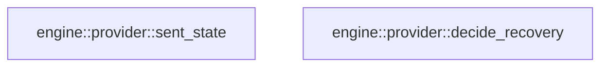

# engine::provider

[Package atlas](index.md) · [Source](../../src/provider.rs)

## Declarations

Visibility is the declaration spelling; trait members and reexports require their enclosing interface. `cfg` is not evaluated.

| Symbol | Kind | Visibility | Test / cfg |
|---|---|---|---|
| [engine::provider::Continuation](../../src/provider.rs#L4) | enum_item | `pub` |  |
| [engine::provider::QueryCapability](../../src/provider.rs#L10) | enum_item | `pub` |  |
| [engine::provider::AdapterCapabilities](../../src/provider.rs#L16) | struct_item | `pub` |  |
| [engine::provider::SentState](../../src/provider.rs#L23) | enum_item | `pub` |  |
| [engine::provider::QueryResult](../../src/provider.rs#L29) | enum_item | `pub` |  |
| [engine::provider::RecoveryDecision](../../src/provider.rs#L40) | enum_item | `pub` |  |
| [engine::provider::sent_state](../../src/provider.rs#L49) | function_item | `pub` |  |
| [engine::provider::decide_recovery](../../src/provider.rs#L58) | function_item | `pub` |  |

## Imports / reexports

| Local name | Source path | Visibility |
|---|---|---|
| `RunMode` | `crate::RunMode` | `private` |

## Module declarations

| Module | Visibility | Attributes |
|---|---|---|

## Function call graphs

Edges below are syntactically resolved calls only, including private functions. Graphs partition callers into groups of 20; they are not execution order. All unresolved sites are listed below and in the JSON inventory.

Functions 1–2: 0 direct edges

## Call sites

Includes test functions (marked in declarations). Receiver-type-required sites need type analysis/manual tracing. Calls in closures are attributed to their enclosing function; their occurrence here does not mean the closure executes immediately.

| Caller | Callee expression | Source lines | Target / classification |
|---|---|---|---|
