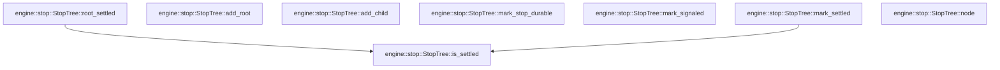

# engine::stop

[Package atlas](index.md) · [Source](../../src/stop.rs)

## Declarations

Visibility is the declaration spelling; trait members and reexports require their enclosing interface. `cfg` is not evaluated.

| Symbol | Kind | Visibility | Test / cfg |
|---|---|---|---|
| [engine::stop::StopNode](../../src/stop.rs#L4) | struct_item | `pub` |  |
| [engine::stop::StopTree](../../src/stop.rs#L13) | struct_item | `pub` |  |
| [engine::stop::StopTree::add_root](../../src/stop.rs#L19) | function_item | `pub` |  |
| [engine::stop::StopTree::add_child](../../src/stop.rs#L31) | function_item | `pub` |  |
| [engine::stop::StopTree::mark_stop_durable](../../src/stop.rs#L47) | function_item | `pub` |  |
| [engine::stop::StopTree::mark_signaled](../../src/stop.rs#L66) | function_item | `pub` |  |
| [engine::stop::StopTree::mark_settled](../../src/stop.rs#L77) | function_item | `pub` |  |
| [engine::stop::StopTree::node](../../src/stop.rs#L96) | function_item | `pub` |  |
| [engine::stop::StopTree::root_settled](../../src/stop.rs#L101) | function_item | `pub` |  |
| [engine::stop::StopTree::is_settled](../../src/stop.rs#L105) | function_item | `private` |  |

## Imports / reexports

| Local name | Source path | Visibility |
|---|---|---|
| `BTreeMap` | `std::collections::BTreeMap` | `private` |
| `BTreeSet` | `std::collections::BTreeSet` | `private` |

## Module declarations

| Module | Visibility | Attributes |
|---|---|---|

## Function call graphs

Edges below are syntactically resolved calls only, including private functions. Graphs partition callers into groups of 20; they are not execution order. All unresolved sites are listed below and in the JSON inventory.

Functions 1–8: 2 direct edges

## Call sites

Includes test functions (marked in declarations). Receiver-type-required sites need type analysis/manual tracing. Calls in closures are attributed to their enclosing function; their occurrence here does not mean the closure executes immediately.

| Caller | Callee expression | Source lines | Target / classification |
|---|---|---|---|
| `add_root` | `root.into` | [20](../../src/stop.rs#L20) | receiver-type-required |
| `add_root` | `self.nodes.entry(root.clone()).or_insert` | [21](../../src/stop.rs#L21) | receiver-type-required |
| `add_root` | `self.nodes.entry` | [21](../../src/stop.rs#L21) | receiver-type-required |
| `add_root` | `root.clone` | [21](../../src/stop.rs#L21) | receiver-type-required |
| `add_root` | `BTreeSet::new` | [23](../../src/stop.rs#L23) | external-constructor-callback-or-unresolved |
| `add_root` | `Some` | [28](../../src/stop.rs#L28) | external-constructor-callback-or-unresolved |
| `add_child` | `child.into` | [32](../../src/stop.rs#L32) | receiver-type-required |
| `add_child` | `self.nodes             .get_mut(parent)             .expect("parent must be registered first")             .children             .insert` | [33](../../src/stop.rs#L33) | receiver-type-required |
| `add_child` | `self.nodes             .get_mut(parent)             .expect` | [33](../../src/stop.rs#L33) | receiver-type-required |
| `add_child` | `self.nodes             .get_mut` | [33](../../src/stop.rs#L33) | receiver-type-required |
| `add_child` | `child.clone` | [37](../../src/stop.rs#L37) | receiver-type-required |
| `add_child` | `self.nodes.entry(child).or_insert` | [38](../../src/stop.rs#L38) | receiver-type-required |
| `add_child` | `self.nodes.entry` | [38](../../src/stop.rs#L38) | receiver-type-required |
| `add_child` | `Some` | [39](../../src/stop.rs#L39) | external-constructor-callback-or-unresolved |
| `add_child` | `parent.to_owned` | [39](../../src/stop.rs#L39) | receiver-type-required |
| `add_child` | `BTreeSet::new` | [40](../../src/stop.rs#L40) | external-constructor-callback-or-unresolved |
| `mark_stop_durable` | `self.nodes.get` | [48](../../src/stop.rs#L48) | receiver-type-required |
| `mark_stop_durable` | `current.parent.as_ref().is_none_or` | [51](../../src/stop.rs#L51) | receiver-type-required |
| `mark_stop_durable` | `current.parent.as_ref` | [51](../../src/stop.rs#L51) | receiver-type-required |
| `mark_stop_durable` | `self.nodes                 .get(parent)                 .is_some_and` | [52](../../src/stop.rs#L52) | receiver-type-required |
| `mark_stop_durable` | `self.nodes                 .get` | [52](../../src/stop.rs#L52) | receiver-type-required |
| `mark_stop_durable` | `self.nodes             .get_mut(node)             .expect` | [59](../../src/stop.rs#L59) | receiver-type-required |
| `mark_stop_durable` | `self.nodes             .get_mut` | [59](../../src/stop.rs#L59) | receiver-type-required |
| `mark_signaled` | `self.nodes.get_mut` | [67](../../src/stop.rs#L67) | receiver-type-required |
| `mark_settled` | `self             .nodes             .get(node)             .is_some_and` | [78](../../src/stop.rs#L78) | receiver-type-required |
| `mark_settled` | `self             .nodes             .get` | [78](../../src/stop.rs#L78) | receiver-type-required |
| `mark_settled` | `value.children.iter().all` | [81](../../src/stop.rs#L81) | receiver-type-required |
| `mark_settled` | `value.children.iter` | [81](../../src/stop.rs#L81) | receiver-type-required |
| `mark_settled` | `self.is_settled` | [81](../../src/stop.rs#L81) | [engine::stop::StopTree::is_settled](../../src/stop.rs#L105) |
| `mark_settled` | `self.nodes.get_mut` | [85](../../src/stop.rs#L85) | receiver-type-required |
| `node` | `self.nodes.get` | [97](../../src/stop.rs#L97) | receiver-type-required |
| `root_settled` | `self.root.as_ref().is_some_and` | [102](../../src/stop.rs#L102) | receiver-type-required |
| `root_settled` | `self.root.as_ref` | [102](../../src/stop.rs#L102) | receiver-type-required |
| `root_settled` | `self.is_settled` | [102](../../src/stop.rs#L102) | [engine::stop::StopTree::is_settled](../../src/stop.rs#L105) |
| `is_settled` | `self.nodes.get(node).is_some_and` | [106](../../src/stop.rs#L106) | receiver-type-required |
| `is_settled` | `self.nodes.get` | [106](../../src/stop.rs#L106) | receiver-type-required |
