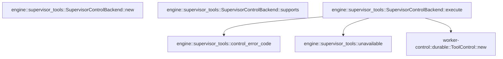

# engine::supervisor_tools

[Package atlas](index.md) · [Source](../../src/supervisor_tools.rs)

## Declarations

Visibility is the declaration spelling; trait members and reexports require their enclosing interface. `cfg` is not evaluated.

| Symbol | Kind | Visibility | Test / cfg |
|---|---|---|---|
| [engine::supervisor_tools::SupervisorControlBackend](../../src/supervisor_tools.rs#L9) | struct_item | `pub` |  |
| [engine::supervisor_tools::SupervisorControlBackend::new](../../src/supervisor_tools.rs#L16) | function_item | `pub` |  |
| [engine::supervisor_tools::SupervisorControlBackend::supports](../../src/supervisor_tools.rs#L28) | function_item | `private` |  |
| [engine::supervisor_tools::SupervisorControlBackend::execute](../../src/supervisor_tools.rs#L35) | function_item | `private` |  |
| [engine::supervisor_tools::control_error_code](../../src/supervisor_tools.rs#L66) | function_item | `private` |  |
| [engine::supervisor_tools::unavailable](../../src/supervisor_tools.rs#L80) | function_item | `private` |  |

## Imports / reexports

| Local name | Source path | Visibility |
|---|---|---|
| `IJsonValue` | `schema::IJsonValue` | `private` |
| `BackendTerminal` | `tools::BackendTerminal` | `private` |
| `ToolExecution` | `tools::ToolExecution` | `private` |
| `ToolControl` | `worker_control::ToolControl` | `private` |
| `ToolControlErrorCode` | `worker_control::ToolControlErrorCode` | `private` |
| `ToolControlResult` | `worker_control::ToolControlResult` | `private` |
| `ToolBackend` | `crate::ToolBackend` | `private` |

## Module declarations

| Module | Visibility | Attributes |
|---|---|---|

## Function call graphs

Edges below are syntactically resolved calls only, including private functions. Graphs partition callers into groups of 20; they are not execution order. All unresolved sites are listed below and in the JSON inventory.

Functions 1–5: 3 direct edges

## Call sites

Includes test functions (marked in declarations). Receiver-type-required sites need type analysis/manual tracing. Calls in closures are attributed to their enclosing function; their occurrence here does not mean the closure executes immediately.

| Caller | Callee expression | Source lines | Target / classification |
|---|---|---|---|
| `new` | `session.into` | [18](../../src/supervisor_tools.rs#L18) | receiver-type-required |
| `execute` | `ToolControl::new` | [36](../../src/supervisor_tools.rs#L36) | [worker-control::durable::ToolControl::new](../../../worker-control/src/durable.rs#L203) |
| `execute` | `self.session.clone` | [37](../../src/supervisor_tools.rs#L37) | receiver-type-required |
| `execute` | `execution.thread.clone` | [38](../../src/supervisor_tools.rs#L38) | receiver-type-required |
| `execute` | `execution.call.clone` | [40](../../src/supervisor_tools.rs#L40) | receiver-type-required |
| `execute` | `execution.name.clone` | [41](../../src/supervisor_tools.rs#L41) | receiver-type-required |
| `execute` | `invocation.clone` | [42](../../src/supervisor_tools.rs#L42) | receiver-type-required |
| `execute` | `unavailable` | [45](../../src/supervisor_tools.rs#L45), [49](../../src/supervisor_tools.rs#L49), [52](../../src/supervisor_tools.rs#L52), [56](../../src/supervisor_tools.rs#L56), [61](../../src/supervisor_tools.rs#L61) | [engine::supervisor_tools::unavailable](../../src/supervisor_tools.rs#L80) |
| `execute` | `error.to_string` | [45](../../src/supervisor_tools.rs#L45), [52](../../src/supervisor_tools.rs#L52) | receiver-type-required |
| `execute` | `(self.exchange)` | [47](../../src/supervisor_tools.rs#L47) | external-constructor-callback-or-unresolved |
| `execute` | `result.validate_for` | [51](../../src/supervisor_tools.rs#L51) | receiver-type-required |
| `execute` | `BackendTerminal::Completed` | [55](../../src/supervisor_tools.rs#L55) | external-constructor-callback-or-unresolved |
| `execute` | `control_error_code` | [57](../../src/supervisor_tools.rs#L57) | [engine::supervisor_tools::control_error_code](../../src/supervisor_tools.rs#L66) |
| `unavailable` | `code.to_owned` | [82](../../src/supervisor_tools.rs#L82) | receiver-type-required |
| `unavailable` | `message.into` | [83](../../src/supervisor_tools.rs#L83) | receiver-type-required |
