```mermaid
flowchart TD
  n0["engine::system_tools::SystemToolBackend::write"]
  n1["engine::system_tools::SystemToolBackend::edit"]
  n2["engine::system_tools::SystemToolBackend::write_content"]
  n3["engine::system_tools::SystemToolBackend::exec_helper"]
  n4["engine::system_tools::SystemToolBackend::artifact_identity"]
  n5["engine::system_tools::SystemToolBackend::allowed_roots_sentence"]
  n6["engine::system_tools::SystemToolBackend::resolve_path"]
  n7["engine::system_tools::web_fetch_result_value"]
  n8["engine::system_tools::SystemToolBackend::supports"]
  n9["engine::system_tools::SystemToolBackend::execute"]
  n10["engine::system_tools::terminal"]
  n11["engine::system_tools::unavailable"]
  n12["engine::system_tools::failure_code"]
  n13["engine::system_tools::helper_failure"]
  n14["engine::system_tools::backend_io"]
  n15["engine::system_tools::backend_store"]
  n16["engine::system_tools::json_to_ijson"]
  n17["engine::system_tools::required_str"]
  n18["engine::system_tools::normalized_relative"]
  n19["engine::system_tools::retype"]
  n20["engine::system_tools::invalid_outcome"]
  n21["engine::system_tools::patch_result_json"]
  n22["engine::system_tools::SystemToolBackend::invoke_helper"]
  n23["engine::system_tools::SystemToolBackend::web_search"]
  n24["engine::system_tools::SystemToolBackend::apply_patch"]
  n25["schema::ijson::IJsonValue::parse"]
  n26["tools::helper::ByteString::from_bytes"]
  n27["tools::schema_registry::validate_fixed_arguments"]
  n0 --> n2
  n1 --> n2
  n1 --> n19
  n1 --> n20
  n1 --> n22
  n2 --> n19
  n2 --> n22
  n2 --> n26
  n3 --> n19
  n3 --> n22
  n6 --> n18
  n9 --> n11
  n9 --> n27
  n10 --> n11
  n10 --> n12
  n10 --> n16
  n16 --> n25
  n23 --> n20
  n24 --> n19
  n24 --> n20
  n24 --> n21
  n24 --> n22
  n24 --> n26
```

# engine::system_tools

[Package atlas](index.md) · [Source](../../src/system_tools.rs)

## Declarations

Visibility is the declaration spelling; trait members and reexports require their enclosing interface. `cfg` is not evaluated.

| Symbol | Kind | Visibility | Test / cfg |
|---|---|---|---|
| [engine::system_tools::READ_SCAN_BYTES](../../src/system_tools.rs#L28) | const_item | `private` |  |
| [engine::system_tools::DEFAULT_READ_LINES](../../src/system_tools.rs#L29) | const_item | `private` |  |
| [engine::system_tools::MAX_LINE_BYTES](../../src/system_tools.rs#L30) | const_item | `private` |  |
| [engine::system_tools::GLOB_RESULTS](../../src/system_tools.rs#L31) | const_item | `private` |  |
| [engine::system_tools::EXEC_STDOUT_BYTES](../../src/system_tools.rs#L32) | const_item | `private` |  |
| [engine::system_tools::EXEC_STDERR_BYTES](../../src/system_tools.rs#L33) | const_item | `private` |  |
| [engine::system_tools::GREP_MS](../../src/system_tools.rs#L34) | const_item | `private` |  |
| [engine::system_tools::DEFAULT_SHELL_DURATION_MS](../../src/system_tools.rs#L40) | const_item | `pub` |  |
| [engine::system_tools::MAX_SHELL_DURATION_MS](../../src/system_tools.rs#L43) | const_item | `pub` |  |
| [engine::system_tools::MAX_SHELL_STEPS](../../src/system_tools.rs#L44) | const_item | `private` |  |
| [engine::system_tools::MAX_ARTIFACTS](../../src/system_tools.rs#L45) | const_item | `private` |  |
| [engine::system_tools::ExecLimits](../../src/system_tools.rs#L48) | struct_item | `private` |  |
| [engine::system_tools::outcome_try](../../src/system_tools.rs#L57) | macro_definition | `private` |  |
| [engine::system_tools::RootMount](../../src/system_tools.rs#L67) | struct_item | `pub` |  |
| [engine::system_tools::SystemToolConfig](../../src/system_tools.rs#L73) | struct_item | `pub` |  |
| [engine::system_tools::SystemToolConfig::workspace](../../src/system_tools.rs#L87) | function_item | `pub` |  |
| [engine::system_tools::SystemToolConfig::shell_budget](../../src/system_tools.rs#L103) | function_item | `private` |  |
| [engine::system_tools::ArtifactVersionPermit](../../src/system_tools.rs#L114) | struct_item | `pub` |  |
| [engine::system_tools::ArtifactVersionAuthority](../../src/system_tools.rs#L121) | trait_item | `pub` |  |
| [engine::system_tools::ArtifactVersionAuthority::observe](../../src/system_tools.rs#L122) | function_signature_item | `private` |  |
| [engine::system_tools::ArtifactVersionAuthority::reserve](../../src/system_tools.rs#L123) | function_signature_item | `private` |  |
| [engine::system_tools::ArtifactVersionAuthority::commit](../../src/system_tools.rs#L130) | function_signature_item | `private` |  |
| [engine::system_tools::CommittedEditRecorder](../../src/system_tools.rs#L138) | trait_item | `pub` |  |
| [engine::system_tools::CommittedEditRecorder::prepare](../../src/system_tools.rs#L139) | function_item | `private` |  |
| [engine::system_tools::CommittedEditRecorder::abort](../../src/system_tools.rs#L148) | function_item | `private` |  |
| [engine::system_tools::CommittedEditRecorder::record](../../src/system_tools.rs#L157) | function_signature_item | `private` |  |
| [engine::system_tools::DurableArtifactVersions](../../src/system_tools.rs#L167) | struct_item | `pub` |  |
| [engine::system_tools::VersionState](../../src/system_tools.rs#L172) | struct_item | `private` |  |
| [engine::system_tools::DurableArtifactVersions::new](../../src/system_tools.rs#L179) | function_item | `pub` |  |
| [engine::system_tools::DurableArtifactVersions::reject_ambiguous_legacy_path](../../src/system_tools.rs#L196) | function_item | `private` |  |
| [engine::system_tools::DurableArtifactVersions::locked_state](../../src/system_tools.rs#L214) | function_item | `private` |  |
| [engine::system_tools::DurableArtifactVersions::append](../../src/system_tools.rs#L320) | function_item | `private` |  |
| [engine::system_tools::DurableArtifactVersions::observe](../../src/system_tools.rs#L351) | function_item | `private` |  |
| [engine::system_tools::DurableArtifactVersions::reserve](../../src/system_tools.rs#L380) | function_item | `private` |  |
| [engine::system_tools::DurableArtifactVersions::commit](../../src/system_tools.rs#L427) | function_item | `private` |  |
| [engine::system_tools::SystemToolBackend](../../src/system_tools.rs#L463) | struct_item | `pub` |  |
| [engine::system_tools::SystemToolBackend::new](../../src/system_tools.rs#L477) | function_item | `pub` |  |
| [engine::system_tools::SystemToolBackend::with_edit_recorder](../../src/system_tools.rs#L499) | function_item | `pub` |  |
| [engine::system_tools::SystemToolBackend::execute_inner](../../src/system_tools.rs#L504) | function_item | `private` |  |
| [engine::system_tools::SystemToolBackend::invoke_helper](../../src/system_tools.rs#L526) | function_item | `private` |  |
| [engine::system_tools::SystemToolBackend::read](../../src/system_tools.rs#L550) | function_item | `private` |  |
| [engine::system_tools::SystemToolBackend::glob](../../src/system_tools.rs#L611) | function_item | `private` |  |
| [engine::system_tools::SystemToolBackend::grep](../../src/system_tools.rs#L635) | function_item | `private` |  |
| [engine::system_tools::SystemToolBackend::shell](../../src/system_tools.rs#L729) | function_item | `private` |  |
| [engine::system_tools::SystemToolBackend::web_fetch](../../src/system_tools.rs#L888) | function_item | `private` |  |
| [engine::system_tools::SystemToolBackend::web_search](../../src/system_tools.rs#L909) | function_item | `private` |  |
| [engine::system_tools::SystemToolBackend::apply_patch](../../src/system_tools.rs#L953) | function_item | `private` |  |
| [engine::system_tools::SystemToolBackend::write](../../src/system_tools.rs#L1161) | function_item | `private` |  |
| [engine::system_tools::SystemToolBackend::edit](../../src/system_tools.rs#L1171) | function_item | `private` |  |
| [engine::system_tools::SystemToolBackend::write_content](../../src/system_tools.rs#L1210) | function_item | `private` |  |
| [engine::system_tools::SystemToolBackend::exec_helper](../../src/system_tools.rs#L1309) | function_item | `private` |  |
| [engine::system_tools::SystemToolBackend::artifact_identity](../../src/system_tools.rs#L1339) | function_item | `private` |  |
| [engine::system_tools::SystemToolBackend::allowed_roots_sentence](../../src/system_tools.rs#L1361) | function_item | `private` |  |
| [engine::system_tools::SystemToolBackend::resolve_path](../../src/system_tools.rs#L1373) | function_item | `private` |  |
| [engine::system_tools::web_fetch_result_value](../../src/system_tools.rs#L1411) | function_item | `pub` |  |
| [engine::system_tools::SystemToolBackend::supports](../../src/system_tools.rs#L1427) | function_item | `private` |  |
| [engine::system_tools::SystemToolBackend::execute](../../src/system_tools.rs#L1442) | function_item | `private` |  |
| [engine::system_tools::terminal](../../src/system_tools.rs#L1454) | function_item | `private` |  |
| [engine::system_tools::unavailable](../../src/system_tools.rs#L1477) | function_item | `private` |  |
| [engine::system_tools::failure_code](../../src/system_tools.rs#L1485) | function_item | `private` |  |
| [engine::system_tools::helper_failure](../../src/system_tools.rs#L1502) | function_item | `private` |  |
| [engine::system_tools::backend_io](../../src/system_tools.rs#L1520) | function_item | `private` |  |
| [engine::system_tools::backend_store](../../src/system_tools.rs#L1524) | function_item | `private` |  |
| [engine::system_tools::json_to_ijson](../../src/system_tools.rs#L1528) | function_item | `private` |  |
| [engine::system_tools::required_str](../../src/system_tools.rs#L1533) | function_item | `private` |  |
| [engine::system_tools::optional_str](../../src/system_tools.rs#L1540) | function_item | `private` |  |
| [engine::system_tools::optional_bool](../../src/system_tools.rs#L1548) | function_item | `private` |  |
| [engine::system_tools::optional_u64](../../src/system_tools.rs#L1556) | function_item | `private` |  |
| [engine::system_tools::string_array](../../src/system_tools.rs#L1567) | function_item | `private` |  |
| [engine::system_tools::parse_steps](../../src/system_tools.rs#L1586) | function_item | `private` |  |
| [engine::system_tools::parse_artifacts](../../src/system_tools.rs#L1635) | function_item | `private` |  |
| [engine::system_tools::normalized_relative](../../src/system_tools.rs#L1678) | function_item | `private` |  |
| [engine::system_tools::exec_json](../../src/system_tools.rs#L1694) | function_item | `private` |  |
| [engine::system_tools::retype](../../src/system_tools.rs#L1707) | function_item | `private` |  |
| [engine::system_tools::invalid_outcome](../../src/system_tools.rs#L1718) | function_item | `private` |  |
| [engine::system_tools::truncate_utf8](../../src/system_tools.rs#L1722) | function_item | `private` |  |
| [engine::system_tools::PatchResult](../../src/system_tools.rs#L1734) | struct_item | `private` |  |
| [engine::system_tools::PatchResult::create](../../src/system_tools.rs#L1742) | function_item | `private` |  |
| [engine::system_tools::PatchResult::update](../../src/system_tools.rs#L1763) | function_item | `private` |  |
| [engine::system_tools::find_anchor](../../src/system_tools.rs#L1890) | function_item | `private` |  |
| [engine::system_tools::find_context](../../src/system_tools.rs#L1912) | function_item | `private` |  |
| [engine::system_tools::normalized_lines](../../src/system_tools.rs#L1959) | function_item | `private` |  |
| [engine::system_tools::detected_newline](../../src/system_tools.rs#L1970) | function_item | `private` |  |
| [engine::system_tools::forbidden_boundary](../../src/system_tools.rs#L1977) | function_item | `private` |  |
| [engine::system_tools::logical_lines](../../src/system_tools.rs#L1983) | function_item | `private` |  |
| [engine::system_tools::patch_result_json](../../src/system_tools.rs#L1991) | function_item | `private` |  |

## Imports / reexports

| Local name | Source path | Visibility |
|---|---|---|
| `BTreeMap` | `std::collections::BTreeMap` | `private` |
| `BTreeSet` | `std::collections::BTreeSet` | `private` |
| `fs` | `std::fs` | `private` |
| `File` | `std::fs::File` | `private` |
| `OpenOptions` | `std::fs::OpenOptions` | `private` |
| `Read` | `std::io::Read` | `private` |
| `Write` | `std::io::Write` | `private` |
| `_` | `std::os::unix::fs::OpenOptionsExt` | `private` |
| `Component` | `std::path::Component` | `private` |
| `Path` | `std::path::Path` | `private` |
| `PathBuf` | `std::path::PathBuf` | `private` |
| `Arc` | `std::sync::Arc` | `private` |
| `Instant` | `std::time::Instant` | `private` |
| `IJsonValue` | `schema::IJsonValue` | `private` |
| `Value` | `serde_json::Value` | `private` |
| `json` | `serde_json::json` | `private` |
| `FullSync` | `store::FullSync` | `private` |
| `NamedLock` | `store::NamedLock` | `private` |
| `BackendFailure` | `tools::BackendFailure` | `private` |
| `BackendGate` | `tools::BackendGate` | `private` |
| `BackendHold` | `tools::BackendHold` | `private` |
| `BackendOutcome` | `tools::BackendOutcome` | `private` |
| `BackendTerminal` | `tools::BackendTerminal` | `private` |
| `BackendUnavailable` | `tools::BackendUnavailable` | `private` |
| `BoundedHelper` | `tools::BoundedHelper` | `private` |
| `BoundedHttpClient` | `tools::BoundedHttpClient` | `private` |
| `ByteString` | `tools::ByteString` | `private` |
| `CancellationToken` | `tools::CancellationToken` | `private` |
| `CreateMode` | `tools::CreateMode` | `private` |
| `ExecRequest` | `tools::ExecRequest` | `private` |
| `ExecValue` | `tools::ExecValue` | `private` |
| `HelperInvoker` | `tools::HelperInvoker` | `private` |
| `HelperOperation` | `tools::HelperOperation` | `private` |
| `HelperPath` | `tools::HelperPath` | `private` |
| `HelperRequest` | `tools::HelperRequest` | `private` |
| `HelperResponse` | `tools::HelperResponse` | `private` |
| `HelperValue` | `tools::HelperValue` | `private` |
| `HttpFetchResult` | `tools::HttpFetchResult` | `private` |
| `SearchProvider` | `tools::SearchProvider` | `private` |
| `SearchRequest` | `tools::SearchRequest` | `private` |
| `SearchTopic` | `tools::SearchTopic` | `private` |
| `ToolExecution` | `tools::ToolExecution` | `private` |
| `WriteValue` | `tools::WriteValue` | `private` |
| `validate_fixed_arguments` | `tools::validate_fixed_arguments` | `private` |
| `ToolBackend` | `crate::ToolBackend` | `private` |

## Module declarations

| Module | Visibility | Attributes |
|---|---|---|

## Function call graphs

Edges below are syntactically resolved calls only, including private functions. Graphs partition callers into groups of 20; they are not execution order. All unresolved sites are listed below and in the JSON inventory.

Functions 1–20: 33 direct edges

Functions 21–40: 23 direct edges

Functions 41–60: 9 direct edges

## Call sites

Includes test functions (marked in declarations). Receiver-type-required sites need type analysis/manual tracing. Calls in closures are attributed to their enclosing function; their occurrence here does not mean the closure executes immediately.

| Caller | Callee expression | Source lines | Target / classification |
|---|---|---|---|
| `workspace` | `name.into` | [90](../../src/system_tools.rs#L90) | receiver-type-required |
| `workspace` | `path.into` | [91](../../src/system_tools.rs#L91) | receiver-type-required |
| `workspace` | `Vec::new` | [93](../../src/system_tools.rs#L93) | external-constructor-callback-or-unresolved |
| `workspace` | `"/bin/sh".to_owned` | [94](../../src/system_tools.rs#L94) | receiver-type-required |
| `workspace` | `"rg".to_owned` | [95](../../src/system_tools.rs#L95) | receiver-type-required |
| `workspace` | `BTreeMap::new` | [96](../../src/system_tools.rs#L96) | external-constructor-callback-or-unresolved |
| `shell_budget` | `self.shell_max_duration_ms.max` | [104](../../src/system_tools.rs#L104) | receiver-type-required |
| `shell_budget` | `self.shell_default_duration_ms.clamp` | [106](../../src/system_tools.rs#L106) | receiver-type-required |
| `shell_budget` | `value.max` | [108](../../src/system_tools.rs#L108) | receiver-type-required |
| `prepare` | `Ok` | [146](../../src/system_tools.rs#L146) | external-constructor-callback-or-unresolved |
| `abort` | `Ok` | [155](../../src/system_tools.rs#L155) | external-constructor-callback-or-unresolved |
| `new` | `root.into` | [180](../../src/system_tools.rs#L180) | receiver-type-required |
| `new` | `fs::create_dir_all(&root).map_err` | [181](../../src/system_tools.rs#L181) | receiver-type-required |
| `new` | `fs::create_dir_all` | [181](../../src/system_tools.rs#L181) | external-constructor-callback-or-unresolved |
| `new` | `fs::symlink_metadata(&root)             .map_err(backend_io)?             .file_type()             .is_symlink` | [182](../../src/system_tools.rs#L182) | receiver-type-required |
| `new` | `fs::symlink_metadata(&root)             .map_err(backend_io)?             .file_type` | [182](../../src/system_tools.rs#L182) | receiver-type-required |
| `new` | `fs::symlink_metadata(&root)             .map_err` | [182](../../src/system_tools.rs#L182) | receiver-type-required |
| `new` | `fs::symlink_metadata` | [182](../../src/system_tools.rs#L182) | external-constructor-callback-or-unresolved |
| `new` | `Err` | [187](../../src/system_tools.rs#L187) | external-constructor-callback-or-unresolved |
| `new` | `BackendFailure::Denied` | [187](../../src/system_tools.rs#L187) | external-constructor-callback-or-unresolved |
| `new` | `"artifact version root is a symlink".to_owned` | [188](../../src/system_tools.rs#L188) | receiver-type-required |
| `new` | `Ok` | [191](../../src/system_tools.rs#L191) | external-constructor-callback-or-unresolved |
| `reject_ambiguous_legacy_path` | `Path::new` | [200](../../src/system_tools.rs#L200), [203](../../src/system_tools.rs#L203) | external-constructor-callback-or-unresolved |
| `reject_ambiguous_legacy_path` | `target.is_absolute` | [201](../../src/system_tools.rs#L201) | receiver-type-required |
| `reject_ambiguous_legacy_path` | `states.keys` | [202](../../src/system_tools.rs#L202) | receiver-type-required |
| `reject_ambiguous_legacy_path` | `old.is_absolute` | [204](../../src/system_tools.rs#L204) | receiver-type-required |
| `reject_ambiguous_legacy_path` | `target.ends_with` | [204](../../src/system_tools.rs#L204) | receiver-type-required |
| `reject_ambiguous_legacy_path` | `Err` | [205](../../src/system_tools.rs#L205) | external-constructor-callback-or-unresolved |
| `reject_ambiguous_legacy_path` | `BackendFailure::Conflict` | [205](../../src/system_tools.rs#L205) | external-constructor-callback-or-unresolved |
| `reject_ambiguous_legacy_path` | `Ok` | [211](../../src/system_tools.rs#L211) | external-constructor-callback-or-unresolved |
| `locked_state` | `NamedLock::exclusive(self.root.join("artifact-versions.lock"))             .map_err` | [217](../../src/system_tools.rs#L217) | receiver-type-required |
| `locked_state` | `NamedLock::exclusive` | [217](../../src/system_tools.rs#L217) | [store::platform::NamedLock::exclusive](../../../store/src/platform.rs#L103) |
| `locked_state` | `self.root.join` | [217](../../src/system_tools.rs#L217), [219](../../src/system_tools.rs#L219) | receiver-type-required |
| `locked_state` | `log_path.exists` | [220](../../src/system_tools.rs#L220) | receiver-type-required |
| `locked_state` | `OpenOptions::new()             .read(true)             .append(true)             .create(true)             .mode(0o600)             .custom_flags(libc::O_CLOEXEC &#124; libc::O_NOFOLLOW)             .open(log_path)             .map_err` | [221](../../src/system_tools.rs#L221) | receiver-type-required |
| `locked_state` | `OpenOptions::new()             .read(true)             .append(true)             .create(true)             .mode(0o600)             .custom_flags(libc::O_CLOEXEC &#124; libc::O_NOFOLLOW)             .open` | [221](../../src/system_tools.rs#L221) | receiver-type-required |
| `locked_state` | `OpenOptions::new()             .read(true)             .append(true)             .create(true)             .mode(0o600)             .custom_flags` | [221](../../src/system_tools.rs#L221) | receiver-type-required |
| `locked_state` | `OpenOptions::new()             .read(true)             .append(true)             .create(true)             .mode` | [221](../../src/system_tools.rs#L221) | receiver-type-required |
| `locked_state` | `OpenOptions::new()             .read(true)             .append(true)             .create` | [221](../../src/system_tools.rs#L221) | receiver-type-required |
| `locked_state` | `OpenOptions::new()             .read(true)             .append` | [221](../../src/system_tools.rs#L221) | receiver-type-required |
| `locked_state` | `OpenOptions::new()             .read` | [221](../../src/system_tools.rs#L221) | receiver-type-required |
| `locked_state` | `OpenOptions::new` | [221](../../src/system_tools.rs#L221) | external-constructor-callback-or-unresolved |
| `locked_state` | `FullSync::full_sync(&File::open(&self.root).map_err(backend_io)?)                 .map_err` | [230](../../src/system_tools.rs#L230) | receiver-type-required |
| `locked_state` | `FullSync::full_sync` | [230](../../src/system_tools.rs#L230), [241](../../src/system_tools.rs#L241) | [store::platform::FullSync::full_sync](../../../store/src/platform.rs#L31) |
| `locked_state` | `File::open(&self.root).map_err` | [230](../../src/system_tools.rs#L230) | receiver-type-required |
| `locked_state` | `File::open` | [230](../../src/system_tools.rs#L230) | external-constructor-callback-or-unresolved |
| `locked_state` | `Vec::new` | [233](../../src/system_tools.rs#L233) | external-constructor-callback-or-unresolved |
| `locked_state` | `file.read_to_end(&mut bytes).map_err` | [234](../../src/system_tools.rs#L234) | receiver-type-required |
| `locked_state` | `file.read_to_end` | [234](../../src/system_tools.rs#L234) | receiver-type-required |
| `locked_state` | `bytes             .iter()             .rposition(&#124;byte&#124; *byte == b'\n')             .map_or` | [235](../../src/system_tools.rs#L235) | receiver-type-required |
| `locked_state` | `bytes             .iter()             .rposition` | [235](../../src/system_tools.rs#L235) | receiver-type-required |
| `locked_state` | `bytes             .iter` | [235](../../src/system_tools.rs#L235) | receiver-type-required |
| `locked_state` | `bytes.len` | [239](../../src/system_tools.rs#L239) | receiver-type-required |
| `locked_state` | `file.set_len(valid_end as u64).map_err` | [240](../../src/system_tools.rs#L240) | receiver-type-required |
| `locked_state` | `file.set_len` | [240](../../src/system_tools.rs#L240) | receiver-type-required |
| `locked_state` | `FullSync::full_sync(&file).map_err` | [241](../../src/system_tools.rs#L241) | receiver-type-required |
| `locked_state` | `bytes.truncate` | [242](../../src/system_tools.rs#L242) | receiver-type-required |
| `locked_state` | `BTreeMap::new` | [244](../../src/system_tools.rs#L244) | external-constructor-callback-or-unresolved |
| `locked_state` | `bytes             .split(&#124;byte&#124; *byte == b'\n')             .filter` | [246](../../src/system_tools.rs#L246) | receiver-type-required |
| `locked_state` | `bytes             .split` | [246](../../src/system_tools.rs#L246) | receiver-type-required |
| `locked_state` | `line.is_empty` | [248](../../src/system_tools.rs#L248) | receiver-type-required |
| `locked_state` | `IJsonValue::parse(raw)                 .map_err` | [250](../../src/system_tools.rs#L250) | receiver-type-required |
| `locked_state` | `IJsonValue::parse` | [250](../../src/system_tools.rs#L250) | [schema::ijson::IJsonValue::parse](../../../schema/src/ijson.rs#L16) |
| `locked_state` | `BackendFailure::Protocol` | [251](../../src/system_tools.rs#L251), [254](../../src/system_tools.rs#L254), [257](../../src/system_tools.rs#L257), [262](../../src/system_tools.rs#L262), [264](../../src/system_tools.rs#L264), [267](../../src/system_tools.rs#L267), [270](../../src/system_tools.rs#L270), [276](../../src/system_tools.rs#L276), [282](../../src/system_tools.rs#L282), [288](../../src/system_tools.rs#L288), [291](../../src/system_tools.rs#L291), [299](../../src/system_tools.rs#L299), [303](../../src/system_tools.rs#L303) | external-constructor-callback-or-unresolved |
| `locked_state` | `error.to_string` | [251](../../src/system_tools.rs#L251), [254](../../src/system_tools.rs#L254), [262](../../src/system_tools.rs#L262) | receiver-type-required |
| `locked_state` | `record                 .canonical_bytes()                 .map_err` | [252](../../src/system_tools.rs#L252) | receiver-type-required |
| `locked_state` | `record                 .canonical_bytes` | [252](../../src/system_tools.rs#L252) | receiver-type-required |
| `locked_state` | `Err` | [257](../../src/system_tools.rs#L257), [270](../../src/system_tools.rs#L270), [303](../../src/system_tools.rs#L303) | external-constructor-callback-or-unresolved |
| `locked_state` | `"artifact version log is not canonical JSONL".to_owned` | [258](../../src/system_tools.rs#L258) | receiver-type-required |
| `locked_state` | `serde_json::from_slice(raw)                 .map_err` | [261](../../src/system_tools.rs#L261) | receiver-type-required |
| `locked_state` | `serde_json::from_slice` | [261](../../src/system_tools.rs#L261) | external-constructor-callback-or-unresolved |
| `locked_state` | `value.as_object().ok_or_else` | [263](../../src/system_tools.rs#L263) | receiver-type-required |
| `locked_state` | `value.as_object` | [263](../../src/system_tools.rs#L263) | receiver-type-required |
| `locked_state` | `"artifact version record is not an object".to_owned` | [264](../../src/system_tools.rs#L264) | receiver-type-required |
| `locked_state` | `object.get("seq").and_then(Value::as_u64).ok_or_else` | [266](../../src/system_tools.rs#L266) | receiver-type-required |
| `locked_state` | `object.get("seq").and_then` | [266](../../src/system_tools.rs#L266) | receiver-type-required |
| `locked_state` | `object.get` | [266](../../src/system_tools.rs#L266), [275](../../src/system_tools.rs#L275), [290](../../src/system_tools.rs#L290) | receiver-type-required |
| `locked_state` | `"artifact version record lacks seq".to_owned` | [267](../../src/system_tools.rs#L267) | receiver-type-required |
| `locked_state` | `"artifact version log sequence is discontinuous".to_owned` | [271](../../src/system_tools.rs#L271) | receiver-type-required |
| `locked_state` | `object.get("path").and_then(Value::as_str).ok_or_else` | [275](../../src/system_tools.rs#L275) | receiver-type-required |
| `locked_state` | `object.get("path").and_then` | [275](../../src/system_tools.rs#L275) | receiver-type-required |
| `locked_state` | `"artifact version record lacks path".to_owned` | [276](../../src/system_tools.rs#L276) | receiver-type-required |
| `locked_state` | `object                 .get("version")                 .and_then(Value::as_u64)                 .ok_or_else` | [278](../../src/system_tools.rs#L278) | receiver-type-required |
| `locked_state` | `object                 .get("version")                 .and_then` | [278](../../src/system_tools.rs#L278) | receiver-type-required |
| `locked_state` | `object                 .get` | [278](../../src/system_tools.rs#L278), [284](../../src/system_tools.rs#L284), [293](../../src/system_tools.rs#L293) | receiver-type-required |
| `locked_state` | `"artifact version record lacks version".to_owned` | [282](../../src/system_tools.rs#L282) | receiver-type-required |
| `locked_state` | `object                 .get("sha256")                 .and_then(Value::as_str)                 .ok_or_else` | [284](../../src/system_tools.rs#L284) | receiver-type-required |
| `locked_state` | `object                 .get("sha256")                 .and_then` | [284](../../src/system_tools.rs#L284) | receiver-type-required |
| `locked_state` | `"artifact version record lacks sha256".to_owned` | [288](../../src/system_tools.rs#L288) | receiver-type-required |
| `locked_state` | `object.get("phase").and_then(Value::as_str).ok_or_else` | [290](../../src/system_tools.rs#L290) | receiver-type-required |
| `locked_state` | `object.get("phase").and_then` | [290](../../src/system_tools.rs#L290) | receiver-type-required |
| `locked_state` | `"artifact version record lacks phase".to_owned` | [291](../../src/system_tools.rs#L291) | receiver-type-required |
| `locked_state` | `object                 .get("call")                 .and_then(Value::as_str)                 .map` | [293](../../src/system_tools.rs#L293) | receiver-type-required |
| `locked_state` | `object                 .get("call")                 .and_then` | [293](../../src/system_tools.rs#L293) | receiver-type-required |
| `locked_state` | `Some` | [298](../../src/system_tools.rs#L298) | external-constructor-callback-or-unresolved |
| `locked_state` | `call.ok_or_else` | [298](../../src/system_tools.rs#L298) | receiver-type-required |
| `locked_state` | `"reserved version record lacks call".to_owned` | [299](../../src/system_tools.rs#L299) | receiver-type-required |
| `locked_state` | `states.insert` | [308](../../src/system_tools.rs#L308) | receiver-type-required |
| `locked_state` | `path.to_owned` | [309](../../src/system_tools.rs#L309) | receiver-type-required |
| `locked_state` | `sha256.to_owned` | [312](../../src/system_tools.rs#L312) | receiver-type-required |
| `locked_state` | `Ok` | [317](../../src/system_tools.rs#L317) | external-constructor-callback-or-unresolved |
| `append` | `value                 .as_object_mut()                 .expect("record is an object")                 .insert` | [337](../../src/system_tools.rs#L337) | receiver-type-required |
| `append` | `value                 .as_object_mut()                 .expect` | [337](../../src/system_tools.rs#L337) | receiver-type-required |
| `append` | `value                 .as_object_mut` | [337](../../src/system_tools.rs#L337) | receiver-type-required |
| `append` | `"call".to_owned` | [340](../../src/system_tools.rs#L340) | receiver-type-required |
| `append` | `serde_json_canonicalizer::to_vec(&value)             .map_err` | [342](../../src/system_tools.rs#L342) | receiver-type-required |
| `append` | `serde_json_canonicalizer::to_vec` | [342](../../src/system_tools.rs#L342) | external-constructor-callback-or-unresolved |
| `append` | `BackendFailure::Protocol` | [343](../../src/system_tools.rs#L343) | external-constructor-callback-or-unresolved |
| `append` | `error.to_string` | [343](../../src/system_tools.rs#L343) | receiver-type-required |
| `append` | `bytes.push` | [344](../../src/system_tools.rs#L344) | receiver-type-required |
| `append` | `file.write_all(&bytes).map_err` | [345](../../src/system_tools.rs#L345) | receiver-type-required |
| `append` | `file.write_all` | [345](../../src/system_tools.rs#L345) | receiver-type-required |
| `append` | `FullSync::full_sync(file).map_err` | [346](../../src/system_tools.rs#L346) | receiver-type-required |
| `append` | `FullSync::full_sync` | [346](../../src/system_tools.rs#L346) | [store::platform::FullSync::full_sync](../../../store/src/platform.rs#L31) |
| `observe` | `self.locked_state` | [352](../../src/system_tools.rs#L352) | receiver-type-required |
| `observe` | `Self::reject_ambiguous_legacy_path` | [353](../../src/system_tools.rs#L353) | external-constructor-callback-or-unresolved |
| `observe` | `states.remove` | [354](../../src/system_tools.rs#L354) | receiver-type-required |
| `observe` | `sha256.to_owned` | [357](../../src/system_tools.rs#L357), [373](../../src/system_tools.rs#L373) | receiver-type-required |
| `observe` | `Self::append` | [360](../../src/system_tools.rs#L360), [376](../../src/system_tools.rs#L376) | external-constructor-callback-or-unresolved |
| `observe` | `Ok` | [361](../../src/system_tools.rs#L361), [364](../../src/system_tools.rs#L364), [377](../../src/system_tools.rs#L377) | external-constructor-callback-or-unresolved |
| `observe` | `previous.pending_call.is_some` | [366](../../src/system_tools.rs#L366) | receiver-type-required |
| `observe` | `previous.version.saturating_add` | [369](../../src/system_tools.rs#L369) | receiver-type-required |
| `reserve` | `self.locked_state` | [387](../../src/system_tools.rs#L387) | receiver-type-required |
| `reserve` | `Self::reject_ambiguous_legacy_path` | [388](../../src/system_tools.rs#L388) | external-constructor-callback-or-unresolved |
| `reserve` | `states.get(path).cloned().unwrap_or_else` | [389](../../src/system_tools.rs#L389) | receiver-type-required |
| `reserve` | `states.get(path).cloned` | [389](../../src/system_tools.rs#L389) | receiver-type-required |
| `reserve` | `states.get` | [389](../../src/system_tools.rs#L389) | receiver-type-required |
| `reserve` | `preimage_sha256.to_owned` | [391](../../src/system_tools.rs#L391), [408](../../src/system_tools.rs#L408), [423](../../src/system_tools.rs#L423) | receiver-type-required |
| `reserve` | `Err` | [395](../../src/system_tools.rs#L395), [400](../../src/system_tools.rs#L400) | external-constructor-callback-or-unresolved |
| `reserve` | `BackendFailure::Conflict` | [395](../../src/system_tools.rs#L395), [400](../../src/system_tools.rs#L400) | external-constructor-callback-or-unresolved |
| `reserve` | `current.version.saturating_add` | [405](../../src/system_tools.rs#L405) | receiver-type-required |
| `reserve` | `Some` | [409](../../src/system_tools.rs#L409), [417](../../src/system_tools.rs#L417) | external-constructor-callback-or-unresolved |
| `reserve` | `call.to_owned` | [409](../../src/system_tools.rs#L409), [421](../../src/system_tools.rs#L421) | receiver-type-required |
| `reserve` | `Self::append` | [411](../../src/system_tools.rs#L411) | external-constructor-callback-or-unresolved |
| `reserve` | `Ok` | [419](../../src/system_tools.rs#L419) | external-constructor-callback-or-unresolved |
| `reserve` | `path.to_owned` | [420](../../src/system_tools.rs#L420) | receiver-type-required |
| `commit` | `self.locked_state` | [432](../../src/system_tools.rs#L432) | receiver-type-required |
| `commit` | `states.get(&permit.path).ok_or_else` | [433](../../src/system_tools.rs#L433) | receiver-type-required |
| `commit` | `states.get` | [433](../../src/system_tools.rs#L433) | receiver-type-required |
| `commit` | `BackendFailure::Protocol` | [434](../../src/system_tools.rs#L434) | external-constructor-callback-or-unresolved |
| `commit` | `"artifact reservation disappeared".to_owned` | [434](../../src/system_tools.rs#L434) | receiver-type-required |
| `commit` | `current.pending_call.as_deref` | [438](../../src/system_tools.rs#L438) | receiver-type-required |
| `commit` | `Some` | [438](../../src/system_tools.rs#L438), [455](../../src/system_tools.rs#L455) | external-constructor-callback-or-unresolved |
| `commit` | `permit.call.as_str` | [438](../../src/system_tools.rs#L438) | receiver-type-required |
| `commit` | `Err` | [440](../../src/system_tools.rs#L440) | external-constructor-callback-or-unresolved |
| `commit` | `BackendFailure::Conflict` | [440](../../src/system_tools.rs#L440) | external-constructor-callback-or-unresolved |
| `commit` | `"artifact reservation no longer belongs to this call".to_owned` | [441](../../src/system_tools.rs#L441) | receiver-type-required |
| `commit` | `resulting_sha256.to_owned` | [446](../../src/system_tools.rs#L446) | receiver-type-required |
| `commit` | `Self::append` | [449](../../src/system_tools.rs#L449) | external-constructor-callback-or-unresolved |
| `commit` | `Ok` | [457](../../src/system_tools.rs#L457) | external-constructor-callback-or-unresolved |
| `new` | `helper.is_some` | [485](../../src/system_tools.rs#L485) | receiver-type-required |
| `new` | `BoundedHelper::new` | [488](../../src/system_tools.rs#L488) | [tools::runtime_backends::BoundedHelper::new](../../../tools/src/runtime_backends.rs#L198) |
| `with_edit_recorder` | `Some` | [500](../../src/system_tools.rs#L500) | external-constructor-callback-or-unresolved |
| `execute_inner` | `execution.name.as_str` | [505](../../src/system_tools.rs#L505) | receiver-type-required |
| `execute_inner` | `self.apply_patch` | [506](../../src/system_tools.rs#L506) | [engine::system_tools::SystemToolBackend::apply_patch](../../src/system_tools.rs#L953) |
| `execute_inner` | `self.edit` | [507](../../src/system_tools.rs#L507) | [engine::system_tools::SystemToolBackend::edit](../../src/system_tools.rs#L1171) |
| `execute_inner` | `self.write` | [508](../../src/system_tools.rs#L508) | [engine::system_tools::SystemToolBackend::write](../../src/system_tools.rs#L1161) |
| `execute_inner` | `self.read` | [509](../../src/system_tools.rs#L509) | [engine::system_tools::SystemToolBackend::read](../../src/system_tools.rs#L550) |
| `execute_inner` | `self.glob` | [510](../../src/system_tools.rs#L510) | [engine::system_tools::SystemToolBackend::glob](../../src/system_tools.rs#L611) |
| `execute_inner` | `self.grep` | [511](../../src/system_tools.rs#L511) | [engine::system_tools::SystemToolBackend::grep](../../src/system_tools.rs#L635) |
| `execute_inner` | `self.shell` | [512](../../src/system_tools.rs#L512) | [engine::system_tools::SystemToolBackend::shell](../../src/system_tools.rs#L729) |
| `execute_inner` | `self.web_fetch` | [513](../../src/system_tools.rs#L513) | [engine::system_tools::SystemToolBackend::web_fetch](../../src/system_tools.rs#L888) |
| `execute_inner` | `self.web_search` | [514](../../src/system_tools.rs#L514) | [engine::system_tools::SystemToolBackend::web_search](../../src/system_tools.rs#L909) |
| `execute_inner` | `unavailable` | [516](../../src/system_tools.rs#L516) | [engine::system_tools::unavailable](../../src/system_tools.rs#L1477) |
| `execute_inner` | `terminal` | [523](../../src/system_tools.rs#L523) | [engine::system_tools::terminal](../../src/system_tools.rs#L1454) |
| `invoke_helper` | `self.helper.invoke` | [527](../../src/system_tools.rs#L527) | receiver-type-required |
| `invoke_helper` | `call.to_owned` | [529](../../src/system_tools.rs#L529) | receiver-type-required |
| `invoke_helper` | `BackendOutcome::Completed` | [536](../../src/system_tools.rs#L536), [539](../../src/system_tools.rs#L539), [541](../../src/system_tools.rs#L541), [544](../../src/system_tools.rs#L544) | external-constructor-callback-or-unresolved |
| `invoke_helper` | `Ok` | [536](../../src/system_tools.rs#L536) | external-constructor-callback-or-unresolved |
| `invoke_helper` | `Err` | [539](../../src/system_tools.rs#L539), [541](../../src/system_tools.rs#L541), [544](../../src/system_tools.rs#L544) | external-constructor-callback-or-unresolved |
| `invoke_helper` | `helper_failure` | [539](../../src/system_tools.rs#L539) | [engine::system_tools::helper_failure](../../src/system_tools.rs#L1502) |
| `invoke_helper` | `BackendFailure::Protocol` | [542](../../src/system_tools.rs#L542) | external-constructor-callback-or-unresolved |
| `invoke_helper` | `"helper response id did not match call id".to_owned` | [542](../../src/system_tools.rs#L542) | receiver-type-required |
| `invoke_helper` | `BackendOutcome::Hold` | [545](../../src/system_tools.rs#L545) | external-constructor-callback-or-unresolved |
| `invoke_helper` | `BackendOutcome::Unavailable` | [546](../../src/system_tools.rs#L546) | external-constructor-callback-or-unresolved |
| `read` | `outcome_try!(optional_u64(args, "offset")).unwrap_or` | [552](../../src/system_tools.rs#L552) | receiver-type-required |
| `read` | `outcome_try!(optional_u64(args, "limit")).unwrap_or` | [553](../../src/system_tools.rs#L553) | receiver-type-required |
| `read` | `self.invoke_helper` | [556](../../src/system_tools.rs#L556) | [engine::system_tools::SystemToolBackend::invoke_helper](../../src/system_tools.rs#L526) |
| `read` | `retype` | [565](../../src/system_tools.rs#L565) | [engine::system_tools::retype](../../src/system_tools.rs#L1707) |
| `read` | `BackendOutcome::Unavailable` | [573](../../src/system_tools.rs#L573) | external-constructor-callback-or-unresolved |
| `read` | `"artifact-version-authority".to_owned` | [574](../../src/system_tools.rs#L574) | receiver-type-required |
| `read` | `"durable artifact version authority is not configured".to_owned` | [575](../../src/system_tools.rs#L575) | receiver-type-required |
| `read` | `text.lines().collect` | [587](../../src/system_tools.rs#L587) | receiver-type-required |
| `read` | `text.lines` | [587](../../src/system_tools.rs#L587) | receiver-type-required |
| `read` | `all             .iter()             .enumerate()             .skip(start)             .take(count)             .map(&#124;(index, line)&#124; {                 let (text, truncated) = truncate_utf8(line, MAX_LINE_BYTES);                 json!({"line": index + 1, "text": text, "truncated": truncated})             })             .collect::<Vec<_>>` | [588](../../src/system_tools.rs#L588) | receiver-type-required |
| `read` | `all             .iter()             .enumerate()             .skip(start)             .take(count)             .map` | [588](../../src/system_tools.rs#L588) | receiver-type-required |
| `read` | `all             .iter()             .enumerate()             .skip(start)             .take` | [588](../../src/system_tools.rs#L588) | receiver-type-required |
| `read` | `all             .iter()             .enumerate()             .skip` | [588](../../src/system_tools.rs#L588) | receiver-type-required |
| `read` | `all             .iter()             .enumerate` | [588](../../src/system_tools.rs#L588) | receiver-type-required |
| `read` | `all             .iter` | [588](../../src/system_tools.rs#L588) | receiver-type-required |
| `read` | `truncate_utf8` | [594](../../src/system_tools.rs#L594) | [engine::system_tools::truncate_utf8](../../src/system_tools.rs#L1722) |
| `read` | `BackendOutcome::Completed` | [598](../../src/system_tools.rs#L598) | external-constructor-callback-or-unresolved |
| `read` | `Ok` | [598](../../src/system_tools.rs#L598) | external-constructor-callback-or-unresolved |
| `glob` | `outcome_try!(optional_str(args, "path")).unwrap_or` | [613](../../src/system_tools.rs#L613) | receiver-type-required |
| `glob` | `relative.is_empty` | [615](../../src/system_tools.rs#L615) | receiver-type-required |
| `glob` | `pattern.to_owned` | [616](../../src/system_tools.rs#L616) | receiver-type-required |
| `glob` | `self.invoke_helper` | [620](../../src/system_tools.rs#L620) | [engine::system_tools::SystemToolBackend::invoke_helper](../../src/system_tools.rs#L526) |
| `glob` | `BackendOutcome::Completed` | [629](../../src/system_tools.rs#L629) | external-constructor-callback-or-unresolved |
| `glob` | `Ok` | [629](../../src/system_tools.rs#L629) | external-constructor-callback-or-unresolved |
| `glob` | `retype` | [631](../../src/system_tools.rs#L631) | [engine::system_tools::retype](../../src/system_tools.rs#L1707) |
| `grep` | `outcome_try!(optional_str(args, "path")).unwrap_or` | [637](../../src/system_tools.rs#L637) | receiver-type-required |
| `grep` | `outcome_try!(optional_str(args, "output_mode")).unwrap_or` | [638](../../src/system_tools.rs#L638) | receiver-type-required |
| `grep` | `outcome_try!(optional_bool(args, "case_insensitive")).unwrap_or` | [640](../../src/system_tools.rs#L640) | receiver-type-required |
| `grep` | `outcome_try!(optional_u64(args, "context_lines")).unwrap_or` | [641](../../src/system_tools.rs#L641) | receiver-type-required |
| `grep` | `argv.extend` | [652](../../src/system_tools.rs#L652), [661](../../src/system_tools.rs#L661), [664](../../src/system_tools.rs#L664), [674](../../src/system_tools.rs#L674) | receiver-type-required |
| `grep` | `"--line-number".to_owned` | [652](../../src/system_tools.rs#L652) | receiver-type-required |
| `grep` | `"--no-heading".to_owned` | [652](../../src/system_tools.rs#L652) | receiver-type-required |
| `grep` | `argv.push` | [653](../../src/system_tools.rs#L653), [654](../../src/system_tools.rs#L654), [658](../../src/system_tools.rs#L658) | receiver-type-required |
| `grep` | `"--files-with-matches".to_owned` | [653](../../src/system_tools.rs#L653) | receiver-type-required |
| `grep` | `"--count".to_owned` | [654](../../src/system_tools.rs#L654) | receiver-type-required |
| `grep` | `invalid_outcome` | [655](../../src/system_tools.rs#L655) | [engine::system_tools::invalid_outcome](../../src/system_tools.rs#L1718) |
| `grep` | `"--ignore-case".to_owned` | [658](../../src/system_tools.rs#L658) | receiver-type-required |
| `grep` | `"--context".to_owned` | [661](../../src/system_tools.rs#L661) | receiver-type-required |
| `grep` | `context.to_string` | [661](../../src/system_tools.rs#L661) | receiver-type-required |
| `grep` | `"--glob".to_owned` | [664](../../src/system_tools.rs#L664) | receiver-type-required |
| `grep` | `glob.to_owned` | [664](../../src/system_tools.rs#L664) | receiver-type-required |
| `grep` | `relative.is_empty` | [669](../../src/system_tools.rs#L669) | receiver-type-required |
| `grep` | `".".to_owned` | [670](../../src/system_tools.rs#L670) | receiver-type-required |
| `grep` | `relative.clone` | [672](../../src/system_tools.rs#L672) | receiver-type-required |
| `grep` | `"--".to_owned` | [674](../../src/system_tools.rs#L674) | receiver-type-required |
| `grep` | `pattern.to_owned` | [674](../../src/system_tools.rs#L674), [694](../../src/system_tools.rs#L694) | receiver-type-required |
| `grep` | `self.exec_helper` | [675](../../src/system_tools.rs#L675) | [engine::system_tools::SystemToolBackend::exec_helper](../../src/system_tools.rs#L1309) |
| `grep` | `String::new` | [679](../../src/system_tools.rs#L679) | external-constructor-callback-or-unresolved |
| `grep` | `Some` | [681](../../src/system_tools.rs#L681) | external-constructor-callback-or-unresolved |
| `grep` | `self.invoke_helper` | [689](../../src/system_tools.rs#L689) | [engine::system_tools::SystemToolBackend::invoke_helper](../../src/system_tools.rs#L526) |
| `grep` | `glob.map` | [695](../../src/system_tools.rs#L695) | receiver-type-required |
| `grep` | `output_mode.to_owned` | [696](../../src/system_tools.rs#L696) | receiver-type-required |
| `grep` | `BackendOutcome::Completed` | [704](../../src/system_tools.rs#L704), [714](../../src/system_tools.rs#L714), [722](../../src/system_tools.rs#L722) | external-constructor-callback-or-unresolved |
| `grep` | `Ok` | [704](../../src/system_tools.rs#L704) | external-constructor-callback-or-unresolved |
| `grep` | `retype` | [706](../../src/system_tools.rs#L706), [725](../../src/system_tools.rs#L725) | [engine::system_tools::retype](../../src/system_tools.rs#L1707) |
| `grep` | `exec_json(value, true).map` | [714](../../src/system_tools.rs#L714) | receiver-type-required |
| `grep` | `exec_json` | [714](../../src/system_tools.rs#L714) | [engine::system_tools::exec_json](../../src/system_tools.rs#L1694) |
| `grep` | `result                         .as_object_mut()                         .expect("exec result is an object")                         .insert` | [715](../../src/system_tools.rs#L715) | receiver-type-required |
| `grep` | `result                         .as_object_mut()                         .expect` | [715](../../src/system_tools.rs#L715) | receiver-type-required |
| `grep` | `result                         .as_object_mut` | [715](../../src/system_tools.rs#L715) | receiver-type-required |
| `grep` | `"matched".to_owned` | [718](../../src/system_tools.rs#L718) | receiver-type-required |
| `grep` | `Err` | [722](../../src/system_tools.rs#L722) | external-constructor-callback-or-unresolved |
| `grep` | `BackendFailure::Io` | [723](../../src/system_tools.rs#L723) | external-constructor-callback-or-unresolved |
| `shell` | `artifacts.is_empty` | [731](../../src/system_tools.rs#L731) | receiver-type-required |
| `shell` | `self.artifact_versions.is_none` | [731](../../src/system_tools.rs#L731) | receiver-type-required |
| `shell` | `BackendOutcome::Unavailable` | [732](../../src/system_tools.rs#L732) | external-constructor-callback-or-unresolved |
| `shell` | `"artifact-version-authority".to_owned` | [733](../../src/system_tools.rs#L733) | receiver-type-required |
| `shell` | `"declared shell artifacts require durable version tracking".to_owned` | [734](../../src/system_tools.rs#L734) | receiver-type-required |
| `shell` | `outcome_try!(optional_str(args, "working_directory")).unwrap_or` | [737](../../src/system_tools.rs#L737) | receiver-type-required |
| `shell` | `output_tokens             .map(&#124;tokens&#124; tokens.saturating_mul(4).clamp(1, EXEC_STDOUT_BYTES))             .unwrap_or` | [741](../../src/system_tools.rs#L741) | receiver-type-required |
| `shell` | `output_tokens             .map` | [741](../../src/system_tools.rs#L741) | receiver-type-required |
| `shell` | `tokens.saturating_mul(4).clamp` | [742](../../src/system_tools.rs#L742) | receiver-type-required |
| `shell` | `tokens.saturating_mul` | [742](../../src/system_tools.rs#L742) | receiver-type-required |
| `shell` | `stdout_bytes.min` | [744](../../src/system_tools.rs#L744) | receiver-type-required |
| `shell` | `outcome_try!(optional_str(args, "failure_policy")).unwrap_or` | [746](../../src/system_tools.rs#L746) | receiver-type-required |
| `shell` | `invalid_outcome` | [748](../../src/system_tools.rs#L748), [762](../../src/system_tools.rs#L762), [766](../../src/system_tools.rs#L766) | [engine::system_tools::invalid_outcome](../../src/system_tools.rs#L1718) |
| `shell` | `Vec::new` | [750](../../src/system_tools.rs#L750) | external-constructor-callback-or-unresolved |
| `shell` | `commands.push` | [752](../../src/system_tools.rs#L752), [760](../../src/system_tools.rs#L760) | receiver-type-required |
| `shell` | `argv.extend` | [759](../../src/system_tools.rs#L759) | receiver-type-required |
| `shell` | `outcome_try!(string_array(args, "args")).unwrap_or_default` | [759](../../src/system_tools.rs#L759) | receiver-type-required |
| `shell` | `commands.extend` | [764](../../src/system_tools.rs#L764) | receiver-type-required |
| `shell` | `commands.len` | [765](../../src/system_tools.rs#L765), [772](../../src/system_tools.rs#L772) | receiver-type-required |
| `shell` | `self.config.shell_budget` | [768](../../src/system_tools.rs#L768) | receiver-type-required |
| `shell` | `Instant::now` | [770](../../src/system_tools.rs#L770) | external-constructor-callback-or-unresolved |
| `shell` | `Vec::with_capacity` | [772](../../src/system_tools.rs#L772), [844](../../src/system_tools.rs#L844) | external-constructor-callback-or-unresolved |
| `shell` | `commands.into_iter().enumerate` | [773](../../src/system_tools.rs#L773) | receiver-type-required |
| `shell` | `commands.into_iter` | [773](../../src/system_tools.rs#L773) | receiver-type-required |
| `shell` | `results.push` | [775](../../src/system_tools.rs#L775), [787](../../src/system_tools.rs#L787), [815](../../src/system_tools.rs#L815), [836](../../src/system_tools.rs#L836) | receiver-type-required |
| `shell` | `u64::try_from(started.elapsed().as_millis()).unwrap_or` | [782](../../src/system_tools.rs#L782) | receiver-type-required |
| `shell` | `u64::try_from` | [782](../../src/system_tools.rs#L782) | external-constructor-callback-or-unresolved |
| `shell` | `started.elapsed().as_millis` | [782](../../src/system_tools.rs#L782) | receiver-type-required |
| `shell` | `started.elapsed` | [782](../../src/system_tools.rs#L782) | receiver-type-required |
| `shell` | `budget.checked_sub(elapsed).filter` | [783](../../src/system_tools.rs#L783) | receiver-type-required |
| `shell` | `budget.checked_sub` | [783](../../src/system_tools.rs#L783) | receiver-type-required |
| `shell` | `self.exec_helper` | [796](../../src/system_tools.rs#L796) | [engine::system_tools::SystemToolBackend::exec_helper](../../src/system_tools.rs#L1309) |
| `shell` | `argv.clone` | [798](../../src/system_tools.rs#L798) | receiver-type-required |
| `shell` | `root.clone` | [799](../../src/system_tools.rs#L799) | receiver-type-required |
| `shell` | `relative.clone` | [800](../../src/system_tools.rs#L800) | receiver-type-required |
| `shell` | `Some` | [802](../../src/system_tools.rs#L802) | external-constructor-callback-or-unresolved |
| `shell` | `retype` | [826](../../src/system_tools.rs#L826), [875](../../src/system_tools.rs#L875) | [engine::system_tools::retype](../../src/system_tools.rs#L1707) |
| `shell` | `exec_json(exec, step_succeeded)                 .unwrap_or_else` | [830](../../src/system_tools.rs#L830) | receiver-type-required |
| `shell` | `exec_json` | [830](../../src/system_tools.rs#L830) | [engine::system_tools::exec_json](../../src/system_tools.rs#L1694) |
| `shell` | `value.as_object_mut` | [832](../../src/system_tools.rs#L832) | receiver-type-required |
| `shell` | `object.insert` | [833](../../src/system_tools.rs#L833), [834](../../src/system_tools.rs#L834) | receiver-type-required |
| `shell` | `"index".to_owned` | [833](../../src/system_tools.rs#L833) | receiver-type-required |
| `shell` | `"program".to_owned` | [834](../../src/system_tools.rs#L834) | receiver-type-required |
| `shell` | `artifacts                 .iter()                 .map(&#124;path&#124; json!({"path": path, "status": "not_checked"}))                 .collect` | [839](../../src/system_tools.rs#L839) | receiver-type-required |
| `shell` | `artifacts                 .iter()                 .map` | [839](../../src/system_tools.rs#L839) | receiver-type-required |
| `shell` | `artifacts                 .iter` | [839](../../src/system_tools.rs#L839) | receiver-type-required |
| `shell` | `artifacts.len` | [844](../../src/system_tools.rs#L844) | receiver-type-required |
| `shell` | `self.invoke_helper` | [848](../../src/system_tools.rs#L848) | [engine::system_tools::SystemToolBackend::invoke_helper](../../src/system_tools.rs#L526) |
| `shell` | `self.config.workspace.name.clone` | [851](../../src/system_tools.rs#L851) | receiver-type-required |
| `shell` | `self                             .artifact_versions                             .as_ref()                             .expect` | [857](../../src/system_tools.rs#L857) | receiver-type-required |
| `shell` | `self                             .artifact_versions                             .as_ref` | [857](../../src/system_tools.rs#L857) | receiver-type-required |
| `shell` | `output.push` | [862](../../src/system_tools.rs#L862) | receiver-type-required |
| `shell` | `BackendOutcome::Completed` | [871](../../src/system_tools.rs#L871), [880](../../src/system_tools.rs#L880) | external-constructor-callback-or-unresolved |
| `shell` | `Err` | [871](../../src/system_tools.rs#L871) | external-constructor-callback-or-unresolved |
| `shell` | `BackendFailure::NotFound` | [871](../../src/system_tools.rs#L871) | external-constructor-callback-or-unresolved |
| `shell` | `Ok` | [880](../../src/system_tools.rs#L880) | external-constructor-callback-or-unresolved |
| `web_fetch` | `BackendOutcome::Unavailable` | [890](../../src/system_tools.rs#L890), [905](../../src/system_tools.rs#L905) | external-constructor-callback-or-unresolved |
| `web_fetch` | `"http-client".to_owned` | [891](../../src/system_tools.rs#L891) | receiver-type-required |
| `web_fetch` | `"bounded HTTP client is not configured".to_owned` | [892](../../src/system_tools.rs#L892) | receiver-type-required |
| `web_fetch` | `http.fetch` | [895](../../src/system_tools.rs#L895) | receiver-type-required |
| `web_fetch` | `BackendOutcome::Completed` | [901](../../src/system_tools.rs#L901), [903](../../src/system_tools.rs#L903) | external-constructor-callback-or-unresolved |
| `web_fetch` | `Ok` | [901](../../src/system_tools.rs#L901) | external-constructor-callback-or-unresolved |
| `web_fetch` | `web_fetch_result_value` | [901](../../src/system_tools.rs#L901) | [engine::system_tools::web_fetch_result_value](../../src/system_tools.rs#L1411) |
| `web_fetch` | `Err` | [903](../../src/system_tools.rs#L903) | external-constructor-callback-or-unresolved |
| `web_fetch` | `BackendOutcome::Hold` | [904](../../src/system_tools.rs#L904) | external-constructor-callback-or-unresolved |
| `web_search` | `BackendOutcome::Unavailable` | [911](../../src/system_tools.rs#L911), [949](../../src/system_tools.rs#L949) | external-constructor-callback-or-unresolved |
| `web_search` | `"http-client".to_owned` | [912](../../src/system_tools.rs#L912) | receiver-type-required |
| `web_search` | `"bounded HTTP client is not configured".to_owned` | [913](../../src/system_tools.rs#L913) | receiver-type-required |
| `web_search` | `outcome_try!(optional_str(args, "topic")).unwrap_or` | [916](../../src/system_tools.rs#L916) | receiver-type-required |
| `web_search` | `invalid_outcome` | [919](../../src/system_tools.rs#L919) | [engine::system_tools::invalid_outcome](../../src/system_tools.rs#L1718) |
| `web_search` | `outcome_try!(optional_u64(args, "max_results")).unwrap_or` | [921](../../src/system_tools.rs#L921) | receiver-type-required |
| `web_search` | `execution.call.clone` | [927](../../src/system_tools.rs#L927) | receiver-type-required |
| `web_search` | `outcome_try!(required_str(args, "query")).to_owned` | [928](../../src/system_tools.rs#L928) | receiver-type-required |
| `web_search` | `http.search` | [932](../../src/system_tools.rs#L932) | receiver-type-required |
| `web_search` | `self.search.as_deref` | [934](../../src/system_tools.rs#L934) | receiver-type-required |
| `web_search` | `BackendOutcome::Completed` | [938](../../src/system_tools.rs#L938), [947](../../src/system_tools.rs#L947) | external-constructor-callback-or-unresolved |
| `web_search` | `Ok` | [938](../../src/system_tools.rs#L938) | external-constructor-callback-or-unresolved |
| `web_search` | `Err` | [947](../../src/system_tools.rs#L947) | external-constructor-callback-or-unresolved |
| `web_search` | `BackendOutcome::Hold` | [948](../../src/system_tools.rs#L948) | external-constructor-callback-or-unresolved |
| `apply_patch` | `args             .get("summary")             .and_then(Value::as_str)             .unwrap_or` | [956](../../src/system_tools.rs#L956) | receiver-type-required |
| `apply_patch` | `args             .get("summary")             .and_then` | [956](../../src/system_tools.rs#L956) | receiver-type-required |
| `apply_patch` | `args             .get` | [956](../../src/system_tools.rs#L956), [960](../../src/system_tools.rs#L960) | receiver-type-required |
| `apply_patch` | `args             .get("expected_artifact_version")             .and_then` | [960](../../src/system_tools.rs#L960) | receiver-type-required |
| `apply_patch` | `BackendOutcome::Unavailable` | [966](../../src/system_tools.rs#L966) | external-constructor-callback-or-unresolved |
| `apply_patch` | `"artifact-version-authority".to_owned` | [967](../../src/system_tools.rs#L967) | receiver-type-required |
| `apply_patch` | `"durable artifact version authority is not configured".to_owned` | [968](../../src/system_tools.rs#L968) | receiver-type-required |
| `apply_patch` | `args.get("operation").and_then` | [972](../../src/system_tools.rs#L972) | receiver-type-required |
| `apply_patch` | `args.get` | [972](../../src/system_tools.rs#L972) | receiver-type-required |
| `apply_patch` | `self.invoke_helper` | [975](../../src/system_tools.rs#L975), [992](../../src/system_tools.rs#L992), [1026](../../src/system_tools.rs#L1026), [1076](../../src/system_tools.rs#L1076), [1107](../../src/system_tools.rs#L1107) | [engine::system_tools::SystemToolBackend::invoke_helper](../../src/system_tools.rs#L526) |
| `apply_patch` | `root.clone` | [978](../../src/system_tools.rs#L978), [995](../../src/system_tools.rs#L995), [1079](../../src/system_tools.rs#L1079) | receiver-type-required |
| `apply_patch` | `relative.clone` | [979](../../src/system_tools.rs#L979), [996](../../src/system_tools.rs#L996), [1080](../../src/system_tools.rs#L1080) | receiver-type-required |
| `apply_patch` | `retype` | [986](../../src/system_tools.rs#L986), [1007](../../src/system_tools.rs#L1007), [1071](../../src/system_tools.rs#L1071), [1085](../../src/system_tools.rs#L1085), [1153](../../src/system_tools.rs#L1153) | [engine::system_tools::retype](../../src/system_tools.rs#L1707) |
| `apply_patch` | `BackendOutcome::Completed` | [1003](../../src/system_tools.rs#L1003), [1050](../../src/system_tools.rs#L1050), [1132](../../src/system_tools.rs#L1132) | external-constructor-callback-or-unresolved |
| `apply_patch` | `Err` | [1003](../../src/system_tools.rs#L1003) | external-constructor-callback-or-unresolved |
| `apply_patch` | `BackendFailure::Conflict` | [1003](../../src/system_tools.rs#L1003) | external-constructor-callback-or-unresolved |
| `apply_patch` | `ByteString::from_bytes` | [1031](../../src/system_tools.rs#L1031), [1113](../../src/system_tools.rs#L1113) | [tools::helper::ByteString::from_bytes](../../../tools/src/helper.rs#L61) |
| `apply_patch` | `patch.content.as_bytes` | [1031](../../src/system_tools.rs#L1031), [1113](../../src/system_tools.rs#L1113) | receiver-type-required |
| `apply_patch` | `Ok` | [1050](../../src/system_tools.rs#L1050), [1132](../../src/system_tools.rs#L1132) | external-constructor-callback-or-unresolved |
| `apply_patch` | `patch_result_json` | [1050](../../src/system_tools.rs#L1050), [1132](../../src/system_tools.rs#L1132) | [engine::system_tools::patch_result_json](../../src/system_tools.rs#L1991) |
| `apply_patch` | `invalid_outcome` | [1157](../../src/system_tools.rs#L1157) | [engine::system_tools::invalid_outcome](../../src/system_tools.rs#L1718) |
| `write` | `self.write_content` | [1168](../../src/system_tools.rs#L1168) | [engine::system_tools::SystemToolBackend::write_content](../../src/system_tools.rs#L1210) |
| `edit` | `self.invoke_helper` | [1180](../../src/system_tools.rs#L1180) | [engine::system_tools::SystemToolBackend::invoke_helper](../../src/system_tools.rs#L526) |
| `edit` | `retype` | [1189](../../src/system_tools.rs#L1189) | [engine::system_tools::retype](../../src/system_tools.rs#L1707) |
| `edit` | `original.match_indices` | [1196](../../src/system_tools.rs#L1196) | receiver-type-required |
| `edit` | `matches.next` | [1197](../../src/system_tools.rs#L1197), [1200](../../src/system_tools.rs#L1200) | receiver-type-required |
| `edit` | `invalid_outcome` | [1198](../../src/system_tools.rs#L1198), [1201](../../src/system_tools.rs#L1201) | [engine::system_tools::invalid_outcome](../../src/system_tools.rs#L1718) |
| `edit` | `matches.next().is_some` | [1200](../../src/system_tools.rs#L1200) | receiver-type-required |
| `edit` | `String::with_capacity` | [1203](../../src/system_tools.rs#L1203) | external-constructor-callback-or-unresolved |
| `edit` | `original.len` | [1203](../../src/system_tools.rs#L1203) | receiver-type-required |
| `edit` | `old.len` | [1203](../../src/system_tools.rs#L1203), [1206](../../src/system_tools.rs#L1206) | receiver-type-required |
| `edit` | `new.len` | [1203](../../src/system_tools.rs#L1203) | receiver-type-required |
| `edit` | `replacement.push_str` | [1204](../../src/system_tools.rs#L1204), [1205](../../src/system_tools.rs#L1205), [1206](../../src/system_tools.rs#L1206) | receiver-type-required |
| `edit` | `self.write_content` | [1207](../../src/system_tools.rs#L1207) | [engine::system_tools::SystemToolBackend::write_content](../../src/system_tools.rs#L1210) |
| `edit` | `Some` | [1207](../../src/system_tools.rs#L1207) | external-constructor-callback-or-unresolved |
| `write_content` | `BackendOutcome::Unavailable` | [1220](../../src/system_tools.rs#L1220) | external-constructor-callback-or-unresolved |
| `write_content` | `"artifact-version-authority".to_owned` | [1221](../../src/system_tools.rs#L1221) | receiver-type-required |
| `write_content` | `"durable artifact version authority is not configured".to_owned` | [1222](../../src/system_tools.rs#L1222) | receiver-type-required |
| `write_content` | `self.invoke_helper` | [1225](../../src/system_tools.rs#L1225), [1272](../../src/system_tools.rs#L1272) | [engine::system_tools::SystemToolBackend::invoke_helper](../../src/system_tools.rs#L526) |
| `write_content` | `root.clone` | [1228](../../src/system_tools.rs#L1228) | receiver-type-required |
| `write_content` | `relative.clone` | [1229](../../src/system_tools.rs#L1229) | receiver-type-required |
| `write_content` | `Some` | [1233](../../src/system_tools.rs#L1233) | external-constructor-callback-or-unresolved |
| `write_content` | `retype` | [1235](../../src/system_tools.rs#L1235), [1304](../../src/system_tools.rs#L1304) | [engine::system_tools::retype](../../src/system_tools.rs#L1707) |
| `write_content` | `existing             .as_ref()             .map_or` | [1237](../../src/system_tools.rs#L1237) | receiver-type-required |
| `write_content` | `existing             .as_ref` | [1237](../../src/system_tools.rs#L1237), [1245](../../src/system_tools.rs#L1245) | receiver-type-required |
| `write_content` | `value.sha256.as_str` | [1239](../../src/system_tools.rs#L1239) | receiver-type-required |
| `write_content` | `expected_sha.is_some_and` | [1240](../../src/system_tools.rs#L1240) | receiver-type-required |
| `write_content` | `BackendOutcome::Completed` | [1241](../../src/system_tools.rs#L1241), [1285](../../src/system_tools.rs#L1285) | external-constructor-callback-or-unresolved |
| `write_content` | `Err` | [1241](../../src/system_tools.rs#L1241) | external-constructor-callback-or-unresolved |
| `write_content` | `BackendFailure::Conflict` | [1241](../../src/system_tools.rs#L1241) | external-constructor-callback-or-unresolved |
| `write_content` | `"file changed since edit read".to_owned` | [1242](../../src/system_tools.rs#L1242) | receiver-type-required |
| `write_content` | `existing             .as_ref()             .map(&#124;value&#124; value.content.decode().map_err(helper_failure))             .transpose` | [1245](../../src/system_tools.rs#L1245) | receiver-type-required |
| `write_content` | `existing             .as_ref()             .map` | [1245](../../src/system_tools.rs#L1245) | receiver-type-required |
| `write_content` | `value.content.decode().map_err` | [1247](../../src/system_tools.rs#L1247) | receiver-type-required |
| `write_content` | `value.content.decode` | [1247](../../src/system_tools.rs#L1247) | receiver-type-required |
| `write_content` | `before_bytes             .as_deref()             .and_then` | [1250](../../src/system_tools.rs#L1250) | receiver-type-required |
| `write_content` | `before_bytes             .as_deref` | [1250](../../src/system_tools.rs#L1250) | receiver-type-required |
| `write_content` | `std::str::from_utf8(bytes).ok` | [1252](../../src/system_tools.rs#L1252) | receiver-type-required |
| `write_content` | `std::str::from_utf8` | [1252](../../src/system_tools.rs#L1252) | external-constructor-callback-or-unresolved |
| `write_content` | `ByteString::from_bytes` | [1263](../../src/system_tools.rs#L1263), [1268](../../src/system_tools.rs#L1268) | [tools::helper::ByteString::from_bytes](../../../tools/src/helper.rs#L61) |
| `write_content` | `content.as_bytes` | [1263](../../src/system_tools.rs#L1263), [1268](../../src/system_tools.rs#L1268) | receiver-type-required |
| `write_content` | `Ok` | [1285](../../src/system_tools.rs#L1285) | external-constructor-callback-or-unresolved |
| `exec_helper` | `self.invoke_helper` | [1317](../../src/system_tools.rs#L1317) | [engine::system_tools::SystemToolBackend::invoke_helper](../../src/system_tools.rs#L526) |
| `exec_helper` | `HelperOperation::Exec` | [1319](../../src/system_tools.rs#L1319) | external-constructor-callback-or-unresolved |
| `exec_helper` | `Some` | [1322](../../src/system_tools.rs#L1322) | external-constructor-callback-or-unresolved |
| `exec_helper` | `self.config.environment.clone` | [1326](../../src/system_tools.rs#L1326) | receiver-type-required |
| `exec_helper` | `BackendOutcome::Completed` | [1333](../../src/system_tools.rs#L1333) | external-constructor-callback-or-unresolved |
| `exec_helper` | `Ok` | [1333](../../src/system_tools.rs#L1333) | external-constructor-callback-or-unresolved |
| `exec_helper` | `retype` | [1335](../../src/system_tools.rs#L1335) | [engine::system_tools::retype](../../src/system_tools.rs#L1707) |
| `artifact_identity` | `std::iter::once(&self.config.workspace)             .chain(self.config.extra_roots.iter())             .find(&#124;mount&#124; mount.name == root)             .ok_or_else` | [1340](../../src/system_tools.rs#L1340) | receiver-type-required |
| `artifact_identity` | `std::iter::once(&self.config.workspace)             .chain(self.config.extra_roots.iter())             .find` | [1340](../../src/system_tools.rs#L1340) | receiver-type-required |
| `artifact_identity` | `std::iter::once(&self.config.workspace)             .chain` | [1340](../../src/system_tools.rs#L1340) | receiver-type-required |
| `artifact_identity` | `std::iter::once` | [1340](../../src/system_tools.rs#L1340) | external-constructor-callback-or-unresolved |
| `artifact_identity` | `self.config.extra_roots.iter` | [1341](../../src/system_tools.rs#L1341) | receiver-type-required |
| `artifact_identity` | `BackendFailure::Protocol` | [1344](../../src/system_tools.rs#L1344) | external-constructor-callback-or-unresolved |
| `artifact_identity` | `"resolved artifact mount disappeared".to_owned` | [1344](../../src/system_tools.rs#L1344) | receiver-type-required |
| `artifact_identity` | `mount.path.is_absolute` | [1346](../../src/system_tools.rs#L1346) | receiver-type-required |
| `artifact_identity` | `Err` | [1347](../../src/system_tools.rs#L1347) | external-constructor-callback-or-unresolved |
| `artifact_identity` | `BackendFailure::Invalid` | [1347](../../src/system_tools.rs#L1347), [1356](../../src/system_tools.rs#L1356) | external-constructor-callback-or-unresolved |
| `artifact_identity` | `"artifact mount must be absolute".to_owned` | [1348](../../src/system_tools.rs#L1348) | receiver-type-required |
| `artifact_identity` | `mount             .path             .join(relative)             .to_str()             .map(ToOwned::to_owned)             .ok_or_else` | [1351](../../src/system_tools.rs#L1351) | receiver-type-required |
| `artifact_identity` | `mount             .path             .join(relative)             .to_str()             .map` | [1351](../../src/system_tools.rs#L1351) | receiver-type-required |
| `artifact_identity` | `mount             .path             .join(relative)             .to_str` | [1351](../../src/system_tools.rs#L1351) | receiver-type-required |
| `artifact_identity` | `mount             .path             .join` | [1351](../../src/system_tools.rs#L1351) | receiver-type-required |
| `artifact_identity` | `"artifact path is not UTF-8".to_owned` | [1356](../../src/system_tools.rs#L1356) | receiver-type-required |
| `allowed_roots_sentence` | `std::iter::once(&self.config.workspace)             .chain(self.config.extra_roots.iter())             .map(&#124;mount&#124; mount.path.display().to_string())             .collect::<Vec<_>>` | [1362](../../src/system_tools.rs#L1362) | receiver-type-required |
| `allowed_roots_sentence` | `std::iter::once(&self.config.workspace)             .chain(self.config.extra_roots.iter())             .map` | [1362](../../src/system_tools.rs#L1362) | receiver-type-required |
| `allowed_roots_sentence` | `std::iter::once(&self.config.workspace)             .chain` | [1362](../../src/system_tools.rs#L1362) | receiver-type-required |
| `allowed_roots_sentence` | `std::iter::once` | [1362](../../src/system_tools.rs#L1362) | external-constructor-callback-or-unresolved |
| `allowed_roots_sentence` | `self.config.extra_roots.iter` | [1363](../../src/system_tools.rs#L1363) | receiver-type-required |
| `allowed_roots_sentence` | `mount.path.display().to_string` | [1364](../../src/system_tools.rs#L1364) | receiver-type-required |
| `allowed_roots_sentence` | `mount.path.display` | [1364](../../src/system_tools.rs#L1364) | receiver-type-required |
| `allowed_roots_sentence` | `roots.split_last` | [1366](../../src/system_tools.rs#L1366) | receiver-type-required |
| `allowed_roots_sentence` | `"(no configured root)".to_owned` | [1367](../../src/system_tools.rs#L1367) | receiver-type-required |
| `allowed_roots_sentence` | `last.clone` | [1368](../../src/system_tools.rs#L1368) | receiver-type-required |
| `resolve_path` | `Path::new` | [1378](../../src/system_tools.rs#L1378) | external-constructor-callback-or-unresolved |
| `resolve_path` | `raw.is_empty` | [1378](../../src/system_tools.rs#L1378) | receiver-type-required |
| `resolve_path` | `path.is_absolute` | [1379](../../src/system_tools.rs#L1379) | receiver-type-required |
| `resolve_path` | `path.starts_with` | [1380](../../src/system_tools.rs#L1380) | receiver-type-required |
| `resolve_path` | `Err` | [1381](../../src/system_tools.rs#L1381), [1396](../../src/system_tools.rs#L1396) | external-constructor-callback-or-unresolved |
| `resolve_path` | `BackendFailure::Denied` | [1381](../../src/system_tools.rs#L1381), [1396](../../src/system_tools.rs#L1396) | external-constructor-callback-or-unresolved |
| `resolve_path` | `std::iter::once(&self.config.workspace).chain` | [1387](../../src/system_tools.rs#L1387) | receiver-type-required |
| `resolve_path` | `std::iter::once` | [1387](../../src/system_tools.rs#L1387) | external-constructor-callback-or-unresolved |
| `resolve_path` | `self.config.extra_roots.iter` | [1387](../../src/system_tools.rs#L1387) | receiver-type-required |
| `resolve_path` | `path.strip_prefix` | [1389](../../src/system_tools.rs#L1389) | receiver-type-required |
| `resolve_path` | `Ok` | [1390](../../src/system_tools.rs#L1390), [1401](../../src/system_tools.rs#L1401) | external-constructor-callback-or-unresolved |
| `resolve_path` | `mount.name.clone` | [1390](../../src/system_tools.rs#L1390) | receiver-type-required |
| `resolve_path` | `normalized_relative` | [1390](../../src/system_tools.rs#L1390), [1403](../../src/system_tools.rs#L1403) | [engine::system_tools::normalized_relative](../../src/system_tools.rs#L1678) |
| `resolve_path` | `self.config.workspace.name.clone` | [1402](../../src/system_tools.rs#L1402) | receiver-type-required |
| `supports` | `self.artifact_versions.is_some` | [1430](../../src/system_tools.rs#L1430) | receiver-type-required |
| `supports` | `self.http.is_some` | [1436](../../src/system_tools.rs#L1436), [1437](../../src/system_tools.rs#L1437) | receiver-type-required |
| `supports` | `self.search.is_some` | [1437](../../src/system_tools.rs#L1437) | receiver-type-required |
| `execute` | `serde_json::to_value` | [1443](../../src/system_tools.rs#L1443) | external-constructor-callback-or-unresolved |
| `execute` | `unavailable` | [1445](../../src/system_tools.rs#L1445), [1448](../../src/system_tools.rs#L1448) | [engine::system_tools::unavailable](../../src/system_tools.rs#L1477) |
| `execute` | `error.to_string` | [1445](../../src/system_tools.rs#L1445), [1448](../../src/system_tools.rs#L1448) | receiver-type-required |
| `execute` | `validate_fixed_arguments` | [1447](../../src/system_tools.rs#L1447) | [tools::schema_registry::validate_fixed_arguments](../../../tools/src/schema_registry.rs#L1231) |
| `execute` | `self.execute_inner` | [1450](../../src/system_tools.rs#L1450) | receiver-type-required |
| `terminal` | `json_to_ijson` | [1456](../../src/system_tools.rs#L1456), [1469](../../src/system_tools.rs#L1469) | [engine::system_tools::json_to_ijson](../../src/system_tools.rs#L1528) |
| `terminal` | `BackendTerminal::Completed` | [1457](../../src/system_tools.rs#L1457) | external-constructor-callback-or-unresolved |
| `terminal` | `unavailable` | [1458](../../src/system_tools.rs#L1458), [1465](../../src/system_tools.rs#L1465), [1472](../../src/system_tools.rs#L1472) | [engine::system_tools::unavailable](../../src/system_tools.rs#L1477) |
| `terminal` | `failure_code` | [1465](../../src/system_tools.rs#L1465) | [engine::system_tools::failure_code](../../src/system_tools.rs#L1485) |
| `terminal` | `error.to_string` | [1465](../../src/system_tools.rs#L1465) | receiver-type-required |
| `terminal` | `json_to_ijson(&json!({"reason": reason})).expect` | [1469](../../src/system_tools.rs#L1469) | receiver-type-required |
| `unavailable` | `code.to_owned` | [1479](../../src/system_tools.rs#L1479) | receiver-type-required |
| `unavailable` | `message.into` | [1480](../../src/system_tools.rs#L1480) | receiver-type-required |
| `helper_failure` | `BackendFailure::Invalid` | [1505](../../src/system_tools.rs#L1505), [1510](../../src/system_tools.rs#L1510) | external-constructor-callback-or-unresolved |
| `helper_failure` | `BackendFailure::Unavailable` | [1507](../../src/system_tools.rs#L1507) | external-constructor-callback-or-unresolved |
| `helper_failure` | `BackendFailure::Denied` | [1509](../../src/system_tools.rs#L1509) | external-constructor-callback-or-unresolved |
| `helper_failure` | `BackendFailure::Conflict` | [1511](../../src/system_tools.rs#L1511) | external-constructor-callback-or-unresolved |
| `helper_failure` | `BackendFailure::NotFound` | [1512](../../src/system_tools.rs#L1512) | external-constructor-callback-or-unresolved |
| `helper_failure` | `BackendFailure::Limit` | [1513](../../src/system_tools.rs#L1513) | external-constructor-callback-or-unresolved |
| `helper_failure` | `BackendFailure::Io` | [1515](../../src/system_tools.rs#L1515) | external-constructor-callback-or-unresolved |
| `helper_failure` | `BackendFailure::Protocol` | [1516](../../src/system_tools.rs#L1516) | external-constructor-callback-or-unresolved |
| `backend_io` | `BackendFailure::Io` | [1521](../../src/system_tools.rs#L1521) | external-constructor-callback-or-unresolved |
| `backend_io` | `error.to_string` | [1521](../../src/system_tools.rs#L1521) | receiver-type-required |
| `backend_store` | `BackendFailure::Io` | [1525](../../src/system_tools.rs#L1525) | external-constructor-callback-or-unresolved |
| `backend_store` | `error.to_string` | [1525](../../src/system_tools.rs#L1525) | receiver-type-required |
| `json_to_ijson` | `IJsonValue::parse(&serde_json::to_vec(value).map_err(&#124;error&#124; error.to_string())?)         .map_err` | [1529](../../src/system_tools.rs#L1529) | receiver-type-required |
| `json_to_ijson` | `IJsonValue::parse` | [1529](../../src/system_tools.rs#L1529) | [schema::ijson::IJsonValue::parse](../../../schema/src/ijson.rs#L16) |
| `json_to_ijson` | `serde_json::to_vec(value).map_err` | [1529](../../src/system_tools.rs#L1529) | receiver-type-required |
| `json_to_ijson` | `serde_json::to_vec` | [1529](../../src/system_tools.rs#L1529) | external-constructor-callback-or-unresolved |
| `json_to_ijson` | `error.to_string` | [1529](../../src/system_tools.rs#L1529), [1530](../../src/system_tools.rs#L1530) | receiver-type-required |
| `required_str` | `args.get(key)         .and_then(Value::as_str)         .filter(&#124;value&#124; !value.is_empty())         .ok_or_else` | [1534](../../src/system_tools.rs#L1534) | receiver-type-required |
| `required_str` | `args.get(key)         .and_then(Value::as_str)         .filter` | [1534](../../src/system_tools.rs#L1534) | receiver-type-required |
| `required_str` | `args.get(key)         .and_then` | [1534](../../src/system_tools.rs#L1534) | receiver-type-required |
| `required_str` | `args.get` | [1534](../../src/system_tools.rs#L1534) | receiver-type-required |
| `required_str` | `value.is_empty` | [1536](../../src/system_tools.rs#L1536) | receiver-type-required |
| `required_str` | `BackendFailure::Invalid` | [1537](../../src/system_tools.rs#L1537) | external-constructor-callback-or-unresolved |
| `optional_str` | `args.get` | [1541](../../src/system_tools.rs#L1541) | receiver-type-required |
| `optional_str` | `Ok` | [1542](../../src/system_tools.rs#L1542), [1543](../../src/system_tools.rs#L1543) | external-constructor-callback-or-unresolved |
| `optional_str` | `Some` | [1543](../../src/system_tools.rs#L1543) | external-constructor-callback-or-unresolved |
| `optional_str` | `Err` | [1544](../../src/system_tools.rs#L1544) | external-constructor-callback-or-unresolved |
| `optional_str` | `BackendFailure::Invalid` | [1544](../../src/system_tools.rs#L1544) | external-constructor-callback-or-unresolved |
| `optional_bool` | `args.get` | [1549](../../src/system_tools.rs#L1549) | receiver-type-required |
| `optional_bool` | `Ok` | [1550](../../src/system_tools.rs#L1550), [1551](../../src/system_tools.rs#L1551) | external-constructor-callback-or-unresolved |
| `optional_bool` | `Some` | [1551](../../src/system_tools.rs#L1551) | external-constructor-callback-or-unresolved |
| `optional_bool` | `Err` | [1552](../../src/system_tools.rs#L1552) | external-constructor-callback-or-unresolved |
| `optional_bool` | `BackendFailure::Invalid` | [1552](../../src/system_tools.rs#L1552) | external-constructor-callback-or-unresolved |
| `optional_u64` | `args.get` | [1557](../../src/system_tools.rs#L1557) | receiver-type-required |
| `optional_u64` | `Ok` | [1558](../../src/system_tools.rs#L1558) | external-constructor-callback-or-unresolved |
| `optional_u64` | `value             .as_u64()             .map(Some)             .ok_or_else` | [1559](../../src/system_tools.rs#L1559) | receiver-type-required |
| `optional_u64` | `value             .as_u64()             .map` | [1559](../../src/system_tools.rs#L1559) | receiver-type-required |
| `optional_u64` | `value             .as_u64` | [1559](../../src/system_tools.rs#L1559) | receiver-type-required |
| `optional_u64` | `BackendFailure::Invalid` | [1562](../../src/system_tools.rs#L1562), [1563](../../src/system_tools.rs#L1563) | external-constructor-callback-or-unresolved |
| `optional_u64` | `Err` | [1563](../../src/system_tools.rs#L1563) | external-constructor-callback-or-unresolved |
| `string_array` | `args.get` | [1568](../../src/system_tools.rs#L1568) | receiver-type-required |
| `string_array` | `Ok` | [1569](../../src/system_tools.rs#L1569) | external-constructor-callback-or-unresolved |
| `string_array` | `items             .iter()             .map(&#124;item&#124; {                 item.as_str().map(ToOwned::to_owned).ok_or_else(&#124;&#124; {                     BackendFailure::Invalid(format!("{key} must contain only strings"))                 })             })             .collect::<Result<Vec<_>, _>>()             .map` | [1570](../../src/system_tools.rs#L1570) | receiver-type-required |
| `string_array` | `items             .iter()             .map(&#124;item&#124; {                 item.as_str().map(ToOwned::to_owned).ok_or_else(&#124;&#124; {                     BackendFailure::Invalid(format!("{key} must contain only strings"))                 })             })             .collect::<Result<Vec<_>, _>>` | [1570](../../src/system_tools.rs#L1570) | receiver-type-required |
| `string_array` | `items             .iter()             .map` | [1570](../../src/system_tools.rs#L1570) | receiver-type-required |
| `string_array` | `items             .iter` | [1570](../../src/system_tools.rs#L1570) | receiver-type-required |
| `string_array` | `item.as_str().map(ToOwned::to_owned).ok_or_else` | [1573](../../src/system_tools.rs#L1573) | receiver-type-required |
| `string_array` | `item.as_str().map` | [1573](../../src/system_tools.rs#L1573) | receiver-type-required |
| `string_array` | `item.as_str` | [1573](../../src/system_tools.rs#L1573) | receiver-type-required |
| `string_array` | `BackendFailure::Invalid` | [1574](../../src/system_tools.rs#L1574), [1579](../../src/system_tools.rs#L1579) | external-constructor-callback-or-unresolved |
| `string_array` | `Err` | [1579](../../src/system_tools.rs#L1579) | external-constructor-callback-or-unresolved |
| `parse_steps` | `args.get` | [1587](../../src/system_tools.rs#L1587) | receiver-type-required |
| `parse_steps` | `Ok` | [1588](../../src/system_tools.rs#L1588), [1628](../../src/system_tools.rs#L1628) | external-constructor-callback-or-unresolved |
| `parse_steps` | `Vec::new` | [1588](../../src/system_tools.rs#L1588) | external-constructor-callback-or-unresolved |
| `parse_steps` | `value             .as_array()             .ok_or_else` | [1589](../../src/system_tools.rs#L1589) | receiver-type-required |
| `parse_steps` | `value             .as_array` | [1589](../../src/system_tools.rs#L1589) | receiver-type-required |
| `parse_steps` | `BackendFailure::Invalid` | [1591](../../src/system_tools.rs#L1591), [1598](../../src/system_tools.rs#L1598), [1603](../../src/system_tools.rs#L1603), [1612](../../src/system_tools.rs#L1612), [1617](../../src/system_tools.rs#L1617), [1623](../../src/system_tools.rs#L1623) | external-constructor-callback-or-unresolved |
| `parse_steps` | `"steps must be an array".to_owned` | [1591](../../src/system_tools.rs#L1591) | receiver-type-required |
| `parse_steps` | `steps         .iter()         .map(&#124;step&#124; {             let object = step                 .as_object()                 .ok_or_else(&#124;&#124; BackendFailure::Invalid("each step must be an object".to_owned()))?;             if object                 .keys()                 .any(&#124;key&#124; !matches!(key.as_str(), "program" &#124; "args"))             {                 return Err(BackendFailure::Invalid(                     "step contains an unknown property".to_owned(),                 ));             }             let program = object                 .get("program")                 .and_then(Value::as_str)                 .filter(&#124;value&#124; !value.is_empty())                 .ok_or_else(&#124;&#124; {                     BackendFailure::Invalid("step program must be nonempty".to_owned())                 })?;             let items = object                 .get("args")                 .and_then(Value::as_array)                 .ok_or_else(&#124;&#124; BackendFailure::Invalid("step args must be an array".to_owned()))?;             let mut argv = vec![program.to_owned()];             for item in items {                 argv.push(                     item.as_str()                         .ok_or_else(&#124;&#124; {                             BackendFailure::Invalid("step args must be strings".to_owned())                         })?                         .to_owned(),                 );             }             Ok(argv)         })         .collect` | [1593](../../src/system_tools.rs#L1593) | receiver-type-required |
| `parse_steps` | `steps         .iter()         .map` | [1593](../../src/system_tools.rs#L1593) | receiver-type-required |
| `parse_steps` | `steps         .iter` | [1593](../../src/system_tools.rs#L1593) | receiver-type-required |
| `parse_steps` | `step                 .as_object()                 .ok_or_else` | [1596](../../src/system_tools.rs#L1596) | receiver-type-required |
| `parse_steps` | `step                 .as_object` | [1596](../../src/system_tools.rs#L1596) | receiver-type-required |
| `parse_steps` | `"each step must be an object".to_owned` | [1598](../../src/system_tools.rs#L1598) | receiver-type-required |
| `parse_steps` | `object                 .keys()                 .any` | [1599](../../src/system_tools.rs#L1599) | receiver-type-required |
| `parse_steps` | `object                 .keys` | [1599](../../src/system_tools.rs#L1599) | receiver-type-required |
| `parse_steps` | `Err` | [1603](../../src/system_tools.rs#L1603) | external-constructor-callback-or-unresolved |
| `parse_steps` | `"step contains an unknown property".to_owned` | [1604](../../src/system_tools.rs#L1604) | receiver-type-required |
| `parse_steps` | `object                 .get("program")                 .and_then(Value::as_str)                 .filter(&#124;value&#124; !value.is_empty())                 .ok_or_else` | [1607](../../src/system_tools.rs#L1607) | receiver-type-required |
| `parse_steps` | `object                 .get("program")                 .and_then(Value::as_str)                 .filter` | [1607](../../src/system_tools.rs#L1607) | receiver-type-required |
| `parse_steps` | `object                 .get("program")                 .and_then` | [1607](../../src/system_tools.rs#L1607) | receiver-type-required |
| `parse_steps` | `object                 .get` | [1607](../../src/system_tools.rs#L1607), [1614](../../src/system_tools.rs#L1614) | receiver-type-required |
| `parse_steps` | `value.is_empty` | [1610](../../src/system_tools.rs#L1610) | receiver-type-required |
| `parse_steps` | `"step program must be nonempty".to_owned` | [1612](../../src/system_tools.rs#L1612) | receiver-type-required |
| `parse_steps` | `object                 .get("args")                 .and_then(Value::as_array)                 .ok_or_else` | [1614](../../src/system_tools.rs#L1614) | receiver-type-required |
| `parse_steps` | `object                 .get("args")                 .and_then` | [1614](../../src/system_tools.rs#L1614) | receiver-type-required |
| `parse_steps` | `"step args must be an array".to_owned` | [1617](../../src/system_tools.rs#L1617) | receiver-type-required |
| `parse_steps` | `argv.push` | [1620](../../src/system_tools.rs#L1620) | receiver-type-required |
| `parse_steps` | `item.as_str()                         .ok_or_else(&#124;&#124; {                             BackendFailure::Invalid("step args must be strings".to_owned())                         })?                         .to_owned` | [1621](../../src/system_tools.rs#L1621) | receiver-type-required |
| `parse_steps` | `item.as_str()                         .ok_or_else` | [1621](../../src/system_tools.rs#L1621) | receiver-type-required |
| `parse_steps` | `item.as_str` | [1621](../../src/system_tools.rs#L1621) | receiver-type-required |
| `parse_steps` | `"step args must be strings".to_owned` | [1623](../../src/system_tools.rs#L1623) | receiver-type-required |
| `parse_artifacts` | `args.get` | [1636](../../src/system_tools.rs#L1636) | receiver-type-required |
| `parse_artifacts` | `Ok` | [1637](../../src/system_tools.rs#L1637), [1675](../../src/system_tools.rs#L1675) | external-constructor-callback-or-unresolved |
| `parse_artifacts` | `Vec::new` | [1637](../../src/system_tools.rs#L1637) | external-constructor-callback-or-unresolved |
| `parse_artifacts` | `value.as_array().ok_or_else` | [1638](../../src/system_tools.rs#L1638) | receiver-type-required |
| `parse_artifacts` | `value.as_array` | [1638](../../src/system_tools.rs#L1638) | receiver-type-required |
| `parse_artifacts` | `BackendFailure::Invalid` | [1639](../../src/system_tools.rs#L1639), [1650](../../src/system_tools.rs#L1650), [1653](../../src/system_tools.rs#L1653), [1660](../../src/system_tools.rs#L1660), [1670](../../src/system_tools.rs#L1670) | external-constructor-callback-or-unresolved |
| `parse_artifacts` | `"artifact_outputs must be an array".to_owned` | [1639](../../src/system_tools.rs#L1639) | receiver-type-required |
| `parse_artifacts` | `items.len` | [1642](../../src/system_tools.rs#L1642) | receiver-type-required |
| `parse_artifacts` | `Err` | [1643](../../src/system_tools.rs#L1643), [1653](../../src/system_tools.rs#L1653), [1665](../../src/system_tools.rs#L1665), [1670](../../src/system_tools.rs#L1670) | external-constructor-callback-or-unresolved |
| `parse_artifacts` | `BackendFailure::Limit` | [1643](../../src/system_tools.rs#L1643) | external-constructor-callback-or-unresolved |
| `parse_artifacts` | `"at most 64 artifact outputs are allowed".to_owned` | [1644](../../src/system_tools.rs#L1644) | receiver-type-required |
| `parse_artifacts` | `BTreeSet::new` | [1647](../../src/system_tools.rs#L1647) | external-constructor-callback-or-unresolved |
| `parse_artifacts` | `item.as_object().ok_or_else` | [1649](../../src/system_tools.rs#L1649) | receiver-type-required |
| `parse_artifacts` | `item.as_object` | [1649](../../src/system_tools.rs#L1649) | receiver-type-required |
| `parse_artifacts` | `"artifact output must be an object".to_owned` | [1650](../../src/system_tools.rs#L1650) | receiver-type-required |
| `parse_artifacts` | `object.len` | [1652](../../src/system_tools.rs#L1652) | receiver-type-required |
| `parse_artifacts` | `object.contains_key` | [1652](../../src/system_tools.rs#L1652) | receiver-type-required |
| `parse_artifacts` | `"artifact output must contain only path".to_owned` | [1654](../../src/system_tools.rs#L1654) | receiver-type-required |
| `parse_artifacts` | `object["path"]             .as_str()             .filter(&#124;value&#124; !value.is_empty())             .ok_or_else` | [1657](../../src/system_tools.rs#L1657) | receiver-type-required |
| `parse_artifacts` | `object["path"]             .as_str()             .filter` | [1657](../../src/system_tools.rs#L1657) | receiver-type-required |
| `parse_artifacts` | `object["path"]             .as_str` | [1657](../../src/system_tools.rs#L1657) | receiver-type-required |
| `parse_artifacts` | `value.is_empty` | [1659](../../src/system_tools.rs#L1659) | receiver-type-required |
| `parse_artifacts` | `"artifact path must be nonempty".to_owned` | [1660](../../src/system_tools.rs#L1660) | receiver-type-required |
| `parse_artifacts` | `Path::new(path).is_absolute` | [1661](../../src/system_tools.rs#L1661) | receiver-type-required |
| `parse_artifacts` | `Path::new` | [1661](../../src/system_tools.rs#L1661) | external-constructor-callback-or-unresolved |
| `parse_artifacts` | `path.split('/').any` | [1662](../../src/system_tools.rs#L1662) | receiver-type-required |
| `parse_artifacts` | `path.split` | [1662](../../src/system_tools.rs#L1662) | receiver-type-required |
| `parse_artifacts` | `path.to_ascii_lowercase().starts_with` | [1663](../../src/system_tools.rs#L1663) | receiver-type-required |
| `parse_artifacts` | `path.to_ascii_lowercase` | [1663](../../src/system_tools.rs#L1663) | receiver-type-required |
| `parse_artifacts` | `BackendFailure::Denied` | [1665](../../src/system_tools.rs#L1665) | external-constructor-callback-or-unresolved |
| `parse_artifacts` | `seen.insert` | [1669](../../src/system_tools.rs#L1669) | receiver-type-required |
| `parse_artifacts` | `path.to_owned` | [1669](../../src/system_tools.rs#L1669) | receiver-type-required |
| `parse_artifacts` | `seen.into_iter().collect` | [1675](../../src/system_tools.rs#L1675) | receiver-type-required |
| `parse_artifacts` | `seen.into_iter` | [1675](../../src/system_tools.rs#L1675) | receiver-type-required |
| `normalized_relative` | `Vec::new` | [1679](../../src/system_tools.rs#L1679) | external-constructor-callback-or-unresolved |
| `normalized_relative` | `path.components` | [1680](../../src/system_tools.rs#L1680) | receiver-type-required |
| `normalized_relative` | `parts.push` | [1682](../../src/system_tools.rs#L1682) | receiver-type-required |
| `normalized_relative` | `value.to_string_lossy().into_owned` | [1682](../../src/system_tools.rs#L1682) | receiver-type-required |
| `normalized_relative` | `value.to_string_lossy` | [1682](../../src/system_tools.rs#L1682) | receiver-type-required |
| `normalized_relative` | `Err` | [1685](../../src/system_tools.rs#L1685) | external-constructor-callback-or-unresolved |
| `normalized_relative` | `BackendFailure::Denied` | [1685](../../src/system_tools.rs#L1685) | external-constructor-callback-or-unresolved |
| `normalized_relative` | `"path escapes its helper root".to_owned` | [1686](../../src/system_tools.rs#L1686) | receiver-type-required |
| `normalized_relative` | `Ok` | [1691](../../src/system_tools.rs#L1691) | external-constructor-callback-or-unresolved |
| `normalized_relative` | `parts.join` | [1691](../../src/system_tools.rs#L1691) | receiver-type-required |
| `exec_json` | `value.stdout.decode().map_err` | [1695](../../src/system_tools.rs#L1695) | receiver-type-required |
| `exec_json` | `value.stdout.decode` | [1695](../../src/system_tools.rs#L1695) | receiver-type-required |
| `exec_json` | `value.stderr.decode().map_err` | [1696](../../src/system_tools.rs#L1696) | receiver-type-required |
| `exec_json` | `value.stderr.decode` | [1696](../../src/system_tools.rs#L1696) | receiver-type-required |
| `exec_json` | `Ok` | [1697](../../src/system_tools.rs#L1697) | external-constructor-callback-or-unresolved |
| `retype` | `BackendOutcome::Completed` | [1710](../../src/system_tools.rs#L1710), [1712](../../src/system_tools.rs#L1712) | external-constructor-callback-or-unresolved |
| `retype` | `Err` | [1710](../../src/system_tools.rs#L1710), [1712](../../src/system_tools.rs#L1712) | external-constructor-callback-or-unresolved |
| `retype` | `BackendFailure::Protocol` | [1710](../../src/system_tools.rs#L1710) | external-constructor-callback-or-unresolved |
| `retype` | `message.to_owned` | [1710](../../src/system_tools.rs#L1710) | receiver-type-required |
| `retype` | `BackendOutcome::Hold` | [1713](../../src/system_tools.rs#L1713) | external-constructor-callback-or-unresolved |
| `retype` | `BackendOutcome::Unavailable` | [1714](../../src/system_tools.rs#L1714) | external-constructor-callback-or-unresolved |
| `invalid_outcome` | `BackendOutcome::Completed` | [1719](../../src/system_tools.rs#L1719) | external-constructor-callback-or-unresolved |
| `invalid_outcome` | `Err` | [1719](../../src/system_tools.rs#L1719) | external-constructor-callback-or-unresolved |
| `invalid_outcome` | `BackendFailure::Invalid` | [1719](../../src/system_tools.rs#L1719) | external-constructor-callback-or-unresolved |
| `invalid_outcome` | `message.to_owned` | [1719](../../src/system_tools.rs#L1719) | receiver-type-required |
| `truncate_utf8` | `value.len` | [1723](../../src/system_tools.rs#L1723) | receiver-type-required |
| `truncate_utf8` | `value.is_char_boundary` | [1727](../../src/system_tools.rs#L1727) | receiver-type-required |
| `create` | `detected_newline` | [1743](../../src/system_tools.rs#L1743) | [engine::system_tools::detected_newline](../../src/system_tools.rs#L1970) |
| `create` | `normalized_lines` | [1744](../../src/system_tools.rs#L1744) | [engine::system_tools::normalized_lines](../../src/system_tools.rs#L1959) |
| `create` | `Vec::with_capacity` | [1745](../../src/system_tools.rs#L1745) | external-constructor-callback-or-unresolved |
| `create` | `lines.len` | [1745](../../src/system_tools.rs#L1745) | receiver-type-required |
| `create` | `lines.drain` | [1746](../../src/system_tools.rs#L1746) | receiver-type-required |
| `create` | `line.strip_prefix` | [1747](../../src/system_tools.rs#L1747) | receiver-type-required |
| `create` | `Err` | [1748](../../src/system_tools.rs#L1748) | external-constructor-callback-or-unresolved |
| `create` | `BackendFailure::Invalid` | [1748](../../src/system_tools.rs#L1748) | external-constructor-callback-or-unresolved |
| `create` | `"create_file expects only content lines prefixed with '+' (for example +hello); omit ---/+++ file headers and @@ hunks".to_owned` | [1749](../../src/system_tools.rs#L1749) | receiver-type-required |
| `create` | `output.push` | [1752](../../src/system_tools.rs#L1752) | receiver-type-required |
| `create` | `content.to_owned` | [1752](../../src/system_tools.rs#L1752) | receiver-type-required |
| `create` | `output.join` | [1754](../../src/system_tools.rs#L1754) | receiver-type-required |
| `create` | `Ok` | [1755](../../src/system_tools.rs#L1755) | external-constructor-callback-or-unresolved |
| `create` | `logical_lines` | [1756](../../src/system_tools.rs#L1756) | [engine::system_tools::logical_lines](../../src/system_tools.rs#L1983) |
| `update` | `input.contains` | [1764](../../src/system_tools.rs#L1764) | receiver-type-required |
| `update` | `detected_newline` | [1765](../../src/system_tools.rs#L1765), [1767](../../src/system_tools.rs#L1767) | [engine::system_tools::detected_newline](../../src/system_tools.rs#L1970) |
| `update` | `input.replace` | [1769](../../src/system_tools.rs#L1769) | receiver-type-required |
| `update` | `normalized.is_empty` | [1770](../../src/system_tools.rs#L1770) | receiver-type-required |
| `update` | `Vec::new` | [1771](../../src/system_tools.rs#L1771), [1781](../../src/system_tools.rs#L1781), [1806](../../src/system_tools.rs#L1806), [1807](../../src/system_tools.rs#L1807), [1868](../../src/system_tools.rs#L1868) | external-constructor-callback-or-unresolved |
| `update` | `normalized.split('\n').map(ToOwned::to_owned).collect` | [1773](../../src/system_tools.rs#L1773) | receiver-type-required |
| `update` | `normalized.split('\n').map` | [1773](../../src/system_tools.rs#L1773) | receiver-type-required |
| `update` | `normalized.split` | [1773](../../src/system_tools.rs#L1773) | receiver-type-required |
| `update` | `normalized_lines` | [1775](../../src/system_tools.rs#L1775) | [engine::system_tools::normalized_lines](../../src/system_tools.rs#L1959) |
| `update` | `lines.is_empty` | [1776](../../src/system_tools.rs#L1776) | receiver-type-required |
| `update` | `Err` | [1777](../../src/system_tools.rs#L1777), [1789](../../src/system_tools.rs#L1789), [1801](../../src/system_tools.rs#L1801), [1816](../../src/system_tools.rs#L1816), [1840](../../src/system_tools.rs#L1840), [1848](../../src/system_tools.rs#L1848), [1858](../../src/system_tools.rs#L1858), [1864](../../src/system_tools.rs#L1864), [1872](../../src/system_tools.rs#L1872) | external-constructor-callback-or-unresolved |
| `update` | `BackendFailure::Invalid` | [1777](../../src/system_tools.rs#L1777), [1789](../../src/system_tools.rs#L1789), [1801](../../src/system_tools.rs#L1801), [1816](../../src/system_tools.rs#L1816), [1840](../../src/system_tools.rs#L1840), [1848](../../src/system_tools.rs#L1848), [1858](../../src/system_tools.rs#L1858), [1864](../../src/system_tools.rs#L1864), [1872](../../src/system_tools.rs#L1872) | external-constructor-callback-or-unresolved |
| `update` | `"update_file diff must contain a hunk".to_owned` | [1778](../../src/system_tools.rs#L1778) | receiver-type-required |
| `update` | `lines.len` | [1787](../../src/system_tools.rs#L1787), [1809](../../src/system_tools.rs#L1809), [1857](../../src/system_tools.rs#L1857) | receiver-type-required |
| `update` | `forbidden_boundary` | [1788](../../src/system_tools.rs#L1788), [1815](../../src/system_tools.rs#L1815) | [engine::system_tools::forbidden_boundary](../../src/system_tools.rs#L1977) |
| `update` | `"diff must be V4A patch body only".to_owned` | [1790](../../src/system_tools.rs#L1790) | receiver-type-required |
| `update` | `lines[index].strip_prefix` | [1793](../../src/system_tools.rs#L1793) | receiver-type-required |
| `update` | `find_anchor` | [1794](../../src/system_tools.rs#L1794) | [engine::system_tools::find_anchor](../../src/system_tools.rs#L1890) |
| `update` | `"each patch section after the first must start with '@@'".to_owned` | [1802](../../src/system_tools.rs#L1802) | receiver-type-required |
| `update` | `lines[index].starts_with` | [1809](../../src/system_tools.rs#L1809), [1815](../../src/system_tools.rs#L1815) | receiver-type-required |
| `update` | `"invalid V4A patch boundary".to_owned` | [1817](../../src/system_tools.rs#L1817) | receiver-type-required |
| `update` | `lines[index].is_empty` | [1820](../../src/system_tools.rs#L1820) | receiver-type-required |
| `update` | `raw.split_at` | [1825](../../src/system_tools.rs#L1825) | receiver-type-required |
| `update` | `old.push` | [1828](../../src/system_tools.rs#L1828), [1832](../../src/system_tools.rs#L1832) | receiver-type-required |
| `update` | `content.to_owned` | [1828](../../src/system_tools.rs#L1828), [1829](../../src/system_tools.rs#L1829), [1832](../../src/system_tools.rs#L1832), [1836](../../src/system_tools.rs#L1836) | receiver-type-required |
| `update` | `new.push` | [1829](../../src/system_tools.rs#L1829), [1836](../../src/system_tools.rs#L1836) | receiver-type-required |
| `update` | `"patch lines must start with space, '+', or '-'".to_owned` | [1841](../../src/system_tools.rs#L1841) | receiver-type-required |
| `update` | `"update hunk is empty".to_owned` | [1848](../../src/system_tools.rs#L1848) | receiver-type-required |
| `update` | `find_context(&input_lines, &old, search_from, eof)                 .ok_or_else` | [1850](../../src/system_tools.rs#L1850) | receiver-type-required |
| `update` | `find_context` | [1850](../../src/system_tools.rs#L1850) | [engine::system_tools::find_context](../../src/system_tools.rs#L1912) |
| `update` | `BackendFailure::Conflict` | [1852](../../src/system_tools.rs#L1852) | external-constructor-callback-or-unresolved |
| `update` | `"patch context did not match current file".to_owned` | [1852](../../src/system_tools.rs#L1852) | receiver-type-required |
| `update` | `old.len` | [1855](../../src/system_tools.rs#L1855), [1856](../../src/system_tools.rs#L1856) | receiver-type-required |
| `update` | `replacements.push` | [1856](../../src/system_tools.rs#L1856) | receiver-type-required |
| `update` | `"End of File must terminate diff".to_owned` | [1859](../../src/system_tools.rs#L1859) | receiver-type-required |
| `update` | `"patch contains no additions or deletions".to_owned` | [1865](../../src/system_tools.rs#L1865) | receiver-type-required |
| `update` | `position.saturating_add` | [1871](../../src/system_tools.rs#L1871) | receiver-type-required |
| `update` | `input_lines.len` | [1871](../../src/system_tools.rs#L1871) | receiver-type-required |
| `update` | `"patch contains overlapping or out-of-range hunks".to_owned` | [1873](../../src/system_tools.rs#L1873) | receiver-type-required |
| `update` | `destination.extend_from_slice` | [1876](../../src/system_tools.rs#L1876), [1880](../../src/system_tools.rs#L1880) | receiver-type-required |
| `update` | `destination.extend` | [1877](../../src/system_tools.rs#L1877) | receiver-type-required |
| `update` | `Ok` | [1881](../../src/system_tools.rs#L1881) | external-constructor-callback-or-unresolved |
| `update` | `destination.join` | [1882](../../src/system_tools.rs#L1882) | receiver-type-required |
| `find_anchor` | `lines         .iter()         .enumerate()         .skip(start)         .find_map` | [1895](../../src/system_tools.rs#L1895), [1904](../../src/system_tools.rs#L1904) | receiver-type-required |
| `find_anchor` | `lines         .iter()         .enumerate()         .skip` | [1895](../../src/system_tools.rs#L1895), [1904](../../src/system_tools.rs#L1904) | receiver-type-required |
| `find_anchor` | `lines         .iter()         .enumerate` | [1895](../../src/system_tools.rs#L1895), [1904](../../src/system_tools.rs#L1904) | receiver-type-required |
| `find_anchor` | `lines         .iter` | [1895](../../src/system_tools.rs#L1895), [1904](../../src/system_tools.rs#L1904) | receiver-type-required |
| `find_anchor` | `(line == anchor).then_some` | [1899](../../src/system_tools.rs#L1899) | receiver-type-required |
| `find_anchor` | `Ok` | [1901](../../src/system_tools.rs#L1901) | external-constructor-callback-or-unresolved |
| `find_anchor` | `anchor.trim_matches` | [1903](../../src/system_tools.rs#L1903) | receiver-type-required |
| `find_anchor` | `lines         .iter()         .enumerate()         .skip(start)         .find_map(&#124;(index, line)&#124; (line.trim_matches([' ', '\t']) == trimmed).then_some((index, 1)))         .ok_or_else` | [1904](../../src/system_tools.rs#L1904) | receiver-type-required |
| `find_anchor` | `(line.trim_matches([' ', '\t']) == trimmed).then_some` | [1908](../../src/system_tools.rs#L1908) | receiver-type-required |
| `find_anchor` | `line.trim_matches` | [1908](../../src/system_tools.rs#L1908) | receiver-type-required |
| `find_anchor` | `BackendFailure::Conflict` | [1909](../../src/system_tools.rs#L1909) | external-constructor-callback-or-unresolved |
| `find_context` | `context.is_empty` | [1918](../../src/system_tools.rs#L1918) | receiver-type-required |
| `find_context` | `Some` | [1919](../../src/system_tools.rs#L1919), [1948](../../src/system_tools.rs#L1948) | external-constructor-callback-or-unresolved |
| `find_context` | `lines.len` | [1921](../../src/system_tools.rs#L1921), [1923](../../src/system_tools.rs#L1923), [1929](../../src/system_tools.rs#L1929), [1934](../../src/system_tools.rs#L1934) | receiver-type-required |
| `find_context` | `start.min` | [1923](../../src/system_tools.rs#L1923) | receiver-type-required |
| `find_context` | `lines.len().saturating_sub` | [1929](../../src/system_tools.rs#L1929), [1934](../../src/system_tools.rs#L1934) | receiver-type-required |
| `find_context` | `context.len` | [1929](../../src/system_tools.rs#L1929), [1934](../../src/system_tools.rs#L1934), [1936](../../src/system_tools.rs#L1936) | receiver-type-required |
| `find_context` | `lines[index..index + context.len()]                     .iter()                     .zip(context)                     .all` | [1936](../../src/system_tools.rs#L1936) | receiver-type-required |
| `find_context` | `lines[index..index + context.len()]                     .iter()                     .zip` | [1936](../../src/system_tools.rs#L1936) | receiver-type-required |
| `find_context` | `lines[index..index + context.len()]                     .iter` | [1936](../../src/system_tools.rs#L1936) | receiver-type-required |
| `find_context` | `left.trim_end_matches` | [1942](../../src/system_tools.rs#L1942) | receiver-type-required |
| `find_context` | `right.trim_end_matches` | [1943](../../src/system_tools.rs#L1943) | receiver-type-required |
| `find_context` | `left.trim_matches` | [1945](../../src/system_tools.rs#L1945) | receiver-type-required |
| `find_context` | `right.trim_matches` | [1945](../../src/system_tools.rs#L1945) | receiver-type-required |
| `find_context` | `find_context(lines, context, start, false).map` | [1953](../../src/system_tools.rs#L1953) | receiver-type-required |
| `find_context` | `find_context` | [1953](../../src/system_tools.rs#L1953) | [engine::system_tools::find_context](../../src/system_tools.rs#L1912) |
| `normalized_lines` | `text         .split('\n')         .map(&#124;line&#124; line.strip_suffix('\r').unwrap_or(line).to_owned())         .collect` | [1960](../../src/system_tools.rs#L1960) | receiver-type-required |
| `normalized_lines` | `text         .split('\n')         .map` | [1960](../../src/system_tools.rs#L1960) | receiver-type-required |
| `normalized_lines` | `text         .split` | [1960](../../src/system_tools.rs#L1960) | receiver-type-required |
| `normalized_lines` | `line.strip_suffix('\r').unwrap_or(line).to_owned` | [1962](../../src/system_tools.rs#L1962) | receiver-type-required |
| `normalized_lines` | `line.strip_suffix('\r').unwrap_or` | [1962](../../src/system_tools.rs#L1962) | receiver-type-required |
| `normalized_lines` | `line.strip_suffix` | [1962](../../src/system_tools.rs#L1962) | receiver-type-required |
| `normalized_lines` | `lines.last().is_some_and` | [1964](../../src/system_tools.rs#L1964) | receiver-type-required |
| `normalized_lines` | `lines.last` | [1964](../../src/system_tools.rs#L1964) | receiver-type-required |
| `normalized_lines` | `lines.pop` | [1965](../../src/system_tools.rs#L1965) | receiver-type-required |
| `detected_newline` | `text.as_bytes().windows(2).any` | [1971](../../src/system_tools.rs#L1971) | receiver-type-required |
| `detected_newline` | `text.as_bytes().windows` | [1971](../../src/system_tools.rs#L1971) | receiver-type-required |
| `detected_newline` | `text.as_bytes` | [1971](../../src/system_tools.rs#L1971) | receiver-type-required |
| `forbidden_boundary` | `line.starts_with` | [1979](../../src/system_tools.rs#L1979), [1980](../../src/system_tools.rs#L1980), [1981](../../src/system_tools.rs#L1981) | receiver-type-required |
| `logical_lines` | `text.is_empty` | [1984](../../src/system_tools.rs#L1984) | receiver-type-required |
| `logical_lines` | `text.bytes().filter(&#124;byte&#124; *byte == b'\n').count` | [1987](../../src/system_tools.rs#L1987) | receiver-type-required |
| `logical_lines` | `text.bytes().filter` | [1987](../../src/system_tools.rs#L1987) | receiver-type-required |
| `logical_lines` | `text.bytes` | [1987](../../src/system_tools.rs#L1987) | receiver-type-required |
| `logical_lines` | `usize::from` | [1987](../../src/system_tools.rs#L1987) | external-constructor-callback-or-unresolved |
| `logical_lines` | `text.ends_with` | [1987](../../src/system_tools.rs#L1987) | receiver-type-required |
