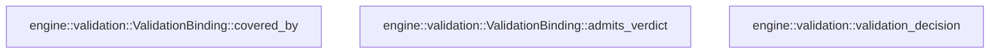

# engine::validation

[Package atlas](index.md) · [Source](../../src/validation.rs)

## Declarations

Visibility is the declaration spelling; trait members and reexports require their enclosing interface. `cfg` is not evaluated.

| Symbol | Kind | Visibility | Test / cfg |
|---|---|---|---|
| [engine::validation::ValidationBinding](../../src/validation.rs#L14) | struct_item | `pub` |  |
| [engine::validation::ValidationBinding::covered_by](../../src/validation.rs#L26) | function_item | `pub` |  |
| [engine::validation::ValidationBinding::admits_verdict](../../src/validation.rs#L37) | function_item | `pub` |  |
| [engine::validation::ValidationVerdict](../../src/validation.rs#L44) | enum_item | `pub` |  |
| [engine::validation::ValidationOutcome](../../src/validation.rs#L52) | enum_item | `pub` |  |
| [engine::validation::ValidationSignal](../../src/validation.rs#L59) | enum_item | `pub` |  |
| [engine::validation::ValidationNegative](../../src/validation.rs#L70) | enum_item | `pub` |  |
| [engine::validation::ValidationDecision](../../src/validation.rs#L78) | enum_item | `pub` |  |
| [engine::validation::validation_decision](../../src/validation.rs#L95) | function_item | `pub` |  |
| [engine::validation::tests::coverage_and_verdict_binding_have_different_identity_requirements](../../src/validation.rs#L161) | function_item | `private` | test; #[cfg(test)] |
| [engine::validation::tests::candidate_requires_validation_even_when_no_judge_is_needed](../../src/validation.rs#L186) | function_item | `private` | test; #[cfg(test)] |
| [engine::validation::tests::failed_snapshot_is_not_accepted_or_rejudged_unchanged](../../src/validation.rs#L217) | function_item | `private` | test; #[cfg(test)] |
| [engine::validation::tests::fail_repairs_original_worker_once_and_never_becomes_pass_at_cap](../../src/validation.rs#L236) | function_item | `private` | test; #[cfg(test)] |
| [engine::validation::tests::duplicate_and_late_signals_cannot_release_or_repair_again](../../src/validation.rs#L264) | function_item | `private` | test; #[cfg(test)] |
| [engine::validation::tests::direct_inconclusive_has_no_repair_round_but_death_does](../../src/validation.rs#L282) | function_item | `private` | test; #[cfg(test)] |

## Imports / reexports

| Local name | Source path | Visibility |
|---|---|---|
| `BTreeMap` | `std::collections::BTreeMap` | `private` |
| `Deserialize` | `serde::Deserialize` | `private` |
| `Serialize` | `serde::Serialize` | `private` |
| `*` | `super::*` | `private` |

## Module declarations

| Module | Visibility | Attributes |
|---|---|---|
| `engine::validation::tests` | `private` | #[cfg(test)] |

## Function call graphs

Edges below are syntactically resolved calls only, including private functions. Graphs partition callers into groups of 20; they are not execution order. All unresolved sites are listed below and in the JSON inventory.

Functions 1–3: 0 direct edges

## Call sites

Includes test functions (marked in declarations). Receiver-type-required sites need type analysis/manual tracing. Calls in closures are attributed to their enclosing function; their occurrence here does not mean the closure executes immediately.

| Caller | Callee expression | Source lines | Target / classification |
|---|---|---|---|
| `validation_decision` | `negative_rounds.saturating_add` | [143](../../src/validation.rs#L143) | receiver-type-required |
| `validation_decision` | `Some` | [149](../../src/validation.rs#L149) | external-constructor-callback-or-unresolved |
| `coverage_and_verdict_binding_have_different_identity_requirements` | `"root".into` | [163](../../src/validation.rs#L163) | receiver-type-required |
| `coverage_and_verdict_binding_have_different_identity_requirements` | `"worker".into` | [165](../../src/validation.rs#L165) | receiver-type-required |
| `coverage_and_verdict_binding_have_different_identity_requirements` | `BTreeMap::from` | [167](../../src/validation.rs#L167) | external-constructor-callback-or-unresolved |
| `coverage_and_verdict_binding_have_different_identity_requirements` | `"proof.txt".into` | [167](../../src/validation.rs#L167), [174](../../src/validation.rs#L174) | receiver-type-required |
| `coverage_and_verdict_binding_have_different_identity_requirements` | `"sha256-a".into` | [167](../../src/validation.rs#L167) | receiver-type-required |
| `coverage_and_verdict_binding_have_different_identity_requirements` | `original.clone` | [169](../../src/validation.rs#L169), [176](../../src/validation.rs#L176), [180](../../src/validation.rs#L180) | receiver-type-required |
| `coverage_and_verdict_binding_have_different_identity_requirements` | `later.snapshot.insert` | [174](../../src/validation.rs#L174) | receiver-type-required |
| `coverage_and_verdict_binding_have_different_identity_requirements` | `"sha256-b".into` | [174](../../src/validation.rs#L174) | receiver-type-required |
| `coverage_and_verdict_binding_have_different_identity_requirements` | `"replacement".into` | [181](../../src/validation.rs#L181) | receiver-type-required |
| `duplicate_and_late_signals_cannot_release_or_repair_again` | `ValidationSignal::Verdict` | [266](../../src/validation.rs#L266), [267](../../src/validation.rs#L267) | external-constructor-callback-or-unresolved |
