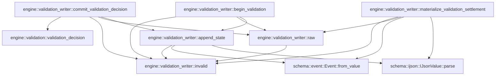

# engine::validation_writer

[Package atlas](index.md) · [Source](../../src/validation_writer.rs)

## Declarations

Visibility is the declaration spelling; trait members and reexports require their enclosing interface. `cfg` is not evaluated.

| Symbol | Kind | Visibility | Test / cfg |
|---|---|---|---|
| [engine::validation_writer::invalid](../../src/validation_writer.rs#L14) | function_item | `private` |  |
| [engine::validation_writer::raw](../../src/validation_writer.rs#L18) | function_item | `private` |  |
| [engine::validation_writer::begin_validation](../../src/validation_writer.rs#L25) | function_item | `pub` |  |
| [engine::validation_writer::commit_validation_decision](../../src/validation_writer.rs#L92) | function_item | `pub` |  |
| [engine::validation_writer::append_state](../../src/validation_writer.rs#L231) | function_item | `private` |  |
| [engine::validation_writer::materialize_validation_settlement](../../src/validation_writer.rs#L248) | function_item | `pub` |  |

## Imports / reexports

| Local name | Source path | Visibility |
|---|---|---|
| `Event` | `schema::Event` | `private` |
| `EventKind` | `schema::EventKind` | `private` |
| `IJsonValue` | `schema::IJsonValue` | `private` |
| `Value` | `serde_json::Value` | `private` |
| `json` | `serde_json::json` | `private` |
| `LockedLedger` | `store::LockedLedger` | `private` |
| `StoreError` | `store::StoreError` | `private` |
| `ValidationBinding` | `crate::ValidationBinding` | `private` |
| `ValidationDecision` | `crate::ValidationDecision` | `private` |
| `ValidationSignal` | `crate::ValidationSignal` | `private` |
| `ValidationVerdict` | `crate::ValidationVerdict` | `private` |
| `validation_decision` | `crate::validation_decision` | `private` |

## Module declarations

| Module | Visibility | Attributes |
|---|---|---|

## Function call graphs

Edges below are syntactically resolved calls only, including private functions. Graphs partition callers into groups of 20; they are not execution order. All unresolved sites are listed below and in the JSON inventory.

Functions 1–6: 15 direct edges

## Call sites

Includes test functions (marked in declarations). Receiver-type-required sites need type analysis/manual tracing. Calls in closures are attributed to their enclosing function; their occurrence here does not mean the closure executes immediately.

| Caller | Callee expression | Source lines | Target / classification |
|---|---|---|---|
| `invalid` | `StoreError::Corruption` | [15](../../src/validation_writer.rs#L15) | external-constructor-callback-or-unresolved |
| `invalid` | `message.to_owned` | [15](../../src/validation_writer.rs#L15) | receiver-type-required |
| `raw` | `serde_json::to_value(event.raw()).map_err` | [19](../../src/validation_writer.rs#L19) | receiver-type-required |
| `raw` | `serde_json::to_value` | [19](../../src/validation_writer.rs#L19) | external-constructor-callback-or-unresolved |
| `raw` | `event.raw` | [19](../../src/validation_writer.rs#L19) | receiver-type-required |
| `raw` | `invalid` | [19](../../src/validation_writer.rs#L19) | [engine::validation_writer::invalid](../../src/validation_writer.rs#L14) |
| `raw` | `error.to_string` | [19](../../src/validation_writer.rs#L19) | receiver-type-required |
| `begin_validation` | `ledger         .projection()         .ok_or_else` | [30](../../src/validation_writer.rs#L30) | receiver-type-required |
| `begin_validation` | `ledger         .projection` | [30](../../src/validation_writer.rs#L30) | receiver-type-required |
| `begin_validation` | `invalid` | [32](../../src/validation_writer.rs#L32), [41](../../src/validation_writer.rs#L41), [49](../../src/validation_writer.rs#L49), [54](../../src/validation_writer.rs#L54), [65](../../src/validation_writer.rs#L65), [68](../../src/validation_writer.rs#L68), [75](../../src/validation_writer.rs#L75) | [engine::validation_writer::invalid](../../src/validation_writer.rs#L14) |
| `begin_validation` | `projection         .events         .first()         .and_then` | [33](../../src/validation_writer.rs#L33) | receiver-type-required |
| `begin_validation` | `projection         .events         .first` | [33](../../src/validation_writer.rs#L33) | receiver-type-required |
| `begin_validation` | `event.string_field` | [36](../../src/validation_writer.rs#L36), [60](../../src/validation_writer.rs#L60) | receiver-type-required |
| `begin_validation` | `Some` | [37](../../src/validation_writer.rs#L37), [39](../../src/validation_writer.rs#L39), [51](../../src/validation_writer.rs#L51), [52](../../src/validation_writer.rs#L52), [60](../../src/validation_writer.rs#L60) | external-constructor-callback-or-unresolved |
| `begin_validation` | `binding.thread.as_str` | [37](../../src/validation_writer.rs#L37) | receiver-type-required |
| `begin_validation` | `Err` | [41](../../src/validation_writer.rs#L41), [54](../../src/validation_writer.rs#L54), [68](../../src/validation_writer.rs#L68), [75](../../src/validation_writer.rs#L75) | external-constructor-callback-or-unresolved |
| `begin_validation` | `projection         .events         .iter()         .find(&#124;event&#124; event.seq() == binding.output_seq)         .ok_or_else` | [45](../../src/validation_writer.rs#L45) | receiver-type-required |
| `begin_validation` | `projection         .events         .iter()         .find` | [45](../../src/validation_writer.rs#L45) | receiver-type-required |
| `begin_validation` | `projection         .events         .iter` | [45](../../src/validation_writer.rs#L45) | receiver-type-required |
| `begin_validation` | `event.seq` | [48](../../src/validation_writer.rs#L48), [70](../../src/validation_writer.rs#L70) | receiver-type-required |
| `begin_validation` | `output.kind` | [50](../../src/validation_writer.rs#L50) | receiver-type-required |
| `begin_validation` | `output.turn` | [51](../../src/validation_writer.rs#L51) | receiver-type-required |
| `begin_validation` | `raw(output)?.get` | [52](../../src/validation_writer.rs#L52) | receiver-type-required |
| `begin_validation` | `raw` | [52](../../src/validation_writer.rs#L52), [62](../../src/validation_writer.rs#L62) | [engine::validation_writer::raw](../../src/validation_writer.rs#L18) |
| `begin_validation` | `Value::Bool` | [52](../../src/validation_writer.rs#L52) | external-constructor-callback-or-unresolved |
| `begin_validation` | `event.kind` | [59](../../src/validation_writer.rs#L59) | receiver-type-required |
| `begin_validation` | `serde_json::from_value(value["payload"]["binding"].clone())                     .map_err` | [64](../../src/validation_writer.rs#L64) | receiver-type-required |
| `begin_validation` | `serde_json::from_value` | [64](../../src/validation_writer.rs#L64) | external-constructor-callback-or-unresolved |
| `begin_validation` | `value["payload"]["binding"].clone` | [64](../../src/validation_writer.rs#L64) | receiver-type-required |
| `begin_validation` | `error.to_string` | [65](../../src/validation_writer.rs#L65) | receiver-type-required |
| `begin_validation` | `Ok` | [70](../../src/validation_writer.rs#L70), [85](../../src/validation_writer.rs#L85) | external-constructor-callback-or-unresolved |
| `begin_validation` | `ledger.next_seq` | [77](../../src/validation_writer.rs#L77) | receiver-type-required |
| `begin_validation` | `append_state` | [78](../../src/validation_writer.rs#L78) | [engine::validation_writer::append_state](../../src/validation_writer.rs#L231) |
| `commit_validation_decision` | `ledger         .projection()         .ok_or_else` | [98](../../src/validation_writer.rs#L98) | receiver-type-required |
| `commit_validation_decision` | `ledger         .projection` | [98](../../src/validation_writer.rs#L98) | receiver-type-required |
| `commit_validation_decision` | `invalid` | [100](../../src/validation_writer.rs#L100), [105](../../src/validation_writer.rs#L105), [109](../../src/validation_writer.rs#L109), [115](../../src/validation_writer.rs#L115), [120](../../src/validation_writer.rs#L120), [122](../../src/validation_writer.rs#L122), [132](../../src/validation_writer.rs#L132), [145](../../src/validation_writer.rs#L145), [154](../../src/validation_writer.rs#L154), [169](../../src/validation_writer.rs#L169), [174](../../src/validation_writer.rs#L174), [186](../../src/validation_writer.rs#L186), [191](../../src/validation_writer.rs#L191), [194](../../src/validation_writer.rs#L194), [200](../../src/validation_writer.rs#L200), [214](../../src/validation_writer.rs#L214) | [engine::validation_writer::invalid](../../src/validation_writer.rs#L14) |
| `commit_validation_decision` | `projection         .events         .iter()         .find(&#124;event&#124; event.seq() == candidate_seq)         .ok_or_else` | [101](../../src/validation_writer.rs#L101) | receiver-type-required |
| `commit_validation_decision` | `projection         .events         .iter()         .find` | [101](../../src/validation_writer.rs#L101), [116](../../src/validation_writer.rs#L116) | receiver-type-required |
| `commit_validation_decision` | `projection         .events         .iter` | [101](../../src/validation_writer.rs#L101), [116](../../src/validation_writer.rs#L116) | receiver-type-required |
| `commit_validation_decision` | `event.seq` | [104](../../src/validation_writer.rs#L104), [119](../../src/validation_writer.rs#L119), [149](../../src/validation_writer.rs#L149), [190](../../src/validation_writer.rs#L190) | receiver-type-required |
| `commit_validation_decision` | `candidate.kind` | [106](../../src/validation_writer.rs#L106) | receiver-type-required |
| `commit_validation_decision` | `candidate.string_field` | [107](../../src/validation_writer.rs#L107) | receiver-type-required |
| `commit_validation_decision` | `Some` | [107](../../src/validation_writer.rs#L107), [121](../../src/validation_writer.rs#L121), [130](../../src/validation_writer.rs#L130), [138](../../src/validation_writer.rs#L138), [143](../../src/validation_writer.rs#L143), [144](../../src/validation_writer.rs#L144), [151](../../src/validation_writer.rs#L151), [177](../../src/validation_writer.rs#L177), [179](../../src/validation_writer.rs#L179), [196](../../src/validation_writer.rs#L196), [209](../../src/validation_writer.rs#L209) | external-constructor-callback-or-unresolved |
| `commit_validation_decision` | `Err` | [109](../../src/validation_writer.rs#L109), [122](../../src/validation_writer.rs#L122), [132](../../src/validation_writer.rs#L132), [145](../../src/validation_writer.rs#L145), [169](../../src/validation_writer.rs#L169) | external-constructor-callback-or-unresolved |
| `commit_validation_decision` | `candidate         .turn()         .ok_or_else` | [113](../../src/validation_writer.rs#L113) | receiver-type-required |
| `commit_validation_decision` | `candidate         .turn` | [113](../../src/validation_writer.rs#L113) | receiver-type-required |
| `commit_validation_decision` | `projection         .events         .iter()         .find(&#124;event&#124; event.seq() == source_seq)         .ok_or_else` | [116](../../src/validation_writer.rs#L116) | receiver-type-required |
| `commit_validation_decision` | `source.turn` | [121](../../src/validation_writer.rs#L121) | receiver-type-required |
| `commit_validation_decision` | `source.kind` | [125](../../src/validation_writer.rs#L125) | receiver-type-required |
| `commit_validation_decision` | `raw(source)?["payload"]["candidate_seq"].as_u64` | [130](../../src/validation_writer.rs#L130) | receiver-type-required |
| `commit_validation_decision` | `raw` | [130](../../src/validation_writer.rs#L130), [142](../../src/validation_writer.rs#L142), [173](../../src/validation_writer.rs#L173), [183](../../src/validation_writer.rs#L183), [193](../../src/validation_writer.rs#L193), [213](../../src/validation_writer.rs#L213) | [engine::validation_writer::raw](../../src/validation_writer.rs#L18) |
| `commit_validation_decision` | `event.kind` | [137](../../src/validation_writer.rs#L137), [178](../../src/validation_writer.rs#L178) | receiver-type-required |
| `commit_validation_decision` | `event.string_field` | [138](../../src/validation_writer.rs#L138), [179](../../src/validation_writer.rs#L179) | receiver-type-required |
| `commit_validation_decision` | `value["payload"]["source_seq"].as_u64` | [143](../../src/validation_writer.rs#L143) | receiver-type-required |
| `commit_validation_decision` | `value["payload"]["candidate_seq"].as_u64` | [144](../../src/validation_writer.rs#L144) | receiver-type-required |
| `commit_validation_decision` | `Ok` | [149](../../src/validation_writer.rs#L149), [228](../../src/validation_writer.rs#L228) | external-constructor-callback-or-unresolved |
| `commit_validation_decision` | `event.turn` | [151](../../src/validation_writer.rs#L151), [177](../../src/validation_writer.rs#L177) | receiver-type-required |
| `commit_validation_decision` | `serde_json::from_value(value["payload"]["decision"].clone())                     .map_err` | [153](../../src/validation_writer.rs#L153) | receiver-type-required |
| `commit_validation_decision` | `serde_json::from_value` | [153](../../src/validation_writer.rs#L153), [173](../../src/validation_writer.rs#L173), [193](../../src/validation_writer.rs#L193), [213](../../src/validation_writer.rs#L213) | external-constructor-callback-or-unresolved |
| `commit_validation_decision` | `value["payload"]["decision"].clone` | [153](../../src/validation_writer.rs#L153) | receiver-type-required |
| `commit_validation_decision` | `error.to_string` | [154](../../src/validation_writer.rs#L154), [174](../../src/validation_writer.rs#L174), [194](../../src/validation_writer.rs#L194), [200](../../src/validation_writer.rs#L200), [214](../../src/validation_writer.rs#L214) | receiver-type-required |
| `commit_validation_decision` | `negative_rounds.max` | [162](../../src/validation_writer.rs#L162) | receiver-type-required |
| `commit_validation_decision` | `serde_json::from_value(raw(candidate)?["payload"]["binding"].clone())                 .map_err` | [173](../../src/validation_writer.rs#L173) | receiver-type-required |
| `commit_validation_decision` | `raw(candidate)?["payload"]["binding"].clone` | [173](../../src/validation_writer.rs#L173) | receiver-type-required |
| `commit_validation_decision` | `projection.events.iter().rev` | [176](../../src/validation_writer.rs#L176) | receiver-type-required |
| `commit_validation_decision` | `projection.events.iter` | [176](../../src/validation_writer.rs#L176) | receiver-type-required |
| `commit_validation_decision` | `value["payload"]["candidate_seq"]                 .as_u64()                 .ok_or_else` | [184](../../src/validation_writer.rs#L184) | receiver-type-required |
| `commit_validation_decision` | `value["payload"]["candidate_seq"]                 .as_u64` | [184](../../src/validation_writer.rs#L184) | receiver-type-required |
| `commit_validation_decision` | `projection                 .events                 .iter()                 .find(&#124;event&#124; event.seq() == prior_seq)                 .ok_or_else` | [187](../../src/validation_writer.rs#L187) | receiver-type-required |
| `commit_validation_decision` | `projection                 .events                 .iter()                 .find` | [187](../../src/validation_writer.rs#L187) | receiver-type-required |
| `commit_validation_decision` | `projection                 .events                 .iter` | [187](../../src/validation_writer.rs#L187) | receiver-type-required |
| `commit_validation_decision` | `serde_json::from_value(raw(prior)?["payload"]["binding"].clone())                     .map_err` | [193](../../src/validation_writer.rs#L193) | receiver-type-required |
| `commit_validation_decision` | `raw(prior)?["payload"]["binding"].clone` | [193](../../src/validation_writer.rs#L193) | receiver-type-required |
| `commit_validation_decision` | `binding.covered_by` | [195](../../src/validation_writer.rs#L195) | receiver-type-required |
| `commit_validation_decision` | `serde_json::from_value::<ValidationVerdict>(                         value["payload"]["verdict"].clone(),                     )                     .map_err` | [197](../../src/validation_writer.rs#L197) | receiver-type-required |
| `commit_validation_decision` | `serde_json::from_value::<ValidationVerdict>` | [197](../../src/validation_writer.rs#L197) | external-constructor-callback-or-unresolved |
| `commit_validation_decision` | `value["payload"]["verdict"].clone` | [198](../../src/validation_writer.rs#L198) | receiver-type-required |
| `commit_validation_decision` | `binding.snapshot.is_empty` | [206](../../src/validation_writer.rs#L206) | receiver-type-required |
| `commit_validation_decision` | `source.string_field` | [209](../../src/validation_writer.rs#L209) | receiver-type-required |
| `commit_validation_decision` | `ValidationSignal::Verdict` | [212](../../src/validation_writer.rs#L212) | external-constructor-callback-or-unresolved |
| `commit_validation_decision` | `serde_json::from_value(raw(source)?["payload"]["verdict"].clone())                 .map_err` | [213](../../src/validation_writer.rs#L213) | receiver-type-required |
| `commit_validation_decision` | `raw(source)?["payload"]["verdict"].clone` | [213](../../src/validation_writer.rs#L213) | receiver-type-required |
| `commit_validation_decision` | `validation_decision` | [217](../../src/validation_writer.rs#L217) | [engine::validation::validation_decision](../../src/validation.rs#L95) |
| `commit_validation_decision` | `ledger.next_seq` | [218](../../src/validation_writer.rs#L218) | receiver-type-required |
| `commit_validation_decision` | `append_state` | [219](../../src/validation_writer.rs#L219) | [engine::validation_writer::append_state](../../src/validation_writer.rs#L231) |
| `append_state` | `serde_json::to_vec(&value).map_err` | [240](../../src/validation_writer.rs#L240) | receiver-type-required |
| `append_state` | `serde_json::to_vec` | [240](../../src/validation_writer.rs#L240) | external-constructor-callback-or-unresolved |
| `append_state` | `invalid` | [240](../../src/validation_writer.rs#L240) | [engine::validation_writer::invalid](../../src/validation_writer.rs#L14) |
| `append_state` | `error.to_string` | [240](../../src/validation_writer.rs#L240) | receiver-type-required |
| `append_state` | `Event::from_value` | [241](../../src/validation_writer.rs#L241) | [schema::event::Event::from_value](../../../schema/src/event.rs#L178) |
| `append_state` | `IJsonValue::parse` | [241](../../src/validation_writer.rs#L241) | [schema::ijson::IJsonValue::parse](../../../schema/src/ijson.rs#L16) |
| `append_state` | `ledger.append` | [242](../../src/validation_writer.rs#L242) | receiver-type-required |
| `materialize_validation_settlement` | `ledger         .projection()         .ok_or_else` | [253](../../src/validation_writer.rs#L253) | receiver-type-required |
| `materialize_validation_settlement` | `ledger         .projection` | [253](../../src/validation_writer.rs#L253) | receiver-type-required |
| `materialize_validation_settlement` | `invalid` | [255](../../src/validation_writer.rs#L255), [260](../../src/validation_writer.rs#L260), [264](../../src/validation_writer.rs#L264), [268](../../src/validation_writer.rs#L268), [271](../../src/validation_writer.rs#L271), [273](../../src/validation_writer.rs#L273), [277](../../src/validation_writer.rs#L277), [282](../../src/validation_writer.rs#L282), [289](../../src/validation_writer.rs#L289), [295](../../src/validation_writer.rs#L295), [304](../../src/validation_writer.rs#L304), [313](../../src/validation_writer.rs#L313), [322](../../src/validation_writer.rs#L322), [330](../../src/validation_writer.rs#L330), [332](../../src/validation_writer.rs#L332), [339](../../src/validation_writer.rs#L339), [347](../../src/validation_writer.rs#L347) | [engine::validation_writer::invalid](../../src/validation_writer.rs#L14) |
| `materialize_validation_settlement` | `projection         .events         .iter()         .find(&#124;event&#124; event.seq() == decision_seq)         .ok_or_else` | [256](../../src/validation_writer.rs#L256) | receiver-type-required |
| `materialize_validation_settlement` | `projection         .events         .iter()         .find` | [256](../../src/validation_writer.rs#L256), [278](../../src/validation_writer.rs#L278), [300](../../src/validation_writer.rs#L300) | receiver-type-required |
| `materialize_validation_settlement` | `projection         .events         .iter` | [256](../../src/validation_writer.rs#L256), [278](../../src/validation_writer.rs#L278), [300](../../src/validation_writer.rs#L300) | receiver-type-required |
| `materialize_validation_settlement` | `event.seq` | [259](../../src/validation_writer.rs#L259), [281](../../src/validation_writer.rs#L281) | receiver-type-required |
| `materialize_validation_settlement` | `event.kind` | [261](../../src/validation_writer.rs#L261) | receiver-type-required |
| `materialize_validation_settlement` | `event.string_field` | [262](../../src/validation_writer.rs#L262), [287](../../src/validation_writer.rs#L287) | receiver-type-required |
| `materialize_validation_settlement` | `Some` | [262](../../src/validation_writer.rs#L262), [284](../../src/validation_writer.rs#L284), [285](../../src/validation_writer.rs#L285), [286](../../src/validation_writer.rs#L286), [287](../../src/validation_writer.rs#L287), [305](../../src/validation_writer.rs#L305), [308](../../src/validation_writer.rs#L308), [318](../../src/validation_writer.rs#L318), [319](../../src/validation_writer.rs#L319), [324](../../src/validation_writer.rs#L324), [326](../../src/validation_writer.rs#L326), [338](../../src/validation_writer.rs#L338) | external-constructor-callback-or-unresolved |
| `materialize_validation_settlement` | `Err` | [264](../../src/validation_writer.rs#L264), [273](../../src/validation_writer.rs#L273), [289](../../src/validation_writer.rs#L289), [313](../../src/validation_writer.rs#L313), [322](../../src/validation_writer.rs#L322), [332](../../src/validation_writer.rs#L332), [339](../../src/validation_writer.rs#L339) | external-constructor-callback-or-unresolved |
| `materialize_validation_settlement` | `event         .turn()         .ok_or_else` | [266](../../src/validation_writer.rs#L266) | receiver-type-required |
| `materialize_validation_settlement` | `event         .turn` | [266](../../src/validation_writer.rs#L266) | receiver-type-required |
| `materialize_validation_settlement` | `raw` | [269](../../src/validation_writer.rs#L269), [294](../../src/validation_writer.rs#L294), [310](../../src/validation_writer.rs#L310), [319](../../src/validation_writer.rs#L319), [329](../../src/validation_writer.rs#L329) | [engine::validation_writer::raw](../../src/validation_writer.rs#L18) |
| `materialize_validation_settlement` | `serde_json::from_value(value["payload"]["decision"].clone())         .map_err` | [270](../../src/validation_writer.rs#L270) | receiver-type-required |
| `materialize_validation_settlement` | `serde_json::from_value` | [270](../../src/validation_writer.rs#L270), [294](../../src/validation_writer.rs#L294), [329](../../src/validation_writer.rs#L329) | external-constructor-callback-or-unresolved |
| `materialize_validation_settlement` | `value["payload"]["decision"].clone` | [270](../../src/validation_writer.rs#L270) | receiver-type-required |
| `materialize_validation_settlement` | `error.to_string` | [271](../../src/validation_writer.rs#L271), [295](../../src/validation_writer.rs#L295), [330](../../src/validation_writer.rs#L330), [347](../../src/validation_writer.rs#L347) | receiver-type-required |
| `materialize_validation_settlement` | `value["payload"]["candidate_seq"]         .as_u64()         .ok_or_else` | [275](../../src/validation_writer.rs#L275) | receiver-type-required |
| `materialize_validation_settlement` | `value["payload"]["candidate_seq"]         .as_u64` | [275](../../src/validation_writer.rs#L275) | receiver-type-required |
| `materialize_validation_settlement` | `projection         .events         .iter()         .find(&#124;event&#124; event.seq() == candidate_seq)         .ok_or_else` | [278](../../src/validation_writer.rs#L278) | receiver-type-required |
| `materialize_validation_settlement` | `candidate.kind` | [283](../../src/validation_writer.rs#L283) | receiver-type-required |
| `materialize_validation_settlement` | `candidate.string_field` | [284](../../src/validation_writer.rs#L284), [285](../../src/validation_writer.rs#L285) | receiver-type-required |
| `materialize_validation_settlement` | `candidate.turn` | [286](../../src/validation_writer.rs#L286) | receiver-type-required |
| `materialize_validation_settlement` | `serde_json::from_value(raw(candidate)?["payload"]["binding"].clone())             .map_err` | [294](../../src/validation_writer.rs#L294) | receiver-type-required |
| `materialize_validation_settlement` | `raw(candidate)?["payload"]["binding"].clone` | [294](../../src/validation_writer.rs#L294) | receiver-type-required |
| `materialize_validation_settlement` | `projection         .events         .first()         .and_then` | [296](../../src/validation_writer.rs#L296) | receiver-type-required |
| `materialize_validation_settlement` | `projection         .events         .first` | [296](../../src/validation_writer.rs#L296) | receiver-type-required |
| `materialize_validation_settlement` | `e.string_field` | [299](../../src/validation_writer.rs#L299) | receiver-type-required |
| `materialize_validation_settlement` | `projection         .events         .iter()         .find(&#124;e&#124; e.seq() == binding.output_seq)         .ok_or_else` | [300](../../src/validation_writer.rs#L300) | receiver-type-required |
| `materialize_validation_settlement` | `e.seq` | [303](../../src/validation_writer.rs#L303) | receiver-type-required |
| `materialize_validation_settlement` | `binding.thread.as_str` | [305](../../src/validation_writer.rs#L305) | receiver-type-required |
| `materialize_validation_settlement` | `output.turn` | [308](../../src/validation_writer.rs#L308) | receiver-type-required |
| `materialize_validation_settlement` | `output.kind` | [309](../../src/validation_writer.rs#L309) | receiver-type-required |
| `materialize_validation_settlement` | `existing.turn` | [318](../../src/validation_writer.rs#L318), [324](../../src/validation_writer.rs#L324) | receiver-type-required |
| `materialize_validation_settlement` | `existing.kind` | [318](../../src/validation_writer.rs#L318) | receiver-type-required |
| `materialize_validation_settlement` | `raw(existing)?["validation"]["decision_seq"].as_u64` | [319](../../src/validation_writer.rs#L319) | receiver-type-required |
| `materialize_validation_settlement` | `Ok` | [320](../../src/validation_writer.rs#L320), [349](../../src/validation_writer.rs#L349) | external-constructor-callback-or-unresolved |
| `materialize_validation_settlement` | `existing.seq` | [320](../../src/validation_writer.rs#L320), [325](../../src/validation_writer.rs#L325) | receiver-type-required |
| `materialize_validation_settlement` | `existing.string_field` | [326](../../src/validation_writer.rs#L326) | receiver-type-required |
| `materialize_validation_settlement` | `serde_json::from_value(raw(existing)?["payload"]["decision"].clone())                     .map_err` | [329](../../src/validation_writer.rs#L329) | receiver-type-required |
| `materialize_validation_settlement` | `raw(existing)?["payload"]["decision"].clone` | [329](../../src/validation_writer.rs#L329) | receiver-type-required |
| `materialize_validation_settlement` | `ledger.next_seq` | [341](../../src/validation_writer.rs#L341) | receiver-type-required |
| `materialize_validation_settlement` | `serde_json::to_vec(&value).map_err` | [347](../../src/validation_writer.rs#L347) | receiver-type-required |
| `materialize_validation_settlement` | `serde_json::to_vec` | [347](../../src/validation_writer.rs#L347) | external-constructor-callback-or-unresolved |
| `materialize_validation_settlement` | `ledger.append` | [348](../../src/validation_writer.rs#L348) | receiver-type-required |
| `materialize_validation_settlement` | `Event::from_value` | [348](../../src/validation_writer.rs#L348) | [schema::event::Event::from_value](../../../schema/src/event.rs#L178) |
| `materialize_validation_settlement` | `IJsonValue::parse` | [348](../../src/validation_writer.rs#L348) | [schema::ijson::IJsonValue::parse](../../../schema/src/ijson.rs#L16) |
