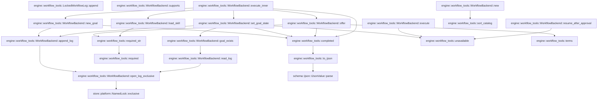
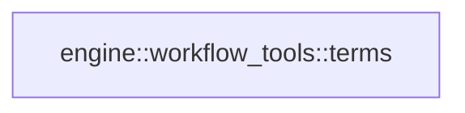

# engine::workflow_tools

[Package atlas](index.md) · [Source](../../src/workflow_tools.rs)

## Declarations

Visibility is the declaration spelling; trait members and reexports require their enclosing interface. `cfg` is not evaluated.

| Symbol | Kind | Visibility | Test / cfg |
|---|---|---|---|
| [engine::workflow_tools::LockedWorkflowLog](../../src/workflow_tools.rs#L12) | struct_item | `private` |  |
| [engine::workflow_tools::LockedWorkflowLog::append](../../src/workflow_tools.rs#L21) | function_item | `private` |  |
| [engine::workflow_tools::CatalogEntry](../../src/workflow_tools.rs#L43) | struct_item | `pub` |  |
| [engine::workflow_tools::WorkflowBackend](../../src/workflow_tools.rs#L52) | struct_item | `pub` |  |
| [engine::workflow_tools::WorkflowBackend::new](../../src/workflow_tools.rs#L60) | function_item | `pub` |  |
| [engine::workflow_tools::WorkflowBackend::execute_inner](../../src/workflow_tools.rs#L90) | function_item | `private` |  |
| [engine::workflow_tools::WorkflowBackend::new_goal](../../src/workflow_tools.rs#L128) | function_item | `private` |  |
| [engine::workflow_tools::WorkflowBackend::set_goal_state](../../src/workflow_tools.rs#L153) | function_item | `private` |  |
| [engine::workflow_tools::WorkflowBackend::offer](../../src/workflow_tools.rs#L188) | function_item | `private` |  |
| [engine::workflow_tools::WorkflowBackend::load_skill](../../src/workflow_tools.rs#L227) | function_item | `private` |  |
| [engine::workflow_tools::WorkflowBackend::goal_exists](../../src/workflow_tools.rs#L241) | function_item | `private` |  |
| [engine::workflow_tools::WorkflowBackend::append_log](../../src/workflow_tools.rs#L264) | function_item | `private` |  |
| [engine::workflow_tools::WorkflowBackend::read_log](../../src/workflow_tools.rs#L285) | function_item | `private` |  |
| [engine::workflow_tools::WorkflowBackend::open_log_exclusive](../../src/workflow_tools.rs#L289) | function_item | `private` |  |
| [engine::workflow_tools::WorkflowBackend::supports](../../src/workflow_tools.rs#L346) | function_item | `private` |  |
| [engine::workflow_tools::WorkflowBackend::execute](../../src/workflow_tools.rs#L357) | function_item | `private` |  |
| [engine::workflow_tools::WorkflowBackend::resume_after_approval](../../src/workflow_tools.rs#L362) | function_item | `private` |  |
| [engine::workflow_tools::sort_catalog](../../src/workflow_tools.rs#L384) | function_item | `private` |  |
| [engine::workflow_tools::required](../../src/workflow_tools.rs#L394) | function_item | `private` |  |
| [engine::workflow_tools::required_str](../../src/workflow_tools.rs#L398) | function_item | `private` |  |
| [engine::workflow_tools::completed](../../src/workflow_tools.rs#L404) | function_item | `private` |  |
| [engine::workflow_tools::unavailable](../../src/workflow_tools.rs#L408) | function_item | `private` |  |
| [engine::workflow_tools::to_ijson](../../src/workflow_tools.rs#L416) | function_item | `private` |  |
| [engine::workflow_tools::terms](../../src/workflow_tools.rs#L423) | function_item | `private` |  |
| [engine::workflow_tools::host_goal_tests::execution](../../src/workflow_tools.rs#L435) | function_item | `private` | test; #[cfg(test)] |
| [engine::workflow_tools::host_goal_tests::set_goal_state_accepts_a_host_bound_session_goal_record](../../src/workflow_tools.rs#L449) | function_item | `private` | test; #[cfg(test)] |

## Imports / reexports

| Local name | Source path | Visibility |
|---|---|---|
| `fs` | `std::fs` | `private` |
| `File` | `std::fs::File` | `private` |
| `OpenOptions` | `std::fs::OpenOptions` | `private` |
| `Read` | `std::io::Read` | `private` |
| `Write` | `std::io::Write` | `private` |
| `PathBuf` | `std::path::PathBuf` | `private` |
| `IJsonValue` | `schema::IJsonValue` | `private` |
| `Value` | `serde_json::Value` | `private` |
| `json` | `serde_json::json` | `private` |
| `NamedLock` | `store::NamedLock` | `private` |
| `SyncPolicy` | `store::SyncPolicy` | `private` |
| `SystemSync` | `store::SystemSync` | `private` |
| `BackendTerminal` | `tools::BackendTerminal` | `private` |
| `DurableApprovalResponse` | `tools::DurableApprovalResponse` | `private` |
| `ToolExecution` | `tools::ToolExecution` | `private` |
| `ToolBackend` | `crate::ToolBackend` | `private` |
| `*` | `super::*` | `private` |

## Module declarations

| Module | Visibility | Attributes |
|---|---|---|
| `engine::workflow_tools::host_goal_tests` | `private` | #[cfg(test)] |

## Function call graphs

Edges below are syntactically resolved calls only, including private functions. Graphs partition callers into groups of 20; they are not execution order. All unresolved sites are listed below and in the JSON inventory.

Functions 1–20: 25 direct edges

Functions 21–21: 0 direct edges

## Call sites

Includes test functions (marked in declarations). Receiver-type-required sites need type analysis/manual tracing. Calls in closures are attributed to their enclosing function; their occurrence here does not mean the closure executes immediately.

| Caller | Callee expression | Source lines | Target / classification |
|---|---|---|---|
| `append` | `serde_json_canonicalizer::to_vec(value).map_err` | [23](../../src/workflow_tools.rs#L23) | receiver-type-required |
| `append` | `serde_json_canonicalizer::to_vec` | [23](../../src/workflow_tools.rs#L23) | external-constructor-callback-or-unresolved |
| `append` | `error.to_string` | [23](../../src/workflow_tools.rs#L23), [27](../../src/workflow_tools.rs#L27), [30](../../src/workflow_tools.rs#L30), [33](../../src/workflow_tools.rs#L33), [34](../../src/workflow_tools.rs#L34) | receiver-type-required |
| `append` | `bytes.push` | [24](../../src/workflow_tools.rs#L24) | receiver-type-required |
| `append` | `self.file             .write_all(&bytes)             .map_err` | [25](../../src/workflow_tools.rs#L25) | receiver-type-required |
| `append` | `self.file             .write_all` | [25](../../src/workflow_tools.rs#L25) | receiver-type-required |
| `append` | `SystemSync             .full_sync(&self.file)             .map_err` | [28](../../src/workflow_tools.rs#L28) | receiver-type-required |
| `append` | `SystemSync             .full_sync` | [28](../../src/workflow_tools.rs#L28) | receiver-type-required |
| `append` | `SystemSync                 .full_sync(&File::open(&self.parent).map_err(&#124;error&#124; error.to_string())?)                 .map_err` | [32](../../src/workflow_tools.rs#L32) | receiver-type-required |
| `append` | `SystemSync                 .full_sync` | [32](../../src/workflow_tools.rs#L32) | receiver-type-required |
| `append` | `File::open(&self.parent).map_err` | [33](../../src/workflow_tools.rs#L33) | receiver-type-required |
| `append` | `File::open` | [33](../../src/workflow_tools.rs#L33) | external-constructor-callback-or-unresolved |
| `append` | `self.records.push` | [37](../../src/workflow_tools.rs#L37) | receiver-type-required |
| `append` | `value.clone` | [37](../../src/workflow_tools.rs#L37) | receiver-type-required |
| `append` | `Ok` | [38](../../src/workflow_tools.rs#L38) | external-constructor-callback-or-unresolved |
| `new` | `root.into` | [67](../../src/workflow_tools.rs#L67) | receiver-type-required |
| `new` | `workspace.into` | [68](../../src/workflow_tools.rs#L68) | receiver-type-required |
| `new` | `workspace.is_empty` | [69](../../src/workflow_tools.rs#L69) | receiver-type-required |
| `new` | `Err` | [70](../../src/workflow_tools.rs#L70), [78](../../src/workflow_tools.rs#L78) | external-constructor-callback-or-unresolved |
| `new` | `"workflow workspace identity is empty".to_owned` | [70](../../src/workflow_tools.rs#L70) | receiver-type-required |
| `new` | `fs::create_dir_all(&root).map_err` | [72](../../src/workflow_tools.rs#L72) | receiver-type-required |
| `new` | `fs::create_dir_all` | [72](../../src/workflow_tools.rs#L72) | external-constructor-callback-or-unresolved |
| `new` | `error.to_string` | [72](../../src/workflow_tools.rs#L72), [74](../../src/workflow_tools.rs#L74) | receiver-type-required |
| `new` | `fs::symlink_metadata(&root)             .map_err(&#124;error&#124; error.to_string())?             .file_type()             .is_symlink` | [73](../../src/workflow_tools.rs#L73) | receiver-type-required |
| `new` | `fs::symlink_metadata(&root)             .map_err(&#124;error&#124; error.to_string())?             .file_type` | [73](../../src/workflow_tools.rs#L73) | receiver-type-required |
| `new` | `fs::symlink_metadata(&root)             .map_err` | [73](../../src/workflow_tools.rs#L73) | receiver-type-required |
| `new` | `fs::symlink_metadata` | [73](../../src/workflow_tools.rs#L73) | external-constructor-callback-or-unresolved |
| `new` | `"workflow state root is a symlink".to_owned` | [78](../../src/workflow_tools.rs#L78) | receiver-type-required |
| `new` | `sort_catalog` | [80](../../src/workflow_tools.rs#L80), [81](../../src/workflow_tools.rs#L81) | [engine::workflow_tools::sort_catalog](../../src/workflow_tools.rs#L384) |
| `new` | `Ok` | [82](../../src/workflow_tools.rs#L82) | external-constructor-callback-or-unresolved |
| `execute_inner` | `serde_json::to_value(invocation).map_err` | [95](../../src/workflow_tools.rs#L95) | receiver-type-required |
| `execute_inner` | `serde_json::to_value` | [95](../../src/workflow_tools.rs#L95) | external-constructor-callback-or-unresolved |
| `execute_inner` | `error.to_string` | [95](../../src/workflow_tools.rs#L95) | receiver-type-required |
| `execute_inner` | `execution.name.as_str` | [96](../../src/workflow_tools.rs#L96) | receiver-type-required |
| `execute_inner` | `Ok` | [97](../../src/workflow_tools.rs#L97), [101](../../src/workflow_tools.rs#L101), [105](../../src/workflow_tools.rs#L105), [106](../../src/workflow_tools.rs#L106), [110](../../src/workflow_tools.rs#L110), [120](../../src/workflow_tools.rs#L120) | external-constructor-callback-or-unresolved |
| `execute_inner` | `"answer".to_owned` | [98](../../src/workflow_tools.rs#L98) | receiver-type-required |
| `execute_inner` | `invocation.clone` | [99](../../src/workflow_tools.rs#L99), [103](../../src/workflow_tools.rs#L103) | receiver-type-required |
| `execute_inner` | `"plan".to_owned` | [102](../../src/workflow_tools.rs#L102) | receiver-type-required |
| `execute_inner` | `completed` | [105](../../src/workflow_tools.rs#L105), [106](../../src/workflow_tools.rs#L106), [110](../../src/workflow_tools.rs#L110) | [engine::workflow_tools::completed](../../src/workflow_tools.rs#L404) |
| `execute_inner` | `self.new_goal` | [115](../../src/workflow_tools.rs#L115) | [engine::workflow_tools::WorkflowBackend::new_goal](../../src/workflow_tools.rs#L128) |
| `execute_inner` | `self.set_goal_state` | [116](../../src/workflow_tools.rs#L116) | [engine::workflow_tools::WorkflowBackend::set_goal_state](../../src/workflow_tools.rs#L153) |
| `execute_inner` | `self.offer` | [117](../../src/workflow_tools.rs#L117), [118](../../src/workflow_tools.rs#L118) | [engine::workflow_tools::WorkflowBackend::offer](../../src/workflow_tools.rs#L188) |
| `execute_inner` | `self.load_skill` | [119](../../src/workflow_tools.rs#L119) | [engine::workflow_tools::WorkflowBackend::load_skill](../../src/workflow_tools.rs#L227) |
| `execute_inner` | `"unsupported".to_owned` | [121](../../src/workflow_tools.rs#L121) | receiver-type-required |
| `new_goal` | `self             .goal_id             .as_deref()             .ok_or` | [133](../../src/workflow_tools.rs#L133) | receiver-type-required |
| `new_goal` | `self             .goal_id             .as_deref` | [133](../../src/workflow_tools.rs#L133) | receiver-type-required |
| `new_goal` | `self.append_log` | [149](../../src/workflow_tools.rs#L149) | [engine::workflow_tools::WorkflowBackend::append_log](../../src/workflow_tools.rs#L264) |
| `new_goal` | `Ok` | [150](../../src/workflow_tools.rs#L150) | external-constructor-callback-or-unresolved |
| `new_goal` | `completed` | [150](../../src/workflow_tools.rs#L150) | [engine::workflow_tools::completed](../../src/workflow_tools.rs#L404) |
| `set_goal_state` | `self             .goal_id             .as_deref()             .ok_or` | [158](../../src/workflow_tools.rs#L158) | receiver-type-required |
| `set_goal_state` | `self             .goal_id             .as_deref` | [158](../../src/workflow_tools.rs#L158) | receiver-type-required |
| `set_goal_state` | `self.goal_exists` | [162](../../src/workflow_tools.rs#L162) | [engine::workflow_tools::WorkflowBackend::goal_exists](../../src/workflow_tools.rs#L241) |
| `set_goal_state` | `Ok` | [163](../../src/workflow_tools.rs#L163), [183](../../src/workflow_tools.rs#L183) | external-constructor-callback-or-unresolved |
| `set_goal_state` | `unavailable` | [163](../../src/workflow_tools.rs#L163) | [engine::workflow_tools::unavailable](../../src/workflow_tools.rs#L408) |
| `set_goal_state` | `self.append_log` | [182](../../src/workflow_tools.rs#L182) | [engine::workflow_tools::WorkflowBackend::append_log](../../src/workflow_tools.rs#L264) |
| `set_goal_state` | `completed` | [183](../../src/workflow_tools.rs#L183) | [engine::workflow_tools::completed](../../src/workflow_tools.rs#L404) |
| `offer` | `required_str` | [194](../../src/workflow_tools.rs#L194) | [engine::workflow_tools::required_str](../../src/workflow_tools.rs#L398) |
| `offer` | `arguments.get("limit").and_then(Value::as_u64).unwrap_or` | [195](../../src/workflow_tools.rs#L195) | receiver-type-required |
| `offer` | `arguments.get("limit").and_then` | [195](../../src/workflow_tools.rs#L195) | receiver-type-required |
| `offer` | `arguments.get` | [195](../../src/workflow_tools.rs#L195) | receiver-type-required |
| `offer` | `terms` | [196](../../src/workflow_tools.rs#L196) | [engine::workflow_tools::terms](../../src/workflow_tools.rs#L423) |
| `offer` | `catalog             .iter()             .filter_map(&#124;entry&#124; {                 let mut haystack = format!("{} {}", entry.name, entry.summary);                 for alias in &entry.aliases {                     haystack.push(' ');                     haystack.push_str(alias);                 }                 let score = query_terms                     .iter()                     .filter(&#124;term&#124; haystack.to_ascii_lowercase().contains(term.as_str()))                     .count();                 (score > 0).then_some((score, entry))             })             .collect::<Vec<_>>` | [197](../../src/workflow_tools.rs#L197) | receiver-type-required |
| `offer` | `catalog             .iter()             .filter_map` | [197](../../src/workflow_tools.rs#L197) | receiver-type-required |
| `offer` | `catalog             .iter` | [197](../../src/workflow_tools.rs#L197) | receiver-type-required |
| `offer` | `haystack.push` | [202](../../src/workflow_tools.rs#L202) | receiver-type-required |
| `offer` | `haystack.push_str` | [203](../../src/workflow_tools.rs#L203) | receiver-type-required |
| `offer` | `query_terms                     .iter()                     .filter(&#124;term&#124; haystack.to_ascii_lowercase().contains(term.as_str()))                     .count` | [205](../../src/workflow_tools.rs#L205) | receiver-type-required |
| `offer` | `query_terms                     .iter()                     .filter` | [205](../../src/workflow_tools.rs#L205) | receiver-type-required |
| `offer` | `query_terms                     .iter` | [205](../../src/workflow_tools.rs#L205) | receiver-type-required |
| `offer` | `haystack.to_ascii_lowercase().contains` | [207](../../src/workflow_tools.rs#L207) | receiver-type-required |
| `offer` | `haystack.to_ascii_lowercase` | [207](../../src/workflow_tools.rs#L207) | receiver-type-required |
| `offer` | `term.as_str` | [207](../../src/workflow_tools.rs#L207) | receiver-type-required |
| `offer` | `(score > 0).then_some` | [209](../../src/workflow_tools.rs#L209) | receiver-type-required |
| `offer` | `matches.sort_by` | [212](../../src/workflow_tools.rs#L212) | receiver-type-required |
| `offer` | `right_score                 .cmp(left_score)                 .then_with` | [213](../../src/workflow_tools.rs#L213) | receiver-type-required |
| `offer` | `right_score                 .cmp` | [213](../../src/workflow_tools.rs#L213) | receiver-type-required |
| `offer` | `left.name.as_bytes().cmp` | [215](../../src/workflow_tools.rs#L215) | receiver-type-required |
| `offer` | `left.name.as_bytes` | [215](../../src/workflow_tools.rs#L215) | receiver-type-required |
| `offer` | `right.name.as_bytes` | [215](../../src/workflow_tools.rs#L215) | receiver-type-required |
| `offer` | `matches.truncate` | [217](../../src/workflow_tools.rs#L217) | receiver-type-required |
| `offer` | `Ok` | [218](../../src/workflow_tools.rs#L218) | external-constructor-callback-or-unresolved |
| `offer` | `completed` | [218](../../src/workflow_tools.rs#L218) | [engine::workflow_tools::completed](../../src/workflow_tools.rs#L404) |
| `load_skill` | `required_str` | [228](../../src/workflow_tools.rs#L228) | [engine::workflow_tools::required_str](../../src/workflow_tools.rs#L398) |
| `load_skill` | `self             .skills             .iter()             .find(&#124;entry&#124; entry.name == name)             .ok_or` | [229](../../src/workflow_tools.rs#L229) | receiver-type-required |
| `load_skill` | `self             .skills             .iter()             .find` | [229](../../src/workflow_tools.rs#L229) | receiver-type-required |
| `load_skill` | `self             .skills             .iter` | [229](../../src/workflow_tools.rs#L229) | receiver-type-required |
| `load_skill` | `Ok` | [234](../../src/workflow_tools.rs#L234) | external-constructor-callback-or-unresolved |
| `load_skill` | `BackendTerminal::Completed` | [234](../../src/workflow_tools.rs#L234) | external-constructor-callback-or-unresolved |
| `load_skill` | `entry.content.clone` | [234](../../src/workflow_tools.rs#L234) | receiver-type-required |
| `goal_exists` | `self.read_log("goals/log.jsonl")?.iter().any` | [242](../../src/workflow_tools.rs#L242) | receiver-type-required |
| `goal_exists` | `self.read_log("goals/log.jsonl")?.iter` | [242](../../src/workflow_tools.rs#L242) | receiver-type-required |
| `goal_exists` | `self.read_log` | [242](../../src/workflow_tools.rs#L242) | [engine::workflow_tools::WorkflowBackend::read_log](../../src/workflow_tools.rs#L285) |
| `goal_exists` | `record.get("goal_id").and_then` | [243](../../src/workflow_tools.rs#L243) | receiver-type-required |
| `goal_exists` | `record.get` | [243](../../src/workflow_tools.rs#L243), [244](../../src/workflow_tools.rs#L244), [257](../../src/workflow_tools.rs#L257) | receiver-type-required |
| `goal_exists` | `Some` | [243](../../src/workflow_tools.rs#L243), [244](../../src/workflow_tools.rs#L244), [257](../../src/workflow_tools.rs#L257) | external-constructor-callback-or-unresolved |
| `goal_exists` | `record.get("op").and_then` | [244](../../src/workflow_tools.rs#L244) | receiver-type-required |
| `goal_exists` | `Ok` | [246](../../src/workflow_tools.rs#L246), [257](../../src/workflow_tools.rs#L257), [259](../../src/workflow_tools.rs#L259) | external-constructor-callback-or-unresolved |
| `goal_exists` | `self             .root             .join("goals")             .join("sessions")             .join` | [248](../../src/workflow_tools.rs#L248) | receiver-type-required |
| `goal_exists` | `self             .root             .join("goals")             .join` | [248](../../src/workflow_tools.rs#L248) | receiver-type-required |
| `goal_exists` | `self             .root             .join` | [248](../../src/workflow_tools.rs#L248) | receiver-type-required |
| `goal_exists` | `fs::read` | [253](../../src/workflow_tools.rs#L253) | external-constructor-callback-or-unresolved |
| `goal_exists` | `serde_json::from_slice(&bytes)                     .map_err` | [255](../../src/workflow_tools.rs#L255) | receiver-type-required |
| `goal_exists` | `serde_json::from_slice` | [255](../../src/workflow_tools.rs#L255) | external-constructor-callback-or-unresolved |
| `goal_exists` | `record.get("id").and_then` | [257](../../src/workflow_tools.rs#L257) | receiver-type-required |
| `goal_exists` | `error.kind` | [259](../../src/workflow_tools.rs#L259) | receiver-type-required |
| `goal_exists` | `Err` | [260](../../src/workflow_tools.rs#L260) | external-constructor-callback-or-unresolved |
| `goal_exists` | `error.to_string` | [260](../../src/workflow_tools.rs#L260) | receiver-type-required |
| `append_log` | `self.open_log_exclusive` | [265](../../src/workflow_tools.rs#L265) | [engine::workflow_tools::WorkflowBackend::open_log_exclusive](../../src/workflow_tools.rs#L289) |
| `append_log` | `value.get("call").and_then` | [266](../../src/workflow_tools.rs#L266) | receiver-type-required |
| `append_log` | `value.get` | [266](../../src/workflow_tools.rs#L266), [267](../../src/workflow_tools.rs#L267) | receiver-type-required |
| `append_log` | `value.get("thread").and_then` | [267](../../src/workflow_tools.rs#L267) | receiver-type-required |
| `append_log` | `record.get("call").and_then` | [269](../../src/workflow_tools.rs#L269) | receiver-type-required |
| `append_log` | `record.get` | [269](../../src/workflow_tools.rs#L269), [270](../../src/workflow_tools.rs#L270) | receiver-type-required |
| `append_log` | `Some` | [269](../../src/workflow_tools.rs#L269) | external-constructor-callback-or-unresolved |
| `append_log` | `record.get("thread").and_then` | [270](../../src/workflow_tools.rs#L270) | receiver-type-required |
| `append_log` | `Ok` | [273](../../src/workflow_tools.rs#L273) | external-constructor-callback-or-unresolved |
| `append_log` | `Err` | [275](../../src/workflow_tools.rs#L275) | external-constructor-callback-or-unresolved |
| `append_log` | `log.append` | [282](../../src/workflow_tools.rs#L282) | receiver-type-required |
| `read_log` | `Ok` | [286](../../src/workflow_tools.rs#L286) | external-constructor-callback-or-unresolved |
| `read_log` | `self.open_log_exclusive` | [286](../../src/workflow_tools.rs#L286) | [engine::workflow_tools::WorkflowBackend::open_log_exclusive](../../src/workflow_tools.rs#L289) |
| `open_log_exclusive` | `self.root.join` | [290](../../src/workflow_tools.rs#L290) | receiver-type-required |
| `open_log_exclusive` | `path.parent().ok_or` | [291](../../src/workflow_tools.rs#L291) | receiver-type-required |
| `open_log_exclusive` | `path.parent` | [291](../../src/workflow_tools.rs#L291) | receiver-type-required |
| `open_log_exclusive` | `parent.exists` | [292](../../src/workflow_tools.rs#L292) | receiver-type-required |
| `open_log_exclusive` | `path.exists` | [293](../../src/workflow_tools.rs#L293) | receiver-type-required |
| `open_log_exclusive` | `fs::create_dir_all(parent).map_err` | [294](../../src/workflow_tools.rs#L294) | receiver-type-required |
| `open_log_exclusive` | `fs::create_dir_all` | [294](../../src/workflow_tools.rs#L294) | external-constructor-callback-or-unresolved |
| `open_log_exclusive` | `error.to_string` | [294](../../src/workflow_tools.rs#L294), [297](../../src/workflow_tools.rs#L297), [298](../../src/workflow_tools.rs#L298), [301](../../src/workflow_tools.rs#L301), [307](../../src/workflow_tools.rs#L307), [310](../../src/workflow_tools.rs#L310), [317](../../src/workflow_tools.rs#L317), [320](../../src/workflow_tools.rs#L320), [328](../../src/workflow_tools.rs#L328), [329](../../src/workflow_tools.rs#L329) | receiver-type-required |
| `open_log_exclusive` | `SystemSync                 .full_sync(&File::open(&self.root).map_err(&#124;error&#124; error.to_string())?)                 .map_err` | [296](../../src/workflow_tools.rs#L296) | receiver-type-required |
| `open_log_exclusive` | `SystemSync                 .full_sync` | [296](../../src/workflow_tools.rs#L296), [318](../../src/workflow_tools.rs#L318) | receiver-type-required |
| `open_log_exclusive` | `File::open(&self.root).map_err` | [297](../../src/workflow_tools.rs#L297) | receiver-type-required |
| `open_log_exclusive` | `File::open` | [297](../../src/workflow_tools.rs#L297) | external-constructor-callback-or-unresolved |
| `open_log_exclusive` | `NamedLock::exclusive(path.with_extension("lock")).map_err` | [301](../../src/workflow_tools.rs#L301) | receiver-type-required |
| `open_log_exclusive` | `NamedLock::exclusive` | [301](../../src/workflow_tools.rs#L301) | [store::platform::NamedLock::exclusive](../../../store/src/platform.rs#L102) |
| `open_log_exclusive` | `path.with_extension` | [301](../../src/workflow_tools.rs#L301) | receiver-type-required |
| `open_log_exclusive` | `OpenOptions::new()             .create(true)             .read(true)             .append(true)             .open(&path)             .map_err` | [302](../../src/workflow_tools.rs#L302) | receiver-type-required |
| `open_log_exclusive` | `OpenOptions::new()             .create(true)             .read(true)             .append(true)             .open` | [302](../../src/workflow_tools.rs#L302) | receiver-type-required |
| `open_log_exclusive` | `OpenOptions::new()             .create(true)             .read(true)             .append` | [302](../../src/workflow_tools.rs#L302) | receiver-type-required |
| `open_log_exclusive` | `OpenOptions::new()             .create(true)             .read` | [302](../../src/workflow_tools.rs#L302) | receiver-type-required |
| `open_log_exclusive` | `OpenOptions::new()             .create` | [302](../../src/workflow_tools.rs#L302) | receiver-type-required |
| `open_log_exclusive` | `OpenOptions::new` | [302](../../src/workflow_tools.rs#L302) | external-constructor-callback-or-unresolved |
| `open_log_exclusive` | `Vec::new` | [308](../../src/workflow_tools.rs#L308), [323](../../src/workflow_tools.rs#L323) | external-constructor-callback-or-unresolved |
| `open_log_exclusive` | `file.read_to_end(&mut bytes)             .map_err` | [309](../../src/workflow_tools.rs#L309) | receiver-type-required |
| `open_log_exclusive` | `file.read_to_end` | [309](../../src/workflow_tools.rs#L309) | receiver-type-required |
| `open_log_exclusive` | `bytes             .iter()             .rposition(&#124;byte&#124; *byte == b'\n')             .map_or` | [311](../../src/workflow_tools.rs#L311) | receiver-type-required |
| `open_log_exclusive` | `bytes             .iter()             .rposition` | [311](../../src/workflow_tools.rs#L311) | receiver-type-required |
| `open_log_exclusive` | `bytes             .iter` | [311](../../src/workflow_tools.rs#L311) | receiver-type-required |
| `open_log_exclusive` | `bytes.len` | [315](../../src/workflow_tools.rs#L315) | receiver-type-required |
| `open_log_exclusive` | `file.set_len(valid_end as u64)                 .map_err` | [316](../../src/workflow_tools.rs#L316) | receiver-type-required |
| `open_log_exclusive` | `file.set_len` | [316](../../src/workflow_tools.rs#L316) | receiver-type-required |
| `open_log_exclusive` | `SystemSync                 .full_sync(&file)                 .map_err` | [318](../../src/workflow_tools.rs#L318) | receiver-type-required |
| `open_log_exclusive` | `bytes.truncate` | [321](../../src/workflow_tools.rs#L321) | receiver-type-required |
| `open_log_exclusive` | `bytes             .split(&#124;byte&#124; *byte == b'\n')             .filter` | [324](../../src/workflow_tools.rs#L324) | receiver-type-required |
| `open_log_exclusive` | `bytes             .split` | [324](../../src/workflow_tools.rs#L324) | receiver-type-required |
| `open_log_exclusive` | `line.is_empty` | [326](../../src/workflow_tools.rs#L326) | receiver-type-required |
| `open_log_exclusive` | `serde_json::from_slice(line).map_err` | [328](../../src/workflow_tools.rs#L328) | receiver-type-required |
| `open_log_exclusive` | `serde_json::from_slice` | [328](../../src/workflow_tools.rs#L328) | external-constructor-callback-or-unresolved |
| `open_log_exclusive` | `serde_json_canonicalizer::to_vec(&value).map_err` | [329](../../src/workflow_tools.rs#L329) | receiver-type-required |
| `open_log_exclusive` | `serde_json_canonicalizer::to_vec` | [329](../../src/workflow_tools.rs#L329) | external-constructor-callback-or-unresolved |
| `open_log_exclusive` | `Err` | [331](../../src/workflow_tools.rs#L331) | external-constructor-callback-or-unresolved |
| `open_log_exclusive` | `"workflow authority contains non-canonical JSONL".to_owned` | [331](../../src/workflow_tools.rs#L331) | receiver-type-required |
| `open_log_exclusive` | `records.push` | [333](../../src/workflow_tools.rs#L333) | receiver-type-required |
| `open_log_exclusive` | `Ok` | [335](../../src/workflow_tools.rs#L335) | external-constructor-callback-or-unresolved |
| `open_log_exclusive` | `parent.to_path_buf` | [339](../../src/workflow_tools.rs#L339) | receiver-type-required |
| `supports` | `self.goal_id.is_some` | [348](../../src/workflow_tools.rs#L348) | receiver-type-required |
| `supports` | `self.skills.is_empty` | [349](../../src/workflow_tools.rs#L349) | receiver-type-required |
| `supports` | `self.deferred_tools.is_empty` | [350](../../src/workflow_tools.rs#L350) | receiver-type-required |
| `execute` | `self.execute_inner(execution, invocation)             .unwrap_or_else` | [358](../../src/workflow_tools.rs#L358) | receiver-type-required |
| `execute` | `self.execute_inner` | [358](../../src/workflow_tools.rs#L358) | receiver-type-required |
| `execute` | `unavailable` | [359](../../src/workflow_tools.rs#L359) | [engine::workflow_tools::unavailable](../../src/workflow_tools.rs#L408) |
| `resume_after_approval` | `execution.name.as_str` | [368](../../src/workflow_tools.rs#L368) | receiver-type-required |
| `resume_after_approval` | `approval.answer.clone().map_or_else` | [369](../../src/workflow_tools.rs#L369) | receiver-type-required |
| `resume_after_approval` | `approval.answer.clone` | [369](../../src/workflow_tools.rs#L369) | receiver-type-required |
| `resume_after_approval` | `unavailable` | [370](../../src/workflow_tools.rs#L370) | [engine::workflow_tools::unavailable](../../src/workflow_tools.rs#L408) |
| `resume_after_approval` | `BackendTerminal::Completed` | [373](../../src/workflow_tools.rs#L373) | external-constructor-callback-or-unresolved |
| `resume_after_approval` | `approval                     .answer                     .clone()                     .unwrap_or_else` | [374](../../src/workflow_tools.rs#L374) | receiver-type-required |
| `resume_after_approval` | `approval                     .answer                     .clone` | [374](../../src/workflow_tools.rs#L374) | receiver-type-required |
| `resume_after_approval` | `IJsonValue::from` | [377](../../src/workflow_tools.rs#L377) | external-constructor-callback-or-unresolved |
| `resume_after_approval` | `self.execute` | [379](../../src/workflow_tools.rs#L379) | receiver-type-required |
| `sort_catalog` | `entries.sort_by` | [385](../../src/workflow_tools.rs#L385) | receiver-type-required |
| `sort_catalog` | `left.name.as_bytes().cmp` | [385](../../src/workflow_tools.rs#L385) | receiver-type-required |
| `sort_catalog` | `left.name.as_bytes` | [385](../../src/workflow_tools.rs#L385) | receiver-type-required |
| `sort_catalog` | `right.name.as_bytes` | [385](../../src/workflow_tools.rs#L385) | receiver-type-required |
| `sort_catalog` | `entries.iter().any` | [386](../../src/workflow_tools.rs#L386) | receiver-type-required |
| `sort_catalog` | `entries.iter` | [386](../../src/workflow_tools.rs#L386) | receiver-type-required |
| `sort_catalog` | `entry.name.is_empty` | [386](../../src/workflow_tools.rs#L386) | receiver-type-required |
| `sort_catalog` | `entries.windows(2).any` | [387](../../src/workflow_tools.rs#L387) | receiver-type-required |
| `sort_catalog` | `entries.windows` | [387](../../src/workflow_tools.rs#L387) | receiver-type-required |
| `sort_catalog` | `Err` | [389](../../src/workflow_tools.rs#L389) | external-constructor-callback-or-unresolved |
| `sort_catalog` | `"catalog entries require unique nonempty names".to_owned` | [389](../../src/workflow_tools.rs#L389) | receiver-type-required |
| `sort_catalog` | `Ok` | [391](../../src/workflow_tools.rs#L391) | external-constructor-callback-or-unresolved |
| `required` | `value.get(name).ok_or_else` | [395](../../src/workflow_tools.rs#L395) | receiver-type-required |
| `required` | `value.get` | [395](../../src/workflow_tools.rs#L395) | receiver-type-required |
| `required_str` | `required(value, name)?         .as_str()         .ok_or_else` | [399](../../src/workflow_tools.rs#L399) | receiver-type-required |
| `required_str` | `required(value, name)?         .as_str` | [399](../../src/workflow_tools.rs#L399) | receiver-type-required |
| `required_str` | `required` | [399](../../src/workflow_tools.rs#L399) | [engine::workflow_tools::required](../../src/workflow_tools.rs#L394) |
| `completed` | `BackendTerminal::Completed` | [405](../../src/workflow_tools.rs#L405) | external-constructor-callback-or-unresolved |
| `completed` | `to_ijson` | [405](../../src/workflow_tools.rs#L405) | [engine::workflow_tools::to_ijson](../../src/workflow_tools.rs#L416) |
| `unavailable` | `code.to_owned` | [410](../../src/workflow_tools.rs#L410) | receiver-type-required |
| `unavailable` | `message.to_owned` | [411](../../src/workflow_tools.rs#L411) | receiver-type-required |
| `to_ijson` | `IJsonValue::parse(         &serde_json_canonicalizer::to_vec(&value).expect("workflow result is serializable JSON"),     )     .expect` | [417](../../src/workflow_tools.rs#L417) | receiver-type-required |
| `to_ijson` | `IJsonValue::parse` | [417](../../src/workflow_tools.rs#L417) | [schema::ijson::IJsonValue::parse](../../../schema/src/ijson.rs#L16) |
| `to_ijson` | `serde_json_canonicalizer::to_vec(&value).expect` | [418](../../src/workflow_tools.rs#L418) | receiver-type-required |
| `to_ijson` | `serde_json_canonicalizer::to_vec` | [418](../../src/workflow_tools.rs#L418) | external-constructor-callback-or-unresolved |
| `terms` | `value         .split(&#124;character: char&#124; !character.is_alphanumeric())         .filter(&#124;term&#124; !term.is_empty())         .map(str::to_ascii_lowercase)         .collect` | [424](../../src/workflow_tools.rs#L424) | receiver-type-required |
| `terms` | `value         .split(&#124;character: char&#124; !character.is_alphanumeric())         .filter(&#124;term&#124; !term.is_empty())         .map` | [424](../../src/workflow_tools.rs#L424) | receiver-type-required |
| `terms` | `value         .split(&#124;character: char&#124; !character.is_alphanumeric())         .filter` | [424](../../src/workflow_tools.rs#L424) | receiver-type-required |
| `terms` | `value         .split` | [424](../../src/workflow_tools.rs#L424) | receiver-type-required |
| `terms` | `character.is_alphanumeric` | [425](../../src/workflow_tools.rs#L425) | receiver-type-required |
| `terms` | `term.is_empty` | [426](../../src/workflow_tools.rs#L426) | receiver-type-required |
| `execution` | `root_thread.to_owned` | [437](../../src/workflow_tools.rs#L437) | receiver-type-required |
| `execution` | `name.to_owned` | [439](../../src/workflow_tools.rs#L439) | receiver-type-required |
| `execution` | `"attempt-1".to_owned` | [440](../../src/workflow_tools.rs#L440) | receiver-type-required |
| `execution` | `IJsonValue::parse(&serde_json::to_vec(&arguments).unwrap()).unwrap` | [441](../../src/workflow_tools.rs#L441) | receiver-type-required |
| `execution` | `IJsonValue::parse` | [441](../../src/workflow_tools.rs#L441) | external-constructor-callback-or-unresolved |
| `execution` | `serde_json::to_vec(&arguments).unwrap` | [441](../../src/workflow_tools.rs#L441) | receiver-type-required |
| `execution` | `serde_json::to_vec` | [441](../../src/workflow_tools.rs#L441) | external-constructor-callback-or-unresolved |
| `execution` | `"2026-09-14T00:00:00.000Z".to_owned` | [444](../../src/workflow_tools.rs#L444) | receiver-type-required |
| `set_goal_state_accepts_a_host_bound_session_goal_record` | `tempfile::tempdir().unwrap` | [450](../../src/workflow_tools.rs#L450) | receiver-type-required |
| `set_goal_state_accepts_a_host_bound_session_goal_record` | `tempfile::tempdir` | [450](../../src/workflow_tools.rs#L450) | external-constructor-callback-or-unresolved |
| `set_goal_state_accepts_a_host_bound_session_goal_record` | `root.path().join("goals").join` | [452](../../src/workflow_tools.rs#L452) | receiver-type-required |
| `set_goal_state_accepts_a_host_bound_session_goal_record` | `root.path().join` | [452](../../src/workflow_tools.rs#L452) | receiver-type-required |
| `set_goal_state_accepts_a_host_bound_session_goal_record` | `root.path` | [452](../../src/workflow_tools.rs#L452), [460](../../src/workflow_tools.rs#L460), [481](../../src/workflow_tools.rs#L481) | receiver-type-required |
| `set_goal_state_accepts_a_host_bound_session_goal_record` | `fs::create_dir_all(&sessions).unwrap` | [453](../../src/workflow_tools.rs#L453) | receiver-type-required |
| `set_goal_state_accepts_a_host_bound_session_goal_record` | `fs::create_dir_all` | [453](../../src/workflow_tools.rs#L453) | external-constructor-callback-or-unresolved |
| `set_goal_state_accepts_a_host_bound_session_goal_record` | `fs::write(             sessions.join(format!("{thread}.json")),             br#"{"format":1,"id":"goal-host-1","revision":1,"objective":"ship","phase":"active","maxGoalRounds":1,"roundsStarted":0,"createdAt":"2026-09-14T00:00:00.000Z","updatedAt":"2026-09-14T00:00:00.000Z"}"#,         )         .unwrap` | [454](../../src/workflow_tools.rs#L454) | receiver-type-required |
| `set_goal_state_accepts_a_host_bound_session_goal_record` | `fs::write` | [454](../../src/workflow_tools.rs#L454) | external-constructor-callback-or-unresolved |
| `set_goal_state_accepts_a_host_bound_session_goal_record` | `sessions.join` | [455](../../src/workflow_tools.rs#L455) | receiver-type-required |
| `set_goal_state_accepts_a_host_bound_session_goal_record` | `WorkflowBackend::new(             root.path(),             "ws",             Some("goal-host-1".to_owned()),             vec![],             vec![],         )         .unwrap` | [459](../../src/workflow_tools.rs#L459) | receiver-type-required |
| `set_goal_state_accepts_a_host_bound_session_goal_record` | `WorkflowBackend::new` | [459](../../src/workflow_tools.rs#L459), [480](../../src/workflow_tools.rs#L480) | external-constructor-callback-or-unresolved |
| `set_goal_state_accepts_a_host_bound_session_goal_record` | `Some` | [462](../../src/workflow_tools.rs#L462), [483](../../src/workflow_tools.rs#L483) | external-constructor-callback-or-unresolved |
| `set_goal_state_accepts_a_host_bound_session_goal_record` | `"goal-host-1".to_owned` | [462](../../src/workflow_tools.rs#L462) | receiver-type-required |
| `set_goal_state_accepts_a_host_bound_session_goal_record` | `backend.execute` | [469](../../src/workflow_tools.rs#L469) | receiver-type-required |
| `set_goal_state_accepts_a_host_bound_session_goal_record` | `execution` | [470](../../src/workflow_tools.rs#L470), [471](../../src/workflow_tools.rs#L471), [490](../../src/workflow_tools.rs#L490), [491](../../src/workflow_tools.rs#L491) | [engine::workflow_tools::host_goal_tests::execution](../../src/workflow_tools.rs#L435) |
| `set_goal_state_accepts_a_host_bound_session_goal_record` | `arguments.clone` | [470](../../src/workflow_tools.rs#L470), [490](../../src/workflow_tools.rs#L490) | receiver-type-required |
| `set_goal_state_accepts_a_host_bound_session_goal_record` | `serde_json::from_slice(&value.canonical_bytes().unwrap()).unwrap` | [476](../../src/workflow_tools.rs#L476) | receiver-type-required |
| `set_goal_state_accepts_a_host_bound_session_goal_record` | `serde_json::from_slice` | [476](../../src/workflow_tools.rs#L476) | external-constructor-callback-or-unresolved |
| `set_goal_state_accepts_a_host_bound_session_goal_record` | `value.canonical_bytes().unwrap` | [476](../../src/workflow_tools.rs#L476) | receiver-type-required |
| `set_goal_state_accepts_a_host_bound_session_goal_record` | `value.canonical_bytes` | [476](../../src/workflow_tools.rs#L476) | receiver-type-required |
| `set_goal_state_accepts_a_host_bound_session_goal_record` | `WorkflowBackend::new(             root.path(),             "ws",             Some("goal-other".to_owned()),             vec![],             vec![],         )         .unwrap` | [480](../../src/workflow_tools.rs#L480) | receiver-type-required |
| `set_goal_state_accepts_a_host_bound_session_goal_record` | `"goal-other".to_owned` | [483](../../src/workflow_tools.rs#L483) | receiver-type-required |
| `set_goal_state_accepts_a_host_bound_session_goal_record` | `other.execute` | [489](../../src/workflow_tools.rs#L489) | receiver-type-required |
