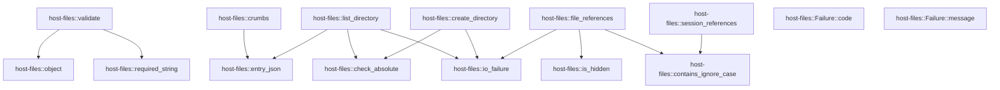

# host-files

[Package atlas](index.md) · [Source](../../src/lib.rs)

## Declarations

Visibility is the declaration spelling; trait members and reexports require their enclosing interface. `cfg` is not evaluated.

| Symbol | Kind | Visibility | Test / cfg |
|---|---|---|---|
| [host-files::METHODS](../../src/lib.rs#L26) | const_item | `pub` |  |
| [host-files::DIRECTORY_LIST_CAP](../../src/lib.rs#L34) | const_item | `pub` |  |
| [host-files::FILE_REFERENCE_LIMIT](../../src/lib.rs#L36) | const_item | `pub` |  |
| [host-files::FILE_REFERENCE_WALK_BUDGET](../../src/lib.rs#L38) | const_item | `pub` |  |
| [host-files::SESSION_REFERENCE_LIMIT](../../src/lib.rs#L40) | const_item | `pub` |  |
| [host-files::SKIPPED_DIRECTORIES](../../src/lib.rs#L43) | const_item | `private` |  |
| [host-files::Failure](../../src/lib.rs#L47) | enum_item | `pub` |  |
| [host-files::Failure::code](../../src/lib.rs#L65) | function_item | `pub` |  |
| [host-files::Failure::message](../../src/lib.rs#L78) | function_item | `pub` |  |
| [host-files::io_failure](../../src/lib.rs#L90) | function_item | `private` |  |
| [host-files::SessionCandidate](../../src/lib.rs#L106) | struct_item | `pub` |  |
| [host-files::object](../../src/lib.rs#L120) | function_item | `private` |  |
| [host-files::required_string](../../src/lib.rs#L133) | function_item | `private` |  |
| [host-files::validate](../../src/lib.rs#L145) | function_item | `pub` |  |
| [host-files::is_hidden](../../src/lib.rs#L172) | function_item | `private` |  |
| [host-files::check_absolute](../../src/lib.rs#L176) | function_item | `private` |  |
| [host-files::entry_json](../../src/lib.rs#L205) | function_item | `private` |  |
| [host-files::crumbs](../../src/lib.rs#L209) | function_item | `private` |  |
| [host-files::list_directory](../../src/lib.rs#L228) | function_item | `pub` |  |
| [host-files::create_directory](../../src/lib.rs#L276) | function_item | `pub` |  |
| [host-files::contains_ignore_case](../../src/lib.rs#L307) | function_item | `private` |  |
| [host-files::file_references](../../src/lib.rs#L321) | function_item | `pub` |  |
| [host-files::session_references](../../src/lib.rs#L412) | function_item | `pub` |  |
| [host-files::tests::tmp](../../src/lib.rs#L467) | function_item | `private` | test; #[cfg(test)] |
| [host-files::tests::validate_rejects_unknown_fields_and_wrong_types](../../src/lib.rs#L472) | function_item | `private` | test; #[cfg(test)] |
| [host-files::tests::listing_shows_only_directories_with_crumbs_and_hidden_flags](../../src/lib.rs#L499) | function_item | `private` | test; #[cfg(test)] |
| [host-files::tests::listing_explicit_path_and_symlinked_directory_not_resolved](../../src/lib.rs#L535) | function_item | `private` | test; #[cfg(test)] |
| [host-files::tests::listing_truncates_at_cap](../../src/lib.rs#L552) | function_item | `private` | test; #[cfg(test)] |
| [host-files::tests::listing_rejects_bad_paths](../../src/lib.rs#L566) | function_item | `private` | test; #[cfg(test)] |
| [host-files::tests::create_directory_succeeds_then_conflicts](../../src/lib.rs#L581) | function_item | `private` | test; #[cfg(test)] |
| [host-files::tests::create_directory_rejects_bad_names_and_parents](../../src/lib.rs#L599) | function_item | `private` | test; #[cfg(test)] |
| [host-files::tests::workspace](../../src/lib.rs#L622) | function_item | `private` | test; #[cfg(test)] |
| [host-files::tests::paths](../../src/lib.rs#L637) | function_item | `private` | test; #[cfg(test)] |
| [host-files::tests::file_references_empty_query_lists_top_level_without_hidden](../../src/lib.rs#L652) | function_item | `private` | test; #[cfg(test)] |
| [host-files::tests::file_references_match_case_insensitively_and_skip_directories](../../src/lib.rs#L666) | function_item | `private` | test; #[cfg(test)] |
| [host-files::tests::file_references_never_follow_symlinks_outside_roots](../../src/lib.rs#L690) | function_item | `private` | test; #[cfg(test)] |
| [host-files::tests::file_references_are_bounded](../../src/lib.rs#L712) | function_item | `private` | test; #[cfg(test)] |
| [host-files::tests::candidate](../../src/lib.rs#L731) | function_item | `private` | test; #[cfg(test)] |
| [host-files::tests::session_references_exclude_self_and_archived_and_rank_recent_first](../../src/lib.rs#L749) | function_item | `private` | test; #[cfg(test)] |
| [host-files::tests::session_references_empty_query_is_capped](../../src/lib.rs#L791) | function_item | `private` | test; #[cfg(test)] |

## Imports / reexports

| Local name | Source path | Visibility |
|---|---|---|
| `BTreeSet` | `std::collections::BTreeSet` | `private` |
| `VecDeque` | `std::collections::VecDeque` | `private` |
| `fs` | `std::fs` | `private` |
| `Component` | `std::path::Component` | `private` |
| `Path` | `std::path::Path` | `private` |
| `PathBuf` | `std::path::PathBuf` | `private` |
| `Value` | `serde_json::Value` | `private` |
| `json` | `serde_json::json` | `private` |
| `*` | `super::*` | `private` |
| `symlink` | `std::os::unix::fs::symlink` | `private` |

## Module declarations

| Module | Visibility | Attributes |
|---|---|---|
| `host-files::tests` | `private` | #[cfg(test)] |

## Function call graphs

Edges below are syntactically resolved calls only, including private functions. Graphs partition callers into groups of 20; they are not execution order. All unresolved sites are listed below and in the JSON inventory.

Functions 1–15: 12 direct edges

## Call sites

Includes test functions (marked in declarations). Receiver-type-required sites need type analysis/manual tracing. Calls in closures are attributed to their enclosing function; their occurrence here does not mean the closure executes immediately.

| Caller | Callee expression | Source lines | Target / classification |
|---|---|---|---|
| `io_failure` | `path.display` | [91](../../src/lib.rs#L91) | receiver-type-required |
| `io_failure` | `error.kind` | [92](../../src/lib.rs#L92) | receiver-type-required |
| `io_failure` | `Failure::DirectoryNotFound` | [93](../../src/lib.rs#L93) | external-constructor-callback-or-unresolved |
| `io_failure` | `Failure::DirectoryForbidden` | [95](../../src/lib.rs#L95) | external-constructor-callback-or-unresolved |
| `io_failure` | `Failure::DirectoryExists` | [98](../../src/lib.rs#L98) | external-constructor-callback-or-unresolved |
| `io_failure` | `Failure::Io` | [100](../../src/lib.rs#L100) | external-constructor-callback-or-unresolved |
| `object` | `payload.as_object().ok_or` | [124](../../src/lib.rs#L124) | receiver-type-required |
| `object` | `payload.as_object` | [124](../../src/lib.rs#L124) | receiver-type-required |
| `object` | `map.keys` | [125](../../src/lib.rs#L125) | receiver-type-required |
| `object` | `allowed.contains` | [126](../../src/lib.rs#L126) | receiver-type-required |
| `object` | `key.as_str` | [126](../../src/lib.rs#L126) | receiver-type-required |
| `object` | `Err` | [127](../../src/lib.rs#L127) | external-constructor-callback-or-unresolved |
| `object` | `Ok` | [130](../../src/lib.rs#L130) | external-constructor-callback-or-unresolved |
| `required_string` | `map.get` | [134](../../src/lib.rs#L134) | receiver-type-required |
| `required_string` | `Ok` | [135](../../src/lib.rs#L135) | external-constructor-callback-or-unresolved |
| `required_string` | `Err` | [136](../../src/lib.rs#L136), [137](../../src/lib.rs#L137) | external-constructor-callback-or-unresolved |
| `validate` | `object` | [148](../../src/lib.rs#L148), [155](../../src/lib.rs#L155), [160](../../src/lib.rs#L160) | [host-files::object](../../src/lib.rs#L120) |
| `validate` | `map.get` | [149](../../src/lib.rs#L149) | receiver-type-required |
| `validate` | `Ok` | [150](../../src/lib.rs#L150) | external-constructor-callback-or-unresolved |
| `validate` | `Err` | [151](../../src/lib.rs#L151), [164](../../src/lib.rs#L164) | external-constructor-callback-or-unresolved |
| `validate` | `"'path' must be a string".into` | [151](../../src/lib.rs#L151) | receiver-type-required |
| `validate` | `required_string` | [156](../../src/lib.rs#L156), [157](../../src/lib.rs#L157), [161](../../src/lib.rs#L161), [162](../../src/lib.rs#L162) | [host-files::required_string](../../src/lib.rs#L133) |
| `is_hidden` | `name.starts_with` | [173](../../src/lib.rs#L173) | receiver-type-required |
| `check_absolute` | `path.is_empty` | [177](../../src/lib.rs#L177) | receiver-type-required |
| `check_absolute` | `Err` | [178](../../src/lib.rs#L178), [181](../../src/lib.rs#L181), [185](../../src/lib.rs#L185), [191](../../src/lib.rs#L191) | external-constructor-callback-or-unresolved |
| `check_absolute` | `Failure::BadRequest` | [178](../../src/lib.rs#L178), [181](../../src/lib.rs#L181), [185](../../src/lib.rs#L185), [191](../../src/lib.rs#L191) | external-constructor-callback-or-unresolved |
| `check_absolute` | `"path must not be empty".into` | [178](../../src/lib.rs#L178) | receiver-type-required |
| `check_absolute` | `path.contains` | [180](../../src/lib.rs#L180) | receiver-type-required |
| `check_absolute` | `"path must not contain NUL".into` | [181](../../src/lib.rs#L181) | receiver-type-required |
| `check_absolute` | `Path::new` | [183](../../src/lib.rs#L183) | external-constructor-callback-or-unresolved |
| `check_absolute` | `parsed.is_absolute` | [184](../../src/lib.rs#L184) | receiver-type-required |
| `check_absolute` | `"path must be absolute".into` | [185](../../src/lib.rs#L185) | receiver-type-required |
| `check_absolute` | `parsed         .components()         .any` | [187](../../src/lib.rs#L187) | receiver-type-required |
| `check_absolute` | `parsed         .components` | [187](../../src/lib.rs#L187) | receiver-type-required |
| `check_absolute` | `"path must not contain '..'".into` | [191](../../src/lib.rs#L191) | receiver-type-required |
| `check_absolute` | `PathBuf::new` | [195](../../src/lib.rs#L195) | external-constructor-callback-or-unresolved |
| `check_absolute` | `parsed.components` | [196](../../src/lib.rs#L196) | receiver-type-required |
| `check_absolute` | `normalized.push` | [199](../../src/lib.rs#L199) | receiver-type-required |
| `check_absolute` | `Ok` | [202](../../src/lib.rs#L202) | external-constructor-callback-or-unresolved |
| `crumbs` | `Vec::new` | [210](../../src/lib.rs#L210) | external-constructor-callback-or-unresolved |
| `crumbs` | `PathBuf::new` | [211](../../src/lib.rs#L211) | external-constructor-callback-or-unresolved |
| `crumbs` | `path.components` | [212](../../src/lib.rs#L212) | receiver-type-required |
| `crumbs` | `current.push` | [213](../../src/lib.rs#L213) | receiver-type-required |
| `crumbs` | `"/".to_owned` | [215](../../src/lib.rs#L215) | receiver-type-required |
| `crumbs` | `other.as_os_str().to_string_lossy().into_owned` | [216](../../src/lib.rs#L216) | receiver-type-required |
| `crumbs` | `other.as_os_str().to_string_lossy` | [216](../../src/lib.rs#L216) | receiver-type-required |
| `crumbs` | `other.as_os_str` | [216](../../src/lib.rs#L216) | receiver-type-required |
| `crumbs` | `out.push` | [218](../../src/lib.rs#L218) | receiver-type-required |
| `crumbs` | `entry_json` | [218](../../src/lib.rs#L218) | [host-files::entry_json](../../src/lib.rs#L205) |
| `list_directory` | `check_absolute` | [230](../../src/lib.rs#L230), [231](../../src/lib.rs#L231) | [host-files::check_absolute](../../src/lib.rs#L176) |
| `list_directory` | `home.to_string_lossy` | [231](../../src/lib.rs#L231) | receiver-type-required |
| `list_directory` | `fs::metadata(&target).map_err` | [233](../../src/lib.rs#L233) | receiver-type-required |
| `list_directory` | `fs::metadata` | [233](../../src/lib.rs#L233), [246](../../src/lib.rs#L246) | external-constructor-callback-or-unresolved |
| `list_directory` | `io_failure` | [233](../../src/lib.rs#L233), [240](../../src/lib.rs#L240), [243](../../src/lib.rs#L243) | [host-files::io_failure](../../src/lib.rs#L90) |
| `list_directory` | `metadata.is_dir` | [234](../../src/lib.rs#L234) | receiver-type-required |
| `list_directory` | `Err` | [235](../../src/lib.rs#L235) | external-constructor-callback-or-unresolved |
| `list_directory` | `Failure::BadRequest` | [235](../../src/lib.rs#L235) | external-constructor-callback-or-unresolved |
| `list_directory` | `fs::read_dir(&target).map_err` | [240](../../src/lib.rs#L240) | receiver-type-required |
| `list_directory` | `fs::read_dir` | [240](../../src/lib.rs#L240) | external-constructor-callback-or-unresolved |
| `list_directory` | `BTreeSet::new` | [241](../../src/lib.rs#L241) | external-constructor-callback-or-unresolved |
| `list_directory` | `entry.map_err` | [243](../../src/lib.rs#L243) | receiver-type-required |
| `list_directory` | `fs::metadata(entry.path())             .map(&#124;m&#124; m.is_dir())             .unwrap_or` | [246](../../src/lib.rs#L246) | receiver-type-required |
| `list_directory` | `fs::metadata(entry.path())             .map` | [246](../../src/lib.rs#L246) | receiver-type-required |
| `list_directory` | `entry.path` | [246](../../src/lib.rs#L246) | receiver-type-required |
| `list_directory` | `m.is_dir` | [247](../../src/lib.rs#L247) | receiver-type-required |
| `list_directory` | `names.insert` | [250](../../src/lib.rs#L250) | receiver-type-required |
| `list_directory` | `entry.file_name().to_string_lossy().as_bytes().to_vec` | [250](../../src/lib.rs#L250) | receiver-type-required |
| `list_directory` | `entry.file_name().to_string_lossy().as_bytes` | [250](../../src/lib.rs#L250) | receiver-type-required |
| `list_directory` | `entry.file_name().to_string_lossy` | [250](../../src/lib.rs#L250) | receiver-type-required |
| `list_directory` | `entry.file_name` | [250](../../src/lib.rs#L250) | receiver-type-required |
| `list_directory` | `names.len` | [253](../../src/lib.rs#L253) | receiver-type-required |
| `list_directory` | `names         .iter()         .take(DIRECTORY_LIST_CAP)         .map(&#124;bytes&#124; {             let name = String::from_utf8_lossy(bytes);             entry_json(&name, &target.join(&*name))         })         .collect` | [254](../../src/lib.rs#L254) | receiver-type-required |
| `list_directory` | `names         .iter()         .take(DIRECTORY_LIST_CAP)         .map` | [254](../../src/lib.rs#L254) | receiver-type-required |
| `list_directory` | `names         .iter()         .take` | [254](../../src/lib.rs#L254) | receiver-type-required |
| `list_directory` | `names         .iter` | [254](../../src/lib.rs#L254) | receiver-type-required |
| `list_directory` | `String::from_utf8_lossy` | [258](../../src/lib.rs#L258) | external-constructor-callback-or-unresolved |
| `list_directory` | `entry_json` | [259](../../src/lib.rs#L259) | [host-files::entry_json](../../src/lib.rs#L205) |
| `list_directory` | `target.join` | [259](../../src/lib.rs#L259) | receiver-type-required |
| `list_directory` | `Ok` | [262](../../src/lib.rs#L262) | external-constructor-callback-or-unresolved |
| `create_directory` | `check_absolute` | [277](../../src/lib.rs#L277) | [host-files::check_absolute](../../src/lib.rs#L176) |
| `create_directory` | `name.is_empty` | [278](../../src/lib.rs#L278) | receiver-type-required |
| `create_directory` | `Err` | [279](../../src/lib.rs#L279), [282](../../src/lib.rs#L282), [287](../../src/lib.rs#L287), [294](../../src/lib.rs#L294) | external-constructor-callback-or-unresolved |
| `create_directory` | `Failure::BadRequest` | [279](../../src/lib.rs#L279), [282](../../src/lib.rs#L282) | external-constructor-callback-or-unresolved |
| `create_directory` | `"invalid directory name".into` | [279](../../src/lib.rs#L279) | receiver-type-required |
| `create_directory` | `name.contains` | [281](../../src/lib.rs#L281) | receiver-type-required |
| `create_directory` | `"directory name must not contain '/' or NUL".into` | [283](../../src/lib.rs#L283) | receiver-type-required |
| `create_directory` | `parent.is_dir` | [286](../../src/lib.rs#L286) | receiver-type-required |
| `create_directory` | `Failure::DirectoryNotFound` | [287](../../src/lib.rs#L287) | external-constructor-callback-or-unresolved |
| `create_directory` | `parent.join` | [292](../../src/lib.rs#L292) | receiver-type-required |
| `create_directory` | `fs::symlink_metadata(&target).is_ok` | [293](../../src/lib.rs#L293) | receiver-type-required |
| `create_directory` | `fs::symlink_metadata` | [293](../../src/lib.rs#L293) | external-constructor-callback-or-unresolved |
| `create_directory` | `Failure::DirectoryExists` | [294](../../src/lib.rs#L294) | external-constructor-callback-or-unresolved |
| `create_directory` | `fs::create_dir(&target).map_err` | [299](../../src/lib.rs#L299) | receiver-type-required |
| `create_directory` | `fs::create_dir` | [299](../../src/lib.rs#L299) | external-constructor-callback-or-unresolved |
| `create_directory` | `io_failure` | [299](../../src/lib.rs#L299) | [host-files::io_failure](../../src/lib.rs#L90) |
| `create_directory` | `Ok` | [300](../../src/lib.rs#L300) | external-constructor-callback-or-unresolved |
| `create_directory` | `Value::String` | [300](../../src/lib.rs#L300) | external-constructor-callback-or-unresolved |
| `create_directory` | `target.to_string_lossy().into_owned` | [300](../../src/lib.rs#L300) | receiver-type-required |
| `create_directory` | `target.to_string_lossy` | [300](../../src/lib.rs#L300) | receiver-type-required |
| `contains_ignore_case` | `needle.is_empty` | [308](../../src/lib.rs#L308) | receiver-type-required |
| `contains_ignore_case` | `haystack.to_lowercase().contains` | [308](../../src/lib.rs#L308) | receiver-type-required |
| `contains_ignore_case` | `haystack.to_lowercase` | [308](../../src/lib.rs#L308) | receiver-type-required |
| `contains_ignore_case` | `needle.to_lowercase` | [308](../../src/lib.rs#L308) | receiver-type-required |
| `file_references` | `roots         .first()         .ok_or_else` | [322](../../src/lib.rs#L322) | receiver-type-required |
| `file_references` | `roots         .first` | [322](../../src/lib.rs#L322) | receiver-type-required |
| `file_references` | `Failure::SessionNotFound` | [324](../../src/lib.rs#L324) | external-constructor-callback-or-unresolved |
| `file_references` | `"session has no workspace root".into` | [324](../../src/lib.rs#L324) | receiver-type-required |
| `file_references` | `query.contains` | [325](../../src/lib.rs#L325) | receiver-type-required |
| `file_references` | `Err` | [326](../../src/lib.rs#L326) | external-constructor-callback-or-unresolved |
| `file_references` | `Failure::BadRequest` | [326](../../src/lib.rs#L326) | external-constructor-callback-or-unresolved |
| `file_references` | `"query must not contain NUL".into` | [326](../../src/lib.rs#L326) | receiver-type-required |
| `file_references` | `query.trim` | [328](../../src/lib.rs#L328) | receiver-type-required |
| `file_references` | `query.starts_with` | [329](../../src/lib.rs#L329) | receiver-type-required |
| `file_references` | `roots         .iter()         .filter_map(&#124;root&#124; root.canonicalize().ok())         .collect` | [330](../../src/lib.rs#L330) | receiver-type-required |
| `file_references` | `roots         .iter()         .filter_map` | [330](../../src/lib.rs#L330) | receiver-type-required |
| `file_references` | `roots         .iter` | [330](../../src/lib.rs#L330) | receiver-type-required |
| `file_references` | `root.canonicalize().ok` | [332](../../src/lib.rs#L332) | receiver-type-required |
| `file_references` | `root.canonicalize` | [332](../../src/lib.rs#L332) | receiver-type-required |
| `file_references` | `primary         .canonicalize()         .map_err` | [334](../../src/lib.rs#L334) | receiver-type-required |
| `file_references` | `primary         .canonicalize` | [334](../../src/lib.rs#L334) | receiver-type-required |
| `file_references` | `io_failure` | [336](../../src/lib.rs#L336) | [host-files::io_failure](../../src/lib.rs#L90) |
| `file_references` | `Vec::new` | [338](../../src/lib.rs#L338), [345](../../src/lib.rs#L345) | external-constructor-callback-or-unresolved |
| `file_references` | `VecDeque::from` | [340](../../src/lib.rs#L340) | external-constructor-callback-or-unresolved |
| `file_references` | `primary_canonical.clone` | [340](../../src/lib.rs#L340) | receiver-type-required |
| `file_references` | `queue.pop_front` | [341](../../src/lib.rs#L341) | receiver-type-required |
| `file_references` | `fs::read_dir` | [342](../../src/lib.rs#L342) | external-constructor-callback-or-unresolved |
| `file_references` | `read.flatten` | [346](../../src/lib.rs#L346) | receiver-type-required |
| `file_references` | `entry.file_name().to_string_lossy().into_owned` | [347](../../src/lib.rs#L347) | receiver-type-required |
| `file_references` | `entry.file_name().to_string_lossy` | [347](../../src/lib.rs#L347) | receiver-type-required |
| `file_references` | `entry.file_name` | [347](../../src/lib.rs#L347) | receiver-type-required |
| `file_references` | `is_hidden` | [348](../../src/lib.rs#L348) | [host-files::is_hidden](../../src/lib.rs#L172) |
| `file_references` | `entry.path` | [351](../../src/lib.rs#L351) | receiver-type-required |
| `file_references` | `fs::symlink_metadata` | [352](../../src/lib.rs#L352) | external-constructor-callback-or-unresolved |
| `file_references` | `link_meta.file_type().is_symlink` | [355](../../src/lib.rs#L355) | receiver-type-required |
| `file_references` | `link_meta.file_type` | [355](../../src/lib.rs#L355) | receiver-type-required |
| `file_references` | `path.canonicalize` | [356](../../src/lib.rs#L356) | receiver-type-required |
| `file_references` | `canonical_roots.iter().any` | [357](../../src/lib.rs#L357) | receiver-type-required |
| `file_references` | `canonical_roots.iter` | [357](../../src/lib.rs#L357) | receiver-type-required |
| `file_references` | `resolved.starts_with` | [357](../../src/lib.rs#L357) | receiver-type-required |
| `file_references` | `resolved.is_dir` | [358](../../src/lib.rs#L358) | receiver-type-required |
| `file_references` | `link_meta.is_dir` | [364](../../src/lib.rs#L364) | receiver-type-required |
| `file_references` | `children.push` | [366](../../src/lib.rs#L366) | receiver-type-required |
| `file_references` | `children.sort_by` | [368](../../src/lib.rs#L368) | receiver-type-required |
| `file_references` | `a.0.as_bytes().cmp` | [368](../../src/lib.rs#L368) | receiver-type-required |
| `file_references` | `a.0.as_bytes` | [368](../../src/lib.rs#L368) | receiver-type-required |
| `file_references` | `b.0.as_bytes` | [368](../../src/lib.rs#L368) | receiver-type-required |
| `file_references` | `path                 .strip_prefix(&primary_canonical)                 .unwrap_or(&path)                 .to_string_lossy()                 .into_owned` | [374](../../src/lib.rs#L374) | receiver-type-required |
| `file_references` | `path                 .strip_prefix(&primary_canonical)                 .unwrap_or(&path)                 .to_string_lossy` | [374](../../src/lib.rs#L374) | receiver-type-required |
| `file_references` | `path                 .strip_prefix(&primary_canonical)                 .unwrap_or` | [374](../../src/lib.rs#L374) | receiver-type-required |
| `file_references` | `path                 .strip_prefix` | [374](../../src/lib.rs#L374) | receiver-type-required |
| `file_references` | `query.is_empty` | [379](../../src/lib.rs#L379), [393](../../src/lib.rs#L393) | receiver-type-required |
| `file_references` | `contains_ignore_case` | [382](../../src/lib.rs#L382) | [host-files::contains_ignore_case](../../src/lib.rs#L307) |
| `file_references` | `results.push` | [385](../../src/lib.rs#L385) | receiver-type-required |
| `file_references` | `results.len` | [389](../../src/lib.rs#L389) | receiver-type-required |
| `file_references` | `SKIPPED_DIRECTORIES.contains` | [393](../../src/lib.rs#L393) | receiver-type-required |
| `file_references` | `name.as_str` | [393](../../src/lib.rs#L393) | receiver-type-required |
| `file_references` | `queue.push_back` | [394](../../src/lib.rs#L394) | receiver-type-required |
| `file_references` | `Ok` | [398](../../src/lib.rs#L398) | external-constructor-callback-or-unresolved |
| `file_references` | `Value::Array` | [398](../../src/lib.rs#L398) | external-constructor-callback-or-unresolved |
| `session_references` | `query.trim` | [418](../../src/lib.rs#L418) | receiver-type-required |
| `session_references` | `candidates         .iter()         .filter(&#124;candidate&#124; !candidate.archived && candidate.session_id != requesting)         .filter(&#124;candidate&#124; {             let label = candidate.title.as_deref().unwrap_or("");             query.is_empty()                 &#124;&#124; contains_ignore_case(label, query)                 &#124;&#124; contains_ignore_case(&candidate.session_id, query)         })         .collect` | [419](../../src/lib.rs#L419) | receiver-type-required |
| `session_references` | `candidates         .iter()         .filter(&#124;candidate&#124; !candidate.archived && candidate.session_id != requesting)         .filter` | [419](../../src/lib.rs#L419) | receiver-type-required |
| `session_references` | `candidates         .iter()         .filter` | [419](../../src/lib.rs#L419) | receiver-type-required |
| `session_references` | `candidates         .iter` | [419](../../src/lib.rs#L419) | receiver-type-required |
| `session_references` | `candidate.title.as_deref().unwrap_or` | [423](../../src/lib.rs#L423) | receiver-type-required |
| `session_references` | `candidate.title.as_deref` | [423](../../src/lib.rs#L423) | receiver-type-required |
| `session_references` | `query.is_empty` | [424](../../src/lib.rs#L424), [435](../../src/lib.rs#L435) | receiver-type-required |
| `session_references` | `contains_ignore_case` | [425](../../src/lib.rs#L425), [426](../../src/lib.rs#L426) | [host-files::contains_ignore_case](../../src/lib.rs#L307) |
| `session_references` | `rows.sort_by` | [429](../../src/lib.rs#L429) | receiver-type-required |
| `session_references` | `b.created_at_ms             .partial_cmp(&a.created_at_ms)             .unwrap_or(std::cmp::Ordering::Equal)             .then_with` | [430](../../src/lib.rs#L430) | receiver-type-required |
| `session_references` | `b.created_at_ms             .partial_cmp(&a.created_at_ms)             .unwrap_or` | [430](../../src/lib.rs#L430) | receiver-type-required |
| `session_references` | `b.created_at_ms             .partial_cmp` | [430](../../src/lib.rs#L430) | receiver-type-required |
| `session_references` | `a.session_id.cmp` | [433](../../src/lib.rs#L433) | receiver-type-required |
| `session_references` | `rows.truncate` | [436](../../src/lib.rs#L436) | receiver-type-required |
| `session_references` | `Value::Array` | [438](../../src/lib.rs#L438) | external-constructor-callback-or-unresolved |
| `session_references` | `rows.into_iter()             .map(&#124;candidate&#124; {                 let label = candidate                     .title                     .as_deref()                     .filter(&#124;title&#124; !title.trim().is_empty())                     .unwrap_or(&candidate.session_id);                 let mut row = json!({                     "sessionId": candidate.session_id,                     "label": label,                     "sameWorkspace": candidate.workspace_id == requesting_workspace,                     "createdAt": candidate.created_at_ms,                     "mention": format!("@thread:{}", candidate.session_id),                 });                 if !candidate.cwd.is_empty() {                     row["cwd"] = Value::String(candidate.cwd.clone());                 }                 row             })             .collect` | [439](../../src/lib.rs#L439) | receiver-type-required |
| `session_references` | `rows.into_iter()             .map` | [439](../../src/lib.rs#L439) | receiver-type-required |
| `session_references` | `rows.into_iter` | [439](../../src/lib.rs#L439) | receiver-type-required |
| `session_references` | `candidate                     .title                     .as_deref()                     .filter(&#124;title&#124; !title.trim().is_empty())                     .unwrap_or` | [441](../../src/lib.rs#L441) | receiver-type-required |
| `session_references` | `candidate                     .title                     .as_deref()                     .filter` | [441](../../src/lib.rs#L441) | receiver-type-required |
| `session_references` | `candidate                     .title                     .as_deref` | [441](../../src/lib.rs#L441) | receiver-type-required |
| `session_references` | `title.trim().is_empty` | [444](../../src/lib.rs#L444) | receiver-type-required |
| `session_references` | `title.trim` | [444](../../src/lib.rs#L444) | receiver-type-required |
| `session_references` | `candidate.cwd.is_empty` | [453](../../src/lib.rs#L453) | receiver-type-required |
| `session_references` | `Value::String` | [454](../../src/lib.rs#L454) | external-constructor-callback-or-unresolved |
| `session_references` | `candidate.cwd.clone` | [454](../../src/lib.rs#L454) | receiver-type-required |
| `tmp` | `tempfile::tempdir().expect` | [468](../../src/lib.rs#L468) | receiver-type-required |
| `tmp` | `tempfile::tempdir` | [468](../../src/lib.rs#L468) | external-constructor-callback-or-unresolved |
| `listing_shows_only_directories_with_crumbs_and_hidden_flags` | `tmp` | [500](../../src/lib.rs#L500) | [host-files::tests::tmp](../../src/lib.rs#L467) |
| `listing_shows_only_directories_with_crumbs_and_hidden_flags` | `dir.path().join` | [501](../../src/lib.rs#L501) | receiver-type-required |
| `listing_shows_only_directories_with_crumbs_and_hidden_flags` | `dir.path` | [501](../../src/lib.rs#L501) | receiver-type-required |
| `listing_shows_only_directories_with_crumbs_and_hidden_flags` | `fs::create_dir_all(home.join("b")).unwrap` | [502](../../src/lib.rs#L502) | receiver-type-required |
| `listing_shows_only_directories_with_crumbs_and_hidden_flags` | `fs::create_dir_all` | [502](../../src/lib.rs#L502), [503](../../src/lib.rs#L503), [504](../../src/lib.rs#L504) | external-constructor-callback-or-unresolved |
| `listing_shows_only_directories_with_crumbs_and_hidden_flags` | `home.join` | [502](../../src/lib.rs#L502), [503](../../src/lib.rs#L503), [504](../../src/lib.rs#L504), [505](../../src/lib.rs#L505) | receiver-type-required |
| `listing_shows_only_directories_with_crumbs_and_hidden_flags` | `fs::create_dir_all(home.join("a")).unwrap` | [503](../../src/lib.rs#L503) | receiver-type-required |
| `listing_shows_only_directories_with_crumbs_and_hidden_flags` | `fs::create_dir_all(home.join(".hidden")).unwrap` | [504](../../src/lib.rs#L504) | receiver-type-required |
| `listing_shows_only_directories_with_crumbs_and_hidden_flags` | `fs::write(home.join("file.txt"), "x").unwrap` | [505](../../src/lib.rs#L505) | receiver-type-required |
| `listing_shows_only_directories_with_crumbs_and_hidden_flags` | `fs::write` | [505](../../src/lib.rs#L505) | external-constructor-callback-or-unresolved |
| `listing_shows_only_directories_with_crumbs_and_hidden_flags` | `list_directory(&home, None).unwrap` | [506](../../src/lib.rs#L506) | receiver-type-required |
| `listing_shows_only_directories_with_crumbs_and_hidden_flags` | `list_directory` | [506](../../src/lib.rs#L506) | external-constructor-callback-or-unresolved |
| `listing_shows_only_directories_with_crumbs_and_hidden_flags` | `listing["entries"]             .as_array()             .unwrap()             .iter()             .map(&#124;e&#124; e["name"].as_str().unwrap())             .collect` | [510](../../src/lib.rs#L510) | receiver-type-required |
| `listing_shows_only_directories_with_crumbs_and_hidden_flags` | `listing["entries"]             .as_array()             .unwrap()             .iter()             .map` | [510](../../src/lib.rs#L510) | receiver-type-required |
| `listing_shows_only_directories_with_crumbs_and_hidden_flags` | `listing["entries"]             .as_array()             .unwrap()             .iter` | [510](../../src/lib.rs#L510) | receiver-type-required |
| `listing_shows_only_directories_with_crumbs_and_hidden_flags` | `listing["entries"]             .as_array()             .unwrap` | [510](../../src/lib.rs#L510) | receiver-type-required |
| `listing_shows_only_directories_with_crumbs_and_hidden_flags` | `listing["entries"]             .as_array` | [510](../../src/lib.rs#L510) | receiver-type-required |
| `listing_shows_only_directories_with_crumbs_and_hidden_flags` | `e["name"].as_str().unwrap` | [514](../../src/lib.rs#L514) | receiver-type-required |
| `listing_shows_only_directories_with_crumbs_and_hidden_flags` | `e["name"].as_str` | [514](../../src/lib.rs#L514) | receiver-type-required |
| `listing_shows_only_directories_with_crumbs_and_hidden_flags` | `listing["crumbs"].as_array().unwrap` | [523](../../src/lib.rs#L523) | receiver-type-required |
| `listing_shows_only_directories_with_crumbs_and_hidden_flags` | `listing["crumbs"].as_array` | [523](../../src/lib.rs#L523) | receiver-type-required |
| `listing_explicit_path_and_symlinked_directory_not_resolved` | `tmp` | [536](../../src/lib.rs#L536) | [host-files::tests::tmp](../../src/lib.rs#L467) |
| `listing_explicit_path_and_symlinked_directory_not_resolved` | `dir.path().join` | [537](../../src/lib.rs#L537), [538](../../src/lib.rs#L538) | receiver-type-required |
| `listing_explicit_path_and_symlinked_directory_not_resolved` | `dir.path` | [537](../../src/lib.rs#L537), [538](../../src/lib.rs#L538), [542](../../src/lib.rs#L542) | receiver-type-required |
| `listing_explicit_path_and_symlinked_directory_not_resolved` | `fs::create_dir_all(&home).unwrap` | [539](../../src/lib.rs#L539) | receiver-type-required |
| `listing_explicit_path_and_symlinked_directory_not_resolved` | `fs::create_dir_all` | [539](../../src/lib.rs#L539), [540](../../src/lib.rs#L540) | external-constructor-callback-or-unresolved |
| `listing_explicit_path_and_symlinked_directory_not_resolved` | `fs::create_dir_all(&elsewhere).unwrap` | [540](../../src/lib.rs#L540) | receiver-type-required |
| `listing_explicit_path_and_symlinked_directory_not_resolved` | `symlink(&elsewhere, home.join("link")).unwrap` | [541](../../src/lib.rs#L541) | receiver-type-required |
| `listing_explicit_path_and_symlinked_directory_not_resolved` | `symlink` | [541](../../src/lib.rs#L541) | external-constructor-callback-or-unresolved |
| `listing_explicit_path_and_symlinked_directory_not_resolved` | `home.join` | [541](../../src/lib.rs#L541) | receiver-type-required |
| `listing_explicit_path_and_symlinked_directory_not_resolved` | `list_directory(dir.path(), Some(&home.to_string_lossy())).unwrap` | [542](../../src/lib.rs#L542) | receiver-type-required |
| `listing_explicit_path_and_symlinked_directory_not_resolved` | `list_directory` | [542](../../src/lib.rs#L542) | external-constructor-callback-or-unresolved |
| `listing_explicit_path_and_symlinked_directory_not_resolved` | `Some` | [542](../../src/lib.rs#L542) | external-constructor-callback-or-unresolved |
| `listing_explicit_path_and_symlinked_directory_not_resolved` | `home.to_string_lossy` | [542](../../src/lib.rs#L542) | receiver-type-required |
| `listing_truncates_at_cap` | `tmp` | [553](../../src/lib.rs#L553) | [host-files::tests::tmp](../../src/lib.rs#L467) |
| `listing_truncates_at_cap` | `fs::create_dir(dir.path().join(format!("d{i:05}"))).unwrap` | [555](../../src/lib.rs#L555) | receiver-type-required |
| `listing_truncates_at_cap` | `fs::create_dir` | [555](../../src/lib.rs#L555) | external-constructor-callback-or-unresolved |
| `listing_truncates_at_cap` | `dir.path().join` | [555](../../src/lib.rs#L555) | receiver-type-required |
| `listing_truncates_at_cap` | `dir.path` | [555](../../src/lib.rs#L555), [557](../../src/lib.rs#L557) | receiver-type-required |
| `listing_truncates_at_cap` | `list_directory(dir.path(), None).unwrap` | [557](../../src/lib.rs#L557) | receiver-type-required |
| `listing_truncates_at_cap` | `list_directory` | [557](../../src/lib.rs#L557) | external-constructor-callback-or-unresolved |
| `listing_rejects_bad_paths` | `Path::new` | [567](../../src/lib.rs#L567) | external-constructor-callback-or-unresolved |
| `listing_rejects_bad_paths` | `list_directory(home, Some(bad)).unwrap_err` | [569](../../src/lib.rs#L569) | receiver-type-required |
| `listing_rejects_bad_paths` | `list_directory` | [569](../../src/lib.rs#L569), [572](../../src/lib.rs#L572), [576](../../src/lib.rs#L576) | external-constructor-callback-or-unresolved |
| `listing_rejects_bad_paths` | `Some` | [569](../../src/lib.rs#L569), [572](../../src/lib.rs#L572), [576](../../src/lib.rs#L576) | external-constructor-callback-or-unresolved |
| `listing_rejects_bad_paths` | `list_directory(home, Some("/definitely/not/here/xyz")).unwrap_err` | [572](../../src/lib.rs#L572) | receiver-type-required |
| `listing_rejects_bad_paths` | `tmp` | [574](../../src/lib.rs#L574) | [host-files::tests::tmp](../../src/lib.rs#L467) |
| `listing_rejects_bad_paths` | `fs::write(dir.path().join("f"), "").unwrap` | [575](../../src/lib.rs#L575) | receiver-type-required |
| `listing_rejects_bad_paths` | `fs::write` | [575](../../src/lib.rs#L575) | external-constructor-callback-or-unresolved |
| `listing_rejects_bad_paths` | `dir.path().join` | [575](../../src/lib.rs#L575), [576](../../src/lib.rs#L576) | receiver-type-required |
| `listing_rejects_bad_paths` | `dir.path` | [575](../../src/lib.rs#L575), [576](../../src/lib.rs#L576) | receiver-type-required |
| `listing_rejects_bad_paths` | `list_directory(home, Some(&dir.path().join("f").to_string_lossy())).unwrap_err` | [576](../../src/lib.rs#L576) | receiver-type-required |
| `listing_rejects_bad_paths` | `dir.path().join("f").to_string_lossy` | [576](../../src/lib.rs#L576) | receiver-type-required |
| `create_directory_succeeds_then_conflicts` | `tmp` | [582](../../src/lib.rs#L582) | [host-files::tests::tmp](../../src/lib.rs#L467) |
| `create_directory_succeeds_then_conflicts` | `dir.path().to_string_lossy().into_owned` | [583](../../src/lib.rs#L583) | receiver-type-required |
| `create_directory_succeeds_then_conflicts` | `dir.path().to_string_lossy` | [583](../../src/lib.rs#L583) | receiver-type-required |
| `create_directory_succeeds_then_conflicts` | `dir.path` | [583](../../src/lib.rs#L583), [591](../../src/lib.rs#L591) | receiver-type-required |
| `create_directory_succeeds_then_conflicts` | `create_directory(&base, "new").unwrap` | [584](../../src/lib.rs#L584) | receiver-type-required |
| `create_directory_succeeds_then_conflicts` | `create_directory` | [584](../../src/lib.rs#L584) | external-constructor-callback-or-unresolved |
| `create_directory_succeeds_then_conflicts` | `fs::write(dir.path().join("f"), "").unwrap` | [591](../../src/lib.rs#L591) | receiver-type-required |
| `create_directory_succeeds_then_conflicts` | `fs::write` | [591](../../src/lib.rs#L591) | external-constructor-callback-or-unresolved |
| `create_directory_succeeds_then_conflicts` | `dir.path().join` | [591](../../src/lib.rs#L591) | receiver-type-required |
| `create_directory_rejects_bad_names_and_parents` | `tmp` | [600](../../src/lib.rs#L600) | [host-files::tests::tmp](../../src/lib.rs#L467) |
| `create_directory_rejects_bad_names_and_parents` | `dir.path().to_string_lossy().into_owned` | [601](../../src/lib.rs#L601) | receiver-type-required |
| `create_directory_rejects_bad_names_and_parents` | `dir.path().to_string_lossy` | [601](../../src/lib.rs#L601) | receiver-type-required |
| `create_directory_rejects_bad_names_and_parents` | `dir.path` | [601](../../src/lib.rs#L601), [618](../../src/lib.rs#L618) | receiver-type-required |
| `create_directory_rejects_bad_names_and_parents` | `create_directory(&dir.path().join("missing").to_string_lossy(), "x").unwrap_err` | [618](../../src/lib.rs#L618) | receiver-type-required |
| `create_directory_rejects_bad_names_and_parents` | `create_directory` | [618](../../src/lib.rs#L618) | external-constructor-callback-or-unresolved |
| `create_directory_rejects_bad_names_and_parents` | `dir.path().join("missing").to_string_lossy` | [618](../../src/lib.rs#L618) | receiver-type-required |
| `create_directory_rejects_bad_names_and_parents` | `dir.path().join` | [618](../../src/lib.rs#L618) | receiver-type-required |
| `workspace` | `tmp` | [623](../../src/lib.rs#L623) | [host-files::tests::tmp](../../src/lib.rs#L467) |
| `workspace` | `dir.path().join` | [624](../../src/lib.rs#L624) | receiver-type-required |
| `workspace` | `dir.path` | [624](../../src/lib.rs#L624) | receiver-type-required |
| `workspace` | `fs::create_dir_all(root.join("src/nested")).unwrap` | [625](../../src/lib.rs#L625) | receiver-type-required |
| `workspace` | `fs::create_dir_all` | [625](../../src/lib.rs#L625), [629](../../src/lib.rs#L629), [631](../../src/lib.rs#L631) | external-constructor-callback-or-unresolved |
| `workspace` | `root.join` | [625](../../src/lib.rs#L625), [626](../../src/lib.rs#L626), [627](../../src/lib.rs#L627), [628](../../src/lib.rs#L628), [629](../../src/lib.rs#L629), [630](../../src/lib.rs#L630), [631](../../src/lib.rs#L631), [632](../../src/lib.rs#L632), [633](../../src/lib.rs#L633) | receiver-type-required |
| `workspace` | `fs::write(root.join("src/main.rs"), "").unwrap` | [626](../../src/lib.rs#L626) | receiver-type-required |
| `workspace` | `fs::write` | [626](../../src/lib.rs#L626), [627](../../src/lib.rs#L627), [628](../../src/lib.rs#L628), [630](../../src/lib.rs#L630), [632](../../src/lib.rs#L632), [633](../../src/lib.rs#L633) | external-constructor-callback-or-unresolved |
| `workspace` | `fs::write(root.join("src/nested/Helper.swift"), "").unwrap` | [627](../../src/lib.rs#L627) | receiver-type-required |
| `workspace` | `fs::write(root.join("README.md"), "").unwrap` | [628](../../src/lib.rs#L628) | receiver-type-required |
| `workspace` | `fs::create_dir_all(root.join("node_modules/pkg")).unwrap` | [629](../../src/lib.rs#L629) | receiver-type-required |
| `workspace` | `fs::write(root.join("node_modules/pkg/main.js"), "").unwrap` | [630](../../src/lib.rs#L630) | receiver-type-required |
| `workspace` | `fs::create_dir_all(root.join(".git")).unwrap` | [631](../../src/lib.rs#L631) | receiver-type-required |
| `workspace` | `fs::write(root.join(".git/HEAD"), "").unwrap` | [632](../../src/lib.rs#L632) | receiver-type-required |
| `workspace` | `fs::write(root.join(".env"), "").unwrap` | [633](../../src/lib.rs#L633) | receiver-type-required |
| `paths` | `value             .as_array()             .unwrap()             .iter()             .map(&#124;r&#124; {                 (                     r["path"].as_str().unwrap().to_owned(),                     r["kind"].as_str().unwrap().to_owned(),                 )             })             .collect` | [638](../../src/lib.rs#L638) | receiver-type-required |
| `paths` | `value             .as_array()             .unwrap()             .iter()             .map` | [638](../../src/lib.rs#L638) | receiver-type-required |
| `paths` | `value             .as_array()             .unwrap()             .iter` | [638](../../src/lib.rs#L638) | receiver-type-required |
| `paths` | `value             .as_array()             .unwrap` | [638](../../src/lib.rs#L638) | receiver-type-required |
| `paths` | `value             .as_array` | [638](../../src/lib.rs#L638) | receiver-type-required |
| `paths` | `r["path"].as_str().unwrap().to_owned` | [644](../../src/lib.rs#L644) | receiver-type-required |
| `paths` | `r["path"].as_str().unwrap` | [644](../../src/lib.rs#L644) | receiver-type-required |
| `paths` | `r["path"].as_str` | [644](../../src/lib.rs#L644) | receiver-type-required |
| `paths` | `r["kind"].as_str().unwrap().to_owned` | [645](../../src/lib.rs#L645) | receiver-type-required |
| `paths` | `r["kind"].as_str().unwrap` | [645](../../src/lib.rs#L645) | receiver-type-required |
| `paths` | `r["kind"].as_str` | [645](../../src/lib.rs#L645) | receiver-type-required |
| `file_references_empty_query_lists_top_level_without_hidden` | `workspace` | [653](../../src/lib.rs#L653) | [host-files::tests::workspace](../../src/lib.rs#L622) |
| `file_references_empty_query_lists_top_level_without_hidden` | `paths` | [654](../../src/lib.rs#L654) | [host-files::tests::paths](../../src/lib.rs#L637) |
| `file_references_empty_query_lists_top_level_without_hidden` | `file_references(&[root], "").unwrap` | [654](../../src/lib.rs#L654) | receiver-type-required |
| `file_references_empty_query_lists_top_level_without_hidden` | `file_references` | [654](../../src/lib.rs#L654) | external-constructor-callback-or-unresolved |
| `file_references_match_case_insensitively_and_skip_directories` | `workspace` | [667](../../src/lib.rs#L667) | [host-files::tests::workspace](../../src/lib.rs#L622) |
| `file_references_match_case_insensitively_and_skip_directories` | `paths` | [668](../../src/lib.rs#L668), [670](../../src/lib.rs#L670), [675](../../src/lib.rs#L675), [685](../../src/lib.rs#L685) | [host-files::tests::paths](../../src/lib.rs#L637) |
| `file_references_match_case_insensitively_and_skip_directories` | `file_references(&[root.clone()], "MAIN").unwrap` | [668](../../src/lib.rs#L668) | receiver-type-required |
| `file_references_match_case_insensitively_and_skip_directories` | `file_references` | [668](../../src/lib.rs#L668), [670](../../src/lib.rs#L670), [675](../../src/lib.rs#L675), [685](../../src/lib.rs#L685) | external-constructor-callback-or-unresolved |
| `file_references_match_case_insensitively_and_skip_directories` | `root.clone` | [668](../../src/lib.rs#L668), [670](../../src/lib.rs#L670), [675](../../src/lib.rs#L675) | receiver-type-required |
| `file_references_match_case_insensitively_and_skip_directories` | `file_references(&[root.clone()], "helper").unwrap` | [670](../../src/lib.rs#L670) | receiver-type-required |
| `file_references_match_case_insensitively_and_skip_directories` | `file_references(&[root.clone()], "nested").unwrap` | [675](../../src/lib.rs#L675) | receiver-type-required |
| `file_references_match_case_insensitively_and_skip_directories` | `file_references(&[root], ".env").unwrap` | [685](../../src/lib.rs#L685) | receiver-type-required |
| `file_references_never_follow_symlinks_outside_roots` | `workspace` | [691](../../src/lib.rs#L691) | [host-files::tests::workspace](../../src/lib.rs#L622) |
| `file_references_never_follow_symlinks_outside_roots` | `dir.path().join` | [692](../../src/lib.rs#L692) | receiver-type-required |
| `file_references_never_follow_symlinks_outside_roots` | `dir.path` | [692](../../src/lib.rs#L692) | receiver-type-required |
| `file_references_never_follow_symlinks_outside_roots` | `fs::create_dir_all(&outside).unwrap` | [693](../../src/lib.rs#L693) | receiver-type-required |
| `file_references_never_follow_symlinks_outside_roots` | `fs::create_dir_all` | [693](../../src/lib.rs#L693) | external-constructor-callback-or-unresolved |
| `file_references_never_follow_symlinks_outside_roots` | `fs::write(outside.join("secret.txt"), "").unwrap` | [694](../../src/lib.rs#L694) | receiver-type-required |
| `file_references_never_follow_symlinks_outside_roots` | `fs::write` | [694](../../src/lib.rs#L694) | external-constructor-callback-or-unresolved |
| `file_references_never_follow_symlinks_outside_roots` | `outside.join` | [694](../../src/lib.rs#L694) | receiver-type-required |
| `file_references_never_follow_symlinks_outside_roots` | `symlink(&outside, root.join("escape")).unwrap` | [695](../../src/lib.rs#L695) | receiver-type-required |
| `file_references_never_follow_symlinks_outside_roots` | `symlink` | [695](../../src/lib.rs#L695), [696](../../src/lib.rs#L696) | external-constructor-callback-or-unresolved |
| `file_references_never_follow_symlinks_outside_roots` | `root.join` | [695](../../src/lib.rs#L695), [696](../../src/lib.rs#L696) | receiver-type-required |
| `file_references_never_follow_symlinks_outside_roots` | `symlink(root.join("src"), root.join("inside")).unwrap` | [696](../../src/lib.rs#L696) | receiver-type-required |
| `file_references_never_follow_symlinks_outside_roots` | `paths` | [697](../../src/lib.rs#L697), [699](../../src/lib.rs#L699), [701](../../src/lib.rs#L701), [704](../../src/lib.rs#L704) | [host-files::tests::paths](../../src/lib.rs#L637) |
| `file_references_never_follow_symlinks_outside_roots` | `file_references(&[root.clone()], "secret").unwrap` | [697](../../src/lib.rs#L697) | receiver-type-required |
| `file_references_never_follow_symlinks_outside_roots` | `file_references` | [697](../../src/lib.rs#L697), [699](../../src/lib.rs#L699), [701](../../src/lib.rs#L701), [704](../../src/lib.rs#L704) | external-constructor-callback-or-unresolved |
| `file_references_never_follow_symlinks_outside_roots` | `root.clone` | [697](../../src/lib.rs#L697), [699](../../src/lib.rs#L699), [701](../../src/lib.rs#L701) | receiver-type-required |
| `file_references_never_follow_symlinks_outside_roots` | `file_references(&[root.clone()], "escape").unwrap` | [699](../../src/lib.rs#L699) | receiver-type-required |
| `file_references_never_follow_symlinks_outside_roots` | `file_references(&[root.clone()], "inside").unwrap` | [701](../../src/lib.rs#L701) | receiver-type-required |
| `file_references_never_follow_symlinks_outside_roots` | `file_references(&[root, outside], "secret").unwrap` | [704](../../src/lib.rs#L704) | receiver-type-required |
| `file_references_are_bounded` | `tmp` | [713](../../src/lib.rs#L713) | [host-files::tests::tmp](../../src/lib.rs#L467) |
| `file_references_are_bounded` | `fs::write(dir.path().join(format!("match{i}.txt")), "").unwrap` | [715](../../src/lib.rs#L715) | receiver-type-required |
| `file_references_are_bounded` | `fs::write` | [715](../../src/lib.rs#L715) | external-constructor-callback-or-unresolved |
| `file_references_are_bounded` | `dir.path().join` | [715](../../src/lib.rs#L715) | receiver-type-required |
| `file_references_are_bounded` | `dir.path` | [715](../../src/lib.rs#L715), [717](../../src/lib.rs#L717) | receiver-type-required |
| `file_references_are_bounded` | `file_references(&[dir.path().to_owned()], "match").unwrap` | [717](../../src/lib.rs#L717) | receiver-type-required |
| `file_references_are_bounded` | `file_references` | [717](../../src/lib.rs#L717) | external-constructor-callback-or-unresolved |
| `file_references_are_bounded` | `dir.path().to_owned` | [717](../../src/lib.rs#L717) | receiver-type-required |
| `candidate` | `id.into` | [739](../../src/lib.rs#L739) | receiver-type-required |
| `candidate` | `title.map` | [740](../../src/lib.rs#L740) | receiver-type-required |
| `candidate` | `ws.into` | [742](../../src/lib.rs#L742) | receiver-type-required |
| `session_references_exclude_self_and_archived_and_rank_recent_first` | `session_references` | [757](../../src/lib.rs#L757), [774](../../src/lib.rs#L774) | external-constructor-callback-or-unresolved |
| `session_references_exclude_self_and_archived_and_rank_recent_first` | `rows             .as_array()             .unwrap()             .iter()             .map(&#124;r&#124; r["sessionId"].as_str().unwrap())             .collect` | [758](../../src/lib.rs#L758), [775](../../src/lib.rs#L775) | receiver-type-required |
| `session_references_exclude_self_and_archived_and_rank_recent_first` | `rows             .as_array()             .unwrap()             .iter()             .map` | [758](../../src/lib.rs#L758), [775](../../src/lib.rs#L775) | receiver-type-required |
| `session_references_exclude_self_and_archived_and_rank_recent_first` | `rows             .as_array()             .unwrap()             .iter` | [758](../../src/lib.rs#L758), [775](../../src/lib.rs#L775) | receiver-type-required |
| `session_references_exclude_self_and_archived_and_rank_recent_first` | `rows             .as_array()             .unwrap` | [758](../../src/lib.rs#L758), [775](../../src/lib.rs#L775) | receiver-type-required |
| `session_references_exclude_self_and_archived_and_rank_recent_first` | `rows             .as_array` | [758](../../src/lib.rs#L758), [775](../../src/lib.rs#L775) | receiver-type-required |
| `session_references_exclude_self_and_archived_and_rank_recent_first` | `r["sessionId"].as_str().unwrap` | [762](../../src/lib.rs#L762), [779](../../src/lib.rs#L779) | receiver-type-required |
| `session_references_exclude_self_and_archived_and_rank_recent_first` | `r["sessionId"].as_str` | [762](../../src/lib.rs#L762), [779](../../src/lib.rs#L779) | receiver-type-required |
| `session_references_empty_query_is_capped` | `(0..30)             .map(&#124;i&#124; candidate(&format!("s{i}"), Some("t"), "w", f64::from(i), false))             .collect` | [792](../../src/lib.rs#L792) | receiver-type-required |
| `session_references_empty_query_is_capped` | `(0..30)             .map` | [792](../../src/lib.rs#L792) | receiver-type-required |
| `session_references_empty_query_is_capped` | `candidate` | [793](../../src/lib.rs#L793) | [host-files::tests::candidate](../../src/lib.rs#L731) |
| `session_references_empty_query_is_capped` | `Some` | [793](../../src/lib.rs#L793) | external-constructor-callback-or-unresolved |
| `session_references_empty_query_is_capped` | `f64::from` | [793](../../src/lib.rs#L793) | external-constructor-callback-or-unresolved |
| `session_references_empty_query_is_capped` | `session_references` | [795](../../src/lib.rs#L795), [798](../../src/lib.rs#L798) | external-constructor-callback-or-unresolved |
