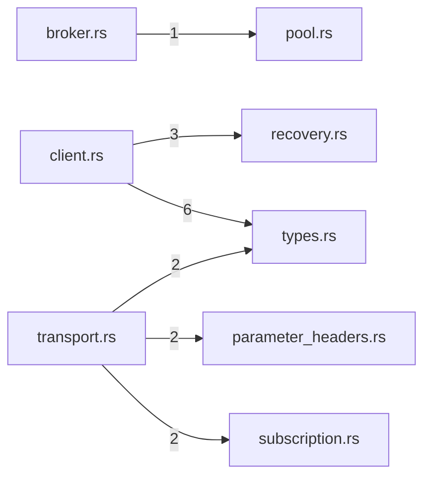

# mcp — generated atlas

[All packages](../../../../docs/architecture/generated/index.md) · [Maintained explanation](../README.md)

## Cargo targets

| Target | Kind | Entry |
|---|---|---|
| `mcp` | lib | [crates/mcp/src/lib.rs](../../src/lib.rs) |
| `mcp-fixture-server` | bin | [crates/mcp/src/bin/mcp-fixture-server.rs](../../src/bin/mcp-fixture-server.rs) |
| `handshake_lifecycle` | test | [crates/mcp/tests/handshake_lifecycle.rs](../../tests/handshake_lifecycle.rs) |
| `http_discovery` | test | [crates/mcp/tests/http_discovery.rs](../../tests/http_discovery.rs) |
| `live_official_sdk_tunnel` | test | [crates/mcp/tests/live_official_sdk_tunnel.rs](../../tests/live_official_sdk_tunnel.rs) |
| `live_services` | test | [crates/mcp/tests/live_services.rs](../../tests/live_services.rs) |
| `slice13_gates` | test | [crates/mcp/tests/slice13_gates.rs](../../tests/slice13_gates.rs) |

## Direct workspace dependencies

| Dependency | Kind | Target cfg |
|---|---|---|
| `plugins` | normal | all |
| `profile` | normal | all |
| `schema` | normal | all |
| `store` | normal | all |

[Public/restricted API and direct callers](api.md)

## Source files / lexical modules

`src` files have full symbol/call tables and partitioned function graphs. Integration tests and examples remain in the JSON inventory.
File-derived paths below are lexical navigation, not a compiler-resolved module tree; inline module declarations are listed separately.

| File | Symbols | Call sites | Detail |
|---|---:|---:|---|
| [crates/mcp/src/bin/mcp-fixture-server.rs](../../src/bin/mcp-fixture-server.rs) | 1 | 97 | [Symbols and calls](src--bin--mcp-fixture-server.md) |
| [crates/mcp/src/broker.rs](../../src/broker.rs) | 21 | 156 | [Symbols and calls](src--broker.md) |
| [crates/mcp/src/client.rs](../../src/client.rs) | 86 | 617 | [Symbols and calls](src--client.md) |
| [crates/mcp/src/lib.rs](../../src/lib.rs) | 6 | 0 | [Symbols and calls](src--lib.md) |
| [crates/mcp/src/management.rs](../../src/management.rs) | 66 | 493 | [Symbols and calls](src--management.md) |
| [crates/mcp/src/parameter_headers.rs](../../src/parameter_headers.rs) | 11 | 109 | [Symbols and calls](src--parameter_headers.md) |
| [crates/mcp/src/pool.rs](../../src/pool.rs) | 19 | 134 | [Symbols and calls](src--pool.md) |
| [crates/mcp/src/projection.rs](../../src/projection.rs) | 8 | 91 | [Symbols and calls](src--projection.md) |
| [crates/mcp/src/recovery.rs](../../src/recovery.rs) | 3 | 0 | [Symbols and calls](src--recovery.md) |
| [crates/mcp/src/subscription.rs](../../src/subscription.rs) | 7 | 48 | [Symbols and calls](src--subscription.md) |
| [crates/mcp/src/transport.rs](../../src/transport.rs) | 77 | 815 | [Symbols and calls](src--transport.md) |
| [crates/mcp/src/types.rs](../../src/types.rs) | 45 | 198 | [Symbols and calls](src--types.md) |
| [crates/mcp/tests/handshake_lifecycle.rs](../../tests/handshake_lifecycle.rs) | 15 | 95 | `inventory.json` |
| [crates/mcp/tests/http_discovery.rs](../../tests/http_discovery.rs) | 19 | 743 | `inventory.json` |
| [crates/mcp/tests/live_official_sdk_tunnel.rs](../../tests/live_official_sdk_tunnel.rs) | 5 | 102 | `inventory.json` |
| [crates/mcp/tests/live_services.rs](../../tests/live_services.rs) | 7 | 59 | `inventory.json` |
| [crates/mcp/tests/slice13_gates.rs](../../tests/slice13_gates.rs) | 49 | 974 | `inventory.json` |

## Cross-file direct calls

Source files stand in for out-of-line modules; see declarations for inline modules. Counts are syntactic call sites, not runtime frequency.

