# mcp::broker

[Package atlas](index.md) · [Source](../../src/broker.rs)

## Declarations

Visibility is the declaration spelling; trait members and reexports require their enclosing interface. `cfg` is not evaluated.

| Symbol | Kind | Visibility | Test / cfg |
|---|---|---|---|
| [mcp::broker::QUEUE_DEPTH](../../src/broker.rs#L11) | const_item | `private` |  |
| [mcp::broker::McpBroker](../../src/broker.rs#L13) | struct_item | `pub` |  |
| [mcp::broker::McpBrokerHandle](../../src/broker.rs#L20) | struct_item | `pub` |  |
| [mcp::broker::Command](../../src/broker.rs#L24) | enum_item | `private` |  |
| [mcp::broker::McpBroker::start](../../src/broker.rs#L62) | function_item | `pub` |  |
| [mcp::broker::McpBroker::handle](../../src/broker.rs#L78) | function_item | `pub` |  |
| [mcp::broker::McpBroker::drop](../../src/broker.rs#L84) | function_item | `private` |  |
| [mcp::broker::McpBrokerHandle::register](../../src/broker.rs#L93) | function_item | `pub` |  |
| [mcp::broker::McpBrokerHandle::call_tool](../../src/broker.rs#L111) | function_item | `pub` |  |
| [mcp::broker::McpBrokerHandle::call_tool_augmented](../../src/broker.rs#L135) | function_item | `pub` |  |
| [mcp::broker::McpBrokerHandle::call_tool_with_context](../../src/broker.rs#L159) | function_item | `pub` |  |
| [mcp::broker::McpBrokerHandle::task_operation](../../src/broker.rs#L182) | function_item | `pub` |  |
| [mcp::broker::McpBrokerHandle::task_operation_cancellable](../../src/broker.rs#L191) | function_item | `pub` |  |
| [mcp::broker::McpBrokerHandle::remove](../../src/broker.rs#L218) | function_item | `pub` |  |
| [mcp::broker::McpBrokerHandle::release](../../src/broker.rs#L226) | function_item | `pub` |  |
| [mcp::broker::McpBrokerHandle::catalog_generation](../../src/broker.rs#L234) | function_item | `pub` |  |
| [mcp::broker::receive](../../src/broker.rs#L243) | function_item | `private` |  |
| [mcp::broker::receive_mutation](../../src/broker.rs#L249) | function_item | `private` |  |
| [mcp::broker::map_send](../../src/broker.rs#L262) | function_item | `private` |  |
| [mcp::broker::run](../../src/broker.rs#L271) | function_item | `private` |  |
| [mcp::broker::is_fatal_peer_error](../../src/broker.rs#L438) | function_item | `private` |  |

## Imports / reexports

| Local name | Source path | Visibility |
|---|---|---|
| `Arc` | `std::sync::Arc` | `private` |
| `AtomicBool` | `std::sync::atomic::AtomicBool` | `private` |
| `Ordering` | `std::sync::atomic::Ordering` | `private` |
| `mpsc` | `std::sync::mpsc` | `private` |
| `Receiver` | `std::sync::mpsc::Receiver` | `private` |
| `SyncSender` | `std::sync::mpsc::SyncSender` | `private` |
| `thread` | `std::thread` | `private` |
| `JoinHandle` | `std::thread::JoinHandle` | `private` |
| `Duration` | `std::time::Duration` | `private` |
| `IJsonValue` | `schema::IJsonValue` | `private` |
| `McpCancellationToken` | `crate::McpCancellationToken` | `private` |
| `McpError` | `crate::McpError` | `private` |
| `McpPeer` | `crate::McpPeer` | `private` |
| `McpPool` | `crate::McpPool` | `private` |
| `McpPoolKey` | `crate::McpPoolKey` | `private` |
| `McpToolCallContext` | `crate::McpToolCallContext` | `private` |

## Module declarations

| Module | Visibility | Attributes |
|---|---|---|

## Function call graphs

Edges below are syntactically resolved calls only, including private functions. Graphs partition callers into groups of 20; they are not execution order. All unresolved sites are listed below and in the JSON inventory.

```mermaid
flowchart TD
  n0["mcp::broker::McpBrokerHandle::call_tool"]
  n1["mcp::broker::McpBrokerHandle::call_tool_augmented"]
  n2["mcp::broker::McpBrokerHandle::call_tool_with_context"]
  n3["mcp::broker::McpBrokerHandle::task_operation"]
  n4["mcp::broker::McpBrokerHandle::task_operation_cancellable"]
  n5["mcp::broker::McpBrokerHandle::remove"]
  n6["mcp::broker::McpBrokerHandle::release"]
  n7["mcp::broker::McpBrokerHandle::catalog_generation"]
  n8["mcp::broker::receive"]
  n9["mcp::broker::receive_mutation"]
  n10["mcp::broker::map_send"]
  n11["mcp::broker::run"]
  n12["mcp::broker::is_fatal_peer_error"]
  n13["mcp::broker::McpBroker::start"]
  n14["mcp::broker::McpBroker::handle"]
  n15["mcp::broker::McpBroker::drop"]
  n16["mcp::broker::McpBrokerHandle::register"]
  n17["mcp::pool::McpPool::new"]
  n0 --> n9
  n1 --> n9
  n2 --> n9
  n3 --> n4
  n4 --> n8
  n4 --> n9
  n5 --> n8
  n6 --> n8
  n7 --> n8
  n11 --> n12
  n11 --> n17
  n13 --> n11
  n16 --> n8
```

Functions 1–17: 13 direct edges

## Call sites

Includes test functions (marked in declarations). Receiver-type-required sites need type analysis/manual tracing. Calls in closures are attributed to their enclosing function; their occurrence here does not mean the closure executes immediately.

| Caller | Callee expression | Source lines | Target / classification |
|---|---|---|---|
| `start` | `mpsc::sync_channel` | [63](../../src/broker.rs#L63) | external-constructor-callback-or-unresolved |
| `start` | `Arc::new` | [64](../../src/broker.rs#L64) | external-constructor-callback-or-unresolved |
| `start` | `AtomicBool::new` | [64](../../src/broker.rs#L64) | external-constructor-callback-or-unresolved |
| `start` | `Arc::clone` | [65](../../src/broker.rs#L65) | external-constructor-callback-or-unresolved |
| `start` | `thread::Builder::new()             .name("tekes-mcp-pool".to_owned())             .spawn(move &#124;&#124; run(receiver, &thread_shutdown))             .map_err` | [66](../../src/broker.rs#L66) | receiver-type-required |
| `start` | `thread::Builder::new()             .name("tekes-mcp-pool".to_owned())             .spawn` | [66](../../src/broker.rs#L66) | receiver-type-required |
| `start` | `thread::Builder::new()             .name` | [66](../../src/broker.rs#L66) | receiver-type-required |
| `start` | `thread::Builder::new` | [66](../../src/broker.rs#L66) | external-constructor-callback-or-unresolved |
| `start` | `"tekes-mcp-pool".to_owned` | [67](../../src/broker.rs#L67) | receiver-type-required |
| `start` | `run` | [68](../../src/broker.rs#L68) | [mcp::broker::run](../../src/broker.rs#L271) |
| `start` | `McpError::Transport` | [69](../../src/broker.rs#L69) | external-constructor-callback-or-unresolved |
| `start` | `error.to_string` | [69](../../src/broker.rs#L69) | receiver-type-required |
| `start` | `Ok` | [70](../../src/broker.rs#L70) | external-constructor-callback-or-unresolved |
| `start` | `Some` | [72](../../src/broker.rs#L72) | external-constructor-callback-or-unresolved |
| `handle` | `self.handle.clone` | [79](../../src/broker.rs#L79) | receiver-type-required |
| `drop` | `self.shutdown.store` | [85](../../src/broker.rs#L85) | receiver-type-required |
| `drop` | `self.thread.take` | [86](../../src/broker.rs#L86) | receiver-type-required |
| `drop` | `thread.join` | [87](../../src/broker.rs#L87) | receiver-type-required |
| `register` | `mpsc::sync_channel` | [99](../../src/broker.rs#L99) | external-constructor-callback-or-unresolved |
| `register` | `self.sender             .try_send(Command::Register {                 key,                 peer,                 always_on,                 reply: sender,             })             .map_err` | [100](../../src/broker.rs#L100) | receiver-type-required |
| `register` | `self.sender             .try_send` | [100](../../src/broker.rs#L100) | receiver-type-required |
| `register` | `receive` | [108](../../src/broker.rs#L108) | [mcp::broker::receive](../../src/broker.rs#L243) |
| `register` | `Duration::from_secs` | [108](../../src/broker.rs#L108) | external-constructor-callback-or-unresolved |
| `call_tool` | `mpsc::sync_channel` | [118](../../src/broker.rs#L118) | external-constructor-callback-or-unresolved |
| `call_tool` | `self.sender             .try_send(Command::Call {                 key,                 name: name.into(),                 arguments,                 context: None,                 task_ttl_ms: None,                 cancellation,                 reply: sender,             })             .map_err` | [119](../../src/broker.rs#L119) | receiver-type-required |
| `call_tool` | `self.sender             .try_send` | [119](../../src/broker.rs#L119) | receiver-type-required |
| `call_tool` | `name.into` | [122](../../src/broker.rs#L122) | receiver-type-required |
| `call_tool` | `receive_mutation` | [130](../../src/broker.rs#L130) | [mcp::broker::receive_mutation](../../src/broker.rs#L249) |
| `call_tool` | `Duration::from_secs` | [130](../../src/broker.rs#L130) | external-constructor-callback-or-unresolved |
| `call_tool_augmented` | `mpsc::sync_channel` | [144](../../src/broker.rs#L144) | external-constructor-callback-or-unresolved |
| `call_tool_augmented` | `self.sender             .try_send(Command::Call {                 key,                 name: name.into(),                 arguments,                 context,                 task_ttl_ms: Some(task_ttl_ms),                 cancellation,                 reply: sender,             })             .map_err` | [145](../../src/broker.rs#L145) | receiver-type-required |
| `call_tool_augmented` | `self.sender             .try_send` | [145](../../src/broker.rs#L145) | receiver-type-required |
| `call_tool_augmented` | `name.into` | [148](../../src/broker.rs#L148) | receiver-type-required |
| `call_tool_augmented` | `Some` | [151](../../src/broker.rs#L151) | external-constructor-callback-or-unresolved |
| `call_tool_augmented` | `receive_mutation` | [156](../../src/broker.rs#L156) | [mcp::broker::receive_mutation](../../src/broker.rs#L249) |
| `call_tool_augmented` | `Duration::from_secs` | [156](../../src/broker.rs#L156) | external-constructor-callback-or-unresolved |
| `call_tool_with_context` | `mpsc::sync_channel` | [167](../../src/broker.rs#L167) | external-constructor-callback-or-unresolved |
| `call_tool_with_context` | `self.sender             .try_send(Command::Call {                 key,                 name: name.into(),                 arguments,                 context: Some(context),                 task_ttl_ms: None,                 cancellation,                 reply: sender,             })             .map_err` | [168](../../src/broker.rs#L168) | receiver-type-required |
| `call_tool_with_context` | `self.sender             .try_send` | [168](../../src/broker.rs#L168) | receiver-type-required |
| `call_tool_with_context` | `name.into` | [171](../../src/broker.rs#L171) | receiver-type-required |
| `call_tool_with_context` | `Some` | [173](../../src/broker.rs#L173) | external-constructor-callback-or-unresolved |
| `call_tool_with_context` | `receive_mutation` | [179](../../src/broker.rs#L179) | [mcp::broker::receive_mutation](../../src/broker.rs#L249) |
| `call_tool_with_context` | `Duration::from_secs` | [179](../../src/broker.rs#L179) | external-constructor-callback-or-unresolved |
| `task_operation` | `self.task_operation_cancellable` | [188](../../src/broker.rs#L188) | [mcp::broker::McpBrokerHandle::task_operation_cancellable](../../src/broker.rs#L191) |
| `task_operation` | `McpCancellationToken::default` | [188](../../src/broker.rs#L188) | external-constructor-callback-or-unresolved |
| `task_operation_cancellable` | `Err` | [199](../../src/broker.rs#L199) | external-constructor-callback-or-unresolved |
| `task_operation_cancellable` | `McpError::Unsupported` | [199](../../src/broker.rs#L199) | external-constructor-callback-or-unresolved |
| `task_operation_cancellable` | `method.into` | [199](../../src/broker.rs#L199), [205](../../src/broker.rs#L205) | receiver-type-required |
| `task_operation_cancellable` | `mpsc::sync_channel` | [201](../../src/broker.rs#L201) | external-constructor-callback-or-unresolved |
| `task_operation_cancellable` | `self.sender             .try_send(Command::Task {                 key,                 method: method.into(),                 params,                 cancellation,                 reply: sender,             })             .map_err` | [202](../../src/broker.rs#L202) | receiver-type-required |
| `task_operation_cancellable` | `self.sender             .try_send` | [202](../../src/broker.rs#L202) | receiver-type-required |
| `task_operation_cancellable` | `receive` | [212](../../src/broker.rs#L212) | [mcp::broker::receive](../../src/broker.rs#L243) |
| `task_operation_cancellable` | `Duration::from_secs` | [212](../../src/broker.rs#L212), [214](../../src/broker.rs#L214) | external-constructor-callback-or-unresolved |
| `task_operation_cancellable` | `receive_mutation` | [214](../../src/broker.rs#L214) | [mcp::broker::receive_mutation](../../src/broker.rs#L249) |
| `remove` | `mpsc::sync_channel` | [219](../../src/broker.rs#L219) | external-constructor-callback-or-unresolved |
| `remove` | `self.sender             .try_send(Command::Remove { key, reply: sender })             .map_err` | [220](../../src/broker.rs#L220) | receiver-type-required |
| `remove` | `self.sender             .try_send` | [220](../../src/broker.rs#L220) | receiver-type-required |
| `remove` | `receive` | [223](../../src/broker.rs#L223) | [mcp::broker::receive](../../src/broker.rs#L243) |
| `remove` | `Duration::from_secs` | [223](../../src/broker.rs#L223) | external-constructor-callback-or-unresolved |
| `release` | `mpsc::sync_channel` | [227](../../src/broker.rs#L227) | external-constructor-callback-or-unresolved |
| `release` | `self.sender             .try_send(Command::Release { key, reply: sender })             .map_err` | [228](../../src/broker.rs#L228) | receiver-type-required |
| `release` | `self.sender             .try_send` | [228](../../src/broker.rs#L228) | receiver-type-required |
| `release` | `receive` | [231](../../src/broker.rs#L231) | [mcp::broker::receive](../../src/broker.rs#L243) |
| `release` | `Duration::from_secs` | [231](../../src/broker.rs#L231) | external-constructor-callback-or-unresolved |
| `catalog_generation` | `mpsc::sync_channel` | [235](../../src/broker.rs#L235) | external-constructor-callback-or-unresolved |
| `catalog_generation` | `self.sender             .try_send(Command::CatalogGeneration { key, reply: sender })             .map_err` | [236](../../src/broker.rs#L236) | receiver-type-required |
| `catalog_generation` | `self.sender             .try_send` | [236](../../src/broker.rs#L236) | receiver-type-required |
| `catalog_generation` | `receive` | [239](../../src/broker.rs#L239) | [mcp::broker::receive](../../src/broker.rs#L243) |
| `catalog_generation` | `Duration::from_secs` | [239](../../src/broker.rs#L239) | external-constructor-callback-or-unresolved |
| `receive` | `receiver         .recv_timeout(timeout)         .map_err` | [244](../../src/broker.rs#L244) | receiver-type-required |
| `receive` | `receiver         .recv_timeout` | [244](../../src/broker.rs#L244) | receiver-type-required |
| `receive` | `McpError::Timeout` | [246](../../src/broker.rs#L246) | external-constructor-callback-or-unresolved |
| `receive` | `"broker response".to_owned` | [246](../../src/broker.rs#L246) | receiver-type-required |
| `receive_mutation` | `receiver.recv_timeout` | [253](../../src/broker.rs#L253) | receiver-type-required |
| `receive_mutation` | `Err` | [255](../../src/broker.rs#L255), [257](../../src/broker.rs#L257) | external-constructor-callback-or-unresolved |
| `receive_mutation` | `McpError::Transport` | [257](../../src/broker.rs#L257) | external-constructor-callback-or-unresolved |
| `receive_mutation` | `"MCP broker is closed".to_owned` | [257](../../src/broker.rs#L257) | receiver-type-required |
| `map_send` | `McpError::Transport` | [264](../../src/broker.rs#L264), [266](../../src/broker.rs#L266) | external-constructor-callback-or-unresolved |
| `map_send` | `"MCP broker backpressure".to_owned` | [264](../../src/broker.rs#L264) | receiver-type-required |
| `map_send` | `"MCP broker is closed".to_owned` | [266](../../src/broker.rs#L266) | receiver-type-required |
| `run` | `tokio::runtime::Builder::new_multi_thread()         .worker_threads(2)         .enable_all()         .build` | [272](../../src/broker.rs#L272) | receiver-type-required |
| `run` | `tokio::runtime::Builder::new_multi_thread()         .worker_threads(2)         .enable_all` | [272](../../src/broker.rs#L272) | receiver-type-required |
| `run` | `tokio::runtime::Builder::new_multi_thread()         .worker_threads` | [272](../../src/broker.rs#L272) | receiver-type-required |
| `run` | `tokio::runtime::Builder::new_multi_thread` | [272](../../src/broker.rs#L272) | external-constructor-callback-or-unresolved |
| `run` | `Arc::new` | [279](../../src/broker.rs#L279) | external-constructor-callback-or-unresolved |
| `run` | `McpPool::new` | [279](../../src/broker.rs#L279) | [mcp::pool::McpPool::new](../../src/pool.rs#L75) |
| `run` | `shutdown.load` | [280](../../src/broker.rs#L280) | receiver-type-required |
| `run` | `receiver.recv_timeout` | [281](../../src/broker.rs#L281) | receiver-type-required |
| `run` | `Duration::from_millis` | [281](../../src/broker.rs#L281) | external-constructor-callback-or-unresolved |
| `run` | `Arc::clone` | [294](../../src/broker.rs#L294), [324](../../src/broker.rs#L324), [355](../../src/broker.rs#L355), [410](../../src/broker.rs#L410), [417](../../src/broker.rs#L417), [424](../../src/broker.rs#L424) | external-constructor-callback-or-unresolved |
| `run` | `runtime.spawn` | [295](../../src/broker.rs#L295), [325](../../src/broker.rs#L325), [356](../../src/broker.rs#L356), [411](../../src/broker.rs#L411), [418](../../src/broker.rs#L418), [425](../../src/broker.rs#L425) | receiver-type-required |
| `run` | `pool                             .get(&key)                             .await                             .ok_or_else` | [297](../../src/broker.rs#L297), [358](../../src/broker.rs#L358) | receiver-type-required |
| `run` | `pool                             .get` | [297](../../src/broker.rs#L297), [358](../../src/broker.rs#L358) | receiver-type-required |
| `run` | `McpError::Transport` | [300](../../src/broker.rs#L300), [329](../../src/broker.rs#L329), [361](../../src/broker.rs#L361) | external-constructor-callback-or-unresolved |
| `run` | `"MCP peer is absent".into` | [300](../../src/broker.rs#L300) | receiver-type-required |
| `run` | `peer.lock` | [301](../../src/broker.rs#L301), [333](../../src/broker.rs#L333), [362](../../src/broker.rs#L362), [427](../../src/broker.rs#L427) | receiver-type-required |
| `run` | `guard                             .task_operation_cancellable` | [302](../../src/broker.rs#L302) | receiver-type-required |
| `run` | `drop` | [305](../../src/broker.rs#L305), [367](../../src/broker.rs#L367), [379](../../src/broker.rs#L379), [399](../../src/broker.rs#L399) | external-constructor-callback-or-unresolved |
| `run` | `is_fatal_peer_error` | [307](../../src/broker.rs#L307), [368](../../src/broker.rs#L368), [400](../../src/broker.rs#L400) | [mcp::broker::is_fatal_peer_error](../../src/broker.rs#L438) |
| `run` | `pool.remove` | [309](../../src/broker.rs#L309), [369](../../src/broker.rs#L369), [401](../../src/broker.rs#L401), [412](../../src/broker.rs#L412) | receiver-type-required |
| `run` | `reply.send` | [314](../../src/broker.rs#L314), [343](../../src/broker.rs#L343), [406](../../src/broker.rs#L406), [413](../../src/broker.rs#L413), [420](../../src/broker.rs#L420), [430](../../src/broker.rs#L430) | receiver-type-required |
| `run` | `pool                         .replace_generation(key, peer, always_on)                         .await                         .map_err` | [326](../../src/broker.rs#L326) | receiver-type-required |
| `run` | `pool                         .replace_generation` | [326](../../src/broker.rs#L326) | receiver-type-required |
| `run` | `error.to_string` | [329](../../src/broker.rs#L329) | receiver-type-required |
| `run` | `peer.lock().await.start_catalog_subscription` | [333](../../src/broker.rs#L333) | receiver-type-required |
| `run` | `tokio::spawn` | [335](../../src/broker.rs#L335) | external-constructor-callback-or-unresolved |
| `run` | `Ok` | [339](../../src/broker.rs#L339), [430](../../src/broker.rs#L430) | external-constructor-callback-or-unresolved |
| `run` | `Err` | [341](../../src/broker.rs#L341) | external-constructor-callback-or-unresolved |
| `run` | `"MCP peer is absent".to_owned` | [361](../../src/broker.rs#L361) | receiver-type-required |
| `run` | `guard                                 .call_tool_augmented` | [364](../../src/broker.rs#L364) | receiver-type-required |
| `run` | `guard.start_scoped_tool` | [373](../../src/broker.rs#L373) | receiver-type-required |
| `run` | `context.as_ref` | [376](../../src/broker.rs#L376) | receiver-type-required |
| `run` | `cancellation.clone` | [377](../../src/broker.rs#L377) | receiver-type-required |
| `run` | `peer.call_tool_with_context` | [388](../../src/broker.rs#L388) | receiver-type-required |
| `run` | `peer.call_tool` | [396](../../src/broker.rs#L396) | receiver-type-required |
| `run` | `pool.release` | [419](../../src/broker.rs#L419) | receiver-type-required |
| `run` | `pool.get` | [426](../../src/broker.rs#L426) | receiver-type-required |
| `run` | `Some` | [427](../../src/broker.rs#L427) | external-constructor-callback-or-unresolved |
| `run` | `peer.lock().await.catalog_generation` | [427](../../src/broker.rs#L427) | receiver-type-required |
| `run` | `runtime.block_on` | [435](../../src/broker.rs#L435) | receiver-type-required |
| `run` | `pool.drain` | [435](../../src/broker.rs#L435) | receiver-type-required |
