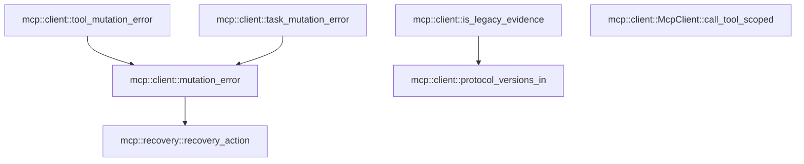

```mermaid
flowchart TD
  n0["mcp::client::McpClient::call_tool_augmented"]
  n1["mcp::client::McpClient::get_prompt"]
  n2["mcp::client::McpClient::read_resource"]
  n3["mcp::client::McpClient::task_operation"]
  n4["mcp::client::McpClient::task_operation_cancellable"]
  n5["mcp::client::McpClient::close"]
  n6["mcp::client::page"]
  n7["mcp::client::adopt_official_task_shape"]
  n8["mcp::client::value"]
  n9["mcp::client::to_json"]
  n10["mcp::client::decode"]
  n11["mcp::client::reject_duplicates"]
  n12["mcp::client::should_reconnect"]
  n13["mcp::client::McpClient::catalog_generation"]
  n14["mcp::client::McpClient::start_catalog_subscription"]
  n15["mcp::client::McpClient::list_tools"]
  n16["mcp::client::McpClient::list_prompts"]
  n17["mcp::client::McpClient::list_resources"]
  n18["mcp::client::McpClient::call_tool"]
  n19["mcp::client::McpClient::call_tool_with_context"]
  n20["mcp::recovery::recovery_action"]
  n21["schema::ijson::IJsonValue::parse"]
  n0 --> n7
  n0 --> n8
  n0 --> n9
  n1 --> n8
  n2 --> n8
  n3 --> n7
  n3 --> n8
  n3 --> n9
  n4 --> n7
  n4 --> n8
  n4 --> n9
  n6 --> n9
  n8 --> n21
  n12 --> n20
  n15 --> n6
  n15 --> n11
  n16 --> n6
  n16 --> n11
  n17 --> n6
  n17 --> n11
  n18 --> n8
  n19 --> n8
```

# mcp::client

[Package atlas](index.md) · [Source](../../src/client.rs)

## Declarations

Visibility is the declaration spelling; trait members and reexports require their enclosing interface. `cfg` is not evaluated.

| Symbol | Kind | Visibility | Test / cfg |
|---|---|---|---|
| [mcp::client::CANCELLATION_IO_TIMEOUT](../../src/client.rs#L18) | const_item | `private` |  |
| [mcp::client::McpPeerFuture](../../src/client.rs#L20) | type_item | `pub` |  |
| [mcp::client::McpPeer](../../src/client.rs#L22) | trait_item | `pub` |  |
| [mcp::client::McpPeer::server_name](../../src/client.rs#L23) | function_signature_item | `private` |  |
| [mcp::client::McpPeer::start_scoped_tool](../../src/client.rs#L27) | function_item | `private` |  |
| [mcp::client::McpPeer::protocol_version](../../src/client.rs#L37) | function_item | `private` |  |
| [mcp::client::McpPeer::server_identity](../../src/client.rs#L40) | function_item | `private` |  |
| [mcp::client::McpPeer::capabilities](../../src/client.rs#L43) | function_signature_item | `private` |  |
| [mcp::client::McpPeer::catalog_generation](../../src/client.rs#L44) | function_item | `private` |  |
| [mcp::client::McpPeer::start_catalog_subscription](../../src/client.rs#L47) | function_item | `private` |  |
| [mcp::client::McpPeer::list_tools](../../src/client.rs#L50) | function_signature_item | `private` |  |
| [mcp::client::McpPeer::list_prompts](../../src/client.rs#L51) | function_signature_item | `private` |  |
| [mcp::client::McpPeer::list_resources](../../src/client.rs#L52) | function_signature_item | `private` |  |
| [mcp::client::McpPeer::call_tool](../../src/client.rs#L53) | function_signature_item | `private` |  |
| [mcp::client::McpPeer::call_tool_with_context](../../src/client.rs#L59) | function_item | `private` |  |
| [mcp::client::McpPeer::call_tool_augmented](../../src/client.rs#L75) | function_item | `private` |  |
| [mcp::client::McpPeer::get_prompt](../../src/client.rs#L89) | function_signature_item | `private` |  |
| [mcp::client::McpPeer::read_resource](../../src/client.rs#L90) | function_signature_item | `private` |  |
| [mcp::client::McpPeer::task_operation](../../src/client.rs#L91) | function_signature_item | `private` |  |
| [mcp::client::McpPeer::task_operation_cancellable](../../src/client.rs#L93) | function_item | `private` |  |
| [mcp::client::McpPeer::close](../../src/client.rs#L121) | function_signature_item | `private` |  |
| [mcp::client::McpClient](../../src/client.rs#L124) | struct_item | `pub` |  |
| [mcp::client::McpClient::new](../../src/client.rs#L140) | function_item | `pub` |  |
| [mcp::client::McpClient::connect](../../src/client.rs#L157) | function_item | `pub` |  |
| [mcp::client::McpClient::connect_cancellable](../../src/client.rs#L165) | function_item | `pub` |  |
| [mcp::client::McpClient::connect_handshake](../../src/client.rs#L185) | function_item | `private` |  |
| [mcp::client::McpClient::close_transport](../../src/client.rs#L198) | function_item | `private` |  |
| [mcp::client::McpClient::reconnect_transport](../../src/client.rs#L206) | function_item | `private` |  |
| [mcp::client::McpClient::connect_once](../../src/client.rs#L212) | function_item | `private` |  |
| [mcp::client::McpClient::reset_generation](../../src/client.rs#L232) | function_item | `private` |  |
| [mcp::client::McpClient::reconnect_generation](../../src/client.rs#L246) | function_item | `private` |  |
| [mcp::client::McpClient::server](../../src/client.rs#L275) | function_item | `pub` |  |
| [mcp::client::McpClient::supported_versions](../../src/client.rs#L280) | function_item | `pub` |  |
| [mcp::client::McpClient::protocol_version](../../src/client.rs#L284) | function_item | `pub` |  |
| [mcp::client::McpClient::catalog_generation](../../src/client.rs#L289) | function_item | `pub` |  |
| [mcp::client::McpClient::connect_legacy](../../src/client.rs#L294) | function_item | `private` |  |
| [mcp::client::McpClient::connect_legacy::InitializeResult](../../src/client.rs#L297) | struct_item | `private` |  |
| [mcp::client::McpClient::connect_modern](../../src/client.rs#L330) | function_item | `private` |  |
| [mcp::client::McpClient::connect_modern::DiscoverResult](../../src/client.rs#L336) | struct_item | `private` |  |
| [mcp::client::McpClient::connect_modern::DiscoverMetadata](../../src/client.rs#L351) | struct_item | `private` |  |
| [mcp::client::McpClient::allocate_request_id](../../src/client.rs#L378) | function_item | `private` |  |
| [mcp::client::McpClient::call_raw_once](../../src/client.rs#L388) | function_item | `private` |  |
| [mcp::client::McpClient::call_read_raw](../../src/client.rs#L416) | function_item | `private` |  |
| [mcp::client::McpClient::call_raw_cancellable](../../src/client.rs#L430) | function_item | `private` |  |
| [mcp::client::McpClient::observe_notifications](../../src/client.rs#L485) | function_item | `private` |  |
| [mcp::client::McpClient::protocol_params](../../src/client.rs#L502) | function_item | `private` |  |
| [mcp::client::McpClient::call_typed](../../src/client.rs#L540) | function_item | `private` |  |
| [mcp::client::McpClient::paginated](../../src/client.rs#L553) | function_item | `private` |  |
| [mcp::client::McpClient::paginated_once](../../src/client.rs#L566) | function_item | `private` |  |
| [mcp::client::McpClient::continue_tool_call](../../src/client.rs#L612) | function_item | `pub` |  |
| [mcp::client::McpClient::complete_task_poll](../../src/client.rs#L669) | function_item | `private` |  |
| [mcp::client::McpClient::task_mutation_with_resumable_identity](../../src/client.rs#L704) | function_item | `pub` |  |
| [mcp::client::McpClient::start_scoped_tool](../../src/client.rs#L748) | function_item | `private` |  |
| [mcp::client::McpClient::server_name](../../src/client.rs#L826) | function_item | `private` |  |
| [mcp::client::McpClient::protocol_version](../../src/client.rs#L830) | function_item | `private` |  |
| [mcp::client::McpClient::server_identity](../../src/client.rs#L834) | function_item | `private` |  |
| [mcp::client::McpClient::capabilities](../../src/client.rs#L838) | function_item | `private` |  |
| [mcp::client::McpClient::catalog_generation](../../src/client.rs#L842) | function_item | `private` |  |
| [mcp::client::McpClient::start_catalog_subscription](../../src/client.rs#L847) | function_item | `private` |  |
| [mcp::client::McpClient::list_tools](../../src/client.rs#L880) | function_item | `private` |  |
| [mcp::client::McpClient::list_prompts](../../src/client.rs#L897) | function_item | `private` |  |
| [mcp::client::McpClient::list_resources](../../src/client.rs#L914) | function_item | `private` |  |
| [mcp::client::McpClient::call_tool](../../src/client.rs#L932) | function_item | `private` |  |
| [mcp::client::McpClient::call_tool_with_context](../../src/client.rs#L955) | function_item | `private` |  |
| [mcp::client::McpClient::call_tool_augmented](../../src/client.rs#L1001) | function_item | `private` |  |
| [mcp::client::McpClient::get_prompt](../../src/client.rs#L1058) | function_item | `private` |  |
| [mcp::client::McpClient::read_resource](../../src/client.rs#L1070) | function_item | `private` |  |
| [mcp::client::McpClient::task_operation](../../src/client.rs#L1085) | function_item | `private` |  |
| [mcp::client::McpClient::task_operation_cancellable](../../src/client.rs#L1117) | function_item | `private` |  |
| [mcp::client::McpClient::close](../../src/client.rs#L1157) | function_item | `private` |  |
| [mcp::client::Page](../../src/client.rs#L1162) | struct_item | `private` |  |
| [mcp::client::page](../../src/client.rs#L1167) | function_item | `private` |  |
| [mcp::client::adopt_official_task_shape](../../src/client.rs#L1222) | function_item | `private` |  |
| [mcp::client::value](../../src/client.rs#L1235) | function_item | `private` |  |
| [mcp::client::to_json](../../src/client.rs#L1242) | function_item | `private` |  |
| [mcp::client::decode](../../src/client.rs#L1251) | function_item | `private` |  |
| [mcp::client::reject_duplicates](../../src/client.rs#L1260) | function_item | `private` |  |
| [mcp::client::should_reconnect](../../src/client.rs#L1276) | function_item | `private` |  |
| [mcp::client::tool_mutation_error](../../src/client.rs#L1281) | function_item | `private` |  |
| [mcp::client::task_mutation_error](../../src/client.rs#L1285) | function_item | `private` |  |
| [mcp::client::mutation_error](../../src/client.rs#L1289) | function_item | `private` |  |
| [mcp::client::is_legacy_evidence](../../src/client.rs#L1300) | function_item | `private` |  |
| [mcp::client::protocol_versions_in](../../src/client.rs#L1336) | function_item | `private` |  |
| [mcp::client::McpClient::call_tool_scoped](../../src/client.rs#L1367) | function_item | `pub` |  |
| [mcp::client::legacy_evidence_tests::auto_fallback_requires_explicit_protocol_evidence](../../src/client.rs#L1385) | function_item | `private` | test; #[cfg(test)] |
| [mcp::client::legacy_evidence_tests::textual_protocol_version_rejection_is_legacy_evidence_when_it_lists_an_older_version](../../src/client.rs#L1413) | function_item | `private` | test; #[cfg(test)] |

## Imports / reexports

| Local name | Source path | Visibility |
|---|---|---|
| `BTreeSet` | `std::collections::BTreeSet` | `private` |
| `Future` | `std::future::Future` | `private` |
| `Pin` | `std::pin::Pin` | `private` |
| `Duration` | `std::time::Duration` | `private` |
| `IJsonValue` | `schema::IJsonValue` | `private` |
| `Deserialize` | `serde::Deserialize` | `private` |
| `DeserializeOwned` | `serde::de::DeserializeOwned` | `private` |
| `json` | `serde_json::json` | `private` |
| `JsonRpcRequest` | `crate::JsonRpcRequest` | `private` |
| `MAX_CATALOG_ITEMS` | `crate::MAX_CATALOG_ITEMS` | `private` |
| `MAX_CATALOG_PAGES` | `crate::MAX_CATALOG_PAGES` | `private` |
| `MAX_CONTINUATION_ROUNDS` | `crate::MAX_CONTINUATION_ROUNDS` | `private` |
| `McpCancellationToken` | `crate::McpCancellationToken` | `private` |
| `McpCapabilities` | `crate::McpCapabilities` | `private` |
| `McpError` | `crate::McpError` | `private` |
| `McpImplementation` | `crate::McpImplementation` | `private` |
| `McpLossState` | `crate::McpLossState` | `private` |
| `McpPrompt` | `crate::McpPrompt` | `private` |
| `McpResource` | `crate::McpResource` | `private` |
| `McpTool` | `crate::McpTool` | `private` |
| `McpToolCallContext` | `crate::McpToolCallContext` | `private` |
| `McpToolContinuation` | `crate::McpToolContinuation` | `private` |
| `McpTransport` | `crate::McpTransport` | `private` |
| `ProtocolMode` | `crate::ProtocolMode` | `private` |
| `RecoveryAction` | `crate::RecoveryAction` | `private` |
| `recovery_action` | `crate::recovery_action` | `private` |
| `*` | `super::*` | `private` |

## Module declarations

| Module | Visibility | Attributes |
|---|---|---|
| `mcp::client::legacy_evidence_tests` | `private` | #[cfg(test)] |

## Function call graphs

Edges below are syntactically resolved calls only, including private functions. Graphs partition callers into groups of 20; they are not execution order. All unresolved sites are listed below and in the JSON inventory.

Functions 1–20: 14 direct edges

Functions 21–40: 46 direct edges

Functions 41–60: 22 direct edges

Functions 61–66: 4 direct edges

## Call sites

Includes test functions (marked in declarations). Receiver-type-required sites need type analysis/manual tracing. Calls in closures are attributed to their enclosing function; their occurrence here does not mean the closure executes immediately.

| Caller | Callee expression | Source lines | Target / classification |
|---|---|---|---|
| `CANCELLATION_IO_TIMEOUT` | `Duration::from_millis` | [18](../../src/client.rs#L18) | external-constructor-callback-or-unresolved |
| `call_tool_with_context` | `Box::pin` | [66](../../src/client.rs#L66) | external-constructor-callback-or-unresolved |
| `call_tool_with_context` | `Err` | [67](../../src/client.rs#L67) | external-constructor-callback-or-unresolved |
| `call_tool_with_context` | `McpError::Unsupported` | [67](../../src/client.rs#L67) | external-constructor-callback-or-unresolved |
| `call_tool_with_context` | `"idempotency-reconcile tool calls".to_owned` | [68](../../src/client.rs#L68) | receiver-type-required |
| `call_tool_augmented` | `Box::pin` | [83](../../src/client.rs#L83) | external-constructor-callback-or-unresolved |
| `call_tool_augmented` | `Err` | [84](../../src/client.rs#L84) | external-constructor-callback-or-unresolved |
| `call_tool_augmented` | `McpError::Unsupported` | [84](../../src/client.rs#L84) | external-constructor-callback-or-unresolved |
| `call_tool_augmented` | `"task-augmented tool calls".to_owned` | [85](../../src/client.rs#L85) | receiver-type-required |
| `task_operation_cancellable` | `method.to_owned` | [99](../../src/client.rs#L99) | receiver-type-required |
| `task_operation_cancellable` | `Box::pin` | [100](../../src/client.rs#L100) | external-constructor-callback-or-unresolved |
| `task_operation_cancellable` | `cancellation.is_cancelled` | [101](../../src/client.rs#L101) | receiver-type-required |
| `task_operation_cancellable` | `Err` | [102](../../src/client.rs#L102), [112](../../src/client.rs#L112) | external-constructor-callback-or-unresolved |
| `task_operation_cancellable` | `self.close` | [111](../../src/client.rs#L111) | receiver-type-required |
| `new` | `server_name.into` | [142](../../src/client.rs#L142) | receiver-type-required |
| `new` | `std::sync::atomic::AtomicU64::new` | [146](../../src/client.rs#L146), [153](../../src/client.rs#L153) | external-constructor-callback-or-unresolved |
| `new` | `McpCapabilities::default` | [147](../../src/client.rs#L147) | external-constructor-callback-or-unresolved |
| `new` | `String::new` | [149](../../src/client.rs#L149) | external-constructor-callback-or-unresolved |
| `new` | `Vec::new` | [150](../../src/client.rs#L150) | external-constructor-callback-or-unresolved |
| `new` | `std::sync::Arc::new` | [153](../../src/client.rs#L153) | external-constructor-callback-or-unresolved |
| `connect` | `self.connect_cancellable` | [158](../../src/client.rs#L158) | [mcp::client::McpClient::connect_cancellable](../../src/client.rs#L165) |
| `connect` | `McpCancellationToken::default` | [158](../../src/client.rs#L158) | external-constructor-callback-or-unresolved |
| `connect_cancellable` | `cancellation.is_cancelled` | [170](../../src/client.rs#L170) | receiver-type-required |
| `connect_cancellable` | `Err` | [171](../../src/client.rs#L171) | external-constructor-callback-or-unresolved |
| `connect_cancellable` | `result.is_err` | [179](../../src/client.rs#L179) | receiver-type-required |
| `connect_cancellable` | `self.close_transport` | [180](../../src/client.rs#L180) | [mcp::client::McpClient::close_transport](../../src/client.rs#L198) |
| `connect_handshake` | `Some` | [186](../../src/client.rs#L186) | external-constructor-callback-or-unresolved |
| `connect_handshake` | `self.connect_once` | [187](../../src/client.rs#L187), [191](../../src/client.rs#L191) | [mcp::client::McpClient::connect_once](../../src/client.rs#L212) |
| `connect_handshake` | `should_reconnect` | [188](../../src/client.rs#L188) | [mcp::client::should_reconnect](../../src/client.rs#L1276) |
| `connect_handshake` | `self.reset_generation` | [189](../../src/client.rs#L189) | [mcp::client::McpClient::reset_generation](../../src/client.rs#L232) |
| `connect_handshake` | `self.reconnect_transport` | [190](../../src/client.rs#L190) | [mcp::client::McpClient::reconnect_transport](../../src/client.rs#L206) |
| `connect_handshake` | `Err` | [192](../../src/client.rs#L192) | external-constructor-callback-or-unresolved |
| `close_transport` | `Box::pin` | [200](../../src/client.rs#L200) | external-constructor-callback-or-unresolved |
| `close_transport` | `Ok` | [200](../../src/client.rs#L200) | external-constructor-callback-or-unresolved |
| `close_transport` | `self.transport.close` | [203](../../src/client.rs#L203) | receiver-type-required |
| `reconnect_transport` | `self.transport.reconnect` | [209](../../src/client.rs#L209) | receiver-type-required |
| `connect_once` | `self.connect_modern` | [214](../../src/client.rs#L214), [217](../../src/client.rs#L217) | [mcp::client::McpClient::connect_modern](../../src/client.rs#L330) |
| `connect_once` | `self.connect_legacy` | [215](../../src/client.rs#L215), [221](../../src/client.rs#L221), [228](../../src/client.rs#L228) | [mcp::client::McpClient::connect_legacy](../../src/client.rs#L294) |
| `connect_once` | `self.transport.supports_http_discovery` | [216](../../src/client.rs#L216) | receiver-type-required |
| `connect_once` | `result.as_ref().err().is_some_and` | [218](../../src/client.rs#L218) | receiver-type-required |
| `connect_once` | `result.as_ref().err` | [218](../../src/client.rs#L218) | receiver-type-required |
| `connect_once` | `result.as_ref` | [218](../../src/client.rs#L218) | receiver-type-required |
| `connect_once` | `self.reset_generation` | [219](../../src/client.rs#L219) | [mcp::client::McpClient::reset_generation](../../src/client.rs#L232) |
| `connect_once` | `self.reconnect_transport` | [220](../../src/client.rs#L220) | [mcp::client::McpClient::reconnect_transport](../../src/client.rs#L206) |
| `reset_generation` | `self.next_id.store` | [233](../../src/client.rs#L233) | receiver-type-required |
| `reset_generation` | `McpCapabilities::default` | [234](../../src/client.rs#L234) | external-constructor-callback-or-unresolved |
| `reset_generation` | `self.protocol_version.clear` | [236](../../src/client.rs#L236) | receiver-type-required |
| `reset_generation` | `self.supported_versions.clear` | [237](../../src/client.rs#L237) | receiver-type-required |
| `reset_generation` | `self.catalog_generation.fetch_update` | [239](../../src/client.rs#L239) | receiver-type-required |
| `reset_generation` | `Some` | [242](../../src/client.rs#L242) | external-constructor-callback-or-unresolved |
| `reset_generation` | `v.saturating_add` | [242](../../src/client.rs#L242) | receiver-type-required |
| `reconnect_generation` | `self             .mode             .ok_or_else` | [247](../../src/client.rs#L247) | receiver-type-required |
| `reconnect_generation` | `McpError::Protocol` | [249](../../src/client.rs#L249), [252](../../src/client.rs#L252) | external-constructor-callback-or-unresolved |
| `reconnect_generation` | `"MCP peer was never connected".to_owned` | [249](../../src/client.rs#L249) | receiver-type-required |
| `reconnect_generation` | `self.protocol_version.clone` | [250](../../src/client.rs#L250) | receiver-type-required |
| `reconnect_generation` | `self.server.clone().ok_or_else` | [251](../../src/client.rs#L251) | receiver-type-required |
| `reconnect_generation` | `self.server.clone` | [251](../../src/client.rs#L251) | receiver-type-required |
| `reconnect_generation` | `"MCP peer has no negotiated server identity".to_owned` | [252](../../src/client.rs#L252) | receiver-type-required |
| `reconnect_generation` | `self.reconnect_transport` | [255](../../src/client.rs#L255) | [mcp::client::McpClient::reconnect_transport](../../src/client.rs#L206) |
| `reconnect_generation` | `self.reset_generation` | [256](../../src/client.rs#L256) | [mcp::client::McpClient::reset_generation](../../src/client.rs#L232) |
| `reconnect_generation` | `self.connect_once` | [257](../../src/client.rs#L257) | [mcp::client::McpClient::connect_once](../../src/client.rs#L212) |
| `reconnect_generation` | `self.close_transport` | [261](../../src/client.rs#L261), [267](../../src/client.rs#L267) | [mcp::client::McpClient::close_transport](../../src/client.rs#L198) |
| `reconnect_generation` | `Err` | [262](../../src/client.rs#L262), [268](../../src/client.rs#L268) | external-constructor-callback-or-unresolved |
| `reconnect_generation` | `self.server.as_ref` | [265](../../src/client.rs#L265) | receiver-type-required |
| `reconnect_generation` | `Some` | [265](../../src/client.rs#L265) | external-constructor-callback-or-unresolved |
| `reconnect_generation` | `McpError::Conflict` | [268](../../src/client.rs#L268) | external-constructor-callback-or-unresolved |
| `reconnect_generation` | `"MCP negotiated authority changed during reconnect".to_owned` | [269](../../src/client.rs#L269) | receiver-type-required |
| `reconnect_generation` | `Ok` | [272](../../src/client.rs#L272) | external-constructor-callback-or-unresolved |
| `server` | `self.server.as_ref` | [276](../../src/client.rs#L276) | receiver-type-required |
| `catalog_generation` | `self.catalog_generation             .load` | [290](../../src/client.rs#L290) | receiver-type-required |
| `connect_legacy` | `value` | [307](../../src/client.rs#L307) | [mcp::client::value](../../src/client.rs#L1235) |
| `connect_legacy` | `self             .call_typed` | [312](../../src/client.rs#L312) | [mcp::client::McpClient::call_typed](../../src/client.rs#L540) |
| `connect_legacy` | `Some` | [313](../../src/client.rs#L313), [321](../../src/client.rs#L321) | external-constructor-callback-or-unresolved |
| `connect_legacy` | `Duration::from_secs` | [313](../../src/client.rs#L313) | external-constructor-callback-or-unresolved |
| `connect_legacy` | `Err` | [316](../../src/client.rs#L316) | external-constructor-callback-or-unresolved |
| `connect_legacy` | `McpError::Unsupported` | [316](../../src/client.rs#L316) | external-constructor-callback-or-unresolved |
| `connect_legacy` | `self.transport             .notify` | [322](../../src/client.rs#L322) | receiver-type-required |
| `connect_legacy` | `JsonRpcRequest::notification` | [323](../../src/client.rs#L323) | [mcp::types::JsonRpcRequest::notification](../../src/types.rs#L66) |
| `connect_modern` | `crate::MODERN_PROTOCOL_VERSION.to_owned` | [334](../../src/client.rs#L334), [370](../../src/client.rs#L370) | receiver-type-required |
| `connect_modern` | `self             .call_typed` | [355](../../src/client.rs#L355) | [mcp::client::McpClient::call_typed](../../src/client.rs#L540) |
| `connect_modern` | `Duration::from_secs` | [356](../../src/client.rs#L356) | external-constructor-callback-or-unresolved |
| `connect_modern` | `Err` | [359](../../src/client.rs#L359), [368](../../src/client.rs#L368) | external-constructor-callback-or-unresolved |
| `connect_modern` | `McpError::Protocol` | [359](../../src/client.rs#L359) | external-constructor-callback-or-unresolved |
| `connect_modern` | `"modern discovery did not return a complete result".to_owned` | [360](../../src/client.rs#L360) | receiver-type-required |
| `connect_modern` | `result             .supported_versions             .iter()             .any` | [363](../../src/client.rs#L363) | receiver-type-required |
| `connect_modern` | `result             .supported_versions             .iter` | [363](../../src/client.rs#L363) | receiver-type-required |
| `connect_modern` | `McpError::NoMutualProtocol` | [368](../../src/client.rs#L368) | external-constructor-callback-or-unresolved |
| `connect_modern` | `Some` | [373](../../src/client.rs#L373) | external-constructor-callback-or-unresolved |
| `connect_modern` | `Ok` | [375](../../src/client.rs#L375) | external-constructor-callback-or-unresolved |
| `allocate_request_id` | `self.next_id             .fetch_update(                 std::sync::atomic::Ordering::Relaxed,                 std::sync::atomic::Ordering::Relaxed,                 &#124;id&#124; id.checked_add(1),             )             .map_err` | [379](../../src/client.rs#L379) | receiver-type-required |
| `allocate_request_id` | `self.next_id             .fetch_update` | [379](../../src/client.rs#L379) | receiver-type-required |
| `allocate_request_id` | `id.checked_add` | [383](../../src/client.rs#L383) | receiver-type-required |
| `allocate_request_id` | `McpError::Protocol` | [385](../../src/client.rs#L385) | external-constructor-callback-or-unresolved |
| `allocate_request_id` | `"request id exhausted".to_owned` | [385](../../src/client.rs#L385) | receiver-type-required |
| `call_raw_once` | `self.allocate_request_id` | [394](../../src/client.rs#L394) | [mcp::client::McpClient::allocate_request_id](../../src/client.rs#L378) |
| `call_raw_once` | `self.protocol_params` | [395](../../src/client.rs#L395) | [mcp::client::McpClient::protocol_params](../../src/client.rs#L502) |
| `call_raw_once` | `self             .transport             .request` | [396](../../src/client.rs#L396) | receiver-type-required |
| `call_raw_once` | `JsonRpcRequest::call` | [398](../../src/client.rs#L398) | [mcp::types::JsonRpcRequest::call](../../src/types.rs#L57) |
| `call_raw_once` | `self.observe_notifications` | [400](../../src/client.rs#L400) | [mcp::client::McpClient::observe_notifications](../../src/client.rs#L485) |
| `call_raw_once` | `self.close_transport` | [404](../../src/client.rs#L404), [411](../../src/client.rs#L411) | [mcp::client::McpClient::close_transport](../../src/client.rs#L198) |
| `call_raw_once` | `Err` | [405](../../src/client.rs#L405), [407](../../src/client.rs#L407) | external-constructor-callback-or-unresolved |
| `call_raw_once` | `response.into_result` | [409](../../src/client.rs#L409) | receiver-type-required |
| `call_read_raw` | `self.call_raw_once` | [422](../../src/client.rs#L422), [427](../../src/client.rs#L427) | [mcp::client::McpClient::call_raw_once](../../src/client.rs#L388) |
| `call_read_raw` | `params.clone` | [422](../../src/client.rs#L422) | receiver-type-required |
| `call_read_raw` | `should_reconnect` | [423](../../src/client.rs#L423) | [mcp::client::should_reconnect](../../src/client.rs#L1276) |
| `call_read_raw` | `self.reconnect_generation` | [426](../../src/client.rs#L426) | [mcp::client::McpClient::reconnect_generation](../../src/client.rs#L246) |
| `call_raw_cancellable` | `cancellation.is_cancelled` | [437](../../src/client.rs#L437) | receiver-type-required |
| `call_raw_cancellable` | `Err` | [438](../../src/client.rs#L438), [457](../../src/client.rs#L457), [459](../../src/client.rs#L459), [482](../../src/client.rs#L482) | external-constructor-callback-or-unresolved |
| `call_raw_cancellable` | `self.allocate_request_id` | [440](../../src/client.rs#L440) | [mcp::client::McpClient::allocate_request_id](../../src/client.rs#L378) |
| `call_raw_cancellable` | `self.protocol_params` | [441](../../src/client.rs#L441) | [mcp::client::McpClient::protocol_params](../../src/client.rs#L502) |
| `call_raw_cancellable` | `JsonRpcRequest::call` | [442](../../src/client.rs#L442) | [mcp::types::JsonRpcRequest::call](../../src/types.rs#L57) |
| `call_raw_cancellable` | `self.transport.request` | [444](../../src/client.rs#L444) | receiver-type-required |
| `call_raw_cancellable` | `self.observe_notifications` | [452](../../src/client.rs#L452) | [mcp::client::McpClient::observe_notifications](../../src/client.rs#L485) |
| `call_raw_cancellable` | `self.close_transport` | [456](../../src/client.rs#L456), [463](../../src/client.rs#L463), [481](../../src/client.rs#L481) | [mcp::client::McpClient::close_transport](../../src/client.rs#L198) |
| `call_raw_cancellable` | `response.into_result` | [461](../../src/client.rs#L461) | receiver-type-required |
| `call_raw_cancellable` | `self.transport.mark_cancelled` | [467](../../src/client.rs#L467) | receiver-type-required |
| `call_raw_cancellable` | `JsonRpcRequest::notification` | [468](../../src/client.rs#L468) | [mcp::types::JsonRpcRequest::notification](../../src/types.rs#L66) |
| `call_raw_cancellable` | `Some` | [470](../../src/client.rs#L470) | external-constructor-callback-or-unresolved |
| `call_raw_cancellable` | `value` | [470](../../src/client.rs#L470) | [mcp::client::value](../../src/client.rs#L1235) |
| `call_raw_cancellable` | `tokio::time::timeout` | [472](../../src/client.rs#L472), [481](../../src/client.rs#L481) | external-constructor-callback-or-unresolved |
| `call_raw_cancellable` | `self.transport.notify` | [474](../../src/client.rs#L474) | receiver-type-required |
| `observe_notifications` | `self.transport.take_notifications` | [486](../../src/client.rs#L486) | receiver-type-required |
| `observe_notifications` | `self.catalog_generation.fetch_update` | [493](../../src/client.rs#L493) | receiver-type-required |
| `observe_notifications` | `Some` | [496](../../src/client.rs#L496) | external-constructor-callback-or-unresolved |
| `observe_notifications` | `v.saturating_add` | [496](../../src/client.rs#L496) | receiver-type-required |
| `protocol_params` | `Ok` | [504](../../src/client.rs#L504), [507](../../src/client.rs#L507), [537](../../src/client.rs#L537) | external-constructor-callback-or-unresolved |
| `protocol_params` | `params.map_or_else` | [506](../../src/client.rs#L506) | receiver-type-required |
| `protocol_params` | `serde_json::Value::Object` | [507](../../src/client.rs#L507), [521](../../src/client.rs#L521) | external-constructor-callback-or-unresolved |
| `protocol_params` | `serde_json::Map::new` | [507](../../src/client.rs#L507), [521](../../src/client.rs#L521) | external-constructor-callback-or-unresolved |
| `protocol_params` | `value                     .canonical_bytes()                     .map_err` | [509](../../src/client.rs#L509) | receiver-type-required |
| `protocol_params` | `value                     .canonical_bytes` | [509](../../src/client.rs#L509) | receiver-type-required |
| `protocol_params` | `McpError::Protocol` | [511](../../src/client.rs#L511), [513](../../src/client.rs#L513), [517](../../src/client.rs#L517), [523](../../src/client.rs#L523), [525](../../src/client.rs#L525) | external-constructor-callback-or-unresolved |
| `protocol_params` | `error.to_string` | [511](../../src/client.rs#L511), [513](../../src/client.rs#L513) | receiver-type-required |
| `protocol_params` | `serde_json::from_slice::<serde_json::Value>(&bytes)                     .map_err` | [512](../../src/client.rs#L512) | receiver-type-required |
| `protocol_params` | `serde_json::from_slice::<serde_json::Value>` | [512](../../src/client.rs#L512) | external-constructor-callback-or-unresolved |
| `protocol_params` | `json_value.as_object_mut().ok_or_else` | [516](../../src/client.rs#L516) | receiver-type-required |
| `protocol_params` | `json_value.as_object_mut` | [516](../../src/client.rs#L516) | receiver-type-required |
| `protocol_params` | `"modern request params must be an object".to_owned` | [517](../../src/client.rs#L517) | receiver-type-required |
| `protocol_params` | `object             .entry("_meta".to_owned())             .or_insert_with(&#124;&#124; serde_json::Value::Object(serde_json::Map::new()))             .as_object_mut()             .ok_or_else` | [519](../../src/client.rs#L519) | receiver-type-required |
| `protocol_params` | `object             .entry("_meta".to_owned())             .or_insert_with(&#124;&#124; serde_json::Value::Object(serde_json::Map::new()))             .as_object_mut` | [519](../../src/client.rs#L519) | receiver-type-required |
| `protocol_params` | `object             .entry("_meta".to_owned())             .or_insert_with` | [519](../../src/client.rs#L519) | receiver-type-required |
| `protocol_params` | `object             .entry` | [519](../../src/client.rs#L519) | receiver-type-required |
| `protocol_params` | `"_meta".to_owned` | [520](../../src/client.rs#L520) | receiver-type-required |
| `protocol_params` | `"request _meta must be an object".to_owned` | [523](../../src/client.rs#L523) | receiver-type-required |
| `protocol_params` | `metadata.contains_key` | [524](../../src/client.rs#L524) | receiver-type-required |
| `protocol_params` | `Err` | [525](../../src/client.rs#L525) | external-constructor-callback-or-unresolved |
| `protocol_params` | `"caller params must not override protocol metadata".to_owned` | [526](../../src/client.rs#L526) | receiver-type-required |
| `protocol_params` | `metadata.insert` | [529](../../src/client.rs#L529), [533](../../src/client.rs#L533) | receiver-type-required |
| `protocol_params` | `"io.modelcontextprotocol/protocolVersion".to_owned` | [530](../../src/client.rs#L530) | receiver-type-required |
| `protocol_params` | `"io.modelcontextprotocol/clientCapabilities".to_owned` | [534](../../src/client.rs#L534) | receiver-type-required |
| `protocol_params` | `Some` | [537](../../src/client.rs#L537) | external-constructor-callback-or-unresolved |
| `protocol_params` | `value` | [537](../../src/client.rs#L537) | [mcp::client::value](../../src/client.rs#L1235) |
| `call_typed` | `decode` | [546](../../src/client.rs#L546) | [mcp::client::decode](../../src/client.rs#L1251) |
| `call_typed` | `self.call_raw_once` | [546](../../src/client.rs#L546) | [mcp::client::McpClient::call_raw_once](../../src/client.rs#L388) |
| `call_typed` | `self.close_transport` | [548](../../src/client.rs#L548) | [mcp::client::McpClient::close_transport](../../src/client.rs#L198) |
| `paginated` | `self.paginated_once` | [558](../../src/client.rs#L558), [563](../../src/client.rs#L563) | [mcp::client::McpClient::paginated_once](../../src/client.rs#L566) |
| `paginated` | `extract.clone` | [558](../../src/client.rs#L558) | receiver-type-required |
| `paginated` | `should_reconnect` | [559](../../src/client.rs#L559) | [mcp::client::should_reconnect](../../src/client.rs#L1276) |
| `paginated` | `self.reconnect_generation` | [562](../../src/client.rs#L562) | [mcp::client::McpClient::reconnect_generation](../../src/client.rs#L246) |
| `paginated_once` | `Vec::new` | [575](../../src/client.rs#L575) | external-constructor-callback-or-unresolved |
| `paginated_once` | `BTreeSet::new` | [577](../../src/client.rs#L577) | external-constructor-callback-or-unresolved |
| `paginated_once` | `cursor                 .as_ref()                 .map(&#124;cursor&#124; value(json!({"cursor":cursor})))                 .transpose` | [579](../../src/client.rs#L579) | receiver-type-required |
| `paginated_once` | `cursor                 .as_ref()                 .map` | [579](../../src/client.rs#L579) | receiver-type-required |
| `paginated_once` | `cursor                 .as_ref` | [579](../../src/client.rs#L579) | receiver-type-required |
| `paginated_once` | `value` | [581](../../src/client.rs#L581) | [mcp::client::value](../../src/client.rs#L1235) |
| `paginated_once` | `extract` | [583](../../src/client.rs#L583) | external-constructor-callback-or-unresolved |
| `paginated_once` | `self.call_raw_once` | [584](../../src/client.rs#L584) | [mcp::client::McpClient::call_raw_once](../../src/client.rs#L388) |
| `paginated_once` | `Duration::from_secs` | [584](../../src/client.rs#L584) | external-constructor-callback-or-unresolved |
| `paginated_once` | `self.close_transport` | [590](../../src/client.rs#L590) | [mcp::client::McpClient::close_transport](../../src/client.rs#L198) |
| `paginated_once` | `Err` | [591](../../src/client.rs#L591), [593](../../src/client.rs#L593), [597](../../src/client.rs#L597), [603](../../src/client.rs#L603), [609](../../src/client.rs#L609) | external-constructor-callback-or-unresolved |
| `paginated_once` | `output.extend` | [595](../../src/client.rs#L595) | receiver-type-required |
| `paginated_once` | `output.len` | [596](../../src/client.rs#L596) | receiver-type-required |
| `paginated_once` | `Ok` | [600](../../src/client.rs#L600) | external-constructor-callback-or-unresolved |
| `paginated_once` | `next.is_empty` | [602](../../src/client.rs#L602) | receiver-type-required |
| `paginated_once` | `seen.insert` | [602](../../src/client.rs#L602) | receiver-type-required |
| `paginated_once` | `next.clone` | [602](../../src/client.rs#L602) | receiver-type-required |
| `paginated_once` | `McpError::Protocol` | [603](../../src/client.rs#L603) | external-constructor-callback-or-unresolved |
| `paginated_once` | `"catalog cursor is empty or repeated".to_owned` | [604](../../src/client.rs#L604) | receiver-type-required |
| `paginated_once` | `Some` | [607](../../src/client.rs#L607) | external-constructor-callback-or-unresolved |
| `continue_tool_call` | `Err` | [620](../../src/client.rs#L620), [623](../../src/client.rs#L623), [629](../../src/client.rs#L629), [632](../../src/client.rs#L632) | external-constructor-callback-or-unresolved |
| `continue_tool_call` | `McpError::Unsupported` | [620](../../src/client.rs#L620), [629](../../src/client.rs#L629) | external-constructor-callback-or-unresolved |
| `continue_tool_call` | `"tools".to_owned` | [620](../../src/client.rs#L620) | receiver-type-required |
| `continue_tool_call` | `McpError::Protocol` | [623](../../src/client.rs#L623), [632](../../src/client.rs#L632) | external-constructor-callback-or-unresolved |
| `continue_tool_call` | `"MCP continuation round must be within 1...32".to_owned` | [624](../../src/client.rs#L624) | receiver-type-required |
| `continue_tool_call` | `self.capabilities.supports_tasks` | [628](../../src/client.rs#L628) | receiver-type-required |
| `continue_tool_call` | `"tasks/get".to_owned` | [629](../../src/client.rs#L629) | receiver-type-required |
| `continue_tool_call` | `task_id.is_empty` | [631](../../src/client.rs#L631) | receiver-type-required |
| `continue_tool_call` | `"empty continuation task identity".to_owned` | [633](../../src/client.rs#L633) | receiver-type-required |
| `continue_tool_call` | `self                 .call_raw_cancellable` | [636](../../src/client.rs#L636) | [mcp::client::McpClient::call_raw_cancellable](../../src/client.rs#L430) |
| `continue_tool_call` | `Some` | [639](../../src/client.rs#L639), [644](../../src/client.rs#L644), [656](../../src/client.rs#L656) | external-constructor-callback-or-unresolved |
| `continue_tool_call` | `value` | [639](../../src/client.rs#L639), [648](../../src/client.rs#L648) | [mcp::client::value](../../src/client.rs#L1235) |
| `continue_tool_call` | `Duration::from_secs` | [640](../../src/client.rs#L640), [657](../../src/client.rs#L657) | external-constructor-callback-or-unresolved |
| `continue_tool_call` | `self.complete_task_poll` | [644](../../src/client.rs#L644) | [mcp::client::McpClient::complete_task_poll](../../src/client.rs#L669) |
| `continue_tool_call` | `crate::McpTask::validate_result` | [645](../../src/client.rs#L645) | [mcp::types::McpTask::validate_result](../../src/types.rs#L556) |
| `continue_tool_call` | `Ok` | [646](../../src/client.rs#L646) | external-constructor-callback-or-unresolved |
| `continue_tool_call` | `self.call_raw_cancellable(             "tools/call",             Some(params),             Duration::from_secs(600),             &cancellation,         )         .await         .map_err` | [654](../../src/client.rs#L654) | receiver-type-required |
| `continue_tool_call` | `self.call_raw_cancellable` | [654](../../src/client.rs#L654) | [mcp::client::McpClient::call_raw_cancellable](../../src/client.rs#L430) |
| `complete_task_poll` | `to_json` | [674](../../src/client.rs#L674), [699](../../src/client.rs#L699) | [mcp::client::to_json](../../src/client.rs#L1242) |
| `complete_task_poll` | `adopt_official_task_shape` | [675](../../src/client.rs#L675) | [mcp::client::adopt_official_task_shape](../../src/client.rs#L1222) |
| `complete_task_poll` | `task["result"].is_object` | [676](../../src/client.rs#L676) | receiver-type-required |
| `complete_task_poll` | `task["taskId"]                 .as_str()                 .filter(&#124;id&#124; !id.is_empty())                 .ok_or_else(&#124;&#124; McpError::Protocol("completed MCP task lacks taskId".to_owned()))?                 .to_owned` | [678](../../src/client.rs#L678) | receiver-type-required |
| `complete_task_poll` | `task["taskId"]                 .as_str()                 .filter(&#124;id&#124; !id.is_empty())                 .ok_or_else` | [678](../../src/client.rs#L678) | receiver-type-required |
| `complete_task_poll` | `task["taskId"]                 .as_str()                 .filter` | [678](../../src/client.rs#L678) | receiver-type-required |
| `complete_task_poll` | `task["taskId"]                 .as_str` | [678](../../src/client.rs#L678) | receiver-type-required |
| `complete_task_poll` | `id.is_empty` | [680](../../src/client.rs#L680) | receiver-type-required |
| `complete_task_poll` | `McpError::Protocol` | [681](../../src/client.rs#L681) | external-constructor-callback-or-unresolved |
| `complete_task_poll` | `"completed MCP task lacks taskId".to_owned` | [681](../../src/client.rs#L681) | receiver-type-required |
| `complete_task_poll` | `Some` | [683](../../src/client.rs#L683) | external-constructor-callback-or-unresolved |
| `complete_task_poll` | `value` | [683](../../src/client.rs#L683), [701](../../src/client.rs#L701) | [mcp::client::value](../../src/client.rs#L1235) |
| `complete_task_poll` | `self.call_raw_cancellable` | [686](../../src/client.rs#L686) | [mcp::client::McpClient::call_raw_cancellable](../../src/client.rs#L430) |
| `complete_task_poll` | `Duration::from_secs` | [689](../../src/client.rs#L689), [695](../../src/client.rs#L695) | external-constructor-callback-or-unresolved |
| `complete_task_poll` | `self.call_read_raw` | [695](../../src/client.rs#L695) | [mcp::client::McpClient::call_read_raw](../../src/client.rs#L416) |
| `task_mutation_with_resumable_identity` | `self.capabilities.supports_tasks` | [710](../../src/client.rs#L710) | receiver-type-required |
| `task_mutation_with_resumable_identity` | `Err` | [712](../../src/client.rs#L712), [715](../../src/client.rs#L715), [728](../../src/client.rs#L728), [731](../../src/client.rs#L731), [742](../../src/client.rs#L742) | external-constructor-callback-or-unresolved |
| `task_mutation_with_resumable_identity` | `McpError::Unsupported` | [712](../../src/client.rs#L712) | external-constructor-callback-or-unresolved |
| `task_mutation_with_resumable_identity` | `method.to_owned` | [712](../../src/client.rs#L712) | receiver-type-required |
| `task_mutation_with_resumable_identity` | `resumable_task_id.is_empty` | [714](../../src/client.rs#L714) | receiver-type-required |
| `task_mutation_with_resumable_identity` | `McpError::Protocol` | [715](../../src/client.rs#L715) | external-constructor-callback-or-unresolved |
| `task_mutation_with_resumable_identity` | `"resumable task identity is empty".to_owned` | [716](../../src/client.rs#L716) | receiver-type-required |
| `task_mutation_with_resumable_identity` | `self             .call_raw_once` | [719](../../src/client.rs#L719) | [mcp::client::McpClient::call_raw_once](../../src/client.rs#L388) |
| `task_mutation_with_resumable_identity` | `Some` | [720](../../src/client.rs#L720), [736](../../src/client.rs#L736) | external-constructor-callback-or-unresolved |
| `task_mutation_with_resumable_identity` | `Duration::from_secs` | [720](../../src/client.rs#L720), [737](../../src/client.rs#L737) | external-constructor-callback-or-unresolved |
| `task_mutation_with_resumable_identity` | `Ok` | [723](../../src/client.rs#L723) | external-constructor-callback-or-unresolved |
| `task_mutation_with_resumable_identity` | `recovery_action` | [725](../../src/client.rs#L725) | [mcp::recovery::recovery_action](../../src/recovery.rs#L23) |
| `task_mutation_with_resumable_identity` | `self.reconnect_generation().await.is_err` | [730](../../src/client.rs#L730) | receiver-type-required |
| `task_mutation_with_resumable_identity` | `self.reconnect_generation` | [730](../../src/client.rs#L730) | [mcp::client::McpClient::reconnect_generation](../../src/client.rs#L246) |
| `task_mutation_with_resumable_identity` | `self                     .call_raw_once` | [733](../../src/client.rs#L733) | [mcp::client::McpClient::call_raw_once](../../src/client.rs#L388) |
| `task_mutation_with_resumable_identity` | `value` | [736](../../src/client.rs#L736) | [mcp::client::value](../../src/client.rs#L1235) |
| `task_mutation_with_resumable_identity` | `self.complete_task_poll` | [740](../../src/client.rs#L740) | [mcp::client::McpClient::complete_task_poll](../../src/client.rs#L669) |
| `start_scoped_tool` | `self.transport.supports_http_discovery` | [755](../../src/client.rs#L755) | receiver-type-required |
| `start_scoped_tool` | `(&#124;&#124; {             if self.transport_closed {                 return Err(McpError::Transport("MCP peer is closed".into()));             }             if !self.capabilities.tools {                 return Err(McpError::Unsupported("tools".into()));             }             if cancellation.is_cancelled() {                 return Err(McpError::Cancelled);             }             let mut params = json!({"name":name,"arguments":serde_json::to_value(arguments).map_err(&#124;e&#124; McpError::Protocol(e.to_string()))?});             if let Some(context) = context {                 if context.idempotency_key.len() != 64                     &#124;&#124; !context                         .idempotency_key                         .bytes()                         .all(&#124;byte&#124; byte.is_ascii_digit() &#124;&#124; (b'a'..=b'f').contains(&byte))                 {                     return Err(McpError::Protocol(                         "external-effect idempotency key must be 64 lowercase hexadecimal bytes"                             .into(),                     ));                 }                 params["_meta"] = json!({"io.tekes/idempotencyKey":context.idempotency_key});             }             Ok((                 self.allocate_request_id()?,                 self.protocol_params(Some(value(params)?))?,             ))         })` | [758](../../src/client.rs#L758) | external-constructor-callback-or-unresolved |
| `start_scoped_tool` | `Err` | [760](../../src/client.rs#L760), [763](../../src/client.rs#L763), [766](../../src/client.rs#L766), [776](../../src/client.rs#L776), [790](../../src/client.rs#L790) | external-constructor-callback-or-unresolved |
| `start_scoped_tool` | `McpError::Transport` | [760](../../src/client.rs#L760) | external-constructor-callback-or-unresolved |
| `start_scoped_tool` | `"MCP peer is closed".into` | [760](../../src/client.rs#L760) | receiver-type-required |
| `start_scoped_tool` | `McpError::Unsupported` | [763](../../src/client.rs#L763) | external-constructor-callback-or-unresolved |
| `start_scoped_tool` | `"tools".into` | [763](../../src/client.rs#L763) | receiver-type-required |
| `start_scoped_tool` | `cancellation.is_cancelled` | [765](../../src/client.rs#L765) | receiver-type-required |
| `start_scoped_tool` | `context.idempotency_key.len` | [770](../../src/client.rs#L770) | receiver-type-required |
| `start_scoped_tool` | `context                         .idempotency_key                         .bytes()                         .all` | [771](../../src/client.rs#L771) | receiver-type-required |
| `start_scoped_tool` | `context                         .idempotency_key                         .bytes` | [771](../../src/client.rs#L771) | receiver-type-required |
| `start_scoped_tool` | `byte.is_ascii_digit` | [774](../../src/client.rs#L774) | receiver-type-required |
| `start_scoped_tool` | `(b'a'..=b'f').contains` | [774](../../src/client.rs#L774) | receiver-type-required |
| `start_scoped_tool` | `McpError::Protocol` | [776](../../src/client.rs#L776) | external-constructor-callback-or-unresolved |
| `start_scoped_tool` | `"external-effect idempotency key must be 64 lowercase hexadecimal bytes"                             .into` | [777](../../src/client.rs#L777) | receiver-type-required |
| `start_scoped_tool` | `Ok` | [783](../../src/client.rs#L783) | external-constructor-callback-or-unresolved |
| `start_scoped_tool` | `self.allocate_request_id` | [784](../../src/client.rs#L784) | receiver-type-required |
| `start_scoped_tool` | `self.protocol_params` | [785](../../src/client.rs#L785) | receiver-type-required |
| `start_scoped_tool` | `Some` | [785](../../src/client.rs#L785), [790](../../src/client.rs#L790), [803](../../src/client.rs#L803), [811](../../src/client.rs#L811), [813](../../src/client.rs#L813) | external-constructor-callback-or-unresolved |
| `start_scoped_tool` | `value` | [785](../../src/client.rs#L785) | [mcp::client::value](../../src/client.rs#L1235) |
| `start_scoped_tool` | `Box::pin` | [790](../../src/client.rs#L790), [813](../../src/client.rs#L813) | external-constructor-callback-or-unresolved |
| `start_scoped_tool` | `self.catalog_generation.clone` | [792](../../src/client.rs#L792) | receiver-type-required |
| `start_scoped_tool` | `std::sync::Arc::new` | [793](../../src/client.rs#L793) | external-constructor-callback-or-unresolved |
| `start_scoped_tool` | `generation.fetch_update` | [800](../../src/client.rs#L800) | receiver-type-required |
| `start_scoped_tool` | `v.saturating_add` | [803](../../src/client.rs#L803) | receiver-type-required |
| `start_scoped_tool` | `self.transport.start_scoped_request` | [807](../../src/client.rs#L807) | receiver-type-required |
| `start_scoped_tool` | `JsonRpcRequest::call` | [808](../../src/client.rs#L808) | [mcp::types::JsonRpcRequest::call](../../src/types.rs#L57) |
| `start_scoped_tool` | `Duration::from_secs` | [809](../../src/client.rs#L809) | external-constructor-callback-or-unresolved |
| `start_scoped_tool` | `future.await.map_err` | [814](../../src/client.rs#L814) | receiver-type-required |
| `start_scoped_tool` | `tool_mutation_error` | [818](../../src/client.rs#L818) | [mcp::client::tool_mutation_error](../../src/client.rs#L1281) |
| `start_scoped_tool` | `response.validate_for(id).map_err` | [821](../../src/client.rs#L821) | receiver-type-required |
| `start_scoped_tool` | `response.validate_for` | [821](../../src/client.rs#L821) | receiver-type-required |
| `start_scoped_tool` | `response.into_result().map_err` | [822](../../src/client.rs#L822) | receiver-type-required |
| `start_scoped_tool` | `response.into_result` | [822](../../src/client.rs#L822) | receiver-type-required |
| `server_identity` | `self.server.as_ref` | [835](../../src/client.rs#L835) | receiver-type-required |
| `catalog_generation` | `self.catalog_generation             .load` | [843](../../src/client.rs#L843) | receiver-type-required |
| `start_catalog_subscription` | `self.allocate_request_id` | [851](../../src/client.rs#L851) | receiver-type-required |
| `start_catalog_subscription` | `Some` | [853](../../src/client.rs#L853), [860](../../src/client.rs#L860), [868](../../src/client.rs#L868), [874](../../src/client.rs#L874) | external-constructor-callback-or-unresolved |
| `start_catalog_subscription` | `Box::pin` | [853](../../src/client.rs#L853), [868](../../src/client.rs#L868) | external-constructor-callback-or-unresolved |
| `start_catalog_subscription` | `Err` | [853](../../src/client.rs#L853) | external-constructor-callback-or-unresolved |
| `start_catalog_subscription` | `self.catalog_generation.clone` | [855](../../src/client.rs#L855), [867](../../src/client.rs#L867) | receiver-type-required |
| `start_catalog_subscription` | `std::sync::Arc::new` | [856](../../src/client.rs#L856) | external-constructor-callback-or-unresolved |
| `start_catalog_subscription` | `generation.fetch_update` | [857](../../src/client.rs#L857), [871](../../src/client.rs#L871) | receiver-type-required |
| `start_catalog_subscription` | `v.saturating_add` | [860](../../src/client.rs#L860), [874](../../src/client.rs#L874) | receiver-type-required |
| `start_catalog_subscription` | `self             .transport             .start_catalog_subscription` | [863](../../src/client.rs#L863) | receiver-type-required |
| `start_catalog_subscription` | `result.map` | [876](../../src/client.rs#L876) | receiver-type-required |
| `list_tools` | `Box::pin` | [881](../../src/client.rs#L881) | external-constructor-callback-or-unresolved |
| `list_tools` | `Err` | [883](../../src/client.rs#L883), [890](../../src/client.rs#L890) | external-constructor-callback-or-unresolved |
| `list_tools` | `McpError::Unsupported` | [883](../../src/client.rs#L883) | external-constructor-callback-or-unresolved |
| `list_tools` | `"tools".to_owned` | [883](../../src/client.rs#L883) | receiver-type-required |
| `list_tools` | `self                 .paginated` | [885](../../src/client.rs#L885) | receiver-type-required |
| `list_tools` | `page` | [886](../../src/client.rs#L886) | [mcp::client::page](../../src/client.rs#L1167) |
| `list_tools` | `reject_duplicates` | [888](../../src/client.rs#L888) | [mcp::client::reject_duplicates](../../src/client.rs#L1260) |
| `list_tools` | `tool.name.as_str` | [888](../../src/client.rs#L888) | receiver-type-required |
| `list_tools` | `self.close_transport` | [889](../../src/client.rs#L889) | receiver-type-required |
| `list_tools` | `self.transport.install_tool_catalog` | [892](../../src/client.rs#L892) | receiver-type-required |
| `list_tools` | `Ok` | [893](../../src/client.rs#L893) | external-constructor-callback-or-unresolved |
| `list_prompts` | `Box::pin` | [898](../../src/client.rs#L898) | external-constructor-callback-or-unresolved |
| `list_prompts` | `Err` | [900](../../src/client.rs#L900), [908](../../src/client.rs#L908) | external-constructor-callback-or-unresolved |
| `list_prompts` | `McpError::Unsupported` | [900](../../src/client.rs#L900) | external-constructor-callback-or-unresolved |
| `list_prompts` | `"prompts".to_owned` | [900](../../src/client.rs#L900) | receiver-type-required |
| `list_prompts` | `self                 .paginated` | [902](../../src/client.rs#L902) | receiver-type-required |
| `list_prompts` | `page` | [903](../../src/client.rs#L903) | [mcp::client::page](../../src/client.rs#L1167) |
| `list_prompts` | `reject_duplicates` | [905](../../src/client.rs#L905) | [mcp::client::reject_duplicates](../../src/client.rs#L1260) |
| `list_prompts` | `prompt.name.as_str` | [905](../../src/client.rs#L905) | receiver-type-required |
| `list_prompts` | `self.close_transport` | [907](../../src/client.rs#L907) | receiver-type-required |
| `list_prompts` | `Ok` | [910](../../src/client.rs#L910) | external-constructor-callback-or-unresolved |
| `list_resources` | `Box::pin` | [915](../../src/client.rs#L915) | external-constructor-callback-or-unresolved |
| `list_resources` | `Err` | [917](../../src/client.rs#L917), [926](../../src/client.rs#L926) | external-constructor-callback-or-unresolved |
| `list_resources` | `McpError::Unsupported` | [917](../../src/client.rs#L917) | external-constructor-callback-or-unresolved |
| `list_resources` | `"resources".to_owned` | [917](../../src/client.rs#L917) | receiver-type-required |
| `list_resources` | `self                 .paginated` | [919](../../src/client.rs#L919) | receiver-type-required |
| `list_resources` | `page` | [920](../../src/client.rs#L920) | [mcp::client::page](../../src/client.rs#L1167) |
| `list_resources` | `reject_duplicates` | [923](../../src/client.rs#L923) | [mcp::client::reject_duplicates](../../src/client.rs#L1260) |
| `list_resources` | `resource.uri.as_str` | [923](../../src/client.rs#L923) | receiver-type-required |
| `list_resources` | `self.close_transport` | [925](../../src/client.rs#L925) | receiver-type-required |
| `list_resources` | `Ok` | [928](../../src/client.rs#L928) | external-constructor-callback-or-unresolved |
| `call_tool` | `name.to_owned` | [938](../../src/client.rs#L938) | receiver-type-required |
| `call_tool` | `Box::pin` | [939](../../src/client.rs#L939) | external-constructor-callback-or-unresolved |
| `call_tool` | `Err` | [941](../../src/client.rs#L941) | external-constructor-callback-or-unresolved |
| `call_tool` | `McpError::Unsupported` | [941](../../src/client.rs#L941) | external-constructor-callback-or-unresolved |
| `call_tool` | `"tools".to_owned` | [941](../../src/client.rs#L941) | receiver-type-required |
| `call_tool` | `value` | [943](../../src/client.rs#L943) | [mcp::client::value](../../src/client.rs#L1235) |
| `call_tool` | `self.call_raw_cancellable(                 "tools/call",                 Some(params),                 Duration::from_secs(600),                 &cancellation,             )             .await             .map_err` | [944](../../src/client.rs#L944) | receiver-type-required |
| `call_tool` | `self.call_raw_cancellable` | [944](../../src/client.rs#L944) | receiver-type-required |
| `call_tool` | `Some` | [946](../../src/client.rs#L946) | external-constructor-callback-or-unresolved |
| `call_tool` | `Duration::from_secs` | [947](../../src/client.rs#L947) | external-constructor-callback-or-unresolved |
| `call_tool_with_context` | `name.to_owned` | [962](../../src/client.rs#L962) | receiver-type-required |
| `call_tool_with_context` | `Box::pin` | [963](../../src/client.rs#L963) | external-constructor-callback-or-unresolved |
| `call_tool_with_context` | `Err` | [965](../../src/client.rs#L965), [972](../../src/client.rs#L972), [980](../../src/client.rs#L980) | external-constructor-callback-or-unresolved |
| `call_tool_with_context` | `McpError::Unsupported` | [965](../../src/client.rs#L965) | external-constructor-callback-or-unresolved |
| `call_tool_with_context` | `"tools".to_owned` | [965](../../src/client.rs#L965) | receiver-type-required |
| `call_tool_with_context` | `cancellation.is_cancelled` | [971](../../src/client.rs#L971) | receiver-type-required |
| `call_tool_with_context` | `context.idempotency_key.len` | [974](../../src/client.rs#L974) | receiver-type-required |
| `call_tool_with_context` | `context                     .idempotency_key                     .bytes()                     .all` | [975](../../src/client.rs#L975) | receiver-type-required |
| `call_tool_with_context` | `context                     .idempotency_key                     .bytes` | [975](../../src/client.rs#L975) | receiver-type-required |
| `call_tool_with_context` | `byte.is_ascii_digit` | [978](../../src/client.rs#L978) | receiver-type-required |
| `call_tool_with_context` | `(b'a'..=b'f').contains` | [978](../../src/client.rs#L978) | receiver-type-required |
| `call_tool_with_context` | `McpError::Protocol` | [980](../../src/client.rs#L980) | external-constructor-callback-or-unresolved |
| `call_tool_with_context` | `"external-effect idempotency key must be 64 lowercase hexadecimal bytes"                         .to_owned` | [981](../../src/client.rs#L981) | receiver-type-required |
| `call_tool_with_context` | `value` | [985](../../src/client.rs#L985) | [mcp::client::value](../../src/client.rs#L1235) |
| `call_tool_with_context` | `self.call_raw_cancellable(                 "tools/call",                 Some(params),                 Duration::from_secs(600),                 &cancellation,             )             .await             .map_err` | [990](../../src/client.rs#L990) | receiver-type-required |
| `call_tool_with_context` | `self.call_raw_cancellable` | [990](../../src/client.rs#L990) | receiver-type-required |
| `call_tool_with_context` | `Some` | [992](../../src/client.rs#L992) | external-constructor-callback-or-unresolved |
| `call_tool_with_context` | `Duration::from_secs` | [993](../../src/client.rs#L993) | external-constructor-callback-or-unresolved |
| `call_tool_augmented` | `name.to_owned` | [1009](../../src/client.rs#L1009) | receiver-type-required |
| `call_tool_augmented` | `Box::pin` | [1010](../../src/client.rs#L1010) | external-constructor-callback-or-unresolved |
| `call_tool_augmented` | `Err` | [1012](../../src/client.rs#L1012), [1015](../../src/client.rs#L1015), [1020](../../src/client.rs#L1020), [1023](../../src/client.rs#L1023), [1034](../../src/client.rs#L1034) | external-constructor-callback-or-unresolved |
| `call_tool_augmented` | `McpError::Unsupported` | [1012](../../src/client.rs#L1012), [1015](../../src/client.rs#L1015) | external-constructor-callback-or-unresolved |
| `call_tool_augmented` | `"tools".to_owned` | [1012](../../src/client.rs#L1012) | receiver-type-required |
| `call_tool_augmented` | `self.capabilities.supports_tasks` | [1014](../../src/client.rs#L1014) | receiver-type-required |
| `call_tool_augmented` | `"task-augmented tools/call".to_owned` | [1016](../../src/client.rs#L1016) | receiver-type-required |
| `call_tool_augmented` | `McpError::Protocol` | [1020](../../src/client.rs#L1020), [1034](../../src/client.rs#L1034) | external-constructor-callback-or-unresolved |
| `call_tool_augmented` | `"task ttl must be positive".to_owned` | [1020](../../src/client.rs#L1020) | receiver-type-required |
| `call_tool_augmented` | `cancellation.is_cancelled` | [1022](../../src/client.rs#L1022) | receiver-type-required |
| `call_tool_augmented` | `context.idempotency_key.len` | [1028](../../src/client.rs#L1028) | receiver-type-required |
| `call_tool_augmented` | `context                         .idempotency_key                         .bytes()                         .all` | [1029](../../src/client.rs#L1029) | receiver-type-required |
| `call_tool_augmented` | `context                         .idempotency_key                         .bytes` | [1029](../../src/client.rs#L1029) | receiver-type-required |
| `call_tool_augmented` | `byte.is_ascii_digit` | [1032](../../src/client.rs#L1032) | receiver-type-required |
| `call_tool_augmented` | `(b'a'..=b'f').contains` | [1032](../../src/client.rs#L1032) | receiver-type-required |
| `call_tool_augmented` | `"external-effect idempotency key must be 64 lowercase hexadecimal bytes"                             .to_owned` | [1035](../../src/client.rs#L1035) | receiver-type-required |
| `call_tool_augmented` | `to_json` | [1041](../../src/client.rs#L1041) | [mcp::client::to_json](../../src/client.rs#L1242) |
| `call_tool_augmented` | `self.call_raw_cancellable(                     "tools/call",                     Some(value(params)?),                     Duration::from_secs(600),                     &cancellation,                 )                 .await                 .map_err` | [1042](../../src/client.rs#L1042) | receiver-type-required |
| `call_tool_augmented` | `self.call_raw_cancellable` | [1042](../../src/client.rs#L1042) | receiver-type-required |
| `call_tool_augmented` | `Some` | [1044](../../src/client.rs#L1044) | external-constructor-callback-or-unresolved |
| `call_tool_augmented` | `value` | [1044](../../src/client.rs#L1044), [1054](../../src/client.rs#L1054) | [mcp::client::value](../../src/client.rs#L1235) |
| `call_tool_augmented` | `Duration::from_secs` | [1045](../../src/client.rs#L1045) | external-constructor-callback-or-unresolved |
| `call_tool_augmented` | `created.get_mut` | [1051](../../src/client.rs#L1051) | receiver-type-required |
| `call_tool_augmented` | `adopt_official_task_shape` | [1052](../../src/client.rs#L1052) | [mcp::client::adopt_official_task_shape](../../src/client.rs#L1222) |
| `get_prompt` | `name.to_owned` | [1059](../../src/client.rs#L1059) | receiver-type-required |
| `get_prompt` | `Box::pin` | [1060](../../src/client.rs#L1060) | external-constructor-callback-or-unresolved |
| `get_prompt` | `Err` | [1062](../../src/client.rs#L1062) | external-constructor-callback-or-unresolved |
| `get_prompt` | `McpError::Unsupported` | [1062](../../src/client.rs#L1062) | external-constructor-callback-or-unresolved |
| `get_prompt` | `"prompts".to_owned` | [1062](../../src/client.rs#L1062) | receiver-type-required |
| `get_prompt` | `value` | [1064](../../src/client.rs#L1064) | [mcp::client::value](../../src/client.rs#L1235) |
| `get_prompt` | `self.call_read_raw` | [1065](../../src/client.rs#L1065) | receiver-type-required |
| `get_prompt` | `Some` | [1065](../../src/client.rs#L1065) | external-constructor-callback-or-unresolved |
| `get_prompt` | `Duration::from_secs` | [1065](../../src/client.rs#L1065) | external-constructor-callback-or-unresolved |
| `read_resource` | `uri.to_owned` | [1071](../../src/client.rs#L1071) | receiver-type-required |
| `read_resource` | `Box::pin` | [1072](../../src/client.rs#L1072) | external-constructor-callback-or-unresolved |
| `read_resource` | `Err` | [1074](../../src/client.rs#L1074) | external-constructor-callback-or-unresolved |
| `read_resource` | `McpError::Unsupported` | [1074](../../src/client.rs#L1074) | external-constructor-callback-or-unresolved |
| `read_resource` | `"resources".to_owned` | [1074](../../src/client.rs#L1074) | receiver-type-required |
| `read_resource` | `self.call_read_raw` | [1076](../../src/client.rs#L1076) | receiver-type-required |
| `read_resource` | `Some` | [1078](../../src/client.rs#L1078) | external-constructor-callback-or-unresolved |
| `read_resource` | `value` | [1078](../../src/client.rs#L1078) | [mcp::client::value](../../src/client.rs#L1235) |
| `read_resource` | `Duration::from_secs` | [1079](../../src/client.rs#L1079) | external-constructor-callback-or-unresolved |
| `task_operation` | `method.to_owned` | [1090](../../src/client.rs#L1090) | receiver-type-required |
| `task_operation` | `Box::pin` | [1091](../../src/client.rs#L1091) | external-constructor-callback-or-unresolved |
| `task_operation` | `self.capabilities.supports_tasks` | [1092](../../src/client.rs#L1092) | receiver-type-required |
| `task_operation` | `Err` | [1098](../../src/client.rs#L1098) | external-constructor-callback-or-unresolved |
| `task_operation` | `McpError::Unsupported` | [1098](../../src/client.rs#L1098) | external-constructor-callback-or-unresolved |
| `task_operation` | `self                     .call_read_raw` | [1101](../../src/client.rs#L1101) | receiver-type-required |
| `task_operation` | `Some` | [1102](../../src/client.rs#L1102), [1107](../../src/client.rs#L1107) | external-constructor-callback-or-unresolved |
| `task_operation` | `Duration::from_secs` | [1102](../../src/client.rs#L1102), [1107](../../src/client.rs#L1107) | external-constructor-callback-or-unresolved |
| `task_operation` | `self.complete_task_poll` | [1104](../../src/client.rs#L1104) | receiver-type-required |
| `task_operation` | `to_json` | [1106](../../src/client.rs#L1106) | [mcp::client::to_json](../../src/client.rs#L1242) |
| `task_operation` | `self.call_raw_once(&method, Some(params), Duration::from_secs(600))                         .await                         .map_err` | [1107](../../src/client.rs#L1107) | receiver-type-required |
| `task_operation` | `self.call_raw_once` | [1107](../../src/client.rs#L1107) | receiver-type-required |
| `task_operation` | `adopt_official_task_shape` | [1111](../../src/client.rs#L1111) | [mcp::client::adopt_official_task_shape](../../src/client.rs#L1222) |
| `task_operation` | `value` | [1112](../../src/client.rs#L1112) | [mcp::client::value](../../src/client.rs#L1235) |
| `task_operation_cancellable` | `method.to_owned` | [1123](../../src/client.rs#L1123) | receiver-type-required |
| `task_operation_cancellable` | `Box::pin` | [1124](../../src/client.rs#L1124) | external-constructor-callback-or-unresolved |
| `task_operation_cancellable` | `self.capabilities.supports_tasks` | [1125](../../src/client.rs#L1125) | receiver-type-required |
| `task_operation_cancellable` | `Err` | [1131](../../src/client.rs#L1131), [1144](../../src/client.rs#L1144), [1147](../../src/client.rs#L1147) | external-constructor-callback-or-unresolved |
| `task_operation_cancellable` | `McpError::Unsupported` | [1131](../../src/client.rs#L1131) | external-constructor-callback-or-unresolved |
| `task_operation_cancellable` | `self                 .call_raw_cancellable` | [1133](../../src/client.rs#L1133) | receiver-type-required |
| `task_operation_cancellable` | `Some` | [1136](../../src/client.rs#L1136), [1146](../../src/client.rs#L1146) | external-constructor-callback-or-unresolved |
| `task_operation_cancellable` | `Duration::from_secs` | [1137](../../src/client.rs#L1137) | external-constructor-callback-or-unresolved |
| `task_operation_cancellable` | `cancellation.is_cancelled` | [1143](../../src/client.rs#L1143) | receiver-type-required |
| `task_operation_cancellable` | `self.complete_task_poll` | [1146](../../src/client.rs#L1146) | receiver-type-required |
| `task_operation_cancellable` | `to_json` | [1150](../../src/client.rs#L1150) | [mcp::client::to_json](../../src/client.rs#L1242) |
| `task_operation_cancellable` | `result.map_err` | [1150](../../src/client.rs#L1150) | receiver-type-required |
| `task_operation_cancellable` | `adopt_official_task_shape` | [1151](../../src/client.rs#L1151) | [mcp::client::adopt_official_task_shape](../../src/client.rs#L1222) |
| `task_operation_cancellable` | `value` | [1152](../../src/client.rs#L1152) | [mcp::client::value](../../src/client.rs#L1235) |
| `close` | `self.close_transport` | [1158](../../src/client.rs#L1158) | receiver-type-required |
| `page` | `to_json` | [1168](../../src/client.rs#L1168) | [mcp::client::to_json](../../src/client.rs#L1242) |
| `page` | `raw         .as_object_mut()         .ok_or_else` | [1169](../../src/client.rs#L1169) | receiver-type-required |
| `page` | `raw         .as_object_mut` | [1169](../../src/client.rs#L1169) | receiver-type-required |
| `page` | `McpError::Protocol` | [1171](../../src/client.rs#L1171), [1174](../../src/client.rs#L1174), [1176](../../src/client.rs#L1176), [1181](../../src/client.rs#L1181), [1184](../../src/client.rs#L1184), [1191](../../src/client.rs#L1191), [1198](../../src/client.rs#L1198), [1205](../../src/client.rs#L1205), [1211](../../src/client.rs#L1211) | external-constructor-callback-or-unresolved |
| `page` | `"catalog page is not an object".to_owned` | [1171](../../src/client.rs#L1171) | receiver-type-required |
| `page` | `object         .remove(key)         .ok_or_else` | [1172](../../src/client.rs#L1172) | receiver-type-required |
| `page` | `object         .remove` | [1172](../../src/client.rs#L1172), [1177](../../src/client.rs#L1177) | receiver-type-required |
| `page` | `serde_json::from_value(items).map_err` | [1176](../../src/client.rs#L1176) | receiver-type-required |
| `page` | `serde_json::from_value` | [1176](../../src/client.rs#L1176) | external-constructor-callback-or-unresolved |
| `page` | `error.to_string` | [1176](../../src/client.rs#L1176), [1181](../../src/client.rs#L1181) | receiver-type-required |
| `page` | `object         .remove("nextCursor")         .map(serde_json::from_value)         .transpose()         .map_err` | [1177](../../src/client.rs#L1177) | receiver-type-required |
| `page` | `object         .remove("nextCursor")         .map(serde_json::from_value)         .transpose` | [1177](../../src/client.rs#L1177) | receiver-type-required |
| `page` | `object         .remove("nextCursor")         .map` | [1177](../../src/client.rs#L1177) | receiver-type-required |
| `page` | `object.remove` | [1182](../../src/client.rs#L1182), [1189](../../src/client.rs#L1189), [1196](../../src/client.rs#L1196), [1203](../../src/client.rs#L1203) | receiver-type-required |
| `page` | `result_type.as_str` | [1183](../../src/client.rs#L1183) | receiver-type-required |
| `page` | `Some` | [1183](../../src/client.rs#L1183) | external-constructor-callback-or-unresolved |
| `page` | `Err` | [1184](../../src/client.rs#L1184), [1191](../../src/client.rs#L1191), [1198](../../src/client.rs#L1198), [1205](../../src/client.rs#L1205), [1211](../../src/client.rs#L1211) | external-constructor-callback-or-unresolved |
| `page` | `"modern catalog page is not complete".to_owned` | [1185](../../src/client.rs#L1185) | receiver-type-required |
| `page` | `ttl.as_u64().is_none` | [1190](../../src/client.rs#L1190) | receiver-type-required |
| `page` | `ttl.as_u64` | [1190](../../src/client.rs#L1190) | receiver-type-required |
| `page` | `"modern catalog ttlMs is invalid".to_owned` | [1192](../../src/client.rs#L1192) | receiver-type-required |
| `page` | `"modern catalog cacheScope is invalid".to_owned` | [1199](../../src/client.rs#L1199) | receiver-type-required |
| `page` | `metadata.is_object` | [1204](../../src/client.rs#L1204) | receiver-type-required |
| `page` | `"catalog _meta must be an object".to_owned` | [1206](../../src/client.rs#L1206) | receiver-type-required |
| `page` | `object.is_empty` | [1210](../../src/client.rs#L1210) | receiver-type-required |
| `page` | `"catalog page contains unknown fields".to_owned` | [1212](../../src/client.rs#L1212) | receiver-type-required |
| `page` | `Ok` | [1215](../../src/client.rs#L1215) | external-constructor-callback-or-unresolved |
| `adopt_official_task_shape` | `task.as_object_mut` | [1223](../../src/client.rs#L1223) | receiver-type-required |
| `adopt_official_task_shape` | `object.contains_key` | [1227](../../src/client.rs#L1227) | receiver-type-required |
| `adopt_official_task_shape` | `object.get(official).cloned` | [1228](../../src/client.rs#L1228) | receiver-type-required |
| `adopt_official_task_shape` | `object.get` | [1228](../../src/client.rs#L1228) | receiver-type-required |
| `adopt_official_task_shape` | `object.insert` | [1229](../../src/client.rs#L1229) | receiver-type-required |
| `adopt_official_task_shape` | `kernel.to_owned` | [1229](../../src/client.rs#L1229) | receiver-type-required |
| `value` | `IJsonValue::parse(         &serde_json::to_vec(&value).map_err(&#124;error&#124; McpError::Protocol(error.to_string()))?,     )     .map_err` | [1236](../../src/client.rs#L1236) | receiver-type-required |
| `value` | `IJsonValue::parse` | [1236](../../src/client.rs#L1236) | [schema::ijson::IJsonValue::parse](../../../schema/src/ijson.rs#L16) |
| `value` | `serde_json::to_vec(&value).map_err` | [1237](../../src/client.rs#L1237) | receiver-type-required |
| `value` | `serde_json::to_vec` | [1237](../../src/client.rs#L1237) | external-constructor-callback-or-unresolved |
| `value` | `McpError::Protocol` | [1237](../../src/client.rs#L1237), [1239](../../src/client.rs#L1239) | external-constructor-callback-or-unresolved |
| `value` | `error.to_string` | [1237](../../src/client.rs#L1237), [1239](../../src/client.rs#L1239) | receiver-type-required |
| `to_json` | `serde_json::from_slice(         &value             .canonical_bytes()             .map_err(&#124;error&#124; McpError::Protocol(error.to_string()))?,     )     .map_err` | [1243](../../src/client.rs#L1243) | receiver-type-required |
| `to_json` | `serde_json::from_slice` | [1243](../../src/client.rs#L1243) | external-constructor-callback-or-unresolved |
| `to_json` | `value             .canonical_bytes()             .map_err` | [1244](../../src/client.rs#L1244) | receiver-type-required |
| `to_json` | `value             .canonical_bytes` | [1244](../../src/client.rs#L1244) | receiver-type-required |
| `to_json` | `McpError::Protocol` | [1246](../../src/client.rs#L1246), [1248](../../src/client.rs#L1248) | external-constructor-callback-or-unresolved |
| `to_json` | `error.to_string` | [1246](../../src/client.rs#L1246), [1248](../../src/client.rs#L1248) | receiver-type-required |
| `decode` | `serde_json::from_slice(         &value             .canonical_bytes()             .map_err(&#124;error&#124; McpError::Protocol(error.to_string()))?,     )     .map_err` | [1252](../../src/client.rs#L1252) | receiver-type-required |
| `decode` | `serde_json::from_slice` | [1252](../../src/client.rs#L1252) | external-constructor-callback-or-unresolved |
| `decode` | `value             .canonical_bytes()             .map_err` | [1253](../../src/client.rs#L1253) | receiver-type-required |
| `decode` | `value             .canonical_bytes` | [1253](../../src/client.rs#L1253) | receiver-type-required |
| `decode` | `McpError::Protocol` | [1255](../../src/client.rs#L1255), [1257](../../src/client.rs#L1257) | external-constructor-callback-or-unresolved |
| `decode` | `error.to_string` | [1255](../../src/client.rs#L1255), [1257](../../src/client.rs#L1257) | receiver-type-required |
| `reject_duplicates` | `BTreeSet::new` | [1264](../../src/client.rs#L1264) | external-constructor-callback-or-unresolved |
| `reject_duplicates` | `key` | [1266](../../src/client.rs#L1266) | external-constructor-callback-or-unresolved |
| `reject_duplicates` | `value.is_empty` | [1267](../../src/client.rs#L1267) | receiver-type-required |
| `reject_duplicates` | `seen.insert` | [1267](../../src/client.rs#L1267) | receiver-type-required |
| `reject_duplicates` | `Err` | [1268](../../src/client.rs#L1268) | external-constructor-callback-or-unresolved |
| `reject_duplicates` | `McpError::Protocol` | [1268](../../src/client.rs#L1268) | external-constructor-callback-or-unresolved |
| `reject_duplicates` | `Ok` | [1273](../../src/client.rs#L1273) | external-constructor-callback-or-unresolved |
| `should_reconnect` | `recovery_action` | [1277](../../src/client.rs#L1277) | [mcp::recovery::recovery_action](../../src/recovery.rs#L23) |
| `tool_mutation_error` | `mutation_error` | [1282](../../src/client.rs#L1282) | [mcp::client::mutation_error](../../src/client.rs#L1289) |
| `task_mutation_error` | `mutation_error` | [1286](../../src/client.rs#L1286) | [mcp::client::mutation_error](../../src/client.rs#L1289) |
| `mutation_error` | `recovery_action` | [1292](../../src/client.rs#L1292) | [mcp::recovery::recovery_action](../../src/recovery.rs#L23) |
| `is_legacy_evidence` | `message.to_ascii_lowercase().contains` | [1310](../../src/client.rs#L1310) | receiver-type-required |
| `is_legacy_evidence` | `message.to_ascii_lowercase` | [1310](../../src/client.rs#L1310) | receiver-type-required |
| `is_legacy_evidence` | `protocol_versions_in(message)                 .iter()                 .any` | [1311](../../src/client.rs#L1311) | receiver-type-required |
| `is_legacy_evidence` | `protocol_versions_in(message)                 .iter` | [1311](../../src/client.rs#L1311) | receiver-type-required |
| `is_legacy_evidence` | `protocol_versions_in` | [1311](../../src/client.rs#L1311) | [mcp::client::protocol_versions_in](../../src/client.rs#L1336) |
| `is_legacy_evidence` | `version.as_str` | [1313](../../src/client.rs#L1313), [1317](../../src/client.rs#L1317) | receiver-type-required |
| `is_legacy_evidence` | `versions             .iter()             .any` | [1315](../../src/client.rs#L1315) | receiver-type-required |
| `is_legacy_evidence` | `versions             .iter` | [1315](../../src/client.rs#L1315) | receiver-type-required |
| `is_legacy_evidence` | `serde_json::to_value(data).ok().is_some_and` | [1322](../../src/client.rs#L1322) | receiver-type-required |
| `is_legacy_evidence` | `serde_json::to_value(data).ok` | [1322](../../src/client.rs#L1322) | receiver-type-required |
| `is_legacy_evidence` | `serde_json::to_value` | [1322](../../src/client.rs#L1322) | external-constructor-callback-or-unresolved |
| `is_legacy_evidence` | `value["supported"].as_array().is_some_and` | [1323](../../src/client.rs#L1323) | receiver-type-required |
| `is_legacy_evidence` | `value["supported"].as_array` | [1323](../../src/client.rs#L1323) | receiver-type-required |
| `is_legacy_evidence` | `versions.iter().any` | [1324](../../src/client.rs#L1324) | receiver-type-required |
| `is_legacy_evidence` | `versions.iter` | [1324](../../src/client.rs#L1324) | receiver-type-required |
| `is_legacy_evidence` | `version                         .as_str()                         .is_some_and` | [1325](../../src/client.rs#L1325) | receiver-type-required |
| `is_legacy_evidence` | `version                         .as_str` | [1325](../../src/client.rs#L1325) | receiver-type-required |
| `protocol_versions_in` | `message.as_bytes` | [1337](../../src/client.rs#L1337) | receiver-type-required |
| `protocol_versions_in` | `Vec::new` | [1338](../../src/client.rs#L1338) | external-constructor-callback-or-unresolved |
| `protocol_versions_in` | `bytes.len` | [1340](../../src/client.rs#L1340) | receiver-type-required |
| `protocol_versions_in` | `window             .iter()             .enumerate()             .all` | [1342](../../src/client.rs#L1342) | receiver-type-required |
| `protocol_versions_in` | `window             .iter()             .enumerate` | [1342](../../src/client.rs#L1342) | receiver-type-required |
| `protocol_versions_in` | `window             .iter` | [1342](../../src/client.rs#L1342) | receiver-type-required |
| `protocol_versions_in` | `byte.is_ascii_digit` | [1347](../../src/client.rs#L1347) | receiver-type-required |
| `protocol_versions_in` | `index             .checked_sub(1)             .is_none_or` | [1349](../../src/client.rs#L1349) | receiver-type-required |
| `protocol_versions_in` | `index             .checked_sub` | [1349](../../src/client.rs#L1349) | receiver-type-required |
| `protocol_versions_in` | `bytes[before].is_ascii_digit` | [1351](../../src/client.rs#L1351) | receiver-type-required |
| `protocol_versions_in` | `bytes                 .get(index + 10)                 .is_none_or` | [1352](../../src/client.rs#L1352) | receiver-type-required |
| `protocol_versions_in` | `bytes                 .get` | [1352](../../src/client.rs#L1352) | receiver-type-required |
| `protocol_versions_in` | `after.is_ascii_digit` | [1354](../../src/client.rs#L1354) | receiver-type-required |
| `protocol_versions_in` | `versions.push` | [1356](../../src/client.rs#L1356) | receiver-type-required |
| `protocol_versions_in` | `String::from_utf8_lossy(window).into_owned` | [1356](../../src/client.rs#L1356) | receiver-type-required |
| `protocol_versions_in` | `String::from_utf8_lossy` | [1356](../../src/client.rs#L1356) | external-constructor-callback-or-unresolved |
| `call_tool_scoped` | `self.start_scoped_tool(name, &arguments, None, cancellation)             .ok_or_else` | [1373](../../src/client.rs#L1373) | receiver-type-required |
| `call_tool_scoped` | `self.start_scoped_tool` | [1373](../../src/client.rs#L1373) | receiver-type-required |
| `call_tool_scoped` | `McpError::Unsupported` | [1375](../../src/client.rs#L1375) | external-constructor-callback-or-unresolved |
| `call_tool_scoped` | `"concurrent calls require an open modern HTTP peer".into` | [1375](../../src/client.rs#L1375) | receiver-type-required |
| `auto_fallback_requires_explicit_protocol_evidence` | `"test".into` | [1388](../../src/client.rs#L1388) | receiver-type-required |
| `textual_protocol_version_rejection_is_legacy_evidence_when_it_lists_an_older_version` | `message.into` | [1416](../../src/client.rs#L1416) | receiver-type-required |
