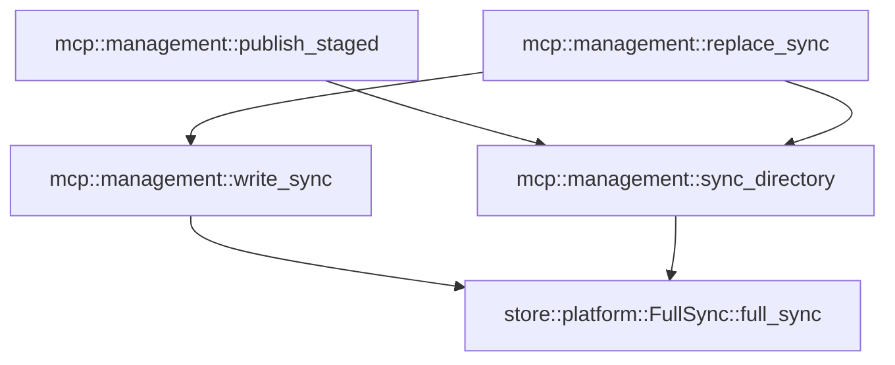

```mermaid
flowchart TD
  n0["mcp::management::canonical"]
  n1["mcp::management::decode_registry_file"]
  n2["mcp::management::dedupe_registry_last_wins"]
  n3["mcp::management::decode_canonical"]
  n4["mcp::management::validate_token"]
  n5["mcp::management::validate_digest"]
  n6["mcp::management::hex_digest"]
  n7["mcp::management::stage_sync"]
  n8["mcp::management::publish_staged"]
  n9["mcp::management::replace_sync"]
  n10["mcp::management::write_sync"]
  n11["mcp::management::sync_directory"]
  n12["mcp::management::CredentialRegistry::from_registry"]
  n13["mcp::management::McpRegistryStore::load_registry_locked"]
  n14["mcp::management::McpRegistryStore::load_credentials_locked"]
  n15["mcp::management::McpRegistryStore::apply_locked"]
  n16["mcp::management::McpRegistryStore::recover_locked"]
  n17["mcp::management::McpRegistryStore::complete_operation"]
  n18["mcp::management::McpRegistryStore::write_operation"]
  n19["mcp::management::McpRegistryStore::receipt_path"]
  n20["mcp::management::McpRegistryStore::crash"]
  n21["mcp::management::apply_credential_field_operations"]
  n22["mcp::management::credential_fields"]
  n23["mcp::management::set_credential_field"]
  n24["mcp::management::DurableOperation::validate"]
  n25["mcp::management::validate_server"]
  n26["mcp::management::scope_rank"]
  n1 --> n2
  n1 --> n3
  n3 --> n0
  n7 --> n10
  n15 --> n4
  n15 --> n12
  n15 --> n13
  n15 --> n14
  n15 --> n21
  n15 --> n25
  n16 --> n3
  n16 --> n17
  n17 --> n0
  n17 --> n7
  n17 --> n8
  n17 --> n9
  n17 --> n11
  n17 --> n18
  n17 --> n19
  n17 --> n20
  n18 --> n0
  n18 --> n9
  n18 --> n11
  n21 --> n4
  n21 --> n22
  n21 --> n23
  n24 --> n0
  n24 --> n4
  n24 --> n6
```

# mcp::management

[Package atlas](index.md) · [Source](../../src/management.rs)

## Declarations

Visibility is the declaration spelling; trait members and reexports require their enclosing interface. `cfg` is not evaluated.

| Symbol | Kind | Visibility | Test / cfg |
|---|---|---|---|
| [mcp::management::FORMAT](../../src/management.rs#L15) | const_item | `private` |  |
| [mcp::management::McpScope](../../src/management.rs#L19) | enum_item | `pub` |  |
| [mcp::management::McpServerReference](../../src/management.rs#L27) | struct_item | `pub` |  |
| [mcp::management::CredentialValue](../../src/management.rs#L35) | enum_item | `pub` |  |
| [mcp::management::ClosedCredentialValue](../../src/management.rs#L42) | enum_item | `private` |  |
| [mcp::management::CredentialLiteral](../../src/management.rs#L49) | struct_item | `private` |  |
| [mcp::management::CredentialReferenceValue](../../src/management.rs#L55) | struct_item | `private` |  |
| [mcp::management::CredentialValue::deserialize](../../src/management.rs#L60) | function_item | `private` |  |
| [mcp::management::McpTransportConfig](../../src/management.rs#L77) | enum_item | `pub` |  |
| [mcp::management::McpServerConfig](../../src/management.rs#L94) | struct_item | `pub` |  |
| [mcp::management::McpRegistry](../../src/management.rs#L110) | struct_item | `pub` |  |
| [mcp::management::McpRegistry::default](../../src/management.rs#L116) | function_item | `private` |  |
| [mcp::management::McpRegistry::validate](../../src/management.rs#L125) | function_item | `pub` |  |
| [mcp::management::McpRegistry::resolve](../../src/management.rs#L151) | function_item | `pub` |  |
| [mcp::management::McpCredentialReferenceState](../../src/management.rs#L184) | enum_item | `pub` |  |
| [mcp::management::McpCredentialReference](../../src/management.rs#L191) | struct_item | `pub` |  |
| [mcp::management::CredentialRegistry](../../src/management.rs#L200) | struct_item | `private` |  |
| [mcp::management::CredentialRegistry::default](../../src/management.rs#L206) | function_item | `private` |  |
| [mcp::management::CredentialRegistry::from_registry](../../src/management.rs#L215) | function_item | `private` |  |
| [mcp::management::CredentialRegistry::validate](../../src/management.rs#L260) | function_item | `private` |  |
| [mcp::management::McpManagementMutation](../../src/management.rs#L300) | enum_item | `pub` |  |
| [mcp::management::McpCredentialFieldOperation](../../src/management.rs#L327) | enum_item | `pub` |  |
| [mcp::management::McpManagementResult](../../src/management.rs#L335) | enum_item | `pub` |  |
| [mcp::management::McpMutationReceipt](../../src/management.rs#L357) | struct_item | `pub` |  |
| [mcp::management::McpManagementFault](../../src/management.rs#L367) | enum_item | `pub` |  |
| [mcp::management::McpRegistryStore](../../src/management.rs#L377) | struct_item | `pub` |  |
| [mcp::management::McpRegistryStore::new](../../src/management.rs#L383) | function_item | `pub` |  |
| [mcp::management::McpRegistryStore::injecting_fault](../../src/management.rs#L391) | function_item | `pub` |  |
| [mcp::management::McpRegistryStore::load](../../src/management.rs#L396) | function_item | `pub` |  |
| [mcp::management::McpRegistryStore::publish](../../src/management.rs#L400) | function_item | `pub` |  |
| [mcp::management::McpRegistryStore::list](../../src/management.rs#L408) | function_item | `pub` |  |
| [mcp::management::McpRegistryStore::get](../../src/management.rs#L417) | function_item | `pub` |  |
| [mcp::management::McpRegistryStore::credential_reference_state](../../src/management.rs#L428) | function_item | `pub` |  |
| [mcp::management::McpRegistryStore::committed_receipt](../../src/management.rs#L451) | function_item | `pub` |  |
| [mcp::management::McpRegistryStore::mutate_idempotent](../../src/management.rs#L475) | function_item | `pub` |  |
| [mcp::management::McpRegistryStore::recover](../../src/management.rs#L525) | function_item | `pub` |  |
| [mcp::management::McpRegistryStore::with_lock](../../src/management.rs#L529) | function_item | `private` |  |
| [mcp::management::McpRegistryStore::load_registry_locked](../../src/management.rs#L539) | function_item | `private` |  |
| [mcp::management::McpRegistryStore::load_credentials_locked](../../src/management.rs#L548) | function_item | `private` |  |
| [mcp::management::McpRegistryStore::apply_locked](../../src/management.rs#L559) | function_item | `private` |  |
| [mcp::management::McpRegistryStore::recover_locked](../../src/management.rs#L719) | function_item | `private` |  |
| [mcp::management::McpRegistryStore::complete_operation](../../src/management.rs#L729) | function_item | `private` |  |
| [mcp::management::McpRegistryStore::write_operation](../../src/management.rs#L763) | function_item | `private` |  |
| [mcp::management::McpRegistryStore::receipt_path](../../src/management.rs#L771) | function_item | `private` |  |
| [mcp::management::McpRegistryStore::crash](../../src/management.rs#L775) | function_item | `private` |  |
| [mcp::management::apply_credential_field_operations](../../src/management.rs#L784) | function_item | `private` |  |
| [mcp::management::credential_fields](../../src/management.rs#L819) | function_item | `private` |  |
| [mcp::management::set_credential_field](../../src/management.rs#L843) | function_item | `private` |  |
| [mcp::management::OperationPhase](../../src/management.rs#L885) | enum_item | `private` |  |
| [mcp::management::DurableOperation](../../src/management.rs#L893) | struct_item | `private` |  |
| [mcp::management::DurableOperation::validate](../../src/management.rs#L905) | function_item | `private` |  |
| [mcp::management::validate_server](../../src/management.rs#L928) | function_item | `private` |  |
| [mcp::management::scope_rank](../../src/management.rs#L999) | function_item | `private` |  |
| [mcp::management::canonical](../../src/management.rs#L1007) | function_item | `private` |  |
| [mcp::management::decode_registry_file](../../src/management.rs#L1023) | function_item | `private` |  |
| [mcp::management::dedupe_registry_last_wins](../../src/management.rs#L1056) | function_item | `private` |  |
| [mcp::management::decode_canonical](../../src/management.rs#L1086) | function_item | `private` |  |
| [mcp::management::validate_token](../../src/management.rs#L1105) | function_item | `private` |  |
| [mcp::management::validate_digest](../../src/management.rs#L1117) | function_item | `private` |  |
| [mcp::management::hex_digest](../../src/management.rs#L1128) | function_item | `private` |  |
| [mcp::management::stage_sync](../../src/management.rs#L1132) | function_item | `private` |  |
| [mcp::management::publish_staged](../../src/management.rs#L1139) | function_item | `private` |  |
| [mcp::management::replace_sync](../../src/management.rs#L1154) | function_item | `private` |  |
| [mcp::management::write_sync](../../src/management.rs#L1167) | function_item | `private` |  |
| [mcp::management::sync_directory](../../src/management.rs#L1174) | function_item | `private` |  |
| [mcp::management::McpRegistryError](../../src/management.rs#L1180) | enum_item | `pub` |  |

## Imports / reexports

| Local name | Source path | Visibility |
|---|---|---|
| `BTreeMap` | `std::collections::BTreeMap` | `private` |
| `BTreeSet` | `std::collections::BTreeSet` | `private` |
| `fs` | `std::fs` | `private` |
| `File` | `std::fs::File` | `private` |
| `OpenOptions` | `std::fs::OpenOptions` | `private` |
| `Write` | `std::io::Write` | `private` |
| `Path` | `std::path::Path` | `private` |
| `PathBuf` | `std::path::PathBuf` | `private` |
| `PluginComponentReference` | `plugins::PluginComponentReference` | `private` |
| `Deserialize` | `serde::Deserialize` | `private` |
| `Serialize` | `serde::Serialize` | `private` |
| `Digest` | `sha2::Digest` | `private` |
| `Sha256` | `sha2::Sha256` | `private` |
| `FullSync` | `store::FullSync` | `private` |
| `NamedLock` | `store::NamedLock` | `private` |
| `Error` | `thiserror::Error` | `private` |
| `UnicodeNormalization` | `unicode_normalization::UnicodeNormalization` | `private` |
| `ProtocolMode` | `crate::ProtocolMode` | `private` |

## Module declarations

| Module | Visibility | Attributes |
|---|---|---|

## Function call graphs

Edges below are syntactically resolved calls only, including private functions. Graphs partition callers into groups of 20; they are not execution order. All unresolved sites are listed below and in the JSON inventory.

Functions 1–20: 30 direct edges

Functions 21–40: 29 direct edges

Functions 41–44: 5 direct edges

## Call sites

Includes test functions (marked in declarations). Receiver-type-required sites need type analysis/manual tracing. Calls in closures are attributed to their enclosing function; their occurrence here does not mean the closure executes immediately.

| Caller | Callee expression | Source lines | Target / classification |
|---|---|---|---|
| `deserialize` | `ClosedCredentialValue::deserialize` | [64](../../src/management.rs#L64) | external-constructor-callback-or-unresolved |
| `deserialize` | `Ok` | [65](../../src/management.rs#L65), [68](../../src/management.rs#L68) | external-constructor-callback-or-unresolved |
| `default` | `Vec::new` | [119](../../src/management.rs#L119) | external-constructor-callback-or-unresolved |
| `validate` | `Err` | [127](../../src/management.rs#L127), [134](../../src/management.rs#L134), [142](../../src/management.rs#L142) | external-constructor-callback-or-unresolved |
| `validate` | `McpRegistryError::Invalid` | [127](../../src/management.rs#L127), [134](../../src/management.rs#L134), [142](../../src/management.rs#L142) | external-constructor-callback-or-unresolved |
| `validate` | `"format must be 1".to_owned` | [127](../../src/management.rs#L127) | receiver-type-required |
| `validate` | `BTreeSet::new` | [129](../../src/management.rs#L129) | external-constructor-callback-or-unresolved |
| `validate` | `validate_server` | [132](../../src/management.rs#L132) | [mcp::management::validate_server](../../src/management.rs#L928) |
| `validate` | `seen.insert` | [133](../../src/management.rs#L133) | receiver-type-required |
| `validate` | `server.reference.clone` | [133](../../src/management.rs#L133), [146](../../src/management.rs#L146) | receiver-type-required |
| `validate` | `"duplicate MCP server reference".to_owned` | [135](../../src/management.rs#L135) | receiver-type-required |
| `validate` | `previous                 .as_ref()                 .is_some_and` | [138](../../src/management.rs#L138) | receiver-type-required |
| `validate` | `previous                 .as_ref` | [138](../../src/management.rs#L138) | receiver-type-required |
| `validate` | `"MCP servers must be strictly reference-sorted".to_owned` | [143](../../src/management.rs#L143) | receiver-type-required |
| `validate` | `Some` | [146](../../src/management.rs#L146) | external-constructor-callback-or-unresolved |
| `validate` | `Ok` | [148](../../src/management.rs#L148) | external-constructor-callback-or-unresolved |
| `resolve` | `BTreeMap::new` | [152](../../src/management.rs#L152) | external-constructor-callback-or-unresolved |
| `resolve` | `resolved.get` | [160](../../src/management.rs#L160) | receiver-type-required |
| `resolve` | `server.reference.name.as_str` | [160](../../src/management.rs#L160) | receiver-type-required |
| `resolve` | `Err` | [165](../../src/management.rs#L165) | external-constructor-callback-or-unresolved |
| `resolve` | `McpRegistryError::Conflict` | [165](../../src/management.rs#L165) | external-constructor-callback-or-unresolved |
| `resolve` | `scope_rank` | [171](../../src/management.rs#L171), [172](../../src/management.rs#L172) | [mcp::management::scope_rank](../../src/management.rs#L999) |
| `resolve` | `resolved.insert` | [174](../../src/management.rs#L174) | receiver-type-required |
| `resolve` | `Ok` | [178](../../src/management.rs#L178) | external-constructor-callback-or-unresolved |
| `resolve` | `resolved.into_values().collect` | [178](../../src/management.rs#L178) | receiver-type-required |
| `resolve` | `resolved.into_values` | [178](../../src/management.rs#L178) | receiver-type-required |
| `default` | `Vec::new` | [209](../../src/management.rs#L209) | external-constructor-callback-or-unresolved |
| `from_registry` | `registry             .servers             .iter()             .flat_map(&#124;server&#124; {                 credential_fields(server)                     .into_iter()                     .map(&#124;(field, credential_id)&#124; {                         let state = if pending.is_some_and(&#124;(reference, credential)&#124; {                             reference == &server.reference && credential == credential_id                         }) {                             McpCredentialReferenceState::Pending                         } else {                             prior                                 .references                                 .iter()                                 .find(&#124;item&#124; {                                     item.server == server.reference                                         && item.field == field                                         && item.credential_id == credential_id                                 })                                 .map_or(McpCredentialReferenceState::Bound, &#124;item&#124; {                                     item.state.clone()                                 })                         };                         McpCredentialReference {                             credential_id,                             server: server.reference.clone(),                             field,                             state,                         }                     })             })             .collect::<Vec<_>>` | [220](../../src/management.rs#L220) | receiver-type-required |
| `from_registry` | `registry             .servers             .iter()             .flat_map` | [220](../../src/management.rs#L220) | receiver-type-required |
| `from_registry` | `registry             .servers             .iter` | [220](../../src/management.rs#L220) | receiver-type-required |
| `from_registry` | `credential_fields(server)                     .into_iter()                     .map` | [224](../../src/management.rs#L224) | receiver-type-required |
| `from_registry` | `credential_fields(server)                     .into_iter` | [224](../../src/management.rs#L224) | receiver-type-required |
| `from_registry` | `credential_fields` | [224](../../src/management.rs#L224) | [mcp::management::credential_fields](../../src/management.rs#L819) |
| `from_registry` | `pending.is_some_and` | [227](../../src/management.rs#L227) | receiver-type-required |
| `from_registry` | `prior                                 .references                                 .iter()                                 .find(&#124;item&#124; {                                     item.server == server.reference                                         && item.field == field                                         && item.credential_id == credential_id                                 })                                 .map_or` | [232](../../src/management.rs#L232) | receiver-type-required |
| `from_registry` | `prior                                 .references                                 .iter()                                 .find` | [232](../../src/management.rs#L232) | receiver-type-required |
| `from_registry` | `prior                                 .references                                 .iter` | [232](../../src/management.rs#L232) | receiver-type-required |
| `from_registry` | `item.state.clone` | [241](../../src/management.rs#L241) | receiver-type-required |
| `from_registry` | `server.reference.clone` | [246](../../src/management.rs#L246) | receiver-type-required |
| `from_registry` | `references.sort` | [253](../../src/management.rs#L253) | receiver-type-required |
| `validate` | `Err` | [262](../../src/management.rs#L262), [271](../../src/management.rs#L271), [276](../../src/management.rs#L276), [288](../../src/management.rs#L288) | external-constructor-callback-or-unresolved |
| `validate` | `McpRegistryError::Invalid` | [262](../../src/management.rs#L262), [271](../../src/management.rs#L271), [276](../../src/management.rs#L276), [285](../../src/management.rs#L285), [288](../../src/management.rs#L288) | external-constructor-callback-or-unresolved |
| `validate` | `"credential reference format must be 1".to_owned` | [263](../../src/management.rs#L263) | receiver-type-required |
| `validate` | `BTreeSet::new` | [267](../../src/management.rs#L267) | external-constructor-callback-or-unresolved |
| `validate` | `validate_token` | [269](../../src/management.rs#L269) | [mcp::management::validate_token](../../src/management.rs#L1105) |
| `validate` | `previous.as_ref().is_some_and` | [270](../../src/management.rs#L270) | receiver-type-required |
| `validate` | `previous.as_ref` | [270](../../src/management.rs#L270) | receiver-type-required |
| `validate` | `"credential references must be strictly sorted".to_owned` | [272](../../src/management.rs#L272) | receiver-type-required |
| `validate` | `fields.insert` | [275](../../src/management.rs#L275) | receiver-type-required |
| `validate` | `reference.server.clone` | [275](../../src/management.rs#L275) | receiver-type-required |
| `validate` | `reference.field.clone` | [275](../../src/management.rs#L275) | receiver-type-required |
| `validate` | `"MCP server has duplicate credential field references".to_owned` | [277](../../src/management.rs#L277) | receiver-type-required |
| `validate` | `registry                 .servers                 .iter()                 .find(&#124;server&#124; server.reference == reference.server)                 .ok_or_else` | [280](../../src/management.rs#L280) | receiver-type-required |
| `validate` | `registry                 .servers                 .iter()                 .find` | [280](../../src/management.rs#L280) | receiver-type-required |
| `validate` | `registry                 .servers                 .iter` | [280](../../src/management.rs#L280) | receiver-type-required |
| `validate` | `"credential reference has no MCP server".to_owned` | [285](../../src/management.rs#L285) | receiver-type-required |
| `validate` | `credential_fields(server).get` | [287](../../src/management.rs#L287) | receiver-type-required |
| `validate` | `credential_fields` | [287](../../src/management.rs#L287) | [mcp::management::credential_fields](../../src/management.rs#L819) |
| `validate` | `Some` | [287](../../src/management.rs#L287), [292](../../src/management.rs#L292) | external-constructor-callback-or-unresolved |
| `validate` | `"credential reference differs from MCP field binding".to_owned` | [289](../../src/management.rs#L289) | receiver-type-required |
| `validate` | `Ok` | [294](../../src/management.rs#L294) | external-constructor-callback-or-unresolved |
| `new` | `root.into` | [385](../../src/management.rs#L385) | receiver-type-required |
| `injecting_fault` | `Some` | [392](../../src/management.rs#L392) | external-constructor-callback-or-unresolved |
| `load` | `self.with_lock` | [397](../../src/management.rs#L397) | [mcp::management::McpRegistryStore::with_lock](../../src/management.rs#L529) |
| `load` | `store.load_registry_locked` | [397](../../src/management.rs#L397) | receiver-type-required |
| `publish` | `registry.validate` | [401](../../src/management.rs#L401) | receiver-type-required |
| `publish` | `self.with_lock` | [402](../../src/management.rs#L402) | [mcp::management::McpRegistryStore::with_lock](../../src/management.rs#L529) |
| `publish` | `replace_sync` | [403](../../src/management.rs#L403) | [mcp::management::replace_sync](../../src/management.rs#L1154) |
| `publish` | `store.root.join` | [403](../../src/management.rs#L403) | receiver-type-required |
| `publish` | `canonical` | [403](../../src/management.rs#L403) | [mcp::management::canonical](../../src/management.rs#L1007) |
| `publish` | `sync_directory` | [404](../../src/management.rs#L404) | [mcp::management::sync_directory](../../src/management.rs#L1174) |
| `list` | `Ok` | [409](../../src/management.rs#L409) | external-constructor-callback-or-unresolved |
| `list` | `self             .load()?             .servers             .into_iter()             .filter(&#124;server&#124; server.reference.workspace_id == workspace_id)             .collect` | [409](../../src/management.rs#L409) | receiver-type-required |
| `list` | `self             .load()?             .servers             .into_iter()             .filter` | [409](../../src/management.rs#L409) | receiver-type-required |
| `list` | `self             .load()?             .servers             .into_iter` | [409](../../src/management.rs#L409) | receiver-type-required |
| `list` | `self             .load` | [409](../../src/management.rs#L409) | [mcp::management::McpRegistryStore::load](../../src/management.rs#L396) |
| `get` | `Ok` | [421](../../src/management.rs#L421) | external-constructor-callback-or-unresolved |
| `get` | `self             .load()?             .servers             .into_iter()             .find` | [421](../../src/management.rs#L421) | receiver-type-required |
| `get` | `self             .load()?             .servers             .into_iter` | [421](../../src/management.rs#L421) | receiver-type-required |
| `get` | `self             .load` | [421](../../src/management.rs#L421) | [mcp::management::McpRegistryStore::load](../../src/management.rs#L396) |
| `credential_reference_state` | `self.with_lock` | [434](../../src/management.rs#L434) | [mcp::management::McpRegistryStore::with_lock](../../src/management.rs#L529) |
| `credential_reference_state` | `Ok` | [435](../../src/management.rs#L435) | external-constructor-callback-or-unresolved |
| `credential_reference_state` | `store                 .load_credentials_locked()?                 .references                 .into_iter()                 .find(&#124;reference&#124; {                     &reference.server == server                         && reference.field == field                         && reference.credential_id == credential_id                 })                 .map` | [435](../../src/management.rs#L435) | receiver-type-required |
| `credential_reference_state` | `store                 .load_credentials_locked()?                 .references                 .into_iter()                 .find` | [435](../../src/management.rs#L435) | receiver-type-required |
| `credential_reference_state` | `store                 .load_credentials_locked()?                 .references                 .into_iter` | [435](../../src/management.rs#L435) | receiver-type-required |
| `credential_reference_state` | `store                 .load_credentials_locked` | [435](../../src/management.rs#L435) | receiver-type-required |
| `committed_receipt` | `validate_token` | [456](../../src/management.rs#L456) | [mcp::management::validate_token](../../src/management.rs#L1105) |
| `committed_receipt` | `hex_digest` | [457](../../src/management.rs#L457) | [mcp::management::hex_digest](../../src/management.rs#L1128) |
| `committed_receipt` | `canonical` | [457](../../src/management.rs#L457) | [mcp::management::canonical](../../src/management.rs#L1007) |
| `committed_receipt` | `self.with_lock` | [458](../../src/management.rs#L458) | [mcp::management::McpRegistryStore::with_lock](../../src/management.rs#L529) |
| `committed_receipt` | `store.receipt_path` | [459](../../src/management.rs#L459) | receiver-type-required |
| `committed_receipt` | `path.exists` | [460](../../src/management.rs#L460) | receiver-type-required |
| `committed_receipt` | `Ok` | [461](../../src/management.rs#L461), [465](../../src/management.rs#L465) | external-constructor-callback-or-unresolved |
| `committed_receipt` | `decode_canonical` | [463](../../src/management.rs#L463) | [mcp::management::decode_canonical](../../src/management.rs#L1086) |
| `committed_receipt` | `fs::read` | [463](../../src/management.rs#L463) | external-constructor-callback-or-unresolved |
| `committed_receipt` | `Some` | [465](../../src/management.rs#L465) | external-constructor-callback-or-unresolved |
| `committed_receipt` | `Err` | [467](../../src/management.rs#L467) | external-constructor-callback-or-unresolved |
| `committed_receipt` | `McpRegistryError::Conflict` | [467](../../src/management.rs#L467) | external-constructor-callback-or-unresolved |
| `committed_receipt` | `"rpc id was already committed for a different management request".to_owned` | [468](../../src/management.rs#L468) | receiver-type-required |
| `mutate_idempotent` | `validate_token` | [480](../../src/management.rs#L480), [486](../../src/management.rs#L486) | [mcp::management::validate_token](../../src/management.rs#L1105) |
| `mutate_idempotent` | `hex_digest` | [481](../../src/management.rs#L481), [504](../../src/management.rs#L504), [505](../../src/management.rs#L505) | [mcp::management::hex_digest](../../src/management.rs#L1128) |
| `mutate_idempotent` | `canonical` | [481](../../src/management.rs#L481), [498](../../src/management.rs#L498), [499](../../src/management.rs#L499) | [mcp::management::canonical](../../src/management.rs#L1007) |
| `mutate_idempotent` | `self.with_lock` | [482](../../src/management.rs#L482) | [mcp::management::McpRegistryStore::with_lock](../../src/management.rs#L529) |
| `mutate_idempotent` | `store.receipt_path` | [483](../../src/management.rs#L483) | receiver-type-required |
| `mutate_idempotent` | `receipt_path.exists` | [484](../../src/management.rs#L484) | receiver-type-required |
| `mutate_idempotent` | `decode_canonical` | [485](../../src/management.rs#L485) | [mcp::management::decode_canonical](../../src/management.rs#L1086) |
| `mutate_idempotent` | `fs::read` | [485](../../src/management.rs#L485) | external-constructor-callback-or-unresolved |
| `mutate_idempotent` | `validate_digest` | [487](../../src/management.rs#L487), [488](../../src/management.rs#L488), [489](../../src/management.rs#L489) | [mcp::management::validate_digest](../../src/management.rs#L1117) |
| `mutate_idempotent` | `Ok` | [491](../../src/management.rs#L491), [521](../../src/management.rs#L521) | external-constructor-callback-or-unresolved |
| `mutate_idempotent` | `Err` | [493](../../src/management.rs#L493) | external-constructor-callback-or-unresolved |
| `mutate_idempotent` | `McpRegistryError::Conflict` | [493](../../src/management.rs#L493) | external-constructor-callback-or-unresolved |
| `mutate_idempotent` | `"rpc id was already committed for a different management request".to_owned` | [494](../../src/management.rs#L494) | receiver-type-required |
| `mutate_idempotent` | `store.apply_locked` | [497](../../src/management.rs#L497) | receiver-type-required |
| `mutate_idempotent` | `rpc_id.to_owned` | [502](../../src/management.rs#L502), [510](../../src/management.rs#L510) | receiver-type-required |
| `mutate_idempotent` | `receipt.request_digest.clone` | [511](../../src/management.rs#L511) | receiver-type-required |
| `mutate_idempotent` | `mutation.clone` | [512](../../src/management.rs#L512) | receiver-type-required |
| `mutate_idempotent` | `receipt.clone` | [516](../../src/management.rs#L516) | receiver-type-required |
| `mutate_idempotent` | `store.write_operation` | [518](../../src/management.rs#L518) | receiver-type-required |
| `mutate_idempotent` | `store.crash` | [519](../../src/management.rs#L519) | receiver-type-required |
| `mutate_idempotent` | `store.complete_operation` | [520](../../src/management.rs#L520) | receiver-type-required |
| `recover` | `self.with_lock` | [526](../../src/management.rs#L526) | [mcp::management::McpRegistryStore::with_lock](../../src/management.rs#L529) |
| `recover` | `Ok` | [526](../../src/management.rs#L526) | external-constructor-callback-or-unresolved |
| `with_lock` | `fs::create_dir_all` | [533](../../src/management.rs#L533) | external-constructor-callback-or-unresolved |
| `with_lock` | `NamedLock::exclusive` | [534](../../src/management.rs#L534) | [store::platform::NamedLock::exclusive](../../../store/src/platform.rs#L103) |
| `with_lock` | `self.root.join` | [534](../../src/management.rs#L534) | receiver-type-required |
| `with_lock` | `self.recover_locked` | [535](../../src/management.rs#L535) | [mcp::management::McpRegistryStore::recover_locked](../../src/management.rs#L719) |
| `with_lock` | `action` | [536](../../src/management.rs#L536) | external-constructor-callback-or-unresolved |
| `load_registry_locked` | `self.root.join` | [540](../../src/management.rs#L540) | receiver-type-required |
| `load_registry_locked` | `path.exists` | [541](../../src/management.rs#L541) | receiver-type-required |
| `load_registry_locked` | `decode_registry_file` | [542](../../src/management.rs#L542) | [mcp::management::decode_registry_file](../../src/management.rs#L1023) |
| `load_registry_locked` | `fs::read` | [542](../../src/management.rs#L542) | external-constructor-callback-or-unresolved |
| `load_registry_locked` | `Ok` | [544](../../src/management.rs#L544) | external-constructor-callback-or-unresolved |
| `load_registry_locked` | `McpRegistry::default` | [544](../../src/management.rs#L544) | external-constructor-callback-or-unresolved |
| `load_credentials_locked` | `self.root.join` | [549](../../src/management.rs#L549) | receiver-type-required |
| `load_credentials_locked` | `path.exists` | [550](../../src/management.rs#L550) | receiver-type-required |
| `load_credentials_locked` | `decode_canonical` | [551](../../src/management.rs#L551) | [mcp::management::decode_canonical](../../src/management.rs#L1086) |
| `load_credentials_locked` | `fs::read` | [551](../../src/management.rs#L551) | external-constructor-callback-or-unresolved |
| `load_credentials_locked` | `credentials.validate` | [552](../../src/management.rs#L552) | receiver-type-required |
| `load_credentials_locked` | `self.load_registry_locked` | [552](../../src/management.rs#L552) | [mcp::management::McpRegistryStore::load_registry_locked](../../src/management.rs#L539) |
| `load_credentials_locked` | `Ok` | [553](../../src/management.rs#L553), [555](../../src/management.rs#L555) | external-constructor-callback-or-unresolved |
| `load_credentials_locked` | `CredentialRegistry::default` | [555](../../src/management.rs#L555) | external-constructor-callback-or-unresolved |
| `apply_locked` | `self.load_registry_locked` | [563](../../src/management.rs#L563) | [mcp::management::McpRegistryStore::load_registry_locked](../../src/management.rs#L539) |
| `apply_locked` | `self.load_credentials_locked` | [564](../../src/management.rs#L564) | [mcp::management::McpRegistryStore::load_credentials_locked](../../src/management.rs#L548) |
| `apply_locked` | `registry                     .servers                     .iter()                     .find` | [571](../../src/management.rs#L571), [675](../../src/management.rs#L675) | receiver-type-required |
| `apply_locked` | `registry                     .servers                     .iter` | [571](../../src/management.rs#L571), [594](../../src/management.rs#L594), [675](../../src/management.rs#L675) | receiver-type-required |
| `apply_locked` | `apply_credential_field_operations` | [576](../../src/management.rs#L576) | [mcp::management::apply_credential_field_operations](../../src/management.rs#L784) |
| `apply_locked` | `validate_server` | [577](../../src/management.rs#L577) | [mcp::management::validate_server](../../src/management.rs#L928) |
| `apply_locked` | `Err` | [579](../../src/management.rs#L579), [592](../../src/management.rs#L592), [599](../../src/management.rs#L599), [624](../../src/management.rs#L624), [629](../../src/management.rs#L629), [637](../../src/management.rs#L637), [650](../../src/management.rs#L650), [658](../../src/management.rs#L658), [673](../../src/management.rs#L673), [681](../../src/management.rs#L681), [686](../../src/management.rs#L686), [695](../../src/management.rs#L695), [700](../../src/management.rs#L700) | external-constructor-callback-or-unresolved |
| `apply_locked` | `registry                     .servers                     .retain` | [581](../../src/management.rs#L581) | receiver-type-required |
| `apply_locked` | `registry.servers.push` | [584](../../src/management.rs#L584) | receiver-type-required |
| `apply_locked` | `server.clone` | [584](../../src/management.rs#L584) | receiver-type-required |
| `apply_locked` | `registry                     .servers                     .sort_by` | [585](../../src/management.rs#L585) | receiver-type-required |
| `apply_locked` | `left.reference.cmp` | [587](../../src/management.rs#L587) | receiver-type-required |
| `apply_locked` | `registry                     .servers                     .iter()                     .any` | [594](../../src/management.rs#L594) | receiver-type-required |
| `apply_locked` | `registry.servers.retain` | [601](../../src/management.rs#L601) | receiver-type-required |
| `apply_locked` | `reference.clone` | [603](../../src/management.rs#L603), [664](../../src/management.rs#L664), [706](../../src/management.rs#L706) | receiver-type-required |
| `apply_locked` | `validate_token` | [611](../../src/management.rs#L611), [671](../../src/management.rs#L671) | [mcp::management::validate_token](../../src/management.rs#L1105) |
| `apply_locked` | `url::Url::parse(authorization_url)                     .map_err` | [612](../../src/management.rs#L612) | receiver-type-required |
| `apply_locked` | `url::Url::parse` | [612](../../src/management.rs#L612) | external-constructor-callback-or-unresolved |
| `apply_locked` | `McpRegistryError::Invalid` | [613](../../src/management.rs#L613), [624](../../src/management.rs#L624), [637](../../src/management.rs#L637), [658](../../src/management.rs#L658), [681](../../src/management.rs#L681), [686](../../src/management.rs#L686), [695](../../src/management.rs#L695), [700](../../src/management.rs#L700) | external-constructor-callback-or-unresolved |
| `apply_locked` | `error.to_string` | [613](../../src/management.rs#L613) | receiver-type-required |
| `apply_locked` | `parsed.scheme` | [614](../../src/management.rs#L614) | receiver-type-required |
| `apply_locked` | `parsed.username` | [615](../../src/management.rs#L615) | receiver-type-required |
| `apply_locked` | `parsed.password().is_some` | [616](../../src/management.rs#L616) | receiver-type-required |
| `apply_locked` | `parsed.password` | [616](../../src/management.rs#L616) | receiver-type-required |
| `apply_locked` | `parsed.query_pairs().any` | [617](../../src/management.rs#L617) | receiver-type-required |
| `apply_locked` | `parsed.query_pairs` | [617](../../src/management.rs#L617) | receiver-type-required |
| `apply_locked` | `"OAuth authorization URL must be credential-free HTTPS".to_owned` | [625](../../src/management.rs#L625) | receiver-type-required |
| `apply_locked` | `registry                     .servers                     .iter_mut()                     .find(&#124;item&#124; &item.reference == reference)                     .ok_or` | [631](../../src/management.rs#L631), [652](../../src/management.rs#L652) | receiver-type-required |
| `apply_locked` | `registry                     .servers                     .iter_mut()                     .find` | [631](../../src/management.rs#L631), [652](../../src/management.rs#L652) | receiver-type-required |
| `apply_locked` | `registry                     .servers                     .iter_mut` | [631](../../src/management.rs#L631), [652](../../src/management.rs#L652) | receiver-type-required |
| `apply_locked` | `"OAuth requires an HTTP MCP server".to_owned` | [638](../../src/management.rs#L638), [659](../../src/management.rs#L659), [682](../../src/management.rs#L682) | receiver-type-required |
| `apply_locked` | `Some` | [641](../../src/management.rs#L641), [642](../../src/management.rs#L642), [685](../../src/management.rs#L685) | external-constructor-callback-or-unresolved |
| `apply_locked` | `credential_id.clone` | [641](../../src/management.rs#L641), [644](../../src/management.rs#L644), [707](../../src/management.rs#L707) | receiver-type-required |
| `apply_locked` | `credential_id.as_str` | [642](../../src/management.rs#L642) | receiver-type-required |
| `apply_locked` | `authorization_url.clone` | [645](../../src/management.rs#L645) | receiver-type-required |
| `apply_locked` | `registry                     .servers                     .iter()                     .find(&#124;item&#124; &item.reference == reference)                     .ok_or` | [675](../../src/management.rs#L675) | receiver-type-required |
| `apply_locked` | `oauth.as_deref` | [685](../../src/management.rs#L685) | receiver-type-required |
| `apply_locked` | `"OAuth completion does not own the pending credential reference".to_owned` | [687](../../src/management.rs#L687) | receiver-type-required |
| `apply_locked` | `credentials.references.iter_mut().find` | [690](../../src/management.rs#L690) | receiver-type-required |
| `apply_locked` | `credentials.references.iter_mut` | [690](../../src/management.rs#L690) | receiver-type-required |
| `apply_locked` | `"OAuth completion has no pending credential reference".to_owned` | [696](../../src/management.rs#L696) | receiver-type-required |
| `apply_locked` | `"OAuth credential reference is not pending".to_owned` | [701](../../src/management.rs#L701) | receiver-type-required |
| `apply_locked` | `registry.validate` | [711](../../src/management.rs#L711) | receiver-type-required |
| `apply_locked` | `CredentialRegistry::from_registry` | [713](../../src/management.rs#L713) | [mcp::management::CredentialRegistry::from_registry](../../src/management.rs#L215) |
| `apply_locked` | `credentials.validate` | [715](../../src/management.rs#L715) | receiver-type-required |
| `apply_locked` | `Ok` | [716](../../src/management.rs#L716) | external-constructor-callback-or-unresolved |
| `recover_locked` | `self.root.join` | [720](../../src/management.rs#L720) | receiver-type-required |
| `recover_locked` | `path.exists` | [721](../../src/management.rs#L721) | receiver-type-required |
| `recover_locked` | `Ok` | [722](../../src/management.rs#L722) | external-constructor-callback-or-unresolved |
| `recover_locked` | `decode_canonical` | [724](../../src/management.rs#L724) | [mcp::management::decode_canonical](../../src/management.rs#L1086) |
| `recover_locked` | `fs::read` | [724](../../src/management.rs#L724) | external-constructor-callback-or-unresolved |
| `recover_locked` | `operation.validate` | [725](../../src/management.rs#L725) | receiver-type-required |
| `recover_locked` | `self.complete_operation` | [726](../../src/management.rs#L726) | [mcp::management::McpRegistryStore::complete_operation](../../src/management.rs#L729) |
| `complete_operation` | `canonical` | [730](../../src/management.rs#L730), [731](../../src/management.rs#L731), [756](../../src/management.rs#L756) | [mcp::management::canonical](../../src/management.rs#L1007) |
| `complete_operation` | `stage_sync` | [732](../../src/management.rs#L732), [734](../../src/management.rs#L734) | [mcp::management::stage_sync](../../src/management.rs#L1132) |
| `complete_operation` | `self.root.join` | [732](../../src/management.rs#L732), [735](../../src/management.rs#L735), [752](../../src/management.rs#L752), [759](../../src/management.rs#L759) | receiver-type-required |
| `complete_operation` | `self.crash` | [733](../../src/management.rs#L733), [738](../../src/management.rs#L738), [742](../../src/management.rs#L742), [748](../../src/management.rs#L748), [751](../../src/management.rs#L751) | [mcp::management::McpRegistryStore::crash](../../src/management.rs#L775) |
| `complete_operation` | `self.write_operation` | [740](../../src/management.rs#L740), [750](../../src/management.rs#L750) | [mcp::management::McpRegistryStore::write_operation](../../src/management.rs#L763) |
| `complete_operation` | `publish_staged` | [741](../../src/management.rs#L741), [743](../../src/management.rs#L743) | [mcp::management::publish_staged](../../src/management.rs#L1139) |
| `complete_operation` | `fs::create_dir_all` | [753](../../src/management.rs#L753) | external-constructor-callback-or-unresolved |
| `complete_operation` | `replace_sync` | [754](../../src/management.rs#L754) | [mcp::management::replace_sync](../../src/management.rs#L1154) |
| `complete_operation` | `self.receipt_path` | [755](../../src/management.rs#L755) | [mcp::management::McpRegistryStore::receipt_path](../../src/management.rs#L771) |
| `complete_operation` | `sync_directory` | [758](../../src/management.rs#L758), [760](../../src/management.rs#L760) | [mcp::management::sync_directory](../../src/management.rs#L1174) |
| `complete_operation` | `fs::remove_file` | [759](../../src/management.rs#L759) | external-constructor-callback-or-unresolved |
| `write_operation` | `replace_sync` | [764](../../src/management.rs#L764) | [mcp::management::replace_sync](../../src/management.rs#L1154) |
| `write_operation` | `self.root.join` | [765](../../src/management.rs#L765) | receiver-type-required |
| `write_operation` | `canonical` | [766](../../src/management.rs#L766) | [mcp::management::canonical](../../src/management.rs#L1007) |
| `write_operation` | `sync_directory` | [768](../../src/management.rs#L768) | [mcp::management::sync_directory](../../src/management.rs#L1174) |
| `receipt_path` | `self.root.join("receipts").join` | [772](../../src/management.rs#L772) | receiver-type-required |
| `receipt_path` | `self.root.join` | [772](../../src/management.rs#L772) | receiver-type-required |
| `crash` | `Some` | [776](../../src/management.rs#L776) | external-constructor-callback-or-unresolved |
| `crash` | `Err` | [777](../../src/management.rs#L777) | external-constructor-callback-or-unresolved |
| `crash` | `McpRegistryError::InjectedFault` | [777](../../src/management.rs#L777) | external-constructor-callback-or-unresolved |
| `crash` | `Ok` | [779](../../src/management.rs#L779) | external-constructor-callback-or-unresolved |
| `apply_credential_field_operations` | `proposed.clone` | [789](../../src/management.rs#L789) | receiver-type-required |
| `apply_credential_field_operations` | `credential_fields` | [790](../../src/management.rs#L790) | [mcp::management::credential_fields](../../src/management.rs#L819) |
| `apply_credential_field_operations` | `proposed_credentials.is_empty` | [791](../../src/management.rs#L791) | receiver-type-required |
| `apply_credential_field_operations` | `Err` | [792](../../src/management.rs#L792) | external-constructor-callback-or-unresolved |
| `apply_credential_field_operations` | `McpRegistryError::Invalid` | [792](../../src/management.rs#L792) | external-constructor-callback-or-unresolved |
| `apply_credential_field_operations` | `"save transport embeds credential ids; use credentialFields replace operations"                 .to_owned` | [793](../../src/management.rs#L793) | receiver-type-required |
| `apply_credential_field_operations` | `existing.map(credential_fields).unwrap_or_default` | [797](../../src/management.rs#L797) | receiver-type-required |
| `apply_credential_field_operations` | `existing.map` | [797](../../src/management.rs#L797) | receiver-type-required |
| `apply_credential_field_operations` | `existing_credentials         .keys()         .chain(operations.keys())         .cloned()         .collect::<BTreeSet<_>>` | [798](../../src/management.rs#L798) | receiver-type-required |
| `apply_credential_field_operations` | `existing_credentials         .keys()         .chain(operations.keys())         .cloned` | [798](../../src/management.rs#L798) | receiver-type-required |
| `apply_credential_field_operations` | `existing_credentials         .keys()         .chain` | [798](../../src/management.rs#L798) | receiver-type-required |
| `apply_credential_field_operations` | `existing_credentials         .keys` | [798](../../src/management.rs#L798) | receiver-type-required |
| `apply_credential_field_operations` | `operations.keys` | [800](../../src/management.rs#L800) | receiver-type-required |
| `apply_credential_field_operations` | `std::mem::take` | [803](../../src/management.rs#L803) | external-constructor-callback-or-unresolved |
| `apply_credential_field_operations` | `operations.get` | [804](../../src/management.rs#L804) | receiver-type-required |
| `apply_credential_field_operations` | `existing_credentials.get(&key).cloned` | [806](../../src/management.rs#L806) | receiver-type-required |
| `apply_credential_field_operations` | `existing_credentials.get` | [806](../../src/management.rs#L806) | receiver-type-required |
| `apply_credential_field_operations` | `validate_token` | [809](../../src/management.rs#L809) | [mcp::management::validate_token](../../src/management.rs#L1105) |
| `apply_credential_field_operations` | `Some` | [810](../../src/management.rs#L810) | external-constructor-callback-or-unresolved |
| `apply_credential_field_operations` | `credential_id.clone` | [810](../../src/management.rs#L810) | receiver-type-required |
| `apply_credential_field_operations` | `set_credential_field` | [814](../../src/management.rs#L814) | [mcp::management::set_credential_field](../../src/management.rs#L843) |
| `apply_credential_field_operations` | `Ok` | [816](../../src/management.rs#L816) | external-constructor-callback-or-unresolved |
| `credential_fields` | `BTreeMap::new` | [820](../../src/management.rs#L820) | external-constructor-callback-or-unresolved |
| `credential_fields` | `fields.insert` | [825](../../src/management.rs#L825), [832](../../src/management.rs#L832), [836](../../src/management.rs#L836) | receiver-type-required |
| `credential_fields` | `credential.clone` | [825](../../src/management.rs#L825), [832](../../src/management.rs#L832), [836](../../src/management.rs#L836) | receiver-type-required |
| `credential_fields` | `"oauth".to_owned` | [836](../../src/management.rs#L836) | receiver-type-required |
| `set_credential_field` | `key.split_once` | [848](../../src/management.rs#L848) | receiver-type-required |
| `set_credential_field` | `name.is_empty` | [850](../../src/management.rs#L850), [861](../../src/management.rs#L861) | receiver-type-required |
| `set_credential_field` | `environment.insert` | [854](../../src/management.rs#L854) | receiver-type-required |
| `set_credential_field` | `name.to_owned` | [854](../../src/management.rs#L854), [864](../../src/management.rs#L864) | receiver-type-required |
| `set_credential_field` | `environment.remove` | [857](../../src/management.rs#L857) | receiver-type-required |
| `set_credential_field` | `headers.insert` | [864](../../src/management.rs#L864) | receiver-type-required |
| `set_credential_field` | `headers.remove` | [867](../../src/management.rs#L867) | receiver-type-required |
| `set_credential_field` | `Err` | [875](../../src/management.rs#L875) | external-constructor-callback-or-unresolved |
| `set_credential_field` | `McpRegistryError::Invalid` | [875](../../src/management.rs#L875) | external-constructor-callback-or-unresolved |
| `set_credential_field` | `Ok` | [880](../../src/management.rs#L880) | external-constructor-callback-or-unresolved |
| `validate` | `self.registry.validate` | [906](../../src/management.rs#L906) | receiver-type-required |
| `validate` | `self.credentials.validate` | [907](../../src/management.rs#L907) | receiver-type-required |
| `validate` | `validate_token` | [908](../../src/management.rs#L908) | [mcp::management::validate_token](../../src/management.rs#L1105) |
| `validate` | `hex_digest` | [909](../../src/management.rs#L909), [910](../../src/management.rs#L910), [911](../../src/management.rs#L911) | [mcp::management::hex_digest](../../src/management.rs#L1128) |
| `validate` | `canonical` | [909](../../src/management.rs#L909), [910](../../src/management.rs#L910), [911](../../src/management.rs#L911) | [mcp::management::canonical](../../src/management.rs#L1007) |
| `validate` | `Err` | [920](../../src/management.rs#L920) | external-constructor-callback-or-unresolved |
| `validate` | `McpRegistryError::Invalid` | [920](../../src/management.rs#L920) | external-constructor-callback-or-unresolved |
| `validate` | `"durable MCP operation and receipt digests differ".to_owned` | [921](../../src/management.rs#L921) | receiver-type-required |
| `validate` | `Ok` | [924](../../src/management.rs#L924) | external-constructor-callback-or-unresolved |
| `validate_server` | `reference.workspace_id.is_empty` | [930](../../src/management.rs#L930) | receiver-type-required |
| `validate_server` | `reference.name.is_empty` | [931](../../src/management.rs#L931) | receiver-type-required |
| `validate_server` | `reference.name.len` | [932](../../src/management.rs#L932) | receiver-type-required |
| `validate_server` | `reference.name.nfc().collect::<String>` | [933](../../src/management.rs#L933) | receiver-type-required |
| `validate_server` | `reference.name.nfc` | [933](../../src/management.rs#L933) | receiver-type-required |
| `validate_server` | `Err` | [935](../../src/management.rs#L935), [954](../../src/management.rs#L954), [959](../../src/management.rs#L959), [967](../../src/management.rs#L967), [981](../../src/management.rs#L981), [990](../../src/management.rs#L990) | external-constructor-callback-or-unresolved |
| `validate_server` | `McpRegistryError::Invalid` | [935](../../src/management.rs#L935), [946](../../src/management.rs#L946), [949](../../src/management.rs#L949), [954](../../src/management.rs#L954), [959](../../src/management.rs#L959), [967](../../src/management.rs#L967), [981](../../src/management.rs#L981), [988](../../src/management.rs#L988), [990](../../src/management.rs#L990) | external-constructor-callback-or-unresolved |
| `validate_server` | `"invalid MCP workspace/name identity".to_owned` | [936](../../src/management.rs#L936) | receiver-type-required |
| `validate_server` | `server                 .owner                 .as_deref()                 .filter(&#124;value&#124; !value.is_empty())                 .ok_or_else` | [941](../../src/management.rs#L941) | receiver-type-required |
| `validate_server` | `server                 .owner                 .as_deref()                 .filter` | [941](../../src/management.rs#L941) | receiver-type-required |
| `validate_server` | `server                 .owner                 .as_deref` | [941](../../src/management.rs#L941) | receiver-type-required |
| `validate_server` | `value.is_empty` | [944](../../src/management.rs#L944) | receiver-type-required |
| `validate_server` | `"plugin MCP server requires owner".to_owned` | [946](../../src/management.rs#L946) | receiver-type-required |
| `validate_server` | `server.plugin_component.as_ref().ok_or_else` | [948](../../src/management.rs#L948) | receiver-type-required |
| `validate_server` | `server.plugin_component.as_ref` | [948](../../src/management.rs#L948) | receiver-type-required |
| `validate_server` | `"plugin MCP server requires component reference".to_owned` | [950](../../src/management.rs#L950) | receiver-type-required |
| `validate_server` | `"plugin owner and component reference differ".to_owned` | [955](../../src/management.rs#L955) | receiver-type-required |
| `validate_server` | `"plugin MCP server must use stdio".to_owned` | [960](../../src/management.rs#L960) | receiver-type-required |
| `validate_server` | `server.owner.is_some` | [965](../../src/management.rs#L965) | receiver-type-required |
| `validate_server` | `server.plugin_component.is_some` | [965](../../src/management.rs#L965) | receiver-type-required |
| `validate_server` | `"standalone MCP server cannot claim plugin ownership".to_owned` | [968](../../src/management.rs#L968) | receiver-type-required |
| `validate_server` | `command.first().is_none_or` | [976](../../src/management.rs#L976) | receiver-type-required |
| `validate_server` | `command.first` | [976](../../src/management.rs#L976) | receiver-type-required |
| `validate_server` | `cwd                         .as_ref()                         .is_some_and` | [977](../../src/management.rs#L977) | receiver-type-required |
| `validate_server` | `cwd                         .as_ref` | [977](../../src/management.rs#L977) | receiver-type-required |
| `validate_server` | `Path::new(path).is_absolute` | [979](../../src/management.rs#L979) | receiver-type-required |
| `validate_server` | `Path::new` | [979](../../src/management.rs#L979) | external-constructor-callback-or-unresolved |
| `validate_server` | `"invalid stdio MCP transport".to_owned` | [982](../../src/management.rs#L982) | receiver-type-required |
| `validate_server` | `url::Url::parse(url)                 .map_err` | [987](../../src/management.rs#L987) | receiver-type-required |
| `validate_server` | `url::Url::parse` | [987](../../src/management.rs#L987) | external-constructor-callback-or-unresolved |
| `validate_server` | `error.to_string` | [988](../../src/management.rs#L988) | receiver-type-required |
| `validate_server` | `url.scheme` | [989](../../src/management.rs#L989) | receiver-type-required |
| `validate_server` | `"production HTTP MCP URL must use https".to_owned` | [991](../../src/management.rs#L991) | receiver-type-required |
| `validate_server` | `Ok` | [996](../../src/management.rs#L996) | external-constructor-callback-or-unresolved |
| `canonical` | `serde_json_canonicalizer::to_vec(value)         .map_err` | [1008](../../src/management.rs#L1008) | receiver-type-required |
| `canonical` | `serde_json_canonicalizer::to_vec` | [1008](../../src/management.rs#L1008) | external-constructor-callback-or-unresolved |
| `canonical` | `McpRegistryError::Invalid` | [1009](../../src/management.rs#L1009) | external-constructor-callback-or-unresolved |
| `canonical` | `error.to_string` | [1009](../../src/management.rs#L1009) | receiver-type-required |
| `canonical` | `bytes.push` | [1010](../../src/management.rs#L1010) | receiver-type-required |
| `canonical` | `Ok` | [1011](../../src/management.rs#L1011) | external-constructor-callback-or-unresolved |
| `decode_registry_file` | `bytes.is_empty` | [1025](../../src/management.rs#L1025) | receiver-type-required |
| `decode_registry_file` | `bytes.ends_with` | [1025](../../src/management.rs#L1025) | receiver-type-required |
| `decode_registry_file` | `bytes.to_vec` | [1028](../../src/management.rs#L1028) | receiver-type-required |
| `decode_registry_file` | `repaired.push` | [1029](../../src/management.rs#L1029) | receiver-type-required |
| `decode_registry_file` | `McpRegistryError::Invalid` | [1034](../../src/management.rs#L1034) | external-constructor-callback-or-unresolved |
| `decode_registry_file` | `decode_canonical(bytes).map_err` | [1038](../../src/management.rs#L1038) | receiver-type-required |
| `decode_registry_file` | `decode_canonical` | [1038](../../src/management.rs#L1038) | [mcp::management::decode_canonical](../../src/management.rs#L1086) |
| `decode_registry_file` | `dedupe_registry_last_wins` | [1039](../../src/management.rs#L1039) | [mcp::management::dedupe_registry_last_wins](../../src/management.rs#L1056) |
| `decode_registry_file` | `registry.validate().map_err` | [1049](../../src/management.rs#L1049) | receiver-type-required |
| `decode_registry_file` | `registry.validate` | [1049](../../src/management.rs#L1049) | receiver-type-required |
| `decode_registry_file` | `Ok` | [1050](../../src/management.rs#L1050) | external-constructor-callback-or-unresolved |
| `dedupe_registry_last_wins` | `BTreeMap::new` | [1057](../../src/management.rs#L1057) | external-constructor-callback-or-unresolved |
| `dedupe_registry_last_wins` | `Vec::new` | [1058](../../src/management.rs#L1058) | external-constructor-callback-or-unresolved |
| `dedupe_registry_last_wins` | `registry.servers.iter().enumerate` | [1059](../../src/management.rs#L1059) | receiver-type-required |
| `dedupe_registry_last_wins` | `registry.servers.iter` | [1059](../../src/management.rs#L1059) | receiver-type-required |
| `dedupe_registry_last_wins` | `last_index.insert(server.reference.clone(), index).is_some` | [1060](../../src/management.rs#L1060) | receiver-type-required |
| `dedupe_registry_last_wins` | `last_index.insert` | [1060](../../src/management.rs#L1060) | receiver-type-required |
| `dedupe_registry_last_wins` | `server.reference.clone` | [1060](../../src/management.rs#L1060), [1063](../../src/management.rs#L1063) | receiver-type-required |
| `dedupe_registry_last_wins` | `duplicates.contains` | [1061](../../src/management.rs#L1061) | receiver-type-required |
| `dedupe_registry_last_wins` | `duplicates.push` | [1063](../../src/management.rs#L1063) | receiver-type-required |
| `dedupe_registry_last_wins` | `registry         .servers         .windows(2)         .all` | [1066](../../src/management.rs#L1066) | receiver-type-required |
| `dedupe_registry_last_wins` | `registry         .servers         .windows` | [1066](../../src/management.rs#L1066) | receiver-type-required |
| `dedupe_registry_last_wins` | `duplicates.is_empty` | [1070](../../src/management.rs#L1070) | receiver-type-required |
| `dedupe_registry_last_wins` | `std::mem::take` | [1073](../../src/management.rs#L1073) | external-constructor-callback-or-unresolved |
| `dedupe_registry_last_wins` | `servers         .into_iter()         .enumerate()         .filter(&#124;(index, server)&#124; last_index[&server.reference] == *index)         .map(&#124;(_, server)&#124; server)         .collect` | [1074](../../src/management.rs#L1074) | receiver-type-required |
| `dedupe_registry_last_wins` | `servers         .into_iter()         .enumerate()         .filter(&#124;(index, server)&#124; last_index[&server.reference] == *index)         .map` | [1074](../../src/management.rs#L1074) | receiver-type-required |
| `dedupe_registry_last_wins` | `servers         .into_iter()         .enumerate()         .filter` | [1074](../../src/management.rs#L1074) | receiver-type-required |
| `dedupe_registry_last_wins` | `servers         .into_iter()         .enumerate` | [1074](../../src/management.rs#L1074) | receiver-type-required |
| `dedupe_registry_last_wins` | `servers         .into_iter` | [1074](../../src/management.rs#L1074) | receiver-type-required |
| `dedupe_registry_last_wins` | `registry         .servers         .sort_by` | [1080](../../src/management.rs#L1080) | receiver-type-required |
| `dedupe_registry_last_wins` | `left.reference.cmp` | [1082](../../src/management.rs#L1082) | receiver-type-required |
| `decode_canonical` | `bytes.ends_with` | [1090](../../src/management.rs#L1090) | receiver-type-required |
| `decode_canonical` | `bytes[..bytes.len().saturating_sub(1)].contains` | [1090](../../src/management.rs#L1090) | receiver-type-required |
| `decode_canonical` | `bytes.len().saturating_sub` | [1090](../../src/management.rs#L1090) | receiver-type-required |
| `decode_canonical` | `bytes.len` | [1090](../../src/management.rs#L1090), [1095](../../src/management.rs#L1095) | receiver-type-required |
| `decode_canonical` | `Err` | [1091](../../src/management.rs#L1091), [1098](../../src/management.rs#L1098) | external-constructor-callback-or-unresolved |
| `decode_canonical` | `McpRegistryError::Invalid` | [1091](../../src/management.rs#L1091), [1096](../../src/management.rs#L1096), [1098](../../src/management.rs#L1098) | external-constructor-callback-or-unresolved |
| `decode_canonical` | `"record must be one canonical JSON line".to_owned` | [1092](../../src/management.rs#L1092) | receiver-type-required |
| `decode_canonical` | `serde_json::from_slice(&bytes[..bytes.len() - 1])         .map_err` | [1095](../../src/management.rs#L1095) | receiver-type-required |
| `decode_canonical` | `serde_json::from_slice` | [1095](../../src/management.rs#L1095) | external-constructor-callback-or-unresolved |
| `decode_canonical` | `error.to_string` | [1096](../../src/management.rs#L1096) | receiver-type-required |
| `decode_canonical` | `canonical` | [1097](../../src/management.rs#L1097) | [mcp::management::canonical](../../src/management.rs#L1007) |
| `decode_canonical` | `"record bytes are not canonical".to_owned` | [1099](../../src/management.rs#L1099) | receiver-type-required |
| `decode_canonical` | `Ok` | [1102](../../src/management.rs#L1102) | external-constructor-callback-or-unresolved |
| `validate_token` | `value.is_empty` | [1106](../../src/management.rs#L1106) | receiver-type-required |
| `validate_token` | `value.len` | [1107](../../src/management.rs#L1107) | receiver-type-required |
| `validate_token` | `value             .bytes()             .all` | [1108](../../src/management.rs#L1108) | receiver-type-required |
| `validate_token` | `value             .bytes` | [1108](../../src/management.rs#L1108) | receiver-type-required |
| `validate_token` | `byte.is_ascii_alphanumeric` | [1110](../../src/management.rs#L1110) | receiver-type-required |
| `validate_token` | `Err` | [1112](../../src/management.rs#L1112) | external-constructor-callback-or-unresolved |
| `validate_token` | `McpRegistryError::Invalid` | [1112](../../src/management.rs#L1112) | external-constructor-callback-or-unresolved |
| `validate_token` | `Ok` | [1114](../../src/management.rs#L1114) | external-constructor-callback-or-unresolved |
| `validate_digest` | `value.len` | [1118](../../src/management.rs#L1118) | receiver-type-required |
| `validate_digest` | `value             .bytes()             .all` | [1119](../../src/management.rs#L1119) | receiver-type-required |
| `validate_digest` | `value             .bytes` | [1119](../../src/management.rs#L1119) | receiver-type-required |
| `validate_digest` | `byte.is_ascii_digit` | [1121](../../src/management.rs#L1121) | receiver-type-required |
| `validate_digest` | `(b'a'..=b'f').contains` | [1121](../../src/management.rs#L1121) | receiver-type-required |
| `validate_digest` | `Err` | [1123](../../src/management.rs#L1123) | external-constructor-callback-or-unresolved |
| `validate_digest` | `McpRegistryError::Invalid` | [1123](../../src/management.rs#L1123) | external-constructor-callback-or-unresolved |
| `validate_digest` | `Ok` | [1125](../../src/management.rs#L1125) | external-constructor-callback-or-unresolved |
| `stage_sync` | `path.exists` | [1133](../../src/management.rs#L1133) | receiver-type-required |
| `stage_sync` | `fs::remove_file` | [1134](../../src/management.rs#L1134) | external-constructor-callback-or-unresolved |
| `stage_sync` | `write_sync` | [1136](../../src/management.rs#L1136) | [mcp::management::write_sync](../../src/management.rs#L1167) |
| `publish_staged` | `root.join` | [1140](../../src/management.rs#L1140), [1141](../../src/management.rs#L1141) | receiver-type-required |
| `publish_staged` | `staged.exists` | [1142](../../src/management.rs#L1142) | receiver-type-required |
| `publish_staged` | `fs::rename` | [1143](../../src/management.rs#L1143) | external-constructor-callback-or-unresolved |
| `publish_staged` | `sync_directory` | [1144](../../src/management.rs#L1144) | [mcp::management::sync_directory](../../src/management.rs#L1174) |
| `publish_staged` | `destination.exists` | [1146](../../src/management.rs#L1146) | receiver-type-required |
| `publish_staged` | `fs::read` | [1146](../../src/management.rs#L1146) | external-constructor-callback-or-unresolved |
| `publish_staged` | `Err` | [1147](../../src/management.rs#L1147) | external-constructor-callback-or-unresolved |
| `publish_staged` | `McpRegistryError::Invalid` | [1147](../../src/management.rs#L1147) | external-constructor-callback-or-unresolved |
| `publish_staged` | `"published management bytes differ from durable operation".to_owned` | [1148](../../src/management.rs#L1148) | receiver-type-required |
| `publish_staged` | `Ok` | [1151](../../src/management.rs#L1151) | external-constructor-callback-or-unresolved |
| `replace_sync` | `path.with_extension` | [1155](../../src/management.rs#L1155) | receiver-type-required |
| `replace_sync` | `temporary.exists` | [1156](../../src/management.rs#L1156) | receiver-type-required |
| `replace_sync` | `fs::remove_file` | [1157](../../src/management.rs#L1157) | external-constructor-callback-or-unresolved |
| `replace_sync` | `write_sync` | [1159](../../src/management.rs#L1159) | [mcp::management::write_sync](../../src/management.rs#L1167) |
| `replace_sync` | `fs::rename` | [1160](../../src/management.rs#L1160) | external-constructor-callback-or-unresolved |
| `replace_sync` | `path.parent` | [1161](../../src/management.rs#L1161) | receiver-type-required |
| `replace_sync` | `sync_directory` | [1162](../../src/management.rs#L1162) | [mcp::management::sync_directory](../../src/management.rs#L1174) |
| `replace_sync` | `Ok` | [1164](../../src/management.rs#L1164) | external-constructor-callback-or-unresolved |
| `write_sync` | `OpenOptions::new().create_new(true).write(true).open` | [1168](../../src/management.rs#L1168) | receiver-type-required |
| `write_sync` | `OpenOptions::new().create_new(true).write` | [1168](../../src/management.rs#L1168) | receiver-type-required |
| `write_sync` | `OpenOptions::new().create_new` | [1168](../../src/management.rs#L1168) | receiver-type-required |
| `write_sync` | `OpenOptions::new` | [1168](../../src/management.rs#L1168) | external-constructor-callback-or-unresolved |
| `write_sync` | `file.write_all` | [1169](../../src/management.rs#L1169) | receiver-type-required |
| `write_sync` | `FullSync::full_sync` | [1170](../../src/management.rs#L1170) | [store::platform::FullSync::full_sync](../../../store/src/platform.rs#L31) |
| `write_sync` | `Ok` | [1171](../../src/management.rs#L1171) | external-constructor-callback-or-unresolved |
| `sync_directory` | `FullSync::full_sync` | [1175](../../src/management.rs#L1175) | [store::platform::FullSync::full_sync](../../../store/src/platform.rs#L31) |
| `sync_directory` | `File::open` | [1175](../../src/management.rs#L1175) | external-constructor-callback-or-unresolved |
| `sync_directory` | `Ok` | [1176](../../src/management.rs#L1176) | external-constructor-callback-or-unresolved |
