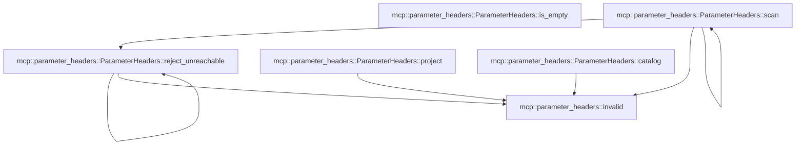

# mcp::parameter_headers

[Package atlas](index.md) · [Source](../../src/parameter_headers.rs)

## Declarations

Visibility is the declaration spelling; trait members and reexports require their enclosing interface. `cfg` is not evaluated.

| Symbol | Kind | Visibility | Test / cfg |
|---|---|---|---|
| [mcp::parameter_headers::Field](../../src/parameter_headers.rs#L7) | struct_item | `private` |  |
| [mcp::parameter_headers::ParameterHeaders](../../src/parameter_headers.rs#L13) | struct_item | `pub(crate)` |  |
| [mcp::parameter_headers::invalid](../../src/parameter_headers.rs#L15) | function_item | `private` |  |
| [mcp::parameter_headers::ParameterHeaders::catalog](../../src/parameter_headers.rs#L20) | function_item | `pub(crate)` |  |
| [mcp::parameter_headers::ParameterHeaders::scan](../../src/parameter_headers.rs#L31) | function_item | `private` |  |
| [mcp::parameter_headers::ParameterHeaders::reject_unreachable](../../src/parameter_headers.rs#L105) | function_item | `private` |  |
| [mcp::parameter_headers::ParameterHeaders::is_empty](../../src/parameter_headers.rs#L127) | function_item | `pub(crate)` |  |
| [mcp::parameter_headers::ParameterHeaders::project](../../src/parameter_headers.rs#L130) | function_item | `pub(crate)` |  |
| [mcp::parameter_headers::tests::compile](../../src/parameter_headers.rs#L178) | function_item | `private` | test; #[cfg(test)] |
| [mcp::parameter_headers::tests::schema_rejects_ambiguous_or_unreachable_headers](../../src/parameter_headers.rs#L184) | function_item | `private` | test; #[cfg(test)] |
| [mcp::parameter_headers::tests::header_values_preserve_types_and_encode_unsafe_text](../../src/parameter_headers.rs#L196) | function_item | `private` | test; #[cfg(test)] |

## Imports / reexports

| Local name | Source path | Visibility |
|---|---|---|
| `McpError` | `crate::McpError` | `private` |
| `McpTool` | `crate::McpTool` | `private` |
| `_` | `base64::Engine` | `private` |
| `Value` | `serde_json::Value` | `private` |
| `BTreeMap` | `std::collections::BTreeMap` | `private` |
| `BTreeSet` | `std::collections::BTreeSet` | `private` |
| `*` | `super::*` | `private` |
| `json` | `serde_json::json` | `private` |

## Module declarations

| Module | Visibility | Attributes |
|---|---|---|
| `mcp::parameter_headers::tests` | `private` | #[cfg(test)] |

## Function call graphs

Edges below are syntactically resolved calls only, including private functions. Graphs partition callers into groups of 20; they are not execution order. All unresolved sites are listed below and in the JSON inventory.

Functions 1–6: 7 direct edges

## Call sites

Includes test functions (marked in declarations). Receiver-type-required sites need type analysis/manual tracing. Calls in closures are attributed to their enclosing function; their occurrence here does not mean the closure executes immediately.

| Caller | Callee expression | Source lines | Target / classification |
|---|---|---|---|
| `invalid` | `McpError::Protocol` | [16](../../src/parameter_headers.rs#L16) | external-constructor-callback-or-unresolved |
| `invalid` | `"invalid MCP parameter header schema or argument".into` | [16](../../src/parameter_headers.rs#L16) | receiver-type-required |
| `catalog` | `tools             .iter()             .map(&#124;tool&#124; {                 let schema = serde_json::to_value(&tool.input_schema).map_err(&#124;_&#124; invalid())?;                 let mut projection = Self::default();                 projection.scan(&schema, Some(Vec::new()), &mut BTreeSet::new(), 0)?;                 Ok((tool.name.clone(), projection))             })             .collect` | [21](../../src/parameter_headers.rs#L21) | receiver-type-required |
| `catalog` | `tools             .iter()             .map` | [21](../../src/parameter_headers.rs#L21) | receiver-type-required |
| `catalog` | `tools             .iter` | [21](../../src/parameter_headers.rs#L21) | receiver-type-required |
| `catalog` | `serde_json::to_value(&tool.input_schema).map_err` | [24](../../src/parameter_headers.rs#L24) | receiver-type-required |
| `catalog` | `serde_json::to_value` | [24](../../src/parameter_headers.rs#L24) | external-constructor-callback-or-unresolved |
| `catalog` | `invalid` | [24](../../src/parameter_headers.rs#L24) | [mcp::parameter_headers::invalid](../../src/parameter_headers.rs#L15) |
| `catalog` | `Self::default` | [25](../../src/parameter_headers.rs#L25) | external-constructor-callback-or-unresolved |
| `catalog` | `projection.scan` | [26](../../src/parameter_headers.rs#L26) | receiver-type-required |
| `catalog` | `Some` | [26](../../src/parameter_headers.rs#L26) | external-constructor-callback-or-unresolved |
| `catalog` | `Vec::new` | [26](../../src/parameter_headers.rs#L26) | external-constructor-callback-or-unresolved |
| `catalog` | `BTreeSet::new` | [26](../../src/parameter_headers.rs#L26) | external-constructor-callback-or-unresolved |
| `catalog` | `Ok` | [27](../../src/parameter_headers.rs#L27) | external-constructor-callback-or-unresolved |
| `catalog` | `tool.name.clone` | [27](../../src/parameter_headers.rs#L27) | receiver-type-required |
| `scan` | `Err` | [39](../../src/parameter_headers.rs#L39), [58](../../src/parameter_headers.rs#L58) | external-constructor-callback-or-unresolved |
| `scan` | `invalid` | [39](../../src/parameter_headers.rs#L39), [58](../../src/parameter_headers.rs#L58) | [mcp::parameter_headers::invalid](../../src/parameter_headers.rs#L15) |
| `scan` | `node.as_object` | [41](../../src/parameter_headers.rs#L41) | receiver-type-required |
| `scan` | `Ok` | [42](../../src/parameter_headers.rs#L42), [103](../../src/parameter_headers.rs#L103) | external-constructor-callback-or-unresolved |
| `scan` | `object.get` | [44](../../src/parameter_headers.rs#L44), [71](../../src/parameter_headers.rs#L71), [99](../../src/parameter_headers.rs#L99) | receiver-type-required |
| `scan` | `path                 .as_ref()                 .filter(&#124;p&#124; !p.is_empty())                 .ok_or_else` | [45](../../src/parameter_headers.rs#L45) | receiver-type-required |
| `scan` | `path                 .as_ref()                 .filter` | [45](../../src/parameter_headers.rs#L45) | receiver-type-required |
| `scan` | `path                 .as_ref` | [45](../../src/parameter_headers.rs#L45) | receiver-type-required |
| `scan` | `p.is_empty` | [47](../../src/parameter_headers.rs#L47) | receiver-type-required |
| `scan` | `annotation                 .as_str()                 .filter(&#124;s&#124; {                     !s.is_empty()                         && s.bytes()                             .all(&#124;b&#124; b.is_ascii_alphanumeric() &#124;&#124; b"!#$%&'*+-.^_'&#124;~".contains(&b))                 })                 .ok_or_else` | [49](../../src/parameter_headers.rs#L49) | receiver-type-required |
| `scan` | `annotation                 .as_str()                 .filter` | [49](../../src/parameter_headers.rs#L49) | receiver-type-required |
| `scan` | `annotation                 .as_str` | [49](../../src/parameter_headers.rs#L49) | receiver-type-required |
| `scan` | `s.is_empty` | [52](../../src/parameter_headers.rs#L52) | receiver-type-required |
| `scan` | `s.bytes()                             .all` | [53](../../src/parameter_headers.rs#L53) | receiver-type-required |
| `scan` | `s.bytes` | [53](../../src/parameter_headers.rs#L53) | receiver-type-required |
| `scan` | `b.is_ascii_alphanumeric` | [54](../../src/parameter_headers.rs#L54) | receiver-type-required |
| `scan` | `b"!#$%&'*+-.^_'&#124;~".contains` | [54](../../src/parameter_headers.rs#L54) | receiver-type-required |
| `scan` | `names.insert` | [57](../../src/parameter_headers.rs#L57) | receiver-type-required |
| `scan` | `name.to_ascii_lowercase` | [57](../../src/parameter_headers.rs#L57) | receiver-type-required |
| `scan` | `object                 .get("type")                 .and_then(Value::as_str)                 .filter(&#124;t&#124; matches!(*t, "string" &#124; "integer" &#124; "boolean"))                 .ok_or_else` | [60](../../src/parameter_headers.rs#L60) | receiver-type-required |
| `scan` | `object                 .get("type")                 .and_then(Value::as_str)                 .filter` | [60](../../src/parameter_headers.rs#L60) | receiver-type-required |
| `scan` | `object                 .get("type")                 .and_then` | [60](../../src/parameter_headers.rs#L60) | receiver-type-required |
| `scan` | `object                 .get` | [60](../../src/parameter_headers.rs#L60) | receiver-type-required |
| `scan` | `self.0.push` | [65](../../src/parameter_headers.rs#L65) | receiver-type-required |
| `scan` | `path.clone` | [66](../../src/parameter_headers.rs#L66), [73](../../src/parameter_headers.rs#L73) | receiver-type-required |
| `scan` | `kind.into` | [68](../../src/parameter_headers.rs#L68) | receiver-type-required |
| `scan` | `object.get("properties").and_then` | [71](../../src/parameter_headers.rs#L71) | receiver-type-required |
| `scan` | `path.clone().map` | [73](../../src/parameter_headers.rs#L73) | receiver-type-required |
| `scan` | `p.push` | [74](../../src/parameter_headers.rs#L74) | receiver-type-required |
| `scan` | `key.clone` | [74](../../src/parameter_headers.rs#L74) | receiver-type-required |
| `scan` | `self.scan` | [77](../../src/parameter_headers.rs#L77) | [mcp::parameter_headers::ParameterHeaders::scan](../../src/parameter_headers.rs#L31) |
| `scan` | `Self::reject_unreachable` | [100](../../src/parameter_headers.rs#L100) | [mcp::parameter_headers::ParameterHeaders::reject_unreachable](../../src/parameter_headers.rs#L105) |
| `reject_unreachable` | `Err` | [107](../../src/parameter_headers.rs#L107), [112](../../src/parameter_headers.rs#L112) | external-constructor-callback-or-unresolved |
| `reject_unreachable` | `invalid` | [107](../../src/parameter_headers.rs#L107), [112](../../src/parameter_headers.rs#L112) | [mcp::parameter_headers::invalid](../../src/parameter_headers.rs#L15) |
| `reject_unreachable` | `object.contains_key` | [111](../../src/parameter_headers.rs#L111) | receiver-type-required |
| `reject_unreachable` | `object.values` | [114](../../src/parameter_headers.rs#L114) | receiver-type-required |
| `reject_unreachable` | `Self::reject_unreachable` | [115](../../src/parameter_headers.rs#L115), [120](../../src/parameter_headers.rs#L120) | [mcp::parameter_headers::ParameterHeaders::reject_unreachable](../../src/parameter_headers.rs#L105) |
| `reject_unreachable` | `Ok` | [125](../../src/parameter_headers.rs#L125) | external-constructor-callback-or-unresolved |
| `is_empty` | `self.0.is_empty` | [128](../../src/parameter_headers.rs#L128) | receiver-type-required |
| `project` | `self.0             .iter()             .filter_map(&#124;field&#124; {                 let value = field                     .path                     .iter()                     .try_fold(arguments, &#124;value, key&#124; value.get(key));                 let value = match value {                     Some(value) if !value.is_null() => value,                     _ => return None,                 };                 Some((&#124;&#124; {                     let text = match field.kind.as_str() {                         "string" => value.as_str().ok_or_else(invalid)?.to_owned(),                         "boolean" => value.as_bool().ok_or_else(invalid)?.to_string(),                         "integer" => {                             let number = value.as_f64().ok_or_else(invalid)?;                             if number.fract() != 0.0 &#124;&#124; number.abs() > 9_007_199_254_740_991.0 {                                 return Err(invalid());                             }                             (number as i64).to_string()                         }                         _ => return Err(invalid()),                     };                     let encoded = if !text.is_empty()                         && text.bytes().all(&#124;b&#124; (0x20..=0x7e).contains(&b))                         && text.trim() == text                         && !(text.starts_with("=?base64?") && text.ends_with("?="))                     {                         text                     } else {                         format!(                             "=?base64?{}?=",                             base64::engine::general_purpose::STANDARD.encode(text)                         )                     };                     Ok((field.name.clone(), encoded))                 })())             })             .collect` | [131](../../src/parameter_headers.rs#L131) | receiver-type-required |
| `project` | `self.0             .iter()             .filter_map` | [131](../../src/parameter_headers.rs#L131) | receiver-type-required |
| `project` | `self.0             .iter` | [131](../../src/parameter_headers.rs#L131) | receiver-type-required |
| `project` | `field                     .path                     .iter()                     .try_fold` | [134](../../src/parameter_headers.rs#L134) | receiver-type-required |
| `project` | `field                     .path                     .iter` | [134](../../src/parameter_headers.rs#L134) | receiver-type-required |
| `project` | `value.get` | [137](../../src/parameter_headers.rs#L137) | receiver-type-required |
| `project` | `value.is_null` | [139](../../src/parameter_headers.rs#L139) | receiver-type-required |
| `project` | `Some` | [142](../../src/parameter_headers.rs#L142) | external-constructor-callback-or-unresolved |
| `project` | `(&#124;&#124; {                     let text = match field.kind.as_str() {                         "string" => value.as_str().ok_or_else(invalid)?.to_owned(),                         "boolean" => value.as_bool().ok_or_else(invalid)?.to_string(),                         "integer" => {                             let number = value.as_f64().ok_or_else(invalid)?;                             if number.fract() != 0.0 &#124;&#124; number.abs() > 9_007_199_254_740_991.0 {                                 return Err(invalid());                             }                             (number as i64).to_string()                         }                         _ => return Err(invalid()),                     };                     let encoded = if !text.is_empty()                         && text.bytes().all(&#124;b&#124; (0x20..=0x7e).contains(&b))                         && text.trim() == text                         && !(text.starts_with("=?base64?") && text.ends_with("?="))                     {                         text                     } else {                         format!(                             "=?base64?{}?=",                             base64::engine::general_purpose::STANDARD.encode(text)                         )                     };                     Ok((field.name.clone(), encoded))                 })` | [142](../../src/parameter_headers.rs#L142) | external-constructor-callback-or-unresolved |
| `project` | `field.kind.as_str` | [143](../../src/parameter_headers.rs#L143) | receiver-type-required |
| `project` | `value.as_str().ok_or_else(invalid)?.to_owned` | [144](../../src/parameter_headers.rs#L144) | receiver-type-required |
| `project` | `value.as_str().ok_or_else` | [144](../../src/parameter_headers.rs#L144) | receiver-type-required |
| `project` | `value.as_str` | [144](../../src/parameter_headers.rs#L144) | receiver-type-required |
| `project` | `value.as_bool().ok_or_else(invalid)?.to_string` | [145](../../src/parameter_headers.rs#L145) | receiver-type-required |
| `project` | `value.as_bool().ok_or_else` | [145](../../src/parameter_headers.rs#L145) | receiver-type-required |
| `project` | `value.as_bool` | [145](../../src/parameter_headers.rs#L145) | receiver-type-required |
| `project` | `value.as_f64().ok_or_else` | [147](../../src/parameter_headers.rs#L147) | receiver-type-required |
| `project` | `value.as_f64` | [147](../../src/parameter_headers.rs#L147) | receiver-type-required |
| `project` | `number.fract` | [148](../../src/parameter_headers.rs#L148) | receiver-type-required |
| `project` | `number.abs` | [148](../../src/parameter_headers.rs#L148) | receiver-type-required |
| `project` | `Err` | [149](../../src/parameter_headers.rs#L149), [153](../../src/parameter_headers.rs#L153) | external-constructor-callback-or-unresolved |
| `project` | `invalid` | [149](../../src/parameter_headers.rs#L149), [153](../../src/parameter_headers.rs#L153) | [mcp::parameter_headers::invalid](../../src/parameter_headers.rs#L15) |
| `project` | `(number as i64).to_string` | [151](../../src/parameter_headers.rs#L151) | receiver-type-required |
| `project` | `text.is_empty` | [155](../../src/parameter_headers.rs#L155) | receiver-type-required |
| `project` | `text.bytes().all` | [156](../../src/parameter_headers.rs#L156) | receiver-type-required |
| `project` | `text.bytes` | [156](../../src/parameter_headers.rs#L156) | receiver-type-required |
| `project` | `(0x20..=0x7e).contains` | [156](../../src/parameter_headers.rs#L156) | receiver-type-required |
| `project` | `text.trim` | [157](../../src/parameter_headers.rs#L157) | receiver-type-required |
| `project` | `text.starts_with` | [158](../../src/parameter_headers.rs#L158) | receiver-type-required |
| `project` | `text.ends_with` | [158](../../src/parameter_headers.rs#L158) | receiver-type-required |
| `project` | `Ok` | [167](../../src/parameter_headers.rs#L167) | external-constructor-callback-or-unresolved |
| `project` | `field.name.clone` | [167](../../src/parameter_headers.rs#L167) | receiver-type-required |
| `compile` | `ParameterHeaders::default` | [179](../../src/parameter_headers.rs#L179) | external-constructor-callback-or-unresolved |
| `compile` | `projection.scan` | [180](../../src/parameter_headers.rs#L180) | receiver-type-required |
| `compile` | `Some` | [180](../../src/parameter_headers.rs#L180) | external-constructor-callback-or-unresolved |
| `compile` | `Vec::new` | [180](../../src/parameter_headers.rs#L180) | external-constructor-callback-or-unresolved |
| `compile` | `BTreeSet::new` | [180](../../src/parameter_headers.rs#L180) | external-constructor-callback-or-unresolved |
| `compile` | `Ok` | [181](../../src/parameter_headers.rs#L181) | external-constructor-callback-or-unresolved |
| `header_values_preserve_types_and_encode_unsafe_text` | `compile(json!({"properties":{"nested":{"properties":{             "s":{"type":"string","x-mcp-header":"s"},             "n":{"type":"integer","x-mcp-header":"n"},             "b":{"type":"boolean","x-mcp-header":"b"}         }}}}))         .unwrap` | [197](../../src/parameter_headers.rs#L197) | receiver-type-required |
| `header_values_preserve_types_and_encode_unsafe_text` | `compile` | [197](../../src/parameter_headers.rs#L197) | [mcp::parameter_headers::tests::compile](../../src/parameter_headers.rs#L178) |
| `header_values_preserve_types_and_encode_unsafe_text` | `p             .project(&json!({"nested":{"s":"\r\n","n":7,"b":false}}))             .unwrap()             .into_iter()             .collect` | [203](../../src/parameter_headers.rs#L203) | receiver-type-required |
| `header_values_preserve_types_and_encode_unsafe_text` | `p             .project(&json!({"nested":{"s":"\r\n","n":7,"b":false}}))             .unwrap()             .into_iter` | [203](../../src/parameter_headers.rs#L203) | receiver-type-required |
| `header_values_preserve_types_and_encode_unsafe_text` | `p             .project(&json!({"nested":{"s":"\r\n","n":7,"b":false}}))             .unwrap` | [203](../../src/parameter_headers.rs#L203) | receiver-type-required |
| `header_values_preserve_types_and_encode_unsafe_text` | `p             .project` | [203](../../src/parameter_headers.rs#L203) | receiver-type-required |
