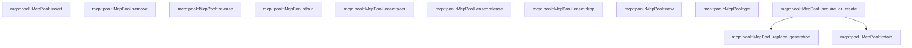

# mcp::pool

[Package atlas](index.md) · [Source](../../src/pool.rs)

## Declarations

Visibility is the declaration spelling; trait members and reexports require their enclosing interface. `cfg` is not evaluated.

| Symbol | Kind | Visibility | Test / cfg |
|---|---|---|---|
| [mcp::pool::McpPoolKey](../../src/pool.rs#L10) | struct_item | `pub` |  |
| [mcp::pool::PooledPeer](../../src/pool.rs#L20) | type_item | `pub` |  |
| [mcp::pool::PoolEntry](../../src/pool.rs#L22) | struct_item | `private` |  |
| [mcp::pool::McpPool](../../src/pool.rs#L29) | struct_item | `pub` |  |
| [mcp::pool::CreationSlot](../../src/pool.rs#L34) | struct_item | `private` |  |
| [mcp::pool::McpPoolLease](../../src/pool.rs#L39) | struct_item | `pub` |  |
| [mcp::pool::McpPoolLease::peer](../../src/pool.rs#L48) | function_item | `pub` |  |
| [mcp::pool::McpPoolLease::release](../../src/pool.rs#L52) | function_item | `pub` |  |
| [mcp::pool::McpPoolLease::drop](../../src/pool.rs#L59) | function_item | `private` |  |
| [mcp::pool::McpPool::new](../../src/pool.rs#L75) | function_item | `pub` |  |
| [mcp::pool::McpPool::get](../../src/pool.rs#L79) | function_item | `pub` |  |
| [mcp::pool::McpPool::retain](../../src/pool.rs#L87) | function_item | `private` |  |
| [mcp::pool::McpPool::acquire_or_create](../../src/pool.rs#L94) | function_item | `pub` |  |
| [mcp::pool::McpPool::insert](../../src/pool.rs#L173) | function_item | `pub` |  |
| [mcp::pool::McpPool::replace_generation](../../src/pool.rs#L203) | function_item | `pub` |  |
| [mcp::pool::McpPool::remove](../../src/pool.rs#L263) | function_item | `pub` |  |
| [mcp::pool::McpPool::release](../../src/pool.rs#L274) | function_item | `pub` |  |
| [mcp::pool::McpPool::drain](../../src/pool.rs#L293) | function_item | `pub` |  |
| [mcp::pool::McpPoolError](../../src/pool.rs#L309) | enum_item | `pub` |  |

## Imports / reexports

| Local name | Source path | Visibility |
|---|---|---|
| `BTreeMap` | `std::collections::BTreeMap` | `private` |
| `Future` | `std::future::Future` | `private` |
| `Arc` | `std::sync::Arc` | `private` |
| `Mutex` | `tokio::sync::Mutex` | `private` |
| `Notify` | `tokio::sync::Notify` | `private` |
| `RwLock` | `tokio::sync::RwLock` | `private` |
| `McpError` | `crate::McpError` | `private` |
| `McpPeer` | `crate::McpPeer` | `private` |

## Module declarations

| Module | Visibility | Attributes |
|---|---|---|

## Function call graphs

Edges below are syntactically resolved calls only, including private functions. Graphs partition callers into groups of 20; they are not execution order. All unresolved sites are listed below and in the JSON inventory.

Functions 1–12: 2 direct edges

## Call sites

Includes test functions (marked in declarations). Receiver-type-required sites need type analysis/manual tracing. Calls in closures are attributed to their enclosing function; their occurrence here does not mean the closure executes immediately.

| Caller | Callee expression | Source lines | Target / classification |
|---|---|---|---|
| `peer` | `Arc::clone` | [49](../../src/pool.rs#L49) | external-constructor-callback-or-unresolved |
| `release` | `self.pool.release` | [54](../../src/pool.rs#L54) | receiver-type-required |
| `drop` | `Arc::clone` | [63](../../src/pool.rs#L63) | external-constructor-callback-or-unresolved |
| `drop` | `self.key.clone` | [64](../../src/pool.rs#L64) | receiver-type-required |
| `drop` | `tokio::runtime::Handle::try_current` | [65](../../src/pool.rs#L65) | external-constructor-callback-or-unresolved |
| `drop` | `runtime.spawn` | [66](../../src/pool.rs#L66) | receiver-type-required |
| `drop` | `pool.release` | [67](../../src/pool.rs#L67) | receiver-type-required |
| `new` | `Self::default` | [76](../../src/pool.rs#L76) | external-constructor-callback-or-unresolved |
| `get` | `self.peers             .read()             .await             .get(key)             .map` | [80](../../src/pool.rs#L80) | receiver-type-required |
| `get` | `self.peers             .read()             .await             .get` | [80](../../src/pool.rs#L80) | receiver-type-required |
| `get` | `self.peers             .read` | [80](../../src/pool.rs#L80) | receiver-type-required |
| `get` | `Arc::clone` | [84](../../src/pool.rs#L84) | external-constructor-callback-or-unresolved |
| `retain` | `self.peers.write` | [88](../../src/pool.rs#L88) | receiver-type-required |
| `retain` | `peers.get_mut` | [89](../../src/pool.rs#L89) | receiver-type-required |
| `retain` | `entry.clients.saturating_add` | [90](../../src/pool.rs#L90) | receiver-type-required |
| `retain` | `Some` | [91](../../src/pool.rs#L91) | external-constructor-callback-or-unresolved |
| `retain` | `Arc::clone` | [91](../../src/pool.rs#L91) | external-constructor-callback-or-unresolved |
| `acquire_or_create` | `self.retain` | [104](../../src/pool.rs#L104), [154](../../src/pool.rs#L154) | [mcp::pool::McpPool::retain](../../src/pool.rs#L87) |
| `acquire_or_create` | `Ok` | [105](../../src/pool.rs#L105), [134](../../src/pool.rs#L134), [140](../../src/pool.rs#L140), [159](../../src/pool.rs#L159) | external-constructor-callback-or-unresolved |
| `acquire_or_create` | `Arc::clone` | [106](../../src/pool.rs#L106), [115](../../src/pool.rs#L115), [121](../../src/pool.rs#L121), [134](../../src/pool.rs#L134), [141](../../src/pool.rs#L141), [160](../../src/pool.rs#L160) | external-constructor-callback-or-unresolved |
| `acquire_or_create` | `self.creations.lock` | [113](../../src/pool.rs#L113), [138](../../src/pool.rs#L138) | receiver-type-required |
| `acquire_or_create` | `creations.get` | [114](../../src/pool.rs#L114) | receiver-type-required |
| `acquire_or_create` | `Arc::new` | [117](../../src/pool.rs#L117) | external-constructor-callback-or-unresolved |
| `acquire_or_create` | `Mutex::new` | [118](../../src/pool.rs#L118) | external-constructor-callback-or-unresolved |
| `acquire_or_create` | `Notify::new` | [119](../../src/pool.rs#L119) | external-constructor-callback-or-unresolved |
| `acquire_or_create` | `creations.insert` | [121](../../src/pool.rs#L121) | receiver-type-required |
| `acquire_or_create` | `key.clone` | [121](../../src/pool.rs#L121), [128](../../src/pool.rs#L128) | receiver-type-required |
| `acquire_or_create` | `factory` | [126](../../src/pool.rs#L126) | external-constructor-callback-or-unresolved |
| `acquire_or_create` | `self                     .replace_generation(key.clone(), peer, always_on)                     .await                     .map_err` | [127](../../src/pool.rs#L127) | receiver-type-required |
| `acquire_or_create` | `self                     .replace_generation` | [127](../../src/pool.rs#L127) | [mcp::pool::McpPool::replace_generation](../../src/pool.rs#L203) |
| `acquire_or_create` | `McpError::Transport` | [130](../../src/pool.rs#L130), [155](../../src/pool.rs#L155) | external-constructor-callback-or-unresolved |
| `acquire_or_create` | `error.to_string` | [130](../../src/pool.rs#L130) | receiver-type-required |
| `acquire_or_create` | `Err` | [131](../../src/pool.rs#L131), [135](../../src/pool.rs#L135), [166](../../src/pool.rs#L166) | external-constructor-callback-or-unresolved |
| `acquire_or_create` | `slot.outcome.lock` | [133](../../src/pool.rs#L133), [151](../../src/pool.rs#L151) | receiver-type-required |
| `acquire_or_create` | `Some` | [133](../../src/pool.rs#L133) | external-constructor-callback-or-unresolved |
| `acquire_or_create` | `error.clone` | [135](../../src/pool.rs#L135), [166](../../src/pool.rs#L166) | receiver-type-required |
| `acquire_or_create` | `slot.ready.notify_waiters` | [137](../../src/pool.rs#L137) | receiver-type-required |
| `acquire_or_create` | `self.creations.lock().await.remove` | [138](../../src/pool.rs#L138) | receiver-type-required |
| `acquire_or_create` | `slot.ready.notified` | [148](../../src/pool.rs#L148) | receiver-type-required |
| `acquire_or_create` | `notified.as_mut().enable` | [150](../../src/pool.rs#L150) | receiver-type-required |
| `acquire_or_create` | `notified.as_mut` | [150](../../src/pool.rs#L150) | receiver-type-required |
| `acquire_or_create` | `slot.outcome.lock().await.as_ref` | [151](../../src/pool.rs#L151) | receiver-type-required |
| `acquire_or_create` | `self.retain(&key).await.ok_or_else` | [154](../../src/pool.rs#L154) | receiver-type-required |
| `acquire_or_create` | `"MCP peer disappeared after single-flight creation".to_owned` | [156](../../src/pool.rs#L156) | receiver-type-required |
| `insert` | `self.peers.write` | [178](../../src/pool.rs#L178) | receiver-type-required |
| `insert` | `peers.get_mut` | [179](../../src/pool.rs#L179) | receiver-type-required |
| `insert` | `existing.clients.saturating_add` | [180](../../src/pool.rs#L180) | receiver-type-required |
| `insert` | `Arc::clone` | [181](../../src/pool.rs#L181), [192](../../src/pool.rs#L192) | external-constructor-callback-or-unresolved |
| `insert` | `drop` | [182](../../src/pool.rs#L182) | external-constructor-callback-or-unresolved |
| `insert` | `peer.close()                 .await                 .map_err` | [183](../../src/pool.rs#L183) | receiver-type-required |
| `insert` | `peer.close` | [183](../../src/pool.rs#L183) | receiver-type-required |
| `insert` | `McpPoolError::Close` | [185](../../src/pool.rs#L185) | external-constructor-callback-or-unresolved |
| `insert` | `error.to_string` | [185](../../src/pool.rs#L185) | receiver-type-required |
| `insert` | `Ok` | [186](../../src/pool.rs#L186), [197](../../src/pool.rs#L197) | external-constructor-callback-or-unresolved |
| `insert` | `Arc::new` | [188](../../src/pool.rs#L188) | external-constructor-callback-or-unresolved |
| `insert` | `Mutex::new` | [188](../../src/pool.rs#L188) | external-constructor-callback-or-unresolved |
| `insert` | `peers.insert` | [189](../../src/pool.rs#L189) | receiver-type-required |
| `replace_generation` | `self.peers.write` | [209](../../src/pool.rs#L209) | receiver-type-required |
| `replace_generation` | `peers             .keys()             .filter(&#124;existing&#124; {                 existing.workspace == key.workspace                     && existing.scope == key.scope                     && existing.server == key.server                     && *existing != &key             })             .cloned()             .collect::<Vec<_>>` | [210](../../src/pool.rs#L210) | receiver-type-required |
| `replace_generation` | `peers             .keys()             .filter(&#124;existing&#124; {                 existing.workspace == key.workspace                     && existing.scope == key.scope                     && existing.server == key.server                     && *existing != &key             })             .cloned` | [210](../../src/pool.rs#L210) | receiver-type-required |
| `replace_generation` | `peers             .keys()             .filter` | [210](../../src/pool.rs#L210) | receiver-type-required |
| `replace_generation` | `peers             .keys` | [210](../../src/pool.rs#L210) | receiver-type-required |
| `replace_generation` | `stale_keys             .iter()             .filter_map(&#124;stale&#124; peers.remove(stale))             .collect::<Vec<_>>` | [220](../../src/pool.rs#L220) | receiver-type-required |
| `replace_generation` | `stale_keys             .iter()             .filter_map` | [220](../../src/pool.rs#L220) | receiver-type-required |
| `replace_generation` | `stale_keys             .iter` | [220](../../src/pool.rs#L220) | receiver-type-required |
| `replace_generation` | `peers.remove` | [222](../../src/pool.rs#L222) | receiver-type-required |
| `replace_generation` | `peers.get_mut` | [224](../../src/pool.rs#L224) | receiver-type-required |
| `replace_generation` | `existing.clients.saturating_add` | [225](../../src/pool.rs#L225) | receiver-type-required |
| `replace_generation` | `Arc::clone` | [227](../../src/pool.rs#L227), [246](../../src/pool.rs#L246) | external-constructor-callback-or-unresolved |
| `replace_generation` | `drop` | [228](../../src/pool.rs#L228), [251](../../src/pool.rs#L251) | external-constructor-callback-or-unresolved |
| `replace_generation` | `old.peer                     .lock()                     .await                     .close()                     .await                     .map_err` | [230](../../src/pool.rs#L230) | receiver-type-required |
| `replace_generation` | `old.peer                     .lock()                     .await                     .close` | [230](../../src/pool.rs#L230) | receiver-type-required |
| `replace_generation` | `old.peer                     .lock` | [230](../../src/pool.rs#L230) | receiver-type-required |
| `replace_generation` | `McpPoolError::Close` | [235](../../src/pool.rs#L235), [239](../../src/pool.rs#L239), [258](../../src/pool.rs#L258) | external-constructor-callback-or-unresolved |
| `replace_generation` | `error.to_string` | [235](../../src/pool.rs#L235), [239](../../src/pool.rs#L239), [258](../../src/pool.rs#L258) | receiver-type-required |
| `replace_generation` | `peer.close()                 .await                 .map_err` | [237](../../src/pool.rs#L237) | receiver-type-required |
| `replace_generation` | `peer.close` | [237](../../src/pool.rs#L237) | receiver-type-required |
| `replace_generation` | `Ok` | [240](../../src/pool.rs#L240), [260](../../src/pool.rs#L260) | external-constructor-callback-or-unresolved |
| `replace_generation` | `Arc::new` | [242](../../src/pool.rs#L242) | external-constructor-callback-or-unresolved |
| `replace_generation` | `Mutex::new` | [242](../../src/pool.rs#L242) | external-constructor-callback-or-unresolved |
| `replace_generation` | `peers.insert` | [243](../../src/pool.rs#L243) | receiver-type-required |
| `replace_generation` | `old.peer                 .lock()                 .await                 .close()                 .await                 .map_err` | [253](../../src/pool.rs#L253) | receiver-type-required |
| `replace_generation` | `old.peer                 .lock()                 .await                 .close` | [253](../../src/pool.rs#L253) | receiver-type-required |
| `replace_generation` | `old.peer                 .lock` | [253](../../src/pool.rs#L253) | receiver-type-required |
| `remove` | `self.peers.write().await.remove` | [264](../../src/pool.rs#L264) | receiver-type-required |
| `remove` | `self.peers.write` | [264](../../src/pool.rs#L264) | receiver-type-required |
| `remove` | `Ok` | [266](../../src/pool.rs#L266), [269](../../src/pool.rs#L269) | external-constructor-callback-or-unresolved |
| `remove` | `entry.peer.lock().await.close` | [268](../../src/pool.rs#L268) | receiver-type-required |
| `remove` | `entry.peer.lock` | [268](../../src/pool.rs#L268) | receiver-type-required |
| `release` | `self.peers.write` | [276](../../src/pool.rs#L276) | receiver-type-required |
| `release` | `peers.get_mut` | [277](../../src/pool.rs#L277) | receiver-type-required |
| `release` | `Ok` | [278](../../src/pool.rs#L278), [282](../../src/pool.rs#L282), [288](../../src/pool.rs#L288), [290](../../src/pool.rs#L290) | external-constructor-callback-or-unresolved |
| `release` | `entry.clients.saturating_sub` | [280](../../src/pool.rs#L280) | receiver-type-required |
| `release` | `peers.remove(key).map` | [284](../../src/pool.rs#L284) | receiver-type-required |
| `release` | `peers.remove` | [284](../../src/pool.rs#L284) | receiver-type-required |
| `release` | `peer.lock().await.close` | [287](../../src/pool.rs#L287) | receiver-type-required |
| `release` | `peer.lock` | [287](../../src/pool.rs#L287) | receiver-type-required |
| `drain` | `self.peers.write` | [295](../../src/pool.rs#L295) | receiver-type-required |
| `drain` | `std::mem::take(&mut *peers)                 .into_values()                 .collect::<Vec<_>>` | [296](../../src/pool.rs#L296) | receiver-type-required |
| `drain` | `std::mem::take(&mut *peers)                 .into_values` | [296](../../src/pool.rs#L296) | receiver-type-required |
| `drain` | `std::mem::take` | [296](../../src/pool.rs#L296) | external-constructor-callback-or-unresolved |
| `drain` | `entries.len` | [300](../../src/pool.rs#L300) | receiver-type-required |
| `drain` | `entry.peer.lock().await.close` | [302](../../src/pool.rs#L302) | receiver-type-required |
| `drain` | `entry.peer.lock` | [302](../../src/pool.rs#L302) | receiver-type-required |
| `drain` | `Ok` | [304](../../src/pool.rs#L304) | external-constructor-callback-or-unresolved |
