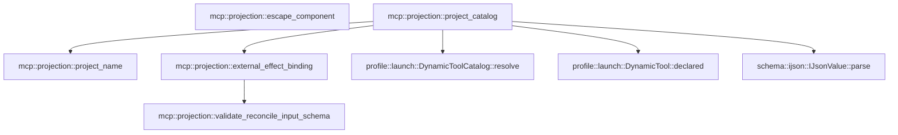

# mcp::projection

[Package atlas](index.md) · [Source](../../src/projection.rs)

## Declarations

Visibility is the declaration spelling; trait members and reexports require their enclosing interface. `cfg` is not evaluated.

| Symbol | Kind | Visibility | Test / cfg |
|---|---|---|---|
| [mcp::projection::project_name](../../src/projection.rs#L14) | function_item | `pub` |  |
| [mcp::projection::project_catalog](../../src/projection.rs#L25) | function_item | `pub` |  |
| [mcp::projection::EXTERNAL_EFFECT_METADATA_KEY](../../src/projection.rs#L75) | const_item | `private` |  |
| [mcp::projection::ExternalEffectMetadata](../../src/projection.rs#L79) | struct_item | `private` |  |
| [mcp::projection::external_effect_binding](../../src/projection.rs#L85) | function_item | `private` |  |
| [mcp::projection::validate_reconcile_input_schema](../../src/projection.rs#L130) | function_item | `private` |  |
| [mcp::projection::escape_component](../../src/projection.rs#L161) | function_item | `private` |  |
| [mcp::projection::McpProjectionError](../../src/projection.rs#L175) | enum_item | `pub` |  |

## Imports / reexports

| Local name | Source path | Visibility |
|---|---|---|
| `BTreeSet` | `std::collections::BTreeSet` | `private` |
| `DynamicTool` | `profile::DynamicTool` | `private` |
| `DynamicToolCatalog` | `profile::DynamicToolCatalog` | `private` |
| `DynamicToolEffect` | `profile::DynamicToolEffect` | `private` |
| `DynamicToolSource` | `profile::DynamicToolSource` | `private` |
| `DynamicToolSourceKind` | `profile::DynamicToolSourceKind` | `private` |
| `ExternalEffectBinding` | `profile::ExternalEffectBinding` | `private` |
| `ExternalEffectProtocol` | `profile::ExternalEffectProtocol` | `private` |
| `IJsonValue` | `schema::IJsonValue` | `private` |
| `Deserialize` | `serde::Deserialize` | `private` |
| `json` | `serde_json::json` | `private` |
| `Error` | `thiserror::Error` | `private` |
| `McpTool` | `crate::McpTool` | `private` |

## Module declarations

| Module | Visibility | Attributes |
|---|---|---|

## Function call graphs

Edges below are syntactically resolved calls only, including private functions. Graphs partition callers into groups of 20; they are not execution order. All unresolved sites are listed below and in the JSON inventory.

Functions 1–5: 6 direct edges

## Call sites

Includes test functions (marked in declarations). Receiver-type-required sites need type analysis/manual tracing. Calls in closures are attributed to their enclosing function; their occurrence here does not mean the closure executes immediately.

| Caller | Callee expression | Source lines | Target / classification |
|---|---|---|---|
| `project_name` | `server.is_empty` | [15](../../src/projection.rs#L15) | receiver-type-required |
| `project_name` | `tool.is_empty` | [15](../../src/projection.rs#L15) | receiver-type-required |
| `project_name` | `Err` | [16](../../src/projection.rs#L16) | external-constructor-callback-or-unresolved |
| `project_name` | `Ok` | [18](../../src/projection.rs#L18) | external-constructor-callback-or-unresolved |
| `project_catalog` | `BTreeSet::new` | [30](../../src/projection.rs#L30) | external-constructor-callback-or-unresolved |
| `project_catalog` | `Vec::with_capacity` | [31](../../src/projection.rs#L31) | external-constructor-callback-or-unresolved |
| `project_catalog` | `tools.len` | [31](../../src/projection.rs#L31) | receiver-type-required |
| `project_catalog` | `seen_source.insert` | [33](../../src/projection.rs#L33) | receiver-type-required |
| `project_catalog` | `tool.name.clone` | [33](../../src/projection.rs#L33), [34](../../src/projection.rs#L34) | receiver-type-required |
| `project_catalog` | `Err` | [34](../../src/projection.rs#L34) | external-constructor-callback-or-unresolved |
| `project_catalog` | `McpProjectionError::Duplicate` | [34](../../src/projection.rs#L34) | external-constructor-callback-or-unresolved |
| `project_catalog` | `project_name` | [36](../../src/projection.rs#L36) | [mcp::projection::project_name](../../src/projection.rs#L14) |
| `project_catalog` | `IJsonValue::parse(             &serde_json::to_vec(&json!({                 "name": name,                 "description": tool.description,                 "parameters": serde_json::from_slice::<serde_json::Value>(                     &tool.input_schema.canonical_bytes().map_err(&#124;error&#124; McpProjectionError::Schema(error.to_string()))?                 ).map_err(&#124;error&#124; McpProjectionError::Schema(error.to_string()))?             }))             .map_err(&#124;error&#124; McpProjectionError::Schema(error.to_string()))?,         )         .map_err` | [37](../../src/projection.rs#L37) | receiver-type-required |
| `project_catalog` | `IJsonValue::parse` | [37](../../src/projection.rs#L37) | [schema::ijson::IJsonValue::parse](../../../schema/src/ijson.rs#L16) |
| `project_catalog` | `serde_json::to_vec(&json!({                 "name": name,                 "description": tool.description,                 "parameters": serde_json::from_slice::<serde_json::Value>(                     &tool.input_schema.canonical_bytes().map_err(&#124;error&#124; McpProjectionError::Schema(error.to_string()))?                 ).map_err(&#124;error&#124; McpProjectionError::Schema(error.to_string()))?             }))             .map_err` | [38](../../src/projection.rs#L38) | receiver-type-required |
| `project_catalog` | `serde_json::to_vec` | [38](../../src/projection.rs#L38) | external-constructor-callback-or-unresolved |
| `project_catalog` | `McpProjectionError::Schema` | [45](../../src/projection.rs#L45), [47](../../src/projection.rs#L47), [67](../../src/projection.rs#L67), [72](../../src/projection.rs#L72) | external-constructor-callback-or-unresolved |
| `project_catalog` | `error.to_string` | [45](../../src/projection.rs#L45), [47](../../src/projection.rs#L47), [72](../../src/projection.rs#L72) | receiver-type-required |
| `project_catalog` | `external_effect_binding` | [55](../../src/projection.rs#L55) | [mcp::projection::external_effect_binding](../../src/projection.rs#L85) |
| `project_catalog` | `DynamicTool::declared(             name,             DynamicToolSource {                 kind: DynamicToolSourceKind::Mcp,                 id: server.to_owned(),             },             effect,             always_on,             Vec::new(),             schema,         )         .map_err` | [56](../../src/projection.rs#L56) | receiver-type-required |
| `project_catalog` | `DynamicTool::declared` | [56](../../src/projection.rs#L56) | [profile::launch::DynamicTool::declared](../../../profile/src/launch.rs#L87) |
| `project_catalog` | `server.to_owned` | [60](../../src/projection.rs#L60) | receiver-type-required |
| `project_catalog` | `Vec::new` | [64](../../src/projection.rs#L64) | external-constructor-callback-or-unresolved |
| `project_catalog` | `projected.push` | [69](../../src/projection.rs#L69) | receiver-type-required |
| `project_catalog` | `DynamicToolCatalog::resolve(projected)         .map_err` | [71](../../src/projection.rs#L71) | receiver-type-required |
| `project_catalog` | `DynamicToolCatalog::resolve` | [71](../../src/projection.rs#L71) | [profile::launch::DynamicToolCatalog::resolve](../../../profile/src/launch.rs#L128) |
| `external_effect_binding` | `Ok` | [90](../../src/projection.rs#L90), [99](../../src/projection.rs#L99), [124](../../src/projection.rs#L124) | external-constructor-callback-or-unresolved |
| `external_effect_binding` | `serde_json::from_slice(         &metadata             .canonical_bytes()             .map_err(&#124;error&#124; McpProjectionError::Schema(error.to_string()))?,     )     .map_err` | [92](../../src/projection.rs#L92) | receiver-type-required |
| `external_effect_binding` | `serde_json::from_slice` | [92](../../src/projection.rs#L92) | external-constructor-callback-or-unresolved |
| `external_effect_binding` | `metadata             .canonical_bytes()             .map_err` | [93](../../src/projection.rs#L93) | receiver-type-required |
| `external_effect_binding` | `metadata             .canonical_bytes` | [93](../../src/projection.rs#L93) | receiver-type-required |
| `external_effect_binding` | `McpProjectionError::Schema` | [95](../../src/projection.rs#L95), [97](../../src/projection.rs#L97) | external-constructor-callback-or-unresolved |
| `external_effect_binding` | `error.to_string` | [95](../../src/projection.rs#L95), [97](../../src/projection.rs#L97), [102](../../src/projection.rs#L102) | receiver-type-required |
| `external_effect_binding` | `raw.get` | [98](../../src/projection.rs#L98) | receiver-type-required |
| `external_effect_binding` | `serde_json::from_value(contract.clone())         .map_err` | [101](../../src/projection.rs#L101) | receiver-type-required |
| `external_effect_binding` | `serde_json::from_value` | [101](../../src/projection.rs#L101) | external-constructor-callback-or-unresolved |
| `external_effect_binding` | `contract.clone` | [101](../../src/projection.rs#L101) | receiver-type-required |
| `external_effect_binding` | `McpProjectionError::ExternalEffect` | [102](../../src/projection.rs#L102), [104](../../src/projection.rs#L104), [112](../../src/projection.rs#L112), [118](../../src/projection.rs#L118) | external-constructor-callback-or-unresolved |
| `external_effect_binding` | `contract.reconcile_tool.is_empty` | [103](../../src/projection.rs#L103) | receiver-type-required |
| `external_effect_binding` | `Err` | [104](../../src/projection.rs#L104), [118](../../src/projection.rs#L118) | external-constructor-callback-or-unresolved |
| `external_effect_binding` | `"external-effect version must be 1 and reconcileTool must be nonempty".to_owned` | [105](../../src/projection.rs#L105) | receiver-type-required |
| `external_effect_binding` | `catalog         .iter()         .find(&#124;candidate&#124; candidate.name == contract.reconcile_tool)         .ok_or_else` | [108](../../src/projection.rs#L108) | receiver-type-required |
| `external_effect_binding` | `catalog         .iter()         .find` | [108](../../src/projection.rs#L108) | receiver-type-required |
| `external_effect_binding` | `catalog         .iter` | [108](../../src/projection.rs#L108) | receiver-type-required |
| `external_effect_binding` | `validate_reconcile_input_schema` | [123](../../src/projection.rs#L123) | [mcp::projection::validate_reconcile_input_schema](../../src/projection.rs#L130) |
| `external_effect_binding` | `Some` | [124](../../src/projection.rs#L124) | external-constructor-callback-or-unresolved |
| `validate_reconcile_input_schema` | `serde_json::from_slice(         &tool             .input_schema             .canonical_bytes()             .map_err(&#124;error&#124; McpProjectionError::Schema(error.to_string()))?,     )     .map_err` | [131](../../src/projection.rs#L131) | receiver-type-required |
| `validate_reconcile_input_schema` | `serde_json::from_slice` | [131](../../src/projection.rs#L131) | external-constructor-callback-or-unresolved |
| `validate_reconcile_input_schema` | `tool             .input_schema             .canonical_bytes()             .map_err` | [132](../../src/projection.rs#L132) | receiver-type-required |
| `validate_reconcile_input_schema` | `tool             .input_schema             .canonical_bytes` | [132](../../src/projection.rs#L132) | receiver-type-required |
| `validate_reconcile_input_schema` | `McpProjectionError::Schema` | [135](../../src/projection.rs#L135), [137](../../src/projection.rs#L137) | external-constructor-callback-or-unresolved |
| `validate_reconcile_input_schema` | `error.to_string` | [135](../../src/projection.rs#L135), [137](../../src/projection.rs#L137) | receiver-type-required |
| `validate_reconcile_input_schema` | `schema         .get("properties")         .and_then(&#124;value&#124; value.get("idempotencyKey"))         .and_then(&#124;value&#124; value.get("type"))         .and_then` | [138](../../src/projection.rs#L138) | receiver-type-required |
| `validate_reconcile_input_schema` | `schema         .get("properties")         .and_then(&#124;value&#124; value.get("idempotencyKey"))         .and_then` | [138](../../src/projection.rs#L138) | receiver-type-required |
| `validate_reconcile_input_schema` | `schema         .get("properties")         .and_then` | [138](../../src/projection.rs#L138) | receiver-type-required |
| `validate_reconcile_input_schema` | `schema         .get` | [138](../../src/projection.rs#L138), [144](../../src/projection.rs#L144) | receiver-type-required |
| `validate_reconcile_input_schema` | `value.get` | [140](../../src/projection.rs#L140), [141](../../src/projection.rs#L141) | receiver-type-required |
| `validate_reconcile_input_schema` | `Some` | [143](../../src/projection.rs#L143), [150](../../src/projection.rs#L150) | external-constructor-callback-or-unresolved |
| `validate_reconcile_input_schema` | `schema         .get("required")         .and_then(serde_json::Value::as_array)         .is_some_and` | [144](../../src/projection.rs#L144) | receiver-type-required |
| `validate_reconcile_input_schema` | `schema         .get("required")         .and_then` | [144](../../src/projection.rs#L144) | receiver-type-required |
| `validate_reconcile_input_schema` | `values                 .iter()                 .any` | [148](../../src/projection.rs#L148) | receiver-type-required |
| `validate_reconcile_input_schema` | `values                 .iter` | [148](../../src/projection.rs#L148) | receiver-type-required |
| `validate_reconcile_input_schema` | `value.as_str` | [150](../../src/projection.rs#L150) | receiver-type-required |
| `validate_reconcile_input_schema` | `Err` | [153](../../src/projection.rs#L153) | external-constructor-callback-or-unresolved |
| `validate_reconcile_input_schema` | `McpProjectionError::ExternalEffect` | [153](../../src/projection.rs#L153) | external-constructor-callback-or-unresolved |
| `validate_reconcile_input_schema` | `Ok` | [158](../../src/projection.rs#L158) | external-constructor-callback-or-unresolved |
| `escape_component` | `String::new` | [162](../../src/projection.rs#L162) | external-constructor-callback-or-unresolved |
| `escape_component` | `value.as_bytes` | [163](../../src/projection.rs#L163) | receiver-type-required |
| `escape_component` | `byte.is_ascii_alphanumeric` | [164](../../src/projection.rs#L164) | receiver-type-required |
| `escape_component` | `output.push` | [165](../../src/projection.rs#L165) | receiver-type-required |
| `escape_component` | `char::from` | [165](../../src/projection.rs#L165) | external-constructor-callback-or-unresolved |
