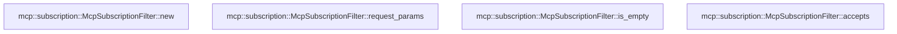

# mcp::subscription

[Package atlas](index.md) · [Source](../../src/subscription.rs)

## Declarations

Visibility is the declaration spelling; trait members and reexports require their enclosing interface. `cfg` is not evaluated.

| Symbol | Kind | Visibility | Test / cfg |
|---|---|---|---|
| [mcp::subscription::McpSubscriptionFilter](../../src/subscription.rs#L7) | struct_item | `pub` |  |
| [mcp::subscription::McpSubscriptionFilter::new](../../src/subscription.rs#L16) | function_item | `pub` |  |
| [mcp::subscription::McpSubscriptionFilter::request_params](../../src/subscription.rs#L48) | function_item | `pub` |  |
| [mcp::subscription::McpSubscriptionFilter::is_empty](../../src/subscription.rs#L51) | function_item | `pub` |  |
| [mcp::subscription::McpSubscriptionFilter::accepts](../../src/subscription.rs#L56) | function_item | `pub` |  |
| [mcp::subscription::tests::event](../../src/subscription.rs#L110) | function_item | `private` | test; #[cfg(test)] |
| [mcp::subscription::tests::subscription_requires_exact_identity_acknowledgement_and_requested_scope](../../src/subscription.rs#L116) | function_item | `private` | test; #[cfg(test)] |

## Imports / reexports

| Local name | Source path | Visibility |
|---|---|---|
| `McpCapabilities` | `crate::McpCapabilities` | `private` |
| `Value` | `serde_json::Value` | `private` |
| `json` | `serde_json::json` | `private` |
| `BTreeSet` | `std::collections::BTreeSet` | `private` |
| `*` | `super::*` | `private` |

## Module declarations

| Module | Visibility | Attributes |
|---|---|---|
| `mcp::subscription::tests` | `private` | #[cfg(test)] |

## Function call graphs

Edges below are syntactically resolved calls only, including private functions. Graphs partition callers into groups of 20; they are not execution order. All unresolved sites are listed below and in the JSON inventory.

Functions 1–4: 0 direct edges

## Call sites

Includes test functions (marked in declarations). Receiver-type-required sites need type analysis/manual tracing. Calls in closures are attributed to their enclosing function; their occurrence here does not mean the closure executes immediately.

| Caller | Callee expression | Source lines | Target / classification |
|---|---|---|---|
| `new` | `serde_json::Map::new` | [17](../../src/subscription.rs#L17) | external-constructor-callback-or-unresolved |
| `new` | `requested.insert` | [33](../../src/subscription.rs#L33), [38](../../src/subscription.rs#L38) | receiver-type-required |
| `new` | `name.into` | [33](../../src/subscription.rs#L33) | receiver-type-required |
| `new` | `resource_uris.is_empty` | [36](../../src/subscription.rs#L36) | receiver-type-required |
| `new` | `resource_uris.iter().collect` | [37](../../src/subscription.rs#L37) | receiver-type-required |
| `new` | `resource_uris.iter` | [37](../../src/subscription.rs#L37) | receiver-type-required |
| `new` | `"resourceSubscriptions".into` | [38](../../src/subscription.rs#L38) | receiver-type-required |
| `new` | `Value::Object` | [42](../../src/subscription.rs#L42) | external-constructor-callback-or-unresolved |
| `new` | `BTreeSet::new` | [44](../../src/subscription.rs#L44), [45](../../src/subscription.rs#L45) | external-constructor-callback-or-unresolved |
| `is_empty` | `self.requested             .as_object()             .is_none_or` | [52](../../src/subscription.rs#L52) | receiver-type-required |
| `is_empty` | `self.requested             .as_object` | [52](../../src/subscription.rs#L52) | receiver-type-required |
| `is_empty` | `value.is_empty` | [54](../../src/subscription.rs#L54) | receiver-type-required |
| `accepts` | `notification.get("id").is_some` | [59](../../src/subscription.rs#L59) | receiver-type-required |
| `accepts` | `notification.get` | [59](../../src/subscription.rs#L59) | receiver-type-required |
| `accepts` | `notification                 .pointer("/params/_meta/io.modelcontextprotocol~1subscriptionId")                 .and_then` | [60](../../src/subscription.rs#L60) | receiver-type-required |
| `accepts` | `notification                 .pointer` | [60](../../src/subscription.rs#L60) | receiver-type-required |
| `accepts` | `Some` | [63](../../src/subscription.rs#L63), [81](../../src/subscription.rs#L81) | external-constructor-callback-or-unresolved |
| `accepts` | `notification["method"].as_str().unwrap_or_default` | [67](../../src/subscription.rs#L67) | receiver-type-required |
| `accepts` | `notification["method"].as_str` | [67](../../src/subscription.rs#L67) | receiver-type-required |
| `accepts` | `self.requested.as_object().unwrap` | [72](../../src/subscription.rs#L72) | receiver-type-required |
| `accepts` | `self.requested.as_object` | [72](../../src/subscription.rs#L72) | receiver-type-required |
| `accepts` | `acknowledged[key]                             .as_array()                             .into_iter()                             .flatten()                             .filter_map` | [74](../../src/subscription.rs#L74) | receiver-type-required |
| `accepts` | `acknowledged[key]                             .as_array()                             .into_iter()                             .flatten` | [74](../../src/subscription.rs#L74) | receiver-type-required |
| `accepts` | `acknowledged[key]                             .as_array()                             .into_iter` | [74](../../src/subscription.rs#L74) | receiver-type-required |
| `accepts` | `acknowledged[key]                             .as_array` | [74](../../src/subscription.rs#L74) | receiver-type-required |
| `accepts` | `wanted.as_array().is_some_and` | [80](../../src/subscription.rs#L80) | receiver-type-required |
| `accepts` | `wanted.as_array` | [80](../../src/subscription.rs#L80) | receiver-type-required |
| `accepts` | `values.iter().any` | [81](../../src/subscription.rs#L81) | receiver-type-required |
| `accepts` | `values.iter` | [81](../../src/subscription.rs#L81) | receiver-type-required |
| `accepts` | `value.as_str` | [81](../../src/subscription.rs#L81) | receiver-type-required |
| `accepts` | `self.resources.insert` | [83](../../src/subscription.rs#L83) | receiver-type-required |
| `accepts` | `uri.into` | [83](../../src/subscription.rs#L83) | receiver-type-required |
| `accepts` | `self.accepted.insert` | [87](../../src/subscription.rs#L87) | receiver-type-required |
| `accepts` | `key.clone` | [87](../../src/subscription.rs#L87) | receiver-type-required |
| `accepts` | `self.accepted.contains` | [94](../../src/subscription.rs#L94), [95](../../src/subscription.rs#L95), [97](../../src/subscription.rs#L97) | receiver-type-required |
| `accepts` | `notification["params"]["uri"]                 .as_str()                 .is_some_and` | [99](../../src/subscription.rs#L99) | receiver-type-required |
| `accepts` | `notification["params"]["uri"]                 .as_str` | [99](../../src/subscription.rs#L99) | receiver-type-required |
| `accepts` | `self.resources.contains` | [101](../../src/subscription.rs#L101) | receiver-type-required |
| `subscription_requires_exact_identity_acknowledgement_and_requested_scope` | `Default::default` | [122](../../src/subscription.rs#L122) | external-constructor-callback-or-unresolved |
| `subscription_requires_exact_identity_acknowledgement_and_requested_scope` | `McpSubscriptionFilter::new` | [124](../../src/subscription.rs#L124), [155](../../src/subscription.rs#L155) | external-constructor-callback-or-unresolved |
| `subscription_requires_exact_identity_acknowledgement_and_requested_scope` | `"file:///one".into` | [124](../../src/subscription.rs#L124) | receiver-type-required |
| `subscription_requires_exact_identity_acknowledgement_and_requested_scope` | `event` | [126](../../src/subscription.rs#L126) | [mcp::subscription::tests::event](../../src/subscription.rs#L110) |
